# Consistent Hashing — High-Level Design

## Table of Contents
1. [Overview and Motivation](#overview-and-motivation)
2. [The Problem with Naive Modulo Hashing](#the-problem-with-naive-modulo-hashing)
3. [The Consistent Hashing Solution](#the-consistent-hashing-solution)
4. [The Hash Ring](#the-hash-ring)
5. [Adding and Removing Nodes](#adding-and-removing-nodes)
6. [Virtual Nodes (Vnodes)](#virtual-nodes-vnodes)
7. [Rebalancing](#rebalancing)
8. [The Hotspot Problem](#the-hotspot-problem)
9. [Implementation](#implementation)
10. [Real-World Systems](#real-world-systems)
11. [Consistent Hashing vs Rendezvous Hashing](#consistent-hashing-vs-rendezvous-hashing)
12. [Tradeoffs and Considerations](#tradeoffs-and-considerations)
13. [Best Practices](#best-practices)
14. [Case Study: Distributed Cache](#case-study-distributed-cache)
15. [Interview Questions](#interview-questions)

---

## Intuition

> **One-line analogy**: Consistent hashing is like arranging restaurants around a circular city map — when a new restaurant opens (node added), only nearby customers need to change their favorite restaurant, not everyone in the city.

**Mental model**: Naive hashing assigns each key to server `key % N`. When you add a server (N → N+1), every key remaps — massive cache misses and data rebalancing. Consistent hashing maps both keys and servers onto a ring. Each key goes to the nearest server clockwise. Adding a server only moves keys between the new server and its neighbor — only 1/N fraction of keys are affected. Virtual nodes ensure even distribution even with heterogeneous servers.

**Why it matters**: Consistent hashing enables adding/removing cache nodes (or distributed storage nodes) with minimal disruption. It's used in Cassandra, DynamoDB, Memcached, and CDN routing. Without it, horizontal scaling of caches and distributed storage would cause thundering herds of cache misses on every topology change.

**Key insight**: Virtual nodes (each physical server maps to V points on the ring) solve the load imbalance problem — without them, inconsistent key distribution between servers wastes capacity on some nodes and overloads others.

---

## Overview and Motivation

**Consistent hashing** is a distributed hashing technique that minimizes the number of keys that need to be remapped when the number of nodes in a distributed system changes (nodes added or removed).

It is a foundational algorithm in:
- Distributed caches (Memcached, Redis Cluster)
- Distributed databases (Amazon Dynamo, Apache Cassandra, Riak)
- Load balancers
- Content delivery networks

The core insight: by mapping both nodes and keys to the same circular space, only a small fraction of keys need to be moved when nodes join or leave.

---

## The Problem with Naive Modulo Hashing

### How naive hashing works:

Given N servers, assign a key to server `i` using:

```
server_index = hash(key) % N
```

### Example with 3 servers:

```
Keys: A, B, C, D, E, F, G, H

hash(A) = 10 --> 10 % 3 = 1 --> Server 1
hash(B) = 20 --> 20 % 3 = 2 --> Server 2
hash(C) = 30 --> 30 % 3 = 0 --> Server 0
hash(D) = 40 --> 40 % 3 = 1 --> Server 1
hash(E) = 50 --> 50 % 3 = 2 --> Server 2
```

### What happens when you add a 4th server?

```
hash(A) = 10 --> 10 % 4 = 2 --> Server 2  (MOVED from Server 1)
hash(B) = 20 --> 20 % 4 = 0 --> Server 0  (MOVED from Server 2)
hash(C) = 30 --> 30 % 4 = 2 --> Server 2  (MOVED from Server 0)
hash(D) = 40 --> 40 % 4 = 0 --> Server 0  (MOVED from Server 1)
hash(E) = 50 --> 50 % 4 = 2 --> Server 2  (MOVED from Server 2, stayed!)
```

**Nearly all keys are remapped.** In a distributed cache with millions of keys, this means:
- A thundering herd of cache misses simultaneously.
- All traffic hits the backend databases at once.
- Potential system-wide outage during scaling events.

### The magnitude of the problem:

When going from N to N+1 servers, fraction of keys moved = `N/(N+1)`.

| Before → After | Keys remapped |
|----------------|---------------|
| 3 → 4 servers  | ~75%          |
| 9 → 10 servers | ~90%          |
| 99 → 100 servers | ~99%        |

As the system grows, adding one server displaces almost all keys. This is catastrophic for any system relying on data locality.

**In plain terms.** "A key only stays put if the old server number and the new server number happen to agree — and with `N+1` boxes to land in, that happens for about one key in `N+1`."

Everything else moves. That framing matters because it says the damage is *not* proportional to how many servers you added; it is driven by the modulus changing at all. Adding one server to a 99-node cluster is just as destructive as rebuilding the cluster from scratch.

| Symbol | What it is |
|--------|------------|
| `hash(key)` | A big integer derived from the key. Fixed — it never changes |
| `N` | Server count *before* the change. The modulus |
| `N+1` | Server count *after* the change. The new, different modulus |
| `%` | Remainder after division — the only thing that picks the server |
| `N/(N+1)` | Fraction of keys that land somewhere new |
| `1/(N+1)` | The leftover fraction that happens to stay put |

**Walk one example.** The 5 keys from the table above, moving 3 servers to 4:

```
  key    hash    hash % 3   hash % 4   verdict
  ----   -----   --------   --------   -------------
  A         10          1          2   moved
  B         20          2          0   moved
  C         30          0          2   moved
  D         40          1          0   moved
  E         50          2          2   stayed (lucky)

  moved = 4 of 5 = 80% observed
  predicted N/(N+1) = 3/4 = 75%

  Scale it up: 99 -> 100 servers
    stays  = 1/100  =  1%
    moves  = 99/100 = 99%
```

One key in five survived here purely by chance; the formula says expect one in four. At 99 nodes that luck runs out entirely — 99% of a million-key cache evaporates in one deploy.

---

## The Consistent Hashing Solution

Consistent hashing maps both **nodes** and **keys** to the same circular hash space (the ring). When nodes change, only keys that were mapped to the affected arc of the ring need to move.

### Core property:

When going from N to N+1 servers, only `1/(N+1)` of keys need to move — the theoretically optimal amount.

| Before → After | Keys remapped (consistent hashing) | Keys remapped (modulo) |
|----------------|------------------------------------|------------------------|
| 3 → 4 servers  | ~25%                               | ~75%                   |
| 9 → 10 servers | ~10%                               | ~90%                   |
| 99 → 100 servers | ~1%                              | ~99%                   |

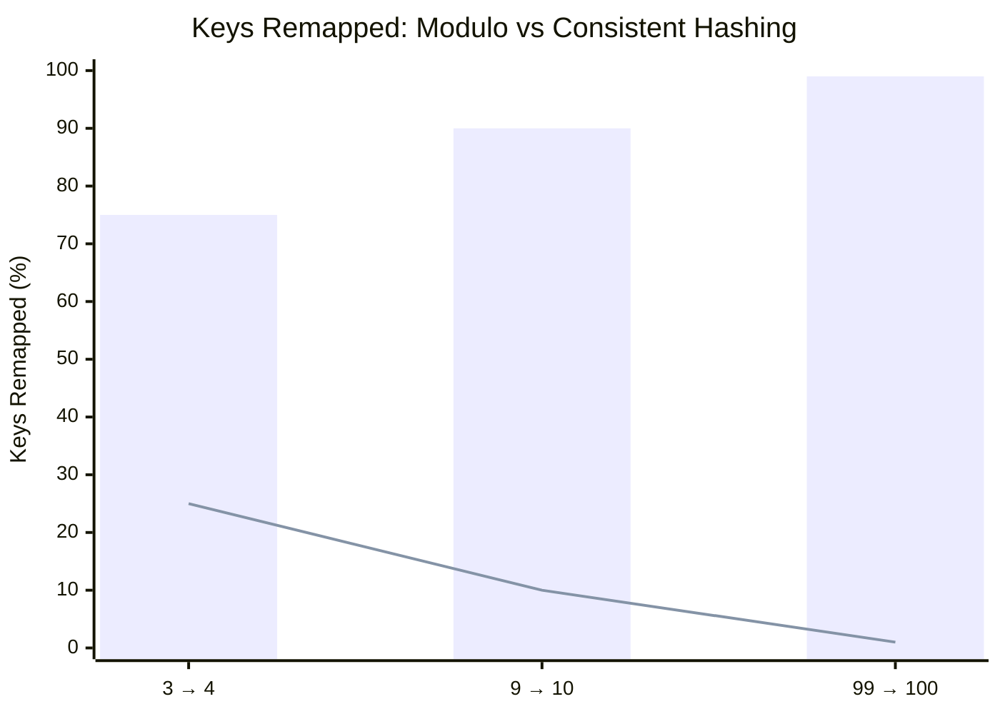

Bars = naive modulo hashing, climbing toward ~99% of keys remapped as the cluster grows; line = consistent hashing, staying near ~1% — this divergence is the entire reason consistent hashing exists.

**What this actually says.** "The new node has to be given *some* share of the data, and its fair share is one slot out of `N+1`. Consistent hashing moves exactly that share and not one key more."

This is a lower bound, not a clever trick: any scheme that ends with `N+1` equally loaded nodes must relocate at least `1/(N+1)` of the keys, because the newcomer starts empty. Modulo hashing moves `N/(N+1)`, which is the *same fraction inverted* — it does the maximum where the minimum was available.

| Symbol | What it is |
|--------|------------|
| `N` | Nodes before the change |
| `1/(N+1)` | Keys that must move — the new node's fair share |
| `N/(N+1)` | Keys that must move under modulo — everything else |
| ring arc | The slice of hash space a node owns; adding a node splits one arc |
| "optimal" | No correct scheme can move fewer keys than `1/(N+1)` |

**Walk one example.** Same three cluster sizes, both schemes side by side:

```
  N -> N+1     consistent 1/(N+1)     modulo N/(N+1)     ratio
  ---------    ------------------     --------------     -----
   3 ->  4       1/4  = 25%             3/4  = 75%          3x
   9 -> 10       1/10 = 10%             9/10 = 90%          9x
  99 -> 100      1/100 =  1%           99/100 = 99%        99x

  The waste ratio is exactly N. At 99 nodes, modulo hashing
  does 99 times more data movement than physics requires.
```

The penalty for modulo hashing is not a constant overhead — it grows linearly with cluster size, so the scheme gets worse precisely as the cluster gets more valuable.

---

## The Hash Ring

### How it works:

1. Define a hash space from `0` to `2^32 - 1` (or `2^64 - 1`), arranged as a circle.
2. Hash each node's identifier (IP address, hostname) and place it on the ring.
3. For each key, compute `hash(key)` and find the first node clockwise from that position.

**Read it like this.** "Take the hash's remainder against `2^32` so every key lands somewhere on a fixed 4.29-billion-position dial, then hand the key to whichever node's marker you meet first going clockwise."

The critical difference from `% N` is *what* you divide by. Here the modulus is `2^32` — a constant of the ring, not a function of the cluster. Nodes come and go and every key's position on the dial is unchanged; only the ownership boundaries move.

| Symbol | What it is |
|--------|------------|
| `2^32` | Ring size — `4,294,967,296` positions, numbered `0` to `2^32 - 1` |
| `hash(key) mod 2^32` | The key's fixed address on the dial. Independent of node count |
| `hash(node_id) mod 2^32` | A node's marker on the same dial |
| clockwise successor | First node marker at or after the key's position |
| wrap-around | Past `2^32 - 1` you return to `0`; the dial has no end |

**Walk one example.** The four node positions listed below, plus two keys:

```
  ring size = 2^32 = 4,294,967,296 positions (0 .. 4,294,967,295)

  node markers (sorted)   A: 90    B: 200    C: 250    D: 300

  key K1, hash = 210
    scan clockwise: 250 is the first marker >= 210   -> Node C
  key K2, hash = 280
    scan clockwise: 300 is the first marker >= 280   -> Node D
  key K9, hash = 4,294,967,000
    scan clockwise: no marker >= that -> wrap to 0 -> first marker 90 -> Node A

  Now delete Node C. K1 rescans from 210 -> next marker 300 -> Node D.
  K2 and K9 do not move at all: their successors were never C.
```

Removing a node re-homed exactly the keys that pointed at it. Under `% N` that same deletion would have changed the modulus and shuffled K2 and K9 too, for no reason.

### Visual representation:

```
                      0
                   /     \
              2^32/4       |
                /          |
               /    Ring   |
              /            |
           Node A (h=90)   Node B (h=200)
            /                    \
           /                      \
   Key K3 (h=80)         Key K1 (h=210)
   --> goes to Node A     --> goes to Node B
          \                       /
           \                     /
            Node D (h=300)  Node C (h=250)
                \               /
                 \             /
                  \           /
            Key K2 (h=280)
            --> goes to Node D
                  2^32
```

### Step-by-step lookup:

```
Ring positions (sorted):
  Node A: 90
  Node B: 200
  Node C: 250
  Node D: 300

Lookup key K1 with hash 210:
  Scan clockwise from 210...
  Next node at 250 = Node C
  --> K1 maps to Node C

Lookup key K2 with hash 280:
  Scan clockwise from 280...
  Next node at 300 = Node D
  --> K2 maps to Node D

Lookup key K3 with hash 320 (wraps around to 90):
  Scan clockwise from 320...
  No nodes from 320 to 2^32, wrap to 0...
  First node at 90 = Node A
  --> K3 maps to Node A
```

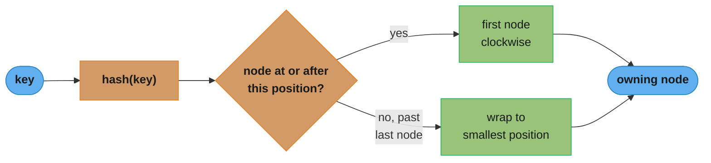

Every lookup is one ceiling search on the sorted ring: hash the key, jump to the first node at or after that position, and wrap to the smallest position if the hash falls past the last node — exactly the `ceilingEntry` / `firstEntry` fallback used in the implementation below.

---

## Adding and Removing Nodes

### Adding a node:

Only keys in the arc immediately counter-clockwise of the new node need to move.

```mermaid
flowchart LR
    classDef io      fill:#61afef,stroke:#2e86c1,color:#1a1a1a,font-weight:bold
    classDef frozen  fill:#c678dd,stroke:#9b59b6,color:#fff
    classDef train   fill:#98c379,stroke:#27ae60,color:#1a1a1a
    classDef mathOp  fill:#d19a66,stroke:#e67e22,color:#1a1a1a,font-weight:bold
    classDef lossN   fill:#e06c75,stroke:#c0392b,color:#fff,font-weight:bold
    classDef req     fill:#56b6c2,stroke:#0097a7,color:#1a1a1a
    classDef base    fill:#e5c07b,stroke:#f39c12,color:#1a1a1a

    subgraph before1["Before: 3 nodes"]
        direction LR
        a1["Node A<br/>pos 100"] -->|"owns arc to 200"| b1["Node B<br/>pos 200"]
        b1 -->|"owns arc to 300"| c1["Node C<br/>pos 300"]
    end

    subgraph after1["After: Node D added at 150"]
        direction LR
        a2["Node A<br/>pos 100"] -->|"unchanged"| d2["Node D<br/>pos 150 (new)"]
        d2 -->|"new arc,<br/>taken from B"| b2["Node B<br/>pos 200"]
        b2 -->|"shrunk arc"| c2["Node C<br/>pos 300"]
    end

    before1 ~~~ after1

    class a1,b1,c1,a2,b2,c2 base
    class d2 train
```

Only the arc between B and the new Node D — keys in `(100, 150]` — migrates: roughly 1/4 of B's previous keys, matching the theoretical 1/(N+1) bound.

### Removing a node (failure or decommission):

Only keys that were mapped to the removed node need to move — to the next node clockwise.

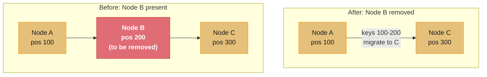

Only B's keys (positions 100–200) move to C; A's and C's existing keys are untouched.

### Visual:

```
BEFORE removing Node B:

       A           B           C
    (pos:100)   (pos:200)   (pos:300)
       |     <B>    |     <B>    |
  ...--+---+---+---+---+---+---+--...
          K1  K2   K3  K4


AFTER removing Node B:

       A                   C
    (pos:100)           (pos:300)
       |          <C>          |
  ...--+---+---+---+---+---+---+--...
          K1  K2   K3  K4
               ^---^---- K2, K3 now go to C
```

---

## Virtual Nodes (Vnodes)

### The problem with few physical nodes:

With only a few nodes, placing them on the ring by hashing their ID leads to uneven distribution. One node might own 60% of the ring while another owns 5%.

```
Uneven distribution (3 physical nodes):

             0
          /     \
   Node C        Node A
  (owns 60%)    (owns 25%)
          \     /
          Node B
         (owns 15%)
```

This leads to uneven load — some servers handle much more traffic and store more data.

### Virtual nodes solution:

Each physical node is represented by **multiple virtual nodes** on the ring. The virtual nodes are distributed across the ring, so each physical node owns many small, spread-out arcs rather than one large arc.

```
Physical nodes: A, B, C
Virtual nodes per physical node: 3 each

Ring positions (sorted):
  A_1:  45     B_1:  90     C_1: 130
  A_2: 180     B_2: 220     C_2: 270
  A_3: 310     B_3: 340     C_3: 380

Each arc between adjacent vnodes is owned by the
physical node the vnode belongs to:
  (380, 45]  --> A (A_1)
  (45,  90]  --> B (B_1)
  (90, 130]  --> C (C_1)
  (130, 180] --> A (A_2)
  (180, 220] --> B (B_2)
  (220, 270] --> C (C_2)
  (270, 310] --> A (A_3)
  (310, 340] --> B (B_3)
  (340, 380] --> C (C_3)
```

Physical node ownership becomes roughly equal (each owns ~1/3 of the ring).

### Visual comparison:

```
WITHOUT vnodes (uneven):
Ring: ----[A]----------[B]--[C]----[A]----...
           ^big arc         ^tiny arcs

WITH vnodes (even):
Ring: -[A1]-[B1]-[C1]-[A2]-[B2]-[C2]-[A3]-[B3]-[C3]-...
       ^equal arcs, each physical node gets ~equal share
```

### Configuring vnode count:

- **Amazon Dynamo**: 150 virtual nodes per physical node.
- **Apache Cassandra**: configurable, default 256 vnodes per node.
- **More vnodes**: better load balance, but more overhead (ring size, rebalancing tracking).
- **Fewer vnodes**: less overhead, but uneven distribution.

Rule of thumb: 100–200 vnodes per physical node is a good default.

### Effect of vnode count on distribution:

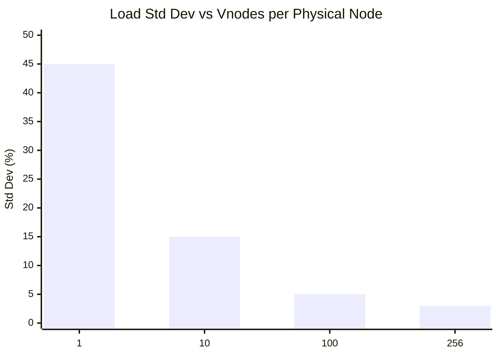

Standard deviation of load drops from 45% at 1 vnode/node to just 3% at 256 — this is why Cassandra defaults to hundreds of vnodes per physical node.

**The idea behind it.** "Owning one random arc is a single coin flip and can go badly wrong; owning `V` independent random arcs averages `V` coin flips, and averages of `V` samples spread out about `sqrt(V)` times less than one sample does."

That is the standard averaging result — imbalance shrinks with `1/sqrt(V)`, not with `1/V`. The square root is the whole story of vnode tuning: it is why the first few vnodes buy enormous improvement and why going from 100 to 256 barely registers.

| Symbol | What it is |
|--------|------------|
| `V` | Virtual nodes per physical node — 150 in Dynamo, 256 in Cassandra |
| load std dev | Spread of per-node load around the fair share, as a percent |
| `1/sqrt(V)` | The shrink factor. Quadruple `V` to halve the spread |
| `sqrt(V)` | 1, 3.16, 10, 16 for V = 1, 10, 100, 256 |
| baseline 45% | The measured spread at `V = 1`, one arc per node |

**Walk one example.** Start from the 45% baseline and divide by `sqrt(V)`:

```
  V      sqrt(V)     45 / sqrt(V)     chart value
  ---    -------     ------------     -----------
    1       1.00        45.00%            45%
   10       3.16        14.23%            15%
  100      10.00         4.50%             5%
  256      16.00         2.81%             3%

  Diminishing returns, priced out:
    V:   1 ->  10   costs   9 extra vnodes,  saves 30 points of spread
    V: 100 -> 256   costs 156 extra vnodes,  saves  1.7 points
```

The model reproduces every bar in the chart. It also explains the "100-200 vnodes" rule of thumb above: past `V = 100` you are paying linearly in ring entries, gossip traffic, and rebalancing bookkeeping to buy fractions of a percent of balance.

---

## Rebalancing

When the ring topology changes (node added/removed), only a subset of keys need to migrate.

### Migration process on node addition:

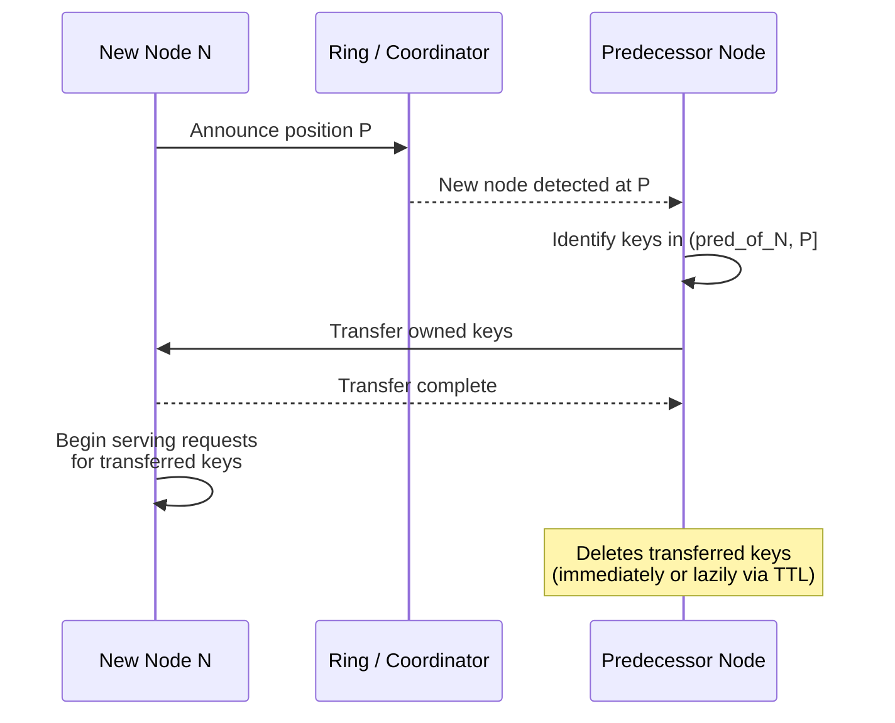

The predecessor streams only the keys in its own `(predecessor, P]` arc to the new node — every other node on the ring is untouched during the handoff.

### Migration with vnodes:

With vnodes, a new physical node places V virtual nodes on the ring. Each vnode receives keys from a different predecessor. Data migration happens from V different source nodes in parallel.

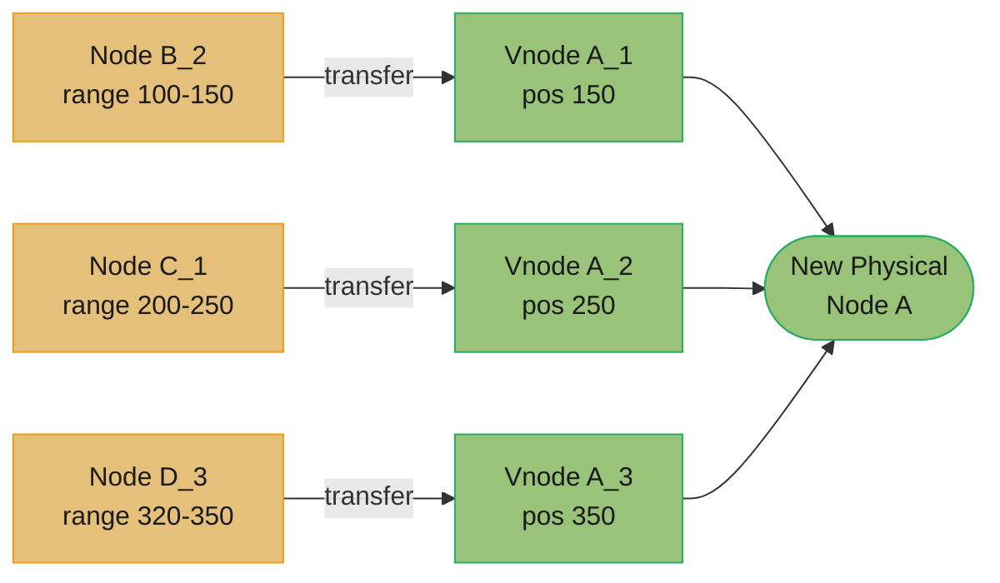

Each of the new node's 3 vnodes pulls from a different predecessor, so the transfers run concurrently instead of bottlenecking on one source node.

This is a significant advantage: migration bandwidth is distributed across many nodes rather than one overloaded source.

---

## The Hotspot Problem

### What is a hotspot?

A hotspot occurs when a disproportionate amount of traffic goes to a single node, typically because:
1. Key distribution is skewed (a few keys are extremely popular — "celebrity" keys).
2. The hash function distributes keys unevenly.
3. A single node has too large an arc on the ring.

### Solutions:

**1. Key hashing with salt (address popularity skew)**

For extremely popular keys (e.g., `celebrity_user_123`), append a random suffix before hashing:
```
shard_key = hash("celebrity_user_123_" + random_suffix(0, num_shards))
```
This spreads a single logical key across multiple physical shards. Requires the application to know how many shards and scatter-gather reads.

**2. Virtual nodes (address ring arc imbalance)**

More vnodes = smaller, more even arcs. Reduces the probability of any single physical node owning an outsized arc.

**3. Request rate limiting per key**

At the application layer, rate-limit requests for known hot keys and serve from an in-process cache.

**4. Dedicated hot key handling**

Detect hot keys dynamically (e.g., keys with > 1000 req/sec). Route them to a dedicated tier of nodes rather than the general ring.

---

## Implementation

### Data structure: Sorted Map (TreeMap)

The ring is implemented as a sorted map from integer position to node identifier. A `TreeMap` in Java (or `SortedDict` / bisect in Python) provides O(log N) lookup via binary search.

### Java Pseudocode

```java
import java.util.TreeMap;
import java.security.MessageDigest;

public class ConsistentHash<T> {

    // The ring: position -> node
    private final TreeMap<Long, T> ring = new TreeMap<>();
    private final int numVirtualNodes;

    public ConsistentHash(int numVirtualNodes) {
        this.numVirtualNodes = numVirtualNodes;
    }

    // Add a physical node to the ring
    public void addNode(T node) {
        for (int i = 0; i < numVirtualNodes; i++) {
            // Hash "node_i" to get the position on the ring
            long position = hash(node.toString() + "#" + i);
            ring.put(position, node);
        }
    }

    // Remove a physical node from the ring
    public void removeNode(T node) {
        for (int i = 0; i < numVirtualNodes; i++) {
            long position = hash(node.toString() + "#" + i);
            ring.remove(position);
        }
    }

    // Get the node responsible for a given key
    public T getNode(String key) {
        if (ring.isEmpty()) return null;

        long position = hash(key);

        // Find the first node at or after this position (clockwise)
        Map.Entry<Long, T> entry = ring.ceilingEntry(position);

        // If none found, wrap around to the first node
        if (entry == null) {
            entry = ring.firstEntry();
        }

        return entry.getValue();
    }

    // MD5-based hash function returning a long
    private long hash(String key) {
        try {
            MessageDigest md = MessageDigest.getInstance("MD5");
            byte[] digest = md.digest(key.getBytes("UTF-8"));
            // Take first 8 bytes as a long
            long h = 0;
            for (int i = 0; i < 8; i++) {
                h = (h << 8) | (digest[i] & 0xFF);
            }
            return h;
        } catch (Exception e) {
            throw new RuntimeException(e);
        }
    }
}
```

### Time Complexities

| Operation           | Time Complexity     | Notes                                       |
|---------------------|---------------------|---------------------------------------------|
| `addNode`           | O(V log(N*V))       | V virtual nodes inserted, each O(log ring)  |
| `removeNode`        | O(V log(N*V))       | V virtual nodes removed                     |
| `getNode` (lookup)  | O(log(N*V))         | Binary search on sorted ring                |
| Space               | O(N * V)            | N physical nodes, V vnodes each             |

Where N = number of physical nodes, V = vnodes per physical node.

**Put simply.** "The ring holds `N x V` sorted entries, so any single lookup is one binary search over that list — and adding or removing a whole machine is just `V` of those searches, one per virtual node."

The point of writing the complexity as `log(N*V)` rather than `log N` is that vnodes inflate the structure you search. Raising `V` to buy load balance is not free — it costs ring memory linearly and lookup time logarithmically, which is why the logarithm makes generous `V` affordable at all.

| Symbol | What it is |
|--------|------------|
| `N` | Physical nodes in the cluster |
| `V` | Virtual nodes per physical node |
| `N*V` | Total entries in the sorted ring — what you binary-search |
| `O(log(N*V))` | Lookup cost: comparisons to find the clockwise successor |
| `O(V log(N*V))` | Add/remove a machine: `V` inserts, each a search plus a write |
| `O(N*V)` | Memory: one position-to-node entry per virtual node |

**Walk one example.** The cache cluster from the case study below — 8 nodes at 160 vnodes each:

```
  ring entries  N x V = 8 x 160          = 1,280
  lookup        log2(1,280)              ~ 10.3 comparisons

  add the 9th node (160 vnode inserts):
    ring entries after   9 x 160         = 1,440
    work  V x log2(N*V) = 160 x ~10.5    ~ 1,680 comparisons

  grow the ring 50% to 12 x 160 = 1,920 entries:
    lookup log2(1,920)                   ~ 10.9 comparisons
```

Half again as much ring bought 0.6 of one extra comparison. That is the practical takeaway: lookup cost is effectively flat as the cluster grows, so vnode counts in the hundreds cost memory, not latency.

### Python Pseudocode

```python
import hashlib
import bisect

class ConsistentHashRing:
    def __init__(self, nodes=None, num_vnodes=150):
        self.num_vnodes = num_vnodes
        self.ring = {}          # position -> node_id
        self.sorted_positions = []  # sorted list of positions

        if nodes:
            for node in nodes:
                self.add_node(node)

    def _hash(self, key: str) -> int:
        return int(hashlib.md5(key.encode()).hexdigest(), 16)

    def add_node(self, node: str):
        for i in range(self.num_vnodes):
            pos = self._hash(f"{node}#{i}")
            self.ring[pos] = node
            bisect.insort(self.sorted_positions, pos)

    def remove_node(self, node: str):
        for i in range(self.num_vnodes):
            pos = self._hash(f"{node}#{i}")
            del self.ring[pos]
            self.sorted_positions.remove(pos)

    def get_node(self, key: str) -> str:
        if not self.ring:
            return None
        pos = self._hash(key)
        idx = bisect.bisect(self.sorted_positions, pos)
        # Wrap around
        idx = idx % len(self.sorted_positions)
        return self.ring[self.sorted_positions[idx]]
```

---

## Real-World Systems

### Amazon Dynamo (2007 Paper)

The original paper that popularized consistent hashing for distributed databases. Key design choices:
- Each node is assigned 150 virtual nodes on the ring.
- Replication factor of 3: a key is stored on the node responsible for it plus the next 2 nodes clockwise (preference list).
- Nodes detect ring membership changes via a gossip protocol.
- Eventual consistency with vector clocks for conflict resolution.

The Dynamo paper is one of the most influential system design papers. DynamoDB, Cassandra, and Riak all derive from its ideas.

### Apache Cassandra

Cassandra uses consistent hashing with configurable vnodes (default: 256 per node). Key choices:
- Uses Murmur3 hash function for better distribution than MD5.
- Token assignment is managed by the Cassandra cluster itself (vnodes).
- Replication factor (RF) configurable per keyspace; keys replicate to RF consecutive ring owners.
- Gossip protocol for node discovery and ring state propagation.

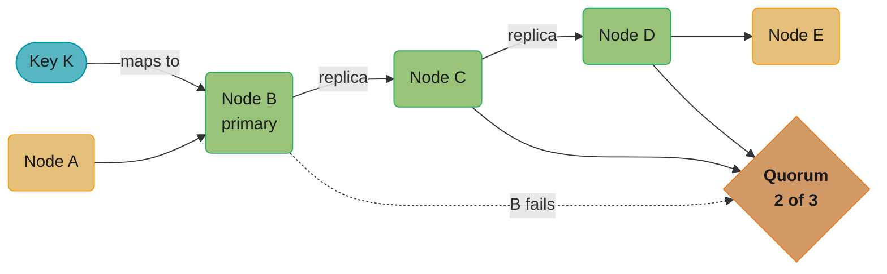

K's replica set is B plus the next two clockwise — C and D (RF=3); if B fails, C and D still form a quorum (2 of 3) so reads and writes continue.

### Memcached (libketama)

Memcached does not have built-in consistent hashing — it is implemented in the client library. The most popular implementation is **ketama**, developed at Last.fm.

- Maps each server to 160 virtual nodes on the ring.
- When a server is added or removed, only ~1/N of keys miss (go to the wrong server) rather than all of them.
- This dramatically reduces cache miss spikes during cluster changes.

### Riak

Riak is a distributed key-value store based on the Dynamo paper. It uses a fixed ring of **160-bit hash space** divided into **2^10 = 1024 equal partitions**. Physical nodes are assigned partitions round-robin. Adding a node reassigns a proportional number of partitions to the new node.

### Redis Cluster

Redis Cluster uses a hybrid approach: a fixed set of **16384 hash slots** (not a continuous ring). Each node is responsible for a range of slots. Keys are mapped to slots via `CRC16(key) % 16384`. This is simpler than a full consistent hash ring but achieves similar properties.

---

## Consistent Hashing vs Rendezvous Hashing

**Rendezvous hashing** (also called highest random weight hashing) is an alternative algorithm that achieves the same minimal disruption property.

### How Rendezvous Hashing works:

For each key K, compute a score for every node N: `score(K, N) = hash(K + N)`. Assign K to the node with the highest score.

```python
def get_node_rendezvous(key, nodes):
    scores = {node: hash(key + node) for node in nodes}
    return max(scores, key=scores.get)
```

### Comparison:

| Dimension                  | Consistent Hashing (Ring)          | Rendezvous Hashing                  |
|----------------------------|------------------------------------|-------------------------------------|
| Disruption on node change  | O(1/N) keys move                   | O(1/N) keys move                    |
| Lookup time                | O(log N) (sorted ring)             | O(N) (score all nodes)              |
| Memory                     | O(N * V) for vnodes                | O(N) just store node list           |
| Load balancing             | Requires vnodes for even dist.     | Naturally even without vnodes       |
| Weighted nodes             | Proportional vnode count           | Weighted scores, natural            |
| Replicas                   | Next K nodes clockwise             | Top K highest-scoring nodes         |
| Suitability                | Very large N (1000+ nodes), caches | Small-medium N, CDN routing         |

Rendezvous hashing has better natural load balance but O(N) lookup cost makes it impractical for very large node sets. Consistent hashing with vnodes is preferred for distributed databases and caches.

---

## Tradeoffs and Considerations

| Consideration               | Notes                                                                      |
|-----------------------------|----------------------------------------------------------------------------|
| Vnode count vs overhead     | More vnodes = better balance, more ring management cost                    |
| Hash function choice        | MD5 is common but Murmur3/xxHash are faster and better distributed         |
| Replication complexity      | Replication across ring adds complexity; prefer next-K-nodes strategy      |
| Hot key handling            | Consistent hashing does not solve popularity skew; need separate mechanism |
| Node heterogeneity          | Assign proportional vnodes to more powerful nodes for weighted distribution|
| Ring gossip convergence     | In large clusters, membership changes take time to propagate via gossip    |
| Split brain                 | Ring partitions (network splits) require a separate quorum mechanism       |
| Adding many nodes at once   | Gradual addition is safer than adding 50% new nodes simultaneously        |

---

## Best Practices

### Vnode Count
Use 150–256 virtual nodes per physical node. More than 256 provides diminishing returns on distribution while increasing ring management overhead. Tune based on the actual standard deviation of key distribution observed in production.

### Replication Factor
Set replication factor (RF) to 3 for production systems. RF=3 tolerates 2 simultaneous node failures while still achieving a read/write quorum of 2. Never use RF=1 in production.

### Hash Function
Prefer Murmur3 or xxHash over MD5 or SHA-1. They are faster (critical in high-throughput lookups), have better avalanche properties, and are deterministic across platforms.

### Monitoring
- **Ring balance**: monitor the percentage of ring owned by each physical node. Alert if any node owns more than `2x * (1/N)` of the ring.
- **Key distribution**: track actual request/storage distribution across nodes. Imbalance in keys does not always match ring imbalance (hot keys).
- **Rebalancing duration**: track how long node additions take to complete data migration. Long migrations can cause degraded performance.

### Heterogeneous Hardware
If nodes have different capacities (e.g., 32 GB vs 64 GB RAM), assign proportionally more vnodes to larger nodes:
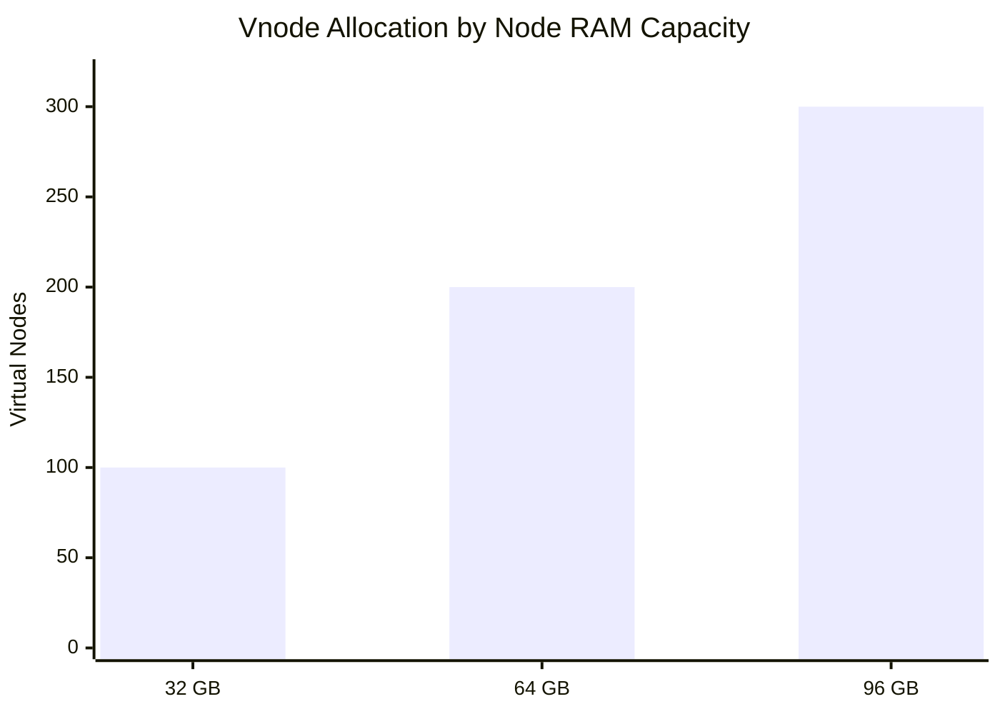
This naturally routes proportionally more traffic to larger nodes.

### Graceful Node Removal
Before decommissioning a node, first transfer its data to its successor(s). Then remove the node from the ring. This prevents a period where data is unavailable. Most production systems (Cassandra, Dynamo) support this as a first-class decommission operation.

---

## Cross-Perspective: LLD Connections

**LLD View — Design Patterns That Implement Consistent Hashing**

- **Strategy** — The hash function (MD5, SHA-1, xxHash, MurmurHash) is a Strategy: the ring uses a `HashFunction` interface, making it straightforward to swap algorithms without rebuilding the ring data structure.
- **Iterator** — Finding the responsible node for a key iterates clockwise around the virtual node ring until reaching the first node at or after the hash position — a custom Iterator over a `TreeMap<Long, Node>` sorted by hash position.
- **Singleton** — The hash ring is typically a Singleton: one shared ring instance manages all node-to-key mappings, updated via node join/leave events from the cluster coordinator (ZooKeeper, etcd).

---

**Cross-references:** [database/sharding_and_partitioning](../../database/sharding_and_partitioning/) (partitioning strategies that build on consistent hashing), [database/key_value_stores](../../database/key_value_stores/) (DynamoDB/Cassandra ring implementations), [database/newsql_and_distributed_sql](../../database/newsql_and_distributed_sql/).

---

## Case Study: Distributed Cache

### Context
A social media platform has a large distributed Memcached cluster for caching user profile data. The cluster starts with 8 nodes handling 500,000 cache lookups/sec. Due to user growth, the team needs to add 4 new nodes.

### Problem with Naive Hashing (Before Consistent Hashing)

Adding 4 nodes changes N from 8 to 12. With modulo hashing:
```
Fraction of keys remapped = 8/12 = ~67%
```
500,000 * 0.67 = 335,000 cache misses/sec suddenly hit the database.
The database handles ~50,000 queries/sec. Instant overload, cascading failure.

### Solution with Consistent Hashing

```
Initial state: 8 nodes, ~160 vnodes each (1280 total)

Ring:
  [C1_1]-[C2_1]-[C3_1]-[C4_1]-[C5_1]-[C6_1]-[C7_1]-[C8_1]
  [C1_2]-[C2_2]-[C3_2]-...(160 vnodes per node)

Add Node C9 (with 160 vnodes):
  Each vnode of C9 takes ownership from its predecessor.
  Expected fraction moved: 1/(8+1) = ~11%

500,000 * 0.11 = 55,000 cache misses/sec
Database comfortably handles this with headroom.
```

### Migration procedure:

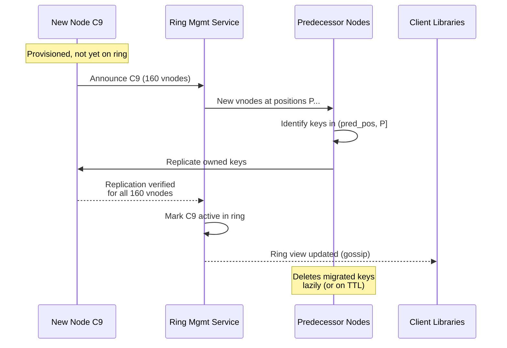

Replication runs per-vnode against each of C9's 160 predecessors; only after every vnode's transfer is verified does the ring management service mark C9 active and gossip the new view to clients.

### Outcome:

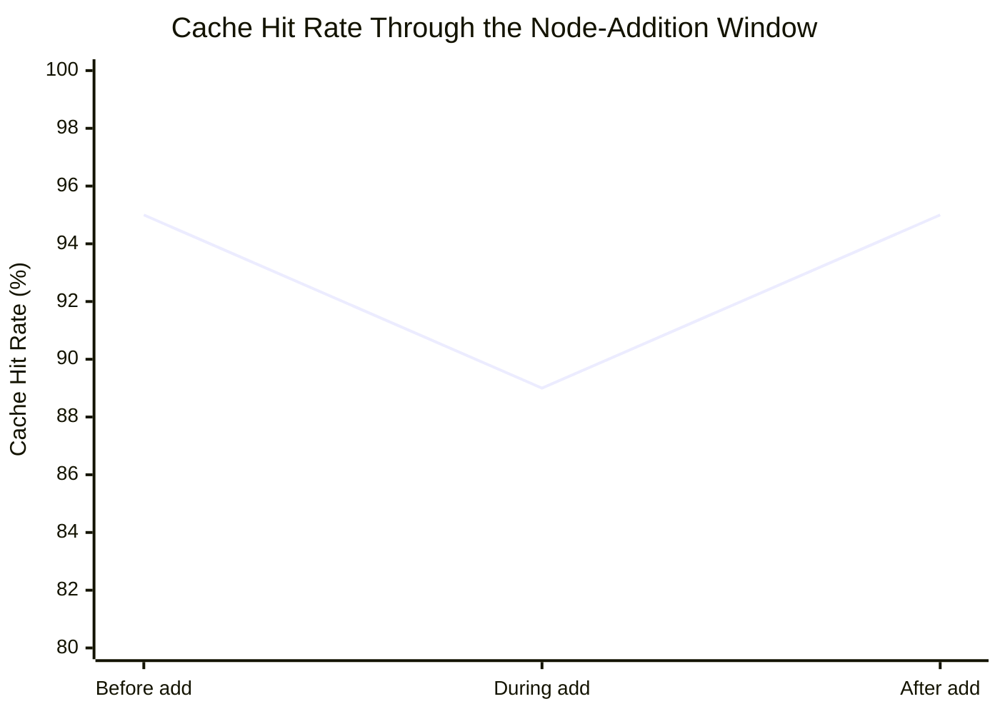

Hit rate dips from 95% to ~89% only during the ~30-second window while 8 nodes become 9, then fully recovers; database load in that window is ~55,000 QPS — versus the ~335,000 QPS a naive modulo-hash resize would have caused (see the naive-hashing problem above).

Adding new nodes in groups of 1–2 at a time, with monitoring between each addition, is the safe operational practice.

**Stated plainly.** "Every key that gets remapped becomes one cache miss, and every cache miss becomes one database query — so the remap fraction is a direct multiplier on database load during a resize."

That is the whole reason this is an availability problem and not a housekeeping problem. The remap fraction never touches the database directly; it converts, one-for-one, into read traffic that the cache was absorbing a moment earlier.

| Symbol | What it is |
|--------|------------|
| `R` | Cache lookup rate — 500,000 lookups/sec here |
| remap fraction | Share of keys that changed owner during the resize |
| miss surge | `R x remap fraction` — extra queries/sec arriving at the database |
| DB ceiling | What the database can actually serve — ~50,000 queries/sec |
| headroom | `DB ceiling - miss surge`. Negative means cascading failure |

**Walk one example.** The same 500,000 lookups/sec, resized both ways:

```
  modulo hashing, 8 -> 12 nodes
    remap fraction  = 8/12          = 0.67
    miss surge      = 500,000 x 0.67 = 335,000 q/s
    DB ceiling                        =  50,000 q/s
    headroom        = 50,000 - 335,000 = -285,000  -> 6.7x over. Outage.

  consistent hashing, 8 -> 9 nodes
    remap fraction  = 1/(8+1)        = 0.11
    miss surge      = 500,000 x 0.11 =  55,000 q/s
    spread over the ~30s migration window, absorbed by
    the 95% -> 89% hit-rate dip, not by a hard cutover

  ratio of the two surges: 335,000 / 55,000 = 6.1x less database load
```

Note the second row is still marginally above the 50,000 q/s ceiling on paper — that is exactly why the guidance is to add 1–2 nodes at a time and watch. The arithmetic gives you the size of the risk; it does not remove it.

---

## Interview Questions

**Q1: What is the problem with using `hash(key) % N` for distributed systems?**
When N changes (node added or removed), nearly all keys remap to different nodes (up to `(N-1)/N` fraction). For a distributed cache this means a thundering herd of cache misses simultaneously hitting the backend database, causing overload and cascading failures.

**Q2: How does consistent hashing solve the remapping problem?**
Both nodes and keys are mapped to the same circular hash space. A key is assigned to the first node clockwise from its hash position. When a node is added, only keys in the arc immediately preceding it move (to the new node). When a node is removed, only its keys move (to the next node). Total disruption is O(1/N) — the theoretical minimum.

**Q3: What happens when a node is added to a consistent hash ring?**
The new node's position on the ring is determined by hashing its ID. It takes ownership of keys in the arc between its predecessor and its position. Only those keys need to migrate from the predecessor to the new node. All other nodes are unaffected.

**Q4: What are virtual nodes and why are they needed?**
Virtual nodes (vnodes) are multiple positions on the ring assigned to each physical node. With only a few physical nodes, the ring arc sizes are highly uneven due to hash collisions — one node might own 60% of the ring. Vnodes distribute each physical node's ownership across many small arcs, resulting in even load distribution. Amazon Dynamo uses 150 vnodes per physical node.

**Q5: What is the time complexity of a lookup in a consistent hash ring?**
O(log(N * V)) where N is the number of physical nodes and V is the number of virtual nodes per physical node. The ring is a sorted data structure (TreeMap / sorted array); lookup uses binary search to find the first node at or after the key's hash position.

**Q6: How do you handle replication in consistent hashing?**
The standard approach (used by Dynamo, Cassandra) is to store copies on the next R nodes clockwise from the primary node, forming a "preference list." For a key mapping to node A, with RF=3, the key is also stored on nodes B and C (next two clockwise). Reads and writes require a quorum (typically RF/2 + 1 nodes).

**Q7: What is a hotspot in consistent hashing and how do you mitigate it?**
A hotspot occurs when a single node receives disproportionate traffic, either due to uneven ring arc sizes (mitigated by vnodes) or because certain keys are much more popular than others (popularity skew). For popular keys, solutions include: key splitting (appending a shard suffix), maintaining a dedicated hot-key cache tier, or application-level rate limiting.

**Q8: How does consistent hashing compare to Rendezvous hashing?**
Both achieve O(1/N) key disruption on node changes. Rendezvous hashing has better natural load balance without needing vnodes, but has O(N) lookup cost (must score all nodes per key). Consistent hashing with vnodes has O(log N) lookup and is preferred for large clusters. Rendezvous hashing suits CDN routing where N is small.

**Q9: Why does Cassandra use Murmur3 instead of MD5 for hashing?**
Murmur3 is significantly faster than MD5 (no cryptographic overhead), has better avalanche properties (small key changes produce very different hashes), and produces a more uniform distribution across the hash space. MD5 has measurable clustering bias that leads to uneven partition assignment. SHA-1/SHA-256 are even slower and unnecessary since cryptographic security is not needed.

**Q10: How do you handle heterogeneous nodes (different hardware capacities) in a consistent hash ring?**
Assign vnodes proportionally to the node's capacity. A node with 2x the RAM and CPU receives 2x the number of virtual nodes, so it naturally owns twice the arc space and handles twice the traffic. This is supported natively in Cassandra via manual token assignment or proportional vnode allocation.

**Q11: How would you implement a consistent hash ring in production? What monitoring would you set up?**
Implement using a TreeMap keyed by hash position. Monitor: (a) arc size per physical node — alert if any node owns more than 2x its fair share; (b) actual request distribution vs expected distribution; (c) rebalancing duration when nodes join/leave; (d) key migration throughput. Use Murmur3, 150–256 vnodes, and test ring balance distribution before deploying to production.

**Q12: What happens during a network partition in a consistent hash ring?**
Consistent hashing defines data placement but not consistency guarantees. During a partition, different nodes may disagree on ring membership. Systems like Dynamo/Cassandra use gossip protocols for eventual membership convergence and quorum reads/writes to tolerate node unavailability. The ring itself does not provide consistency — the application layer (quorum, vector clocks, conflict resolution) handles split-brain scenarios.

**Q13: Why would you choose a composite partition key like `(user_id, day_bucket)` over a raw `user_id` or a random UUID for a time-series events table?**
A raw `user_id` creates unbounded partitions for power users, while a random UUID scatters every read across the cluster. Without a shared partition key to route on, a UUID-keyed table turns "get this user's events" into a scatter-gather query across every node instead of a single-partition lookup. The Cassandra ring case study's Key Design Decision #3 bounds this by combining `user_id` with a `day_bucket`, capping each partition at roughly one user's daily event volume (~50 KB) — small enough to avoid hotspots, large enough that a "get today's events for this user" query still lands on a single partition. Compute expected partition size at your target retention and write rate before picking the bucket granularity — hourly versus daily buckets change partition size by 24x.

**Q14: A cluster configured with only 8 vnodes per physical node saw one node hold 31% of the data — why, and how do you fix it?**
Too few vnodes means each node's ownership is just a handful of randomly-placed arcs, which stay uneven until you have many of them. The consistent-hashing Cassandra case study hit exactly this: 8 vnodes per node was chosen "for faster repair," but one node ended up owning 31% of the ring, hit its disk-IOPS limit, and p99 latency spiked to 200ms. The fix was raising vnode count to 256 — the module's vnode-count chart shows load std dev dropping from 45% at 1 vnode to 3% at 256 — and decommissioning the hot node so the cluster could rebalance, which took roughly 6 hours. Vnode count is a balance-vs-overhead dial: too few causes hotspots like this one, while too many (4096+) increases gossip and repair overhead for diminishing balance gains.

**Q15: How does Redis Cluster's hash-slot design differ from a classic consistent-hash ring?**
Redis Cluster divides the keyspace into a fixed 16,384 hash slots instead of a continuous ring. Each key maps to a slot via `CRC16(key) % 16384`, and each node owns an explicit, administrator-assigned range of slots rather than deriving ownership from virtual-node ring positions. This is simpler to operate — you can query which node owns slot 12182 directly — but it loses the ring's automatic "add a node, only 1/(N+1) of keys move" property, since slot migration is a manual (or externally orchestrated) `MIGRATE` operation per slot. It achieves similar minimal-disruption results to a ring in practice, but through explicit slot ownership rather than hash-position math, trading automation for operational transparency.

**Q16: Salting a hot key spreads its writes across multiple shards — what does that cost you on the read path?**
Salting turns one logical key into several physical keys, so a single GET becomes a scatter-gather read across every shard. The Hotspot Problem section's key-splitting fix appends a random suffix before hashing (`hash("celebrity_user_123_" + random_suffix(0, num_shards))`), which requires the application to know the shard count and merge the scattered results back into one value. This moves cost rather than eliminating it: a hot key that used to cost one GET now costs `num_shards` parallel GETs plus an application-side merge, and any change to the shard count means re-salting existing data. Reserve salting for keys specifically detected as hot — the module's dedicated hot-key handling suggests a >1000 req/sec threshold — rather than applying it preemptively, since most keys don't need the scatter-gather overhead it introduces.

---

## Case Study: Cassandra Ring Partitioning for a 20-Node User-Event Cluster

### Problem Statement

A SaaS analytics platform stores user-event data (page views, clicks, conversions) for 50M end-users across 20 Cassandra nodes. Scale:

- Data volume: 10 TB total, growing 20 GB/day
- Write throughput: 80k events/sec sustained, 200k/sec peak
- Read throughput: 15k queries/sec (point lookups on user_id + time range)
- Latency SLA: p99 write < 10 ms, p99 read < 25 ms
- Availability: 99.99% (allowed downtime: ~52 min/year)
- Replication factor: 3 with rack-awareness across 3 AZs

Cassandra distributes data using consistent hashing on the partition key. The Murmur3 partitioner maps keys to a 64-bit token space. Each node owns multiple token ranges via virtual nodes (vnodes) for balanced load.

### Architecture Overview

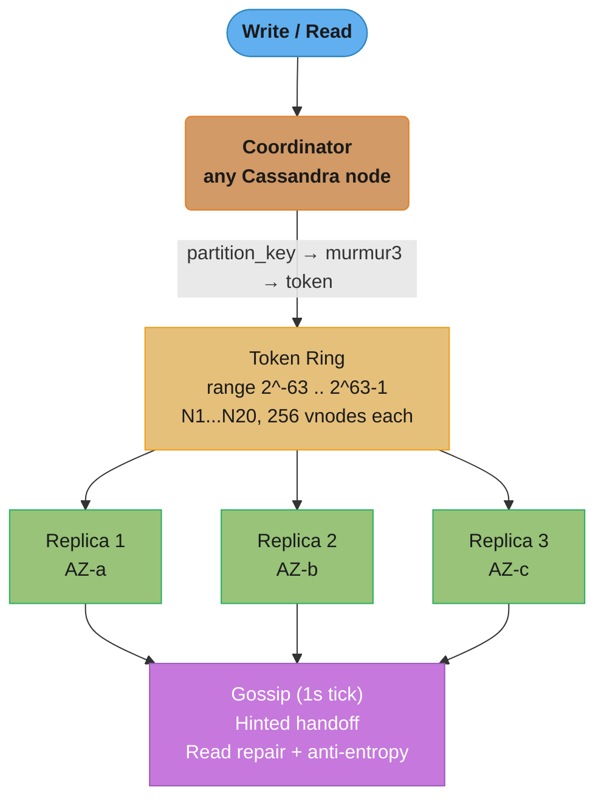

The coordinator hashes the partition key to a token and routes to the ring position, which fans out to 3 rack-aware replicas; gossip, hinted handoff, and read-repair run continuously underneath to keep the ring converged.

### Key Design Decisions

1. **256 vnodes per physical node** — With 20 nodes × 256 vnodes = 5120 token ranges, std dev of arc size is ~6% of mean. With only 1 vnode per node, std dev would be ~22% — one node would own 30%+ of data.
   - *Alternative rejected*: 32 vnodes (Cassandra 4.0 default). Lower repair amplification but worse balance for clusters this small.

2. **Murmur3 partitioner over RandomPartitioner (MD5)** — Murmur3 hashes ~3x faster than MD5 (cryptographic overhead unnecessary). At 80k writes/sec the CPU saving is ~8% per node.
   - *Alternative rejected*: ByteOrderedPartitioner enables range scans but causes catastrophic hot spots on monotonic keys (timestamp, user_id auto-increment).

3. **Partition key = `(user_id, day_bucket)`** — Pure `user_id` would create unbounded partitions for power users; pure timestamp would hotspot. Composite key bounds partition size to ~1 day of one user's events (~50 KB).
   - *Alternative rejected*: `event_id` (UUID) — every read becomes scatter-gather across all partitions.

4. **Replication factor 3 with NetworkTopologyStrategy** — RF=3 across 3 AZs tolerates an entire AZ failure. QUORUM (2/3) reads and writes preserve consistency.
   - *Alternative rejected*: RF=2 saves 33% storage but loses availability on any single node failure during quorum operations.

5. **Coordinator pattern, no dedicated proxy** — Any node accepts client requests, forwards to replicas. Eliminates a single point of failure. Client driver uses token-aware routing to pick the coordinator on the replica set (skips one network hop).

6. **Gossip for membership, no external ZooKeeper** — Reduces operational dependency. Convergence in ~5s for 20 nodes is acceptable given the failure-rate budget.

7. **Streaming-based bootstrap for new nodes** — A joining node streams its share of ranges from existing replicas before being marked UP. Bootstrap of a 500 GB node takes ~90 min on 10 GbE.

### Implementation

Token assignment with vnodes (Cassandra `cassandra.yaml`):

```yaml
cluster_name: 'event-analytics'
num_tokens: 256
partitioner: org.apache.cassandra.dht.Murmur3Partitioner
endpoint_snitch: GossipingPropertyFileSnitch
seed_provider:
  - class_name: org.apache.cassandra.locator.SimpleSeedProvider
    parameters:
      - seeds: "10.0.1.10,10.0.2.10,10.0.3.10"
```

Schema with composite partition key:

```sql
CREATE KEYSPACE events
  WITH replication = {
    'class': 'NetworkTopologyStrategy',
    'dc1': 3
  };

CREATE TABLE events.user_events (
    user_id      uuid,
    day_bucket   date,
    event_time   timestamp,
    event_type   text,
    payload      text,
    PRIMARY KEY ((user_id, day_bucket), event_time)
) WITH CLUSTERING ORDER BY (event_time DESC)
  AND compaction = {'class': 'TimeWindowCompactionStrategy',
                    'compaction_window_size': '1',
                    'compaction_window_unit': 'DAYS'};
```

Token-aware client routing (Java DataStax driver):

```java
CqlSession session = CqlSession.builder()
    .addContactPoints(seeds)
    .withLocalDatacenter("dc1")
    .withConfigLoader(DriverConfigLoader.programmaticBuilder()
        .withString(DefaultDriverOption.LOAD_BALANCING_POLICY_CLASS,
            "DefaultLoadBalancingPolicy")
        .withString(DefaultDriverOption.REQUEST_CONSISTENCY, "LOCAL_QUORUM")
        .build())
    .build();

PreparedStatement ps = session.prepare(
    "INSERT INTO events.user_events (user_id, day_bucket, event_time, " +
    "event_type, payload) VALUES (?, ?, ?, ?, ?)");

session.execute(ps.bind(userId, today, Instant.now(), "click", json));
```

### Tradeoffs

| Approach | Add-node cost | Load balance | Read complexity | Best for |
|----------|--------------|--------------|-----------------|----------|
| Consistent hash + 256 vnodes (chosen) | O(1/N) data moves | std dev ~6% | O(1) coordinator hop | Cassandra/Dynamo-style |
| Range sharding (HBase) | Manual split, expensive | Hotspot-prone | O(1) but skew issues | Sequential scans |
| Modulo hashing | O(N) data moves on resize | Perfect when stable | O(1) | Fixed cluster sizes |
| Rendezvous hashing | O(1/N) | Naturally balanced | O(N) per lookup | Small N (CDN routing) |

### Metrics & Results

- p50 write latency: 1.8 ms, p99: 7.4 ms (SLA: 10 ms)
- p50 read latency: 3.2 ms, p99: 18 ms (SLA: 25 ms)
- Sustained throughput: 95k writes/sec without degradation
- Data balance across nodes: 480–530 GB per node (std dev 4.8%)
- Bootstrap of new node: 87 min for 500 GB at 10 Gbps
- Single-AZ failure drill: zero data loss, p99 read rose to 32 ms during recovery
- Cost: ~$8,400/month for 20× i3.2xlarge EC2 instances

### Common Pitfalls / Lessons Learned

1. **Too few vnodes** — Broken: started with 8 vnodes per node "for faster repair." One node ended up with 31% of the data, hit disk-IOPS limit, p99 spiked to 200 ms. Fix: increased to 256 vnodes, decommissioned the hot node, let cluster rebalance over 6 hours.

2. **Bootstrapping a node without waiting for streaming completion** — Broken: an operator marked a new node UP via JMX before it finished streaming. The node received reads, returned empty results, and clients saw missing data. Fix: never override `auto_bootstrap` to false on a new node; always wait for `nodetool netstats` to show streaming complete.

3. **Hot partition: events keyed only by `date:2024-01-01`** — Broken: a daily-aggregate job wrote all events to a single partition key. That partition grew to 8 GB, compaction blocked the node, write latency spiked. Fix: salt the key with `date:2024-01-01:bucket_<0..15>` to spread writes across 16 partitions, then aggregate downstream.

4. **Cross-AZ replication lag during network blips** — Broken: assumed RF=3 across AZs meant zero data loss. A 30s cross-AZ network blip caused hinted handoff to fill disk on one node, taking it down. Fix: monitor `pending_hints_size`, alert > 1 GB, and tune `max_hint_window_in_ms` (default 3h is too long for large clusters).

### Interview Discussion Points

**Q1: Why 256 vnodes specifically? Why not 4096?**
Empirically, 256 vnodes give std dev ~6% on a 20-node cluster — diminishing returns above that. More vnodes increase repair time (more Merkle trees), gossip overhead, and streaming complexity. Cassandra 4.0 lowered default to 16 due to repair-amplification issues, but 256 remains right for clusters that prioritize balance over repair speed.

**Q2: How does Cassandra route a write to the correct replica set?**
The coordinator computes `token = murmur3(partition_key)`, finds the first vnode clockwise on the ring, and identifies the next RF-1 distinct physical nodes (skipping replicas of the same node) as the replica set. The DataStax client driver replicates this logic so it can send the write directly to a node in the replica set, saving one hop.

**Q3: What happens when you add a 21st node to a 20-node ring?**
The new node generates 256 random tokens, gossips them to peers, and streams the data for those tokens from current owners. Only ~1/21 of data moves (the new node's share). Other nodes' data is untouched. Total bootstrap time ~90 min for 500 GB; cluster serves reads/writes throughout.

**Q4: How does rack-awareness (NetworkTopologyStrategy) interact with consistent hashing?**
After computing the natural replica set from the ring, Cassandra adjusts replica selection to spread copies across racks/AZs. If two consecutive ring positions are in the same rack, it skips to the next ring position in a different rack. This guarantees rack-level fault tolerance without modifying the token ring itself.

**Q5: How would you detect and resolve a hot partition?**
Use `nodetool tablehistograms` to find partitions with abnormal size or read count. Set partition-size alerts at 100 MB. To resolve, redesign the partition key (add salt or time bucket), backfill data into new partitions, and dual-write during cutover. Cassandra 4.0+ also exposes per-partition metrics via `system_views`.

**Q6: How does Cassandra handle a permanent node failure?**
Use `nodetool removenode <host_id>` (or `assassinate` for unreachable nodes). The surviving replicas stream the dead node's ranges to other nodes that become new replicas to maintain RF=3. Hinted handoff covers writes during the gap. Anti-entropy repair (`nodetool repair`) reconciles any divergence afterward.

**Q7: Why does Cassandra use Murmur3 instead of a cryptographic hash?**
Speed and distribution quality. Murmur3 is ~3x faster than MD5 with comparable uniformity for the non-adversarial workload of partition keys. Cryptographic resistance is irrelevant — an attacker cannot bias partition placement in a meaningful way. The CPU savings compound at high write rates (80k+/sec).
