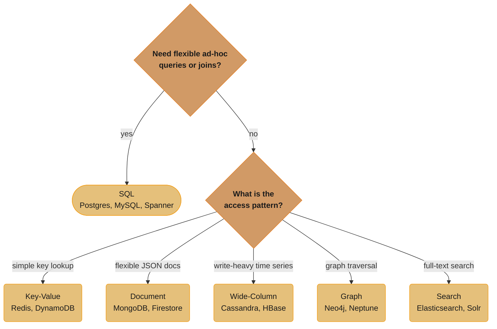
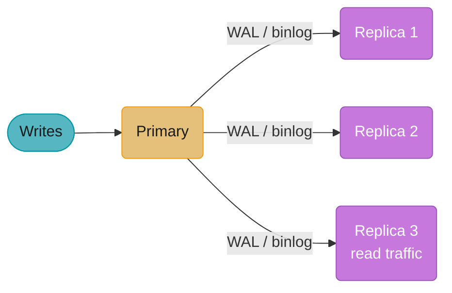
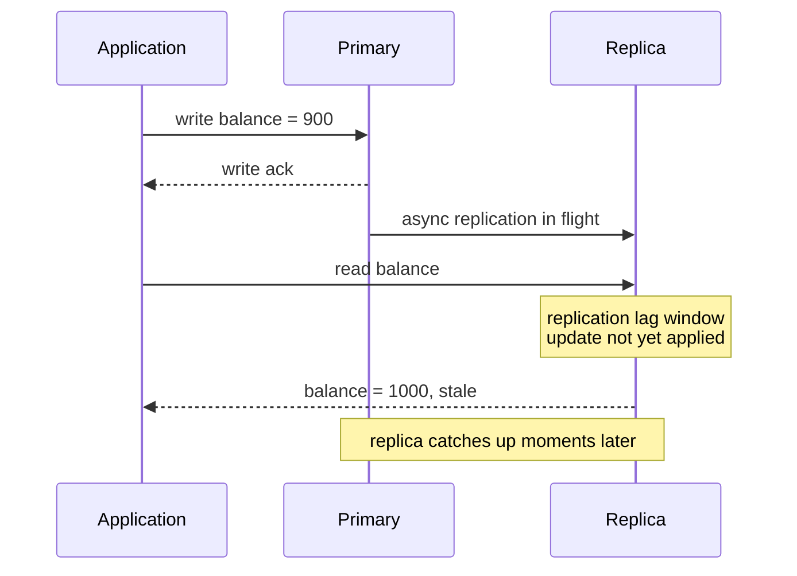
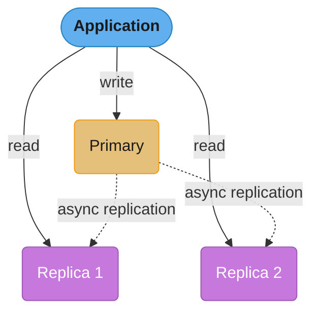
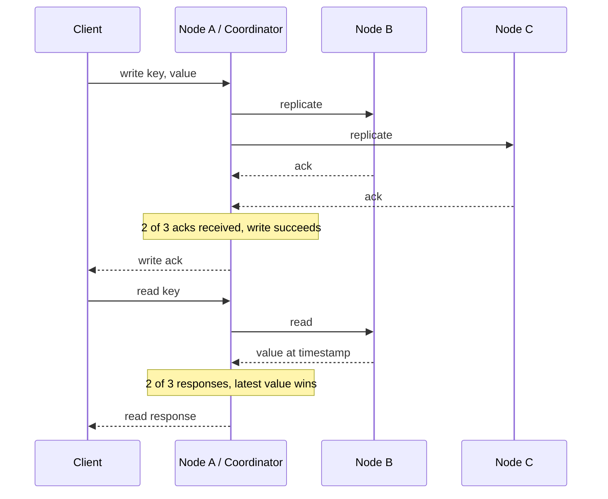
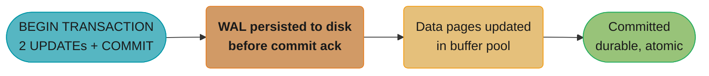
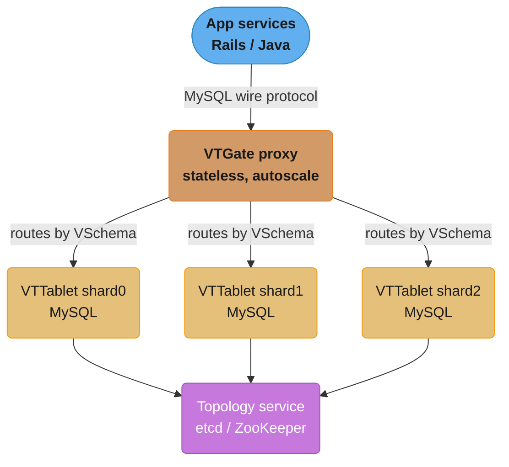

# Database Design

## 1. Concept Overview

Database design is the process of structuring how data is stored, organized, accessed, and maintained. Good database design directly determines a system's scalability, consistency, query performance, and maintainability. Poor design creates technical debt that compounds exponentially as data volume and traffic grow.

At the highest level, the two dominant paradigms are:
- **Relational databases (SQL)**: Structured data in tables with a fixed schema, powerful querying via SQL, and strict consistency guarantees (ACID).
- **Non-relational databases (NoSQL)**: Flexible schemas, optimized for specific access patterns (documents, key-value, column-family, graph), and typically trade consistency for availability and partition tolerance.

Understanding when to use each, how to model data effectively, and how to scale both paradigms is foundational to system design.

---

## Intuition

> **One-line analogy**: Choosing between SQL and NoSQL is like choosing between a filing cabinet with labeled folders (SQL — organized, queryable) and a storage unit where you can put anything anywhere (NoSQL — flexible, scalable).

**Mental model**: SQL databases organize data into tables with rigid schemas and give you ACID guarantees — you always get consistent, correct data. NoSQL databases trade these guarantees for flexibility (any schema), scalability (horizontal sharding), and speed (optimized for specific access patterns). Neither is universally better; the choice depends on your access patterns, scale requirements, and consistency needs.

**Why it matters**: Database design decisions are the hardest to change later. A poorly chosen database type or data model creates performance problems that can't be fixed without expensive migrations. Getting this right at the design stage is critical.

**Key insight**: The SQL vs NoSQL decision hinges on one question: do you need flexible querying (arbitrary WHERE, JOIN, GROUP BY) or do you know exactly how you'll access data? If you need flexible queries, use SQL; if you have a fixed access pattern that needs scale, consider NoSQL.

---

## 2. Core Principles

- **Data Integrity**: Enforcing rules (constraints, foreign keys, types) to prevent corrupt or inconsistent data.
- **Normalization vs. Denormalization**: Eliminating redundancy (normalize for writes, denormalize for reads).
- **Indexing**: Trading write overhead and storage for faster reads.
- **Consistency Models**: ACID (strong) vs. BASE (eventual) — choosing the right model for the use case.
- **Replication**: Keeping copies of data on multiple nodes for availability and read scaling.
- **Partitioning/Sharding**: Splitting data across nodes for horizontal write scaling.
- **Access Pattern First**: Design schemas around how data will be queried, not just how it's structured (especially critical for NoSQL).

---

## 3. SQL vs. NoSQL


*The whole SQL-vs-NoSQL choice collapses to two questions: do you need flexible ad-hoc queries, and if not, which access pattern dominates — each NoSQL family below is optimized for exactly one answer to that second question.*

### SQL (Relational)

**Examples:** PostgreSQL, MySQL, Amazon Aurora, CockroachDB, Google Spanner

**Characteristics:**
- Tabular structure with a defined schema (columns, types, constraints).
- Relationships via foreign keys; joins across tables.
- Full SQL query language — flexible, ad-hoc queries.
- ACID transactions across multiple tables/rows.
- Vertical scaling primary; horizontal via read replicas or distributed SQL (Spanner, CockroachDB).

**Best for:** Financial systems, ERP, e-commerce orders, any domain requiring complex relational queries and strong consistency.

---

### NoSQL

#### Key-Value Stores
**Examples:** Redis, DynamoDB (also document), Memcached

- Simplest model: key maps to opaque blob.
- O(1) reads/writes. No schema.
- Best for: sessions, caches, feature flags, shopping carts.

#### Document Stores
**Examples:** MongoDB, Couchbase, Firestore

- Stores JSON/BSON documents. Flexible schema.
- Rich query support within documents; limited cross-document joins.
- Best for: content management, catalogs, user profiles, event data.

#### Wide-Column (Column-Family)
**Examples:** Apache Cassandra, HBase, Amazon Keyspaces

- Rows identified by a partition key. Columns are dynamic per row.
- Optimized for write-heavy, time-series, append workloads.
- Best for: IoT telemetry, activity logs, time-series data, recommendation events.

#### Graph Databases
**Examples:** Neo4j, Amazon Neptune, JanusGraph

- Nodes and edges with properties. Optimized for traversal queries.
- Best for: social networks, fraud detection, knowledge graphs, recommendation engines.

#### Search Engines (Specialized NoSQL)
**Examples:** Elasticsearch, Apache Solr, OpenSearch

- Inverted indexes for full-text search.
- Best for: log analytics, product search, document retrieval.

---

## 4. ACID vs. BASE

### ACID (SQL / Relational)

| Property | Meaning |
|----------|---------|
| **Atomicity** | A transaction is all-or-nothing. Either all operations commit or all roll back. |
| **Consistency** | A transaction moves the database from one valid state to another, respecting all constraints. |
| **Isolation** | Concurrent transactions behave as if they ran sequentially (configurable via isolation levels). |
| **Durability** | Committed transactions survive crashes (persisted to durable storage, WAL). |

**Isolation Levels (SQL):**
- **Read Uncommitted**: Dirty reads possible.
- **Read Committed**: No dirty reads; non-repeatable reads possible. (PostgreSQL default)
- **Repeatable Read**: No dirty/non-repeatable reads; phantom reads possible. (MySQL InnoDB default)
- **Serializable**: Full isolation — no anomalies. Lowest throughput.

### BASE (NoSQL / Distributed)

| Property | Meaning |
|----------|---------|
| **Basically Available** | System guarantees availability (per CAP), possibly serving stale data. |
| **Soft State** | State may change over time even without input (due to eventual consistency propagation). |
| **Eventually Consistent** | The system will become consistent over time, given no new updates. |

---

## 5. Normalization

Organizing tables to reduce redundancy and improve data integrity.

### Normal Forms

| Form | Rule |
|------|------|
| **1NF** | Atomic column values; no repeating groups. Each cell has one value. |
| **2NF** | 1NF + no partial dependencies (non-key column depends on whole composite key). |
| **3NF** | 2NF + no transitive dependencies (non-key column depends only on the primary key, not another non-key column). |
| **BCNF** | Stricter 3NF — every determinant is a candidate key. |
| **4NF** | No multi-valued dependencies. |

### When to Denormalize

Denormalization intentionally introduces redundancy for read performance:
- Store computed aggregates (total order count on user table).
- Duplicate data to avoid expensive joins (embed category name in product table).
- Pre-join tables for frequently queried combinations.

Trade-off: Faster reads, but updates must propagate to multiple places — risk of inconsistency.

---

## 6. Indexing

Indexes are data structures that trade storage and write overhead for faster read queries.

### B-Tree Index (Default)
- Balanced tree; O(log n) lookups, range queries.
- Excellent for equality and range predicates on ordered data.
- Used by: PostgreSQL, MySQL, SQL Server.

### Hash Index
- O(1) exact lookups. No range queries.
- Used by: Redis, some memory-optimized tables.

### Composite Index
- Index on (col_a, col_b). Usable for queries on col_a alone OR (col_a, col_b). NOT col_b alone (leftmost prefix rule).

### Covering Index
- Index contains all columns needed for a query — no table row lookup needed. Very fast.

### Partial Index
- Index only rows matching a condition: `CREATE INDEX ON orders(user_id) WHERE status = 'active'`.

### Full-Text Index
- Inverted index for text search. PostgreSQL `tsvector`, MySQL FULLTEXT, Elasticsearch.

### Index Pitfalls
- Over-indexing: Each index slows writes and uses storage.
- Index on low-cardinality columns (boolean, status with 3 values) — often ignored by the query planner.
- Not using `EXPLAIN ANALYZE` to verify index usage.

---

## 7. Replication

Replication copies data from one node (primary) to others (replicas).

### Primary-Replica (Master-Slave)


*Writes land on the primary and stream via WAL/binlog to every replica; whether the primary waits for a replica to confirm (below) determines the durability/latency tradeoff.*

- **Synchronous replication**: Primary waits for at least one replica to confirm before acknowledging write. Stronger durability, higher write latency.
- **Asynchronous replication**: Primary acknowledges immediately; replicas catch up. Lower latency, risk of data loss on failover.
- **Semi-synchronous**: At least one replica must acknowledge.

### Read Replicas
- Direct read traffic to replicas, writes to primary.
- Replicas may lag (replication lag) — stale reads possible.
- Scale reads horizontally without scaling writes.


*Because replication is asynchronous, a read sent to the replica immediately after a write to the primary can still return the pre-write value — the read-your-own-writes gap called out in Common Pitfall #7.*

### Multi-Primary (Multi-Master)
- Multiple nodes accept writes. Conflict resolution required.
- Examples: MySQL Group Replication, CockroachDB, Cassandra (leaderless).

### Leaderless Replication (Dynamo-style)
- Any node accepts writes. Uses quorum writes/reads (W + R > N for consistency).
- `N` = replication factor, `W` = write quorum, `R` = read quorum.
- Examples: Cassandra, DynamoDB, Riak.

---

## 8. Architecture Diagrams

### Primary-Replica Setup

*The application routes writes to the primary and reads to either replica; the primary asynchronously streams changes to both replicas after it has already acknowledged the write.*

### Cassandra Quorum

*With N=3, W=2, R=2 (W+R > N), the coordinator only needs 2-of-3 acks to satisfy a write and 2-of-3 responses to resolve a read to the latest value — guaranteeing at least one replica overlaps between any write and any read.*

### ACID Transaction Flow

*The WAL is fsynced to disk before the client's COMMIT is acknowledged — durability comes from the log, not from the later, buffered data-page write.*

---

## 9. Real-World Examples

### Amazon
- **DynamoDB**: Key-value/document store for shopping cart, sessions, product catalog.
- **Aurora**: MySQL/PostgreSQL-compatible relational DB with 6-way replication across 3 AZs.
- **Redshift**: Columnar data warehouse for analytics.
- Orders/payments use ACID relational DBs; catalog/sessions use DynamoDB for scale.

### Netflix
- **Cassandra**: Stores viewing history, playback state, user activity (write-heavy, append).
- **MySQL**: Account, billing, and subscription data (ACID required).
- **EVCache (Redis)**: Session and metadata caching.

### Twitter
- **MySQL** with heavy sharding for tweet storage (moved to Manhattan, a proprietary store).
- **Cassandra** for social graph and timelines.
- **Snowflake** (their ID generator) for globally unique, roughly time-ordered tweet IDs.

### Google
- **Bigtable**: Wide-column store for Search indexes, Maps, Gmail.
- **Spanner**: Globally distributed relational DB with external consistency (TrueTime API).
- **Firestore**: Document store for Firebase apps.

### Uber
- **Schemaless** (MySQL-based): Custom wide-column layer on top of MySQL.
- **PostgreSQL** for core trip data with heavy replication.
- Migrated from PostgreSQL to MySQL due to write-ahead log efficiency differences at scale.

---

## 10. Tradeoffs

| Dimension | SQL | NoSQL |
|-----------|-----|-------|
| Schema | Rigid, enforced | Flexible, schemaless |
| Consistency | Strong (ACID) | Eventual (BASE) |
| Query flexibility | High (SQL) | Limited (access-pattern-driven) |
| Horizontal scaling | Hard (distributed SQL helps) | Easier (built for distribution) |
| Joins | Native | Application-level or denormalized |
| Transactions | Multi-row, multi-table | Often single-row only |
| Maturity | Decades, well-understood | Varies by system |

---

## 11. When to Use / When NOT to Use

### SQL — Use When:
- Data has complex relationships requiring joins.
- Strong consistency and ACID transactions are required (payments, inventory).
- Ad-hoc querying needs are unknown at design time.
- Team is more familiar with relational modeling.

### SQL — Avoid When:
- Massive write throughput exceeds a single primary's capacity.
- Data is hierarchical/nested (JSON documents) — schema rigidity becomes a burden.
- Access pattern is purely key-value lookups.

### NoSQL — Use When:
- Extremely high write throughput (IoT, logging, analytics).
- Access patterns are well-known and simple (lookup by ID, range by timestamp).
- Schema flexibility is needed (evolving product attributes).
- Horizontal scalability is a primary requirement.

### NoSQL — Avoid When:
- Complex transactional integrity across multiple entities is required.
- Team needs ad-hoc analytical queries.
- Strong consistency is non-negotiable.

---

## 12. Common Pitfalls

1. **Missing indexes on foreign keys**: Every join condition should have an index. Unmissed FK indexes cause full table scans.
2. **N+1 query problem**: Fetching a list, then querying each item individually. Use JOINs or batch fetches.
3. **Selecting all columns (`SELECT *`)**: Fetches unnecessary data; prevents covering indexes.
4. **No connection pooling**: New DB connection per request = 5-50ms overhead + connection limit exhaustion.
5. **Over-normalization for read-heavy workloads**: Joins are expensive at scale; consider selective denormalization.
6. **Schema migrations without a plan**: Adding a column to a billion-row table locks the table in MySQL. Use pt-online-schema-change or pg_repack.
7. **Ignoring replication lag**: Read replicas can be seconds behind. Reading immediately after writing to replica returns stale data.
8. **Not using EXPLAIN**: Assuming queries are using indexes without verifying via query planner.
9. **Storing large blobs in DB**: Images, PDFs in database columns waste memory and slow replication. Use object storage (S3) and store URLs.
10. **Poor shard key selection**: Monotonically increasing keys (auto-increment) cause hot partitions in distributed systems.

---

## 13. Technologies & Tools

| Technology | Type | Notes |
|------------|------|-------|
| PostgreSQL | Relational SQL | Feature-rich, JSONB support, great for most use cases |
| MySQL / Aurora | Relational SQL | Web workloads, AWS-native Aurora adds replication |
| CockroachDB | Distributed SQL | Geo-distributed ACID, Postgres-compatible |
| Google Spanner | Distributed SQL | Global consistency via TrueTime |
| MongoDB | Document | Flexible schema, rich queries, ACID in v4+ |
| Cassandra | Wide-column | Massive write scale, tunable consistency |
| DynamoDB | Key-value + document | Fully managed, predictable performance |
| Redis | Key-value | In-memory, also used as primary DB for some use cases |
| Neo4j | Graph | Cypher query language, ACID |
| Elasticsearch | Search + analytics | Inverted index, full-text search, log analytics |
| ClickHouse | Columnar OLAP | Extremely fast analytical queries |
| Snowflake | Cloud data warehouse | OLAP at scale, separation of compute/storage |

---

## 14. Interview Questions with Answers

**Q1: When would you choose NoSQL over SQL?**
A: When the access pattern is well-defined and simple (key-value or range queries), when horizontal write scalability is paramount, when schema flexibility is needed (evolving documents), or when the data model naturally fits a non-relational structure (graphs, time-series, documents).

**Q2: What is the N+1 query problem and how do you fix it?**
A: Fetching a list of N entities, then making one additional query per entity. Fix: use a JOIN in a single query, or use an ORM eager-loading feature (`include`/`select_related`), or batch fetch with a WHERE id IN (...) clause.

**Q3: Explain the difference between clustered and non-clustered indexes.**
A: A clustered index defines the physical order of rows on disk (there can only be one per table — in MySQL InnoDB, the primary key is always clustered). A non-clustered index is a separate structure that stores the indexed column(s) plus a pointer to the actual row. Clustered indexes make range scans on the primary key very fast.

**Q4: What is a covering index?**
A: An index that contains all columns required to satisfy a query — the query planner never needs to access the actual table rows (index-only scan). Example: query `SELECT name FROM users WHERE email = ?` — an index on `(email, name)` covers it entirely.

**Q5: What is database sharding and when would you use it?**
A: Horizontal partitioning of data across multiple database nodes, each holding a subset of rows. Use it when a single DB node cannot handle the write throughput or data volume. The shard key determines which node stores each row.

**Q6: What is eventual consistency and when is it acceptable?**
A: A consistency model where, given no new updates, all replicas will converge to the same value over time. Acceptable when slight staleness is tolerable: social media likes/counts, product view counts, recommendation data. Not acceptable for: bank balances, inventory, authentication tokens.

**Q7: How would you handle schema migrations on a live production database?**
A: Use backward-compatible migrations: add columns before removing them, use tools like Flyway/Liquibase, use online schema change tools (pt-osc, gh-ost for MySQL; pg_repack for PostgreSQL) to avoid table locks, deploy application code that handles both old and new schema, then clean up old schema in a follow-up migration.

**Q8: What are the tradeoffs of read replicas?**
A: Pros: Scale read throughput, geographic distribution, offload analytics. Cons: Replication lag causes stale reads, adds operational complexity, failover to replica requires application reconfiguration or use of a proxy (ProxySQL, RDS Proxy).

**Q9: Explain the difference between optimistic and pessimistic locking.**
A: Pessimistic locking: lock the row when reading, preventing concurrent modifications until the lock is released (`SELECT FOR UPDATE`). Suitable when conflicts are frequent. Optimistic locking: no lock on read; on write, verify a version counter hasn't changed — if it has, retry. Better for low-contention scenarios.

**Q10: What is a write-ahead log (WAL)?**
A: A durability mechanism where changes are written to a sequential log (WAL) before being applied to data pages. On crash recovery, the WAL is replayed to restore committed transactions. It enables ACID durability and is the foundation of streaming replication in PostgreSQL.

**Q11: How does Cassandra achieve high write throughput?**
A: Cassandra uses LSM-trees (Log-Structured Merge trees). Writes go to an in-memory memtable + commit log (sequential disk write). Memtable is periodically flushed to immutable SSTable files on disk. SSTables are periodically compacted. Sequential writes are extremely fast; reads are more complex (merge multiple SSTables).

**Q12: What is the difference between OLTP and OLAP databases?**
A: OLTP (Online Transaction Processing): high-throughput short transactions, normalized schemas, row-oriented storage, low latency. Examples: PostgreSQL, MySQL. OLAP (Online Analytical Processing): complex aggregations over large datasets, denormalized star/snowflake schemas, columnar storage, high throughput analytical queries. Examples: Redshift, BigQuery, ClickHouse.

**Q13: When would you deliberately denormalize a schema, and what does it cost you?**
A: Denormalize when read latency matters more than write simplicity, by storing a computed aggregate or duplicating data to avoid an expensive join. Section 5 frames the tradeoff directly: normalization eliminates redundancy and keeps updates cheap (change one row), while denormalization duplicates that data across rows or tables so a read never has to join, at the cost that every update must now propagate to every duplicate or risk inconsistency. A common middle ground is normalizing the write path (source of truth) while maintaining a denormalized read-optimized copy updated asynchronously — exactly what a cache-aside layer or a materialized view does. Denormalize only the specific fields a hot query path actually needs, not entire tables, so the blast radius of an inconsistency stays small.

**Q14: Why doesn't a composite index on `(col_a, col_b)` speed up a query that filters only on `col_b`?**
A: A composite B-tree index is physically sorted by the first column, then the second within each first-column value. This is the leftmost-prefix rule from Section 6: a query on `col_a` alone, or on `(col_a, col_b)` together, can use the index directly since both match a contiguous range of the sorted structure, but a query on `col_b` alone has to check every distinct `col_a` value's sub-range, which degrades toward a full index scan. If both single-column lookups are common, you generally need two separate indexes — one on `(col_a, col_b)` and one on `(col_b)` alone — rather than expecting one composite index to serve both directions. Always confirm with `EXPLAIN ANALYZE` (Section 6's Index Pitfalls) rather than assuming a composite index covers a query it doesn't.

**Q15: Why would you vertically split a table into "hot" and "cold" columns instead of keeping everything in one row?**
A: Splitting keeps frequently-accessed columns small enough to stay resident in the buffer pool while large, rarely-read columns don't compete for that memory. The Airbnb case study's Key Design Decision #4 does exactly this: `listings_hot` holds price, availability, title, and photo_url (queried on every search result), while `listings_cold` holds the full description, amenities JSON, and house rules (loaded only on the listing detail page) — keeping the hot table around 5GB, small enough to fit entirely in InnoDB's buffer pool so search queries hit memory instead of disk. This is a column-store technique retrofitted onto a row-oriented database: instead of fetching an entire wide row for a query that only needs four fields, you fetch only the table that has those four fields. Split along access-frequency lines, not along logical/entity lines — the goal is keeping the frequently-scanned working set small, not achieving a "clean" schema.

**Q16: Why do monotonically increasing shard keys (like an auto-increment ID) create hot partitions?**
A: A key that always increases means every new row's key is greater than all previous keys, so every insert lands on the same shard. Section 12's pitfall #10 calls this out directly, and the Airbnb case study hit a variant of it: a single property-management company's 12M listings all shared one `user_id`, so that shard's storage grew to 800GB (versus ~125GB for others) and its write throughput ran at 4x its peers. The fix in both cases is the same shape — choose a shard key with naturally distributed values (a hash of the ID, not the ID itself) or detect and manually split outlier keys, which is what Airbnb did by splitting the company into 50 regional sub-accounts. Always plot the expected key distribution before picking a shard key, since a key that looks fine at 1M rows can concentrate catastrophically at 100M.

---

## 15. Best Practices

1. **Design for access patterns**: In NoSQL, design your schema around the queries you'll run, not the entity relationships.
2. **Use connection pooling**: PgBouncer (PostgreSQL), ProxySQL (MySQL) — never create raw connections per request.
3. **Index foreign keys**: Any column used in a JOIN or WHERE clause should be indexed.
4. **Use EXPLAIN ANALYZE**: Always verify query plans on production-like data volumes.
5. **Set up replication before you need it**: Retrospectively enabling replication on a large DB is painful.
6. **Avoid `SELECT *`**: Always specify required columns; it prevents table bloat from affecting query performance.
7. **Use pagination**: Never return unbounded result sets; use LIMIT/OFFSET or cursor-based pagination.
8. **Enforce constraints in the DB**: Don't rely solely on application logic; use DB-level NOT NULL, UNIQUE, and FK constraints.
9. **Monitor slow query log**: Enable and review regularly.
10. **Test with production-like data volume**: Queries that work fine on 10K rows may fail on 100M rows.

---

## Cross-Perspective: LLD Connections

**LLD View — Design Patterns That Implement Database Design**

- **Repository** — Abstracts data access behind an interface (`UserRepository`, `OrderRepository`). The service layer depends on the interface; the concrete class uses JDBC, JPA, or a NoSQL driver. Swapping databases requires only a new Repository implementation, not touching business logic.
- **Factory** — A connection factory creates and pools database connections, hiding driver-specific construction details (URL, credentials, pool size) from callers.
- **Strategy** — Query routing (read replica vs primary write), transaction isolation levels, and index selection strategies are encapsulated as interchangeable Strategy implementations configured per-operation.
- **Decorator** — Caching and query-logging decorators wrap Repository calls, adding observability and performance without modifying the Repository implementations.

---

**Cross-references:** [backend/database_internals_and_indexing](../../backend/database_internals_and_indexing/) (B-tree/LSM internals behind the indexing strategies above), [backend/query_optimization](../../backend/query_optimization/), [database/README](../../database/README.md) (all 29 modules — schema design, normalization, NoSQL data modeling), [database/schema_design_and_normalization](../../database/schema_design_and_normalization/).

---

## 16. Case Study: Designing a Database for an E-Commerce Platform

**Requirements:** 10M products, 50M users, 100M orders/year. Reads: 100K/sec. Writes: 5K/sec. Latency: <50ms for product page, <200ms for order placement.

**Design:**

1. **Product Catalog** → MongoDB (document store): Products have variable attributes (a shoe has size/color, a book has ISBN/author). Flexible schema is ideal. Index on category, price, brand for filtering.

2. **User Accounts + Auth** → PostgreSQL: Structured, relational. User → Address (1:N), User → PaymentMethod (1:N). ACID for account updates.

3. **Orders + Payments** → PostgreSQL with ACID: Critical financial data. Tables: orders, order_items, payments, refunds. Use transactions to ensure atomicity of order placement + inventory decrement.

4. **Inventory** → PostgreSQL with pessimistic locking: `SELECT FOR UPDATE` on inventory row during order placement to prevent overselling.

5. **Session + Cart** → Redis: Fast key-value, TTL-based expiry, write-back persistence to DB.

6. **Search** → Elasticsearch: Full-text search across product name, description. Sync from MongoDB via change streams.

7. **Analytics** → Redshift/BigQuery: Nightly ETL from OLTP stores. Ad-hoc queries on orders, revenue, funnel analysis.

8. **Read scaling** → PostgreSQL read replicas for user/order reads. Redis caching for product detail pages (cache-aside, 5-minute TTL).

**Result:** Product pages at 8ms P99 (Redis hit), order placement at 120ms P99 (DB write), full-text search at 30ms P99 (Elasticsearch).

---

## Case Study: Airbnb Monolithic MySQL to Vitess Migration

### Problem Statement

Airbnb operated a monolithic MySQL database for its listings, bookings, and reviews. By 2018 the database had hit IOPS limits at 70% capacity; a hardware upgrade would extend runway by ~12 months but would not solve the underlying scaling ceiling. Scale at migration time:

- 100M listings, 500M reviews, 200M user accounts
- Data volume: 2 TB on the primary MySQL instance
- Write throughput: 30k QPS sustained, 50k QPS peak (booking surges)
- Read throughput: 250k QPS (after caching layer)
- Latency SLA: p99 read < 20 ms, p99 booking write < 100 ms
- Availability target: 99.99% during migration (zero-downtime requirement)
- Growth rate: 40% YoY for both data volume and QPS

The goal was to shard while keeping MySQL wire-protocol compatibility so the existing 600+ application services and ORM (Active Record / JDBC) would not need to be rewritten. Vitess (the YouTube-originated sharding layer) was selected.

### Architecture Overview


*VTGate is a stateless MySQL-wire-protocol proxy that routes to 16 VTTablet-managed shards by VSchema (3 of 16 shown); each tablet reports its shard map, VSchema, and health back to the etcd/ZooKeeper-backed topology service.*

### Key Design Decisions

1. **Vitess for MySQL wire-protocol compatibility** — VTGate speaks MySQL protocol. Application code, ORMs, and admin tools (mysqldump, mysqlshell) work unchanged. Avoided rewriting 600+ services.
   - *Alternative rejected*: CockroachDB (Postgres dialect; required ORM rewrite, untested at this write QPS in 2018).

2. **Shard key = `user_id` (host_id for listings, guest_id for bookings)** — Collocates a host's listings, calendar, and reviews on one shard so the most common query (host dashboard) is single-shard. Avoided sharding on `listing_id` which would scatter a single host's data.
   - *Alternative rejected*: `listing_id` — scatters by listing; host dashboard becomes 16-shard scatter-gather.

3. **16 logical shards initially, designed for expansion to 256** — Vitess supports online resharding by hash-prefix splits. Starting at 16 leaves headroom for 16x growth without re-architecting. Each shard ~125 GB initially.

4. **Vertical column splitting: hot vs cold** — Hot columns (price, availability, title, photo_url) in `listings_hot` table; cold/large columns (full description, amenity JSON blob, full review text) in `listings_cold`. Hot table fits in buffer pool entirely.

5. **VReplication for online migration** — Vitess's MoveTables workflow copies data from the source MySQL to sharded targets in real time, then performs a coordinated cutover. Took 6 weeks for the full dataset; zero downtime.

6. **Read replicas dedicated to analytics** — Replicate from each shard to a single MariaDB instance for analyst ad-hoc queries (which cannot run on production shards without risking IOPS spikes).

7. **VSchema for cross-shard queries** — Defines lookup vindexes for non-shard-key lookups (e.g., find listing by `listing_id`). The lookup table maps `listing_id → user_id` and is itself stored in a lookup keyspace, replicated to all shards via materialized view.

### Implementation

VSchema definition for the listings keyspace:

```json
{
  "sharded": true,
  "vindexes": {
    "hash": { "type": "hash" },
    "listing_lookup": {
      "type": "consistent_lookup_unique",
      "params": {
        "table": "lookup.listing_to_user",
        "from": "listing_id",
        "to": "user_id"
      },
      "owner": "listings"
    }
  },
  "tables": {
    "listings": {
      "column_vindexes": [
        { "column": "user_id", "name": "hash" },
        { "column": "listing_id", "name": "listing_lookup" }
      ]
    }
  }
}
```

Vertical split schema:

```sql
-- Hot table, fits in buffer pool
CREATE TABLE listings_hot (
  listing_id BIGINT PRIMARY KEY,
  user_id    BIGINT NOT NULL,
  title      VARCHAR(120),
  price_usd  DECIMAL(10,2),
  available  BOOLEAN,
  updated_at TIMESTAMP,
  KEY idx_user (user_id)
) ENGINE=InnoDB;

-- Cold table, accessed only on detail page
CREATE TABLE listings_cold (
  listing_id    BIGINT PRIMARY KEY,
  user_id       BIGINT NOT NULL,
  description   MEDIUMTEXT,
  amenities     JSON,
  house_rules   TEXT,
  FOREIGN KEY (listing_id) REFERENCES listings_hot(listing_id)
) ENGINE=InnoDB;
```

Online schema change with pt-online-schema-change:

```bash
pt-online-schema-change \
  --alter "ADD COLUMN cancellation_policy ENUM('flex','mod','strict') DEFAULT 'mod'" \
  --execute \
  --max-load Threads_running=50 \
  --critical-load Threads_running=200 \
  D=airbnb,t=listings_hot
```

### Tradeoffs

| Approach | Schema flexibility | Migration complexity | App rewrite | Operational maturity |
|----------|-------------------|---------------------|-------------|---------------------|
| Vitess (chosen) | MySQL DDL | Medium (VReplication) | None | High (YouTube proven) |
| CockroachDB | Postgres DDL | High (full cutover) | Heavy (ORM changes) | Medium (newer) |
| Application sharding | Any | Very high | Heavy | Low (homegrown) |
| Stay on monolith + scale up | Any | None | None | Low headroom |

### Metrics & Results

- p99 read latency: 14 ms (was 22 ms on monolith)
- p99 write latency: 38 ms (was 90 ms during peaks)
- Sustained QPS capacity: 8x of monolith (16 shards × ~50% headroom each)
- Migration duration: 6 weeks of VReplication + 30-second cutover per keyspace
- Zero data loss, zero downtime during cutover (verified by row-count diffs)
- Infrastructure cost: +35% vs monolith (16 shard hosts vs 1 large + replicas), justified by 8x capacity
- Storage per shard: 110–145 GB (std dev 8%)

### Common Pitfalls / Lessons Learned

1. **Cross-shard JOINs as scatter-gather** — Broken: a "trip search" query joined `bookings` and `listings` across all 16 shards; p99 climbed to 800 ms. Fix: denormalized the booking row to include `listing_title`, `listing_city`, `host_id` so search runs on a single shard (or hits the Elasticsearch index entirely).

2. **Hotspot shard from a power host** — Broken: one property-management company controlled 12M listings under one user_id; that shard's storage hit 800 GB and write QPS was 4x the others. Fix: detected the outlier via per-shard size metrics, split the company into 50 sub-accounts (one per region), and reshuffled to balance.

3. **Schema migration locking a 100M-row table** — Broken: an `ALTER TABLE` to add an index on `listings` blocked all writes for 45 minutes. Fix: switched to pt-online-schema-change (Percona) which creates a ghost copy, triggers to keep it in sync, then swaps atomically. New migration time: 4 hours but zero downtime.

4. **Forgetting to update VSchema after adding a column** — Broken: a new `listing_uuid` column was added but no vindex was created. Reads by `listing_uuid` became scatter-gather across all 16 shards. Fix: enforce in CI that every column used in a WHERE clause must have an entry in VSchema or be the shard key itself.

### Interview Discussion Points

**Q1: Why shard on user_id instead of listing_id?**
Because most queries are scoped to a single host or single guest (dashboard, calendar, message thread, payouts). Sharding on user_id keeps all of a host's data on one shard, so these queries hit one node. Sharding on listing_id would split a host's listings across shards, making every host-level query a scatter-gather.

**Q2: How does Vitess handle a query that doesn't include the shard key?**
VTGate parses the query, consults VSchema, and chooses a strategy: (a) if a lookup vindex exists for the WHERE column, it queries the lookup keyspace to resolve to a shard key, then routes; (b) otherwise it broadcasts to all shards (scatter), aggregates results in VTGate. Scatter queries are expensive — design VSchema to minimize them.

**Q3: How was the migration done without downtime?**
Vitess's VReplication continuously copied source data to sharded tablets, transforming rows according to the shard key. Once lag was < 1 second, a 30-second cutover atomically (a) stopped writes on the source, (b) drained in-flight replication, (c) flipped VTGate routing to the sharded keyspace. Application services pointed at VTGate throughout — they saw a brief pause but no errors.

**Q4: Why split listings into hot and cold tables?**
The hot table (price, availability, title) is queried on every search result; the cold table (full description, JSON amenities) is only loaded on detail page view. Keeping hot at ~5 GB lets it fit fully in the InnoDB buffer pool; queries hit memory, not disk. This is a column-store technique applied within row-oriented MySQL.

**Q5: How would you detect a hotspot shard early?**
Monitor per-shard: storage size, write QPS, replication lag, CPU. Alert when any shard exceeds 1.5x the cluster median on any of these. Also instrument the application to track top-N user_ids by row count and request rate — a 100x outlier is a future hotspot. Stripe and Slack publish similar runbooks.

**Q6: What's the difference between Vitess and a simple PgBouncer/ProxySQL?**
PgBouncer/ProxySQL are connection poolers and basic read/write splitters — they don't understand sharding or VSchema. Vitess is a full sharding layer: query parsing, vindex routing, online resharding, schema migration coordination, and topology management. PgBouncer would not have solved Airbnb's IOPS ceiling.

**Q7: When is the right time to migrate from a monolith DB to sharding?**
When (a) you're consistently at 60%+ of IOPS or storage on the largest available instance, (b) vertical scaling has < 18 months of runway, and (c) your traffic growth makes ceiling-hit predictable. Migrating earlier wastes effort; migrating later means doing it under fire when the database is already failing.
