# Database Sharding

## Table of Contents
1. [What is Sharding?](#what-is-sharding)
2. [Why Shard?](#why-shard)
3. [Sharding vs Replication vs Partitioning](#sharding-vs-replication-vs-partitioning)
4. [Shard Key Selection](#shard-key-selection)
5. [Sharding Strategies](#sharding-strategies)
   - [Range-Based Sharding](#range-based-sharding)
   - [Hash-Based Sharding](#hash-based-sharding)
   - [Directory-Based Sharding](#directory-based-sharding)
   - [Geographic / Zone-Based Sharding](#geographic--zone-based-sharding)
6. [Cross-Shard Queries](#cross-shard-queries)
7. [Resharding](#resharding)
8. [Hotspot Handling](#hotspot-handling)
9. [Real-World Examples](#real-world-examples)
10. [Shard Proxies](#shard-proxies)
11. [Interview Questions](#interview-questions)
12. [Best Practices](#best-practices)

---

## Intuition

> **One-line analogy**: Database sharding is like splitting a huge phone book into volumes A-M and N-Z — each volume is smaller and can be accessed independently, but you need to know which volume to look in.

**Mental model**: A single database server has limits — CPU, disk, memory. When your dataset hits tens of TBs, no single machine suffices. Sharding splits the data horizontally across multiple databases (shards), each owning a partition of the data. The shard key (e.g., user_id, geographic region) determines which shard a given record lives on. Queries to a specific user/record go directly to the right shard. Cross-shard queries are expensive — avoid them by choosing the shard key that makes the most common queries single-shard.

**Why it matters**: Sharding is the primary technique for scaling writes beyond what a single database can handle. Read replicas scale reads; sharding scales writes and storage. Instagram, Twitter, and most large-scale databases use horizontal sharding.

**Key insight**: Shard key selection is the most consequential decision — the wrong key leads to hotspots (one shard handling 90% of traffic) and expensive cross-shard queries. Design for your dominant access patterns, not theoretical flexibility.

---

## What is Sharding?

Sharding is a database scaling technique that horizontally partitions data across multiple independent database instances (shards). Each shard holds a subset of the total data set and is hosted on a separate server. Together, the shards hold the complete dataset.

The key characteristic: each piece of data lives on exactly one shard. Shards are independent — they do not replicate each other's data (though each shard may have its own replicas for HA within itself).

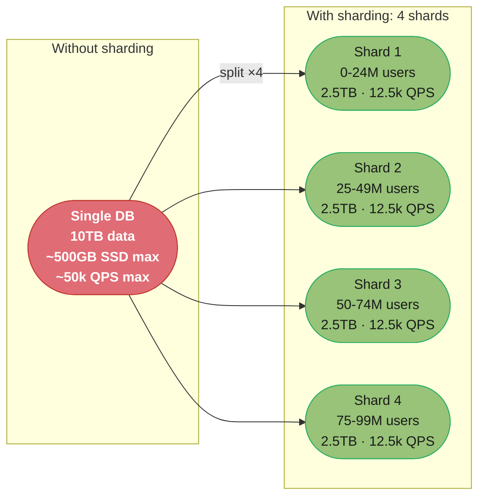
*A single DB caps out around ~500GB / ~50k QPS long before Facebook- or Uber-scale data arrives; splitting the same 10TB / 50k QPS workload across 4 shards gives each one a comfortable 2.5TB / 12.5k QPS, and capacity keeps scaling as more shards are added.*

---

## Why Shard?

### Single Database Limits

**Storage Limits**
A single machine's storage is bounded by physical hardware — typically a few TB for NVMe SSDs. Datasets at companies like Facebook (petabytes of user data) or Uber (billions of trip records) far exceed single-machine storage.

**Write Throughput**
A single DB primary handles all writes. At 50k+ writes/second, the primary becomes a bottleneck regardless of read replicas (replicas only help with reads). Sharding distributes write load across multiple primaries.

**Connection Limits**
Each DB connection consumes memory. A single PostgreSQL instance typically supports 100-500 connections before performance degrades. At large scale, connection pools help but have limits. Multiple shards multiply the available connection capacity.

**Index Size**
Large tables have large indexes that don't fit in memory (buffer pool), causing index traversals to hit disk. Smaller sharded tables have proportionally smaller indexes, improving cache efficiency.

**Operational Limits**
Large database backups, migrations, and VACUUM operations are slow and disruptive at scale. Smaller shards are easier to operate.

### Growth Trajectory

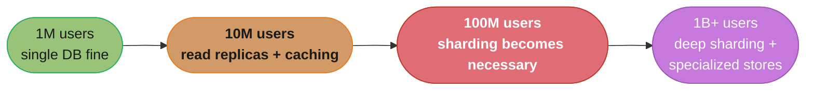
*Single-DB headroom runs out around 100M users — the point most systems are forced into sharding.*

---

## Sharding vs Replication vs Partitioning

| Technique | Definition | Primary Goal | Data Distribution |
|-----------|------------|-------------|------------------|
| Replication | Copy same data to multiple nodes | Read scalability, HA | Same data on all replicas |
| Partitioning | Split data within a single DB instance | Manageability, query performance | Different partitions, same DB server |
| Sharding | Distribute data across separate DB instances | Write scalability, storage scale | Different data on different servers |

**Replication** (one primary, N replicas):
- Reads can go to any replica
- All writes go to primary
- If primary fails, promote a replica
- Does NOT scale writes or storage beyond a single machine

**Partitioning** (table partitioning in PostgreSQL, MySQL):
- Splits a large table into smaller physical segments on the same server
- Same server handles all partitions
- Improves query performance (partition pruning)
- Does not help with storage or write throughput at the server level

**Sharding** (across separate machines):
- Truly distributes both storage and write throughput
- Each shard is an independent DB instance (often with its own replicas)
- Application must know which shard to route requests to

**In practice, combine all three:**
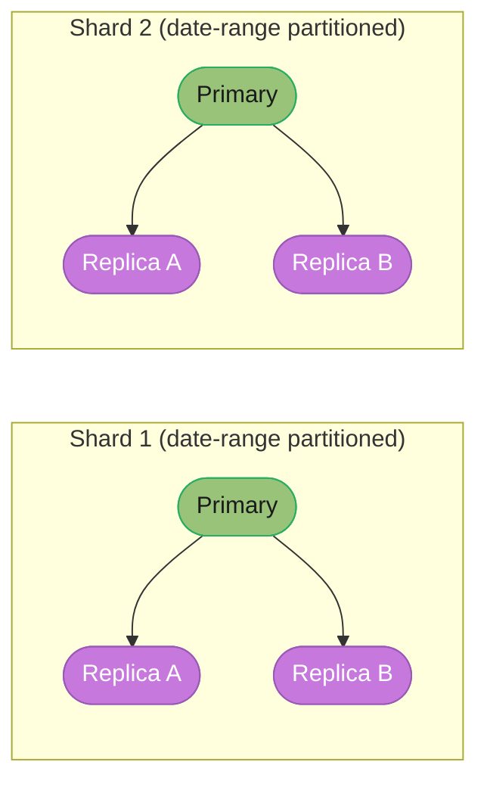
*Sharding, replication, and partitioning combine in production: each shard has its own primary with replicas for HA, and each shard is further partitioned internally by date range.*

---

## Shard Key Selection

The shard key is the most important architectural decision in a sharded system. It determines which shard a piece of data belongs to. A poor shard key choice leads to hotspots, uneven distribution, and expensive cross-shard queries.

### Shard Key Properties to Evaluate

**Cardinality**
The shard key must have high cardinality (many distinct values). A key with only 10 distinct values can have at most 10 shards. Low cardinality = limited scalability.

- Low cardinality (bad): `status` (active/inactive), `country` (200 values), `user_type`
- High cardinality (good): `user_id` (millions), `order_id` (billions), `email`

**Frequency / Distribution**
Values should be uniformly distributed across shards. Skewed distributions create "fat shards" that are overloaded while others sit idle.

- Skewed (bad): username starting with 'A'-'E' vs. 'X'-'Z' (letter frequency is uneven)
- Uniform (good): hash of user_id

**Monotonic Keys**
Auto-incrementing IDs and timestamps are monotonically increasing. New data always goes to the "last" shard, creating a write hotspot on the newest shard while all others are cold.


*Timestamp as a shard key is monotonic: every new write lands on Shard 4 (all of Oct+ 2024), leaving Shards 1-3 cold and read-only while Shard 4 absorbs 100% of writes.*

**Access Pattern Alignment**
Ideally, the shard key matches your most frequent query pattern. If you primarily query by `user_id`, shard by `user_id`. This ensures most queries hit one shard.

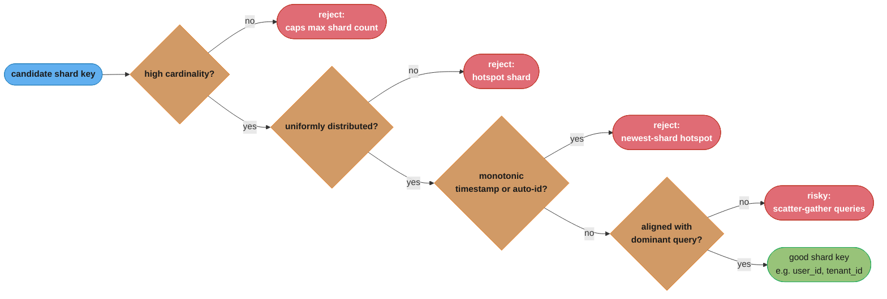
*Evaluating a candidate shard key against these four properties in order — cardinality, distribution, monotonicity, then query alignment — surfaces exactly why `user_id`/`tenant_id` pass and `timestamp`/`status` fail.*

### Good Shard Key Examples

- **user_id**: Uniform, high cardinality, aligns with user-centric access patterns. Used by most social platforms.
- **tenant_id**: For multi-tenant SaaS, shard by customer. Tenant isolation, easy to move tenants between shards.
- **geographic region**: When data locality is important (GDPR, latency). Query patterns often regional.
- **entity_id (hashed)**: Generic approach — hash any high-cardinality ID for uniform distribution.

### Bad Shard Key Examples

- **Timestamp**: Monotonic, creates write hotspot on newest shard.
- **Status field**: Low cardinality, can't scale past 2-3 shards.
- **Mutable field**: Shard keys should be immutable. If user changes email, their data would need to move shards — extremely expensive.
- **Non-query-aligned key**: Sharding by `product_id` when most queries are by `user_id` forces scatter-gather.

### Hotspot Shards

A hotspot occurs when one shard receives disproportionately more traffic than others:

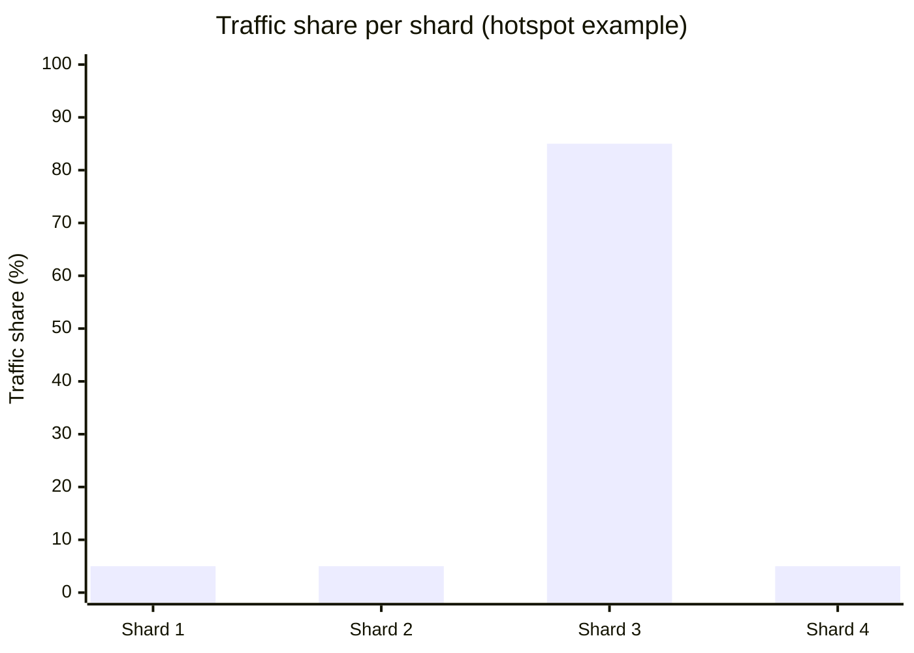
*Shard 3 absorbs 85% of traffic while its three siblings sit at 5% each — adding a 5th shard doesn't fix this, it just relocates the hotspot to whichever shard is now the "latest" one.*

**Solutions:**
- Use hash-based sharding instead of range-based for write-heavy workloads
- Add random suffix to hot keys: `user:12345:suffix_1`, `user:12345:suffix_2` (scatter writes across sub-shards)
- Identify celebrity/hot entities and route them specially (dedicated shard for top 1% entities)

---

## Sharding Strategies

### Range-Based Sharding

#### Concept
Divide the key space into contiguous ranges. Assign each range to a shard.

```
user_id range -> shard mapping:

Shard 1: user_id  1       - 10,000,000
Shard 2: user_id  10,000,001 - 20,000,000
Shard 3: user_id  20,000,001 - 30,000,000
Shard 4: user_id  30,000,001 - 40,000,000
```

#### ASCII Diagram

```
user_id: 1                                              100M
         |---------|---------|---------|---------|
         | Shard 1 | Shard 2 | Shard 3 | Shard 4 |
         | 0-25M   | 25-50M  | 50-75M  | 75-100M |
         |---------|---------|---------|---------|

Range query: user_id BETWEEN 10M AND 30M
  --> Only hits Shard 1 and Shard 2 (efficient!)

Range query: SELECT * ORDER BY user_id LIMIT 100
  --> Start at Shard 1, sequential (efficient!)
```

#### Routing Logic
```python
def get_shard(user_id: int, shard_ranges: list) -> int:
    for shard_id, (min_id, max_id) in enumerate(shard_ranges):
        if min_id <= user_id <= max_id:
            return shard_id
    raise ValueError(f"No shard found for user_id {user_id}")

shard_ranges = [
    (1, 25_000_000),        # Shard 1
    (25_000_001, 50_000_000), # Shard 2
    (50_000_001, 75_000_000), # Shard 3
    (75_000_001, 100_000_000), # Shard 4
]
```

#### Pros
- Range queries and ordered scans are efficient (hit one or few shards)
- Sequential data access is locality-aware
- Easy to reason about data placement

#### Cons
- Uneven distribution if data is skewed (e.g., most users have low IDs from early days)
- Monotonic keys cause write hotspots (all new users go to the last shard)
- Requires careful range planning; re-ranging is complex

---

### Hash-Based Sharding

#### Concept
Apply a hash function to the shard key, then use modulo to determine the shard number.

```
shard_id = hash(key) % num_shards
```

The hash function distributes keys pseudo-randomly across shards, achieving uniform distribution.

#### ASCII Diagram

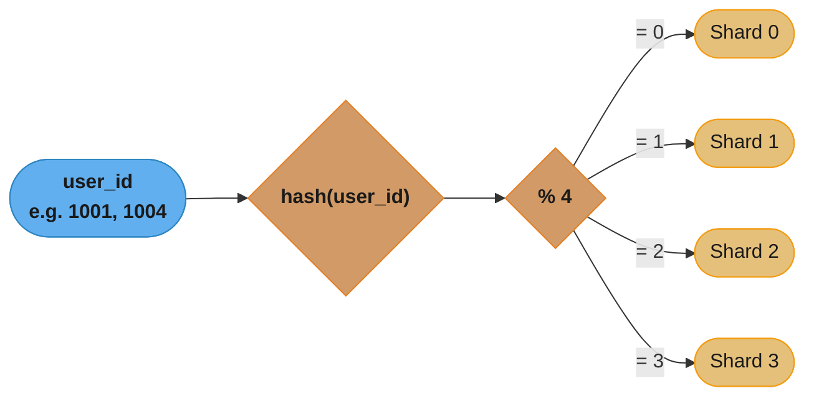
*Each user_id is hashed then reduced modulo 4; e.g. user 1001 hashes to 7238, 7238 % 4 = 2 → Shard 2, while user 1004 hashes to 4356, landing on Shard 0 — the pseudo-random hash spreads users roughly 25% per shard.*

#### Routing Logic
```python
import hashlib

def get_shard(key: str, num_shards: int) -> int:
    hash_value = int(hashlib.md5(key.encode()).hexdigest(), 16)
    return hash_value % num_shards

# Usage
shard = get_shard(str(user_id), num_shards=4)
```

#### The Resharding Problem
When you change `num_shards` from 4 to 5, almost every key maps to a different shard:
```
user_id: 1001 -> hash % 4 = 2 -> Shard 2 (old)
user_id: 1001 -> hash % 5 = 3 -> Shard 3 (new)

~80% of data must be moved to different shards during resharding!
This is why Consistent Hashing was invented (see that module).
```

#### Pros
- Excellent uniform distribution (no hotspots for uniform access patterns)
- Simple, deterministic routing
- Works well for point queries (lookup by exact key)

#### Cons
- Range queries require scatter-gather across all shards
- Resharding is expensive: large fraction of data must migrate
- Related data may end up on different shards (e.g., user and their orders)

---

### Directory-Based Sharding

#### Concept
Maintain a lookup table (directory) that maps each key (or key range) to its shard. Routing requires consulting this directory.

#### Architecture

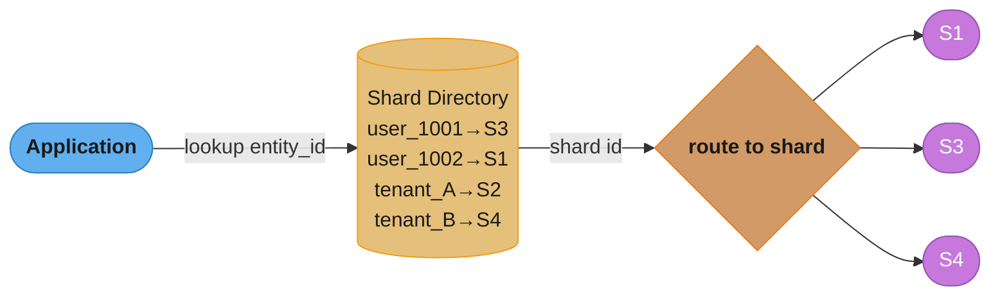
*The application asks the directory for an entity's shard id, then queries that shard directly — flexible (any entity can move to any shard) but the directory is now a bottleneck and single point of failure unless cached and made HA.*

#### Routing Logic
```python
class DirectoryShardRouter:
    def __init__(self, directory_db):
        self.directory = directory_db  # e.g., Redis or metadata DB

    def get_shard(self, entity_id: str) -> str:
        shard = self.directory.get(f"shard_map:{entity_id}")
        if not shard:
            # Assign to a shard (e.g., least-loaded)
            shard = self.assign_to_shard(entity_id)
            self.directory.set(f"shard_map:{entity_id}", shard)
        return shard

    def migrate_entity(self, entity_id: str, new_shard: str):
        # Move data, then update directory atomically
        migrate_data(entity_id, old_shard=self.get_shard(entity_id), new_shard=new_shard)
        self.directory.set(f"shard_map:{entity_id}", new_shard)
```

#### Pros
- Maximum flexibility: any entity can be moved to any shard at any time
- Can accommodate hotspots: move a hot entity to a dedicated shard
- No formula to change during resharding — just update the directory

#### Cons
- Directory is a bottleneck: every request needs a directory lookup
- Directory is a single point of failure (must be HA)
- Adds one network round-trip per request (mitigated by caching directory entries)
- Directory must be kept consistent with actual data placement

---

### Geographic / Zone-Based Sharding

#### Concept
Partition data by geographic region or logical zone. Users in Europe are stored in EU shards; users in the US are stored in US shards.

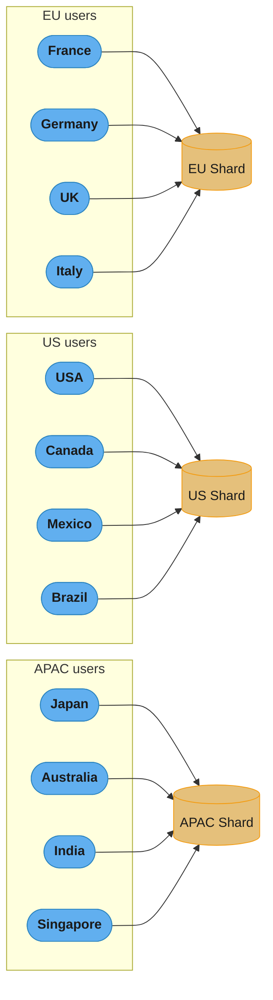
*Users are routed to the shard for their geographic zone — EU users' data never leaves EU shards, satisfying GDPR/data-residency requirements while also cutting latency.*

#### Routing Logic
```python
def get_shard(user_id: str, user_country: str) -> str:
    region_map = {
        'DE': 'shard_eu', 'FR': 'shard_eu', 'GB': 'shard_eu',
        'US': 'shard_us', 'CA': 'shard_us',
        'JP': 'shard_apac', 'AU': 'shard_apac', 'IN': 'shard_apac',
    }
    return region_map.get(user_country, 'shard_us')  # default
```

#### Use Cases
- **GDPR Compliance**: EU user data must remain in EU data centers. Geo-sharding enforces this at the infrastructure level.
- **Data Sovereignty**: Many countries (Russia, China, India) require local data residency.
- **Latency Optimization**: Serve EU users from EU database servers.
- **Multi-region Active-Active**: Each region's shard is the primary for its users, reducing write latency.

#### Pros
- Compliance with data residency laws (GDPR, CCPA)
- Reduced latency for users (data near them)
- Natural disaster isolation (US outage doesn't affect EU shard)

#### Cons
- Cross-region users (travelers, expats) may get worse performance
- Global analytics queries require cross-shard aggregation across regions
- Uneven shard sizes if user distribution is skewed geographically

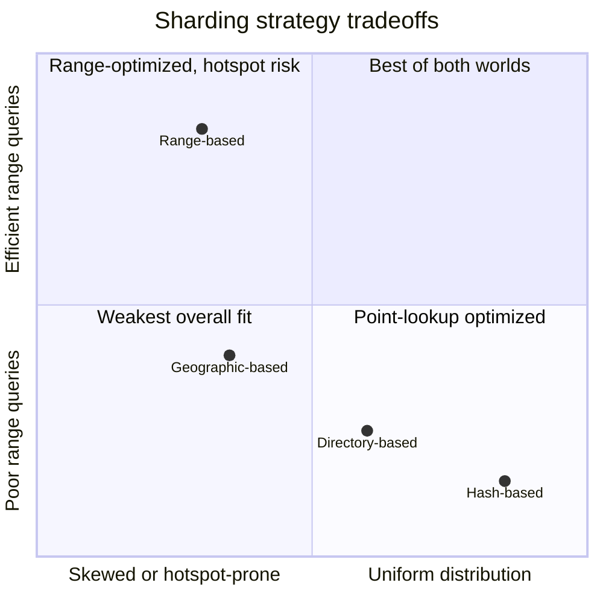
*Hash-based sharding trades range-query support for near-perfect distribution; range-based sharding makes the opposite trade; directory-based sits in the middle with the most operational flexibility; geographic sharding optimizes for compliance and locality rather than either axis.*

---

## Cross-Shard Queries

Cross-shard queries are one of the most significant operational challenges of sharding. Any query that cannot be satisfied by a single shard requires a more complex approach.

### Scatter-Gather Pattern

The most common approach: send the query to all relevant shards in parallel, then merge results at the application layer.

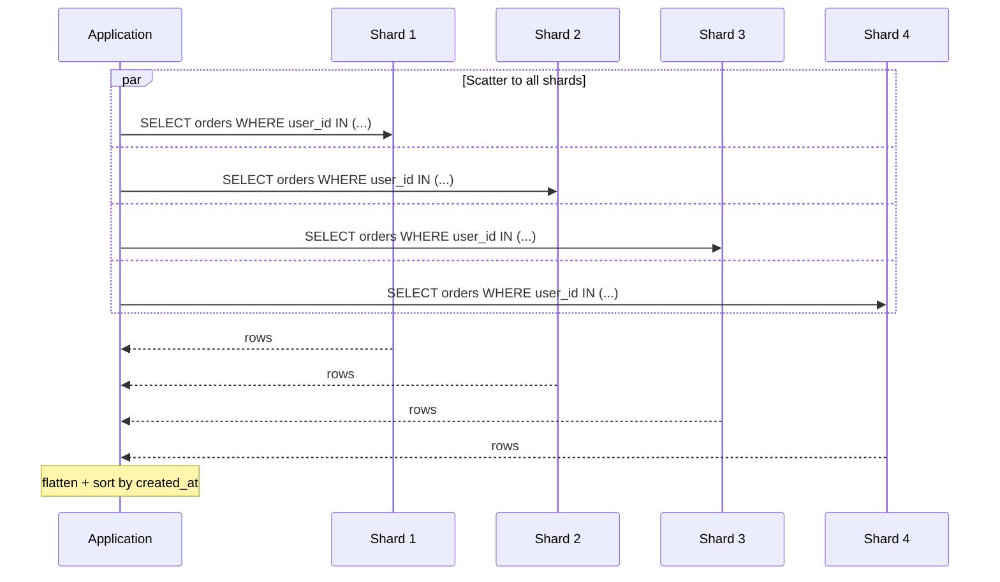
*Finding orders for 1,000 users spread across 4 shards means scattering the query to every shard in parallel and gathering results at the application layer; total latency is bounded by the slowest shard, not the sum of all four.*

**Cost**: Latency is max(shard latencies), not sum. But all shards are loaded simultaneously.

### Aggregation Challenges

```sql
-- Cross-shard COUNT (scatter-gather then sum)
SELECT COUNT(*) FROM users WHERE country = 'US'
-- -> Run on all shards, sum the counts

-- Cross-shard ORDER BY + LIMIT (expensive!)
SELECT * FROM posts ORDER BY created_at DESC LIMIT 20
-- -> Must get top 20 from each shard, merge all, re-sort, take top 20
-- -> With N shards: N * 20 rows fetched, only 20 kept
```

### Global / Broadcast Tables

Some small, frequently-joined lookup tables (countries, categories, config) should be replicated to all shards. This avoids cross-shard joins for common lookups.

```python
# In Vitess: broadcast tables are replicated to all shards
# In application: use local cache or local shard copy

# Example: "categories" table replicated to all shards
# "posts" table sharded by user_id
# JOIN posts with categories works locally on each shard
SELECT p.title, c.name
FROM posts p JOIN categories c ON p.category_id = c.id
WHERE p.user_id = 12345
-- Shard for user 12345 has a local copy of categories -> no cross-shard join
```

### Application-Level Joins

When joins are unavoidable across shards:
```python
# Fetch user from user shard
user = user_shard.get(user_id=12345)

# Fetch orders from order shard (sharded by order_id, not user_id)
# Must scatter-gather across all order shards
orders = scatter_gather(order_shards,
    query=f"SELECT * FROM orders WHERE user_id = {user_id}")

# Join in application
result = {**user, 'orders': orders}
```

---

## Resharding

Resharding is the process of redistributing data across a different number of shards. It is unavoidable as systems grow but is operationally complex and risky.

### The Problem with Simple Hash Resharding

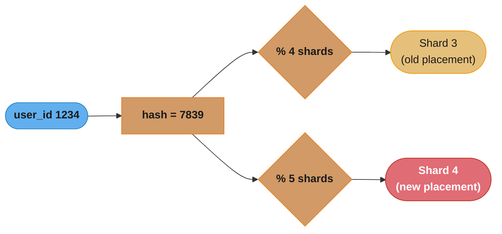
*The same hash (7839) reduced modulo 4 vs modulo 5 sends user 1234 to a completely different shard — this is why adding just one shard remaps roughly 80% of all keys under simple modulo hashing.*

### Consistent Hashing Approach

Consistent hashing maps keys to a ring and adds/removes shards with minimal data movement. See the `consistent_hashing` module for full details.

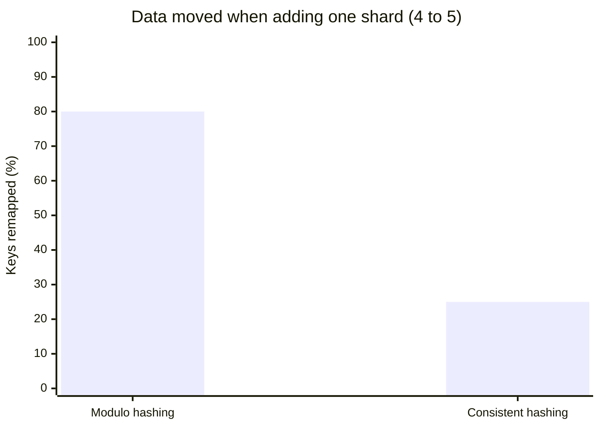
*Simple modulo hashing remaps ~80% of keys when going from 4 to 5 shards; consistent hashing bounds this to ~1/N (~25% here) by moving only the keys that fall in the new shard's ring segment.*

### Online Resharding (Zero-Downtime)

Production resharding must be done online, without service interruption:

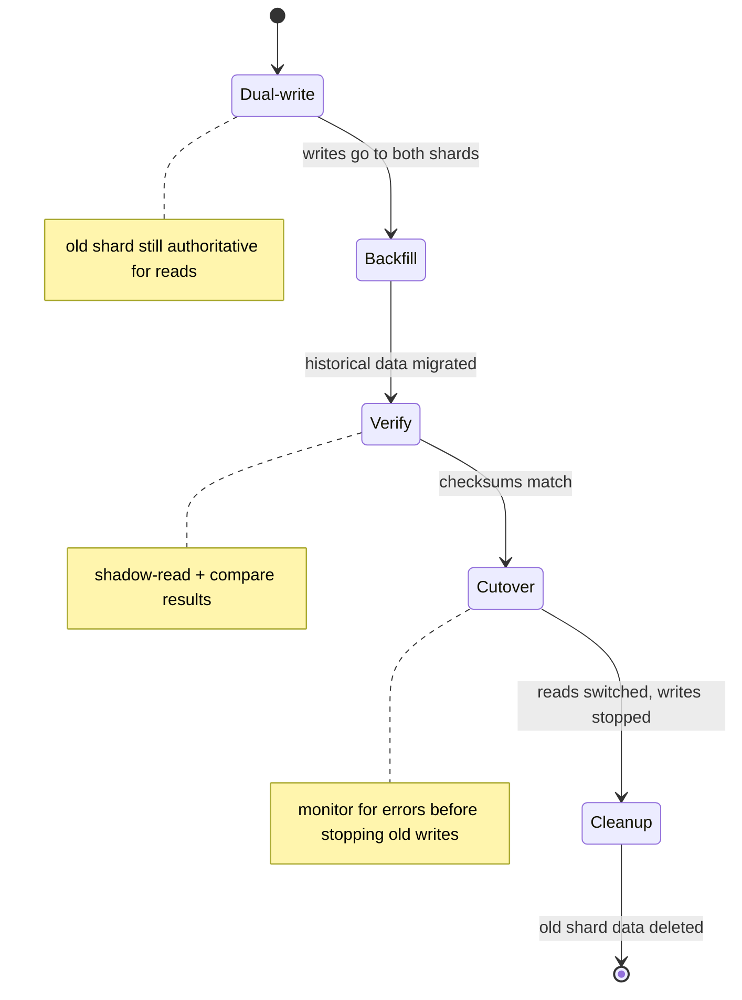
*Zero-downtime resharding moves through five gated phases — dual-write, backfill, verify, cutover, cleanup — each phase only starts once the previous one's data-consistency guarantee holds.*

### Vitess and CockroachDB Approaches

**Vitess** (used by YouTube, Slack):
- Supports online resharding via "VReplication"
- Tracks changes to source shards using binlog
- Zero-downtime resharding with automated cutover

**CockroachDB**:
- Automatic re-balancing — no manual resharding needed
- Ranges (shards) split and merge automatically based on size
- Rebalancing happens in the background with no user intervention

---

## Hotspot Handling

### The Celebrity Problem

A celebrity user (Beyoncé, Elon Musk) has millions of followers. Any action they take — posting, going live — triggers millions of fan requests to the same shard.

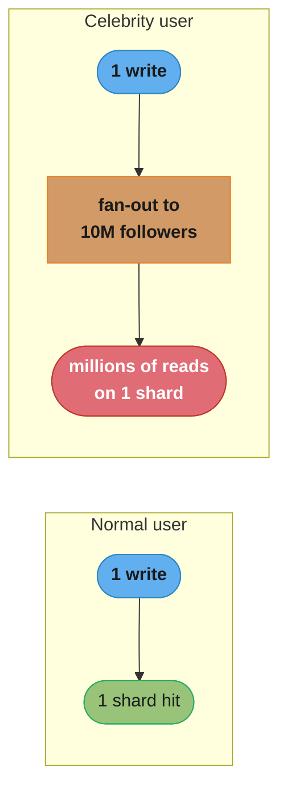
*A normal user's write hits exactly one shard once; a celebrity's write fans out to 10M followers, turning one write into millions of reads concentrated on a single shard — the root cause of the celebrity hotspot.*

### Solutions for Write Hotspots

**Key Salting / Suffix Randomization**
```python
# Instead of writing to one key:
write_key = f"celebrity:{user_id}"

# Write to N sub-keys, distributed across shards:
num_splits = 100
sub_shard = random.randint(0, num_splits - 1)
write_key = f"celebrity:{user_id}:{sub_shard}"

# Reading: must read all N sub-keys and merge
all_keys = [f"celebrity:{user_id}:{i}" for i in range(num_splits)]
results = scatter_read(all_keys)
merged = merge(results)
```

**Special-Case Hot Entities**
Identify top-N hot users/items and route them to dedicated "hot shards" with more resources.

**Caching Layer**
Add Redis/Memcached in front of the hot shard. Reads for celebrity profiles/content are served from cache, dramatically reducing DB load.

### Write Amplification

Some designs cause a single user action to trigger writes to many shards:

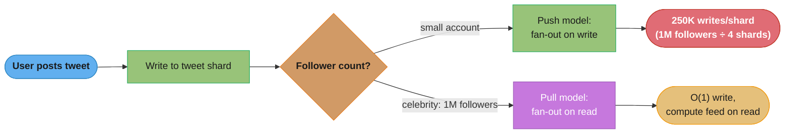
*A tweet write fans out to every follower's timeline; at 1M followers across 4 shards that's 250K writes per shard (write amplification). The fix is hybrid fan-out: push (fan-out-on-write) for small accounts, pull (fan-out-on-read) for celebrities.*

---

## Real-World Examples

### Instagram: PostgreSQL Sharding

Instagram started with a single PostgreSQL instance. As they scaled:
1. **Early sharding**: Manually sharded PostgreSQL across multiple servers, sharding by `user_id`
2. **Schema design insight**: Used UUIDs that encode shard ID, making routing deterministic
3. **ID format**: `id = timestamp_ms | shard_id | sequence` — first 41 bits timestamp, next 13 bits shard ID, last 10 bits local sequence
4. **Migration to Cassandra**: Eventually moved media metadata to Cassandra for better write scalability, while keeping social graph in PostgreSQL shards

### Discord: Cassandra Sharding

- Stores billions of messages in Apache Cassandra
- Shard key: `(channel_id, bucket)` — bucket groups messages by time range
- Cassandra's consistent hashing handles node additions automatically
- Challenge: "Discord server going down" (large guilds cause hot partitions)
- Solution: Moved to ScyllaDB for better per-shard performance

### YouTube: MySQL + Vitess

YouTube uses Vitess (MySQL sharding layer):
- Vitess acts as a MySQL-compatible proxy in front of many MySQL instances
- Transparent sharding: applications use standard SQL, Vitess routes to the right shard
- VSchema defines sharding rules (which tables are sharded, by what key)
- Online schema changes without locking tables
- Horizontal re-sharding without service interruption

### MongoDB Sharding

MongoDB has built-in sharding (called "sharded cluster"):
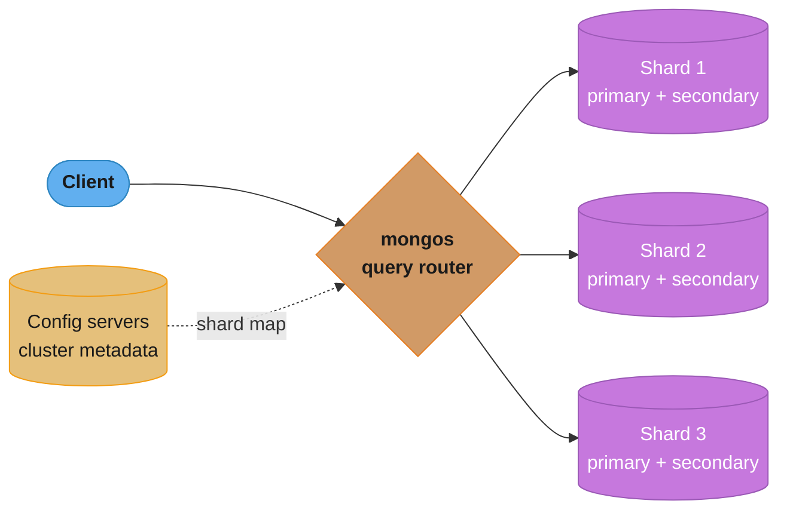
*mongos routes each query to the owning shard using metadata pulled from the config servers; MongoDB supports hashed, ranged, and zone sharding strategies, and mongos performs scatter-gather transparently across shards for cross-shard queries.*

---

## Shard Proxies

Shard proxies sit between the application and the database shards, abstracting the routing logic. Applications connect to the proxy using a standard DB protocol.

### Vitess

- Open-source, MySQL-compatible sharding proxy (CNCF project)
- Used by YouTube, Slack, GitHub, Pinterest
- Features: connection pooling, query routing, online schema changes, online resharding, row-based replication
- VTGate: query routing layer; VTTablet: per-shard agent

### ProxySQL

- High-performance MySQL proxy
- Can route queries to different shards based on rules (regex on query, user, schema)
- Not a full sharding solution — routing rules must be manually defined
- Excellent for read/write splitting and connection pooling

### Amazon RDS Proxy

- Managed proxy for RDS and Aurora
- Handles connection pooling to prevent connection exhaustion
- Not a sharding proxy per se — used within a single DB instance
- Useful in Lambda-heavy architectures where thousands of functions open DB connections

### Citus (PostgreSQL Extension)

- Transforms PostgreSQL into a distributed database
- Coordinator node routes queries to worker shards
- Worker nodes each hold a subset of data
- Supports distributed joins and aggregations natively
- Used by Microsoft Azure (managed offering: Azure Cosmos DB for PostgreSQL)

---

## Interview Questions

**Q1: What is the difference between sharding and replication?**

A: Replication copies the same data to multiple nodes for read scalability and high availability. All replicas hold identical data; writes go to the primary. Sharding distributes different data across nodes for write scalability and storage scaling. Each shard holds a unique subset of data. In production, you combine both: each shard has its own replica set.

**Q2: How do you choose a shard key?**

A: A good shard key must be: high cardinality (many distinct values), uniformly distributed (to avoid hotspots), non-monotonic (to avoid write hotspots on the newest shard), immutable (changing the key would require moving the record to a different shard), and aligned with query patterns (most queries should hit one shard). Common good choices: user_id, tenant_id. Common bad choices: timestamp, status, low-cardinality fields.

**Q3: What is a hotspot shard and how do you fix it?**

A: A hotspot occurs when one shard receives disproportionately more traffic than others. Causes: bad shard key (monotonic or low cardinality), "celebrity" entities that are extremely popular. Fixes: (1) Use hash-based sharding for even write distribution. (2) Key salting: write hot entities to multiple sub-keys spread across shards. (3) Caching layer in front of the hot shard. (4) Dedicated "VIP shard" for identified hot entities with more resources.

**Q4: How would you handle a cross-shard JOIN query?**

A: Options: (1) Scatter-gather: run the query on all relevant shards in parallel, merge results at the application layer. This works but requires application code to handle merging and sorting. (2) Denormalize data: store redundant data on the same shard so JOINs are local. (3) Broadcast/global tables: replicate small lookup tables to all shards. (4) Avoid cross-shard JOINs in the schema design by co-locating related data on the same shard (e.g., both user and user's orders share the same user_id shard key).

**Q5: How does resharding work and what are the challenges?**

A: Resharding redistributes data when adding or removing shards. With simple hash modulo, changing N to N+1 shards moves ~80% of data. Consistent hashing reduces this to ~1/N. Online resharding steps: (1) dual-write to old and new shard, (2) backfill historical data in background, (3) verify consistency, (4) cutover reads, (5) clean up old shard. Challenges: maintaining consistency during migration, handling in-flight requests during cutover, throttling migration to avoid impacting production.

**Q6: What is the celebrity problem in social media platforms and how is it handled?**

A: When a celebrity user with millions of followers posts something, the system generates millions of notifications/updates simultaneously, creating a massive spike on the shard storing that celebrity's data. Solutions: (1) Pull-based fan-out for celebrities — don't pre-compute timelines for large accounts, compute on read. (2) Key salting — distribute writes across multiple sub-shards. (3) Identify hot entities and give them dedicated shards or move them to a hot-shard cluster with more resources.

**Q7: How would you design a globally distributed database that complies with GDPR?**

A: Use geographic sharding to ensure EU user data stays in EU data centers. Shard by user_id with a metadata lookup that records which region a user belongs to. EU users are assigned EU shard IDs, US users are assigned US shard IDs. The EU shards physically reside in EU AWS/GCP regions. Ensure no cross-region replication of EU data. For global analytics, use anonymization/aggregation pipelines that don't expose individual data cross-region.

**Q8: What is consistent hashing and why is it used in sharding?**

A: Consistent hashing maps both shards and keys to positions on a ring. A key is assigned to the nearest shard in clockwise direction. Adding a shard only requires moving data from one neighboring shard — approximately 1/N of total data (not 80%+ as with modulo hashing). Virtual nodes (each physical shard occupies multiple ring positions) ensure even distribution even with few shards. Used by DynamoDB, Cassandra, and consistent-hashing-based sharding implementations.

**Q9: What are the tradeoffs between range-based and hash-based sharding?**

A: Range-based: good for range queries and ordered scans (hits one or few shards), but risks hotspots with monotonic keys and uneven distribution with skewed data. Hash-based: excellent uniform distribution, no hotspots for uniform access, but range queries require scatter-gather across all shards, and resharding is expensive (most keys remap). Choosing depends on workload: time-series / range-heavy queries favor range-based; random point lookups favor hash-based.

**Q10: How does Vitess enable online resharding?**

A: Vitess uses VReplication, which streams MySQL binlog changes from source shards to target shards in real-time. Process: (1) Create new target shards. (2) VReplication copies existing data via backfill. (3) VReplication continuously applies binlog changes to keep target in sync. (4) Once target is caught up, pause traffic, do final sync, update routing in VTGate, resume traffic. (5) Old shards become inactive and can be cleaned up. Total downtime is seconds.

**Q11: How would you design the sharding strategy for an e-commerce platform like Amazon?**

A: Separate different data types with different strategies: (1) User data: shard by user_id (hash-based), co-locate user profiles, addresses, preferences. (2) Product catalog: shard by product_id (hash-based), replicate popular products to all shards. (3) Orders: shard by user_id (so a user's orders are on one shard), not order_id. (4) Inventory: shard by product_id and warehouse_id, keep inventory updates local to each warehouse shard. (5) Search index: Elasticsearch with its own sharding handles product search. The hardest query is "all orders for a product" — requires a secondary index or scatter-gather since orders are sharded by user.

**Q12: What is a "scatter-gather" query and when does it become a problem?**

A: Scatter-gather sends a query to all shards simultaneously and merges results. It becomes problematic when: (1) Low selectivity — returning large result sets from all shards. (2) Complex aggregations — like global ORDER BY with LIMIT requires fetching many rows from each shard. (3) Deep pagination — page 1000 of results requires fetching 1000 * page_size rows from each shard. (4) Number of shards is large — latency is still bounded by slowest shard, but resource usage scales linearly. Mitigations: avoid unbounded queries, add query execution limits, use materialized aggregates, choose shard keys that align with common query patterns.

**Q13: What's the advantage of mapping 1000 "logical" shards onto 100 physical hosts instead of just using 100 shards directly?**

A: Logical shards decouple capacity changes from data movement, since you can remap which physical host owns a logical shard without touching the shard-assignment formula. The Instagram case study uses exactly this: `shard_id = user_id % 1000` never changes, but the Redis-cached logical-to-physical lookup table can move any of those 1000 logical shards to a different host. Adding capacity becomes "take a heavily loaded host's 10 logical shards, migrate 5 of them to a new host" rather than a full resharding event that remaps every key's formula — Instagram's own 50-to-100-host resharding took 4 hours of data movement with zero downtime. Provision more logical shards than your current physical host count from day one, since splitting an already-deployed shard later is far more expensive than moving a pre-existing one.

**Q14: A tweet from a user with 1M followers, sharded across 4 shards, produces how much write amplification with fan-out-on-write, and how do you avoid it?**

A: Fan-out-on-write turns one write into roughly 250,000 writes per shard — 1M followers divided across 4 shards, all triggered by a single post. The "Write Amplification" section's diagram shows this concretely: a normal user's post is one write to one shard, but a celebrity's post fans out to every follower's feed table, so the write cost scales with follower count, not with the number of posts. The fix is the hybrid model used throughout this module and its case studies: fan-out-on-write (push) for small accounts where follower count is manageable, and fan-out-on-read (pull) for celebrity accounts, where the feed is assembled from the celebrity's own shard at read time instead of pre-computed into millions of follower feeds. Decide the push/pull boundary by a follower-count threshold, and monitor it, since an account can cross that threshold as it grows.

**Q15: What's the fundamental tradeoff of directory-based sharding compared to hash- or range-based sharding?**

A: Directory-based sharding trades routing simplicity for placement flexibility: any entity can move to any shard, at the cost of a lookup on every request's path. Hash- and range-based sharding compute the shard from the key itself with no external state, so there's nothing extra to keep available or consistent; a directory-based router, by contrast, becomes a single point of failure and a potential bottleneck unless it's cached and made highly available itself. The payoff is real: a directory lets you rebalance a hot entity onto its own dedicated shard, or migrate a tenant, without changing a formula that every other key also depends on — exactly what Instagram's logical-shard-to-host mapping and the module's directory-based approach both exploit. Cache directory entries aggressively — Instagram sees a 99.97% Redis hit rate on its shard lookup — so the common case avoids the extra network hop entirely.

**Q16: Why did Instagram embed the shard ID inside the photo ID itself instead of always doing a directory lookup?**

A: Embedding the shard ID lets you route a request to the correct shard using only the ID you already have, with no extra database or cache lookup required. Instagram's 64-bit scheme packs 41 bits of timestamp, 13 bits of shard ID, and 10 bits of per-shard sequence into every photo_id, so recovering the shard is a pure bit-shift operation — given a photo_id from a permalink URL, you know its shard instantly. This only works because the shard_id is embedded at write time from a value that's already being computed (`user_id % 1000`), and it trades away the flexibility of a pure directory lookup: since the shard is baked into the ID forever, moving that entity to a different logical shard later is no longer possible without changing its ID. Reach for an embedded-ID scheme when reads by ID (not by owning entity) are common and you want to eliminate the lookup hop; keep a separate directory when entities need to migrate shards over their lifetime.

---

## Cross-Perspective: LLD Connections

**LLD View — Design Patterns That Implement Database Sharding**

- **Strategy** — Sharding strategies (hash sharding, range sharding, directory/lookup sharding, geographic sharding) are the textbook Strategy pattern: each encapsulates a shard assignment algorithm behind a `ShardingStrategy` interface — swappable as requirements evolve.
- **Proxy** — Shard proxies (ProxySQL, Vitess) are Proxy pattern: applications connect to the proxy with a standard connection string; the proxy routes queries to the correct shard transparently based on the shard key in the query.
- **Factory** — A `ShardConnectionFactory` creates and manages connections to the correct shard given a shard key, hiding connection pool management and shard topology from service code.
- **Observer** — Resharding events (adding nodes, rebalancing) broadcast to Observer subscribers: connection pool managers refresh their routing tables; cache invalidators clear stale shard-local caches; monitoring systems update topology dashboards.

---

## Best Practices

### 1. Shard Key Immutability
The shard key should never change for a record's lifetime. Changing the shard key requires deleting the record from the old shard and inserting it in the new one — this is a distributed transaction and extremely difficult to do safely at scale. Design your data model so the natural identifier is immutable.

### 2. Avoid Cross-Shard Transactions
Distributed transactions (two-phase commit) across shards are slow, complex, and reduce availability. Design your shard key so related data that must be updated atomically lives on the same shard. Accept eventual consistency for data that spans shards.

### 3. Co-locate Related Data
If orders always belong to a user, shard orders by user_id (not order_id). This ensures a user's orders are always on the same shard as their profile, enabling efficient local queries without cross-shard operations.

### 4. Build in Shard Awareness from Day One
Retrofitting sharding onto an existing system that assumed a single database is extremely painful. Design your data access layer to accept a shard ID or to route via a shard router from the beginning. This doesn't mean you need multiple shards on day one — just ensure the abstraction exists.

### 5. Monitor Per-Shard Metrics
Track per-shard: QPS, latency, connection count, storage utilization, replication lag. A single overloaded shard will degrade overall system performance. Alert on any shard that is >80% of its capacity limits.

### 6. Plan for Resharding
Even with consistent hashing, resharding is operationally complex. Have a tested, documented resharding runbook before you need it. Practice resharding in staging. Automate as much as possible (Vitess VReplication, CockroachDB automatic rebalancing).

### 7. Keep Shards Small Enough to Manage
A shard that holds 5TB of data takes days to rebuild from backup or migrate. Aim for shards of reasonable size (100-500GB) that can be operated quickly. More, smaller shards are easier to manage than fewer, larger shards.

### 8. Use a Sharding Proxy
Putting sharding logic in application code creates a maintenance nightmare as routing tables change. Use a sharding proxy (Vitess, Citus) to abstract this. The proxy handles routing, connection pooling, and schema changes transparently.

---

**Cross-references:** [database/sharding_and_partitioning](../../database/sharding_and_partitioning/) (shard-key selection, resharding mechanics, hotspot mitigation), [database/newsql_and_distributed_sql](../../database/newsql_and_distributed_sql/) (Vitess, CockroachDB, Spanner-style auto-sharding).

---

## Case Study: Instagram Photo Database Sharding

### Problem Statement

Instagram stores photo metadata for 1B users with 100B photos. Photos are immutable after upload, simplifying consistency. Scale:

- Users: 1B accounts, 500M monthly actives
- Photos: 100B records, 5M new uploads/day, ~50M/day peak
- Photo metadata size: ~500 bytes (id, user_id, caption, location, timestamps, S3 URL); blob in S3
- Read QPS: 200k (profile views, feed loads)
- Write QPS: 600/sec sustained, 6k/sec peak (post upload spikes)
- Latency SLA: p99 metadata read < 5 ms, p99 write < 30 ms
- Availability: 99.99%

The strategy: 1000 logical shards mapped to 100 physical PostgreSQL instances (10 shards/instance). Shard key is `user_id`, so all of a user's photos live on one shard, enabling profile-page queries with a single shard hit. The logical-to-physical mapping is stored in a lookup table cached in Redis, so resharding is a metadata-only operation (remap logical shards to physical hosts) rather than data movement.

### Architecture Overview

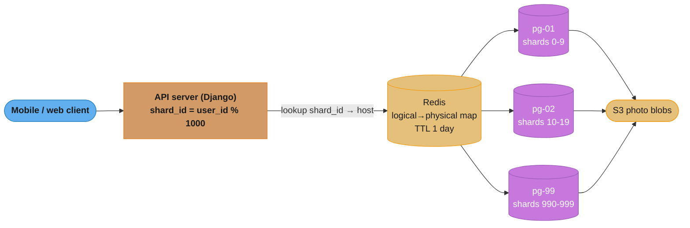
*Requests flow from the client through the API layer's shard_id formula, a Redis-cached logical-to-physical map (99.97% cache hit rate), to one of 100 PostgreSQL hosts (10 shards each); photo blobs live separately in S3.*

### Key Design Decisions

1. **Shard key = `user_id`** — Collocates all of a user's photos on one shard. Profile page (most common query) hits one shard. Feed assembly fans out, but that's already inherent to social feeds.
   - *Alternative rejected*: shard by `photo_id` — every profile page becomes scatter-gather across 1000 shards.

2. **1000 logical shards over 100 physical hosts** — Logical shards provide flexibility: rebalance by remapping shard→host without data movement. Adding capacity = split a host's 10 shards across 2 new hosts (5 each), then move the data.
   - *Alternative rejected*: 100 shards (1 per host) — no room for rebalancing without splitting shards (expensive).

3. **Immutable photos simplify consistency** — No updates means no write-write conflicts, no cross-shard transactions for photo data. Edits (caption change) are rare and handled as new versions.

4. **Separate metadata (PG) from blobs (S3)** — Metadata is small and indexed; blobs are large and benefit from object storage's cheap durability and CDN edges. Keeps PG row size small (fits more rows per page).

5. **Lookup table cached in Redis with 1-day TTL** — Avoids hitting a single config DB on every request. Resharding events write through to Redis and invalidate stale entries.

6. **Pre-generated ID with embedded shard hint** — Instagram's 64-bit ID scheme: 41 bits timestamp + 13 bits shard_id + 10 bits sequence. The shard_id is embedded in the photo_id so given a photo_id you can route to the correct shard without a lookup.

7. **No cross-shard JOINs** — Feed assembly is done at the application layer: query each followee's shard for recent photos, merge in memory. Acceptable because the followee count for a typical user is bounded (median ~200).

### Implementation

ID generation scheme:

```python
import time

EPOCH_MS = 1314220021721  # Instagram epoch
SHARD_BITS = 13
SEQUENCE_BITS = 10

def generate_photo_id(user_id: int, sequence: int) -> int:
    now_ms = int(time.time() * 1000) - EPOCH_MS
    shard_id = user_id % 1000  # 1000 logical shards
    photo_id = (now_ms << 23) | (shard_id << 10) | (sequence & 0x3FF)
    return photo_id

def shard_from_photo_id(photo_id: int) -> int:
    return (photo_id >> 10) & 0x1FFF
```

Schema on each shard:

```sql
CREATE TABLE photos (
    photo_id      BIGINT PRIMARY KEY,
    user_id       BIGINT NOT NULL,
    s3_key        TEXT NOT NULL,
    caption       TEXT,
    location_id   BIGINT,
    created_at    TIMESTAMP NOT NULL DEFAULT NOW(),
    INDEX idx_user_created (user_id, created_at DESC)
);

-- Per-shard sequence for monotonic IDs
CREATE SEQUENCE photo_seq INCREMENT 1 START 1;
```

Shard router with Redis cache:

```java
public class ShardRouter {
    private final JedisPool redis;
    private final ConcurrentHashMap<Integer, DataSource> hostPools;

    public DataSource routeByUserId(long userId) {
        int logicalShard = (int)(userId % 1000);
        String host = redis.getResource().get("shard:" + logicalShard);
        if (host == null) {
            host = fetchFromConfigDb(logicalShard);
            redis.getResource().setex("shard:" + logicalShard, 86400, host);
        }
        return hostPools.get(host.hashCode());
    }
}
```

### Tradeoffs

| Approach | Profile query cost | Resharding cost | Hot-key risk | Best for |
|----------|-------------------|----------------|--------------|----------|
| Shard by user_id (chosen) | 1 shard hit | Logical remap | Celebrities | Social media |
| Shard by photo_id | 1000-shard scatter | Logical remap | None | Random-access only |
| Shard by date | 1 shard for today | New shards over time | Today's shard hot | Time-series |
| Single MySQL + read replicas | 0 routing | None | All on primary | Small scale |

### Metrics & Results

- p50 profile load: 3 ms; p99: 11 ms (SLA: 50 ms end-to-end)
- p99 photo upload metadata write: 24 ms
- 10B photo metadata rows, ~50 GB per physical host
- Resharding from 50 to 100 hosts: 4 hours of data movement, zero downtime
- Redis cache hit rate on shard lookup: 99.97%
- Cost: ~$45k/month for 100 PG hosts (db.r5.xlarge) + S3 storage
- Throughput headroom: 4x current load before next reshard

### Common Pitfalls / Lessons Learned

1. **Initial shard key was `photo_id`** — Broken: profile page issued queries to all 1000 shards. p99 was 800 ms. Fix: re-shard to `user_id`; required a 3-week migration with dual-writes during cutover. Lesson: pick the shard key based on the dominant query pattern, not the natural primary key.

2. **Celebrity hotspot (Cristiano Ronaldo)** — Broken: a single user_id with 10M photos and 500k follower-feed reads/sec collapsed onto one shard, peaking at 90% CPU. Fix: detect users above a threshold (100k photos or 100k follower reads/min), promote them to a "celebrity shard" with dedicated hardware (db.r5.4xlarge) and aggressive caching.

3. **Lookup table as single point of failure** — Broken: the config DB holding shard→host mapping became a bottleneck during deploys when caches were cold; thousands of services hit it simultaneously. Fix: cache in Redis with 1-day TTL, pre-warm caches at service startup, and gossip mapping updates via pub/sub instead of cold reads.

4. **Cross-shard JOIN for the home feed** — Broken: tried JOINing photos with follower lists across shards; p99 hit 2 seconds. Fix: fan-out-on-write architecture — push photo_ids into each follower's feed table at upload time. Tradeoff: more storage, but read is O(1) per shard.

### Interview Discussion Points

**Q1: Why 1000 logical shards instead of 100 physical shards?**
Logical shards let you remap (shard_42 → new_host) without moving data initially; you only move data when you split (shard_42 → shard_42a + shard_42b). This decouples capacity addition from physical migrations. Starting with more logical shards than you need leaves headroom for years of growth.

**Q2: How do you handle a hot shard caused by a celebrity user?**
Detect via per-user metrics (photo count, read QPS) and promote celebrities to a dedicated shard with larger hardware and a higher read-replica count. Front the celebrity shard with a CDN-edge cache (5-minute TTL on profile data). For extreme cases (Beyoncé level), shard a single user's photos across multiple shards by photo_id range.

**Q3: How does fan-out-on-write differ from fan-out-on-read for feeds?**
Fan-out-on-write: at upload time, push photo_id into every follower's feed table. Read is O(1), write is O(followers). Fan-out-on-read: at read time, query each followee's recent photos and merge. Read is O(followees), write is O(1). Instagram uses fan-out-on-write for most users, fan-out-on-read for celebrities (would explode storage otherwise).

**Q4: How is a new shard added to the cluster?**
Provision a new physical host. Pick a heavily loaded host with 10 shards; move 5 shards to the new host using PostgreSQL logical replication or pg_dump/restore. Update the Redis mapping. Old host now serves 5 shards, new host serves 5 — same logical shard count, double the capacity for those users.

**Q5: Why are photos immutable, and how do edits work?**
Immutable photos mean no write-write conflicts, no cross-shard transactions, no need for distributed locks. Caption edits create a new metadata row (versioned) while the old row remains. Deletes are soft (a `deleted_at` flag) so backfills and analytics still see history.

**Q6: How would you detect that you need to reshard?**
Monitor per-physical-host: storage utilization, write IOPS, replication lag, query latency. Alert when any host crosses 70% of any limit. Also track per-shard size and QPS — if one logical shard is 5x the median, it's a candidate for split before the whole host degrades.

**Q7: Why embed shard_id in the photo_id?**
Given a photo_id (e.g., a permalink URL), you can route to the correct shard without an extra DB lookup. The 13-bit shard_id supports up to 8192 shards, far beyond the current 1000. The 41-bit timestamp gives 69 years of unique IDs; the 10-bit sequence handles 1024 photos/ms per shard.
