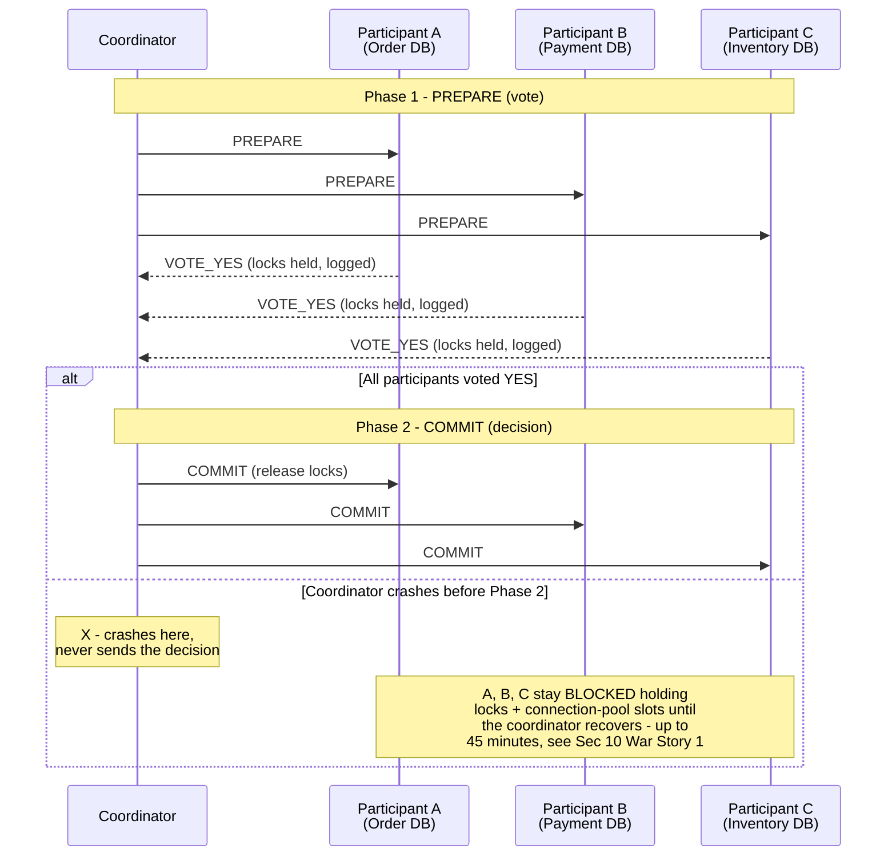
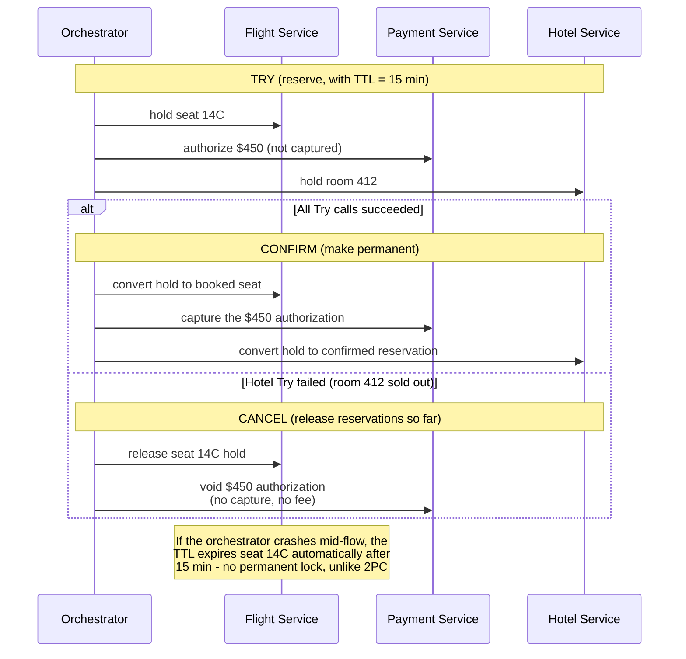
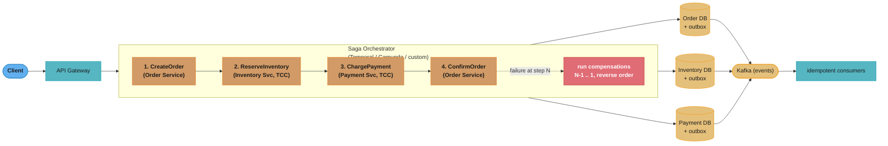
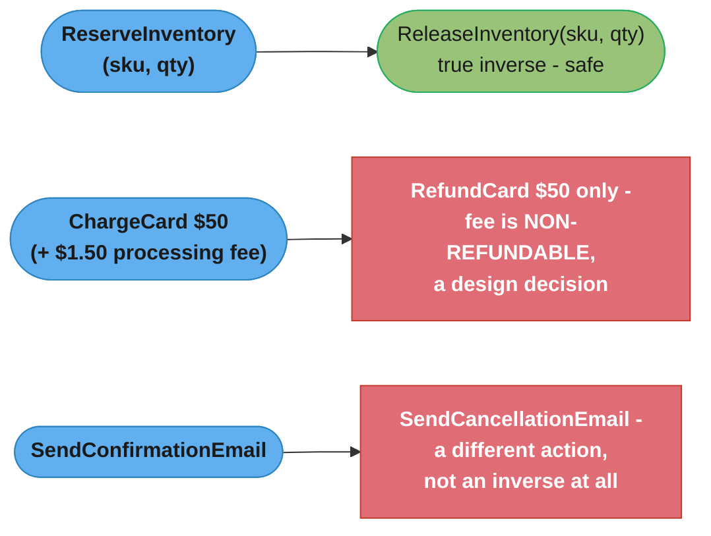
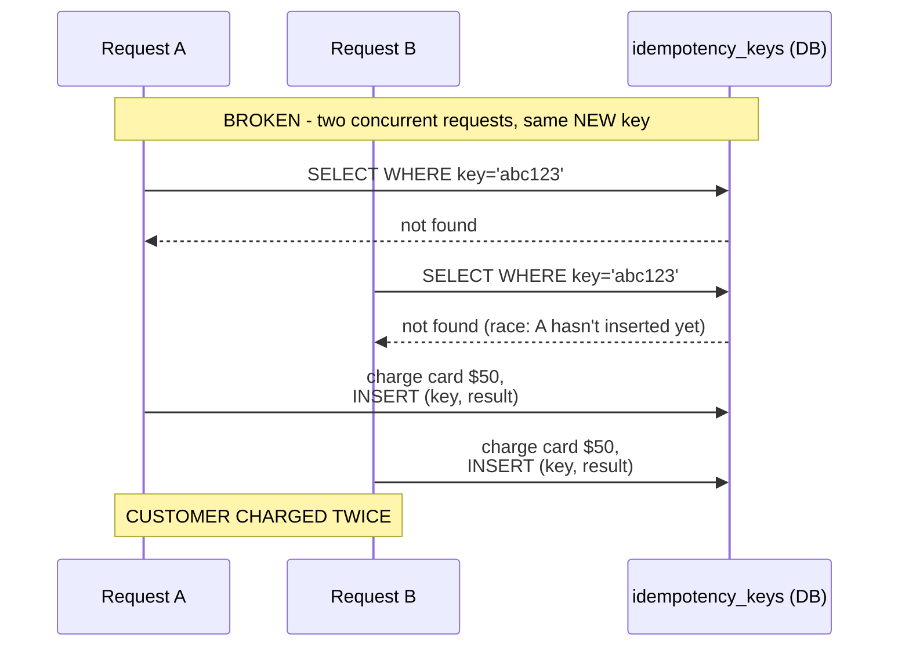
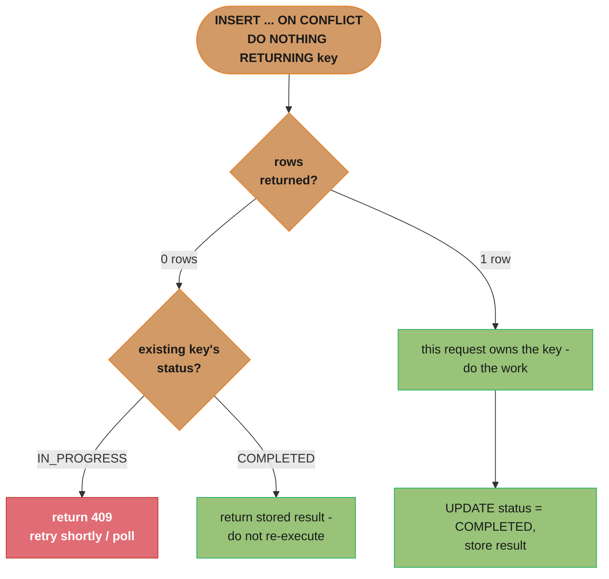
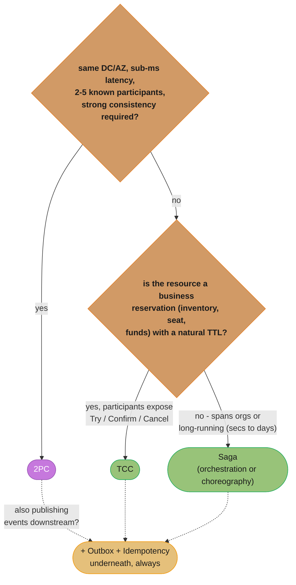
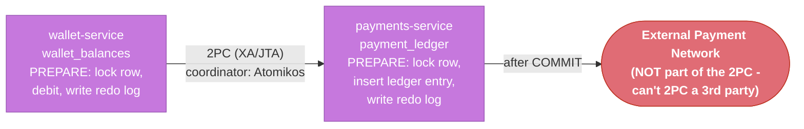
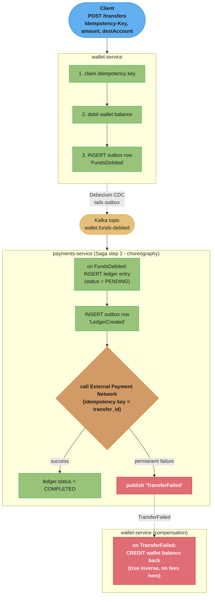

# Distributed Transactions

## 1. Concept Overview

A **distributed transaction** is a unit of work that spans multiple independent data stores, services, or even organizations, and that must appear to either fully succeed or fully fail — even though no single component can see or control the whole operation. A single-node ACID transaction gets atomicity for free from the database's write-ahead log and lock manager. The moment that "transaction" crosses a network boundary — Order Service writes to its own Postgres while Payment Service charges a card via Inventory Service's database — atomicity is no longer free. It must be engineered.

This module is the architectural decision layer for that problem: **when do you need cross-service consistency at all, and which mechanism — Two-Phase Commit, Saga, TCC, or the Outbox pattern — fits the failure modes and latency budget of the system you're designing?** It deliberately stays at the "what and why" level. The "how" — XA drivers, Kafka transactional producers, Debezium CDC connectors, `@Transactional` propagation — lives in the deep-dive companions linked from §13.

The central tension every design in this module navigates is the same one CAP describes at the data layer: **you can have strong cross-service atomicity, or you can have availability and low coupling during partial failures, but distributed systems make it very expensive to have both.** Two-Phase Commit chooses the first; Saga chooses the second; TCC and the Outbox pattern are pragmatic middle grounds that narrow the window of inconsistency without paying 2PC's blocking cost.

---

## 2. Intuition

> **One-line analogy**: Booking a vacation — flight, hotel, and rental car — from three different companies. You want "all three or none," but no single company can lock the others' inventory while you decide. Either you call all three, get a tentative hold from each, then confirm all three (Two-Phase Commit / TCC) — or you book the flight first, and if the hotel falls through, you cancel the flight afterward (Saga with compensation).

**Mental model**: A distributed transaction coordinator is a meeting organizer trying to schedule a call across people in different time zones who don't share a calendar. Two-Phase Commit is "everyone, hold this slot and don't book anything else until I confirm" — it works, but if the organizer disappears after asking, everyone sits frozen holding their slot. Saga is "book it, and if something later falls through, send a cancellation" — nobody is frozen, but for a window of time the world is in an inconsistent state (your flight is booked, your hotel isn't yet), and the cancellation has to actually be possible (you can't "uncancel" a non-refundable fee).

**Why it matters**: This is the single most common point where microservices architectures fail in production. The decomposition in `microservices/` (§4.4 Data Management) creates the *need* for this module — once each service owns its own database, "atomically update Order and Inventory" is no longer a single SQL transaction. Get this wrong and you get double-charged customers, oversold inventory, or — in the case of a mishandled 2PC coordinator crash — a production database with tables locked for 45 minutes (see §10).

**Key insight**: Idempotency is not optional — it is the load-bearing assumption underneath every pattern in this module. Saga retries a failed step; the Outbox relay redelivers a message after a crash; a client retries a timed-out request. Every one of these "retry" mechanisms means **the same operation can be executed more than once**, and if "charge $50" isn't idempotent, "retry-safe" silently becomes "double-charge-prone." Idempotency keys (§4.6) are the single highest-leverage pattern in this entire module.

---

## 3. Core Principles

**1. Atomicity does not survive a network hop for free.**
A local ACID transaction is atomic because one process holds the locks and writes one WAL. The instant two processes are involved, "commit" on one and "commit" on the other are two separate events that can be arbitrarily far apart in time — and the network between them can fail in the gap.

**2. Every distributed transaction protocol is a tradeoff between blocking and consistency.**
2PC achieves strong consistency by making participants block (hold locks) until the coordinator decides. Saga achieves non-blocking participants by accepting a window of visible inconsistency. There is no protocol that gives you both strong consistency *and* non-blocking participants *and* tolerance of arbitrary node failures — this is a direct corollary of the FLP impossibility result and the same forces behind CAP.

**3. Compensation is not the inverse of an action — it is a separate action with its own failure modes.**
"Refund the charge" is not "un-charge the card" — it's a new transaction that itself can fail, can have side effects (a non-refundable processing fee), and can itself need to be retried idempotently.

**4. The "dual write" problem is the root cause of most distributed-transaction bugs.**
Any time a service does "write to my database" AND "publish an event / call another service" as two separate operations, there is a window where one succeeds and the other doesn't. The Outbox pattern (§4.5) exists specifically to collapse these two writes into one local ACID transaction.

**5. Prefer narrowing the inconsistency window over eliminating it.**
In practice, almost no production system achieves true cross-service atomicity. The realistic goal is: make the inconsistency window short, make it observable (so reconciliation jobs can find and fix it), and make every operation in that window idempotent and retry-safe.

---

## 4. Types / Architectures / Strategies

### 4.1 Two-Phase Commit (2PC)

A coordinator asks every participant to **prepare** (acquire locks, write to its log, vote yes/no) in phase 1. Only if *all* participants vote yes does the coordinator tell everyone to **commit** in phase 2; if any vote no (or time out), it tells everyone to **abort**. This is the XA standard implemented by JTA transaction managers (Atomikos, Bitronix, Narayana).

- **Guarantee**: strong, all-or-nothing atomicity across participants.
- **Cost**: every participant holds locks (and connections) from "prepare" until "commit/abort" arrives — potentially forever if the coordinator crashes mid-protocol. This is the **blocking problem** (§6.1, §10).

### 4.2 Three-Phase Commit (3PC)

Adds a **pre-commit** phase between prepare and commit, plus per-step timeouts, so that participants can independently decide to commit if the coordinator disappears *after* pre-commit (since pre-commit means "everyone has already voted yes"). This removes the indefinite-blocking failure mode of 2PC *under non-partitioned failures*.

- **Guarantee**: non-blocking under coordinator crash (no network partition).
- **Cost**: an extra network round trip on every transaction; still vulnerable to inconsistency under network partitions (a partitioned-off participant can independently commit while the rest of the cluster aborts). **3PC is rarely used in practice** — it's covered here because it appears in interviews as "what 2PC is missing," but real systems jump straight to Saga or TCC instead.

### 4.3 Saga Pattern (Orchestration vs. Choreography)

A saga is a sequence of **local transactions**, each committing independently, where each step *i* has a corresponding **compensating transaction** *C(i)* that semantically undoes step *i* if a later step fails. There is no global lock and no coordinator that blocks participants.

- **Orchestration**: a central Saga Orchestrator explicitly calls each service and, on failure, calls compensations in reverse order.
- **Choreography**: each service publishes an event on completion; the next service reacts to that event. No central coordinator — failure handling is distributed across event listeners.

> This module covers Saga at the decision level (§8, §9) only. The full mechanics — event store, choreography vs. orchestration code, and a worked compensating-transaction example — live in [Event Sourcing & CQRS](../event_sourcing_cqrs/README.md) (§4 "Saga: Choreography vs Orchestration") and [Microservices](../microservices/README.md) (§6.2).

### 4.4 TCC — Try / Confirm / Cancel

TCC splits each participant's work into three explicit operations instead of relying on database locks:

- **Try**: reserve resources without committing them (e.g., place a hold on inventory, authorize — but don't capture — a card).
- **Confirm**: make the reservation permanent (capture the payment, decrement the reserved stock).
- **Cancel**: release the reservation (void the authorization, release the inventory hold).

TCC is "2PC at the application layer" — the "Try" phase is the prepare/vote, and "Confirm"/"Cancel" are the commit/abort, except the resource being reserved is a *business resource* (an inventory unit, a card authorization), not a database row lock. This means a Try can have a TTL ("this hold expires in 15 minutes") — something a database lock cannot safely do. TCC is the dominant pattern in payment and travel-booking systems for exactly this reason.

### 4.5 Outbox Pattern

Solves the dual-write problem (§3, principle 4) by writing the "event to publish" into an `outbox` table **in the same local database transaction** as the business write. A separate relay process (CDC tool like Debezium tailing the WAL, or a polling publisher) reads unpublished rows from the outbox and publishes them to the message broker, then marks them published.

- **Guarantee**: at-least-once delivery of the event, with the event's existence atomically tied to the business write.
- **Cost**: an extra table, a relay process to operate, and "at-least-once" means **consumers must be idempotent** (§4.6) because the relay can crash after publishing but before marking the row sent, causing a redelivery.

### 4.6 Idempotency Keys

A client generates a unique key (a UUID) for a logical operation ("charge this customer $50 for order #123") and sends it with every attempt — including retries. The server stores `(idempotency_key -> result)` and, on seeing a repeated key, **returns the stored result without re-executing the operation**.

- **Guarantee**: "at most once" *effect* on top of "at-least-once" *delivery* — the combination that 2PC tries to achieve structurally, achieved here at the application layer.
- **Cost**: a key-value store with TTL (Redis, DynamoDB), and a race condition to handle (two concurrent requests with the same new key — §6.5).

### Summary Table

| Pattern | Coordinator? | Participants Block? | Consistency | Typical Use |
|---------|-------------|---------------------|-------------|-------------|
| 2PC | Yes (single point) | Yes, until commit/abort | Strong | Single-DC, low-latency, few participants (Spanner cross-shard) |
| 3PC | Yes | No (under crash, not partition) | Strong-ish | Rarely used in production |
| Saga (orchestration) | Yes (orchestrator, non-blocking) | No | Eventual | Long-running cross-service workflows |
| Saga (choreography) | No | No | Eventual | Loosely-coupled event-driven services |
| TCC | No (each service self-coordinates) | No (TTL-bounded reservation) | Strong-ish, eventual | Payments, inventory holds, bookings |
| Outbox + idempotency | No | No | Eventual, exactly-once *effect* | Any service publishing events from a DB write |

---

## 5. Architecture Diagrams

### 5.1 Two-Phase Commit — Happy Path and the Blocking Failure



The happy path (all three vote YES, then commit) versus the blocking failure: a coordinator crash after collecting votes but before broadcasting the decision leaves every participant stuck holding locks, unable to either commit or abort on its own.

### 5.2 TCC — Try / Confirm / Cancel (Flight Booking Example)



All three Try calls succeed and Confirm makes them permanent, or any Try fails and Cancel unwinds the reservations made so far; the 15-minute TTL on each Try means a crashed orchestrator self-heals without a permanent lock.

### 5.3 Outbox Pattern — Collapsing the Dual Write

```mermaid
flowchart TD
    classDef io      fill:#61afef,stroke:#2e86c1,color:#1a1a1a,font-weight:bold
    classDef frozen  fill:#c678dd,stroke:#9b59b6,color:#fff
    classDef train   fill:#98c379,stroke:#27ae60,color:#1a1a1a
    classDef mathOp  fill:#d19a66,stroke:#e67e22,color:#1a1a1a,font-weight:bold
    classDef lossN   fill:#e06c75,stroke:#c0392b,color:#fff,font-weight:bold
    classDef req     fill:#56b6c2,stroke:#0097a7,color:#1a1a1a
    classDef base    fill:#e5c07b,stroke:#f39c12,color:#1a1a1a

    subgraph broken["WITHOUT OUTBOX (broken - dual write)"]
        direction LR
        b1(["1. INSERT INTO orders<br/>(commits)"]) --> b2["2. kafka.publish<br/>(separate network call)"]
        b2 -.->|"crash between 1 and 2"| b3{{"event never published -<br/>Inventory never reserves stock"}}
    end

    subgraph fixed["WITH OUTBOX"]
        direction LR
        f1(["BEGIN"]) --> f2["INSERT order<br/>+ INSERT outbox row"] --> f3(["COMMIT"])
        f3 -.->|"relay polls or<br/>CDC-tails outbox"| f4["SELECT unpublished<br/>FOR UPDATE SKIP LOCKED"]
        f4 --> f5["kafka.publish(row.payload)"]
        f5 --> f6["UPDATE outbox<br/>published_at = now()"]
    end

    class b1 train
    class b2 req
    class b3 lossN
    class f1,f3 io
    class f2,f6 train
    class f4 mathOp
    class f5 req
```



Without the outbox, the INSERT and the `kafka.publish` are two separate operations that can diverge on a crash; with the outbox, they collapse into one local transaction and a relay delivers the event at-least-once (a crash after publish but before the `UPDATE` just republishes it, which is why consumers must be idempotent per §4.6).

### 5.4 Where This Fits in a Microservices Checkout Flow



The orchestrator drives four steps across three services, each writing to its own database plus outbox; all three converge on Kafka for idempotent downstream consumers, and a failure at any step unwinds the prior steps' compensations in reverse order.

---

## 6. How It Works — Detailed Mechanics

### 6.1 2PC Protocol — Step by Step

```mermaid
sequenceDiagram
    participant Co as Coordinator
    participant P as Participant<br/>(e.g., Payment DB)

    Co->>P: 1. send PREPARE(txn_id)
    Note over P: 2. acquire all locks needed<br/>3. write PREPARED,txn_id to durable<br/>redo log (survives crash)
    P-->>Co: 4. VOTE_YES<br/>(or VOTE_NO on lock/constraint failure)
    Note over Co: 5. collect votes from all participants<br/>6. write GLOBAL_COMMIT if ALL YES,<br/>else GLOBAL_ABORT, to durable log
    Co->>P: 7. send decision
    Note over P: 8. apply decision - commit = durable<br/>writes + release locks;<br/>abort = discard + release locks
    P-->>Co: 9. ACK
    Note over Co: 10. once all ACKs received,<br/>discard log entry for txn_id
```

**The blocking window** is the gap between step 4 (participant has voted YES, is holding locks, has written PREPARED to its log) and step 8 (participant receives the decision). If the coordinator crashes in this window, the participant is in **doubt**: it cannot commit (coordinator may have decided ABORT after seeing another participant's NO) and cannot abort (coordinator may have decided COMMIT). It must wait for the coordinator to recover and re-send the decision from its durable log — or for an operator to manually intervene.

### 6.2 TCC Implementation Sketch

```java
public interface TccParticipant<T> {
    ReservationId tryReserve(T request, Duration ttl); // Phase 1
    void confirm(ReservationId id);                     // Phase 2 (success)
    void cancel(ReservationId id);                      // Phase 2 (failure)
}

public class InventoryService implements TccParticipant<ReserveStockRequest> {

    @Override
    public ReservationId tryReserve(ReserveStockRequest req, Duration ttl) {
        // Decrement "available" but increment "reserved" — NOT a hard lock.
        // A background job releases reservations whose TTL has expired.
        return reservationRepo.create(req.sku(), req.qty(), Instant.now().plus(ttl));
    }

    @Override
    public void confirm(ReservationId id) {
        // Move "reserved" -> "sold". Idempotent: if already confirmed, no-op.
        reservationRepo.markConfirmed(id);
    }

    @Override
    public void cancel(ReservationId id) {
        // Move "reserved" back to "available". Idempotent: if already
        // cancelled or expired, no-op.
        reservationRepo.markCancelled(id);
    }
}

// Background sweeper — the safety net that makes TCC non-blocking even
// if the orchestrator never calls confirm/cancel:
@Scheduled(fixedDelay = 60_000)
void releaseExpiredReservations() {
    reservationRepo.findExpiredAndPending()
        .forEach(r -> reservationRepo.markCancelled(r.id()));
}
```

### 6.3 Outbox Relay — Polling Implementation

```sql
-- Outbox table, written in the SAME transaction as the business write
CREATE TABLE outbox (
    id            BIGSERIAL PRIMARY KEY,
    aggregate_type VARCHAR(50)  NOT NULL,   -- 'Order'
    aggregate_id   VARCHAR(50)  NOT NULL,   -- order id
    event_type     VARCHAR(100) NOT NULL,   -- 'OrderCreated'
    payload        JSONB        NOT NULL,
    created_at     TIMESTAMPTZ  DEFAULT now(),
    published_at   TIMESTAMPTZ
);
CREATE INDEX idx_outbox_unpublished ON outbox (id) WHERE published_at IS NULL;
```

```python
# Relay process — runs continuously, one or more instances for throughput.
# FOR UPDATE SKIP LOCKED lets multiple relay instances run concurrently
# without double-publishing the same row.
def relay_loop():
    while True:
        rows = db.execute("""
            SELECT id, event_type, payload FROM outbox
            WHERE published_at IS NULL
            ORDER BY id LIMIT 100
            FOR UPDATE SKIP LOCKED
        """)
        for row in rows:
            kafka.send(topic=row.event_type, key=row.id, value=row.payload)
            db.execute("UPDATE outbox SET published_at = now() WHERE id = %s",
                       row.id)
        sleep(0.1)  # ~10 polls/sec; CDC (Debezium) eliminates this entirely
```

> In production, **Debezium** tailing the Postgres WAL (or MySQL binlog) replaces this poll loop entirely — sub-second latency, zero polling load on the database. The table schema is identical either way.

### 6.4 Saga Compensation — Why "Inverse" Is the Wrong Mental Model



Only `ReleaseInventory` is a true inverse of its forward step (green); refunding a card and un-sending an email are separate actions with their own costs and edge cases (red) — never assume a compensation is a free undo.

### 6.5 Idempotency Key — Race Condition and Fix



Two concurrent requests for the same new key both see "not found" before either has inserted — the race that charges the customer twice.



Claiming the key atomically before doing the work closes the race: only the request that successfully inserts proceeds, the other either waits on the in-progress attempt or reuses the already-stored result.

---

## 7. Real-World Examples

- **Google Spanner**: cross-shard (cross-Paxos-group) transactions use **Two-Phase Commit** between participant leaders, with **TrueTime** providing globally-ordered commit timestamps. The TrueTime uncertainty wait (~7ms typical, bounded by GPS/atomic-clock-disciplined `TrueTime.now()` intervals) is the price paid for external consistency. This is 2PC done right — but only because all participants are in the same trust domain with sub-millisecond inter-DC latency.
- **AWS DynamoDB Transactions** (`TransactWriteItems`): a 2PC-like protocol limited to **100 unique items / 4 MB per transaction, single AWS region**. The limits exist precisely because 2PC's blocking cost grows with participant count and network distance — AWS bounds both.
- **Stripe Idempotency Keys**: every `POST` to the Payments API accepts an `Idempotency-Key` header; Stripe stores the key and response for **24 hours**, returning the cached response (including the original HTTP status code) on a repeated key. This is §4.6 in production at massive scale.
- **Uber Trip Lifecycle Saga**: "Request Trip -> Match Driver -> Start Trip -> Complete Trip -> Charge Rider -> Pay Driver" is a long-running (minutes to hours) saga. A failure at "Charge Rider" triggers compensations that can include "Cancel Trip" and "Notify Driver of Cancellation" — exactly the choreography pattern in §4.3.
- **Booking.com / airline GDS systems**: TCC is the industry-standard pattern — every "hold this fare for 15 minutes" you've seen as a consumer is a Try with a TTL.

---

## 8. Tradeoffs

Every pattern in this module sits somewhere on the same plane: how much it blocks participants versus how strong a consistency guarantee it buys. No pattern reaches the top-left — that combination (strong, non-blocking, and tolerant of arbitrary failures) is exactly what §3's Core Principle 2 says is impossible.

```mermaid
quadrantChart
    title Blocking Cost vs Consistency Strength
    x-axis Non-blocking --> Blocking
    y-axis Eventual --> Strong
    quadrant-1 Strong but blocking
    quadrant-2 Strong and non-blocking (rare)
    quadrant-3 Eventual and non-blocking
    quadrant-4 Eventual but blocking (avoid)
    "2PC": [0.92, 0.95]
    "3PC": [0.55, 0.78]
    "TCC": [0.3, 0.68]
    "Saga (orchestration)": [0.12, 0.32]
    "Saga (choreography)": [0.05, 0.28]
    "Outbox + Idempotency": [0.08, 0.4]
```

2PC buys strong consistency by blocking every participant until the coordinator decides (top-right); Saga and Outbox give up strong consistency to stay non-blocking (bottom-left); TCC and 3PC sit in between, trading a bounded amount of blocking for a stronger guarantee.

| Dimension | 2PC | Saga | TCC | Outbox + Idempotency |
|-----------|-----|------|-----|----------------------|
| Consistency | Strong (ACID across participants) | Eventual | Strong-ish (bounded by TTL) | Eventual, "exactly-once effect" |
| Participant blocking | Yes — locks held until decision | No | Bounded by reservation TTL | No |
| Coordinator required | Yes (single point of failure) | Orchestration: yes (non-blocking); Choreography: no | No (each service self-manages TTLs) | No |
| Latency overhead | High (extra round trip + lock hold) | Low per step, but end-to-end can be slow (long-running) | Medium (Try + Confirm/Cancel = 2 calls per participant) | Low (one extra local INSERT) |
| Cross-organization feasible? | No — can't force a 3rd party to hold locks | Yes | Yes (3rd party exposes Try/Confirm/Cancel APIs) | Yes |
| Failure recovery complexity | High (in-doubt transactions need manual/coordinator recovery) | Medium (compensation logic per step) | Medium (TTL sweeper as safety net) | Low (relay redelivers; consumer dedupes) |
| Best fit | Single-DC, few participants, strong-consistency requirement (Spanner) | Long-running cross-service business processes | Reservation-style operations (inventory, payments, bookings) | Any service that publishes events as a side effect of a write |

---

## 9. When to Use / When NOT to Use

A quick routing view of the rules below: the first fork is latency/participant count, the second is whether the resource supports a TTL-bounded reservation — and Outbox + Idempotency sits underneath all three, because nearly every service also has to publish an event as a side effect of its write.



### Use 2PC When
- All participants are in the **same datacenter / availability zone** with sub-millisecond network latency.
- The number of participants is small (2-5) and well-known at design time.
- Strong consistency is a hard business requirement and brief lock contention is acceptable (e.g., a distributed SQL engine's internal cross-shard commit).

### Use Saga When
- The transaction spans **multiple services or organizations** that cannot share a coordinator or hold locks for each other.
- The business process is **long-running** (seconds to days) — holding locks for that duration is never acceptable.
- Eventual consistency is acceptable to the business, and every step has a meaningful compensating action.

### Use TCC When
- You need the strong-consistency *feel* of 2PC (a guaranteed reservation) without indefinite locks — e.g., "hold this seat/room/item for 15 minutes."
- Each participant can expose three operations (Try/Confirm/Cancel) and run a TTL-expiry sweeper.

### Always Use Outbox + Idempotency When
- A service **publishes an event or calls another service as a side effect of a database write** — this is true of nearly every microservice in an event-driven architecture, making this the single most universally-applicable pattern in this module.

### Avoid / Be Cautious When
- **2PC across a WAN or multiple cloud regions** — latency makes the lock-holding window large enough that contention becomes a throughput bottleneck, and cross-region network partitions turn "blocked" into "blocked for a long time."
- **Saga without idempotent steps and compensations** — a saga that retries a non-idempotent step on transient failure will corrupt state in a way that's *harder* to debug than a 2PC deadlock, because there's no lock to inspect — just silently-wrong data.
- **Treating "eventual consistency" as "we'll fix it never"** — a saga or outbox-based system needs a reconciliation job (§13) that finds and repairs the inconsistency window; without one, "eventual" becomes "permanent" for edge cases.

---

## 10. Common Pitfalls

**War Story 1 — The 2PC Coordinator That Took Down Checkout for 45 Minutes**

A payments platform used a JTA transaction manager (2PC) to atomically update an `orders` table and a `ledger` table across two Postgres instances on every checkout. The transaction manager's host had a disk failure mid-recovery after a routine restart. Both Postgres instances had participants sitting in the `PREPARED` state — row locks held, connections held — for **45 minutes** while the on-call team manually inspected the transaction manager's recovery log to determine the correct decision (commit, in this case, since both had voted yes). During those 45 minutes, the connection pool (size 50) on both databases was exhausted by blocked transactions, and **all checkout traffic returned 503s** — not just the original transaction's traffic.
*Fix*: migrated to Saga + Outbox. Order creation and ledger update became two independent local transactions, each publishing an event via outbox; a saga coordinated "ledger entry created" as the trigger for "mark order paid." A coordinator crash now means "an event is delayed," not "every database connection pool is exhausted."

**War Story 2 — The Non-Idempotent Retry That Double-Charged 12,000 Customers**

A payment service's HTTP client had a 5-second timeout and retried on timeout with no idempotency key. During a brief network blip, ~12,000 charge requests timed out *after* the downstream payment processor had actually completed the charge — the response just never made it back. The client retried all 12,000, and the payment processor (which itself had no idempotency protection on this endpoint) processed them again.
*Fix*: every charge request now includes a client-generated `Idempotency-Key` (UUID per logical charge attempt, reused across retries of the *same* attempt). The payment processor stores `(key -> result)` for 24 hours and returns the cached result on a repeat — turning "at-least-once delivery" into "at-most-once effect" per §4.6/§6.5.

**War Story 3 — The Dual Write That Silently Dropped 0.3% of Inventory Updates**

`OrderService` wrote the order to Postgres, then called `kafka.send("OrderCreated", ...)` as a separate step. Under normal load this worked fine. During a Kafka broker rolling upgrade, ~0.3% of `kafka.send` calls threw exceptions *after* the Postgres `COMMIT` had already succeeded. The exceptions were logged but the orders were never retried — Inventory Service never received the event, never decremented stock, and the discrepancy was discovered three weeks later during a manual stock audit, by which point ~400 SKUs were oversold.
*Fix*: Outbox pattern (§4.5/§6.3). The `OrderCreated` event is now written to the `outbox` table in the same transaction as the order — if Postgres commits, the event WILL eventually be published, full stop. Debezium relays it within ~200ms under normal conditions.

**War Story 4 — The Saga Compensation That Wasn't a True Inverse**

A travel-booking saga's compensation for "ChargeCard" was implemented as "RefundCard(amount)". What the team missed: the payment processor deducted a $1.50 non-refundable processing fee on the *original* charge, and `RefundCard` only refunded the $450 booking amount — not the fee. When a downstream "HotelUnavailable" failure triggered the compensation chain, customers received a "Booking Cancelled — Refunded" email but were quietly out $1.50 each. At ~3,000 cancellations/month, this generated a steady stream of confused support tickets and, eventually, a regulatory complaint about "hidden fees."
*Fix*: the compensation was redesigned to be **explicit about partial recovery** — `RefundCard` now refunds `amount - nonRefundableFee` and the cancellation email explicitly states the fee was retained, with a link to the fee policy. The lesson generalizes: **every compensating transaction must be designed and reviewed as its own operation with its own edge cases — never assume "compensate" means "undo."**

---

## 11. Technologies & Tools

| Category | Tools | Notes |
|----------|-------|-------|
| 2PC / XA transaction managers | Atomikos, Bitronix, Narayana (JTA) | Coordinate commits across multiple `XAResource`-compliant drivers (e.g., two JDBC datasources) |
| Saga orchestration engines | Temporal, Camunda, AWS Step Functions, Netflix Conductor | Durable workflow execution — survive process crashes, replay from event history |
| CDC / Outbox relays | Debezium, AWS DMS | Tail the database WAL/binlog; near-zero added write latency vs. polling |
| Message brokers with transactional semantics | Kafka (transactional producer / EOS), RabbitMQ (publisher confirms) | Kafka EOS combines with the outbox pattern for end-to-end exactly-once *processing* |
| Idempotency key stores | Redis (`SET key val NX EX ttl`), DynamoDB (with TTL attribute) | Sub-millisecond claim-and-check; TTL handles automatic key expiry |
| Distributed SQL with built-in 2PC | Google Spanner, CockroachCB, YugabyteDB | 2PC + a global clock (TrueTime / hybrid logical clocks) used internally — application code doesn't implement 2PC itself |
| Local transaction frameworks | Spring `@Transactional` (see [Spring Transactions](../../spring/spring_transactions/README.md)) | The "local transaction" half of every pattern in this module |

---

## 12. Interview Questions with Answers

**Q1: Why does Two-Phase Commit "block," and why is that a problem in practice?**

A: After a participant votes YES in the prepare phase, it must hold all acquired locks until it receives the coordinator's commit/abort decision — it cannot unilaterally decide either way, because the coordinator might have received a NO from another participant. If the coordinator crashes after collecting votes but before broadcasting the decision, every participant is stuck holding locks (and database connections) indefinitely until the coordinator recovers. In production this can exhaust connection pools and cause an outage far larger than the original transaction (see §10, War Story 1).

**Q2: What is the "dual write" problem, and how does the Outbox pattern solve it?**

A: The dual write problem occurs when a service must update its database AND publish a message/call another service as two separate operations — there's no way to make "commit the DB transaction" and "send the message" atomic across two different systems, so a crash between them leaves one done and the other not. The Outbox pattern solves this by writing the message as a row in an `outbox` table within the *same local database transaction* as the business write — now there's only one atomic operation (a single-database transaction), and a separate relay process (often Debezium reading the WAL) asynchronously publishes outbox rows to the message broker.

**Q3: What's the difference between Saga orchestration and choreography, and what are the tradeoffs?**

A: In orchestration, a central coordinator explicitly invokes each step and, on failure, invokes compensations in reverse order — easy to understand and trace, but the orchestrator is a new component that must itself be highly available and is a central point of business-logic coupling. In choreography, each service publishes an event when it completes its step, and other services react to events they care about — fully decoupled, but the overall flow is implicit (spread across N services' event handlers), making it hard to answer "what state is order #123 in right now?" without aggregating events from everywhere.

**Q4: Why is idempotency described as "the foundation" for distributed transactions rather than just a nice-to-have?**

A: Every pattern that provides resilience — Saga step retries, Outbox at-least-once delivery, client request retries on timeout — works by re-attempting an operation that *might* have already succeeded. If that operation isn't idempotent, "retry for resilience" becomes "duplicate side effects" (double charges, duplicate emails, oversold inventory). Idempotency keys turn "at-least-once delivery" into "at-most-once effect," which is what callers actually want and what 2PC tries (at much higher cost) to guarantee structurally.

**Q5: When would you actually choose 2PC in a modern system, given its downsides?**

A: When all participants are in the same trust domain and datacenter (sub-millisecond latency), the number of participants is small and fixed, and the business requires strong consistency that eventual consistency cannot satisfy — e.g., a distributed SQL database's internal cross-shard commit (Spanner, CockroachDB). You would essentially never hand-roll 2PC across independently-deployed microservices over a WAN; you'd use it (if at all) as an internal mechanism inside a single data platform with a global clock.

**Q6: How does TCC differ from a plain Saga, and when would you prefer it?**

A: A Saga's compensations run *after* a later step has already failed — there's a window where step 1's effect (e.g., inventory decremented) is fully visible to other transactions before it's compensated. TCC's "Try" phase creates a *reservation* (with a TTL) rather than a final effect — inventory is marked "reserved," not "sold," so other transactions see accurate availability immediately. TCC is preferred whenever the resource being manipulated has a meaningful "held but not finalized" state — inventory holds, payment authorizations, seat/room reservations.

**Q7: A saga's compensation for "ChargeCard $50" is "RefundCard $50" — what's wrong with this, potentially?**

A: If the original charge incurred a non-refundable processing fee (common with payment processors, ~$0.30-$1.50), refunding the full $50 either over-refunds (the business eats the fee) or, if you refund only $48.50, the customer sees an unexplained discrepancy. Compensations are not automatic inverses — they are separate operations that must be explicitly designed, including how partial costs (fees, restocking charges, non-refundable deposits) are handled and communicated. See §10, War Story 4.

**Q8: How do you handle a saga step that fails permanently (not transiently) partway through?**

A: First, distinguish transient failures (retry the step itself with backoff) from permanent failures (the step cannot succeed no matter how many times it's retried — e.g., "card declined"). For a permanent failure, the orchestrator runs compensations for all *previously completed* steps, in reverse order. If a *compensation itself* fails permanently, the saga enters a "needs manual intervention" state — this is why production saga systems (Temporal, Camunda) expose a dashboard of stuck workflows and page an on-call engineer; there is no fully-automatic recovery from "the compensation also failed."

**Q9: What is the race condition with idempotency keys, and how do you fix it?**

A: If two requests with the same *new* idempotency key arrive concurrently, both can check "does this key exist?", both see "no," and both proceed to execute the operation — defeating the purpose. The fix is to atomically *claim* the key before doing any work: `INSERT ... ON CONFLICT (key) DO NOTHING RETURNING key` (or `SET key val NX` in Redis). Only the request that successfully inserts/sets the key proceeds; the other sees 0 rows affected and either waits for the in-progress result or returns the already-completed result.

**Q10: Why does the Outbox pattern require idempotent consumers, even though it "solves" the dual-write problem?**

A: The outbox relay provides *at-least-once* delivery, not *exactly-once* — if the relay crashes after publishing to Kafka but before marking the outbox row as published, it will republish that row on restart. The Outbox pattern guarantees the event is *never lost*; it does not (and cannot, without distributed transactions of its own) guarantee it's delivered exactly once. Consumers must therefore deduplicate (e.g., by tracking processed event IDs), which is itself an application of the idempotency-key pattern.

**Q11: How would you design reconciliation for a saga-based system to catch the "stuck in inconsistent state" cases?**

A: Run a periodic batch job that queries for records whose state implies an in-progress saga that's older than the maximum expected duration (e.g., "orders in `PAYMENT_PENDING` for > 1 hour"). For each, check the actual state of all participants (did the payment actually go through? is inventory actually reserved?) and either resume the saga from the correct step or trigger compensations. This job is the safety net for the eventual-consistency window — without it, "eventual" consistency for edge cases becomes "never."

**Q12: Can you achieve "exactly-once" processing in a distributed system at all?**

A: Not in the sense of "the operation runs exactly one time, period" — that's provably impossible to guarantee without global coordination (which is 2PC, with its costs). What's achievable, and what production systems actually mean by "exactly-once," is **"at-least-once delivery + idempotent processing" = exactly-once *effect***. Kafka's "exactly-once semantics" (EOS) is itself this combination internally (idempotent producers + transactional offset commits), not a violation of the impossibility result.

---

## 13. Best Practices

**1. Default to local transactions + Outbox; reach for Saga only when a workflow genuinely spans services.** Many "distributed transaction" problems are actually a single service's local transaction plus an asynchronous notification — solve those with Outbox, not with a saga framework.

**2. Make every operation idempotent before making it distributed.** If a service's `chargeCard` endpoint isn't safely retryable on its own, no amount of saga/outbox/2PC machinery on top of it will be safe either.

**3. Give every saga step a bounded compensating action — and design the compensation, don't assume it.** Review each compensation as if it were a new feature: what does "Cancel" actually do, what does it cost, and what does the user see?

**4. Build the reconciliation job before you need it.** Every eventually-consistent system needs a background process that finds and resolves "stuck" or "inconsistent" records — treat this as a first-class deliverable, not an afterthought.

**5. Use TTL-bounded reservations (TCC) instead of indefinite locks (2PC) wherever the "resource" is business-level (inventory, seats, funds), not a database row.**

**6. Instrument the inconsistency window.** Emit metrics for "time between step N committing and step N+1 committing" in a saga, and alert if it exceeds expected bounds — this is your only visibility into the "eventual" part of eventual consistency.

**7. Treat the idempotency key store as critical infrastructure.** A Redis outage that causes idempotency checks to fail-open (allow duplicates) can cause the exact double-charge incident the keys exist to prevent — decide explicitly whether to fail-open or fail-closed (reject the request) and document it.

**Cross-references:** [Microservices](../microservices/README.md) (§4.4 Data Management, §6.2 Saga summary — where this module's patterns are applied across service boundaries), [Event Sourcing & CQRS](../event_sourcing_cqrs/README.md) (full Saga choreography/orchestration deep-dive with code), [Distributed Transactions and Consistency](../../backend/distributed_transactions_and_consistency/README.md) (production implementation: XA drivers, Kafka transactional producers, Spring `@Transactional` boundaries), [Distributed Transactions](../../database/distributed_transactions/README.md) (database-internals view: how Spanner/CockroachDB implement 2PC with a global clock), [Spring Transactions](../../spring/spring_transactions/README.md) (local transaction propagation that underlies every saga step), [Messaging Patterns](../../backend/messaging_patterns/README.md) (outbox, inbox, DLQ, schema evolution in depth).

---

## 14. Case Study: Cross-Service Funds Transfer — From 2PC to Saga + Outbox + Idempotency Keys

### Problem Statement

**PaySwift** (fictional, composite of common fintech architectures) lets users transfer funds between their **Wallet** (held in `wallet-service`'s Postgres) and an external bank account via a **Payments Processor** integration (`payments-service`). The original implementation used a JTA-coordinated 2PC transaction across `wallet-service`'s database and `payments-service`'s database, both Postgres, in the same AWS region.

Scale:
- 2M transfers/day (~23 transfers/sec average, ~150/sec peak during evening hours)
- Each transfer: debit wallet balance, create a ledger entry, call the external payment network, record the payment network's reference ID
- p99 latency target: 800ms end-to-end (the external payment network call itself is 200-400ms)
- Availability target: 99.95% (~4.4 hours downtime/year budget)
- Regulatory requirement: every wallet debit must have a corresponding ledger entry — no "phantom debits"

### Original Architecture (2PC) and Its Failure



The external payment network call happens **after** the 2PC commits — meaning the design already had a gap (what if the wallet is debited, the ledger entry created, but the external call fails?) that was "handled" with a manual reconciliation spreadsheet. On top of that gap, the 2PC itself caused the incident in §10 War Story 1 of this module: an Atomikos coordinator crash left both databases' rows locked for 45 minutes, during which `wallet-service`'s connection pool (size 50) was exhausted and **all wallet reads** (balance checks) failed across the platform — not just transfers.

### Target Architecture (Saga + Outbox + Idempotency)



The wallet debit commits locally in single-digit milliseconds; Kafka carries the event to payments-service, which drives the external call and, on permanent failure, triggers a compensating credit back on the wallet — a true inverse here because PaySwift's internal debit carries no fee.

### Key Design Decisions

1. **Wallet debit happens first, locally, with the outbox** — `wallet-service` never waits on `payments-service` or the external network inside its transaction. Its local transaction (debit + outbox insert) commits in single-digit milliseconds.

2. **Idempotency key on the client request becomes the saga's `transfer_id`** — the same ID is threaded through every step (`outbox` payload, `payment_ledger` row, and the external network's idempotency header). Any retry at any layer — client retry, Kafka redelivery, payments-service crash-and-restart — converges on the same `transfer_id` and is deduplicated at each hop.

3. **The external payment network call is isolated in its own retryable step**, *outside* any database transaction. It's the one step that can take 200-400ms and can fail for reasons unrelated to PaySwift's databases (network timeout, processor downtime). Because it's idempotent (via the processor's own idempotency-key support, same as Stripe in §7), it can be retried with exponential backoff without risk.

4. **Compensation (`FundsCredited`) is a true inverse here** — unlike the payment-fee example in §10 War Story 4, PaySwift's internal wallet debit has no associated fee, so crediting the exact debited amount back is correct. This was explicitly verified during design review (per Best Practice #3) — the team documented *why* this compensation is safe, rather than assuming it.

5. **Ledger entries have a `PENDING` -> `COMPLETED` / `FAILED` state machine**, satisfying the regulatory "no phantom debits" requirement: a `PENDING` ledger entry *is* the audit record that a debit occurred and is being processed — there's never a window where the debit exists with zero record of it.

6. **A reconciliation job runs every 15 minutes**, querying for `payment_ledger` rows in `PENDING` for > 10 minutes (longer than the external network's worst-case timeout) and either re-driving the external call (if not yet attempted due to a crash) or triggering the `TransferFailed` compensation (if the external call's idempotency key shows it never succeeded).

### Implementation — Idempotency Key Claim + Debit (wallet-service)

```java
@Transactional
public TransferResult initiateTransfer(String idempotencyKey, TransferRequest req) {
    // Step 1: atomically claim the key (see §6.5)
    int claimed = jdbc.update("""
        INSERT INTO idempotency_keys (key, status, created_at)
        VALUES (?, 'IN_PROGRESS', now())
        ON CONFLICT (key) DO NOTHING
        """, idempotencyKey);

    if (claimed == 0) {
        return idempotencyKeyRepo.findCompletedResult(idempotencyKey)
            .orElseThrow(() -> new ConflictException("Transfer already in progress"));
    }

    // Step 2: debit wallet balance — fails fast if insufficient funds
    int rows = jdbc.update("""
        UPDATE wallet_balances SET balance = balance - ?
        WHERE wallet_id = ? AND balance >= ?
        """, req.amount(), req.walletId(), req.amount());
    if (rows == 0) throw new InsufficientFundsException();

    // Step 3: outbox event, SAME transaction as the debit
    jdbc.update("""
        INSERT INTO outbox (aggregate_type, aggregate_id, event_type, payload)
        VALUES ('Wallet', ?, 'FundsDebited', ?)
        """, req.walletId(), toJson(new FundsDebitedEvent(
            idempotencyKey, req.walletId(), req.destAccount(), req.amount())));

    jdbc.update("""
        UPDATE idempotency_keys SET status = 'COMPLETED',
          result = ? WHERE key = ?
        """, toJson(TransferResult.accepted(idempotencyKey)), idempotencyKey);

    return TransferResult.accepted(idempotencyKey);
}
```

### Tradeoffs

| Approach | Lock duration on wallet row | Cross-org reach | Phantom-debit risk | Operational complexity |
|----------|------------------------------|------------------|---------------------|-------------------------|
| 2PC (original) | Until coordinator decides (unbounded on crash) | No (can't 2PC the external network) | Yes — gap after 2PC commit, before external call | High (XA drivers, manual recovery) |
| Saga + Outbox + Idempotency (target) | Single local UPDATE (~1-2ms) | Yes | No — `PENDING` ledger entry is the audit record | Medium (Debezium, reconciliation job, Kafka) |

### Metrics & Results (post-migration)

- p50 transfer initiation latency (client-perceived, wallet debit + 202 Accepted): 8ms (down from 340ms under 2PC, which waited for the full 2PC round trip)
- p99 end-to-end completion (debit -> external network confirmation): 650ms (within the 800ms target)
- Outbox-to-Kafka relay lag (Debezium): p99 180ms
- Wallet-service connection pool utilization during a simulated payments-service outage: stayed under 15% (vs. 100% / exhausted under the old 2PC design, per War Story 1)
- Reconciliation job: handles ~40 stuck transfers/day (0.002% of volume), all auto-resolved within one 15-minute cycle
- Zero phantom debits across 18 months post-migration (audited quarterly)

### Common Pitfalls / Lessons Learned

1. **Initial design forgot the external network call needed its OWN idempotency key, separate from the saga's `transfer_id` format.** The payment processor required keys matching a specific format (`^[a-zA-Z0-9_-]{1,255}$`); the team's UUIDs with certain characters caused silent validation failures on first deploy, treated as permanent failures and triggering unnecessary compensations for ~200 legitimate transfers before being caught in canary.

2. **Debezium's initial snapshot phase replayed the entire `outbox` table's history** on first deployment, causing payments-service to receive ~3 months of historical `FundsDebited` events. Because consumers were already idempotent (by design, per Best Practice #2), this was a non-event operationally — but it did spike Kafka consumer lag alerts for ~20 minutes, which the on-call team initially mistook for an incident. **Lesson: idempotent consumers turn potential incidents into noisy-but-harmless events — but document the expected noise so on-call doesn't page unnecessarily.**

3. **The reconciliation job's 15-minute interval was initially too aggressive** relative to the external payment network's documented (but rarely hit) 12-minute worst-case timeout — the job occasionally fired compensations for transfers that were about to succeed. Widened to 20 minutes (worst-case timeout + buffer), eliminating false-positive compensations entirely.

