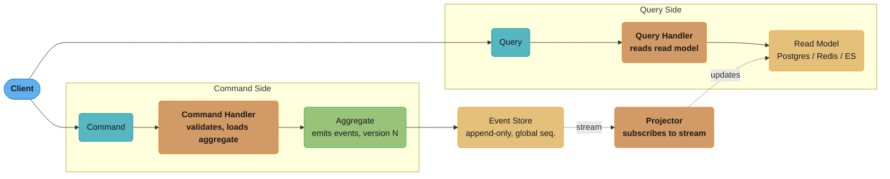
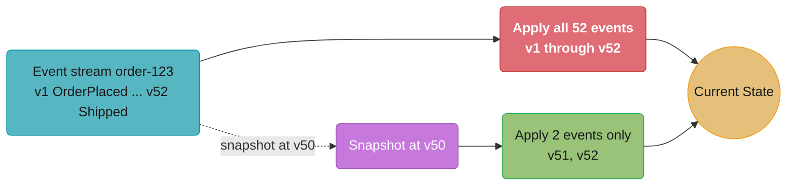
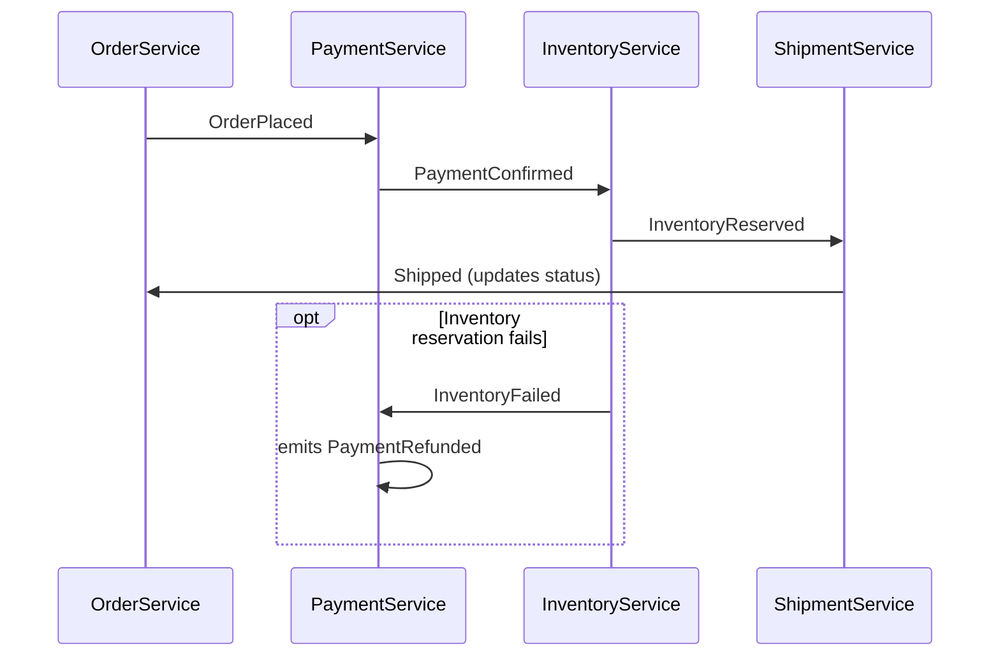
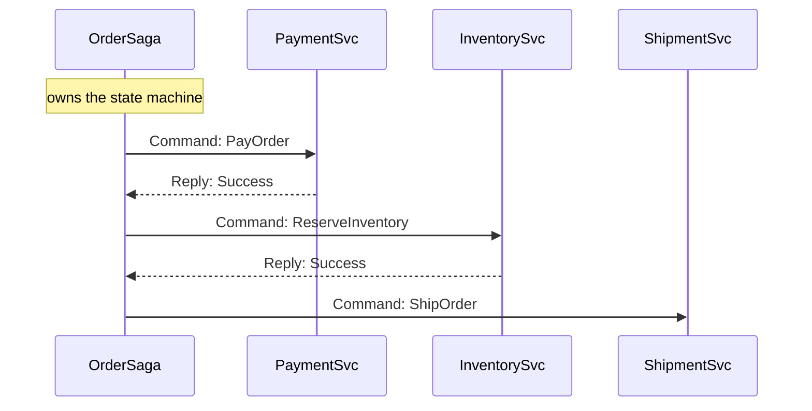
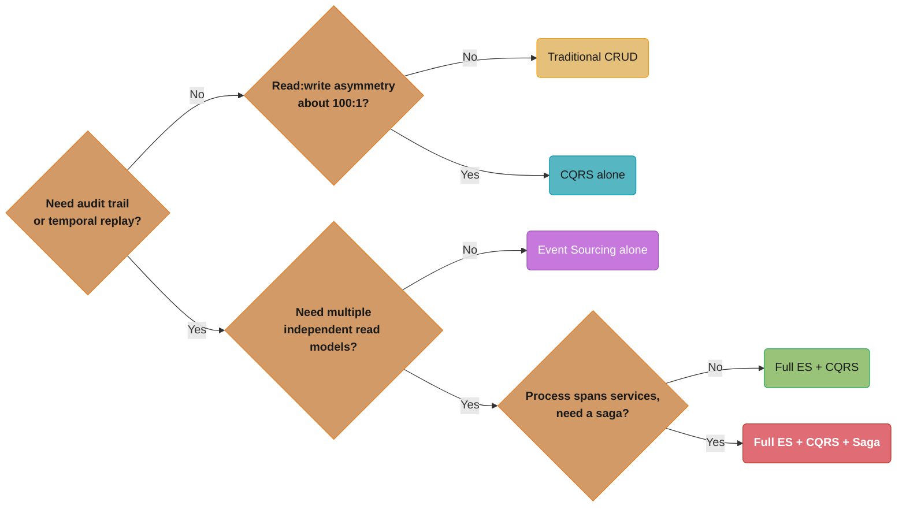
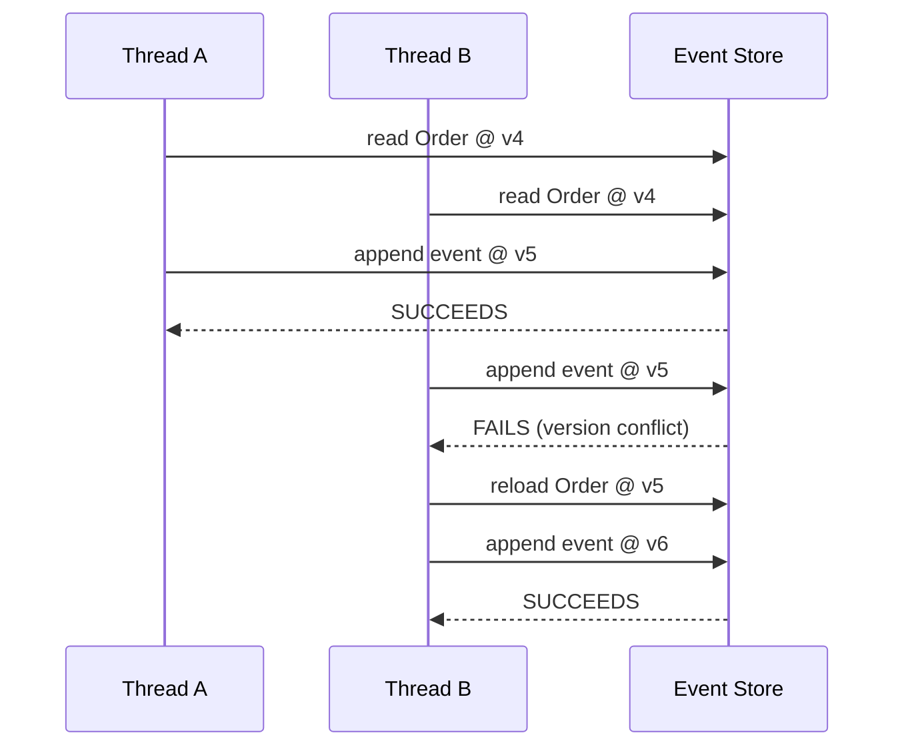
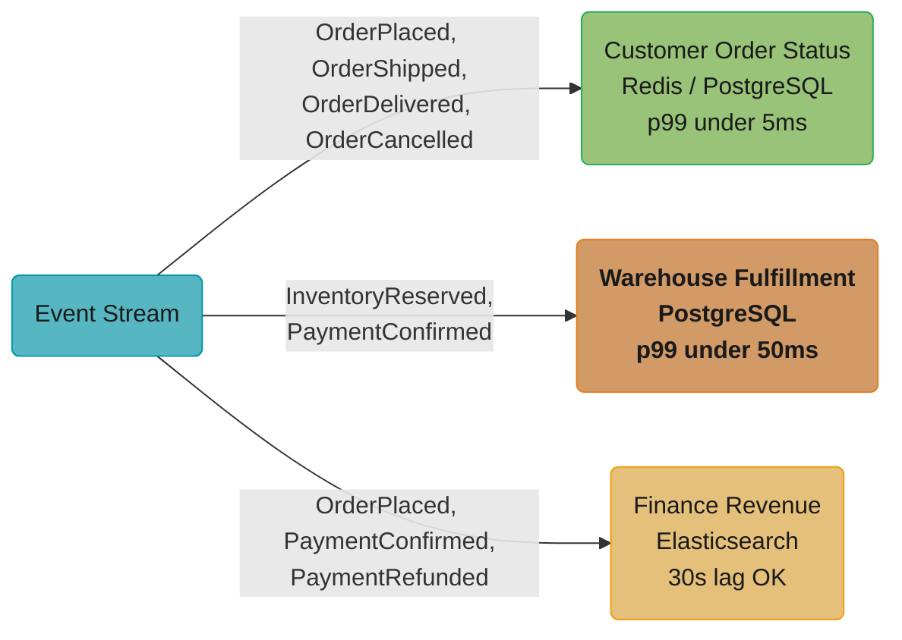
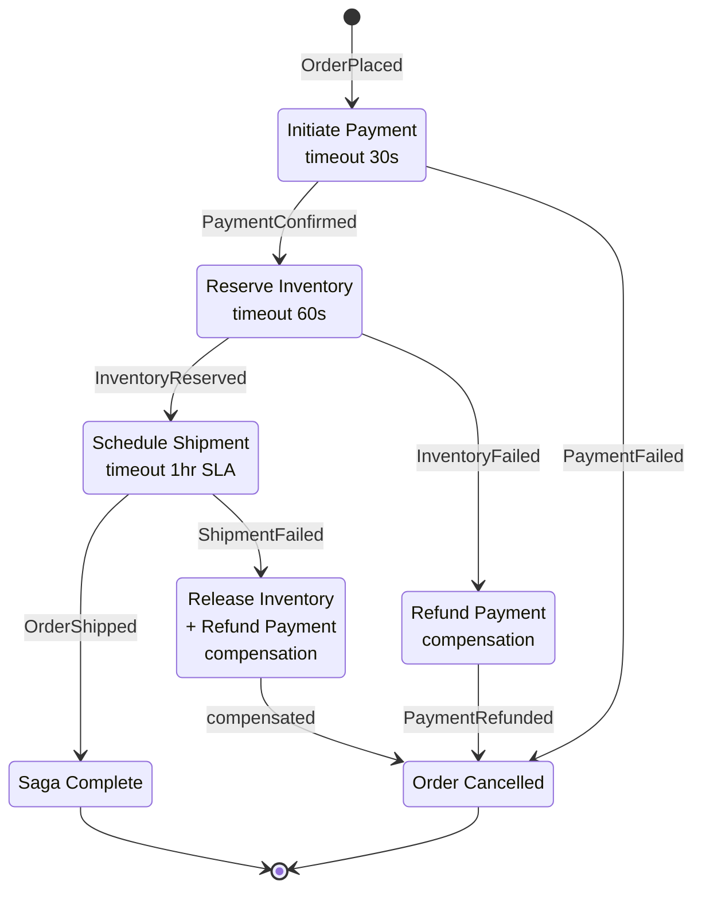

# Event Sourcing and CQRS

> Architectural overview. For framework-level implementation (Axon annotations, Spring projections, Eventuate sagas), see the backend companion: [Event Sourcing & CQRS](../../backend/event_sourcing_and_cqrs/README.md).

---

## 1. Concept Overview

**Event Sourcing** stores the history of state changes rather than the current state. The event store is an append-only log of immutable facts — every mutation to a domain object is captured as a named event. Current state is derived by replaying those events in order.

**CQRS (Command Query Responsibility Segregation)** separates the write model (commands that mutate state and produce events) from the read model (projections and queries that serve data). The two models can be stored in different databases, scaled independently, and optimized for their respective access patterns.

These are **independent patterns** that compose naturally: Event Sourcing provides the event log that CQRS projections consume. You can use either without the other.

| Pattern | What it stores | Core operation |
|---------|---------------|---------------|
| Traditional CRUD | Current state (rows) | UPDATE row in place |
| Event Sourcing | History of changes (events) | APPEND event to log |
| CQRS (write side) | Commands → events | Validate command, emit event |
| CQRS (read side) | Projections / materialized views | Consume events, update read model |

---

## 2. Intuition

**One-line analogy**: Event Sourcing is your bank account ledger — the balance is NOT stored; it is computed by replaying all debits and credits. CQRS is having separate clerks for deposits (writes) and account inquiries (reads).

**Mental model**: Traditional databases store the RESULT of operations. Event Sourcing stores the OPERATIONS themselves. Three key mental shifts:

- Never UPDATE a row — always APPEND an event
- State = f(events): state is a reduction over the event stream
- The past is immutable: events are facts, not opinions

**Why it matters**: Audit trails become free because events ARE the log. Temporal queries become possible (replay to any point-in-time). Event-driven integration becomes natural — external systems subscribe to the event stream rather than polling a state table.

**Key insight**: These patterns impose real costs — eventual consistency, event schema evolution complexity, and projection rebuild overhead. They pay off when audit history, temporal queries, or extreme read/write asymmetry are core requirements. They are NOT the right choice for every CRUD API. Choose deliberately.

---

## 3. Core Principles

**Immutability**: Events are facts about the past. They are never updated or deleted. An `OrderPlaced` event at 2024-03-15T10:30:00Z is a permanent record. Corrections are new events (`OrderCorrected`), not mutations.

**Append-only log**: The event store's only write operation is append. No UPDATE, no DELETE. This makes it fast (sequential writes), audit-safe, and naturally replayable.

**Aggregates**: Consistency boundaries that own a slice of the domain. An `Order` aggregate handles all commands related to a single order. Commands are validated against current state; if valid, one or more events are emitted. The aggregate's state is reconstructed by replaying its events.

**Projections**: Read-side views built by consuming the event stream. A projection subscribes to relevant event types and maintains a materialized view optimized for specific queries. Multiple projections can consume the same event stream, each building a different read model.

**Command/Query separation**: Writes go to the aggregate (command side). Reads go to projections (query side). The two paths never share the same database connection or model object.

**Eventual consistency**: The read model is updated asynchronously after events are written. A lag of 10–100ms is typical under normal load. This is a feature (decoupling) and a cost (stale reads) simultaneously.

---

## 4. Types / Architectures / Strategies

### 4.1 Event Sourcing Alone (without CQRS)

A single model: aggregates source events, and queries rebuild state from the same event stream. Simpler operationally — one database, one consistency model. Appropriate when read/write patterns are similar and multiple read models are not needed.

Limitation: rebuilding aggregate state for every read is expensive. Snapshots mitigate this (see §4.5), but as event counts grow, read contention with write traffic becomes a bottleneck.

### 4.2 CQRS Alone (without Event Sourcing)

Separate read and write databases — for example, PostgreSQL for writes and Elasticsearch for reads. No event log. The read model is synchronized via Change Data Capture (CDC) or dual-write.

Simpler consistency model: no event stream to manage. But no time-travel capability — you cannot replay to an arbitrary point in the past. Loses the audit log benefits of Event Sourcing.

Use when: read/write asymmetry is high (100:1 reads) but full event sourcing overhead is not justified.

### 4.3 Full ES + CQRS (Standard Production Pattern)

The most common production deployment. The event store is the single source of truth. Projectors consume the event stream asynchronously and populate multiple read models, each optimized for different query patterns:

- Relational read model (PostgreSQL) — OLTP queries, joins
- Search index (Elasticsearch) — full-text search
- Cache layer (Redis) — hot-path lookups

Each read model is independently scalable and independently rebuildable.

### 4.4 Event Sourcing with Saga (Long-Running Processes)

Sagas coordinate business processes that span multiple aggregates or services. Two implementation styles:

**Choreography-based Saga**: Each service listens for domain events and emits its own events in response. No central coordinator. Simple for 2–3 step flows. Becomes hard to trace and debug as step count grows. Failure handling is distributed across services.

**Orchestration-based Saga**: A dedicated saga orchestrator sends commands to services and listens for reply events. The orchestrator owns the state machine. Easier to understand, monitor, and compensate. The orchestrator is a coordination bottleneck if overloaded.

Both styles require compensating events (see §12) to handle partial failures.

### 4.5 Snapshot Strategy

Rebuilding aggregate state from event zero is O(N) in the number of events. For an `Order` aggregate that processes 20 events over its lifetime this is cheap. For an `Account` aggregate in a trading system that accumulates 50,000 events over years, replaying from zero takes seconds.

**Snapshot**: A materialized snapshot of aggregate state at a specific event version, stored alongside the event log. Rebuild = load snapshot at version N + replay events from version N+1 onward.

**Common thresholds**: Take a snapshot every 50–100 events. In high-event-rate systems, some teams snapshot every 500 events and accept longer cold-start times.

**Snapshot storage**: Same event store (as a special event type) or a separate KV store keyed by `aggregateId + version`. Snapshots are never the source of truth — if a snapshot is corrupt, fall back to full replay.

---

## 5. Architecture Diagrams

### Full CQRS + Event Sourcing Architecture

Commands flow through the aggregate into the append-only event store; queries never touch the write side at all — the projector is the only bridge, asynchronously replaying the event stream into the read model.



### Snapshot Lifecycle

Replaying from zero costs 52 event applications (red, the expensive path); loading the snapshot at v50 and replaying only v51 and v52 (green, the fast path) reaches the same current state in 2.



### Saga: Choreography vs Orchestration

**Choreography** (no central coordinator) — each service reacts only to the event immediately before it; no single component sees the whole flow, so failure handling depends on the right service happening to listen:



**Orchestration** (central coordinator) — a dedicated OrderSaga owns the state machine, issuing commands and waiting for replies; easier to trace and monitor, at the cost of the orchestrator becoming a coordination bottleneck if overloaded:



### Choosing Among the Architecture Variants

A decision path through §4.1–§4.4: audit/temporal-query needs and cross-service coordination push toward richer, more operationally expensive patterns. The common production default is Full ES + CQRS (green); Saga (red) layers on only when a process spans multiple services.



---

## 6. How It Works — Detailed Mechanics

### Event Anatomy

Every event stored in the event log carries this envelope:

```
EventId:       "evt-7f3c2a91-..."   (globally unique UUID, immutable)
AggregateId:   "order-123"          (which aggregate this event belongs to)
AggregateType: "Order"              (for routing projectors)
EventType:     "OrderPlaced"        (discriminator for handler dispatch)
EventVersion:  3                    (position within this aggregate's stream)
GlobalSeq:     90210                (monotonic position in the global event stream)
OccurredAt:    "2024-03-15T10:30:00Z"
Payload:       {
                 "customerId": "c-456",
                 "items": [{"sku": "ABC-1", "qty": 2, "unitPrice": 49.99}],
                 "totalAmount": 99.99,
                 "currency": "USD"
               }
SchemaVersion: 1                    (for upcasters — see §10)
```

### Aggregate Reconstitution

```
function loadAggregate(aggregateId):
    snapshot = snapshotStore.latest(aggregateId)       // may be null
    fromVersion = snapshot ? snapshot.version + 1 : 0
    events = eventStore.load(aggregateId, fromVersion) // load only events after snapshot
    state = snapshot ? snapshot.state : emptyState()
    for event in events:
        state = applyEvent(state, event)
    return state
```

### Projection Rebuild

```
function rebuildProjection(projectionName):
    readModel.clear(projectionName)
    checkpoint = 0
    while true:
        batch = eventStore.loadGlobal(fromSeq=checkpoint, limit=1000)
        if batch.empty: break
        for event in batch:
            if projectionName.handles(event.eventType):
                readModel.apply(event)
            checkpoint = event.globalSeq
        readModel.saveCheckpoint(projectionName, checkpoint)
```

Projection rebuild processes ~100,000–500,000 events/second on modern hardware. A 100M-event store rebuilds in 3–15 minutes depending on event size and handler complexity.

### BROKEN Design — State-Only Storage Loses History

```sql
-- BROKEN: State mutation loses the audit trail
UPDATE orders
SET status = 'shipped',
    shipped_at = NOW(),
    tracking_number = 'TRACK-789'
WHERE id = 123;

-- Three months later, the question arrives:
-- "What was the order total at the time of placement?"
-- "Who approved the payment and when?"
-- "Was this order ever put on hold before shipping?"
-- Answer: unknown. The history is gone.
```

### FIX — Append Events to the Event Log

```
-- FIX: Append an immutable event
INSERT INTO events (aggregate_id, event_type, event_version, occurred_at, payload)
VALUES (
  'order-123',
  'OrderShipped',
  5,
  '2024-03-20T14:22:00Z',
  '{"carrier": "FedEx", "trackingNumber": "TRACK-789", "shippedAt": "2024-03-20T14:22:00Z"}'
);

-- Current state (status=shipped) is derived by replaying events v1..v5.
-- Three months later, replay events v1..v1 to answer "what was the order at placement time?"
-- Full audit trail is free. No separate audit log table needed.
```

### Optimistic Locking (Concurrency Control)

Two concurrent commands on the same aggregate race to append at version N+1. The event store enforces uniqueness on (aggregateId, eventVersion):



Thread B's write at v5 collides with Thread A's already-committed v5 and is rejected; only after reloading at v5 does its retry succeed at v6.

Write latency to a well-tuned EventStoreDB or PostgreSQL event store: p50 ~1ms, p99 ~5ms for single-region, local disk. Cross-AZ replication adds 1–3ms.

---

## 7. Real-World Examples

**Axon Framework + AxonServer (Java — ING Bank, CapGemini)**: ING Bank uses Axon for banking transaction systems where every account operation must be auditable. AxonServer is a purpose-built event store with built-in routing and dead-letter queue support. CapGemini builds insurance claim processing systems on Axon where claim state history is a regulatory requirement.

**EventStoreDB**: A purpose-built event database with native projections, catch-up subscriptions, and competing consumers. Used by financial services firms (including trading platforms and insurance companies) for audit-critical systems. Supports persistent subscriptions that survive consumer restarts at ~5ms p99 delivery latency on same-AZ deployments.

**Amazon Order Management**: Every state transition — placed, payment confirmed, inventory reserved, shipped, delivered, returned — is modeled as an event. The customer-facing order timeline page is a projection of all events. Customer service agents can query the full event history to diagnose delivery issues without accessing raw database tables.

**GitHub Pull Request Timeline**: Every PR event — comment added, review submitted, label assigned, commit pushed, check completed — is an immutable event. The PR timeline UI is a projection that renders events in chronological order. PR history cannot be altered retroactively (short of admin intervention creating a compensating event).

**Confluent Kafka Streams**: Kafka topics function as durable, ordered event logs. KTables are materialized projections over those topics — changelog streams compacted to their latest-key-value state. This is Event Sourcing at platform scale: topics as the event store, KTables as the read model.

---

## 8. Tradeoffs

| Concern | Traditional CRUD | Event Sourcing + CQRS |
|---------|-----------------|----------------------|
| Audit history | Requires separate audit log table | Free — events ARE the audit log |
| Temporal queries ("state at time T") | Complex or impossible | Natural — replay to sequence N |
| Schema evolution | ALTER TABLE, migration scripts | Event upcasters required; old events must remain readable |
| Read performance | Single model, may not fit all patterns | Multiple optimized read models (Postgres, Redis, ES) |
| Write performance | Single DB write (~1ms) | Append to event store (~1–5ms); sequential, fast |
| Operational complexity | Low | High — projectors, eventual consistency, saga, replay tooling |
| Debugging production issues | Query current state | Replay events to reproduce exact state at any point |
| Eventual consistency | No — reads reflect committed writes | Yes — read model lags write model by ~10–100ms typically |
| Storage cost | O(current state) — stable | O(all events ever) — grows unboundedly; plan for archiving |
| Team ramp-up | Fast — standard SQL patterns | Slow — new patterns, new failure modes, new tooling |

---

## 9. When to Use / When NOT to Use

### Use Event Sourcing + CQRS When

- **Audit history is a core requirement**: financial transactions, medical records, legal documents. Regulators require "what happened and when" — not just "what is the current state."
- **Temporal queries are needed**: "what was the account balance at 3pm yesterday?" or "what was the order state when the customer called?" These are natural with event replay; complex or impossible with state-only storage.
- **Complex domain with multiple bounded contexts**: services that need to react to changes in other services without tight coupling. Events become the integration contract.
- **Extreme read/write asymmetry**: 100:1 reads to writes justifies separate read models optimized for reads with dedicated hardware and indexes.
- **Multiple read models from the same data**: OLTP response, search, analytics dashboard, and mobile API each need different data shapes. Projections serve each independently.

### Do NOT Use When

- **Simple CRUD with no audit requirements**: user profile management, CMS content — state mutation is correct and simpler.
- **Small teams without distributed systems experience**: eventual consistency bugs, event schema migration failures, and projection rebuild incidents require experienced operators.
- **Eventual consistency is unacceptable**: financial settlement that must be strongly consistent at the moment of confirmation cannot tolerate read model lag.
- **Short-lived systems or prototypes**: the operational overhead — event store, projectors, replay tooling — is not amortized over a short system lifetime.
- **Frequent and breaking event schema changes**: if the domain model is still being discovered and events are renamed or restructured weekly, the upcaster maintenance cost is prohibitive.

---

## 10. Common Pitfalls

**1. God Aggregate**: Modeling the entire business domain as one aggregate (`Order` containing payment, shipment, inventory, and customer data) produces aggregates with thousands of events. Every command loads and replays the entire history. Fix: decompose into small aggregates along consistency boundaries — `Order`, `Payment`, `Shipment`, `InventoryReservation`. Each should have a natural lifecycle of 10–500 events.

**2. Event Schema Evolution**: You can NEVER delete, rename, or reinterpret an existing event type — events stored three years ago must be readable by today's code. Use upcasters: pure functions that transform event version 1 to event version 2 at read time. Design events for longevity from day one. Include a `schemaVersion` field in every event payload.

**3. Eventual Consistency Surprises (Read-Your-Own-Writes)**: A user posts a comment, immediately refreshes, and does not see it because the read model has not yet processed the event. Fix: return the command result from the write side directly in the API response; or issue a consistency token and poll until the read model reaches that sequence number; or use synchronous projection update for the issuing user's session only.

**4. Projection Rebuild at Scale**: Changing a projection's logic requires replaying all events from the beginning. For 100M events, this takes 3–15 minutes during which the old read model may serve stale data. Fix: build the new projection in parallel (blue/green projection rebuild), keep the old one serving traffic, atomic swap when the new one reaches current sequence, then decommission the old.

**5. Missing Idempotency in Event Handlers**: Network failures cause event redelivery. A projector that processes `PaymentConfirmed` twice will double-count revenue. Fix: each projector tracks the last processed `globalSeq` (or event ID) per aggregate; skip events already applied. Track this in the same transaction as the read model update.

**6. Saga Timeout and Missing Compensation**: A saga step issues a `ProcessPayment` command to the payment service. The payment service does not respond within 30 seconds (timeout). The saga must issue a compensating event (`OrderPaymentCancelled`) to undo previously completed steps (`InventoryReleased`). Forgetting to define compensating events for every saga step leaves business data in an inconsistent state that requires manual intervention.

**7. Storing Derived State in Events**: Events should capture intent and facts, not derived values. Storing `"discountedTotal": 89.99` in the event couples the event to the discount calculation logic at that moment. If discount logic changes, historical events reflect the wrong logic. Store inputs (`"basePrice": 99.99, "discountCode": "SAVE10"`) and compute outputs in the projection.

---

## 11. Technologies & Tools

**EventStoreDB**: Purpose-built event store. Native persistent subscriptions, catch-up subscriptions, competing consumers, server-side projections (JavaScript). Strong consistency within a stream. Available self-hosted or as Event Store Cloud. Write throughput: ~10,000 events/second per node on standard hardware.

**Apache Kafka**: Durable, ordered, partitioned event log. Consumer groups as competing consumers. Compacted topics for snapshot-like behavior (latest value per key). Not a purpose-built event store — no per-stream optimistic concurrency. Best for high-throughput platform-level event streaming. Typical write latency: ~5ms p99 on same-AZ, ~15ms cross-AZ.

**Axon Framework + AxonServer** (Java): Batteries-included ES+CQRS framework. Annotations for aggregates, event handlers, saga handlers. AxonServer provides event routing, dead-letter queue, and event store. Strong DDD alignment.

**Marten** (.NET): Event sourcing on PostgreSQL. Uses JSONB columns for events. No separate event store required — familiar operational model for teams already running Postgres.

**Eventuate Tram**: Microservices event sourcing and saga framework. Supports Kafka or RabbitMQ as the event transport. Provides saga orchestration primitives with compensating transaction support.

**PostgreSQL + events table**: Lightweight event store for lower-scale systems. A single `events` table with `(aggregate_id, event_version, event_type, occurred_at, payload JSONB)` and a unique constraint on `(aggregate_id, event_version)` provides optimistic concurrency. LISTEN/NOTIFY can trigger projectors. Suitable for up to ~1M events/day before dedicated event store tooling is justified.

**Redis Streams**: Append-only log with consumer groups. Suitable for short-retention event streaming within a single microservice boundary. Not a durable event store for long-term history.

---

## 12. Interview Questions with Answers

**Q: What is the most common mistake engineers make when first implementing Event Sourcing?**
Storing current state IN the event payload — i.e., emitting `{"status": "shipped", "totalAmount": 99.99, "customerName": "Alice"}` as `OrderUpdated`. This makes the event a state snapshot, losing the "what changed and why" semantics. Events should capture the delta and intent: `OrderShipped{"carrier": "FedEx", "trackingNumber": "..."}`. The read side derives the current state by reducing over all events.

**Q: Why is eventual consistency unavoidable in a CQRS system?**
The write model (event store) and the read model (projection) are updated by separate processes. The event must first be appended to the event store, then consumed by the projector, then the read model updated — each step adds latency. Under normal conditions this lag is 10–100ms. During projector restarts or backpressure, it can be seconds to minutes. There is no way to make the read model update synchronous and still keep write/read paths decoupled.

**Q: What is Event Sourcing? How does it differ from storing current state?**
Event Sourcing stores every state change as an immutable event in an append-only log. Current state is derived by replaying those events — it is never stored directly. Traditional databases store the result of operations (current state). Event Sourcing stores the operations themselves (events). The key benefit is that you retain the full history and can reconstruct state at any point in time.

**Q: What is CQRS and when should you use it WITHOUT Event Sourcing?**
CQRS separates the write model from the read model, allowing each to be independently scaled and optimized. Without Event Sourcing, you use separate write and read databases synchronized via CDC or dual-write — simpler to operate and without eventual consistency complexity of event streams. Use CQRS alone when read/write asymmetry is high but full audit history and time-travel are not requirements.

**Q: What is an aggregate in Event Sourcing and what are its responsibilities?**
An aggregate is a consistency boundary — a cluster of domain objects treated as a unit for writes. Its responsibilities: validate incoming commands against current state, emit domain events if the command is valid, and apply those events to update its own in-memory state. The aggregate's state is reconstructed by replaying its events from the event store. Aggregates should be small — one natural business entity, not a god object.

**Q: How do you handle the read-your-own-writes problem in an eventually consistent CQRS system?**
Three approaches: (1) Return the write-side result directly in the API response — the client already has the data it just wrote. (2) Issue a consistency token (the event's globalSeq) in the write response; the client polls the read model until it reports reaching that sequence. (3) For the immediately-following request, bypass the read model and query the write side directly (with a performance penalty). The third approach is a last resort — it undermines the CQRS separation.

**Q: How do snapshots work, and when should you take one?**
A snapshot is a serialized copy of aggregate state at a specific event version, stored in the event store or a companion KV store. On reconstitution: load the latest snapshot, then replay only events with version > snapshot.version. Common threshold: every 50–100 events for interactive aggregates. For high-event-rate aggregates (trading accounts), some teams snapshot every 500 events. Snapshots are a performance optimization — they are never the source of truth. A corrupt snapshot falls back to full replay.

**Q: How do you evolve event schemas without breaking old consumers?**
Use upcasters — pure functions that transform an event at an older schema version to the current version at read time. The event store retains the original bytes permanently; the upcaster chain is applied when loading events. Rules: never delete or rename an event type; add fields as optional with defaults; remove fields by deprecation (stop writing them, stop reading them, after all consumers are updated). Include a `schemaVersion` field in every event payload from day one.

**Q: What is a projection and how do you rebuild one safely in production?**
A projection is a read-side materialized view built by consuming events from the event store. It is the answer to "what does this data look like for queries?" A safe production rebuild: (1) Start a new projection instance consuming events from globalSeq 0 into a shadow read model (blue/green). (2) Keep the old projection serving live traffic. (3) When the shadow projection reaches the current tail of the event stream, perform an atomic swap (flip the read model pointer). (4) Decommission the old projection. Rebuild time: 3–15 minutes for 100M events on modern hardware.

**Q: What is a Saga and what are the two implementation styles?**
A Saga is a pattern for managing long-running business processes that span multiple aggregates or services, where a single ACID transaction is not possible. Choreography: each service reacts to events and emits its own events; decentralized, no coordinator, hard to trace at scale. Orchestration: a dedicated saga orchestrator sends commands and listens for replies; centralized state machine, easier to monitor and compensate, but the orchestrator is a new component to operate.

**Q: What is a compensating transaction/event?**
A compensating event reverses the business effect of a previously successful step when a later step in the saga fails. Example: `PaymentProcessed` is followed by `InventoryReservationFailed`. The saga issues `RefundPayment` command → emits `PaymentRefunded` event. Compensations must be defined for every saga step from design time. They are not rollbacks in the ACID sense — they are new events appended to the log, not mutations of old events.

**Q: How do you prevent double-processing of events in a projection (idempotency)?**
Track the last processed `globalSeq` (or event ID) per projection in the same storage as the read model. On startup, resume from the saved checkpoint. On each event: check if already processed (event ID in a processed-events set or globalSeq <= checkpoint); if so, skip. Alternatively, make all projection write operations naturally idempotent — upsert by primary key rather than insert, so processing the same event twice produces the same final state.

**Q: Event Sourcing vs Change Data Capture (CDC) — what is the difference?**
CDC captures changes to a database as they happen (via transaction log tailing — e.g., Debezium + PostgreSQL WAL). It produces change events from an existing state-mutation database. Event Sourcing is a design decision — the event log IS the system of record, not an afterthought. CDC events reflect storage internals (row inserts, updates). ES events reflect business domain intent (OrderPlaced, PaymentConfirmed). CDC is a migration path toward event-driven architecture without rewriting the write side.

**Q: What are the storage implications of Event Sourcing long-term?**
Event stores grow without bound — every event ever emitted is retained. A system processing 10,000 orders/day with ~10 events/order accumulates 100,000 events/day = 36.5M events/year. At 1KB/event, that is ~35GB/year — modest for disk, but projection rebuild time grows linearly. Mitigation: tiered storage (hot events in fast NVMe, cold events in object storage); aggregate-stream archiving (completed orders archived after 7 years); snapshot-based cutoffs (events older than N are dropped after a snapshot, if regulations allow). Never delete events without explicit compliance approval.

**Q: How do you debug a bug that occurred 6 months ago in an Event Sourced system?**
Load the aggregate's event stream up to the point in time when the bug manifested. Replay events in a local environment or a dedicated debugging tool. The exact state at any moment is reproducible — no need for log correlation or memory. This is one of the strongest advantages of Event Sourcing: time-travel debugging. Compare the actual event sequence to the expected sequence to identify which event or command handler produced the wrong outcome.

**Q: When is Event Sourcing NOT the right choice?**
When there is no audit requirement; when the domain model is still being discovered and events will change frequently; when the team lacks distributed systems experience to operate eventual consistency safely; when strong read-after-write consistency is required at the application layer; when system lifetime is short (prototype, throwaway service). The operational complexity — event store, projectors, saga, schema evolution tooling — is a significant investment that only pays off for long-lived, audit-critical systems.

---

## 13. Best Practices

**Design events as past-tense domain facts**: `OrderPlaced`, `PaymentConfirmed`, `ItemShipped`, `OrderCancelled`. Avoid generic names (`OrderUpdated`, `StateChanged`) that carry no semantic information.

**Include all necessary context in the event payload**: Projections run asynchronously and may process events out of order with other events. Do not rely on being able to look up current state at projection time — the event must carry everything needed to update the read model.

**Version events from day one**: Include `"schemaVersion": 1` in every event payload. Adding this field retroactively to 50M stored events is a painful migration.

**Build projections to be idempotent by design**: Use upsert semantics (insert or update by primary key) rather than blind inserts. Track processed event IDs. Test idempotency explicitly in unit tests.

**Keep aggregates small**: A healthy aggregate has a focused consistency boundary, a natural lifecycle with 10–500 events, and handles 3–10 command types. If an aggregate's event count routinely exceeds 1,000 before it reaches a terminal state, decompose it.

**Use catch-up subscriptions for projection builds, live subscriptions for ongoing streaming**: Catch-up subscriptions process historical events sequentially from the beginning; live subscriptions deliver new events in real time. Most projection frameworks support both modes with automatic switchover at the tail.

**Never use the event store for read operations**: Do not query the event store to answer API requests. All reads go through projections. The event store is a write-optimized sequential log; ad-hoc queries against it are slow and defeat the purpose of CQRS.

**Test projections against a real event sequence**: Unit-test each event handler in isolation; integration-test the full projection by replaying a recorded event sequence and asserting the final read model state.

**Define compensating events for every saga step before implementing the saga**: Write the compensation logic first. If you cannot define a compensating event for a step, reconsider the saga boundary.

---

**Cross-references:** [backend/event_sourcing_and_cqrs](../../backend/event_sourcing_and_cqrs/) (event store implementation, snapshotting code), [database/polyglot_persistence_patterns](../../database/polyglot_persistence_patterns/) (separate read/write stores for CQRS), [database/distributed_transactions](../../database/distributed_transactions/) (saga as a transaction-coordination alternative).

---

## 14. Case Study — Order Management System with Full Audit, Multi-Model Reads, and Saga

### Domain

An e-commerce platform processes 50,000 orders per day. Requirements: full audit history for customer service and fraud teams; three read models with different access patterns; payment + inventory reservation + shipment coordination across three services.

### Event Types

```
OrderPlaced          { customerId, items[], totalAmount, currency, shippingAddress }
PaymentInitiated     { paymentProvider, amount, currency, transactionRef }
PaymentConfirmed     { transactionRef, confirmedAt, gatewayCode }
PaymentFailed        { transactionRef, failureReason, failedAt }
InventoryReserved    { warehouseId, items[], reservationId, reservedUntil }
InventoryFailed      { items[], reason, failedAt }
OrderShipped         { carrier, trackingNumber, estimatedDelivery, shippedAt }
OrderDelivered       { deliveredAt, signature }
OrderCancelled       { reason, cancelledBy, cancelledAt }
PaymentRefunded      { originalTransactionRef, refundRef, refundedAt, amount }
InventoryReleased    { reservationId, releasedAt }
```

### Aggregate Boundaries

| Aggregate | Events owned | Consistency guarantee |
|-----------|-------------|----------------------|
| `Order` | OrderPlaced, OrderShipped, OrderDelivered, OrderCancelled | All order state transitions are serialized |
| `Payment` | PaymentInitiated, PaymentConfirmed, PaymentFailed, PaymentRefunded | Payment lifecycle is atomic |
| `InventoryReservation` | InventoryReserved, InventoryFailed, InventoryReleased | Reservation lifecycle is atomic |

Each aggregate is independent. The `Order` aggregate does not know about `Payment` internals — it only knows that a `PaymentConfirmed` event arrived (via the saga).

### Three Read Models

**1. Customer-Facing Order Status (Redis / PostgreSQL)**
```
orders_status:
  order_id       VARCHAR PK
  customer_id    VARCHAR
  status         VARCHAR  -- placed, processing, shipped, delivered, cancelled
  tracking_url   VARCHAR
  estimated_delivery DATE
  updated_at     TIMESTAMP

Populated by: OrderPlaced, OrderShipped, OrderDelivered, OrderCancelled
Latency target: p99 < 5ms (Redis cache in front)
```

**2. Warehouse Fulfillment View (PostgreSQL)**
```
fulfillment_queue:
  order_id         VARCHAR PK
  warehouse_id     VARCHAR
  reservation_id   VARCHAR
  items            JSONB
  priority         INTEGER  -- computed from SLA tier
  payment_status   VARCHAR  -- must be 'confirmed' before picking starts
  queued_at        TIMESTAMP

Populated by: InventoryReserved, PaymentConfirmed, OrderCancelled (removes row)
Latency target: p99 < 50ms (internal, non-user-facing)
```

**3. Finance Revenue Reporting (Elasticsearch / Data Warehouse)**
```
revenue_events:
  event_id        keyword
  order_id        keyword
  event_type      keyword  -- OrderPlaced, PaymentConfirmed, PaymentRefunded
  amount          double
  currency        keyword
  occurred_at     date
  customer_tier   keyword
  sku_list        keyword[]

Populated by: OrderPlaced, PaymentConfirmed, PaymentRefunded
Query patterns: aggregation by day/SKU/customer tier, refund rate, GMV
Latency: eventual, 30-second lag acceptable
```

One event stream, three independently-latencied projections: the customer status view needs p99 under 5ms, the warehouse queue tolerates under 50ms, and the finance rollup accepts a 30-second lag.



### Saga Steps with Compensation

`OrderPlacementSaga` (orchestration-based). Each step has its own timeout; a failure triggers the compensations for every already-completed step before the saga terminates in `OrderCancelled` — success only when the shipment step reports `OrderShipped`:



### Technology Choices

| Component | Technology | Rationale |
|-----------|-----------|-----------|
| Event Store | EventStoreDB | Per-stream optimistic concurrency; native catch-up subscriptions; 10K events/s write throughput |
| Customer status read model | PostgreSQL + Redis | Redis for hot-path reads (< 5ms); Postgres for durable source |
| Fulfillment view | PostgreSQL | Relational queries; joins with warehouse config |
| Revenue reporting | Elasticsearch | Aggregation queries; time-series analysis |
| Saga orchestrator | Custom service + EventStoreDB | Saga state stored as events in a dedicated saga stream |
| Message bus | Apache Kafka | Cross-service event delivery; 7-day retention; consumer group isolation |

### Failure Modes and Mitigations

| Failure | Impact | Mitigation |
|---------|--------|-----------|
| Projector restart | Read model serves stale data until caught up; lag ~1–30s | Checkpoint-based resume; monitor lag metric |
| Event store node failure | Writes blocked during leader election (~5–10s for EventStoreDB) | Client retry with exponential backoff; 99.99% availability with 3-node cluster |
| Saga orchestrator crash | In-flight sagas paused until restart | Saga state is in the event store; resume from last committed saga event on restart |
| Payment service timeout | Saga waits up to 30s, then compensates | Dead-letter saga commands after N retries; manual intervention queue |
| Projection rebuild during schema change | Old read model serves traffic during rebuild | Blue/green projection rebuild; atomic namespace swap |

### Operational Numbers

- Events per order: ~8 average across all aggregates
- Event store writes: 50,000 orders/day × 8 events = 400,000 events/day (~5 events/second average; 50 events/second peak)
- Event payload size: ~500 bytes average → 200 MB/day → 73 GB/year
- Projection rebuild time at 100M events (2.7 years accumulation): ~10 minutes at 200K events/second processing rate
- Snapshot threshold: every 50 events (Order aggregate rarely exceeds 20 events; Payment aggregate rarely exceeds 5)
- Eventual consistency lag under normal load: 15–50ms (EventStoreDB catch-up subscription to PostgreSQL projector)
