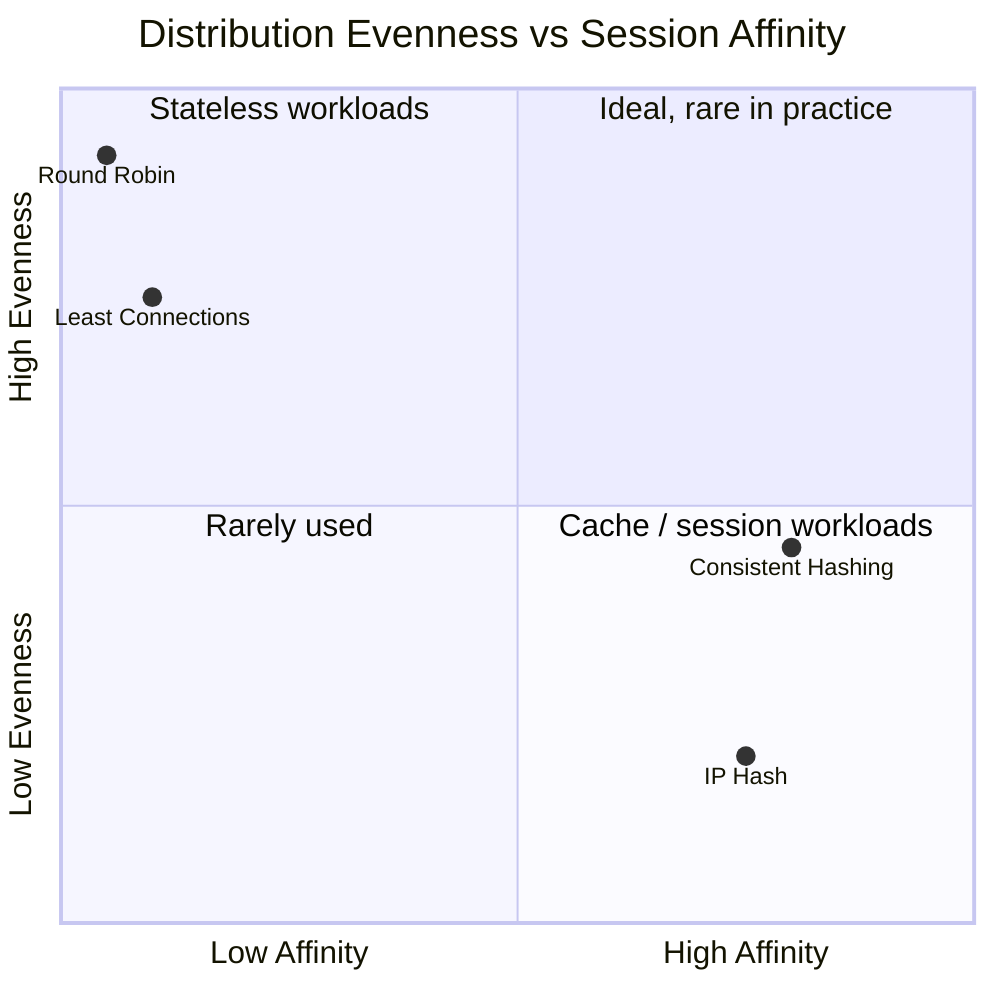
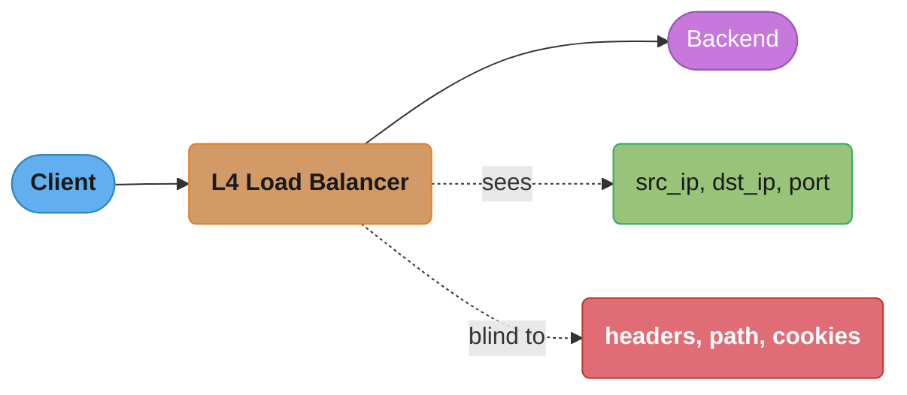
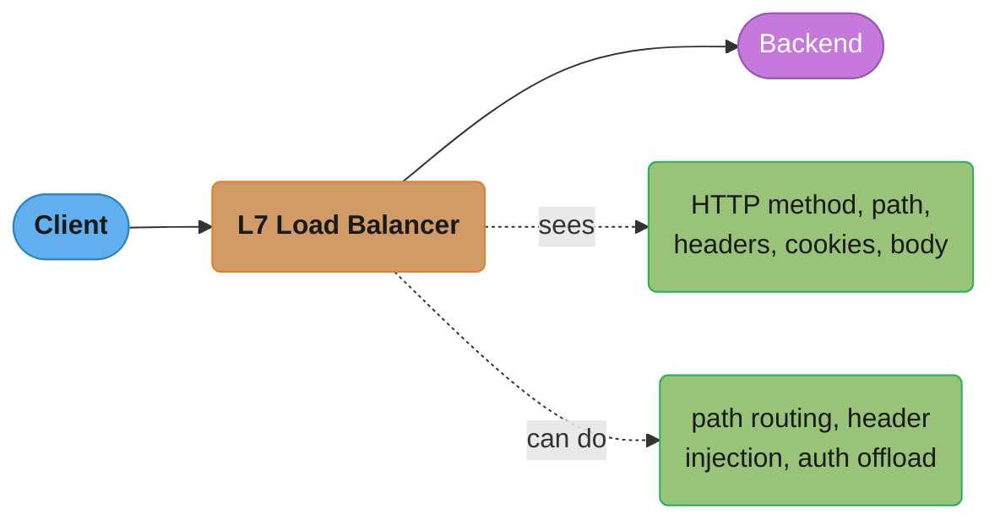
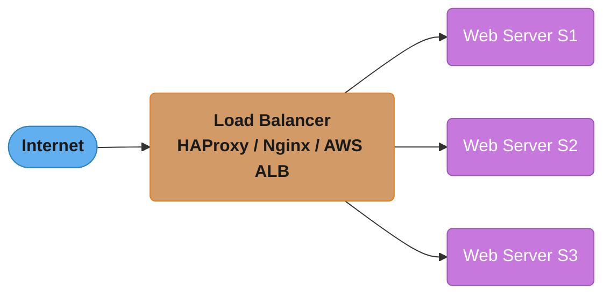
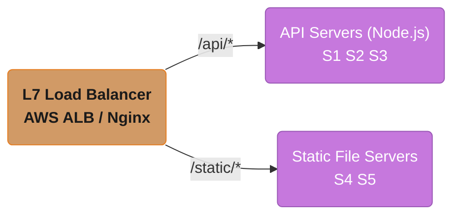
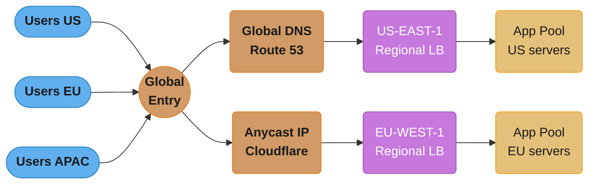
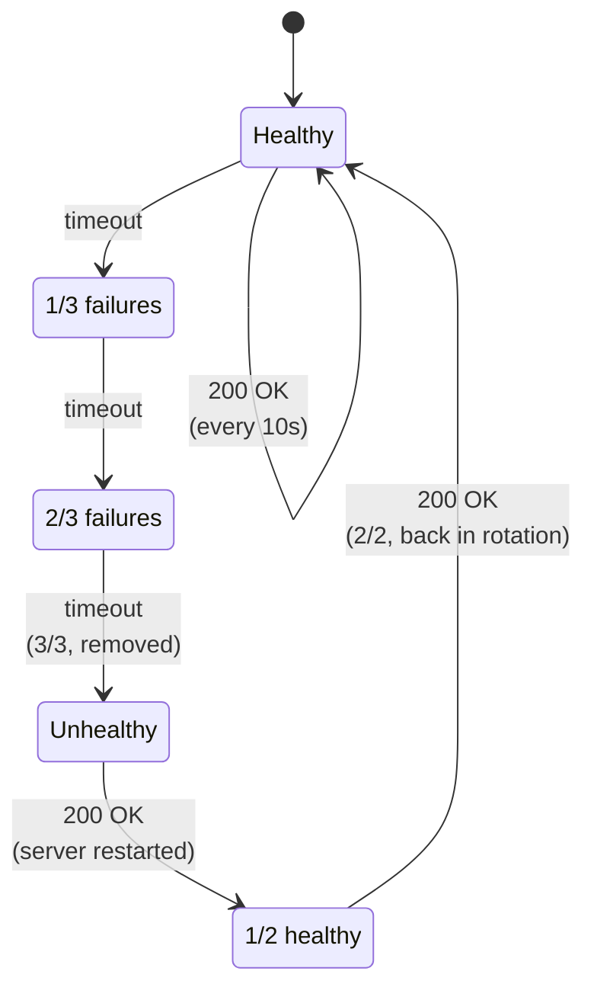
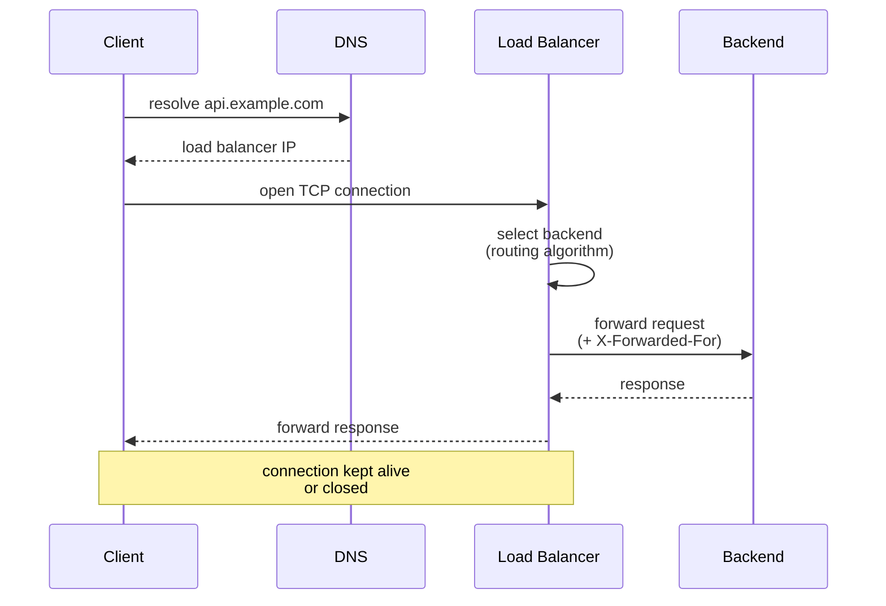
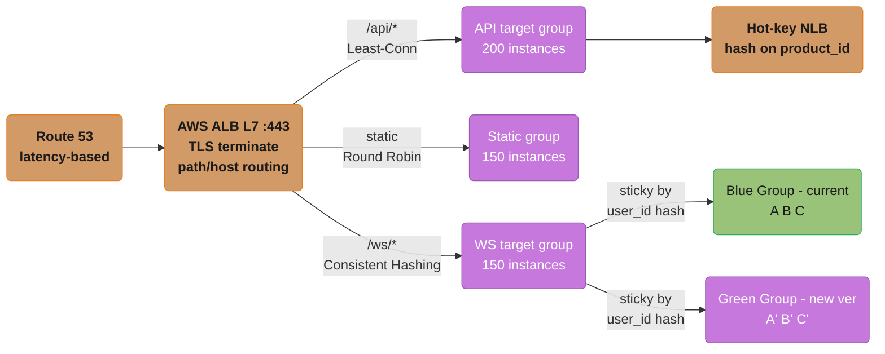

# Load Balancing

## Table of Contents
1. [Concept Overview](#concept-overview)
2. [Core Principles](#core-principles)
3. [Types and Strategies](#types-and-strategies)
4. [Architecture Diagrams](#architecture-diagrams)
5. [How It Works](#how-it-works)
6. [Real-World Examples](#real-world-examples)
7. [Tradeoffs](#tradeoffs)
8. [When to Use](#when-to-use)
9. [When NOT to Use](#when-not-to-use)
10. [Common Pitfalls](#common-pitfalls)
11. [Technologies and Tools](#technologies-and-tools)
12. [Interview Questions](#interview-questions)
13. [Best Practices](#best-practices)
14. [Metrics and Monitoring](#metrics-and-monitoring)
15. [Case Study](#case-study)

---

## Intuition

> **One-line analogy**: A load balancer is like a restaurant host who directs arriving customers to tables — ensuring no single waiter is overwhelmed while others stand idle.

**Mental model**: Without load balancing, all traffic hits one server — it becomes the bottleneck and single point of failure. A load balancer sits in front of a pool of servers, distributing incoming requests so each server handles a fair share. Health checks ensure unhealthy servers are removed from the pool. Round-robin is the simplest strategy; consistent hashing is best for stateful workloads.

**Why it matters**: Load balancers are the entry point of every large-scale web system. They enable horizontal scaling (add more servers without changing clients), provide redundancy (one server dies, traffic reroutes), and enable zero-downtime deployments (remove one server, update it, re-add).

**Key insight**: L4 (transport layer) load balancers are fast but dumb — they see only IP/port. L7 (application layer) load balancers are smart but slower — they see HTTP headers, URL paths, and cookies, enabling sticky sessions, path-based routing, and SSL termination.

---

## Concept Overview

A load balancer is a component that distributes incoming network traffic across multiple backend servers. Its core purpose is to ensure no single server bears too much demand, increasing responsiveness and availability of applications.

**Why it matters:**
- A single server has finite CPU, memory, and network capacity
- Without distribution, one server becomes the bottleneck and eventually fails under load
- Load balancers enable horizontal scaling by making a pool of servers look like one endpoint
- They provide automatic failover — if a server dies, traffic routes around it

Load balancing operates at multiple layers of the network stack. Choosing the right layer and algorithm directly affects performance, cost, and the capabilities you can build on top.

**Key responsibilities of a load balancer:**
- Traffic distribution across healthy backend instances
- Health checking — continuously detecting and removing failed servers
- SSL termination — handling TLS encryption/decryption so backends don't have to
- Connection persistence — ensuring stateful sessions hit the same backend (sticky sessions)
- Request routing — routing based on URL path, headers, cookies, or content type

---

## Core Principles

### 1. Health Awareness
The load balancer must know which backends are healthy. It runs periodic health checks (TCP ping, HTTP probe) and removes unhealthy instances from rotation immediately.

### 2. Algorithm-Driven Distribution
Traffic is distributed according to a configurable algorithm. The choice of algorithm determines whether load is distributed evenly, whether connection cost is considered, or whether client identity drives routing.

### 3. Transparency
From the client's perspective, the load balancer is the server. The existence of the backend pool is invisible. This abstraction enables backend changes (additions, removals, upgrades) without client impact.

### 4. Session Persistence
When applications have server-side state, the load balancer must route a client's subsequent requests to the same server. This is done via sticky sessions (cookie-based or IP-hash-based).

### 5. Failure Isolation
The load balancer is the first line of defense against backend failures. It detects failures through health checks and stops sending traffic to failed instances, improving overall availability.

---

## Types and Strategies

### Load Balancing Algorithms

#### Round Robin
Requests are distributed sequentially across servers in a loop: S1 → S2 → S3 → S1 → ...

- **Best for**: Servers with identical hardware and similar request costs
- **Problem**: Ignores server load. A slow, CPU-bound request on S1 means S1 is overloaded while S2 and S3 are idle
- **Variant**: Weighted Round Robin — assign more traffic to more powerful servers

#### Least Connections
Route each new request to the server with the fewest active connections.

- **Best for**: Workloads with variable request duration (e.g., video streaming, file uploads)
- **Problem**: Slight overhead to track connection counts; not ideal for very short-lived connections
- **Variant**: Weighted Least Connections — factor in server capacity along with connection count

#### Least Response Time
Route to the server with the fewest connections AND the lowest average response time.

- **Best for**: Latency-sensitive applications where backend performance varies
- **Problem**: More complex to implement; requires active response time measurement

#### IP Hash (Source IP Affinity)
Hash the client IP address to determine which server handles the request. The same client IP always maps to the same server (as long as the pool doesn't change).

- **Best for**: Session persistence without cookies; consistent routing for a given client
- **Problem**: Poor distribution if many clients share a NAT IP (e.g., corporate networks); adding/removing servers changes the entire hash mapping

#### Consistent Hashing
A more sophisticated version of IP hash. Servers are placed on a "hash ring." Adding or removing a server only remaps a small fraction of clients.

- **Best for**: Cache servers, where you want the same client to always hit the same cache node
- **Problem**: More complex to implement than simple IP hash

**What the formula is telling you.** "`server = hash(key) % N` is not a stable mapping — it is a mapping that is redefined every time `N` changes, which is why changing `N` moves almost every key."

Modulo hashing looks harmless because it distributes evenly. The failure is not distribution, it is *stability under resize* — and the difference between the two schemes is the entire reason cache tiers use rings.

| Symbol | What it is |
|--------|------------|
| `hash(key)` | A large integer derived from the routing key (client IP, `product_id`, cache key) |
| `N` | Current number of servers in the pool — the value that changes on scale-out or failure |
| `% N` | Remainder after division; the bucket index. Changing `N` changes every remainder |
| keys remapped (modulo) | Approaching 100% — nearly every key lands on a different server |
| keys remapped (ring) | About `1/N` — only the departing/arriving server's arc moves |

**Walk one example.** One key through a modulo pool that grows from 4 servers to 5:

```
  hash(key) = 1,234,567

  N = 4 :  1,234,567 % 4 = 3   -> server 3
  N = 5 :  1,234,567 % 5 = 2   -> server 2      <- moved, and it never failed

  Fraction of keys that keep their server when N goes 4 -> 5:
      only keys where (h % 4) == (h % 5), about 1 in 5 -> ~20% stay, ~80% move

  Consistent hashing at the case study's 200-server cache tier:
      keys remapped = 1 / N = 1 / 200 = 0.005 = 0.5%
      modulo        = ~100%

      ratio = 100% / 0.5% = 200x fewer keys disturbed
```

The operational consequence is a cache stampede, not a correctness bug: after a modulo resize, ~100% of lookups miss and every one becomes an origin fetch at the same instant. At 0.5%, the origin barely notices — which is exactly the difference between the 41% and 94% flash-sale hit rates reported in the case study's results.

#### Random
Route requests to a randomly selected backend.

- **Best for**: Simple, roughly even distribution without any state
- **Problem**: Can lead to uneven distribution in small pools by chance

The four stateful/stateless algorithms above trade off two things at once — how evenly they spread load, and how strongly they pin a client to one server. Plotting them on both axes together makes the split obvious in a way the per-algorithm bullet points above don't:



*Round Robin and Least Connections cluster top-left — great evenness, no affinity — which is why they suit stateless web/API tiers. Consistent Hashing and IP Hash cluster bottom-right — strong affinity at the cost of perfectly even load — which is why they suit caches and sticky sessions instead.*

### Layer 4 vs Layer 7 Load Balancing

#### Layer 4 (Transport Layer)
Operates on IP and TCP/UDP. Routes based on source/destination IP and port. Does not inspect packet contents.

- **Pros**: Extremely fast, low latency, no decryption needed
- **Cons**: Cannot route based on application content (URL, headers, cookies)
- **Examples**: AWS NLB, HAProxy TCP mode



*L4 only ever inspects IP/port — it forwards packets without ever parsing the HTTP layer, which is why it's fast but cannot make content-aware decisions.*

#### Layer 7 (Application Layer)
Operates on the full HTTP/HTTPS request. Can inspect headers, URL paths, cookies, and body content.

- **Pros**: Content-based routing (route /api/* differently from /static/*), SSL termination, cookie-based sticky sessions, HTTP rewrites
- **Cons**: Slightly higher latency due to full request parsing; must decrypt HTTPS
- **Examples**: AWS ALB, Nginx, HAProxy HTTP mode



*L7 fully parses the request, so both visibility and routing power go up — at the cost of decrypting and inspecting every packet.*

### Sticky Sessions (Session Persistence)

#### Cookie-Based Sticky Sessions
Load balancer inserts a cookie (e.g., `SERVERID=s1`) into the first response. Subsequent requests from that client include the cookie, and the load balancer routes to the server specified in the cookie.

- Survives IP changes (mobile clients switching from WiFi to cellular)
- Works with any load balancing algorithm underneath

#### IP-Hash Sticky Sessions
Client IP is hashed to determine the backend. Consistent for a given IP.

- Does not require cookie support
- Breaks if client changes IP; poor distribution behind NAT

---

## Architecture Diagrams

### Basic Load Balancer Architecture



*The load balancer sits between the internet and an interchangeable pool of web servers, fanning traffic out across S1–S3 so no single server is the bottleneck.*

### L7 Content-Based Routing



*The L7 load balancer parses the URL path and routes `/api/*` to one server pool and `/static/*` to a completely different pool — impossible at L4, which never sees the path.*

### Global Load Balancing (Multi-Region)



*Users worldwide funnel through a global entry layer — DNS latency-based routing or anycast — which fans out to the nearest region's load balancer and app pool.*

### Health Check Flow



*S1 passes every 10s check and stays HEALTHY throughout. S2 accumulates 3 consecutive timeouts before being pulled from rotation, then needs 2 consecutive successes to rejoin — this hysteresis is what prevents a single blip from flapping a server in and out.*

---

## How It Works

### Request Lifecycle Through a Load Balancer

1. **DNS Resolution**: Client resolves `api.example.com` — DNS returns the load balancer's IP
2. **TCP Connection**: Client opens a TCP connection to the load balancer
3. **Algorithm Selection**: Load balancer applies its routing algorithm to select a backend server
4. **Request Forwarding**: L7 LB parses the full HTTP request, optionally modifies headers (adds `X-Forwarded-For`), and forwards to the selected backend
5. **Backend Response**: Backend processes the request and returns the response to the load balancer
6. **Response Forwarding**: Load balancer forwards the response to the client
7. **Connection Management**: Connection may be kept alive (persistent connections) or closed

The same seven steps as an actor sequence make the two-hop nature of the round trip explicit — the backend never talks to the client directly, and the load balancer mediates both directions:



*DNS resolution and algorithm selection both happen before the backend ever sees the request — the backend only ever talks to the load balancer, never directly to the client.*

### SSL Termination at the Load Balancer

The load balancer decrypts HTTPS traffic from clients, then communicates with backends over plain HTTP (on the internal network). Benefits:
- Backend servers don't need TLS certificates or the CPU overhead of encryption
- Centralized certificate management at the load balancer
- The load balancer can inspect decrypted request content for routing decisions

Note: If end-to-end encryption is required (e.g., PCI compliance), the load balancer can re-encrypt before forwarding to backends (SSL passthrough or re-encryption).

### Health Check Mechanics

The load balancer sends periodic health checks to each backend:
- **TCP health check**: Opens a TCP connection to the backend port. Success = server is up
- **HTTP health check**: Sends `GET /health` and expects an HTTP 2xx response
- **Custom health check**: Application-specific logic (check DB connection, verify cache is warm)

A backend is marked unhealthy after N consecutive failures (configurable). It is marked healthy again after M consecutive successes. This hysteresis prevents flapping.

**In plain terms.** "How long a dead server keeps receiving traffic is not a tuning mystery — it is exactly the check interval multiplied by the failure threshold."

Detection time is a product of two numbers you configure, and it trades directly against false positives. Every configuration argument about health checks is really an argument about which of the two factors to change.

| Symbol | What it is |
|--------|------------|
| interval | Seconds between consecutive health checks, `10s` in the case study |
| N (unhealthy threshold) | Consecutive failures required before removal from rotation, `3` |
| M (healthy threshold) | Consecutive successes required to rejoin, `2` |
| detection time | `interval x N` — worst-case seconds a failed backend keeps serving traffic |
| recovery time | `interval x M` — seconds a recovered backend waits before rejoining |

**Walk one example.** The case study's `interval = 10s`, `unhealthy_threshold = 3`, `healthy_threshold = 2`:

```
  detection time = 10 s x 3 = 30 s   <- bad traffic window before removal
  recovery time  = 10 s x 2 = 20 s   <- delay before a healed server returns

  Compare the pitfall configurations:
      interval 60 s, threshold 1  ->  60 x 1 = 60 s of bad traffic
      interval 10 s, threshold 2  ->  10 x 2 = 20 s  (the flapping config)
      interval  5 s, threshold 3  ->   5 x 3 = 15 s  (fast AND tolerant)

  Requests lost during detection, at 50,000 req/sec across 500 instances:
      per-instance rate = 50,000 / 500 = 100 req/sec
      100 x 30 s = 3,000 requests hit the dead backend before removal
```

Note the third row: dropping the interval to 5s while *raising* the threshold to 3 detects failure faster than the 2-threshold config yet survives a 4-second GC pause, because a pause shorter than `interval x (N - 1)` can never accumulate N consecutive failures. Shortening the interval is almost always the better lever than lowering the threshold.

---

## Real-World Examples

### Google
- Google Front End (GFE) handles all external traffic before it reaches any Google service
- GFE is a globally distributed L7 load balancer / reverse proxy running on thousands of machines
- Uses Maglev (Google's software-based load balancer) for consistent hashing across backend pools
- Maglev handles 1M+ packets per second per server using ECMP (Equal Cost Multi-Path) routing

### AWS (Amazon Elastic Load Balancing)
- ALB (Application Load Balancer): L7, content-based routing, WebSocket support, targets ECS/Lambda
- NLB (Network Load Balancer): L4, ultra-low latency, millions of RPS, static IP support
- CLB (Classic, legacy): Simple L4/L7, being phased out
- AWS uses its own Hyperplane network service as the backend for NLB, capable of handling millions of flows

### Netflix
- Netflix uses Eureka (service discovery) + Ribbon (client-side load balancing) in its microservices
- Client-side load balancing means each service knows about all instances of its dependencies and makes routing decisions locally — no central load balancer hop
- Zuul is Netflix's API gateway that acts as an L7 load balancer for external traffic into the microservices cluster

### Cloudflare
- Cloudflare's global anycast network means the load balancer is geographically distributed
- A DNS request resolves to the nearest Cloudflare PoP (Point of Presence), not a single server
- Within each PoP, traffic is distributed to backend servers using least-connections
- Cloudflare Load Balancer supports active health checks, failover, and geo-steering

---

## Tradeoffs

| Factor | L4 Load Balancing | L7 Load Balancing |
|--------|-------------------|-------------------|
| Performance | Higher (no content parsing) | Slightly lower |
| Routing granularity | IP/port only | URL, headers, cookies |
| SSL termination | Optional (pass-through) | Natural fit |
| Cost | Lower | Slightly higher |
| Observability | Limited (IP/port metrics) | Rich (request-level metrics) |

### What You Gain
- Higher availability — no single point of failure in the server tier
- Horizontal scalability — add backend servers without changing the client-facing endpoint
- Operational flexibility — replace, upgrade, or scale backends without downtime (rolling deploys)
- Security — backends are not directly exposed to the internet

### What You Lose
- Added network hop — small latency cost (typically 1-2ms for L4, 2-5ms for L7)
- The load balancer itself can become a SPOF if not made redundant
- Complexity — SSL certificates, health check configuration, algorithm tuning
- Cost — managed load balancers (AWS ALB) have hourly charges plus data processing charges

---

## When to Use

- **Serving more traffic than one server can handle** — the primary use case
- **High availability is required** — zero-tolerance for a single server failure taking down the service
- **Rolling deployments** — replace backend instances one at a time while keeping the service up
- **Geographic load distribution** — route users to the nearest regional server pool
- **A/B testing or canary deployments** — route a percentage of traffic to a new version
- **SSL offloading** — centralize TLS management at the load balancer

---

## When NOT to Use

- **Single-server deployments during early development** — adds unnecessary complexity
- **Internal microservice-to-microservice calls at low volume** — direct service discovery may be simpler
- **When client-side load balancing suffices** — e.g., gRPC clients with built-in load balancing

---

## Common Pitfalls

### 1. The Load Balancer as a SPOF
A single load balancer handling all traffic is itself a single point of failure. Always run load balancers in an active-active or active-passive HA pair. Managed solutions (AWS ALB) handle this automatically.

### 2. Sticky Sessions Defeating the Purpose of Scaling
If sticky sessions route all users of a popular account to one server, that server is overloaded while others are idle. The real fix is to make the application stateless.

### 3. Health Checks That Don't Reflect True Health
A health check endpoint that returns 200 even when the database is down provides false confidence. Health checks should verify all critical dependencies.

### 4. Slow Health Check Intervals
If the health check runs every 60 seconds, a failed server serves bad traffic for up to 60 seconds. Use short intervals (5-10s) with a failure threshold of 2-3 for fast failover.

### 5. Not Accounting for Draining
When deregistering a server (e.g., for deployment), abruptly stopping it kills in-flight requests. Configure connection draining — give in-flight requests time to complete before removing the instance.

### 6. Backend Servers Seeing the Load Balancer's IP
Without `X-Forwarded-For` headers, backend servers see the load balancer's internal IP as the client IP. This breaks rate limiting, geo-blocking, and logging. Always configure the LB to pass the real client IP.

### 7. Ignoring the Long-Tail
Round Robin routes evenly by request count but not by cost. One request that takes 30 seconds blocks a connection slot. Least Connections handles this better for workloads with variable request duration.

---

## Technologies and Tools

### Software Load Balancers
| Tool | Layer | Key Feature |
|------|-------|-------------|
| Nginx | L7 | Most popular; doubles as web server and reverse proxy |
| HAProxy | L4 + L7 | Extremely fast; excellent for TCP and HTTP; battle-tested |
| Envoy | L7 | Modern; used in service meshes (Istio); gRPC support |
| Traefik | L7 | Dynamic configuration; native Docker/Kubernetes integration |
| Caddy | L7 | Automatic HTTPS; simple config |

### Cloud Managed Load Balancers
| Service | Layer | Key Feature |
|---------|-------|-------------|
| AWS ALB | L7 | Content-based routing, WAF integration, Lambda targets |
| AWS NLB | L4 | Ultra-low latency, static IPs, millions of RPS |
| GCP Cloud Load Balancing | L4 + L7 | Global, anycast-based, single IP worldwide |
| Azure Load Balancer | L4 | Regional, fast |
| Azure Application Gateway | L7 | WAF, URL-based routing |
| Cloudflare LB | L7 | Global with health checks and geo-steering |

### Service Mesh Load Balancing
| Tool | Description |
|------|-------------|
| Istio + Envoy | Service mesh with per-service load balancing, circuit breaking, retries |
| Linkerd | Lightweight service mesh with automatic L7 load balancing |
| Consul Connect | HashiCorp's service mesh with built-in health-aware load balancing |

---

## Interview Questions

**Q1: What is the difference between L4 and L7 load balancing?**
L4 operates at the TCP/IP layer — it routes based on IP address and port without inspecting request content. L7 operates at the HTTP layer — it can route based on URL path, headers, cookies, and body. L7 is more flexible; L4 is faster.

**Q2: What algorithms do load balancers use to distribute traffic?**
Round Robin (sequential), Weighted Round Robin, Least Connections, Weighted Least Connections, IP Hash (source affinity), Least Response Time, Random, and Consistent Hashing. The choice depends on whether servers are homogeneous, whether sessions matter, and whether request duration varies.

**Q3: What is a sticky session and when would you use it?**
A sticky session (session persistence) routes all requests from a given client to the same backend server. It's needed when the application stores session state server-side (e.g., in memory). The better long-term solution is to make the application stateless, but sticky sessions work as a bridge.

**Q4: How does a load balancer detect that a backend is unhealthy?**
Through health checks — periodic probes (TCP or HTTP) sent to each backend. If a backend fails N consecutive checks, it's marked unhealthy and removed from the rotation. After M consecutive successes, it's marked healthy and traffic resumes.

**Q5: What is SSL termination and why is it done at the load balancer?**
SSL termination means the load balancer decrypts HTTPS traffic and forwards plain HTTP to backends. This offloads CPU-intensive cryptographic operations from backend servers, centralizes certificate management, and allows the LB to inspect decrypted content for routing.

**Q6: How do you prevent the load balancer itself from being a single point of failure?**
Run multiple load balancer instances in active-active (all handle traffic) or active-passive (one standby, promoted on failure) configuration. Use a virtual IP (VIP) with VRRP/HSRP, or use a cloud-managed load balancer (AWS ALB is inherently highly available across AZs).

**Q7: What is connection draining?**
Connection draining (deregistration delay) is a grace period during which the load balancer stops sending new requests to a server being removed, but waits for in-flight requests to complete before fully removing it. This enables zero-downtime deployments.

**Q8: Explain the difference between client-side and server-side load balancing.**
Server-side: a central load balancer intercepts all traffic and routes it. Client-side: the client (or a sidecar) knows all server instances and makes routing decisions locally. Client-side (used by Netflix Ribbon, gRPC) eliminates the central LB hop but requires clients to maintain server lists.

**Q9: How would you design a load balancer for WebSocket connections?**
WebSockets are long-lived connections — once established, traffic flows bidirectionally on the same connection. The load balancer must support WebSocket upgrade (L7 feature) and not close idle connections. Sticky sessions are needed to ensure WebSocket traffic stays on the established backend connection.

**Q10: What is the role of a load balancer in a blue-green deployment?**
In a blue-green deployment, the new version (green) is deployed alongside the old (blue). The load balancer is switched to route traffic to green. If green has issues, the LB is switched back to blue instantly. The load balancer is the routing control plane for zero-downtime deployments.

**Q11: What is consistent hashing and why is it better than simple IP hash for caching?**
Consistent hashing places servers on a virtual ring. Each key maps to the nearest server on the ring. When a server is added or removed, only K/N keys need remapping (K = keys, N = servers), compared to simple hash where all keys remap. This minimizes cache misses when the pool changes.

**Q12: How can an overly aggressive health check turn a brief GC pause into a cascading failure?**
A health check tuned tighter than the application's normal pause behavior can eject a healthy-but-momentarily-slow server, shifting its load onto the rest of the pool and triggering the same pauses there. The case study's second pitfall shows the chain: a 4-second G1 mixed-GC pause failed two consecutive 10s health checks (`unhealthy_threshold = 2`), the ALB pulled the instance, traffic spiked on the remaining servers, their JVMs hit GC pauses too, and the failure cascaded. The fix was two-sided — raise `unhealthy_threshold` to 3 (a 30-second grace window) and have the `/health` endpoint return a tolerant "warming up" 200 for 5 seconds after a GC ends, so the JVM can stabilize before the LB decides. Tune health-check thresholds against your application's real worst-case pause profile, not against an idealized always-responsive server.

**Q13: Why must a load balancer inject an `X-Forwarded-For` header, and what breaks without it?**
Without it, every backend sees the load balancer's internal IP as the client IP, because the LB opens its own connection to the backend on the client's behalf. Common Pitfall 6 lists the concrete casualties: per-client rate limiting collapses (all traffic appears to come from one IP), geo-blocking and geo-routing make decisions on the LB's location, and access logs become useless for debugging or abuse investigation. An L7 load balancer fixes this by appending the real client IP to the `X-Forwarded-For` (or `X-Real-IP`) header before forwarding — this is exactly the header-modification step in the module's request-lifecycle sequence. Configure the header at the LB and have backends trust it only from the LB's known IP range, since a client can spoof the same header if it reaches a backend directly.

**Q14: A flash sale drives 80% of traffic to one product page — why do sticky sessions make this worse, and what's the fix?**
Sticky sessions pin each user to one server, so a surge of users arriving for the same hot content gets concentrated onto the few servers that received them first instead of spread across the fleet. The case study's first pitfall quantifies this: a TikTok-driven flash sale with cookie stickiness pinned the surge onto 6 servers (12% of the fleet) at 100% CPU while the other 88% sat idle — the sticky-session-defeats-scaling failure that Common Pitfall 2 warns about. The fix replaced cookie stickiness on `/product/*` with consistent hashing on `product_id` via a dedicated NLB, spreading the hot SKU across 12 hash-selected servers while keeping their caches warm — hit rate rose from 41% to 94%. Reserve stickiness for genuinely stateful sessions, and never apply it to read-heavy content paths where cache-warmth hashing on the content key does the job without pinning users.

**Q15: When hundreds of new instances boot during an auto-scale event, how do you stop the load balancer from overwhelming them with cold traffic?**
Ramp traffic into new instances gradually instead of sending them a full share the instant they pass their first health check. The case study, which scaled from 50 to 487 instances in 14 minutes on Black Friday, uses three layers: hit a `/warmup` endpoint to pre-warm the JVM (JIT compilation, class loading) before registering with the LB, enable the target group's `slow_start = 60s` so the LB linearly ramps each new instance's traffic share over a minute, and pre-initialize connection pools with min-idle connections so the first real requests don't pay lazy-connect latency. Without these, a cold instance receives its full 1/N of peak traffic while still JIT-compiling, its latency spikes, health checks fail, and it gets ejected — wasting the scale-out. Treat instance readiness as "warmed up and ramped," not merely "process started and port open."

**Q16: Why does the case study use three different load-balancing algorithms behind one ALB instead of a single algorithm for everything?**
Because the three traffic classes have opposite needs, and no single algorithm serves all of them well. Static assets are uniform-cost, so round robin's perfect evenness is optimal; API requests vary 16x in duration (50ms product page to 800ms checkout), so least-connections is needed to stop long requests from piling onto one server — the switch cut server-utilization variance from 35% to 8%; and WebSockets are long-lived (average 30 minutes), so consistent hashing on `user_id` is required to keep a user on the same server across the connection's life. This is the module's evenness-versus-affinity quadrant made operational: round robin and least-connections maximize evenness for stateless tiers, while consistent hashing trades some evenness for the affinity that stateful and cache-warm workloads demand. Match the algorithm to each target group's workload shape — request-cost variance and connection lifetime — rather than standardizing on one default.

---

## Best Practices

1. **Always run load balancers in HA pairs.** A single load balancer is a SPOF. Use active-active or deploy behind a managed service.
2. **Use meaningful health check endpoints.** `/health` should verify DB connectivity, cache availability, and any critical dependencies — not just return 200.
3. **Set aggressive health check intervals.** 5-10 second intervals with a threshold of 2-3 failures for fast failover (30-second detection max).
4. **Always configure connection draining.** 30-60 second draining period prevents request drops during deployments.
5. **Pass real client IPs.** Configure `X-Forwarded-For` / `X-Real-IP` headers so backends can log, rate-limit, and geo-filter correctly.
6. **Prefer Least Connections for variable workloads.** If request duration varies significantly, Round Robin creates hot spots.
7. **Terminate SSL at the load balancer.** Simplifies certificate management and reduces backend CPU load.
8. **Monitor backend response time distribution.** P99 latency per backend reveals slow instances that should be scaled or debugged.
9. **Avoid sticky sessions where possible.** Make the application stateless; use sticky sessions only as a last resort.
10. **Log everything at the load balancer.** Access logs with upstream response time, backend IP, and client IP are invaluable for debugging.

---

## Metrics and Monitoring

### Load Balancer Metrics
| Metric | Description | Alert Threshold |
|--------|-------------|-----------------|
| Request Rate | RPS through the LB | Sudden drop > 20% |
| Active Connections | Open connections | > 80% of max |
| Healthy Host Count | Backends in rotation | Any drop |
| 4xx Rate | Client error rate | > 5% |
| 5xx Rate | Backend error rate | > 0.5% |
| Target Response Time | P50/P95/P99 backend latency | P99 > SLA target |
| Processed Bytes | Throughput in/out | > 80% of bandwidth |

### Per-Backend Metrics
| Metric | Description |
|--------|-------------|
| Request Count | Per-backend RPS (check for uneven distribution) |
| Error Rate | Per-backend 5xx rate |
| Response Time | Per-backend P99 latency |
| Connection Count | Active connections per backend |
| Health Check Status | Pass/fail per backend |

### Monitoring Tools
- **AWS ALB Access Logs** -> S3 -> Athena for query analysis
- **Nginx access logs** -> Filebeat -> Elasticsearch -> Kibana
- **HAProxy stats socket** -> Prometheus exporter -> Grafana
- **Datadog Load Balancer dashboards** — pre-built for AWS ALB/NLB

---

## Cross-Perspective: LLD Connections

**LLD View — Design Patterns That Implement Load Balancing**

- **Strategy** — Load balancing algorithms (round-robin, weighted round-robin, least-connections, random, consistent-hash) are the textbook Strategy pattern: interchangeable algorithms behind a `LoadBalancingStrategy` interface, selected per-deployment.
- **Proxy** — The load balancer itself is a Proxy: clients connect to the LB address; the LB forwards requests to backends transparently. Layer 4 (TCP) and Layer 7 (HTTP) LBs are both Proxy variants.
- **Observer** — Health check results are broadcast to observer subscribers. When a backend fails its health check, the LB removes it from the pool and notifies alert systems — reactive, not polling.
- **Iterator** — Round-robin selection is a circular Iterator over the server pool: it cycles through servers, advancing the pointer on each request and wrapping around at the end.

---

**Cross-references:** [backend/fault_tolerance_patterns](../../backend/fault_tolerance_patterns/) (retries, circuit breakers, and timeouts behind the LB), [devops/cloud_networking_and_cdn](../../devops/cloud_networking_and_cdn/) (ALB/NLB, Route 53 weighted/latency routing, global server load balancing), [devops/kubernetes_networking](../../devops/kubernetes_networking/) (Service/Ingress/IPVS load balancing in Kubernetes), [spring/spring_cloud_patterns](../../spring/spring_cloud_patterns/) (client-side load balancing with Spring Cloud LoadBalancer).

---

## Case Study: Load Balancing a High-Traffic E-Commerce Platform

### Problem Statement

An e-commerce platform preparing for Black Friday:

- **App servers:** 500 instances across 3 AZs (us-east-1a/b/c)
- **Peak traffic:** 50,000 req/sec, 8M concurrent users
- **Traffic mix:** 60% static (product images), 30% API, 10% WebSocket (live inventory)
- **Latency SLA:** p99 < 200ms for API, p99 < 50ms for static
- **Availability target:** 99.99% (52 min downtime/year budget)
- **Deployment cadence:** 8 deploys/day, zero downtime required
- **Hot products:** 1 SKU may receive 80% of read traffic during a flash sale

**Read it like this.** "Fleet size per tier is not the traffic share — it is traffic share divided by what one instance of *that* tier can absorb, which is why the 60% tier gets fewer boxes than the 30% tier."

The instinct is to split 500 instances 60/30/10 to match the traffic mix. The actual split (150/200/150) is the opposite for static versus API, and the per-instance arithmetic below is what justifies it.

| Symbol | What it is |
|--------|------------|
| peak req/sec | Total offered load, `50,000` req/sec |
| traffic share | Fraction of requests hitting a tier: `60%` static, `30%` API, `10%` WebSocket |
| tier fleet | Instances assigned to that tier: `150` static, `200` API, `150` WebSocket |
| per-instance load | `peak x share / tier fleet` — what one box in that tier must sustain |
| availability target | `99.99%`, i.e. `0.01%` of the year may be downtime |

**Walk one example.** Per-tier load, then the yearly error budget:

```
  static : 50,000 x 0.60 = 30,000 req/s  /  150 =  200 req/s per instance
  API    : 50,000 x 0.30 = 15,000 req/s  /  200 =   75 req/s per instance
  WS     : 50,000 x 0.10 =  5,000 req/s  /  150 =   33 conn/s per instance

  fleet average = 50,000 / 500 = 100 req/s per instance

  Static carries 200/75 = 2.7x the API tier's per-instance rate, on 25% fewer
  boxes -- because a cached image is orders of magnitude cheaper than a
  checkout that can run 800ms.

  Availability budget:
      unavailable fraction = 1 - 0.9999 = 0.0001
      minutes per year     = 365 x 24 x 60 = 525,600
      budget = 0.0001 x 525,600 = 52.6 minutes/year   (the stated "52 min")

  What one slow failover costs: 60 s of bad traffic (the 60 s health-check
  pitfall) = 60 / (52.6 x 60) = 1.9% of the annual budget, per occurrence.
```

The last line closes the loop with the health-check math above: detection time is not an isolated tuning knob, it is a direct withdrawal from the availability budget stated in this same problem statement.

### Architecture Overview



*One ALB fans traffic into three algorithm-matched target groups by path; the API tier further concentrates hot-SKU reads through a consistent-hashing NLB, while the WebSocket tier splits into blue (current) and green (new version) groups for zero-downtime deploys.*

### Key Design Decisions

1. **L7 (ALB) over L4 (NLB) at the edge.** Need content-based routing for `/api/*` vs `/static/*` and WebSocket upgrade detection. *Alternative rejected:* L4 NLB — cannot inspect HTTP path, would require separate IPs per route.

2. **Least-Connections for `/api/*`.** API duration varies 50ms (product page) to 800ms (checkout). Round-robin would overload servers handling long checkouts. *Alternative rejected:* round-robin — observed 3x latency variance across hot/cold servers during load tests.

**Put simply.** "Round Robin equalizes the number of requests each server has received; Least Connections equalizes the amount of work each server is currently holding — and those are only the same thing when every request costs the same."

The choice between them is decided by one ratio: how far apart the cheapest and most expensive request are. Below that ratio the two algorithms are indistinguishable; above it, Round Robin systematically overloads whichever server drew the long requests.

| Symbol | What it is |
|--------|------------|
| duration spread | `slowest / fastest` request time — `800ms / 50ms` on this API tier |
| Round Robin | Assigns request `i` to server `i mod N`; counts requests, ignores cost |
| Least Connections | Assigns to the server with the fewest in-flight requests; tracks cost implicitly |
| occupancy | Concurrent requests a server holds = `arrival rate x average duration` |
| utilization variance | Spread in per-server busyness — `35%` before the switch, `8%` after |

**Walk one example.** Eight requests, alternating cheap and expensive, across two servers:

```
  duration spread = 800 ms / 50 ms = 16x

  Round Robin (strict alternation, S1 gets every odd request):
      S1 <- 800, 800, 800, 800 ms  = 3,200 ms of work
      S2 <-  50,  50,  50,  50 ms  =   200 ms of work
      imbalance = 3,200 / 200 = 16x   <- exactly the duration spread

  Least Connections (routes to whoever is free):
      S1 <- 800, 800 ms                    = 1,600 ms
      S2 <-  50, 50, 50, 50, 800, 800 ms   = 1,800 ms
      imbalance = 1,800 / 1,600 = 1.125x

  Occupancy check on the API tier (75 req/s per instance, from above):
      cheap-only  : 75 x 0.05 s = 3.75 concurrent requests
      checkout-only: 75 x 0.80 s = 60 concurrent requests
```

That 16x is not a coincidence — under strict alternation Round Robin's worst-case imbalance *is* the duration spread, which is why the metric that moved after the switch was utilization variance (35% to 8%), not throughput. Note also the occupancy line: the same arrival rate needs 16x more concurrent slots when it is checkouts rather than product pages, which is the number that should drive connection-pool and thread-pool sizing behind the load balancer.

3. **Consistent hashing for WebSocket (by `user_id`).** Long-lived (avg 30 min) connections must survive deploys; consistent hashing keeps the same user on the same server until that server leaves the pool. *Alternative rejected:* cookie-based sticky sessions — cookie loss (incognito mode, app reinstall) breaks session affinity.

4. **Blue/Green deployment with 30s deregistration delay.** New target group registered, traffic shifted via weighted target groups (5% → 50% → 100%), old group deregistered with 30s drain. *Alternative rejected:* rolling deploy in-place — risk of mid-request termination during JVM restart.

5. **Health checks: HTTP `/health`, interval 10s, threshold 2/3.** Health endpoint validates DB connection + Redis + downstream payment service. *Alternative rejected:* TCP-only check — passes even when JVM is in long GC pause and unable to serve traffic.

6. **Hot-key NLB layer for flash-sale SKUs.** A dedicated NLB with consistent hashing routes `/product/{id}` so all reads for one SKU hit a small subset of cache-warm servers. *Alternative rejected:* uniform distribution — cache miss rate climbed to 60% during flash sales as every server cold-loaded the hot SKU.

7. **Circuit breaker (Resilience4j) at app tier behind LB.** When downstream payment p99 > 1s, breaker opens and ALB receives 503; ALB removes the instance from rotation after 3 consecutive 503s. *Alternative rejected:* LB-only failure detection — slow-but-alive servers continue receiving traffic.

### Implementation

ALB target group config (Terraform):

```hcl
resource "aws_lb_target_group" "api" {
  name                 = "ecom-api-tg"
  port                 = 8080
  protocol             = "HTTP"
  vpc_id               = var.vpc_id
  deregistration_delay = 30
  load_balancing_algorithm_type = "least_outstanding_requests"

  health_check {
    path                = "/health"
    interval            = 10
    timeout             = 3
    healthy_threshold   = 2
    unhealthy_threshold = 3
    matcher             = "200"
  }

  stickiness {
    enabled = false
  }
}
```

Java health endpoint with grace period for GC pauses:

```java
@RestController
public class HealthController {
    private final AtomicLong lastGcEndMs = new AtomicLong(System.currentTimeMillis());
    private static final long GC_GRACE_MS = 5000;

    @GetMapping("/health")
    public ResponseEntity<?> health() {
        if (System.currentTimeMillis() - lastGcEndMs.get() < GC_GRACE_MS) {
            return ResponseEntity.ok("warming up");        // tolerate post-GC pause
        }
        if (!db.isConnected() || !redis.ping() || circuitBreaker.isOpen()) {
            return ResponseEntity.status(503).body("unhealthy");
        }
        return ResponseEntity.ok("ok");
    }
}
```

Blue/Green traffic shift (AWS CLI):

```bash
aws elbv2 modify-listener --listener-arn $LISTENER \
  --default-actions Type=forward,ForwardConfig='{
    "TargetGroups":[
      {"TargetGroupArn":"'$BLUE'","Weight":50},
      {"TargetGroupArn":"'$GREEN'","Weight":50}]}'
```

### Tradeoffs

| Strategy             | Round Robin | Least-Conn  | Consistent Hash | IP Hash |
|----------------------|-------------|-------------|-----------------|---------|
| Distribution evenness| Excellent   | Good        | Fair            | Poor    |
| Long-conn affinity   | None        | None        | Strong          | Strong  |
| Cache warmth         | Poor        | Poor        | Excellent       | Good    |
| Reshuffling on scale | None        | None        | Minimal (~1/N)  | High    |
| Latency-variance fit | Poor        | Excellent   | Poor            | Poor    |
| Use case             | Static      | API         | WebSocket/Cache | Legacy  |

### Metrics & Results

- **Peak throughput:** 52,400 req/sec sustained for 6 hours (Black Friday)
- **p99 latency:** API 178ms, static 38ms, WebSocket connect 95ms
- **Cache hit rate during flash sales:** improved from 41% to 94% after hot-key NLB
- **Zero-downtime deploys:** 1,247 deploys YTD, 0 customer-impacting incidents
- **Server utilization variance:** dropped from 35% to 8% after switch to least-connections
- **Auto-scale events:** scaled from 50 to 487 instances in 14 minutes during Black Friday surge

**What it means.** "Scale-out speed is a rate, not an event: instances added per minute, measured against how fast the traffic it is chasing is growing."

An auto-scaling result is only meaningful next to the load curve it was racing. Converting "50 to 487 in 14 minutes" into a per-minute rate is what lets you check whether the fleet could ever have kept up.

| Symbol | What it is |
|--------|------------|
| start / end fleet | Instances before and after the surge: `50` -> `487` |
| ramp window | Wall-clock time to complete the scale-out: `14` minutes |
| provisioning rate | `(end - start) / window` — instances added per minute |
| growth factor | `end / start` — how many times the fleet multiplied |
| slow start | Per-instance traffic ramp (`60s`) before a new box takes full share |

**Walk one example.** The stated surge, converted to rates and capacity:

```
  instances added   = 487 - 50 = 437
  provisioning rate = 437 / 14 min = 31.2 instances/minute
  growth factor     = 487 / 50 = 9.7x

  Capacity gained per minute, at the fleet average of 100 req/s per instance:
      31.2 x 100 = 3,120 req/s of new capacity per minute

  Time to cover the full 50,000 req/s peak from a cold 50-instance fleet:
      50,000 / 3,120 = 16.0 minutes of pure provisioning

  Plus the 60 s slow_start ramp on the last batch, so usable capacity trails
  the instance count by about a minute throughout.
```

The 16-minute figure is the reason the case study also lists predictive/scheduled scaling as part of Black Friday prep: at 3,120 req/s of capacity added per minute, reactive scaling alone cannot follow a demand curve that goes from idle to 50,000 req/s in less time than that. Auto-scaling absorbs the surprise; it does not replace pre-warming for a known event.

### Common Pitfalls / Lessons Learned

1. **Sticky session overload on viral product.** A TikTok-driven flash sale sent 80% of traffic to one product page; cookie-based stickiness pinned all those users to 6 servers (12% of fleet), pushing them to 100% CPU while the other 88% sat idle.
   - *Broken:* `stickiness { enabled = true; type = "lb_cookie"; duration = 3600 }`
   - *Fix:* removed cookie stickiness for `/product/*`, added an NLB with consistent hashing on `product_id` — distributes hot product across 12 servers (a subset chosen by hash ring) while preserving cache warmth.

2. **Health-check flapping during GC pause.** A 4-second G1 mixed-GC pause failed two 10s health checks, marking the server unhealthy. The LB pulled it out, traffic spiked on remaining servers, triggering more GC pauses — cascading failure.
   - *Broken:* `healthy_threshold = 2; unhealthy_threshold = 2;` (4s flap window)
   - *Fix:* raise `unhealthy_threshold = 3` (30s grace) + the post-GC `warming up` 200 response above, giving the JVM time to stabilize before removal.

3. **Connection draining not configured.** During a deploy, in-flight checkout requests were killed when the instance terminated, causing duplicate orders when clients retried.
   - *Broken:* `deregistration_delay = 0` (immediate)
   - *Fix:* `deregistration_delay = 30` + SIGTERM handler that completes in-flight requests and returns `Connection: close`, allowing graceful shutdown.

### Interview Discussion Points

**Q: Why not use a single LB algorithm for everything?**
Workload heterogeneity. Static assets are uniform-cost (round-robin is optimal). API requests have 16x duration variance (least-connections wins). WebSockets are long-lived (consistent hashing preserves affinity). One algorithm cannot serve all three well.

**Q: How do you avoid a thundering herd when 487 new instances boot during auto-scale?**
Three layers: (1) pre-warm the JVM by hitting `/warmup` before registering with the LB, (2) `slow_start = 60s` on the target group ramps traffic linearly over 60 seconds, (3) connection pools pre-initialized with min-idle = 10 to avoid lazy connect storms.

**Q: What happens if a whole AZ fails?**
Route 53 health checks detect the failed regional ALB endpoint in ~30s and remove it from DNS. ALB is multi-AZ by default, so traffic shifts to remaining AZs. Auto-scaling adds capacity to surviving AZs. Total recovery: ~2 minutes with no manual intervention.

**Q: How do you load-balance gRPC?**
ALB does not support HTTP/2 for backend connections to gRPC, so we use NLB + client-side load balancing via gRPC's `round_robin` policy with `xDS` service discovery from Envoy. ALB is HTTP/1.1 only on the backend side as of 2024.

**Q: Why consistent hashing over modulo hashing for the cache tier?**
Modulo hashing (`server = hash(key) % N`) reshuffles ~all keys when N changes (scale-out, server failure). Consistent hashing reshuffles only `1/N` of keys. At 200 servers, scale-out moves 0.5% of keys vs 100% with modulo.

**Q: How do you handle LB itself becoming a SPOF?**
ALB is regionally redundant by design — AWS runs it across all AZs. For multi-region failover, Route 53 health checks + DNS failover. For belt-and-suspenders, some teams run dual LBs (ALB + CloudFront) so a full ALB regional outage still has CloudFront paths.
