# Message Queues — High-Level Design

## Table of Contents
1. [Overview and Motivation](#overview-and-motivation)
2. [Core Concepts](#core-concepts)
3. [Message Queue vs Message Broker vs Event Streaming](#message-queue-vs-message-broker-vs-event-streaming)
4. [Delivery Guarantees](#delivery-guarantees)
5. [Messaging Patterns](#messaging-patterns)
6. [Kafka vs RabbitMQ vs SQS](#kafka-vs-rabbitmq-vs-sqs)
7. [Dead Letter Queues](#dead-letter-queues)
8. [Consumer Groups and Partitions](#consumer-groups-and-partitions)
9. [Message Ordering](#message-ordering)
10. [Architecture Diagrams](#architecture-diagrams)
11. [Real-World Use Cases](#real-world-use-cases)
12. [When to Use Message Queues](#when-to-use-message-queues)
13. [Tradeoffs and Considerations](#tradeoffs-and-considerations)
14. [Best Practices](#best-practices)
15. [Case Study: Ride-Matching Pipeline](#case-study-ride-matching-pipeline)
16. [Interview Questions](#interview-questions)

---

## Intuition

> **One-line analogy**: A message queue is like a postal system — the sender drops a letter in the mailbox (doesn't wait for delivery), the postal service guarantees delivery, and the recipient picks it up when ready.

**Mental model**: Synchronous systems are fragile — if Service B is slow or down, Service A waits or fails. A message queue decouples them: A drops a message into the queue and moves on. B processes messages at its own pace. If B is down, messages queue up; when B recovers, it processes the backlog. This enables services to scale independently and tolerates downstream failures gracefully.

**Why it matters**: Message queues are the backbone of asynchronous, event-driven architectures. They enable microservices to communicate without tight coupling, enable fan-out (one message → many consumers), and provide durability (messages survive crashes). Kafka's log-based design enables replaying events — crucial for stream processing and event sourcing.

**Key insight**: The choice between exactly-once, at-least-once, and at-most-once delivery determines your complexity. Exactly-once is very hard to implement; at-least-once with idempotent consumers is the practical standard for most systems.

---

## Overview and Motivation

A **message queue** is a form of asynchronous inter-service communication. A producer places a message on the queue; one or more consumers pick it up and process it independently. The producer does not wait for a response — it fires and continues.

### Why use them?

| Problem (without queues)           | Solution (with queues)                          |
|------------------------------------|-------------------------------------------------|
| Tight coupling between services    | Producer and consumer evolve independently      |
| Downstream slowness causes backpressure | Queue absorbs spikes; consumers drain at their own pace |
| Retry logic scattered in every caller | Queue handles redelivery centrally              |
| Hard to fan out to multiple systems | Pub-Sub: one message, many consumers            |
| Synchronous chains amplify latency | Async processing keeps p99 latency low          |

Message queues are a foundational building block in large distributed systems. They shift the system from **request-response** to **event-driven** architecture, unlocking independent scalability, fault isolation, and temporal decoupling.

---

## Core Concepts

### Producer
The service or application that creates and publishes messages. Producers are only responsible for getting the message onto the queue; they do not know who will consume it or when.

### Consumer
The service that reads and processes messages from a queue or topic. Consumers can be scaled independently of producers.

### Queue
A named buffer that holds messages until they are consumed. In point-to-point queuing, each message is delivered to exactly one consumer.

### Topic
A logical channel used in pub-sub systems. Multiple consumer groups can independently subscribe to the same topic and receive every message.

### Message
The unit of data transmitted. A message typically has:
- **Body**: the payload (JSON, Avro, Protobuf, raw bytes)
- **Headers / Metadata**: routing keys, timestamp, correlation ID, content-type
- **Message ID**: unique identifier to detect duplicates

### Acknowledgment (ACK)
A signal sent by the consumer to the broker after successful processing. Without an ACK the broker may redeliver the message. The ACK is the mechanism that separates "at-most-once" from "at-least-once" delivery.

### Offset
In log-based systems (Kafka), the position of a message within a partition. Consumers track their own offset, allowing replay and independent progress.

### Broker
The server (or cluster) that stores and routes messages between producers and consumers.

---

## Message Queue vs Message Broker vs Event Streaming

These terms are often used interchangeably, but they represent distinct models:

```
Traditional Queue          Message Broker             Event Streaming
------------------         ---------------            ---------------
- Simple FIFO buffer       - Routes messages          - Append-only log
- Messages deleted         - Supports routing         - Messages retained
  after consumption          rules, exchanges           for configurable period
- Point-to-point           - Pub-Sub + P2P            - Replay from any offset
- Examples: SQS,           - Examples:                - Consumers maintain
  ActiveMQ                   RabbitMQ, ActiveMQ         own read position
                                                      - Examples: Kafka,
                                                        Kinesis, Pulsar
```

| Dimension            | Queue (SQS)         | Message Broker (RabbitMQ) | Event Stream (Kafka)  |
|----------------------|---------------------|---------------------------|-----------------------|
| Storage model        | Delete on consume   | Delete on ACK             | Persistent log        |
| Replay messages      | No                  | No                        | Yes                   |
| Consumer model       | Competing consumers | Routing-based             | Consumer groups       |
| Ordering             | FIFO (optional)     | Per-queue                 | Per-partition         |
| Throughput           | Moderate            | Moderate                  | Very high             |
| Primary use case     | Task queues         | Complex routing           | Event sourcing, CDC   |

---

## Delivery Guarantees

Choosing the right guarantee is a direct tradeoff between loss-tolerance and consumer complexity:

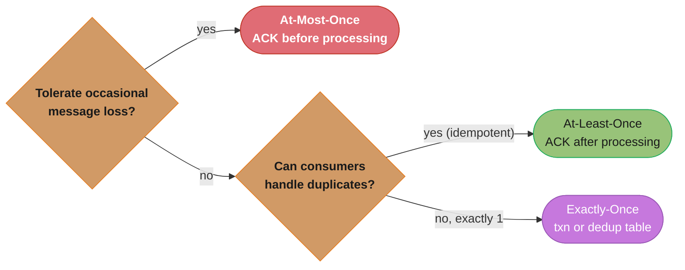
*Most production systems land on at-least-once with idempotent consumers — the practical middle ground between the two extremes below; exactly-once is reserved for cases (like payments) where duplicates or loss are both unacceptable.*

### At-Most-Once (Fire and Forget)
The message is sent once. If the consumer crashes before processing, the message is lost. No retries.

- ACK is sent before processing begins (or not used at all).
- Suitable for: metrics, logs where occasional loss is acceptable.

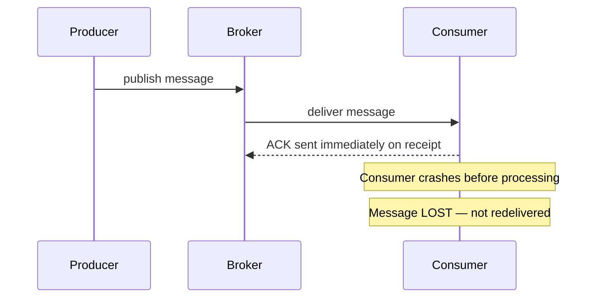
*The ACK fires on receipt, not after processing, so a crash between the two loses the message with no redelivery.*

### At-Least-Once (With Retries)
The broker holds the message until the consumer ACKs after processing. If processing fails or times out, the broker redelivers. The same message may arrive more than once.

- Consumers MUST be idempotent (processing the same message twice produces the same result).
- Most systems default to this.

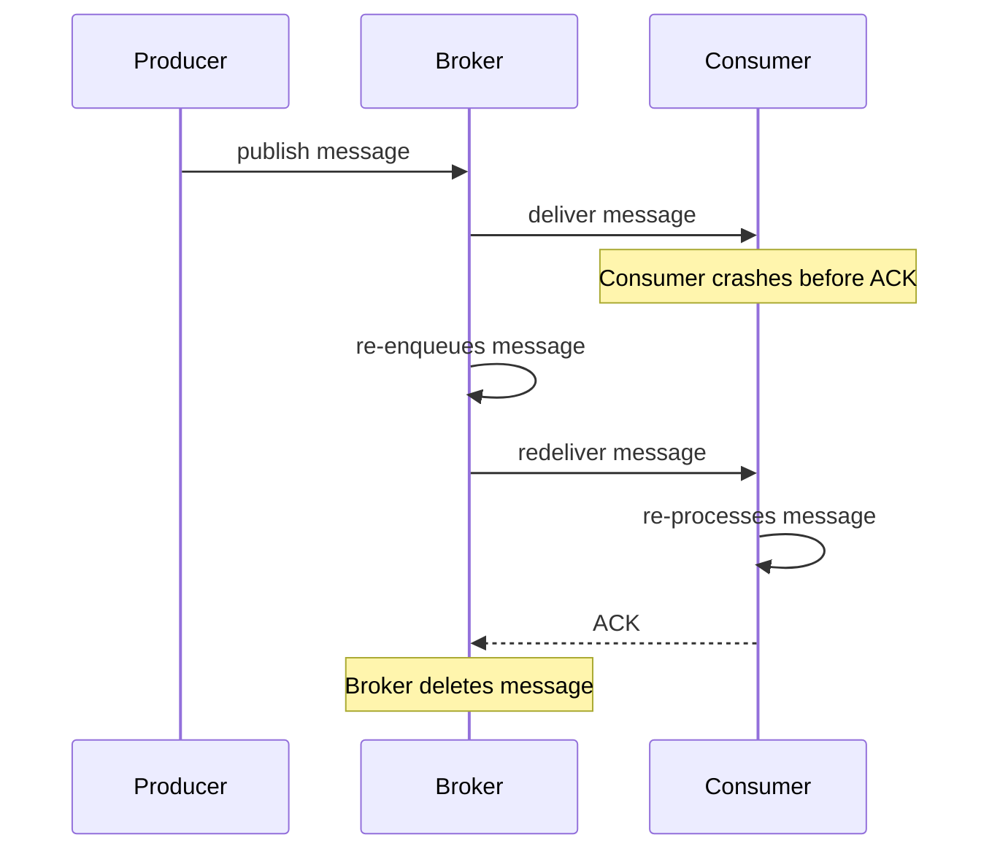
*The broker keeps the message until it sees an ACK, so a crash before ACK triggers redelivery — the same message can arrive twice, which is why consumers must be idempotent.*

### Exactly-Once
Each message is processed exactly once, even in the presence of failures. This is the hardest guarantee to achieve.

Two approaches:
1. **Idempotent producers + transactional consumers**: Kafka 0.11+ supports this within a Kafka cluster.
2. **Application-level deduplication**: consumers store processed message IDs in a database and skip duplicates.

True exactly-once across heterogeneous systems (queue + database) requires distributed transactions or the outbox pattern.

---

## Messaging Patterns

### 1. Point-to-Point (Queue)
One producer, one consumer per message. Used for task distribution — work items are load-balanced across a pool of workers.

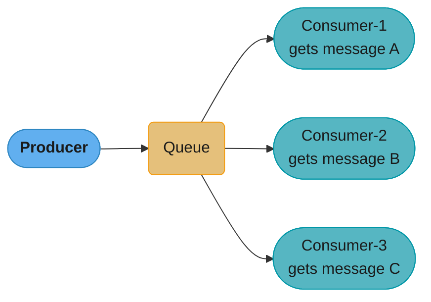
*One message goes to exactly one consumer — the queue load-balances work items across the pool instead of broadcasting them.*

Use case: order processing, email sending, background jobs.

### 2. Publish-Subscribe (Topic)
One producer, many consumer groups. Every group gets a full copy of every message.

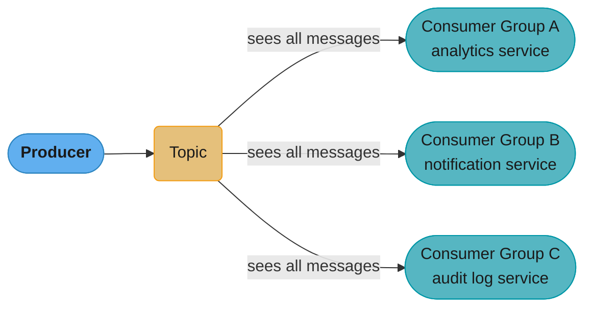
*Unlike point-to-point, every consumer group gets its own full copy of every message — none of them compete for messages.*

Use case: event broadcasting, activity feeds, cache invalidation.

### 3. Request-Reply
Producer sends a request with a reply-to queue; consumer processes and sends response back to that queue. Simulates synchronous RPC over async infrastructure.

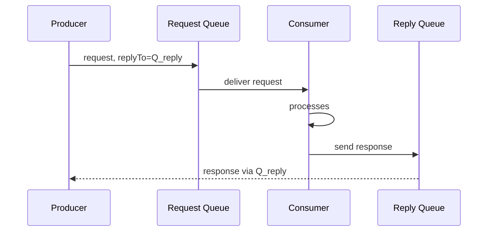
*Producer and consumer never talk directly — the request carries its own reply-to address, simulating synchronous RPC over async infrastructure.*

Use case: service-to-service calls when you still want decoupling; legacy system integration.

### 4. Fan-Out
One message triggers parallel processing in multiple independent consumers simultaneously. Often implemented with SNS (notification service) → multiple SQS queues.

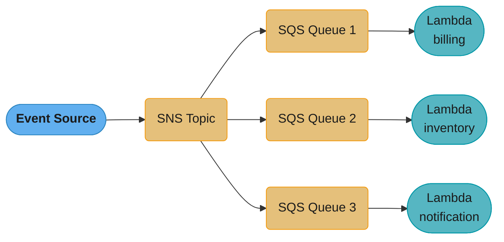
*One event triggers three independent Lambda consumers in parallel — the classic SNS fan-out to per-purpose SQS queues.*

Use case: e-commerce order placement triggering billing, inventory, and notification in parallel.

---

## Kafka vs RabbitMQ vs SQS

### Side-by-Side Comparison

| Feature                   | Apache Kafka                      | RabbitMQ                         | AWS SQS                          |
|---------------------------|-----------------------------------|----------------------------------|----------------------------------|
| **Type**                  | Distributed event log             | Message broker (AMQP)            | Managed queue service            |
| **Storage**               | Persistent log (configurable TTL) | In-memory + optional persistence | Managed (up to 14 days)          |
| **Throughput**            | Millions msg/sec                  | ~50k–100k msg/sec                | Scales automatically (AWS)       |
| **Ordering**              | Per-partition                     | Per-queue                        | FIFO queues only                 |
| **Consumer model**        | Pull (offset-based)               | Push (AMQP)                      | Pull (long polling)              |
| **Replay**                | Yes (seek to offset)              | No                               | No                               |
| **Routing**               | Topic + partition key             | Exchanges, routing keys, bindings| Queue URL-based                  |
| **Dead letter**           | Via config (DLT)                  | Built-in DLX                     | Built-in DLQ                     |
| **Protocol**              | Custom binary (TCP)               | AMQP 0-9-1, STOMP, MQTT          | HTTPS/REST + SQS API             |
| **Ops overhead**          | High (Zookeeper/KRaft, brokers)   | Medium                           | None (fully managed)             |
| **Exactly-once**          | Yes (Kafka transactions)          | No                               | No (at-least-once)               |
| **Best for**              | High-throughput event streaming   | Complex routing, RPC, tasks      | Simple decoupling on AWS         |

The table above resolves into a single tradeoff: operational burden bought for throughput ceiling.

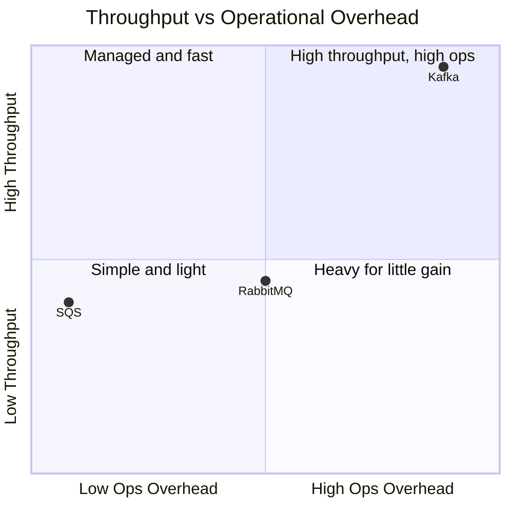
*Kafka trades the highest operational burden (brokers, ZooKeeper/KRaft) for the highest throughput ceiling (millions of msg/sec); SQS inverts that trade — fully managed, but capped (300 TPS per FIFO group); RabbitMQ sits in between at ~50k–100k msg/sec with moderate ops. Positions are illustrative, drawn from the ratings in the table above.*

### Kafka Deep Dive

Kafka stores messages in an **append-only log** partitioned across brokers. Key concepts:

- **Topic**: a logical stream of messages, split into partitions.
- **Partition**: an ordered, immutable sequence of records. The unit of parallelism.
- **Offset**: each record's position in a partition. Consumers commit offsets to track progress.
- **Consumer Group**: a set of consumers sharing a group ID. Each partition is consumed by exactly one member of the group — enabling parallel processing while preserving order per partition.
- **Retention**: messages are kept for a configured period (e.g., 7 days) regardless of consumption.
- **Log compaction**: optional mode that retains only the latest value per key — useful for changelog topics.

### RabbitMQ Deep Dive

RabbitMQ implements the **AMQP** protocol with a flexible routing model:

- **Exchange types**:
  - `direct`: routes by exact routing key match.
  - `topic`: routes by wildcard pattern (`*.error`, `orders.#`).
  - `fanout`: broadcasts to all bound queues.
  - `headers`: routes by message header attributes.
- **Bindings**: rules connecting an exchange to a queue.
- **Dead Letter Exchange (DLX)**: messages that cannot be delivered or are rejected are forwarded to a DLX for inspection.
- **Priority queues**: consumers can assign priority to messages within a queue.
- **Acknowledgment modes**: auto-ack (at-most-once) or manual-ack (at-least-once).

### SQS Deep Dive

Amazon SQS is a fully managed queuing service with two variants:

- **Standard Queue**: at-least-once, best-effort ordering, near-unlimited throughput.
- **FIFO Queue**: exactly-once within a 5-minute deduplication window, 300 TPS (3000 with batching), strict ordering per message group.
- **Visibility Timeout**: when a consumer receives a message, it becomes invisible to others for a configured period. If not deleted in time, the message reappears for reprocessing.
- **Long Polling**: consumers wait up to 20 seconds for messages, reducing empty responses and cost.

---

## Dead Letter Queues

A **Dead Letter Queue (DLQ)** (or Dead Letter Topic in Kafka) is a special queue that receives messages that could not be successfully processed after a maximum number of retries.

### When a message ends up in the DLQ:
- Processing failed repeatedly (max retries exceeded).
- Message TTL (time-to-live) expired before processing.
- Consumer explicitly rejected the message (NACK without requeue in RabbitMQ).
- Message format was invalid or unparseable.

### DLQ Architecture:

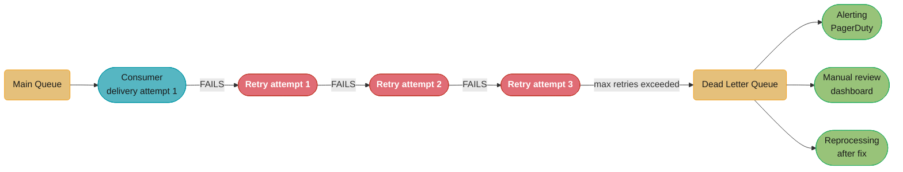
*After three failed retries the message is routed to the DLQ instead of blocking the main queue — from there it's alerted on, inspected, and either fixed-and-replayed or discarded.*

### Best practices for DLQ handling:
1. **Always configure a DLQ** on production queues — never silently drop failed messages.
2. **Alert on DLQ depth** — even a single message in the DLQ signals a bug.
3. **Include metadata** in the message: original queue, failure reason, timestamp of first attempt.
4. **Build a reprocessing tool** to move messages from DLQ back to the main queue after fixing the bug.
5. **Inspect DLQ messages** before reprocessing — they may represent poisonous or malformed data.

---

## Consumer Groups and Partitions

This is Kafka-specific but the concept applies broadly to any partitioned system.

### The fundamental rule:
- Within a consumer group, each **partition** is assigned to exactly **one consumer**.
- One consumer can handle multiple partitions.
- You cannot have more active consumers than partitions (extras sit idle).

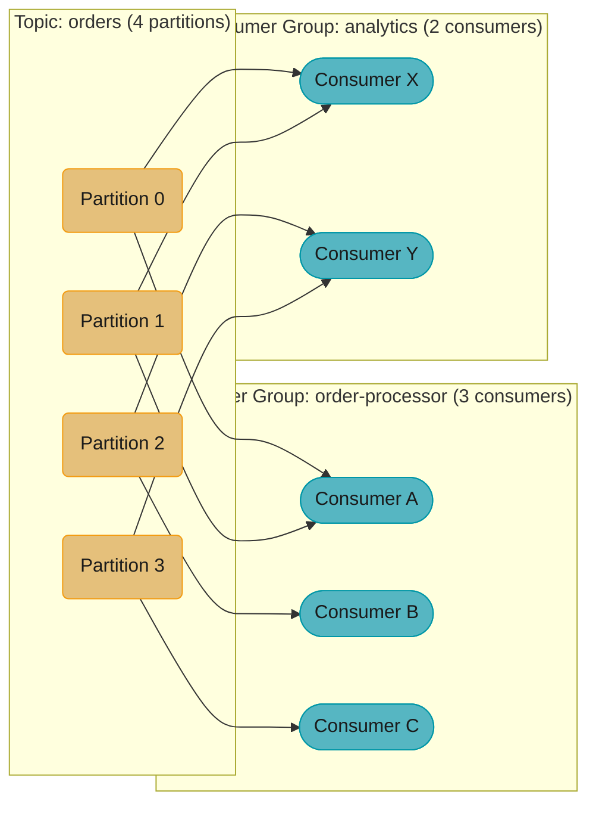
*Each consumer group reads all 4 partitions independently — order-processor spreads them across 3 consumers (Consumer A takes two), analytics across 2 — so one group's pace never affects the other's.*

### Rebalancing
When a consumer joins or leaves a group, partitions are reassigned. During rebalancing, consumption pauses. Kafka provides strategies:
- **Eager (stop-the-world)**: all consumers stop, partitions reassigned.
- **Cooperative (incremental)**: only moved partitions pause, others continue.

### Choosing partition count:
- More partitions = more parallelism, but more overhead (file handles, rebalancing time).
- Rule of thumb: `partitions = expected_consumers * 2` (room to scale).
- Partitions cannot be decreased after creation.

**In plain terms.** "Partitions are the unit of parallelism, so your real consumer count is `min(consumers, partitions)` — and since you can add partitions later but never remove them, you over-provision partitions on purpose and let consumers catch up."

That asymmetry is the whole reason for the `expected_consumers * 2` rule. Adding a consumer takes seconds; adding partitions to a live keyed topic changes which partition a key hashes to and breaks per-key ordering across the boundary. You buy the headroom up front because the cheap direction is one-way.

| Symbol | What it is |
|--------|------------|
| `P` | Partition count on the topic. Fixed upward-only after creation |
| `C` | Consumers currently in one group |
| `min(C, P)` | Consumers doing actual work. Anything past `P` sits idle |
| `P / C` | Partitions each consumer carries when they divide evenly |
| `P = C * 2` | The rule of thumb: half your partitions are growth headroom |

**Walk one example.** The 4-partition topic from the diagram above, with both of its groups:

```
  topic orders:  P = 4

  group order-processor   C = 3   -> min(3,4) = 3 active
    A gets 2 partitions, B gets 1, C gets 1   (uneven: 4 does not divide by 3)
    slowest consumer carries 2/4 = 50% of the load

  group analytics         C = 2   -> min(2,4) = 2 active
    X gets 2, Y gets 2                        (even: 4 divides by 2)
    each carries 2/4 = 50% -- balanced

  scale order-processor to C = 6:
    min(6,4) = 4 active, 2 idle. Throughput does not improve at all.

  apply the rule instead: P = C * 2 = 8 partitions for 4 expected consumers
    room to double the group to 8 without ever retouching the topic
```

The uneven 2/1/1 split is the second lesson: pick `P` as a multiple of the consumer counts you expect, or one consumer permanently carries double the load and sets your lag.

---

## Message Ordering

### The challenge:
Strict global ordering across a distributed queue is expensive and limits throughput. Most systems provide weaker ordering guarantees.

### Ordering levels:

| Level                   | How                                          | Cost                            |
|-------------------------|----------------------------------------------|---------------------------------|
| No ordering             | Any consumer, any order                      | Maximum throughput              |
| Per-partition ordering  | Kafka: messages with same key go same partition | Linear per partition           |
| Per-queue ordering      | RabbitMQ single queue with single consumer   | No parallelism                  |
| Global ordering         | Single partition / single consumer           | Throughput limited to one node  |
| FIFO ordering           | SQS FIFO + MessageGroupId                    | Up to 300 TPS per group         |

### How to guarantee ordering when you need it:
1. **Use a partition key / routing key**: ensure all related messages (same order ID, same user ID) go to the same partition.
2. **Sequence numbers**: include a sequence number in the message; consumers reorder if needed (out-of-order buffer).
3. **Idempotent + order-insensitive design**: redesign the consuming logic so order does not matter.

---

## Architecture Diagrams

### Kafka Cluster with Producers, Topics, Partitions, Consumer Groups

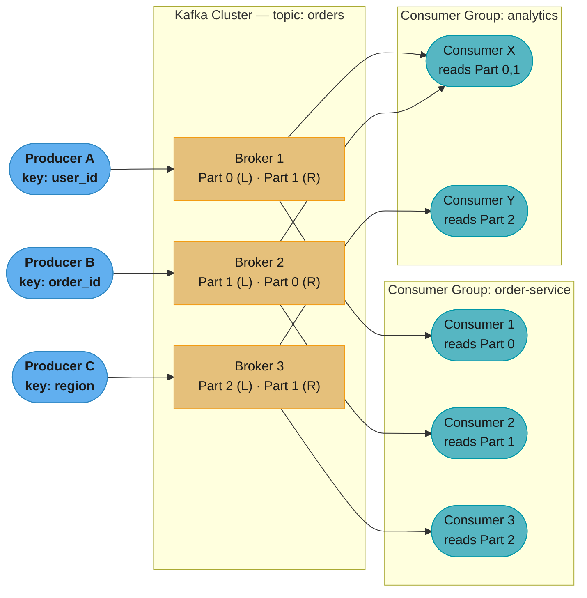
*Offsets are tracked per consumer group, not globally — order-service sits at {Part0: 1042, Part1: 987, Part2: 1105} while analytics lags slightly behind at {Part0: 500, Part1: 499, Part2: 501}; each group replays and falls behind independently.*

### RabbitMQ Routing via Exchanges

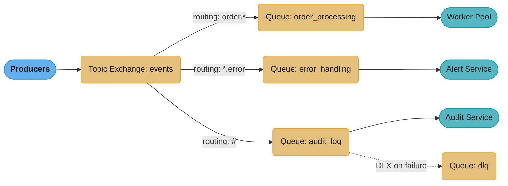
*The topic exchange fans out by routing-key pattern to three queues; the audit queue additionally has a dead-letter exchange so undeliverable messages land in a separate DLQ.*

---

## Real-World Use Cases

### Uber — Ride Matching Pipeline

Uber processes millions of location updates per second. Kafka is used to:
- Ingest GPS pings from drivers and riders into location topics.
- Fan out to multiple consumers: dispatch engine, surge pricing, ETA calculator.
- Decouple the mobile app (producer) from all downstream systems.
- Replay events for post-hoc analysis and ML feature engineering.

Key design: partition by city/region to keep related events together, enabling efficient geospatial queries per partition.

### LinkedIn — Activity Streams and Newsfeed

LinkedIn built Kafka internally to handle member activity (post, like, share, connection). Before Kafka, point-to-point pipelines grew to O(n^2) complexity. Kafka simplified to a single stream that all consumers subscribe to independently.

LinkedIn uses Kafka for:
- Real-time newsfeed ranking
- Offline analytics pipelines
- Change Data Capture from MySQL (Debezium → Kafka)

### Netflix — Event Pipeline

Netflix uses Apache Kafka as the backbone of its data pipeline, processing trillions of events per day:
- Client playback events (buffering, bitrate changes, errors)
- A/B test logging
- Alerting and anomaly detection (consumer reads stream, checks thresholds)
- ETL into data warehouses (Kafka → Flink → S3 / Redshift)

Netflix's "Keystone" pipeline processes ~500 billion events per day with Kafka at the center.

---

## When to Use Message Queues

### Use message queues when:
- **Workload spikes**: downstream services cannot handle peak throughput directly.
- **Async is acceptable**: the caller does not need an immediate response.
- **Multiple consumers**: different services need the same event (fan-out).
- **Decoupling deployments**: producer and consumer teams deploy independently.
- **Retry and durability**: you need guaranteed delivery with automatic retries.
- **Rate limiting downstream**: protect a slow or expensive service by queuing work.

### Prefer direct API calls when:
- **Immediate response required**: user is waiting for the result synchronously.
- **Simple, low-volume flows**: the overhead of a broker is not justified.
- **Strong consistency needed**: you need a transactional read-your-writes guarantee.

### Prefer event sourcing over queues when:
- You need a **complete audit history** of all state changes.
- Rebuilding state from events is a first-class requirement.
- You want to derive new read models from historical events.

---

## Tradeoffs and Considerations

| Consideration             | Notes                                                                         |
|---------------------------|-------------------------------------------------------------------------------|
| Operational complexity    | Kafka clusters require careful tuning (heap, disk, replication factor)        |
| Latency                   | Async inherently adds latency vs direct RPC; usually tens of ms               |
| Message ordering          | Hard to guarantee globally; design to not require it where possible           |
| Duplicate processing      | At-least-once means consumers must be idempotent                              |
| Consumer lag monitoring   | Unbounded lag means consumers are falling behind producers; needs alerting    |
| Schema evolution          | Use Avro + Schema Registry to evolve message formats without breaking consumers|
| Exactly-once complexity   | True end-to-end exactly-once is very hard; design for idempotency instead     |
| Backpressure              | Queue depth is the signal; auto-scaling consumers based on lag depth          |

---

## Best Practices

### Idempotency
Design consumers so that processing the same message multiple times produces the same outcome. Use:
- A deduplicated message ID stored in a database.
- Natural idempotency in the operation (e.g., `SET balance = X` vs `ADD balance += X`).
- Conditional writes / optimistic locking.

### Poison Messages
A poison message is one that consistently causes consumer failures and blocks the queue. Mitigations:
- Configure a max delivery count / retry limit.
- Route to DLQ after limit exceeded.
- Alert on DLQ depth immediately.
- Implement a circuit breaker in the consumer to stop retrying temporarily.

### Monitoring Consumer Lag
Consumer lag = (latest offset in partition) - (consumer's committed offset). High lag means:
- Consumers are too slow — scale out.
- A consumer is stuck — alert and investigate.
- A deployment issue — check consumer error logs.

Tools: Kafka's `kafka-consumer-groups.sh`, Burrow, Confluent Control Center, Datadog.

**Stated plainly.** "Lag is a stock, not a flow — it is the running total of every message that arrived faster than you consumed it, so what actually matters is the *gap* between arrival rate and service rate, and how long that gap has been open."

Alerting on absolute lag alone is the classic mistake. A lag of 50,000 that is shrinking is fine; a lag of 5,000 that is growing is an outage in twenty minutes. The derivative is the signal.

| Symbol | What it is |
|--------|------------|
| `lag` | `latest offset - committed offset`, in messages, per partition |
| `A` | Arrival rate — messages produced per second |
| `S` | Service rate — messages the group can consume per second |
| `A - S` | The gap. Positive means lag grows; negative means it drains |
| growth | `(A - S) x elapsed_seconds` — messages of lag accumulated |
| drain time | `lag / (S - A)` — seconds to reach zero, once `S > A` |

**Walk one example.** A group serving 1,200/sec that meets a burst, then recovers:

```
  phase 1 -- burst, A = 2,000/s, S = 1,200/s, for 10 minutes
    gap     = 2,000 - 1,200        =   800 msg/s
    growth  =   800 x 600 s        = 480,000 messages of lag

  phase 2 -- burst ends, A back to 1,000/s, S still 1,200/s
    gap     = 1,000 - 1,200        =  -200 msg/s  (draining)
    drain   = 480,000 / 200        = 2,400 s = 40 minutes

  phase 3 -- instead, double the group: S = 2,400/s
    gap     = 1,000 - 2,400        = -1,400 msg/s
    drain   = 480,000 / 1,400      =   343 s = 5.7 minutes
```

A 10-minute burst took 40 minutes to clear on the original capacity. That ratio — recovery far longer than the incident — is why lag alarms need to fire on the gap turning positive, not on lag crossing a threshold.

### Schema Management
- Use Apache Avro with a Schema Registry (Confluent) for structured messages.
- Never break the schema contract — add optional fields only, never remove or rename fields.
- Version your schemas; consumers should handle unknown fields gracefully.

### Partitioning Strategy
- Choose partition keys that distribute load evenly (avoid hot keys like `region=US` for all traffic).
- Co-locate related messages (same entity ID → same partition) to preserve ordering.
- Plan for future partition count increases — partitions can only be added, never reduced.

---

## Cross-Perspective: LLD Connections

**LLD View — Design Patterns That Implement Message Queues**

- **Observer / Producer-Consumer** — Message queues implement both: publishers emit events to a topic without knowing who subscribes; consumers receive asynchronously. This is Observer at infrastructure scale with persistence and guaranteed delivery.
- **Command** — Messages are serialized Command objects: they encapsulate an action, its parameters, and metadata (timestamp, correlation ID). Dead-letter queues hold failed commands for inspection or retry — the Command history pattern at system scale.
- **Strategy** — Routing strategies (topic-based, content-based, header-based), delivery guarantees (at-most-once, at-least-once, exactly-once), and consumer group assignment are interchangeable Strategy implementations.
- **Iterator** — Kafka consumers iterate over partition offsets. Committing the offset advances the iterator; seeking to an earlier offset replays messages — a stateful, resettable Iterator.

---

**Cross-references:** [backend/kafka_deep_dive](../../backend/kafka_deep_dive/) (partitions, consumer groups, ISR, exactly-once semantics), [backend/messaging_patterns](../../backend/messaging_patterns/) (competing consumers, pub/sub, saga via messaging), [backend/event_driven_fundamentals](../../backend/event_driven_fundamentals/), [spring/spring_messaging](../../spring/spring_messaging/) (`@KafkaListener`, JMS, RabbitMQ templates), [devops/event_streaming_operations](../../devops/event_streaming_operations/) (running and operating Kafka clusters), [fastapi/message_queues_and_event_driven](../../fastapi/message_queues_and_event_driven/) (Celery and FastAPI background processing).

---

## Case Study: Ride-Matching Pipeline

### Context
A ride-hailing company needs to match rider requests to nearby drivers in real time, handling 100,000+ concurrent requests during peak hours.

### Architecture

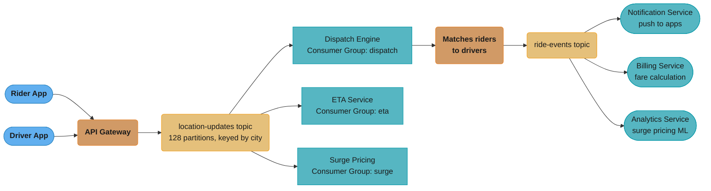
*Location pings fan out to three independent consumer groups (dispatch, ETA, surge); the dispatch group's match decision emits a second topic that itself fans out to notification, billing, and analytics.*

### Key Design Decisions
1. **Partition by city**: keeps location events local to a regional consumer, reducing cross-region latency.
2. **At-least-once with idempotent dispatch**: if dispatch processes the same ride request twice, the second attempt is a no-op (ride already matched).
3. **Separate consumer groups**: dispatch, ETA, and surge pricing each consume independently — a slow analytics job does not block real-time dispatch.
4. **DLQ for failed matches**: if dispatch cannot find a driver (no availability), the event goes to a DLQ for rider notification ("no cars nearby").
5. **Short retention (1 hour)**: location pings older than 1 hour are irrelevant, keeping Kafka storage manageable.

---

## Interview Questions

**Q1: What is the difference between a message queue and a message broker?**
A queue is a simple FIFO buffer; a message broker adds routing, exchange logic, protocol support (AMQP), and features like dead letter exchanges and priority queues. RabbitMQ is a broker; SQS is a queue.

**Q2: What is at-least-once delivery and why does it require idempotent consumers?**
The broker redelivers if no ACK is received before timeout. This can result in duplicate deliveries. Idempotent consumers handle duplicates safely — processing the same message twice has the same effect as processing it once.

**Q3: How does Kafka guarantee message ordering?**
Kafka guarantees ordering within a single partition. Assign a consistent partition key (e.g., order ID) so all related messages land in the same partition. Global ordering across partitions is not guaranteed.

**Q4: What is a Dead Letter Queue and when would you use it?**
A DLQ holds messages that could not be processed after max retries. Use it to prevent a poison message from blocking the queue, allow manual inspection, and enable replay after fixing the root cause.

**Q5: How does Kafka's consumer group model enable parallel processing?**
Each partition is consumed by at most one consumer within a group. Adding consumers up to the partition count increases parallelism linearly. Multiple consumer groups each receive all messages independently.

**Q6: How would you scale a message queue system to handle a 10x traffic spike?**
Scale consumers horizontally (add instances up to partition count). If more parallelism is needed, increase partition count (pre-plan this). Use auto-scaling based on consumer lag metrics. Kafka's broker layer scales by adding brokers and rebalancing partitions.

**Q7: How do you handle schema changes in a message queue without breaking consumers?**
Use a Schema Registry with Avro or Protobuf. Apply backward-compatible changes only (add optional fields). Deploy new consumers before changing producers (consumer-first deployment). Never rename or remove fields without a versioning strategy.

**Q8: What is the visibility timeout in SQS and why does it matter?**
When a consumer reads a message, it becomes invisible to others for the visibility timeout duration. If the consumer does not delete it in time, the message reappears. Set visibility timeout to slightly longer than max expected processing time to avoid duplicate processing.

**Q9: What is Kafka log compaction and when would you use it?**
Log compaction retains only the latest message per key. Older values for the same key are garbage collected. Use it for changelog topics that represent the current state of an entity (e.g., user profile updates), where only the latest state matters.

**Q10: How do you prevent a slow consumer from causing the message queue to grow indefinitely?**
Monitor consumer lag with alerts. Auto-scale consumers when lag exceeds a threshold. Apply backpressure to producers if lag is critical. Set message TTL so old messages expire rather than accumulating. Implement circuit breakers to stop producing to a queue when consumers are overwhelmed.

**Q11: How would you implement exactly-once processing end-to-end with Kafka?**
Use Kafka's idempotent producer (enable.idempotence=true) and transactional API to atomically write to Kafka and commit offsets. For the consumer-to-database leg, use the outbox pattern or transactional writes where the database operation and offset commit are in the same transaction.

**Q12: What happens when a Kafka broker fails?**
Kafka replicates each partition across multiple brokers (replication factor, typically 3). One replica is the leader; others are followers. If the leader fails, one of the in-sync replicas (ISR) is elected as the new leader. Producers and consumers reconnect and continue with minimal interruption.

**Q13: Why is `acks=1` dangerous for payment-critical topics even with replication factor 3?**
With `acks=1` the producer gets an acknowledgment as soon as the partition leader has the write, before any follower replicates it — so a leader crash in that window loses the batch permanently despite RF=3. The Uber case study hit exactly this: producers used `acks=1` "for performance," a broker crashed before replicating a batch, and 800 payment events were lost with no way to recover them. The fix is `acks=all` combined with `min.insync.replicas=2`, which guarantees every acknowledged write is durable on at least 2 of the 3 replicas; the measured cost was only 8ms of added p99 latency. Match the acks setting to the topic's loss tolerance — `acks=1` is fine for disposable metrics, never for money.

**Q14: How do you choose the partition count for a new Kafka topic, and why does over-provisioning hurt?**
Size partitions for your maximum expected consumer parallelism with growth headroom, since consumers in a group can never exceed the partition count and partitions can only ever be added, never removed. The Uber case study picked 96 partitions for a largest consumer group of 16 — roughly 4x headroom — keeping per-partition throughput (~1.5 MB/s) well under the ~10 MB/s per-partition guideline. Over-provisioning has real costs the module calls out: each partition consumes file handles and controller metadata, and rebalances take longer with more partitions to reassign, so tens of thousands of partitions on a topic actively degrades the cluster. Start with roughly `expected_consumers * 2` to `* 4` and add partitions later if needed — the reverse operation doesn't exist.

**Q15: Why do the Uber pipeline's events carry small deltas instead of the full ride object?**
Embedding full state multiplies network and storage cost by the payload ratio on every single event, while most consumers only need to know what changed. The case study's third pitfall quantifies it: full ride objects (driver profile, route polyline, fare breakdown) made each event ~5 KB, and at 5,000 events/sec that saturated broker networks at 25 MB/s; slimming events to deltas (`ride_id`, `from_state`, `to_state`, timestamp, minimal context) cut them to ~400 bytes — a 12x network reduction. The tradeoff is that a consumer needing full state must fetch it from the source-of-truth service, adding a read dependency; that's acceptable because only a minority of consumers need it and the ride service is already built for reads. Default to thin events with a stable ID for lookup, and only embed full state when consumers genuinely cannot tolerate the extra fetch.

**Q16: A ride's COMPLETED event was processed before its IN_PROGRESS event — how does that happen with a single partition key, and what fixes it?**
Producer retries without idempotence can reorder messages within a partition, because a failed batch is retried while later batches are already in flight. The Uber case study's second pitfall shows the mechanics: a transient broker error made the producer retry IN_PROGRESS, and with multiple in-flight requests the retried message landed behind COMPLETED, breaking the per-ride state machine even though both events shared a partition. The fix is `enable.idempotence=true`, which assigns per-partition sequence numbers so the broker rejects out-of-sequence duplicates and preserves order across retries (while allowing up to 5 in-flight requests per connection). Enable idempotence on any producer whose events form an ordered sequence — per-partition ordering is only guaranteed when retries can't shuffle the queue.

---

## Case Study: Uber Kafka Pipeline for Ride State Events

### Problem Statement

Uber must propagate every ride state transition (REQUESTED → DRIVER_ASSIGNED → EN_ROUTE → ARRIVED → IN_PROGRESS → COMPLETED → PAID) to multiple independent consumers in real time. Scale:

- 15M rides/day × ~6 state events = 90M events/day
- Throughput: 1,000 events/sec sustained, 5,000/sec during commute peaks
- Latency SLA: p99 producer-to-consumer < 200 ms
- Durability: zero event loss for payment-critical events
- Ordering: events for the same ride must be processed in order
- Consumers (independent processing): pricing/surge, push notifications, analytics, fraud detection, payments/revenue
- Retention: 7 days for replay; long-term archival to S3

Each consumer team owns their service and consumes at their own pace. A producer outage in one consumer must not block ride events from flowing.

**Put simply.** "Every business object emits a fixed number of events, so event volume is entity volume times events-per-entity — and the number you must actually size for is the peak, which here is roughly five times the daily average."

Sizing on the daily average is how capacity plans fail. The average tells you storage; the peak tells you partition count, consumer count, and whether the SLA holds. Both come out of the same three inputs.

| Symbol | What it is |
|--------|------------|
| rides/day | `15,000,000` business entities per day |
| events/ride | `~6` state transitions, REQUESTED through PAID |
| events/day | `rides x events-per-ride` |
| sustained rate | `events/day / 86,400` — the daily average, in events/sec |
| peak rate | `5,000/sec` during commute hours — what you actually size for |
| peak factor | `peak / sustained` — the burstiness multiplier |

**Walk one example.** The three stated inputs, pushed through to a sizing number:

```
  events/day   = 15,000,000 rides x 6 events    = 90,000,000 events/day

  sustained    = 90,000,000 / 86,400 s          =  1,042 events/sec
                 (quoted as "1,000/sec sustained" -- rounded)

  peak         =                                   5,000 events/sec
  peak factor  = 5,000 / 1,042                  =    4.8x

  byte rate at ~400 bytes/event (decision 8)
    sustained  = 1,042 x 400 B                  =    417 KB/sec
    peak       = 5,000 x 400 B                  =  2,000 KB/sec = 2.0 MB/sec
```

Two megabytes a second at peak is a tiny load for a 12-broker Kafka cluster — which tells you immediately that this design is not sized by throughput at all. It is sized by ordering (one partition per ride key), durability (RF=3), and consumer parallelism.

### Architecture Overview

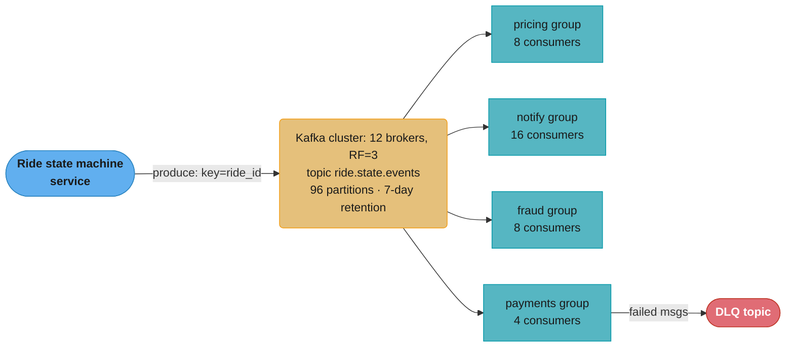
*One partitioned topic (96 partitions, ride_id-keyed) feeds four independent consumer groups; only the payments group's failures spill into a dead-letter topic.*

### Key Design Decisions

1. **Partition key = `ride_id`** — All events for one ride land on the same partition, guaranteeing in-order delivery per ride. Different rides can be processed in parallel.
   - *Alternative rejected*: partition by `driver_id` — would serialize unrelated rides by the same driver and starve some partitions.

2. **96 partitions** — Allows up to 96 consumers per consumer group. Sized for 4x current peak (~208 events/sec/partition at 4x peak). More than the consumer count gives room to scale up without rebalancing the topic.

**What this actually says.** "Pick the partition count from the consumer parallelism you will ever need, not from the byte rate — then check that the resulting per-partition load is comfortably below what one partition can serve."

Partition count is a ceiling on concurrency and a floor on ordering granularity at the same time. Ninety-six here is chosen so the largest group (notify, 16 consumers) could grow six-fold without ever touching the topic, and the per-partition rate that falls out is almost negligible.

| Symbol | What it is |
|--------|------------|
| `P` | `96` partitions on `ride.state.events` |
| peak | `5,000 events/sec` at commute hours |
| `4x peak` | `20,000 events/sec` — the design target with headroom |
| per-partition | `target rate / P` — load one partition must carry |
| max group size | `P` — a group can never exceed 96 working consumers |

**Walk one example.** The four group sizes against the same 96 partitions:

```
  per-partition load
    at sustained 1,042/s  ->  1,042 / 96  =    10.9 events/sec/partition
    at peak      5,000/s  ->  5,000 / 96  =    52.1 events/sec/partition
    at 4x peak  20,000/s  -> 20,000 / 96  =   208.3 events/sec/partition

  group headroom (P = 96)
    group      consumers   partitions each   room to grow
    -------    ---------   ---------------   ------------
    notify        16          96/16 = 6         6.0x
    pricing        8          96/8  = 12       12.0x
    fraud          8          96/8  = 12       12.0x
    payments       4          96/4  = 24       24.0x
```

Even at four times peak, one partition carries about 208 events/sec — roughly 83 KB/sec at 400 bytes an event. The partitions exist for consumer slots and per-ride ordering, not for throughput.

3. **Replication factor 3, min.insync.replicas=2** — Tolerates one broker failure without losing writes. Combined with `acks=all`, every committed write is durable on at least 2 brokers.

4. **Independent consumer groups, not a shared queue** — Each downstream system reads independently with its own offset. A slow consumer (fraud) cannot back up the others.
   - *Alternative rejected*: RabbitMQ fanout — harder to replay history, weaker throughput at this scale.

5. **Idempotent producer with `enable.idempotence=true`** — Eliminates duplicates on producer retries (one of Kafka's exactly-once primitives).

6. **Exactly-once semantics for the payments consumer** — Uses Kafka transactions: read offset + write to Postgres + commit offset, all in one atomic Kafka-DB transaction (via Debezium-style outbox or KafkaTransactionManager).

7. **Dead-letter topic per consumer group** — On processing failure (e.g., bad payload), the consumer publishes to `<group>.dlq` and commits the offset. A separate replay tool inspects DLQ messages for manual intervention.

8. **Events carry deltas, not full state** — Each event carries `ride_id`, `from_state`, `to_state`, `timestamp`, and minimal context (e.g., `assigned_driver_id`). Full ride state is fetched from the source-of-truth service if needed, reducing message size from ~5 KB to ~400 bytes.

### Implementation

Producer configuration (Java):

```java
Properties props = new Properties();
props.put("bootstrap.servers", "kafka-1:9092,kafka-2:9092,kafka-3:9092");
props.put("key.serializer",   "org.apache.kafka.common.serialization.StringSerializer");
props.put("value.serializer", "io.confluent.kafka.serializers.KafkaAvroSerializer");
props.put("acks", "all");
props.put("enable.idempotence", "true");
props.put("max.in.flight.requests.per.connection", "5");
props.put("compression.type", "lz4");
props.put("linger.ms", "10");
props.put("batch.size", "32768");

KafkaProducer<String, RideStateEvent> producer = new KafkaProducer<>(props);

producer.send(new ProducerRecord<>(
    "ride.state.events",
    rideId,                       // partition key
    event));
```

Consumer with manual commit and DLQ:

```java
consumer.subscribe(List.of("ride.state.events"));
while (running) {
  ConsumerRecords<String, RideStateEvent> recs = consumer.poll(Duration.ofMillis(500));
  for (ConsumerRecord<String, RideStateEvent> rec : recs) {
    try {
      pricingService.recalculateSurge(rec.value());
    } catch (PoisonPillException e) {
      dlqProducer.send(new ProducerRecord<>("pricing.dlq", rec.key(), rec.value()));
    } catch (TransientException e) {
      // Don't commit; will be re-polled
      return;
    }
  }
  consumer.commitSync();
}
```

Topic creation:

```bash
kafka-topics.sh --create \
  --topic ride.state.events \
  --partitions 96 \
  --replication-factor 3 \
  --config min.insync.replicas=2 \
  --config retention.ms=604800000 \
  --config compression.type=lz4
```

### Tradeoffs

| Approach | Throughput | Ordering | Replay | Operational complexity |
|----------|-----------|----------|--------|----------------------|
| Kafka (chosen) | Very high (10M+/s) | Per-partition | Yes (offset reset) | High (broker ops) |
| RabbitMQ | Medium (50k/s) | Per-queue FIFO | Limited | Medium |
| AWS SQS | Medium (3k/s/queue) | FIFO queue only | No | Low (managed) |
| AWS Kinesis | High | Per-shard | 7-day | Medium (managed) |

### Metrics & Results

- p50 producer-to-consumer latency: 35 ms
- p99 producer-to-consumer latency: 140 ms (SLA: 200 ms)
- Sustained throughput: 1,200 events/sec; peak handled: 5,400 events/sec
- Consumer lag: < 500 messages per partition at steady state
- Zero data loss in 18 months of production operation
- Broker failover (1 broker killed): consumers paused ~3 seconds during leader election
- Storage: 1.2 TB across 12 brokers (7-day retention, RF=3, LZ4 compression)

**What it means.** "Retention is not a time setting, it is a disk purchase — the bytes you must own are your byte rate multiplied by how long you keep it, and then multiplied again by the replication factor."

The `x RF` at the end is the term people forget, and it is the one that triples the bill. Retention and replication are independent knobs that multiply: cutting retention from 7 days to 3 saves the same proportion as dropping RF from 3 to 1, but only one of those is safe.

| Symbol | What it is |
|--------|------------|
| event rate | `90,000,000` events/day |
| event size | `~400 bytes` after decision 8 trimmed it from ~5 KB |
| retention | `7 days` = `retention.ms=604800000` |
| `RF` | Replication factor `3` — every byte stored on three brokers |
| retained bytes | `rate x size x retention x RF` |
| per broker | `total / 12` brokers |

**Walk one example.** The topic config, converted into disk:

```
  daily bytes    = 90,000,000 x 400 B            =    36 GB/day
  x retention    =         36 x 7 days           =   252 GB (one copy)
  x RF           =        252 x 3                =   756 GB (all replicas)
  per broker     =        756 / 12               =    63 GB each

  reported: 1.2 TB -- the extra ~450 GB is record headers, Avro schema IDs,
  and the .index/.timeindex files Kafka keeps alongside every log segment.

  what decision 8 was worth (5 KB full state vs 400 B deltas):
    5,000 B/event -> 90,000,000 x 5,000 x 7 x 3  = 9,450 GB = 9.45 TB
    ratio 9,450 / 756                            = 12.5x more disk
```

That last line is why "events carry deltas, not full state" is a storage decision as much as a bandwidth one: the 12.5x message-size reduction shows up multiplied by both retention and replication factor.

### Common Pitfalls / Lessons Learned

1. **Fraud consumer lag during demand spikes** — Broken: fraud detection (heavy ML inference) consumed at 800 events/sec while peak was 5,000/sec; lag grew to 2M messages in 30 minutes. Fix: scaled the consumer group from 4 to 16 instances (matching partition count), and offloaded the heaviest ML model to async batch scoring. Lag now stays under 10k messages.

**What the formula is telling you.** "Consumer count is not a judgement call — it is arrival rate divided by what one instance can actually do, and if that quotient exceeds your instance count the lag is arithmetic, not bad luck."

The fraud group was provisioned by symmetry with the other groups rather than by measured per-instance throughput. That is the failure mode: four instances that each do 200 events/sec is a 800/sec group facing a 5,000/sec peak, and no amount of retry tuning fixes a capacity deficit.

| Symbol | What it is |
|--------|------------|
| `A` | Arrival rate at peak — `5,000` events/sec |
| `S_1` | What one instance sustains — measured, not assumed |
| `C` | Instances in the group. Capped at `P = 96` partitions |
| `C = ceil(A / S_1)` | Instances needed to just keep up |
| lag growth | `(A - C x S_1) x seconds` |

**Walk one example.** Back out the per-instance rate, then size the group properly:

```
  measured   group did 800/s across 4 instances
             S_1 = 800 / 4                       =   200 events/sec/instance

  required   C = ceil(5,000 / 200)               =    25 instances
  actual     C = 4                               ->  deficit of 21 instances

  after scaling to 16 instances (no model change)
             S = 16 x 200                        = 3,200 events/sec
             still short of 5,000 -- which is why the heavy ML model
             was ALSO moved to async batch scoring, raising S_1

  reading the incident backwards from the observed lag
    2,000,000 messages / 1,800 s                 = 1,111 msg/s average gap
    implied average arrival = 800 + 1,111        = 1,911 events/sec
    (a sustained 5,000/s against 800/s would have built
     (5,000-800) x 1,800 = 7,560,000 messages instead)
```

That last block is the useful habit: lag is an integral, so dividing observed lag by the window recovers the *average* deficit. The 2M figure tells you the spike averaged around 1,900/sec, not that it sat at the 5,000/sec headline peak for the full half hour.

2. **Ordering violation: COMPLETED before IN_PROGRESS** — Broken: a transient broker error caused the producer to retry IN_PROGRESS; without idempotence, it was buffered behind COMPLETED. Consumer saw out-of-order events and skipped state validation. Fix: enabled `enable.idempotence=true` (which forces `max.in.flight.requests.per.connection ≤ 5` with per-partition sequence numbers, preserving order across retries).

3. **5 KB events crushing the network** — Broken: producers embedded the full ride object (driver profile, route polyline, fare breakdown) in every event. At 5,000 events/sec × 5 KB = 25 MB/s per partition; brokers saturated. Fix: events now carry only deltas (~400 bytes); consumers fetch full state from the ride-service REST API when needed. Network use dropped 12x.

4. **`acks=1` and a broker crash** — Broken: in early deployment, producers used `acks=1` (leader-only ack) for "performance." A broker crashed before replicating a batch of 800 payment events; those events were lost permanently. Fix: switched all payment-critical topics to `acks=all` + `min.insync.replicas=2`. p99 latency rose by 8 ms — acceptable for durability.

### Interview Discussion Points

**Q1: Why partition by ride_id rather than driver_id or city?**
ride_id provides the right granularity: per-ride ordering is preserved (state machine integrity) while different rides parallelize naturally. driver_id would serialize unrelated rides of the same driver and create hotspots on busy drivers. city would create extreme hotspots (NYC traffic dwarfs smaller cities).

**Q2: How do you ensure exactly-once processing for payment events?**
Use Kafka's transactional API. The payment consumer reads an event, writes the charge to Postgres, and commits the consumer offset — all within a single Kafka transaction (`KafkaTransactionManager` in Spring). If any step fails, the transaction aborts and nothing is committed. Alternatively use the outbox pattern with a `processed_event_ids` table for idempotency.

**Q3: What happens when a consumer is too slow?**
Lag grows. Kafka exposes `consumer-lag` metric per partition. Alert when lag exceeds N or when wall-clock lag exceeds T seconds. Mitigations: scale consumer instances up to partition count, increase consumer compute, batch processing, or shed non-critical work. If lag exceeds retention (7 days), oldest messages are lost — the consumer skips ahead to the earliest available offset.

**Q4: Why 96 partitions specifically?**
Enough headroom for 4x growth in consumer count (currently 16 max in the largest group). Each partition handles ~1.5 MB/s comfortably (well under the ~10 MB/s/partition guideline). More partitions = more file handles, more metadata in ZK/KRaft, longer rebalance times — so don't over-provision (avoid 10,000 partitions unless needed).

**Q5: How does Kafka guarantee at-least-once delivery?**
The producer retries on errors (with idempotence to avoid duplicates). The consumer commits the offset only after successful processing. If the consumer crashes between processing and committing, on restart it re-reads from the last committed offset — replaying the unprocessed message. This is at-least-once. Exactly-once requires transactions or idempotent processing on the consumer side.

**Q6: What's the consequence of `min.insync.replicas=2` with RF=3?**
At least 2 of 3 replicas must acknowledge writes. If 2 brokers are unavailable, the partition becomes unavailable for writes (preserves consistency). With `min.insync=1` + 2 broker failures, writes might succeed and then be lost when the leader recovers. The tradeoff is availability vs durability — Uber chooses durability for payment events.

**Q7: How would you replay events from the past 24 hours into a new consumer?**
Create a new consumer group with the desired ID. Use `kafka-consumer-groups.sh --reset-offsets --to-datetime <ISO-8601>` to set its offsets to 24 hours ago. Start the consumer; it replays from that point. Because each consumer group has independent offsets, this does not affect existing consumers.
