# Microservices Architecture — High-Level Design

---

## 1. Concept Overview

**Microservices** is an architectural style that structures an application as a collection of small, independently deployable services, each owning a specific business capability and its data. Services communicate over well-defined APIs.

The motivation is to solve the pain points of large monolithic systems:

| Pain Point (Monolith)                   | Microservices Solution                        |
|-----------------------------------------|-----------------------------------------------|
| Entire app redeploys for any change     | Deploy only the changed service               |
| One language/framework for everything   | Polyglot: best tool for each job              |
| Scaling requires scaling everything     | Scale only the bottleneck service             |
| One team blocked by another's code      | Teams own and deploy their services           |
| Single point of failure                 | Fault isolation: one service down != all down |
| Test suite grows with the codebase      | Smaller, faster test suites per service       |

---

## Intuition

> **One-line analogy**: Microservices are like specialized departments in a company — the Payments team, Inventory team, and Shipping team each do their job independently, communicate via well-defined processes, and can be scaled or updated without shutting down the whole company.

**Mental model**: A monolith is one big application — easy to build, hard to scale. Microservices split the application into small, independently deployable services, each owning its data. The Order service knows about orders; the Inventory service knows about stock. They communicate via APIs or message queues. This enables independent scaling (scale only the bottleneck service), independent deployment (update Payments without touching User service), and team autonomy.

**Why it matters**: Microservices enable large organizations to move fast. Netflix, Amazon, Uber — all operate with hundreds of microservices. The tradeoff: distributed systems are inherently complex (network failures, eventual consistency, distributed tracing). Microservices solve organizational scaling problems but add technical complexity.

**Key insight**: Don't start with microservices. The right path is monolith → well-defined internal modules → extract microservices where scaling/deployment boundaries require it. Premature microservices create distributed monolith hell.

---

## 2. Core Principles

### Single Responsibility
Each service is responsible for one bounded context (e.g., User Service, Order Service, Payment Service). "Do one thing and do it well."

### Loose Coupling
Services should be able to change their internal implementation without requiring changes in other services. This is enabled by:
- Stable, versioned API contracts.
- Asynchronous communication where possible.
- Database per service (no shared schema).

### High Cohesion
All functionality related to a bounded context lives inside the same service. Keep related things together.

### Decentralized Data
Each service owns its data store. No service accesses another service's database directly. This enables independent scaling, technology choice, and schema evolution.

### Design for Failure
In a distributed system, partial failures are normal. Every service must handle:
- Dependency timeouts.
- Partial degradation (return cached data, default response).
- Cascading failure prevention (circuit breakers, bulkheads).

---

## 3. Types / Architectures / Strategies

### Monolith vs Microservices vs SOA

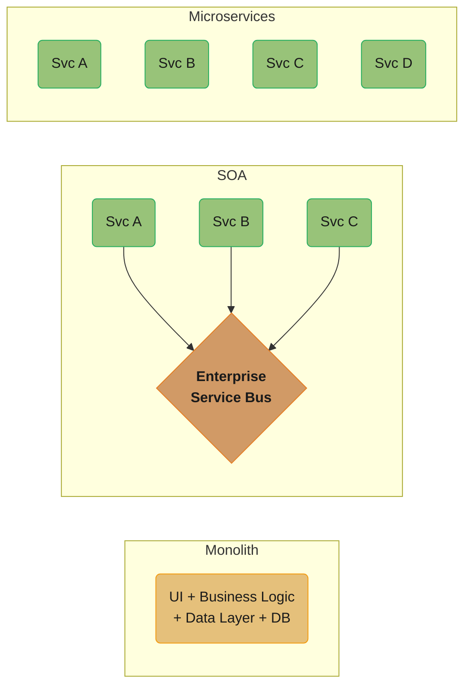

Three architectural generations side by side: the monolith is one deployable block, SOA routes every call through a shared ESB bottleneck, and microservices are small, independently deployable units with no shared intermediary.

| Dimension             | Monolith                     | SOA                            | Microservices                  |
|-----------------------|------------------------------|--------------------------------|--------------------------------|
| Service size          | One large application        | Large coarse-grained services  | Small, single-purpose services |
| Communication         | In-process function calls    | ESB (SOAP/XML heavy)           | Lightweight (REST, gRPC, events)|
| Data ownership        | Shared database              | Shared database                | Database per service           |
| Deployment            | All-or-nothing               | Service-level                  | Independent per service        |
| Team size suited for  | Small (1–10 engineers)       | Enterprise (100+)              | Medium to large (10–1000+)     |
| Complexity            | Low initially, grows fast    | High (ESB is a bottleneck)     | High distributed system complexity |

### When to Split from Monolith

- **Team size > 8–10 engineers** on one codebase (Conway's Law: org structure mirrors system architecture).
- **Deployment frequency conflict**: one team's deployments constantly block others.
- **Scaling bottleneck**: one component needs 10x resources while others need none.
- **Technology mismatch**: ML inference needs Python/GPU; transaction processing needs Java/JVM.

---

## 4. How It Works — Detailed Mechanics

A microservices architecture is built from five recurring mechanisms: services need to find each other (discovery), external clients need a single entry point (gateway), services need to talk to each other (communication), each service needs to own its data (data management), and an existing monolith needs an incremental path to get there (migration).

### 4.1 Service Discovery

In a dynamic environment (containers, auto-scaling), service instances have ephemeral IP addresses. Service discovery solves: "How does Service A find Service B?"

#### Client-Side Discovery (Eureka + Ribbon)

The client queries a service registry directly and performs load balancing.

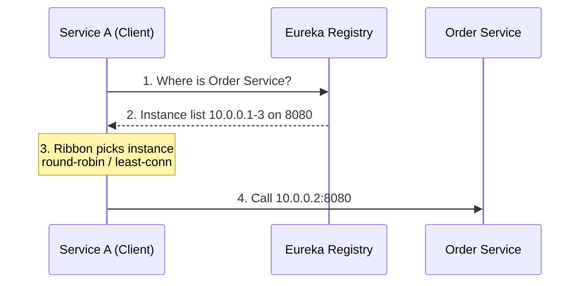

The client itself resolves and load-balances — no extra network hop, but every client language needs a Eureka-aware library.

Pros: no intermediate hop; client has control over load balancing algorithm.
Cons: every client language needs a registry client library.

#### Server-Side Discovery (AWS ALB / Nginx)

The client calls a fixed endpoint (load balancer); the LB queries the registry and routes.

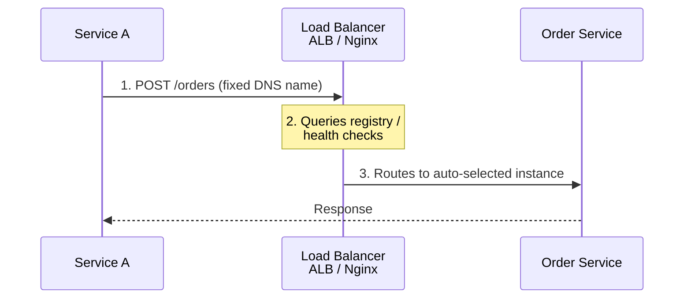

The client only ever talks to the fixed LB endpoint — registry logic lives entirely on the server side, at the cost of one extra network hop.

Pros: client needs no registry logic; language-agnostic.
Cons: one extra network hop; LB can be a bottleneck or single point of failure.

#### DNS-Based Discovery

Service names resolve to IP addresses via DNS. Kubernetes uses this natively — a Service resource creates a stable DNS name (`order-service.default.svc.cluster.local`) that resolves to one of the healthy pod IPs.

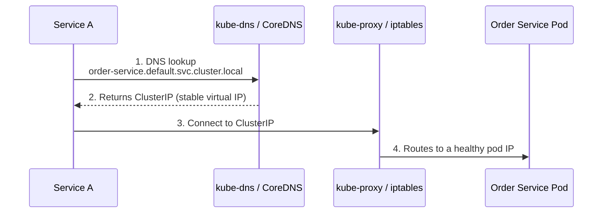

No external registry is involved — Kubernetes' own DNS and iptables/IPVS rules do the discovery and routing.

### 4.2 API Gateway

The API Gateway is the single entry point for all external clients. It handles cross-cutting concerns so individual services do not have to.

#### Responsibilities

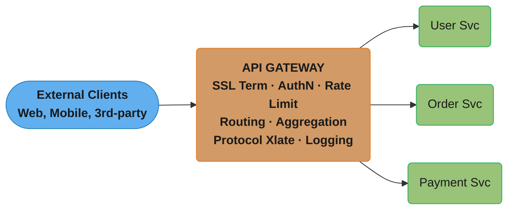

Every cross-cutting concern is handled once at the gateway instead of duplicated in every downstream service.

| Feature                 | Description                                                              |
|-------------------------|--------------------------------------------------------------------------|
| Routing                 | `/api/users/*` → User Service, `/api/orders/*` → Order Service          |
| Authentication          | Validate JWT/OAuth token once; downstream services trust gateway         |
| Rate Limiting           | Prevent abuse; per-user, per-IP, per-endpoint limits                     |
| SSL Termination         | Handle TLS at the gateway; internal traffic can be HTTP                  |
| Request Aggregation     | Mobile client: single call → gateway fans out to N services, merges response |
| Protocol Translation    | External REST → internal gRPC                                            |
| Circuit Breaking        | Gateway-level circuit breaker prevents cascading failures                |

#### Popular Implementations

- **Kong**: open-source, plugin-based, runs on Nginx.
- **AWS API Gateway**: serverless, integrates with Lambda, IAM auth, usage plans.
- **Nginx**: lightweight, high-performance, manual configuration.
- **Envoy**: data plane proxy, forms the basis of Istio service mesh.

### 4.3 Service Communication

#### Synchronous (Request-Response)

**REST (HTTP/JSON)**
- Ubiquitous, easy to debug, human-readable.
- Works across all languages without code generation.
- Overhead: verbose JSON, HTTP headers, no schema enforcement by default.

**gRPC (HTTP/2 + Protobuf)**
- Binary protocol: 5–10x smaller payloads, faster serialization.
- Strongly typed via `.proto` schema; code generation for clients/servers.
- Supports streaming (unary, server-stream, client-stream, bidirectional).
- Better for internal service-to-service communication at scale.
- Harder to debug (binary); requires a proto schema registry.

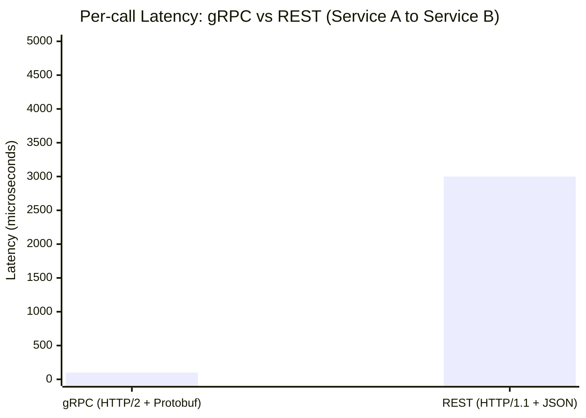

gRPC's binary framing and HTTP/2 multiplexing cut typical per-call latency roughly 30x versus REST's text-based JSON over HTTP/1.1.

#### Asynchronous (Event-Driven)

Services communicate via events/messages through a message broker.

- **Loose temporal coupling**: sender does not wait for receiver.
- **Better resilience**: if Order Service is down, events queue up and are processed when it recovers.
- **Harder to trace**: flow is not a call stack; requires correlation IDs and distributed tracing.

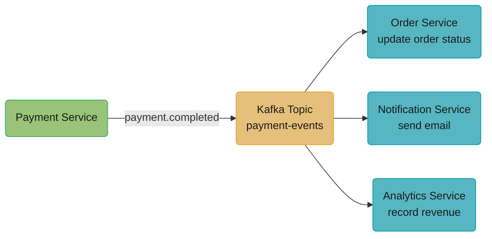

One publish fans out to three independent consumers — Payment Service never learns who is listening, and a slow/down consumer does not block the others.

### 4.4 Data Management

#### Database per Service

Each service owns its own data store. No other service can access it directly.

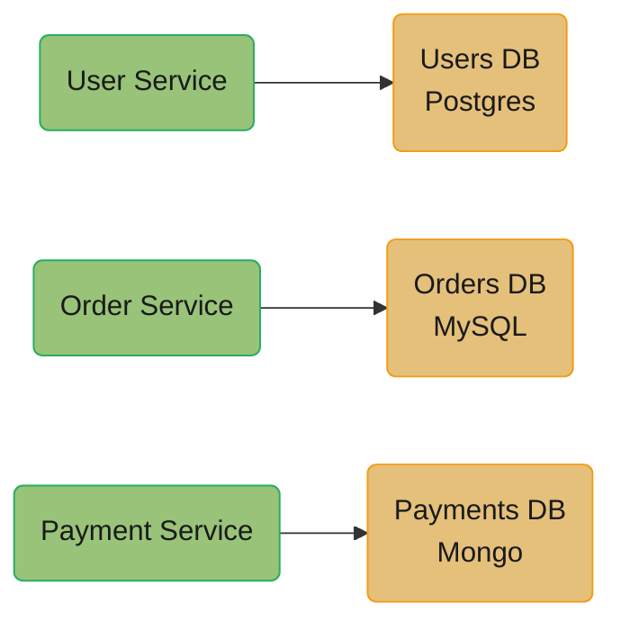

No cross-service arrows exist by design — each service's database is reachable only through that service's own API.

Benefits: independent scaling, independent schema evolution, polyglot persistence (best DB for each use case), fault isolation.

Cost: no cross-service JOINs; queries that span services require API calls or denormalized read models.

#### Shared Database (Anti-Pattern)

Multiple services sharing a single database schema creates tight coupling at the data layer. Any schema change can break other services. Avoid in microservices architecture.

#### CQRS (Command Query Responsibility Segregation)

Separate the write model (command) from the read model (query). Write to a normalized database; project events to denormalized read models optimized for queries.

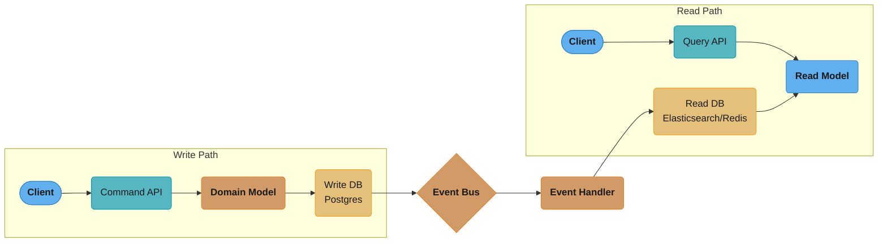

The write model stays normalized and clean; the event bus asynchronously projects changes into whatever denormalized read model each query pattern needs.

Benefits: read models can be optimized independently (e.g., full-text search via Elasticsearch, caching in Redis), write model stays clean.

#### Event Sourcing

Instead of storing current state, store every event that led to the current state. Current state = replay of all events.

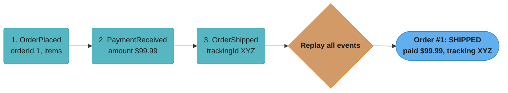

Nothing stores "current state" directly — every read replays the append-only event log from the top, which is what enables complete audit trails and temporal queries.

Benefits: complete audit trail, temporal queries ("what was the state at time T?"), event replay for new projections.
Costs: event replay can be slow for old aggregates (mitigate with snapshots), eventual consistency.

For the full event-sourcing model — append-only event store, snapshots, projections, and replay mechanics — see [Event Sourcing & CQRS](../event_sourcing_cqrs/README.md).

### 4.5 Migration Strategy: The Strangler Fig Pattern

Most real microservices adoptions are not greenfield — they are extractions from an existing monolith. The **Strangler Fig pattern** (named after the vine that grows around a tree and gradually replaces it) lets you migrate incrementally instead of attempting a "big bang" rewrite.

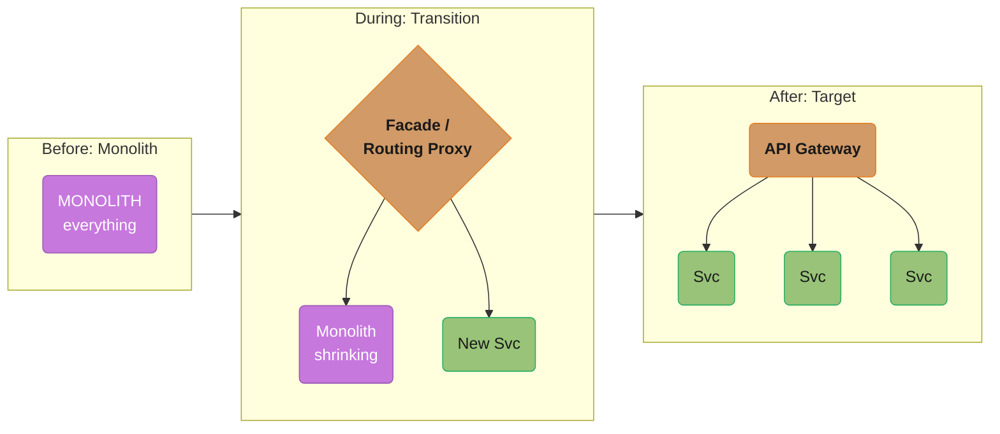

The routing proxy is the strangler: clients only ever see it, so which side of the boundary (monolith or new service) answers a request can change release by release until the monolith disappears entirely.

The migration proceeds in phases, extracting the highest-value or most painful component first:

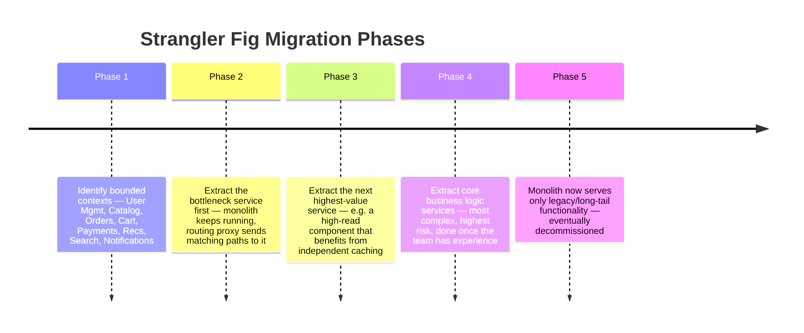

Each phase extracts one more bounded context, starting with whatever is causing the most pain, until the monolith is reduced to legacy long-tail functionality and can be retired.

Key properties:
- **Routing layer is the strangler** — an API gateway, reverse proxy, or feature-flagged router decides per-request whether the monolith or the new service handles it. Clients never know the boundary moved.
- **Reversible** — if the new service has a bug, route traffic back to the monolith. A big-bang rewrite has no such escape hatch.
- **Data migration is the hard part** — until the extracted service owns its data fully, it may need to read from (or dual-write to) the monolith's database, which is itself a temporary anti-pattern that must have an exit date.

See [§7.4](#74-e-commerce-platform-migration-strangler-fig-in-practice) for a worked example of this pattern end-to-end.

---

## 5. Architecture Diagrams

### Full Microservices Architecture

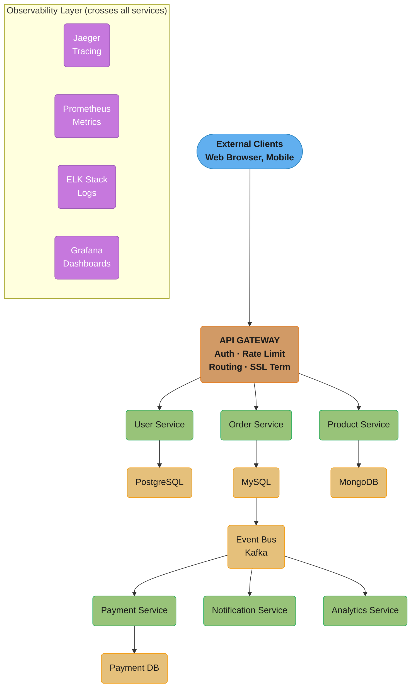

Every request flows top to bottom through the gateway into a service and its own database; the Kafka event bus is the only path from the synchronous request-serving tier into the asynchronous Payment/Notification/Analytics tier. The observability layer sits outside the request path but instruments every one of these services.

### Service Mesh with Sidecar Proxies

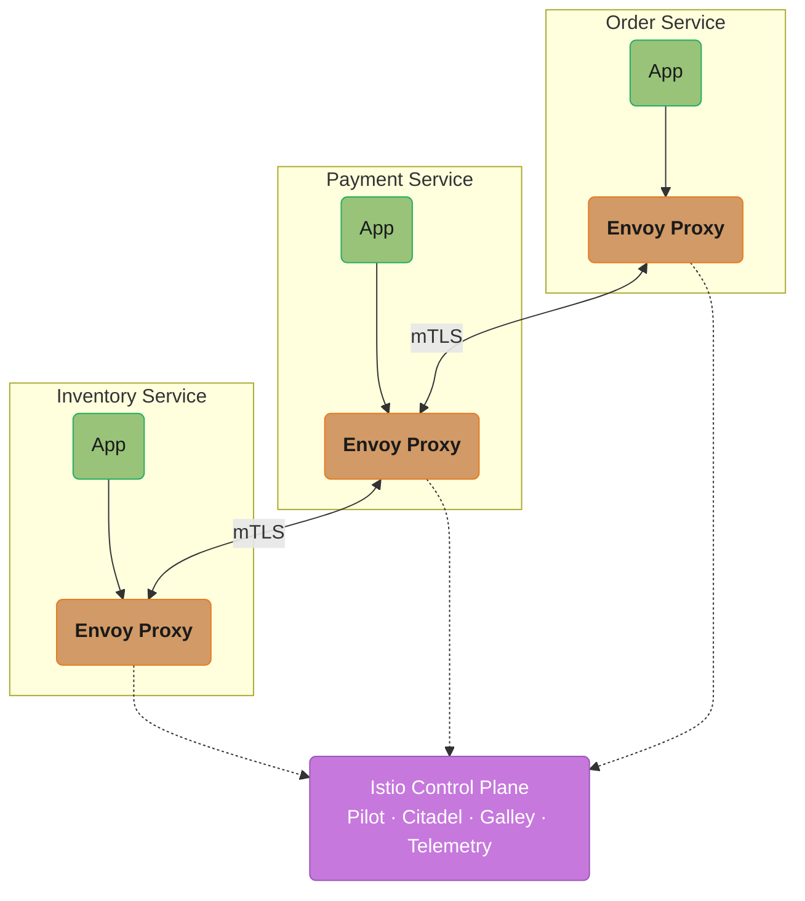

Application code never talks mTLS directly — every sidecar proxy handles encryption and identity, while the control plane pushes certificates and policy to every sidecar out-of-band (dotted).

---

## 6. Resilience, Tracing, Security & Deployment

Beyond the core request-handling mechanics in §4, every production microservices system needs a layer of cross-cutting resilience and operations concerns: how to fail gracefully (circuit breakers), how to keep data consistent across services without 2PC (sagas), how to debug a request that touched 10 services (tracing), how to secure service-to-service traffic (mesh/mTLS), and how to ship code (deployment).

### 6.1 Circuit Breaker

The circuit breaker pattern prevents a failing service from causing cascading failures through the entire system.

#### States

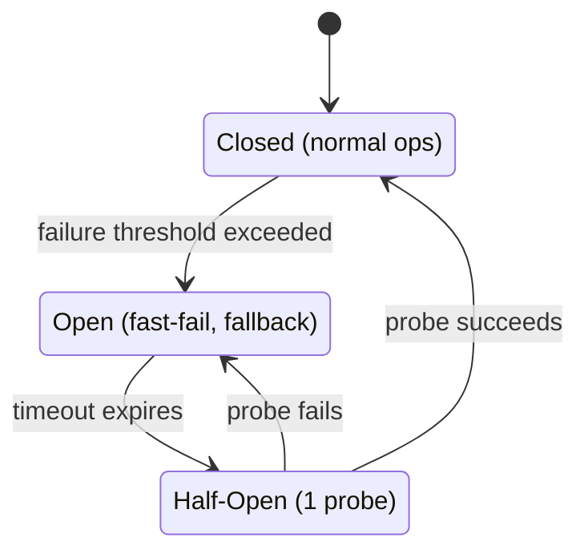

While Open, calls fail fast with a fallback and never reach the downstream service; only after the timeout does a single probe request test whether it is safe to close again.

#### Configuration Knobs

- **Failure threshold**: number/percentage of failures to trip to OPEN (e.g., 5 failures in 10 seconds).
- **Timeout**: how long to stay OPEN before probing (e.g., 30 seconds).
- **Half-Open probe count**: how many requests to allow before deciding to close.

#### Fallback Strategies

- Return cached/stale data.
- Return a default/empty response.
- Return an error with a user-friendly message.
- Redirect to a degraded mode.

Implementations: Netflix Hystrix (deprecated), Resilience4j (JVM), Polly (.NET), pybreaker (Python).

For the full circuit-breaker state machine, bulkhead sizing, and retry/backoff/jitter mechanics, see [Resilience Patterns](../resilience_patterns/README.md).

### 6.2 Saga Pattern (Distributed Transactions)

Sagas manage distributed transactions across multiple services without 2-Phase Commit (2PC), which does not scale in microservices. A saga is a sequence of local transactions; each transaction publishes an event that triggers the next step. On failure, compensating transactions undo previous steps.

**Orchestration-based** — a central coordinator calls each participant and drives compensation on failure:

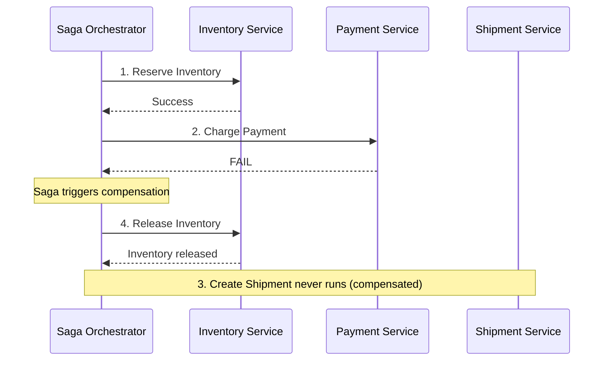

**Choreography-based** — each service reacts to the previous event and publishes the next one; there is no coordinator:

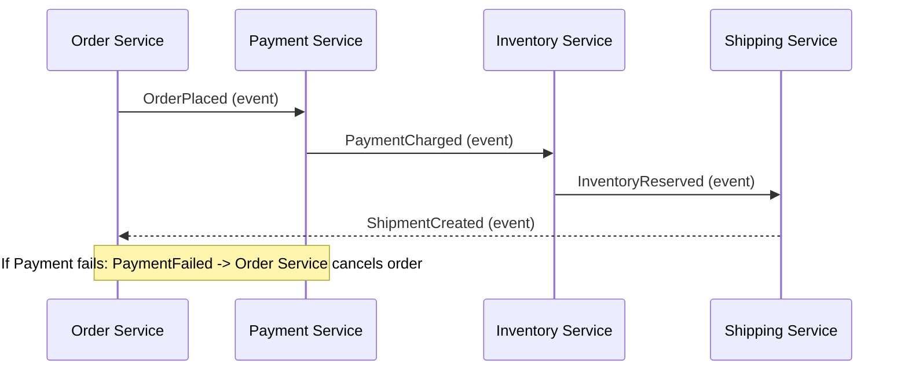

| Style | Coordinator | Pros | Cons |
|-------|------------|------|------|
| **Orchestration** | A central saga orchestrator tells each service what to do and tracks state | Clear state machine in one place, easy to visualize | Orchestrator can become a bottleneck; introduces coupling to orchestrator |
| **Choreography** | Services react to events and publish events to trigger the next step; no central coordinator | No central coordinator; truly decoupled | Harder to track overall saga state; debugging distributed choreography is complex |

For the full deep-dive — compensating-transaction design, the Outbox pattern for atomic event publication, and a complete choreography vs. orchestration walkthrough with code — see [Event Sourcing & CQRS](../event_sourcing_cqrs/README.md).

For full coverage of 2PC, 3PC, TCC, the outbox pattern, and idempotency keys alongside the saga orchestration vs. choreography tradeoffs, see [Distributed Transactions](../distributed_transactions/README.md).

### 6.3 Distributed Tracing

In a microservices system, a single user request may touch 10+ services. Distributed tracing provides end-to-end visibility.

#### Correlation IDs

Each request is assigned a unique trace ID at the entry point (API gateway). This ID is propagated as an HTTP header (`X-Trace-ID` or `traceparent` per W3C standard) through every service call.

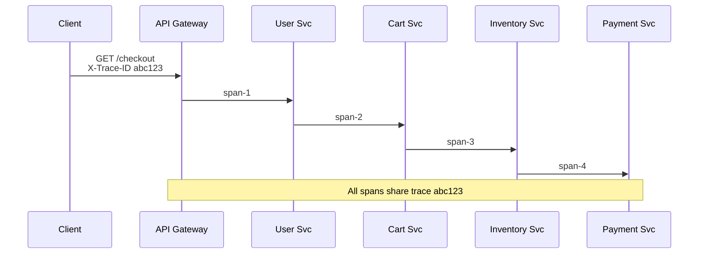

Every hop creates its own span but tags it with the same trace ID, so a tracing backend can stitch all four spans back into one end-to-end request timeline.

#### Tools

| Tool         | Description                                                         |
|--------------|---------------------------------------------------------------------|
| **Jaeger**   | Open-source, CNCF project, supports OpenTelemetry                  |
| **Zipkin**   | Twitter-originated, simpler setup                                   |
| **OpenTelemetry** | Vendor-neutral standard for traces, metrics, logs               |
| **AWS X-Ray**| Managed, integrates with AWS services                              |
| **Datadog APM** | Commercial, rich UI, correlates with metrics and logs            |

#### What You Can Answer With Traces

- Which service added the most latency?
- Which service call failed in this request?
- How does latency change with load?
- Which downstream dependency is the bottleneck?

For the full three-pillars (metrics, logs, traces) treatment, RED/USE methods, and the SLI/SLO/error-budget framework, see [Observability](../observability/README.md).

### 6.4 Security: Service Mesh & mTLS

#### Service Mesh (Istio)

A service mesh manages service-to-service communication as infrastructure, not application code.

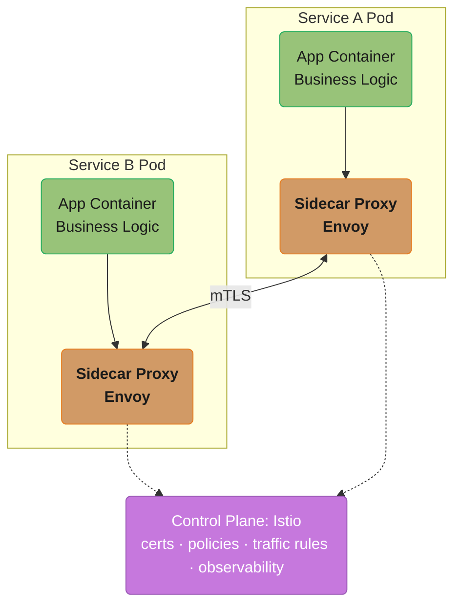

Business logic never sees the mTLS handshake — each sidecar terminates it, while the control plane (dotted) distributes certificates and policy to every sidecar out-of-band.

Istio handles:
- **Mutual TLS (mTLS)**: all service-to-service traffic is encrypted and mutually authenticated. Services get auto-rotating certificates.
- **Authorization policies**: "Service A is allowed to call Service B, but not Service C."
- **Traffic management**: canary deployments, A/B testing, traffic mirroring.
- **Observability**: metrics, traces, logs for every service call.

#### Mutual TLS (mTLS)

Every service presents a certificate to prove its identity. The other service verifies the certificate before accepting the connection. This prevents:
- Unauthorized services from calling protected services.
- Man-in-the-middle attacks on internal traffic.

Certificates are issued by a Certificate Authority (Istio's Citadel / SPIFFE/SPIRE).

For authentication/authorization patterns beyond service-to-service traffic (OAuth2, JWT, API keys, RBAC), see [Spring Security Architecture](../../spring/spring_security_architecture/README.md) and [Auth & Authorization Systems](../../backend/auth_and_authorization_systems/README.md).

For the architectural overview of AuthN vs AuthZ, OAuth2/OIDC, JWT vs sessions, mTLS, and RBAC vs ABAC, see [Security and Authentication/Authorization](../security_and_auth/README.md).

### 6.5 Deployment

#### Containers and Docker

Each microservice is packaged as a Docker image containing the application and its runtime dependencies. This ensures environment consistency from development to production.

#### Kubernetes

Kubernetes is the de-facto standard for orchestrating containerized microservices:

- **Pod**: smallest deployable unit; one or more containers sharing network and storage.
- **Deployment**: manages replica count, rolling updates, rollbacks.
- **Service**: stable DNS name and IP for a set of pods; load balances across them.
- **Ingress**: routes external HTTP traffic to services.
- **ConfigMap / Secret**: externalize configuration and credentials.
- **Horizontal Pod Autoscaler (HPA)**: scales pod count based on CPU/custom metrics.

These primitives form a hierarchy rather than a flat list — external traffic descends through routing and scaling layers before reaching a running container:

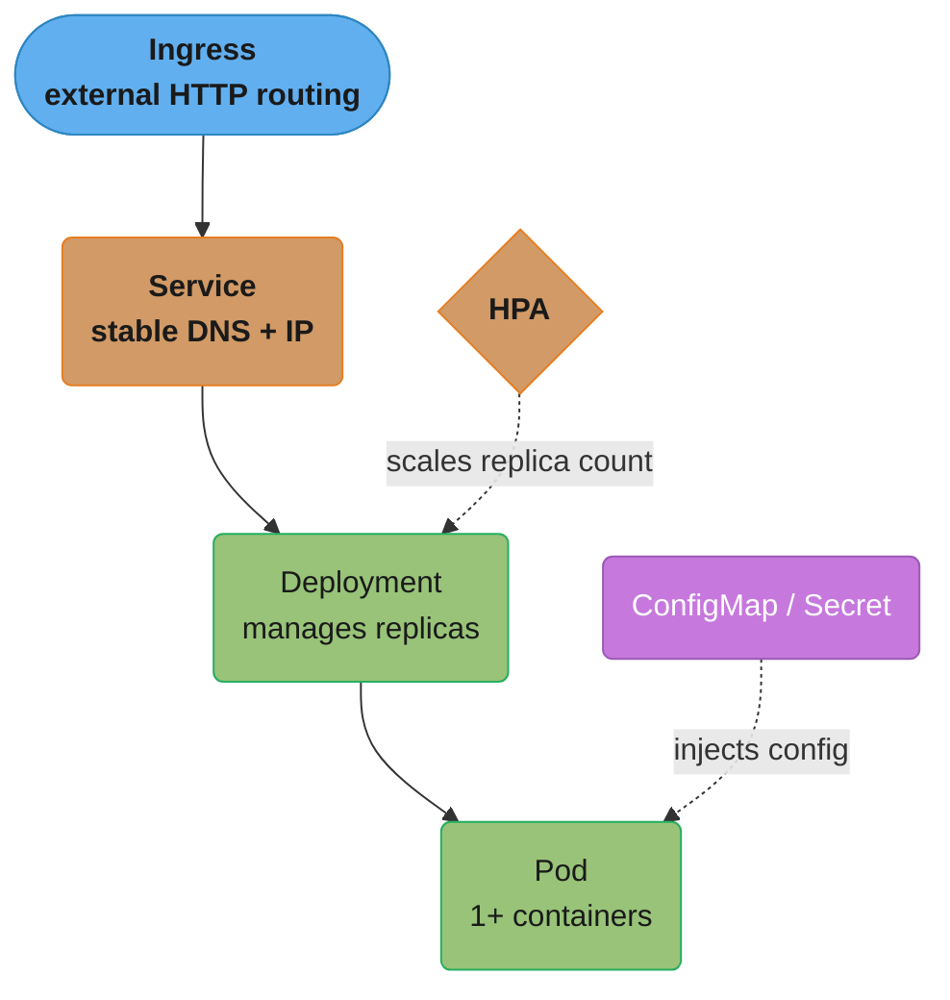

The Ingress-to-Pod chain is the request path; HPA and ConfigMap/Secret (dotted) act on that chain from the side — one scaling replica count, the other injecting configuration — rather than sitting on it.

#### Sidecar Pattern

A sidecar container runs alongside the main application container in the same pod, extending it without modifying its code.

```mermaid
flowchart LR
    classDef io      fill:#61afef,stroke:#2e86c1,color:#1a1a1a,font-weight:bold
    classDef frozen  fill:#c678dd,stroke:#9b59b6,color:#fff
    classDef train   fill:#98c379,stroke:#27ae60,color:#1a1a1a
    classDef mathOp  fill:#d19a66,stroke:#e67e22,color:#1a1a1a,font-weight:bold
    classDef lossN   fill:#e06c75,stroke:#c0392b,color:#fff,font-weight:bold
    classDef req     fill:#56b6c2,stroke:#0097a7,color:#1a1a1a
    classDef base    fill:#e5c07b,stroke:#f39c12,color:#1a1a1a

    subgraph Pod["Pod (shared network namespace)"]
        direction LR
        app("App Container<br/>Business Logic")
        side("Sidecar<br/>Envoy, Fluentd, Vault agent")
        app --- side
    end

    class app train
    class side mathOp
```

The plain line (no arrowhead) reflects that the two containers are peers sharing one network namespace, not a caller and callee.

Common sidecar uses:
- **Envoy/Istio**: transparent proxy for service mesh.
- **Fluentd/Fluent Bit**: log collection and forwarding.
- **Vault Agent**: auto-renewing secrets injection.
- **Cloud SQL Proxy**: secure DB connections without managing credentials in app.

---

## 7. Real-World Examples

### 7.1 Netflix — 700+ Microservices

Netflix migrated from a monolith to microservices between 2008–2012 following a major database corruption incident. Key contributions to the ecosystem:
- **Eureka**: service registry (open-sourced).
- **Hystrix**: circuit breaker (open-sourced, now in maintenance; superseded by Resilience4j).
- **Zuul**: API gateway.
- **Ribbon**: client-side load balancing.
- **Chaos Monkey**: randomly terminates services in production to validate resilience.

Netflix runs 700+ microservices handling 2+ billion API requests per day. Every service is independently deployable; the company does hundreds of deployments per day.

See [§14](#14-case-study-netflix-monolith-to-microservices-migration-20082012) for the full case study.

### 7.2 Amazon — From Monolith to 2-Pizza Teams

Amazon decomposed their retail monolith in the early 2000s. Jeff Bezos mandated that every team expose its data and functionality through APIs (the "API Mandate"). Teams could not communicate with each other except through service interfaces.

This led to the creation of AWS — internally built primitives (EC2, S3, SQS) were exposed as public cloud services because they were already API-first.

### 7.3 Uber — Domain-Oriented Microservice Architecture (DOMA)

Uber grew to thousands of microservices and encountered the opposite problem: too many services causing ownership ambiguity. They introduced DOMA — grouping related services into domains with clear ownership, and using a "gateway" service per domain to reduce cross-domain coupling.

Key insight: at Uber's scale (5000+ engineers), microservice granularity must be balanced against cognitive overhead. Not every function needs its own service.

### 7.4 E-Commerce Platform Migration (Strangler Fig in Practice)

**Context**: A monolithic Java application handles an e-commerce platform. During Black Friday, the recommendation engine overwhelms the database, causing the entire site to go down. The team applies the [Strangler Fig pattern from §4.5](#45-migration-strategy-the-strangler-fig-pattern), extracting the recommendation engine first (the bottleneck), then the product catalog, then order/payment.

**Resulting architecture:**

```mermaid
flowchart TD
    classDef io      fill:#61afef,stroke:#2e86c1,color:#1a1a1a,font-weight:bold
    classDef frozen  fill:#c678dd,stroke:#9b59b6,color:#fff
    classDef train   fill:#98c379,stroke:#27ae60,color:#1a1a1a
    classDef mathOp  fill:#d19a66,stroke:#e67e22,color:#1a1a1a,font-weight:bold
    classDef lossN   fill:#e06c75,stroke:#c0392b,color:#fff,font-weight:bold
    classDef req     fill:#56b6c2,stroke:#0097a7,color:#1a1a1a
    classDef base    fill:#e5c07b,stroke:#f39c12,color:#1a1a1a

    browser([Browser / App]) --> gw("API Gateway<br/>Kong")

    gw --> user("User Svc")
    gw --> product("Product Catalog")
    gw --> order("Order Svc")
    gw --> search("Search<br/>Elasticsearch")

    user --> udb("Users DB<br/>Postgres")
    product --> pdb("Products DB<br/>Mongo")
    order --> odb("Orders DB<br/>MySQL")

    odb --> topic("Kafka<br/>order-events")
    topic --> notif("Notification Svc")
    topic --> analytics("Analytics Svc")

    class browser io
    class gw mathOp
    class user,product,order,search train
    class udb,pdb,odb,topic base
    class notif,analytics req
```

The recommendation engine (the Black Friday bottleneck) and product catalog were extracted first, each behind Kong, so they could scale and cache independently of the still-shrinking monolith.

**Key outcomes:**
- Recommendation service scaled independently during Black Friday (10x replicas).
- Product catalog served from Redis cache; eliminated 80% of DB load.
- Order + Payment services deployed independently; 3 deploys per day (was 1 per month).
- Full distributed tracing via Jaeger; mean time to diagnose issues dropped from hours to minutes.

---

## 8. Tradeoffs and Considerations

| Dimension               | Benefit                                  | Cost                                         |
|-------------------------|------------------------------------------|----------------------------------------------|
| Independent deployment  | Deploy services without coordination     | Need mature CI/CD per service                |
| Fault isolation         | One service down != system down          | Partial failures are harder to reason about  |
| Technology flexibility  | Best tool for each job                   | Operational diversity increases complexity   |
| Independent scaling     | Scale only what needs scaling            | Need container orchestration (K8s)           |
| Team autonomy           | Teams move faster independently          | Need governance to prevent fragmentation     |
| Data isolation          | Independent schemas, no shared DB        | Distributed queries require API composition  |
| Distributed tracing     | End-to-end visibility                    | Must instrument every service                |
| Network latency         | Services can be co-located               | Every call is a network hop (vs in-process)  |

---

## 9. When to Use / When NOT to Use

### Use Microservices When

- **Team size > 8–10 engineers** with clear bounded contexts already identified — each team can own a service end-to-end.
- **Components have wildly different scaling profiles** — e.g., a recommendation engine needs GPU-backed autoscaling while checkout needs strict ACID transactions on a small dataset.
- **Independent deployment cadence is a business requirement** — the Payments team needs weekly compliance-driven releases while the Catalog team ships hourly.
- **Mature DevOps already exists** — CI/CD pipelines, container orchestration (Kubernetes), and centralized logging/metrics/tracing are already in place, so the marginal cost of one more service is low.
- **Polyglot persistence/runtime is genuinely needed** — full-text search needs Elasticsearch, ML inference needs Python, transaction processing needs a JVM with strong typing.
- **Regulatory/compliance isolation** — e.g., reducing PCI-DSS audit scope by isolating payment-card handling into one service rather than the entire monolith.

### Avoid Microservices When

Microservices carry a significant **complexity tax**. They are not always the right choice.

- **Small team (< 8 engineers)**: the overhead of distributed systems (service discovery, distributed tracing, separate deployments) outweighs the benefits.
- **Early-stage product**: requirements change rapidly; service boundaries chosen too early will be wrong. Start with a modular monolith.
- **Low traffic / small scale**: a single Postgres instance and a monolith handle millions of requests per day trivially.
- **No DevOps capability**: microservices require mature CI/CD, container orchestration, and observability infrastructure. Without these, microservices become a maintenance nightmare.
- **Latency is critical**: in-process function calls are nanoseconds; network calls are milliseconds. Chaining 10 services adds 10+ network round-trips.

The conditions above collapse into a single decision path — team size and DevOps maturity gate the decision before scaling profile or latency budget even get considered:

```mermaid
flowchart TD
    classDef io      fill:#61afef,stroke:#2e86c1,color:#1a1a1a,font-weight:bold
    classDef frozen  fill:#c678dd,stroke:#9b59b6,color:#fff
    classDef train   fill:#98c379,stroke:#27ae60,color:#1a1a1a
    classDef mathOp  fill:#d19a66,stroke:#e67e22,color:#1a1a1a,font-weight:bold
    classDef lossN   fill:#e06c75,stroke:#c0392b,color:#fff,font-weight:bold
    classDef req     fill:#56b6c2,stroke:#0097a7,color:#1a1a1a
    classDef base    fill:#e5c07b,stroke:#f39c12,color:#1a1a1a

    start{"Team over<br/>8-10 engineers?"} -->|"No"| mono("Stay Monolith<br/>(or Modular Monolith)")
    start -->|"Yes"| devops{"Mature CI/CD +<br/>K8s + observability<br/>already in place?"}

    devops -->|"No"| mono
    devops -->|"Yes"| scale{"Components have<br/>very different<br/>scaling profiles?"}

    scale -->|"No"| latency{"Latency budget<br/>tight (many<br/>chained calls)?"}
    scale -->|"Yes"| split("Adopt Microservices")

    latency -->|"Yes"| mono
    latency -->|"No"| split

    class start,devops,scale,latency mathOp
    class mono frozen
    class split train
```

Team size and DevOps maturity are hard gates — fail either and every other benefit is moot; only past both gates do scaling-profile divergence and latency budget decide the outcome.

### Consider a Modular Monolith First

A modular monolith has clear internal module boundaries (separate packages, clear interfaces) but deploys as a single unit. When a module becomes a bottleneck or needs independent deployment, extract it into a service.

"Don't start with microservices. Start with a monolith, and when you feel the pain, extract." — Martin Fowler

---

## 10. Common Pitfalls

### Pitfall Summary

| Pitfall | Symptom | Root Cause | Fix |
|---------|---------|------------|-----|
| Distributed monolith via shared database | A schema change in one service breaks N other services | Services share tables "temporarily" for migration speed, and it never gets cleaned up | Enforce database-per-service with no exceptions; cross-service reads go through APIs, events, or read replicas |
| Retry storms / thundering herd | A brief downstream blip turns into a multi-minute outage | Every caller retries immediately and synchronously on failure, multiplying load on an already-struggling service | Exponential backoff with jitter; circuit breakers stop retries entirely once the failure rate crosses a threshold |
| Version skew during rolling deploys | Intermittent 4xx/5xx errors during every deploy | New version's API/schema is incompatible with the old version still running on other pods | Backward- and forward-compatible contracts (additive fields only); deploy consumers before producers for breaking changes; contract testing |
| Missing idempotency causing duplicates | Customers double-charged or get duplicate emails after a retry | At-least-once delivery (Kafka, SQS, HTTP retries) means the same message/request can be processed twice | Idempotency keys on all mutating endpoints; deduplicate by key in the database with a unique constraint |
| Unbounded fan-out / N+1 over the network | A single API call triggers hundreds of downstream calls; p99 latency spikes | A service loops over a list and calls another service once per item instead of batching | Batch APIs (`getUsers(ids: [...])` not `getUser(id)` in a loop); use a read-model/cache populated asynchronously |
| Chatty synchronous chains | p99 latency = sum of every hop in the chain, even though most hops are fast | A request handler calls service A, then B, then C sequentially when B and C don't depend on each other | Parallelize independent calls (`CompletableFuture.allOf`, `asyncio.gather`); move non-critical calls off the request path via events |

### War Story 1: The Retry Storm That Took Down Checkout

A payment service had a brief 30-second blip (a downstream bank API timed out). Every service calling payment retried immediately, three times, with no backoff. The retries arrived just as the payment service was recovering, multiplying its load 4x at the worst possible moment, which caused it to fall over again — and the cycle repeated for 25 minutes. **Fix**: exponential backoff with jitter (`base * 2^attempt + random(0, base)`) on all retries, plus a circuit breaker that stops calling payment entirely once its error rate exceeds 50% over a 10-second window, giving it room to recover.

**In plain terms.** "Every retry is extra load you chose to send to a service that just told you it is drowning — so wait longer each time, and make sure no two callers wait the same amount."

The multiplier is the part people underestimate. Retries feel free from the caller's side because they are cheap to write; from the callee's side they are indistinguishable from a traffic spike arriving at the worst possible moment.

| Symbol | What it is |
|--------|------------|
| `base` | The starting delay before the first retry — typically 100 ms. The unit the whole schedule is built from |
| `attempt` | Retry counter starting at `0`. The exponent that makes each wait twice the last |
| `2^attempt` | Doubling: `1, 2, 4, 8`. Backs off geometrically, so a long outage stops being hammered |
| `random(0, base)` | The jitter. Without it, every caller retries at the same instant and re-creates the spike |
| `4x` | Load multiplier: 1 original request plus 3 retries, all from every caller at once |
| `50% / 10s` | Circuit-breaker trip condition: error rate over a rolling window, after which calls stop entirely |

**Walk one example.** First the damage, then the same three retries under the fix, with `base = 100 ms`:

```
  What actually happened (no backoff)
    requests per caller = 1 original + 3 retries = 4
    load on payment     = 1.0x -> 4.0x
    arrival spread      = ~0 ms   (all callers retried at the same instant)

  Same 3 retries with exponential backoff + jitter
    attempt 0 : 100 x 2^0 = 100 ms  + random(0,100) -> waits 100 to  200 ms
    attempt 1 : 100 x 2^1 = 200 ms  + random(0,100) -> waits 200 to  300 ms
    attempt 2 : 100 x 2^2 = 400 ms  + random(0,100) -> waits 400 to  500 ms

    total elapsed before giving up = 700 to 1000 ms
    the same 4x of traffic is now smeared across ~1 second instead of
    landing in one burst, and the random term de-synchronises callers
    that all failed together.

  The breaker is the second half of the fix
    once error rate > 50% over 10 s, the multiplier drops 4.0x -> 0x:
    calls fail fast locally and payment gets a completely quiet window
    in which to recover.
```

Backoff and the breaker solve different halves of the problem. Backoff spreads a fixed amount of retry load over time; the breaker removes it. A service under sustained failure needs both — backoff alone still delivers `4x` eventually, just later.

### War Story 2: The Silent Schema Break

A "minor" deploy renamed a field in the Order service's Kafka event schema (`order_total` → `total_amount`). Three downstream consumers (analytics, notifications, and a partner-facing webhook service) silently started reading `null` for the total — no errors, no alerts, just wrong data flowing into dashboards and customer emails for 6 hours before someone noticed the revenue dashboard looked off. **Fix**: a schema registry (Confluent Schema Registry / AWS Glue Schema Registry) with backward-compatibility enforcement on every schema change — the registry rejects a non-additive change at publish time, before it can reach consumers.

### War Story 3: The N+1 That Only Showed Up at Scale

An order-history page called the Order service to get a user's last 50 orders, then looped over each order calling the Product service to get product details — 50 sequential HTTP calls per page load. In staging (5 orders, 1 user) this was invisible. In production (50 orders, thousands of concurrent users), it added 50 x 15ms = 750ms to p50 latency and saturated the Product service's connection pool during peak traffic, causing unrelated requests to queue. **Fix**: added a batch endpoint `POST /products/batch {ids: [...]}` and changed the order-history handler to collect all product IDs first, then make one batched call.

**What this actually says.** "The page's latency is not a property of the code — it is the row count multiplied by one network round trip, and staging simply had a smaller row count."

This is why the bug is structurally invisible before production. Nothing is slow; the loop just runs more times.

| Symbol | What it is |
|--------|------------|
| `N` | Rows returned by the first call — `5` in staging, `50` in production. The multiplier |
| `15 ms` | Cost of one sequential HTTP round trip to the Product service |
| `N x 15 ms` | Total added latency, because the calls are sequential rather than overlapped |
| batch endpoint | Collapses `N` round trips into `1`, making latency independent of `N` |
| pool saturation | Concurrent users x `N` = in-flight connections. The second, larger failure |

**Walk one example.** The same code path at both data volumes, then after batching:

```
  Staging      :  5 calls x 15 ms =    75 ms added   (nobody notices)
  Production   : 50 calls x 15 ms =   750 ms added   (p50 blows up)
  Ratio        : 750 / 75 = 10x, exactly the row-count ratio 50/5

  After the batch endpoint
    calls        =  1
    added        =  1 x 15 ms = 15 ms
    removed      = 750 - 15   = 735 ms  (98% of the cost)

  The connection-pool bill, illustrating with 1,000 concurrent page loads
  (the file says "thousands"):
    sequential : 1,000 x 50 = 50,000 calls in flight against Product
    batched    : 1,000 x  1 =  1,000 calls in flight
    reduction  : 50x fewer connections competing for the pool
```

Notice that the latency number and the saturation number come from the same multiplier. Fixing one fixes the other, which is why a batch endpoint is worth building even when the p50 regression alone looks tolerable.

---

## 11. Technologies & Tools

| Category | Tools | Notes |
|----------|-------|-------|
| Service Discovery | Eureka, Consul, Kubernetes DNS / kube-proxy, etcd, Apache ZooKeeper | Kubernetes DNS is the default in any K8s deployment; Eureka/Consul are common in non-K8s or hybrid environments |
| API Gateway | Kong, AWS API Gateway, Envoy, Apigee, Zuul (legacy) | Envoy doubles as a gateway and a service-mesh data plane |
| Circuit Breaker | Resilience4j (current JVM standard), Hystrix (deprecated), Polly (.NET), pybreaker (Python) | Resilience4j is lightweight and uses semaphore-based isolation by default, not thread pools — tune accordingly |
| Service Mesh | Istio, Linkerd, AWS App Mesh, Consul Connect | Istio is the most feature-rich but operationally heaviest; Linkerd is simpler to run |
| Distributed Tracing | Jaeger, Zipkin, OpenTelemetry (instrumentation standard), AWS X-Ray, Datadog APM | OpenTelemetry is the vendor-neutral instrumentation layer; Jaeger/Zipkin/X-Ray/Datadog are backends it can export to |
| Container Orchestration | Kubernetes, Amazon ECS/Fargate, Docker Swarm, Nomad | Kubernetes is the de-facto standard; ECS/Fargate is simpler if fully AWS-committed |
| Messaging / Event Bus | Apache Kafka, RabbitMQ, AWS SNS/SQS, Google Pub/Sub | Kafka for high-throughput event streams with replay; SQS/RabbitMQ for simpler point-to-point queues |
| Saga Orchestration | Temporal, Camunda, AWS Step Functions, Netflix Conductor | Temporal/Camunda are general workflow engines often repurposed for sagas; Step Functions if AWS-native |
| Configuration & Secrets | Spring Cloud Config, Consul KV, AWS Parameter Store / Secrets Manager, HashiCorp Vault | Vault adds dynamic secrets and auto-rotation, useful with the Vault Agent sidecar from §6.5 |

---

## 12. Interview Questions with Answers

**Q1: What is the difference between microservices and SOA?**
SOA uses a heavyweight Enterprise Service Bus (ESB) for communication, large coarse-grained services, and typically shared databases. Microservices use lightweight protocols (REST, gRPC, events), small single-purpose services, and database-per-service. Microservices are often considered a refinement of SOA principles.

**Q2: How do you handle distributed transactions across multiple microservices?**
Use the Saga pattern instead of 2-Phase Commit. A saga is a sequence of local transactions with compensating transactions on failure. Use orchestration (central coordinator) for complex flows or choreography (event-driven) for simpler ones.

**Q3: What is the circuit breaker pattern and why is it needed?**
A circuit breaker prevents a failing service from receiving requests when it is unhealthy, returning a fallback immediately instead. States: Closed (normal), Open (fast-fail), Half-Open (probe). Without it, slow downstream services cause thread pool exhaustion and cascading failure.

**Q4: How would you implement service discovery in a Kubernetes environment?**
Kubernetes provides built-in DNS-based service discovery. Each Service resource gets a stable DNS name (`service-name.namespace.svc.cluster.local`). kube-proxy routes traffic to healthy pods. No external registry needed.

**Q5: What is the database-per-service pattern and what are its tradeoffs?**
Each service owns its own database; no other service accesses it directly. Benefit: independent scaling, schema evolution, technology choice. Cost: no cross-service JOINs; need API composition or read models (CQRS) for multi-service queries.

**Q6: How would you design an API gateway?**
The API gateway is the single entry point handling SSL termination, authentication (validate JWT), rate limiting (token bucket/sliding window), routing (path-based to services), and optional request aggregation. Use Kong, AWS API Gateway, or Envoy as the implementation.

**Q7: What is a service mesh and when would you use it?**
A service mesh (Istio/Envoy) manages service-to-service communication as infrastructure via sidecar proxies. Use it when you need: mutual TLS for all service traffic, fine-grained traffic policies (canary, retries, timeouts), and consistent observability without changing application code. Justified at 20+ services.

**Q8: How does distributed tracing work?**
A unique trace ID is generated at the API gateway and propagated as a header through all service calls. Each service creates a span (start time, end time, service name, tags) and reports it to a tracing backend (Jaeger, Zipkin). The backend stitches spans by trace ID into a request timeline.

**Q9: What is the Strangler Fig pattern?**
A migration pattern where new functionality is built as separate services while the monolith remains. An API gateway or proxy routes requests to either the monolith or new services based on path. Over time, more traffic moves to new services until the monolith is replaced (strangled).

**Q10: How do you handle authentication and authorization in microservices?**
Use a centralized Identity Provider (Auth0, Keycloak, AWS Cognito). The API gateway validates JWT tokens on every request. Downstream services trust the gateway and read claims from the token. For service-to-service auth, use mutual TLS (service mesh) or service account tokens.

**Q11: What is the Bulkhead pattern?**
Isolate resources (thread pools, connection pools) per external dependency. If Service A calls both Service B and Service C, use separate thread pools for each. A slowdown in Service B cannot exhaust threads needed for Service C calls.

**Q12: When should you NOT migrate to microservices?**
When the team is small (< 8 engineers), the product is in early-stage with changing requirements, there is no DevOps infrastructure (CI/CD, K8s, observability), or latency budgets are tight. The complexity tax of distributed systems is only justified when the pain of the monolith exceeds it.

**Q13: Why does a retry storm make an outage worse instead of fixing it, and what breaks the cycle?**
Immediate synchronous retries multiply load on a service at exactly the moment it's least able to handle it, turning a brief blip into a sustained outage. War Story 1 shows the anatomy: a payment service had a 30-second downstream timeout, every caller retried three times with no backoff, and the retries landed just as the service was recovering — 4x load at the worst moment knocked it over again, repeating for 25 minutes. The fix is two mechanisms working together: exponential backoff with jitter (`base * 2^attempt + random(0, base)`) spreads retries out in time so they don't arrive as a synchronized wave, and a circuit breaker stops retrying entirely once the error rate crosses a threshold (50% over a 10-second window in the war story), giving the downstream room to recover. Never ship a retry loop without both backoff-with-jitter and a breaker — retries alone convert other services' failures into your own.

**Q14: A service loops over 50 orders calling the Product service once per order — why does this pass staging and fail production?**
The N+1 network pattern's cost scales with data volume and concurrency, both of which staging lacks. War Story 3 has the numbers: with 5 orders and 1 user in staging the pattern was invisible, but in production 50 sequential HTTP calls at ~15ms each added 750ms to p50 latency, and thousands of concurrent users saturated the Product service's connection pool so badly that unrelated requests started queueing. The fix is a batch endpoint (`POST /products/batch {ids: [...]}`) plus a caller change to collect all IDs first and make one call — the same cure as the database N+1 problem, but the per-call cost is a full network round trip instead of a local query. Audit any code path that calls another service inside a loop, and load-test with production-shaped data volumes, since this class of bug is structurally invisible at small scale.

**Q15: Why did Netflix build Eureka as an AP system instead of using ZooKeeper for service discovery?**
ZooKeeper prioritizes consistency over availability, so losing its quorum makes it unavailable — and a discovery outage cascades to every service that needs to find its dependencies. Netflix's case study spells out the reasoning: DNS was too slow (30s+ TTLs to propagate dead hosts), and a CP coordinator like ZooKeeper turns a discovery-layer partition into a whole-platform outage. Eureka instead chooses availability: clients cache the registry locally and can keep calling known-good instances even when Eureka itself is partitioned, matching Netflix's "stay up at all costs" philosophy — a mildly stale instance list is strictly better than no instance list. When choosing discovery infrastructure, ask what happens to running services when the registry is down; for discovery, stale-but-available almost always beats consistent-but-unavailable.

**Q16: A single API request chains 8 sequential service calls, each 50ms at p99 — what's the latency cost and how do you cut it?**
Sequential chaining sums every hop's latency, so the chain's p99 approaches 8 x 50ms = 400ms or worse — Netflix measured 1200ms for exactly this shape. Its fourth migration pitfall traced the chain User → Auth → Profile → Recs → Catalog → Pricing → DRM → Logging. The fix decomposed the chain along dependency lines: calls that don't depend on each other run in parallel (`CompletableFuture.allOf`), non-critical work like logging moves off the request path entirely via Kafka, frequently-needed context like auth and profile is pre-fetched once into the request, and slowly-changing data like pricing is cached. This is the "chatty synchronous chains" pitfall from the module's pitfall table, and it's also why the When-NOT-to-Use section lists tight latency budgets as a reason to avoid microservices — every extracted service adds a network hop that an in-process call didn't have. Draw the dependency graph of a request's downstream calls before writing the handler; only genuinely sequential dependencies should ever be awaited in sequence.

---

## Cross-Perspective: LLD Connections

**LLD View — Design Patterns That Implement Microservices**

- **Facade** — API gateways and BFF (Backend for Frontend) services are Facades: they present a simplified, client-specific interface over the complex microservice mesh, hiding routing, aggregation, and protocol translation.
- **Proxy** — Service mesh sidecars (Envoy, Linkerd) and circuit breakers are Proxy pattern at the infrastructure level: they wrap every service-to-service call to add retries, timeouts, mTLS, load balancing, and distributed tracing.
- **Observer** — Event-driven inter-service communication (via Kafka or SNS) is Observer: services publish domain events without knowing who consumes them, enabling loose coupling and independent deployability.
- **Strategy** — Service discovery (client-side, server-side, DNS-based), circuit breaker policies (error rate threshold, half-open retry interval), and retry strategies (exponential backoff, jitter) are interchangeable Strategy implementations.

---

**Cross-references:** [backend/microservices_fundamentals](../../backend/microservices_fundamentals/) (decomposition strategies, bounded contexts in code), [backend/api_gateway_patterns](../../backend/api_gateway_patterns/), [backend/service_mesh_and_service_discovery](../../backend/service_mesh_and_service_discovery/) (Istio/Envoy, sidecar pattern), [spring/spring_cloud_patterns](../../spring/spring_cloud_patterns/) (Spring Cloud Gateway, service discovery with Eureka/Consul), [event_sourcing_cqrs](../event_sourcing_cqrs/README.md) (Saga pattern deep dive).

---

## 13. Best Practices

### Design for Failure
Assume any dependency can fail at any time. Use timeouts on all outbound calls. Implement circuit breakers. Define fallback behavior for every external dependency.

### API Versioning
Never make breaking changes to a service API without versioning. Use URL versioning (`/v2/orders`) or header versioning. Support at least N-1 versions to allow gradual consumer migration.

### Health Checks
Every service must expose:
- `/health/live`: is the process alive? (liveness probe)
- `/health/ready`: is the service ready to accept traffic? (readiness probe)

### 12-Factor App
Follow 12-factor principles: config from environment variables, stateless processes, disposable containers, logs as event streams, etc.

### Idempotent APIs
All mutating endpoints should be idempotent (same request repeated = same result). Use a client-generated idempotency key in the request header.

### Bulkhead Pattern
Isolate resources (thread pools, connection pools) per dependency. If Dependency A becomes slow, it does not exhaust resources needed for Dependency B.

### Graceful Degradation
Identify critical vs non-critical features. If the recommendation service is down, show the checkout page without recommendations rather than failing entirely.

---

## 14. Case Study: Netflix Monolith-to-Microservices Migration (2008–2012)

### Problem Statement

In August 2008, Netflix suffered a 3-day outage when database corruption took down its monolithic Oracle deployment. DVD shipments stopped; streaming was in its infancy. The incident forced a rethink. By 2012, Netflix had migrated to 700+ microservices on AWS and was serving:

- 30M+ subscribers (today 250M+)
- 500M+ API requests/day
- 30% of North American internet traffic at peak
- 99.99% availability target (≤52 min downtime/year)
- p99 API latency budget: 250 ms end-to-end for the playback start path
- Multi-region failover capability (US-East ↔ US-West)

**Read it like this.** "Nines are a downtime allowance in minutes, and when a request has to cross several services those allowances multiply together instead of holding steady."

Availability compounding is the single most important arithmetic in a microservices design review. It is why 700+ services cannot each be held to the same target as the product, and why fallbacks and circuit breakers are load-bearing rather than nice-to-have.

| Symbol | What it is |
|--------|------------|
| `99.99%` | The availability target — "four nines". Equivalently, `0.9999` as a probability of being up |
| `1 - 0.9999` | The failure probability, `0.0001`. Multiply by the period to get an allowance |
| minutes/year | `365.25 x 24 x 60 = 525,960`. The denominator every nines figure converts against |
| `0.9999 ^ N` | End-to-end availability when a request must traverse `N` independent services in series |
| `500M requests/day` | Daily volume; divide by `86,400` seconds to get the average rate the fleet must sustain |

**Walk one example.** Convert the target, size the traffic, then compound the target across a request path:

```
  What 99.99% actually allows
    minutes in a year = 365.25 x 24 x 60 = 525,960 min
    allowed downtime  = 525,960 x 0.0001 =      52.6 min/year
                                              (the "<=52 min" above)

  Average request rate implied by 500M/day
    500,000,000 / 86,400 s = 5,787 requests/sec
    (an average -- evening peaks run well above this)

  Now compound it across a playback path touching 8 services,
  each independently 99.99% available:
    0.9999 ^ 8    = 0.99920           -> 99.92% end to end
    downtime      = 525,960 x (1 - 0.99920) = 420.6 min/year
                  = 7.0 hours/year

  The product asked for 52.6 min and the arithmetic delivers 420.6 min:
  8x over budget, with every individual service meeting its own SLA.
```

The only ways out are to reduce `N` (fewer hops on the critical path), raise each service's nines (expensive and quickly hits diminishing returns), or break the "in series" assumption — which is exactly what a fallback does. A dependency wrapped in a circuit breaker with a sane default no longer contributes its failure probability to the product, because its failure no longer fails the request. That is the design reasoning behind Hystrix appearing everywhere in this case study.

The migration challenges: decompose tightly coupled modules, eliminate the shared database, build distributed-systems primitives (service discovery, load balancing, fault tolerance) that did not exist on AWS in 2008, and do all of this while serving live traffic.

### Architecture Overview

```mermaid
flowchart TD
    classDef io      fill:#61afef,stroke:#2e86c1,color:#1a1a1a,font-weight:bold
    classDef frozen  fill:#c678dd,stroke:#9b59b6,color:#fff
    classDef train   fill:#98c379,stroke:#27ae60,color:#1a1a1a
    classDef mathOp  fill:#d19a66,stroke:#e67e22,color:#1a1a1a,font-weight:bold
    classDef lossN   fill:#e06c75,stroke:#c0392b,color:#fff,font-weight:bold
    classDef req     fill:#56b6c2,stroke:#0097a7,color:#1a1a1a
    classDef base    fill:#e5c07b,stroke:#f39c12,color:#1a1a1a

    clients([Mobile / Smart TV / Browser]) --> zuul("Zuul<br/>API Gateway<br/>auth · routing · aggregation")
    zuul --> eureka("Eureka<br/>Discovery<br/>registry · heartbeats")

    eureka --> user("User svc")
    eureka --> playbk("Playback svc")
    eureka --> recomm("Recommendation svc")
    eureka --> billing("Billing svc")
    eureka --> search("Search svc")

    user --> stores("Per-service data stores<br/>Cassandra · MySQL · EVCache")
    playbk --> stores
    recomm --> stores
    billing --> stores
    search --> stores

    stores --> hystrix("Hystrix dashboards<br/>Atlas / metrics")

    class clients io
    class zuul,eureka mathOp
    class user,playbk,recomm,billing,search train
    class stores base
    class hystrix frozen
```

Eureka sits between the gateway and every backend service so instances can be added, removed, or fail without the gateway ever holding a stale hostname.

### Key Design Decisions

1. **API gateway (Zuul) for aggregation** — Mobile clients on slow networks made 20+ API calls per screen. Zuul aggregates into a single response (one request, one round-trip). Reduced mobile data usage by 60% and TTFB by 200 ms.
   - *Alternative rejected*: per-client BFF (backend-for-frontend) only — added later for device-specific shaping but Zuul remained the front door.

2. **Each service owns its data store** — No shared schema. Inter-service data exchange is via APIs or events. Eliminates the corruption-blast-radius that caused the 2008 outage.
   - *Alternative rejected*: shared schema with per-service tables — caused the 2008 outage; rejected by mandate.

3. **Eventual consistency for viewing history** — Cassandra (AP) over RDBMS (CP). Showing "you're on episode 4" off by one second is acceptable; total unavailability is not. Embraces the CAP availability side.

4. **Client-side load balancing (Ribbon)** — Each service calls Eureka to get the live list of instances of its dependencies, then load-balances locally. Eliminates the LB tier as a bottleneck/SPOF; saves a network hop.
   - *Alternative rejected*: AWS ELB only — single point of failure, slower to react to instance failures.

5. **Hystrix circuit breakers + bulkheads** — Every external call is wrapped in a Hystrix command with thread pool isolation. A slow downstream service trips its breaker; calls fail fast with fallbacks (e.g., return cached recommendations).

6. **Chaos Monkey (and the Simian Army)** — Randomly terminates production instances during business hours to force resilience. Failures discovered in testing, not at 3 AM.

7. **Multi-region active-active with Cassandra cross-region replication** — Two regions serve 50% of traffic each. A region failure triggers DNS failover and the other region absorbs full load within 7 minutes.

### Implementation

Hystrix command wrapping an external dependency:

```java
public class GetRecommendationsCommand extends HystrixCommand<List<Recommendation>> {

    private final long userId;
    private final RecommendationClient client;

    public GetRecommendationsCommand(long userId, RecommendationClient c) {
        super(Setter.withGroupKey(HystrixCommandGroupKey.Factory.asKey("Recs"))
            .andCommandPropertiesDefaults(HystrixCommandProperties.Setter()
                .withExecutionTimeoutInMilliseconds(300)
                .withCircuitBreakerRequestVolumeThreshold(20)
                .withCircuitBreakerErrorThresholdPercentage(50)
                .withCircuitBreakerSleepWindowInMilliseconds(5000))
            .andThreadPoolPropertiesDefaults(HystrixThreadPoolProperties.Setter()
                .withCoreSize(10)));
        this.userId = userId;
        this.client = c;
    }

    @Override
    protected List<Recommendation> run() {
        return client.getRecommendations(userId);
    }

    @Override
    protected List<Recommendation> getFallback() {
        return CachedPopularContent.forUser(userId);  // degraded response
    }
}
```

Ribbon client-side load balancing config:

```yaml
recommendation-service:
  ribbon:
    NIWSServerListClassName: com.netflix.niws.loadbalancer.DiscoveryEnabledNIWSServerList
    NFLoadBalancerRuleClassName: com.netflix.loadbalancer.AvailabilityFilteringRule
    ConnectTimeout: 200
    ReadTimeout: 500
    MaxAutoRetries: 1
    MaxAutoRetriesNextServer: 2
```

Eureka registration (Spring Boot):

```java
@SpringBootApplication
@EnableEurekaClient
public class PlaybackServiceApplication {
    public static void main(String[] args) {
        SpringApplication.run(PlaybackServiceApplication.class, args);
    }
}
```

### Tradeoffs

| Aspect | Monolith | Microservices (Netflix) |
|--------|----------|------------------------|
| Deploy frequency | Weekly, all-or-nothing | 1000s/day per service |
| Failure blast radius | Entire site down | One service degraded |
| Operational complexity | Low | Very high (700 services) |
| Latency overhead | In-process | Network hops + serialization |
| Team autonomy | Coordinated releases | Independent ownership |
| Required headcount | Small platform team | Large platform org (~100) |

### Metrics & Results

- p50 playback start latency: 80 ms; p99: 220 ms (SLA: 250 ms)
- Availability: 99.99% sustained over 2012–2015 (after migration stabilized)
- Deployments: 4000+ per day across all services by 2015
- Regional failover (US-East → US-West): 6 min 30 sec measured (target: 7 min)
- Chaos Monkey-induced incidents: 0 customer-facing in production (resilience worked)
- Infrastructure: ~100k EC2 instances at peak
- Migration duration: 4 years (2008–2012); some legacy continued past 2014

### Common Pitfalls / Lessons Learned

1. **Distributed monolith via shared database** — Broken: early microservices still shared an Oracle schema "for migration speed." A schema migration on `viewing_history` broke 12 services simultaneously. Fix: enforced "each service owns its schema" with no exceptions; cross-service data needs went through APIs or Kafka events. Took 18 months to fully decouple.

2. **Cascading failure from one slow dependency** — Broken: the recommendation service became slow (200 ms → 4 seconds). Calling services held threads waiting; their thread pools filled; they became unresponsive; their callers held threads; the whole site went read-only within 90 seconds. Fix: Hystrix circuit breaker + bulkhead — each dependency gets its own thread pool. A slow downstream now trips a breaker, returns fallback, never exhausts upstream threads.

3. **Eureka registry staleness during rolling deploy** — Broken: instances took 30 seconds to deregister after termination. Clients kept sending requests to dead instances; connection failures spiked. Fix: tuned heartbeat to 10s, registry refresh to 5s, and added client-side AvailabilityFilteringRule that excludes hosts after 3 consecutive failures. Also added pre-deregistration drain (deregister, wait 30s, then SIGTERM).

4. **Synchronous chain of 8 service calls = 8 × p99 latency** — Broken: a single API request fan-out: User → Auth → Profile → Recs → Catalog → Pricing → DRM → Logging. Each at 50 ms p99; chained p99 was 1200 ms. Fix: parallelized non-dependent calls with `CompletableFuture`, moved logging async via Kafka, pre-fetched auth and profile into the request context, cached pricing.

**Put simply.** "Adding up the per-hop p99s gives you 400 ms and it still is not pessimistic enough, because the chain only has to be unlucky once."

The gap between the naive `400 ms` and the observed `1200 ms` is tail-latency amplification, and it is the reason a latency budget cannot be divided evenly among hops.

| Symbol | What it is |
|--------|------------|
| hops | Services awaited one after another on the critical path — `8` here |
| `50 ms` | Each hop's own p99. A promise about that hop alone, not about the chain |
| `8 x 50 ms` | The naive sum, `400 ms`. An underestimate of the chain's p99, not an upper bound |
| `0.99 ^ 8` | Probability that every hop stays inside its own p99 |
| `sum()` vs `max()` | Sequential calls add their latencies; parallel calls cost only the slowest one |
| `250 ms` | The end-to-end playback budget this chain has to fit inside |

**Walk one example.** Compare the naive budget with what the chain really does:

```
  Naive budget     : 8 hops x 50 ms = 400 ms
  Netflix measured :                 1200 ms   = 3x the naive number

  Why the sum understates it
    p99 is a per-hop promise, and the hops fail independently, so the
    chance ALL eight stay under their own p99 is:
        0.99 ^ 8 = 0.9227
    which means 1 - 0.9227 = 7.7% of requests hit at least one hop's
    tail. And a tail is not 50 ms -- it is that hop's p99.9 or worse.
    So the chain's p99 is driven by the hops' p99.9, not their p99.

  What parallelising buys
    sequential : 50 + 50 + 50 + 50 + 50 + 50 + 50 + 50 = 400 ms
    parallel   : max(50, 50, 50, 50, 50, 50, 50, 50)   =  50 ms
    only genuinely dependent hops have to stay in the sum.

  Against the 250 ms playback budget
    400 ms sequential  -> already over budget before any tail effects
     50 ms parallel     -> 200 ms of headroom left for the tail
```

Each of the four fixes attacks a different term. Parallelising converts `sum()` into `max()`. Moving logging to Kafka removes a hop entirely. Pre-fetching auth and profile removes two more. Caching pricing turns a network hop into a memory read. Reducing the hop count is always the strongest lever, because it shrinks both the sum and the number of chances to hit a tail.

### Interview Discussion Points

**Q1: What forced Netflix to abandon the monolith?**
The August 2008 database corruption incident — 3 days of downtime for DVD shipments. The monolithic Oracle database was a single point of failure: corruption blast-radius was the entire business. The move to microservices on AWS (announced 2009, completed 2012) was both a technical decoupling and a removal of single-vendor dependency.

**Q2: Why did Netflix build its own service discovery (Eureka) instead of using DNS or ZooKeeper?**
DNS TTLs make instance churn slow (30s+ to propagate dead hosts). ZooKeeper prioritizes consistency over availability — a quorum loss makes it unavailable, which would cascade to every service. Eureka prioritizes availability (AP): clients can still call cached registrations even if Eureka itself is partitioned, matching Netflix's "stay up at all costs" philosophy.

**Q3: How does Hystrix prevent cascading failures?**
Three mechanisms: (a) timeout — every call has a max duration, after which it fails immediately rather than blocking a thread; (b) thread pool isolation (bulkhead) — each dependency has its own thread pool, so a slow downstream can't exhaust threads needed for other calls; (c) circuit breaker — when failure rate exceeds threshold, calls fast-fail with fallback for a cooldown period, giving the downstream time to recover.

**Q4: What's the role of an API gateway in a microservices architecture?**
Cross-cutting concerns: authentication, rate limiting, request routing, response aggregation, protocol translation (HTTP to gRPC), and observability injection (trace IDs). For mobile clients, aggregation is the biggest win — turning 20 chatty calls into 1 fat call cuts mobile latency and battery use dramatically.

**Q5: Why does Netflix tolerate eventual consistency on viewing history?**
The business value of "shows always available" exceeds the cost of "your resume-point might be a few seconds stale." Cassandra's AP design fits this perfectly: writes succeed even during network partitions, replicas converge later. The alternative (RDBMS with synchronous replication) would force read-only mode during partitions — totally unacceptable for a streaming product.

**Q6: How does Chaos Monkey actually improve reliability?**
By forcing failures during business hours when engineers are present. If a service can't survive a random instance termination during 10am PT on a Tuesday, it certainly can't survive at 3am on Sunday. Engineers fix the resilience gap immediately. Over years this builds a culture where every service assumes its dependencies will fail and codes accordingly.

**Q7: When should a team avoid the Netflix architecture?**
When you don't have: (a) 100+ engineers, (b) mature CI/CD for hundreds of services, (c) deep observability (metrics, logs, traces), (d) on-call rotation discipline, (e) a platform team to build the primitives. A 10-person startup running 30 microservices is paying enormous coordination tax with no operational benefit — they should run a modular monolith and extract services only when forced by scale.
