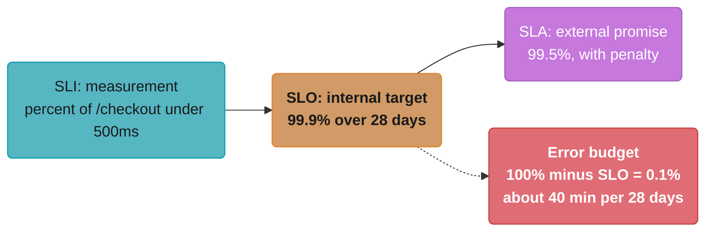
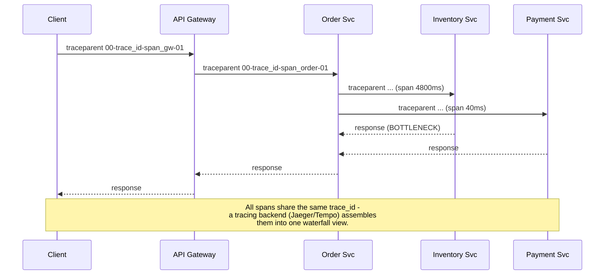
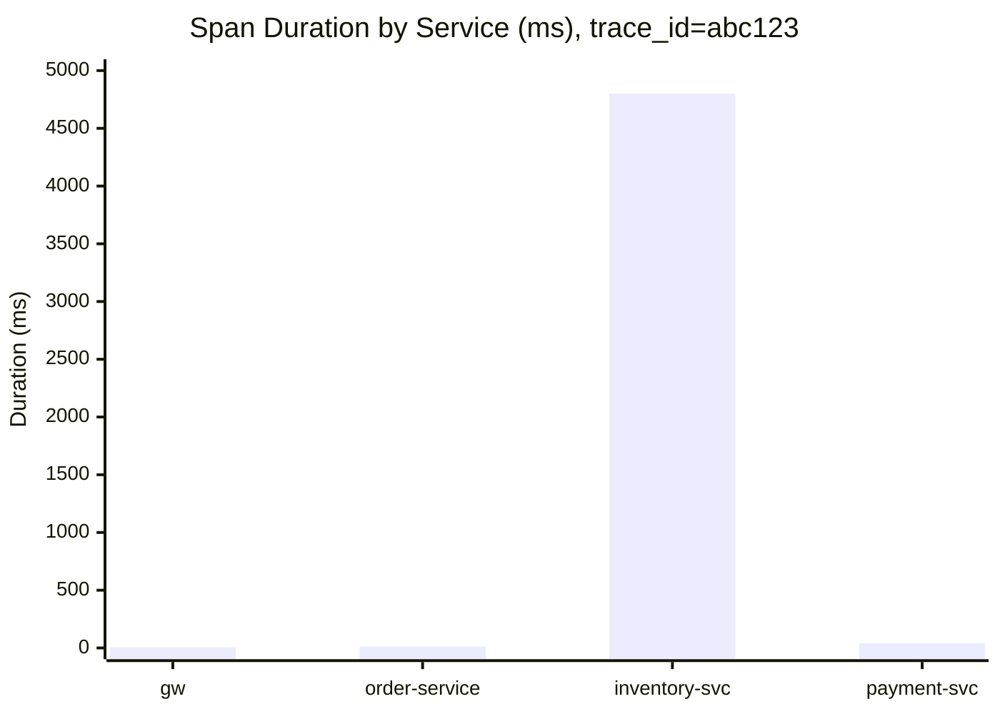
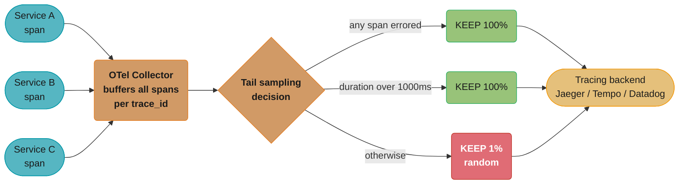
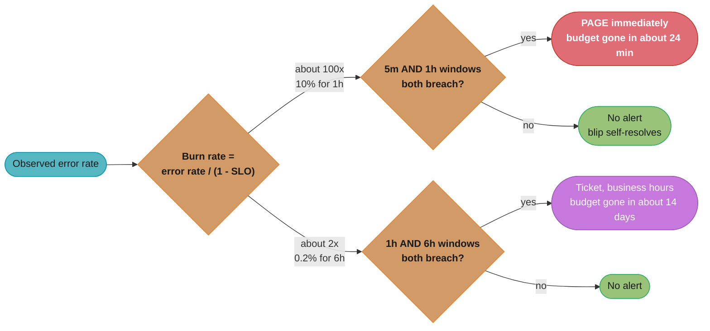
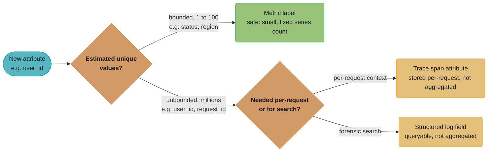
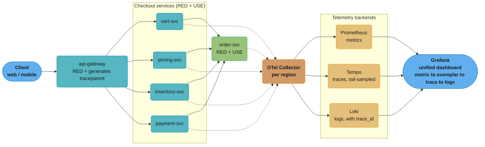

# Observability

## 1. Concept Overview

**Observability** is the property of a system that lets you answer questions about its internal state using only the data it produces externally — without shipping new code to add a debug log for the specific question you have *today*. It is built from three complementary signal types, the "three pillars":

- **Metrics** — numeric, aggregated time series (request rate, error count, p99 latency). Cheap to store, cheap to query, great for dashboards and alerts, but they tell you *that* something is wrong, not *why*.
- **Logs** — discrete, timestamped events with arbitrary structure ("user 4821 checkout failed: card declined, processor=stripe, reason=insufficient_funds"). Rich detail, expensive to store and query at scale.
- **Traces** — the path a single request took through a distributed system, broken into **spans** (one per service/operation) with parent-child relationships and timing. The only signal that directly answers "where in this 12-service call chain did the 2-second latency come from?"

The distinction that matters for system design interviews: **monitoring answers questions you thought to ask in advance** (a dashboard, a threshold alert — "known unknowns"). **Observability answers questions you didn't think to ask until an incident happened** ("unknown unknowns" — why is *this specific* user's checkout slow, when the aggregate p99 looks fine?). Every HLD case study's "Step 5: Wrap Up" (per [hld/README.md](../README.md)) — "monitoring and alerting strategy" — is really asking: *which of these three signals would you instrument, at what cardinality, and what would you alert on?*

This module is the decision framework: what to instrument, how to define "healthy" with SLIs/SLOs, and the cost/cardinality tradeoffs that determine whether your observability stack scales with your system or becomes its own outage. The mechanics of *operating* Prometheus, Grafana, Loki, and OpenTelemetry collectors are covered in the deep-dive companions in §13.

---

## 2. Intuition

> **One-line analogy**: Metrics are your car's dashboard (speed, fuel, temperature — numeric gauges you glance at constantly). Logs are the mechanic's full diagnostic printout (everything the car's computer recorded, useful when something's wrong but too much to watch live). Traces are the GPS breadcrumb trail of *this specific trip* — which roads you took, how long each leg took, and exactly where you got stuck in traffic.

**Mental model**: An alert fires: "checkout error rate is 8%, normally 0.1%." The **metric** told you something is wrong and roughly when it started. You can't fix anything yet — you need to know *which* checkouts are failing and *why*. A **trace** for one of the failing requests shows the request spent 4.8 seconds in the `inventory-service` span before erroring, when it normally takes 40ms. Now you know *where*. The **log** from `inventory-service` for that trace ID shows `"connection pool exhausted: 50/50 connections in use, waiting 4800ms"`. Now you know *why*. Three pillars, three layers of zoom — metric (system-wide, "what"), trace (request-specific, "where"), log (operation-specific, "why"). The thread that ties all three together across services is the **trace ID / correlation ID**, propagated as a header on every call.

**Why it matters**: A system that is "down" but well-instrumented can often be diagnosed and fixed in minutes. A system that is "down" with only aggregate dashboards and no correlation IDs can take *hours* — engineers grep through unstructured logs across a dozen services trying to find the needle, while the outage continues. The cost of observability (storage, query infrastructure, instrumentation effort) is paid continuously; the cost of *not* having it is paid in extended incident duration, all at once, at the worst possible time.

**Key insight**: **Cardinality is the hidden cost that breaks observability systems.** A metric `http_requests_total{status, endpoint}` with 5 status codes and 50 endpoints has 250 time series — trivial. Add a `user_id` label with 10 million users, and you have 2.5 billion time series — Prometheus falls over. The same applies to traces (sampling 100% of traffic at 50,000 req/sec generates more trace data than your databases) and logs (logging every field of every request at DEBUG in production generates terabytes/day). Every design decision in this module is, underneath, a cardinality-vs-visibility tradeoff.

---

## 3. Core Principles

**1. Instrumentation is part of the architecture, not an add-on.**
Correlation IDs must be generated at the edge (API Gateway) and propagated through every internal call — this requires every service's HTTP client and message producer to forward a header. Retrofitting this into an existing system that doesn't propagate trace context is a multi-team migration, not a config change.

**2. Metrics, logs, and traces answer different questions — pick the right one, don't default to logs for everything.**
"Is the system healthy right now?" -> metrics. "What happened to this one request?" -> trace. "What was the exact error message and stack trace?" -> log. Using logs to answer "is the system healthy" (grep-and-count over log lines) doesn't scale and is what metrics exist to replace.

**3. SLOs convert "is it broken?" from a vibe into a number.**
An SLI (Service Level Indicator) is a measurement ("the proportion of requests served in < 300ms"). An SLO (Service Level Objective) is a target for that measurement ("99.9% of requests in < 300ms, measured over 28 days"). The gap between 100% and the SLO is the **error budget** — a quantified amount of "allowed unreliability" that turns "should we deploy this risky change?" into "do we have error budget remaining?"

**4. Sampling is not optional at scale — the question is head-based vs. tail-based.**
At 50,000 requests/sec, storing every span of every trace is both prohibitively expensive and mostly useless (99.9% of traces look identical and boring). The interesting traces are the slow ones and the failed ones — and deciding *which* traces to keep, and *when* that decision is made, is the central design choice in distributed tracing (§4.3, §6.5).

**5. Alerts should be actionable, or they should not exist.**
An alert that fires and requires no action (or always requires the same trivial action) trains on-call engineers to ignore alerts — this is "alert fatigue," and it is how teams sleep through the *one* alert that mattered. Alert on **symptoms** (error rate, latency — things users feel) using SLO burn rate, not on every individual **cause** (CPU at 80%, one pod restarted).

---

## 4. Types / Architectures / Strategies

### 4.1 RED Method (for Services)

For every request-driven service, track three metrics:

- **Rate** — requests per second
- **Errors** — failed requests per second (or as a ratio of Rate)
- **Duration** — distribution of response times (as a histogram, so you can derive p50/p95/p99)

RED is the *first* thing to instrument for any service in a system design — it directly maps to "is this service healthy and fast?"

### 4.2 USE Method (for Resources)

For every resource (CPU, memory, disk, connection pool, thread pool, queue), track three metrics:

- **Utilization** — percent of time the resource is busy (CPU%, pool connections in use / pool size)
- **Saturation** — amount of work queued/waiting beyond what the resource can immediately service (run queue length, connection-pool wait queue depth)
- **Errors** — count of error events for that resource (OOM kills, disk write errors, connection timeouts)

USE complements RED: RED tells you the *symptom* ("checkout is slow"), USE tells you the *resource-level cause* ("the DB connection pool is at 100% utilization with a 40-deep wait queue").

### 4.3 Distributed Tracing — Spans, Context Propagation, Sampling

A **trace** represents one end-to-end request; a **span** represents one unit of work within it (one service call, one DB query). Spans form a tree via parent-span IDs. **Trace context** (trace ID, parent span ID, sampling decision) is propagated between services via the **W3C `traceparent` header** (§6.4) — every service must extract it from incoming requests and inject it into outgoing ones.

- **Head-based sampling**: the decision to keep or discard a trace is made at the *start* (e.g., "sample 1% of all traces, randomly"). Cheap, but you might discard the one trace that turns out to have an error.
- **Tail-based sampling**: all spans for a trace are buffered (typically by a collector) until the trace completes, *then* a decision is made — e.g., "keep if any span errored, or if total duration > 1s, otherwise sample 1%." Captures the interesting traces, but requires buffering all in-flight spans, which is memory-intensive at high throughput.

### 4.4 Structured Logging

Every log line is a structured object (JSON), not free text — `{"timestamp": ..., "level": "ERROR", "trace_id": "...", "service": "inventory-service", "message": "connection pool exhausted", "pool_size": 50, "in_use": 50}`. This makes logs queryable like a database (`WHERE level='ERROR' AND service='inventory-service'`) and, critically, **joinable with traces and metrics via `trace_id`**.

### 4.5 SLI / SLO / SLA / Error Budget

Each term nests inside the next, strictest to loosest, and the gap between 100% and the SLO is the error budget:



If the error budget is exhausted (more than 40 minutes of >500ms responses in the trailing 28 days), the team **stops shipping risky changes** and focuses on reliability until the budget recovers — a mechanism popularized by Google's SRE practice for balancing feature velocity against reliability.

---

## 5. Architecture Diagrams

### 5.1 The Three Pillars and How They Connect

One incident, three signals, three levels of zoom — the metric says something's wrong, the trace says where, the log says why:

```mermaid
flowchart LR
    classDef io      fill:#61afef,stroke:#2e86c1,color:#1a1a1a,font-weight:bold
    classDef frozen  fill:#c678dd,stroke:#9b59b6,color:#fff
    classDef train   fill:#98c379,stroke:#27ae60,color:#1a1a1a
    classDef mathOp  fill:#d19a66,stroke:#e67e22,color:#1a1a1a,font-weight:bold
    classDef lossN   fill:#e06c75,stroke:#c0392b,color:#fff,font-weight:bold
    classDef req     fill:#56b6c2,stroke:#0097a7,color:#1a1a1a
    classDef base    fill:#e5c07b,stroke:#f39c12,color:#1a1a1a

    A(["Alert fires<br/>checkout error rate = 8%"]) -->|"METRIC: system-wide what"| B("Find failing trace IDs<br/>via exemplars")
    B -->|"TRACE: request-specific where"| C("API GW 5ms to Order 12ms<br/>to Inventory 4800ms - slow span")
    C -->|"LOG: operation-specific why"| D(["trace_id=abc123 ERROR<br/>connection pool exhausted<br/>50/50 in use, waited 4800ms"])

    class A io
    class B mathOp
    class C lossN
    class D base
```



### 5.2 Distributed Tracing Across a Microservices Request

Trace context propagates as a `traceparent` header on every hop, so every span down the call chain carries the same trace_id back to a shared tracing backend:



The waterfall that backend assembles makes the bottleneck impossible to miss — `inventory-svc` alone accounts for 4800 of the ~4857ms total:



### 5.3 Tail-Based Sampling Pipeline

The collector buffers every span until a trace completes, so the keep/drop decision can use the outcome instead of a coin flip at the start:



The result: trace storage holds only ~2-5% of total volume, but keeps ~100% of the errors and slow requests that actually matter during an incident.

---

## 6. How It Works — Detailed Mechanics

### 6.1 RED Method — Concrete Numbers for a Checkout Service

```
Metric: http_request_duration_seconds_bucket{service="checkout", le="..."}
        (Prometheus histogram — pre-defined latency buckets)

Over a 5-minute window:
  Rate:     12,400 requests / 300s  = ~41.3 req/sec
  Errors:   31 requests with 5xx    = 31 / 12,400 = 0.25% error rate
  Duration: p50 = 85ms, p95 = 240ms, p99 = 480ms

Alerting rule (Prometheus-style):
  ALERT CheckoutHighErrorRate
    IF rate(http_requests_total{service="checkout",status=~"5.."}[5m])
       / rate(http_requests_total{service="checkout"}[5m]) > 0.01
    FOR 5m
    -- fires if error rate > 1% sustained for 5 minutes
```

### 6.2 USE Method — Diagnosing the Bottleneck

```
Resource: HikariCP connection pool, inventory-service -> Postgres

  Utilization: in_use / max  = 50 / 50 = 100%
  Saturation:  pending_threads (waiting for a connection) = 38
  Errors:      connection_timeout_total (rate over 5m) = 0.4/sec

  Interpretation: the pool is fully utilized (100%) AND saturated
  (38 threads queued) -> requests are queueing for connections,
  which is exactly the 4800ms span duration seen in the trace (§5.1).
  Root cause: a slow query (missing index) is holding connections
  longer than normal, shrinking effective pool capacity.
```

### 6.3 SLO Burn-Rate Alerting

A naive alert ("fire if SLI < SLO right now") is too noisy (single bad minute) or too slow (28-day average barely moves). **Burn-rate alerting** asks: *at the current error rate, how fast are we consuming the error budget?*

```
SLO: 99.9% availability over 28 days -> error budget = 0.1% = 40.32 minutes

Burn rate = (current error rate) / (1 - SLO)
          = (current error rate) / 0.001

  If current error rate = 10% for 1 hour:
    burn rate = 0.10 / 0.001 = 100x
    -> at this rate, the entire 28-day budget (40.32 min) is consumed in
       40.32 min / 100 = ~24 minutes.
    -> PAGE IMMEDIATELY (fast burn).

  If current error rate = 0.2% for 6 hours:
    burn rate = 0.002 / 0.001 = 2x
    -> at this rate, the 28-day budget is consumed in 28 days / 2 = 14 days.
    -> TICKET, not page (slow burn — investigate during business hours).

Two-window alerting (Google SRE): require BOTH a short window (5m) and a
long window (1h) to exceed the burn-rate threshold, to avoid paging on
a single brief blip that self-resolves.
```

The two-window rule is the part worth drawing: both the short and long window must independently confirm the breach before either alert fires, which is what keeps a single brief blip from paging anyone.



### 6.4 Trace Context Propagation — W3C `traceparent` Header

```
traceparent: 00-4bf92f3577b34da6a3ce929d0e0e4736-00f067aa0ba902b7-01
             |  |________________________________| |______________| |
          version       trace-id (32 hex = 16B)   parent-id (8B)  flags
                                                                   (01 = sampled)

Every service:
  1. On receiving a request, extract `traceparent` (or generate a new
     trace_id if absent — this service is the "root").
  2. Start a local span with a new span_id, parent_id = the incoming
     span_id.
  3. When calling downstream services, inject a NEW traceparent header
     with THIS service's span_id as the parent_id, same trace_id,
     same sampling flag.
  4. Attach trace_id to every log line emitted while handling this
     request (via MDC / context propagation) -- this is what makes
     logs joinable to traces.
```

### 6.5 Cardinality Explosion — Concrete Numbers

```
Metric: http_requests_total{service, endpoint, status, user_id}

  services: 30, endpoints: 20 avg per service, status codes: 5,
  user_id: 10,000,000 active users

  Time series = 30 * 20 * 5 * 10,000,000 = 30 BILLION series

  Prometheus typically handles ~1-10 million active series per instance
  before performance degrades severely (memory, query latency).

  FIX: remove user_id as a metric label entirely (30*20*5 = 3,000 series
  -- trivial). To answer "which users are affected," use TRACES (each
  trace/span can carry a user_id attribute -- traces are stored
  per-request, not aggregated into a time series, so high-cardinality
  attributes are fine there) or sampled, structured LOGS.

  Rule of thumb: metric labels should have a cardinality of 1-100,
  bounded and known in advance. User IDs, request IDs, email addresses,
  and raw error messages NEVER belong in a metric label.
```

That rule of thumb is really a routing decision — where a new attribute belongs depends only on how many unique values it can take:



---

## 7. Real-World Examples

- **Google SRE error budgets**: popularized the SLO/error-budget model described in §4.5/§6.3 — when a service exhausts its error budget, feature launches are frozen until reliability work restores it. This directly ties an architectural property (reliability) to a business process (release management).
- **Uber's Jaeger**: Uber built and open-sourced Jaeger (now a CNCF project) specifically because their move to microservices (thousands of services) made request-flow debugging via logs alone intractable — a single trip request could touch 20+ services.
- **Netflix's Atlas**: a custom metrics platform built because off-the-shelf time-series databases couldn't handle Netflix's cardinality and query volume — billions of time series, millions of metrics/sec — illustrating that "just use Prometheus" has scaling limits that the largest systems must engineer around.
- **Honeycomb / "Observability 2.0"**: an industry movement arguing for **wide structured events** (one event per request, with hundreds of high-cardinality fields) queried with arbitrary `GROUP BY`, rather than pre-aggregated metrics — trading storage cost for the ability to ask *any* question after the fact, including ones nobody anticipated.
- **PagerDuty / Opsgenie**: alert-routing platforms that operationalize the "alert on symptoms via SLO burn rate, route to the right on-call" principle from §3.

---

## 8. Tradeoffs

### Three Pillars Comparison

| Dimension | Metrics | Logs | Traces |
|-----------|---------|------|--------|
| Granularity | Aggregated (per time bucket) | Per-event | Per-request, cross-service |
| Cardinality tolerance | Low (1-100 per label) | High | High (per-span attributes) |
| Storage cost at scale | Low | High | Medium-High (mitigated by sampling) |
| Best for | "Is it healthy?" dashboards, alerting | "What exactly happened?" forensics | "Where in the call chain is the problem?" |
| Query latency | Fast (pre-aggregated) | Slow (full-text/grep at scale) | Fast for a single trace; slow for cross-trace analysis |

### Sampling Strategy Comparison

| Strategy | When decided | Captures errors/slow traces? | Infrastructure cost | Best for |
|----------|--------------|-------------------------------|----------------------|----------|
| Head-based, fixed rate (e.g., 1%) | At trace start | No (random — most errors discarded) | Low | High-volume systems where rough latency trends suffice |
| Head-based, adaptive (boost rate during incidents) | At trace start, rate adjusted dynamically | Partial | Low-Medium | Systems with bursty traffic |
| Tail-based | After trace completes | Yes (100% of errors/slow traces) | High (buffer all spans until trace completes) | Systems where debugging individual failures matters most |

---

## 9. When to Use / When NOT to Use

### Invest Heavily When
- The system is a **distributed system with 5+ services** in the request path — single-service systems can often debug via logs alone.
- **Customer-facing SLAs exist** — you need SLIs/SLOs to know if you're meeting them *before* the customer files a complaint.
- **Incidents currently take hours to diagnose** — this is the clearest signal that the gap between "metric says something's wrong" and "here's the root cause" is too wide.

### Start Minimal When
- **Early-stage systems / prototypes** — RED metrics (§4.1) plus structured logs with correlation IDs cover 80% of debugging needs at a fraction of the cost of full distributed tracing.
- **Single-service or monolith architectures** — a stack trace from an in-process exception already tells you "where," making distributed tracing's main value proposition moot.

### Avoid / Be Cautious When
- **Adding high-cardinality labels to metrics "just in case"** — this is the #1 cause of observability-stack outages (§10).
- **100% trace sampling at high QPS without tail-based sampling** — generates more data than the rest of the system combined, for marginal benefit over a well-designed sampling strategy.
- **Treating dashboards as a substitute for alerts** — a dashboard nobody is actively watching at 3 AM doesn't page anyone; it's documentation, not detection.

---

## 10. Common Pitfalls

**War Story 1 — The Cardinality Explosion That Took Down Prometheus**

A team added `user_id` as a label on `http_requests_total` to enable "per-user request rate" dashboards for their top enterprise customers (~50 of them). The metric already had `service` (30), `endpoint` (20), and `status` (5) labels — 3,000 series. With `user_id`, and because the label was applied to *all* users, not just the 50 enterprise ones, it became 3,000 x 10,000,000 = 30 billion potential series. Prometheus's memory usage grew unbounded as new users made their first requests, and the instance OOM-killed within 6 hours, **taking down all dashboards and alerts for the entire platform** — including the alerts that would have caught this.
*Fix*: removed the `user_id` label entirely. For "per-user" investigation, engineers now query traces (filtered by a `user.id` span attribute, which doesn't create new metric time series) for the specific user in question.

**War Story 2 — Alert Fatigue and the Page Nobody Answered**

A platform had 340 active alert rules, many alerting on causes (CPU > 70%, disk > 80%, individual pod restarts) rather than symptoms. On-call engineers received an average of **22 pages per shift**, the vast majority auto-resolving within minutes with no action taken. When a genuine database failover caused a 4-minute customer-facing outage, the page was the 14th of that hour — the on-call engineer, having silenced notifications after the 8th page, didn't see it until a customer escalation 35 minutes later.
*Fix*: alert rules were rebuilt around SLO burn rate (§6.3) — only 12 alerts remained, each tied to a customer-facing SLI. CPU/disk/pod-restart metrics remained on dashboards (for context during an incident) but stopped paging directly.

**War Story 3 — Missing Correlation IDs Turned a 12-Minute Fix Into a 3-Hour Investigation**

A checkout failure spike was visible in metrics within 1 minute. But the system predated trace-context propagation — each of the 8 services in the checkout path logged independently, with its own request ID, none of which were shared. Engineers manually correlated logs across 8 services by **timestamp proximity** (`grep` for log lines within the same 2-second window across 8 different log files), a process that took ~3 hours and was error-prone (multiple concurrent requests in the same window were indistinguishable).
*Fix*: rolled out W3C `traceparent` propagation (§6.4) across all 8 services over the following quarter. The next similar incident was diagnosed in 12 minutes — one query for `trace_id=X` across all services' logs.

**War Story 4 — 100% Trace Sampling Doubled the Database Bill**

A team enabled 100% head-based trace sampling "to be safe" on a service handling 30,000 req/sec, each generating ~8 spans. That's 240,000 spans/sec written to the tracing backend's storage (Cassandra) — which became the **single largest write workload** in the entire platform, larger than the actual application databases combined, doubling the Cassandra cluster's cost.
*Fix*: switched to tail-based sampling (§4.3, §5.3) at the OTel Collector layer — 100% of error and slow (>1s) traces retained, 1% of normal traces sampled. Trace storage volume dropped ~95% with no loss of debugging capability for actual incidents.

---

## 11. Technologies & Tools

| Category | Tools | Notes |
|----------|-------|-------|
| Metrics | Prometheus, VictoriaMetrics, Grafana Mimir, Datadog, Netflix Atlas | Pull-based (Prometheus) vs. push-based (StatsD/Datadog) collection models |
| Dashboards / Alerting | Grafana, Datadog, PagerDuty/Opsgenie (routing) | Burn-rate alert rules (§6.3) typically defined as PromQL or Datadog Monitors |
| Logs | Elasticsearch/OpenSearch (ELK), Grafana Loki, Splunk, Datadog Logs | Loki indexes only labels (not full text), trading query flexibility for much lower cost than ELK at scale |
| Tracing | Jaeger, Zipkin, Grafana Tempo, Datadog APM, AWS X-Ray | Tempo/X-Ray store traces cheaply by indexing only trace IDs, relying on metrics/logs for discovery |
| Instrumentation standard | OpenTelemetry (OTel) | Vendor-neutral SDK + Collector; emits to Prometheus, Jaeger, Datadog, etc. — the de facto standard since ~2022 |
| Context propagation | W3C Trace Context (`traceparent`/`tracestate` headers) | Supersedes older vendor-specific formats (B3, X-Ray headers); OTel supports both |

> See [Observability: Metrics with Prometheus](../../devops/observability_metrics_prometheus/README.md), [Observability: Logging](../../devops/observability_logging/README.md), and [Observability: Tracing & OTel](../../devops/observability_tracing_and_otel/README.md) for the full operational deep-dives — PromQL, Loki LogQL, OTel Collector pipeline configuration, and Grafana dashboard design.

---

## 12. Interview Questions with Answers

**Q1: What's the difference between monitoring and observability?**

A: Monitoring answers questions you defined in advance — dashboards and alerts for known failure modes ("known unknowns"). Observability is the property that lets you answer questions you *didn't* anticipate, by exploring the metrics/logs/traces a system already emits ("unknown unknowns") — e.g., "why is checkout slow specifically for users in the EU on the new payment provider?" without having pre-built that exact dashboard.

**Q2: Why can't you just put everything in logs and grep when something goes wrong?**

A: Three reasons: (1) cost — structured logging every field of every request at high QPS generates terabytes/day, far more expensive than aggregated metrics; (2) query speed — "is the system healthy right now" requires aggregation across millions of log lines, which is slow, whereas a metric is pre-aggregated and queries in milliseconds; (3) cross-service correlation — a single request's logs are spread across N services' log streams, and without a shared trace ID, correlating them by timestamp alone doesn't scale (§10, War Story 3).

**Q3: What is cardinality, and why is it dangerous in metrics?**

A: Cardinality is the number of unique label-value combinations a metric can have — `http_requests_total{service, endpoint, status}` with 30 services, 20 endpoints, 5 statuses has 3,000 time series. Adding a high-cardinality label like `user_id` (millions of values) multiplies this into billions of series, which can exhaust a metrics database's memory and crash it — taking down dashboards and alerts platform-wide (§10, War Story 1). The fix is to keep high-cardinality data (user IDs, request IDs) in traces or logs, where it's stored per-event rather than as a multiplied-out time series.

**Q4: Explain SLI, SLO, SLA, and error budget, and how they relate.**

A: An SLI is a measured indicator (e.g., "% of requests under 500ms"). An SLO is an internal target for that SLI (e.g., 99.9%). An SLA is an external, contractual promise — typically looser than the SLO (e.g., 99.5%) to provide a safety margin before penalties apply. The error budget is `100% - SLO` — the amount of "badness" allowed (0.1% over 28 days = ~40 minutes). When the budget is exhausted, the team prioritizes reliability work over new features until it recovers — this turns reliability into a quantified, negotiable resource rather than an abstract goal.

**Q5: How does distributed tracing actually connect spans across different services?**

A: Via context propagation — when Service A calls Service B, it includes a `traceparent` header (W3C standard) containing the trace ID (shared across the whole request), Service A's span ID (becomes B's parent-span-id), and a sampling flag. Service B extracts this, starts its own span as a child, and propagates its own `traceparent` (same trace ID, B's span ID as parent) to any services it calls. A tracing backend collects all spans sharing a trace ID and assembles them into a parent-child tree, visualized as a waterfall.

**Q6: What's the difference between head-based and tail-based sampling, and why does it matter?**

A: Head-based sampling decides whether to keep a trace at the start of the request, before knowing the outcome — e.g., "keep 1% randomly." This is cheap but will discard most error/slow traces, since they're statistically rare. Tail-based sampling buffers all spans for a trace until it completes, then decides based on the *outcome* — "keep if any span errored or total duration exceeded a threshold, otherwise sample 1%." This captures nearly 100% of the traces you'd actually want during an incident, at the cost of buffering in-flight span data (memory) at a collector layer.

**Q7: Why is "alert on causes" (CPU, disk, pod restarts) considered an anti-pattern?**

A: Cause-based alerts fire frequently for conditions that don't actually impact users (CPU at 75% might be totally fine if latency is unaffected) and don't fire for causes nobody anticipated. The result is either alert fatigue (too many low-value pages train engineers to ignore alerts — §10, War Story 2) or missed incidents (the one cause nobody wrote a rule for). Alerting on symptoms — SLO burn rate, which directly measures user-facing impact — fires only when something the business actually cares about is degrading, regardless of root cause.

**Q8: How would you design the observability strategy for a new microservice from scratch?**

A: Start with RED metrics (rate, errors, duration) exposed via a `/metrics` endpoint (Prometheus format) — this is the minimum for "is it healthy." Add structured JSON logging with the trace ID attached to every log line via the request's `traceparent` context. Instrument with an OpenTelemetry SDK so traces propagate automatically through HTTP clients/servers. Define 1-3 SLIs that map to user experience (e.g., "% of requests under 300ms," "% of requests succeeding") and set SLOs based on what the business needs, then build burn-rate alerts off those SLOs — not off CPU/memory.

**Q9: A service's p50 latency looks fine, but customers are complaining about slowness. What's going on, and how would observability help?**

A: p50 (median) can look healthy while a meaningful tail (p95/p99) is badly degraded — if 5% of requests take 5 seconds, the median is unaffected but 5% of users have a terrible experience, and at high request volume that's a lot of users. Always alert on and dashboard p95/p99, not just p50/average. To investigate, pull traces for slow requests specifically (tail-sampled, or filtered by duration in the tracing backend) — the aggregate metric tells you the tail exists, but only individual traces show *which* span in *which* requests is slow, and whether it's correlated with a specific user segment, region, or code path.

**Q10: How do metrics, logs, and traces get tied together in practice?**

A: Through a shared trace ID. The trace ID is generated at the edge, propagated via `traceparent` headers to every downstream service, attached to every log line emitted while processing that request (via thread-local/MDC context), and embedded as span attributes in the trace itself. Many metrics systems also support "exemplars" — a metric data point (e.g., one slow request in a latency histogram bucket) can carry a reference to the specific trace ID that produced it, letting you jump directly from "this histogram bucket has unusually high counts" to "here's an example trace from that bucket."

**Q11: What's the operational cost of running a full observability stack, and how do you control it?**

A: Costs come from storage (metrics retention, log volume, trace volume) and compute (query/aggregation, especially for logs and high-cardinality metrics). Control levers: keep metric label cardinality bounded (§6.5); use log levels appropriately and sample/drop DEBUG logs in production; use tail-based sampling for traces (§5.3) to retain ~100% of interesting traces at ~1-5% of total volume; set retention policies appropriate to each signal (metrics: months, for trend analysis; traces: days, for recent-incident debugging; logs: balance compliance requirements against cost, often with tiered/cold storage for older logs).

**Q12: How would you debug an incident where the error rate metric is normal, but a specific customer reports failures?**

A: This is exactly the scenario observability (vs. monitoring) is for — the aggregate metric is healthy because the affected population is a small fraction of total traffic, below the threshold that would move the aggregate noticeably. Query traces or structured logs filtered by attributes specific to that customer (user ID, tenant ID, region, feature flag) — these are high-cardinality dimensions that live in traces/logs, not metrics. This is also a strong argument for "wide event" / Honeycomb-style approaches (§7) that let you `GROUP BY` arbitrary high-cardinality fields after the fact, rather than only the dimensions someone thought to pre-aggregate into a metric.

**Q13: What's the difference between the RED method and the USE method, and when do you use each?**

A: RED (Rate, Errors, Duration) measures request-driven services from the outside, while USE (Utilization, Saturation, Errors) measures the resources underneath them. RED answers "is this service healthy?" — request rate, error rate, and the latency distribution — and is the first thing to instrument for any service. USE answers "which resource is the bottleneck?" by tracking utilization, saturation, and errors for CPU, connection pools, thread pools, and queues, turning a RED-detected symptom like "checkout is slow" into a resource-level cause like "the DB connection pool is at 100% utilization with a 40-deep wait queue." Instrument RED for every service and USE for every shared resource from day one, so the two together connect symptom to cause without a separate investigation step.

**Q14: How do you calculate SLO burn rate, and why use two-window alerting instead of a single threshold?**

A: Burn rate is the current error rate divided by (1 minus the SLO), showing how many times faster than the allowed pace you are consuming the error budget. At a 99.9% SLO (0.1% error budget), a 10% current error rate gives a burn rate of 100x, meaning the entire 28-day budget would be consumed in about 24 minutes if that rate continued — a signal to page immediately. Two-window alerting requires both a short window (5 minutes) and a long window (1 hour) to independently confirm the same burn-rate breach before firing, which prevents a single brief blip that self-resolves within the short window from paging anyone. This two-window confirmation is what keeps burn-rate alerting fast enough to catch real incidents quickly while still avoiding the noise a naive single-threshold check would generate.

**Q15: Why should application logs be structured (JSON) instead of free text?**

A: Structured logs are queryable like a database, letting you filter with something like `WHERE level='ERROR' AND service='inventory-service'` instead of grep-ing free text across files. Free-text logs require full-text search or regex matching that scales poorly and misses fields that were not anticipated when the log line was written, whereas a JSON log line's fields are all queryable and filterable without parsing tricks. Critically, structured logs are joinable with traces and metrics via a shared `trace_id` field, which is what makes it possible to jump from a metric anomaly to the exact log line that explains it. Emit every log line as a structured object from day one, since retrofitting structure onto years of free-text logs is a much larger effort than starting with it.

**Q16: What's the architectural tradeoff between Loki and ELK/Elasticsearch for log storage at scale?**

A: Loki indexes only a small set of labels and stores log content compressed and unindexed, while Elasticsearch (ELK) fully indexes every field of every log line for rich full-text search. This makes Loki dramatically cheaper to run at high log volume, since it avoids building and storing a full-text search index over terabytes of daily log data, but query flexibility suffers — a Loki query must first narrow by label before it can grep the remaining log content, whereas Elasticsearch can search any field directly. Elasticsearch remains the better choice when engineers need to search arbitrary text across unindexed fields quickly, such as searching for a specific error message string with no known service or time range. Choose Loki when log volume is the dominant cost driver and queries are typically scoped by trace ID or a few known labels; choose Elasticsearch when ad hoc full-text search flexibility matters more than storage cost.

---

## 13. Best Practices

**1. Instrument RED metrics for every service and USE metrics for every shared resource (DB pools, queues, thread pools) from day one** — this is the cheapest, highest-leverage observability investment and the foundation everything else builds on.

**2. Propagate trace context (W3C `traceparent`) through every service, queue, and async boundary** — including into Kafka message headers for event-driven flows. A trace that "stops" at a message queue boundary loses exactly the cross-service correlation that makes tracing valuable.

**3. Define SLIs that map to user experience, not infrastructure** — "% of checkout requests completing successfully under 500ms" is an SLI; "average CPU utilization" is not, even though it might be a useful internal signal.

**4. Alert on SLO burn rate with two-window confirmation (§6.3)** — fast burn (page immediately) and slow burn (ticket for business hours), to balance responsiveness against alert fatigue.

**5. Treat metric label cardinality as a reviewed, bounded resource** — before adding a new label, ask "how many unique values can this take?" If the answer is "unbounded" or "grows with users/requests," it belongs in a trace attribute or log field, never a metric label.

**6. Use tail-based sampling once trace volume becomes a cost concern** — head-based sampling is fine for low-volume services, but at scale, tail-based sampling is the only way to retain visibility into errors and slow requests without retaining (and paying for) everything.

**7. Make dashboards link directly to traces (exemplars) and logs (by trace ID)** — the goal is zero manual correlation steps between "the metric looks bad" and "here's the specific request/log line that explains why."

**Cross-references:** [Observability: Metrics with Prometheus](../../devops/observability_metrics_prometheus/README.md) (PromQL, recording rules, Prometheus federation), [Observability: Logging](../../devops/observability_logging/README.md) (Loki/ELK architecture, log pipeline design), [Observability: Tracing & OTel](../../devops/observability_tracing_and_otel/README.md) (OpenTelemetry Collector configuration, exporter pipelines), [Spring Observability & Tracing](../../spring/observability_and_tracing/README.md) (Micrometer Observation API, Spring Boot Actuator integration), [Backend Observability & Monitoring](../../backend/observability_and_monitoring/README.md) (MDC, structured logging in Java, SLO implementation), [Microservices](../microservices/README.md) (§6.3 Distributed Tracing — where this module's tracing concepts are applied across service boundaries).

---

## 14. Case Study: Observability for a Multi-Region Checkout Platform

### Problem Statement

An e-commerce platform's checkout flow spans 6 services (`api-gateway`, `cart-service`, `pricing-service`, `inventory-service`, `payment-service`, `order-service`) across 2 AWS regions (us-east-1, eu-west-1). Scale:

- 45,000 checkout requests/min globally (peak: 180,000/min during flash sales)
- p99 latency target: 800ms end-to-end
- Availability SLA to merchants: 99.9% (contractual penalty below this)
- Current state: Prometheus for metrics (RED only, no USE metrics on shared resources), unstructured text logs per service, no distributed tracing
- Recent incident: a 22-minute checkout outage took **3 hours and 40 minutes** to root-cause (the War Story 3 scenario from §10, generalized to this case study)

### Target Architecture

Checkout traffic fans out from the gateway to four services, which continue the business flow into `order-svc` (solid) while every service also exports telemetry (dotted) to a per-region collector feeding the three observability backends:



### Key Design Decisions

1. **SLIs defined per-service, rolled up to a checkout-level SLI** — each of the 6 services gets its own RED-based SLI ("% requests < Xms"), but the customer-facing SLO is defined on the *end-to-end* checkout latency and success rate measured at `api-gateway` — this is what the 99.9% SLA actually refers to, and per-service SLOs are set tighter (e.g., 99.95% each) so that 6 services compounding still meets the end-to-end target.

2. **`traceparent` propagation added at every HTTP client and Kafka producer/consumer** — including the async `order-service -> fulfillment` handoff via Kafka, where the trace ID is added as a message header. This directly targets the War Story 3 failure mode: the next cross-service incident is traceable end-to-end, including through the async boundary.

3. **Tail-based sampling at a per-region OTel Collector** — 100% of traces with any error span or total duration > 800ms (the SLO threshold) are retained; all others sampled at 2%. At 45,000 req/min peak 180,000/min, this keeps trace storage to ~2-5% of raw volume while guaranteeing every SLO-violating request is fully traced.

4. **USE metrics added for every connection pool, thread pool, and queue** — the original incident's root cause (a connection-pool exhaustion, structurally identical to §6.2's example) was invisible because only RED metrics existed; USE metrics would have shown `inventory-service`'s DB pool at 100% utilization with a growing wait queue *before* the RED error rate spiked.

5. **Burn-rate alerting replaces the previous 60+ threshold alerts** — two alerts per service-level SLI (fast burn: 5m+1h windows, page; slow burn: 1h+6h windows, ticket), plus one end-to-end checkout SLO burn-rate alert that's the primary page for the on-call rotation. Total active pages dropped from ~60 rules to 14.

6. **Dashboard exemplars link metrics directly to traces** — a spike in the `inventory-service` p99 latency panel in Grafana links directly to an example trace from that time window, which links to the corresponding Loki logs filtered by `trace_id` — collapsing the "find a representative failing request" step that used to take the most time.

### Tradeoffs

| Decision | Alternative considered | Why this choice |
|----------|------------------------|-------------------|
| Tail-based sampling at regional collector | Head-based 1% sampling (cheaper) | Flash-sale traffic spikes (4x normal) make rare errors statistically likely to be missed by head-based sampling exactly when they matter most |
| Per-service SLOs tighter than end-to-end SLA (99.95% vs 99.9%) | Same SLO at every layer | A 6-service chain at 99.9% each compounds to ~99.4% end-to-end (0.999^6) — tighter per-service targets are needed to meet the aggregate SLA |
| OTel Collector per-region | Single global collector | Cross-region collector traffic for tail sampling would add latency and a cross-region dependency for an observability function — kept regional, with regional Prometheus/Tempo/Loki instances federated centrally for global dashboards |

### Metrics & Results (post-rollout)

- MTTR (mean time to root cause) for cross-service incidents: 3h40m -> 11 minutes (one trace_id query)
- Trace storage volume: 3.2% of theoretical 100%-sampling volume, while retaining 100% of error/SLO-violating traces
- Active paging alert rules: 60 -> 14
- Pages per on-call shift: 22 -> 3 (all actionable, per a 1-month audit)
- USE metrics caught 2 connection-pool-saturation incidents *before* RED error rates moved, both resolved via pool-size tuning before customer impact

### Common Pitfalls / Lessons Learned

1. **The async Kafka boundary was the last piece propagated**, and was initially missed — traces "ended" at `order-service` because the `fulfillment` consumer didn't extract `traceparent` from message headers. The team discovered this only when an incident's trace showed a suspiciously short, "successful-looking" trace for a request that customers reported as stuck — the actual problem was downstream of where tracing stopped. **Lesson: audit every async hop (queues, scheduled jobs, webhooks) explicitly — tracing instrumentation tends to follow synchronous call graphs and silently skip async ones.**

2. **The first version of tail-based sampling used a 5-second buffer window**, but `order-service`'s async fulfillment step could take up to 30 seconds to complete its portion of the trace — by the time fulfillment's span arrived, the collector had already flushed (and dropped) the trace. **Fix: increased the buffer window to 60 seconds for traces touching async services, accepting the memory cost as bounded by the much lower volume of async-touching traces.**

