# Rate Limiting

## 1. Concept Overview

**Rate limiting** is a control mechanism that caps how many requests a client — identified by IP address, user ID, API key, or tenant — can make to a service within a given time window. It is one of the first lines of defense in any production system: a gate between untrusted traffic and the resources (compute, database connections, third-party API budgets) that traffic would otherwise consume without bound.

Architecturally, a rate limiter is almost never the business logic itself — it is **middleware**. It can live at several points in the request path (the API gateway, a service mesh sidecar, the application's own request-handling layer, or even the client SDK), and the choice of where to place it materially changes its effectiveness, latency overhead, and failure modes (covered in §5 and §9).

At its core, every rate-limiting algorithm answers two questions:
1. **How much state must be tracked per client**, and where does that state live (in-process memory vs. a shared store like Redis)?
2. **How is "rate" measured** — as a hard ceiling per fixed time window, a continuously refilling budget (token bucket), or a precise sliding measurement?

The answers produce the five canonical algorithms in §3, each trading off **accuracy** (can it be gamed at window boundaries?), **memory cost** (O(1) counters vs. O(N) timestamp logs), and **burst tolerance** (can a client bank "credit" while idle?).

---

## Intuition

> **One-line analogy**: Rate limiting is like a nightclub bouncer with a capacity limit — no matter how many people arrive, only N per minute get in, protecting the venue from overcrowding.

**Mental model**: Without rate limiting, a single misbehaving client (or DDoS attack) can flood your servers, starving legitimate users. Rate limiters enforce a maximum request rate per client (API key, IP, user ID). Token bucket is the most natural model: a bucket fills at a constant rate (e.g., 100 tokens/minute); each request costs one token; no tokens = rejected. The bucket absorbs short bursts while enforcing long-term rate limits.

**Why it matters**: Rate limiting protects systems from abuse, DDoS attacks, runaway clients, and cascading failures. It's the first line of defense for public APIs and is required by most cloud providers. Without it, one bad actor can take down service for all users.

**Key insight**: Distributed rate limiting (Redis-backed, sliding window log) is necessary when you have multiple API gateway nodes — a per-node rate limit of 100 req/min on 10 nodes = 1000 req/min effective limit, which may be unacceptable. Centralized state (Redis) solves this but adds latency.

---

## 2. Core Principles

Rate limiting is a technique used to control the rate at which clients can make requests to a server or service. It is a foundational component of any production-grade API or distributed system.

### Core Motivations

**1. DDoS Protection**
Distributed Denial of Service attacks flood a service with requests to exhaust its resources. Rate limiting caps the request rate per IP or client, making volumetric attacks far less effective. Even if an attacker controls thousands of IPs, per-IP limits reduce the blast radius.

**2. Fair Usage / Resource Equity**
Without limits, a single heavy consumer can monopolize shared infrastructure — CPU, memory, DB connections — starving other users. Rate limiting enforces fairness so all clients get a reasonable share of system capacity.

**3. Cost Control**
APIs backed by paid third-party services (LLM APIs, SMS gateways, payment processors) can incur runaway costs if clients make unbounded calls. Rate limits act as a circuit breaker on cost exposure.

**4. SLA Enforcement**
Service Level Agreements define guaranteed throughput for each customer tier. Rate limiting is the mechanism that enforces those tiers — a "Free" plan might get 100 req/min while "Enterprise" gets 10,000 req/min.

**5. Preventing Cascading Failures**
When a downstream service is slow, clients often retry aggressively, causing a feedback loop. Rate limiting at ingress prevents this retry storm from propagating.

**6. Business Policies**
Some APIs are rate-limited for business reasons: limiting free-tier scraping, enforcing trial constraints, metering usage-based billing.

---

## 3. Types / Strategies — Rate Limiting Algorithms

### Token Bucket

#### Concept
The Token Bucket algorithm models a bucket that holds tokens. Tokens are added at a fixed rate (the "refill rate"). Each incoming request consumes one or more tokens. If the bucket has enough tokens, the request is allowed; otherwise it is rejected or queued.

The key insight: the bucket has a maximum capacity ("burst size"). You can accumulate tokens up to this limit, enabling short bursts of traffic above the average rate.

#### ASCII Diagram

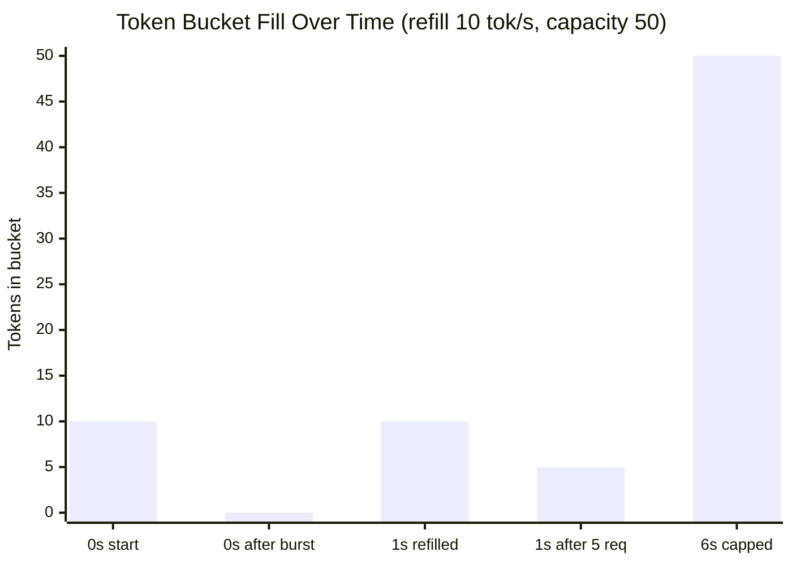

At 6s the bucket is full at its 50-token cap; when 100 requests arrive at once, only 50 are allowed and 50 are rejected — the bucket absorbs bursts up to capacity, then sheds the rest.

#### Pseudocode

```python
class TokenBucket:
    def __init__(self, capacity: int, refill_rate: float):
        self.capacity = capacity          # max tokens (burst size)
        self.refill_rate = refill_rate    # tokens added per second
        self.tokens = capacity            # start full
        self.last_refill = current_time()

    def allow_request(self, tokens_needed: int = 1) -> bool:
        self._refill()
        if self.tokens >= tokens_needed:
            self.tokens -= tokens_needed
            return True
        return False  # rate limited

    def _refill(self):
        now = current_time()
        elapsed = now - self.last_refill
        new_tokens = elapsed * self.refill_rate
        self.tokens = min(self.capacity, self.tokens + new_tokens)
        self.last_refill = now
```

#### Pros
- Allows controlled bursting — ideal for APIs where users occasionally need short bursts
- Smooth average rate enforcement
- Memory efficient: only store token count and timestamp per user
- Used by AWS, Stripe, and many API gateways

#### Cons
- Two parameters to tune (capacity and refill rate), which can be non-intuitive
- In a distributed system, token state must be shared (e.g., via Redis)
- A fully drained bucket gives no signal about how long until next token

---

### Leaky Bucket

#### Concept
The Leaky Bucket algorithm treats incoming requests like water poured into a bucket with a small hole at the bottom. Water (requests) drains at a constant rate regardless of input. If the bucket overflows (queue is full), excess requests are dropped.

The key difference from Token Bucket: output rate is constant and smooth. There is no concept of burst — requests are processed at a fixed, steady rate.

#### ASCII Diagram

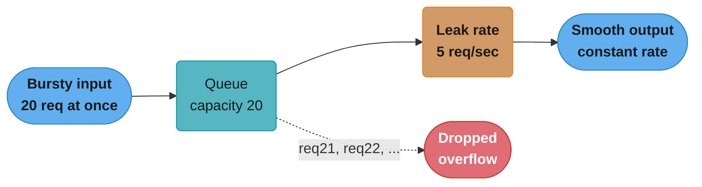

The queue absorbs the burst up to its 20-request capacity; anything past that is dropped, while the leak rate drains it at a fixed 5 requests/sec regardless of how bursty the input was.

#### Pseudocode

```python
class LeakyBucket:
    def __init__(self, capacity: int, leak_rate: float):
        self.capacity = capacity        # max queue size
        self.leak_rate = leak_rate      # requests processed per second
        self.queue = deque()
        self.last_leak = current_time()

    def add_request(self, request) -> bool:
        self._leak()
        if len(self.queue) < self.capacity:
            self.queue.append(request)
            return True  # accepted (queued)
        return False  # dropped (overflow)

    def _leak(self):
        now = current_time()
        elapsed = now - self.last_leak
        leaked = int(elapsed * self.leak_rate)
        for _ in range(min(leaked, len(self.queue))):
            process(self.queue.popleft())
        self.last_leak = now
```

#### Pros
- Guarantees a constant, smooth output rate — ideal for systems sensitive to traffic spikes
- Prevents downstream overload by acting as a traffic shaper
- Simple conceptual model

#### Cons
- No burst allowance — a legitimate user who was idle cannot use accumulated quota
- Queue introduces latency; requests don't fail fast, they wait
- Queue depth tuning is critical — too small drops too much, too large adds latency

---

### Fixed Window Counter

#### Concept
Divide time into fixed windows (e.g., each minute). Count requests per client in the current window. If count exceeds the limit, reject the request. At the start of a new window, reset the counter.

#### The Boundary Spike Problem

This is the critical flaw of fixed windows. If a user sends requests at the very end of window 1 and the very start of window 2, they can effectively double the allowed rate.

#### ASCII Diagram

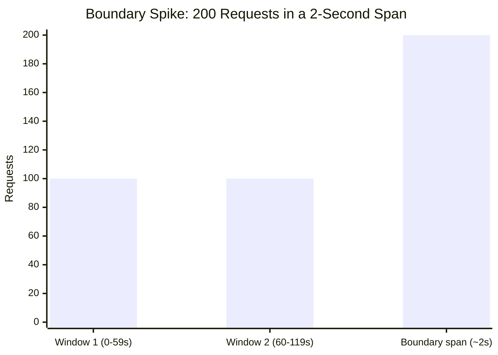

Both windows individually stay within the 100/min limit, but the 2-second span straddling the boundary (00:59-01:00) sees all 200 requests — double the intended rate. The sliding-window approaches below close this gap.

#### Pseudocode

```python
class FixedWindowCounter:
    def __init__(self, limit: int, window_size: int):
        self.limit = limit
        self.window_size = window_size  # seconds
        self.counters = {}  # key -> (window_start, count)

    def allow_request(self, client_id: str) -> bool:
        now = current_time()
        window_start = int(now / self.window_size) * self.window_size

        if client_id not in self.counters or \
           self.counters[client_id][0] != window_start:
            self.counters[client_id] = (window_start, 0)

        window_start, count = self.counters[client_id]
        if count < self.limit:
            self.counters[client_id] = (window_start, count + 1)
            return True
        return False
```

#### Pros
- Very simple to implement and understand
- Memory efficient: one counter per client per window
- Works well when traffic is evenly distributed

#### Cons
- Boundary spike allows 2x burst at window boundaries
- Not suitable for strict rate enforcement

---

### Sliding Window Log

#### Concept
Instead of a fixed window counter, store the exact timestamp of every request in the last window. To check a new request, count how many timestamps fall within [now - window_size, now]. If below the limit, allow and log the timestamp.

#### Pseudocode

```python
class SlidingWindowLog:
    def __init__(self, limit: int, window_size: int):
        self.limit = limit
        self.window_size = window_size  # seconds
        self.logs = {}  # client_id -> sorted list of timestamps

    def allow_request(self, client_id: str) -> bool:
        now = current_time()
        window_start = now - self.window_size

        if client_id not in self.logs:
            self.logs[client_id] = []

        # Remove timestamps outside the window
        self.logs[client_id] = [
            t for t in self.logs[client_id] if t > window_start
        ]

        if len(self.logs[client_id]) < self.limit:
            self.logs[client_id].append(now)
            return True
        return False
```

#### Pros
- Perfectly accurate — no boundary spike problem
- True sliding window behavior

#### Cons
- Memory intensive: must store every request timestamp
- For high-traffic clients, the log grows large (1000 req/min = 1000 entries)
- Cleanup/pruning adds computational cost

---

### Sliding Window Counter

#### Concept
A hybrid approach that combines the memory efficiency of Fixed Window Counter with the accuracy of Sliding Window Log. It uses a weighted approximation to estimate requests in the current sliding window.

#### Formula

```
rate = current_window_count + previous_window_count * (1 - elapsed / window_size)
```

Where `elapsed` is the time elapsed since the start of the current window.

#### How It Works


We assume the 84 previous-window requests were uniformly distributed, so the 75% of the previous window that still overlaps the sliding view contributes 75% of them (63) to the estimate: 36 + 63 = 99, just under the limit of 100, so the request is allowed.

#### Why It Works
The approximation is statistically sound when traffic is roughly uniform. In practice, the error is very small (usually < 1%). Redis uses a similar approach in its sliding window rate limiter.

#### Pseudocode

```python
class SlidingWindowCounter:
    def __init__(self, limit: int, window_size: int):
        self.limit = limit
        self.window_size = window_size
        # Store: client_id -> {prev_window_start, prev_count, curr_window_start, curr_count}
        self.state = {}

    def allow_request(self, client_id: str) -> bool:
        now = current_time()
        curr_window_start = int(now / self.window_size) * self.window_size
        elapsed = now - curr_window_start

        state = self.state.get(client_id, {
            'prev_count': 0,
            'curr_count': 0,
            'curr_window_start': curr_window_start
        })

        # Advance window if needed
        if state['curr_window_start'] != curr_window_start:
            state['prev_count'] = state['curr_count']
            state['curr_count'] = 0
            state['curr_window_start'] = curr_window_start

        # Weighted estimate
        weight = 1 - (elapsed / self.window_size)
        estimated = state['curr_count'] + state['prev_count'] * weight

        if estimated < self.limit:
            state['curr_count'] += 1
            self.state[client_id] = state
            return True
        return False
```

#### Pros
- Memory efficient: only 2 counters per client (vs. N timestamps in sliding log)
- Eliminates the boundary spike of fixed windows
- Approximation error is negligible for most use cases
- Easy to implement in Redis with atomic operations

#### Cons
- Approximate, not exact — rare edge cases near the limit may be slightly off
- Slightly more complex logic than fixed window

---

## 4. Distributed Rate Limiting

### The Problem

In a horizontally scaled system with multiple API servers, each server has its own local memory. If you run a fixed-window counter locally on each server, each server independently tracks counts — a client can hit all N servers and consume N times the intended limit.

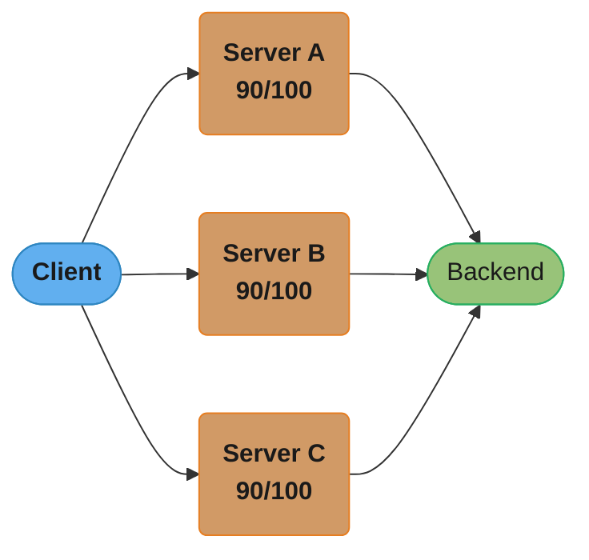

Each server tracks its own local counter against the same 100/min limit; a client load-balanced across all three effectively gets 270 requests through — 2.7x the intended cap.

### Solutions

#### 1. Centralized Redis (Recommended)

All API servers share a single Redis instance for rate limiting state. Redis is ideal because:
- Single-threaded atomic operations prevent race conditions
- Sub-millisecond latency (in-memory)
- Built-in TTL for automatic counter expiry
- Lua scripts for atomic read-modify-write

**Redis + Lua Script (Atomic Increment)**

```lua
-- KEYS[1] = rate limit key (e.g., "rl:user:123:1700000060")
-- ARGV[1] = limit
-- ARGV[2] = window TTL in seconds
-- Returns: 1 if allowed, 0 if rate limited

local key = KEYS[1]
local limit = tonumber(ARGV[1])
local ttl = tonumber(ARGV[2])

local count = redis.call('INCR', key)
if count == 1 then
    redis.call('EXPIRE', key, ttl)
end

if count <= limit then
    return 1  -- allowed
else
    return 0  -- rate limited
end
```

```python
# Application code
def is_allowed(client_id: str, limit: int, window: int) -> bool:
    now = int(time.time())
    window_key = int(now / window) * window
    key = f"rl:{client_id}:{window_key}"

    result = redis_client.eval(lua_script, 1, key, limit, window)
    return result == 1
```

#### 2. Local + Periodic Sync

Each server keeps a local counter and periodically syncs with a central store. This reduces Redis load at the cost of slight over-counting.

- Trade-off: allows some over-limit requests in the sync interval
- Useful when Redis latency is a concern or for high-throughput scenarios
- Each server "reserves" a chunk of quota from the central store

#### 3. Sticky Sessions

Route each client to the same server (via consistent hashing on client ID). That server owns the client's rate limit state locally.

- Pro: no external dependency for rate limiting
- Con: server failure loses state; uneven load distribution

#### 4. API Gateway Layer

Move rate limiting entirely to the API Gateway (Kong, AWS API Gateway, Nginx). The gateway is the single entry point and can maintain state centrally.

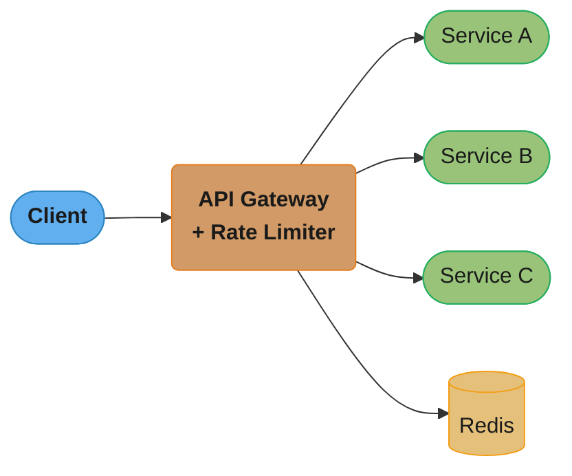

The gateway is the single chokepoint: it checks Redis once per request, then fans out to whichever service the route targets. This is the most common production architecture. The gateway handles:
- Rate limit checks (Redis-backed)
- Response headers (X-RateLimit-*)
- 429 responses with Retry-After

---

## 5. Architecture Diagrams

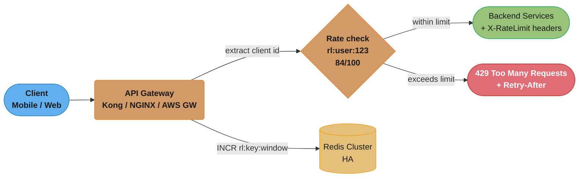

The gateway extracts the client ID, increments the count in Redis, and branches on the result: within limit forwards to the backend with rate-limit headers attached, over limit returns 429 with `Retry-After`.

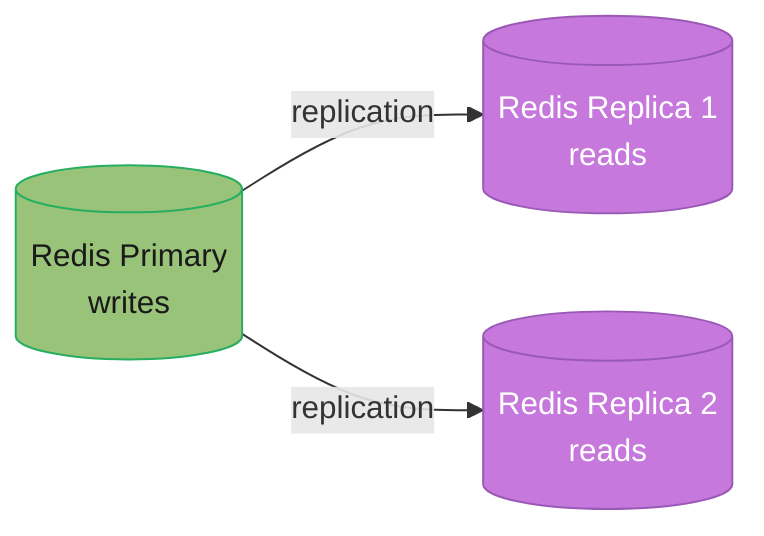

Writes always go to the primary; reads can be served from either replica. Redis Sentinel or Cluster promotes a replica to primary automatically on failure.

### Where Rate Limiting Lives in the Request Path

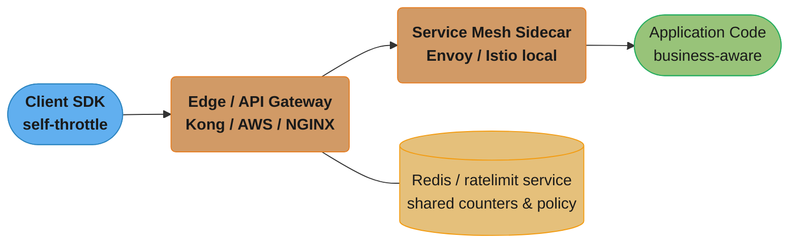

Each layer can reject early (saving downstream resources) or pass through with headers for the next layer to make a finer decision. Most production systems combine at least two of these layers.

---

## 6. How It Works — Detailed Mechanics

### Rate Limiting Headers

Standard headers clients should receive so they can back off gracefully:

```
HTTP/1.1 200 OK
X-RateLimit-Limit: 100          # Total requests allowed in window
X-RateLimit-Remaining: 42       # Requests remaining in current window
X-RateLimit-Reset: 1700000120   # Unix timestamp when window resets
X-RateLimit-Window: 60          # Window size in seconds

# When rate limited (HTTP 429):
HTTP/1.1 429 Too Many Requests
Retry-After: 30                  # Seconds until client can retry
X-RateLimit-Limit: 100
X-RateLimit-Remaining: 0
X-RateLimit-Reset: 1700000120
Content-Type: application/json

{
  "error": "rate_limit_exceeded",
  "message": "Too many requests. Retry after 30 seconds.",
  "retry_after": 30
}
```

**Why these headers matter:**
- Clients can implement exponential backoff using `Retry-After`
- Monitoring systems can track `X-RateLimit-Remaining` trends
- Well-behaved SDK clients automatically throttle before hitting limits

---

### Rate Limiting Dimensions

Rate limiting can be applied at multiple granularities:

| Dimension | Key | Use Case | Example |
|-----------|-----|----------|---------|
| IP Address | `rl:ip:1.2.3.4` | DDoS, anonymous abuse | Block scrapers |
| User ID | `rl:user:u123` | Per-account fairness | API tier limits |
| API Key | `rl:key:abc123` | B2B API metering | Partner quotas |
| Route | `rl:route:/search` | Protect expensive endpoints | Search rate limit |
| Tenant | `rl:tenant:acme` | Multi-tenancy SLAs | Enterprise vs. free |
| Global | `rl:global` | System capacity cap | Total QPS ceiling |

### Multi-Tenancy Example

```
Tier       | Requests/min | Burst | Monthly Quota
-----------|--------------|-------|---------------
Free       | 60           | 10    | 10,000
Pro        | 600          | 100   | 500,000
Enterprise | 6,000        | 1,000 | Unlimited
```

**Key design decision:** Use composite keys to apply multiple limits simultaneously.

```python
# A single request might check multiple limits:
checks = [
    f"rl:ip:{client_ip}",          # IP-level limit (anti-abuse)
    f"rl:user:{user_id}",          # User-level limit (fairness)
    f"rl:tenant:{tenant_id}",      # Tenant-level limit (SLA)
    f"rl:route:{route}:{user_id}", # Route-specific limit
]
# ALL must pass for the request to be allowed
```

---

## 7. Real-World Examples

### Twitter / X API
- Standard: 300 requests per 15-minute window per endpoint
- Headers: `x-rate-limit-limit`, `x-rate-limit-remaining`, `x-rate-limit-reset`
- Different limits per endpoint (timeline vs. search vs. streaming)
- App-level limits separate from user-level limits

### GitHub API
- Unauthenticated: 60 requests/hour per IP
- Authenticated: 5,000 requests/hour per user
- Search API: 10 requests/minute (more expensive)
- GraphQL: 5,000 points/hour (complexity-weighted)

### Stripe
- Test mode: 100 reads/sec, 100 writes/sec
- Live mode: higher limits based on account history
- Uses Token Bucket internally
- Returns `429 Too Many Requests` with `Retry-After`

### AWS API Gateway
- Default: 10,000 requests/sec with burst of 5,000
- Per-stage and per-client (API key) throttling
- Usage Plans define rate + quota per API key
- Uses Token Bucket algorithm

### OpenAI API
- Rate limits by tokens per minute (TPM) and requests per minute (RPM)
- Different limits per model (GPT-4 vs. GPT-3.5)
- Organization-level limits

---

## 8. Tradeoffs

### Algorithm Comparison

| Algorithm | Burst Handling | Memory / Key | Accuracy | Implementation Complexity | Best For |
|-----------|----------------|--------------|----------|---------------------------|----------|
| Token Bucket | Up to bucket capacity | O(1) — 2 fields | Exact (within refill granularity) | Low-Medium | Bursty client traffic, public APIs |
| Leaky Bucket | None — smooths to constant rate | O(1) — queue size or counter | Exact | Low-Medium | Traffic shaping in front of fragile downstreams |
| Fixed Window Counter | Up to 2x at window boundary | O(1) — 1 counter | Approximate (boundary flaw) | Very Low | Coarse, low-stakes limits where simplicity wins |
| Sliding Window Log | None (precise) | O(N) — 1 timestamp/request | Exact | Medium | Low-volume, compliance-sensitive limits |
| Sliding Window Counter | Bounded, no 2x spike | O(1) — 2 counters | ~99% accurate (uniform-traffic assumption) | Medium | High-volume APIs needing accuracy + low memory (most production systems) |

The table above lists each algorithm's burst handling and complexity separately; plotting them together shows the actual tradeoff space you're choosing from:

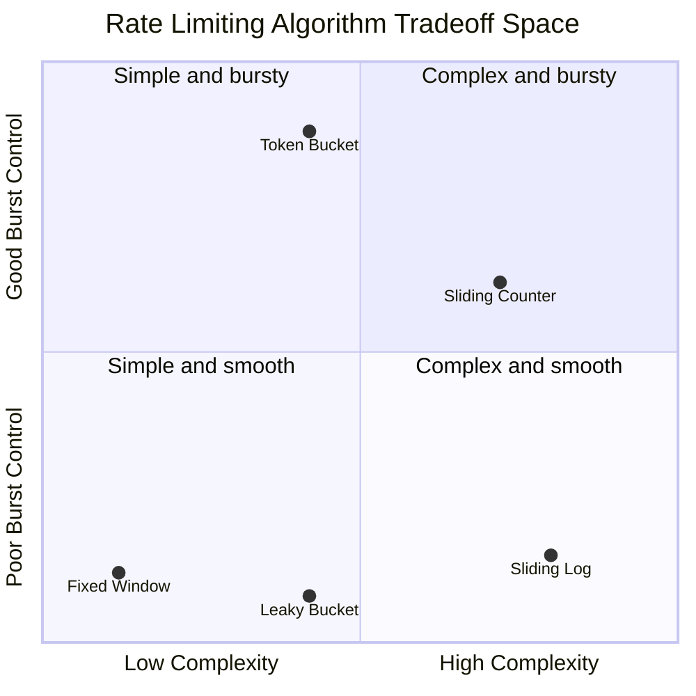

Token Bucket and Sliding Window Counter sit in the upper half because they tolerate bursts; Fixed Window's apparent simplicity comes at the cost of the worst burst control (the 2x boundary spike from §3); Sliding Window Log buys exactness with the most memory and no burst allowance at all.

### Distributed Enforcement Strategy Comparison

| Strategy | Consistency | Latency Added | Operational Cost | Failure Mode |
|----------|-------------|----------------|-------------------|--------------|
| Centralized Redis (Lua) | Strong (atomic) | +0.5-1 ms per request | Redis cluster to operate | Redis down → must choose fail-open/fail-closed |
| Local + periodic sync | Eventually consistent | ~0 ms (local) | Low — async background sync | Temporary over-limit during sync interval |
| Sticky sessions (consistent hashing) | Strong per-node | ~0 ms (local) | Load balancer config | Node failure loses that node's client state |
| API Gateway layer | Strong (single chokepoint) | +0.5-1 ms (gateway hop) | Gateway licensing/scaling | Gateway becomes a SPOF if not HA |

---

## 9. When to Use / When NOT to Use

### When to Use

- **Public-facing APIs** — any API consumed by external clients (partners, third-party developers, mobile apps) needs rate limiting so a single integration bug can't degrade service for everyone.
- **Multi-tenant SaaS platforms** — to enforce per-tenant SLA tiers (Free vs. Pro vs. Enterprise) and prevent noisy-neighbor effects.
- **In front of cost-bearing third-party dependencies** — LLM APIs, SMS gateways, payment processors — where unbounded calls translate directly into unbounded cost.
- **Protecting expensive endpoints** — search, report generation, bulk export, and other operations with disproportionate resource cost relative to simple CRUD.
- **Authentication endpoints** — to slow down credential-stuffing and brute-force attacks (combined with account lockout and CAPTCHA).
- **Internal service-to-service calls during incidents** — a downstream slowdown can trigger a retry storm from upstream callers; rate limiting at ingress breaks this feedback loop.

### When NOT to Use (or Not Sufficient Alone)

- **As a substitute for authentication/authorization** — rate limiting controls *volume*, not *identity* or *permission*. An attacker with a valid (if low) quota can still attempt unauthorized actions within that quota.
- **As the sole defense against application-layer DDoS** — a botnet with thousands of distinct IPs/accounts, each staying under its individual limit, can still aggregate to an overwhelming volume. This requires WAF rules, bot detection, and anomaly-based blocking in addition to per-client limits.
- **As a substitute for capacity planning** — rate limiting protects against *abuse*, not against *underprovisioning*. If normal expected load exceeds infrastructure capacity, the fix is autoscaling/capacity, not a tighter limit on legitimate users.
- **When limits are set so high they never trigger** — a rate limiter configured far above realistic usage adds latency and operational complexity for no protective benefit, while creating a false sense of security.
- **For fine-grained, business-aware throttling decisions** — "allow this user one more request because they're mid-checkout" requires application-level logic, not a generic gateway-level rate limiter.

---

## 10. Common Pitfalls

**1. Per-instance counters in a horizontally scaled deployment**
*Broken:* Each of N API server instances runs its own in-memory counter for a "100 requests/minute" limit. A client load-balanced across all N instances effectively gets `100 x N` requests/minute — at N=10, a 100/min limit becomes a 1000/min limit.
*Fix:* Use a centralized store (Redis) for the counter, or explicitly divide the limit by N for per-instance local enforcement (`limit / N`) as a fallback.

**2. The fixed-window boundary spike**
*Broken:* A "100 req/min" fixed window allows 100 requests at 00:59 and another 100 at 01:00 — 200 requests in a 2-second span, double the intended rate.
*Fix:* Use Sliding Window Counter (or Sliding Window Log for exactness) instead of Fixed Window Counter for any limit where boundary gaming matters.

**3. Clock skew across distributed rate-limit nodes**
*Broken:* Each API server computes token-bucket refill using its own local clock. A 500ms drift between nodes causes buckets to "refill in the past" on lagging nodes, silently inflating the effective limit by ~10% on a 1000/min bucket.
*Fix:* Use the rate-limit store's clock as the single source of truth (e.g., Redis `TIME` command) rather than each caller's wall clock.

**4. No defined behavior when the rate limiter's own dependency fails**
*Broken:* The Redis instance backing the rate limiter goes down. The rate-limit check throws an exception, and the API gateway returns 500 to *every* request — a rate-limiter outage becomes a full API outage.
*Fix:* Wrap the rate-limit check in a timeout + circuit breaker. Decide explicitly: fail-open (allow traffic, log for post-hoc analysis — appropriate when availability matters more than strict enforcement, e.g. payments) or fail-closed (reject traffic — appropriate when unmetered access is dangerous, e.g. auth endpoints).

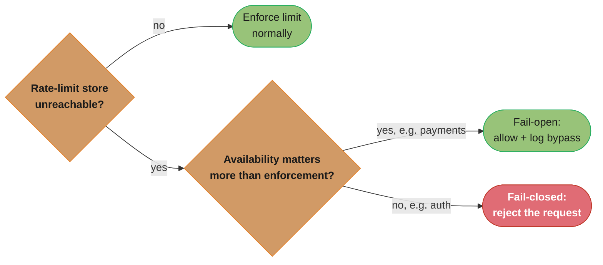

Stripe's own case study (§14) chooses fail-open — payment availability outweighs brief unmetered traffic — while an authentication endpoint should fail-closed instead, since unmetered access there is the more dangerous failure.

**5. Shared quota across logically distinct clients**
*Broken:* A platform issues one API key per top-level account, but that account has 1,000 sub-merchants making calls under it. One misbehaving sub-merchant exhausts the shared bucket, blocking all 999 others.
*Fix:* Key the rate limiter at the actual unit of isolation (per sub-merchant, per integration), with an optional higher-level aggregate limit for billing visibility — not for throttling.

**6. Missing or unhelpful 429 responses**
*Broken:* A rate-limited request returns a bare `429` with no `Retry-After` header. Clients without a backoff strategy retry immediately, creating a thundering herd that keeps the limit perpetually exceeded.
*Fix:* Always include `Retry-After`, `X-RateLimit-Limit`, `X-RateLimit-Remaining`, and `X-RateLimit-Reset`. Well-built SDKs use these to implement exponential backoff with jitter automatically.

---

## 11. Technologies & Tools

| Tool / Library | Algorithm(s) | Layer | Notes |
|-----------------|-------------|-------|-------|
| **Redis** (`INCR`+`EXPIRE`, or Lua scripts) | Fixed window, token bucket, sliding window counter | Shared state store, any layer | The de facto standard for distributed rate limiting; single-threaded atomicity makes Lua scripts race-free |
| **Envoy / Lyft `ratelimit`** | Generic, descriptor-based | Service mesh sidecar / gateway | gRPC rate-limit service called per-request; widely used at Lyft, Stripe, and inside Istio |
| **Kong API Gateway** (rate-limiting plugin) | Fixed window, sliding window | API gateway | Per-consumer, per-route limits with Redis or cluster-wide policy stores |
| **AWS API Gateway** (Usage Plans) | Token bucket | Managed gateway | Per-API-key throttle (steady-state rate) + burst (bucket capacity) configured declaratively |
| **NGINX** (`limit_req` module) | Leaky bucket | Edge / reverse proxy | `limit_req zone=... burst=... nodelay;` — classic edge-layer traffic shaping |
| **Resilience4j `RateLimiter`** | Fixed window-ish (permits per period) | Java application code | In-process; pairs naturally with Resilience4j CircuitBreaker for layered resilience |
| **Guava `RateLimiter`** | Token bucket (with "warm-up" period) | Java application code | Smooths sudden load spikes after idle periods via a warm-up ramp |
| **Bucket4j** | Token bucket | Java, distributed via JCache/Redis/Hazelcast | Distributed token buckets with pluggable backends; popular for Spring Boot APIs |
| **Istio (Envoy-based mesh)** | Local + global descriptors | Service mesh | Local rate limiting per-pod (no extra hop) plus global limits via the `ratelimit` service |

> See [`spring/spring_cloud_patterns`](../../spring/spring_cloud_patterns/) for Spring-specific rate limiter integration and [`backend/rate_limiting_in_depth`](../../backend/rate_limiting_in_depth/) for production Redis/Lua implementations referenced throughout this module.

---

## 12. Interview Questions with Answers

**Q1: What is the difference between Token Bucket and Leaky Bucket?**

A: Token Bucket allows bursting — tokens accumulate when idle, enabling short bursts above average rate. Leaky Bucket enforces a strict constant output rate regardless of input pattern. Token Bucket is better for APIs where users need burst capacity; Leaky Bucket is better for traffic shaping where downstream systems need steady input.

**Q2: How would you implement rate limiting in a distributed system with 10 API servers?**

A: Use a centralized Redis instance. Each API server runs a Lua script that atomically increments a counter and checks against the limit. The key includes client ID and time window. Redis's single-threaded model ensures no race conditions. For high availability, use Redis Sentinel or Cluster with replication.

**Q3: What is the boundary spike problem in Fixed Window Counter?**

A: If a window is 1 minute, a client can send 100 requests at 00:59 and 100 more at 01:00. Both windows see 100 requests (within limit), but in the 2-second boundary period, 200 requests were processed — twice the intended rate. Sliding window approaches solve this.

**Q4: How does the Sliding Window Counter avoid the boundary spike while being memory efficient?**

A: It uses the formula: `rate = curr_count + prev_count * (1 - elapsed/window_size)`. It only stores 2 counters per client (current and previous window counts), unlike Sliding Window Log which stores every timestamp. The approximation is accurate within ~1% for uniform traffic.

**Q5: How do you handle the "celebrity problem" in rate limiting?**

A: A celebrity's posts trigger massive fan request spikes. Solutions: (1) pre-warm caches before scheduled events, (2) apply higher limits to verified accounts, (3) use adaptive rate limiting that temporarily raises limits for legitimate viral spikes, (4) apply rate limits on the content resource, not just the requester.

**Q6: What HTTP status code should a rate-limited request return?**

A: HTTP 429 Too Many Requests (RFC 6585). The response should include a `Retry-After` header indicating when the client can retry. Some systems use 503 Service Unavailable, but 429 is the standard and more informative.

**Q7: How would you rate limit by both IP and User ID simultaneously?**

A: Check both limits and reject if either is exceeded. Use separate Redis keys: `rl:ip:{ip}:{window}` and `rl:user:{uid}:{window}`. A single request decrements both counters. This prevents both anonymous abuse (IP limit) and authenticated abuse (user limit).

**Q8: What are the tradeoffs between rate limiting at the API Gateway vs. at the application level?**

A: Gateway-level: centralized, no code changes per service, enforced before request hits application, but less context (can't rate limit based on business logic). Application-level: full context available, can make business-aware decisions, but duplicated logic across services and requests hit application before being rejected.

**Q9: How does Redis help implement atomic rate limiting?**

A: Redis is single-threaded, so its commands are inherently atomic. Using INCR + EXPIRE in a Lua script ensures the increment and TTL-setting happen atomically without another client seeing an intermediate state. Without atomicity, two simultaneous requests could both read count=99, both increment to 100, and both be allowed when only one should be.

**Q10: How would you design rate limiting for a GraphQL API where queries have variable cost?**

A: Implement cost-based rate limiting. Assign a complexity score to each query (e.g., fetching a list of 100 items = 10 points, nested relations add more). Each client has a points budget per window. Track `used_points` instead of `request_count` in Redis. Reject queries that would exceed the budget before executing them.

**Q11: What is the difference between rate limiting and throttling?**

A: Rate limiting rejects excess requests (hard cap — 429 response). Throttling degrades service for excess requests — slows them down, queues them, or returns partial results. Rate limiting protects the system; throttling tries to serve everyone at reduced quality.

**Q12: How would you implement graceful degradation when the Redis rate limiter is down?**

A: Use a circuit breaker around the Redis call. Options: (1) fail open — allow all traffic when Redis is unavailable (risky but maintains availability), (2) fail closed — reject all traffic (too strict), (3) fall back to local in-memory rate limiting with conservative limits. Option 3 is usually best — each server enforces limit/N where N is server count.

---

## Cross-Perspective: LLD Connections

**LLD View — Design Patterns That Implement Rate Limiting**

- **Strategy** — Rate limiting algorithms (token bucket, leaky bucket, fixed window, sliding window, sliding window log) are interchangeable Strategy implementations behind a `RateLimitingStrategy` interface. The algorithm can be configured per-client tier, per-endpoint, or per-API key.
- **Decorator** — Rate limiting is applied as a Decorator wrapping service handlers: the rate limit check executes before delegating to the actual handler, transparently enforcing quotas without modifying business logic.
- **Chain of Responsibility** — In an API gateway, rate limiting is one middleware link: auth → rate limit → validation → business logic. Each handler decides to process, reject (429), or forward to the next link.
- **Singleton** — The token bucket / sliding window counter store (backed by Redis or in-memory `AtomicLong`) is managed by a Singleton `RateLimiterRegistry`, shared across all request-handling threads.

---

## 13. Best Practices

### 1. Graceful Degradation
Never make your rate limiter a hard single point of failure. If Redis goes down, fall back to local rate limiting rather than allowing all traffic or rejecting all traffic.

### 2. Differentiate by Tier
Not all clients are equal. Define multiple rate limit tiers and apply them based on subscription, authentication status, or client type:
- Unauthenticated < Authenticated Free < Paid < Enterprise
- Read endpoints vs. write endpoints (writes are usually more restricted)
- Expensive operations (search, export) vs. cheap operations (status check)

### 3. Per-Endpoint Limits
Global limits are a blunt instrument. Apply specific limits to expensive endpoints (search, report generation, bulk operations) that consume disproportionate resources.

### 4. Use Retry-After Consistently
Always include `Retry-After` in 429 responses. This enables well-behaved clients to implement exponential backoff and avoid hammering the system during recovery.

### 5. Monitor and Alert
Track these metrics:
- Rate limit hit rate per client/endpoint
- `X-RateLimit-Remaining` distribution (clients hovering near 0 are at risk)
- Redis latency for rate limit checks
- False positive rate (legitimate users being blocked)

### 6. Whitelist Internal Services
Internal service-to-service calls should bypass or get much higher rate limits. Use API key classification to identify internal callers.

### 7. Shard Redis for High Traffic
For very high QPS, shard the rate limiting Redis by client ID range to distribute load across multiple Redis instances.

### 8. Test Boundary Conditions
Always test:
- Requests at exactly the limit
- Requests at limit +1
- Concurrent requests that race to the limit
- Window boundary behavior

### 9. Communicate Limits Clearly in Documentation
Developers integrating with your API need to know limits upfront. Document per-endpoint limits, burst allowances, and quota reset schedules clearly.

### 10. Consider Client-Side Rate Limiting
Provide SDK helpers that track and respect rate limits proactively, sending `X-RateLimit-Remaining` values to application code so clients can self-throttle before hitting 429s.

---

**Cross-references:** [backend/rate_limiting_in_depth](../../backend/rate_limiting_in_depth/) (production implementation: Redis Lua scripts, sliding-window counters, header conventions), [llm/token_economics_and_cost_optimization](../../llm/token_economics_and_cost_optimization/) (token-bucket rate limiting for LLM API quotas).

---

## 14. Case Study: Stripe API Rate Limiting with Redis Token Bucket

### Problem Statement

Stripe processes payments and exposes a public REST API used by millions of integrations. Rate limiting must protect the platform from abuse and from accidental client bugs (runaway loops, retry storms) while not blocking legitimate bursty traffic. Scale:

- Total API calls: 5M/day baseline, 50M/day during shopping holidays
- API keys: ~500k active across all merchants
- Requests/sec global: 60 baseline, 600 peak (Black Friday)
- Per-key limit: 1000 requests/minute (default), customizable per customer tier
- Rate-limit check overhead budget: < 1 ms (so it never dominates a 30 ms API call)
- Availability: 99.99% — rate limiter outage must not block API requests (fail-open with logging)
- Distributed across 3 datacenters, requests can land on any of them

The mechanism: a token bucket per API key per endpoint stored in Redis. A Lua script executes atomically (single Redis command) to refill and decrement, so two concurrent requests cannot both consume the last token.

### Architecture Overview

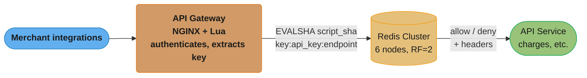

Sharded by API key hash across 6 nodes (RF=2) — e.g. `key:sk_live_abc:charges` maps to node 2 — so the Lua token-bucket script executes atomically on whichever shard owns that key.

### Key Design Decisions

1. **Token bucket over sliding window** — Token bucket allows burst up to capacity (good UX for legitimate bursty workloads like batch invoicing) and uses constant memory per key. Sliding window log uses O(N) memory per key (one entry per request).
   - *Alternative rejected*: fixed window — allows 2x bursts at boundaries (1000 at 0:59 + 1000 at 1:00).

2. **Redis Lua for atomicity** — A single Lua script reads bucket state, refills based on elapsed time, decrements, and writes back — atomically. Avoids MULTI/EXEC transactions and the race conditions of GET-then-SET.
   - *Alternative rejected*: WATCH + MULTI — works but adds round-trips and retry logic.

3. **API-key-level limits, not IP** — Stripe customers (e.g., Shopify) front many merchants behind one IP/load balancer. IP-based limits would penalize big customers and miss attackers using rotating IPs.

4. **Per-endpoint limits** — POST /charges (expensive) limited to 100/min; GET /charges (cheap, read-replica) at 1000/min; webhooks unlimited. Keys are `<api_key>:<endpoint_class>` so a noisy GET loop doesn't starve a critical POST.

5. **429 response with `Retry-After` header** — Clients know exactly when to retry. SDKs auto-retry with exponential backoff. Also include `X-RateLimit-Limit`, `X-RateLimit-Remaining`, `X-RateLimit-Reset` so well-behaved clients self-throttle.

6. **Sharded Redis cluster on API key hash** — Spreads load across 6 nodes. A single rogue key cannot saturate one Redis instance (only consumes that shard's CPU, ~16% of total).

7. **Fail-open on Redis outage** — If Redis is unreachable for > 100 ms, the limiter allows the request and logs the bypass. Rationale: payment availability matters more than enforcing limits during a Redis incident; Stripe can detect abuse post-hoc.

### Implementation

Token bucket Lua script (executed via `EVALSHA`):

```lua
-- KEYS[1] = bucket key (e.g., "rl:sk_live_abc:charges")
-- ARGV[1] = capacity (tokens)
-- ARGV[2] = refill_rate (tokens per second)
-- ARGV[3] = now_ms (server time from redis.call('TIME'))
-- ARGV[4] = requested tokens (usually 1)

local key       = KEYS[1]
local capacity  = tonumber(ARGV[1])
local rate      = tonumber(ARGV[2])
local now_ms    = tonumber(ARGV[3])
local requested = tonumber(ARGV[4])

local bucket = redis.call('HMGET', key, 'tokens', 'last_refill')
local tokens      = tonumber(bucket[1]) or capacity
local last_refill = tonumber(bucket[2]) or now_ms

-- Refill based on elapsed time
local elapsed_sec = (now_ms - last_refill) / 1000.0
tokens = math.min(capacity, tokens + elapsed_sec * rate)

local allowed = 0
local retry_after_ms = 0
if tokens >= requested then
    tokens = tokens - requested
    allowed = 1
else
    retry_after_ms = math.ceil((requested - tokens) / rate * 1000)
end

redis.call('HMSET', key, 'tokens', tokens, 'last_refill', now_ms)
redis.call('PEXPIRE', key, 120000)  -- evict idle keys after 2 min

return {allowed, math.floor(tokens), retry_after_ms}
```

Java caller using Lettuce/Jedis:

```java
public RateLimitResult check(String apiKey, String endpoint) {
    String key = "rl:" + apiKey + ":" + endpoint;
    EndpointPolicy p = policies.get(endpoint);

    long[] time = jedis.time();  // Redis server time for clock-skew safety
    long nowMs = time[0] * 1000L + time[1] / 1000L;

    List<Long> result = (List<Long>) jedis.evalsha(
        SCRIPT_SHA,
        List.of(key),
        List.of(String.valueOf(p.capacity),
                String.valueOf(p.refillPerSec),
                String.valueOf(nowMs),
                "1"));

    return new RateLimitResult(
        result.get(0) == 1L,
        result.get(1).intValue(),
        result.get(2).intValue());
}
```

NGINX response wiring:

```
location /v1/ {
    access_by_lua_block { ratelimit.check_or_429() }
    proxy_set_header X-RateLimit-Limit     $rl_limit;
    proxy_set_header X-RateLimit-Remaining $rl_remaining;
    proxy_pass http://api_upstream;
}
```

### Tradeoffs

| Approach | Burst handling | Memory/key | Atomicity | Best for |
|----------|---------------|-----------|-----------|----------|
| Token bucket (chosen) | Up to capacity | O(1) — 2 fields | Lua atomic | Bursty APIs |
| Leaky bucket | Smoothed only | O(1) | Lua atomic | Constant-rate flows |
| Sliding window log | Exact | O(N) per window | ZADD/ZREMRANGEBYSCORE | Compliance audit |
| Fixed window counter | 2x burst at boundary | O(1) | INCR (atomic) | Coarse limits |

### Metrics & Results

- p50 rate-limit check: 0.4 ms; p99: 0.9 ms (SLA: < 1 ms)
- Throughput: 8k checks/sec sustained per Redis shard; 48k cluster-wide
- 99.93% of legitimate requests succeed without 429s (per Stripe public data)
- During Black Friday 2024: peak 600 req/sec, zero rate-limiter incidents
- Memory per active key: ~80 bytes; 500k keys × 80 = 40 MB per shard
- Cost: ~$1,200/month for 6× cache.r6g.large Redis nodes
- Mean time to detect abuse (post-rate-limit alert): 8 min

### Common Pitfalls / Lessons Learned

1. **Rate limiting at the app layer instead of the edge** — Broken: early implementation ran rate limit checks inside the Java API server. A 100k req/sec DDoS still hit the app servers (and the Redis check itself), driving CPU to 100%. Fix: moved the rate-limit check into NGINX/OpenResty at the edge; bad traffic gets 429 before reaching app servers. App CPU during attacks dropped 95%.

2. **Shared bucket across all of a customer's API keys** — Broken: Shopify generates a key per merchant (~1M keys). A single misbehaving merchant's integration consumed the shared bucket, blocking all other merchants for the parent account. Fix: per-key limits by default, with optional account-level shared quota for billing/visibility but not throttling.

3. **Clock skew between rate-limit nodes** — Broken: API servers in 3 datacenters each used their local clock when computing the bucket refill. Clock drift of 500 ms caused buckets to "refill in the past" on some nodes, granting extra tokens. Effective limit became ~1100/min instead of 1000. Fix: always pass `redis.call('TIME')` as the timestamp; Redis is the single source of time truth for all buckets.

4. **No fail-open behavior on Redis outage** — Broken: when Redis became unreachable, the rate limiter threw exceptions and the API gateway returned 500 to every request. A 30-second Redis blip caused a 30-second total API outage. Fix: wrap rate-limit check with a 100 ms timeout + fallback that allows requests and logs `rate_limiter_bypassed`. Post-incident analysis covers any abuse during the bypass window.

### Interview Discussion Points

**Q1: Why use Lua scripting in Redis for rate limiting?**
Lua scripts execute atomically on the Redis single thread — no interleaving with other commands. This means a check-and-decrement is one indivisible operation, eliminating the race condition where two concurrent requests both see the last token available. Without Lua, you'd need MULTI/EXEC with WATCH + retry loops, adding round-trips and complexity.

**Q2: How does the token bucket handle bursts vs sustained traffic?**
The bucket holds up to `capacity` tokens (e.g., 1000). A client that's been idle has a full bucket and can burst 1000 requests instantly. Sustained traffic is throttled to `refill_rate` (e.g., 1000/60 = 16.67/sec). This matches real API usage patterns: idle SDKs occasionally burst, abusers send steady high-rate traffic.

**Q3: Why per-endpoint limits rather than one global limit per key?**
Different endpoints have different costs and abuse potential. POST /charges hits payment processors (real money, fraud risk); GET /charges hits a read replica (cheap). One global limit forces tradeoffs: low enough to protect /charges throttles legitimate read traffic; high enough for reads enables charge abuse. Per-endpoint lets you tune each.

**Q4: How do you handle a customer who legitimately needs more than the default limit?**
Stripe exposes higher tiers (Enterprise) with custom `capacity` and `refill_rate` stored in a per-key policy table loaded into Redis at the start of each request. The policy is also cached in-process for ~30 seconds to avoid lookup overhead. Self-service quota requests are processed via a Slack-integrated approval workflow.

**Q5: What's the difference between rate limiting and throttling?**
Rate limiting hard-rejects requests above the limit (429 response). Throttling queues or slows requests but eventually serves them. Stripe uses hard rate limiting because queueing payment requests can cause client timeouts and duplicate charges (the client retries while the queued request is still pending). For lower-stakes APIs (e.g., metrics ingestion), throttling can be appropriate.

**Q6: How would you detect abuse despite the rate limiter?**
Look for patterns the limiter doesn't catch: 429-rate spikes per key (someone is hammering against the limit), distribution of requests across endpoints (an actor probing the API), geographic anomalies (key suddenly used from a new country), and request payload similarity (replay attacks). Feed these into a fraud detection pipeline that can revoke keys or apply stricter limits.

**Q7: Why fail-open instead of fail-closed when Redis is down?**
For Stripe specifically, payment availability outweighs the risk of brief unmetered traffic. A 30-second Redis outage at fail-closed = 30 seconds of failed payments globally = millions in lost merchant revenue. Fail-open = potential overuse by a small number of clients, detectable and recoverable post-hoc. For systems where abuse is more harmful than unavailability (e.g., authentication endpoints), fail-closed is correct.
