# Resilience Patterns

## 1. Concept Overview

**Resilience** is the property that lets a system continue operating — possibly in a degraded mode — when one or more of its dependencies are slow, erroring, or completely unavailable. A payment service that depends on a third-party fraud-check API doesn't get to choose whether that API has a bad day; it only gets to choose **how it behaves when it does**.

This is a different concern from **high availability and redundancy** (covered in [Scalability](../scalability/README.md) and [Load Balancing](../load_balancing/README.md)). HA answers "how do we have enough healthy replicas that one instance dying doesn't take down the service?" Resilience patterns answer a narrower, complementary question: **given that a call to *some* dependency — possibly one you don't control, possibly one with its own redundancy already — is currently failing or slow, how does the calling code avoid making things worse, both for itself and for everything else sharing its resources?**

Every HLD case study's "Step 5: Wrap Up" (per [hld/README.md](../README.md)) includes a failure-mode discussion — "what happens when the recommendation service is down?", "what if the database read replica falls behind?", "how do you handle a slow third-party API?" This module is the toolkit for answering those questions concretely: timeouts, retries with backoff and jitter, circuit breakers, bulkheads, graceful degradation, and load shedding. None of these patterns make a dependency more available — they control the **blast radius** of that dependency's unavailability on everything that calls it.

The central theme that ties every pattern in this module together: **a fast, controlled, partial failure now is always better than a slow, uncontrolled, total failure later.** Cascading failure — where one struggling component takes down its callers, which take down *their* callers, until the whole system is down — is the failure mode every pattern here exists to prevent.

---

## 2. Intuition

> **One-line analogy**: A circuit breaker is exactly what its name says — an electrical breaker in your house. When one faulty appliance starts drawing too much current, the breaker for *that circuit* trips, cutting power to that one circuit so the fault doesn't start a fire that burns down the whole house. The lights in the rest of the house stay on. You don't need to understand what's wrong with the appliance to know that *isolating it immediately* was the right call.

**Mental model — bulkheads**: A ship's hull is divided into watertight compartments. If one compartment floods (a hull breach), the bulkhead doors seal it off — that compartment fills with water and is "lost," but the ship doesn't sink, because the flooding can't spread to the other compartments. Applied to software: if your `recommendations-service` call is made from the same shared thread pool as your `checkout` and `search` calls, and `recommendations-service` starts taking 30 seconds per call instead of 50ms, every thread in that shared pool eventually gets stuck waiting on `recommendations-service` — and now `checkout` and `search`, which have nothing to do with recommendations, are also down. A bulkhead gives `recommendations-service` calls their *own* pool of threads/connections, sized so that even if all of them are stuck, `checkout` and `search` still have their own pools free to keep working.

**Why it matters**: Without these patterns, the *default* behavior of most network clients is the worst possible one — wait indefinitely for a response (no timeout), and if you decide to retry, retry immediately and as many times as you like (no backoff, no limit). Both defaults turn a transient, localized problem into a systemic one. A 2-second slowdown in one downstream service, with no timeout, becomes a 2-second-per-request pile-up in every caller's thread pool — which, if the pool has 50 threads and requests arrive faster than every 40ms, exhausts the pool in under a second.

**Key insight — "fail fast and isolate" is the strategy, not a fallback to it**: It's tempting to think of these patterns as a last resort — "normally we just call the service, and *if* something goes wrong, *then* we fall back to the circuit breaker." That's backwards. The decision to time out aggressively, to isolate this dependency's resources from everything else's, and to stop calling a dependency the moment it looks unhealthy *is itself the resilience strategy*. The goal isn't "never let a dependency fail" (impossible) — it's "make every dependency failure small, fast, and contained, every single time, by design."

---

## 3. Core Principles

**1. Every external call needs a timeout — no exceptions.**
A network call without a timeout doesn't mean "it will eventually fail if something's wrong" — TCP connections can sit half-open for the OS default (often hours) with no data flowing. No timeout means the calling thread, and whatever resource it's holding (a connection, a lock, a slot in a thread pool), is held **for as long as the dependency takes to respond — which, for a hung dependency, is forever.** This is the single most common root cause of cascading failure (§10, War Story 1).

**2. Retries need exponential backoff *and* jitter — and only for idempotent operations.**
Backoff alone (retry after 100ms, then 200ms, then 400ms...) spaces out *one client's* retries, but if 10,000 clients all experienced the same failure at the same instant, they all back off in lockstep and all retry at the same instant again — a synchronized wave of load that looks identical to the original spike, just delayed. **Jitter** (randomizing the delay) desynchronizes those clients. Separately, retrying is only safe if the operation is **idempotent** — repeating it produces the same effect as doing it once. "Charge this card $50" is not naturally idempotent; retrying a timed-out charge can double-charge the customer unless the operation uses an idempotency key. See [Distributed Transactions §4.6](../distributed_transactions/README.md) for the idempotency-key pattern that makes retries safe.

**3. Bulkheads isolate resource pools per dependency.**
Give each downstream dependency (or each *class* of dependency, grouped by criticality and latency profile) its own pool of threads, connections, or concurrent-request slots. A dependency that becomes slow can exhaust *its own* pool — and every caller waiting on that pool gets a fast failure once it's full — without touching the pools used for calls to healthy dependencies.

**4. Circuit breakers stop calling a dependency that's already failing.**
Once a dependency's failure rate crosses a threshold, a circuit breaker "opens" — for a cooldown period, calls fail immediately (without even attempting the network call) instead of waiting for a timeout. This protects two things at once: the **caller's** resources (no more threads/connections wasted on calls that are statistically very likely to fail), and the **dependency's** ability to recover (it stops being hammered with traffic while it's already struggling, which is often what it most needs in order to recover at all).

**5. Graceful degradation — define an explicit "good enough" response.**
For every critical dependency, decide *in advance* what the response looks like when that dependency is unavailable: serve stale cached data, return a sensible default, hide a non-essential UI element, or return a partial result. The goal is to replace "the whole request fails" with "the user gets something slightly less good, and probably doesn't notice."

**6. Load shedding — under overload, deliberately reject low-priority work to protect the rest.**
When a system is genuinely at or over capacity (not because of a downstream dependency, but because of the volume of incoming requests itself), the resilient response is to **reject some requests on purpose** — ideally the lowest-priority ones (e.g., background batch jobs, non-logged-in users, non-critical analytics calls) — so that the requests that matter most (checkout, login) continue to get served within acceptable latency.

The four call-scoped patterns above (timeout, circuit breaker, bulkhead, retry) are not independent options to pick from — they layer together in a fixed order on every outbound call:

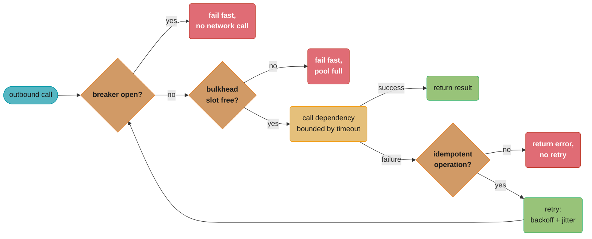

*The circuit breaker is checked first so an already-failing dependency never even reaches the bulkhead or the network; only an idempotent operation is allowed to retry, and that retry loops back through the same breaker check rather than around it (§12 Q9).*

---

## 4. Types / Architectures / Strategies

### 4.1 Circuit Breaker

A stateful guard in front of a call to a dependency, with three states:

- **Closed** — calls pass through normally; failures are counted.
- **Open** — calls fail immediately (no network call attempted) for a cooldown period.
- **Half-Open** — after the cooldown, a small number of trial calls are allowed through to test if the dependency has recovered.

Full state-machine details and concrete thresholds in §5.1 and §6.1.

### 4.2 Bulkhead

Isolates concurrent capacity per dependency so one slow dependency can't starve calls to others. Two common implementations:

- **Thread-pool isolation** — each dependency gets its own dedicated thread pool (and often its own connection pool). Calls to that dependency run on its pool; if the pool is exhausted, new calls fail immediately (or queue briefly with a short timeout) without affecting threads serving other dependencies. Stronger isolation, but more total threads/connections to provision and manage.
- **Semaphore isolation** — calls run on the *caller's* existing thread, but a semaphore limits how many concurrent calls to a given dependency are in flight. Lighter-weight (no extra threads), but a thread blocked waiting on a slow call is still a thread the caller can't use for anything else — weaker isolation than a dedicated pool, but often "good enough" for low-volume or already-async call paths.

### 4.3 Retry with Exponential Backoff and Jitter

Instead of retrying immediately, each retry waits progressively longer (`base * 2^attempt`), capped at some maximum, with randomization ("jitter") applied so concurrent clients don't retry in lockstep:

- **Full jitter**: `delay = random(0, min(cap, base * 2^attempt))` — delay can be anywhere from 0 to the full backoff value. Maximizes desynchronization, at the cost of some retries happening "too soon."
- **Equal jitter**: `delay = (base * 2^attempt / 2) + random(0, base * 2^attempt / 2)` — half the backoff is fixed, half is randomized. Guarantees a minimum delay (useful if the dependency needs *at least* some recovery time) while still desynchronizing.

Worked numbers in §6.2.

### 4.4 Timeouts (Connection, Read, and End-to-End Deadlines)

Three distinct timeout concepts that are often conflated:

- **Connection timeout** — how long to wait to *establish* a TCP connection (or TLS handshake). Should be short (often 1-3s) — if the host is unreachable, you'll know quickly.
- **Read (response) timeout** — how long to wait for a response *after* the connection is established and the request is sent. This is typically the larger and more important number, tuned to the dependency's actual p99 latency plus margin.
- **End-to-end deadline** — a single budget for the *entire* request, propagated across every hop in a call chain (gateway -> service A -> service B -> service C). Each hop's local timeout should be derived from the *remaining* deadline, not a fixed independent value — otherwise a chain of "reasonable" 2-second per-hop timeouts can sum to 8+ seconds end-to-end even though the client gave up after 1 second. Worked example in §6.3.

### 4.5 Rate Limiting as a Defensive Measure

Rate limiting (token bucket, sliding window, leaky bucket — see [Rate Limiting](../rate_limiting/README.md) for the full treatment) is primarily discussed as a way to protect *your* service from *its callers*. In the resilience context, the same mechanisms apply in the *outbound* direction: capping the rate at which your service calls a downstream dependency, so that even a sudden burst of incoming traffic to you doesn't translate into a burst that overwhelms a downstream dependency that can't handle it. This module doesn't re-derive the algorithms — see [Rate Limiting](../rate_limiting/README.md) for those.

### 4.6 Graceful Degradation / Fallback

A spectrum of "good enough" responses when a dependency is unavailable, from least to most disruptive:

- **Cached/stale data** — serve the last known-good response (e.g., last computed product recommendations, last fetched price), possibly with a short "may be slightly out of date" indicator.
- **Default value** — return a sensible default (e.g., "free shipping eligibility: unknown -> assume not eligible" rather than failing the page).
- **Reduced feature set** — hide the feature entirely (e.g., the "customers also bought" section disappears from a product page, but the page itself loads fine).
- **Feature flags as a kill switch** — an operator (or an automated health check) can disable a non-critical feature platform-wide in seconds, removing load from a struggling dependency without a deploy.

### 4.7 Failover and Redundancy

While redundancy itself is covered in [Load Balancing](../load_balancing/README.md) and [Scalability](../scalability/README.md), the *resilience* angle is **how failover is triggered and how quickly**:

- **Active-passive** — a standby replica is ready but not serving traffic; a health-check failure on the active instance triggers promotion of the standby. Failover takes time (detection + promotion + DNS/routing update) — often seconds to low minutes.
- **Active-active** — multiple instances/regions serve traffic simultaneously; "failover" is just the load balancer's health checks routing around the unhealthy instance, which can happen in the time it takes the next health-check cycle to run (often sub-second to a few seconds).
- **Health-check-driven failover** — the speed and safety of any failover is bounded by how quickly and accurately health checks detect "unhealthy." A health check that only checks "is the process running" (not "can it actually serve a real request") will report healthy right up until the moment a connection-pool-exhausted instance starts timing out every real request.

### 4.8 Load Shedding

Under genuine overload (not a downstream dependency problem — *this* service is receiving more load than it can handle), load shedding deliberately rejects some requests to protect capacity for the rest:

- **Priority-based shedding** — classify requests (e.g., by user tier, request type, or whether they're on the critical path like checkout vs. non-critical like "recently viewed" widgets) and reject lower-priority requests first when a queue-depth or utilization threshold is crossed.
- **Admission control at the edge** — the API Gateway or load balancer rejects requests (often with a `503` and a `Retry-After` header) before they even reach application servers, once a global concurrency limit is hit — protecting the application tier from ever seeing the overload at all.

---

## 5. Architecture Diagrams

### 5.1 Circuit Breaker State Machine

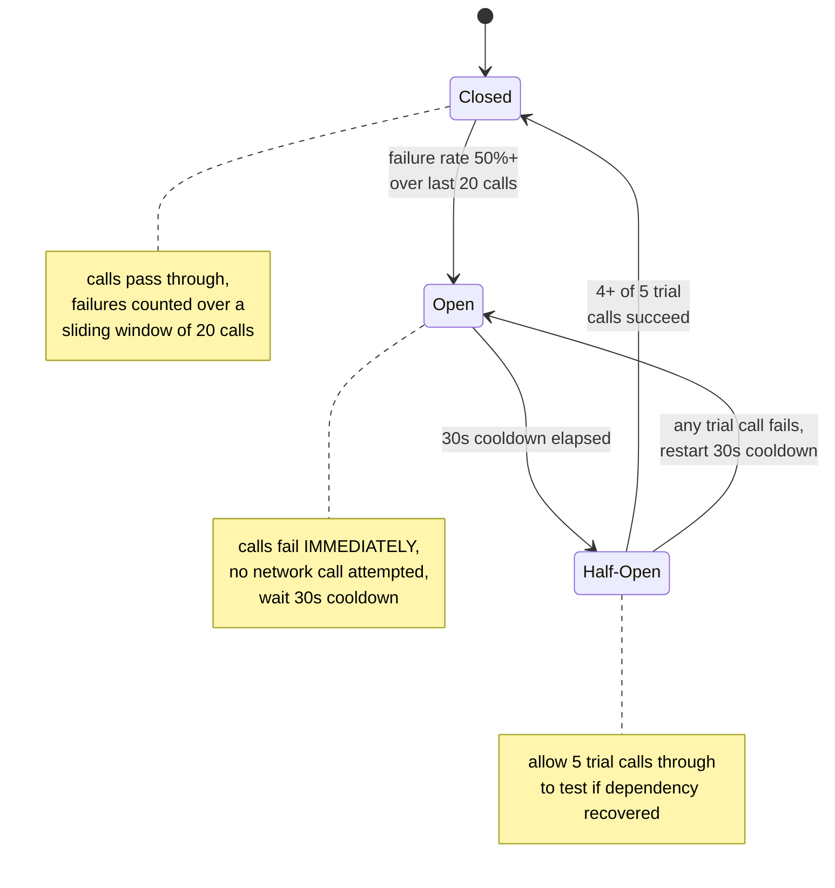

Concrete thresholds shown here (sliding window of 20, 50% failure rate, 30s cooldown, 5 trial calls, 80% trial success to close) are worked through with example call sequences in §6.1.

### 5.2 Bulkhead — Isolated Pools vs. Shared Pool

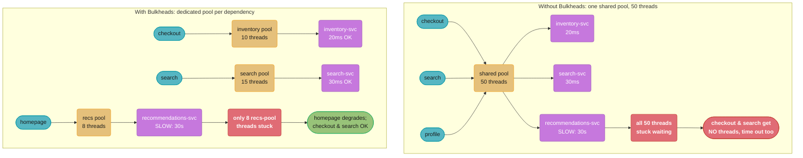

*One slow dependency (recommendations-svc, degraded from 50ms to 30s) exhausts the entire 50-thread shared pool and drags checkout and search down with it; giving each dependency its own pool confines the damage to that dependency's own threads, so only the 8-thread recs pool is exhausted and checkout/search keep working.*

### 5.3 Retry with Exponential Backoff and Full Jitter — Timeline

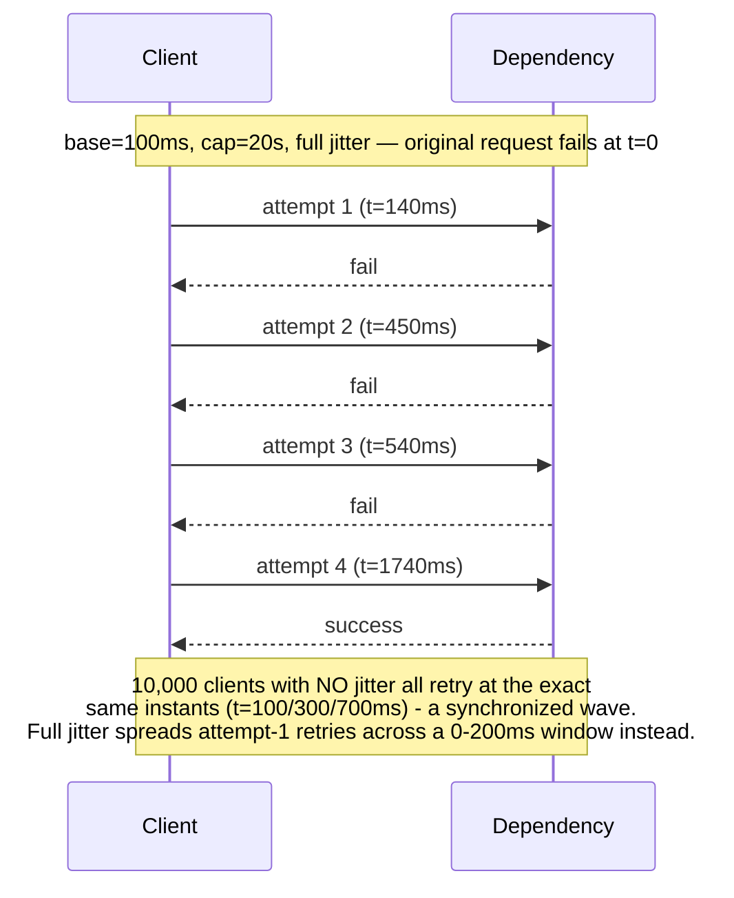

*This one client's randomized delays (140ms, 310ms, 90ms, 1200ms) land its retries unevenly at t=140/450/540/1740ms; without jitter, 10,000 clients that failed at the same instant would all retry at exactly the same later instants, recreating the original spike just delayed.*

### 5.4 Cascading Failure — Broken vs. Fixed

```mermaid
flowchart TD
    classDef io      fill:#61afef,stroke:#2e86c1,color:#1a1a1a,font-weight:bold
    classDef frozen  fill:#c678dd,stroke:#9b59b6,color:#fff
    classDef train   fill:#98c379,stroke:#27ae60,color:#1a1a1a
    classDef mathOp  fill:#d19a66,stroke:#e67e22,color:#1a1a1a,font-weight:bold
    classDef lossN   fill:#e06c75,stroke:#c0392b,color:#fff,font-weight:bold
    classDef req     fill:#56b6c2,stroke:#0097a7,color:#1a1a1a
    classDef base    fill:#e5c07b,stroke:#f39c12,color:#1a1a1a

    subgraph BR["Broken: no timeout, no bulkhead, no breaker"]
        direction LR
        gw1([API Gateway]) --> os1("Order Service<br/>shared pool: 100 threads")
        os1 -->|"no timeout"| ship1("Shipping-Rate API<br/>3rd party, now 60s")
        ship1 --> stuck1("all 100 threads<br/>blocked waiting")
        stuck1 --> down1(["Order Service unreachable,<br/>even for order-status calls"])
    end

    subgraph FX["Fixed: timeout + bulkhead + circuit breaker"]
        direction LR
        gw2([API Gateway]) --> os2("Order Service<br/>90 threads free")
        os2 --> bh("shipping pool<br/>10 threads, 500ms timeout")
        bh -->|"500ms timeout"| ship2("Shipping-Rate API<br/>3rd party, now 60s")
        ship2 --> cb{"50%+ failures<br/>over 20 calls?"}
        cb -->|yes| open("circuit OPEN 30s,<br/>fail fast, no call")
        cb -->|"not yet"| fb1("flat-rate fallback<br/>after 500ms")
        open --> fb2("flat-rate fallback<br/>immediately")
        fb1 --> ok2(["order-status calls<br/>succeed normally"])
        fb2 --> ok2
    end

    class gw1,gw2 io
    class os1,os2,bh base
    class ship1,ship2 frozen
    class cb,open mathOp
    class stuck1,down1 lossN
    class fb1,fb2,ok2 train
```

*The only structural difference is a 500ms timeout, a 10-thread bulkhead, and a circuit breaker wrapped around one outbound call — that alone shrinks a third-party outage from "the entire Order Service and checkout are down" to "shipping-rate display is degraded, everything else works normally."*

---

## 6. How It Works — Detailed Mechanics

### 6.1 Circuit Breaker — Concrete Configuration and Example Call Sequence

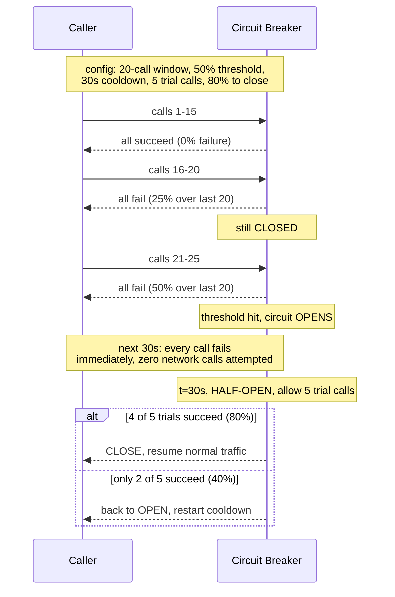

The key numbers to internalize: **20-call window and 50% threshold** mean the breaker needs to see a *sustained* problem (10+ failures within the last 20 calls) — a single transient blip (1-2 failures) doesn't trip it. The **30-second cooldown** is long enough to give a struggling dependency real breathing room, but short enough that recovery is detected within tens of seconds, not minutes.

### 6.2 Exponential Backoff with Full Jitter — Worked Table

```
Formula (full jitter, per the AWS Architecture Blog recommendation, §7):
  delay(attempt) = random(0, min(cap, base * 2^attempt))

  base = 100ms, cap = 20,000ms (20s)

attempt | base * 2^attempt | capped at 20s? | delay range (full jitter)
--------|-------------------|----------------|---------------------------
   1    |    200ms          | no             | 0 - 200ms
   2    |    400ms          | no             | 0 - 400ms
   3    |    800ms          | no             | 0 - 800ms
   4    |  1,600ms          | no             | 0 - 1,600ms
   5    |  3,200ms          | no             | 0 - 3,200ms
   6    |  6,400ms          | no             | 0 - 6,400ms
   7    | 12,800ms          | no             | 0 - 12,800ms
   8    | 25,600ms          | YES -> 20,000ms| 0 - 20,000ms
   9+   | (would exceed cap)| YES -> 20,000ms| 0 - 20,000ms (no further growth)

Most retry policies also cap the TOTAL number of attempts (e.g., 3-5)
rather than retrying indefinitely -- by attempt 5, the operation has
already taken up to ~1+2+4+8+16 = ~31 seconds of cumulative possible
delay even before this attempt's own timeout, which is often already
longer than an end-to-end request deadline (§6.3) allows.
```

### 6.3 Timeout / Deadline Budget Propagation Across a Call Chain

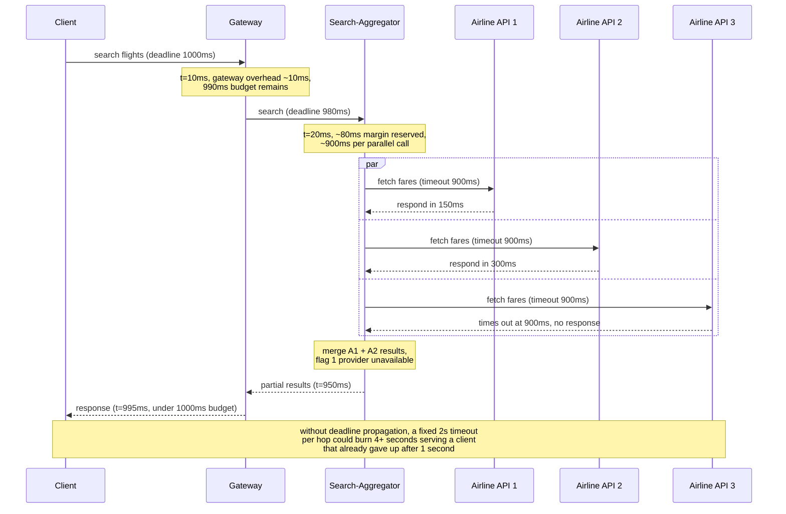

*Each hop derives its own timeout from the deadline it was handed rather than a fixed guess — the parallel airline calls get about 900ms each, and the whole round trip finishes at t=995ms, safely inside the 1000ms budget the client actually set.*

### 6.4 Bulkhead Sizing with Little's Law

```
Little's Law: L = lambda * W
  L      = average number of requests "in flight" (concurrency needed)
  lambda = arrival rate (requests/sec)
  W      = average time each request spends in the system (latency)

Example: recommendations-service call
  average latency (W):     200ms = 0.2s
  desired throughput (lambda): 50 requests/sec

  L = 50 * 0.2 = 10

  -> a bulkhead (thread pool or semaphore) of size ~10 is sufficient
     to sustain 50 req/s at 200ms average latency, with each of the
     10 "slots" cycling through ~5 requests/sec (1 / 0.2s = 5).

Sizing for degraded latency (the scenario the bulkhead exists for):
  if recommendations-service degrades to 2000ms (10x normal) and the
  bulkhead is still sized at 10:
    effective sustainable throughput = 10 / 2.0 = 5 req/s

  -> at the original 50 req/s arrival rate, 45 req/s worth of requests
     per second find the bulkhead full and get an IMMEDIATE fallback
     response (§4.6) instead of queuing. This is the bulkhead doing
     its job: bounding the IMPACT of the degradation to "10 requests'
     worth of capacity is busy with slow calls" rather than "every
     request to this path now takes 2000ms, and the thread/connection
     pool behind it is unboundedly consumed."

Practical sizing guidance: size the bulkhead for NORMAL latency and
desired throughput (per Little's Law), not for "what if latency is
10x" -- the entire point is that when latency degrades, the bulkhead
fills up and EXCESS load gets a fast fallback rather than queuing
behind an ever-growing backlog.
```

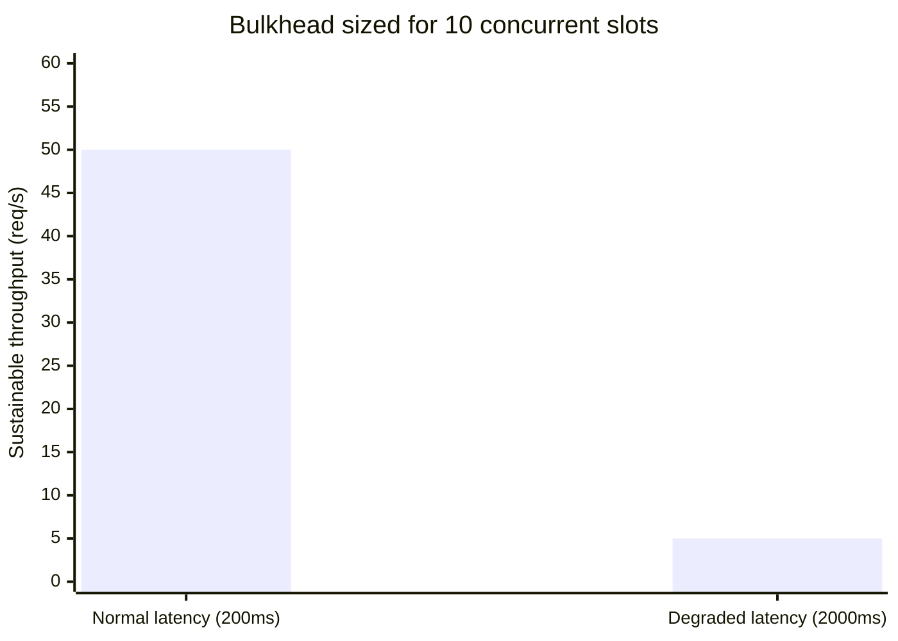

*At a fixed bulkhead size of 10, a 10x latency degradation (200ms to 2000ms) collapses sustainable throughput 10x too, from 50 req/s to 5 req/s — exactly why the other 45 req/s must be shed to a fallback instead of queuing behind it.*

### 6.5 Load Shedding — Queue-Depth Threshold Example

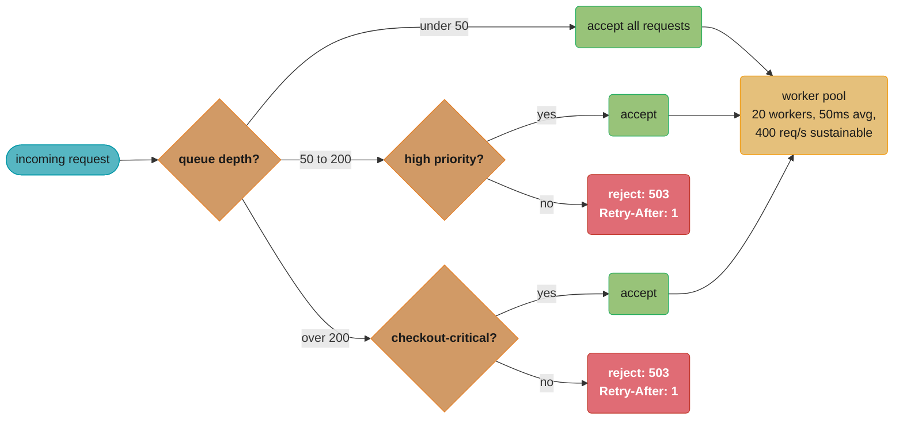

*During a spike to 1000 req/s (2.5x the pool's 400 req/s capacity), this ladder sheds low-priority traffic the instant queue depth passes 50, capping the effective arrival rate so checkout's queueing delay stays in the low tens of ms instead of growing unbounded until the process crashes.*

---

## 7. Real-World Examples

- **Netflix Hystrix** — the pattern that put "circuit breaker" on the map for distributed systems at scale. Hystrix (open-sourced ~2012) wrapped every dependency call in a command object with its own thread pool (bulkhead), timeout, and circuit breaker, with a real-time dashboard showing the health of every dependency across the fleet. Hystrix is now in **maintenance mode** (Netflix moved internally to adaptive concurrency limiting); **Resilience4j** is the modern JVM successor, offering the same conceptual patterns as lightweight, composable, functional decorators rather than a heavyweight command framework.
- **AWS Architecture Blog — "Exponential Backoff and Jitter"** — the 2015 post that introduced "full jitter" and "equal jitter" (§4.3, §6.2) as the recommended retry strategy, after AWS observed that plain exponential backoff (no jitter) still produced synchronized retry storms across large fleets of clients. This recommendation is now baked into every official AWS SDK's default retry behavior.
- **Istio / Envoy — Outlier Detection** — service meshes implement circuit breaking at the **sidecar proxy** layer, transparently to application code. Envoy's "outlier detection" tracks consecutive errors or response-time percentiles per upstream endpoint and temporarily ejects (stops routing to) endpoints that look unhealthy — effectively a circuit breaker applied per-instance rather than per-logical-dependency, useful for catching "this one of twenty pods is unhealthy" without the application needing to know.
- **Amazon's product-page graceful degradation** — a frequently cited example of §4.6 in practice: if the personalization service that powers "customers who bought this also bought" is slow or down, Amazon's product page does not fail to load — it falls back to a generic or cached "related products" list (or simply omits that section), because the core page (product info, price, buy button) is far more important than the personalization widget.

---

## 8. Tradeoffs

### Retry vs. Fail-Fast

| Dimension | Retry (with backoff + jitter) | Fail-Fast (no retry) |
|-----------|-------------------------------|------------------------|
| Latency impact on success | Higher tail latency (failed attempts add delay before eventual success) | Lowest possible latency for failures — caller knows immediately |
| Load amplification during an outage | Each retry is additional load on an already-struggling dependency — N callers retrying 3x can turn 1x load into up to 3x | Zero amplification — a struggling dependency sees no MORE load than the original requests |
| Best for | Transient, self-resolving issues (brief network blip, momentary GC pause) — and ONLY for idempotent operations | Non-idempotent operations without idempotency keys; or when the circuit breaker is already OPEN (don't retry into a known-bad dependency) |
| Failure visibility | Masks brief failures from the end user (good for UX, but can hide a developing problem from monitoring if not also tracked as a metric) | Surfaces failures immediately — easier to detect a developing outage, harder on UX for transient blips |

### Circuit Breaker Threshold Tuning

| Tuning | Symptom if wrong | Risk |
|--------|-------------------|------|
| Threshold too sensitive (e.g., trips at 10% failure rate over a 5-call window) | Circuit opens during brief, harmless latency blips (a single slow call out of 5 = 20% > 10%) | "Flapping" — the breaker oscillates open/closed constantly, and the fallback path (often lower-quality) is served far more often than necessary, masking real availability and triggering unnecessary alerts (§10, War Story 3) |
| Threshold too lenient (e.g., trips only at 90% failure rate over a 100-call window) | By the time 90 of 100 calls have failed, the caller's resources (bulkhead, connection pool) are likely already exhausted from those 90 failed/timed-out calls | The circuit breaker "protects" a dependency and caller that are already in trouble — too late to prevent the cascading effects it exists to prevent |
| Window too small (e.g., 5 calls) | Statistically noisy — a single failure is 20% of the window | False trips under low-traffic conditions |
| Window too large (e.g., 1000 calls, at 10 req/s = 100 seconds) | Slow to detect a real, sustained outage — takes minutes for the failure rate to cross the threshold | Caller absorbs a real outage's full impact for an extended period before the breaker engages |

### Bulkhead Isolation Granularity

| Approach | Isolation quality | Resource cost | Best for |
|----------|---------------------|----------------|----------|
| Per-dependency dedicated pools | Strong — one dependency's degradation is fully contained to its own pool | High — total provisioned threads/connections = sum across all dependencies, most of which sit idle most of the time | Systems with a small number (5-15) of well-understood dependencies with very different latency/reliability profiles |
| One shared pool for "similar" dependencies (grouped by criticality/latency tier) | Medium — isolation between groups, not within a group | Medium — fewer total pools to size and monitor | Systems with many (20+) dependencies where per-dependency pools would be impractical to size and operate |
| One global shared pool (no bulkheads) | None — any dependency's degradation can exhaust the pool and affect all others | Lowest — simplest to operate | Prototypes, or systems where ALL dependencies are equally critical, equally reliable, and co-located (rare in practice) |

---

## 9. When to Use / When NOT to Use

### Invest in Full Resilience Tooling (circuit breakers + bulkheads + retry policies) When
- **Calling external/third-party services** — you have zero control over their availability, latency, or how they fail, and their failure modes are often the least predictable in the entire system.
- **Calling across availability zones or regions** — cross-AZ/region calls have meaningfully higher and more variable latency than same-AZ calls, and a regional event can degrade an entire AZ's worth of dependencies simultaneously.
- **Calling any dependency with a history of variable latency or partial outages** — if a dependency has ever caused an incident by being slow (rather than fully down), it's a strong candidate for a dedicated bulkhead and tuned circuit breaker.

### Skip or Minimize When
- **Calling a co-located cache or in-process call** — a call to a Redis instance in the same AZ with sub-millisecond, highly reliable latency gains little from a circuit breaker; the overhead of tracking state and the operational cost of tuning thresholds outweighs the protection, since this dependency essentially never exhibits the "slow but not down" failure mode these patterns target. A short timeout alone is usually sufficient.
- **One-off scripts, batch jobs with no SLA** — a nightly batch job that can simply be re-run from the start if it fails doesn't need sophisticated per-call resilience; a coarser "retry the whole job" strategy is simpler and sufficient.

### Caution / Anti-Patterns
- **Retrying non-idempotent operations without an idempotency key** — see §10, War Story 4, and [Distributed Transactions §4.6](../distributed_transactions/README.md). This is one of the most common sources of "the resilience pattern caused the incident."
- **Circuit breakers configured so aggressively they're effectively always open** — if normal traffic regularly produces enough variance to cross the threshold, the breaker spends most of its time open, and the fallback path becomes the *de facto* primary path — often without anyone noticing, because the fallback "works" (just in a degraded way) and doesn't page anyone.
- **Retrying after the circuit breaker is already open** — a retry policy that doesn't check breaker state will keep attempting calls (and incurring their cost/latency) even though the breaker has already determined those calls are extremely likely to fail. Retries should be the *first* layer; if the breaker is open, fail fast immediately, no retry.

---

## 10. Common Pitfalls

**War Story 1 — The Missing Timeout That Took Down the Whole API**

A `notification-service` called an internal `template-rendering-service` to render email bodies, using an HTTP client configured with **no read timeout** (the library's default was "wait forever"). `template-rendering-service` had its own incident — a slow database query caused its response times to climb from 30ms to over 10 minutes for a subset of requests. `notification-service`'s thread pool (size 100, used for ALL of its work — sending push notifications, SMS, and emails) had every thread gradually consumed by these multi-minute waits. Within 12 minutes, all 100 threads were blocked on `template-rendering-service` calls, and `notification-service` stopped sending push notifications and SMS too — neither of which has anything to do with email templates.
*Fix*: added a 2-second read timeout (template rendering normally completes in under 50ms, so 2s is generous margin) to the `template-rendering-service` client, AND split the shared thread pool into per-channel bulkheads (email, push, SMS each get their own pool of 30-40 threads). The next time `template-rendering-service` degraded, email sending degraded (with calls failing fast after 2s and falling back to a "plain text, no template" email), while push and SMS continued normally.

**War Story 2 — Synchronized Retries with No Jitter Caused a Recurring Load Spike Every 30 Seconds**

*(This is a complementary, design-focused angle on the retry-storm failure class also discussed from a microservices-decomposition perspective in [Microservices §10, War Story 1](../microservices/README.md).)* A fleet of ~3,000 mobile app instances all called a `pricing-service` on a periodic 30-second refresh timer. `pricing-service` had a brief 8-second blip (a deploy-triggered cache warm-up). Every client's in-flight request failed simultaneously and — per the client SDK's retry policy — retried after a **fixed 2-second delay, with no jitter**. All ~3,000 clients retried at almost exactly the same instant, 2 seconds later, producing a load spike roughly **3,000x the normal per-second rate** in a single burst. `pricing-service` (which had recovered from the original blip by then) buckled under this synchronized spike and returned errors again — to the SAME 3,000 clients, which retried again 2 seconds later, in another synchronized burst. This repeated every ~2 seconds (overlapping with the next scheduled 30-second refresh cycle for an increasing fraction of clients) for almost 4 minutes before the pattern desynchronized enough to fade out on its own.
*Fix*: changed the retry delay to `random(1000, 3000)` ms (equal-jitter-style) instead of a fixed 2000ms. Additionally, the 30-second periodic refresh timer itself was changed from a fixed interval to `30s + random(0, 5s)` per client at startup, so that even the *originally scheduled* (non-retry) requests from 3,000 clients are spread across a 5-second window rather than all firing at the same wall-clock second. **The general lesson: jitter belongs not just on retries, but on any periodic/scheduled client behavior shared across a large fleet** — synchronized "normal" traffic is just as capable of producing a thundering herd as synchronized retries.

**War Story 3 — A Circuit Breaker Tuned for "Never Trip" Tripped on a 4-Second Blip and Triggered a False-Positive Incident**

A `search-service` called an `inventory-availability-service` with a circuit breaker configured with a **5-call sliding window and a 40% failure threshold** (2 of 5 calls failing trips it). During a routine `inventory-availability-service` deploy, there was a ~4-second window where 3 of 5 in-flight requests timed out (rolling restart of pods). The circuit opened immediately, and `search-service` switched to its fallback — showing "availability: check at checkout" instead of real-time stock counts on search results. The fallback is "correct" but lower quality (worse conversion rate), and the breaker stayed open for its full 30-second cooldown even though `inventory-availability-service` was fully healthy again within 5 seconds of the deploy completing. This pattern repeated on **every deploy** of `inventory-availability-service` (several per week), each time triggering a 30-second window of degraded search results and an automated alert ("circuit breaker OPEN for inventory-availability") that paged on-call — who, after the third occurrence, learned to ignore it. *(This is a complementary failure mode to the alert-fatigue scenario in [Observability §10, War Story 2](../observability/README.md) — there, the issue was too many threshold-based alerts on infrastructure causes; here, it's a SINGLE resilience-pattern alert that's individually well-intentioned but mis-tuned, becoming noise through repetition.)*
*Fix*: widened the sliding window to 20 calls and raised the threshold to 50% (matching §6.1's reference configuration) — a brief 4-second blip during a rolling deploy now affects at most a handful of calls within a 20-call window, well under 50%, and the breaker stays closed. Additionally, `inventory-availability-service`'s deploy process was changed to drain connections (stop routing new requests, finish in-flight ones) before terminating a pod, rather than terminating immediately — eliminating most of the request failures during deploys at the source.

**War Story 4 — A "Helpful" Retry Policy on Payment Creation Caused Duplicate Charges**

*(This is the same underlying failure class as [Distributed Transactions §10, War Story 2](../distributed_transactions/README.md) — a non-idempotent retry double-charging customers — but viewed here from the resilience-pattern-design angle: the retry policy itself was the bug, independent of any distributed-transaction protocol.)* A `checkout-service` added a generic "resilience wrapper" around all of its outbound HTTP calls, applying a uniform policy: 3 retries with exponential backoff + jitter, on any 5xx response OR connection timeout. This wrapper was applied **uniformly**, including to the `POST /charges` call to the payment processor — an inherently non-idempotent "create a new charge" operation with no idempotency key. During a brief period of elevated latency at the payment processor, ~200 `POST /charges` calls exceeded the 3-second timeout *after* the processor had already successfully created the charge (the response was just slow to arrive). The resilience wrapper, doing exactly what it was configured to do, retried each of these 200 requests up to 3 times — and the payment processor (which also had no idempotency protection on this endpoint) created a new charge for each retry. ~180 of the 200 customers were charged 2x, and a handful were charged 3x.
*Fix*: the generic resilience wrapper was changed to require an explicit, per-call **idempotency classification** — `IDEMPOTENT` (safe to retry as configured) or `NON_IDEMPOTENT` (no automatic retry; caller must implement its own retry-with-idempotency-key if retries are needed at all). `POST /charges` was reclassified as `NON_IDEMPOTENT` and separately updated to send a client-generated `Idempotency-Key` header (per [Distributed Transactions §4.6](../distributed_transactions/README.md)), at which point retries could be safely re-enabled. **The lesson: a "one size fits all" retry policy is a latent bug generator — retry safety is a property of the specific operation, not the HTTP client.**

---

## 11. Technologies & Tools

| Category | Tools | Notes |
|----------|-------|-------|
| JVM resilience library (current standard) | **Resilience4j** | Lightweight, functional decorators for circuit breaker, bulkhead (thread-pool and semaphore), retry, rate limiter, and time limiter — composable per-call. See [Spring: Resilience4j Patterns](../../spring/case_studies/cross_cutting/resilience4j_patterns.md) and [Backend: Fault Tolerance Patterns](../../backend/fault_tolerance_patterns/README.md) for implementation depth. |
| JVM resilience library (legacy) | **Netflix Hystrix** | The original at-scale circuit breaker library (§7); now in maintenance mode. Still seen in older codebases — understanding its model (command pattern, per-dependency thread pools) is useful for reading legacy systems, but new development should use Resilience4j. |
| Service mesh / sidecar | **Istio, Linkerd, Envoy** | Implement circuit breaking ("outlier detection" in Envoy terms), retries, and timeouts at the infrastructure layer, transparent to application code — useful for retrofitting basic resilience onto services that don't implement it themselves, though application-level idempotency and graceful degradation still require application changes. |
| Cloud SDK retry behavior | **AWS SDK, GCP client libraries, Azure SDKs** | Modern versions implement exponential backoff + jitter (§6.2) by default for retryable errors (throttling, 5xx, connection errors) — usually configurable but rarely need tuning beyond defaults for typical workloads. |
| .NET ecosystem | **Polly** | The .NET equivalent of Resilience4j — circuit breaker, retry, bulkhead isolation, timeout, and fallback policies, composable via a fluent API. |
| Load shedding / admission control | **Envoy (circuit breakers + global rate limiting), API Gateway request quotas** | Often implemented at the edge/gateway layer rather than in application code, since the goal is to reject excess load before it consumes any application-tier resources. |

---

## 12. Interview Questions with Answers

**Q1: Walk me through the circuit breaker state machine — what triggers each transition?**

A: A circuit breaker has three states: **Closed** (normal — calls pass through, failures are tracked over a sliding window), **Open** (calls fail immediately without attempting the network call, for a fixed cooldown period), and **Half-Open** (after the cooldown, a small number of trial calls are allowed through to test recovery). The Closed -> Open transition fires when the failure rate over the sliding window crosses a threshold (e.g., >=50% of the last 20 calls failed). The Open -> Half-Open transition fires after the cooldown timer expires (e.g., 30 seconds), regardless of whether the dependency has actually recovered — it's a blind probe. From Half-Open, if enough trial calls succeed (e.g., >=4 of 5), it goes back to Closed; if not, it goes back to Open and the cooldown restarts.

**Q2: Why isn't plain exponential backoff enough for retries — why do you need jitter too?**

A: Plain exponential backoff spaces out *one client's* retries over time, but if a failure affects many clients simultaneously (a brief outage, a deploy), all of them back off on the *same schedule* and retry at the *same instants* — producing synchronized waves of load that hit the recovering dependency at predictable moments, potentially knocking it back over right as it recovers. Jitter (randomizing the delay, e.g., "full jitter": `random(0, min(cap, base*2^attempt))`) spreads those retries out over a window instead of a point in time, turning a spike into a smoother distribution of load. Backoff controls *how much* delay; jitter controls *whether thousands of clients' delays line up*.

**Q3: How do retries and idempotency relate — why can retries be dangerous?**

A: A retry means "the same logical operation might execute more than once" — the original request may have actually succeeded on the server even though the client never received the response (e.g., the response was lost to a network blip after the server completed the work). If the operation is **idempotent** (executing it N times has the same effect as executing it once — e.g., "set quantity to 5"), retries are safe. If it's **not idempotent** (e.g., "create a new charge for $50," "append to a list," "increment a counter"), a retry can duplicate the effect — double-charging a customer, creating duplicate records. The fix is an **idempotency key**: the client generates a unique key per logical attempt (reused across retries of that same attempt), and the server stores `(key -> result)` and returns the cached result on a repeat, turning "at-least-once delivery" into "at-most-once effect." See [Distributed Transactions §4.6](../distributed_transactions/README.md).

**Q4: What's the difference between a bulkhead and a circuit breaker — don't they solve the same problem?**

A: They're complementary, not redundant, and solve different problems. A **circuit breaker** is about *whether to attempt a call at all* — it tracks the dependency's recent success/failure rate and stops sending traffic to a dependency that's clearly failing. A **bulkhead** is about *resource isolation* — it ensures that even while calls to a struggling dependency ARE being attempted (before the breaker has tripped, or for a dependency with no breaker at all), those calls can only consume a bounded slice of resources (threads, connections), so they can't starve calls to OTHER, healthy dependencies. In a well-designed system, the bulkhead bounds the *blast radius* of a slow dependency, while the circuit breaker reduces *how often* that blast radius gets exercised at all once a pattern of failure is detected.

**Q5: How does timeout/deadline propagation work across a multi-hop call chain, and why does it matter?**

A: Rather than each service in a call chain having an independent, fixed timeout for its downstream calls, the *original* caller's deadline (e.g., "respond within 1000ms") is propagated as metadata (a header with a deadline timestamp or remaining-budget value) to every hop. Each hop computes its own timeout for the NEXT call as "remaining budget minus my own processing overhead," rather than using a fixed value. This matters because without it, a chain of independently "reasonable" timeouts (say, 2 seconds at each of 4 hops) can sum to 8 seconds of backend work for a request whose original caller gave up after 1 second — wasting resources on work nobody is waiting for, and making it impossible to reason about worst-case end-to-end latency from the per-hop configuration alone.

**Q6: Explain "retry amplification" — how can retries make an outage WORSE?**

A: If a request passes through N services, and each service independently retries failed calls to the next service up to R times, the worst case is that ONE original request can generate up to R^N actual calls to the deepest dependency. With R=3 and N=4, that's up to 3^4 = 81 calls from a single client request. During an actual outage of the deepest dependency, this means the load on that dependency isn't just "the original request rate" — it's amplified by a potentially huge factor, making recovery far harder (the dependency now has to handle 81x the load just to clear the backlog, on top of whatever caused the original problem). The fixes are: (1) circuit breakers — once a hop's breaker is open, it should fail fast rather than retry, capping the amplification at that layer; (2) only the OUTERMOST layer (or none) should retry on certain error classes — inner layers can return errors immediately and let a single outer retry handle it; (3) deadline propagation (Q5) naturally bounds how many retries are even possible within the remaining budget.

**Q7: How would you design the graceful-degradation behavior for a product page if the recommendations service is down?**

A: First, classify the dependency by criticality — recommendations are not on the critical path for "view product, add to cart, check out," so the design goal is "the page loads and is fully usable, just without this one section." Concretely: wrap the recommendations call in a short timeout (e.g., 200ms) and a circuit breaker; on timeout, error, or open breaker, return either (a) a cached/stale set of recommendations from the last successful call (if available and not too old), or (b) simply omit the recommendations section from the rendered page entirely, with no error shown to the user. Critically, this decision should be made BEFORE an incident — if "what does the page look like without recommendations" isn't a tested, intentional design, the actual behavior during an outage might be an exception that fails the *entire* page render, which is exactly the cascading failure this pattern exists to prevent.

**Q8: What is load shedding, and how is it different from rate limiting?**

A: Rate limiting (token bucket, sliding window, etc. — see [Rate Limiting](../rate_limiting/README.md)) typically enforces a per-client or per-API-key quota, protecting the service from any single caller consuming more than its fair share, regardless of the service's overall load. Load shedding is a *system-wide* response to the service's *own* overload condition — when total incoming load exceeds capacity (regardless of whether any individual client is "over their limit"), the service deliberately rejects a portion of requests, typically chosen by priority (reject low-priority/non-critical requests first), to keep the requests that matter most within acceptable latency. Rate limiting is "is THIS caller within their allowance?"; load shedding is "is the SYSTEM as a whole currently able to handle everything, and if not, what do we sacrifice first?"

**Q9: How should circuit breakers, bulkheads, retries, and timeouts interact — what's the right order/relationship?**

A: They should be layered as defense-in-depth, applied in this conceptual order for an outbound call: (1) **timeout** — every call has a bounded maximum duration, no exceptions; (2) **circuit breaker** — checked FIRST, before attempting the call at all; if open, fail fast immediately with no network call and no retry; (3) **bulkhead** — if the breaker is closed, the call acquires a slot from the dependency's dedicated pool; if the pool is full, fail fast (this is itself a signal that often should also feed the circuit breaker's failure count); (4) **retry** — only applied to the bulkhead-protected, breaker-gated call, only for idempotent operations, with backoff+jitter, and the retry loop should itself check breaker state between attempts (don't retry into a breaker that just opened). The key relationships: the circuit breaker should ideally open BEFORE the bulkhead is fully exhausted (so failures are detected and short-circuited while there's still spare capacity, not after everything's already stuck), and retries must always respect — not bypass — the circuit breaker's current state.

**Q10: A circuit breaker keeps flapping between Open and Half-Open/Closed during normal operation — what's wrong and how do you fix it?**

A: Flapping (rapid oscillation between states) almost always means the breaker's thresholds are tuned for a load/latency profile that doesn't match reality — typically a sliding window that's too small (a handful of failures, which happen even in healthy systems due to normal variance, represent a large percentage of a small window) or a failure-rate threshold that's too low. The fix is to widen the sliding window (e.g., from 5 to 20+ calls) and/or raise the threshold (e.g., from 20% to 50%), tuned against the dependency's *actual observed* failure rate during normal operation (which is rarely exactly 0%) plus margin — not a guessed "round number." A flapping breaker is worse than a correctly-tuned one because it serves the (lower-quality) fallback response far more often than necessary, and if it's wired to an alert, it generates alert fatigue (§10, War Story 3).

**Q11: Should retries respect or ignore the type of error returned?**

A: Respect it — not all errors are retryable. Transient errors (connection timeout, 503 Service Unavailable, 429 Too Many Requests with a `Retry-After` hint) are good retry candidates — they often indicate a temporary condition. Errors that indicate the request itself is invalid or will never succeed (400 Bad Request, 401/403 auth failures, 404 Not Found, most 422 validation errors) should NEVER be retried — retrying them wastes resources on a request that's guaranteed to fail again identically, and can mask a real bug (a client retrying a malformed request 3 times instead of surfacing the validation error immediately). A well-designed retry policy classifies errors into "retryable" and "not retryable" categories explicitly, rather than retrying on "any non-2xx response."

**Q12: How would you decide the bulkhead size for a new downstream dependency?**

A: Use Little's Law (`L = lambda * W`): estimate the dependency's typical response time (`W`, e.g., 200ms) and the throughput you need to sustain calls to it at (`lambda`, e.g., 50 req/s), giving `L = 50 * 0.2 = 10` — a bulkhead of ~10 concurrent slots. Size for NORMAL latency and throughput, not worst-case degraded latency — the entire purpose of the bulkhead is that when latency degrades (say, to 2 seconds), the same 10-slot bulkhead now only sustains ~5 req/s, and the EXCESS load (the other 45 req/s) gets an immediate fallback response rather than queuing behind a growing backlog. In practice, start with the Little's Law estimate, add modest headroom (e.g., 20-30%) for normal variance, and validate/adjust against real traffic and latency data once the dependency is live — initial estimates are rarely exactly right.

**Q13: What's the difference between a connection timeout and a read timeout, and why does the distinction matter?**

A: A connection timeout bounds how long to wait while *establishing* the TCP connection (and TLS handshake, if applicable) — this should be short (1-3 seconds), because if a host is unreachable or the network path is broken, that fails fast and doesn't depend on the dependency's application-level behavior. A read (response) timeout bounds how long to wait for data *after* the connection is established and the request has been sent — this is the timeout that protects against a dependency that accepted the connection and the request but is slow or hung while processing it, which is a much more common failure mode than "can't connect at all." Conflating the two (or setting only one) is a common source of "no timeout" bugs — many HTTP client libraries default to an infinite read timeout even when a connection timeout is set, which means the connection establishes fine (fast) but the actual response wait is unbounded (§10, War Story 1).

**Q14: Why does a "wait for all N dependencies, fail if any fails" design have worse availability than any of its individual dependencies?**

A: Because each dependency's imperfect availability compounds multiplicatively against you — the request succeeds only when every one of the N dependencies succeeds simultaneously. The flight-search case study (§14) works the math: 6 airline APIs each at 99% availability gives `0.99^6 ≈ 94.1%` effective availability for the "all-or-nothing" aggregator, even though every individual airline's dashboard looks healthy at 99% — and in practice that meant ~30% of searches returned zero results during the unreliable airlines' degraded windows. Redesigning for partial results inverts the math: the feature is "down" only when it can't reach a UI-acceptable minimum (2-3 of 6 airlines responding), a probability overwhelmingly close to zero under the same independence assumption. Whenever a request fans out to multiple independent dependencies, design the merge step to tolerate missing contributors and surface a "N providers unavailable" indicator, rather than letting the least reliable dependency define the whole feature's availability.

**Q15: What is Envoy's "outlier detection," and how does it differ from an application-level circuit breaker?**

A: Outlier detection is circuit breaking implemented in the service-mesh sidecar, applied per upstream *instance* rather than per logical dependency. As §7 describes, Envoy tracks consecutive errors or response-time percentiles for each individual endpoint and temporarily ejects (stops routing to) instances that look unhealthy — which catches the "this one of twenty pods is bad" failure mode an application-level breaker misses entirely, since the app-level breaker aggregates all instances of a dependency into one failure rate where one bad pod out of twenty barely moves the needle. The two are complementary rather than interchangeable: the mesh handles per-instance ejection, retries, and timeouts transparently with zero application code, but it cannot provide what only the application knows — idempotency classification for safe retries and business-aware graceful degradation like "serve cached recommendations" (§11). Use mesh-level resilience as the transparent baseline and keep application-level breakers and fallbacks for the decisions that require business context.

**Q16: In the flight-search case study, why do the historically unreliable airlines get a LOWER circuit-breaker threshold (40%) than the reliable ones (50%)?**

A: Because a breaker's threshold must clear the dependency's normal baseline failure rate by a margin that still trips early during a real degradation. The unreliable airlines run ~5% failures even on a good day, and their bulkheads are deliberately small (6 slots versus 15-20); with a 50% threshold, by the time half of a 20-call window had failed, those 6 slots would already be saturated with slow calls — the breaker would trip only after the damage it exists to prevent had occurred. Dropping the threshold to 40% trips the breaker sooner, while bulkhead capacity remains, cutting load on an airline that's already struggling and freeing the aggregator from waiting on calls that are statistically likely to fail (Key Design Decision 3, §14). The general rule from §8's tuning table applies: set each breaker's threshold relative to that dependency's observed normal failure rate plus margin — a single fleet-wide threshold is miscalibrated for every dependency whose baseline differs from the average.

---

## 13. Best Practices

**1. Set both a connection timeout and a read timeout on every external call, with no exceptions** — derive the read timeout from the dependency's observed p99 latency plus margin (e.g., p99 = 200ms -> timeout = 500ms-1s), not a guessed round number.

**2. Apply backoff + full jitter to every retry, and classify every retried operation as idempotent or not before enabling retries** — a generic "retry on any failure" policy applied uniformly across all outbound calls is a latent duplicate-side-effect bug (§10, War Story 4).

**3. Size bulkheads using Little's Law (`L = lambda * W`) against REAL observed latency and throughput numbers** — and re-validate after the dependency's latency profile changes (a dependency that used to be 50ms and is now 500ms needs a 10x larger bulkhead to sustain the same throughput, or the bulkhead needs to be allowed to fill and shed excess load by design).

**4. Tune circuit breaker thresholds (window size, failure-rate threshold, cooldown) against real traffic baselines, not defaults or guesses** — a window/threshold combination that doesn't account for the dependency's normal background failure rate will flap (§10, War Story 3) and erode trust in the breaker's signal.

**5. Design an explicit degraded-mode response for every dependency that has one — and treat "no degraded mode defined" as a gap to close, not an acceptable default** — "the page returns a 500" should never be the *designed* behavior for a non-critical dependency's failure; it should be the result of a bug in implementing the degraded mode that WAS designed.

**6. Propagate a single end-to-end deadline across the entire call chain, and derive each hop's local timeout from the remaining budget** — independent, fixed per-hop timeouts can sum to far more than any client is actually willing to wait, wasting backend resources on work nobody is waiting for (§6.3).

**7. Layer the patterns together, in this order, rather than relying on any single one**: timeout (always) -> circuit breaker (checked first, fails fast if open) -> bulkhead (bounds concurrent resource use) -> retry (only for idempotent ops, only if the breaker is closed, with backoff+jitter). Each layer covers a gap the others don't.

**8. Treat synchronized client behavior — not just retries — as a jitter problem.** Periodic polling, scheduled cache refreshes, and cron-triggered batch jobs across a large fleet of clients can produce the same thundering-herd effect as un-jittered retries (§10, War Story 2); add randomized jitter to any periodic interval shared across many instances.

**Cross-references:** [Backend: Fault Tolerance Patterns](../../backend/fault_tolerance_patterns/README.md) (circuit breaker state machine and Resilience4j implementation in depth), [Spring: Resilience4j Patterns](../../spring/case_studies/cross_cutting/resilience4j_patterns.md) (annotation-driven circuit breaker/retry/bulkhead configuration), [Microservices](../microservices/README.md) (§6.1 Circuit Breaker in a service-mesh context, and §10 War Story 1 — the retry-storm scenario this module's War Story 2 complements from a design-tuning angle), [Rate Limiting](../rate_limiting/README.md) (rate limiting as a defensive, outbound-facing resilience measure), [Distributed Transactions](../distributed_transactions/README.md) (§4.6 idempotency keys — the prerequisite for safe retries, and §10 War Story 2 — the duplicate-charge failure class this module's War Story 4 revisits from the retry-policy angle), [Load Balancing](../load_balancing/README.md) (health-check-driven failover and active-active/active-passive redundancy that complements, but is distinct from, the patterns in this module).

---

## 14. Case Study: Resilience for a Multi-Provider Flight Search Aggregator

### Problem Statement

A travel-booking platform's flight search feature fans out a single user search to **6 third-party airline APIs** in parallel, merges the results, and returns a combined list sorted by price. Scale and characteristics:

- 8,000 searches/minute at peak, each fanning out to 6 airline API calls = ~48,000 outbound calls/minute
- The platform's own SLA to users: search results returned within **2.5 seconds p99**
- Airline APIs are wildly heterogeneous: 2 are fast and reliable (p99 ~300ms, >99.9% success), 2 are moderate (p99 ~800ms, ~99% success), and 2 are historically unreliable (p99 ~2-4 seconds, occasional multi-minute outages, ~95% success on a good day)
- **Current (broken) behavior**: the aggregator calls all 6 airlines with a single shared HTTP client (no per-airline timeout configuration — all use the client's default 30-second timeout), waits for ALL 6 responses (or timeout) before returning anything, and a single airline's failure causes the ENTIRE search to return an error page to the user

### Current (Broken) Architecture

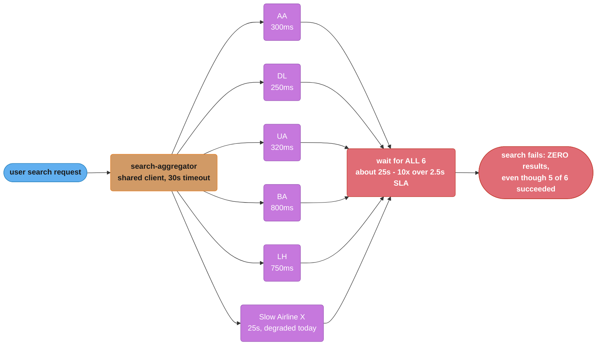

Observed impact before the fix: when "Slow Airline X" or "Slow Airline Y" (the two historically unreliable providers) is degraded — which happens for a cumulative ~3-4 hours/week across the two of them — **search p99 latency exceeds 20 seconds** and **~30% of searches during those windows return a complete error with zero results**, even though the other 4-5 airlines are working fine.

### Target (Fixed) Architecture

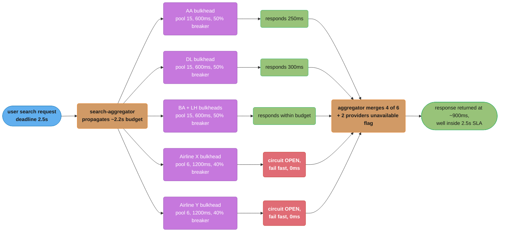

*Per-airline bulkheads and circuit breakers turn the two chronically unreliable providers into a 0ms fail-fast path instead of a multi-second wait — the aggregator merges whatever responded within its 2.2s budget and returns at roughly 900ms, comfortably inside the 2.5s SLA.*

### Key Design Decisions

1. **Per-airline bulkheads, sized via Little's Law against each airline's OWN latency profile, not a one-size-fits-all pool.** Fast airlines (AA, DL — ~300ms p99, need to sustain ~133 calls/sec at peak: `8000/min / 60 = ~133/sec`) get `L = 133 * 0.3 = ~40`, rounded to a pool of 15-20 with headroom assumptions adjusted for the parallel fan-out pattern (each search holds one slot per airline simultaneously, so pool size also needs to cover concurrent in-flight searches: at 8,000/min = ~133/sec arrivals and ~0.3-1.2s hold time per airline, pools of 15-50 per airline are sized to the SLOWER end of each airline's latency distribution). The two unreliable airlines (X, Y — p99 2-4s, frequently degraded) get smaller pools (6) — when they're healthy, 6 slots at ~1s each comfortably covers their share of the ~133/sec arrival rate's worth of concurrent searches; when they're degraded, the small pool fills FAST and the circuit breaker (next point) takes over quickly.

2. **Per-airline timeouts derived from each airline's OWN p99, not a shared default.** Fast/moderate airlines get a 600ms timeout (comfortably above their 300-800ms p99s, with margin). The two unreliable airlines get a 1200ms timeout — generous enough that they're not constantly timing out during normal (if slow) operation, but bounded enough that even in the worst case, they consume at most 1200ms of the aggregator's ~2.2s budget, leaving room for the other 4-5 airlines (called in parallel, so this isn't additive) plus merge/sort/serialize.

3. **Circuit breakers tuned looser for the historically unreliable airlines (40% threshold over 20 calls) than for reliable ones (50% over 20 calls)** — the unreliable airlines' "normal" failure rate is higher (~5% even on a good day) than the reliable airlines' (<0.1%), so a 50% threshold for them would be too lenient (by the time it trips, the bulkhead is likely already strained); a 40% threshold trips faster, sooner reducing load on an airline that's already struggling and freeing the aggregator from waiting on calls that are very likely to fail anyway.

4. **The aggregator's deadline (2.5s SLA) is propagated as the basis for per-airline timeouts, not set independently.** ~0.3s is reserved for merge/sort/response serialization, leaving ~2.2s for the parallel airline calls — but since calls are PARALLEL (not sequential), the per-airline timeout doesn't need to be 2.2s/6; each airline's timeout (600ms or 1200ms, per point 2) is independently bounded well under 2.2s, and the aggregator itself imposes an overall 2.2s "stop waiting and merge whatever's in" cutoff regardless of individual airline timeouts — so even if every airline were (hypothetically) configured with a 2-second timeout, the aggregator wouldn't wait longer than its own 2.2s budget.

5. **Graceful degradation: partial results plus an explicit "N providers unavailable" indicator**, rather than either "wait for everyone" (broken) or "silently show fewer results with no explanation" (confusing — a user might think there genuinely are only 4 flights when 2 providers just didn't respond in time). The indicator is also tied to a metric (`searches_with_partial_results_total{reason="circuit_open"|"timeout"}`), so sustained partial-results rates for a given airline are visible operationally, separate from the user-facing degradation itself.

### Tradeoffs

| Decision | Alternative considered | Why this choice |
|----------|------------------------|-------------------|
| Per-airline bulkhead sizing (varies 6-50 per airline) | One uniform pool size for all 6 airlines | A uniform pool sized for the unreliable airlines' worst case would over-provision threads for the reliable ones (waste); sized for the reliable airlines' typical case would let the unreliable airlines exhaust a shared pool during their frequent degradations (back to the original problem) |
| Aggregator-level 2.2s "stop waiting" cutoff, independent of per-airline timeouts | Rely solely on per-airline timeouts (600ms/1200ms) summing implicitly | Per-airline timeouts bound EACH call, but without an aggregator-level cutoff, a bug or misconfiguration in any single airline's timeout could still blow the overall SLA; the aggregator-level cutoff is a backstop that doesn't depend on every per-airline config being correct |
| Looser circuit breaker threshold (40%) for historically unreliable airlines | Same 50% threshold for all airlines | A 50% threshold for airlines with ~5% baseline failure rate would barely ever trip during a REAL degradation (failure rate would need to reach 50%, well past the point where the bulkhead is already strained); 40% trips earlier, while there's still bulkhead capacity to spare |

### Metrics & Results (post-rollout)

- Search p99 latency during a degraded-airline incident: ~20+ seconds -> **~1.1 seconds** (4-5 healthy airlines respond within 800ms; degraded airlines fail fast via open circuit breakers within tens of milliseconds)
- Searches returning a complete error (zero results): ~30% during degraded windows -> **<0.1%** (only if 5+ of 6 airlines are simultaneously down, which has not occurred since rollout)
- Searches returning partial results (4-5 of 6 airlines, with the "providers unavailable" indicator): rose from effectively undefined (previously these were just failures) to ~8% during the unreliable airlines' degraded windows, ~0.5% during normal operation
- Cumulative weekly time spent in a degraded state for the platform's OVERALL search SLA (p99 < 2.5s): ~3.5 hours/week -> **0 hours/week** (individual airlines still degrade for similar total durations, but it no longer affects the platform's aggregate SLA)

### Lessons Learned

1. **A single shared timeout/client configuration across heterogeneous dependencies guarantees the configuration is wrong for most of them.** The original 30-second default timeout was "safe" for no airline — too long for the fast ones (no benefit, just delayed failure detection) and not meaningfully different from "wait forever" relative to the 2.5s SLA for the slow ones. Per-dependency configuration, derived from each dependency's OWN observed latency distribution, is not optional polish — it's the difference between the pattern working at all and the pattern being decorative.

2. **"Wait for all N, fail if any fails" is an availability multiplier in the wrong direction.** If each of 6 airlines is independently available 99% of the time, the probability that ALL 6 are simultaneously available is `0.99^6 ≈ 94.1%` — meaning the original architecture's *effective* availability was ~94.1% even though every individual dependency looked fine on its own dashboard (each at 99%, which looks "healthy"). Designing for partial results changes the effective availability calculation entirely: the platform's search feature is now "down" only if it can't get a UI-acceptable minimum (e.g., at least 2-3 airlines respond), which — per the same independence assumption — has a probability on the order of `1 - (6 choose 0)*0.01^6 - (6 choose 1)*0.99*0.01^5 - ...` (overwhelmingly close to 100%). The lesson generalizes: **any "wait for all N dependencies" design point compounds each dependency's imperfect availability multiplicatively against you; graceful degradation to "most of N" is what actually delivers high availability to the user.**
