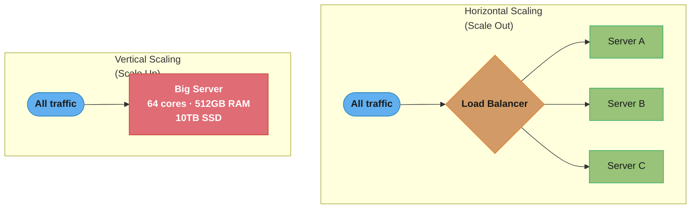
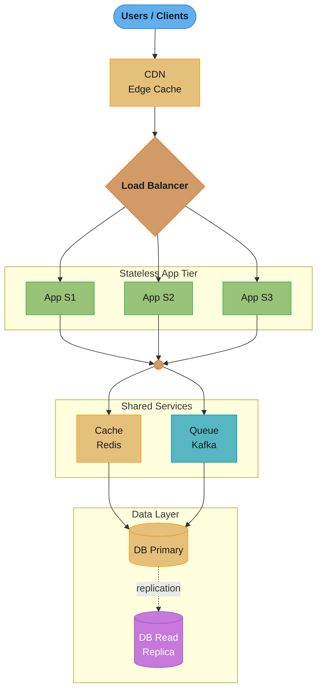
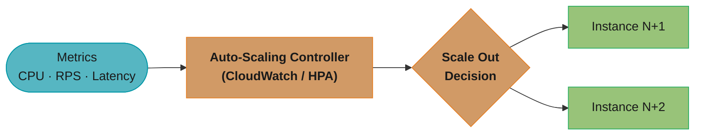
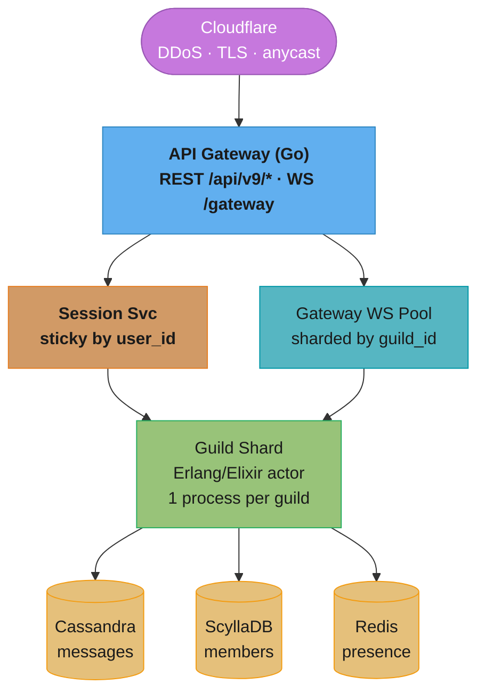
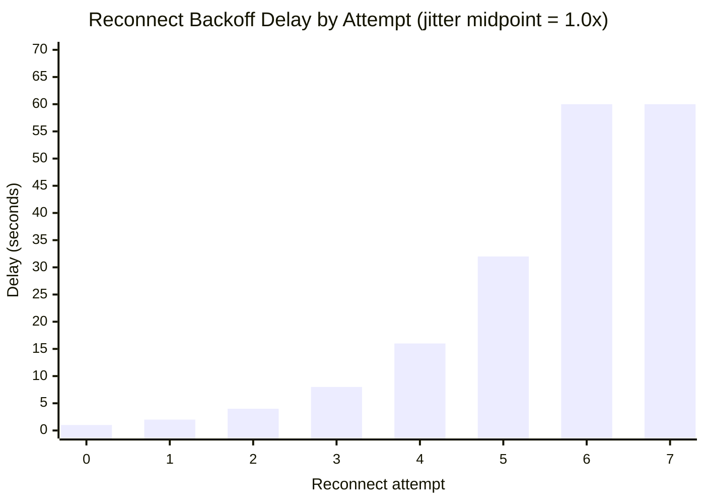
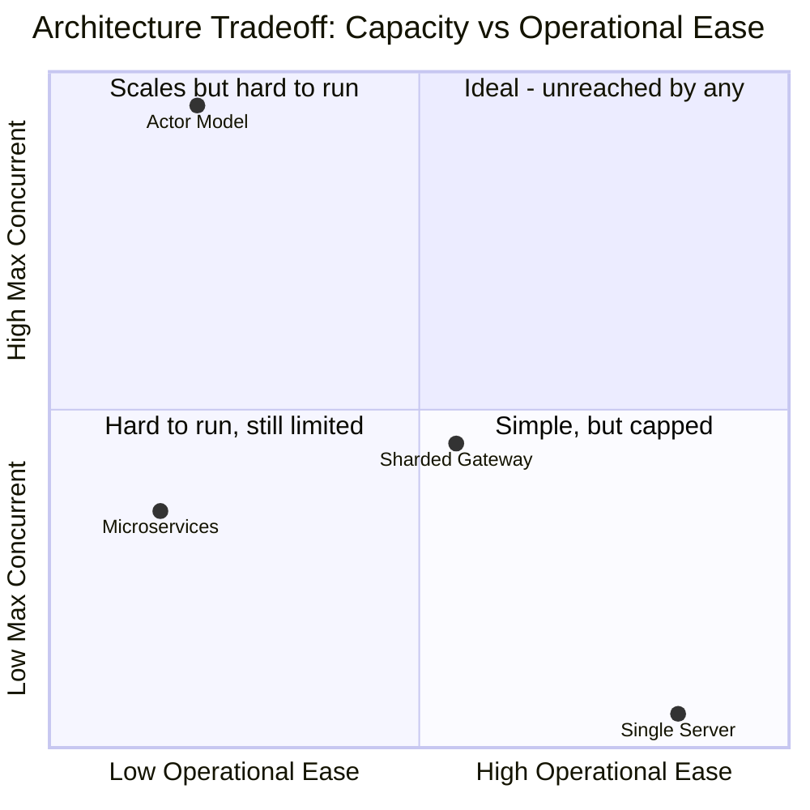

# Scalability

## Table of Contents
1. [Concept Overview](#concept-overview)
2. [Core Principles](#core-principles)
3. [Types and Strategies](#types-and-strategies)
4. [Architecture Diagrams](#architecture-diagrams)
5. [How It Works](#how-it-works)
6. [Real-World Examples](#real-world-examples)
7. [Tradeoffs](#tradeoffs)
8. [When to Use](#when-to-use)
9. [When NOT to Use](#when-not-to-use)
10. [Common Pitfalls](#common-pitfalls)
11. [Technologies and Tools](#technologies-and-tools)
12. [Interview Questions](#interview-questions)
13. [Best Practices](#best-practices)
14. [Metrics and Monitoring](#metrics-and-monitoring)
15. [Case Study](#case-study)

---

## Intuition

> **One-line analogy**: Scalability is like a restaurant that can add more tables and waitstaff as customers increase, rather than making one waiter run faster.

**Mental model**: Vertical scaling (bigger server) is like hiring a superhero waiter — there's a physical ceiling to how fast one person can work. Horizontal scaling (more servers) is like hiring more normal waiters — you can keep adding indefinitely, but now you need a host to route customers (load balancer) and a way to share information between waiters (distributed coordination). The goal: make the system stateless so any server can handle any request.

**Why it matters**: Scalability is the difference between a startup app that crashes at 1000 users and a production system serving 1 billion users. The architectural decisions made early (stateless services, database replication, caching) determine how easily you can scale later.

**Key insight**: The hardest part of scaling isn't adding more servers — it's managing shared state (databases, sessions, caches) as the system grows. Stateless application servers are trivial to scale; stateful databases are the bottleneck.

---

## Concept Overview

Scalability is the ability of a system to handle a growing amount of work by adding resources. A scalable system maintains acceptable performance levels as the load increases — whether that load is more users, more data, more transactions, or more geographic regions.

**Why it matters:**
- Systems that cannot scale either crash under load or require expensive rewrites
- Scaling decisions made early in architecture have long-lasting impact
- Poor scalability leads to degraded user experience, lost revenue, and reputation damage
- Modern distributed systems are designed from the ground up for scalability

Scalability is not just about handling more traffic — it also encompasses data volume growth, geographic expansion, and feature complexity over time. A system might scale in compute but not in storage, or scale in reads but not writes.

**Two dimensions of scalability:**
- **Load scalability**: Handle more concurrent users or requests
- **Data scalability**: Handle larger datasets without degradation

---

## Core Principles

### 1. Statelessness
Each request contains all information needed to process it. No server-side session state means any server can handle any request, enabling horizontal scaling.

### 2. Loose Coupling
Components communicate through well-defined interfaces. Changing or scaling one component does not require changing others. This allows independent scaling of bottlenecks.

### 3. Asynchronous Processing
Offload slow or non-critical work to background queues. The user gets an immediate response; the heavy lifting happens later. This prevents blocking under load.

### 4. Partitioning / Sharding
Divide data and work into independent chunks that can be distributed across machines. No single node should become a bottleneck due to data concentration.

### 5. Caching
Serve repeated reads from fast in-memory stores instead of hitting the database every time. Reduces load on backend systems dramatically.

### 6. Avoiding Single Points of Failure (SPOF)
Redundancy at every layer. If any single component can take down the system, it will become a scaling bottleneck at high traffic.

### 7. Elastic Capacity
Provision resources dynamically in response to actual load rather than peak estimates. Cloud infrastructure enables this through auto-scaling groups.

---

## Types and Strategies

### Vertical Scaling (Scale Up)
Add more resources to a single machine — more CPU cores, RAM, or faster disks.

- **Pros**: Simple, no code changes required, no distributed systems complexity
- **Cons**: Hardware limits exist, single point of failure, downtime during upgrades, expensive at the high end
- **Use when**: Application is hard to distribute (e.g., relational database primary), load increase is modest, team lacks distributed systems experience

### Horizontal Scaling (Scale Out)
Add more machines to a pool. Traffic is distributed across all instances.

- **Pros**: No upper limit (theoretically), commodity hardware, fault tolerant, can scale down to save cost
- **Cons**: Requires stateless application design, more complex operations, data consistency challenges
- **Use when**: Application is stateless or can be made stateless, load is highly variable, fault tolerance is required

### Database Scaling Strategies

**Read Replicas**: Route read queries to replicas, writes only to primary. Works well when read:write ratio is high (most apps).

**Sharding (Horizontal Partitioning)**: Split data across multiple databases by a shard key (user ID, geography, etc.).

**Vertical Partitioning**: Split tables across databases by column groups. E.g., user profile columns in one DB, user activity in another.

**CQRS (Command Query Responsibility Segregation)**: Separate read and write models entirely. Optimized data stores for each.

### Auto-Scaling
Automatically add or remove instances based on metrics:
- **Reactive scaling**: Scale based on current CPU/memory/request-rate thresholds
- **Predictive scaling**: Scale based on historical patterns (e.g., pre-warm before daily traffic spike)
- **Scheduled scaling**: Manual schedule for known traffic events

### Stateless Design Strategies
- Store session data in external stores (Redis, DynamoDB)
- Use JWT tokens instead of server-side sessions
- Store uploaded files in object storage (S3), not local disk
- Externalize all configuration (environment variables, config service)

---

## Architecture Diagrams

### Vertical vs Horizontal Scaling



The single big server (red) has a hard ceiling and is a single point of failure; the load balancer (orange) turns "add a server" into a routing decision instead of a hardware upgrade, so the horizontally scaled fleet (green) can keep growing indefinitely.

### Three-Tier Scalable Architecture



Every app instance in the stateless tier (green) is identical and horizontally scaled, so the load balancer (orange) can route to any of them; the primary database (gold) takes all writes and ships a replication stream to the read replica (purple) exactly as described in the Database Scaling Mechanics below.

### Auto-Scaling Architecture



The controller (orange) continuously watches incoming metric signals (teal) and, once a threshold is breached, provisions new instances (green) that register with the load balancer's target group.

---

## How It Works

### Horizontal Scaling Mechanics

1. A load balancer sits in front of the application tier
2. Multiple identical stateless application instances run behind it
3. Each incoming request is routed to one of the available instances
4. Because instances are stateless (no local session), any instance can handle any request
5. When CPU or memory thresholds are breached, the auto-scaler provisions new instances
6. New instances register with the load balancer's target group and start receiving traffic
7. When load drops, instances are decommissioned (drain connections first, then terminate)

### Stateless Design Mechanics

Without statelessness, horizontal scaling breaks:
- User logs in on Server A, session stored in memory
- Next request goes to Server B (different server) — session not found — user appears logged out

Solution: Externalize all state.
- Sessions go into Redis (shared across all servers)
- File uploads go to S3 (shared object storage)
- Config comes from environment or a config service
- Any server in the pool can pick up any request

### Database Scaling Mechanics

**Read Replicas:**
1. Primary handles all writes
2. Replication stream (binary log) ships changes to replicas
3. Application routes read queries to replicas via a read endpoint
4. Replicas may lag slightly (replication lag) — acceptable for non-critical reads

**Sharding:**
1. Choose a shard key (e.g., `user_id % N`)
2. Each shard is an independent database storing a subset of rows
3. Application or a shard router determines which shard to query
4. Cross-shard queries are expensive — design queries to stay within one shard

---

## Real-World Examples

### Netflix
- Runs entirely on AWS, using horizontal scaling across hundreds of microservices
- Each microservice scales independently based on its own load profile
- Uses Cassandra (horizontally scalable NoSQL) for user viewing history — petabytes of data
- CDN (Open Connect) scales content delivery by caching popular video at edge nodes globally
- During the 2020 COVID surge, Netflix scaled rapidly by adding AWS capacity within hours

### Amazon
- "The Bezos API Mandate" — all teams must expose functionality as services, enabling independent scaling
- DynamoDB was invented by Amazon to replace relational databases that couldn't scale horizontally
- EC2 Auto Scaling Groups automatically add capacity during Prime Day traffic spikes
- SQS decouples order processing — the order intake can scale independently of fulfillment

### Google
- Google Search is horizontally scaled across thousands of machines globally
- Bigtable (and later Spanner) were built specifically to scale beyond what traditional RDBMS could handle
- Colossus (successor to GFS) scales distributed file storage across data centers
- GKE (Google Kubernetes Engine) auto-scales containers based on CPU/memory/custom metrics

### Twitter
- In 2012, Twitter had the "Fail Whale" — the service was not horizontally scalable
- Rewrote core systems to be stateless, moved sessions to Memcached
- Sharded MySQL by user ID to scale the database tier
- Moved to a timeline fanout architecture with Redis sorted sets to scale feed reads

---

## Tradeoffs

| Aspect | Vertical Scaling | Horizontal Scaling |
|--------|-----------------|-------------------|
| Complexity | Low | High |
| Cost at scale | Very high | Moderate |
| Upper bound | Hard limit | Theoretically unlimited |
| Fault tolerance | Low (SPOF) | High |
| Latency | Low (no network hops) | Slightly higher (distributed) |
| Data consistency | Simple | Challenging |
| Operational overhead | Low | High |

### What You Gain
- Higher throughput (more requests per second)
- Better fault tolerance (redundant instances)
- Cost efficiency (scale down when idle)
- Geographic distribution (serve users closer to their location)

### What You Lose
- Simplicity — distributed systems are fundamentally harder to reason about
- Consistency guarantees — CAP theorem forces tradeoffs
- Operational predictability — more moving parts means more failure modes
- Development velocity early on — premature optimization is real

---

## When to Use

- **Expecting 10x+ traffic growth** in the next 12-18 months
- **Traffic is highly variable** (e.g., retail with Black Friday spikes)
- **High availability requirements** — users expect 99.9%+ uptime
- **Multiple geographic regions** need to be served with low latency
- **Data volume is growing** beyond what a single machine can handle efficiently
- **Team is large enough** to manage distributed system complexity
- **Cost optimization matters** — need to scale down during off-peak hours

---

## When NOT to Use

- **Early-stage startup** with no proven traffic — over-engineering kills velocity
- **Internal tool or low-traffic service** — YAGNI (You Ain't Gonna Need It)
- **Strong consistency is required** and the team lacks distributed systems expertise
- **Budget is extremely tight** — horizontal scaling infrastructure has overhead costs
- **Team size is 1-3 engineers** — operational complexity of distributed systems is a burden
- **Compliance or data residency** requirements prevent distributing data across regions

---

## Common Pitfalls

### 1. Premature Optimization
Designing for 100M users before you have 1,000. The "premature scalability" tax is real — it slows down feature development and adds complexity before it's needed.

### 2. Shared Mutable State
Storing state (sessions, uploads, config) on the local server filesystem or in-process memory. The moment you add a second server, things break in subtle, hard-to-debug ways.

### 3. The N+1 Query Problem
Loading a list of 100 items and then making 100 individual database queries (one per item). At scale, this becomes catastrophic. Use eager loading or batch queries.

### 4. Missing Database Indexes
A query that runs in 10ms on 10,000 rows may run in 10 seconds on 10,000,000 rows without proper indexes. Indexes are the first line of defense before scaling the database.

### 5. Ignoring the Database Tier
Scaling the application tier without addressing the database. The database becomes the bottleneck. Always look at query counts, slow query logs, and connection pool exhaustion.

### 6. Not Testing at Scale
System tests run on 1% of production data. Bugs only surface at 100x load. Load test regularly in a staging environment.

### 7. Unbounded Connection Pools
Each application server opens N connections to the database. With 50 app servers each with a pool of 20, that's 1,000 connections to the DB — often exceeding its limit. Use a connection pooler (PgBouncer).

### 8. Synchronous Fanout
Sending an email, updating analytics, and refreshing a cache all synchronously as part of a user request. Each dependency increases latency and failure risk. Move non-critical work to async queues.

---

## Technologies and Tools

### Application Scaling
- **Kubernetes (k8s)**: Container orchestration with Horizontal Pod Autoscaler (HPA)
- **AWS Auto Scaling Groups**: EC2-based auto-scaling with lifecycle hooks
- **Google Cloud Run**: Serverless containers that scale to zero
- **AWS Lambda / Google Cloud Functions**: Function-level scaling, no server management

### Load Balancers
- **Nginx**: High-performance L7 load balancer and reverse proxy
- **HAProxy**: Extremely fast L4/L7 load balancer
- **AWS ALB/NLB**: Managed load balancers with auto-scaling integration
- **Envoy**: Modern L7 proxy used in service meshes

### Stateless Session Management
- **Redis**: In-memory key-value store for session externalization
- **JWT (JSON Web Tokens)**: Stateless authentication tokens — no server-side storage needed

### Database Scaling
- **ProxySQL / PgBouncer**: Database proxy and connection pooler
- **Vitess**: MySQL sharding and scaling (used by YouTube)
- **Citus**: PostgreSQL extension for horizontal sharding
- **Amazon RDS Aurora**: Auto-scaling storage, read replicas, multi-AZ

### Distributed Databases (Built for Scale)
- **Cassandra**: Masterless, linear horizontal scaling, built for write-heavy workloads
- **DynamoDB**: Fully managed, single-digit millisecond at any scale
- **CockroachDB**: Distributed SQL with horizontal scaling and strong consistency

---

## Interview Questions

**Q1: What is the difference between horizontal and vertical scaling?**
Vertical scaling adds resources (CPU, RAM) to one machine. Horizontal scaling adds more machines. Horizontal scaling is preferred for large-scale systems because it has no hard upper bound, enables fault tolerance, and allows cost-efficient auto-scaling.

**Q2: What does it mean for an application to be "stateless," and why does it matter for scalability?**
A stateless application stores no per-user data in server memory between requests. All state lives in external stores (databases, caches). This matters because any server instance can handle any request, enabling unrestricted horizontal scaling.

**Q3: How would you scale a read-heavy application?**
Add read replicas to the database and route reads to them. Add a caching layer (Redis/Memcached) for frequently read data. Use a CDN for static assets. Scale the application tier horizontally with a load balancer.

**Q4: What is database sharding and what problem does it solve?**
Sharding partitions data across multiple database servers by a shard key. It solves the problem of a single database being too slow or too full for the workload. Each shard handles a subset of the data, enabling both read and write scaling.

**Q5: What is the CAP theorem and how does it relate to scaling?**
CAP states a distributed system can guarantee only 2 of 3: Consistency, Availability, Partition Tolerance. Since network partitions are unavoidable at scale, systems must choose between strong consistency (CP, e.g., HBase) and high availability (AP, e.g., Cassandra).

**Q6: How does auto-scaling work in AWS?**
Auto Scaling Groups monitor CloudWatch metrics (CPU, network I/O, custom metrics). When a metric breaches a threshold, a scaling policy triggers: add instances (scale out) or remove instances (scale in). New instances launch from an AMI or launch template and register with a load balancer.

**Q7: What is the thundering herd problem and how do you mitigate it?**
When a cache expires, many concurrent requests simultaneously hit the database to regenerate the cache, overwhelming it. Mitigate with: mutex locking (only one request regenerates), probabilistic early expiration, or staggered TTLs.

**Q8: How would you design a system to handle 10x its current traffic in 6 months?**
Profile current bottlenecks. Likely: add caching layer, add read replicas, scale app tier horizontally (if not already), move background jobs to async queues, set up auto-scaling, add a CDN for static assets. Each step gives a multiplier; combined they handle 10x.

**Q9: What is connection pooling and why is it important at scale?**
Opening a database connection is expensive (auth, network handshake). Connection pooling maintains a pool of pre-opened connections that are reused across requests. Without it, each request opens a new connection — at scale this exhausts the database's connection limit and adds latency.

**Q10: Explain the difference between latency and throughput. Which matters more?**
Latency is time per request (ms). Throughput is requests per second. Both matter: latency for user experience, throughput for capacity. They are not the same — a system can have low latency at low load but poor throughput. Load testing reveals both dimensions.

**Q11: What is the shared-nothing architecture?**
Each node in the cluster is independent — no shared disk, no shared memory. Nodes communicate only via network messages. This maximizes horizontal scalability because there are no contention points. Cassandra and many NoSQL systems use this.

**Q12: How would you scale a global application to serve users across 3 continents?**
Deploy instances in multiple geographic regions (AWS regions or GCP regions). Use a global load balancer (AWS Route 53 latency routing, Cloudflare) to route users to the nearest region. Replicate data across regions (active-active or active-passive). Use a CDN for static content.

**Q13: A rolling deploy disconnects 1M WebSocket clients at once — what happens if they all reconnect immediately, and what's the fix?**
Immediate reconnects arrive as a single synchronized wave that can exceed the backend's capacity by orders of magnitude, taking down infrastructure that was healthy seconds earlier. The Discord case study's third pitfall shows the blast: 1M simultaneous reconnects each triggered a Cassandra presence-load query, and Cassandra collapsed under 1M QPS — the original naive `on('disconnect', () => connect())` handler caused an 8-minute outage. The fix is two-sided: client-side exponential backoff with jitter (`delay = min(rand(0.5, 1.5) * 2^attempt seconds, 60s)`) spreads the reconnect wave over a full minute instead of one instant, and server-side, the presence cache is warmed in Redis before nodes accept new connections so each reconnect stops costing a cold database query — recovery improved to 95% of clients reconnected within 45 seconds. Build jittered backoff into any client that auto-reconnects, because a fleet of well-meaning clients retrying in lockstep is indistinguishable from a DDoS.

**Q14: Why does adding more app servers sometimes make the database fall over, and what limits total connections at scale?**
Every app server holds its own pool of database connections, so scaling the app tier multiplies total connections until the database's limit is exhausted. Common Pitfall 7 gives the arithmetic: 50 app servers each with a modest pool of 20 is already 1,000 connections — often past a Postgres instance's practical limit, where each connection costs server-side memory and context-switching overhead even when idle. This is also why Common Pitfall 5 warns against scaling the application tier without looking at the database: the app tier is stateless and trivially scalable, but every new instance transfers more concurrency pressure onto the stateful tier that can't scale the same way. Put a connection pooler (PgBouncer, ProxySQL) between the app fleet and the database so thousands of app-side connections multiplex over a few dozen real database connections, and treat the total-connection budget as a first-class capacity constraint when sizing auto-scaling limits.

**Q15: In the Discord case study, why does a message to a 500k-member guild fan out to only ~30k recipients?**
Discord fans out to currently connected sessions, not to all members, because pushing to offline members is pure waste — they can't receive a WebSocket write anyway. The case study's second pitfall shows the broken version: looping over all 500k members monopolized the gateway's event loop for 4 seconds, stalling every other message on that node, when only 5-10% of a large guild's members are online at any moment. The fix — presence-filtered fan-out from an in-memory presence map (`presence.online(guild_id)`) — cut 500k writes to ~30k, and pairs with per-session bounded queues (1024 messages, drop-from-head with a resync signal) so a slow client can't cause gateway OOM. When designing any fan-out path, ask what fraction of the nominal audience can actually consume the message right now, and filter to that set before doing the work.

**Q16: Discord's architecture went through four distinct scaling phases — why not build the final actor-model architecture from day one?**
Each architecture was the right one for its scale, and the bottleneck that forces the next phase can't be reliably predicted before you hit it. The case study's inflection table shows the progression: a single Go server sufficed to 25k users, sharding the gateway by user_id carried it to 100k (the C10K file-descriptor wall), the Elixir actor model solved per-guild fan-out cost at 100k-5M, and moving member lists to ScyllaDB fixed Cassandra's GC-driven read latency beyond 5M. Building the BEAM actor fleet on day one would have been the "premature optimization" pitfall (Common Pitfall 1) — enormous operational complexity (the tradeoff table rates BEAM ops "Hard") purchased years before any bottleneck justified it, slowing feature development the whole time. Scale architecture in response to measured bottlenecks, but keep the cheap early options open — statelessness and clean sharding keys from day one are what made each of Discord's migrations possible without a rewrite.

---

## Best Practices

1. **Measure before you optimize.** Profile first — identify the actual bottleneck before adding complexity.
2. **Design for statelessness from day one.** Retrofitting statelessness is painful. Use external session stores from the start.
3. **Use connection pooling.** Never connect application servers directly to the database without a pooler at scale.
4. **Index your queries.** Review the slow query log weekly. Add indexes for common query patterns.
5. **Separate read and write paths.** Even before sharding, using read replicas doubles your database capacity.
6. **Async everything non-critical.** Emails, notifications, analytics, audit logs — none of these need to happen in the request path.
7. **Set resource limits and circuit breakers.** A single slow dependency should not cascade and take down the entire system.
8. **Test at production scale.** Load test in staging regularly. Know your system's breaking point before users find it.
9. **Plan for graceful degradation.** When at capacity, shed non-critical load gracefully (return cached stale data, disable non-essential features) rather than crashing.
10. **Document your scaling runbook.** When the pager goes off at 2am, engineers need clear, practiced steps — not improvisation.

---

## Metrics and Monitoring

### Application Metrics
| Metric | Description | Alert Threshold |
|--------|-------------|-----------------|
| Request Rate (RPS) | Requests per second | Baseline + 2 std dev |
| P99 Latency | 99th percentile response time | > 500ms (web), > 5s (API) |
| Error Rate | Percentage of 5xx responses | > 0.1% |
| Active Connections | Current open connections | > 80% of max |
| Queue Depth | Messages waiting in async queues | > 10,000 |

### Infrastructure Metrics
| Metric | Description | Alert Threshold |
|--------|-------------|-----------------|
| CPU Utilization | Average across all instances | > 70% (trigger scale-out) |
| Memory Usage | % used | > 80% |
| Disk I/O | IOPS consumed | > 80% of provisioned |
| Network Throughput | Bytes in/out | > 80% of bandwidth |

### Database Metrics
| Metric | Description | Alert Threshold |
|--------|-------------|-----------------|
| Query Latency | Time per query | P99 > 100ms |
| Replication Lag | Seconds behind primary | > 10s |
| Active Connections | Open connections | > 80% of max_connections |
| Slow Query Count | Queries > threshold | > 10/min |
| Lock Wait Time | Time waiting for row locks | > 1s |

### Tools
- **Prometheus + Grafana**: Industry standard for metrics collection and dashboards
- **Datadog**: Full-stack observability platform
- **AWS CloudWatch**: Native AWS metrics and alarms for auto-scaling
- **New Relic APM**: Application performance monitoring with request tracing

---

## Cross-Perspective: LLD Connections

**LLD View — Design Patterns That Implement Scalability**

- **Strategy** — Horizontal scaling policies, load-shedding strategies, and auto-scaling triggers (CPU threshold, queue depth, RPS) are Strategy implementations: the scaler holds a `ScalingPolicy` interface and swaps algorithms at runtime.
- **Observer** — Health check monitors observe service state changes and notify auto-scalers, load balancers, and alerting systems. When a node's CPU crosses a threshold, observer subscribers react without polling.
- **Proxy** — Service mesh sidecars (Envoy, Linkerd) are Proxy pattern at infrastructure scale: they intercept all traffic to transparently add retries, circuit breaking, mTLS, and distributed tracing.
- **Facade** — A scaled-out backend fleet (10 replicas) is presented as a single virtual endpoint via a load-balancing facade, hiding fleet topology from consumers.

---

**Cross-references:** [database/replication_and_high_availability](../../database/replication_and_high_availability/) (read replicas, leader election, failover), [backend/distributed_system_operational_patterns](../../backend/distributed_system_operational_patterns/) (autoscaling, capacity planning), [devops/kubernetes_scheduling_and_autoscaling](../../devops/kubernetes_scheduling_and_autoscaling/) (HPA/VPA, cluster autoscaling).

---

## Case Study: Scaling Discord to 1M Concurrent Users per Channel

### Problem Statement

Discord scaling its real-time messaging platform for major gaming events (game launches, esports tournaments):

- **Peak concurrent users per channel:** 1M (single Pokemon Go community server)
- **Total daily message volume:** 2.5 billion messages/day
- **Active servers (guilds):** 19M servers, 6.7M of which have > 100 members
- **Latency SLA:** p99 message delivery < 100ms in-region, < 250ms cross-region
- **Voice/video calls:** 4M concurrent voice sessions, requires < 80ms WebRTC RTT
- **Availability:** 99.95% (4.4 hours downtime/year budget)
- **Reconnection storm scale:** 1M users may reconnect within 60s after backend deploy

### Architecture Overview



Cloudflare (purple) is the external edge dependency; the gateway routes each connection by two independent keys — sticky by `user_id` for session affinity, sharded by `guild_id` for the WebSocket pool — both funneling into the per-guild actor (green), which is the only process that touches the three backing stores (gold).

### Key Design Decisions

1. **Erlang/Elixir actor model per guild.** Each guild is a lightweight BEAM process (2KB stack). 19M guilds run as 19M concurrent actors across a fleet of 200 nodes. *Alternative rejected:* thread-per-guild in JVM — 1MB stack x 19M = 19TB RAM, infeasible.

2. **Guild sharding by `guild_id % N`.** Each guild lives on exactly one shard; all members of that guild connect to that shard. Eliminates cross-shard fan-out for in-guild messages. *Alternative rejected:* random sharding — every message would require N-way fan-out lookup.

3. **Presence-aware fan-out.** Messages are pushed only to currently connected WebSocket sessions (from in-memory presence map), not to all guild members. *Alternative rejected:* broadcast to all members — a message to 500k-member guild would trigger 500k Cassandra writes; only ~50k are online at any time.

4. **WebSocket sticky routing via `Sec-WebSocket-Key` hash.** Gateway LB hashes by user_id to keep the user on the same gateway node, preserving the connection and avoiding session migration. *Alternative rejected:* round-robin WS — every reconnect rebuilds presence state from Cassandra (50ms cold start).

5. **Cassandra for messages, ScyllaDB for members.** Cassandra optimized for write-heavy append (messages); ScyllaDB (C++ rewrite) for the high-read member-list workload that bottlenecked on Cassandra's JVM GC. *Alternative rejected:* single store — Cassandra's read p99 at 200k QPS exceeded 50ms during compaction.

6. **Backpressure-aware push.** Each WS session has a 1024-message bounded queue; if a client cannot drain (slow network), additional messages are dropped from queue head with `MISSED_MESSAGES_RESYNC` signal. *Alternative rejected:* unbounded buffer — slow clients cause OOM on gateway nodes.

7. **Exponential backoff + jitter on reconnect.** After a gateway restart, clients reconnect with `delay = min(rand(0.5, 1.5) * 2^attempt seconds, 60s)`. *Alternative rejected:* immediate reconnect — observed a 1M-RPS reconnect storm taking down the entire gateway fleet for 8 minutes.

### Scaling Inflection Points

| Phase | Users      | Bottleneck                          | Architectural change                             |
|-------|------------|-------------------------------------|--------------------------------------------------|
| 1     | 0 - 25K    | Single Go server, in-memory state   | None — vertical scaling sufficed                 |
| 2     | 25K - 100K | C10K limit, OS file descriptors     | Sharded gateway by user_id, tuned `ulimit`       |
| 3     | 100K - 5M  | Per-guild fan-out cost              | Migrated guild logic to Elixir actor model       |
| 4     | 5M+        | Cassandra read latency under GC     | Member list moved to ScyllaDB (C++, no GC)       |

### Implementation

Elixir guild actor (simplified):

```elixir
defmodule Discord.GuildActor do
  use GenServer

  def init(guild_id) do
    {:ok, %{guild_id: guild_id, sessions: %{}}}
  end

  # Member connects — register their session pid
  def handle_cast({:connect, user_id, session_pid}, state) do
    Process.monitor(session_pid)
    {:noreply, put_in(state.sessions[user_id], session_pid)}
  end

  # Incoming message — fan out only to connected sessions
  def handle_cast({:publish, msg}, state) do
    Enum.each(state.sessions, fn {_uid, pid} ->
      send(pid, {:dispatch, msg})    # bounded mailbox, non-blocking
    end)
    Cassandra.write_async(state.guild_id, msg)
    {:noreply, state}
  end

  # Cleanup on session death
  def handle_info({:DOWN, _ref, _, pid, _}, state) do
    sessions = state.sessions
               |> Enum.reject(fn {_, p} -> p == pid end)
               |> Map.new()
    {:noreply, %{state | sessions: sessions}}
  end
end
```

Reconnect with jittered backoff (client-side TypeScript):

```typescript
async function connectWithBackoff(maxAttempts = 10): Promise<WebSocket> {
  for (let attempt = 0; attempt < maxAttempts; attempt++) {
    try {
      return await openWebSocket("wss://gateway.discord.gg");
    } catch (err) {
      const jitter = 0.5 + Math.random();             // [0.5, 1.5)
      const delay = Math.min(jitter * Math.pow(2, attempt) * 1000, 60_000);
      await sleep(delay);
    }
  }
  throw new Error("gateway unreachable");
}
```

The `min(jitter * 2^attempt, 60s)` formula is easiest to see as a curve — delay doubles each attempt until the 60s cap flattens it, which is exactly what spreads a 1M-client reconnect storm over a full minute instead of one instant:



### Tradeoffs

| Approach           | Single Server | Sharded Gateway | Actor Model (chosen) | Microservices |
|--------------------|---------------|-----------------|----------------------|---------------|
| Max concurrent     | ~10K          | ~500K           | 1M+ per channel      | Limited by RPC|
| State location     | In-process    | Per-shard       | Per-actor (BEAM)     | External store|
| Failure blast      | All users     | 1/N users       | 1 guild              | Service-wide  |
| Operational ease   | Easy          | Medium          | Hard (BEAM ops)      | Hard          |
| Cost per million   | Infeasible    | $20k/mo         | $8k/mo               | $35k/mo       |

Plotting operational ease against max concurrent capacity makes the tradeoff Discord accepted explicit: the Actor Model is the only option that scales past the top-left quadrant, and no approach reaches the "ideal" quadrant at all — Microservices is dominated outright, matching the Actor Model's operational cost with none of its capacity payoff.



### Metrics & Results

- **Peak concurrent users (single channel):** 1.05M (Pokemon Go community, July 2016)
- **Message delivery p99:** 78ms in-region, 220ms cross-region
- **Daily messages:** 2.5B sent, 14B delivered (with fan-out)
- **Gateway nodes:** 850 instances handling 11M concurrent WS connections
- **Cost per 1M messages delivered:** $0.0008 (industry avg ~$0.005)
- **Reconnect storm recovery:** previously 8 min downtime; now 95% reconnected within 45s

### Common Pitfalls / Lessons Learned

1. **Vertical scaling wall at 100k concurrent users.** Original Go gateway used a single process; OS file-descriptor limit and event-loop saturation capped it at ~100k connections per box. Adding bigger boxes (32-core, 256GB RAM) helped only marginally.
   - *Broken:* `runtime.GOMAXPROCS(32); /* one giant server */`
   - *Fix:* horizontal sharding by user_id across 200 gateway nodes, each handling ~50k connections.

2. **Fan-out storm on large-server message.** A message to a 500k-member guild triggered 500k WebSocket writes in a tight loop, monopolizing the gateway's event loop for 4 seconds during which all other messages stalled.
   - *Broken:* `for member in guild.members: send_ws(member, msg)`
   - *Fix:* presence-filtered fan-out — `for session in presence.online(guild_id): send_ws(session, msg)`. Reduced 500k writes to ~30k (only currently-connected).

3. **Thundering herd on reconnect after gateway deploy.** A rolling restart triggered 1M simultaneous reconnects; gateway nodes accepted 1M `INIT` requests, each spawning a Cassandra presence-load query — cassandra collapsed under 1M QPS.
   - *Broken:* `client.on('disconnect', () => connect());`
   - *Fix:* client-side exponential backoff with jitter (snippet above) spreads reconnects over 60s. Server-side: presence cache in Redis warmed before accepting new connections.

### Interview Discussion Points

**Q: Why Elixir/Erlang instead of Go or Java?**
BEAM (Erlang VM) supports millions of lightweight processes with preemptive scheduling and per-process garbage collection — a slow GC in one guild doesn't block others. Go's goroutines share a single GC; a 200ms STW pause stalls all guilds. JVM threads are too heavy (1MB stacks).

**Q: How do you handle a guild with 1M members?**
The guild actor itself stays on one node. Member-list reads are paginated and cached client-side. Voice/video for that guild use a separate Mediasoup SFU cluster (one SFU per voice channel, not per guild). The actor only fans out to currently-connected sessions, which is typically 5-10% of members.

**Q: What's the consistency model for messages?**
Eventual consistency at the per-channel level — messages may arrive out of order across regions during partition. Each message has a Snowflake ID (timestamp-based), so clients can re-sort. For strict ordering, Discord uses Cassandra's per-partition write order within a single guild.

**Q: How do you migrate a guild between shards?**
Manually triggered for re-balancing: pause writes to the guild (clients see brief "rate limited"), replicate state to the target shard, atomically update the routing table in ZooKeeper, resume writes. Takes ~5s per guild; done off-peak.

**Q: What happens if BEAM node hosting a popular guild crashes?**
Erlang supervisors restart the actor on another node; presence is rebuilt from Redis (warm cache, < 200ms). Clients see a 1-2s message delivery gap. Cassandra-backed message history is unaffected. Recovery is automatic.

**Q: Why sticky sessions when you could use stateless workers?**
WebSocket connections are stateful (TCP). Even with stateless app servers, the TCP socket lives on one machine. Sticky routing avoids the cost of state migration on every message. Discord pushes 14B messages/day — even a 1ms state-lookup cost adds 14M CPU-seconds/day.

**Q: How do you load-test a 1M concurrent-user channel?**
Custom load generator (Tsung-derived) simulating 1M WebSocket clients across 500 EC2 instances. Each generator sends randomized presence updates, chat messages, and reconnect events. Measures per-message delivery latency from publish to last receiver acknowledgment.
