# Security and Authentication/Authorization

## 1. Concept Overview

Every system design interview eventually reaches the question: "how do you secure this?" The answer has two distinct halves that are constantly conflated:

- **Authentication (AuthN)** — *"Who are you?"* Verifying identity: a user, a service, a device presents credentials (password, certificate, token) and the system confirms they are who they claim to be.
- **Authorization (AuthZ)** — *"What are you allowed to do?"* Given a verified identity, deciding whether this specific request (read order #4521, delete user #88, call the `/admin/refund` endpoint) is permitted.

These are handled by different components, at different points in the request path, and conflating them is itself a common design mistake (§10). A request typically passes through: **TLS termination** (encrypts the wire) -> **AuthN** (who is this — validate a token/session/cert) -> **AuthZ** (can this identity do this specific thing) -> business logic. Around all of this sits **defense in depth**: encryption at rest, secrets management, and protection against the OWASP Top 10 attack classes (injection, broken access control, etc.).

This module is the architectural decision layer: how to choose between session-based and token-based auth, how OAuth2/OIDC fit into a system's identity architecture, how tokens propagate through a microservices call chain, and where encryption boundaries belong. The cryptographic internals (TLS handshake details, JWT signature algorithms, bcrypt internals) and framework-specific implementations (Spring Security filter chains) are covered in the deep-dive companions in §13 — this module focuses on *which mechanism to choose, and why, when designing a system from scratch*.

---

## 2. Intuition

> **One-line analogy**: Authentication is showing your passport at border control — proving *who you are*. Authorization is the visa stamped inside it — proving *what you're allowed to do here* (tourist, work, transit). A valid passport with no visa gets you stopped at the gate even though your identity isn't in question.

**Mental model**: A bearer token (JWT, session cookie, API key) is like a hotel keycard. Whoever *holds* the card can open the door — the door doesn't re-verify your face. This is why **how the card is stored and transmitted IS the security model**: a keycard photographed and copied works identically to the original. A JWT stolen via XSS from `localStorage` is just as valid as the legitimate user's JWT until it expires — there's no second check. This is why short token lifetimes (§6.2), `httpOnly` cookies, and TLS everywhere aren't optional hardening — they're the *primary* defense for bearer credentials.

**Why it matters**: Authentication and authorization decisions made early — session vs. token, monolithic IdP vs. per-service validation, coarse vs. fine-grained permissions — are extremely expensive to change later because every client and every service integrates against them. Retrofitting fine-grained authorization (e.g., row-level multi-tenant isolation) onto a system built with a single shared admin credential is a project measured in quarters, not days.

**Key insight**: **The hardest part of authorization at scale isn't checking permissions — it's *propagating identity and permission context* across a chain of microservices without either (a) re-authenticating at every hop (slow, chatty) or (b) trusting an internal network perimeter that, once breached, grants everything (the "M&M security" anti-pattern — hard crunchy shell, soft chewy center). The resolution is short-lived, signed tokens that carry identity + scope, validated independently by every service (§6.3), combined with mTLS between services so the *transport* itself is authenticated (§4.5).**

---

## 3. Core Principles

**1. Separate AuthN from AuthZ, and centralize AuthN.**
Identity verification (AuthN) should happen once, at an Identity Provider (IdP) — Okta, Auth0, Keycloak, Cognito, or a homegrown auth service. Authorization decisions (AuthZ) are made *per-service*, close to the resource, because only that service knows its own data model (can user X edit order Y?).

**2. Never trust the client.**
Any check performed only in JavaScript/mobile code (hide the "Delete" button if not admin) is a UX nicety, not security — an attacker calls the API directly. Every authorization decision must be enforced server-side, on every request, regardless of what the UI shows.

**3. Defense in depth — multiple independent layers.**
Network segmentation (VPC, security groups), transport encryption (TLS 1.2+/mTLS), application-layer AuthN/AuthZ, and data-layer encryption (encryption at rest, field-level encryption for PII) are independent layers. A failure in one (a misconfigured security group) shouldn't expose data if the others (encryption at rest, AuthZ checks) hold.

**4. Principle of least privilege.**
Every identity — human user, service account, CI/CD pipeline — gets the minimum set of permissions needed, for the minimum time needed. A service that only reads from a queue should have an IAM role that *cannot* write or delete, even if "it would never do that" — because if it's ever compromised, the blast radius is bounded by what its credentials *can* do, not what it *currently does*.

**5. Bearer tokens are short-lived; long-lived credentials are revocable.**
A stolen access token with a 15-minute lifetime limits an attacker's window to 15 minutes. A stolen refresh token (lifetime: days/weeks) or API key (lifetime: until rotated) must be *revocable* — which means the system issuing it must track it (§6.2), trading some of the "stateless" benefit of tokens for the ability to cut off a compromised credential immediately.

**6. Encrypt in transit AND at rest — they protect against different threats.**
TLS protects data crossing a network from interception (a attacker on the wire). Encryption at rest (disk encryption, database column encryption, KMS-managed keys) protects data if the storage medium itself is compromised (a stolen backup tape, an improperly decommissioned disk, a misconfigured S3 bucket). Neither substitutes for the other.

---

## 4. Types / Architectures / Strategies

### 4.1 Session-Based Authentication

The server creates a session record (user ID, roles, expiry) on login, stores it (in-memory, Redis, or DB), and returns a **session ID** to the client as a cookie. Every request, the client sends the cookie; the server looks up the session to identify the user.

- **Stateful** — the server (or a shared session store) must be queried on every request.
- Revocation is trivial (delete the session record).
- Requires a shared session store (Redis) for horizontal scaling — sessions can't live only in one server's memory.

### 4.2 Token-Based Authentication (JWT)

The server issues a **signed token** (JSON Web Token) containing claims (user ID, roles, expiry) directly. The client sends the token (typically `Authorization: Bearer <token>` header); any service with the signing key (or public key, for asymmetric signing) can **verify the signature locally** without calling back to the issuer.

- **Stateless** — no shared session store needed; any service can validate independently.
- Revocation is hard (§6.2) — a valid-signature token is accepted until it expires, even if the user's account was just disabled.
- Ideal for microservices and cross-domain APIs where a shared session store would be a bottleneck/single point of failure.

### 4.3 OAuth2 — Delegated Authorization

OAuth2 is a framework for **delegated access** — letting an application access resources *on a user's behalf* without the application ever seeing the user's password. Key roles: **Resource Owner** (the user), **Client** (the app requesting access), **Authorization Server** (issues tokens — the IdP), **Resource Server** (the API being accessed).

Grant types (flows):

- **Authorization Code + PKCE** — the standard for web/mobile apps with a UI. User is redirected to the Authorization Server, logs in, and consents; the Client receives a one-time code, exchanged server-side for tokens. PKCE (Proof Key for Code Exchange) prevents a stolen authorization code from being redeemed by an attacker (§6.3).
- **Client Credentials** — service-to-service, no user involved. The service authenticates with its own client ID/secret and gets a token representing *itself*.
- **Device Code** — for input-constrained devices (smart TVs): the device displays a code, the user enters it on a second device (phone) to authorize.
- **(Deprecated) Implicit & Resource Owner Password Credentials** — both considered insecure by current best practice (token exposed in URL fragment; app handles raw password directly) and replaced by Authorization Code + PKCE.

### 4.4 OpenID Connect (OIDC) — Authentication on Top of OAuth2

OAuth2 is fundamentally an *authorization* framework — it says nothing about *who* the user is. **OIDC adds an identity layer**: alongside the OAuth2 access token, the Authorization Server issues an **ID Token** (a JWT containing the user's identity claims — `sub`, `email`, `name`). This is what powers "Sign in with Google" — the access token lets the app call Google APIs (authorization), while the ID token tells the app *which user just signed in* (authentication).

### 4.5 Service-to-Service Auth: API Keys, mTLS, and Service Tokens

- **API Keys** — a static, long-lived secret string sent with each request. Simple, but coarse-grained (usually one key = full access), hard to rotate without coordination, and if logged accidentally (e.g., in a URL query param), permanently compromised until rotated.
- **mTLS (mutual TLS)** — both client and server present X.509 certificates; each verifies the other's identity as part of the TLS handshake. Common in service meshes (Istio, Linkerd) for **zero-trust networking** — every service-to-service call is authenticated at the transport layer, regardless of network location.
- **Service Tokens / Workload Identity** — short-lived tokens issued to a *workload* (a Kubernetes pod, an EC2 instance) based on its platform identity (IAM role, Kubernetes service account) rather than a static secret — e.g., AWS IAM roles for service accounts (IRSA), SPIFFE/SPIRE identities.

### 4.6 RBAC vs. ABAC

- **RBAC (Role-Based Access Control)** — permissions attached to roles (`admin`, `editor`, `viewer`); users assigned roles. Simple, auditable, but coarse — "can edit *any* document" vs. "can edit *their own* documents" requires either more roles or falls back to application code.
- **ABAC (Attribute-Based Access Control)** — permissions are rules evaluated against attributes of the user, resource, and context (`allow if user.department == resource.department AND time.hour BETWEEN 9 AND 17`). More flexible, supports fine-grained and dynamic policies (multi-tenancy, time-based access), but harder to audit ("what can Alice do?" requires evaluating rules against every resource, not reading a role list).

---

## 5. Architecture Diagrams

### 5.1 Session-Based vs. Token-Based Auth

**Session-Based (stateful):**

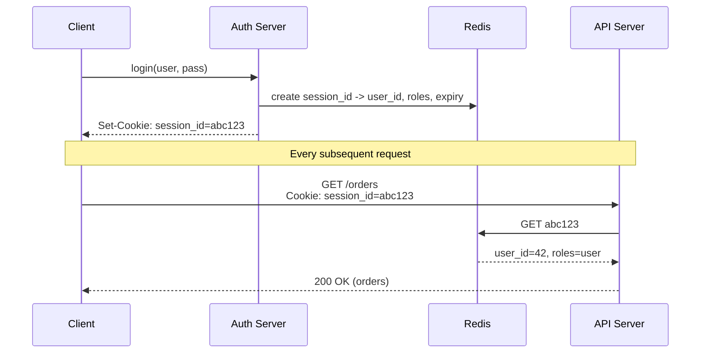

Every request costs one Redis lookup — the tradeoff for instant revocation (delete the session record).

**Token-Based (stateless, JWT):**

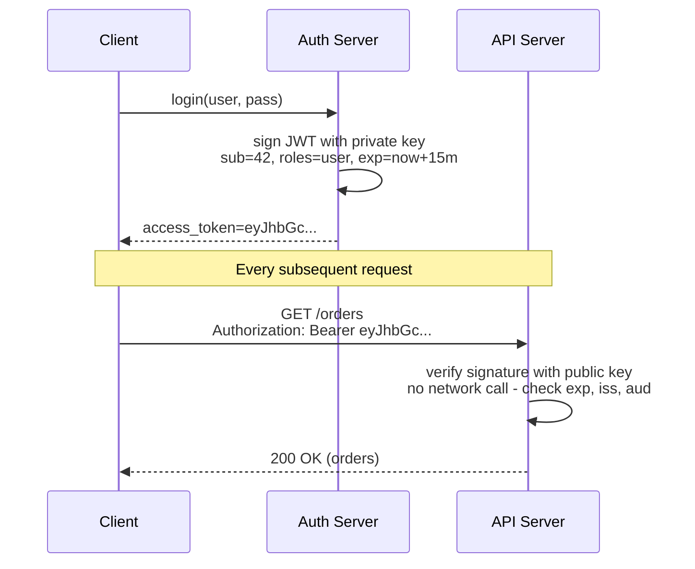

Any service holding the public key validates independently — no shared store, but no instant revocation either (§6.2).

### 5.2 OAuth2 Authorization Code Flow with PKCE

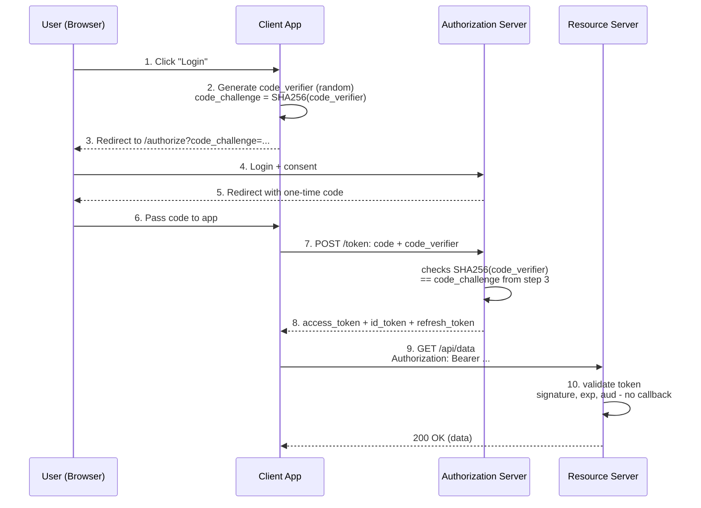

PKCE binds the token exchange (step 7) to whoever generated `code_verifier` in step 2 — see §6.3 for exactly what breaks without it.

### 5.3 Zero-Trust Service Mesh with mTLS

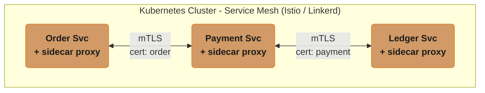

Each sidecar proxy presents its workload's X.509 certificate (issued by the mesh CA, auto-rotated roughly every 24h) and verifies the peer's certificate before any bytes flow, encrypting all traffic even inside the cluster. Result: even if an attacker gains network access to the cluster (e.g., a misconfigured pod), they cannot impersonate Order Svc without its private key, and cannot read traffic between Payment and Ledger.

### 5.4 Token Lifecycle: Access Token + Refresh Token Rotation

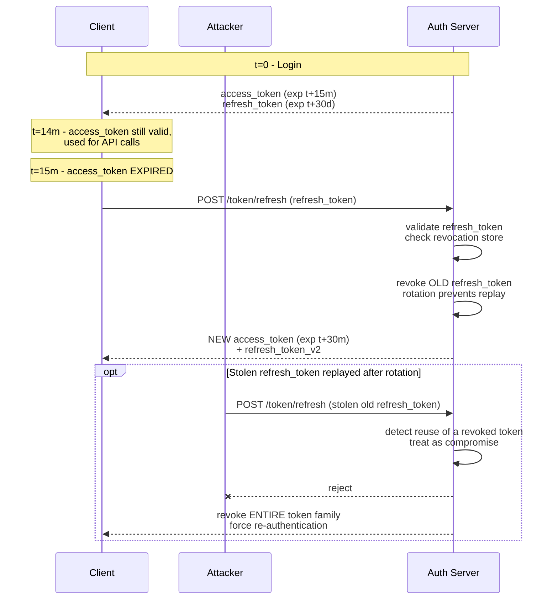

Rotation invalidates each refresh token after one use; replay of an already-used token is the compromise signal that revokes the whole token family, forcing re-authentication (§6.2).

---

## 6. How It Works — Detailed Mechanics

### 6.1 JWT Structure — Decoding a Real Token

A JWT is three Base64URL-encoded parts joined by dots: `header.payload.signature`.

```
eyJhbGciOiJSUzI1NiIsInR5cCI6IkpXVCJ9.eyJzdWIiOiI0MiIsImlzcyI6Imh0dHBzOi8v
YXV0aC5leGFtcGxlLmNvbSIsImF1ZCI6Im9yZGVyLXNlcnZpY2UiLCJyb2xlcyI6WyJ1c2Vy
Il0sImV4cCI6MTcxODAwMDAwMCwiaWF0IjoxNzE3OTk5MTAwfQ.SflKxwRJSMeKKF2QT4f...

Decoded HEADER:
{ "alg": "RS256", "typ": "JWT" }

Decoded PAYLOAD (claims):
{
  "sub": "42",                          // subject -- user ID
  "iss": "https://auth.example.com",    // issuer -- WHO issued this
  "aud": "order-service",               // audience -- WHO this token is FOR
  "roles": ["user"],
  "exp": 1718000000,                    // expiry (unix timestamp)
  "iat": 1717999100                     // issued-at
}

SIGNATURE: RS256 (RSA + SHA256) signature over header+payload,
           verifiable with the issuer's PUBLIC key.
```

**Critical validation checklist** (every service MUST check all of these — skipping any one is a vulnerability, see §10):
1. Signature is valid (using the issuer's current public key, fetched from a JWKS endpoint).
2. `exp` (expiry) has not passed.
3. `iss` (issuer) matches the expected Authorization Server.
4. `aud` (audience) includes THIS service — prevents a token issued for `payment-service` being replayed against `order-service` ("token confusion").
5. `alg` in the header matches an EXPECTED algorithm — never accept `alg: none` (§10).

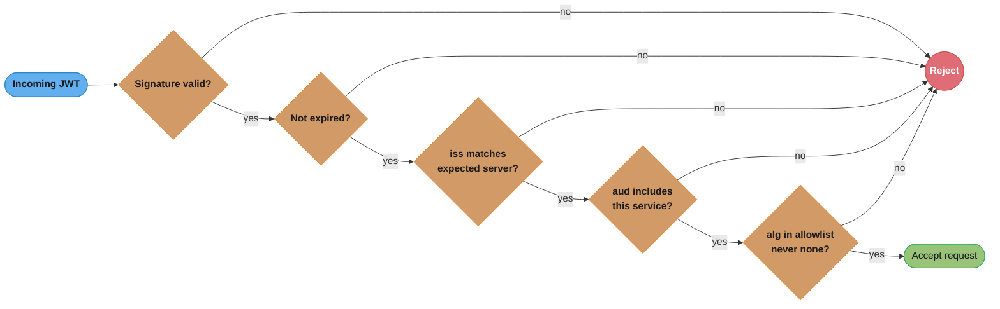

All five checks are a single AND gate, not five independent options — skipping any one (accepting `alg: none`, War Story 1 in §10; forgetting `aud`, War Story 3) turns a signature check into a full authorization bypass.

### 6.2 The Stateless Revocation Problem and Refresh Token Rotation

A signed JWT with `exp: t+15m` is valid for 15 minutes *no matter what happens server-side* — if a user's account is disabled at t+1m, their existing access token still works for 14 more minutes, because validation (§6.1) never queries a database.

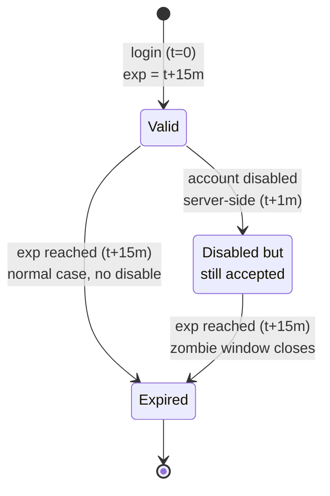

The "zombie window" made visible: disabling an account at t+1m does not move the token out of the accepted state — only reaching the original `exp` at t+15m does, leaving up to 14 minutes where a disabled user's token is still honored, because validation (§6.1) never re-checks account status.

```
Tradeoff table:

  Access token TTL    Blast radius if stolen   API call overhead
  ------------------  -----------------------  -------------------
  5 minutes           5 min max                Refresh every 5 min
  15 minutes          15 min max               Refresh every 15 min  <- common default
  1 hour              1 hour max               Refresh hourly
  No expiry (bad)     UNBOUNDED                None -- but see why this is wrong below
```

The standard resolution: **short-lived access tokens (15 min) + longer-lived refresh tokens (days/weeks), with rotation**. The refresh token IS tracked server-side (in a database/Redis) — so it CAN be revoked immediately (disable account -> delete refresh token record -> next refresh attempt fails -> user is fully logged out within 15 minutes at most, when their current access token expires). **Rotation** (§5.4) means each use of a refresh token invalidates it and issues a new one — if an attacker steals a refresh token and uses it, and then the legitimate user's next refresh also fires, the server detects two uses of the same token and can revoke the entire session family as a compromise signal.

### 6.3 PKCE — Why the Authorization Code Alone Isn't Enough

**Without PKCE (vulnerable on mobile/SPA):**

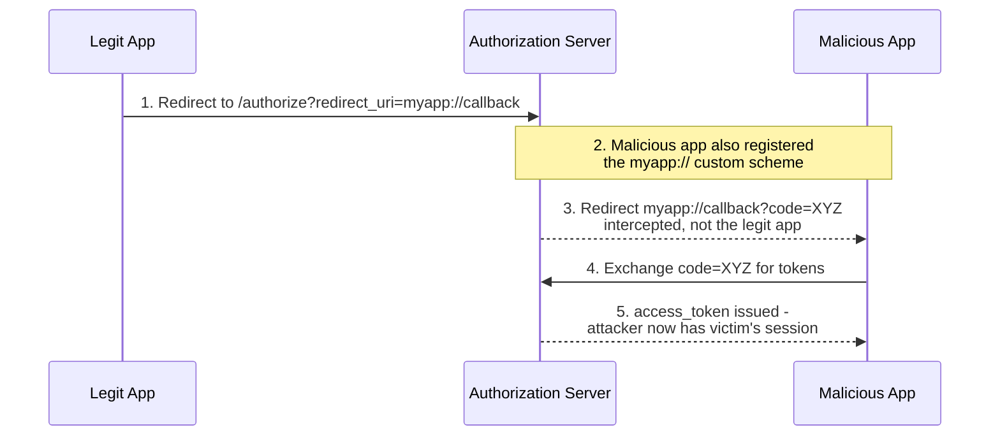

Without PKCE, whoever intercepts the redirect's one-time code can redeem it for tokens — on mobile, a malicious app can register the same custom URL scheme as the legitimate app.

**With PKCE:**

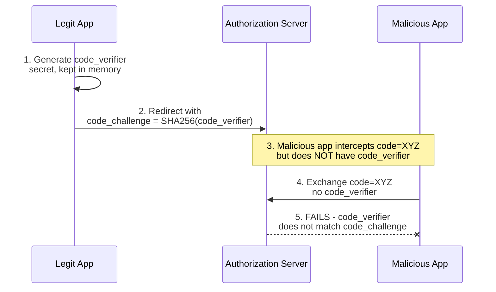

PKCE binds the code exchange to whichever party generated the original `code_verifier` — the malicious app has the intercepted code but never the verifier, so its exchange is rejected.

### 6.4 Password Storage — Hashing, Not Encryption

Passwords must NEVER be stored in plaintext or reversibly encrypted — they're stored as a **salted hash** using a deliberately slow algorithm (bcrypt, scrypt, or Argon2).

`bcrypt(password, cost_factor)` produces a salted hash whose cost factor directly controls how slow each hash is:

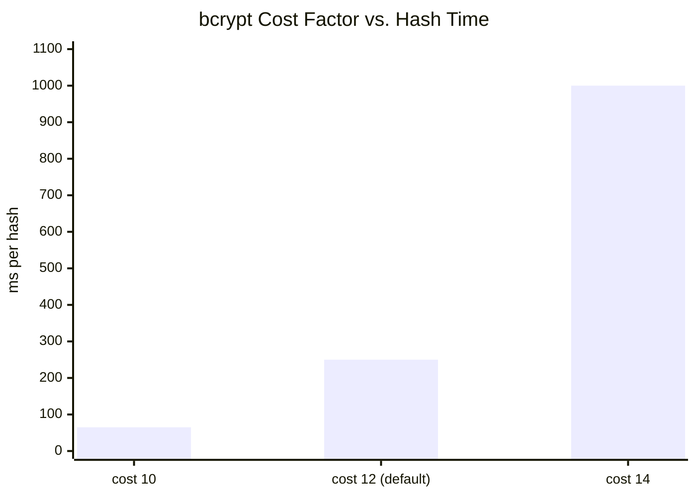

Each +2 cost factor roughly quadruples the hash time; ~250ms (cost 12) is the common production default.

**Why "slow" is the feature:** a legitimate login pays this cost once per login — imperceptible to a user. An attacker with a stolen hash database pays it per guess instead: at cost 12 (~250ms/guess), one GPU tries only ~4 guesses/sec, so a dictionary of 100M common passwords takes ~290 days PER HASH, versus seconds against an unsalted MD5 hash crackable at billions of guesses/sec.

Salt (a random per-password value, stored alongside the hash) ensures two users with the same password produce DIFFERENT hashes — defeating precomputed "rainbow table" attacks.

### 6.5 Encryption at Rest — Envelope Encryption with KMS

The naive approach — encrypting every row/file directly with one master key — means rotating that key requires re-encrypting EVERYTHING. Envelope encryption (used by AWS KMS, GCP KMS, Vault) avoids this:

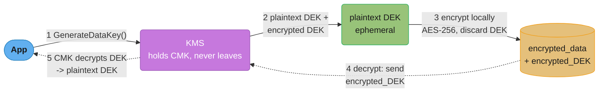

Only the small, per-object DEK ever travels to KMS (solid = encrypt path, dotted = decrypt path); rotating the CMK only requires re-encrypting the (small) DEKs, not the (large) underlying data, and every decrypt is an auditable KMS API call — "who decrypted what, when" is logged centrally.

---

## 7. Real-World Examples

- **Auth0 / Okta / AWS Cognito** — managed Identity Providers implementing OAuth2/OIDC, used so that companies don't build and maintain their own credential storage, MFA, and password-reset flows (a huge liability surface if done incorrectly).
- **Google's BeyondCorp** — the origin of the "zero trust" model: Google eliminated the corporate VPN/network perimeter entirely, requiring every internal request (employee-to-service, service-to-service) to be authenticated and authorized regardless of network location — directly informing the mTLS service mesh pattern (§4.5, §5.3).
- **Netflix's edge gateway (Zuul)** — terminates TLS and performs initial AuthN at the edge, then propagates a verified identity token to downstream microservices, so each of Netflix's 700+ services doesn't need to independently implement login/credential validation.
- **HashiCorp Vault** — centralizes secrets management (database credentials, API keys, encryption keys) with dynamic, short-lived credentials issued per-request and audited centrally — addressing the "hardcoded secrets in config files" pitfall (§10) at the platform level.
- **Stripe's API keys** — a real-world example of the API-key model (§4.5) done well: keys are scoped (publishable vs. secret, restricted-permission keys), prefixed for identification (`sk_live_...` vs `sk_test_...`), and instantly revocable from a dashboard.

---

## 8. Tradeoffs

### Session-Based vs. Token-Based (JWT) Authentication

| Dimension | Session-Based | Token-Based (JWT) |
|-----------|---------------|---------------------|
| State | Stateful (server/Redis stores session) | Stateless (self-contained, signed) |
| Revocation | Instant (delete session record) | Hard — requires short TTL + refresh-token tracking (§6.2) |
| Horizontal scaling | Requires shared session store | Any service with the public key validates independently |
| Cross-domain / mobile / 3rd-party APIs | Awkward (cookies are domain-scoped) | Natural fit (`Authorization` header works anywhere) |
| Payload size per request | Small (just a session ID) | Larger (full claims in every request) |
| Best for | Traditional server-rendered web apps, single domain | APIs, microservices, mobile apps, cross-domain SSO |

### OAuth2 Grant Type Comparison

| Grant Type | Use Case | User Involved? | Security Notes |
|------------|----------|-----------------|------------------|
| Authorization Code + PKCE | Web/mobile apps with login UI | Yes | Current best practice for user-facing apps |
| Client Credentials | Service-to-service (no user) | No | Service authenticates as itself; pair with short-lived tokens |
| Device Code | Smart TVs, CLI tools | Yes (on a second device) | User enters a code shown on the constrained device |
| Implicit (deprecated) | Legacy SPAs | Yes | Token exposed in URL fragment — avoid |
| Resource Owner Password (deprecated) | Legacy first-party apps | Yes | App handles raw password — avoid; use Authorization Code instead |

### RBAC vs. ABAC

| Dimension | RBAC | ABAC |
|-----------|------|------|
| Model | User -> Role -> Permissions | Rules over (user, resource, action, context) attributes |
| Auditability | High ("list users with role X") | Lower (must evaluate rules against data) |
| Flexibility | Coarse-grained | Fine-grained, dynamic (time, location, ownership) |
| Multi-tenancy fit | Needs per-tenant roles (role explosion) | Natural (`tenant_id` as an attribute) |
| Complexity | Low | Higher — needs a policy engine (e.g., OPA) |

---

## 9. When to Use / When NOT to Use

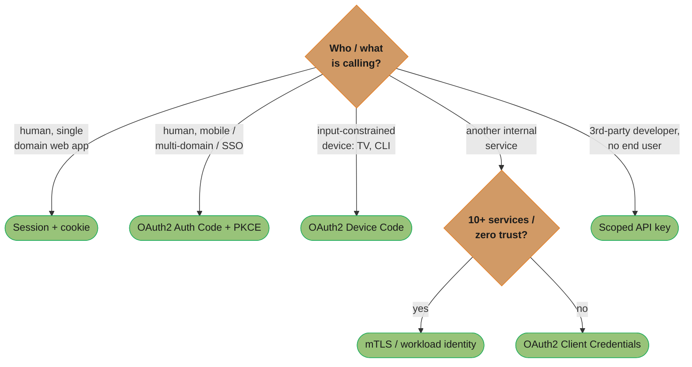

One picture across §4.1-§4.5: session cookies only fit a single-domain server-rendered app; a mobile client, a second domain, or SSO pushes you to OAuth2 Authorization Code + PKCE; service-to-service calls are their own decision — mTLS/workload identity once a system has 10+ internal services, Client Credentials below that.

### Use Session-Based Auth When
- A traditional server-rendered web application, single domain, where the simplicity of instant revocation and small request overhead outweighs statelessness.

### Use Token-Based (JWT/OAuth2) Auth When
- Building APIs consumed by multiple clients (web, mobile, third-party integrations), microservices that need to validate identity without a shared session store, or any system requiring SSO/federated identity.

### Use mTLS / Service Mesh Identity When
- Operating a microservices architecture where service-to-service traffic must be authenticated regardless of network location (zero trust) — typically justified once a system has 10+ internal services and/or operates in a regulated environment requiring auditable service identity.

### Use ABAC/Policy Engine (e.g., OPA) When
- Multi-tenant SaaS with per-tenant data isolation, or authorization rules that depend on resource ownership, time, or context — RBAC alone would require an unmanageable number of roles.

### Avoid / Be Cautious When
- **Building a custom AuthN system from scratch** when a managed IdP (Auth0/Okta/Cognito/Keycloak) would do — credential storage, MFA, and password-reset flows are high-liability surfaces best left to specialists with dedicated security teams.
- **Storing JWTs in `localStorage`** for browser apps — vulnerable to XSS token theft (§10); prefer `httpOnly`, `Secure`, `SameSite` cookies.
- **Using long-lived API keys for user-facing authentication** — API keys are appropriate for service-to-service or developer-API access, not as a substitute for proper user session/token management.

---

## 10. Common Pitfalls

**War Story 1 — The `alg: none` JWT Bypass**

A JWT library's signature verification was implemented as: "decode the token, check the `alg` header, if `RS256` verify with public key, if `none` skip verification (used in tests)." This test-only code path **shipped to production**. An attacker crafted a JWT with `{"alg": "none"}` in the header, an empty signature, and a payload claiming `{"sub": "1", "roles": ["admin"]}` — the verification code saw `alg: none`, skipped signature checking entirely, and treated the forged token as a valid admin session.
*Fix*: JWT validation must use an **allowlist of expected algorithms** (e.g., only `RS256`), explicitly rejecting `none` and any algorithm not in the allowlist — never branch verification logic based on the attacker-controlled `alg` field.

**War Story 2 — JWT in `localStorage`, Stolen via a Third-Party Script's XSS**

A SPA stored its JWT access token in `localStorage` for convenience (easy to read in JavaScript for API calls). A third-party analytics script, compromised via a supply-chain attack, ran `JSON.stringify(localStorage)` and exfiltrated it to an attacker-controlled endpoint — including every active user's JWT. Because the tokens were valid for **24 hours** (chosen for "user convenience" — fewer re-logins), the attacker had a 24-hour window to impersonate any of the ~40,000 affected users.
*Fix*: tokens moved to `httpOnly` cookies (inaccessible to JavaScript, hence to XSS) with `Secure` and `SameSite=Strict` flags, and access token TTL reduced to 15 minutes with refresh-token rotation (§6.2) — even a stolen access token now has a 15-minute blast radius instead of 24 hours.

**War Story 3 — Missing Audience Validation: Token Confusion Across Services**

Two internal services, `order-service` and `admin-service`, both validated JWTs using the same shared signing key but **neither checked the `aud` claim**. A token legitimately issued for a low-privilege user to call `order-service` (`aud: order-service`) was — due to a client bug — also sent to `admin-service`. `admin-service` validated the signature (valid — same key), saw `roles: ["user"]`, and because its authorization logic for one endpoint checked `roles.includes("user")` instead of an admin-specific role, the request succeeded against an endpoint that should have required `admin-service`-specific privileges.
*Fix*: every service validates `aud` against its own service identifier, rejecting tokens issued for a different audience — even if the signature is valid. Each service additionally maintains its own minimal authorization logic rather than relying on broad role strings shared across services.

**War Story 4 — Hardcoded Database Credentials in a Public Repository**

A database connection string, including a plaintext password, was committed to a configuration file in a (briefly) public GitHub repository during a refactor. Automated credential-scanning bots — which continuously scan public GitHub commits — found and used the credentials within **4 minutes** of the push, before the repository was made private again.
*Fix*: secrets management via Vault/AWS Secrets Manager/KMS-backed parameter stores — application code references a secret *name*, fetched at runtime with short-lived, auditable access; the actual credential value never exists in source control. Additionally, automated pre-commit/pre-push secret-scanning hooks block commits containing credential-shaped strings.

---

## 11. Technologies & Tools

| Category | Tools | Notes |
|----------|-------|-------|
| Identity Providers (IdP) | Auth0, Okta, AWS Cognito, Keycloak (self-hosted), Azure AD / Entra ID | Implement OAuth2/OIDC, MFA, password policies, social login |
| Token format / libraries | JWT (jjwt, jose, PyJWT, jsonwebtoken) | Always configure an algorithm allowlist (§10, War Story 1) |
| Secrets management | HashiCorp Vault, AWS Secrets Manager, GCP Secret Manager | Dynamic, short-lived credentials; audit logging |
| Encryption / KMS | AWS KMS, GCP Cloud KMS, Azure Key Vault | Envelope encryption (§6.5), key rotation |
| Service mesh / mTLS | Istio, Linkerd, AWS App Mesh | Automatic mTLS, workload identity, traffic policy |
| Policy engines (ABAC) | Open Policy Agent (OPA), AWS Cedar | Externalized, declarative authorization rules |
| Password hashing | bcrypt, scrypt, Argon2 | Argon2id is the current OWASP-recommended default |

> See [Spring Security Architecture](../../spring/spring_security_architecture/README.md) and [Spring Security: JWT & OAuth2](../../spring/spring_security_jwt_oauth/README.md) for filter-chain implementation details, and [Backend: Auth & Authorization Systems](../../backend/auth_and_authorization_systems/README.md) and [Backend Security & OWASP](../../backend/backend_security_owasp/README.md) for the full OWASP Top 10 treatment and production-grade implementation patterns.

---

## 12. Interview Questions with Answers

**Q1: What's the difference between authentication and authorization, and why does conflating them cause bugs?**

A: Authentication verifies *identity* ("who are you") — typically once, at login. Authorization verifies *permission* for a specific action ("can this identity do this") — on every request. Conflating them looks like checking "is this token valid?" and treating that as sufficient — but a *valid* token from a *legitimate* low-privilege user calling an admin endpoint should still be rejected. War Story 3 (§10) is exactly this bug: signature validation (AuthN) passed, but authorization (does this role permit this action on this service) was insufficiently checked.

**Q2: Why is a JWT "stateless," and what problem does that create?**

A: A JWT is stateless because its signature can be verified using only the issuer's public key — no database lookup is needed, so any service can validate it independently without calling back to the auth server. The problem is revocation: since validation never checks a database, a JWT remains valid until its `exp` time *no matter what happens server-side* (account disabled, user logged out, permissions changed). The standard fix is short access-token TTLs (5-15 min) combined with server-tracked, revocable refresh tokens (§6.2).

**Q3: Walk through the OAuth2 Authorization Code flow with PKCE, and explain what PKCE protects against.**

A: The client generates a random `code_verifier` and sends its SHA256 hash (`code_challenge`) when redirecting the user to the Authorization Server's login page. After login, the Authorization Server redirects back with a one-time `code`. The client then exchanges `code` + the original `code_verifier` for tokens; the server checks that `SHA256(code_verifier) == code_challenge` from the first step. PKCE protects against an attacker intercepting the redirect and stealing the `code` (e.g., via a malicious app registering the same custom URL scheme on mobile) — without the `code_verifier`, which never left the legitimate client, the stolen `code` cannot be exchanged for tokens.

**Q4: How does OIDC relate to OAuth2 — aren't they the same thing?**

A: OAuth2 is an *authorization* framework — it grants an access token that lets an app call an API on a user's behalf, but says nothing about the user's identity. OIDC is a thin identity layer built on top of OAuth2: alongside the access token, the Authorization Server also issues an **ID token** (a JWT with identity claims like `sub`, `email`, `name`). "Sign in with Google" uses OIDC — the ID token tells the app *who logged in*; the access token (if requested) lets the app call Google APIs.

**Q5: How do you propagate a user's identity across a chain of microservices without each one calling back to the auth server?**

A: The API gateway/edge validates the user's token once (checking signature, expiry, issuer) and then passes a verified identity token (often the same JWT, or an internally-minted short-lived token) downstream via the `Authorization` header on every internal call. Each downstream service independently validates the signature using a cached public key (fetched periodically from a JWKS endpoint) — no network call to the auth server per request. Combined with mTLS (§4.5) between services, this gives both "who is the end user" (from the JWT claims) and "which service is calling me" (from the mTLS certificate) without a synchronous auth-server dependency on the hot path.

**Q6: Why shouldn't you store passwords with encryption instead of hashing?**

A: Encryption is reversible (with the right key) — if the key is ever compromised, every password is recoverable in plaintext. Hashing with a deliberately slow, salted algorithm (bcrypt/Argon2) is one-way: even with the hash database stolen, recovering the original password requires brute-forcing each one individually, and the slow hash function (e.g., ~250ms at bcrypt cost 12) makes large-scale brute-forcing computationally infeasible (§6.4). There is never a legitimate need to recover a user's original password — only to verify a login attempt's hash matches.

**Q7: What's the difference between RBAC and ABAC, and when would you choose one over the other?**

A: RBAC assigns permissions to roles, and users to roles ("admin can delete any post"). It's simple and auditable but coarse — modeling "users can edit only their own posts" or per-tenant isolation requires either application-code checks layered on top or an explosion of roles. ABAC evaluates rules against attributes of the user, resource, and context ("allow edit if `resource.owner_id == user.id`" or "allow if `resource.tenant_id == user.tenant_id`"). Choose RBAC for simple, role-hierarchy-driven systems; choose ABAC (often via a policy engine like OPA) for multi-tenant SaaS or systems with ownership/context-dependent rules.

**Q8: What is mTLS, and why would a service mesh enable it for ALL internal traffic, even within a "trusted" network?**

A: mTLS (mutual TLS) means both sides of a connection present and verify certificates — the client authenticates the server (normal TLS) AND the server authenticates the client. In a zero-trust model, "internal network" is not treated as inherently trusted (an attacker who compromises one pod/VM has network access to everything else) — so every service-to-service call is independently authenticated and encrypted via mTLS, regardless of network location. This follows Google's BeyondCorp principle (§7): the perimeter isn't the network boundary, it's each individual request.

**Q9: A user reports they're still logged in on a device 2 hours after you disabled their account. How is this possible, and how do you fix it?**

A: This is the stateless-JWT revocation problem (§6.2) — if the access token has a long TTL (e.g., 24 hours) and validation never checks a database, a previously-issued valid-signature token remains accepted regardless of account status. Fix: reduce access token TTL to ~15 minutes, and ensure refresh tokens ARE checked against a server-side store on every refresh — disabling the account deletes/invalidates the refresh token record, so the next refresh attempt (within 15 minutes) fails, and the user is fully logged out within one access-token lifetime.

**Q10: Why is `alg: none` or accepting multiple signature algorithms in JWT validation dangerous?**

A: If validation logic branches on the attacker-controlled `alg` header in the token itself, an attacker can set `alg: none` (no signature required) or, in some libraries, switch from asymmetric (`RS256`, verified with a public key) to symmetric (`HS256`, verified with... the same public key, now misused as an HMAC secret) — since the public key is, by definition, public, the attacker can sign their own forged token with it as if it were an HMAC secret. The fix is an algorithm **allowlist** decided by the verifier, never the token (§10, War Story 1).

**Q11: How would you design authentication for a system with both a web frontend and a public API for third-party developers?**

A: Two different flows, sharing the same underlying IdP/OAuth2 server: the web frontend uses Authorization Code + PKCE (user logs in interactively, gets short-lived tokens via `httpOnly` cookies). Third-party developers register an OAuth2 "application" and use Client Credentials (for server-to-server access to their own data) or Authorization Code (if they need to act on behalf of *your* users — "Connect your account"). Both paths issue the same JWT format, validated identically by the resource servers — only the *issuance* flow differs based on who's authenticating.

**Q12: What's "envelope encryption" and why is it preferred over encrypting everything directly with one master key?**

A: Envelope encryption uses a Key Management Service (KMS) to generate a per-object Data Encryption Key (DEK); the data is encrypted locally with the DEK (fast), and the DEK itself is encrypted by a Customer Master Key (CMK) that never leaves the KMS. Only the small encrypted DEK is stored alongside the data. This means rotating the CMK requires re-encrypting only the (small) DEKs, not the (potentially petabytes of) underlying data, and every decryption is an auditable KMS API call — giving centralized "who decrypted what, when" logging without re-architecting storage.

**Q13: What is the principle of least privilege, and why scope a service account narrowly even if "it would never misuse broader permissions"?**

A: Least privilege means every identity gets only the minimum permissions needed for the minimum time needed, never more just because it seems convenient or unlikely to be misused. A service that only reads from a queue should have an IAM role that cannot write or delete, because the question that matters is not "would this service ever do that" but "what happens if this service's credentials are ever stolen" — the blast radius of a compromise is bounded by what the credentials CAN do, not by what the code currently does. A read-only role that gets compromised can only leak data; a role with unnecessary write access that gets compromised can also destroy it. Apply least privilege to every identity — human users, service accounts, and CI/CD pipelines alike — and treat any permission broader than what is actively used as a liability, not a convenience.

**Q14: What is a salt in password hashing, and what attack does it specifically defend against?**

A: A salt is a random value generated per password and stored alongside its hash, ensuring that two users with the identical password produce completely different hash outputs. Without a salt, an attacker can precompute a "rainbow table" — a lookup table mapping common passwords to their hash values — once, and then instantly reverse any stolen hash that matches an entry in the table, across every system using that same hashing scheme. With a unique salt per password, the attacker would need a separate precomputed table for every possible salt value, which makes precomputation practically useless and forces brute-forcing each stolen hash individually. Always generate a fresh random salt per password and store it alongside the hash — bcrypt, scrypt, and Argon2 all handle this automatically as part of their hash output format.

**Q15: What are the security weaknesses of static, long-lived API keys compared to short-lived tokens?**

A: A static API key is coarse-grained and long-lived, so a single leaked key grants full access until manually rotated, unlike a token that self-expires in minutes. Because the key does not change, accidentally logging it — a common mistake when keys are passed as URL query parameters — permanently compromises it until rotation, and rotation itself is often disruptive because every client using the key must be updated in coordination. API keys also usually represent "one key equals full access" rather than a scoped, auditable set of permissions tied to a specific identity and expiry, making it harder to answer "who did this" after an incident. Reserve static API keys for service-to-service or developer-API access with proper scoping (like Stripe's `sk_live_`/`sk_test_` prefixed, permission-scoped keys), and never use them as a substitute for proper user session or token management.

**Q16: What is refresh token rotation, and how does reuse detection signal a compromised token?**

A: Refresh token rotation issues a brand-new refresh token every time the old one is used to get a new access token, immediately invalidating the one that was just used. If an attacker has stolen a refresh token and uses it, and the legitimate user's device later tries to use that same now-invalidated token, the server detects two uses of a token that should only ever be used once and treats this as a compromise signal. On detecting reuse, the server revokes the entire token family — every refresh token descended from that original login — forcing full re-authentication rather than just blocking the one stolen token. This turns a stolen refresh token from a silent, long-lived liability into a detectable event, closing the gap that a non-rotating refresh token would leave open indefinitely.

---

## 13. Best Practices

**1. Centralize authentication at an IdP; keep authorization decisions close to each service's data.** Don't build a custom credential store — use Auth0/Okta/Cognito/Keycloak. Each microservice owns its own authorization logic for its own resources.

**2. Default to short-lived access tokens (5-15 min) with rotating, revocable refresh tokens.** This is the standard resolution to the stateless-revocation problem (§6.2) and bounds the blast radius of any single stolen token.

**3. Validate ALL of signature, expiry, issuer, AND audience on every JWT, with an algorithm allowlist.** Skipping `aud` (War Story 3) or allowing attacker-controlled `alg` (War Story 1) are the two most common real-world JWT vulnerabilities.

**4. Never store tokens in `localStorage`/`sessionStorage` for browser apps — use `httpOnly`, `Secure`, `SameSite` cookies.** This is the single highest-leverage mitigation against token theft via XSS (War Story 2).

**5. Use mTLS or workload-identity tokens for service-to-service auth in any system with 10+ internal services.** Treat the internal network as untrusted (zero trust) — an internal call should be as authenticated as an external one.

**6. Hash passwords with Argon2id or bcrypt (cost >= 12); never encrypt them.** Hashing is one-way and resistant to brute-force at scale; encryption is reversible and only as strong as key management (§6.4).

**7. Manage all secrets (API keys, DB credentials, encryption keys) through a secrets manager, never in source control or environment-variable files committed to git.** Pair with automated secret-scanning on every commit (War Story 4).

**8. Apply least privilege to every identity, including service accounts and CI/CD pipelines — scope IAM roles to exactly what's needed, nothing more.**

**Cross-references:** [Spring Security Architecture](../../spring/spring_security_architecture/README.md), [Spring Security: JWT & OAuth2](../../spring/spring_security_jwt_oauth/README.md), [Backend: Auth & Authorization Systems](../../backend/auth_and_authorization_systems/README.md) (JWT internals, OAuth2 flows, OIDC, RBAC vs ABAC, token revocation), [Backend Security & OWASP](../../backend/backend_security_owasp/README.md) (OWASP Top 10, injection, broken access control), [Microservices](../microservices/README.md) (§6.4 Security — service-to-service identity propagation), [Resilience Patterns](../resilience_patterns/README.md) (rate limiting and circuit breakers as defense against credential-stuffing and abuse).

---

## 14. Case Study: Securing a Multi-Tenant B2B SaaS Platform

### Problem Statement

A B2B SaaS platform ("ProjectFlow") serves 800 enterprise customers (tenants), each with multiple users (50-5,000 employees per tenant). Requirements:

- Each tenant's data must be **strictly isolated** — Tenant A's users must never access Tenant B's data, even via a bug.
- Enterprise customers require **SSO** — their employees log in via the customer's own identity provider (Okta, Azure AD), not ProjectFlow's own credentials.
- A public **REST API** for third-party integrations (Zapier, custom scripts), authenticated separately from the web UI.
- 12 internal microservices (`projects`, `tasks`, `billing`, `notifications`, `files`, etc.) — currently all trust a shared internal network with no service-to-service authentication.
- Compliance requirement (SOC 2): all data encrypted at rest, all access auditable.

### Architecture

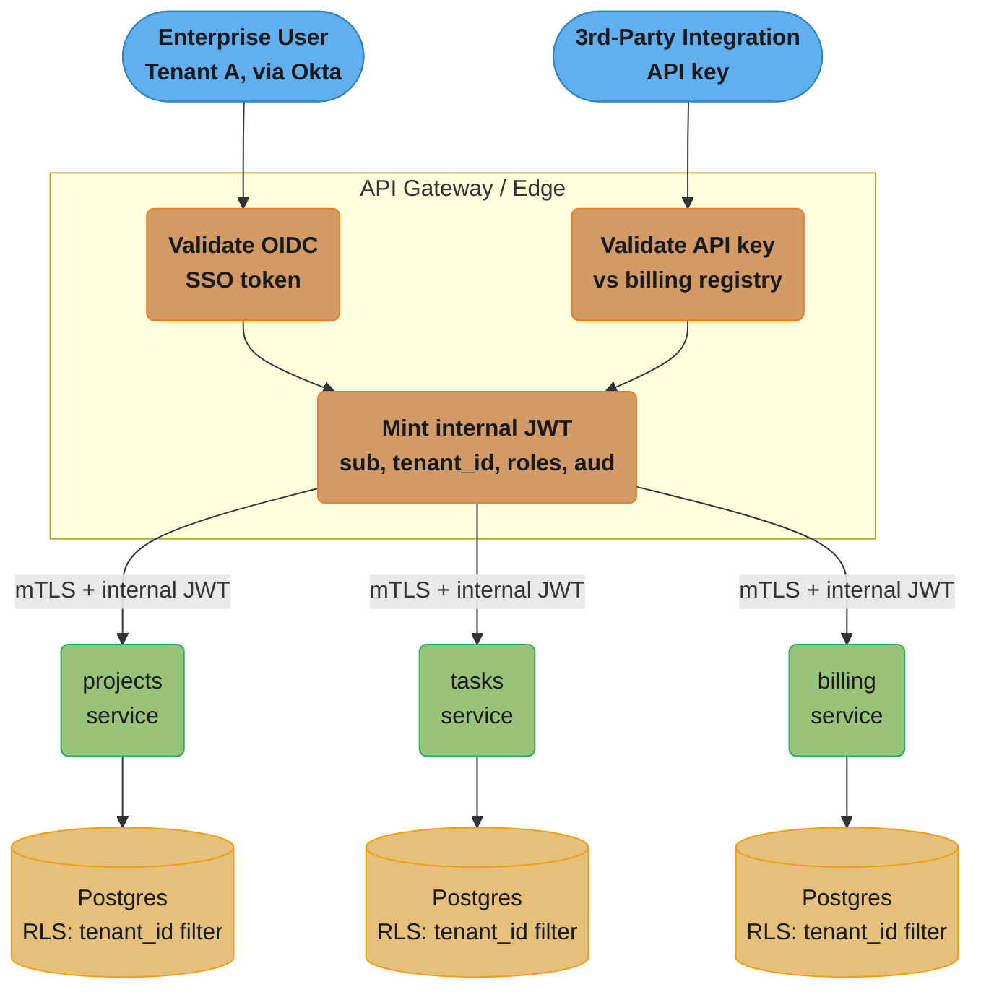

RLS enforcement happens at the database layer, not just in application code (Design Decision #2). All databases use envelope encryption at rest (§6.5), with a dedicated CMK per tenant for the largest enterprise customers (a contractual requirement) and shared, regularly-rotated CMKs for the remaining tenants.

### Key Design Decisions

1. **Federated SSO via OIDC, not a single shared IdP for all tenants.** Each enterprise tenant configures their own Okta/Azure AD as an OIDC identity provider; ProjectFlow's edge acts as an OIDC *relying party* for each. The internal JWT minted after SSO carries `tenant_id` derived from *which* IdP issued the original token — this is determined at the edge, before any internal service is reached, so no internal service needs to know about external IdP configuration.

2. **`tenant_id` is enforced at the database layer via Postgres Row-Level Security (RLS), not just application code.** Even if a service's authorization code has a bug that forgets a `WHERE tenant_id = ?` clause, RLS policies on every table reject cross-tenant reads/writes at the database level — defense in depth (§3) against the single highest-impact bug class for multi-tenant systems (cross-tenant data leak).

3. **Internal JWT is minted fresh at the edge, separate from the external SSO/API-key token.** The external token format varies by tenant's IdP (different claim shapes from different Okta/Azure AD tenants); internal services should not need to understand 800 different external token formats. The edge normalizes this into one internal JWT format (`sub`, `tenant_id`, `roles`, short `exp`) that all 12 services validate identically.

4. **mTLS via service mesh for all 12 internal services**, deployed alongside the internal-JWT change — addressing the "shared internal network with no service-to-service auth" gap. This is a separate axis from the JWT (mTLS authenticates *which service* is calling; the JWT identifies *which user/tenant* the call is on behalf of) — both are checked.

5. **Per-tenant CMKs (envelope encryption, §6.5) only for the largest ~50 enterprise customers** with contractual key-isolation requirements; the remaining 750 tenants share a smaller set of CMKs, rotated regularly. This balances the operational overhead of per-tenant key management (KMS API rate limits, rotation complexity) against the contractual requirements driving it.

6. **Public API uses scoped, prefixed API keys** (`pf_live_...` / `pf_test_...`), each scoped to specific resource types and rate-limited per key — modeled on Stripe's approach (§7) — rather than one all-access key per tenant.

### Operational Results

- **Cross-tenant data leak via application bug**: caught in staging by RLS rejecting a query missing `tenant_id` — the bug shipped with a failing integration test rather than reaching production, directly attributable to the DB-layer enforcement (decision #2).
- **SSO onboarding time per new enterprise tenant**: ~2 days (configure OIDC federation with the tenant's IdP) vs. the previously-considered alternative of provisioning ProjectFlow-managed credentials for every employee at every tenant (estimated weeks per tenant, plus ongoing password-reset support burden).
- **Internal mTLS rollout**: phased over one quarter, service-by-service, with a "permissive mode" (mTLS available but not yet required) before "strict mode" (mTLS required, plaintext rejected) — avoiding a hard cutover that could break in-flight requests during deployment.

### Lessons Learned

1. **RLS as a backstop, not a substitute, for application-level checks**: RLS catches *missing* `tenant_id` filters, but a query with an *incorrect* `tenant_id` (e.g., a cross-tenant admin tool that intentionally needs to query across tenants) requires explicit, audited bypass paths — RLS alone doesn't model "legitimate cross-tenant access for support staff," which needed a separate elevated-role path with additional audit logging.

2. **The internal JWT's `aud: "*"` (any internal service) was initially convenient but a War-Story-3-shaped risk** — it was later tightened so the edge mints internal JWTs with `aud` scoped to the specific services a given request path needs, after a security review flagged that a token minted for "view project" calls could, in principle, be replayed against `billing-service` if `billing-service` only checked signature and not audience.

