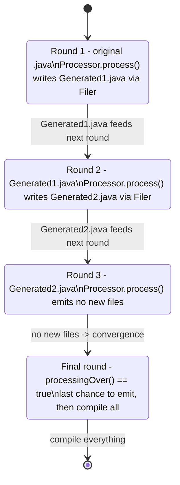
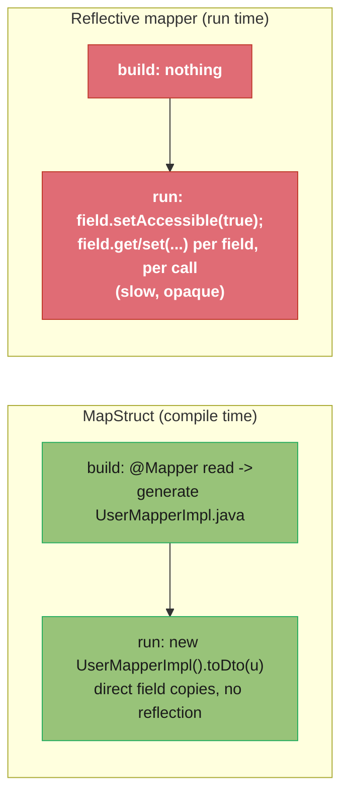
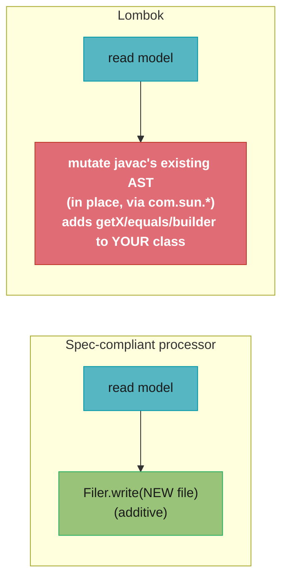

# Annotation Processing & Compile-Time Code Generation

> How `javac`'s annotation processing rounds work, how to write an
> `AbstractProcessor`, how Lombok and MapStruct use (and abuse) the API, and why
> compile-time code generation is preferred over runtime reflection for performance,
> safety, and GraalVM-native friendliness. Pure Java (JSR 269); the Spring
> meta-annotation and AOT connections are cross-links.

---

## 1. Concept Overview

Annotation processing (JSR 269, the Pluggable Annotation Processing API) lets you
hook into the Java compiler: during compilation, `javac` discovers `Processor`
implementations on the processor path and hands them the annotated program elements,
in *rounds*, so they can read the source model and **generate new source files** (or
emit diagnostics). The generated files are themselves compiled in subsequent rounds.

The key distinction a senior engineer must hold: this is **compile-time** metaprogramming, not runtime reflection. Reflection (`Class.forName`, `Method.invoke`,
dynamic proxies) inspects and acts on types *while the program runs* — flexible but
slow, untyped at compile time, and invisible to GraalVM's static analysis. Annotation
processing instead does its work *before bytecode exists*, producing ordinary `.java`
files that compile to ordinary classes. The result: zero runtime reflection cost,
errors surfaced at compile time, and full native-image compatibility.

Two libraries dominate the landscape and illustrate the two flavors:

- **MapStruct** — the textbook, spec-compliant use: reads `@Mapper` interfaces and
  *generates* a plain implementation class that does field-by-field copying. No
  runtime magic.
- **Lombok** — the (in)famous use: it does *not* generate new files; it mutates the
  compiler's internal AST to add methods (getters, `equals`, builders) to existing
  classes, using internal `com.sun.*` APIs. Powerful, but it works against the spirit
  of the API and is fragile across JDK versions.

Spring's `@SpringBootApplication`, `@RestController`, and friends are
*meta-annotations* — composed annotations read mostly via reflection at runtime, but
Spring Boot 3's AOT engine moves much of that to build time, the same "do it at
compile time" philosophy as annotation processing.

---

## 2. Intuition

**One-line analogy.** Reflection is asking someone their name every time you meet
them (runtime lookup). Annotation processing is printing name tags before the party
(compile time) — at the party, everyone just reads the tag, instantly.

**Mental model.** Annotation processing is a *plugin system for the compiler*. You
hand `javac` a visitor; it walks the annotated elements and lets you emit new code.
Think of it as a code generator that runs *inside* the build, with full knowledge of
the type system, rather than a separate templating step that only sees text.

**Why it matters.** The industry has moved decisively from runtime reflection to
compile-time generation — Dagger over Guice, MapStruct over reflective mappers,
Micronaut/Quarkus's compile-time DI, Spring AOT. The reasons (startup speed, native
images, compile-time safety) are exactly what senior interviews probe.

**Key insight.** Generated code is *boring on purpose*: a MapStruct mapper is the
same hand-written getter/setter copying you would write, just generated. That is the
point — no reflection, no proxies, no surprises, debuggable, and the JIT/AOT
optimizes it like any other code.

---

## 3. Core Principles

1. **Processing happens in rounds.** `javac` runs processors repeatedly: round 1 sees
   the original sources; if a processor generates files, a new round runs over them;
   this continues until no new files are produced, then a final round runs with
   `processingOver() == true`.

2. **Generate, don't mutate (the spec).** The sanctioned model is read the element
   model and *write new files* via `Filer`. Modifying existing classes' bytecode/AST
   is outside the spec (Lombok does it anyway via internal APIs).

3. **Model, not reflection.** You work with `javax.lang.model` mirrors —
   `TypeElement`, `ExecutableElement`, `TypeMirror` — which represent source-level
   constructs, not loaded `Class` objects. You cannot `Class.forName` a type you are
   compiling; it does not exist yet.

4. **Report errors through `Messager`.** A processor influences compilation by
   emitting diagnostics; a `Diagnostic.Kind.ERROR` fails the build, turning runtime
   bugs into compile errors.

5. **Idempotent, deterministic output.** Generating the same file twice in one
   compilation is an error (`FilerException`). Processors must be deterministic so
   builds are reproducible and incremental compilation works.

6. **Prefer compile-time over runtime.** When the information is known at compile
   time, generating code beats reflecting at runtime — faster, safer, native-friendly.

---

## 4. Types / Architectures / Strategies

### Where code generation can happen

| Strategy | When | Example | Runtime cost |
|----------|------|---------|--------------|
| **Annotation processing (codegen)** | Compile time | MapStruct, Dagger, AutoValue, JPA metamodel | None (plain code) |
| **AST mutation** | Compile time (non-spec) | Lombok | None, but fragile/JDK-coupled |
| **Runtime reflection** | Run time | Jackson default, classic Spring | Per-call reflection cost |
| **Runtime bytecode gen** | Run time | CGLIB, ByteBuddy proxies | Startup gen + dispatch cost |

### The processor's toolkit (JSR 269)

| API | Role |
|-----|------|
| `AbstractProcessor` | Base class you extend; override `process(...)` |
| `RoundEnvironment` | Elements annotated in this round; `processingOver()` |
| `Elements` / `Types` | Utilities to inspect the element/type model |
| `Filer` | Creates new source/class/resource files (the sanctioned output) |
| `Messager` | Emits compiler diagnostics (note/warning/error) |
| `JavaPoet` (3rd-party) | Fluent builder for generating `.java` files cleanly |

### Registration mechanisms

- `META-INF/services/javax.annotation.processing.Processor` (ServiceLoader file), or
- Google's `@AutoService(Processor.class)` to generate that file for you.

---

## 5. Architecture Diagrams

### Compilation rounds: source in, generated source folded back



Each generated file becomes input to the next round, so a processor can generate code
that itself triggers further generation. Output must converge (eventually no new
files) or the compiler errors.

### Compile-time codegen vs runtime reflection: where the work lands



The reflective version pays a cost on *every call*; the generated version pays once,
at build time, and runs as fast as hand-written code — and survives GraalVM's
closed-world cut because there is no reflection to hint.

### Lombok is the odd one out: it edits the AST, not the Filer



This is why Lombok needs IDE plugins (the IDE's compiler does not see the synthetic
methods otherwise) and why it breaks on JDK internals changes — it depends on
non-public compiler APIs.

---

## 6. How It Works — Detailed Mechanics

### 6.1 A minimal processor that generates a builder

```java
@SupportedAnnotationTypes("com.rutik.gen.GenerateBuilder")
@SupportedSourceVersion(SourceVersion.RELEASE_17)
public class BuilderProcessor extends AbstractProcessor {

    @Override
    public boolean process(Set<? extends TypeElement> annotations, RoundEnvironment round) {
        for (Element element : round.getElementsAnnotatedWith(GenerateBuilder.class)) {
            if (element.getKind() != ElementKind.CLASS) {
                // turn misuse into a COMPILE error, not a runtime surprise
                processingEnv.getMessager().printMessage(
                    Diagnostic.Kind.ERROR, "@GenerateBuilder only on classes", element);
                continue;
            }
            TypeElement type = (TypeElement) element;
            generateBuilder(type);          // write a <Name>Builder.java via Filer
        }
        return true;                        // claim the annotation
    }

    private void generateBuilder(TypeElement type) {
        String pkg = processingEnv.getElementUtils()
                        .getPackageOf(type).getQualifiedName().toString();
        String builderName = type.getSimpleName() + "Builder";
        try {
            JavaFileObject file = processingEnv.getFiler()
                .createSourceFile(pkg + "." + builderName, type);
            try (Writer w = file.openWriter()) {
                w.write("package " + pkg + ";\n");
                w.write("public class " + builderName + " { /* generated */ }\n");
            }
        } catch (IOException e) {
            processingEnv.getMessager().printMessage(Diagnostic.Kind.ERROR,
                "failed to generate " + builderName + ": " + e.getMessage(), type);
        }
    }
}
```

The raw string-writing above is illustrative; real processors use **JavaPoet** for
type-safe generation:

```java
MethodSpec build = MethodSpec.methodBuilder("build")
    .addModifiers(Modifier.PUBLIC)
    .returns(ClassName.get(type))
    .addStatement("return new $T(/* fields */)", ClassName.get(type))
    .build();
TypeSpec builder = TypeSpec.classBuilder(builderName)
    .addModifiers(Modifier.PUBLIC).addMethod(build).build();
JavaFile.builder(pkg, builder).build().writeTo(processingEnv.getFiler());
```

### 6.2 Registering the processor

Either ship a service file:

```
# src/main/resources/META-INF/services/javax.annotation.processing.Processor
com.rutik.gen.BuilderProcessor
```

…or let Google AutoService generate it:

```java
@AutoService(Processor.class)
public class BuilderProcessor extends AbstractProcessor { /* ... */ }
```

The processor JAR goes on the consumer's `annotationProcessorPath` (Maven) /
`annotationProcessor` (Gradle) configuration — *separate from* the compile classpath,
so the processor runs at build time but is not a runtime dependency.

### 6.3 The element model (not reflection)

```java
TypeElement type = ...;                            // a class being compiled
for (Element member : type.getEnclosedElements()) {
    if (member.getKind() == ElementKind.FIELD) {
        VariableElement field = (VariableElement) member;
        TypeMirror fieldType = field.asType();     // source-level type mirror
        Name name = field.getSimpleName();
        // NOTE: you cannot do field.getType().getDeclaredMethods() — there is no
        // Class object yet. You navigate TypeMirror/Element, using Types/Elements utils.
    }
}
```

This is the conceptual heart: you reason over *mirrors of source*, because the bytecode
does not exist during processing.

### 6.4 How MapStruct uses it (canonical)

```java
@Mapper
public interface UserMapper {
    UserDto toDto(User user);
}
// MapStruct's processor reads this interface and GENERATES, at compile time:
//   class UserMapperImpl implements UserMapper {
//     public UserDto toDto(User user) {
//       UserDto dto = new UserDto();
//       dto.setName(user.getName());      // plain calls, type-checked at build
//       dto.setAge(user.getAge());
//       return dto;
//     }
//   }
```

A field that does not match generates a *compile error* ("Unmapped target property"),
catching mapping bugs before runtime — the safety dividend of compile-time work.

### 6.5 How Lombok differs (AST mutation)

Lombok registers as a processor but, instead of using `Filer`, it reaches into
`javac`'s internal `JCTree` AST (via `com.sun.tools.javac.*`) and *adds* method nodes
to your class before bytecode is emitted. So `@Data` makes getters/setters appear on
the *same* class — no `UserBuilderImpl` file is generated. This is why:

- IDEs need a Lombok plugin (to teach their compiler about the synthetic members),
- `--add-opens`/`--add-exports` dances appear on newer JDKs (it touches sealed
  internals),
- and delombok exists (to materialize the generated code as real source).

---

## 7. Real-World Examples

- **MapStruct** — generates DTO↔entity mappers as plain code; widely used in Spring
  apps precisely because it avoids reflective mapping overhead and is native-friendly.
- **Google Dagger / Hilt** — compile-time dependency injection: the entire object
  graph is generated as factory code at build time, giving Android sub-millisecond DI
  with no runtime reflection (contrast with reflective Guice/Spring).
- **Google AutoValue / AutoService / AutoFactory** — `@AutoValue` generates immutable
  value classes (equals/hashCode/toString); `@AutoService` generates ServiceLoader
  files.
- **Lombok** — `@Getter`/`@Builder`/`@Data` via AST mutation; ubiquitous but
  controversial for exactly that reason.
- **JPA static metamodel** — the JPA processor generates `User_` classes used for
  type-safe Criteria queries (`User_.name` instead of the string `"name"`).
- **Immutables, Micronaut, Quarkus** — Micronaut and Quarkus do compile-time DI/AOP
  via processors, which is what makes them start fast and go native cleanly — the same
  motivation behind Spring AOT.

---

## 8. Tradeoffs

| Dimension | Annotation processing (codegen) | Runtime reflection | Lombok (AST mutation) |
|-----------|--------------------------------|--------------------|-----------------------|
| Runtime cost | None (plain code) | Per-call reflection | None |
| Error timing | Compile time | Run time | Compile time |
| Native-image friendly | Yes | Needs hints | Mostly (no new files) |
| Debuggability | Generated source is readable | Opaque stack frames | No source unless delomboked |
| Build cost | Extra compile rounds | None | Extra processing |
| Fragility | Spec-stable | Stable | Fragile (internal APIs) |
| Boilerplate removed | Yes (generated) | N/A | Yes (in place) |

| Decision | Codegen processor | Reflection |
|----------|-------------------|------------|
| Known at compile time | Prefer (faster, safer) | — |
| Truly dynamic at runtime (plugins, unknown types) | Hard/impossible | Required |
| Targeting GraalVM native | Strongly prefer | Avoid / hint heavily |

---

## 9. When to Use / When NOT to Use

**Use annotation processing when** you have repetitive boilerplate derivable from
declarations (mappers, builders, DI graphs, value types, metamodels), you want errors
at compile time, and especially when targeting fast startup or GraalVM native images.
It is the right tool whenever the needed information is fully known at compile time.

**Avoid writing your own processor when** an existing one (MapStruct, AutoValue,
Dagger) already covers the need — processors are subtle to get right (rounds,
idempotency, incremental compilation). Avoid codegen entirely when the behavior is
genuinely dynamic at runtime (loading unknown plugin types, reflecting over data whose
shape is not known until runtime) — that is reflection's domain.

**Be cautious with Lombok**: it removes real boilerplate but couples you to internal
compiler APIs, complicates upgrades, and obscures generated behavior. Many teams
adopt it; many ban it for exactly these reasons. Know the tradeoff rather than
treating it as free.

---

## 10. Common Pitfalls

1. **Generating the same file twice.** Emitting `FooImpl.java` in two rounds (or for
   two triggers) throws `FilerException: Attempt to recreate a file`. *Fix:* track
   what you have generated and only write once; do final emission guarded by
   `processingOver()` where appropriate.

2. **Trying to use reflection on types being compiled.** Calling `Class.forName` on a
   type in the current compilation fails — the class does not exist yet. *Fix:* use
   `javax.lang.model` mirrors (`TypeElement`, `TypeMirror`) and the `Elements`/`Types`
   utilities, never `Class`.

3. **Forgetting to register the processor.** No `META-INF/services` entry (or
   `@AutoService`) means `javac` never discovers it and silently does nothing. *Fix:*
   add the service file or AutoService and verify with `-Xlint:processing`.

4. **Breaking incremental compilation.** A non-deterministic or input-unaware
   processor forces full rebuilds and confuses Gradle's incremental APT. *Fix:* be
   deterministic; declare the processor incremental (Gradle
   `org.gradle.annotation.processing` metadata).

5. **Swallowing errors instead of using `Messager`.** Throwing exceptions from a
   processor produces an ugly compiler crash; the right channel is
   `Diagnostic.Kind.ERROR` tied to the offending `Element`, which gives a clean,
   located compile error. *Fix:* route all user-facing problems through `Messager`.

6. **Lombok + new JDK breakage.** A JDK upgrade changes `com.sun.tools.javac`
   internals and Lombok stops compiling until you bump Lombok and add
   `--add-opens`. *War story:* a team's CI broke on a JDK 17→21 bump solely because
   the pinned Lombok version no longer matched the compiler internals. *Fix:* keep
   Lombok in lockstep with the JDK, or avoid it for long-lived builds.

7. **Putting the processor on the compile classpath.** Adding it as a normal
   dependency (not `annotationProcessor`) bloats the runtime and can cause double
   processing. *Fix:* use the dedicated `annotationProcessor`/`annotationProcessorPath`
   configuration.

---

## 11. Technologies & Tools

| Concern | Tools |
|---------|-------|
| Core API | JSR 269: `javax.annotation.processing`, `javax.lang.model` |
| Codegen | JavaPoet (Square), Velocity/StringTemplate (older), KotlinPoet (Kotlin) |
| Registration | Google AutoService, hand-written `META-INF/services` |
| Established processors | MapStruct, Dagger/Hilt, AutoValue, Immutables, JPA metamodel |
| AST-mutation | Lombok (non-spec; `com.sun.tools.javac`) |
| Build wiring | Maven `annotationProcessorPaths`, Gradle `annotationProcessor`, incremental APT |
| Testing | Google `compile-testing` (`Compiler`, `JavaSourcesSubject`) |
| Kotlin equivalent | KSP (Kotlin Symbol Processing), KAPT (legacy) |

---

## 12. Interview Questions with Answers

**What is annotation processing and how does it differ from reflection?**
Annotation processing (JSR 269) is a compiler plugin mechanism: during compilation,
`javac` hands registered `Processor`s the annotated program elements so they can read
the source model and generate new source/class/resource files. It is compile-time
metaprogramming. Reflection, by contrast, inspects and invokes types at *runtime* via
`Class`/`Method` objects. The key differences: annotation processing has zero runtime
cost (it produces plain code), surfaces errors at compile time, and is GraalVM-native
friendly; reflection is dynamic and flexible but pays a per-call cost, fails at
runtime, and needs metadata hints under native image.

**Explain how the rounds model works.**
`javac` invokes processors in rounds. Round 1 sees the original source files; any
files a processor writes via the `Filer` become inputs to a new round, where
processors run again; this repeats until a round produces no new files. Then a final
round runs with `RoundEnvironment.processingOver()` returning true, giving processors
a last chance to emit (e.g. aggregate files), after which everything is compiled. The
rounds let generated code itself trigger further generation, but output must converge
or the compiler errors.

**Why can't you use `Class.forName` on a type you are currently compiling?**
Because during annotation processing the bytecode does not exist yet — there is no
loaded `Class` object for a type that is still being compiled. Instead you work with
the `javax.lang.model` mirror API: `TypeElement` for a type, `ExecutableElement` for a
method, `VariableElement` for a field, and `TypeMirror` for a type reference, navigated
with the `Elements` and `Types` utility services. This source-level model is the whole
reason processing is decoupled from runtime reflection.

**How does Lombok differ from a normal annotation processor like MapStruct?**
MapStruct is spec-compliant: it reads `@Mapper` interfaces and *generates new files*
(a plain implementation class) via the `Filer`. Lombok registers as a processor but
does not generate separate files — it reaches into `javac`'s internal `JCTree` AST
using non-public `com.sun.tools.javac.*` APIs and *mutates your existing class*, adding
getters, `equals`, builders in place. That AST mutation is outside the JSR 269 spec,
which is why Lombok needs IDE plugins, can break on JDK upgrades, and offers
`delombok` to materialize the synthetic code.

**Why is compile-time code generation preferred over runtime reflection for things like DI and mapping?**
Because the information (the object graph, the field mappings) is known at compile
time, so generating plain code gives you: no per-call reflection overhead (faster,
especially at startup), compile-time error checking (a missing mapping fails the
build, not production), readable/debuggable generated source, and GraalVM-native
compatibility since there is no reflection for the closed-world analysis to miss. This
is exactly why Dagger beat reflective Guice on Android and why Micronaut/Quarkus/Spring
AOT moved DI work to build time.

**How do you register an annotation processor?**
Provide a `META-INF/services/javax.annotation.processing.Processor` file listing the
fully-qualified processor class names (the ServiceLoader mechanism), or annotate the
processor with Google's `@AutoService(Processor.class)` to generate that file
automatically. The processor JAR must be placed on the build's annotation-processor
path (`annotationProcessorPath` in Maven, `annotationProcessor` configuration in
Gradle), which is separate from the compile/runtime classpath so the processor runs at
build time only.

**How should a processor report a usage error to the developer?**
Through the `Messager`, by calling `processingEnv.getMessager().printMessage(
Diagnostic.Kind.ERROR, "message", element)`, passing the offending `Element` so the
error points at the right source location. A `Kind.ERROR` fails the compilation,
turning what would be a runtime bug into a clean compile error. Throwing an exception
from `process` instead produces an opaque compiler crash, so user-facing problems
should always go through `Messager`.

**What is the Filer and what restriction does it enforce?**
The `Filer` is the API a processor uses to create new source, class, or resource files
— the sanctioned output channel. Its key restriction is that you cannot create the
same file twice in a single compilation: doing so throws a `FilerException` ("attempt
to recreate a file"). This enforces idempotent, deterministic generation, which is
necessary for reproducible builds and for incremental compilation to work correctly.

**What is JavaPoet and why use it?**
JavaPoet is a Square library that provides a fluent, type-safe builder API for
generating `.java` source — `TypeSpec`, `MethodSpec`, `FieldSpec`, with `ClassName`
references and `$T`/`$L` placeholders. You use it instead of concatenating strings
because it handles imports, formatting, and type references correctly, producing clean
generated code and avoiding the brittle, error-prone string-building that plagues
hand-rolled generators.

**What does MapStruct do at compile time and what is the safety benefit?**
MapStruct's processor reads a `@Mapper` interface and generates a concrete
implementation that copies fields with plain getter/setter calls — no reflection. The
safety benefit is that mapping mismatches are caught at compile time: if a target
property has no matching source, MapStruct emits an "Unmapped target property" compile
error, so mapping bugs surface during the build rather than as nulls or wrong values in
production. The generated code is also as fast as hand-written mapping and fully
native-compatible.

**Why is annotation processing important for GraalVM native images?**
Because native image uses a closed-world assumption and cannot follow runtime
reflection without explicit metadata. Code produced by annotation processors is plain,
statically-analyzable Java with no reflection, so it is reachable and retained
automatically — no hints needed. Frameworks that do their DI/mapping/AOP via processors
(or AOT, as Spring Boot 3 does) are therefore native-friendly by construction, whereas
reflection-heavy frameworks require extensive reachability metadata.

**How can a processor break incremental compilation, and how do you avoid it?**
If a processor is non-deterministic, reads inputs the build system cannot track, or
regenerates outputs unpredictably, the build tool must fall back to full recompilation
and may produce inconsistent results. To avoid it, make the processor deterministic
(same inputs → same outputs), declare which inputs it depends on, and mark it
incremental for the build tool (Gradle's `org.gradle.annotation.processing` metadata
classifies a processor as isolating or aggregating). Established processors do this;
hand-rolled ones often do not.

**What is the difference between `getSupportedAnnotationTypes`/`@SupportedAnnotationTypes` returning a specific set vs `"*"`?**
Returning specific annotation type names tells `javac` to invoke your processor only
when those annotations are present, which is efficient and clear. Returning `"*"` makes
the processor claim *all* annotations, so it runs on every compilation regardless —
useful for processors that inspect everything (e.g. validators) but wasteful and
error-prone otherwise. Also note the boolean return of `process`: returning `true`
*claims* the annotations so no other processor handles them, while `false` lets them
pass on — usually you return `true` only for annotations you own.

**Can annotation processing modify existing methods or classes within the spec?**
No — within JSR 269 you can only *add* new files, not modify or delete existing
source/bytecode. The spec is intentionally additive to keep compilation predictable.
Lombok modifies existing classes only by going outside the spec into compiler
internals. If you need to alter existing bytecode, the right tools are bytecode
manipulation libraries (ASM, ByteBuddy) at build or load time, not annotation
processing.

**When would you still choose runtime reflection over a processor?**
When the behavior is genuinely dynamic and not known at compile time: loading plugin
classes discovered at runtime, deserializing data whose shape is unknown until runtime,
building generic frameworks that must work with arbitrary user types they have never
seen, or rapid prototyping where the build-time investment is not justified. Reflection
trades runtime cost and native-image friction for that runtime flexibility, which is
exactly what codegen cannot provide.

**What is Kotlin's equivalent of Java annotation processing?**
KSP (Kotlin Symbol Processing) is the modern equivalent — a Kotlin-first API that
gives processors a Kotlin-aware symbol model and is much faster than the legacy KAPT,
which worked by generating Java stubs so that Java's `javac` annotation processors
could run against Kotlin code. KSP is the recommended path for new Kotlin codegen
(e.g. Room, Dagger/Hilt support it), mirroring JSR 269's compile-time philosophy with
proper Kotlin semantics.

---

## 13. Best Practices

- **Reach for an existing processor first** (MapStruct, AutoValue, Dagger) before
  writing your own — they handle rounds, idempotency, and incrementality correctly.
- **Generate with JavaPoet**, not string concatenation, for correct imports and
  formatting.
- **Report problems via `Messager` + `Element`**, never by throwing — give located
  compile errors.
- **Write the file once**; guard aggregate output with `processingOver()` and track
  generated names to avoid `FilerException`.
- **Keep processors deterministic and declare them incremental** so they do not force
  full rebuilds.
- **Put the processor on the annotation-processor path**, not the compile/runtime
  classpath.
- **Prefer codegen over reflection** when targeting startup latency or GraalVM native
  images.
- **If you use Lombok, pin it to your JDK** and understand its non-spec AST mutation;
  consider `delombok` for transparency.
- **Test processors with `compile-testing`** — assert on generated sources and on
  expected compile errors.

---

## 14. Case Study

### Replacing a reflective DTO mapper to fix startup latency and enable native image

**Problem.** A Spring Boot service mapped ~80 entity↔DTO pairs using a hand-written
reflective mapper (`Field.setAccessible(true)` + `get`/`set` per field, cached by
type). It worked, but: per-request mapping showed up in profiles as a measurable hot
spot, cold-start was slow because the reflective caches warmed lazily, and an attempt
to build a GraalVM native image failed with a cascade of missing-reflection errors on
the DTO fields. The team migrated mapping to MapStruct (an annotation processor).

**Requirements.**
- Eliminate per-call reflection from the mapping layer.
- Catch field-mapping mismatches at build time, not in production.
- Make the mapping layer GraalVM-native compatible with no hints.
- No behavior change in the mapped output.

**Design.**

1. **Declare mappers as interfaces.** Each pair becomes a `@Mapper` interface;
   MapStruct's processor generates the `*Impl` at compile time.

2. **Wire the processor.** Add `mapstruct-processor` to `annotationProcessorPaths`
   (Maven), keeping `mapstruct` itself as a compile dependency; the generated impls are
   plain Spring beans (`componentModel = "spring"`).

3. **Fail the build on mismatches.** Configure
   `unmappedTargetPolicy = ReportingPolicy.ERROR` so any unmapped target property is a
   compile error.

**Broken → fixed (the reflective hot path and its native failure):**

```java
// BROKEN: reflective mapper — per-field, per-call reflection; opaque to GraalVM
public <S, T> T map(S src, Class<T> target) {
    T dst = target.getDeclaredConstructor().newInstance();   // reflection
    for (Field f : cachedFields(src.getClass())) {
        f.setAccessible(true);                                // reflection
        setField(dst, f.getName(), f.get(src));              // reflection x2
    }
    return dst;
}
// Native image: UnsatisfiedLinkError-style failures ->
//   "DTO field 'amount' not registered for reflection" at first request.

// FIXED: a MapStruct interface; the processor GENERATES plain code at build time
@Mapper(componentModel = "spring", unmappedTargetPolicy = ReportingPolicy.ERROR)
public interface OrderMapper {
    OrderDto toDto(Order order);     // mismatch here = COMPILE error, not prod bug
}
// Generated OrderMapperImpl does dto.setAmount(order.getAmount()); -> no reflection,
// native-friendly, JIT-optimizable.
```

**Outcomes (measured).**
- Mapping disappeared from the request CPU profile — generated getter/setter copies
  are inlined by the JIT; per-request mapping cost dropped to noise.
- Two real field-name mismatches (a renamed column) were caught as *compile errors*
  during the migration — previously they would have shipped as silent nulls.
- The GraalVM native build that had failed on DTO reflection now succeeded with **zero
  reflection hints** for the mapping layer, because the generated code is plain and
  statically reachable.
- Cold start improved (no lazy reflective-cache warmup), reinforcing the move toward a
  native deployment ([../../spring/spring_native_graalvm/](../../spring/spring_native_graalvm/)).

**Tradeoffs accepted.** A slightly longer build (extra processing rounds) and the team
learning MapStruct's mapping annotations for the non-trivial cases (nested objects,
custom conversions). Both were minor against the runtime, safety, and native-image
wins.

---

## See Also

- [generics_and_type_system](../generics_and_type_system/README.md) — reflection,
  dynamic proxies, and the runtime metaprogramming that codegen replaces.
- [design_patterns_in_java](../design_patterns_in_java/README.md) — Builder and
  Factory, the patterns most often generated by processors.
- [Bytecode & Class-File Format](../bytecode_and_classfile/README.md) — compile-time
  metaprogramming (this module) vs. bytecode-time transformation (ASM/ByteBuddy) —
  the two build-time alternatives to runtime reflection.
- [../../spring/spring_native_graalvm/](../../spring/spring_native_graalvm/) — AOT
  processing, the same "move work to build time" philosophy at the framework level.
- [../../spring/spring_boot_autoconfiguration/](../../spring/spring_boot_autoconfiguration/) —
  Spring meta-annotations and conditional configuration.
