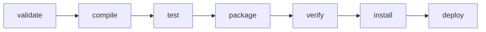
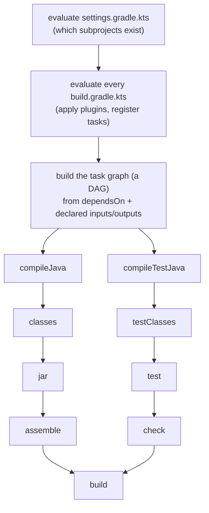
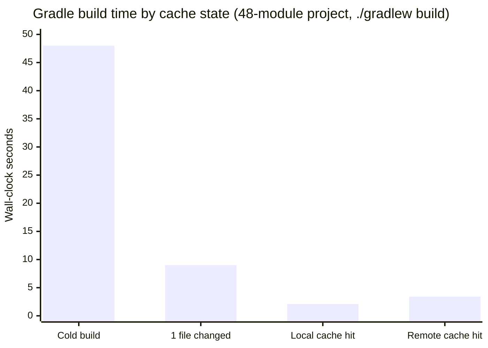

# Build Tools — Maven & Gradle

> How Maven's fixed lifecycle and Gradle's task graph actually compile, test,
> cache, and package a JVM project — the POM and the build script, the
> dependency-mediation algorithm that silently picks a transitive version for
> you, and the shade-plugin/module-path answers to classpath collisions. Pure
> build tooling (no CI/CD platform content); the JPMS and classloading
> connections are cross-links.

---

## 1. Concept Overview

A JVM build tool automates four jobs that used to be hand-rolled shell scripts
around `javac`: **compiling** source to bytecode, **resolving dependencies**
(fetching the right JARs, transitively, from a repository), **testing and
packaging** the result, and **publishing** it somewhere else can depend on it.
The two tools that dominate the JVM ecosystem approach this from opposite
philosophies. **Maven** (2004) is declarative and fixed: you describe *what*
your project is in an XML **POM** (Project Object Model), and a rigid,
numbered **build lifecycle** decides *when* things happen — every project
builds through the same sequence of phases, so any Maven project looks the
same to any other Maven engineer. **Gradle** (2009) is a build *program*: you
declare a graph of **tasks** with dependencies between them in a Groovy or
Kotlin DSL, and Gradle computes the order, skips whatever has not changed, and
can reuse output from a cache instead of re-running work at all.

Both tools converge on the same hard problem underneath: **dependency
resolution**. A real project does not just depend on ten libraries — it
depends on ten libraries that each depend on more libraries, forming a graph
that commonly contains the same artifact at different versions reached by
different paths (a **diamond dependency**). Maven and Gradle each apply a
deterministic, but *different*, algorithm to collapse that graph to one
version per artifact, and getting that algorithm's decision wrong — a version
that compiles fine but is not actually binary-compatible with what your code
expects — is the single most common "the build was green but production threw
`NoSuchMethodError`" incident in JVM shops.

Both tools also share the same coordinate system for identifying an artifact —
`groupId:artifactId:version` (**GAV**) — and the same repository model: a
local cache (`~/.m2/repository` for Maven, `~/.gradle/caches/modules-2` for
Gradle) backed by a remote repository (Maven Central, or a company's
Nexus/Artifactory mirror). This shared foundation is why a Gradle project can
consume a Maven-published JAR, and vice versa, without either tool knowing the
other exists — GAV coordinates and the Maven-repository layout are the actual
interoperability contract between them.

---

## 2. Intuition

**One-line analogy.** Maven is a fixed-menu restaurant: every table gets
appetizer, then main, then dessert, in that order, whether they asked for it
or not (the lifecycle). Gradle is a kitchen with recipe cards pinned to a
corkboard and strings connecting the ones that depend on each other (the task
graph) — and the chef refuses to re-cook a dish if its ingredients have not
changed since the last plate went out (incremental build and the build
cache).

**Mental model.** Treat dependency resolution as graph resolution with a
tie-break rule, not as "npm install, but for Java." Every dependency you
declare is a root; the tool walks each root's own published metadata to pull
in *its* dependencies, recursively, building one directed graph. When the same
artifact (`groupId:artifactId`) appears more than once at different versions,
the tool applies its conflict rule — Maven picks by shortest path then
declaration order, Gradle picks the highest version by default — and
collapses the graph to exactly one version per artifact before any of it
touches the classpath.

**Why it matters.** Staff-level JVM engineers are the ones who own build
infrastructure, and the recurring incident is never "we forgot to compile" —
it is "a transitive dependency silently changed version between last
Tuesday's build and today's," discovered in production, not in a red test.
Interviewers use this topic to separate candidates who can run `mvn install`
from candidates who understand *why* the exact same command can silently
produce a different classpath tomorrow.

**Key insight.** Neither tool's conflict-resolution algorithm checks binary
compatibility — both just pick *a* version, deterministically. "The build
passed" only ever meant "a version was chosen and everything compiled against
its own declared API," never "the version chosen actually has every method
every caller needs." That gap is exactly what dependency-mediation tooling
(`dependency:tree`, `dependencies`) and pinning (`dependencyManagement`,
version catalogs, BOMs) exist to close.

---

## 3. Core Principles

1. **Convention over configuration (Maven) vs. configurable convention
   (Gradle).** Maven's standard directory layout (`src/main/java`,
   `src/test/java`) and fixed lifecycle need zero configuration for a typical
   project; Gradle's plugins *apply* the same conventions, but every one of
   them is a task you can redefine, reorder, or replace.
2. **You declare direct dependencies; the tool computes the transitive
   closure.** Nobody hand-lists Guava's own dozen dependencies — you declare
   Guava, and resolution walks its published metadata to pull the rest in.
3. **Conflict resolution is deterministic, not "latest wins by intuition."**
   Maven: nearest declaration in the tree wins, ties at equal depth broken by
   first-declared order. Gradle: highest version anywhere in the graph wins,
   by default. Same input graph, two tools, potentially two different
   answers.
4. **Reproducibility is the precondition for speed.** Gradle's build cache and
   incremental "up-to-date" checks are only correct if a task's declared
   inputs fully determine its outputs — an undeclared input (an env var, the
   system clock, an unpinned version range) silently breaks caching and
   reproducibility at the same time.
5. **Local and remote repository caching, keyed by GAV coordinates.** Every
   resolved artifact lands in a local cache (`~/.m2`, `~/.gradle/caches`) so
   the same coordinate is fetched from the network once, ever, across every
   project on the machine.
6. **Scopes/configurations control classpath visibility per phase, not just
   presence.** Whether a dependency is even on the classpath — and whether it
   is *transitively* visible to consumers — differs across compiling,
   testing, running, and packaging; conflating them is how a `provided`
   dependency "accidentally" ships inside a fat jar.

---

## 4. Types / Architectures / Strategies

### 4.1 Maven's building blocks

| Concept | Role |
|---------|------|
| POM (`pom.xml`) | Declarative project descriptor: coordinates, dependencies, plugins, parent |
| Parent POM | Shared configuration/versions inherited by child modules (`<parent>`) |
| Multi-module reactor | A root POM's `<modules>` list; Maven builds them in dependency order |
| Build lifecycle | Fixed, numbered sequence of phases (§6.2) |
| Plugin goal | The actual unit of work; phases are just named hooks goals bind to |
| Profile | Conditional configuration (`<profiles>`), activated by JDK, OS, property, or flag |

### 4.2 Maven dependency scopes

| Scope | Compile classpath | Test classpath | Runtime classpath | Packaged | Example |
|-------|:---:|:---:|:---:|:---:|---------|
| `compile` (default) | Yes | Yes | Yes | Yes | Guava, Jackson |
| `provided` | Yes | Yes | No | No | `servlet-api`, Lombok |
| `runtime` | No | Yes | Yes | Yes | JDBC driver |
| `test` | No | Yes | No | No | JUnit, Mockito |
| `system` (deprecated) | Yes | Yes | No | No | unmanaged local JAR by file path |
| `import` (dependencyManagement only) | — | — | — | — | BOM aggregation (§6.3) |

### 4.3 Gradle's building blocks

| Concept | Role |
|---------|------|
| `build.gradle` / `build.gradle.kts` | Groovy or Kotlin DSL build script |
| Task | A unit of work with declared inputs/outputs (`compileJava`, `test`, custom) |
| Task graph | The DAG Gradle computes from task dependencies (`dependsOn`, ordering rules) |
| Configuration phase | Evaluate every build script, construct the task graph — every invocation |
| Execution phase | Run the requested tasks (plus dependencies), in topological order |
| `settings.gradle[.kts]` | Declares which subprojects exist (`include(":service-a")`) |
| Version catalog (`gradle/libs.versions.toml`) | Centralized, typesafe dependency/plugin coordinates |

### 4.4 Gradle dependency configurations

| Configuration | Visible to consumers transitively? | Typical use |
|---------------|:---:|---|
| `api` | Yes | A dependency whose types appear in your own public API |
| `implementation` | No | Everything else — the default, encapsulated choice |
| `compileOnly` | No (not even at your own runtime) | Annotation-only deps (Lombok), a container-supplied API |
| `runtimeOnly` | No | JDBC driver, logging backend |
| `testImplementation` | No | JUnit, Mockito — test source set only |

The `api`/`implementation` split has no Maven equivalent — Maven's `compile`
scope is always transitively visible, so Gradle's `implementation` is
strictly more encapsulated than anything Maven can express without a
shade/relocation workaround.

### 4.5 Shading vs. the module-path: two answers to "two JARs, one classpath"

| | Shading (uber-jar + relocation) | Module-path (JPMS) |
|---|---|---|
| Mechanism | Rewrite package names inside a merged JAR at build time | Each module declares `requires`/`exports`; the JVM enforces readability |
| Solves | Two *different* libraries needing incompatible versions of the *same* dependency | Strong encapsulation and reliable configuration for your *own* module graph |
| Scope | Per-artifact, opt-in, build-tool plugin (Maven/Gradle) | Platform feature (Java 9+); needs the whole graph modularized |
| Cost | Larger JAR, rewritten bytecode, relocation bugs | Most third-party JARs still ship unmodularized, limiting adoption |
| Failure mode if skipped | Silent classpath collision, `NoSuchMethodError` | Hard `ResolutionException` at startup (fail fast) |

See [Java 9-21 Features](../java9_to_21_features/README.md) for the full
`module-info.java` directive reference (`requires`, `exports`, `opens`) this
table compares against.

---

## 5. Architecture Diagrams

### Maven's default lifecycle: invoking a phase runs everything before it



`mvn package` does not run only the `package` phase — it runs `validate`,
`compile`, and `test` first, in order, because each phase in the default
lifecycle implies everything before it; `mvn deploy` runs every phase up to
and including `deploy` (the full 22-phase list is in §6.2).

### Gradle: the configuration phase builds the graph, execution runs it



Everything above `compileJava`/`compileTestJava` is the **configuration
phase**: it runs on *every* Gradle invocation, even `gradle tasks`, because
the whole task graph must exist before Gradle knows what to skip. Everything
below is the **execution phase**: only the tasks actually requested (plus
their dependencies) run, and any task whose declared inputs/outputs are
unchanged is skipped as `UP-TO-DATE` before it ever executes (§6.7).

### The diamond conflict: one coordinate, two versions, two different "winners"

```
App declares NO version of common-utils itself -- it reaches the artifact
only through two paths of EQUAL depth:

    App
     |-- lib-a:3.1.0 (declared 1st) --> common-utils:1.0.0  [has Formatter.bar()]
     `-- lib-b:2.0.0 (declared 2nd) --> common-utils:2.4.0  [bar() gone, has baz()]

Maven "nearest wins":
    depth(1.0.0) == depth(2.4.0) == 2  ->  tie broken by POM declaration order
    lib-a declared first  ->  1.0.0 WINS
    lib-b's bytecode calls Formatter.baz(), missing from 1.0.0 -> NoSuchMethodError

Gradle default "highest version wins":
    ignores depth/order, compares 1.0.0 vs 2.4.0 directly  ->  2.4.0 WINS
    lib-a's bytecode calls Formatter.bar(), removed from 2.4.0 -> NoSuchMethodError

Neither rule checks binary compatibility -- both just pick A version,
deterministically. This exact scenario is worked end-to-end in section 6.9.
```

The tree shows why "the build is green" proves nothing about runtime safety:
both tools resolve the *version number* conflict correctly and deterministically,
but neither one asks whether the version it picked still has every method every
caller in the graph compiled against.

**Read it like this.** "Both tools collapse a two-version conflict down to a single number and pick the winner by comparing it — Maven compares distance from the root, Gradle compares the version itself."

Neither number has anything to do with whether the surviving jar still contains the methods its callers were compiled against. That is the whole reason a green build proves nothing here.

| Symbol | What it is |
|--------|------------|
| `depth(v)` | Hops from your POM down to the node that declares version `v`; your own POM is depth 0 |
| declaration order | Position of the direct dependency inside your `<dependencies>` block — 1st, 2nd, ... |
| "nearest wins" | Maven's rule: smallest `depth` wins; a tie falls back to declaration order |
| "highest wins" | Gradle's rule: largest version number wins; `depth` and declaration order ignored |
| `NoSuchMethodError` | Thrown at call time, not build time — the loser's callers are already compiled |

**Walk one example.** The diamond above, resolved by each rule:

```
  path to 1.0.0 :  App -> lib-a:3.1.0 -> common-utils:1.0.0     depth = 2
  path to 2.4.0 :  App -> lib-b:2.0.0 -> common-utils:2.4.0     depth = 2

  Maven  : min(2, 2) is a tie          -> fall back to declaration order
           lib-a declared 1st          -> 1.0.0 wins
           lib-b's bytecode calls Formatter.baz(), absent from 1.0.0 -> NoSuchMethodError

  Gradle : max(1.0.0, 2.4.0)           -> 2.4.0 wins
           lib-a's bytecode calls Formatter.bar(), removed in 2.4.0  -> NoSuchMethodError

  Same graph, opposite winners, both broken at runtime.
```

The tie-break is why this class of bug is so unstable: add one unrelated direct dependency above `lib-a` and nothing changes, but *reorder* `lib-a` and `lib-b` and Maven silently flips the winner. Declaring `common-utils` yourself pulls it to `depth = 1`, which beats every transitive path outright and makes the choice explicit instead of emergent.

### Gradle build cache: reruns nothing, restores the last run's output



A local build-cache hit does not recompute anything — it fetches the previous
run's task outputs by a hash of the task's inputs — turning a 48-second cold
build into 2.1 seconds, a 96% reduction. A teammate's machine that has never
run this task before still gets a 93% reduction (3.4 seconds) from a shared
remote cache, because the cache key depends only on task inputs, never on
which machine produced the output (§6.7).

**What this actually says.** "The cache changes the question from 'how much work does this project need' to 'how much of that work has anyone already done' — so the number worth tracking is the hit rate, not the wall clock."

A wall-clock number is only meaningful once you know which bar it came from. The same CI job can post 2.1 s or 48 s with no code change at all, purely on whether the cache was warm.

| Symbol | What it is |
|--------|------------|
| cold build, 48 s | Every task actually executes; nothing is reused |
| 1 file changed, 9 s | Incremental, not a cache — same workspace, only stale tasks rerun |
| local cache hit, 2.1 s | Outputs fetched from this machine's cache directory by input hash |
| remote cache hit, 3.4 s | Same fetch, plus network transfer from the shared HTTP cache |
| `h` | Cache hit rate — the fraction of task executions served from the cache |

**Walk one example.** Push the four measured times through the reduction formula:

```
  reduction = (cold - cached) / cold

  local   : (48 - 2.1) / 48 = 0.9562  ->  95.6% off,  48 / 2.1 = 22.9x faster
  remote  : (48 - 3.4) / 48 = 0.9292  ->  92.9% off,  48 / 3.4 = 14.1x faster
  1 file  : (48 - 9.0) / 48 = 0.8125  ->  81.2% off,  48 / 9.0 =  5.3x faster

  Blended build time at hit rate h:   h x 2.1 + (1 - h) x 48

    h = 0.90  ->  0.90 x 2.1 + 0.10 x 48  =   6.7 s
    h = 0.70  ->  0.70 x 2.1 + 0.30 x 48  =  15.9 s
    h = 0.50  ->  0.50 x 2.1 + 0.50 x 48  =  25.1 s

  Slipping from h = 0.90 to h = 0.70 costs 9.2 s per build -- more than the
  entire local-vs-remote difference (1.3 s) is worth arguing about.
```

That blend is why hit rate is the health signal (§13) and average build time is not. The misses dominate: at `h = 0.90` a single missing build already contributes 4.8 s of the 6.7 s average, so one non-cacheable task — one that reads a timestamp, an absolute path, or an undeclared environment variable — can erase most of the cache's value while every dashboard still shows the cache as "enabled."

---

## 6. How It Works — Detailed Mechanics

### 6.1 Anatomy of a POM

```xml
<project>
  <modelVersion>4.0.0</modelVersion>
  <groupId>com.rutik.app</groupId>
  <artifactId>order-service</artifactId>
  <version>1.4.2</version>
  <packaging>jar</packaging>

  <parent>                                   <!-- inherits shared config/versions -->
    <groupId>com.rutik</groupId>
    <artifactId>platform-parent</artifactId>
    <version>3.0.0</version>
  </parent>

  <properties>
    <maven.compiler.release>17</maven.compiler.release>
  </properties>

  <dependencyManagement>                      <!-- pins versions; adds NOTHING itself -->
    <dependencies>
      <dependency>
        <groupId>org.springframework.boot</groupId>
        <artifactId>spring-boot-dependencies</artifactId>
        <version>3.2.5</version>
        <type>pom</type>
        <scope>import</scope>                <!-- BOM import (§6.3) -->
      </dependency>
    </dependencies>
  </dependencyManagement>

  <dependencies>
    <dependency>                              <!-- version comes from the BOM above -->
      <groupId>org.springframework.boot</groupId>
      <artifactId>spring-boot-starter-web</artifactId>
    </dependency>
  </dependencies>

  <build>
    <plugins>
      <plugin>                                <!-- goals bind to lifecycle phases -->
        <groupId>org.apache.maven.plugins</groupId>
        <artifactId>maven-compiler-plugin</artifactId>
        <version>3.13.0</version>
      </plugin>
    </plugins>
  </build>
</project>
```

The GAV coordinate (`groupId:artifactId:version`) identifies this artifact to
every other POM that depends on it. `dependencyManagement` never adds a
dependency by itself — it only supplies a default version/scope for later,
when a `<dependencies>` entry declares the artifact *without* a version. A
`<parent>` works the same way one level up: children inherit its
`dependencyManagement`, `properties`, and plugin configuration.

### 6.2 The build lifecycle: 3 built-in lifecycles, phases run in strict order

Maven ships **3 built-in lifecycles** — `clean`, `default`, and `site` — each
an independent, ordered sequence of phases. Invoking a phase runs every phase
before it in the *same* lifecycle, in order, but never pulls in phases from a
different lifecycle: `mvn install` never runs `clean` first, which is why
`mvn clean install` is the idiom, not one phase implying the other.

| # | Phase (default lifecycle) | Purpose |
|---|---------------------------|---------|
| 1 | `validate` | Project structure/POM is correct and complete |
| 2 | `initialize` | Set up build state, initial properties |
| 3 | `generate-sources` | Generate any source code for compilation (e.g. annotation-processor output) |
| 4 | `process-sources` | Process/filter the generated + hand-written sources |
| 5 | `generate-resources` | Generate resources for packaging |
| 6 | `process-resources` | Copy/filter resources into the output directory |
| 7 | `compile` | Compile main sources to `target/classes` |
| 8 | `process-classes` | Post-process compiled bytecode (e.g. instrumentation) |
| 9 | `generate-test-sources` | Generate test sources |
| 10 | `process-test-sources` | Process test sources |
| 11 | `generate-test-resources` | Generate test resources |
| 12 | `process-test-resources` | Copy/filter test resources |
| 13 | `test-compile` | Compile test sources to `target/test-classes` |
| 14 | `test` | Run unit tests (surefire) |
| 15 | `prepare-package` | Perform operations needed before packaging |
| 16 | `package` | Assemble the JAR/WAR/etc. |
| 17 | `pre-integration-test` | Set up the integration-test environment |
| 18 | `integration-test` | Run integration tests (failsafe) against the package |
| 19 | `post-integration-test` | Tear down the integration-test environment |
| 20 | `verify` | Run checks to validate the package is valid and meets quality criteria |
| 21 | `install` | Install the package into the local repository (`~/.m2`) |
| 22 | `deploy` | Copy the package to a remote repository, for sharing |

This is why a failing unit test fails `mvn package` too: `test` (14) runs
*before* `package` (16) in the same lifecycle, so `package` never gets a
chance to execute.

### 6.3 Dependency mediation: nearest wins, and how to read `dependency:tree`

Maven's **nearest-wins** rule: for a given artifact coordinate appearing more
than once in the resolved graph, the version at the *shallowest* depth from
the root wins; if two paths reach the same depth, the dependency declared
*first* in the POM wins the tie. Running the diamond from §5 through Maven:

```
$ mvn dependency:tree
[INFO] com.rutik.app:order-service:jar:1.4.2
[INFO] +- com.rutik.app:lib-a:jar:3.1.0:compile
[INFO] |  \- com.rutik.common:common-utils:jar:1.0.0:compile
[INFO] \- com.rutik.app:lib-b:jar:2.0.0:compile
[INFO]    \- (com.rutik.common:common-utils:jar:2.4.0:compile - omitted for conflict with 1.0.0)
```

The `(... - omitted for conflict with 1.0.0)` line *is* the audit trail:
Maven found `common-utils:2.4.0` on `lib-b`'s branch but excluded it from the
classpath because `1.0.0` won mediation elsewhere. Reading this line before a
release, not after an incident, is the entire point of running the command.

### 6.4 Multi-module reactor

```xml
<project>
  <groupId>com.rutik.app</groupId>
  <artifactId>platform-parent</artifactId>
  <version>1.0.0</version>
  <packaging>pom</packaging>             <!-- packaging=pom marks an aggregator -->
  <modules>
    <module>service-b</module>           <!-- listed first; still built LAST -->
    <module>common</module>
    <module>service-a</module>
  </modules>
</project>
```

The **reactor** ignores `<modules>` listing order and instead topologically
sorts by each module's actual declared `<dependency>` relationships: if
`service-a` depends on `common`, and `service-b` depends on `common` and
`service-a`, the build order is always `common` → `service-a` → `service-b`,
regardless of the order written above. `mvn -pl service-b -am install`
builds `service-b` plus everything it transitively depends on ("also make");
`-amd` ("also make dependents") does the reverse — everything that depends on
the given module; `mvn -T 1C install` parallelizes independent branches of
the reactor graph across one thread per CPU core.

### 6.5 The shade plugin and relocation

```xml
<plugin>
  <groupId>org.apache.maven.plugins</groupId>
  <artifactId>maven-shade-plugin</artifactId>
  <version>3.5.1</version>
  <executions>
    <execution>
      <phase>package</phase>
      <goals><goal>shade</goal></goals>
      <configuration>
        <relocations>
          <relocation>
            <pattern>com.google.common</pattern>
            <shadedPattern>com.rutik.shaded.guava.com.google.common</shadedPattern>
          </relocation>
        </relocations>
        <transformers>
          <transformer implementation=
            "org.apache.maven.plugins.shade.resource.ServicesResourceTransformer"/>
        </transformers>
      </configuration>
    </execution>
  </executions>
</plugin>
```

Relocation does not just move files — it rewrites every bytecode reference to
the relocated classes, so `com.google.common.collect.ImmutableList` becomes
`com.rutik.shaded.guava.com.google.common.collect.ImmutableList` *only inside
this JAR*, letting a second, unrelocated copy of the same library coexist
without colliding. Without relocation, shading is just merging: if two JARs
both contain `com/google/common/collect/ImmutableList.class`, the last one the
plugin processes silently overwrites the other, and which JAR that is depends
on filesystem/build-order details you do not control.

The `ServicesResourceTransformer` fixes a related, easy-to-miss failure: a
naive merge of two JARs that each ship a
`META-INF/services/com.example.SomeService` file keeps only one of them (the
same last-one-wins problem, applied to `ServiceLoader` provider-registration
files) — see
[Annotation Processing & Compile-Time Code Generation](../annotation_processing/README.md)
for how those files register a `Processor`. The transformer instead
*concatenates* every `META-INF/services/*` file with the same name across all
merged JARs, so every registered provider survives shading.

### 6.6 Gradle build script anatomy — Groovy vs. Kotlin DSL

```groovy
// build.gradle (Groovy DSL) — dynamically typed, terser
plugins {
    id 'java'
    id 'application'
}
dependencies {
    implementation 'com.google.guava:guava:33.2.1-jre'
    testImplementation 'org.junit.jupiter:junit-jupiter:5.10.2'
}
```

```kotlin
// build.gradle.kts (Kotlin DSL) — statically typed against Gradle's own API
plugins {
    java
    application
}
dependencies {
    implementation("com.google.guava:guava:33.2.1-jre")
    testImplementation("org.junit.jupiter:junit-jupiter:5.10.2")
}
```

Both compile down to the same task graph; the difference is entirely in the
build-script authoring experience. Kotlin DSL is statically checked against
Gradle's real API, so a typo or a misused type is a compile error in the
script itself with full IDE autocompletion, at the cost of a slightly heavier
first-time script compilation and more ceremony for dynamic, ad hoc logic.
Groovy DSL remains common in older builds and anything leaning on dynamic
Groovy metaprogramming; Kotlin DSL is Gradle's recommended default today.

### 6.7 Configuration vs. execution, incremental builds, and the build cache

The **configuration phase** evaluates every `settings.gradle.kts` and
`build.gradle.kts` in the project to build the task graph — it runs on *every*
invocation, even `gradle help`. The **execution phase** then runs only the
tasks actually requested, plus their dependencies, in topological order.

Within execution, Gradle applies two independent optimizations:

- **Incremental build (`UP-TO-DATE`).** Gradle snapshots the hashes of a
  task's *declared* inputs and outputs; if neither changed since the task's
  last run in *this* workspace, the task is marked `UP-TO-DATE` and skipped
  entirely. This only protects inputs the task actually declares — a custom
  task that reads an environment variable directly, without declaring it as
  an input, can change behavior while still reporting `UP-TO-DATE`.
- **Build cache.** The build cache goes further: it stores a task's *outputs*
  keyed by a hash of its declared inputs, in a location (local directory, or
  a shared remote HTTP cache) that survives a clean checkout or a different
  machine entirely. Incremental build only helps the same workspace across
  repeated runs; the build cache helps a fresh CI agent or a teammate's laptop
  reuse work it never did. On a representative 48-module project, a cold
  `./gradlew build` takes 48 seconds; touching one file and rebuilding takes 9
  seconds (incremental); a full clean rebuild served entirely from the local
  cache takes 2.1 seconds; the same clean rebuild on a machine that has never
  run it, served from a shared remote cache, takes 3.4 seconds.

### 6.8 Gradle dependency resolution strategies and version catalogs

```kotlin
configurations.all {
    resolutionStrategy {
        force("com.rutik.common:common-utils:2.4.1")   // pin explicitly, override default pick
        failOnVersionConflict()                          // fail the build instead of silently choosing
    }
}
```

```toml
# gradle/libs.versions.toml — a version catalog
[versions]
guava = "33.2.1-jre"
junit = "5.10.2"

[libraries]
guava = { module = "com.google.guava:guava", version.ref = "guava" }
junit-jupiter = { module = "org.junit.jupiter:junit-jupiter", version.ref = "junit" }
```

`force(...)` overrides Gradle's default highest-version-wins rule for a
specific coordinate; `failOnVersionConflict()` turns any unresolved conflict
into a build failure instead of a silent pick, forcing an explicit decision.
A version catalog centralizes every coordinate as a typesafe accessor
(`implementation(libs.guava)`) shared across every subproject — Gradle's
equivalent of a Maven parent POM's `<properties>` or a BOM: one place to bump
a version instead of a version string duplicated across N build scripts.

### 6.9 Broken → Fixed: the diamond version conflict, end to end

**Broken.** `order-service` depends on `lib-a:3.1.0` (compiled against
`common-utils:1.0.0`, calling `Formatter.bar()`) and `lib-b:2.0.0` (compiled
against `common-utils:2.4.0`, calling `Formatter.baz()`, which `1.0.0` does
not have). Nobody declares `common-utils` directly, so mediation decides:

```
$ mvn dependency:tree
[INFO] com.rutik.app:order-service:jar:1.4.2
[INFO] +- com.rutik.app:lib-a:jar:3.1.0:compile
[INFO] |  \- com.rutik.common:common-utils:jar:1.0.0:compile
[INFO] \- com.rutik.app:lib-b:jar:2.0.0:compile
[INFO]    \- (com.rutik.common:common-utils:jar:2.4.0:compile - omitted for conflict with 1.0.0)
```

Maven's nearest-wins keeps `1.0.0` (equal depth, `lib-a` declared first). The
build, and every existing test, is green — nothing exercises `lib-b`'s
`baz()`-calling code path in CI. In production, a rarely-hit report-export
feature finally calls it:

```
Exception in thread "main" java.lang.NoSuchMethodError:
  'void com.rutik.common.Formatter.baz()'
    at com.rutik.app.libb.ReportWriter.write(ReportWriter.java:88)
    at com.rutik.app.App.main(App.java:22)
```

Switching build tools does not fix this — it just changes the victim. The
identical graph resolved by Gradle's default highest-wins rule instead keeps
`2.4.0`, and now `lib-a`'s call to the now-removed `Formatter.bar()` is what
throws `NoSuchMethodError`, in different code, at a different time. Neither
tool's default rule was "wrong"; neither one ever checked compatibility.

**Fixed — Maven.** The team upgrades `lib-a` to a release built against the
new API, then pins `common-utils` explicitly so mediation can never silently
drift again:

```xml
<dependencyManagement>
  <dependencies>
    <dependency>
      <groupId>com.rutik.common</groupId>
      <artifactId>common-utils</artifactId>
      <version>2.4.1</version>     <!-- verified: has baz(); lib-a 3.2.0 uses format(), not bar() -->
    </dependency>
  </dependencies>
</dependencyManagement>
<dependencies>
  <dependency>
    <groupId>com.rutik.app</groupId>
    <artifactId>lib-a</artifactId>
    <version>3.2.0</version>       <!-- upgraded from 3.1.0 -->
  </dependency>
  <dependency>
    <groupId>com.rutik.app</groupId>
    <artifactId>lib-b</artifactId>
    <version>2.0.0</version>
  </dependency>
</dependencies>
```

```
$ mvn dependency:tree
[INFO] com.rutik.app:order-service:jar:1.4.2
[INFO] +- com.rutik.app:lib-a:jar:3.2.0:compile
[INFO] |  \- com.rutik.common:common-utils:jar:2.4.1:compile
[INFO] \- com.rutik.app:lib-b:jar:2.0.0:compile
[INFO]    \- com.rutik.common:common-utils:jar:2.4.1:compile
```

No `(conflict)` marker: both branches now converge on the same version, and
that version has been verified to satisfy every caller.

**Fixed — Gradle.** The same idea, expressed as a constraint plus the same
consumer upgrade:

```kotlin
dependencies {
    implementation("com.rutik.app:lib-a:3.2.0")   // uses format(), not the removed bar()
    implementation("com.rutik.app:lib-b:2.0.0")
    constraints {
        implementation("com.rutik.common:common-utils:2.4.1") {
            because("lib-a 3.1.0 called the removed bar(); 3.2.0+ uses format(); " +
                     "baz() needs the 2.x line")
        }
    }
}
```

**The takeaway.** Dependency mediation resolves a version-*number* conflict;
it does not, and cannot, verify API compatibility. The actual fix is always a
human decision — upgrade the outdated consumer, or pin to a version verified
to satisfy every caller — which `dependencyManagement`/`constraints` then
makes deterministic and permanent, instead of leaving it to whichever rule
the build tool happens to apply.

---

## 7. Real-World Examples

- **`spring-boot-dependencies`** — the BOM nearly every Spring Boot project
  imports via `dependencyManagement`'s `<scope>import</scope>`, pinning a
  tested version matrix across dozens of Spring and third-party artifacts.
- **Apache Hadoop / Apache Kafka** — large Maven multi-module reactors with
  dozens of modules, built with `-pl`/`-am` subset builds in CI to avoid
  rebuilding the entire tree for a change to one module.
- **Apache Spark / Apache Flink connectors** — routinely shade and relocate
  Guava, Jackson, and Protobuf inside connector JARs so the connector does not
  collide with whatever version the cluster's own classpath already provides.
- **Android** — Gradle is the mandatory, sole build tool for the platform;
  Android's own build-variant/flavor system is implemented entirely as Gradle
  tasks and configurations.
- **Gradle Enterprise / Develocity remote build cache** — organizations with
  large monorepos share a build-cache server across every developer and CI
  agent so a task built once, anywhere, is never rebuilt from scratch again.
- **Netflix's Nebula Gradle plugins** — an open-source plugin suite Netflix
  built to standardize dependency-resolution rules, version recommendation,
  and reproducible packaging across hundreds of internal Gradle builds.
- **Maven Central** — the shared, immutable repository both tools resolve
  GAV coordinates against; a published release version is never overwritten.

---

## 8. Tradeoffs

| Dimension | Maven | Gradle |
|-----------|-------|--------|
| Build model | Fixed, declarative lifecycle | Configurable task graph (DAG) |
| Configuration language | XML | Groovy DSL or Kotlin DSL |
| Default conflict resolution | Nearest wins (depth, then declaration order) | Highest version wins |
| Incremental/cache support | Limited (plugin-dependent) | Built-in incremental build + local/remote cache |
| Learning curve | Lower — one lifecycle, same everywhere | Higher — task graph, two DSL choices |
| Custom build logic | Awkward (plugin-only) | First-class (tasks are code) |
| IDE/tooling maturity | Very mature, very stable | Mature; slightly more moving parts |
| Typical adopters | Enterprise Java, Spring Boot default | Android (mandatory), large multi-module monorepos |

| Maven scope | Closest Gradle configuration |
|-------------|-------------------------------|
| `compile` | `implementation` (or `api` if the type leaks into your API) |
| `provided` | `compileOnly` |
| `runtime` | `runtimeOnly` |
| `test` | `testImplementation` |

| | SNAPSHOT | Release |
|---|----------|---------|
| Mutability | Same coordinate can resolve to a different artifact over time | Immutable once published |
| Repository caching | Re-checked on an update policy (e.g. daily) | Cached forever once resolved |
| Reproducibility | No — depends on when you resolved it | Yes |
| Safe in production builds | No | Yes |

---

## 9. When to Use / When NOT to Use

**Use Maven when** the project is a standard enterprise service (especially
Spring Boot, whose starters assume Maven or Gradle equally but whose docs and
community examples skew Maven), you want new engineers productive on day one
without learning a build DSL, and predictable, "boring" builds matter more
than shaving seconds off CI with a cache. Its fixed lifecycle is a feature
when consistency across many teams matters more than flexibility.

**Use Gradle when** the target is Android (there is no choice), the project
is a large multi-module monorepo where incremental build and a shared build
cache meaningfully change CI wall-clock time, you need genuinely custom build
logic (Gradle tasks are real code; Maven plugins are a much heavier lift to
write), or you want a typed Kotlin DSL with IDE-checked build scripts.

**Avoid** hand-rolled Ant/shell-script builds for anything beyond a trivial
single-module tool — neither Maven nor Gradle is replaceable by a shell
script once dependency resolution is involved. Avoid reaching for shading as
a first resort: try `dependencyManagement`/a BOM or a version
catalog/`resolutionStrategy` fix first, and shade only when you do not control
one side of the conflicting graph at all (§6.5, §14).

---

## 10. Common Pitfalls

1. **A diamond conflict ships silently, then fails only in production.** The
   scenario worked in §6.9: mediation picks a version deterministically, tests
   never exercise the code path that needed the other one, and the first
   sign of trouble is a `NoSuchMethodError` weeks later. *Fix:* run
   `dependency:tree`/`dependencies` after every dependency bump, and add
   Maven Enforcer's `dependencyConvergence` rule (or Gradle's
   `failOnVersionConflict()`) to CI so a genuine conflict fails the build
   instead of shipping.

2. **A `-SNAPSHOT` dependency reaches production.** A shared internal library
   published as `1.4-SNAPSHOT` gets silently republished under the same
   coordinate; a build that passed at 9am used a different JAR than a
   "identical" build at 2pm, because SNAPSHOT resolution re-checks the
   repository on an update policy. *War story:* a team chased a Heisenbug for
   two days before realizing their CI pipeline had resolved three different
   builds of the same SNAPSHOT dependency across three pipeline stages. *Fix:*
   cut an immutable release version before anything outside the owning team
   depends on it; never let `-SNAPSHOT` reach a deploy artifact.

3. **A naive shaded jar silently overwrites `META-INF/services` files.** Two
   merged JARs both ship
   `META-INF/services/com.fasterxml.jackson.databind.Module`; without a
   `ServicesResourceTransformer`, the shade plugin keeps only one of them
   (last-processed wins), and every `ServiceLoader`-registered provider from
   the other JAR silently stops being discovered. *Impact observed:* a
   shaded service quietly dropped 2 of 3 Jackson module registrations for
   three weeks, causing `java.time` types to serialize as raw numeric arrays
   instead of ISO-8601 strings in roughly 40% of API responses before anyone
   noticed. *Fix:* always add the `ServicesResourceTransformer` when shading
   anything that registers `ServiceLoader` providers.

4. **A Gradle task with undeclared inputs poisons the build cache.** A custom
   task reads an environment variable or an untracked file directly instead
   of declaring it as a task input; Gradle hashes only the *declared* inputs,
   so two runs with different real behavior both hash identically and the
   second one gets served a stale cached output. *Fix:* declare every real
   input (`@Input`, `@InputFile`) on custom tasks; treat "the cache gave a
   wrong result" as a missing-input bug, not a reason to disable caching.

5. **A `provided`/`compileOnly` dependency is missing where it is actually
   needed.** Lombok or a servlet API marked `provided`/`compileOnly` compiles
   fine in the main module but a *test* module that also needs it at test
   time was never given it, so tests fail to compile only in the module that
   forgot to add it, often only surfacing in CI's separate module build.
   *Fix:* remember `provided`/`compileOnly` do not propagate to sibling
   modules or even to your own test sources automatically in every setup —
   declare it explicitly wherever it is used.

6. **Multi-module builds trust a stale local-repository SNAPSHOT.** Running
   `mvn install` on a single downstream module resolves its sibling
   dependencies from whatever is already sitting in `~/.m2`, which can be a
   build from last week, not the sibling module's current code. *Fix:* use
   `mvn -pl <module> -am install` to build the module plus its current
   in-reactor dependencies together, instead of trusting the local cache.

7. **Reactor module order assumptions break a partial build.** A developer
   assumes `<modules>` listing order is build order and reorders it for
   readability, not realizing the reactor already computes real build order
   from inter-module dependencies — the reorder does nothing functionally,
   but it misleads the next engineer who reads it as intentional sequencing.
   *Fix:* do not treat `<modules>` order as meaningful; if build order needs
   documenting, document the actual dependency graph, not the listing.

---

## 11. Technologies & Tools

| Concern | Tools |
|---------|-------|
| Build tools | Apache Maven, Gradle |
| Wrappers (pin the tool version itself) | Maven Wrapper (`mvnw`), Gradle Wrapper (`gradlew`) |
| Uber-jar / shading | `maven-shade-plugin`, `maven-assembly-plugin`, Gradle Shadow plugin |
| Conflict enforcement | Maven Enforcer (`dependencyConvergence`, `requireUpperBoundDeps`), Gradle `failOnVersionConflict()` |
| Dependency inspection | `mvn dependency:tree`, `gradle dependencies`, `gradle dependencyInsight` |
| Version management | `versions-maven-plugin`, Gradle version catalogs (`libs.versions.toml`) |
| Automated bumps | Renovate, Dependabot |
| Remote repositories | Maven Central, JFrog Artifactory, Sonatype Nexus |
| Remote build cache | Gradle Enterprise / Develocity build cache |
| Reproducibility | Maven Reproducible Builds (`project.build.outputTimestamp`), Gradle `preserveFileTimestamps`/`reproducibleFileOrder` |
| Module-path tooling | `jdeps`, `jlink` (see [Java 9-21 Features](../java9_to_21_features/README.md)) |

---

## 12. Interview Questions with Answers

**Why did adding or upgrading one dependency silently break a completely unrelated part of the application?**
A transitive dependency two or more libraries share got resolved to a version
that is not binary-compatible with what one of them was compiled against.
Neither Maven's nor Gradle's conflict resolution checks API compatibility —
each just picks one version per artifact coordinate deterministically — so a
caller compiled against a method the winning version does not have fails at
runtime, typically as `NoSuchMethodError` or `NoSuchFieldError`, not at
compile time. Run `mvn dependency:tree` or `gradle dependencies` immediately
after any dependency bump, before shipping, not after an incident.

**What does Maven's "nearest wins" dependency mediation actually mean?**
It means the version declared at the shallowest depth in the dependency tree
is selected, with ties at equal depth broken by whichever dependency was
declared first in the POM. In the classic diamond, if two branches reach the
same artifact at the same depth, the branch whose root dependency appears
earlier in `<dependencies>` wins, regardless of which version is newer. Do
not assume "wins" means "newest" — it means "closest," which is exactly why
an older transitive version can beat a newer one.

**How does Gradle's default conflict resolution differ from Maven's nearest-wins rule?**
Gradle compares every version of an artifact found anywhere in the graph and
keeps the highest one by default, ignoring both declaration order and tree
depth entirely. This can pick a different "winner" than Maven would for the
exact same dependency graph, as the diamond in §6.9 shows. Override it with
`resolutionStrategy.force(...)` or a `constraints` block when the highest
version is not actually the compatible one.

**What is the practical difference between Maven's `compile`, `provided`, `runtime`, and `test` scopes?**
They control which classpath — compile, test, or runtime — a dependency
appears on, and whether it is packaged into the final artifact at all.
`compile` is on every classpath and packaged; `provided` compiles and tests
against it but assumes the runtime environment supplies it (a servlet
container, Lombok) so it is never packaged; `runtime` is needed only to run,
not to compile (a JDBC driver); `test` never leaves the test classpath.
Mismatching `provided` — forgetting the container actually supplies it in
production — is the classic "works in the IDE, fails at deploy" bug.

**What does the maven-shade-plugin's package relocation actually do, and why is merging alone not enough?**
Relocation rewrites the package names of a shaded dependency's classes, and
every bytecode reference to them, inside the merged jar, so two versions of
the same library can coexist without colliding on the classpath. A naive
merge with no relocation just copies class files into one JAR; if the same
fully-qualified class name exists in two source JARs, the last one the
plugin processes silently overwrites the other. Reach for relocation whenever
you embed a library whose transitive dependency version you cannot control or
unify with your own.

**Why should a `-SNAPSHOT` dependency never be depended on by a production build?**
A SNAPSHOT version is explicitly mutable — the same coordinate can resolve to
a different artifact every time it is rebuilt and republished, which breaks
reproducibility. Maven and Gradle both re-check snapshot repositories for
updates on a policy (Maven's default is daily), so "the same build" can
silently pull in different bytecode on different days. Cut an immutable
release version before anything downstream, and especially production, ever
depends on it.

**What is a BOM, and what does `dependencyManagement` with `<scope>import</scope>` actually do?**
A BOM (Bill of Materials) is a POM whose `dependencyManagement` block
centralizes mutually-tested dependency versions, and `<scope>import</scope>`
pulls that matrix into your own `dependencyManagement`. Crucially,
`dependencyManagement` never adds a
dependency to the build by itself — it only supplies the version/scope
default for when you later declare the dependency, without a version, in
`<dependencies>`. `spring-boot-dependencies` is the BOM nearly every Spring
project imports for exactly this reason.

**How many built-in lifecycles does Maven have, and why does that matter?**
Maven has exactly 3 built-in lifecycles — `clean`, `default`, and `site` —
and each is an independent, ordered sequence of phases that never crosses
into another lifecycle. `mvn install` never runs `clean` first; the two must
be chained explicitly as `mvn clean install` if both are wanted. Know this
cold — it is one of the most commonly asked Maven fundamentals, and the
usual source of "why didn't my old build artifacts get removed" confusion.

**What does invoking a single phase like `mvn package` actually execute?**
It executes every phase in the default lifecycle from `validate` through
`package`, in order, not just the `package` phase itself (the full 22-phase
list is in §6.2). This is exactly why a failing unit test fails `mvn package`
too: `test` runs before `package` in the same lifecycle, so a red test never
lets execution reach the packaging step. Reason about "which phase am I
invoking" as "which phase am I invoking *and everything before it*."

**What's the difference between Gradle's configuration phase and execution phase?**
The configuration phase evaluates every build script to construct the task
graph, and it runs on every single Gradle invocation regardless of which task
was requested. The execution phase then runs only the requested tasks, plus
their dependencies, in topological order, skipping any marked `UP-TO-DATE` or
served from the build cache. Heavy logic at the top level of a build script
taxes every command, even `gradle tasks` — use lazy task registration
(`tasks.register`, not `tasks.create`) to defer real work into execution.

**What is the practical difference between Gradle's `implementation` and `api` configurations?**
`api` exposes a dependency transitively on every consumer's compile
classpath, while `implementation` keeps it private to the module that
declared it. Changing an `implementation` dependency's version never forces
a consumer module to recompile; changing an `api` dependency's version does,
because the type is part of the consumer's own effective compile classpath.
Default to `implementation`; only promote a dependency to `api` when its
types genuinely appear in your own module's public method signatures.

**How does Gradle's incremental build (`UP-TO-DATE` checking) actually work?**
Gradle snapshots the hashes of a task's declared inputs and outputs, and if
neither has changed since that task's last run in this workspace, it marks
the task `UP-TO-DATE` and skips executing it entirely. This protection only
covers inputs the task actually *declares* — a custom task that reads an
environment variable directly, without declaring it, can change behavior
while Gradle still reports `UP-TO-DATE`. Always declare a custom task's real
inputs and outputs, or incremental build silently lies about correctness.

**What is Gradle's build cache and how is it different from incremental build?**
The build cache stores a task's outputs keyed by a hash of its declared
inputs, so even a fresh checkout on a different machine can reuse another
run's output instead of recomputing it. Incremental/`UP-TO-DATE` checking
only helps the *same* workspace across repeated runs; the build cache — local
directory or a shared remote HTTP cache — helps a clean checkout or a
teammate's machine that never ran the build before. On a 48-module project, a
cold build takes 48 seconds; a local cache hit takes 2.1 seconds (96%
faster); a remote cache hit on a machine that never built it takes 3.4
seconds (93% faster).

**What problem does a Gradle version catalog (`libs.versions.toml`) solve?**
It centralizes every dependency and plugin coordinate and version in one
TOML file, generating typesafe accessors like `libs.guava` that every
subproject references instead of repeating version strings. This is
Gradle's answer to the same problem Maven's parent-POM `<properties>` or a
BOM solves: one place to bump a version instead of the same string duplicated
across N build scripts, with the added benefit of IDE-checked, typo-proof
accessors. Adopt it in any multi-module Gradle build past two or three
modules.

**What's the practical difference between Gradle's Groovy DSL and Kotlin DSL?**
Groovy DSL (`build.gradle`) is dynamically typed and terser; Kotlin DSL
(`build.gradle.kts`) is statically typed against Gradle's API, giving IDE
autocompletion and compile-time script errors. The tradeoff is a slightly
heavier first-time script compilation and more
ceremony for dynamic, ad hoc build logic under Kotlin DSL. Kotlin DSL is
Gradle's recommended default for new builds; Groovy remains common in older
or plugin-heavy codebases.

**How does the Maven reactor decide the order to build modules in a multi-module project?**
It topologically sorts modules by their actual declared inter-module
`<dependency>` relationships, not by the order they are listed in
`<modules>`. A module only builds after every module it depends on has
finished, regardless of listing order in the parent POM. `mvn -pl service-b
-am install` builds `service-b` plus everything it transitively depends on,
in the correct order, without building the entire reactor.

**What does a line like `(common-utils:jar:2.4.0:compile - omitted for conflict with 1.0.0)` mean in `mvn dependency:tree` output?**
It means Maven found this version of the artifact on this path of the graph
but excluded it from the classpath because a different version of the same
artifact won mediation elsewhere in the tree. That line is literally the
audit trail of the nearest-wins decision — reading it is how you catch a
mediation surprise before it becomes a runtime `NoSuchMethodError`. Make
`dependency:tree` (or `gradle dependencies`) a routine check, not a
post-incident diagnostic.

**How does a "split package" (two modules exporting the same Java package) behave differently on the classpath vs. the module path?**
On the classpath, it is silently tolerated — the flat classpath just uses
whichever copy of the package comes first, with no warning at all. On the
JPMS module path, the identical situation is a hard startup failure
(`java.lang.module.ResolutionException`), because two named modules are not
permitted to export the same package. See
[Java 9-21 Features](../java9_to_21_features/README.md) for the full module
directive reference — this is exactly the class of bug JPMS's strong
encapsulation catches that the classpath never would.

**When would you choose shading over the Java Platform Module System to resolve a dependency version collision?**
Shading is the pragmatic default whenever you do not control the whole
dependency graph, since most third-party JARs still ship unmodularized on
the classpath. Shading is a per-artifact, build-time patch (rewrite and
relocate); the module path is instead an architectural, JVM-enforced
solution that requires every participant to be a named module, which is
rarely true of your full third-party dependency set. Reach for shading
pragmatically today; treat full module-path adoption as a longer migration,
not a quick fix for one collision.

**Why can two machines with identical source code and dependency versions still produce a different JAR byte-for-byte?**
Because the JAR/ZIP format embeds file timestamps and file ordering by
default, and both commonly vary between build machines even when the actual
class content is identical. Maven's reproducible-builds support
(`project.build.outputTimestamp`) and Gradle's Jar task options
(`preserveFileTimestamps = false`, `reproducibleFileOrder = true`) pin both to
a fixed value so the same inputs always produce the same bytes. Turn these on
for any artifact that gets hashed or signed downstream, such as for
supply-chain provenance checks.

**Why might running `mvn install` on a single module of a multi-module reactor produce a different result than building the whole reactor?**
Because a single-module build resolves sibling dependencies from the local
repository, which may hold a stale SNAPSHOT rather than today's code. A full
reactor build always uses the freshly-built, in-memory artifacts of sibling
modules; a lone single-module build has no notion of the reactor at all and
simply trusts whatever is already installed in `~/.m2`. Use `mvn -pl <module>
-am install` to build a subset together with its current in-reactor
dependencies, instead of trusting the local repository cache.

---

## 13. Best Practices

- **Commit the wrapper** (`mvnw`/`gradlew` plus the wrapper jar and
  properties file) so every developer and every CI agent builds with the
  exact same tool version, not whatever happens to be on `PATH`.
- **Pin every version centrally** — a BOM via `dependencyManagement` import
  in Maven, or a version catalog in Gradle — never scatter version literals
  across modules.
- **Run `dependency:tree`/`dependencies` before every non-trivial dependency
  bump**, and wire Maven Enforcer's `dependencyConvergence` or Gradle's
  `failOnVersionConflict()` into CI so a silent mediation surprise fails the
  build instead of shipping.
- **Never let a `-SNAPSHOT` artifact reach a production build**; cut an
  immutable release version first.
- **Default to `implementation` over `api`** in Gradle; promote to `api` only
  when a dependency's types genuinely leak into your own public signatures.
- **Declare every real input and output on custom Gradle tasks**, or
  incremental build and the build cache will both silently misbehave.
- **Relocate, and add `ServicesResourceTransformer`,** whenever a shaded
  uber-jar embeds a dependency the consumer might also carry.
- **Turn on reproducible-build settings** (`outputTimestamp`, deterministic
  file ordering) for anything that gets hashed or signed downstream.
- **Keep the reactor's module graph shallow and acyclic**; build subsets with
  `-pl -am` rather than trusting a possibly-stale local repository.
- **Enable Gradle's build cache** (local at minimum, remote for CI shared
  across agents) and track its hit rate as a build-health signal, not a
  one-time setup step.

---

## 14. Case Study

### Shipping a self-contained CLI tool without a Guava classpath collision

**Problem.** A team ships `report-cli`, a single executable JAR
(`java -jar report-cli.jar`) built with `maven-shade-plugin`. It embeds an
internal HTTP client library depending on Guava 33.2.1, while `report-cli`
itself depends on a legacy parsing library still pinned to Guava 19.0, whose
internals had since changed incompatibly. The naive shaded jar (no
relocation) merged both Guava class trees into one; whichever JAR the shade
plugin happened to process last "won" per class name, and which JAR that was
depended on filesystem ordering — so the identical source produced a working
JAR on some build agents and a `NoSuchMethodError` on others.

**Requirements.**
- Both Guava versions must coexist inside one executable JAR.
- The build must be deterministic: the same commit produces the same working
  JAR on every machine, every time.
- No source changes to either the HTTP client library or the legacy parser —
  neither is owned by this team.
- The JAR must remain a single `java -jar` artifact with no external
  classpath to manage at deploy time.

**Design.**
1. **Relocate, don't just merge.** Configure `maven-shade-plugin` to relocate
   the HTTP client's Guava into a private package
   (`com.rutik.shaded.guava33`), rewriting both the class files and every
   bytecode reference to them.
2. **Preserve ServiceLoader providers.** Add `ServicesResourceTransformer` so
   the merge combines, rather than overwrites, any `META-INF/services/*`
   provider files either Guava tree or its dependents ship — the same
   file-collision class covered in
   [Annotation Processing & Compile-Time Code Generation](../annotation_processing/README.md)
   for compiler `Processor` registration.
3. **Pin for determinism.** Fix the shade-plugin version, the relocation
   pattern list, and both Guava versions in `dependencyManagement`, so a
   rebuild six months later relocates exactly the same classes.
4. **Make the build reproducible.** Set `project.build.outputTimestamp` to
   the last commit's timestamp so the JAR's ZIP entries stop varying by
   wall-clock build time — a precondition for comparing artifacts
   byte-for-byte in CI.

**Broken → fixed.**

```xml
<!-- BROKEN: naive shade, no relocation -> two Guava trees collide in one jar -->
<plugin>
  <artifactId>maven-shade-plugin</artifactId>
  <version>3.5.1</version>
  <executions>
    <execution>
      <phase>package</phase>
      <goals><goal>shade</goal></goals>
      <!-- no <relocations>, no <transformers> -> last-jar-processed wins per class name -->
    </execution>
  </executions>
</plugin>
```
```
Exception in thread "main" java.lang.NoSuchMethodError:
  'com.google.common.collect.ImmutableList com.google.common.collect.ImmutableList.of()'
```
```xml
<!-- FIXED: relocate the HTTP client's (newer) Guava into a private namespace -->
<plugin>
  <artifactId>maven-shade-plugin</artifactId>
  <version>3.5.1</version>
  <executions>
    <execution>
      <phase>package</phase>
      <goals><goal>shade</goal></goals>
      <configuration>
        <relocations>
          <relocation>
            <pattern>com.google.common</pattern>
            <shadedPattern>com.rutik.shaded.guava33.com.google.common</shadedPattern>
          </relocation>
        </relocations>
        <transformers>
          <transformer implementation=
            "org.apache.maven.plugins.shade.resource.ServicesResourceTransformer"/>
        </transformers>
      </configuration>
    </execution>
  </executions>
</plugin>
```
```
$ jar tf report-cli.jar | grep -c '^com/google/common/'
1842        # unrelocated Guava 19.0 -- report-cli's own classpath, untouched
$ jar tf report-cli.jar | grep -c '^com/rutik/shaded/guava33/com/google/common/'
2116        # relocated Guava 33.2.1 -- only the http client's bytecode references these
```

**Outcomes (measured).**
- The `NoSuchMethodError` disappeared on every build agent — there was only
  ever one reachable copy of each Guava's classes per caller, never a silent
  overwrite.
- `jar tf` plus a grep for duplicate unmarked `com/google/common/` entries
  became a CI assertion that fails the build if two competing unrelocated
  Guava trees ever reappear.
- Adding `ServicesResourceTransformer` caught a previously-silent loss: the
  merged provider-file line count for one `META-INF/services` file jumped
  from 1 to 3, meaning the naive merge had been dropping two providers with
  no visible failure yet.
- Setting `outputTimestamp` made two engineers' local builds of the same
  commit produce byte-identical JARs, which the team then wired into a
  supply-chain provenance check.

**Tradeoffs accepted.** The relocated JAR is larger (an extra copy of
Guava's roughly 2,100 classes), and a stack trace inside the relocated code
now shows the shaded package name, adding one translation step during
debugging. Both were preferable to asking an external library's maintainers
to change their dependency, or to a slow, whole-graph
[JPMS migration](../java9_to_21_features/README.md) that most of the embedded
dependencies could not yet participate in anyway.

---

## Related / See Also

- [Annotation Processing & Compile-Time Code Generation](../annotation_processing/README.md) —
  the `META-INF/services` ServiceLoader file collision this module's shading
  fix (§6.5, §14) and the `ServicesResourceTransformer` both address from the
  build side.
- [Java 9-21 Features](../java9_to_21_features/README.md) — the full JPMS
  `module-info.java` directive reference (`requires`, `exports`, `opens`)
  behind the shading-vs-module-path tradeoff in §4.5, §10, and §12.
- [JVM Internals](../jvm_internals/README.md) — classloading and the
  classpath/parent-delegation mechanics that determine which "winning"
  version from dependency mediation actually gets loaded at runtime.
