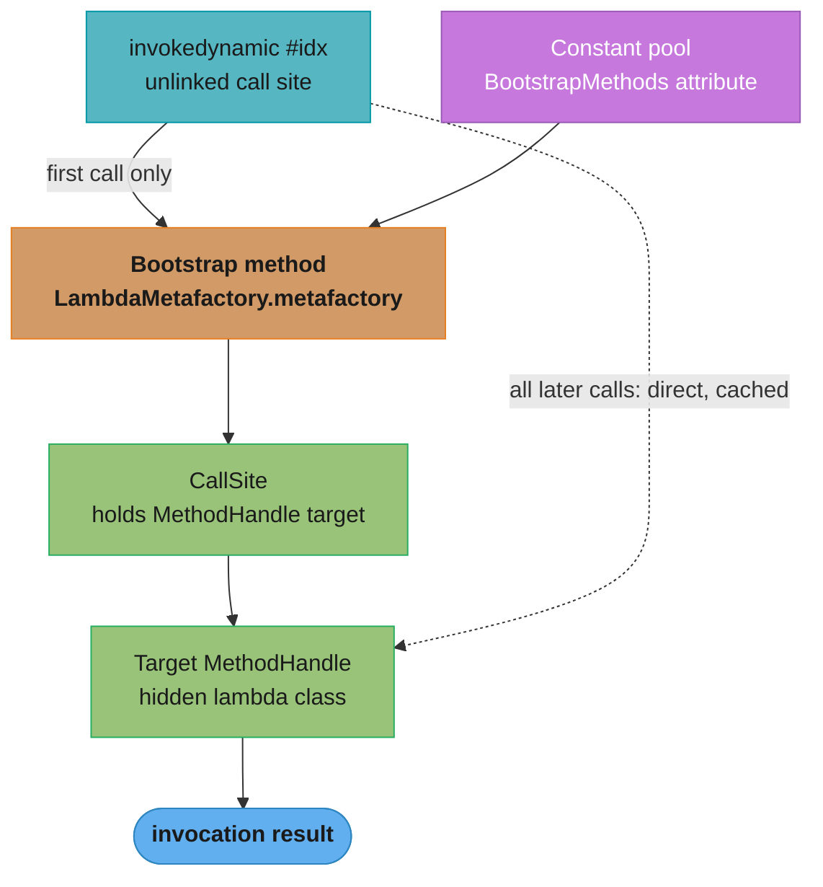
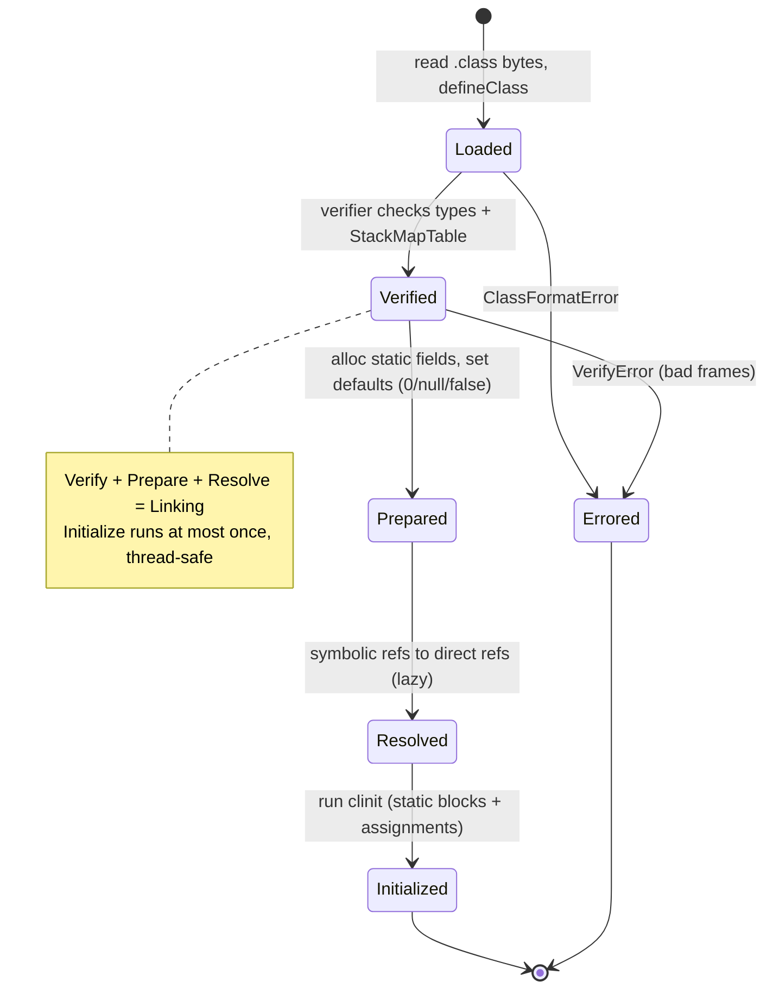

# Bytecode & Class-File Format

## 1. Concept Overview

Java source is never executed directly. `javac` compiles each `.java` file into a `.class` file — a compact, platform-neutral binary containing **JVM bytecode**: a stack-based instruction set that the JVM interprets and, for hot methods, JIT-compiles to native code. The `.class` format is a rigidly specified byte layout (the JVM Specification, chapter 4): a magic number, a version pair, a **constant pool** (the symbol table for the whole class), access flags, the this/super class references, fields, methods, and attributes (`Code`, `LineNumberTable`, `StackMapTable`, `BootstrapMethods`).

Understanding bytecode is what separates engineers who *use* frameworks from those who understand *how* they work. Lambdas, `record` accessors, string concatenation, Mockito mocks, Spring's CGLIB proxies, Jacoco coverage counters, and every APM agent (Datadog, New Relic, Dynatrace) are all **bytecode phenomena** — they either compile to specific instructions (`invokedynamic`) or rewrite class bytes at load time via `java.lang.instrument`. This is also a strong senior-interview differentiator: "how does a lambda compile?", "why did my ASM transform throw `VerifyError`?", and "how does Mockito mock a method?" all live here.

This module is pure Java — no Spring. It pairs with [JVM Internals](../jvm_internals/README.md) (which loads, links, and JIT-compiles the bytes this module produces) and with [Annotation Processing](../annotation_processing/README.md) (compile-*time* codegen, the alternative to bytecode-*time* manipulation).

---

## 2. Intuition

> **One-line analogy**: A `.class` file is sheet music and the JVM is the orchestra. `javac` is the composer who writes notes (opcodes) referencing a shared score glossary (the constant pool); the JVM sight-reads it note by note (interpreter), then memorizes the hot passages and plays them from muscle memory (JIT native code).

**Mental model**: The JVM is an abstract **stack machine**. Every method call gets a *frame* holding a **local variable array** (arguments and locals, slot 0 = `this` for instance methods) and an **operand stack** (a scratchpad). Instructions push operands onto the stack, an operator pops them and pushes the result — `iadd` pops two ints and pushes their sum. There are no registers in the bytecode model; everything flows through that operand stack. The constant pool is the class's dictionary: instructions never embed strings or type names inline, they carry a 1-based *index* into the pool.

**Why it matters**: When `javap -c` shows `invokedynamic #7` for a one-line lambda, you understand there is no anonymous class — the lambda class is *manufactured at first call*. When an ASM transform throws `java.lang.VerifyError: Expecting a stackmap frame`, you know you changed control flow without recomputing the `StackMapTable`, and the one-line fix is `COMPUTE_FRAMES`. When Metaspace fills up under a mock-heavy test suite, you know each `mock()` may spin a new class.

**Key insight**: Bytecode is a **verified** contract, not just data. Before a class runs, the verifier proves type-safety and stack consistency using the `StackMapTable` attribute. Any tool that rewrites bytes must keep that contract intact — which is exactly why bytecode-manipulation bugs surface as `VerifyError`/`ClassFormatError` at load time, not as ordinary exceptions at runtime.

---

## 3. Core Principles

- **Magic + version gate every class**: The first 4 bytes are `0xCAFEBABE`; the next 4 are `minor_version` (u2) + `major_version` (u2). Major 52 = Java 8, 61 = Java 17, 65 = Java 21. A newer major on an older JVM throws `UnsupportedClassVersionError`.
- **The constant pool is 1-indexed**: Valid indices run `1..constant_pool_count-1`; index 0 is reserved. `CONSTANT_Long`/`CONSTANT_Double` occupy **two** consecutive slots, so the next entry's index jumps by 2 — a classic parsing trap.
- **Stack-based execution**: No registers. Operands live on a per-frame operand stack; arguments and locals live in the local variable array. Each `Code` attribute declares `max_stack` and `max_locals`.
- **Symbolic references, resolved lazily**: A `Methodref` names a class/method/descriptor by pool indices. The JVM resolves the symbolic reference to a direct one on first use (link phase — see [JVM Internals](../jvm_internals/README.md)).
- **Bytecode is verified before it runs**: The verifier (JVMS §4.10) type-checks the stack at every instruction using the `StackMapTable` frames `javac` emits at branch targets. Break the frames, break the class.
- **`invokedynamic` is user-programmable linkage**: A call site whose target is decided *at runtime* by a bootstrap method returning a `CallSite`. It underpins lambdas and string concat and is the extension point for JVM languages.
- **Runtime codegen is first-class**: `java.lang.instrument` (agents) plus libraries like ASM and Byte Buddy let you generate or rewrite classes while the JVM runs — the basis of mocks, proxies, coverage, and APM.

---

## 4. Types / Architectures / Strategies

### 4.1 Constant-Pool Entry Kinds (the ones you meet in `javap`)

| Tag | Kind | Carries | Points to |
|-----|------|---------|-----------|
| 1 | `CONSTANT_Utf8` | modified-UTF-8 bytes | leaf — the raw strings (names, descriptors) |
| 3 / 4 | `Integer` / `Float` | literal value | leaf |
| 5 / 6 | `Long` / `Double` | literal value | leaf — **eats 2 pool slots** |
| 7 | `CONSTANT_Class` | `name_index` | a `Utf8` (`java/lang/Object`) |
| 8 | `CONSTANT_String` | `string_index` | a `Utf8` |
| 9 / 10 / 11 | `Fieldref` / `Methodref` / `InterfaceMethodref` | `class_index` + `name_and_type_index` | a `Class` + a `NameAndType` |
| 12 | `CONSTANT_NameAndType` | `name_index` + `descriptor_index` | two `Utf8` (e.g. `add` : `(II)I`) |
| 15 | `CONSTANT_MethodHandle` | `reference_kind` + `reference_index` | a Field/Method-ref |
| 16 | `CONSTANT_MethodType` | `descriptor_index` | a `Utf8` |
| 17 / 18 | `Dynamic` / `InvokeDynamic` | `bootstrap_method_attr_index` + `name_and_type_index` | `BootstrapMethods` attr + `NameAndType` |

### 4.2 Opcode Families (~200 opcodes; one byte each)

| Family | Examples | What they do |
|--------|----------|--------------|
| Load / store | `iload_1`, `aload_0`, `istore_2`, `getfield`, `putstatic` | move between locals/fields and the operand stack |
| Constants | `iconst_0`, `bipush 100`, `ldc #7` | push literals / pooled constants |
| Arithmetic / logic | `iadd`, `imul`, `lshl`, `iand` | pop operands, push result (type-prefixed: `i`/`l`/`f`/`d`) |
| Stack manipulation | `dup`, `pop`, `swap` | reshuffle the operand stack |
| Control flow | `ifeq`, `if_icmplt`, `goto`, `tableswitch`, `ireturn` | branch / return |
| Object / array | `new`, `newarray`, `arraylength`, `checkcast`, `instanceof` | allocation and type ops |
| Method invoke | the five `invoke*` (below) | call methods |

### 4.3 The Five `invoke*` Opcodes — How Each Dispatches

| Opcode | Used for | Dispatch |
|--------|----------|----------|
| `invokestatic` | `static` methods | no receiver; direct — resolved constant target |
| `invokespecial` | constructors (`<init>`), `super.m()`, `private` methods | **non-virtual** — exact declared method, no override lookup |
| `invokevirtual` | normal instance methods | **virtual** — vtable lookup on the runtime type of the receiver |
| `invokeinterface` | methods called through an interface reference | itable lookup (interface method table); slightly costlier than virtual |
| `invokedynamic` | lambdas, string concat, JVM languages | target chosen by a **bootstrap method** at first call, then cached in a `CallSite` |

### 4.4 Runtime Manipulation Libraries

| Library | API style | Frames | Best for |
|---------|-----------|--------|----------|
| **ASM** | low-level visitor (`ClassVisitor`/`MethodVisitor`) — you emit opcodes | you manage (or `COMPUTE_FRAMES`) | max control/perf; used *inside* Byte Buddy, CGLIB, Jacoco, Kotlin |
| **Byte Buddy** | fluent, type-safe DSL (`@Advice`, `MethodDelegation`) | computed for you | agents, mocks, proxies — the modern default |
| **Javassist** | source-string API (`"{ x++; }"`) | computed for you | quick prototypes; slower, weaker on generics |
| **CGLIB** | subclass proxy factory (legacy) | ASM under the hood | old Spring/Hibernate proxies (superseded by Byte Buddy) |

### 4.5 Java Agent Attach Modes

| Mode | Entry method | Timing | Constraint |
|------|--------------|--------|------------|
| **Static (launch)** | `premain(String, Instrumentation)` | before `main()`, via `-javaagent:agent.jar` | sees classes as they first load |
| **Dynamic (attach)** | `agentmain(String, Instrumentation)` | any time, via Attach API / `jcmd`, on a running JVM | must `retransformClasses` already-loaded classes |

---

## 5. Architecture Diagrams

### Source → Class File → ClassLoader → JIT Pipeline

```mermaid
flowchart LR
    classDef io      fill:#61afef,stroke:#2e86c1,color:#1a1a1a,font-weight:bold
    classDef frozen  fill:#c678dd,stroke:#9b59b6,color:#fff
    classDef train   fill:#98c379,stroke:#27ae60,color:#1a1a1a
    classDef mathOp  fill:#d19a66,stroke:#e67e22,color:#1a1a1a,font-weight:bold
    classDef lossN   fill:#e06c75,stroke:#c0392b,color:#fff,font-weight:bold
    classDef req     fill:#56b6c2,stroke:#0097a7,color:#1a1a1a
    classDef base    fill:#e5c07b,stroke:#f39c12,color:#1a1a1a

    SRC([".java source"]) --> JAVAC["javac\nfront-end compiler"]
    JAVAC --> CLASS([".class bytecode\nmagic + const pool + methods"])
    CLASS --> LOAD["ClassLoader.loadClass\nparse + defineClass"]
    LOAD --> VERIFY["Verify + Link\nbytecode verifier"]
    VERIFY -->|"bad frames"| ERR["VerifyError /\nClassFormatError"]
    VERIFY --> INTERP["Interpreter\nexecute bytecode"]
    INTERP -->|"hot: ~10K calls"| JIT["JIT C1 / C2\ncompile to native"]
    JIT --> NATIVE([native machine code])

    class SRC,CLASS,NATIVE io
    class JAVAC,VERIFY,JIT mathOp
    class LOAD,INTERP base
    class ERR lossN
```



`javac` emits bytecode; the classloader hands raw bytes to the verifier; verified bytecode is interpreted, and only hot methods graduate to native code. A malformed `StackMapTable` diverts the flow to `VerifyError` at load time — before any of your code runs.

### `.class` File Byte Layout (alignment carries the meaning — kept ASCII)

```
Offset  Raw bytes        Field (JVMS ClassFile)     Meaning / example
------  ---------------  -------------------------  --------------------------------
0x00    CA FE BA BE      u4 magic                   0xCAFEBABE  "is this a class?"
0x04    00 00            u2 minor_version           0
0x06    00 3D            u2 major_version           61 = Java 17   (52=8, 65=21)
0x08    00 1F            u2 constant_pool_count      31 -> real entries are #1..#30
0x0A    <variable>       cp_info[count-1]           the constant pool (1-INDEXED)
  |     01 00 05 ...     CONSTANT_Utf8       tag 01  u2 length + modified UTF-8 bytes
  |     07 00 04         CONSTANT_Class      tag 07  name_index -> a Utf8 entry
  |     0A 00 02 00 03   CONSTANT_Methodref  tag 0A  class_index + name_and_type
  |     0C 00 05 00 06   CONSTANT_NameAndType tag 0C name_index : descriptor_index
  |     12 00 00 00 07   CONSTANT_InvokeDynamic 12   bsm_attr_index + name_and_type
  |     (CONSTANT_Long / _Double each consume TWO slots -> the index count skips 1)
        00 21            u2 access_flags            0x0021 = ACC_PUBLIC | ACC_SUPER
        00 07            u2 this_class              -> a CONSTANT_Class (this type)
        00 02            u2 super_class             -> a CONSTANT_Class (superclass)
        00 00            u2 interfaces_count        followed by interfaces
        00 00            u2 fields_count            followed by field_info
        00 02            u2 methods_count           followed by method_info (Code)
        00 01            u2 attributes_count        SourceFile, BootstrapMethods,
                                                    InnerClasses, NestMembers ...
```

Every structural field is a fixed-width big-endian integer; only the constant pool and the `*_info` arrays are variable-length. The count fields (`constant_pool_count`, `methods_count`) always precede the array they size — a self-describing, forward-only format.

**In plain terms.** "The offset column is not documentation — it is a running total of the widths above it, which is why a class file can be parsed with a cursor and no lookahead at all."

That framing matters because it explains the format's one real constraint: nothing can be skipped. To find `access_flags` you must have walked every constant-pool entry byte by byte, since the pool's size is not stored anywhere — it is only implied by its contents.

| Symbol | What it is |
|--------|------------|
| `u1` / `u2` / `u4` | Unsigned big-endian integers of 1, 2, and 4 bytes — the only primitive widths in the format |
| `magic` | The `u4` at offset 0; `0xCAFEBABE` or the parse aborts immediately |
| `major_version` | The `u2` at offset 6; equals the Java feature release plus 44 |
| `constant_pool_count` | The `u2` at offset 8; one MORE than the number of usable indices, because index 0 is reserved |
| `cp_info[]` | Variable-width entries starting at offset 10; each begins with a `u1` tag that determines its own length |

**Walk one example.** Size the fixed header, then the eight-entry pool from the `javap` dump in section 6:

```
  fixed header, offset by offset
      0x00   u4  magic                4 bytes    running total  4
      0x04   u2  minor_version        2 bytes                   6
      0x06   u2  major_version        2 bytes                   8
      0x08   u2  constant_pool_count  2 bytes                  10
                                                 -> pool always starts at 0x0A

  major_version decoded:   feature = major - 44
      45 -> Java 1.1     52 -> Java 8      61 -> Java 17     65 -> Java 21

  the eight pool entries of Adder, each sized from its own tag
      #1  Methodref     1 tag + 2 + 2                        =  5    5
      #2  Class         1 tag + 2                            =  3    8
      #3  NameAndType   1 tag + 2 + 2                        =  5   13
      #4  Utf8          1 tag + 2 len + 16 "java/lang/Object" = 19   32
      #5  Utf8          1 tag + 2 len +  6 "<init>"          =  9   41
      #6  Utf8          1 tag + 2 len +  3 "()V"             =  6   47
      #7  Class         1 tag + 2                            =  3   50
      #8  Utf8          1 tag + 2 len +  5 "Adder"           =  8   58

  constant_pool_count for this class = 9   (8 real entries, plus the reserved 0)
  access_flags therefore begins at    = 10 + 58 = byte 68
```

Half of this two-line class is the string `java/lang/Object` and its wrappers. That is the constant pool's whole point: those 19 bytes are written once and every `Methodref`, `Class`, and `NameAndType` that needs the name spends only 2 bytes pointing at it.

The `+ 44` offset exists purely for history — major 45 was Java 1.1, and the counter simply kept incrementing. It is why `UnsupportedClassVersionError` messages read "class file version 65.0" rather than "Java 21", and subtracting 44 is the whole translation.

### `invokedynamic` — Bootstrap-Method Linkage



The first execution runs the bootstrap method (BSM), which manufactures the implementation and returns a `CallSite`; every subsequent call skips the BSM and jumps straight to the cached target `MethodHandle`. This "link once, then it's free" design is why lambdas cost nothing after warm-up.

### Class Loading & Linking States



Verification happens once, at link time, before initialization — so a bytecode defect never reaches your `<clinit>`. Full details of the load/link/init lifecycle live in [JVM Internals](../jvm_internals/README.md).

### Java Agent Load-Time Transform + Retransform

```mermaid
sequenceDiagram
    participant JVM
    participant Agent as Agent (premain)
    participant Inst as Instrumentation
    participant TR as ClassFileTransformer
    participant App as Application

    JVM->>Agent: premain(args, inst) before main()
    Agent->>Inst: addTransformer(tr, canRetransform=true)
    Note over Inst: transformer registered
    App->>JVM: first load of com.example.Service
    JVM->>TR: transform(loader, name, ..., classfileBuffer)
    TR-->>JVM: modified byte array (instrumented)
    JVM->>App: define instrumented class
    Agent->>Inst: retransformClasses(Service.class)
    Inst->>TR: transform(...) again with current bytes
    TR-->>Inst: re-instrumented byte array
    Note over JVM: verifier re-runs; schema (fields/methods) must not change
```

The transformer sees every class's raw bytes at load and can return rewritten bytes; `retransformClasses` re-runs the transformer on already-loaded classes — the mechanism APM agents use to hot-patch instrumentation, subject to the no-schema-change rule.

---

## 6. How It Works — Detailed Mechanics

### Reading Real Bytecode with `javap`

Compile `class Adder { public int add(int a, int b) { return a + b; } }` with `javac Adder.java`, then run `javap -c -v Adder.class`:

```
public class Adder
  minor version: 0
  major version: 61                         // Java 17
  flags: (0x0021) ACC_PUBLIC, ACC_SUPER
  this_class: #7                            // Adder
  super_class: #2                           // java/lang/Object
Constant pool:
   #1 = Methodref          #2.#3            // java/lang/Object."<init>":()V
   #2 = Class              #4               // java/lang/Object
   #3 = NameAndType        #5:#6            // "<init>":()V
   #4 = Utf8               java/lang/Object
   #5 = Utf8               <init>
   #6 = Utf8               ()V
   #7 = Class              #8               // Adder
   #8 = Utf8               Adder
{
  public int add(int, int);
    descriptor: (II)I
    flags: (0x0001) ACC_PUBLIC
    Code:
      stack=2, locals=3, args_size=3        // this, a, b -> 3 locals
         0: iload_1                          // push local 1 (a)
         1: iload_2                          // push local 2 (b)
         2: iadd                             // pop a,b -> push a+b
         3: ireturn                          // return int on top of stack
      LineNumberTable:
        line 3: 0
}
```

`(II)I` is the **method descriptor** — two ints in, one int out. Note `locals=3` even though `add` takes two parameters: slot 0 is the implicit `this`. Every reference in `Code` (`#1`, `#7`) is a 1-based constant-pool index; nothing is inlined.

**Read it like this.** "`stack=2, locals=3, args_size=3` is a frame budget measured in 32-bit slots, not in variables — so the count you get depends on the *types*, and `long` and `double` each cost two."

Getting this wrong is not a style issue: `max_locals` and `max_stack` are what the JVM uses to size the frame it allocates on every call, and the verifier rejects the class outright if the declared numbers are too small for what the code actually does.

| Symbol | What it is |
|--------|------------|
| slot | One 32-bit cell; `int`, `float`, and every reference take 1, `long` and `double` take 2 |
| `locals` (`max_locals`) | Total slots the local variable array needs — `this` plus parameters plus declared locals |
| `stack` (`max_stack`) | Deepest the operand stack ever gets at any point in the method |
| `args_size` | Slots consumed by the incoming arguments alone, including `this` for instance methods |
| descriptor | `(params)return` in type letters: `I` int, `J` long, `D` double, `Z` boolean, `L...;` reference |

**Walk one example.** Compare the `add` above with a wide-typed instance method, `public double blend(long a, double b, int c)`, descriptor `(JDI)D`:

```
  public int add(int a, int b)                 descriptor (II)I

      slot 0   this      reference   1 slot
      slot 1   a         int         1 slot
      slot 2   b         int         1 slot
                                     -------
      args_size = max_locals =        3 slots

      deepest stack:  iload_1 -> 1,  iload_2 -> 2,  iadd -> 1   =>  max_stack = 2


  public double blend(long a, double b, int c) descriptor (JDI)D

      slot 0   this      reference   1 slot
      slot 1   a         long        2 slots   <- slot 2 is the unusable second half
      slot 3   b         double      2 slots   <- slot 4 likewise
      slot 5   c         int         1 slot
                                     -------
      args_size = max_locals =        6 slots   (four values, six slots)

      loading a and b onto the stack:  2 + 2 = 4  =>  max_stack = 4
```

Four arguments, six slots — the count is off by two the moment a `long` or `double` appears. This is the same two-slot rule that bites constant-pool parsers, showing up in a second place, and it is why the bytecode has separate `lload_1`/`iload_1` opcode families: the instruction, not the slot, declares how wide the read is.

Note that the second half of a wide slot is genuinely unaddressable — nothing may `iload` slot 2 in `blend`. The verifier tracks that half-slot as a distinct "top" type precisely so a hand-written transform cannot smuggle a 32-bit read into the upper half of a `long`.

### The Stack Machine, Step by Step

```
Bytecode for  int add(int a, int b) { return a + b; }
Locals:  0 = this,  1 = a,  2 = b

instr       operand stack (top on the right)     effect
---------   ---------------------------------     ------------------------
iload_1     | a |                                 push local 1
iload_2     | a | b |                             push local 2
iadd        | a+b |                               pop 2, push their sum
ireturn     (empty)  -> returns a+b               pop 1, return it
```

`max_stack=2` because the deepest the stack ever gets is two entries (after `iload_2`). The verifier computes this same evolution symbolically to prove the method never underflows or overflows its declared stack.

### `invokedynamic` Deep Dive — Lambdas and String Concat

A lambda does **not** compile to an anonymous inner class. `Runnable r = () -> System.out.println("hi");` compiles to:

```
// javap of the enclosing method:
0: invokedynamic #2,  0    // InvokeDynamic #0:run:()Ljava/lang/Runnable;
5: astore_1

// The lambda body is a synthetic private static method:
private static void lambda$main$0();
   Code:  getstatic System.out; ldc "hi"; invokevirtual println; return

// BootstrapMethods attribute:
0: #21 REF_invokeStatic java/lang/invoke/LambdaMetafactory.metafactory(...)
   Method arguments: ()V, lambda$main$0, ()V
```

On first execution of that `invokedynamic`, the JVM calls `LambdaMetafactory.metafactory`, which spins a **hidden class** implementing `Runnable` whose `run()` delegates to `lambda$main$0`, and returns a `ConstantCallSite`. Subsequent executions reuse the cached `CallSite` — so a captured-nothing lambda is even instantiated once (a singleton). This deferral is why lambdas add no anonymous-class file to your JAR and why lambda linkage is a runtime, not compile-time, decision.

String concatenation works the same way. Since **Java 9 (JEP 280)**, `"x=" + x + "!"` compiles to a single `invokedynamic makeConcatWithConstants` bootstrapped by `StringConcatFactory` — the JVM builds an optimal concatenation strategy at runtime. **Before Java 9** it compiled to an explicit `new StringBuilder().append(...).append(...).toString()` chain (see [Strings & Text](../strings_and_text/README.md)). The invokedynamic form lets the JDK change the concat strategy without recompiling your code.

### Bytecode Verification and the `StackMapTable`

The verifier (JVMS §4.10) proves, without executing, that at every instruction the operand stack and locals have the expected types. Since Java 7 (major 51), it uses **type checking** driven by the `StackMapTable` attribute: `javac` records the exact stack/local types at each **branch target** (the start of every basic block reachable by a jump). Verification is then a single linear pass that checks each frame against the recorded map — fast and deterministic.

The catch: if you *add or move branches* in a method, the old `StackMapTable` frames no longer describe the new control flow, and verification fails. This is the single most common bytecode-manipulation bug.

### BROKEN → FIX: Stale Frames After an ASM Edit

```java
// BROKEN: inject an if-branch but let ASM keep the original StackMapTable.
ClassReader cr = new ClassReader(originalBytes);
ClassWriter cw = new ClassWriter(0);                    // 0 = compute nothing
ClassVisitor cv = new BranchInjector(cw);               // adds a conditional jump
cr.accept(cv, 0);
byte[] out = cw.toByteArray();
// At load time (verifier on, major >= 51):
//   java.lang.VerifyError: Expecting a stackmap frame at branch target 12
//   -> the frames no longer match the rewritten control flow.
```

```java
// FIX: ask ASM to recompute frames (and max_stack / max_locals) from scratch.
ClassReader cr = new ClassReader(originalBytes);
ClassWriter cw = new ClassWriter(cr, ClassWriter.COMPUTE_FRAMES); // pass cr for
ClassVisitor cv = new BranchInjector(cw);                         // superclass lookup
cr.accept(cv, ClassReader.EXPAND_FRAMES);               // expand frames for visitors
byte[] out = cw.toByteArray();
// COMPUTE_FRAMES rebuilds the StackMapTable to match the new flow -> verifier passes.
```

`COMPUTE_FRAMES` costs CPU (ASM re-derives types, occasionally loading classes to find a common superclass), so `COMPUTE_MAXS` alone is used when you only changed stack depth, not branches. **Byte Buddy computes frames for you automatically** — one of the main reasons to prefer it over hand-written ASM for anything non-trivial.

### Generics Erasure Is Visible in the Bytecode

Because generics are erased (see [Generics & Type System](../generics_and_type_system/README.md)), the compiler injects **bridge methods** to preserve polymorphism. `class Box implements Comparable<Box> { public int compareTo(Box b){...} }` produces *two* methods in the class file:

```
public int compareTo(Box);          // your real method,  descriptor (LBox;)I
public int compareTo(Object);       // SYNTHETIC BRIDGE,   descriptor (LObject;)I
   Code: aload_0; aload_1; checkcast Box; invokevirtual compareTo:(LBox;)I; ireturn
```

The bridge (`ACC_BRIDGE | ACC_SYNTHETIC`) satisfies the erased `Comparable.compareTo(Object)` signature and forwards to your typed method after a `checkcast` — proof that erasure is a compile-time story with a bytecode-level fixup. The generic type itself survives only in the `Signature` attribute (for reflection), not in the executable descriptors.

---

## 7. Real-World Examples

- **Mockito + Byte Buddy**: Mockito's default `mock-maker` uses Byte Buddy to generate, at runtime, a subclass of your type whose every method is redirected to Mockito's interceptor. `when(x.foo()).thenReturn(1)` works because `foo()` in the generated subclass calls into the stub registry, not your code.
- **Spring CGLIB proxies**: When a Spring bean can't be proxied by a JDK dynamic proxy (no interface), Spring generates a **CGLIB subclass** (now via Spring's repackaged ASM/Byte Buddy) that overrides methods to weave in `@Transactional`/`@Async` advice. This is why `final` methods can't be advised — you can't override them in the generated subclass.
- **Jacoco code coverage**: A Java agent (`-javaagent:jacocoagent.jar`) inserts a probe (`boolean[]` flag write) at each branch via ASM at load time. Uninstrumented, the class is untouched; the coverage report is just which probe flags flipped.
- **APM agents (Datadog, New Relic, Dynatrace)**: Attach as `-javaagent`, register a `ClassFileTransformer`, and wrap framework entry points (servlet dispatch, JDBC `execute`, HTTP client calls) with timing/tracing bytecode — zero source changes to the monitored app.
- **`record` and `enum`**: Compiler-generated bytecode. A `record Point(int x, int y)` produces synthetic `equals`/`hashCode`/`toString` implemented via an `invokedynamic` to `ObjectMethods.bootstrap`, plus accessor methods — all visible in `javap`.

---

## 8. Tradeoffs

| Dimension | ASM | Byte Buddy | Javassist |
|-----------|-----|-----------|-----------|
| Abstraction | opcode-level visitor | fluent type-safe DSL | source-string / reflection-like |
| Frame handling | manual or `COMPUTE_FRAMES` | automatic | automatic |
| Performance | fastest (thinnest layer) | fast (thin ASM wrapper) | slower |
| Learning curve | steep (know the JVMS) | gentle | gentle |
| Best fit | libraries, max control | agents, mocks, proxies | quick edits, teaching |

| Approach | When it runs | Sees runtime info? | Failure mode |
|----------|-------------|--------------------|--------------|
| **Annotation processing** (compile-time) | during `javac` | no — only source model | compile error (safe, early) |
| **Bytecode manipulation** (load/run-time) | classloading or attach | yes — actual classes/flags | `VerifyError` at load (late) |

| Attach mode | Reach | Cost |
|-------------|-------|------|
| `premain` (static) | classes as they load; cleanest | requires JVM restart with `-javaagent` |
| `agentmain` (dynamic) | live JVM; needs `retransformClasses` | can't change class schema; limited redefinition |

---

## 9. When to Use / When NOT to Use

**Use bytecode manipulation when:**
- You must instrument code you cannot recompile (third-party libraries, the JDK) — APM, coverage, security agents.
- You need cross-cutting behavior (timing, tracing, mocking) applied to many classes uniformly at runtime.
- You're building a framework that generates proxies/mocks/data-classes (Mockito, Hibernate, Spring).

**Prefer compile-time codegen ([Annotation Processing](../annotation_processing/README.md)) when:**
- The generation depends only on source you *do* control — generated code is debuggable, IDE-visible, and fails at compile time, not load time.
- Examples: MapStruct mappers, Lombok, Dagger, generated builders.

**Do NOT reach for bytecode manipulation when:**
- A dynamic proxy over an interface (`java.lang.reflect.Proxy`) or plain composition solves it — no codegen library needed.
- You only need reflection to read metadata (annotations, generic signatures) — that's runtime *inspection*, not *rewriting*.
- The behavior can be expressed as ordinary code — clarity beats cleverness; generated bytecode is invisible in stack traces and hard to debug.

---

## 10. Common Pitfalls

### War Story 1: `VerifyError` in production after an agent upgrade
An APM agent was upgraded; a new transform inserted a `try/finally` around JDBC calls but a bug left it computing only `COMPUTE_MAXS`, not `COMPUTE_FRAMES`. On Java 17 (verifier mandatory) every instrumented class threw `VerifyError: Inconsistent stackmap frames` at load — the app wouldn't boot. **Fix**: recompute frames (`COMPUTE_FRAMES`) whenever control flow changes; test transforms on the target JDK's verifier, not just by eyeballing the bytecode.

### War Story 2: Metaspace OOM from a mock-heavy test suite
A large suite created thousands of distinct Mockito mocks; each generated subclass loaded a new class into Metaspace, and a static holder kept references alive across tests. After ~20 minutes CI failed with `OutOfMemoryError: Metaspace`. **Fix**: reuse mocks, close `MockitoSession`/`@ExtendWith(MockitoExtension.class)` scopes so generated classes become collectible, and cap `-XX:MaxMetaspaceSize` to fail fast (see [JVM Internals](../jvm_internals/README.md)).

### War Story 3: `retransformClasses` failed with `UnsupportedOperationException`
An engineer tried to hot-add a field to a loaded class via a dynamic agent to store timing state. `retransformClasses` rejected it — **you cannot add/remove methods or fields, change signatures, or alter the class hierarchy** during retransformation; only method bodies may change. **Fix**: store per-invocation state on the operand stack / thread-local inside advice, never by changing the class schema.

### War Story 4: `final` method silently not advised
A `@Transactional` annotation on a `final` service method did nothing — no transaction, no error. Spring's CGLIB subclass proxy cannot override a `final` method, so the advice was skipped entirely. **Fix**: remove `final` from methods intended to be proxied, or use interface-based JDK proxies; treat "advice mysteriously missing" as a proxying/override problem first.

### War Story 5: Off-by-one constant-pool parser
A homegrown `.class` reader iterated the constant pool as a simple loop `for (i=1; i<count; i++)`, corrupting on the first `long`/`double`. Those entries **occupy two slots**, so the loop must skip an index after each. **Fix**: increment the index by 2 for `CONSTANT_Long`/`CONSTANT_Double`; this is the most infamous class-parsing bug.

**What it means.** "`constant_pool_count` counts index numbers, not entries — so once a `long` appears, the number of things you must read stops equalling the number of times you may increment the cursor."

The reason this bug is so durable is that it is silent. The loop does not crash on the wide entry; it crashes one, two, or ten entries later, when a stale index makes a `Methodref` point at a `Utf8` and the parser reports a corrupt class that is in fact perfectly valid.

| Symbol | What it is |
|--------|------------|
| `constant_pool_count` | The declared `u2`; highest valid index plus 1 |
| index | The 1-based number an instruction writes to refer to an entry |
| entry | An actual `cp_info` structure in the byte stream |
| the phantom slot | The index a `Long`/`Double` consumes but never fills; referring to it is a `ClassFormatError` |
| `i += 2` | The correction — advance the index by 2 whenever the tag read was 5 or 6 |

**Walk one example.** A pool declaring `constant_pool_count = 9`, where entry #3 is a `CONSTANT_Long`:

```
  true    tag                       entry?     naive loop i++       correct loop
  index                                        files it under...
    1     Utf8 "Adder"              yes        1   ok              1
    2     Class -> #1               yes        2   ok              2
    3     Long  8-byte literal      yes        3   ok              3, then i += 2
    4     (phantom second half)     no         -                   skipped
    5     Utf8 "()V"                yes        4   WRONG           5
    6     NameAndType #1:#5         yes        5   WRONG           6
    7     Methodref #2.#6           yes        6   WRONG           7
    8     Utf8 "value"              yes        7   WRONG           8
    -     (nothing left)            -          8   reads past end  -

  indices declared         = 9 - 1   = 8
  phantom slots            =           1
  entries actually present = 8 - 1   = 7

  the naive loop wants 8 entries but the stream holds 7, so from index 4 on it
  files every entry under an index one too low and then reads past the pool
```

Concretely: the bytes of the real `Utf8 "()V"` get stored under index 4 instead
of 5, so the `NameAndType` that legitimately points at `#5` now resolves to the
wrong thing — and the parser blames the class file.

Eight indices, seven entries. The off-by-one is not in the loop bound but in the assumption that those two numbers are the same, which they are for every class file that happens to contain no `long` or `double` constant — which is most small test classes, and exactly why the bug ships.

---

## 11. Technologies & Tools

| Tool | Purpose |
|------|---------|
| `javap -c -v -p` | Disassemble a `.class`: bytecode, constant pool, attributes, private members |
| `javac -g` | Compile with full debug info (`LocalVariableTable`, `LineNumberTable`) |
| **ASM** (OW2) | Low-level visitor-based read/write of bytecode; the industry substrate |
| **Byte Buddy** | High-level runtime codegen; powers Mockito, Hibernate, agents |
| **Javassist** | Source-string bytecode editing; used by some legacy frameworks |
| **java.lang.instrument** | `Instrumentation`, `ClassFileTransformer`, `retransformClasses` — agent API |
| **jdeps / jdeprscan** | Static dependency and deprecated-API analysis over class files |
| **`-Xlog:class+load`** | Trace class loading (Java 9+); find where a class came from |
| **`-verify` / `-Xverify:all`** | Force full verification for debugging class-format issues |
| **Recaf / Bytecode Viewer** | GUI decompiler + bytecode editor for inspection |

---

## 12. Interview Questions with Answers

**Q1: You edited a method's bytecode with ASM and now the class throws `VerifyError` at load. What happened and how do you fix it?**
You changed the control flow (added a branch) without updating the `StackMapTable`, so the verifier's recorded frames no longer match the actual stack/local types at branch targets. Since Java 7 (major 51) the verifier uses type-checking driven by `StackMapTable`, and any mismatch is a hard `VerifyError` at link time. The fix is to let ASM regenerate frames: construct the writer with `ClassWriter.COMPUTE_FRAMES` and read with `ClassReader.EXPAND_FRAMES`. Byte Buddy computes frames automatically, which is why it's preferred for non-trivial transforms.

**Q2: What is the magic number and what does the major version tell you?**
The first four bytes of every `.class` file are `0xCAFEBABE`, identifying it as a class file; bytes 6-7 are the `major_version`. Major 52 = Java 8, 61 = Java 17, 65 = Java 21 (major = Java feature version + 44). If a class's major version exceeds what the running JVM supports, you get `UnsupportedClassVersionError` at load. This is the concrete cause of "class compiled by a newer version" errors — check the target `--release`.

**Q3: Is the constant pool 0-indexed or 1-indexed, and why does that trip people up?**
The constant pool is 1-indexed: valid indices run from 1 to `constant_pool_count - 1`, and index 0 is reserved as a "no entry" sentinel. The trap is that `CONSTANT_Long` and `CONSTANT_Double` each occupy **two** consecutive slots, so the entry after a `long` is at index+2, not index+1. A naive parser loop that increments by 1 corrupts on the first wide constant — the single most common class-file parsing bug.

**Q4: How does a Java lambda compile — is it an anonymous inner class?**
No — a lambda compiles to an `invokedynamic` instruction plus a synthetic private method holding the body, not an anonymous class file. At first execution, the bootstrap method `LambdaMetafactory.metafactory` generates a hidden class implementing the functional interface and returns a `CallSite`; later calls reuse the cached target. This means no extra `Foo$1.class` is emitted, a stateless lambda is instantiated once, and linkage is deferred to runtime rather than fixed at compile time.

**Q5: What are the five `invoke*` opcodes and how does each dispatch?**
The five are `invokestatic`, `invokespecial`, `invokevirtual`, `invokeinterface`, and `invokedynamic`, each with different dispatch semantics. `invokestatic` calls static methods with no receiver; `invokespecial` is non-virtual dispatch for constructors, `super.m()`, and private methods, hitting the exact declared method; `invokevirtual` handles normal instance methods via vtable lookup on the receiver's runtime type; `invokeinterface` calls through an interface reference via itable lookup; and `invokedynamic` has its target chosen by a bootstrap method at first call, then cached. The key distinction is virtual (`invokevirtual`/`invokeinterface` do runtime type lookup) versus non-virtual (`invokestatic`/`invokespecial` resolve to a fixed method).

**Q6: How does string concatenation compile in modern Java, and how did it change?**
Since Java 9 (JEP 280), `a + b + c` compiles to a single `invokedynamic makeConcatWithConstants` bootstrapped by `StringConcatFactory`, which builds the optimal concat strategy at runtime. Before Java 9, `javac` emitted an explicit `new StringBuilder().append(...).append(...).toString()` chain. The indy form lets the JDK change concatenation internals without recompiling your code and often produces less garbage. The gotcha: `+` inside a hot loop still allocates per iteration — use an explicit `StringBuilder` there.

**Q7: What is the difference between the operand stack and the local variable array?**
The local variable array holds a method's parameters and locals, addressed by slot index. The operand stack is a scratchpad where instructions push and pop operands to compute expressions; slot 0 of the local array is `this` for instance methods. `iload_1` copies local 1 onto the operand stack; `iadd` pops two stack operands and pushes the sum; `istore_2` pops the stack into local 2. Each `Code` attribute declares `max_locals` and `max_stack` so the verifier and JVM can size the frame.

**Q8: What is `invokedynamic` and what problem does it solve?**
`invokedynamic` is a call site whose target method is chosen at runtime by a user-specified bootstrap method that returns a `CallSite`, rather than being fixed at compile time. It lets the JDK and JVM languages defer and customize method linkage — the first call runs the bootstrap and caches the resulting `MethodHandle`; later calls are direct and fast. It was added in Java 7 for dynamic languages and is now the backbone of lambdas (`LambdaMetafactory`), string concat (`StringConcatFactory`), and record `equals`/`hashCode` (`ObjectMethods`).

**Q9: What's the difference between `premain` and `agentmain` for a Java agent?**
`premain` is the static-attach entry point, invoked before `main()` via `-javaagent:agent.jar`. `agentmain` is the dynamic-attach entry point, invoked when an agent attaches to an already-running JVM via the Attach API. `premain(String, Instrumentation)` sees classes as they first load (cleanest instrumentation); `agentmain(String, Instrumentation)` must call `Instrumentation.retransformClasses` to re-instrument classes that already loaded. Manifest keys `Premain-Class`/`Agent-Class` and `Can-Retransform-Classes: true` declare these.

**Q10: What can `retransformClasses` NOT change about a loaded class?**
It cannot add or remove methods or fields, change method signatures or modifiers, or alter the class hierarchy/interfaces — only method bodies (and constant pool as needed) may change. This "schema-preserving" constraint exists because live instances, JIT-compiled frames, and vtables assume the old shape. If you need extra per-invocation state, keep it on the operand stack or in a thread-local inside your advice, never by adding a field via retransform (which throws `UnsupportedOperationException`).

**Q11: When would you pick ASM over Byte Buddy, or vice versa?**
Use Byte Buddy for almost everything — agents, mocks, proxies — because its fluent DSL is type-safe and frames are computed for you. Drop to ASM only when you need opcode-level control or minimal overhead in a library hot path. ASM is the thin substrate (Byte Buddy, CGLIB, and Jacoco all use it internally) but forces you to manage frames and understand the JVMS. Javassist's source-string API is convenient for quick edits but is slower and weaker with generics. Rule of thumb: Byte Buddy by default, ASM when you must.

**Q12: What is bytecode verification and what role does the `StackMapTable` play?**
Verification is the JVM proving, before execution, that bytecode is type-safe and the operand stack is consistent at every instruction (JVMS §4.10). Since Java 7 it uses type-checking rather than the old data-flow inference, driven by the `StackMapTable` attribute that `javac` emits recording the stack/local types at each branch target. This turns verification into a fast linear pass — but it means any tool that changes control flow must regenerate the frames or the class fails to load with `VerifyError`.

**Q13: How does generics erasure show up in the class file?**
Erasure removes generic type parameters from executable descriptors, so `Comparable<Box>.compareTo` erases to `compareTo(Object)`. The compiler adds a synthetic **bridge method** (`ACC_BRIDGE | ACC_SYNTHETIC`) that matches the erased signature and forwards, after a `checkcast`, to your typed `compareTo(Box)`. The generic information survives only in the `Signature` attribute for reflection, not in the bytecode the JVM executes. Seeing two `compareTo` methods in `javap` where you wrote one is erasure's bridge fixup in action.

**Q14: Compile-time codegen versus bytecode-time manipulation — what's the tradeoff?**
Compile-time codegen (annotation processing) generates real source/classes during `javac`, so output is IDE-visible, debuggable, and fails at compile time. Bytecode manipulation instead rewrites classes at load or attach time, so it can touch code you can't recompile (JDK, third-party libs) but fails late with `VerifyError` and is invisible in stack traces. Choose compile-time when you own the source (MapStruct, Dagger, Lombok); choose bytecode-time for cross-cutting instrumentation of code you don't own (APM, coverage). The axis is early-and-visible versus late-and-universal.

**Q15: How does Mockito create a mock, and why can't it (by default) mock a `final` class?**
Mockito's default mock-maker uses Byte Buddy to generate a runtime **subclass** of the target type whose methods are overridden to call Mockito's stubbing interceptor. Because it relies on subclassing/overriding, a `final` class or `final` method can't be intercepted this way — there's nothing to override. The workaround is the **inline mock maker** (`mockito-inline`), which uses a Java agent + `retransformClasses` to rewrite the *original* class's method bodies in place, enabling mocking of finals and statics at the cost of agent overhead.

**Q16: What is `invokespecial` used for besides constructors?**
`invokespecial` performs non-virtual dispatch to an exactly-named method: constructors (`<init>`), explicit `super.method()` calls, and `private` instance methods. The point is to bypass override lookup — `super.toString()` must call the parent's version, not re-dispatch to the current object's override. (Historically private-method calls used `invokespecial`; on interfaces with private methods and in some Java 11+ cases nestmate access refined this, but the non-virtual semantics remain.)

**Q17: What is a `MethodHandle` and how does it differ from reflection?**
A `MethodHandle` is a typed, directly-executable reference to a method/field/constructor from `java.lang.invoke`, resolved once and then invoked at near-native speed via `invokeExact`. Unlike `java.lang.reflect.Method`, access checks happen at lookup time (not every call), it's JIT-friendly (the JIT can inline through it), and it composes (bind arguments, adapt types, combine handles). It's the runtime plumbing behind `invokedynamic` — `LambdaMetafactory` hands back a `CallSite` wrapping a `MethodHandle` to the lambda body.

**Q18: How can you read a class file's bytecode without any third-party library?**
Run `javap -c -v -p ClassName` from the JDK — `-c` disassembles the bytecode, `-v` dumps the constant pool, versions, and attributes (`StackMapTable`, `BootstrapMethods`), and `-p` includes private members. For programmatic access without external deps you can parse the format by hand against JVMS chapter 4, or (Java 22+ preview) use the `java.lang.classfile` API (`ClassFile.parse`). `javap` is the fastest way to answer "what did the compiler actually emit?" for lambdas, records, and switch expressions.

**Q19: Why does `String` concatenation in a loop still cause allocation even with the JEP 280 `invokedynamic` form?**
Each `+` expression compiles to an independent `invokedynamic makeConcatWithConstants` call that allocates a brand-new `String` every time it runs. Running that inside a loop therefore allocates one new `String` (and intermediate buffers) every iteration. JEP 280 optimizes a *single* concatenation expression, not repeated ones across loop iterations. The fix is unchanged from the pre-Java-9 advice: hoist an explicit `StringBuilder` outside the loop and `append` inside it, turning N allocations into amortized growth.

---

## 13. Best Practices

1. **Always recompute frames when you change control flow** — `ClassWriter.COMPUTE_FRAMES` + `ClassReader.EXPAND_FRAMES`, or use Byte Buddy which does it for you.
2. **Test transforms against the target JDK's verifier** — a transform that "looks right" can still fail `VerifyError` on Java 17/21; run the instrumented class, don't just diff bytecode.
3. **Ignore JDK and framework internals in agents** — `AgentBuilder.ignore(nameStartsWith("java.", "jdk.", "net.bytebuddy."))` avoids huge startup cost and self-instrumentation loops.
4. **Prefer compile-time codegen when you own the source** — MapStruct/Dagger/Lombok fail early and are debuggable; reserve bytecode manipulation for code you can't recompile.
5. **Never rely on adding fields via `retransformClasses`** — it's schema-preserving; carry state in advice locals or thread-locals.
6. **Cap `-XX:MaxMetaspaceSize`** in codegen-heavy apps and reuse generated classes (mocks, proxies) so leaks fail fast, not after hours.
7. **Prefer Byte Buddy over hand-written ASM** for agents/mocks/proxies — same power, automatic frames, far fewer footguns.
8. **Read the bytecode when behavior surprises you** — `javap -c -v` settles "is this a lambda or an anon class?", "why two `compareTo`?", and "is `final` blocking my proxy?" instantly.
9. **Keep `Can-Retransform-Classes: true` and both entry points** (`Premain-Class` + `Agent-Class`) in the manifest so one agent JAR works for both static and dynamic attach.
10. **Guard against `final`** — don't mark methods `final` if a framework must proxy/advise them; treat "advice missing" as an override/proxy problem first.

---

## 14. Case Study

### Building a Method-Timing Java Agent with Byte Buddy (`@Timed`)

**Goal.** Ship a drop-in `-javaagent` that measures the wall-clock time of any method annotated `@Timed`, in any application, without touching that application's source. A user adds the annotation and the JAR to the command line; the agent does the rest. This is the skeleton of every real APM agent (Datadog, New Relic), minus the network export.

**Why Byte Buddy over raw ASM here.** We're injecting an enter/exit timer around arbitrary methods — that changes each method's control flow (a `try/finally`), which with raw ASM means manually recomputing `StackMapTable` frames per method or risking `VerifyError`. Byte Buddy's `@Advice` computes frames automatically and **inlines** the advice bytecode directly into the target method (no reflection at call time), so the timing overhead is a couple of `nanoTime` calls, not a reflective dispatch.

#### 1. The marker annotation

```java
package com.example.timing;

import java.lang.annotation.*;

@Retention(RetentionPolicy.RUNTIME)   // must be visible at load/attach time
@Target(ElementType.METHOD)
public @interface Timed { }
```

#### 2. The advice — inlined into every `@Timed` method

```java
package com.example.timing;

import net.bytebuddy.asm.Advice;

/**
 * Byte Buddy copies this bytecode INTO each target method (no runtime reflection).
 * OnMethodEnter's return value is threaded to OnMethodExit via @Advice.Enter.
 */
public final class TimingAdvice {

    @Advice.OnMethodEnter
    static long enter() {
        return System.nanoTime();                 // pushed onto the target's stack
    }

    @Advice.OnMethodExit(onThrowable = Throwable.class)   // fire even if it throws
    static void exit(@Advice.Enter long startNanos,
                     @Advice.Origin String method) {
        long micros = (System.nanoTime() - startNanos) / 1_000;
        System.out.printf("[Timed] %-40s %6d us%n", method, micros);
    }
}
```

#### 3. The agent entry point — static and dynamic attach

```java
package com.example.timing;

import net.bytebuddy.agent.builder.AgentBuilder;
import net.bytebuddy.asm.Advice;
import java.lang.instrument.Instrumentation;

import static net.bytebuddy.matcher.ElementMatchers.*;

public final class TimingAgent {

    public static void premain(String args, Instrumentation inst) { install(inst); }
    public static void agentmain(String args, Instrumentation inst) { install(inst); }

    private static void install(Instrumentation inst) {
        new AgentBuilder.Default()
            // never instrument the JDK, Byte Buddy itself, or our own agent
            .ignore(nameStartsWith("java.")
                    .or(nameStartsWith("jdk."))
                    .or(nameStartsWith("net.bytebuddy."))
                    .or(nameStartsWith("com.example.timing.")))
            // only touch types that declare at least one @Timed method
            .type(declaresMethod(isAnnotatedWith(Timed.class)))
            .transform((builder, type, loader, module, pd) ->
                builder.visit(
                    Advice.to(TimingAdvice.class)
                          .on(isAnnotatedWith(Timed.class))))   // advise only @Timed
            .installOn(inst);
    }
}
```

#### 4. The manifest — one JAR, both attach modes

```
Premain-Class: com.example.timing.TimingAgent
Agent-Class: com.example.timing.TimingAgent
Can-Retransform-Classes: true
Can-Redefine-Classes: true
```

Run statically:

```bash
java -javaagent:timing-agent.jar -jar app.jar
# [Timed] com.example.OrderService.checkout            1830 us
```

Or attach dynamically to a live PID (via the Attach API / `jattach`), which triggers `agentmain` and, for classes already loaded, `Instrumentation.retransformClasses` to re-run the transform.

#### Broken first attempt, then fix

```java
// BROKEN: matched EVERY method, including tiny getters and JDK-adjacent code.
.type(any())
.transform((b, t, cl, m, pd) -> b.visit(Advice.to(TimingAdvice.class).on(any())));
// Result: startup crawls (every class rewritten), log flooded, and self-
// instrumentation of framework classes causes ClassCircularityError on some JVMs.
```

```java
// FIX: narrow the surface to types that DECLARE @Timed, advise only @Timed methods,
// and ignore infrastructure packages (see install() above). Startup cost drops to
// near-zero because untouched classes are returned unmodified from transform().
```

#### Why the advice is inlined, not delegated

Byte Buddy offers two styles: `MethodDelegation` (call out to an interceptor object — flexible, but a real method call per invocation) and `@Advice` (copy the advice **bytecode** into the target method — near-zero overhead). For a timer that wraps potentially hot methods, `@Advice` is correct: the injected `nanoTime` calls become part of the target's own `Code` attribute, so the JIT can inline the whole thing. This mirrors why production APM agents favor advice-style weaving on hot paths.

#### Operational pitfalls this design avoids

**1. Instrumenting the JDK / itself.** Without the `ignore(...)` filter, the agent would try to rewrite `java.*` and its own classes, causing `ClassCircularityError` or catastrophic startup slowdown. The filter keeps the transform surface tiny.

**2. Assuming you can add a field for state.** A naive version tried to store `startNanos` in a new instance field so nested calls wouldn't collide; `retransformClasses` refuses to add fields. Threading the value through `@Advice.Enter` (it lives on the operand stack) is the schema-safe way.

**3. Swallowing exceptions.** `@Advice.OnMethodExit(onThrowable = Throwable.class)` ensures the timer records even when the method throws — otherwise every failing call would silently skip its measurement, hiding exactly the slow-failure paths you most want to see.

**4. `final` and static-init timing.** Methods on `final` classes are fine here (advice is woven into the class itself, not a subclass), but very early classes loaded before the agent installs its transformer won't be instrumented unless you retransform them — a reason APM agents attach as early as possible.

### Interview Discussion Points

**Why does `@Advice` avoid runtime reflection while `MethodDelegation` doesn't?** `@Advice` copies the advice method's bytecode directly into each target method at transform time, so at runtime it's just inlined instructions; `MethodDelegation` generates a call to a separate interceptor, which is a genuine (though fast) method invocation. On hot paths, advice-style weaving is the low-overhead choice.

**Why can this agent time a `final` method when a Spring CGLIB proxy can't advise one?** This agent rewrites the method's own bytecode in place (class transformation), so there's nothing to override; CGLIB proxying works by generating a *subclass* that overrides the method, which is impossible for `final` methods. The instrumentation mechanism, not the annotation, decides whether `final` blocks you.

**What breaks if you forget `Can-Retransform-Classes: true`?** Dynamic attach (`agentmain`) can still register a transformer, but it cannot re-instrument classes that were already loaded before attach, so those methods are never timed. For a static `-javaagent` start it matters less because most classes load after `premain`, but keeping it `true` makes one JAR work for both modes.

**How would you export these timings to a real backend?** Replace the `System.out.printf` in `exit(...)` with a non-blocking write to a metrics ring buffer drained by a background thread that ships to Prometheus/OTLP — never do network I/O inside the advice, since it runs on the application's own thread and would add its latency to every timed call.

---

## Related / See Also

- [JVM Internals](../jvm_internals/README.md) — how the bytes this module produces are loaded, verified, linked, and JIT-compiled; Metaspace and classloader leaks from codegen.
- [Annotation Processing](../annotation_processing/README.md) — compile-time codegen (JSR 269, JavaPoet, Lombok, MapStruct): the debuggable, fail-early alternative to bytecode-time manipulation.
- [Generics & Type System](../generics_and_type_system/README.md) — erasure, bridge methods, and `Signature` attributes as they appear in the class file; `MethodHandle` vs reflection.
- [Strings & Text](../strings_and_text/README.md) — `invokedynamic` string concatenation (JEP 280) and the constant pool's role in string interning.
