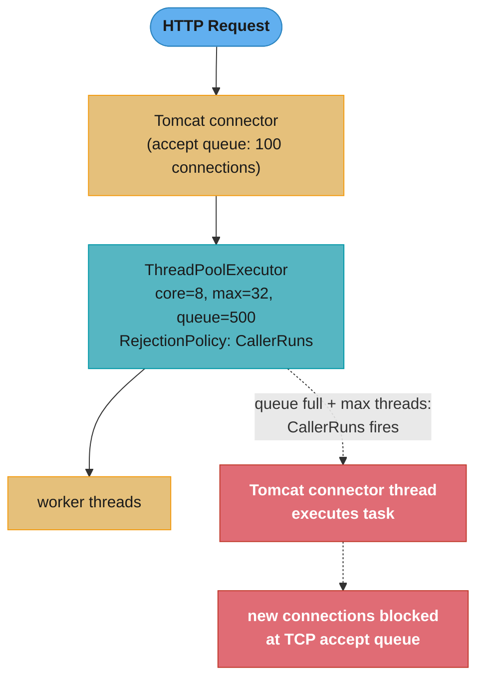

# Backpressure and Bounded Resources

> **An unbounded queue is a time bomb, not a buffer.**  
> Every component that accepts work faster than it processes work eventually runs out of memory.
> Backpressure is the discipline of making that capacity limit explicit, enforcing it at the
> boundary, and deciding what to do when the limit is reached — before the OOM does it for you.

---

## 1. Concept Overview

Backpressure is the mechanism by which a downstream component signals that it is at capacity,
causing the upstream component to slow down, drop, or queue work rather than generating it
unboundedly. Without backpressure, a fast producer and a slow consumer produce an ever-growing
queue that eventually exhausts heap memory.

**Bounded resources in Java services:**
- **Thread pools** — thread count, queue capacity, rejection policy
- **Connection pools** — pool size, acquisition timeout
- **Blocking queues** — bounded capacity between producers and consumers
- **Semaphores** — permit count limiting concurrent in-flight operations
- **Rate limiters** — token bucket / leaky bucket limiting request rate
- **Reactive streams** (`Flow.Publisher` / Project Reactor) — `request(n)` demand signalling

All six are expressions of the same principle: define a finite bound, enforce it explicitly,
handle overflow with a defined policy.

---

## 2. Intuition

Think of a restaurant kitchen:

- The **kitchen** = consumer (processes orders)
- The **waiting area** = queue (holds pending orders)
- The **maitre d'** = backpressure signal ("we're full, please wait outside")
- The **overflow policy** = turn away new customers (drop), tell them estimated wait (timeout),
  or call sister restaurant (shed to alternate path)

Without a "full" signal, the kitchen takes every order, the waiting area fills the whole
restaurant, and eventually the floor collapses. Backpressure is the maitre d' — an explicit
limit with a policy for what happens at the limit.

**Key insight:** The goal is NOT to eliminate queuing — queues are necessary buffers for burst
absorption. The goal is to bound queue growth so that the service degrades gracefully (latency
rises predictably) rather than catastrophically (OOM crash).

---

## 3. Core Principles

### Little's Law — the fundamental relationship

```
L = λ × W
```

Where:
- `L` = average number of requests in the system (queue + processing)
- `λ` = average arrival rate (req/s)
- `W` = average time in the system (seconds, including queue wait + processing)

**Practical application:** If your service processes at 100 req/s and average processing time is
0.5s, then at steady state: L = 100 × 0.5 = 50 concurrent requests. A thread pool with 50
threads handles this exactly. If requests spike to 200/s, L = 100 (all threads busy + queue
growing). If queue capacity is 200 and spike lasts 2 seconds: queue = 200 × 2 - 100 × 2 = 200
entries — exactly at the limit. Beyond that, the rejection policy fires.

### The three responses to a full queue

1. **Block** — producer waits until capacity is available (`BlockingQueue.put()`)
2. **Drop** — newest or oldest work is discarded; caller receives an error
3. **Shed** — work is redirected to an alternate path (circuit breaker, fallback, retry queue)

Which response is correct depends on whether the caller can tolerate a retry:
- Synchronous HTTP endpoint: drop + return 429 Too Many Requests
- Async background worker: block or shed to a retry queue
- Real-time metrics: drop (slightly stale metrics are acceptable)

---

## 4. Bounded Resource Primitives

### 4.1 `BlockingQueue` variants

```java
import java.util.concurrent.*;

// ArrayBlockingQueue — bounded, backed by array, FIFO
// Use when: producer/consumer rate match, burst absorption needed
BlockingQueue<Task> bounded = new ArrayBlockingQueue<>(1000);

// LinkedBlockingQueue — optionally bounded (unbounded by default = BAD!)
// DANGEROUS default: Integer.MAX_VALUE capacity → effectively unbounded
BlockingQueue<Task> unbounded = new LinkedBlockingQueue<>();   // DO NOT DO THIS

// Always specify capacity for LinkedBlockingQueue:
BlockingQueue<Task> safe = new LinkedBlockingQueue<>(1000);

// SynchronousQueue — no buffer; each put() blocks until a take() matches
// Use when: you want immediate handoff and can reject if no consumer is ready
BlockingQueue<Task> rendezvous = new SynchronousQueue<>();

// PriorityBlockingQueue — unbounded priority queue (no capacity enforcement)
// Use only for small, well-understood queues; add external rate limiting
```

**Insertion modes (all `BlockingQueue` implementations):**

| Method | Behaviour when full |
|--------|-------------------|
| `add(e)` | Throws `IllegalStateException` |
| `offer(e)` | Returns `false` (non-blocking) |
| `offer(e, timeout, unit)` | Waits up to timeout; returns `false` if still full |
| `put(e)` | Blocks indefinitely until space available |

For backpressure: use `offer(e, timeout, unit)` to impose a maximum wait; use `put(e)` only
when blocking the producer thread is acceptable.

---

### 4.2 `ThreadPoolExecutor` — rejection policies

```java
import java.util.concurrent.*;

// Correctly bounded thread pool with bounded queue
ThreadPoolExecutor executor = new ThreadPoolExecutor(
    4,                              // corePoolSize
    16,                             // maximumPoolSize
    60, TimeUnit.SECONDS,           // keepAliveTime for idle excess threads
    new ArrayBlockingQueue<>(200),  // bounded work queue
    new ThreadFactory() { /* ... */ },
    new ThreadPoolExecutor.CallerRunsPolicy()  // backpressure policy
);
```

**Built-in rejection handlers:**

| Handler | Behaviour | Use case |
|---------|-----------|---------|
| `AbortPolicy` (default) | Throws `RejectedExecutionException` | Fail-fast; caller must handle |
| `CallerRunsPolicy` | Submitting thread executes the task | Natural backpressure — slows caller |
| `DiscardPolicy` | Silently drops new task | Acceptable for fire-and-forget metrics |
| `DiscardOldestPolicy` | Drops head of queue, re-submits | Freshness matters; old work is stale |

**Custom rejection handler (circuit-breaker pattern):**
```java
public class MeteredRejectionHandler implements RejectedExecutionHandler {
    private final MeterRegistry registry;
    private final Counter rejections;

    public MeteredRejectionHandler(MeterRegistry registry) {
        this.registry = registry;
        this.rejections = registry.counter("executor.rejections");
    }

    @Override
    public void rejectedExecution(Runnable r, ThreadPoolExecutor executor) {
        rejections.increment();
        // Optionally: try to submit to a fallback executor
        throw new RejectedExecutionException(
            "Executor queue full: size=" + executor.getQueue().size() +
            " active=" + executor.getActiveCount());
    }
}
```

---

### 4.3 `Semaphore` — concurrent in-flight limit

```java
import java.util.concurrent.Semaphore;

// Limit concurrent outbound HTTP calls to 50
public class RateLimitedHttpClient {
    private final Semaphore inFlight = new Semaphore(50);
    private final HttpClient client = HttpClient.newHttpClient();

    public <T> CompletableFuture<T> sendAsync(HttpRequest request, BodyHandler<T> handler) {
        // Acquire before sending; release in completion callback
        try {
            if (!inFlight.tryAcquire(5, TimeUnit.SECONDS)) {
                throw new RuntimeException("HTTP client pool saturated — 50 requests in flight");
            }
        } catch (InterruptedException e) {
            Thread.currentThread().interrupt();
            throw new RuntimeException("Interrupted waiting for HTTP permit", e);
        }

        return client.sendAsync(request, handler)
            .whenComplete((res, ex) -> inFlight.release());
    }
}
```

**Semaphore vs bounded queue:**
- `Semaphore(n)` limits *concurrent* operations regardless of sequencing — good for limiting
  DB connections, downstream API calls, or expensive CPU tasks.
- `BlockingQueue(n)` limits *pending* work items waiting to be processed — good for decoupling
  producer and consumer threads.

---

### 4.4 Reactive streams backpressure (`java.util.concurrent.Flow`)

```java
import java.util.concurrent.Flow;
import java.util.concurrent.SubmissionPublisher;

// Java 9+ reactive streams; Project Reactor / RxJava implement the same Flow API
SubmissionPublisher<Event> publisher = new SubmissionPublisher<>();

publisher.subscribe(new Flow.Subscriber<>() {
    private Flow.Subscription subscription;

    @Override
    public void onSubscribe(Flow.Subscription sub) {
        this.subscription = sub;
        subscription.request(10);   // demand signal: "I can process 10 items"
    }

    @Override
    public void onNext(Event event) {
        process(event);
        subscription.request(1);    // processed 1 → request 1 more
    }

    @Override public void onError(Throwable t) { /* handle */ }
    @Override public void onComplete() { /* handle */ }
});

// SubmissionPublisher respects demand; blocks publisher if subscriber falls behind
publisher.submit(new Event("click"));
```

`SubmissionPublisher.submit()` blocks if all subscribers are behind (unprocessed items exceed
their `request(n)` demand). This is the reactive streams backpressure protocol formalised in
the Reactive Streams specification (now part of `java.util.concurrent.Flow` in Java 9).

---

## 5. Architecture Diagrams

### Thread pool with bounded queue and backpressure



### Pipeline with multiple bounded buffers

```mermaid
flowchart LR
    classDef io      fill:#61afef,stroke:#2e86c1,color:#1a1a1a,font-weight:bold
    classDef frozen  fill:#c678dd,stroke:#9b59b6,color:#fff
    classDef train   fill:#98c379,stroke:#27ae60,color:#1a1a1a
    classDef mathOp  fill:#d19a66,stroke:#e67e22,color:#1a1a1a,font-weight:bold
    classDef lossN   fill:#e06c75,stroke:#c0392b,color:#fff,font-weight:bold
    classDef req     fill:#56b6c2,stroke:#0097a7,color:#1a1a1a
    classDef base    fill:#e5c07b,stroke:#f39c12,color:#1a1a1a

    kc["Kafka Consumer\nλ = 5000 rec/s"] --> q1["ArrayBlockingQueue(2000)"]
    q1 --> proc["Processor\nμ = 1000 rec/s"]
    proc --> q2["ArrayBlockingQueue(1000)"]
    q2 --> dbw["DB Writer\nμ = 500 rec/s"]
    dbw --> q3["BatchBuffer(100)"]
    q3 --> batch["DB executeBatch()"]

    q1 -.->|"consumer pauses if full"| kc
    q2 -.->|"slows consumer"| proc

    class kc,proc,dbw req
    class q1,q2,q3 base
    class batch base
```



The pipeline auto-tunes: the slowest stage (DB Writer, 500/s) determines maximum throughput.
The queues absorb burst traffic. When steady-state inflow (5000/s) exceeds capacity (500/s),
the DB Writer's queue fills → Processor's queue fills → Consumer's queue fills → consumer
pauses Kafka polling (by not calling `poll()`, consumer lag grows but OOM is prevented).

---

## 6. How It Works — Detailed Mechanics

### Sizing a thread pool (Little's Law applied)

```
# Scenario: order-processing service
# Average processing time W = 200ms (0.2s)
# Target throughput λ = 500 req/s

threads_needed = λ × W = 500 × 0.2 = 100 threads (for CPU-bound work)

# For I/O-bound work (50% waiting for DB):
# Effective processing time = 200ms; CPU actually used = 100ms
# threads_needed = λ × W_cpu = 500 × 0.1 = 50 threads + I/O wait capacity
# Practical formula for I/O-bound: threads = target_concurrency × (1 + wait/service)
# = 100 × (1 + 100ms/100ms) = 200 threads
```

**Queue depth sizing:**
```
# Allow 2 seconds of backpressure absorption before rejecting
queue_size = λ × max_burst_seconds = 500 × 2 = 1000 items
# But cap at what memory can hold: 1000 × avg_task_size < 10% of heap
```

---

### Connection pool sizing (HikariCP defaults and why they're often wrong)

```yaml
spring:
  datasource:
    hikari:
      # Default: 10 connections — often too small for high-throughput services
      maximum-pool-size: 20       # derived from: peak_threads × 0.5 (I/O overlap)
      minimum-idle: 10            # keep warm connections
      connection-timeout: 5000    # 5s: fail fast rather than queuing indefinitely
      idle-timeout: 300000        # 5min: return idle connections
      max-lifetime: 600000        # 10min: recycle connections to avoid server-side timeout
      # Key: pool-size is NOT "set it high for safety" — DB has its own connection limit
      # Rule: maxPoolSize = (core_count * 2) + effective_spindle_count (PgBouncer formula)
      # For 8-core server with SSD: maxPoolSize = 8 * 2 + 1 = 17 → round to 20
```

**The HikariCP bounded resource chain:**
1. HikariCP has `maximumPoolSize` connections (the hard limit)
2. `connectionTimeout` determines how long a thread waits for a connection before failing
3. A high `connectionTimeout` (e.g., 30s) converts pool saturation into latency; a low one
   (2–5s) converts it into errors — which is more visible and actionable

---

### Broken pattern — `LinkedBlockingQueue` without bound in an executor

**Broken:**
```java
// DANGEROUS: ExecutorService uses LinkedBlockingQueue with Integer.MAX_VALUE capacity
ExecutorService executor = Executors.newFixedThreadPool(8);
// Under Executors.newFixedThreadPool() source:
//   new ThreadPoolExecutor(nThreads, nThreads, 0L, TimeUnit.MILLISECONDS,
//       new LinkedBlockingQueue<Runnable>());   // UNBOUNDED!

// If tasks arrive faster than 8 threads can process:
for (int i = 0; i < 1_000_000; i++) {
    executor.submit(new BigTask());   // never rejects; queue grows to OOM
}
```

**Fixed:**
```java
// Explicitly bounded with CallerRunsPolicy for backpressure
ExecutorService executor = new ThreadPoolExecutor(
    8, 8,
    0L, TimeUnit.MILLISECONDS,
    new ArrayBlockingQueue<>(1000),          // bounded: 1000 pending tasks max
    Executors.defaultThreadFactory(),
    new ThreadPoolExecutor.CallerRunsPolicy() // backpressure: block the submitter
);
```

`CallerRunsPolicy` is the best default for most services: the submitting thread executes the
task synchronously, which naturally slows the producer to match the consumer's rate. It also
preserves all tasks (no dropping), which is important for financial or ordering workloads.

---

### Detecting queue saturation with Micrometer

```java
@Configuration
public class ExecutorMonitoring {

    @Bean
    public ThreadPoolExecutor serviceExecutor(MeterRegistry registry) {
        ThreadPoolExecutor executor = new ThreadPoolExecutor(
            8, 32,
            60, TimeUnit.SECONDS,
            new ArrayBlockingQueue<>(500),
            new MeteredRejectionHandler(registry)
        );

        // Bind standard executor metrics: queue.size, active.threads, pool.size
        ExecutorServiceMetrics.monitor(registry, executor, "service.executor");

        // Alert when queue > 80% full: executor.queue.remaining < 100
        return executor;
    }
}
```

Standard Micrometer gauges from `ExecutorServiceMetrics`:
- `executor.queued` — current queue depth
- `executor.active` — active (running) threads
- `executor.pool.size` — current total thread count
- `executor.rejected` (from `MeteredRejectionHandler`) — rejection rate

Alert rule: `executor.queued / queue_capacity > 0.8` sustained for 30s → page on-call.

---

## 7. Real-World Examples

### Netflix — Hystrix bulkhead pattern (now Resilience4j)

Netflix's Hystrix popularised the bulkhead pattern: each downstream dependency gets its own
bounded `ThreadPoolExecutor`. If the payment service is slow, its thread pool saturates and
its rejection handler returns a fallback response — the recommendation service thread pool
is unaffected. Without bulkheads, a slow dependency starves the shared thread pool, causing
cascading failure across all services. Netflix reported that this isolation pattern prevented
5 complete outage incidents during 2014 Black Friday. Resilience4j's `BulkheadModule` provides
the same capability with configurable semaphore-based or thread-pool-based isolation.
See also: [../design_rate_limiter_java.md](../design_rate_limiter_java.md) for the rate limiter
component that works alongside the bulkhead.

### LinkedIn — Connection pool tuning for Kafka consumers

LinkedIn's Kafka team discovered in 2017 that connection pool exhaustion was the primary cause
of consumer group rebalances on high-throughput topics. Each consumer's DB write path was using
HikariCP with the default pool size of 10. At 2,000 msgs/s per consumer instance with 50ms
average DB write time, Little's Law gives: L = 2000 × 0.050 = 100 concurrent writes needed,
but only 10 pool slots available → 90 threads queuing at HikariCP → `connectionTimeout` (30s
default) → tasks timing out → consumer rebalance. Fix: pool size = 100, timeout = 1s.
Reference: LinkedIn Engineering blog, "Kafka Consumer Tuning" (2017).

### Shopify — `CallerRunsPolicy` as HTTP throttle

Shopify's Flash Sales infrastructure uses `CallerRunsPolicy` on their order-processing thread
pool. When the pool saturates (>500ms queue wait), the Tomcat connector thread itself executes
the task — which means the connector cannot accept new TCP connections, naturally throttling
inbound HTTP. This emergent throttling prevented OOM crashes during Black Friday 2019, at the
cost of increased P99 latency (200ms → 2.1s) but zero dropped orders. Reference: Shopify
Engineering blog, "Surviving Black Friday" (2020).

### Apache Kafka — consumer-side backpressure via `poll()` delay

Kafka implements backpressure by having consumers control their own fetch rate: if the consumer
does not call `poll()` within `max.poll.interval.ms` (default 5 minutes), the broker considers
it dead and triggers a rebalance. Application-level backpressure: if the processing queue is
full, delay calling `poll()` — this stops fetching new batches while the existing ones are
processed. The broker retains uncommitted messages and serves them on the next `poll()`.
This is how Kafka implements cooperative pull-based backpressure without any protocol-level
flow control.

### Amazon SQS — visibility timeout as backpressure

Amazon's SQS uses the `visibility timeout` (default 30s) as an implicit backpressure mechanism.
If a consumer receives a message but does not delete it within the timeout, SQS makes it
visible again for another consumer. A slow consumer with a large in-flight message count simply
exhausts its `maxNumberOfMessages` budget (max 10 per `ReceiveMessage` call), naturally
self-throttling. Amazon recommends setting `visibility timeout = 6 × average processing time`
to avoid spurious reprocessing while still detecting stalled consumers.

---

## 8. Tradeoffs

| Strategy | When full | Memory overhead | Latency impact | Data loss risk | Use case |
|----------|-----------|----------------|----------------|----------------|---------|
| `BlockingQueue.put()` (block) | Producer blocks | O(queue_depth) | Adds wait time | None (no drop) | Work must not be lost (orders, payments) |
| `BlockingQueue.offer()` (drop) | Task discarded | O(queue_depth) | No impact on producer | Task dropped | Metrics, logs (stale data acceptable) |
| `CallerRunsPolicy` | Submitter thread executes | O(queue_depth) | Slows submitter (natural bp) | None | HTTP serving; slowing Tomcat connector is OK |
| `Semaphore` permit limit | Caller throws or waits | O(1) | Adds tryAcquire wait | None | Outbound API calls, DB connections |
| Reactive `request(n)` | Publisher pauses | O(demand) | Subscription latency | None | Streaming pipelines, WebFlux |
| Circuit breaker + fallback | Fails fast to fallback | O(1) | Fast failure | None (fallback) | Downstream service calls |

---

## 9. When to Use / When NOT to Use

### Use explicit backpressure when:
- Your service has a stateful queue (thread pool work queue, message queue consumer buffer)
- You call downstream services with variable latency (DB, external API)
- Traffic spikes are expected (e-commerce checkout, notification fan-out)
- Memory is a constraint (batch job loading records into a queue)

### Do NOT use blocking queues when:
- The consumer is synchronous HTTP serving — block the Tomcat connector instead via
  `CallerRunsPolicy` (blocking a pool thread also blocks the connector; use a `Semaphore`
  at the filter level for HTTP-specific rate limiting)
- The task set must be fully preserved with ordering guarantees — use a `BlockingDeque` or a
  persistent queue (Kafka, SQS)
- Unbounded memory growth is acceptable for a SHORT burst — `LinkedBlockingQueue` without
  a bound is never acceptable for a long-running production service

---

## 10. Common Pitfalls

### Pitfall 1 — Unbounded executor queue (the most common JVM OOM in production)

**Broken:**
```java
// Executors.newFixedThreadPool() uses unbounded LinkedBlockingQueue
ExecutorService exec = Executors.newFixedThreadPool(8);
// Under load: queue grows without bound until OutOfMemoryError
```

**Fixed:**
```java
ExecutorService exec = new ThreadPoolExecutor(
    8, 8, 0L, TimeUnit.MILLISECONDS,
    new ArrayBlockingQueue<>(1000),
    new ThreadPoolExecutor.CallerRunsPolicy()
);
```

**Impact:** On a service handling 10k ops/s with 8 threads at 100ms processing time, the
default unbounded queue grows at 10,000 − (8/0.1) = 9,920 items/s. At 1KB per task object,
that's ~10 MB/s → heap exhaustion in seconds during a spike.

---

### Pitfall 2 — Wrong `connectionTimeout` on HikariCP

**Broken:**
```yaml
hikari:
  connection-timeout: 30000   # 30 seconds — converts pool exhaustion to 30s latency
  maximum-pool-size: 10
```

Under saturation, threads queue behind HikariCP for up to 30 seconds. This masks the pool
exhaustion (metrics show high latency, not rejected requests) and makes diagnosis harder.

**Fixed:**
```yaml
hikari:
  connection-timeout: 2000    # 2 seconds — fail fast and visible
  maximum-pool-size: 20       # sized by Little's Law
```

A 2s timeout converts pool exhaustion to a `SQLTimeoutException` that triggers circuit breaker
logic. The service degrades gracefully (returns 503) rather than silently queuing.

---

### Pitfall 3 — Missing `Semaphore.release()` in exception paths

**Broken:**
```java
semaphore.acquire();
// If process() throws, release() is never called → permits leak → deadlock
String result = process(input);
semaphore.release();
return result;
```

**Fixed:**
```java
semaphore.acquire();
try {
    return process(input);
} finally {
    semaphore.release();    // always releases, even on exception
}
```

---

### Pitfall 4 — `PriorityBlockingQueue` has no capacity limit

`PriorityBlockingQueue` is unbounded — `offer()` always succeeds. It provides ordering but
not backpressure. If you need priority ordering WITH backpressure, implement a custom
bounded priority queue or use a `PriorityBlockingQueue` with an external `Semaphore` guard
limiting total in-queue items.

---

### Pitfall 5 — Reactive streams with missing `request()` demand

```java
// BROKEN: subscriber never calls request() → publisher blocks forever
publisher.subscribe(new Flow.Subscriber<>() {
    @Override public void onSubscribe(Flow.Subscription sub) {
        // Missing: sub.request(Long.MAX_VALUE) or sub.request(n)
    }
    @Override public void onNext(Event item) { process(item); }
    // ...
});
```

Without `request(n)`, the `SubmissionPublisher` internal buffer fills and `submit()` blocks.
Always call `request(n)` in `onSubscribe` and `request(1)` (or batch) in `onNext`.

---

### Pitfall 6 — CallerRunsPolicy with virtual threads

With Project Loom virtual threads (Java 21+), `CallerRunsPolicy` loses its backpressure effect:
virtual threads are extremely cheap, so the "submitter runs the task" path merely creates another
concurrent task rather than blocking anything. For virtual-thread-based servers, use a
`Semaphore` at the request-entry filter level to cap total concurrent requests explicitly.

---

## 11. Technologies & Tools

| Tool | Role | Notes |
|------|------|-------|
| `java.util.concurrent.ArrayBlockingQueue` | Bounded FIFO queue | Always prefer over `LinkedBlockingQueue` for bounded work queues |
| `java.util.concurrent.Semaphore` | Permit-based concurrency limit | General-purpose concurrent-operation limiter |
| `ThreadPoolExecutor` + `RejectedExecutionHandler` | Thread pool with bounded queue | CallerRunsPolicy is the best default backpressure policy |
| HikariCP | JDBC connection pool | `maximum-pool-size` + `connection-timeout` are the key backpressure knobs |
| Resilience4j Bulkhead | Thread-pool or semaphore isolation | See [../../../spring/case_studies/cross_cutting/resilience4j_patterns.md] |
| Project Reactor / RxJava | Reactive streams backpressure | `Flux.onBackpressureBuffer(n)`, `Flux.onBackpressureDrop()` |
| `java.util.concurrent.Flow` | JDK standard reactive streams API | Java 9+; Reactor/RxJava implement this interface |
| Micrometer `ExecutorServiceMetrics` | Monitor executor queue depth | `executor.queued`, `executor.active`, `executor.rejected` |
| JFR `ThreadPool` events | Executor health in production | `jdk.VirtualThreadPinned`, `jdk.ThreadSleep` for backpressure analysis |

---

## 12. Interview Questions with Answers

**Q1. What is backpressure and why is it necessary in Java services?**
Backpressure is the mechanism by which a slow downstream component signals its capacity to
a faster upstream producer, preventing unbounded queue growth. In Java services, it is necessary
because every component that accepts work faster than it processes it will eventually run out
of memory. The alternatives — blocking (producer waits), dropping (work is discarded), or
shedding (work is redirected) — must be consciously chosen and enforced with a bounded data
structure. Without explicit backpressure, the JVM heap becomes an implicit unbounded buffer;
under sustained overload, the application crashes with `OutOfMemoryError` rather than degrading
gracefully.

**Q2. Why is `Executors.newFixedThreadPool()` dangerous for production services?**
`Executors.newFixedThreadPool(n)` creates a `ThreadPoolExecutor` with an unbounded
`LinkedBlockingQueue` (capacity `Integer.MAX_VALUE`). Under overload, the queue grows without
bound — at 1 KB per task and 10,000 tasks/s surplus, the heap exhausts in seconds. The correct
alternative is to construct a `ThreadPoolExecutor` directly with an `ArrayBlockingQueue(n)` and
an explicit `RejectedExecutionHandler`. Similarly, `Executors.newCachedThreadPool()` creates
unlimited threads — a thread-per-request model that may create tens of thousands of threads
under load, exhausting native memory. Both `Executors` convenience factories are appropriate
only for toy code or benchmarks.

**Q3. When would you choose `CallerRunsPolicy` over `AbortPolicy` as the rejection handler?**
`CallerRunsPolicy` is best when the submitting thread should be slowed down rather than fail-
fast. In HTTP-serving use cases, the Tomcat connector thread submits tasks; if it executes the
task itself when the pool is full, it cannot accept new connections — naturally slowing inbound
request acceptance to match processing capacity. No tasks are dropped, which is critical for
order processing or payment handling. `AbortPolicy` is better when: (a) the submitter cannot
afford to block (it has other time-sensitive work), (b) the work can be retried by the caller
(idempotent operations), or (c) you want explicit metrics on rejection rate for alerting.
Never use `AbortPolicy` without catching `RejectedExecutionException` — uncaught, it crashes
the submitting thread.

**Q4. Explain Little's Law and how it applies to thread pool and connection pool sizing.**
Little's Law states that the average number of items in a stable system (L) equals the average
arrival rate (λ) times the average time each item spends in the system (W): L = λW. For thread
pools: if a service handles 500 req/s and each request takes 200ms, L = 500 × 0.2 = 100
concurrent requests are needed, so the thread pool needs ≥ 100 threads. For connection pools
(I/O-bound DB calls): if 100 threads each make a DB call taking 20ms, L = 100 × 0.020 × 50
(calls/thread/sec) — but more practically, concurrent DB calls = requests_concurrently_waiting_for_DB.
With 100 threads and 40% DB wait time: 40 connections needed. HikariCP's formula is simpler:
`maxPoolSize = (core_count × 2) + effective_spindle_count`, derived empirically by the HikariCP
author for typical OLTP workloads.

**Q5. What is the difference between a `Semaphore` and a bounded `BlockingQueue` for backpressure?**
A `Semaphore(n)` limits the number of *concurrent* operations in-flight — at most n callers
can hold a permit simultaneously. It controls concurrency but not sequencing. A bounded
`BlockingQueue(n)` limits the number of *pending* work items waiting to be processed — it
controls queuing but allows any number of concurrent consumers to drain it. Use `Semaphore`
when limiting concurrent outbound calls (e.g., max 50 HTTP requests to a payment API in-flight),
because the concern is downstream capacity, not processing order. Use `BlockingQueue` when
decoupling a producer thread from a consumer thread, where the queue's order and depth matter.
For a connection pool, `Semaphore` is the right primitive — HikariCP internally uses a
`SemaphoreMPMC` or similar structure to limit concurrent connection holders.

**Q6. How does `BlockingQueue.put()` vs `offer(timeout)` affect system behaviour under backpressure?**
`put()` blocks the producer thread indefinitely until queue space is available — this is
cooperative backpressure: the producer is naturally throttled to the consumer's rate. The risk
is thread starvation if the consumer dies: producer threads block forever. `offer(timeout, unit)`
blocks for at most `timeout`, then returns `false` — the producer can then decide to retry,
return an error to the caller, or drop the item. This is better for HTTP-serving workloads:
`offer(2, SECONDS)` returns false after 2s, the handler returns HTTP 429 or 503, and the
thread is freed for other requests. Use `put()` for background batch workers where blocking
the producer is acceptable; use `offer(timeout)` for user-facing request handlers where latency
is bounded and errors are preferable to indefinite waits.

**Q7. How does Kafka implement consumer-side backpressure without a protocol-level flow control?**
Kafka uses a pull-based model: consumers call `poll(timeout)` to fetch records. If the consumer
does not call `poll()` within `max.poll.interval.ms`, the broker marks it dead and triggers
rebalance. Application-level backpressure is implemented by delaying the next `poll()` call:
if the processing buffer is full, the consumer simply waits before calling `poll()` — no new
records are fetched, and the broker retains them (up to `retention.ms`). This is preferable to
a push model for high-throughput topics because the consumer controls its own rate. The
downside: `max.poll.interval.ms` must be set larger than the longest possible processing time,
or the group will rebalance during normal slow processing. LinkedIn sets this to 2× average
batch processing time + 30s safety margin.

**Q8. What happens if a `Semaphore` permit is never released due to an exception?**
The permit leaks permanently — the `Semaphore` has one fewer permit than intended. Under
repeated leaks, the permit count reaches zero and all subsequent `acquire()` calls block
indefinitely (or return false for `tryAcquire()`), effectively deadlocking the system.
The correct pattern is always `acquire()` before the try block, and `release()` in the
`finally` block — mirroring the `lock()/unlock()` pattern. If permits become negative (via
`release()` without `acquire()`), `Semaphore` allows it: a `Semaphore` with initial count 0
that receives `release()` before `acquire()` is a valid use pattern (counting semaphore for
signalling). Monitor permit availability in production: `semaphore.availablePermits()` < 10%
of initial count sustained for 60s → alert.

**Q9. How do reactive streams (`Flow.Publisher`/`Subscriber`) implement backpressure differently from blocking queues?**
Reactive streams implement *demand-driven* backpressure: the subscriber explicitly signals
how many items it can process by calling `subscription.request(n)`. The publisher only emits
up to `n` items per `request()` call. This is pull semantics over an asynchronous channel —
the subscriber controls pace without blocking any thread. Compare to `BlockingQueue.take()`
which also regulates consumer pace but blocks a thread (OS thread or virtual thread) while
waiting. Reactive backpressure is superior when: (a) many concurrent streams exist (10,000+)
and blocking threads would exhaust memory, (b) you need non-blocking composition (`flatMap`,
`zipWith`). It is more complex to implement correctly — missing `request()` calls cause
publisher stalls; `request(Long.MAX_VALUE)` disables backpressure entirely (unbounded flow).

**Q10. Describe a production incident caused by missing backpressure and its resolution.**
A typical incident pattern: a metrics-collection service uses `Executors.newFixedThreadPool(10)`
to flush metrics to an analytics DB. During a load spike, the analytics DB response time
rises from 10ms to 2s. Little's Law: L = 100 metrics/s × 2s = 200 concurrent writes needed,
but only 10 threads available → `LinkedBlockingQueue` grows at 100 − (10/2.0) = 95 items/sec.
After 90 seconds, 8,550 items are queued at ~500 bytes each = 4.3 MB of queue + executor
overhead → heap pressure → GC pressure → stop-the-world GC pauses → metrics-collection thread
blocking → application health endpoint times out → Kubernetes kills the pod (OOM). Resolution:
(1) Replace `newFixedThreadPool` with bounded `ArrayBlockingQueue(200)` + `CallerRunsPolicy`.
(2) Set `connectionTimeout` on the analytics DB pool to 1s.
(3) Add Micrometer `executor.queued` alert at 80% capacity.

**Q11. How would you implement a bounded, thread-safe message buffer between a Kafka consumer thread and a processing thread?**
Use `ArrayBlockingQueue<ConsumerRecord<K,V>>(capacity)` with the consumer thread calling
`offer(record, 2, SECONDS)` (to avoid blocking indefinitely if the processor is stopped) and
the processing thread calling `poll(1, SECONDS)` (with timeout to detect shutdown). Size the
queue using Little's Law: if the consumer produces at λ = 1,000 rec/s and processing takes
W = 100ms, capacity = λ × W = 100 records minimum; add 2× safety factor = 200. Set `offer`
timeout to the max acceptable lag before back-pressure triggers a pause: if 2s queue fill-up
means 2,000 backlogged records, set Kafka consumer pause threshold accordingly. Kafka's
`consumer.pause(partitions)` / `consumer.resume(partitions)` API allows the consumer to stop
fetching without triggering a group rebalance — more graceful than delaying `poll()`.

**Q12. What is a bulkhead pattern and how does it relate to backpressure?**
A bulkhead is a bounded resource allocation per dependency — each downstream service gets
its own thread pool or semaphore, so one slow dependency cannot exhaust the shared thread pool
and starve all other dependencies. It is related to but distinct from backpressure: backpressure
slows the producer relative to the consumer; the bulkhead limits resource *sharing* between
independent consumers. Resilience4j `BulkheadConfig` supports two modes: (1) thread-pool
bulkhead — a separate `ThreadPoolExecutor` per service; (2) semaphore bulkhead — a `Semaphore`
limiting concurrent in-flight calls per service. The semaphore mode is lower overhead
(no extra threads) and works with virtual threads (Java 21+); the thread-pool mode provides
full isolation of slow-response queuing but doubles memory per service. Use semaphore bulkheads
for services with consistent response times; thread-pool bulkheads for services with highly
variable response times where queue growth must be bounded independently.

**Q13. How do you choose the right queue capacity when sizing a bounded executor?**
Capacity = (λ_peak - λ_steady) × T_burst, where λ_peak is the maximum arrival rate during a
burst, λ_steady is the sustainable processing rate, and T_burst is the acceptable burst duration
before rejection kicks in. Example: 1,000 req/s peak, 500 req/s sustained throughput, 5-second
burst tolerance → capacity = (1000 - 500) × 5 = 2,500 items. Then validate memory: 2,500 × 1KB
task size = 2.5 MB, which is acceptable (<1% of heap). Also consider: each queued task holds
references to its inputs — if tasks are large (HTTP request bodies), the queue must be smaller.
Monitor `executor.queued` in production and adjust capacity based on 99th-percentile queue depth
during peak hours. A queue that never exceeds 10% capacity may be oversized (wasted heap); one
that regularly hits 80%+ needs either more threads or a larger bound.

**Q14. How does virtual threads (Project Loom) change backpressure design in Java 21+?**
Virtual threads are cheap (few KB stack vs ~1MB for platform threads), so the "create a thread
per request" model becomes feasible — thousands of concurrent virtual threads replacing a fixed
thread pool. However, this shifts the backpressure concern from *thread pool saturation* to
*other resource saturation* (DB connections, downstream API rate limits). With virtual threads,
you no longer need `CallerRunsPolicy` to throttle HTTP ingest (the Tomcat connector runs
each request on a virtual thread anyway). Instead, use a `Semaphore` at the application layer
to cap concurrent DB connections (HikariCP's pool size is still finite) and a rate limiter to
cap concurrent downstream API calls. The `ScopedValue`-based context propagation (Java 21+)
replaces `ThreadLocal` for per-request context in virtual-thread-based services. Note that
virtual threads pinned to a carrier thread during `synchronized` blocks can still cause carrier
thread starvation — a new form of backpressure failure that manifests as `VirtualThreadPinned`
JFR events. See [../../../java/structured_concurrency_and_loom/README.md] for details.

**Q15. How would you add observable backpressure metrics to a production service?**
Instrument four key signals: (1) Queue depth gauge: `executor.getQueue().size()` via Micrometer
`Gauge.builder()` — alert when > 80% of capacity for >30s. (2) Rejection counter: custom
`RejectedExecutionHandler` that increments `Counter` — alert when > 0/min sustained.
(3) Connection pool wait time: HikariCP exposes `hikaricp.connections.acquire` timer via
Micrometer — alert when P99 > 500ms. (4) Active/pool ratio: `executor.getActiveCount() /
executor.getMaximumPoolSize()` — if ratio = 1.0 for > 60s, pool is saturated. Wire all four
into a Grafana dashboard with alert thresholds. The hierarchy: queue depth rising → eventually
reaches capacity → rejections start → measure via counter → page on-call. Connection pool wait
P99 rising → set `connectionTimeout` alarm at P99 > 50% of timeout value. See also
[jvm_tuning_and_gc_for_services.md](./jvm_tuning_and_gc_for_services.md) for GC-related
backpressure signals (allocation rate, GC pause frequency under queue pressure).

---

## 13. Best Practices

- **Always specify queue capacity explicitly** — never use `Executors.newFixedThreadPool()` or
  `new LinkedBlockingQueue<>()` without a capacity in production code.
- **Size by Little's Law** — derive thread count and queue depth from measured throughput and
  latency; don't guess.
- **Choose rejection policy consciously** — `CallerRunsPolicy` for HTTP serving (back-pressure
  to connector); `AbortPolicy` + catch for retryable async work; `DiscardPolicy` only for
  lossy metrics/logging.
- **Set HikariCP `connectionTimeout` to 2–5s** — fail fast on pool exhaustion; convert it to a
  visible error, not silent latency inflation.
- **Always release semaphore permits in `finally`** — treat `Semaphore` like a `Lock`.
- **Monitor queue depth, active threads, and rejection rate** — all three are required for full
  observability of backpressure health.
- **Use bulkheads per downstream dependency** — a slow payment service should not starve the
  recommendation service thread pool.
- **Test under overload in staging** — use a load generator (Gatling, k6) that exceeds your
  service's capacity for 30–60 seconds and verify that rejections fire and memory is stable.

---

## 14. Case Study

### Backpressure in the connection pool — design_connection_pool.md

Reference case study: [../design_connection_pool.md](../design_connection_pool.md)

The connection pool is itself a backpressure mechanism: it limits concurrent DB connections
(the bounded resource). The key design decisions from that case study map directly to the
primitives in this guide:

```java
// design_connection_pool.md simplified
public class ConnectionPool {
    private final Semaphore permits;                      // bounded concurrency
    private final BlockingQueue<Connection> pool;         // bounded inventory
    private final int maxWaitMs;

    public ConnectionPool(int size, int maxWaitMs, ConnectionFactory factory) {
        this.permits = new Semaphore(size);
        this.pool = new ArrayBlockingQueue<>(size);        // bounded, not LinkedBlockingQueue
        this.maxWaitMs = maxWaitMs;
        for (int i = 0; i < size; i++) {
            pool.offer(factory.create());
        }
    }

    public Connection acquire() throws InterruptedException, TimeoutException {
        if (!permits.tryAcquire(maxWaitMs, TimeUnit.MILLISECONDS)) {
            // Backpressure enforced: fail fast rather than queue indefinitely
            throw new TimeoutException(
                "Connection pool exhausted after " + maxWaitMs + "ms");
        }
        Connection conn = pool.poll(maxWaitMs, TimeUnit.MILLISECONDS);
        if (conn == null) {
            permits.release();
            throw new TimeoutException("No connection available");
        }
        return conn;
    }

    public void release(Connection conn) {
        try {
            pool.put(conn);     // always bounded — pool can't grow beyond initial size
        } finally {
            permits.release();  // always release in finally — prevent permit leak
        }
    }
}
```

The `Semaphore` limits concurrent borrowers; `ArrayBlockingQueue` holds the physical
`Connection` objects; the `maxWaitMs` timeout converts pool saturation into a visible
`TimeoutException` rather than silent thread blocking. Little's Law applied to size correctly.

See also: [benchmarking_with_jmh.md](./benchmarking_with_jmh.md) for benchmarking the
`acquire()` latency curve under thread contention.
