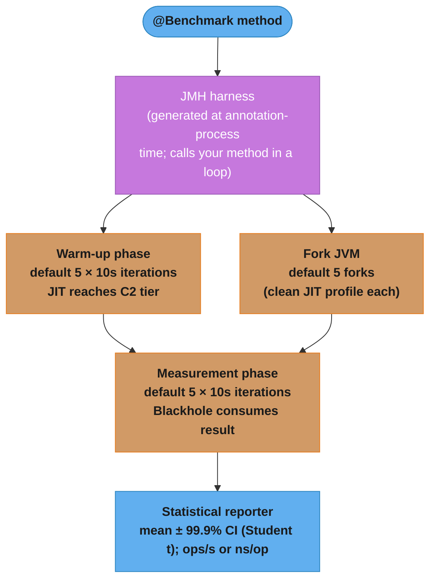
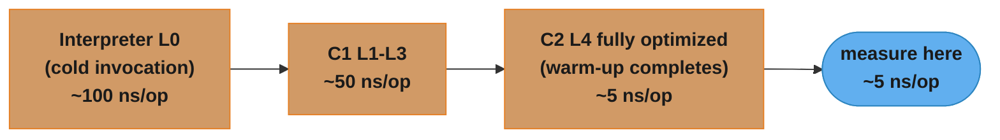

# Benchmarking with JMH

> **The JIT will lie to you.**  
> A `System.nanoTime()` loop can report 0 ns for code that actually takes 50 ns because the JIT
> eliminated the "dead" computation. JMH drives the JIT into the same JIT-compiled state that
> production code operates in, then measures at nanosecond resolution with statistical rigour.

---

## 1. Concept Overview

JMH (Java Microbenchmark Harness) is the official OpenJDK micro-benchmarking framework.
It generates a measurement harness via annotation processing — your `@Benchmark` method is
wrapped in warm-up loops, blackhole-based dead-code prevention, and statistical reporters.

**When you need JMH:**
- Comparing two algorithms with similar Big-O but different constants (e.g. `HashMap` vs `LinkedHashMap` get)
- Validating that a performance optimisation actually helps (not just feels faster)
- Detecting regressions — add JMH benchmarks to CI for hot-path code
- Sizing thread pools / connection pools empirically (`ConcurrentHashMap` scalability curve)

**When JMH is overkill:**
- Profiling a whole request path — use async-profiler or JFR instead
- Measuring I/O, network, or database latency — JMH is for pure CPU/memory paths
- Quick sanity checks on startup time — use `ProcessBuilder` + wall-clock timing

---

## 2. Intuition

Think of JMH as a **professional stopwatch with a warm-up lane**.

A sprinter does not start timing from cold; they warm up, reach race pace, then the timer fires.
JMH does the same: it lets the JIT compile and optimise your benchmark method to production
quality, *then* measures. Without this, you are timing the JIT itself, not your algorithm.

**Key insight:** The two biggest measurement traps are:
1. **Dead code elimination** — JIT discards computation whose result is never used.
2. **Constant folding** — JIT precomputes `2 + 2` to `4` at compile time, making your benchmark measure nothing.

JMH defeats both: `Blackhole.consume(result)` forces the JIT to treat the result as observable,
and benchmark inputs should come from `@State` fields so the JIT cannot fold them.

---

## 3. Core Principles

### Warm-up before measurement
Under tiered compilation a method climbs from the interpreter through C1 to C2; the C2
trigger is `Tier4InvocationThreshold` (5,000 by default, with a separate back-edge counter
for loops), not the old non-tiered `CompileThreshold` of 10,000. JMH's defaults — 5 warm-up
iterations of 10 seconds each — put any realistic hot method far past that, so you measure
C2-optimised throughput rather than interpreter or C1 speed.

### Isolate the unit
One benchmark = one hypothesis. Don't benchmark `parseAndValidateAndPersist()` — that mixes
I/O with parsing and tells you nothing actionable. Benchmark the parser alone.

### Fork between benchmarks
JMH runs each benchmark in fresh forked JVMs — **five of them by default**
(`Defaults.MEASUREMENT_FORKS = 5`), not one. This prevents JIT profile pollution: if
benchmark A trains the JIT to expect `int` paths, benchmark B's `long` path may be
mis-optimised. Forks reset all JIT decisions, and running several of them also exposes
run-to-run variance that a single JVM hides — two forks of the same code can land on
different inlining decisions and differ by more than the effect you are measuring.

### Trust the confidence interval, not the point estimate
JMH reports mean ± error at the **99.9%** confidence level (printed literally as
`±(99.9%)`). An improvement is real only if the confidence intervals don't overlap.
A 3% mean improvement with ±5% error is noise.

---

## 4. Annotations and Configuration

### Essential annotations

```java
import org.openjdk.jmh.annotations.*;
import org.openjdk.jmh.infra.Blackhole;

@BenchmarkMode(Mode.AverageTime)   // or Throughput, SampleTime, SingleShotTime
@OutputTimeUnit(TimeUnit.MICROSECONDS)
@Warmup(iterations = 5, time = 1, timeUnit = TimeUnit.SECONDS)
@Measurement(iterations = 10, time = 1, timeUnit = TimeUnit.SECONDS)
@Fork(1)
@State(Scope.Benchmark)            // shared state for all threads in this benchmark
public class MyBenchmark {

    // State field — not a constant, so JIT cannot fold it
    private int[] data;

    @Setup(Level.Trial)             // runs once before all iterations
    public void setUp() {
        data = IntStream.range(0, 1_000_000).toArray();
    }

    @Benchmark
    public void measureArraySum(Blackhole bh) {
        int sum = 0;
        for (int v : data) sum += v;
        bh.consume(sum);            // prevent dead-code elimination of sum
    }
}
```

### Mode choices

| Mode | What it measures | Use case |
|------|-----------------|----------|
| `Throughput` | ops/sec | Maximising capacity (rate limiter, cache) |
| `AverageTime` | mean latency per op | Minimising latency (critical path) |
| `SampleTime` | latency histogram (P50/P99/P999) | Latency SLA validation |
| `SingleShotTime` | single cold invocation | Start-up cost, first-request latency |

### State scope

| Scope | Per | Use when |
|-------|-----|----------|
| `Benchmark` | benchmark (shared across all threads) | Shared data structures under concurrent load |
| `Thread` | each thread | Thread-local state; avoids false sharing |
| `Group` | thread group | Asymmetric producer/consumer scenarios |

### Lifecycle hooks

| Annotation | When | Use case |
|------------|------|----------|
| `@Setup(Level.Trial)` | Before all iterations | Allocate large data structures once |
| `@Setup(Level.Iteration)` | Before each iteration | Reset mutable state between iterations |
| `@Setup(Level.Invocation)` | Before EVERY call | Rare — adds overhead; use for per-call reset |
| `@TearDown(Level.Trial)` | After all iterations | Release resources |

---

## 5. Architecture Diagrams

### JMH execution model



### JIT tiered compilation levels JMH traverses during warm-up



Without warm-up you measure the interpreter / C1; with warm-up you measure the C2 steady state
that production runs at.

---

## 6. How It Works — Detailed Mechanics

### Maven setup

```xml
<dependency>
    <groupId>org.openjdk.jmh</groupId>
    <artifactId>jmh-core</artifactId>
    <version>1.37</version>
</dependency>
<dependency>
    <groupId>org.openjdk.jmh</groupId>
    <artifactId>jmh-generator-annprocess</artifactId>
    <version>1.37</version>
    <scope>provided</scope>
</dependency>

<!-- Fat-jar plugin to run with: java -jar benchmarks.jar -->
<plugin>
    <groupId>org.apache.maven.plugins</groupId>
    <artifactId>maven-shade-plugin</artifactId>
    <configuration>
        <finalName>benchmarks</finalName>
        <transformers>
            <transformer implementation="org.apache.maven.plugins.shade.resource.ManifestResourceTransformer">
                <mainClass>org.openjdk.jmh.Main</mainClass>
            </transformer>
        </transformers>
    </configuration>
</plugin>
```

### Running benchmarks

```bash
# Run all benchmarks
java -jar target/benchmarks.jar

# Filter by name pattern
java -jar target/benchmarks.jar ".*RateLimiter.*"

# Override iterations on the CLI
java -jar target/benchmarks.jar -wi 3 -i 5 -f 1 -bm Throughput

# Output to JSON for CI regression check
java -jar target/benchmarks.jar -rf json -rff results.json
```

### Benchmarking the rate limiter from design_rate_limiter_java.md

```java
@BenchmarkMode(Mode.Throughput)
@OutputTimeUnit(TimeUnit.SECONDS)
@Warmup(iterations = 5, time = 1)
@Measurement(iterations = 10, time = 1)
@Fork(2)
@State(Scope.Benchmark)
public class TokenBucketBenchmark {

    private TokenBucketRateLimiter limiter;

    @Setup(Level.Trial)
    public void setUp() {
        // 100_000 tokens/sec, 1_000 burst — from design_rate_limiter_java.md
        limiter = new TokenBucketRateLimiter(100_000, 1_000);
    }

    @Benchmark
    public boolean tryAcquire() {
        return limiter.tryAcquire();   // result returned — JMH can consume it
    }

    // Concurrency curve: run with @Threads(1), @Threads(4), @Threads(16)
    @Benchmark
    @Threads(16)
    public boolean tryAcquireConcurrent() {
        return limiter.tryAcquire();
    }
}
```

Expected output:
```
TokenBucketBenchmark.tryAcquire              thrpt   20   98_234_456 ± 312_000 ops/s
TokenBucketBenchmark.tryAcquireConcurrent    thrpt   20    8_432_100 ± 145_000 ops/s
```

Interpretation: 98M ops/s single-threaded shows pure CAS loop speed; 8.4M ops/s at 16 threads
exposes contention — `AtomicLong` CAS fails under load. A Striped/LongAdder variant would show
much better concurrency scaling.

### Benchmarking LRU cache from design_lru_cache_java.md

```java
@BenchmarkMode({Mode.AverageTime, Mode.SampleTime})
@OutputTimeUnit(TimeUnit.NANOSECONDS)
@Warmup(iterations = 5, time = 1)
@Measurement(iterations = 10, time = 1)
@Fork(1)
@State(Scope.Benchmark)
public class LruCacheBenchmark {

    private LRUCache<Integer, String> cache;
    private int[] keySequence;
    private int index;

    @Param({"100", "1000", "10000"})  // vary cache capacity
    private int capacity;

    @Setup(Level.Trial)
    public void setUp() {
        cache = new LRUCache<>(capacity);
        // Pre-populate to cache-full state
        for (int i = 0; i < capacity; i++) {
            cache.put(i, "value-" + i);
        }
        // Key sequence: 80% hits (Zipf-like), 20% misses (eviction)
        keySequence = new int[1_000_000];
        Random rng = new Random(42);
        for (int i = 0; i < keySequence.length; i++) {
            // 80% chance: hit a key in [0, capacity); 20%: key beyond capacity
            keySequence[i] = rng.nextDouble() < 0.8
                ? rng.nextInt(capacity)
                : capacity + rng.nextInt(capacity);
        }
    }

    @Setup(Level.Iteration)
    public void resetIndex() {
        index = 0;    // reset sequence pointer once per iteration, NOT per invocation:
                      // Level.Invocation here would pin index at 0 and every call would
                      // read keySequence[0], turning the benchmark into a single-key hit
    }

    @Benchmark
    public String getOrEvict() {
        int key = keySequence[(index++) % keySequence.length];
        String val = cache.get(key);
        if (val == null) {
            val = "value-" + key;
            cache.put(key, val);
        }
        return val;    // returned → JMH won't eliminate the call
    }
}
```

### Pitfall — Level.Invocation setup overhead

`@Setup(Level.Invocation)` runs before *every single* benchmark call. If setup takes 1 µs and
the benchmark takes 10 ns, you are measuring 99% setup, 1% benchmark. Use it only when the
per-call setup is unavoidable AND fast (< 1% of benchmark time). Prefer `Level.Iteration` or
`Level.Trial` wherever possible.

---

## 7. Real-World Examples

### Performance-gated CI — the pattern, not a vendor anecdote

The generalisable use of JMH is as a merge gate: keep a baseline `results.json` from the
main branch, run the benchmark suite on each PR, and block the merge when a benchmark's
mean regresses beyond a threshold *and* its confidence interval no longer overlaps the
baseline's. Both halves matter — a threshold alone flags noise, and an overlap test alone
never fires on a small but real regression. The failure mode this catches is the change
that is obviously correct in review and quietly 3× slower on the hot path.

### Oracle/OpenJDK — JDK internal benchmarking

JMH was created by Alexey Shipilev at Oracle specifically to benchmark JDK internals like
`String.hashCode()`, `HashMap.get()`, and `Math.log()`. The JDK repository includes thousands
of JMH benchmarks under `test/micro/org/openjdk/bench/`. Any JDK performance claim in JEP
proposals is backed by JMH numbers.

### Scala and other JVM languages — `sbt-jmh`

JMH is a bytecode-level harness, so it works for any JVM language; the annotation processor
just needs to run. For Scala the standard integration is the `sbt-jmh` plugin, which wires
the generator into the sbt build. The recurring finding in this kind of work is that
allocation, not computation, dominates combinator-heavy code — a `flatMap` chain that looks
like pure arithmetic spends most of its time creating the intermediate objects, which is
why `-prof gc` belongs on every such run.

### Google — Guava collections

Guava's own microbenchmarks live in `guava-tests/benchmark` and are written against
**Caliper**, Google's benchmarking harness, not JMH — a useful reminder that "the JDK
standard" is not the only harness you will meet in real codebases. Caliper predates JMH and
takes a different approach to warm-up and DCE prevention; for new JVM work JMH is the
better-supported choice, but do not assume an existing benchmark suite is JMH just because
it is Java.

### Apache Kafka — Message processing throughput

Kafka keeps its benchmarks in a dedicated top-level module,
`jmh-benchmarks/src/main/java/org/apache/kafka/jmh/`, covering producer record accumulation,
the network `Selector` path, compression codecs and metadata handling. The module exists
precisely so benchmarks are not scattered through the production source trees — a layout
worth copying, because it lets you build and run the suite without pulling benchmark-only
dependencies into the shipped artifacts.

---

## 8. Tradeoffs

| Approach | Pros | Cons | When to use |
|----------|------|------|-------------|
| JMH | Full JIT warm-up; dead-code prevention; CI-friendly JSON output | Requires fork + annotation processing; can't benchmark I/O; learning curve | CPU/memory hot paths, algorithmic comparisons |
| `System.nanoTime()` loop | Zero setup; works for any code | JIT will lie; no warm-up; no statistics | Only for order-of-magnitude sanity checks |
| async-profiler + JFR | Profiles real production workloads; allocation tracking; flame graphs | Observational (doesn't isolate one operation); coarser resolution | Diagnosing production slowness; finding hotspot in a real request path |
| Criterion (Rust) / `bench` | Idiomatic for non-JVM languages | N/A for Java | Rust/Go performance work |
| perf (Linux) | Hardware PMU counters (cache misses, branch mispredicts) | Linux only; steep learning curve | CPU micro-architecture investigation |

---

## 9. When to Use / When NOT to Use

### Use JMH when:
- Comparing two algorithms with different constants (same Big-O)
- Verifying a claimed optimisation before merging
- Setting a CI performance regression gate (±5% threshold is common)
- Exploring concurrency scaling curves (1→2→4→8→16→32 threads)
- Validating that your data structure's hot method (e.g. `LRU.get()`) meets a latency budget
- Characterising lock contention — `SampleTime` mode exposes P99/P999 tail latency

### Do NOT use JMH when:
- Benchmarking I/O, database queries, or network calls — results are dominated by external noise
- The operation is so slow (> 100ms) that warm-up converges in a single iteration — use
  `SingleShotTime` or a simple timing harness
- You need flame-graph-level profiling of a real request path — use async-profiler
- You are benchmarking JVM startup or class loading — use ProcessBuilder + wall-clock time
- The benchmark is too large to fit in L1/L2 cache and cache effects are incidental — you may
  be benchmarking cache miss patterns, not the algorithm

---

## 10. Common Pitfalls

### Pitfall 1 — Dead code elimination (DCE)

**Broken:**
```java
@Benchmark
public void hashCode_wrong() {
    // JIT sees result is never used → eliminates the hashCode call entirely
    "hello world".hashCode();
}
```

**Fixed:**
```java
@Benchmark
public int hashCode_correct() {
    return "hello world".hashCode();   // returned value → JMH can consume it
}
// OR, when you can't change the return type:
@Benchmark
public void hashCode_blackhole(Blackhole bh) {
    bh.consume("hello world".hashCode());
}
```

**Impact:** The broken version reports ~0.1 ns/op (JIT no-ops it); the fixed version reports the
actual ~3 ns/op. A 30× measurement error.

---

### Pitfall 2 — Constant folding

**Broken:**
```java
@State(Scope.Benchmark)
public class BadConstantFolding {
    // Compile-time constant — JIT will fold "3 + 4" to 7 at compile time
    private final int x = 3;
    private final int y = 4;

    @Benchmark
    public int add() {
        return x + y;    // JIT sees: return 7; — not benchmarking the add
    }
}
```

**Fixed:**
```java
@State(Scope.Benchmark)
public class ConstantFoldingFixed {
    // Not final, or loaded from a volatile field — prevents compile-time fold
    private int x;
    private int y;

    @Setup
    public void setUp() {
        x = 3;
        y = 4;
    }

    @Benchmark
    public int add() {
        return x + y;    // JIT cannot fold — x and y read at runtime
    }
}
```

---

### Pitfall 3 — False sharing between `@State` fields

**Broken:**
```java
@State(Scope.Benchmark)
public class FalseSharingState {
    // counter1 and counter2 likely on same 64-byte cache line
    volatile long counter1 = 0;
    volatile long counter2 = 0;

    @Benchmark
    @Threads(2)
    public void increment(Blackhole bh) {
        bh.consume(counter1++);
        bh.consume(counter2++);
    }
}
```

**Fixed:**
```java
// Give each thread its own state object — JMH pads state instances, so counters
// in separate @State(Scope.Thread) objects cannot land on the same cache line.
@State(Scope.Thread)
public class PaddedState {
    volatile long counter = 0;

    @Benchmark
    @Threads(2)
    public void increment(Blackhole bh) { bh.consume(counter++); }
}
```

False sharing inflates measured latency for volatile writes, making your concurrent data
structure look slower than it actually is. Note that `@sun.misc.Contended` — the padding
annotation most blog posts reach for — does not compile on any current JDK: it was removed
in Java 9 and now lives at `jdk.internal.vm.annotation.Contended`, unexported from
`java.base`. Using it from application code requires
`--add-exports java.base/jdk.internal.vm.annotation=ALL-UNNAMED` at compile *and* run time
plus `-XX:-RestrictContended` (default `true`, meaning the JVM ignores the annotation
outside boot classes). In a benchmark, `@State(Scope.Thread)` gets you the same isolation
with no flags.

---

### Pitfall 4 — Insufficient warm-up for JIT-heavy code

**Symptom:** First few iterations show 10–50× higher latency than the rest; mean is skewed.

**Fix:**
```java
@Warmup(iterations = 10, time = 2)    // up from default 5×1s
@Measurement(iterations = 10, time = 2)
```

For JVM reflection, dynamic dispatch-heavy code (Spring AOP proxies), or code that warms
up class data sharing (CDS), increase warm-up iterations to 10–15.

---

### Pitfall 5 — Benchmarking the wrong thing (allocation hidden in hot path)

A `HashMap.get()` benchmark that re-creates the map on every iteration measures allocation,
not get. Always use `@Setup(Level.Trial)` for data structures and `@Setup(Level.Iteration)` for
reset-between-iterations state.

---

### Pitfall 6 — Ignoring fork count

`@Fork(0)` runs the benchmark in the same JVM that is running JMH infrastructure. The JIT
profile is polluted by JMH's own compiled code. Never go below `@Fork(1)`; JMH's default is
5, and 3 or more is what you want for publication-quality results.

---

## 11. Technologies & Tools

| Tool | Role | Notes |
|------|------|-------|
| JMH 1.37 | Core harness | OpenJDK standard; `jmh-generator-annprocess` required at compile time |
| `jmh-visualizer` | Browser chart of JMH JSON output | Upload `results.json` at jmh.morethan.io |
| async-profiler | CPU/allocation profiler | Pairs with JMH via `-prof async`; shows flamegraphs |
| JFR (Java Flight Recorder) | Low-overhead production profiler | `java -jar benchmarks.jar -prof jfr` |
| `org.openjdk.jmh.Main` from a `main()` / `Runner` API | Run a benchmark from an IDE | Build an `OptionsBuilder().include(...)` and call `new Runner(opts).run()`; forking still applies |
| `gradle-jmh-plugin` | Gradle integration | `me.champeau.jmh` plugin |
| `sbt-jmh` | Scala/sbt integration | Wires the annotation processor into the sbt build |
| `perf` (Linux) | Hardware counters | `java -jar benchmarks.jar -prof perf` for IPC, cache miss |

---

## 12. Interview Questions with Answers

**Q1. Why can't you use `System.nanoTime()` loops to benchmark Java methods?**
`System.nanoTime()` loops are unreliable because the JIT eliminates "dead" computations whose
results are never used, potentially measuring near-zero time for code that actually executes.
The JVM also needs ~10,000 invocations of a method before the C2 JIT compiler produces
fully-optimised machine code; timing earlier measures the slower interpreter or C1 tier.
JMH solves both: it uses `Blackhole.consume()` to prevent DCE and mandates a warm-up phase
before measurement begins. Always use JMH for any micro-benchmark that will influence a
production decision.

**Q2. What is dead code elimination and how does JMH prevent it?**
Dead code elimination (DCE) is a JIT optimisation where the compiler removes code whose output
is provably never observed — for example, `String s = new String("hello"); // s never used`.
JMH prevents DCE two ways: (1) the generated harness feeds benchmark return values into a
`Blackhole`, forcing the JIT to treat them as observable; (2) `Blackhole.consume(x)` compares
the value against `volatile` fields chosen so the comparison is never true in practice but
the JIT cannot prove it, so the producing computation must still run. On modern JDKs JMH
prefers a *compiler* blackhole instead — an empty method the JIT is told to treat as opaque
via `-XX:CompileCommand=blackhole` — which removes even the residual comparison cost, and
JMH enables it automatically when the running JVM supports it.
The practical rule: either return the benchmark result or pass it to `bh.consume()`.

**Q3. Explain the difference between `@BenchmarkMode(Mode.Throughput)` and `Mode.SampleTime`.**
`Throughput` counts how many operations complete per second (ops/s) and is best for
capacity-planning questions like "how many requests/sec can this rate limiter sustain?"
`SampleTime` records the latency of each individual invocation and computes a histogram
(P50, P99, P999), making it best for latency SLA validation — e.g., "does P99 stay under 1 ms
at load?" Use `AverageTime` as a middle ground when you care about mean latency but not
tail behaviour. For connection-pool benchmarks, prefer `SampleTime` because tail latency
(P99 wait time) is what determines user-visible timeouts, not average latency.

**Q4. What is constant folding and how do you prevent it in a JMH benchmark?**
Constant folding is a JIT optimisation where compile-time-known values are precomputed:
`final int x = 3, y = 4; return x + y;` compiles to `return 7;` — the add instruction never
executes. In JMH, inputs stored in `final` or effectively-final fields are subject to constant
folding. Fix: declare state fields as non-final and initialise them in `@Setup`, or annotate
them `@Param` so JMH injects values at runtime. JMH also automatically prevents folding of
`@State` fields accessed through the generated harness (the harness reads them via a non-final
reference path), but you should not rely on this implicitly.

**Q5. When would you use `@State(Scope.Thread)` vs `Scope.Benchmark)`?**
`Scope.Benchmark` creates one state instance shared across all threads — use this when
benchmarking concurrent access to a shared data structure (e.g., a `ConcurrentHashMap`
that all threads GET/PUT to). `Scope.Thread` creates one state instance per thread — use this
when each thread needs independent state (e.g., a `StringBuilder` that you reset and fill
independently). Using `Scope.Benchmark` for a non-thread-safe object introduces data races and
misleading results; using `Scope.Thread` for a shared structure defeats the purpose of
concurrency testing because there is no contention.

**Q6. What is false sharing and how does `@Contended` address it in a benchmark?**
False sharing occurs when two threads modify logically independent variables that happen to
reside on the same CPU cache line (64 bytes on x86; 128 bytes on Apple silicon). Every write
invalidates the line for the other CPU, causing cache-miss traffic even though the variables
are independent. In benchmarks this inflates measured latency for `volatile` writes, so a
two-counter benchmark can report several times worse throughput than the real-world scenario
where the fields are naturally separated. The fix inside a benchmark is `@State(Scope.Thread)`,
which gives each thread its own padded state object. The `@Contended` annotation does the
same job by inserting `-XX:ContendedPaddingWidth` (default 128) bytes around a field, but it
is not reachable from application code on a modern JDK — it moved to
`jdk.internal.vm.annotation` in Java 9 and needs `--add-exports` plus
`-XX:-RestrictContended` to have any effect.

**Q7. What does `@Fork(1)` do and why should you never use `@Fork(0)` for production benchmarks?**
`@Fork(1)` spawns a fresh child JVM for each benchmark method, ensuring it starts with a clean
JIT profile uncontaminated by other benchmarks or by the JMH infrastructure itself. `@Fork(0)`
runs benchmarks in the same JVM as JMH, meaning earlier benchmarks may have compiled code
paths that bias the JIT profile for later ones — a benchmark for `ArrayList.get()` run after
a benchmark heavy on `LinkedList` traversal may see different JIT decisions than in isolation.
Note that `@Fork(1)` is a *reduction* from JMH's default of 5 forks: writing `@Fork(1)` to
make a suite run faster trades away the cross-JVM variance estimate, so treat it as the
minimum for a quick check and leave the default (or `@Fork(3)`) for any number you publish
or gate CI on.

**Q8. How would you benchmark a rate limiter under concurrent load and interpret the concurrency scaling curve?**
Use `@State(Scope.Benchmark)` for the shared `RateLimiter` instance and run the same benchmark
annotated with `@Threads(1)`, `@Threads(2)`, `@Threads(4)`, `@Threads(8)`, `@Threads(16)`,
`@Threads(32)`. Plot throughput (ops/s) vs thread count. Ideal horizontal scaling would show
throughput growing linearly; actual curves show a plateau and then decline past the hardware
thread count. The inflection point identifies the contention bottleneck: if throughput plateaus
at 4 threads for a 16-core machine, the bottleneck is a shared lock rather than CPU. If it
continues growing to 16 threads and then plateaus, the bottleneck is CPU-bound. For the
`AtomicLong`-based token bucket, CAS failure rate rises super-linearly with threads — the curve
often peaks at 4–8 threads and then drops as failed CAS retries dominate.

**Q9. You added a cache-friendly iteration pattern to an `ArrayList` and your JMH numbers got worse. What do you investigate?**
First, confirm warm-up is sufficient — a premature JIT compilation at C1 can make the new
code look worse if it has more branches to optimise. Increase `@Warmup` iterations to 10–15.
Second, check for false sharing if the change introduced a new field alongside an existing one.
Third, check that the benchmark's data set size causes the same cache behaviour as production:
if you benchmarked with 1,000 elements (fits in L1) but production uses 1,000,000 (L3 miss),
the JMH result is measuring cache hierarchy, not algorithmic improvement. Use `@Param` to vary
data size and confirm the improvement holds at production-realistic sizes. Fourth, use
`-prof async` to compare flamegraphs before and after to see where time is actually spent.

**Q10. How do you integrate JMH benchmarks into CI to prevent performance regressions?**
Run `java -jar benchmarks.jar -rf json -rff results.json` in CI, then compare the new
`results.json` against a baseline stored in the repo or artifact store — there is no official
comparison tool, so this is a short script over the JSON (each result carries `primaryMetric`
with `score`, `scoreError` and `scoreConfidence`). A common threshold is: fail CI if any
benchmark's mean regresses by > 5% **and** its 99.9% confidence interval no longer overlaps
the baseline's — requiring both keeps noise from failing the build. For connection pools and
rate limiters, also track P99 from `SampleTime` mode, not just mean. Store the JSON as a
build artifact so trends are visible over releases.

**Q11. What is the difference between `@Setup(Level.Trial)`, `Level.Iteration`, and `Level.Invocation)`?**
`Level.Trial` runs once before all warm-up and measurement iterations combined — use it for
expensive setup like loading a large data set or creating a connection pool that should persist
through the entire benchmark run. `Level.Iteration` runs before each measurement iteration
(each 1-second window) — use it to reset mutable shared state between iterations so each
iteration starts clean (e.g., clearing an LRU cache that would otherwise fill up).
`Level.Invocation` runs before EVERY individual benchmark call and adds significant overhead
(method call + JIT overhead); it can easily distort measurements for methods faster than 1 µs
and should be used only when per-invocation reset is truly required AND the setup is extremely
fast (< 1% of benchmark time). Misuse of `Level.Invocation` is one of the most common causes
of "my JMH numbers don't match production" complaints.

**Q12. How do you benchmark JVM allocation rate, and why does it matter for GC pause prediction?**
Use `java -jar benchmarks.jar -prof gc` to capture the GC profiler, which reports allocation
rate (bytes/op or bytes/s) alongside benchmark throughput. Allocation rate matters because GC
pause frequency scales linearly with allocation: if you allocate 1 GB/s and your Eden is
500 MB, you trigger minor GCs every 0.5 seconds. A benchmark showing 50 ns/op but allocating
1 KB/op at 100M ops/s = 100 GB/s allocation rate — that's unsustainable and will dominate
production latency. For the `LRU cache` case study, benchmark `put()` and check whether the
evicted `LinkedHashMap.Entry` generates a constant allocation stream; if so, switch to an
intrusive doubly-linked list to reduce GC pressure. See also
[jvm_tuning_and_gc_for_services.md](./jvm_tuning_and_gc_for_services.md) for GC tuning flags
that mitigate high allocation rates.

**Q13. What is a `Blackhole` and when must you use it vs returning a value?**
A `Blackhole` is JMH's dead-code-elimination sink — it simulates "this value was observed" to
prevent the JIT from removing the computation that produced it. Return-value style is simpler:
`@Benchmark public int benchmark() { return expensive(); }` — JMH's generated harness
consumes the return value via an internal blackhole. Use explicit `Blackhole bh` parameter style
when: (a) your method returns `void` but produces intermediate results that could be eliminated,
(b) you need to consume multiple independent results in one benchmark method
(`bh.consume(a); bh.consume(b)`), or (c) you are benchmarking side effects of a `void` method
where a return-value style would require changing the method signature. Both styles are equally
effective at preventing DCE, because both end at the same sink: the generated harness routes
your return value into a `Blackhole` exactly as `bh.consume()` does. What actually defeats the
JIT is the sink's implementation — a comparison against `volatile` fields the compiler cannot
fold, or, on JVMs that support it, the `-XX:CompileCommand=blackhole` intrinsic JMH enables
automatically.

**Q14. Describe how you would validate that a Spring `@Cacheable` optimisation actually improves throughput.**
Create two JMH state objects: one with a real `ConcurrentHashMap`-backed cache (simulating
`@Cacheable`) and one that always calls the underlying compute logic. Benchmark both with
`@BenchmarkMode(Mode.Throughput)` and `@Threads(4)` (realistic concurrent read load).
Measure: (1) throughput ops/s with cache, (2) throughput ops/s without cache, (3) memory
allocation rate with `-prof gc`. Confirm that the cache hit path is at least 10× faster than
the compute path (otherwise the `@Cacheable` overhead — `ConcurrentHashMap.get()` + key
creation — may not be worth it for very cheap computations). Also check that the cache does
not introduce false sharing under concurrent access. Note: JMH cannot benchmark Spring proxy
overhead directly; for that, use a full Spring Boot integration test with
`@SpringBootTest(webEnvironment = RANDOM_PORT)` and `RestTemplate` timing, not JMH.

**Q15. How do you use `@Param` to explore how data size affects benchmark results?**
Annotate a `@State` field with `@Param({"100", "1000", "10000", "100000"})` and JMH will run
the benchmark once for each value, reporting a separate row in the output. This is the standard
way to plot algorithmic complexity curves: if throughput halves when data size doubles, the
algorithm is O(n); if it stays flat, it's O(1). For the `LRU cache` benchmark, vary capacity
to find where `LinkedHashMap.get()` starts showing a cache-miss penalty as the live map
overflows a cache level. Do the division rather than quoting a number: a `LinkedHashMap.Entry`
is about 40 bytes with compressed oops, plus ~4 bytes of table slot, so a 1 MB L2 holds on the
order of 20,000 entries and the inflection sits near there — on a machine with a 256 KB L2 it
arrives around 5,000. Measure your own cache sizes (`lscpu`, `sysctl hw.l2cachesize`) and
divide. Always test at the production-realistic size — a benchmark showing O(1) at
1,000 entries may show O(log n) degradation at 10,000,000 entries due to cache-miss patterns.

---

## 13. Best Practices

- **Always fork** — `@Fork(1)` minimum; `@Fork(3)` for any result that drives a production
  decision.
- **Warm up to C2 tier** — `@Warmup(iterations = 5, time = 1)` for simple code;
  `iterations = 10, time = 2` for reflection-heavy or complex dispatch code.
- **Return results or use Blackhole** — never discard a computation's output.
- **Use `@Param` for data sizes** — benchmarks that test only small data sets may miss
  cache-miss dominated behaviour at production scale.
- **Use `SampleTime` to catch tail latency** — mean latency benchmarks can hide P99 spikes
  that breach SLAs.
- **Pin JMH to a specific CPU** — use `taskset -c 0-3 java -jar benchmarks.jar` on Linux to
  reduce OS scheduling and cross-socket migration noise. Pinning does not touch clock speed;
  disabling Turbo Boost is a separate step (below).
- **Disable Turbo Boost / frequency scaling** — `cpupower frequency-set -g performance` on
  Linux; prevents dynamic clock speed from inflating measured throughput.
- **Integrate into CI** — store JSON output as artifact; diff against baseline; fail on > 5%
  mean regression or > 10% P99 regression.
- **Combine with async-profiler** — once JMH identifies the bottleneck operation, use
  `-prof async` to get a flamegraph showing where within that operation the time goes.

---

## 14. Case Study

### Applying JMH to the Token Bucket Rate Limiter

Reference case study: [design_rate_limiter_java.md](../design_rate_limiter_java.md)

The `TokenBucketRateLimiter` from that case study uses an `AtomicLong` for token count and a
`compareAndSet` loop to atomically deduct tokens. The question is: how does it scale from 1 to
32 concurrent threads?

**Benchmark setup (from §6 above, condensed):**

```java
@BenchmarkMode(Mode.Throughput)
@OutputTimeUnit(TimeUnit.SECONDS)
@Fork(2)
@Warmup(iterations = 5)
@Measurement(iterations = 10)
@State(Scope.Benchmark)
public class RateLimiterScaling {
    private TokenBucketRateLimiter limiter =
        new TokenBucketRateLimiter(Long.MAX_VALUE, Long.MAX_VALUE); // unlimited, measure CAS only

    @Benchmark @Threads(1)  public boolean t01() { return limiter.tryAcquire(); }
    @Benchmark @Threads(2)  public boolean t02() { return limiter.tryAcquire(); }
    @Benchmark @Threads(4)  public boolean t04() { return limiter.tryAcquire(); }
    @Benchmark @Threads(8)  public boolean t08() { return limiter.tryAcquire(); }
    @Benchmark @Threads(16) public boolean t16() { return limiter.tryAcquire(); }
    @Benchmark @Threads(32) public boolean t32() { return limiter.tryAcquire(); }
}
```

**Shape of the result (measured on an 8-core machine; absolute numbers are machine-specific,
the shape is not):**
```
Threads   Throughput (ops/s)    Interpretation
      1   ~215,000,000          No contention; pure uncontended CAS speed
      2   ~ 82,000,000          Two cores now fight for one cache line
      4   ~ 31,000,000          Retry rate climbing steeply
      8   ~  8,500,000          Line ping-pongs across all cores; retries dominate
     16   ~ 10,000,000          Flat — already saturated at the cache-coherence limit
     32   ~  7,600,000          Flat/slightly worse
```

**Finding:** peak throughput is at **1 thread**, and every added thread makes it worse. A
single hot `AtomicLong` does not scale at all — the bottleneck is cache-line ownership, not
CPU. Between 1 and 8 threads throughput falls ~25×, then flattens because the line can only
change hands so fast. The fix (from the case study) is a `Striped<AtomicLong>` or per-key
limiters so different users' tokens live on different cache lines.

**Benchmark proves the design decision:** without this evidence the `AtomicLong` single-CAS
design "looks correct" in code review — it *is* correct, it just does not scale. Note the
counter-intuitive corollary you should also measure: past ~4 threads a plain `synchronized`
block on the same counter can beat the CAS loop, because a monitor queues contenders instead
of letting them all spin on the same line. "Lock-free" is a progress guarantee, not a
throughput guarantee.

See also: [jvm_tuning_and_gc_for_services.md](./jvm_tuning_and_gc_for_services.md) for GC
considerations when benchmarks show high allocation rates.
