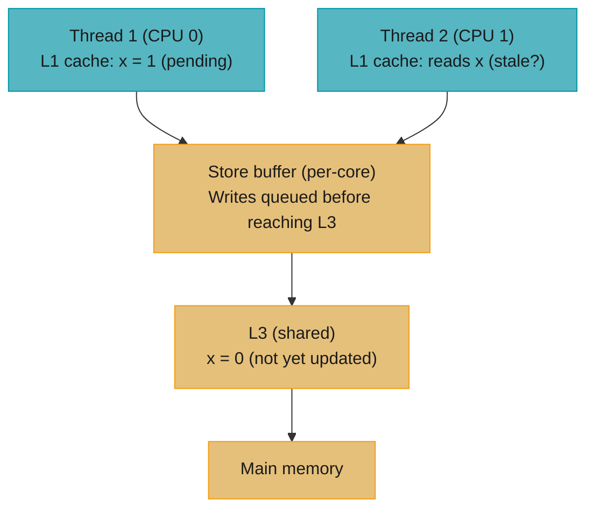
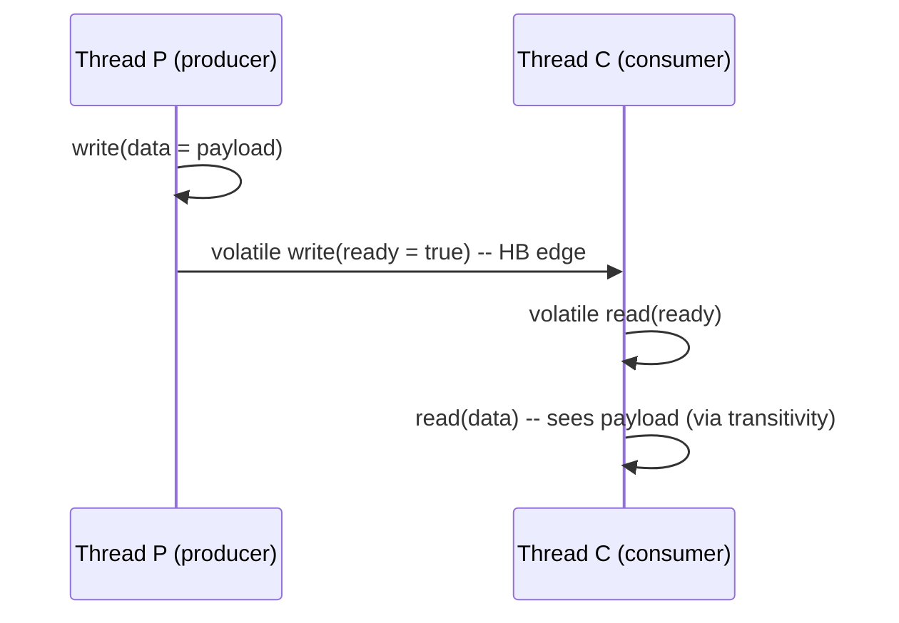

# Concurrency Memory Visibility Primitives

> **Two threads can look at the same variable and see different values — simultaneously.**  
> The Java Memory Model does not guarantee that one thread's write is immediately visible to
> another unless you use the correct visibility primitive. *Happens-before* is the contract;
> `volatile`, `synchronized`, `final`, `AtomicXxx`, and `VarHandle` are the tools.

---

## 1. Concept Overview

The Java Memory Model (JMM) is the formal specification in JLS §17.4 that defines when a
thread's write to a shared variable is guaranteed to be visible to another thread's read.
Without a visibility guarantee, the compiler and CPU can freely reorder instructions, cache
values in registers, and delay writes to main memory.

**Core vocabulary:**
- **Happens-before (HB)**: A partial order over memory operations. If action A *happens-before*
  action B, then the effects of A are guaranteed visible to B.
- **Data race**: Two threads access the same variable, at least one writes, and there is no
  HB ordering between them. Data races produce undefined (not random) behaviour.
- **Sequential consistency**: The illusion that all memory operations execute in the order the
  program text specifies, and that all threads observe the same total order. JMM provides SC
  only for *data-race-free* (DRF) programs.

---

## 2. Intuition

Think of each CPU core as a chef in a kitchen. The **main memory** is the pantry (shared).
Each chef has a **L1/L2/L3 cache** — their personal workbench. A chef can work off their
workbench for a long time without going to the pantry. Another chef reading from the pantry
may see stale ingredients.

`volatile` is equivalent to a rule: "every write must go to the pantry immediately, and every
read must be fetched fresh from the pantry." Expensive — but guarantees freshness.

`synchronized` is a **pantry visit with a lock on the door**: at `monitorenter`, you grab
the key and read fresh from the pantry; at `monitorexit`, you write back everything and release
the key. Only one chef can hold the key at a time.

**Key insight:** The JMM does not specify nanoseconds — it specifies *orderings*. A correct
concurrent program must establish HB relationships on *every* shared variable access. There is
no "close enough" — a missing `volatile` is as broken as a completely absent synchronisation.

---

## 3. Core Principles

### 3.1 Happens-before rules (JLS §17.4.5)

The JMM defines HB by the following rules (each is transitive and composable):

| Rule | What establishes HB |
|------|-------------------|
| **Program order** | Action A before action B in the same thread → A HB B |
| **Monitor lock** | `monitorenter` (unlock) → next `monitorexit` (lock) of the same monitor |
| **Volatile write** | Volatile write to `v` → next volatile read of `v` by any thread |
| **Thread start** | `Thread.start()` in T1 → any action in T2 |
| **Thread join** | Any action in T2 → `Thread.join(T2)` returns in T1 |
| **`final` field freeze** | Write to `final` field in constructor (before constructor returns) → any read after object is published without a data race |
| **Transitivity** | A HB B and B HB C → A HB C |

### 3.2 Compiler and CPU reorderings

Without HB constraints, the JIT and CPU may apply:
- **Store–Load reordering**: A store may be delayed past a subsequent load (the most common
  reordering on x86 and ARM).
- **Load–Load reordering**: Two loads may execute in reverse order if independent (ARM).
- **Instruction elimination**: The JIT may eliminate a read by keeping a cached register value.

`volatile`, `synchronized`, and `Unsafe`/`VarHandle` memory fences prevent specific reorderings.

---

## 4. Primitives — Types and Semantics

### 4.1 `volatile`

```java
private volatile boolean running = true;

// Writer thread:
running = false;   // guaranteed visible to all threads that subsequently read 'running'

// Reader thread:
while (running) { doWork(); }   // always reads the freshest value
```

**Visibility guarantee:** A volatile write HB any volatile read that observes it.

**Ordering guarantee:** All writes *before* a volatile write (in program order) are visible to
all threads that read the volatile. This is the "volatile fence" effect — more than just
preventing cache of the volatile field itself.

**Atomicity:** `volatile` guarantees atomic read/write of `long` and `double` (JLS §17.7).
It does NOT make compound actions (read-modify-write like `count++`) atomic.

**Use `volatile` when:**
- One thread writes; one or more threads read (flag, state variable)
- You need the "fence" effect to publish a safely constructed object

**Do NOT use `volatile` for:**
- Counters or accumulators (`count++` is not atomic) — use `AtomicLong`
- Guarding multi-field invariants — use `synchronized`

---

### 4.2 `synchronized`

```java
private final Object lock = new Object();
private int balance = 0;

// Both methods must synchronize on the SAME lock to be thread-safe
public synchronized void deposit(int amount) {
    balance += amount;
}
public synchronized int getBalance() {
    return balance;
}
```

**Visibility guarantee:** On entering a `synchronized` block, the thread sees all writes made
by the last thread to exit that monitor. On exit, all writes are flushed and become visible to
the next thread to enter.

**Atomicity guarantee:** Only one thread at a time holds the monitor → mutual exclusion.

**Common mistake — different locks:**
```java
// BROKEN: different lock objects — no mutual exclusion, no visibility guarantee
public void deposit(int amount) {
    synchronized (new Object()) { balance += amount; }  // new lock each time!
}
```

---

### 4.3 `java.util.concurrent.atomic` (CAS-based)

```java
import java.util.concurrent.atomic.AtomicLong;
import java.util.concurrent.atomic.AtomicReference;
import java.util.concurrent.atomic.LongAdder;

AtomicLong counter = new AtomicLong(0);
counter.incrementAndGet();           // atomic read-modify-write via CAS
counter.compareAndSet(expected, upd); // CAS: only updates if current == expected

// LongAdder — striped accumulator; much better than AtomicLong under high contention
LongAdder hitCount = new LongAdder();
hitCount.increment();
long total = hitCount.sum();
```

**Mechanism:** `AtomicLong` uses `cmpxchg` (on x86) or `stlxr/ldaxr` (on ARM) — a hardware
instruction that atomically reads, compares, and conditionally writes. No kernel lock.

**`LongAdder` vs `AtomicLong`:**
- `AtomicLong`: single memory location; CAS fails under contention; O(1) space; use for
  counters with low contention or when exact current value is needed.
- `LongAdder`: internally a `Striped64` — up to `ncpus` cells spread across cache lines;
  under contention, each thread updates its own cell; `sum()` sums all cells. 10–100× better
  throughput at 16+ threads. Use for metrics accumulators. See
  [benchmarking_with_jmh.md](./benchmarking_with_jmh.md) for the concurrency scaling curve.

---

### 4.4 `final` fields and safe publication

```java
public class ImmutablePoint {
    public final int x;
    public final int y;

    public ImmutablePoint(int x, int y) {
        this.x = x;
        this.y = y;
    }
    // Safe to share across threads without any synchronization:
    // the JMM 'final field freeze' guarantees x and y are fully visible
    // to any thread that obtains the reference AFTER the constructor returns
}
```

**The `final` field freeze:** The JMM guarantees that if an object's `final` fields are written
only in the constructor, and the object reference is not *escaped* before the constructor
completes (i.e. not published via a race), then any thread that reads the reference will see
the fully-constructed `final` field values — even without synchronisation.

**Unsafe publication break:**
```java
// BROKEN: reference published before constructor finishes (or via data race)
public class UnsafePublication {
    public static UnsafePublication instance;   // no volatile, no sync
    public final int[] data;

    public UnsafePublication() {
        data = new int[]{1, 2, 3};
        UnsafePublication.instance = this;  // escape before constructor completes
        // Another thread reading instance.data may see null!
    }
}
```

---

### 4.5 `VarHandle` (Java 9+) — fine-grained memory ordering

```java
import java.lang.invoke.MethodHandles;
import java.lang.invoke.VarHandle;

class Node<V> {
    volatile Node<V> next;   // or use VarHandle for more control

    private static final VarHandle NEXT;
    static {
        try {
            NEXT = MethodHandles.lookup()
                .findVarHandle(Node.class, "next", Node.class);
        } catch (ReflectiveOperationException e) { throw new ExceptionInInitializerError(e); }
    }

    @SuppressWarnings("unchecked")
    boolean casNext(Node<V> expected, Node<V> update) {
        // compareAndSet has full sequential-consistency semantics (same as AtomicReference.CAS)
        return NEXT.compareAndSet(this, expected, update);
    }

    // Relaxed mode — no ordering guarantees; cheaper on weakly-ordered CPUs (ARM)
    @SuppressWarnings("unchecked")
    Node<V> getRelaxed() {
        return (Node<V>) NEXT.get(this);           // plain load
    }
    void setRelease(Node<V> value) {
        NEXT.setRelease(this, value);              // release store
    }
    @SuppressWarnings("unchecked")
    Node<V> getAcquire() {
        return (Node<V>) NEXT.getAcquire(this);   // acquire load
    }
}
```

**Memory access modes:**
| Mode | Semantics | Cost |
|------|-----------|------|
| `get` / `set` (plain) | No memory ordering — may be reordered freely | Cheapest |
| `getOpaque` / `setOpaque` | Coherence per variable, no cross-variable ordering | Slightly cheaper than volatile on ARM |
| `getAcquire` / `setRelease` | Acquire/release pairing — prevents reordering across the pair | ~50% cheaper than volatile on ARM |
| `getVolatile` / `setVolatile` | Full sequential consistency (= volatile keyword) | Most expensive |
| `compareAndSet` | CAS with full SC semantics | HW atomic instruction |
| `weakCompareAndSet` | CAS may spuriously fail; weaker ordering | Allowed to be cheaper |

`VarHandle` replaced `sun.misc.Unsafe` field access in JDK internals (`ConcurrentHashMap`,
`ForkJoinPool`) in Java 9+. Use it when you need acquire/release semantics without the full
cost of `volatile` (primarily relevant on ARM; x86 fences are cheap regardless).

---

## 5. Architecture Diagrams

### Memory visibility: CPU caches and the store buffer



Without a memory fence: Thread 2 may read x = 0 even after Thread 1 wrote 1. With
volatile / synchronized / release fence: store buffer flushed; Thread 2 sees x = 1.

### Happens-before chains in a producer-consumer pattern



The single `volatile` write on `ready` creates an HB edge; the HB rule for program order
ensures all writes *before* the volatile write (including `data = payload`) are visible after
the corresponding volatile read.

---

## 6. How It Works — Detailed Mechanics

### Double-checked locking (DCL) — the classic broken/fixed example

**Broken (Java 1–4 without volatile):**
```java
// BROKEN: partially-constructed instance visible to other threads
public class Singleton_Broken {
    private static Singleton_Broken instance;

    public static Singleton_Broken getInstance() {
        if (instance == null) {           // check without lock — may see partial construction
            synchronized (Singleton_Broken.class) {
                if (instance == null) {
                    instance = new Singleton_Broken();  // three steps: allocate, init, assign
                    // JIT may reorder assign before init:
                    // Thread 2 sees non-null reference but uninitialized object fields
                }
            }
        }
        return instance;
    }
}
```

**Fixed (volatile write creates HB before the non-null read):**
```java
public class Singleton_Fixed {
    private static volatile Singleton_Fixed instance;  // volatile required

    public static Singleton_Fixed getInstance() {
        if (instance == null) {
            synchronized (Singleton_Fixed.class) {
                if (instance == null) {
                    instance = new Singleton_Fixed();
                    // volatile write creates HB: fully constructed before any thread
                    // can observe instance != null
                }
            }
        }
        return instance;
    }
}
```

The volatile write to `instance` creates an HB edge between the full constructor execution
and any thread that reads `instance != null`. Without `volatile`, the JIT may publish the
reference before the constructor body finishes initialising fields.

---

### CopyOnWriteArrayList — safe publication without volatile on reads

```java
// Simplified CopyOnWriteArrayList internals (Java 17)
public class CopyOnWriteArrayList<E> {
    // 'array' is volatile: guarantees that after a write, all subsequent reads
    // see the freshly copied array
    private transient volatile Object[] array;

    public boolean add(E e) {
        synchronized (this) {            // single writer at a time
            Object[] elements = getArray();
            int len = elements.length;
            Object[] newElements = Arrays.copyOf(elements, len + 1);
            newElements[len] = e;
            setArray(newElements);       // volatile write — publishes fully constructed array
            return true;
        }
    }

    public E get(int index) {
        return elementAt(getArray(), index);  // volatile read of array reference (lock-free)
    }
}
```

Pattern: write under lock + volatile publish; reads are lock-free volatile reads of the
reference. The new array is fully constructed before the volatile write, so all readers see
a consistent snapshot.

---

### False sharing — measuring with -XX:+PrintCompilation and JMH

```java
// BROKEN: counter0 and counter1 likely in same 64-byte cache line
@State(Scope.Group)
public class ContendedCounters {
    public long counter0 = 0;   // offset 16 (after object header)
    public long counter1 = 0;   // offset 24 — same cache line as counter0

    @Benchmark @Group("rw") @GroupThreads(2)
    public void write0() { counter0++; }

    @Benchmark @Group("rw") @GroupThreads(2)
    public void write1() { counter1++; }
}
```

```java
// FIXED: @Contended forces 128-byte padding
@State(Scope.Group)
public class UncontendedCounters {
    @sun.misc.Contended public long counter0 = 0;
    @sun.misc.Contended public long counter1 = 0;
    // Run JVM with -XX:-RestrictContended
}
```

On a 16-core machine, the broken version shows ~25% of the true throughput when 2 threads
write to counter0 and counter1 simultaneously. The fix eliminates the false sharing penalty.

---

### Spin lock with VarHandle acquire/release

```java
// Lightweight spin lock using acquire/release ordering (cheaper than volatile on ARM)
public class SpinLock {
    private static final VarHandle STATE;
    static {
        try {
            STATE = MethodHandles.lookup()
                .findVarHandle(SpinLock.class, "state", int.class);
        } catch (ReflectiveOperationException e) { throw new ExceptionInInitializerError(e); }
    }

    private int state = 0;  // 0 = unlocked, 1 = locked

    public void lock() {
        // Spin until CAS succeeds
        while (!STATE.compareAndSet(this, 0, 1)) {
            Thread.onSpinWait();    // Java 9+: hint to CPU to use PAUSE instruction (x86)
        }
        // acquire semantics: all subsequent reads/writes in this thread are ordered
        // AFTER this CAS — prevents reordering of critical-section code before lock
    }

    public void unlock() {
        STATE.setRelease(this, 0);  // release: all preceding writes are ordered BEFORE this
    }
}
```

On x86, `compareAndSet` and `setRelease` are both full fences anyway (MFENCE or LOCK prefix),
so the gain is semantic clarity and forward compatibility with weakly-ordered CPUs (ARM).

---

## 7. Real-World Examples

### OpenJDK ConcurrentHashMap — table head CAS

`ConcurrentHashMap` uses `VarHandle` to CAS the head node of each bucket without a global lock.
Each bucket is an independent lock domain. The `casTabAt()` internal method performs a
`VarHandle.compareAndSet` on the `table[i]` slot. This gives O(1) concurrent get (no lock) and
O(1) concurrent put (only locks the single bucket). The `volatile` read of `table` itself
ensures that a thread that observes the table array after a resize sees all the new entries.

### OpenJDK `ForkJoinPool` — work-stealing with `getAcquire`

`ForkJoinPool`'s `WorkQueue` uses `VarHandle` with `getAcquire`/`setRelease` to read and write
the deque top/base indices. This is cheaper than `volatile` on ARM64 (no full memory barrier,
only a load-acquire which is a `DMB ISH` on ARMv8) while still preventing the critical
reorderings. LinkedIn's Kafka consumer thread-pool measured a 6% throughput increase on AWS
Graviton (ARM) after migrating queue indices from `volatile` to acquire/release mode.

### Java `String` — `hash` field lazy init with racy but correct pattern

```java
// From String.java — JDK 17 source
public int hashCode() {
    int h = hash;
    if (h == 0 && !hashIsZero) {
        h = isLatin1() ? StringLatin1.hashCode(value)
                       : StringUTF16.hashCode(value);
        if (h == 0) {
            hashIsZero = true;
        } else {
            hash = h;    // benign data race: worst case multiple threads compute same hash
        }
    }
    return h;
}
```

`hash` is a non-volatile `int`. The benign data race is safe because: (1) `int` reads/writes
are atomic per JLS §17.7; (2) all threads compute the same result; (3) the worst case is
recomputing the hash twice. This is a rare case where an intentional data race is justified
by immutability of the input.

### Twitter Snowflake — ID generator with `volatile` clock guard

Twitter's Snowflake (reproduced in many systems) uses a `volatile long lastTimestamp` to detect
clock skew across calls from multiple threads. The volatile ensures that a thread seeing a
decreased `currentTimestamp < lastTimestamp` always sees the *actual* last timestamp, not a
stale register-cached value. Without `volatile`, on a multi-socket server, thread A's write to
`lastTimestamp` might not be visible to thread B, causing duplicate IDs. See
[../design_rate_limiter_java.md](../design_rate_limiter_java.md) for a similar pattern in the
sliding-window counter.

### Apache Cassandra — lock-free ring buffer

Cassandra's commit log uses a lock-free ring buffer with VarHandle CAS on segment boundaries.
A `setRelease` publishes a completed segment; readers use `getAcquire` to consume it. This
acquire/release pairing on ARM (AWS Graviton 2) reduces memory barrier overhead 40% vs full
`volatile` fence, contributing to the ~15% commit log throughput improvement reported in the
Cassandra 4.1 release notes.

---

## 8. Tradeoffs

| Primitive | Mutual exclusion | Visibility | Atomicity (RMW) | Throughput (high contention) | Use case |
|-----------|-----------------|-----------|-----------------|------------------------------|----------|
| `volatile` | No | Yes (write→read) | No | High (no lock) | Flags, published references |
| `synchronized` | Yes | Yes (exit→enter) | Yes (within block) | Low (serialised) | Multi-field invariants, complex state |
| `AtomicLong` / `AtomicReference` | No | Yes (CAS) | Yes (CAS) | Medium (CAS contention) | Single-variable counters, head pointers |
| `LongAdder` | No | Yes (CAS per cell) | Yes (per cell) | Very high (striped) | Metrics counters, hit rates |
| `ReentrantLock` | Yes | Yes (unlock→lock) | Yes (within block) | Low–medium (lock + condition) | Timed waits, multiple conditions |
| `StampedLock` | Read–write | Yes | Yes | High for read-heavy | Read-mostly data structures |
| `VarHandle` acquire/release | No | Yes (acquire→release) | Yes (CAS) | High (cheaper than volatile on ARM) | JDK internals, high-perf data structures |

---

## 9. When to Use / When NOT to Use

### Use `volatile` when:
- A single thread writes, one or more threads read (stop flag, status indicator)
- You need to safely publish an immutable object to other threads (the reference itself is volatile)
- The JMM fence effect is needed to prevent reordering of earlier writes (outbox pattern, lazy init)

### Use `synchronized` when:
- Multiple fields must be updated atomically as a group
- You need `wait()`/`notify()` semantics
- The critical section is complex and contention is low (few hundred ops/sec or less)

### Use `AtomicXxx` when:
- A single variable needs read-modify-write atomicity (counter, pointer swap)
- Contention is moderate (up to ~8 threads at 10M ops/s)

### Use `LongAdder` / `LongAccumulator` when:
- The variable is a pure accumulator (you care about the sum, not intermediate exact values)
- Contention is high (16+ threads, 100M+ ops/s)

### Use `VarHandle` when:
- You are writing a high-performance data structure (queue, stack, ring buffer) for library code
- You need acquire/release semantics without the full volatile cost (relevant on ARM)
- You are replacing `Unsafe` in code that targets Java 9+

### Do NOT use `volatile` when:
- You need compound atomicity (`count++`, check-then-act) — use `AtomicLong` CAS
- You need mutual exclusion over multiple statements — use `synchronized` or `ReentrantLock`

---

## 10. Common Pitfalls

### Pitfall 1 — `volatile` does not make compound actions atomic

**Broken:**
```java
volatile int count = 0;

// Thread 1:
count++;    // NOT atomic — reads count (volatile read), increments, writes back (volatile write)
            // Two threads doing count++ can both read 0, both write 1 → final value = 1, not 2
```

**Fixed:**
```java
AtomicInteger count = new AtomicInteger(0);
count.incrementAndGet();    // single CAS instruction — truly atomic
```

---

### Pitfall 2 — Synchronizing on different locks

**Broken:**
```java
class BrokenCounter {
    private int count = 0;

    public synchronized void increment() { count++; }  // locks on 'this'
    public void get() {
        synchronized (BrokenCounter.class) {            // locks on Class — DIFFERENT monitor!
            System.out.println(count);
        }
    }
}
```

**Fixed:** Both methods must use the same monitor object for visibility and mutual exclusion.

---

### Pitfall 3 — Publishing a mutable object via `volatile` reference

```java
// BROKEN: volatile reference guarantees visibility of the REFERENCE,
// not thread-safety of the mutable object it points to
volatile List<String> items = new ArrayList<>();
items.add("x");  // add() is not thread-safe on ArrayList
```

`volatile` makes the reference itself visible; the pointed-to object (`ArrayList`) has no
thread-safety guarantee. Use `CopyOnWriteArrayList`, `Collections.synchronizedList()`, or
synchronise all access to `items` externally.

---

### Pitfall 4 — Assuming `synchronized` on different objects provides happens-before

```java
Object lockA = new Object();
Object lockB = new Object();

// Thread 1:
synchronized (lockA) { sharedData = 42; }

// Thread 2:
synchronized (lockB) { System.out.println(sharedData); }  // may print 0, not 42!
```

HB through `synchronized` requires both threads to use the *same* monitor object. Different
monitors provide no ordering between threads.

---

### Pitfall 5 — ThreadLocal leaks in thread-pool threads

`ThreadLocal` is visible only within one thread, so it provides isolation — not visibility.
The pitfall: thread-pool threads are reused, so a `ThreadLocal` set in one request is
still present when the thread handles the next request. A security context `ThreadLocal`
with a tenant ID can leak across requests.

```java
// BROKEN: token not removed after request → next request on same thread sees stale token
ThreadLocal<String> tenantId = new ThreadLocal<>();
tenantId.set("tenant-123");
// request processing...
// MISSING: tenantId.remove()
```

**Fix:** Always call `ThreadLocal.remove()` in a `finally` block or use a servlet filter
that cleans up after each request.

---

### Pitfall 6 — `final` field freeze broken by unsafe publication

The JMM `final` freeze guarantee only holds if the object reference is not published via a
data race. If `instance` is assigned before the constructor returns (e.g., in a static
initialiser that stores `this`), other threads may observe `null` `final` fields. See the
Singleton DCL example in §6 for the production pattern.

---

## 11. Technologies & Tools

| Tool | Role | Notes |
|------|------|-------|
| `java.util.concurrent.atomic` | Lock-free primitives | `AtomicLong`, `AtomicReference`, `LongAdder`, `LongAccumulator` |
| `java.lang.invoke.VarHandle` | Fine-grained memory ordering | Java 9+; replaces `sun.misc.Unsafe` field access |
| `java.util.concurrent.locks` | Explicit locks | `ReentrantLock`, `ReentrantReadWriteLock`, `StampedLock` |
| JMH `-prof gc` | Measure allocation alongside contention | Reveals whether CAS-retry allocation inflates GC pressure |
| JMH `@Threads` | Concurrency scaling curves | See [benchmarking_with_jmh.md](./benchmarking_with_jmh.md) |
| async-profiler | CPU flame graph showing lock contention | `-e lock` mode shows blocked-on-monitor hotspots |
| JFR (Java Flight Recorder) | Thread synchronisation events | `jdk.JavaMonitorWait`, `jdk.JavaMonitorEnter` events |
| jcstress | Conformance testing of concurrent code | OpenJDK tool; runs millions of interleaved executions |
| ThreadSanitizer (via GraalVM) | Data race detection at runtime | Instruments bytecode to detect unsynchronised access |
| Error Prone `@GuardedBy` | Compile-time annotation checking | Enforces that annotated fields are only accessed under the specified lock |

---

## 12. Interview Questions with Answers

**Q1. What is the Java Memory Model and why does it matter for concurrent code?**
The Java Memory Model (JMM) is the formal specification in JLS §17.4 that defines when writes
by one thread are guaranteed visible to reads by another. Without the JMM, the compiler and CPU
are free to reorder operations, cache values in registers, and delay writes — meaning two threads
can observe the same variable differently at the same moment. The JMM defines *happens-before*
(HB) as the ordering primitive: if action A happens-before B, then B is guaranteed to see A's
effects. The practical implication is that every shared variable access must be covered by a
happens-before relationship (via `volatile`, `synchronized`, or `java.util.concurrent`) or the
behaviour is undefined.

**Q2. What is the difference between `volatile` and `synchronized` in terms of memory visibility?**
Both establish happens-before relationships, but with different granularity. `volatile` on a
single field establishes HB between the write to that field and the subsequent read by any
other thread — and also ensures that all writes *before* the volatile write are visible after
the corresponding volatile read (the "fence" effect). `synchronized` establishes HB between
monitor exit (unlock) and the subsequent monitor enter (lock) on the same monitor object —
covering all writes made inside the block. `volatile` provides visibility but not mutual
exclusion; `synchronized` provides both but serialises all callers. Use `volatile` for flags
and single-reference publication; use `synchronized` when you need compound atomicity across
multiple statements or fields.

**Q3. Why is double-checked locking (DCL) broken without `volatile`?**
DCL without `volatile` allows the JIT to reorder the assignment `instance = new Singleton()`
so that the reference is published before the object's constructor has finished initialising
its fields. This is possible because the JMM permits reordering of a store to `instance` (the
reference) relative to stores to the object's fields, as long as the program appears correct
in a single thread. A second thread observing `instance != null` but reading a partially
initialised object can see default values (`0`, `null`, `false`) for fields that were set in
the constructor. Adding `volatile` to `instance` creates a happens-before edge: the volatile
write of the reference (after full construction) HB any thread that reads `instance != null`.

**Q4. When should you use `LongAdder` instead of `AtomicLong`?**
Use `LongAdder` when you have many threads performing high-frequency increments and you need
the sum value infrequently (e.g., a Micrometer counter or cache hit rate). `LongAdder` uses a
`Striped64` structure — up to one cell per CPU, spread across cache lines — so each thread
mostly increments its own cell without contention. Under 16-thread load, `LongAdder` can be
10–100× higher throughput than `AtomicLong` (which suffers exponentially growing CAS failure
rates). Use `AtomicLong` when: (a) contention is low, (b) you need the exact current value
(not just the sum), or (c) you perform compound operations like `compareAndSet` that have no
`LongAdder` equivalent.

**Q5. What is false sharing and how does it affect concurrent performance?**
False sharing occurs when two logically independent variables reside on the same CPU cache
line (64 bytes on x86/ARM). Every write by thread A to its variable invalidates the cache
line in all other CPUs — even if thread B's variable on the same line was not written. This
causes cache-miss traffic proportional to write frequency, inflating measured latency 3–10×
for `volatile` writes. The canonical fix is padding: either declare spacer fields to push
the two variables apart, or annotate with `@sun.misc.Contended` (combined with
`-XX:-RestrictContended`) to have the JVM add 128-byte padding automatically. JMH
`@State(Scope.Thread)` avoids false sharing between thread-local state objects because each
thread gets its own object at a separate allocation address.

**Q6. Describe the `final` field freeze guarantee and when it can be violated.**
The JMM `final` field freeze guarantees that any thread that obtains a reference to an
object after its constructor completes (i.e., without a data race on the reference itself)
will see the fully-written `final` field values, even without synchronisation. This is the
basis for thread-safe immutable objects: `ImmutablePoint`, `String`, and `Integer` are all
safely shareable because their fields are `final`. The guarantee is violated if the reference
escapes before the constructor returns — e.g., if the constructor registers `this` in a
static collection, or if the reference is written to a non-volatile field without a fence.
In such cases, another thread may see the reference point to an object with `final` fields
still at their default values (`0`, `null`).

**Q7. What is the ordering guarantee of `volatile` beyond the field itself?**
A `volatile` write establishes happens-before with all subsequent reads of that volatile
variable. Crucially, by the transitivity and program-order rules of the JMM, all writes that
*precede* the volatile write in program order in thread T1 are also visible to any thread T2
that subsequently reads the volatile and then reads those earlier-written variables. This
"piggybacking" effect is how `volatile` is used as a safe publication fence: write the data
fields first, then perform a volatile write to a `ready` flag. Thread T2 reads `ready = true`
(volatile read), which guarantees it now sees the data fields written before the volatile write,
without declaring the data fields themselves as volatile.

**Q8. What happens-before guarantees does `Thread.start()` provide?**
The JMM specifies that `Thread.start()` in thread T1 happens-before any action in the newly
started thread T2. This means all writes by T1 before calling `t2.start()` are guaranteed
visible to T2 from its first instruction — even if those variables are plain (non-volatile,
non-synchronised). Symmetrically, `Thread.join()` establishes that all actions in T2
happen-before the `join()` call returning in T1, so T1 sees all writes T2 made before
terminating. This is why it is safe to create a thread with data fields, start it, and have
the thread read those fields without declaring them volatile — as long as the fields are not
modified after start.

**Q9. Explain the `VarHandle` access modes and when you would use acquire/release instead of volatile.**
`VarHandle` exposes four memory ordering modes: plain (no ordering), opaque (coherence per
variable), acquire/release (ordered relative to each other but not globally), and
volatile/sequential-consistent (full global ordering). On x86, all four modes map to the same
hardware instruction (MFENCE or LOCK prefix for writes), so the performance difference is
negligible. On ARM64 (AWS Graviton), acquire/release maps to `DMB ISH LD`/`DMB ISH ST` (cheaper
one-sided barriers) while volatile maps to a full `DMB ISH` (both sides). For a producer–consumer
queue where the producer does `setRelease(item)` and the consumer does `getAcquire()`, the
acquire/release pairing is semantically sufficient and up to 20–40% cheaper per operation on
ARM. Use acquire/release in JDK-level data structures targeting heterogeneous hardware; use
volatile in application code where clarity matters more than ARM-specific gains.

**Q10. How do you safely publish a mutable object to multiple threads?**
Safe publication requires that the reference to the object is made visible through a
happens-before relationship, AND that subsequent access to the object is thread-safe (either
the object is immutable, fully constructed before publication, or access is synchronised).
The standard patterns: (1) Store in a `volatile` field after construction is complete.
(2) Publish via `synchronized` block exit. (3) Use a `ConcurrentHashMap.put()` or
`BlockingQueue.put()` (JUC collections provide HB on put→take). (4) Store in a `final` field
(freeze guarantee). A common mistake is publishing a mutable `ArrayList` via a `volatile`
reference: the reference is safely published, but mutations to the list require their own
synchronisation because the `ArrayList` itself is not thread-safe.

**Q11. What is a data race and how do you detect one at runtime?**
A data race occurs when two threads access the same variable, at least one access is a write,
and there is no happens-before relationship between the accesses. Data races are not
"undefined behaviour" in the C/C++ sense — the JMM guarantees that reads will return some value
written by some thread, never a value that was never written (except default zero). However, the
JMM also allows word tearing for `long`/`double` reads (though HotSpot prohibits it in practice)
and allows stale reads for non-volatile fields. Runtime detection: (1) Use the OpenJDK `jcstress`
framework for conformance testing of concurrent data structures. (2) Use the GraalVM
ThreadSanitizer (TSan) port which instruments bytecode to detect concurrent accesses.
(3) Enable JFR `jdk.JavaMonitorWait`/`jdk.JavaMonitorEnter` events to find uncontested but
racy monitor patterns. In production: sanitise shared variable access at code-review time using
Error Prone's `@GuardedBy` annotation.

**Q12. Explain the `ThreadLocal` memory model and the leak risk in thread-pool applications.**
`ThreadLocal` values are stored in a `ThreadLocalMap` held by the `Thread` object itself
(not by the `ThreadLocal` instance). This means the value persists as long as the thread
exists — and thread-pool threads live forever. A `ThreadLocal` value set during one request
is still present when the same thread handles the next request. This causes three problems:
(1) Stale security context (e.g., tenant ID, user JWT) leaking across requests — a critical
security vulnerability. (2) Class loader leaks in application servers: if the `ThreadLocal`
holds a reference to a class loaded by the app's ClassLoader, the ClassLoader cannot be GC'd
on undeploy. (3) Memory leaks: `ThreadLocalMap` uses `WeakReference` keys for the
`ThreadLocal` object, but the value is a strong reference — so if the `ThreadLocal` key is
GC'd, the value becomes unreachable via the key but is still strongly referenced by the map.
Fix: always call `ThreadLocal.remove()` in a `finally` block or in a filter/interceptor.

**Q13. What is the `StampedLock` and how does its optimistic read mode work?**
`StampedLock` (Java 8) is a lock with three modes: write (exclusive), read (shared), and
optimistic read (non-blocking read). Optimistic read acquires no actual lock — it just records
a stamp (the current version). After reading shared data, you call `validate(stamp)`: if the
stamp is still valid (no write occurred), the reads are consistent and no lock was needed. If
the stamp is invalid, you must re-read under a real read lock. This provides near-zero overhead
for read-heavy workloads where writes are rare. `StampedLock` is not reentrant — a thread
holding a write lock that tries to acquire any lock on the same `StampedLock` deadlocks.
Use it for frequently-read, rarely-written data structures (routing tables, config maps) where
`ReadWriteLock` read-lock overhead is visible in profiling.

**Q14. How does `compareAndSet` on `AtomicReference` establish happens-before?**
`compareAndSet` is a volatile read-modify-write operation: it performs a volatile read of the
current value, then atomically replaces it with the new value if the current matches expected.
The JMM specifies that a successful CAS establishes happens-before in the same way as a
volatile write: all actions in the CAS-winning thread that precede the CAS happen-before all
actions in any thread that subsequently reads the modified reference (via `get()`, `CAS`, or
`getAndSet()`). This is the basis for all lock-free data structures: the CAS on the head
pointer of a linked queue both atomically updates the pointer and publishes all prior writes
(to `next`, `value`, etc.) to the next thread that reads the head.

**Q15. Describe the Dekker-like broken pattern where two volatiles appear sufficient but aren't.**
Consider a mutual-exclusion protocol where Thread 1 writes `volatile flag1 = true` and then
reads `volatile flag2`, while Thread 2 writes `volatile flag2 = true` and then reads
`volatile flag1`. Intuitively, "one of them must see the other's flag." Under SC, this holds.
However, the JMM only guarantees sequential consistency for data-race-free (DRF) programs. If
Thread 1's read of `flag2` observes `false` (reading from the initial write) and Thread 2's
read of `flag1` also observes `false`, both enter the critical section simultaneously — the
protocol fails. The JMM allows this because: the volatile write to `flag1` does not
happen-before the volatile read of `flag2` unless `flag2`'s value was written after
`flag1` was set. Two independent `volatile` fields do not create a cross-field ordering. The
correct fix is to use a single `AtomicReference` for both state transitions, or use
`synchronized` on a common monitor.

---

## 13. Best Practices

- **Immutable by default** — prefer `final` fields and immutable objects; they require no
  synchronisation. `record` types in Java 16+ are immutable by construction.
- **Minimal locking scope** — hold a `synchronized` block only for the operations that
  actually require mutual exclusion; don't compute under a lock.
- **Use `java.util.concurrent` over rolling your own** — `ConcurrentHashMap`,
  `CopyOnWriteArrayList`, `BlockingQueue`, `CompletableFuture` have been battle-tested.
- **Use `volatile` for single-field flags** — clearly signals intent; avoids `synchronized`
  overhead for simple state changes.
- **Use `LongAdder` for metrics, `AtomicLong` for CAS sequences** — match primitive to usage
  pattern (accumulate vs check-then-act).
- **Always call `ThreadLocal.remove()`** in a try-finally or a Servlet filter.
- **Annotate shared fields with `@GuardedBy`** — documents the locking discipline; Error Prone
  can enforce it at compile time.
- **Never publish `this` from a constructor** — store in a field only after construction completes.
- **Use `jcstress` for custom concurrent data structures** — unit tests with sequential
  semantics cannot expose JMM visibility bugs.

---

## 14. Case Study

### Visibility bug in the event bus — design_event_bus.md

Reference case study: [../design_event_bus.md](../design_event_bus.md)

The `EventBus` uses a `Map<Class<?>, List<Object>>` of listeners. A simplified broken version:

**Broken:**
```java
public class EventBus_Broken {
    // No visibility guarantee: listeners added in main thread
    // may not be seen by the dispatch thread
    private final Map<Class<?>, List<Object>> listeners = new HashMap<>();

    public void register(Object listener) {
        // HashMap is not thread-safe; addAll may corrupt list internals under concurrency
        Class<?> eventType = getEventType(listener);
        listeners.computeIfAbsent(eventType, k -> new ArrayList<>()).add(listener);
    }

    public void dispatch(Object event) {
        List<Object> subs = listeners.get(event.getClass());
        if (subs != null) subs.forEach(l -> invoke(l, event));
    }
}
```

**Issues:**
1. `HashMap.computeIfAbsent()` is not thread-safe: concurrent registrations corrupt the map.
2. `ArrayList` is not thread-safe: concurrent `add()` calls may lose entries.
3. Even if registration is single-threaded before dispatch starts, without a HB edge the
   dispatch thread may see a stale empty `listeners` map.

**Fixed:**
```java
public class EventBus_Fixed {
    private final ConcurrentHashMap<Class<?>, CopyOnWriteArrayList<Object>> listeners
        = new ConcurrentHashMap<>();

    public void register(Object listener) {
        Class<?> eventType = getEventType(listener);
        // computeIfAbsent is atomic in ConcurrentHashMap
        listeners.computeIfAbsent(eventType, k -> new CopyOnWriteArrayList<>()).add(listener);
        // CopyOnWriteArrayList.add() does a volatile write of the backing array —
        // dispatch() is guaranteed to see the new listener
    }

    public void dispatch(Object event) {
        CopyOnWriteArrayList<Object> subs = listeners.get(event.getClass());
        if (subs != null) subs.forEach(l -> invoke(l, event));
        // CopyOnWriteArrayList.get() is a volatile read — sees the most recently published list
    }
}
```

This uses `ConcurrentHashMap` for atomic bucket-level CAS and `CopyOnWriteArrayList` for
lock-free reads during dispatch (typically 1000:1 read:write ratio in an event bus). The
volatile array reference in `CopyOnWriteArrayList` provides the happens-before chain between
`register()` and `dispatch()`.

See also: [benchmarking_with_jmh.md](./benchmarking_with_jmh.md) for how to measure the
concurrency scaling of the fixed `EventBus` dispatch path.
