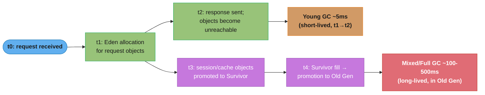

# JVM Tuning and GC for Services

## 1. Concept Overview

JVM GC tuning is the practice of configuring the HotSpot garbage collector so that memory
reclamation pauses stay within service SLO bounds and heap footprint fits within container
or machine memory. For most services the default G1GC settings are adequate; tuning begins
when GC pauses exceed 200ms or throughput drops below target.

---

## 2. Intuition

Think of the heap as a workspace shared by all requests. Allocation is fast (pointer-bump
on Eden), but eventually the workspace fills and work stops for cleanup (GC pause). The
tuning goal is: **keep the workspace large enough that cleanup is rare, and keep objects
short-lived enough that cleanup is fast.** GC problems almost always trace to either an
over-full heap or objects that live far longer than intended.

---

## 3. Core Principles

- **Generational hypothesis:** most objects die young (within a few hundred milliseconds).
  GC algorithms exploit this by collecting young generations (Eden + Survivor) cheaply and
  frequently, promoting survivors to Old Gen rarely.
- **Stop-the-world pauses:** most GC work requires all application threads to stop ("STW").
  Concurrent collectors (G1, ZGC, Shenandoah) minimize STW by doing most work concurrently,
  but cannot eliminate it.
- **Heap sizing tradeoff:** larger heaps hold more live objects and reduce GC frequency,
  but make Full GC pauses proportionally longer. Container memory limits are hard — exceeding
  them causes OOM-kill, not graceful degradation.
- **Allocation rate matters more than heap size:** a service allocating 1 GB/s will GC far
  more frequently than one allocating 100 MB/s, regardless of heap size.

---

## 4. GC Algorithms

### G1GC (Garbage First, Java 9+ default)

- Heap divided into equal-size regions (1–32 MB each), dynamically assigned to Eden,
  Survivor, or Old Gen.
- Collects the regions with the most garbage first (hence "Garbage First").
- Target pause: `-XX:MaxGCPauseMillis=200` (default) — G1 attempts to stay under this.
- Mixed collections periodically reclaim both Young and Old Gen concurrently.
- Best for: heaps 4–32 GB with pause targets of 100–200ms.

### ZGC (Java 15 production, Java 21 generational ZGC)

- Concurrent compaction — GC runs while application threads execute.
- STW pauses < 1ms regardless of heap size (tested to TB heaps).
- Throughput cost: ~5–15% vs G1 in throughput-optimized benchmarks.
- Java 21: generational ZGC (`-XX:+UseZGC -XX:+ZGenerational`) — further reduced throughput cost.
- Best for: services requiring sub-1ms pause SLOs, large heaps.

### Shenandoah (Red Hat, non-Oracle JDKs)

- Similar concurrent approach to ZGC; available in OpenJDK 11+ (via backport) and 15+.
- Sub-10ms pauses; slightly different throughput profile than ZGC.
- Best for: latency-sensitive services on non-Oracle JDKs.

### SerialGC / ParallelGC

- SerialGC: single-thread stop-the-world. For CLIs and small heaps (< 256 MB).
- ParallelGC: multi-thread stop-the-world. Highest throughput; unsuitable for latency SLOs.
- Use in services: never (unless batch job with no latency requirement).

---

## 5. Architecture Diagrams

### G1GC heap layout

```
Heap (e.g., -Xmx8g):
  +--------+--------+--------+--------+--------+--------+...
  |  Eden  |  Eden  |  Surv  | OldGen | OldGen | Humong |...
  +--------+--------+--------+--------+--------+--------+...
  <- Young Gen (minor GC, frequent) ->  <- Old Gen (major/mixed GC) ->

  Region size = heap / 2048 (e.g., 8 GB / 2048 = 4 MB per region)
  Humongous regions: objects > 50% of region size are allocated directly in Old Gen
```

### GC pause sources in a request-processing service



Tuning goal: prevent t3→t4 by ensuring object lifetime < 2 survivor copies.

---

## 6. Detailed Mechanics

### Heap sizing

```bash
# Production starting point for a 16 GB container:
-Xms4g -Xmx12g  # leave 4 GB for OS, metaspace, direct buffers, native threads

# Container-aware sizing (Java 11+):
-XX:MaxRAMPercentage=75.0  # use 75% of container memory for heap
# Avoid -XX:+UseLargePages in containers without huge page support; can cause allocation failures
```

### G1GC tuning

```bash
# Default is usually fine; tune only when profiling shows a problem:
-XX:+UseG1GC  # default since Java 9
-XX:MaxGCPauseMillis=100  # tighter than default 200ms; G1 will reduce region count
-XX:G1HeapRegionSize=8m   # override auto-selection; 8 MB for heaps > 16 GB
-XX:G1NewSizePercent=20   # minimum young gen (default 5% — may be too small)
-XX:G1MaxNewSizePercent=40  # cap young gen (default 60%)
-XX:InitiatingHeapOccupancyPercent=45  # start concurrent marking when heap is 45% full
                                       # (default 45%; lower to start marking earlier
                                        # and avoid Full GC on large allocations)
```

### ZGC tuning (Java 21)

```bash
-XX:+UseZGC
-XX:+ZGenerational  # Java 21: generational ZGC, lower throughput cost
-Xms8g -Xmx32g     # ZGC needs larger heap headroom than G1 (uncommitted pages are fine)
-XX:SoftMaxHeapSize=28g  # ZGC elastic reserve; will uncommit pages below this
# No -XX:MaxGCPauseMillis needed — ZGC is designed to be < 1ms regardless
```

### GC logging (mandatory in production)

```bash
-Xlog:gc*:file=/var/log/app/gc.log:time,uptime,level,tags:filecount=10,filesize=20m
# Parses with: gceasy.io, GCViewer, or:
# grep "Pause" gc.log | awk '{print $NF}' | sort -n | tail -20
```

### Memory tuning for microservices

```bash
# Direct buffers (NIO, Netty): not counted in -Xmx
-XX:MaxDirectMemorySize=512m  # guard against unbounded direct buffer growth

# Metaspace: class metadata (replaces PermGen since Java 8)
-XX:MetaspaceSize=256m          # initial size; avoids early metaspace GC
-XX:MaxMetaspaceSize=512m       # hard cap; safeguard against class loader leak

# Stack size (per thread):
-Xss256k  # default 512k–1m is wasteful for high-concurrency services;
           # 256k sufficient for most business logic; save ~256k per thread
```

---

## 7. Real-World Examples

**LinkedIn:** Tuned `-XX:InitiatingHeapOccupancyPercent` from 45 to 30 to eliminate Full
GC spikes during peak traffic when the Old Gen grew faster than concurrent marking could
reclaim it. Result: Full GCs eliminated; Mixed GC pauses stayed under 50ms.

**Netflix:** Migrated latency-sensitive services to ZGC in 2022; reported P99 GC pauses
dropping from ~150ms (G1GC) to < 1ms. Noted a ~7% throughput reduction, acceptable for
their latency SLOs.

**Discord:** Moved from JVM to Rust for their Go-live service specifically to eliminate GC
pauses during high-traffic events. The JVM's G1GC pauses caused latency spikes during
concurrent collection that were unacceptable for real-time messaging.

---

## 8. Tradeoffs

| GC | Pause (P99) | Throughput | Heap sizing | Use when |
|---|---|---|---|---|
| G1GC (default) | 50–200ms | High | Moderate | General services, 4–32 GB heap |
| ZGC (generational) | < 1ms | 5–15% lower than G1 | Needs extra headroom (~150%) | Latency-critical, large heap |
| Shenandoah | < 10ms | Similar to ZGC | Similar | Non-Oracle JDK, latency-sensitive |
| ParallelGC | 100ms–1s | Highest | Compact | Batch jobs, no latency SLO |

---

## 9. When to Use / When NOT to Use

**Use GC tuning when:**
- GC logs show pauses > your P99 SLO (e.g., `Pause Young (G1 Evacuation Pause) 250ms`)
- Concurrent marking is not completing before allocation fills the heap (Full GC spikes)
- Heap is undersized for the live object set (> 75% occupancy after GC)
- Container memory limit causes OOM-kill

**Do NOT tune without profiling:**
- Don't change `-XX:MaxGCPauseMillis` without measuring actual pause times via GC logs
- Don't increase `-Xmx` to "just give it more memory" without identifying object retention
- Don't disable GC logging — it is the only retroactive evidence of GC behavior

---

## 10. Common Pitfalls

**Pitfall 1: Object retention via static collections**
A static `Map<String, List<Object>>` accumulates entries across requests and never releases
them. The Map is always reachable (static = GC root), so all values are in Old Gen
indefinitely. Fix: use `WeakHashMap`, bounded caches (Caffeine), or explicit lifecycle
management.

**Pitfall 2: Humongous object allocation**
Objects larger than 50% of the G1 region size bypass Eden and go directly to Old Gen,
triggering expensive humongous region reclamation. Fix: increase `-XX:G1HeapRegionSize`
to make large objects non-humongous, or reduce object sizes (e.g., don't deserialize full
5 MB JSON responses into heap if only 3 fields are needed).

**Pitfall 3: Container memory limit = heap size**
Setting `-Xmx` equal to container memory limit ignores OS, JVM overhead (code cache,
metaspace, direct buffers, native threads). Result: OOM-kill. Rule: `-Xmx` ≤ 75% of
container memory for normal services; 85% for memory-dominated services with known
metaspace/direct buffer limits.

**Pitfall 4: Survivor too small → premature promotion**
If the Survivor space is full, live objects are promoted to Old Gen earlier than their
actual longevity warrants — inflating Old Gen. Fix: increase Young Gen size
(`-XX:G1NewSizePercent`) or increase `-Xmx` to provide more region budget.

**Pitfall 5: GC logs rotated away before investigation**
`-Xlog:gc*` with default `filecount=1` means the GC log is overwritten after ~24h. During
a weekend incident, GC logs from Friday's spike are gone Monday morning. Fix: always set
`filecount=10,filesize=20m` for at least 2 weeks of GC history per instance.

---

## 11. Technologies & Tools

| Tool | Purpose |
|---|---|
| GCeasy.io | Upload GC log; get visual GC pause analysis, promotion rate, throughput |
| GCViewer | Open-source desktop tool for GC log analysis |
| `jstat -gcutil <pid>` | Live per-generation occupancy and GC timing |
| `jmap -histo <pid>` | Histogram of live objects by class — find retention culprits |
| Eclipse MAT (Memory Analyzer Tool) | Heap dump analysis; finds memory leaks, dominator tree |
| JVM Flight Recorder (JFR) | Low-overhead profiling built into HotSpot; captures GC + allocation |
| Async-profiler | Flame graphs for CPU + allocation; identifies hot allocation paths |
| Prometheus JVM metrics (via Micrometer) | `jvm.gc.pause` histogram, `jvm.memory.used` by pool |

---

## 12. Interview Questions with Answers

**Q: What is the default GC in Java 9+ and what is its pause target?**

G1GC is the default since Java 9. Its default target is `-XX:MaxGCPauseMillis=200` —
G1 attempts to keep individual pauses under 200ms by adaptively sizing the young generation.
It does not guarantee the target; it is a goal that influences how many regions G1 collects
per pause cycle.

**Q: What is the difference between a minor GC and a major (Full) GC?**

Minor GC (Young GC) collects only the Young Generation (Eden + Survivor spaces) and is
fast (typically 5–50ms) because it uses copy collection and the live set is small. Major
GC (Full GC) collects the entire heap including Old Gen and is proportionally slower. G1
uses "Mixed GC" — collecting Young Gen plus selected Old Gen regions — as a middle ground
that avoids full-heap pauses.

**Q: How do you diagnose a GC pause problem in production?**

Enable GC logging: `-Xlog:gc*:file=gc.log:time,uptime,level,tags`. After a latency spike,
grep for "Pause" entries — `Pause Young (G1 Evacuation Pause)` shows Young GC pauses;
`Pause Full` shows Full GC. For each pause, record duration and heap occupancy before/after.
If Full GCs appear, the Old Gen is filling before concurrent marking completes — lower
`-XX:InitiatingHeapOccupancyPercent` or increase `-Xmx`. If Young GC pauses are long,
Young Gen is too large (collecting too many regions per pause) — reduce
`-XX:G1MaxNewSizePercent`.

**Q: What does `-XX:InitiatingHeapOccupancyPercent=45` control?**

It sets the heap occupancy threshold at which G1 starts a concurrent marking cycle. When
live objects occupy ≥ 45% of the heap, G1 begins concurrently marking objects to identify
Old Gen regions eligible for collection. Setting it too high (e.g., 75%) means marking
starts late, and if allocation fills the heap before marking completes, G1 falls back to
a Full GC. Setting it too low (e.g., 20%) wastes CPU on marking cycles that are rarely
productive. Tune toward lower values if Full GCs occur; higher if marking overhead is
visible on CPU profiles.

**Q: How does ZGC achieve sub-1ms pause times?**

ZGC is a concurrent, non-generational (non-generational before Java 21) collector that
performs compaction while application threads run. It uses load barriers — small JIT-
inserted code snippets on every object reference read — to transparently fix references
that point into relocated objects. The only STW phases are root scanning and reference
processing, which are sub-millisecond even on TB heaps because the work does not scale
with heap size. The tradeoff is ~5–15% throughput reduction from barrier overhead.

**Q: What is a "humongous allocation" and why is it a GC problem?**

In G1GC, a humongous allocation is an object larger than 50% of the region size. Since a
humongous object cannot fit in a single Eden region, it is allocated directly in one or
more contiguous Old Gen regions. This bypasses Young GC, inflating Old Gen immediately.
Humongous regions cannot be compacted during Young GC, only reclaimed during Mixed or Full
GC. A service that frequently allocates large buffers (> 2–4 MB) will see its Old Gen grow
faster than concurrent marking can reclaim it. Fix: increase region size
(`-XX:G1HeapRegionSize=8m` or `16m`) so objects are below the 50% threshold.

**Q: What is Metaspace and how can it leak?**

Metaspace stores class metadata — bytecode, method data, constant pools — outside the Java
heap (direct memory since Java 8, replacing PermGen). It grows dynamically by default
(`-XX:MaxMetaspaceSize` defaults to unlimited). A class loader leak occurs when a framework
or plugin system creates new class loaders that are not garbage collected (e.g., held by a
static reference or a ThreadLocal). Each leaked class loader retains all the class metadata
it loaded. Fix: set `-XX:MaxMetaspaceSize=512m` as a hard ceiling to surface the leak with
an OOM rather than consuming all available native memory; then use a heap dump with MAT to
find the class loader retention tree.

**Q: How do you tune the JVM heap for a microservice in a 4 GB container?**

Use `-XX:MaxRAMPercentage=75.0` to let the JVM use 75% of container memory (3 GB heap).
Reserve the remaining 25% for OS page cache, JVM code cache (~256 MB), Metaspace
(~256 MB), direct buffers (NIO/Netty), and native thread stacks (~256 KB × thread count).
Enable G1GC (default) with GC logging, deploy, and observe. If pauses exceed SLO, switch
to ZGC (`-XX:+UseZGC -XX:+ZGenerational`). Never set `-Xmx` equal to container limit —
OOM-kill is the result.

**Q: What is the relationship between object allocation rate and GC pause frequency?**

Higher allocation rate fills Eden faster, triggering Young GC more frequently. Young GC
pause duration is proportional to the amount of live data in Young Gen (objects that
survived long enough to be copied), not the total Eden size. So a high allocation rate
with mostly short-lived objects causes frequent but short pauses. A high allocation rate
with long-lived objects fills Old Gen quickly and eventually triggers expensive Mixed/Full
GC. The key metric is "promoted bytes per second" (visible in `jstat -gcutil`); if it is
high, objects are living too long and the application needs profiling, not heap size
increases.

**Q: How do ThreadLocal variables cause heap memory leaks?**

`ThreadLocal` values survive as long as the thread is alive. In a thread pool (e.g.,
Tomcat's request handler threads), threads are long-lived and reused across requests.
A ThreadLocal set during request handling that is not `remove()`d remains attached to the
thread after the request completes. Over time, these orphaned values accumulate in each
thread's ThreadLocalMap, referencing request-scope objects that cannot be GC'd. In Spring,
this is the mechanism behind `TenantContext` leaks — if the filter that clears
`ThreadLocal.remove()` is not invoked (e.g., an exception bypasses the finally block),
the tenant ID leaks into the next request on the same thread. Fix: always `remove()` in a
`finally` block or use a try-with-resources wrapper.

**Q: What is JVM Flight Recorder and when should you use it?**

JFR (Java Flight Recorder) is a low-overhead profiling framework built into HotSpot
(open-sourced in Java 11). It records GC pause details, object allocation by call site,
lock contention, thread stalls, and I/O latency at ~1–2% overhead — suitable for
continuous production profiling. Enable it with:
`-XX:StartFlightRecording=duration=60s,filename=profile.jfr,settings=profile`
or via `jcmd <pid> JFR.start duration=60s filename=out.jfr`. Analyze with
JDK Mission Control (JMC). Use it whenever profiling data is needed in production without
a visible performance impact from the profiler itself.

**Q: How do you detect an object retention (heap leak) in production?**

1. Monitor `jvm.memory.used{area=heap}` via Micrometer/Prometheus — a sawtooth pattern
   (heap grows, GC collects, repeat at higher baseline) indicates growing live set.
2. Take two heap dumps 10 minutes apart: `jcmd <pid> GC.heap_dump filename=heap1.hprof`
   and `heap2.hprof`.
3. Load both into Eclipse MAT and use "Compare Snapshots" to identify object types that
   grew in count or retained size.
4. Follow the dominator tree to find the GC root (static field, ThreadLocal, listener
   registry) that is keeping the growing objects alive.
5. Fix by removing the reference or using a weak reference / evicting cache.

**Q: What is the difference between `-Xms` and `-Xmx`, and should they be equal?**

`-Xms` is the initial heap size (committed to the OS at JVM startup); `-Xmx` is the
maximum. If `-Xms` < `-Xmx`, the JVM starts with a small heap and grows it on demand,
which causes OS memory allocation during application startup — visible as startup slowness
and early GC churn in Eden. Setting `-Xms = -Xmx` (e.g., both 8g) commits the full heap
at startup, eliminating heap-grow overhead and making memory usage predictable for
container scheduling. This is the recommended production setting for services where
startup latency matters and memory is dedicated. In development or batch jobs with short
runtimes, `-Xms < -Xmx` reduces peak memory usage.

**Q: When does G1GC fall back to a Full GC and how do you prevent it?**

G1 falls back to a serial Full GC when: (1) concurrent marking cannot complete before the
Old Gen fills (allocation races marking); (2) evacuation fails — a Young GC cannot find
free regions to copy live objects into. Both indicate the heap is too small or Old Gen
objects are not being collected fast enough. Prevention: (1) lower
`-XX:InitiatingHeapOccupancyPercent` to start marking earlier; (2) increase `-Xmx` to
provide more region budget; (3) identify and fix object retention causing Old Gen bloat;
(4) increase `-XX:ConcGCThreads` (default = 1/4 of GCThreads) to speed up concurrent
marking. Monitor `jvm.gc.pause{action=end_of_major_GC}` counter in Prometheus — any
occurrence is a severity-2 incident signal.

**Q: How do virtual threads (Project Loom) change JVM memory characteristics?**

Virtual threads are user-mode threads scheduled by the JVM, not the OS. Their stack is
stored on the Java heap (as a `Continuation` object), and unmounted threads' stacks can
be GC'd. A platform thread uses ~1 MB of native stack memory (off-heap), but a blocked
virtual thread's stack occupies ~2–8 KB of heap. With 100,000 virtual threads, this is
200 MB–800 MB of heap for stacks vs 100 GB of native memory for platform threads.
The GC implication: unmounting/remounting virtual threads generates short-lived heap
allocation for stack frames, increasing allocation rate. Monitor Eden promotion rate after
migrating to virtual threads; if it rises significantly, Young Gen may need to grow
(`-XX:G1NewSizePercent`).

---

## 13. Best Practices

- Always enable GC logging with rotation in production; no other retroactive evidence exists
- Start with G1GC defaults; tune only when GC logs show a measurable problem
- Use `-XX:MaxRAMPercentage=75.0` in containers instead of hard `-Xmx` values
- Set `-Xms = -Xmx` for predictable startup and memory committed to container scheduling
- Add `jvm.gc.pause` Prometheus alert: page if P99 pause > SLO threshold
- Profile allocation hot paths with Async-profiler before increasing heap; often one call
  site generates 80% of allocation

---

## 14. Case Study

Applied in: [Connection Pool](../design_connection_pool.md) — HikariCP connection objects
and statement caches have bounded lifetimes; GC tuning ensures pool operations do not
induce GC pauses. [LRU Cache](../design_lru_cache_java.md) — a 10M-entry cache requires
careful heap sizing (`-Xmx9g`) to avoid promoting cache entries to Old Gen while also
leaving headroom for G1 concurrent marking.
