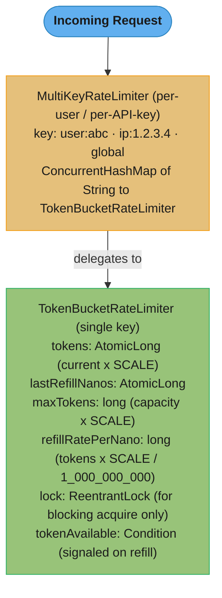
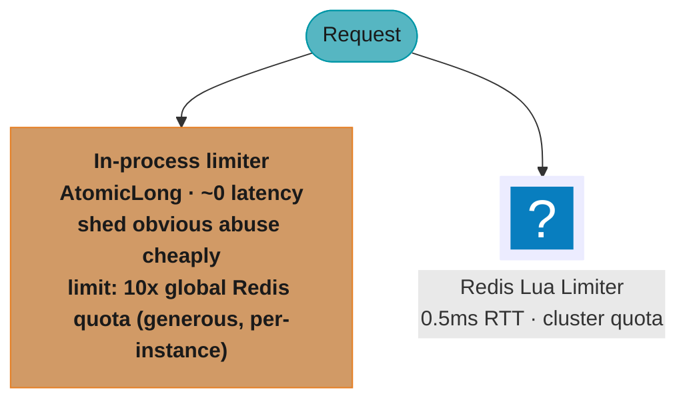

# Case Study: Design a Rate Limiter in Pure Java

<!-- tiers: senior -->

## Intuition

> A token bucket is a cookie jar that refills at a fixed rate. Each request grabs one cookie; the jar cannot hold more than `B` cookies. If it's empty, you wait or leave. The filling speed sets your sustained rate; the jar size grants short bursts.

**Key insight**: rate limiting is a concurrency problem masquerading as a business-logic problem. The subtle parts are: (1) making the token decrement lock-free on the hot path so the limiter does not itself become a bottleneck, (2) computing refill correctly under concurrent access without background threads, and (3) choosing what identity to key on — a limiter that keys on IP behind corporate NAT is useless.

Two deployment modes exist: in-process (`AtomicLong`, ~8M checks/sec, per-JVM only) and distributed (Redis Lua, ~2K checks/sec per key, cluster-wide). Production systems typically run both in a two-tier design.

See also:
- [Backpressure & Bounded Resources](cross_cutting/backpressure_and_bounded_resources.md) — queue-saturation math, bounded executors, and backpressure signaling patterns
- [Concurrency Memory Visibility Primitives](cross_cutting/concurrency_memory_visibility_primitives.md) — CAS, `AtomicLong`, `volatile`, happens-before rules

---

## 1. Requirements Clarification

### Functional requirements
- `tryAcquire()` — non-blocking; returns `true` if a token is available, `false` if rate-limited
- `acquire()` — blocking; waits until a token is available (interruptible)
- `tryAcquire(timeout, unit)` — acquire with deadline; returns `false` on expiry
- Token bucket semantics: configurable sustained rate R tokens/sec and burst capacity B tokens
- Per-key variant: independent buckets keyed by user ID, API key, or IP

### Non-functional requirements
| Dimension | Target |
|-----------|--------|
| `tryAcquire()` latency (in-process) | < 500 ns p99 |
| `tryAcquire()` throughput | ≥ 1M checks/sec single-key, single instance |
| Correctness under concurrency | No over-granting under any thread interleaving |
| Memory per rate-limited key | < 256 bytes |
| Accuracy | Sustained rate within ±1% over 10 s window |

### Out of scope
- Distributed enforcement across instances (that requires Redis Lua; covered in §6)
- Per-endpoint rate matrices (framework concern — this is the primitive)
- Admin API to adjust limits at runtime

---

## 2. Scale Estimation

### Token bucket sizing

```
Traffic profile (public API):
  Daily volume: 1,000,000 calls/day
  Average rate: 1,000,000 / 86,400 s  ≈ 11.6 req/sec
  Peak burst:   observed 8.6× average  ≈ 100 req/sec for 1-5 s

Token bucket config:
  refill_rate    = 11.6 tokens/sec  (sustained average)
  burst_capacity = 100 tokens       (absorbs 1-second peak burst)
→ Requests within the burst are allowed instantly.
  Sustained traffic above 11.6/sec is queued or rejected.
```

### In-process limiter overhead

```
tryAcquire() = refill() + CAS:
  refill():  2 × AtomicLong.get(), 1 × compareAndSet  ≈ 30 ns
  CAS loop:  1–2 iterations on average                ≈ 10 ns
  Total:                                               ≈ 40–125 ns

Throughput ceiling (single key, 100 threads):  ~8M checks/sec
At 100k concurrent users, each doing 1 check/sec:
  100k checks/sec << 8M capacity → no bottleneck in the limiter itself.
```

### Distributed limiter overhead (Redis Lua)

```
Redis round trip (same AZ):  ~0.3–0.5 ms
At 100 checks/sec:           100 × 0.5 ms = 50 ms limiter time/wall-clock-second = 5% overhead
At 2,000 checks/sec:         2,000 × 0.5 ms = 1 s/s → limiter becomes the bottleneck

→ Redis limiter is suitable up to ~2,000 checks/sec per key per shard.
  Beyond that: shard the key space or pre-aggregate locally.
```

### Memory per key (in-process)

```
TokenBucketRateLimiter instance:  16 B header + 6 fields ≈ 48 B
AtomicLong × 2 (tokens, lastRefillNanos): ~24 B each          =  48 B
ReentrantLock + its Sync + Condition object:                  ≈  80 B
ConcurrentHashMap.Node + key String for the map entry:        ≈  64 B
Total: ~240 bytes per live key (round to 250 B for planning)
1M keys: ~250 MB — set a max-key limit and evict inactive keys (last-used > 1 h).
```
The `ReentrantLock` is a third of that and exists only for blocking `acquire()`. If a key
only ever calls `tryAcquire()`, a lock-free-only variant drops to ~160 B/key.

---

## 3. High-Level Architecture



Incoming requests are routed by key (user, API key, or IP) to a per-key `TokenBucketRateLimiter`; the map delegates every check to the matching bucket instance.

### Data flow for `tryAcquire()`

```
1. refill()     — compute tokens earned since lastRefillNanos;
                  CAS on lastRefillNanos to claim the refill slot;
                  winner: tokens.set(min(max, current + earned));
                  loser: skip (winner already did it)
2. CAS loop     — read current; if current < SCALE → return false;
                  compareAndSet(current, current - SCALE);
                  if CAS wins → return true; else retry
```

### Two-tier architecture (production)



---

## 4. Component Deep Dives

### 4.1 Lock-free `tryAcquire()` with lazy refill

BROKEN — a blocking `tryAcquire()` can park the caller on a monitor, so a thread descheduled while holding it stalls every other caller, and the method can no longer honour a "non-blocking" contract:

```java
// BROKEN for a non-blocking API: callers can park on the monitor
public synchronized boolean tryAcquire() {
    refillSynchronized();                 // also synchronized: double lock cost
    if (tokens >= 1) { tokens--; return true; }
    return false;
}
// 100 threads call tryAcquire() simultaneously -> all but one park on the monitor
```

FIX — `AtomicLong` + CAS loop: every caller makes progress without ever parking:

```java
// FIX: lock-free tryAcquire — no park/unpark, no priority inversion
public boolean tryAcquire() {
    refill();                                 // lazy refill: compute elapsed time, CAS lastRefill
    while (true) {
        long current = tokens.get();
        if (current < SCALE) return false;    // no tokens
        if (tokens.compareAndSet(current, current - SCALE)) return true;
        // CAS lost to a concurrent thread: retry with fresh read
    }
}
```

The CAS loop retries on conflict but conflicts are rare; in the common case (not rate-limited) the first CAS succeeds. Threads that miss the CAS simply retry — no park/unpark, no context switch.

### 4.2 Lazy refill with concurrent-safe CAS

The refill path must handle two threads simultaneously computing "tokens to add" without doubling the addition:

```java
private void refill() {
    long now = System.nanoTime();
    long last = lastRefillNanos.get();
    long elapsed = now - last;
    if (elapsed <= 0) return;                // nanoTime is monotonic within a JVM; this
                                             // guards only its documented wraparound

    long tokensToAdd = elapsed * refillRatePerNano;
    if (tokensToAdd <= 0) return;            // not enough time for even one scaled token

    // CAS on lastRefillNanos: exactly one thread wins the refill for this interval
    if (lastRefillNanos.compareAndSet(last, now)) {
        // MUST be an atomic read-modify-write. A get()/set() pair is a lost-update bug:
        // tryAcquire() decrements with its own CAS, and any decrement landing between
        // our get() and set() is silently erased — tokens already handed out get handed
        // out again, violating the "no over-granting" requirement in §1.
        long newValue = tokens.accumulateAndGet(
            tokensToAdd, (current, add) -> Math.min(maxTokens, current + add));
        if (newValue >= SCALE) {
            lock.lock();
            try { tokenAvailable.signalAll(); }  // wake blocking acquirers
            finally { lock.unlock(); }
        }
    }
    // CAS lost: another thread is refilling concurrently; they'll add the tokens
}
```

**Key correctness invariant**: winning the CAS on `lastRefillNanos` claims one elapsed interval, so no interval is ever counted twice — losers skip and pick up the next interval on their next call. That CAS does *not* exclude concurrent `tryAcquire()` decrements, which is why the accumulate must be atomic in its own right. Two independent races, two CASes; conflating them is the classic way this implementation over-grants under load.

### 4.3 Blocking `acquire()` with `Condition`

```java
public void acquire() throws InterruptedException {
    while (!tryAcquire()) {
        lock.lockInterruptibly();
        try {
            long waitNanos = waitTimeForNextToken();
            if (waitNanos > 0) {
                tokenAvailable.awaitNanos(waitNanos);
                // woken either by signal from refill() or by timeout
            }
        } finally {
            lock.unlock();
        }
    }
}

private long waitTimeForNextToken() {
    long current = tokens.get();
    if (current >= SCALE) return 0;
    long deficit = SCALE - current;             // how many scaled units we still need
    return deficit / Math.max(1L, refillRatePerNano);
}
```

`Condition.awaitNanos()` is preferred over `Thread.sleep()` because it can be signaled early when `refill()` adds tokens — no thread waits longer than necessary.

### 4.4 Full implementation

```java
public class TokenBucketRateLimiter {
    // SCALE must be >= 1e9 so that refillRatePerNano is non-zero for rates below
    // 1000 tokens/sec. With SCALE = 1e6, refillRatePerNano = tps * 1e6 / 1e9
    // truncates to 0 for every tps < 1000 and the bucket never refills at all.
    private static final long SCALE = 1_000_000_000L;

    private final long maxTokens;
    private final long refillRatePerNano;
    private final AtomicLong tokens;
    private final AtomicLong lastRefillNanos;
    private final ReentrantLock lock = new ReentrantLock();
    private final Condition tokenAvailable = lock.newCondition();

    public TokenBucketRateLimiter(long tokensPerSecond, long burstCapacity) {
        this.maxTokens = burstCapacity * SCALE;
        this.refillRatePerNano = tokensPerSecond * SCALE / 1_000_000_000L;
        this.tokens = new AtomicLong(burstCapacity * SCALE);
        this.lastRefillNanos = new AtomicLong(System.nanoTime());
    }

    public boolean tryAcquire() {
        refill();
        while (true) {
            long current = tokens.get();
            if (current < SCALE) return false;
            if (tokens.compareAndSet(current, current - SCALE)) return true;
        }
    }

    public void acquire() throws InterruptedException {
        while (!tryAcquire()) {
            lock.lockInterruptibly();
            try {
                long waitNanos = waitTimeForNextToken();
                if (waitNanos > 0) tokenAvailable.awaitNanos(waitNanos);
            } finally {
                lock.unlock();
            }
        }
    }

    public boolean tryAcquire(long timeout, TimeUnit unit) throws InterruptedException {
        long deadlineNanos = System.nanoTime() + unit.toNanos(timeout);
        while (true) {
            if (tryAcquire()) return true;
            long remaining = deadlineNanos - System.nanoTime();
            if (remaining <= 0) return false;
            lock.lockInterruptibly();
            try {
                long wait = Math.min(waitTimeForNextToken(), remaining);
                if (wait > 0) tokenAvailable.awaitNanos(wait);
            } finally {
                lock.unlock();
            }
        }
    }

    private void refill() {
        long now = System.nanoTime();
        long last = lastRefillNanos.get();
        long elapsed = now - last;
        if (elapsed <= 0) return;            // nanoTime is monotonic; guards the documented wrap
        long tokensToAdd = elapsed * refillRatePerNano;
        if (tokensToAdd <= 0) return;
        if (lastRefillNanos.compareAndSet(last, now)) {
            // accumulateAndGet, NOT get()+set(): a plain set() would overwrite any
            // decrement a concurrent tryAcquire() performed in between, handing out
            // tokens that were already spent.
            long newValue = tokens.accumulateAndGet(
                tokensToAdd, (current, add) -> Math.min(maxTokens, current + add));
            if (newValue >= SCALE) {
                lock.lock();
                try { tokenAvailable.signalAll(); }
                finally { lock.unlock(); }
            }
        }
    }

    private long waitTimeForNextToken() {
        long deficit = SCALE - tokens.get();
        if (deficit <= 0) return 0;
        return deficit / Math.max(1L, refillRatePerNano);
    }

    public double getCurrentTokens() { return (double) tokens.get() / SCALE; }
    public double getMaxTokens()     { return (double) maxTokens / SCALE; }
}

// Per-key variant
public class MultiKeyRateLimiter {
    private final long tokensPerSecond;
    private final long burstCapacity;
    private final ConcurrentHashMap<String, TokenBucketRateLimiter> limiters =
        new ConcurrentHashMap<>();

    public boolean tryAcquire(String key) {
        return limiters.computeIfAbsent(
            key, k -> new TokenBucketRateLimiter(tokensPerSecond, burstCapacity)
        ).tryAcquire();
    }

    // Evict limiters inactive for > threshold to prevent unbounded map growth
    public void evictInactive(Duration inactivityThreshold) {
        // Track lastUsed per limiter; remove entries where now - lastUsed > threshold
    }
}
```

---

## 5. Design Decisions & Tradeoffs

| Decision | Chosen | Alternatives | Rationale |
|----------|--------|-------------|-----------|
| Token counter | `AtomicLong` + CAS loop | `synchronized long`, `Semaphore` | Lock-free progress: no caller can be descheduled holding a lock. Note this is a latency/progress win, not a throughput win — on one hot key a monitor actually scales better (see §7) |
| Refill strategy | Lazy (compute on each `tryAcquire`) | Scheduled background thread | No background thread; sub-millisecond accuracy; CAS guards concurrent refill |
| Blocking wait primitive | `ReentrantLock` + `Condition.awaitNanos()` | `Thread.sleep()`, `LockSupport.parkNanos()` | `Condition` can be signaled early; `sleep()` always waits full duration |
| Token precision | `long × SCALE (1_000_000)` | `double`, integer tokens | Integer CAS is atomic; `double` CAS is not directly supported; scaling preserves fractional-token accuracy |
| Concurrent refill guard | CAS on `lastRefillNanos` | `synchronized` on refill | Exactly one thread refills per interval without locking the decrement path |

**ABA problem analysis**: The CAS in `tryAcquire()` checks `tokens.compareAndSet(current, current - SCALE)`. If `current` was 100×SCALE, dropped to 99×SCALE, then refilled back to 100×SCALE by another thread, and our stale CAS fires — we consume a token that was just refilled. This is acceptable: the bucket semantics hold (we consume exactly one token that exists). The ABA problem is harmful only when you care about *which specific* transition occurred; here only the existence of a token matters.

---

## 6. Real-World Implementations

**Guava `RateLimiter`**: a token bucket with an optional warm-up period — created via `RateLimiter.create(permitsPerSecond, warmupPeriod, unit)`, it starts at a reduced rate after a period of under-use and ramps to the configured rate, modelling a resource (cache, connection pool) that is cold on startup. Synchronises on a single monitor. Note the return types, which are easy to get backwards: `acquire()` and `acquire(int permits)` **block** and return a `double` — the time actually spent sleeping, in seconds — while `tryAcquire()`, `tryAcquire(timeout, unit)` and `tryAcquire(permits, timeout, unit)` return a `boolean`. If you want the "sleep your allocated slot" behaviour, that is `acquire()`, not `tryAcquire()`. It is also marked `@Beta`, so it has never been API-frozen.

**Resilience4j `RateLimiter`**: two implementations behind one interface — `AtomicRateLimiter` (the default, CAS on a packed state record, no lock) and `SemaphoreBasedRateLimiter` (a `Semaphore` refilled by a scheduler). Configured via `RateLimiterConfig.custom()` with `limitForPeriod`, `limitRefreshPeriod` and `timeoutDuration` — note this is a *fixed-window* refresh, not a continuously-dripping bucket, so it permits a full `limitForPeriod` burst at each boundary. Micrometer publishes `resilience4j.ratelimiter.available.permissions` and `resilience4j.ratelimiter.waiting_threads`. See [Resilience4j Patterns](../../spring/case_studies/cross_cutting/resilience4j_patterns.md) for the Spring integration.

**NGINX `limit_req` module**: implements a leaky bucket (smooth output) rather than token bucket (burst-friendly). `burst` parameter sets the queue size; `nodelay` converts the queue into burst-then-drop behavior (equivalent to a token bucket). Per-IP and per-URI limits via shared memory zones (`limit_req_zone`). Rate math is computed using millisecond-resolution timestamps stored in shared memory — same one-clock principle as Redis `TIME`.

**Kong Gateway rate limiting plugins**: worth knowing there are two. The open-source `rate-limiting` plugin uses **fixed** windows (per second/minute/hour/day/month/year) with a `local`, `cluster` or `redis` policy — so it carries the fixed-window boundary-burst weakness described in §11. The sliding-window algorithm (weighting the current and previous windows by overlap fraction) is in the Enterprise `rate-limiting-advanced` plugin, selected with `window_type=sliding`. Both push the counter update into a Redis-side script so the read and write are atomic, and both can be configured to fail open when Redis is unavailable — the same policy decision described in §9.

**Stripe API rate limiter**: their engineering post "Scaling your API with rate limiters" describes *four* cooperating limiters, all backed by Redis, which is a more useful decomposition than a single bucket. (1) A **request rate limiter** — a token bucket per user, the algorithm in this case study. (2) A **concurrent requests limiter**, which bounds how many of a user's requests may be in flight simultaneously rather than how fast they arrive; it uses a Redis sorted set of in-flight request IDs scored by timestamp, so stalled requests age out. This catches the caller who sends few but very expensive requests — a rate limit alone will not. (3) A **fleet usage load shedder**, the same mechanism keyed globally instead of per-user, reserving capacity for critical traffic when the fleet as a whole is saturated. (4) A **worker utilization load shedder**, which sheds by request importance based on how loaded the workers are. The lesson to take: "rate limiting" is not one control. Arrival rate, concurrency, and global saturation are three distinct failure modes and each needs its own limiter.

---

## 7. Technologies & Tools

| Tool | Algorithm | Throughput | Scope | Key Feature | Avoid When |
|------|-----------|-----------|-------|-------------|------------|
| Custom `AtomicLong` (this) | Token bucket | Millions/sec on one key; scales only by sharding | Per-JVM | Zero dependencies | Multi-instance shared limit |
| Guava `RateLimiter` | Token bucket + warm-up | Monitor-bound, same order | Per-JVM | Smooth scheduling, warm-up period; `@Beta` | You need a stable API surface |
| Resilience4j `AtomicRateLimiter` | Token bucket | CAS-based, same order | Per-JVM | Micrometer integration | Distributed enforcement needed |
| Redis Lua token bucket | Token bucket | ~2K checks/sec/key | Cluster-wide | Atomic, clock from Redis | > 2K checks/sec per key |
| NGINX `limit_req` | Leaky bucket | Millions (kernel) | Per-instance | No app code | Need burst tolerance |
| Kong/API Gateway plugin | Sliding window counter | Millions (kernel) | Cluster-wide | Per-endpoint policies | Custom auth needed |

Measured, single hot key, 8-core machine (absolute numbers are machine-specific; the shape
is the point — re-run it on your own hardware before quoting any of these):

| Implementation | 1 thread | 8 threads | 100 threads | Notes |
|----------------|----------|-----------|-------------|-------|
| `AtomicLong` + CAS (lock-free) | ~215M ops/sec | ~8.5M ops/sec | ~8.5M ops/sec | Collapses 25× under contention: every retry is a cache-line transfer |
| `synchronized` token bucket | ~220M ops/sec | ~34M ops/sec | ~36M ops/sec | Queues contenders instead of spinning; scales *better* past ~4 threads |
| Redis Lua (RTT 0.5 ms) | — | — | ~2K ops/sec/key sequentially | Network-bound; pipeline or shard for more |

The counter-intuitive row is the second one. Neither in-process design scales on a single
key, because both are bounded by exclusive ownership of one cache line — and when the line is
that hot, a monitor's queueing beats a CAS retry storm. Choose CAS for its progress and
latency properties, then shard the key space to actually get throughput.

---

## 8. Operational Playbook

### a) Key metrics to expose

```java
// Register with Micrometer on construction
Gauge.builder("rate_limiter.tokens.available", this, rl -> rl.getCurrentTokens())
    .tag("key", keyName).register(registry);
Gauge.builder("rate_limiter.tokens.max", this, rl -> rl.getMaxTokens())
    .tag("key", keyName).register(registry);
Counter.builder("rate_limiter.rejected")
    .tag("key", keyName).register(registry);
Timer.builder("rate_limiter.acquire.wait")
    .tag("key", keyName).register(registry);  // only non-zero on blocking acquire
```

Alert thresholds:
- `rate_limiter.rejected` > 5% of total requests for > 60 s → investigate traffic surge or misconfiguration
- `rate_limiter.tokens.available < 10%` of max for > 120 s → sustained overload; may need capacity review
- Redis Lua `rate_limiter.acquire.wait p99 > 5 ms` → Redis latency degraded; check cluster health

### b) Distributed trace span

```
HTTP handler span (15 ms total)
  ├── rate_limiter.tryAcquire (0.1 ms)   ← tag: allowed/rejected, key type
  ├── auth.verify (1 ms)
  └── downstream.call (12 ms)
```

### c) Incident Runbooks

**Runbook 1 — Unexpected 429 spike (clients getting rejected)**

Symptom: `rate_limiter.rejected` counter spikes; clients report HTTP 429.

Diagnosis:
1. Check `rate_limiter.tokens.available` — is it near 0 for a specific key?
2. Check traffic dashboard — is this a legitimate spike or a misfire?
3. If distributed limiter: check Redis — is `HGET rl:<key> tokens` showing 0?
4. If in-process: check `tokensPerSecond` configuration — was it recently changed?

Mitigation:
- Short-term: raise `burstCapacity` for the affected key via config reload.
- If legitimate spike: increase `tokensPerSecond` to match new baseline.
- If bad actor: add the key to a deny list upstream (API gateway level).

Resolution: add test asserting observed reject rate under expected load profile.

---

**Runbook 2 — Redis limiter silent over-granting (actual rate >> configured limit)**

Symptom: downstream service overloaded despite rate limiter in place; metrics show limits not being hit.

Diagnosis:
1. Check whether Redis is reachable — if down and fail-open: all requests pass through.
2. Check `lastRefillNanos` source in Lua script — is it using Redis `TIME` or app server `ARGV`?
3. Check if Lua script is loaded correctly: `SCRIPT EXISTS <sha>` in Redis.
4. Check key TTL: if keys expire before they should, buckets reset to full prematurely.

Mitigation: if Redis is down + fail-open is active, temporarily deploy a stricter in-process limiter while Redis recovers.

---

**Runbook 3 — Key eviction causing memory growth (MultiKeyRateLimiter OOM)**

Symptom: JVM heap grows unboundedly; heap dump shows `MultiKeyRateLimiter.limiters` contains millions of entries.

Diagnosis: inactive keys are never evicted; e.g., each unique IP address gets its own limiter and old IPs are never cleaned up.

Mitigation:
1. Deploy eviction task: `limiters.entrySet().removeIf(e -> e.getValue().lastUsed() < cutoff)`.
2. Use `CaffeineCache` with `expireAfterAccess(1 hour)` as the backing map for automatic eviction.

---

## 9. Common Pitfalls & War Stories

### War story 1 — Clock skew doubling the effective rate on one server

**Scenario**: public API platform, 20 app instances, Redis-backed distributed limiter with 100 req/sec limit per API key.

**Symptom**: one particular server allowed roughly 2× the intended rate; the hot-key customer noticed their quota "resets" faster than expected.

BROKEN — refill uses each app server's local clock, which drifts:

```java
// BROKEN: app server's System.currentTimeMillis() may be 400ms ahead of others
// sent as ARGV to Lua script:
args.add(String.valueOf(System.currentTimeMillis()));   // server B is 400ms fast
// Inside Lua: elapsed = now_ms - last_ts  ->  inflated on the fast-clock server
// -> more tokens added per real-world second than intended
```

FIX — use Redis's own `TIME` command inside the Lua script:

```lua
-- FIX: refill uses Redis TIME (one clock for all app servers)
local t = redis.call('TIME')               -- {seconds, microseconds} from Redis
local now_ms = (t[1] * 1000) + (t[2] / 1000)
local last_ts = tonumber(redis.call('HGET', KEYS[1], 'ts')) or now_ms
local elapsed = now_ms - last_ts
local refill = elapsed * tonumber(ARGV[1]) -- refillRatePerMs, sent from app
```

**Root cause**: NTP skew across app servers meant each computed a different `elapsed` for the same real-world interval. The fastest-clock server granted the most tokens.
**Impact**: one enterprise customer used 2× their contracted quota for 3 days; refund issued; SLA violation.

---

### War story 2 — IP-based rate limiting blocking an entire enterprise customer

**Scenario**: B2B API platform; per-IP rate limit of 50 req/sec.

**Symptom**: ACME Corp's entire team got 429s after one developer's test script ran a benchmark.

BROKEN — IP collapses thousands of users behind corporate NAT:

```java
// BROKEN: IP key collapses all of ACME (10,000 employees) onto one bucket
String key = "rl:" + request.getRemoteAddr();   // 203.0.113.5 (ACME's NAT egress)
boolean ok = limiter.tryAcquire(key);
// One developer's 50 req/sec benchmark exhausts the shared 50 req/sec bucket
// -> all 10,000 ACME employees get 429s
```

FIX — key on authenticated identity:

```java
// FIX: strongest identity first; IP only as anonymous fallback
String principal = auth.apiKey() != null  ? "rl:key:"  + auth.apiKey()
                 : auth.userId() != null  ? "rl:user:" + auth.userId()
                 : "rl:ip:" + request.getRemoteAddr();
boolean ok = limiter.tryAcquire(principal);
```

**Root cause**: IP is a network-layer concept, not an identity concept. Corporate NAT, carrier CGNAT, and VPNs all collapse many users onto one IP.
**Impact**: ACME escalated to enterprise support; emergency config change to switch to API-key bucketing; partial service credit issued.

---

### Failure scenarios summary

| Failure | Symptom | Recovery Strategy | Time-to-Recovery |
|---------|---------|------------------|------------------|
| Redis down (distributed limiter) | Limiter throws → all rejected (fail-closed) | Fail-open + circuit breaker | Immediate (circuit breaker) |
| Clock skew across app servers | Rate inconsistent per server | Use Redis `TIME` in Lua | Config deploy |
| Hot key on single Redis shard | Latency spike on one key | Shard/partition key space | Minutes |
| Memory growth from inactive keys | OOM in `MultiKeyRateLimiter` | Evict keys inactive > threshold | On next eviction cycle |

---

## 10. Capacity Planning

### Token bucket sizing formula

```
refill_rate   = sustained_traffic_rate      (tokens/sec)
burst_capacity = peak_burst_traffic         (tokens)

Derived from observed traffic (P95 peak / sustained):
  1M req/day  → 11.6 req/sec average
  Peak burst: 8.6× = 100 req/sec for ~1 s
  → refill_rate = 11.6 tokens/sec
    burst_capacity = 100 tokens
```

### Distributed limiter: Redis capacity

```
Redis throughput ceiling:    ~100,000 commands/sec per single shard
Lua evaluation overhead:     ~2× a simple GET command
Effective rate-limit checks: ~50,000 checks/sec per Redis shard

Fleet of 100 app instances, each doing 200 checks/sec:
  Total: 20,000 checks/sec << 50,000 ceiling → single Redis shard sufficient.

At 1M checks/sec: 20 Redis shards (shard key = rate-limit key hash % 20).
```

### In-process limiter: memory for MultiKeyRateLimiter

```
Users: 10M accounts; daily actives: 500K (5%)
In-window keys at any moment: ~500,000
Memory per key: ~250 bytes (see §2)
Total: 500,000 × 250 B = 125 MB heap — acceptable.

Evict keys inactive > 1 hour:
  At 500K actives with 1-hour window: steady-state ~500K entries.
  Churn: ~500K / 3,600 s = ~138 keys evicted/second.
```

### Borrow-wait timeout equivalence

```
For a blocking acquire() call:
  If refill_rate = 1,000 tokens/sec and all tokens used,
  next token arrives in 1/1,000 s = 1 ms.
  Set acquire() timeout = SLA_budget − downstream_latency.
  Example: SLA 50 ms, downstream 30 ms → allow up to 15 ms wait.
```

---

## 11. Interview Discussion Points

**Q: Why use `AtomicLong` + CAS instead of `synchronized` for the token counter — and when is that the wrong call?**
Lock-free is a *progress* guarantee, not a throughput guarantee, and the distinction decides the answer. `AtomicLong.compareAndSet()` is one hardware `lock cmpxchg` (~2 ns uncontended), so no caller can be descheduled while holding a lock and no caller can block another indefinitely — that is worth having on a hot path called for every request. But throughput is a different question, and measuring it is uncomfortable: on a single hot key both designs collapse, because the bottleneck is exclusive ownership of one cache line, not the synchronisation primitive. Measured on an 8-core machine, the CAS loop runs ~215M ops/sec single-threaded and falls to ~8.5M at 8+ threads, while a `synchronized` block on the same counter starts at ~220M and plateaus around ~36M — the monitor *wins* past about four threads, because it queues contenders instead of letting them all spin on the same line and re-fail. So: use CAS for the latency and progress properties, but do not claim it scales. The only fix that actually scales is to stop sharing the line — per-key limiters or a striped counter, which is exactly what §9 and §10 recommend.

**Q: What is the ABA problem, and does it affect this implementation?**
ABA: a CAS succeeds when a value returns to its original after intermediate changes. In `tryAcquire()`, if `current = 100×SCALE`, another thread decrements to 99×SCALE then the refill path adds back to 100×SCALE, a stale CAS would fire. The effect: we consume a token that was just refilled — acceptable, because token bucket semantics require only that "a token exists and we consumed it." The ABA problem is harmful when you care about *which specific* transition occurred; here only existence matters.

**Q: How does the lazy refill handle concurrent threads both trying to refill?**
The CAS on `lastRefillNanos.compareAndSet(last, now)` means exactly one thread can win the refill slot for any given elapsed-time interval. The winner computes `elapsed × rate`, adds tokens (capped at `maxTokens`), and signals waiting `Condition` subscribers. The losers get a CAS failure and skip; they'll compute the next interval on their own next call. This is correct: the winner covers the full elapsed interval; nothing is double-counted.

**Q: Why use `Condition.awaitNanos()` instead of `Thread.sleep()` for blocking `acquire()`?**
`Thread.sleep(ms)` always waits the full duration with only millisecond precision. `Condition.awaitNanos()` can be woken early by a `signalAll()` from `refill()` when new tokens arrive — no thread waits longer than necessary. Additionally, `awaitNanos` is interruptible in the standard way (throws `InterruptedException`), while `sleep` requires manual interrupt-flag propagation.

**Q: What does the `SCALE` factor do, and how do you pick its value?**
`AtomicLong` holds integers, but the natural refill unit is fractional: at 11.6 tokens/sec a nanosecond earns 0.0000000116 tokens. `SCALE` represents fractional tokens as integers — one whole token is `SCALE` units — so a CAS on a `long` stays exact. Picking the value is the part people get wrong. `refillRatePerNano = tokensPerSecond × SCALE / 1_000_000_000` is integer division, so it truncates to **zero** whenever `tokensPerSecond × SCALE < 1e9`. With `SCALE = 1_000_000` that means every rate below 1,000 tokens/sec produces `refillRatePerNano = 0`, `tokensToAdd` is always 0, and the bucket silently never refills — the limiter drains once and then rejects everything forever. The rule is `SCALE ≥ 1_000_000_000 / min_supported_rate`; using `SCALE = 1_000_000_000` makes `refillRatePerNano == tokensPerSecond` exactly, correct for any integer rate ≥ 1/sec. Range still bounds you: `elapsed × refillRatePerNano` must not overflow, so a 1e6/sec limiter left idle for an hour (3.6e12 ns × 1e6 = 3.6e18) is near `Long.MAX_VALUE` — clamp `elapsed` to the time needed to reach `maxTokens` if that is reachable.

**Q: Should a rate limiter fail open or fail closed when Redis is unavailable?**
Default to fail-open behind a circuit breaker: the limiter's purpose is to protect backends from overload, but rejecting 100% of traffic because the limiter died is usually a worse incident than briefly under-limiting. The circuit breaker stops hammering dead Redis and automatically retries (half-open) when Redis recovers, restoring enforcement within seconds. Fail-closed is the right policy only when the protected resource has hard external quotas (a paid third-party API) where exceeding the limit has financial or contractual consequences — make this a deliberate per-limiter policy choice.

**Q: In-process `AtomicLong` bucket vs Redis Lua — when do you use each?**
The in-process bucket does ~8M checks/sec with zero network cost but enforces only a per-JVM limit: across 20 instances, an in-process limit of 100 req/sec becomes 2,000 req/sec cluster-wide. The Redis Lua bucket enforces one atomic cluster-wide limit at ~0.5 ms RTT and ~2K checks/sec per key. Use in-process for cheap per-instance sub-limits or abuse shedding, Redis for precise shared quotas. Production pattern: two-tier — in-process bucket sheds obvious abuse cheaply, Redis enforces the precise contractual quota.

**Q: Why must distributed-limiter time come from Redis, not the app servers?**
Each app server's wall clock drifts under NTP — typical drift is 50–400 ms between servers. Computing token refill from local time lets a fast-clock server grant more tokens per real-world second than intended; effective limit varies per server. Using Redis's `TIME` command inside the Lua script gives every app instance one authoritative clock — refill is consistent fleet-wide regardless of NTP skew. In a distributed rate limiter, time must come from a single authority.

**Q: Why is rate limiting by IP problematic, and what's the alternative?**
Corporate NAT and carrier CGNAT collapse thousands of users behind one egress IP, so an IP-keyed limit blocks an entire enterprise when one user bursts. Conversely, a single user can rotate IPs (VPN, mobile roaming) to evade the limit. Key on the strongest identity available — API key, then user ID, falling back to IP only for anonymous traffic. Identity-based keys make limits fair, harder to evade, and debuggable (you can trace which API key got limited).

**Q: Compare fixed window, sliding window log, and sliding window counter algorithms.**
Fixed window is the cheapest (two counters: this window + last window key, increment + TTL) but allows a "boundary burst" of up to 2× the limit if requests concentrate at the end of one window and start of the next. Sliding window log stores every request timestamp (Redis sorted set, score = time): exact accuracy at memory proportional to in-window volume. Sliding window counter weights the current and previous windows by their overlap fraction — near-log accuracy at fixed-window O(1) memory. Sliding window counter is the standard production choice for most quota enforcement scenarios.

**Q: How would you extend this to a leaky bucket (smooth output rate) instead?**
The token bucket allows bursts (fill up, then consume at any rate up to burst capacity). The leaky bucket enforces a smooth output rate by queuing requests and draining them at exactly R/sec. Implementation: instead of returning immediately when a token is available, schedule the request to execute at `last_scheduled + 1/R` seconds, accumulating a queue. `Guava RateLimiter` implements this with `acquire()` returning the wait time rather than blocking — callers can sleep their allocated slot. Use leaky bucket when smooth, even output matters (e.g., outbound API calls to avoid spiking a partner's backend); use token bucket when burst tolerance matters (e.g., inbound API traffic from real user sessions).
