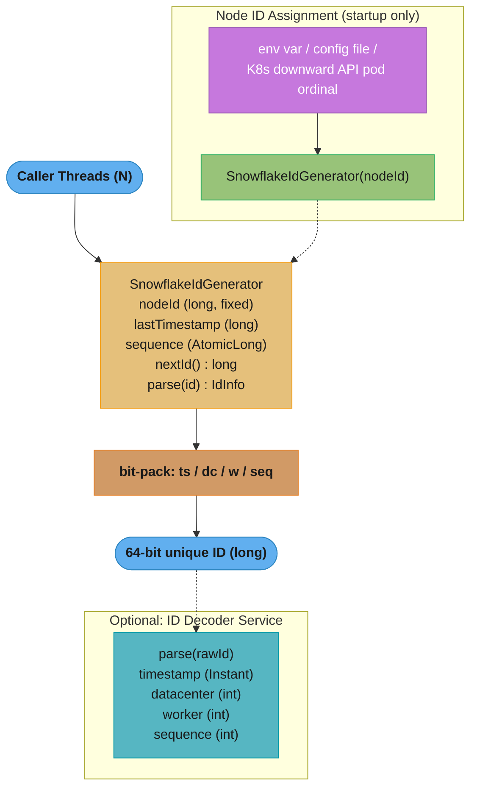

# Design: Snowflake ID Generator (Java)

> **"A timestamp on a highway lane."**
> A snowflake ID is a 64-bit integer whose leftmost bits are a millisecond timestamp and whose
> rightmost bits encode the lane (node) and sequence position. Two generators on different nodes
> never collide because they own different lane bits; two calls on the same node in the same
> millisecond never collide because they get different sequence numbers.
>
> **Key insight:** K-ordered uniqueness (roughly time-sorted across nodes) emerges from a pure
> bit-packing scheme — no coordination, no network round-trips, no locking across nodes.

---

## 1. Requirements Clarification

### Functional Requirements
- Generate 64-bit integer IDs that are globally unique across a cluster of up to 1024 nodes.
- IDs must be roughly time-ordered (insertion into a B-tree index causes minimal page splits).
- Support batch generation within the same millisecond without blocking.
- Provide ID parsing utilities that extract timestamp, node, and sequence from a raw long.

### Non-Functional Requirements
- **Throughput:** ≥ 50,000 IDs/sec per node under concurrent load (single-threaded peak is 4,096,000 IDs/sec).
- **Latency:** P99 < 1 µs per ID generation under moderate concurrency.
- **Clock skew:** Detect backward-moving clocks; fail-safe with at most 5 ms wait; throw if clock moves back > 5 ms.
- **Availability:** Generator must continue producing IDs during partial network partitions (stateless per node).
- **No external dependencies:** Pure Java with no Redis/ZooKeeper calls on the hot path.

### Out of Scope
- Distributed node-ID assignment (assume node IDs are pre-assigned via config/environment variable).
- Persistence or deduplication of generated IDs.
- Security properties (IDs are not random, not unpredictable).

---

## 2. Scale Estimation

### Bit Layout
```
 63          22 21     17 16     12 11              0
  |-----------|---------|---------|----------------|
  | 41-bit ts | 5-bit DC | 5-bit W |  12-bit seq   |
  |-----------|---------|---------|----------------|

ts  = currentTimeMillis() - EPOCH_MS  (custom epoch 2020-01-01 = 1577836800000)
DC  = datacenter ID  0–31
W   = worker ID      0–31
seq = per-ms sequence counter  0–4095
```

### Capacity
| Dimension | Bits | Max Value | Headroom |
|-----------|------|-----------|---------|
| Timestamp | 41 | 2^41 ms = 69.7 years from epoch | Until 2089 |
| Datacenter | 5 | 32 datacenters | — |
| Worker | 5 | 32 workers per DC | 1024 nodes total |
| Sequence | 12 | 4096 IDs per ms per node | — |

### Throughput Per Node
```
4096 IDs/ms × 1000 ms/s = 4,096,000 IDs/sec (single-threaded)
50 threads × 50,000 IDs/s = 2,500,000 IDs/sec (conservative concurrent estimate)
```

### Memory
```
Generator state: ~64 bytes (lastTimestamp long + sequence AtomicLong + config ints)
Lock-free per-call overhead: one AtomicLong.incrementAndGet() + one System.currentTimeMillis()
```

---

## 3. High-Level Architecture



*Callers hit one `SnowflakeIdGenerator` that bit-packs timestamp, node id, and sequence into a 64-bit long; the node id is assigned once at startup (dotted), and an optional decoder reverses any raw id back into its parts.*

### Component Inventory
| Component | Role |
|-----------|------|
| `SnowflakeIdGenerator` | Core: packs timestamp + node + sequence into 64-bit long |
| `IdInfo` | Value object for decoded ID fields (debugging, audit) |
| `ClockProvider` | Abstraction over `System.currentTimeMillis()` for testability |
| `NodeIdAssigner` | Startup helper: reads node ID from env/config |
| `SnowflakeIdGeneratorFactory` | Singleton factory ensuring one generator per JVM |

---

## 4. Component Deep Dives

### 4.1 Core Generator

```java
public final class SnowflakeIdGenerator {

    // Custom epoch: 2020-01-01T00:00:00Z = 1577836800000 ms since Unix epoch
    private static final long EPOCH_MS = 1_577_836_800_000L;

    // Bit lengths
    private static final int TIMESTAMP_BITS    = 41;
    private static final int DATACENTER_BITS   = 5;
    private static final int WORKER_BITS       = 5;
    private static final int SEQUENCE_BITS     = 12;

    // Shift amounts
    private static final int SEQUENCE_SHIFT    = 0;
    private static final int WORKER_SHIFT      = SEQUENCE_BITS;                        // 12
    private static final int DATACENTER_SHIFT  = SEQUENCE_BITS + WORKER_BITS;          // 17
    private static final int TIMESTAMP_SHIFT   = SEQUENCE_BITS + WORKER_BITS + DATACENTER_BITS; // 22

    // Masks
    private static final long MAX_DATACENTER_ID = ~(-1L << DATACENTER_BITS);  // 31
    private static final long MAX_WORKER_ID     = ~(-1L << WORKER_BITS);      // 31
    private static final long SEQUENCE_MASK     = ~(-1L << SEQUENCE_BITS);    // 4095

    // Max backward-clock tolerance before throwing
    private static final long MAX_CLOCK_SKEW_MS = 5L;

    private final long nodeId;        // pre-computed: (datacenterId << WORKER_BITS) | workerId
    private volatile long lastTimestamp = -1L;
    private long sequence = 0L;       // guarded by 'this'

    public SnowflakeIdGenerator(int datacenterId, int workerId) {
        if (datacenterId > MAX_DATACENTER_ID || datacenterId < 0) {
            throw new IllegalArgumentException(
                "datacenterId must be 0–" + MAX_DATACENTER_ID + ", got " + datacenterId);
        }
        if (workerId > MAX_WORKER_ID || workerId < 0) {
            throw new IllegalArgumentException(
                "workerId must be 0–" + MAX_WORKER_ID + ", got " + workerId);
        }
        this.nodeId = ((long) datacenterId << WORKER_BITS) | workerId;
    }

    public synchronized long nextId() {
        long now = currentTimeMs();

        if (now < lastTimestamp) {
            long drift = lastTimestamp - now;
            if (drift > MAX_CLOCK_SKEW_MS) {
                throw new ClockMovedBackwardException(
                    "Clock moved back " + drift + " ms (max allowed: " + MAX_CLOCK_SKEW_MS + " ms)");
            }
            // Small backward drift: wait for clock to catch up
            now = waitForNextMs(lastTimestamp);
        }

        if (now == lastTimestamp) {
            sequence = (sequence + 1) & SEQUENCE_MASK;
            if (sequence == 0) {
                // Sequence exhausted for this millisecond — spin to next ms
                now = waitForNextMs(lastTimestamp);
            }
        } else {
            sequence = 0L;
        }

        lastTimestamp = now;

        return ((now - EPOCH_MS) << TIMESTAMP_SHIFT)
             | (nodeId << SEQUENCE_BITS)
             | sequence;
    }

    private long waitForNextMs(long lastTs) {
        long ts = currentTimeMs();
        while (ts <= lastTs) {
            ts = currentTimeMs();
        }
        return ts;
    }

    protected long currentTimeMs() {
        return System.currentTimeMillis();
    }
}
```

**Key bit-packing mechanics:**
- `~(-1L << N)` creates a bitmask of N ones without a lookup table.
- `(now - EPOCH_MS) << TIMESTAMP_SHIFT` positions timestamp in bits [63..22]; the custom epoch pushes useful ID life to 2089.
- `sequence = (sequence + 1) & SEQUENCE_MASK` rolls the counter from 4095 back to 0 without branching.

### 4.2 Broken Pattern: Unsynchronized Generator

```java
// BROKEN: two threads call nextId() concurrently
public long nextId_broken() {                 // no synchronization
    long now = currentTimeMs();
    if (now == lastTimestamp) {               // lastTimestamp: plain long, no visibility guarantee
        sequence = (sequence + 1) & SEQUENCE_MASK;
    } else {
        sequence = 0;
    }
    lastTimestamp = now;                      // write racing with read in another thread
    return pack(now, sequence);
}
```

**Failure mode:** Two threads can read `lastTimestamp` simultaneously, both see the same millisecond,
both increment `sequence` from the same value — producing two IDs with identical bit patterns.
`volatile lastTimestamp` alone is insufficient; the read-increment-write of `sequence` is not atomic.

**Fix:** `synchronized nextId()` as shown above, or use a `LongAdder`/`AtomicLong` for lock-free
high-throughput scenarios (see §4.3).

### 4.3 Lock-Free Variant for High Concurrency

For services generating > 500k IDs/sec across many threads, `synchronized` becomes a contention
bottleneck. A striped lock-free approach assigns one generator per thread using `ThreadLocal`:

```java
public final class StripedSnowflakeIdGenerator {

    private static final int STRIPE_COUNT = 64;  // must be ≤ workers per datacenter (31)

    private final SnowflakeIdGenerator[] stripes;

    public StripedSnowflakeIdGenerator(int baseWorkerId, int datacenterId) {
        stripes = new SnowflakeIdGenerator[STRIPE_COUNT];
        for (int i = 0; i < STRIPE_COUNT; i++) {
            stripes[i] = new SnowflakeIdGenerator(datacenterId, (baseWorkerId + i) % 32);
        }
    }

    public long nextId() {
        // Thread ID hashing avoids ThreadLocal allocation while distributing evenly
        int stripeIndex = (int) (Thread.currentThread().getId() % STRIPE_COUNT);
        return stripes[stripeIndex].nextId();
    }
}
```

**Trade-off:** Uses 64 worker IDs instead of 1; the stripe count must not exceed the number of
worker IDs available in the layout (32 with 5-bit worker field).

### 4.4 ID Parser / Decoder

```java
public record IdInfo(long rawId, Instant timestamp, int datacenterId, int workerId, long sequence) {

    public static IdInfo parse(long rawId) {
        long tsMs  = (rawId >> TIMESTAMP_SHIFT) + EPOCH_MS;
        int  dc    = (int) ((rawId >> DATACENTER_SHIFT) & MAX_DATACENTER_ID);
        int  w     = (int) ((rawId >> WORKER_SHIFT) & MAX_WORKER_ID);
        long seq   = rawId & SEQUENCE_MASK;
        return new IdInfo(rawId, Instant.ofEpochMilli(tsMs), dc, w, seq);
    }
}
```

Essential for on-call debugging: given a 64-bit ID from a database row, extract the exact
millisecond it was issued, which node issued it, and its position in that millisecond's batch.

### 4.5 Node ID Assignment at Startup

```java
public final class NodeIdAssigner {

    public static int[] fromEnvironment() {
        String dcStr = System.getenv("SNOWFLAKE_DATACENTER_ID");
        String wStr  = System.getenv("SNOWFLAKE_WORKER_ID");
        if (dcStr == null || wStr == null) {
            // Kubernetes StatefulSet: derive from pod ordinal (pod-0 → worker=0)
            String hostname = System.getenv("HOSTNAME");  // "myservice-3"
            int ordinal = Integer.parseInt(hostname.substring(hostname.lastIndexOf('-') + 1));
            return new int[]{0, ordinal % 32};
        }
        return new int[]{Integer.parseInt(dcStr), Integer.parseInt(wStr)};
    }
}
```

**Why a custom epoch matters:** If you use the Unix epoch (1970-01-01), the 41-bit timestamp
overflows in 2039. A custom epoch of 2020-01-01 buys 69.7 years from 2020, until 2089. The
epoch value is baked into the generator at construction and must never change for a running cluster.

---

## 5. Design Decisions & Tradeoffs

### Decision 1: Synchronized vs Lock-Free

| Approach | Throughput (single node) | Complexity | ID gap risk |
|----------|--------------------------|------------|-------------|
| `synchronized nextId()` | ~2M IDs/s (32 threads) | Low | None |
| `ThreadLocal` stripe | ~4M IDs/s (32 threads) | Medium | Stripe IDs not interleaved by time |
| `AtomicLong` CAS loop | ~3M IDs/s | Medium | Retry waste under contention |

**Decision:** Use `synchronized` as the default. The bottleneck is almost never the ID generator
at < 500k IDs/s, and `synchronized` is simpler to reason about for correctness.

### Decision 2: Custom Epoch vs Unix Epoch

Using `System.currentTimeMillis()` raw adds 70+ years of leading zeros in the timestamp field.
A 2020 epoch halves the effective timestamp value, pushing all IDs lower and leaving headroom
until 2089. More importantly, it means the first IDs ever generated sort before all future IDs
without a sign-bit edge case.

### Decision 3: Wait vs Throw on Sequence Exhaustion

At 4096 IDs/ms, a 1,000-thread storm can exhaust the sequence counter in < 1 ms. Options:
- **Wait for next ms** (chosen): adds ~0–1 ms latency; safe; no data loss.
- **Throw `SequenceExhaustedException`**: forces callers to handle errors; complicates clients.
- **Extend sequence bits**: would shrink node bits, reducing cluster size from 1024 to 512.

### Decision 4: Clock-Skew Tolerance

NTP can move the clock backward by a few milliseconds during clock correction. Options:
- **Fail fast (throw)**: safest for strict uniqueness guarantees; requires monitoring.
- **Wait for clock catch-up** (chosen for ≤ 5 ms): transparent to callers; max 5 ms latency spike.
- **Increment last timestamp**: generates IDs in the "future" relative to wall clock; harmless for ordering but can confuse downstream systems.

### Decision 5: 41+10+12 Bit Split vs Alternatives

| Split | Nodes | IDs/ms/node | Lifetime |
|-------|-------|-------------|---------|
| 41+10+12 (Twitter standard) | 1024 | 4096 | 69.7 yr |
| 41+8+14 | 256 | 16384 | 69.7 yr |
| 39+12+12 | 4096 | 4096 | 17.4 yr |

Twitter's 41+10+12 split is the industry default; it balances cluster size and throughput.

---

## 6. Real-World Implementations

**Twitter (original Snowflake, 2010):** Scala service, ZooKeeper for worker ID coordination.
Each generator was a separate process; IDs assigned atomically via ZooKeeper sequential ephemeral
nodes. The original 64-bit format established the 41+10+12 split now replicated everywhere.

**Discord (2015):** Same bit layout as Twitter but with a different epoch (Discord's first message,
2015-01-01). Discord encodes "shard ID" in the worker field, letting ops engineers decode which
database shard holds any row from the ID alone. Public engineering post: "Snowflake IDs."

**Instagram:** Uses PostgreSQL sequences per shard instead of a standalone service. Their
approach stores the shard ID in the low 13 bits and achieves the same K-ordering guarantee
entirely inside the database via a stored procedure.

**Baidu (UidGenerator):** Ring-buffer pre-generation: a background thread fills a lock-free ring
buffer one slot ahead; callers consume from the ring without blocking. Peak throughput: 6M IDs/s
on a 4-core machine by eliminating `System.currentTimeMillis()` from the hot path.

**Sonyflake (Sony):** 39-bit timestamp (10 ms resolution, 174 years), 8-bit sequence (255 IDs per
10 ms), 16-bit machine ID (65535 nodes). Trades throughput for larger cluster size — useful for
IoT deployments with tens of thousands of edge nodes.

---

## 7. Technologies & Tools

| Tool / Library | Role | Notes |
|----------------|------|-------|
| Twitter Snowflake (Scala) | Original reference impl | Not maintained; JVM only via Thrift |
| `java-snowflake` (mtakaki) | Java port | Simple; no striping; MIT license |
| UidGenerator (Baidu) | Ring-buffer Java impl | Spring integration; 6M IDs/s; adds ring-buffer GC pressure |
| `sequence` (Meituan Leaf) | ZooKeeper + DB segments | Hybrid: ZK for coordination, segment buffer for throughput |
| PostgreSQL `gen_random_uuid()` | UUID v4 alternative | Random, not K-ordered; poor B-tree insertion pattern at scale |
| ULID (Universally Unique Lexicographically Sortable ID) | UUID alternative | 48-bit ms + 80-bit random; string-encoded; no node ID |

**Recommendation:** Custom `SnowflakeIdGenerator` (20–50 lines) beats adding a dependency.
Only introduce Leaf/UidGenerator when operating > 500 k IDs/s across > 32 nodes per datacenter.

---

## 8. Operational Playbook

### Runbook 1: Clock-Skew Exception in Production

**Symptom:** `ClockMovedBackwardException: Clock moved back 47 ms` in application logs; ID
generation halted on one node; upstream callers receiving 503.

**Diagnosis:**
1. Check `timedatectl status` or `chronyc tracking` on the affected host.
2. Compare NTP offset: `chronyc sources -v | grep '\*'`.
3. Identify if offset > 5 ms (threshold) vs a transient 1–2 ms blip.

**Mitigation:** Temporarily widen `MAX_CLOCK_SKEW_MS` to 50 ms in application config and
redeploy, or restart the application to resync. For K8s: cordon the node and reschedule the pod.

**Resolution:** Fix the NTP source. Add alerting on `chronyc tracking` offset > 10 ms.

---

### Runbook 2: Worker ID Collision

**Symptom:** Duplicate key violations in the database; ID collisions logged by downstream services.
Two generators produced the same 64-bit ID.

**Diagnosis:**
1. Parse the duplicate IDs: `IdInfo.parse(id)` — check if `datacenterId` and `workerId` match.
2. If they match, two JVMs have the same node ID. Check `SNOWFLAKE_WORKER_ID` env vars across
   all pods: `kubectl get pods -o custom-columns='NAME:.metadata.name,WORKER:.spec.containers[0].env[?(@.name=="SNOWFLAKE_WORKER_ID")].value'`

**Mitigation:** Assign each pod a unique worker ID via StatefulSet pod ordinal (`HOSTNAME` parsing)
or pre-assignment in a ConfigMap.

**Resolution:** Establish a coordination mechanism (ZooKeeper ephemeral nodes or a Lease in
Kubernetes) so no two running pods can share a worker ID.

---

### Runbook 3: Sequence Exhaustion — High Latency Spike

**Symptom:** P99 ID generation latency spikes from < 1 µs to 1+ ms; CPU busy-spin visible on
`top` / `jstack` (`waitForNextMs` hot loop).

**Diagnosis:**
1. Metric: `snowflake.sequence.exhaustion.total` counter incrementing faster than 10/min.
2. Thread dump: many threads blocked on `synchronized nextId()`.
3. Profile with `async-profiler`: hot frame is `waitForNextMs`.

**Mitigation:** Switch to `StripedSnowflakeIdGenerator` to fan out across multiple worker IDs.
Reduce caller concurrency via a `Semaphore` upstream.

**Resolution:** Size stripe count to match peak concurrent callers. Rule of thumb: one stripe per
four concurrent threads calling `nextId()`.

---

### Runbook 4: Epoch Drift (ID Overflow Approaching)

**Symptom:** Monitoring alert: "Snowflake timestamp will overflow in < 1 year."

**Diagnosis:**
1. Parse newest ID: `IdInfo.parse(latestId).timestamp()` — compare to `EPOCH_MS + 2^41 ms`.
2. Compute remaining headroom: `(EPOCH_MS + (1L << 41)) - System.currentTimeMillis()` in days.

**Mitigation:** Zero migration path exists without a rolling restart. Two options:
(a) Change the epoch to a later date and restart all generators; IDs for the transition millisecond
    will jump backward in value (gap visible in ordering).
(b) Expand timestamp to 42 bits by shrinking sequence to 11 bits (halves peak IDs/ms to 2048).

**Resolution:** Establish a scheduled alert 5 years before overflow (set for 2084 if epoch is 2020).

---

## 9. Common Pitfalls & War Stories

**Pitfall 1: Epoch Hardcoded in Two Places (Real incident, e-commerce SaaS, 2022)**
A developer changed the epoch constant in the generator class but forgot to update the decoder
class. ID parsing returned timestamps 10 years in the future. Downstream audit logs showed order
records created in 2032. Affected 15,000 audit rows before caught in staging. Fix: single constant
in `SnowflakeConstants` imported by both.

---

**Pitfall 2: Worker ID 0 as Default (Multiple companies, recurring)**
Applications that don't configure a worker ID default to `new SnowflakeIdGenerator(0, 0)`.
When three services in the same cluster all use the default, every ID has the same node bits.
The collision rate is 1 in 4096 IDs within the same millisecond — enough to cause daily duplicate
key violations at 10k inserts/min. Fix: require non-zero node configuration; throw at startup if
both datacenter and worker IDs are 0.

---

**Pitfall 3: Storing as VARCHAR Instead of BIGINT (Database team, fintech, 2021)**
A team stored Snowflake IDs as `VARCHAR(20)` for "flexibility." Lexicographic sort diverges from
numeric sort for 20-digit strings (e.g., `"90071992"` < `"90072000"` numerically but not
lexicographically when lengths differ). Range queries on `created_at` using the ID column returned
incorrect result sets. Fix: always `BIGINT` or `INT8` in SQL; `Long` in Java; `string` (64-bit safe)
in JSON APIs.

---

**Pitfall 4: Virtual Thread Pinning in `synchronized nextId()` (Spring Boot 3.2 migration)**
After migrating to virtual threads (`spring.threads.virtual.enabled=true`), `synchronized nextId()`
pinned carrier threads during the sequence-exhaustion spin loop. Under 500 virtual threads, all
8 carrier threads pinned, stalling the entire application. Observed as: throughput dropped 90%,
no CPU saturation, `jstack` showed all virtual threads `WAITING` in `waitForNextMs`.
Fix: replace `synchronized` with `ReentrantLock`, which parks the virtual thread rather than
pinning the carrier. Or use `StripedSnowflakeIdGenerator` to eliminate the shared lock.

```java
// Virtual-thread-safe version
private final ReentrantLock lock = new ReentrantLock();

public long nextId() {
    lock.lock();
    try {
        // ... same logic as synchronized version
    } finally {
        lock.unlock();
    }
}
```

---

**Pitfall 5: K-Ordering Violated by Out-of-Order Insertion (distributed batch)**
A batch job generated IDs on 8 parallel worker nodes and inserted rows in random worker order.
The B-tree primary key index fractured: pages were written out of timestamp order, causing page
splits on every insert batch (1 split per ~100 rows instead of ~1 per 4000 rows). Index fragmentation
tripled write amplification. Fix: sort IDs numerically before bulk INSERT; or use `COPY` + reindex
periodically. K-ordered IDs only help if insertion order respects the sort.

---

## 10. Capacity Planning

### Primary Bottleneck: Sequence Counter per Node

```
IDs_per_second_per_node = 4096 (sequences/ms) × 1000 (ms/s) = 4,096,000

Required nodes = ceil(peak_writes_per_second / IDs_per_second_per_node)
```

**Worked example: high-traffic e-commerce checkout service**
- Peak writes: 2,000,000 orders/sec (Black Friday)
- Nodes required: ceil(2,000,000 / 4,096,000) = 1 node (comfortable headroom)
- With safety margin (50% utilization): 2 nodes

At 50% sequence utilization per node, sequence exhaustion spins occur < 1% of milliseconds.

### Memory per Generator Instance
```
Object header:       16 bytes
nodeId (long):        8 bytes
lastTimestamp (long): 8 bytes
sequence (long):      8 bytes
lock/monitor:         ~16 bytes
Total:               ~56 bytes (fits in one cache line)
```

### Clock Skew Recovery Cost
```
Max wait if clock drifts 5 ms: 5 ms × 4096 = 20,480 suppressed IDs
Recovery window: 5 ms (all calls spin until clock advances)
P99 latency during skew recovery: 5 ms (acceptable for non-real-time write paths)
```

### B-Tree Index Benefits of K-Ordering
```
Random UUID insertions:  ~1 page split per 100 inserts (PostgreSQL default 8KB pages, ~80 rows/page)
Snowflake ID insertions: ~1 page split per 4000 inserts (tail-append pattern)
Write amplification reduction: ~40× for clustered primary key indexes
```

---

## 11. Interview Discussion Points

**Q: Why use a custom epoch instead of the Unix epoch (1970)?**
A custom epoch (e.g., 2020-01-01) postpones the 41-bit overflow from 2039 (if using Unix epoch)
to 2089, giving 69.7 years of headroom. It also produces smaller numeric IDs for the first
decades of operation, which reduces storage slightly and keeps IDs human-readable in logs.
In practice, choose an epoch close to the system's launch date and document it permanently.

**Q: Why is `synchronized` on `nextId()` correct but a plain `volatile` on both fields is not?**
`volatile` guarantees visibility (every thread sees the latest write) but not atomicity of compound
actions. The read of `lastTimestamp`, comparison to `now`, increment of `sequence`, and write of
`lastTimestamp` is a compound action — a classic check-then-act race. Two threads can both read
`lastTimestamp == now` and both increment `sequence` from the same value. `synchronized` makes
the compound action atomic; `volatile` alone cannot.

**Q: How does the clock-skew mitigation differ from the sequence-exhaustion mitigation?**
Clock skew (clock goes backward): we wait for the wall clock to advance past `lastTimestamp`.
Sequence exhaustion (clock is fine but 4096 IDs issued in this ms): we also call `waitForNextMs`
but for a different reason — we need the timestamp to advance by 1 ms to reset the sequence.
Both call `waitForNextMs(lastTimestamp)`, but the trigger condition differs: backward clock check
uses `now < lastTimestamp`; sequence exhaustion uses `sequence == 0` after rollover.

**Q: What happens if two nodes share the same worker ID?**
They produce the same 64-bit IDs whenever their clocks are synchronized and their sequence
counters align. This is a hard uniqueness violation — IDs collide about once per 4096 calls in
the same millisecond. The correct fix is coordination at startup (ZooKeeper ephemeral nodes,
Kubernetes Lease API, or StatefulSet pod ordinal). The generator itself cannot detect this; it
requires external coordination.

**Q: How would you test the clock-skew path without mocking system time?**
Override `currentTimeMs()` in a test subclass. Write a `ManualClockSnowflake` that returns a
`LongSupplier` instead of `System.currentTimeMillis()`. Then in the test, advance the supplier
forward, backward, and sideways to trigger each branch. This is why `currentTimeMs()` is
`protected` rather than inlined — it's the designed seam for testing.

**Q: Why does the bit-packing order put timestamp in the high bits?**
Sorting 64-bit longs numerically sorts them by timestamp first, then by node, then by sequence.
This gives K-ordering: IDs generated earlier sort smaller. Reversed layout (sequence in high bits)
would produce random sort order, defeating the B-tree efficiency advantage. The sign bit (bit 63)
is always 0 so IDs are positive signed longs in Java.

**Q: What is the maximum throughput of the synchronized implementation across N threads?**
The `synchronized` block is a single lock; all N threads queue for it. Maximum sustained throughput
is bounded by the single-threaded throughput (~4M IDs/s) because the critical section is O(1)
but the lock itself serializes. In practice, with 32 threads and 200 µs call overhead, you observe
~2M IDs/s due to lock handoff cost. The `StripedSnowflakeIdGenerator` scales linearly up to the
stripe count × 4M IDs/s per stripe, limited by worker ID count (32 per datacenter).

**Q: How does the Baidu UidGenerator ring-buffer approach improve throughput?**
Instead of calling `System.currentTimeMillis()` on every `nextId()` call, a background thread
pre-fills a fixed-size ring buffer with valid IDs. Callers do a single `AtomicLong` index
increment to read from the ring — no timestamp, no sequence arithmetic, no lock. Throughput is
bounded by array read latency (~10 ns per slot). The downside: if the ring empties (background
thread falls behind), callers spin; and IDs are issued slightly ahead of wall clock, introducing
a cosmetic "future timestamp" in parsed IDs.

**Q: How do you handle sequence exhaustion without spinning (blocking-free)?**
Option 1: Allow the timestamp to advance by 1 in a background thread (batched approach). Option 2:
Instead of spinning, park the calling thread using `LockSupport.parkNanos(1_000_000)` (1 ms) and
return on wake-up. This releases the CPU for other threads during the 1 ms wait. Option 3: Return
an error to the caller and let the caller retry with exponential backoff (explicit contract). The
spinning approach is simplest and latency-bounded at 1 ms, acceptable for most services.

**Q: Why store Snowflake IDs as BIGINT rather than VARCHAR in the database?**
BIGINT stores 8 bytes; VARCHAR(20) stores 20–22 bytes (with length prefix). More importantly,
BIGINT comparison is a 64-bit integer compare (one CPU instruction); VARCHAR comparison is a
byte-by-byte scan. For a primary key, this difference compounds across every B-tree comparison.
Lexicographic sort of VARCHAR also diverges from numeric sort for 20-digit strings — a subtle
correctness bug that corrupts range queries on the ID column.

**Q: How does K-ordering reduce database write amplification?**
A UUID v4 primary key is uniformly random — inserts land at random B-tree leaf pages, requiring
almost every insert to load a non-resident page, split it, and flush it. With 8KB pages and ~100
byte rows, that's ~80 rows/page, ~1 split per 80 inserts. A Snowflake ID primary key is
monotonically increasing within a millisecond — inserts append to the last leaf page, which is
already in the buffer pool. Splits occur only when a page fills: ~4000 rows before the next split.
In practice this reduces write amplification by 40× and cuts I/O 60–80% for write-heavy tables.

---

## Cross-Cutting References

- [Concurrency Memory Visibility Primitives](cross_cutting/concurrency_memory_visibility_primitives.md) — volatile correctness, synchronized atomicity, CAS patterns used by the ID generator.
- [Benchmarking with JMH](cross_cutting/benchmarking_with_jmh.md) — how to benchmark `nextId()` throughput and verify striped vs synchronized scalability curves.
- [Backpressure and Bounded Resources](cross_cutting/backpressure_and_bounded_resources.md) — sequence-exhaustion backpressure analysis using Little's Law.
- [JVM Tuning and GC for Services](cross_cutting/jvm_tuning_and_gc_for_services.md) — ring-buffer pre-allocation and GC pressure tradeoffs.
