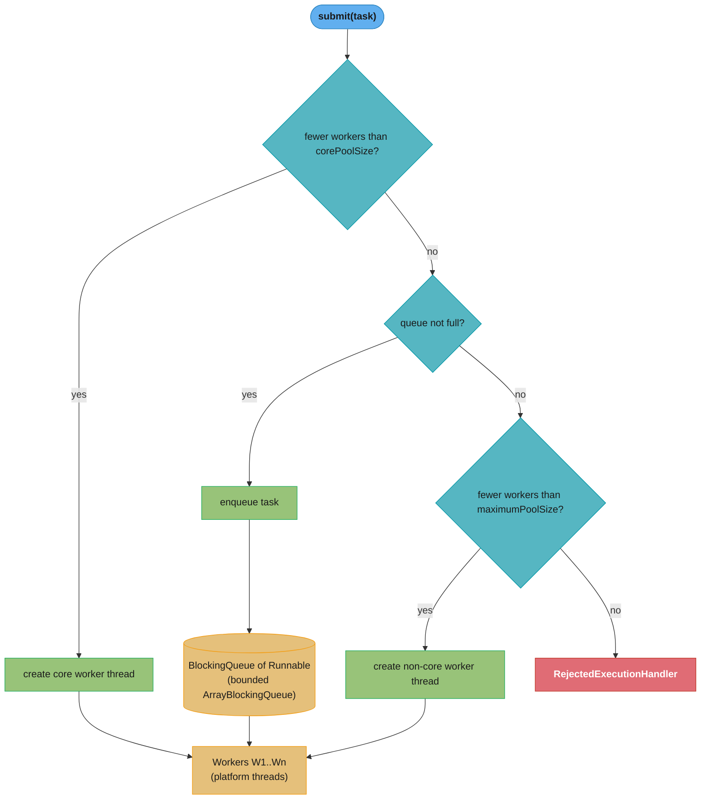
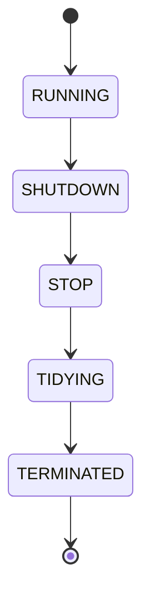

# Design a Custom Thread Pool (Java)

> **A thread pool is a pre-paid workforce.**  
> Creating a thread for every task pays a ~1ms recruitment fee every time. A pool pre-hires
> N workers who wait for assignments. The design challenge: how many workers to hire, how
> large a waiting room to maintain, and what to do when both are full.

**Key insight:** Java's `ThreadPoolExecutor` grows beyond `corePoolSize` only when the work
queue is *full* — not when all core threads are busy. This surprises most engineers.
Understanding this counter-intuitive queueing model is the foundation of correct pool sizing.

---

## 1. Requirements Clarification

### Functional requirements
- Submit `Runnable` and `Callable<T>` tasks for asynchronous execution
- Return a `Future<T>` allowing the caller to retrieve the result or cancel the task
- Support configurable core threads, max threads, work queue capacity, keep-alive timeout
- Execute a configurable `RejectedExecutionHandler` when the pool is at maximum capacity and queue is full
- Support graceful shutdown (finish queued + in-flight tasks) and immediate shutdown (cancel in-flight)
- Emit metrics: active threads, queue depth, completed tasks, rejection count

### Non-functional requirements
- **Submit latency**: <10 µs for a successful `submit()` under no contention
- **Throughput**: 1M+ task submissions/second on a 16-core machine (limited by CAS contention)
- **Memory**: predictable; no unbounded growth; each platform thread ~1MB stack
- **Thread safety**: all public methods must be safe for concurrent callers

### Out of scope
- Virtual threads (see `structured_concurrency_and_loom/`) — different lifecycle model
- Priority queues — use `PriorityBlockingQueue` as a drop-in, covered in §6
- Distributed task execution (see `design_event_bus.md` for cross-JVM dispatch)

---

## 2. Scale Estimation

**Sizing example — order processing service:**
```
Target throughput:  500 requests/sec
Average task time:  200ms (DB write + business logic)
Concurrency needed: L = λ × W = 500 × 0.2 = 100 threads (Little's Law)

For I/O-bound tasks (40% CPU, 60% waiting for DB):
  threads = λ × W = 500 × 0.2 = 100
  CPU cores needed: 100 × 0.4 = 40 CPUs
  On 8-core machine: 100 threads share 8 cores (12.5× over-subscription) → normal for I/O-bound

Queue size for 2-second burst absorption:
  queue = (λ_burst - μ) × T_burst = (1000 - 500) × 2 = 1000 items
  Memory: 1000 × ~500 bytes/task object ≈ 500 KB — negligible

Thread memory (platform threads):
  100 threads × 1MB stack = 100MB → reserve this in -Xss and total JVM heap budget

Submit() throughput at 100 core threads, no queue:
  CAS on AtomicInteger (worker count): ~50M ops/sec single-threaded
  At 16 threads: ~8M ops/sec (CAS contention)
  Well above 1M submission/sec requirement
```

---

## 3. High-Level Architecture





*The pool only grows past `corePoolSize` when the bounded queue is full (§4.4); the lifecycle state and the 29-bit worker count are packed together into one `ctl` `AtomicInteger` for atomic CAS transitions (bit layout in §4.1).*

**Component inventory:**
- `ctl` (`AtomicInteger`) — encodes lifecycle state (3 high bits) + active worker count (29 bits) in one atomic variable
- `workers` (`HashSet<Worker>`) — tracked under `mainLock` (`ReentrantLock`)
- `workQueue` (`BlockingQueue<Runnable>`) — holds pending tasks
- `ThreadFactory` — creates threads with configurable names, daemon flags, priorities
- `RejectedExecutionHandler` — defines overflow policy (Abort, CallerRuns, Discard, DiscardOldest)
- `termination` (`Condition` on `mainLock`) — `awaitTermination()` waits on this

**Data flow:**
1. `submit(task)` wraps `Callable` in `FutureTask` → calls `execute(futureTask)`
2. `execute` checks `ctl`: if workers < corePoolSize → `addWorker(task, true)` (core=true)
3. If queue not full → `workQueue.offer(task)`
4. If workers < maxPoolSize → `addWorker(task, false)` (non-core)
5. Else → `reject(task)`

---

## 4. Component Deep Dives

### 4.1 The `ctl` atomic control — understanding the 3-bit / 29-bit packing

```
ctl = AtomicInteger (32 bits)

Bits 31-29 (3 bits): runState
  111 = RUNNING     (-1 << 29 = 11100000...)
  000 = SHUTDOWN    (0 << 29)
  001 = STOP        (1 << 29)
  010 = TIDYING     (2 << 29)
  011 = TERMINATED  (3 << 29)

Bits 28-0 (29 bits): workerCount (max 536 million workers — more than enough)
```

```java
// From ThreadPoolExecutor source (simplified):
private static final int COUNT_BITS = Integer.SIZE - 3;  // 29
private static final int CAPACITY   = (1 << COUNT_BITS) - 1;

// Pack state + count into one int for atomic CAS:
private static int ctlOf(int rs, int wc) { return rs | wc; }
private static int runStateOf(int c)     { return c & ~CAPACITY; }
private static int workerCountOf(int c)  { return c & CAPACITY; }

// To add a worker: CAS increment worker count
private boolean compareAndIncrementWorkerCount(int expect) {
    return ctl.compareAndSet(expect, expect + 1);
}
```

This packing avoids a two-lock design for `(state, count)` — a single `compareAndSet` can
atomically check and update both state and count.

---

### 4.2 `addWorker` — the critical path

```java
private boolean addWorker(Runnable firstTask, boolean core) {
    retry:
    for (;;) {
        int c = ctl.get();
        int rs = runStateOf(c);

        // Check lifecycle: don't add workers if shutting down
        if (rs >= SHUTDOWN &&
            !(rs == SHUTDOWN && firstTask == null && !workQueue.isEmpty()))
            return false;

        for (;;) {
            int wc = workerCountOf(c);
            // core=true → compare against corePoolSize; false → compare against maximumPoolSize
            if (wc >= CAPACITY || wc >= (core ? corePoolSize : maximumPoolSize))
                return false;

            // CAS-increment worker count atomically
            if (compareAndIncrementWorkerCount(c))
                break retry;

            // CAS failed: re-read ctl and retry
            c = ctl.get();
            if (runStateOf(c) != rs)
                continue retry;
        }
    }

    // Worker count incremented; now create the actual thread + Worker
    boolean workerStarted = false;
    Worker w = new Worker(firstTask);    // Worker extends AQS — self is the lock
    Thread t = w.thread;
    final ReentrantLock mainLock = this.mainLock;
    mainLock.lock();
    try {
        int rs = runStateOf(ctl.get());
        if (rs < SHUTDOWN || (rs == SHUTDOWN && firstTask == null)) {
            workers.add(w);
            largestPoolSize = Math.max(largestPoolSize, workers.size());
        }
    } finally {
        mainLock.unlock();
    }
    t.start();    // Thread starts; Worker.run() calls runWorker(this)
    workerStarted = true;
    return workerStarted;
}
```

**Key insight from `addWorker`:** The outer CAS loop (on `ctl`) is lock-free — no mutex for
worker count updates. The `mainLock` is only held when mutating the `workers` HashSet (for
tracking and statistics). This design minimises contention on the hot submission path.

---

### 4.3 `runWorker` — the worker's task loop

```java
// Each Worker thread runs this loop until pool shutdown or keepAlive expires
final void runWorker(Worker w) {
    Thread wt = Thread.currentThread();
    Runnable task = w.firstTask;
    w.firstTask = null;

    try {
        while (task != null || (task = getTask()) != null) {
            w.lock();    // Worker extends AQS; lock = "this worker is busy"
            try {
                beforeExecute(wt, task);    // hook for subclasses
                try {
                    task.run();
                } finally {
                    afterExecute(task, null);   // hook for subclasses
                }
            } finally {
                task = null;
                w.completedTasks++;
                w.unlock();
            }
        }
    } finally {
        processWorkerExit(w, false);    // remove from workers; may create replacement
    }
}

private Runnable getTask() {
    boolean timedOut = false;
    for (;;) {
        int c = ctl.get();
        int rs = runStateOf(c);
        if (rs >= SHUTDOWN && (rs >= STOP || workQueue.isEmpty())) {
            decrementWorkerCount();
            return null;    // signal runWorker to exit
        }

        int wc = workerCountOf(c);
        // Timed wait if: allowCoreThreadTimeOut OR worker count > corePoolSize
        boolean timed = allowCoreThreadTimeOut || wc > corePoolSize;

        if ((wc > maximumPoolSize || (timed && timedOut))
                && (wc > 1 || workQueue.isEmpty())) {
            if (compareAndDecrementWorkerCount(c))
                return null;    // this worker should exit
            continue;
        }

        try {
            Runnable r = timed ?
                workQueue.poll(keepAliveTime, TimeUnit.NANOSECONDS) :
                workQueue.take();     // blocks until task or interrupt
            if (r != null)
                return r;
            timedOut = true;
        } catch (InterruptedException retry) {
            timedOut = false;
        }
    }
}
```

**Why Worker extends AQS:** The `Worker` uses itself as an AQS-backed non-reentrant lock.
This allows the pool to distinguish idle workers (lock not held) from active workers (lock held)
without a separate flag — useful for `shutdownNow()` which only interrupts workers that are
actively running a task (not blocked on `workQueue.take()`).

---

### 4.4 Broken pattern — expecting pool growth when core threads are busy

**Broken:**
```java
// Developer expects: submit 20 tasks → pool grows from 4 to 8 (toward maximumPoolSize=8)
ThreadPoolExecutor pool = new ThreadPoolExecutor(
    4,                              // corePoolSize
    8,                              // maximumPoolSize
    60L, TimeUnit.SECONDS,
    new LinkedBlockingQueue<>()     // UNBOUNDED queue!
);

// Submit 20 tasks when 4 core threads are busy:
// ACTUAL BEHAVIOUR: all 20 tasks go into the unbounded queue
// Pool stays at 4 threads; maximumPoolSize=8 is NEVER triggered
// because the queue is never full!
for (int i = 0; i < 20; i++) pool.submit(heavyTask);
```

**Fixed — understanding the growth model:**
```java
// The pool grows to maximumPoolSize ONLY when the queue is FULL
ThreadPoolExecutor pool = new ThreadPoolExecutor(
    4,                              // corePoolSize
    8,                              // maximumPoolSize
    60L, TimeUnit.SECONDS,
    new ArrayBlockingQueue<>(4)     // BOUNDED queue: only 4 pending tasks
);

// Now: submit 20 tasks when 4 core threads are busy:
// Tasks 1-4:  core threads are busy → go into queue (4 slots)
// Task 5:     queue FULL → pool grows (5th thread created, up to max=8)
// Tasks 5-8:  similar growth up to 8 threads
// Task 9+:    pool at max (8) AND queue full → RejectedExecutionHandler fires
```

**Rule:** `maximumPoolSize` is only relevant when using a bounded queue. With `LinkedBlockingQueue`
(unbounded), the pool will NEVER grow beyond `corePoolSize`.

---

### 4.5 Graceful shutdown

```java
public class OrderProcessorPool {

    private final ThreadPoolExecutor executor;

    public OrderProcessorPool() {
        this.executor = new ThreadPoolExecutor(
            8, 32,
            60, TimeUnit.SECONDS,
            new ArrayBlockingQueue<>(1000),
            new ThreadFactoryBuilder().setNameFormat("order-pool-%d").build(),
            new ThreadPoolExecutor.CallerRunsPolicy()
        );
    }

    // Called on application shutdown (Spring @PreDestroy)
    public void shutdown() throws InterruptedException {
        executor.shutdown();    // no new tasks accepted; drain the queue

        if (!executor.awaitTermination(30, TimeUnit.SECONDS)) {
            log.warn("Pool did not terminate in 30s; forcing shutdown");
            List<Runnable> droppedTasks = executor.shutdownNow();
            log.error("{} tasks were aborted", droppedTasks.size());

            if (!executor.awaitTermination(5, TimeUnit.SECONDS)) {
                log.error("Pool did not terminate after shutdownNow");
            }
        }
    }
}
```

`shutdown()` vs `shutdownNow()`:
- `shutdown()`: SHUTDOWN state; no new tasks; workers drain queue; completes naturally
- `shutdownNow()`: STOP state; interrupts all workers; returns unstarted tasks; in-flight tasks interrupted if they respond to `Thread.interrupted()`

---

## 5. Design Decisions & Tradeoffs

### Decision 1: `ArrayBlockingQueue` vs `LinkedBlockingQueue` for the work queue

| | `ArrayBlockingQueue(n)` | `LinkedBlockingQueue()` | `SynchronousQueue` |
|--|------------------------|------------------------|-------------------|
| Bounded | Yes (capacity=n) | No (Integer.MAX_VALUE) | No buffer |
| Memory | Contiguous array (cache-friendly) | Node-per-task (GC pressure) | Zero |
| Backpressure | Rejects at capacity | Never rejects (OOM) | Immediate handoff |
| When to use | Production services | Never for services | High-throughput, immediate consumption |

**Recommendation:** Always `ArrayBlockingQueue(n)` in production. `LinkedBlockingQueue` without
a capacity creates an OOM bomb — at 10k tasks/s surplus for 60 seconds = 600k objects.

### Decision 2: Rejection policy

| Policy | Behaviour | Best for |
|--------|-----------|---------|
| `AbortPolicy` | Throws `RejectedExecutionException` | Fail-fast; caller decides |
| `CallerRunsPolicy` | Caller thread executes the task | HTTP serving; naturally throttles |
| `DiscardPolicy` | Silently drops | Metrics; telemetry |
| `DiscardOldestPolicy` | Drops oldest queued; retries | Freshness matters; stale work useless |

### Decision 3: Core thread count for I/O-bound vs CPU-bound tasks

| Workload | Formula | Example (8-core) |
|---------|---------|-----------------|
| CPU-bound | `threads = nCPUs + 1` | 9 threads |
| I/O-bound | `threads = nCPUs × (1 + W/S)` | W=DB wait 200ms, S=CPU 100ms → 8 × 3 = 24 |
| Mixed | Profile with JFR; target 70% CPU utilisation | Typically nCPUs × 2 to 4 |

### Decision 4: `corePoolSize = maximumPoolSize` for simpler reasoning

Many production systems set `corePoolSize = maximumPoolSize` and size the pool at the maximum
needed concurrency. This removes the queue-triggers-growth complexity: pool is always at max
size, tasks go into the bounded queue, CallerRunsPolicy fires at overflow. Simpler mental model;
slight memory overhead (idle threads at ~1MB stack each).

### Decision 5: `keepAliveTime` and thread churn

Setting `keepAliveTime` too short (e.g., 1s) with bursty traffic causes threads to be created
and destroyed repeatedly — each creation is ~1ms. For services with predictable burst patterns,
set `keepAliveTime = 60s–300s` (1–5 min). For services with long idle periods between bursts,
allow `allowCoreThreadTimeOut(true)` with a shorter timeout.

| Approach | Thread churn | Memory efficiency | Use case |
|----------|-------------|------------------|---------|
| `keepAlive=60s`, core=max | Low churn | Less efficient (idle threads) | Steady-load services |
| `keepAlive=1s`, small core | High churn | Memory efficient | Bursty, long idle intervals |
| `allowCoreThreadTimeOut=true` | Moderate | Highest | Batch jobs, scheduled tasks |

---

## 6. Real-World Implementations

### Tomcat — `NioEndpoint.Executor`

Tomcat's default HTTP connector uses a bounded `ThreadPoolExecutor` (`org.apache.tomcat.util.threads.ThreadPoolExecutor`
— a custom subclass) with `maxThreads=200` (configurable), `minSpareThreads=25` (= corePoolSize),
and a bounded `TaskQueue` that only accepts tasks when worker threads are available at the
time of submission — otherwise the caller gets rejected and creates a new thread (up to max).
This custom queue reverses the standard "fill queue then grow" behaviour, making the pool
grow eagerly instead of lazily. Reference: Tomcat 10 source, `org.apache.tomcat.util.threads`.

### Jetty — `QueuedThreadPool`

Jetty's `QueuedThreadPool` uses a `BlockingArrayQueue` with a fixed size and an adaptive
max-thread growth algorithm. It distinguishes between "reserved" threads (pre-allocated for
latency-sensitive tasks) and "regular" threads. When a reserved thread is not available, the
queue fills; when the queue fills, a new thread is created — same grow-on-queue-full semantics
as `ThreadPoolExecutor`. Jetty's default: 8 min threads, 200 max threads, 60s idle timeout.

### LinkedIn — Per-dependency thread pools for isolation

LinkedIn's `rest.li` framework assigns each downstream service dependency its own
`ThreadPoolExecutor` (10–50 threads per dependency, bounded queue). This is the bulkhead pattern:
if the payment service becomes slow, its thread pool saturates and rejects — the recommendation
service pool is unaffected. Reference: LinkedIn Engineering blog, "Service Isolation with
Thread Pools" (2018).

### Netflix Hystrix (legacy) — `HystrixThreadPool`

Netflix's Hystrix used a fixed-size `ThreadPoolExecutor` per command group. Default: 10 threads,
no queue (`SynchronousQueue`) — any overflow immediately hits `CallerRunsPolicy` or rejection.
This design prioritised strict isolation over throughput: if the pool is full, fail fast rather
than queue. The `SynchronousQueue` removes the "build up queue then grow" ambiguity entirely —
there is no queue, just 10 threads. Reference: Netflix Engineering blog (2012).

### Java `ForkJoinPool` — work-stealing design

`ForkJoinPool` (used by parallel streams and `CompletableFuture.supplyAsync()`) uses a different
architecture: each worker thread has its own deque (double-ended queue). Submitters push to the
front; idle workers steal from the back of other workers' queues. This eliminates the single
shared queue's contention bottleneck and is optimal for recursive divide-and-conquer (fork-join)
workloads. For independent tasks (typical service workloads), a standard `ThreadPoolExecutor`
with a single `ArrayBlockingQueue` outperforms `ForkJoinPool` due to simpler cache behaviour.

---

## 7. Technologies & Tools

| Tool | Role | Notes |
|------|------|-------|
| `java.util.concurrent.ThreadPoolExecutor` | Core implementation | Direct instantiation preferred over `Executors` factory methods |
| `java.util.concurrent.ForkJoinPool` | Work-stealing for recursive/parallel tasks | Backing pool for parallel streams; `commonPool()` shared |
| `java.util.concurrent.ScheduledThreadPoolExecutor` | Delayed + periodic task scheduling | `@Scheduled` Spring tasks; based on `ThreadPoolExecutor` |
| Guava `ThreadFactoryBuilder` | Named threads for debugging | `setNameFormat("order-pool-%d").setDaemon(true).build()` |
| Micrometer `ExecutorServiceMetrics` | Active threads, queue depth, rejections | `ExecutorServiceMetrics.monitor(registry, executor, "name")` |
| `java.lang.management.ThreadMXBean` | Thread stack dump, deadlock detection | Used in health checks to detect blocked threads |
| JFR `jdk.ThreadStart` / `jdk.ThreadEnd` | Track thread creation/destruction | Detect churn from low keepAliveTime |
| async-profiler `-e lock` | Find locked threads | Diagnose `mainLock` contention on large pools |

---

## 8. Operational Playbook

**(a) Runbook: queue depth growing toward capacity**
- **Symptom**: `executor.queued / executor.queueCapacity > 0.8` alert fires; latency rising
- **Diagnosis**: Check `executor.active` — are all threads busy? Check JFR for slow tasks (DB query timeout, downstream HTTP timeout)
- **Mitigation**: If tasks are slow due to downstream: trigger circuit breaker (reduce new submissions); if tasks are CPU-bound: reduce submission rate or increase CallerRunsPolicy threads
- **Resolution**: Fix root cause (DB index, downstream timeout); tune pool size by Little's Law with measured task duration

**(b) Runbook: `RejectedExecutionException` in logs**
- **Symptom**: `executor.rejections` counter non-zero; `RejectedExecutionException` stack traces
- **Diagnosis**: `executor.active == maximumPoolSize` AND `executor.queued == queueCapacity`
- **Mitigation**: Switch to `CallerRunsPolicy` as immediate mitigation (blocks submitters naturally); pages on-call
- **Resolution**: Increase `queueCapacity` or `maximumPoolSize` (apply Little's Law with peak λ); add backpressure at ingest layer

**(c) Runbook: high thread churn (thread create/destroy rate > 10/min)**
- **Symptom**: JFR shows frequent `jdk.ThreadStart` + `jdk.ThreadEnd` events; CPU spikes on new task bursts
- **Diagnosis**: `keepAliveTime` too short relative to task arrival interval; `corePoolSize` too small for traffic pattern
- **Mitigation**: Increase `keepAliveTime` from 1s to 60s; increase `corePoolSize` to 80th-percentile concurrency
- **Resolution**: Set `allowCoreThreadTimeOut(false)` for steady-load services; keep core threads warm

**(d) Runbook: pool threads blocked/deadlocked**
- **Symptom**: `executor.active = maximumPoolSize` but task throughput near zero; `executor.queued` filling
- **Diagnosis**: `jstack` or JFR `ThreadDump` shows all workers in `BLOCKED` or `WAITING` state; likely waiting for a lock or resource held by another pool thread
- **Mitigation**: `shutdownNow()` to interrupt threads; shed work to fallback path
- **Resolution**: Identify the lock — usually a downstream resource (DB connection pool) exhausted; fix with `Semaphore` limiting concurrent task types; add bulkhead per resource type

---

## 9. Common Pitfalls & War Stories

### Pitfall 1 — `Executors.newFixedThreadPool()` in production

**Incident (2019, anonymous fintech):** A payment reconciliation service used
`Executors.newFixedThreadPool(8)` to process incoming transactions. During a downstream API
slowdown (response time 10ms → 2s), the `LinkedBlockingQueue` (default unbounded) accumulated
1.2M queued task objects. Each task held a reference to a `PaymentEvent` (~2KB). Total queue
heap: 2.4 GB → GC pressure → full GC pauses → pod OOM-killed by Kubernetes. 400,000 unprocessed
payments required manual reconciliation. **Fix:** `ArrayBlockingQueue(1000)` + `CallerRunsPolicy`.

### Pitfall 2 — Pool grows beyond `corePoolSize` never happens

**Incident (2021, e-commerce):** A developer set `corePoolSize=4, maxPoolSize=16` with a
`LinkedBlockingQueue(500)`. Expected: pool grows to 16 under heavy load. Actual: pool stayed
at 4 threads even at 100% queue fill because `LinkedBlockingQueue(500)` was still offering
space — max threads only trigger when the queue is full. Discovery: JFR showed 4 threads at
100% CPU, queue at 480/500 items, but pool size stayed at 4. P99 latency: 8 seconds.
**Fix:** Use `ArrayBlockingQueue` (when full → triggers growth) or set `corePoolSize = maxPoolSize`.

### Pitfall 3 — `shutdownNow()` without `awaitTermination()` loses tasks

**Incident (2020, logistics):** Service deployment called `executor.shutdownNow()` (triggered
by Spring `@PreDestroy`) without an `awaitTermination()`. The JVM exited 50ms later; 37
in-flight tasks were interrupted mid-execution. Some were idempotent (safe) but 12 were non-idempotent
order status updates — resulting in orders stuck in `PROCESSING` state. Downstream SLA breach.
**Fix:** Always `awaitTermination(30, SECONDS)` after `shutdown()` before falling back to
`shutdownNow()`.

### Pitfall 4 — `CallerRunsPolicy` with virtual threads (Java 21+)

A team migrated from platform threads to virtual threads (`Executors.newVirtualThreadPerTaskExecutor()`)
and expected `CallerRunsPolicy` to throttle the submitting thread. With virtual threads, the
submitting thread IS a virtual thread — it executes the task (another virtual thread creation)
with near-zero cost, providing no backpressure. The queue grew unbounded. **Fix:** Use a
`Semaphore` at the request-entry point to cap concurrent tasks when running with virtual threads.

### Pitfall 5 — Thread starvation deadlock

A service used a single thread pool for both parent tasks and child subtasks. A parent task
submitted 10 child tasks and then blocked waiting for them via `Future.get()`. When all pool
threads were occupied by parents waiting for children (which were queued but no threads available),
the pool deadlocked. **Fix:** Use separate thread pools for different task levels, or use
`ForkJoinPool` with managed blocking (`ManagedBlocker`) for parent-child fork-join patterns.
**Quantified impact:** Service was completely unresponsive for 40 minutes until Kubernetes
killed and restarted the pod.

---

## 10. Capacity Planning

**Thread pool sizing formula (I/O-bound services):**

```
target_threads = λ × W

where:
  λ = peak_requests_per_second
  W = average_task_duration_seconds (include I/O wait time)

For safety margin: add 20% headroom
  corePoolSize = target_threads × 1.2 (round up)
  maximumPoolSize = target_threads × 2  (burst headroom)

Queue depth:
  queueCapacity = λ × acceptable_wait_seconds
  = 500/s × 2s = 1000 tasks

Memory budget:
  platform threads: corePoolSize × 1MB (stack) + heap objects
  queue memory: queueCapacity × avg_task_size
```

**Worked example (order service on 8-core, 16GB heap):**
```
λ = 500 req/s
W = 200ms average (100ms CPU + 100ms DB wait)
target_threads = 500 × 0.2 = 100

For 8-core machine:
  CPU utilisation = 100 threads × (100ms CPU / 200ms total) = 50% = 4 CPUs busy
  Fits on 8-core machine; 50% headroom for bursts

corePoolSize = 120 (100 × 1.2 buffer)
maximumPoolSize = 120 (= corePoolSize for simplicity)
queueCapacity = 1000
keepAliveTime = 120s

Memory:
  120 threads × 1MB = 120MB stack
  1000 tasks × 500 bytes = 500KB queue
  Total: ~121MB → acceptable

JVM flag:  -Xss1m (1MB stack per thread, explicit)
HikariCP:  maximumPoolSize = 120 (pool thread:DB connection 1:1)
```

---

## 11. Interview Discussion Points

**Q1. What is the growth model of `ThreadPoolExecutor` and why does `maximumPoolSize` often have no effect?**
`ThreadPoolExecutor` grows in three steps: (1) if active workers < `corePoolSize`, create a new
core thread to run the task directly; (2) if workers ≥ core and queue is not full, add to queue;
(3) only if queue IS full, create a non-core thread up to `maximumPoolSize`. The implication:
with `LinkedBlockingQueue` (Integer.MAX_VALUE capacity), the queue is never full, so the pool
never grows beyond `corePoolSize`. This surprises engineers who expect the pool to grow when all
core threads are busy. To leverage `maximumPoolSize`, use a bounded `ArrayBlockingQueue`.

**Q2. How does `ThreadPoolExecutor` pack lifecycle state and worker count into a single `AtomicInteger`?**
`ctl` uses the 3 high bits of a 32-bit `AtomicInteger` to encode five lifecycle states
(RUNNING, SHUTDOWN, STOP, TIDYING, TERMINATED) and the remaining 29 bits to encode the active
worker count (max ~536M workers). This packing enables atomic CAS updates to both state and
count simultaneously, avoiding a two-lock design. `runStateOf(ctl)` masks out the low 29 bits;
`workerCountOf(ctl)` masks out the high 3 bits. State transitions use `compareAndSet` on `ctl`
atomically, ensuring no inconsistency between state and count under concurrent updates.

**Q3. Explain the `Worker extends AQS` design choice.**
Each `Worker` is both a thread wrapper and a non-reentrant lock (it extends `AbstractQueuedSynchronizer`).
The lock is acquired before running a task and released after. This allows `shutdownNow()` to
distinguish idle workers (lock not held, blocked on `queue.take()`) from active workers (lock held,
running a task). `shutdownNow()` only interrupts active workers (those holding the lock) — idle
workers are interrupted via thread interrupt, which causes `queue.take()` to throw
`InterruptedException`, causing `getTask()` to return null, causing `runWorker()` to exit.
The non-reentrant design prevents tasks from re-acquiring the worker lock (preventing
`beforeExecute` hooks from accidentally blocking shutdown logic).

**Q4. What is the difference between `shutdown()` and `shutdownNow()` semantics?**
`shutdown()` transitions to SHUTDOWN state: no new tasks are accepted; previously queued tasks
continue to run; when the queue is drained and all workers have finished their current tasks,
the pool terminates. `shutdownNow()` transitions to STOP state: no new tasks, no queue draining;
all workers are interrupted immediately (via `thread.interrupt()`); returns the list of unstarted
queued tasks. Workers that check `Thread.isInterrupted()` or use blocking operations
(`sleep`, `wait`, blocking I/O) will terminate promptly; workers in tight CPU loops will
continue until they check interrupt status. The correct shutdown sequence for production: call
`shutdown()`, `awaitTermination(30s)`, then `shutdownNow()` as fallback with `awaitTermination(5s)`.

**Q5. How would you detect and prevent thread starvation deadlock in a thread pool?**
Thread starvation deadlock occurs when all pool threads are blocked waiting for results from
subtasks also submitted to the same pool — a circular dependency that no thread can break.
Detection: JFR `ThreadDump` shows all workers in `TIMED_WAITING` (on `Future.get()`) and zero
active task completions for 60+ seconds. Prevention: (1) Separate pools for parent and child
tasks (bulkhead). (2) Use `ForkJoinPool.managedBlock()` which creates a new thread when all
workers are blocked, breaking the deadlock at the cost of an extra thread. (3) Use
`CompletableFuture.thenCompose()` (continuation-based) so no thread blocks — the parent
task's continuation runs when the child completes, freeing the original thread. (4) Structured
concurrency (`StructuredTaskScope` in Java 21+) prevents this by design — parent cannot block
on children in the same thread pool.

**Q6. How does `CallerRunsPolicy` create natural backpressure and when does it break down?**
`CallerRunsPolicy` executes the rejected task in the submitting thread. For an HTTP-serving
architecture where the Tomcat connector thread submits tasks to the pool: when the pool rejects,
the Tomcat thread executes the task synchronously — preventing it from accepting new connections
during execution. This naturally throttles inbound connection rate to match processing capacity.
It breaks down with virtual threads (Java 21+): virtual threads are cheap to create, so
running a task in the "caller" virtual thread creates no effective backpressure. It also
breaks down when the submitter has critical real-time obligations that cannot be blocked
(event loop threads, Netty I/O threads) — `CallerRunsPolicy` in these contexts causes event loop
starvation. For those cases, use `AbortPolicy` + explicit retry, or a `Semaphore` before submission.

**Q7. What is work-stealing and when should you use `ForkJoinPool` instead of `ThreadPoolExecutor`?**
Work-stealing is a scheduling algorithm where each worker has its own deque; when idle, workers
"steal" tasks from the back of other workers' deques. This eliminates the single-shared-queue
contention bottleneck and is optimal for recursive divide-and-conquer workloads where a parent
task splits into smaller subtasks. Use `ForkJoinPool` for: recursive algorithms (merge sort,
parallel stream operations), tree/graph traversals with variable depth, tasks that fork subtasks
dynamically. Use `ThreadPoolExecutor` for: independent tasks with predictable size (HTTP
request handlers, batch record processors), workloads that benefit from bounded queue backpressure.
`ForkJoinPool.commonPool()` (backing parallel streams) has no queue-based backpressure —
submitting too many tasks causes uncontrolled parallelism.

**Q8. How do you monitor a thread pool in production and what alerts should you set?**
Bind `ExecutorServiceMetrics.monitor(registry, executor, "service.pool")` to emit:
`executor.queued` (queue depth), `executor.active` (running threads), `executor.pool.size`
(total thread count), `executor.completed` (tasks/sec). Set four alerts:
(1) `executor.queued / queueCapacity > 0.8` sustained 30s → warning (approaching saturation).
(2) `executor.rejected > 0` → critical (overflow happening; check CallerRunsPolicy effect).
(3) `executor.active / maxPoolSize > 0.95` sustained 60s → warning (pool saturated; size up).
(4) `executor.completed.rate == 0` while `executor.active > 0` sustained 120s → critical (deadlock suspect).
Combine with JFR `ThreadDump` analysis for deadlock diagnosis when alert 4 fires.

**Q9. How would you build a rate-limited task executor that limits task submissions to 500/sec?**
Use a `Semaphore` or a token-bucket rate limiter (see `design_rate_limiter_java.md`) wrapping
the submission: acquire one permit before calling `executor.submit()`; the permit bucket
refills at 500 permits/second. For a `Semaphore`-based approach: use `tryAcquire(n, timeout)`
with a periodic `release()` thread that adds permits back at the target rate. For a proper
token bucket: `AtomicLong tokenCount`, CAS decrement on submit, background thread increments
by `rate × elapsed_time`. Wire the `RejectedExecutionHandler` to also decrement the permit
counter on rejection to avoid double-counting. This creates a two-tier throttle: rate limiter
prevents excessive submissions; bounded queue absorbs bursts; CallerRunsPolicy handles overflow.

**Q10. What happens to in-flight tasks when `shutdownNow()` is called with `cancelRunningFutures`?**
`shutdownNow()` interrupts all worker threads. In-flight tasks receive an interrupt; their
behaviour depends on interrupt responsiveness: (1) Tasks in blocking I/O (`InputStream.read()`,
`Thread.sleep()`, `BlockingQueue.take()`) throw `InterruptedException` immediately and terminate.
(2) Tasks in non-blocking CPU loops ignore interrupts unless they explicitly check
`Thread.currentThread().isInterrupted()`. (3) Tasks returning `Future<T>` — the `FutureTask`
catches `CancellationException` if `cancel(true)` was called; otherwise the task runs to
completion. The unstarted queued tasks are returned as a `List<Runnable>` by `shutdownNow()`.
To handle these gracefully: persist them to a durable store (DB, Kafka) in the shutdown hook
before calling `shutdownNow()`.

**Q11. Design a thread pool that supports task priorities without a `PriorityBlockingQueue`.**
Use two `ThreadPoolExecutor` pools with different capacities — a "high priority" pool and a
"normal priority" pool — with a shared total concurrency cap via a `Semaphore`. The
`Semaphore(N)` limits total concurrent threads across both pools; high-priority pool always
attempts to acquire a permit first; normal-priority pool acquires only after a short
`tryAcquire(200ms, MILLISECONDS)`. This creates priority without a heap-based queue: high-priority
tasks preempt pending normal-priority tasks' permit acquisition. Alternatively, use a
`PriorityBlockingQueue<FutureTask>` with a bounded semaphore guard (since
`PriorityBlockingQueue` itself is unbounded): the semaphore limits in-flight tasks to N;
tasks above N wait; when a slot opens, the highest-priority task in the unbounded queue is
selected next.

---

## Cross-Cutting References

- [cross_cutting/backpressure_and_bounded_resources.md](cross_cutting/backpressure_and_bounded_resources.md) — `BlockingQueue` sizing, `CallerRunsPolicy`, Little's Law
- [cross_cutting/benchmarking_with_jmh.md](cross_cutting/benchmarking_with_jmh.md) — JMH concurrency scaling curves for pool throughput
- [cross_cutting/concurrency_memory_visibility_primitives.md](cross_cutting/concurrency_memory_visibility_primitives.md) — `AtomicInteger` CAS mechanics, `AQS` internals
- [cross_cutting/jvm_tuning_and_gc_for_services.md](cross_cutting/jvm_tuning_and_gc_for_services.md) — thread stack memory (`-Xss`), GC pressure from task object allocation
- [../../spring/case_studies/cross_cutting/resilience4j_patterns.md](../../spring/case_studies/cross_cutting/resilience4j_patterns.md) — bulkhead pattern using thread pools
