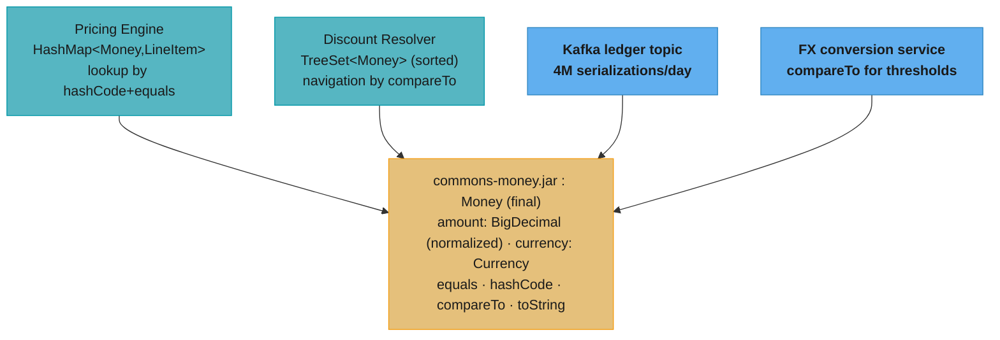

# Core Language

## 1. Concept Overview

Java's core language is built on **object-oriented programming** with a statically typed, garbage-collected runtime. Every construct — classes, interfaces, abstract classes, inner classes — is a tool with specific semantics that the compiler and JVM enforce. Understanding exactly what each construct does at the bytecode level separates engineers who write Java from engineers who *know* Java.

This module covers the foundational contracts that underpin all Java programs: the object hierarchy, equality semantics, polymorphism dispatch, inner class memory implications, and the full set of `Object` methods. Getting any of these wrong in production code causes subtle, hard-to-debug failures — a broken `equals()` implementation that silently loses data in a `HashSet`, or an anonymous inner class that prevents garbage collection by holding an unexpected outer reference.

---

## 2. Intuition

> **One-line analogy**: A class is a blueprint, an object is a building, and the JVM is the city inspector who enforces every contract written into the blueprint — before, during, and after construction.

**Mental model**: Think of class hierarchies as contracts. An `interface` is a pure contract with no state. An `abstract class` is a partial implementation — a contract *plus* shared state/behavior. A concrete `class` is the full implementation. When Java dispatches a method call, it looks up the actual runtime type, not the declared type — this is dynamic dispatch, the mechanism that makes polymorphism work.

**Why it matters**: The `equals()`/`hashCode()` contract is violated more often in production code than almost any other rule, causing silent data loss in collections. Understanding `static` vs `dynamic` dispatch explains why `final` methods can be inlined by the JIT. Inner class types have different memory implications that cause GC retention bugs in long-lived systems.

**Key insight**: Java's type system encodes intent: `interface` = capability, `abstract class` = partial shared behavior, `final class` = no extension allowed (enables JIT optimization), `sealed class` = closed hierarchy. Choosing the wrong one creates maintenance and performance problems down the road.

---

## 3. Core Principles

- **Encapsulation**: State is hidden behind accessor/mutator methods; implementation can change without affecting callers.
- **Inheritance**: `extends` creates an "is-a" relationship; subclass inherits state and behavior.
- **Polymorphism**: A reference can hold any subtype; method dispatch uses the actual runtime type.
- **Abstraction**: Abstract classes and interfaces hide implementation details behind contracts.
- **equals/hashCode contract**: Objects used in collections *must* have consistent equality semantics.
- **Liskov Substitution Principle (LSP)**: Any subtype must be substitutable for its supertype without altering program correctness.
- **Composition over inheritance**: Prefer delegating to composed objects over deep inheritance chains (Effective Java Item 18).

---

## 4. Types / Architectures / Strategies

### 4.1 Class vs Abstract Class vs Interface (Java 8+)

| Feature | class | abstract class | interface (Java 8+) |
|---------|-------|----------------|---------------------|
| Instantiate directly | Yes | No | No |
| Multiple inheritance | No (single extends) | No (single extends) | Yes (multiple implements) |
| State (fields) | Yes | Yes | Only `static final` constants |
| Constructor | Yes | Yes | No |
| Default method body | N/A | Yes | Yes (`default` keyword) |
| `static` methods | Yes | Yes | Yes (Java 8+) |
| Private methods | Yes | Yes | Yes (Java 9+) |
| Best for | Full implementation | Shared base behavior + state | Capability contract |

**Decision rule**: If you need shared state (fields) → abstract class. If you need to express capability on unrelated types → interface. If both → interface with default methods (but no state).

### 4.2 Inner Class Types

| Type | `static` | Access to outer | New instance syntax | Memory risk |
|------|----------|-----------------|---------------------|-------------|
| Static nested class | Yes | Only static members | `new Outer.Nested()` | None — no outer reference |
| Inner class (non-static) | No | All outer members | `outer.new Inner()` | Holds implicit outer reference |
| Anonymous class | No | All outer members (via closure) | `new Interface() { ... }` | Holds outer reference |
| Local class | No | Effectively-final locals + outer | Inside method body | Holds outer reference |

**Memory implication**: Non-static inner classes hold an implicit `this$0` reference to the outer instance. If an inner class instance outlives the outer (e.g., passed to a thread pool), the outer class cannot be GC'd — a common memory leak in event-driven systems.

### 4.3 Polymorphism: Static vs Dynamic Dispatch

- **Static dispatch** (overloading): resolved at compile time based on declared parameter types.
- **Dynamic dispatch** (overriding): resolved at runtime based on actual receiver type via vtable lookup.
- **`final` method**: cannot be overridden; JIT can inline it directly (devirtualization).
- **`static` method**: always statically dispatched; cannot be overridden (only hidden).

---

## 5. Architecture Diagrams

### Object Hierarchy & equals/hashCode Contract

```mermaid
flowchart TD
    classDef io      fill:#61afef,stroke:#2e86c1,color:#1a1a1a,font-weight:bold
    classDef frozen  fill:#c678dd,stroke:#9b59b6,color:#fff
    classDef train   fill:#98c379,stroke:#27ae60,color:#1a1a1a
    classDef mathOp  fill:#d19a66,stroke:#e67e22,color:#1a1a1a,font-weight:bold
    classDef lossN   fill:#e06c75,stroke:#c0392b,color:#fff,font-weight:bold
    classDef req     fill:#56b6c2,stroke:#0097a7,color:#1a1a1a
    classDef base    fill:#e5c07b,stroke:#f39c12,color:#1a1a1a

    OBJ["java.lang.Object"] --> EQ["equals(Object o): boolean\ndefault: identity (==)"]
    OBJ --> HC["hashCode(): int\ndefault: memory address (JVM-impl)"]
    OBJ --> TS["toString(): String\ndefault: ClassName@hexHashCode"]
    OBJ --> CL["clone(): Object\nprotected; shallow copy; needs Cloneable"]
    OBJ --> FI["finalize(): void\ndeprecated; unreliable pre-GC hook"]
    OBJ --> WN["wait() / notify() / notifyAll()\nintrinsic lock coordination"]
    OBJ --> GC["getClass(): Class&lt;?&gt;\nruntime type"]

    class OBJ base
    class EQ,HC lossN
    class TS,GC io
    class CL,FI frozen
    class WN req
```

**Rule**: if `a.equals(b) == true`, then `a.hashCode() == b.hashCode()` MUST be true (the converse is NOT required — hash collisions are legal).

### Static vs Dynamic Dispatch
```
Declared type: Animal
Runtime type:  Dog

Animal a = new Dog();
a.speak();        // Dynamic dispatch -> Dog.speak() (overriding)
a.breathe();      // Static dispatch -> Animal.breathe() if declared final/static
                  //   or dynamic if virtual

Overloading (static):
void process(Animal a) { ... }    // called if declared type is Animal
void process(Dog d)    { ... }    // called if declared type is Dog
// Declared type at CALL SITE decides which overload — not runtime type
```

### Inner Class Memory Layout
```
Outer instance
  +--[fields]--+
  |            |
  +------------+
        ^
        | this$0 (hidden reference)
        |
  Inner instance
  +--[fields + this$0]--+
  |                     |
  +---------------------+

If inner instance is stored in a static data structure,
Outer instance can NEVER be GC'd -> memory leak
```

---

## 6. How It Works — Detailed Mechanics

### equals() and hashCode() Contract

```java
// BROKEN: equals() overridden, hashCode() not
public class Point {
    int x, y;
    @Override
    public boolean equals(Object o) {
        if (!(o instanceof Point)) return false;
        Point p = (Point) o;
        return x == p.x && y == p.y;
    }
    // hashCode() NOT overridden -> uses Object.hashCode() (identity-based)
}

// What happens:
Point p1 = new Point(1, 2);
Point p2 = new Point(1, 2);
p1.equals(p2);                    // true
p1.hashCode() == p2.hashCode();   // FALSE - different objects, different hash
Set<Point> set = new HashSet<>();
set.add(p1);
set.contains(p2);                 // FALSE - wrong bucket! DATA LOSS

// FIXED: always override both
@Override
public int hashCode() {
    return Objects.hash(x, y);    // consistent with equals
}
```

**What the formula is telling you.** "`Objects.hash(x, y)` folds the listed fields into one `int` by repeatedly multiplying a running total by 31 and adding the next field's hash, so any two objects with the same field values are guaranteed to land on the same number."

The framing that matters: the hash is a *pure function of the fields you list*. If that list differs from the fields `equals()` compares, the contract is broken by construction, not by accident — which is why the fix above passes `x, y`, the exact pair `equals()` uses.

| Symbol | What it is |
|--------|------------|
| `result` | The running accumulator, seeded at 1 (not 0, so leading zero-valued fields still shift the total) |
| `31` | Odd prime multiplier; the JIT turns `31 * r` into `(r << 5) - r`, a shift and a subtract |
| `e` | The next field's own `hashCode()` — for an `int` field, `Integer.hashCode(n)` is just `n` |
| `x`, `y` | The two `Point` fields, the same pair `equals()` compares |

**Walk one example.** `new Point(1, 2).hashCode()`:

```
  seed                        result = 1
  fold x = 1                  result = 31 * 1  + 1  =   32
  fold y = 2                  result = 31 * 32 + 2  =  994

  Point(1, 2).hashCode() = 994     <- BOTH p1 and p2 compute this, so same bucket
  Point(2, 1).hashCode() = 31 * (31 * 1 + 2) + 1 = 31 * 33 + 1 = 1024

  Swapping the fields changes the hash, because each fold multiplies the
  accumulated total again -- position is baked into the result.
```

Order sensitivity is the point of the multiply. A plain `x + y` would give `Point(1,2)` and `Point(2,1)` the same hash, piling unrelated keys into one bucket; the `31 *` step spreads them apart. Without the fold, `HashMap` degenerates toward a linear scan of a single bucket.

### Correct equals() Implementation (Full Recipe)
```java
@Override
public boolean equals(Object o) {
    if (this == o) return true;           // 1. identity shortcut
    if (!(o instanceof Point)) return false; // 2. null-safe type check
    Point p = (Point) o;                  // 3. cast
    return x == p.x && y == p.y;         // 4. field-by-field comparison
}
// Note: use instanceof NOT getClass() — instanceof allows subclasses to be equal
// Use getClass() only for strict same-type semantics (e.g., entity classes)
```

### Comparable vs Comparator

```java
// Comparable: natural order, built into the class
public class Employee implements Comparable<Employee> {
    int salary;
    @Override
    public int compareTo(Employee other) {
        // WRONG: return this.salary - other.salary; // OVERFLOW for large values!
        return Integer.compare(this.salary, other.salary); // CORRECT
    }
}

// Comparator: external, flexible, reusable
Comparator<Employee> byName = Comparator.comparing(Employee::getName);
Comparator<Employee> bySalaryDesc = Comparator.comparingInt(Employee::getSalary).reversed();
Comparator<Employee> combined = byName.thenComparing(bySalaryDesc);

employees.sort(combined);
```

**Read it like this.** "`return a - b` only reports the correct sign while the true difference still fits inside 32 bits; the moment it does not, the value wraps around and `compareTo` confidently states the opposite order."

This is why the bug is invisible in tests. Every small salary, every small id, every difference under two billion sorts perfectly — the wrap only fires when the two values straddle a wide range, which test fixtures almost never do and production data eventually does.

| Symbol | What it is |
|--------|------------|
| `int` | 32-bit two's-complement integer: 4,294,967,296 distinct values, from -2,147,483,648 to 2,147,483,647 |
| `a - b` | The true mathematical difference, which may need more than 32 bits to hold |
| Wraparound | What the JVM stores instead: the true value shifted by 4,294,967,296 back into range, silently and without an exception |
| `Integer.compare(a, b)` | Branches on `<` / `>` and returns -1, 0, or +1; it never computes a difference, so it cannot overflow |

**Walk one example.** Two salaries at the extremes of the `int` range:

```
  int range                 -2,147,483,648  ..  2,147,483,647

  a = Integer.MAX_VALUE  =   2,147,483,647
  b = -1

  true a - b             =   2,147,483,648        <- exactly one past the top
  wrap by 2^32           =   2,147,483,648 - 4,294,967,296
  what gets stored       =  -2,147,483,648        <- NEGATIVE

  compareTo returns a negative number, so the sort concludes "a comes before b"
  even though a is the largest int there is and b is -1.

  Integer.compare(a, b)  =  +1                    <- correct, and overflow-proof
```

Nothing throws. `TreeMap` and `Collections.sort` simply build an order that violates transitivity, and downstream code reads a wrong "smallest" or, on a large enough list, gets an `IllegalArgumentException: Comparison method violates its general contract!` from TimSort — thrown far from the real cause.

### Covariant Return Types & Bridge Methods

```java
// Java generates a synthetic "bridge method" to preserve polymorphism after type erasure
class Animal {
    Animal create() { return new Animal(); }
}
class Dog extends Animal {
    @Override
    Dog create() { return new Dog(); }  // covariant return type
}
// Compiler generates:
// synthetic bridge: Animal create() { return this.create(); }
// This ensures Animal reference can call create() and get dynamic dispatch
```

### Static/Instance Initialization Order

```java
// Order: static initializer (once, on class load) → instance fields → instance initializer → constructor
// For inheritance: parent static → child static → parent instance init + ctor → child instance init + ctor

class Parent {
    static int parentStatic = initParentStatic();
    static { System.out.println("Parent static block"); }  // runs after static fields

    int parentInstance = initParentInstance();
    { System.out.println("Parent instance block"); }       // runs before constructor body

    Parent() { System.out.println("Parent constructor"); }

    static int initParentStatic() { System.out.println("Parent static field"); return 1; }
    int initParentInstance()       { System.out.println("Parent instance field"); return 2; }
}

class Child extends Parent {
    static int childStatic = initChildStatic();
    static { System.out.println("Child static block"); }

    int childInstance = initChildInstance();
    { System.out.println("Child instance block"); }

    Child() { System.out.println("Child constructor"); }

    static int initChildStatic() { System.out.println("Child static field"); return 3; }
    int initChildInstance()       { System.out.println("Child instance field"); return 4; }
}

new Child();
// Output order:
// Parent static field    (1. Parent static field init)
// Parent static block    (2. Parent static initializer block)
// Child static field     (3. Child static field init — runs once, on first class use)
// Child static block     (4. Child static initializer block)
// Parent instance field  (5. Parent instance field init — each new instance)
// Parent instance block  (6. Parent instance initializer block)
// Parent constructor     (7. Parent constructor body — super() is first in Child ctor)
// Child instance field   (8. Child instance field init)
// Child instance block   (9. Child instance initializer block)
// Child constructor      (10. Child constructor body)
```

### Access Modifier Edge Cases

```java
// package-private (no modifier): accessible only within the SAME package
// Cross-package: NOT accessible even if you know the class name
package com.a;
class PackagePrivate {            // package-private class
    void method() { ... }        // package-private method
}
// From com.b: PackagePrivate p = new PackagePrivate();  // COMPILE ERROR

// protected: accessible within same package AND in subclasses (even different package)
package com.a;
public class Base {
    protected void hook() { System.out.println("Base.hook"); }
}

package com.b;
import com.a.Base;
public class Sub extends Base {
    @Override
    protected void hook() { System.out.println("Sub.hook"); }  // OK — inherited protected

    void test() {
        hook();                 // OK — this.hook() in subclass context
        new Sub().hook();       // OK — calling on a Sub reference

        Base b = new Base();
        b.hook();               // COMPILE ERROR! protected method of Base not accessible
                                // through a Base reference from a different package
                                // Only accessible through a Sub (or descendant) reference
    }
}
// The rule: protected access from a subclass in another package is limited to
// the inherited member accessed through a reference of the subclass type, not the superclass type.
```

---

## 7. Real-World Examples

- **Java Collections**: `HashMap` relies on correct `equals()`/`hashCode()` for key lookup. Thousands of production bugs stem from violations.
- **Hibernate Entities**: Using `id`-only `equals()` on entities that haven't been persisted yet (id is null) breaks Sets — a classic ORM pitfall.
- **Event listeners as inner classes**: Android/Swing event listeners implemented as anonymous inner classes caused major memory leaks before lambdas made them less common.
- **Template Method Pattern**: Abstract classes with `final` template methods (e.g., `HttpServlet.service()`) use the static dispatch of `final` to guarantee the algorithm skeleton.

---

## 8. Tradeoffs

| Choice | Pros | Cons |
|--------|------|------|
| Inheritance | Code reuse, polymorphism | Tight coupling, fragile base class problem |
| Composition | Flexible, testable, avoids coupling | More boilerplate/delegation |
| Interface default methods | Multiple "mixin" behavior | Diamond ambiguity (resolved by compiler rules) |
| final class | JIT devirtualization, immutable contract | No extension |
| static nested class | No outer reference, standalone | No access to outer instance members |
| Non-static inner class | Full outer access | Implicit outer reference, memory leak risk |

---

## 9. When to Use / When NOT to Use

**Use abstract class when**:
- You need shared state (fields) across subclasses
- You need a constructor with initialization logic
- You want to provide a partial implementation

**Use interface when**:
- Multiple unrelated types need to share a capability (e.g., `Comparable`, `Serializable`, `AutoCloseable`)
- You want to define a contract without any shared state
- You want multiple inheritance of type

**Do NOT use inheritance when**:
- The relationship is "has-a" not "is-a" — use composition instead
- The base class is in a library you don't control — changes break your subclass (fragile base class)

**Use static nested class when**:
- The nested class doesn't need access to outer instance
- You want to avoid the memory retention of the outer reference (e.g., in `HashMap.Entry`)

---

## 10. Common Pitfalls

### War Story 1: equals without hashCode breaks HashMap
A team added a custom `equals()` to a DTO class but forgot `hashCode()`. The DTO was used as a `HashMap` key. In production, `map.get(key)` always returned `null` even when the key was present — because HashMap computed the hash bucket first, and two logically-equal objects had different hashes, so they ended up in different buckets. **Fix**: Always override both, use IDE generation or `Objects.hash()`.

### War Story 2: Non-static inner class memory leak
A servlet used a non-static inner class as a callback for an async HTTP client. The inner class held a `this$0` reference to the servlet. The servlet was supposed to be request-scoped but was retained in memory for hours because the callback was queued. Heap dumps showed thousands of servlet instances. **Fix**: Make callback classes `static` or standalone; pass only needed data, not `this`.

### War Story 3: Comparable subtraction overflow
A developer wrote `return this.id - other.id` in `compareTo()`. For very large positive `id` and very large negative `id`, integer subtraction overflows and returns the wrong sign — sorted collections silently produce wrong order. **Fix**: Always use `Integer.compare(this.id, other.id)`.

### War Story 4: clone() without Cloneable
Calling `clone()` on an object that doesn't implement `Cloneable` throws `CloneNotSupportedException`. Worse, `Object.clone()` does a *shallow* copy — reference fields point to the same objects. Deep copying requires custom logic. **Recommendation**: Prefer a copy constructor or static factory `copy()` method over `clone()`.

---

## 11. Technologies & Tools

| Tool / Concept | Purpose |
|----------------|---------|
| `javap -c -verbose` | Disassemble bytecode to see bridge methods, invokedynamic |
| IntelliJ IDEA / Eclipse | Auto-generate equals/hashCode/toString |
| `Objects.hash()` | Null-safe hashCode composition |
| `Objects.requireNonNull()` | Fail-fast null checks |
| `Records` (Java 16+) | Auto-generates equals/hashCode/toString for data carriers |
| Checkstyle / SpotBugs | Static analysis catches missing hashCode, inner class issues |

---

## 12. Interview Questions with Answers

**Q1: What happens when you override equals() but not hashCode() in a class used as a HashMap key?**
Two logically equal objects compute different hash codes (since `Object.hashCode()` is identity-based), so `HashMap` places them in different buckets. A `get()` call with a logically-equal key will hash to a different bucket and return `null` — silent data loss. The fix is to always override both: if `a.equals(b)` then `a.hashCode() == b.hashCode()` must hold.

**Q2: What is the difference between an abstract class and an interface in Java 8+?**
An abstract class can have instance state (fields), constructors, and any mix of abstract/concrete methods. An interface can have only `static final` constants, abstract methods, `default` methods (with body), and `static` methods. The key practical difference: a class can implement many interfaces but extend only one abstract class. Use abstract class for shared state + partial implementation; use interface for capability contracts on unrelated types.

**Q3: Why prefer composition over inheritance (Effective Java Item 18)?**
Inheritance exposes implementation details — subclasses break when superclasses change internal behavior. The "fragile base class" problem: `HashSet` wrapping `AbstractSet` broke when `addAll()` internally called `add()`, causing double-counting in an overriding subclass. Composition avoids this: the wrapping class delegates to the composed object via its public API only, so superclass internal changes can't break the wrapper.

**Q4: Explain static dispatch vs dynamic dispatch with a concrete example.**
Static dispatch: overloaded method resolution at compile time based on the *declared* parameter type. Dynamic dispatch: overridden method resolution at runtime based on the *actual* receiver type via vtable. Example: `Animal a = new Dog(); a.speak()` → JVM looks up `Dog.speak()` at runtime (dynamic). But `void process(Animal a)` vs `void process(Dog d)` — if you call `process(a)` where `a` is declared `Animal`, the first overload is chosen at compile time regardless of the runtime type.

**Q5: What are the four types of inner classes, and what are their memory implications?**
(1) Static nested class: no outer reference, behaves like a top-level class. (2) Non-static inner class: holds implicit `this$0` reference to outer instance — can cause memory leaks if inner outlives outer. (3) Anonymous class: implicit outer reference + captures effectively-final locals. (4) Local class: same as anonymous but named. For long-lived callbacks/listeners, always prefer static nested or standalone classes to avoid retaining the outer object.

**Q6: What does `final` mean on a class, method, and field?**
On a **class**: cannot be subclassed (e.g., `String`, `Integer`); enables JIT devirtualization. On a **method**: cannot be overridden; JIT can inline the call directly. On a **field**: reference cannot be reassigned after initialization (but the referenced object can still be mutated unless it's also immutable). Note: `final` field + immutable object = true immutability.

**Q7: What is the Liskov Substitution Principle and how can violating it manifest in Java?**
LSP says: if `S` is a subtype of `T`, objects of type `S` must be substitutable for objects of type `T` without altering program correctness. Classic violation: `Square extends Rectangle` where `setWidth()` also sets height. Code that calls `setWidth(5); setHeight(3); assert area() == 15` fails for a `Square`. In Java, this manifests as code that works for the declared supertype but breaks when a subtype is substituted — often discovered only in production.

**Q8: What is the full contract for equals()?**
Reflexive: `x.equals(x)` is true. Symmetric: `x.equals(y)` iff `y.equals(x)`. Transitive: if `x.equals(y)` and `y.equals(z)` then `x.equals(z)`. Consistent: multiple calls return the same result if objects unchanged. Non-null: `x.equals(null)` is always false. Violating any of these breaks collection contracts.

**Q9: When would you use each inner class type?**
Static nested: helper classes that don't need outer state (e.g., `Map.Entry`, `Builder`). Non-static inner: iterator that needs access to the outer collection's internal state (e.g., `ArrayList.Itr`). Anonymous: short one-off implementation of an interface, especially pre-Java 8 (now replaced by lambdas). Local: complex temporary implementation that needs to access local variables from the enclosing method.

**Q10: What are all the methods defined on java.lang.Object?**
`equals()`, `hashCode()`, `toString()`, `clone()` (protected), `finalize()` (deprecated), `getClass()`, `wait()` (3 overloads), `notify()`, `notifyAll()`. Every Java object inherits these. The most important are `equals`/`hashCode` (collection contracts), `toString` (debugging), and `wait`/`notify` (low-level concurrency — prefer `java.util.concurrent` instead).

**Q11: What is a bridge method and when does the compiler generate one?**
A bridge method is a synthetic compiler-generated method that maintains polymorphism after type erasure. When a subclass overrides a generic method with a more specific type, or uses covariant return types, the compiler generates an extra method with the erased signature that delegates to the actual override. Example: `class Dog extends Animal { @Override Dog create() {...} }` generates `synthetic Animal create() { return this.create(); }`. You can see them with `javap -verbose`.

**Q12: What is the difference between hiding and overriding in Java?**
Overriding applies to *instance methods*: the runtime type determines which version is called (dynamic dispatch). Hiding applies to *static methods*: the *declared* type at the call site determines which version is called (static dispatch). A subclass can *hide* a static method from a superclass by defining a static method with the same signature — but this is not overriding and does not participate in polymorphism. Calling the method through a supertype reference always invokes the supertype's static method.

**Q13: What is the class initialization order when a subclass is instantiated?**
The JVM initializes classes lazily on first active use. When `new Child()` is called: (1) If `Parent` class is not yet initialized: run `Parent`'s static field initializers and static blocks in textual order. (2) Run `Child`'s static field initializers and static blocks. (3) For the instance: call `super()` (implicit or explicit) which runs Parent's instance field initializers + instance blocks + Parent constructor body. (4) Run Child's instance field initializers + instance blocks + Child constructor body. Static initialization is once per class load; instance initialization runs for every `new`.

**Q14: Can a subclass in a different package call a `protected` method defined in a superclass?**
Yes, but only through a reference of the subclass type (or a more derived type), not through a reference of the superclass type. In a class `Child extends Parent` (different packages), inside `Child` you can call `this.hook()` or `new Child().hook()` — both compile. But `new Parent().hook()` from inside `Child` is a compile error — the protected access through a superclass reference from a different package is not permitted. The rationale: the protected method is inherited by `Child` and belongs to `Child`'s accessible members, but calling it on an arbitrary `Parent` reference would expose access that `Child` doesn't control.

**Q15: What is the contract between `equals()` and `hashCode()`, and what breaks when you violate it?**
The contract (from `Object` Javadoc): (1) **Reflexivity**: `x.equals(x)` is always `true`. (2) **Symmetry**: `x.equals(y)` iff `y.equals(x)`. (3) **Transitivity**: if `x.equals(y)` and `y.equals(z)`, then `x.equals(z)`. (4) **Consistency**: multiple calls with unchanged objects return the same result. (5) **Null-safety**: `x.equals(null)` is always `false`. The `hashCode` contract: **objects that are `equals()` must have the same `hashCode()`** — violating this breaks `HashMap`, `HashSet`, `Hashtable`. Classic violation: override `equals()` without overriding `hashCode()`:

```java
// BROKEN: equals() is overridden but hashCode() is not
class Point { int x, y;
    @Override public boolean equals(Object o) {
        if (!(o instanceof Point p)) return false;
        return x == p.x && y == p.y;
    }
    // hashCode() inherited from Object uses identity -> different for equal points
}
Set<Point> set = new HashSet<>();
set.add(new Point(1, 2));
set.contains(new Point(1, 2)); // false! Different hash buckets

// FIXED
@Override public int hashCode() { return Objects.hash(x, y); }
```

Also: never include mutable fields in `hashCode()` if the object will be stored in a `HashMap` or `HashSet` — mutating the key after insertion makes it permanently unreachable in the map.

---

## 13. Best Practices

1. **Always override `hashCode()` when you override `equals()`** — use `Objects.hash()` for brevity.
2. **Prefer `instanceof` pattern matching** (Java 16+): `if (o instanceof Point p) { ... }` eliminates the cast.
3. **Make inner classes `static` by default** — only make non-static if outer instance access is genuinely needed.
4. **Use `Comparator.comparingInt()` instead of subtraction** in `compareTo()` to avoid overflow.
5. **Favor composition over inheritance** for code reuse (Effective Java Item 18).
6. **Use `interface` for types, `abstract class` for partial implementations** — design APIs to the interface.
7. **Mark leaf classes `final`** when extension is not intended — communicates intent and helps JIT.
8. **Use `Objects.requireNonNull()` in constructors** to fail fast on bad input.
9. **Implement `toString()` for debugging** — IDEs will use it in logs and debug views.
10. **Use `Records` (Java 16+) for data carriers** — auto-generates correct `equals`/`hashCode`/`toString`.

---

## 14. Case Study

### A Shared `Money` Value Object Across 40 Microservices

**Scenario.** A B2B SaaS billing platform serves 120,000 tenant organizations. A single `Money` value object is published in a shared `commons-money` JAR (Java 17 LTS) and consumed by 40 microservices: invoicing, ledger, tax, FX, dunning, reporting. It is used as:

- a `HashMap<Money, LineItem>` key in the pricing engine (peak ~8,000 lookups/sec/instance),
- a `TreeSet<Money>` member in the tiered-discount resolver (sorted ranges),
- a Kafka message field serialized 4M times/day across the ledger topic.

Because the type crosses 40 service boundaries, a single defect in `equals`/`hashCode`/`compareTo` does not fail in one place — it silently corrupts maps, drops set members, and produces inconsistent sort orders across the fleet. The contract MUST be airtight.



#### Broken patterns, then fixes

**1. `equals()` comparing BigDecimal with `==` (and scale-sensitive `.equals`).**

```java
// BROKEN: reference comparison; "10.00" and "10.0" are different objects AND
//         BigDecimal.equals() treats 10.00 and 10.0 as NOT equal (scale differs).
public boolean equals(Object o) {
    Money m = (Money) o;                 // also throws ClassCastException for non-Money
    return this.amount == m.amount       // == on BigDecimal: almost always false
        && this.currency == m.currency;
}
```

```java
// FIX: instanceof guard (no ClassCastException), value equality, normalized scale.
@Override
public boolean equals(Object o) {
    if (this == o) return true;
    if (!(o instanceof Money m)) return false;   // pattern variable, Java 16+
    return amount.equals(m.amount) && currency.equals(m.currency);
}
```

Normalization happens once in the constructor so `equals` and `hashCode` see canonical values: `new BigDecimal("10.00")` and `new BigDecimal("10.0")` both become the same stripped value.

**2. `hashCode()` computed over a mutable / non-normalized field.**

```java
// BROKEN: hashing the raw (un-normalized) amount. If two equal Money values have
//         different scales, equals() says equal but hashCode() differs -> the
//         HashMap stores the second under a different bucket and getOrDefault misses.
public int hashCode() { return rawAmount.hashCode(); }   // contract violation
```

```java
// FIX: hash exactly the fields equals() uses, post-normalization.
@Override
public int hashCode() { return Objects.hash(amount, currency); }
```

**3. `compareTo()` using integer subtraction (overflow + type mismatch).**

```java
// BROKEN: subtraction overflows for large/negative values, and cents->int truncates.
public int compareTo(Money other) {
    return (int) (this.amount.longValue() - other.amount.longValue()); // overflow
}
```

```java
// FIX: delegate to BigDecimal.compareTo (scale-insensitive, no overflow).
@Override
public int compareTo(Money other) {
    if (!currency.equals(other.currency))
        throw new IllegalArgumentException("Cannot compare " + currency + " to " + other.currency);
    return amount.compareTo(other.amount);   // returns -1/0/1, never overflows
}
```

Note `compareTo` is consistent with `equals` only within the same currency. The cross-currency throw is deliberate: returning an arbitrary order would let a `TreeSet` silently treat `10 USD` and `10 EUR` as duplicates.

#### Final, correct implementation

```java
public final class Money implements Comparable<Money> {
    private final BigDecimal amount;     // always stripTrailingZeros'd
    private final Currency currency;

    public Money(BigDecimal amount, Currency currency) {
        this.amount = Objects.requireNonNull(amount, "amount").stripTrailingZeros();
        this.currency = Objects.requireNonNull(currency, "currency");
    }

    @Override public boolean equals(Object o) {
        if (this == o) return true;
        if (!(o instanceof Money m)) return false;
        return amount.equals(m.amount) && currency.equals(m.currency);
    }
    @Override public int hashCode()   { return Objects.hash(amount, currency); }
    @Override public int compareTo(Money other) {
        if (!currency.equals(other.currency))
            throw new IllegalArgumentException("Currency mismatch");
        return amount.compareTo(other.amount);
    }
    @Override public String toString() {
        return amount.toPlainString() + " " + currency.getCurrencyCode();
    }
    public static Money of(String amount, String code) {       // Effective Java Item 1
        return new Money(new BigDecimal(amount), Currency.getInstance(code));
    }
}
```

A `record Money(BigDecimal amount, Currency currency)` (Java 16+) would auto-generate `equals`/`hashCode`/`toString`, but you still need a compact constructor to normalize the scale and you still must hand-write `compareTo` — the record default does not implement `Comparable`.

**Key decisions:** `final` class (value semantics, JIT devirtualization); constructor-time normalization so the contract holds regardless of caller-supplied scale; static factory for validated construction; deterministic cross-currency failure rather than silent wrong order.

### Common Pitfalls (production war stories)

**1. `==` on `String` passes unit tests, fails in production.** A currency-code comparison used `code == "USD"`. Tests passed because string literals are interned and share one reference. In production the code arrived from JSON deserialization (a fresh heap `String`), so `==` returned `false` and every non-literal lookup missed.

```java
if (code == "USD") { ... }          // BROKEN: interned literal vs heap string
if ("USD".equals(code)) { ... }     // FIX: value comparison, null-safe on the literal side
```

**2. `equals()` overridden without `hashCode()`.** An early `Money` defined `equals` only. `HashMap<Money,...>` placed equal keys in different buckets, so a `put` followed by `get` of an equal-but-different instance returned `null`. Pricing double-charged. Rule (Effective Java Item 11): always override both together.

**3. Mutable object used as a HashMap key.** A `MutableMoney` with a setter was used as a key, then mutated after insertion. Its bucket was computed from the old `hashCode`; after mutation the entry became unreachable — `containsKey` returned `false` for a key that was in the map. Fix: make keys immutable (the `final` fields above).

**4. Missing `instanceof` causing `ClassCastException`.** A hand-written `equals` cast directly: `Money m = (Money) o;`. When a `HashSet<Object>` compared a `Money` against a `String` during a hash collision, it threw at runtime. The `instanceof` guard returns `false` for foreign types instead.

### Interview Discussion Points

**Why does `BigDecimal.equals()` consider `2.0` and `2.00` unequal, and how do you handle it?** `equals` compares both unscaled value AND scale, so `2.0` (scale 1) differs from `2.00` (scale 2). Normalize with `stripTrailingZeros()` in the constructor, or compare with `compareTo() == 0` when you only care about numeric value.

**What are the five clauses of the `equals` contract?** Reflexive, symmetric, transitive, consistent, and non-null (`x.equals(null)` is `false`). The `instanceof` check satisfies the null clause for free, since `null instanceof Money` is `false`.

**Why must `compareTo` ideally be consistent with `equals`?** Sorted collections (`TreeSet`, `TreeMap`) use `compareTo`, not `equals`, to detect duplicates. If `compareTo` returns `0` for two objects that are not `equals`, the set silently drops one. Our `Money` keeps them consistent within a currency and throws across currencies to avoid undefined ordering.

**Why is integer subtraction a buggy `compareTo` idiom?** `a - b` overflows when the values straddle the int/long range (e.g. `Integer.MAX_VALUE - (-1)` wraps negative), producing the opposite sign. Use the type's own `compareTo` or `Integer.compare(a, b)`.

**Why is immutability essential for a HashMap key?** The bucket index is derived from `hashCode()` at insertion time. If a field used by `hashCode` changes afterward, the entry sits in the wrong bucket and becomes unreachable. `final` fields and no setters guarantee a stable hash for the key's lifetime.

---

## Related / See Also

- [Java Interview Patterns](../java_interview_patterns/README.md) — immutable class recipe, equals/hashCode contract, Builder pattern
- [Generics & Type System](../generics_and_type_system/README.md) — type erasure, wildcards, polymorphism at the type level
- [Java Memory Model](../java_memory_model/README.md) — safe publication of object construction, `final` field semantics
- [SOLID Principles](../../lld/solid_principles/README.md) — Liskov Substitution Principle, polymorphism and substitutability at the design level
- [Arrays, Strings & Hashing](../../cs_fundamentals/arrays_strings_and_hashing/README.md) — hashing fundamentals underlying the equals/hashCode contract

**Should you use a record here?** A record removes the `equals`/`hashCode`/`toString` boilerplate, but you must still add a compact constructor for scale normalization and implement `Comparable` manually. Records are a good fit precisely because the type is an immutable data carrier.
