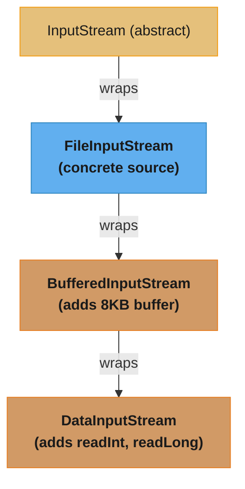
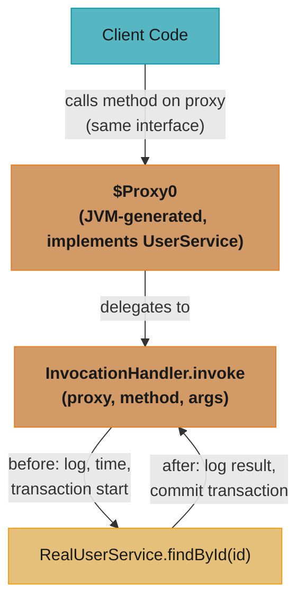
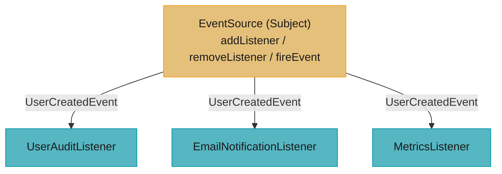
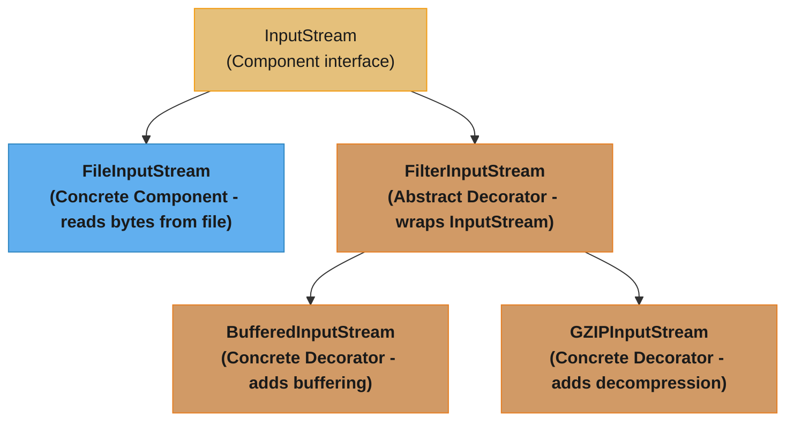
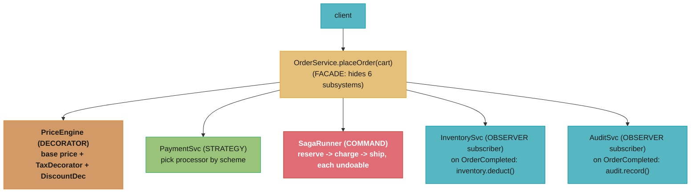

# Design Patterns in Java

## 1. Concept Overview

Design patterns are reusable solutions to commonly recurring software design problems. The Gang of Four (GoF) catalog from 1994 defines 23 patterns across three categories: Creational (object creation), Structural (composition), and Behavioral (communication). Java's standard library is itself a showcase of these patterns — `InputStream` hierarchy (Decorator), `Calendar.getInstance()` (Factory), `Comparable` (Strategy), `Thread` (Command), `Object.clone()` (Prototype).

Beyond GoF, this module covers concurrency patterns specific to Java: Immutable Object, Producer-Consumer via `BlockingQueue`, Read-Write Lock, and Thread-Per-Message. Understanding where each pattern appears in the JDK ties abstract theory to working code engineers read every day.

---

## 2. Intuition

> **One-line analogy**: Design patterns are named vocabulary for recurring design conversations — instead of explaining the whole mechanism, you say "use a Decorator here" and experienced engineers immediately understand the structure, intent, and tradeoffs.

**Mental model**: Every pattern answers a specific question. Creational patterns answer "how do I create objects flexibly?" Structural patterns answer "how do I compose objects and classes?" Behavioral patterns answer "how do I assign responsibilities and coordinate communication?" The pattern name is a compression of all that context.

**Why it matters**: Recognizing patterns in existing codebases speeds comprehension dramatically. Applying them correctly creates code that is open for extension but closed for modification (Open-Closed Principle). Misapplying them (Singleton where a value object suffices, Visitor for a 2-case switch) creates unnecessary complexity.

**Key insight**: Java's most important patterns appear in interview questions disguised as API design questions. "Why does `InputStream` use that hierarchy?" (Decorator). "How does `Thread` implement Command?" (it is Command). "What's wrong with a non-enum Singleton?" (serialization, reflection, cloning all break it). Knowing the JDK patterns lets you answer these cold.

---

## 3. Core Principles

- **Open-Closed Principle**: Code should be open for extension, closed for modification — patterns like Strategy and Decorator enable this.
- **Favor composition over inheritance**: Decorator, Strategy, Composite all use composition rather than deep hierarchies.
- **Program to interfaces**: All GoF patterns define relationships via abstractions, not concrete classes.
- **Single Responsibility**: Each participant in a pattern has one well-defined role.
- **Encapsulate what varies**: Factory encapsulates object creation. Strategy encapsulates algorithm. Builder encapsulates construction sequence.

---

## 4. Types / Architectures / Strategies

### 4.1 Creational Patterns

| Pattern | Intent | Java JDK Example |
|---------|--------|-----------------|
| Singleton | One instance per JVM | `Runtime.getRuntime()`, enum |
| Factory Method | Subclass decides which class to instantiate | `Calendar.getInstance()`, `Iterator` |
| Abstract Factory | Family of related objects without specifying concrete classes | `DocumentBuilderFactory` |
| Builder | Construct complex objects step-by-step with validation | `StringBuilder`, `Stream.Builder` |
| Prototype | Clone existing object | `Object.clone()`, copy constructors |

### 4.2 Structural Patterns

| Pattern | Intent | Java JDK Example |
|---------|--------|-----------------|
| Proxy | Surrogate/placeholder for another object | JDK dynamic proxy, Spring AOP |
| Decorator | Wrap object to add behavior | `InputStream` chain, `Collections.unmodifiableList()` |
| Adapter | Convert interface to another | `Arrays.asList()`, `InputStreamReader` |
| Facade | Simplified interface to a subsystem | `Files.readString()`, `Executors.newFixedThreadPool()` |
| Composite | Tree structure of uniform-interface objects | `File` (leaf + directory), Swing containers |
| Flyweight | Share fine-grained objects | `Integer.valueOf()` cache, `String.intern()` |
| Bridge | Separate abstraction from implementation | JDBC (Driver abstraction + concrete DB impl) |

### 4.3 Behavioral Patterns

| Pattern | Intent | Java JDK Example |
|---------|--------|-----------------|
| Strategy | Encapsulate interchangeable algorithms | `Comparator`, `Runnable` |
| Command | Encapsulate request as object | `Runnable`, `Callable`, `ActionListener` |
| Observer | Notify dependents of state change | `EventListener`, `Observable` (legacy) |
| Template Method | Define algorithm skeleton; subclasses fill steps | `AbstractList`, `HttpServlet.service()` |
| Iterator | Sequential access without exposing structure | `Iterator<T>`, `Iterable<T>` |
| Chain of Responsibility | Pass request along handler chain | Servlet `Filter` chain, logging handlers |
| State | Change behavior when state changes | `Thread` lifecycle states |
| Visitor | Add operations to object hierarchy without modifying it | `Files.walkFileTree()` with `FileVisitor` |

### 4.4 Concurrency Patterns

| Pattern | Intent |
|---------|--------|
| Immutable Object | No state change after construction — zero synchronization needed |
| Producer-Consumer | Decouple producers from consumers via `BlockingQueue` |
| Read-Write Lock | Allow concurrent reads, exclusive writes via `ReentrantReadWriteLock` |
| Thread-Per-Message | New thread (or virtual thread) for each task |
| Active Object | Decouple method execution from invocation via `ExecutorService` |

---

## 5. Architecture Diagrams

### Decorator Pattern — InputStream Chain


```java
new DataInputStream(
    new BufferedInputStream(
        new FileInputStream("data.bin")))
```

Each decorator implements `InputStream` and delegates to the wrapped stream. Adding a new capability = write one new decorator class, no changes elsewhere.

### Proxy Pattern — JDK Dynamic Proxy


JDK proxy works ONLY for interfaces. For class proxying: CGLIB generates a subclass.

### Observer Pattern


Each listener knows nothing about other listeners. Source knows nothing about what listeners do with the event.

### Strategy Pattern with Enum
```java
enum SortStrategy implements Comparator<Person> {
    BY_NAME    { public int compare(Person a, Person b) { return a.name().compareTo(b.name()); } },
    BY_AGE     { public int compare(Person a, Person b) { return Integer.compare(a.age(), b.age()); } },
    BY_SALARY  { public int compare(Person a, Person b) { return Double.compare(a.salary(), b.salary()); } };
}
// Switch strategy at runtime:  list.sort(SortStrategy.BY_AGE)
// No if-else chain, easily extended by adding enum constant
```

---

## 6. How It Works — Detailed Mechanics

### Singleton — All Three Implementations

```java
// 1. Enum Singleton (BEST — Effective Java Item 3)
public enum AppConfig {
    INSTANCE;
    private final Properties props = loadProperties();
    public String get(String key) { return props.getProperty(key); }
    private Properties loadProperties() { /* load from file */ return new Properties(); }
}
// Why best: serialization-safe (JVM handles enum serialization by name),
// reflection-safe (cannot instantiate enum via reflection),
// thread-safe (class initialization is thread-safe),
// lazy-initialized (enum class loaded on first use),
// zero boilerplate.

// 2. Holder Idiom (lazy, thread-safe, no volatile)
public class Service {
    private Service() {}
    private static class Holder {
        static final Service INSTANCE = new Service();
        // Class initialization: JVM guarantees thread-safe, at-most-once execution of <clinit>
    }
    public static Service getInstance() { return Holder.INSTANCE; }
}
// Lazy: Holder class is not loaded until getInstance() is first called.
// Thread-safe: class initialization is single-threaded by JVM contract.
// No synchronization overhead on the get path.

// 3. Double-Checked Locking (volatile required)
public class Service {
    private static volatile Service instance;  // volatile is REQUIRED
    private Service() {}
    public static Service getInstance() {
        if (instance == null) {                    // first check (no lock)
            synchronized (Service.class) {
                if (instance == null) {            // second check (with lock)
                    instance = new Service();
                }
            }
        }
        return instance;
    }
}
// Without volatile: JIT can reorder allocation so reference is visible before
// constructor finishes. volatile write establishes happens-before.
```

### Builder Pattern — Fluent + Validation

```java
public class HttpRequest {
    private final String url;
    private final String method;
    private final Map<String, String> headers;
    private final String body;
    private final int timeoutMs;

    private HttpRequest(Builder b) {
        this.url       = b.url;
        this.method    = b.method;
        this.headers   = Collections.unmodifiableMap(new HashMap<>(b.headers));
        this.body      = b.body;
        this.timeoutMs = b.timeoutMs;
    }

    public static class Builder {
        private final String url;          // required
        private String method = "GET";     // optional with default
        private Map<String, String> headers = new HashMap<>();
        private String body;
        private int timeoutMs = 5000;

        public Builder(String url) {
            this.url = Objects.requireNonNull(url, "url required");
        }

        public Builder method(String m) { this.method = m; return this; }
        public Builder header(String k, String v) { headers.put(k, v); return this; }
        public Builder body(String b) { this.body = b; return this; }
        public Builder timeoutMs(int t) { this.timeoutMs = t; return this; }

        public HttpRequest build() {
            // Validation in build(), not setters — all-or-nothing invariant check
            if ("POST".equals(method) && body == null)
                throw new IllegalStateException("POST requires a body");
            if (timeoutMs <= 0)
                throw new IllegalArgumentException("timeout must be positive");
            return new HttpRequest(this);
        }
    }
}

// Usage:
HttpRequest req = new HttpRequest.Builder("https://api.example.com/users")
    .method("POST")
    .header("Content-Type", "application/json")
    .body("{\"name\":\"Alice\"}")
    .timeoutMs(10_000)
    .build();
```

### Proxy — JDK Dynamic Proxy vs CGLIB

```java
// JDK Dynamic Proxy: only for interfaces
UserService proxy = (UserService) Proxy.newProxyInstance(
    UserService.class.getClassLoader(),
    new Class[]{UserService.class},
    (proxyObj, method, args) -> {
        long start = System.nanoTime();
        try {
            return method.invoke(realService, args);
        } finally {
            System.out.printf("%s took %dµs%n",
                method.getName(), (System.nanoTime() - start) / 1000);
        }
    }
);
// Limitation: UserService must be an interface.

// CGLIB: for concrete classes (Spring uses this when no interface)
// Generates a SUBCLASS of the target class at runtime.
// Limitation: cannot proxy final classes or final methods.
// Spring @Configuration uses CGLIB to intercept @Bean method calls.

// ByteBuddy: modern alternative, used by Mockito, Hibernate.
```

### Decorator vs Proxy — Key Difference

```
Decorator: adds NEW behavior; focus is on enriching.
  new LoggingInputStream(new GZIPInputStream(new FileInputStream(...)))
  -- each layer adds capability the next doesn't have

Proxy: controls ACCESS to the real object; focus is on control.
  new SecurityProxy(realService) -- checks permission before delegating
  The proxy has the same interface; the decorator has a richer interface.

Common confusion: both wrap an object.
Key distinction: does the wrapper ADD capability or CONTROL access?
```

### Command Pattern — Runnable as Command

```java
// Runnable IS the Command pattern:
// Command interface: Runnable (execute())
// ConcreteCommand: lambda or method reference
// Invoker: ExecutorService (calls execute() when appropriate)
// Receiver: the actual logic inside the lambda

ExecutorService executor = Executors.newFixedThreadPool(4);
executor.submit(() -> processOrder(orderId));   // command encapsulates request
executor.submit(() -> sendEmail(userId));

// With Callable<V> (command that returns a result):
Future<Report> reportFuture = executor.submit(() -> generateReport(dateRange));

// Undo support via CommandHistory:
interface Command {
    void execute();
    void undo();
}

class TextEditor {
    private final Deque<Command> history = new ArrayDeque<>();

    public void executeCommand(Command cmd) {
        cmd.execute();
        history.push(cmd);
    }
    public void undo() {
        if (!history.isEmpty()) history.pop().undo();
    }
}
```

### Flyweight — String Pool and Integer Cache

```java
// String interning (Flyweight):
String a = "hello";          // from string pool (literal)
String b = "hello";          // same object from pool
String c = new String("hello"); // NOT from pool — new object
a == b   // true (same pool object)
a == c   // false (different objects)
a.equals(c) // true (same content)

// Integer cache (-128 to 127):
Integer x = 127;  // Integer.valueOf(127) — from cache
Integer y = 127;  // same object
x == y            // true (cached range)

Integer p = 128;  // Integer.valueOf(128) — new object
Integer q = 128;  // another new object
p == q            // FALSE (outside cache range!)

// Moral: NEVER use == for boxed Integer outside [-128, 127]
// This is a classic interview trap.

// Flyweight for custom objects:
class FontFactory {
    private static final Map<String, Font> cache = new HashMap<>();
    public static Font getFont(String name) {
        return cache.computeIfAbsent(name, Font::new);
    }
}
```

**The idea behind it.** "`[-128, 127]` is not a tuning constant someone benchmarked — it is the range of a signed byte, 256 values, chosen because that is the cheapest set that covers almost every integer a program actually boxes."

Seeing it as `2^8` rather than as two arbitrary numbers is what makes the `==` trap memorable: the boundary is at 127/128 because that is where a byte overflows, and nothing about your program changes at that point — only the identity of the object does.

| Symbol | What it is |
|--------|------------|
| `[-128, 127]` | The `byte` range: `-2^7` through `2^7 - 1` |
| 256 | `2^8` — how many `Integer` instances `IntegerCache` pre-allocates at class init |
| 16 bytes | One `Integer` on a 64-bit JVM: 12-byte header + 4-byte `int` value, already 8-aligned |
| `Integer.valueOf(v)` | Returns the cached object when `v` is in range, `new Integer(v)` otherwise |
| `==` on boxed values | Reference identity — true only when both sides came from the cache |

**Walk one example.** What the cache costs, and what it saves:

```
  Cache footprint, paid once at IntegerCache class init:
    256 Integer objects   x 16 bytes  =  4,096 bytes
    the Integer[] itself  256 x 4 + 16 header  =  1,040 bytes   (compressed oops)
                                            -----------------
                                            5,136 bytes  ~ 5 KB

  Boxing 1,000,000 values that all fall inside the range:
    with cache    :        0 allocations,     0 bytes   (same 256 objects reused)
    without cache : 1,000,000 allocations,   16 MB churned through eden

  Crossing the boundary changes nothing but identity:
    Integer a = 127, b = 127;   a == b       ->  true    both are cache[127 + 128]
    Integer p = 128, q = 128;   p == q       ->  false   two fresh 16-byte objects
                                a.equals(b)  ->  true
                                p.equals(q)  ->  true    value never stopped matching
```

Five kilobytes to eliminate 16 MB of garbage on a hot boxing path is why the cache exists, and the `==` trap is the price. Note that the trap is *worse* than an always-wrong comparison would be: an always-wrong one fails immediately in the first test. This one passes every test written with small numbers and fails the first time production sees an id above 127, which is precisely the shape of bug that reaches customers. Use `.equals()` — or better, do not box at all.

### Template Method vs Strategy

```java
// Template Method: algorithm skeleton in base class, steps overridden in subclass
abstract class DataProcessor {
    // Template method — FINAL: algorithm structure cannot be changed
    public final void process(Path input, Path output) {
        List<String> data = readData(input);     // step 1
        List<String> filtered = filter(data);    // step 2 — abstract
        List<String> transformed = transform(filtered); // step 3 — abstract
        writeData(transformed, output);          // step 4
    }

    protected abstract List<String> filter(List<String> data);
    protected abstract List<String> transform(List<String> data);

    private List<String> readData(Path p) { /* ... */ return null; }
    private void writeData(List<String> data, Path p) { /* ... */ }
}

// Strategy: algorithm is injected; no inheritance required
class DataProcessor {
    private final Predicate<String> filter;
    private final Function<String, String> transformer;

    DataProcessor(Predicate<String> filter, Function<String, String> transformer) {
        this.filter = filter;
        this.transformer = transformer;
    }
    // Strategy is more flexible: can change at runtime; easier to test
}

// Rule: Template Method = "how to reuse a fixed algorithm structure with variable steps"
//       Strategy = "how to swap the entire algorithm at runtime"
// Template Method uses inheritance; Strategy uses composition.
```

---

## 7. Real-World Examples

- **`InputStream` hierarchy**: Decorator. `FileInputStream` is the source; `BufferedInputStream`, `DataInputStream`, `CipherInputStream`, `GZIPInputStream` are all decorators. Chain them as needed.
- **JDK `Proxy.newProxyInstance()`**: Dynamic Proxy. Powers Spring AOP, JPA lazy loading, mock frameworks (Mockito).
- **`java.util.concurrent.Executors`**: Facade. `Executors.newFixedThreadPool(n)` hides `ThreadPoolExecutor` with `LinkedBlockingQueue` and `DefaultThreadFactory`.
- **`String` pool + `Integer.valueOf()` cache**: Flyweight. Canonicalizes instances to save memory.
- **`Runnable` / `Callable`**: Command. `ExecutorService.submit(callable)` decouples task definition from execution.
- **`Comparator`**: Strategy. `list.sort(Comparator.comparing(Person::name))` injects the comparison algorithm.

---

## 8. Tradeoffs

| Pattern | Benefit | Cost | When NOT to Use |
|---------|---------|------|-----------------|
| Singleton | Global shared state, controlled creation | Global state is hard to test; hidden dependencies | When testability matters — prefer dependency injection |
| Builder | Readable construction, validates invariants | Extra classes/boilerplate | When object has 0-2 simple fields |
| Decorator | Open-Closed, additive enrichment, no subclass explosion | Deep chains hard to debug | When just 1-2 variants needed |
| Proxy | Transparent cross-cutting concerns | Reflection overhead per call | Performance-critical inner loops |
| Strategy | Swap algorithms at runtime, testable | Extra interface/class | When only 1 algorithm ever exists |
| Observer | Decouples event source from handler | Memory leaks if listeners not removed | When event cardinality is huge |

---

## 9. When to Use / When NOT to Use

**Use Singleton** only when: truly one instance needed (config, registry, connection pool manager). Prefer enum singleton. Do NOT make services singletons — use dependency injection.

**Use Builder** when: more than 3 constructor parameters, some optional, need invariant validation at build time. JavaBeans setters are not builders — they allow partially constructed invalid objects.

**Use Decorator** when: you need to add behavior in combinations without subclass explosion. `n` behaviors → `n` decorators combinable in `2^n` ways vs `2^n` subclasses.

**Stated plainly.** "You write one class per *behavior* and get every *combination* for free — the class count grows by adding, the capability count grows by multiplying, and Decorator is the pattern that puts you on the right side of that gap."

The reason this is worth stating as arithmetic rather than as advice: the inheritance alternative is not merely uglier, it is a different growth curve. At `n = 3` the gap is a rounding error and subclassing looks fine; the decision is usually made there and the cost arrives later.

| Symbol | What it is |
|--------|------------|
| `n` | Number of independent behaviors — buffering, compression, typed reads, encryption, ... |
| `2^n` | Subsets of those behaviors, i.e. every combination a caller might want |
| `2^n - 1` | The useful subsets; the empty one is just the undecorated component |
| classes with Decorator | `n` — one `FilterInputStream` subclass per behavior |
| classes with subclassing | `2^n - 1` — one named class per combination you want to support |

**Walk one example.** The JDK's own `InputStream` behaviors from §5, `n = 3` (`Buffered`, `GZIP`, `Data`):

```
  Decorator   :  3 classes                                   ->  2^3 - 1 = 7 combinations
  Subclassing :  7 classes  (BufferedIS, GzipIS, DataIS,
                 BufferedGzipIS, BufferedDataIS,
                 GzipDataIS, BufferedGzipDataIS)             ->  the same 7

  Add ONE behavior (say CipherInputStream), n = 3 -> 4:
    Decorator   :  3 -> 4 classes        (+1,  additive)
    Subclassing :  7 -> 15 classes       (+8,  doubles every time)

  n = 8 behaviors:
    Decorator   :    8 classes
    Subclassing :  255 classes           <- 32x more code for identical capability
```

Order is the part the `2^n` figure understates. `new GZIPInputStream(new BufferedInputStream(...))` buffers the compressed bytes; swapping the two buffers the decompressed ones — different performance, both legal. Counting ordered chains instead of subsets gives `sum(P(n,k))` for `k = 1..n`, which is `15` at `n = 3` and `109,600` at `n = 8`. No subclass hierarchy enumerates that, and it is why the chain is assembled at the call site rather than named in a class declaration.

**Use Proxy** when: you need transparent interception (logging, caching, auth, transactions) on an interface. Use CGLIB if the target is a concrete class.

**Use Strategy** over Template Method when: you want composition-based extensibility, or when the algorithm needs to change per-instance at runtime, or when you want to test algorithms independently.

---

## 10. Common Pitfalls

### War Story 1: Non-enum Singleton broken by serialization
A team serialized their `Service` singleton (implementing `Serializable`) to a file cache. On deserialization, Java created a NEW instance — the "singleton" now had two instances in the JVM. This caused split-brain state: each instance maintained its own connection pool. **Fix**: Use enum singleton (JVM handles serialization of enums by name, returning the existing constant) or add `readResolve()`.

### War Story 2: Observer listener leak
An event bus held strong references to all registered `EventListener` objects. A GUI component registered itself as a listener but was never explicitly removed. The component was "closed" by the UI layer, but the event bus still held a strong reference — the component's entire object graph was retained in memory for the JVM lifetime. **Fix**: Use `WeakReference<EventListener>` in the listener list, or require explicit `removeListener()`. Java's `WeakHashMap` automates this pattern.

### War Story 3: Decorator chain not closing correctly
A developer stacked four `InputStream` decorators. The `close()` call was made only on the outermost decorator. The inner `FileInputStream` was left open (file descriptor leak). In Java 7+, all standard decorators delegate `close()` to the wrapped stream — but custom decorators may not. **Fix**: Always use `try-with-resources` on the outermost resource; verify custom decorators properly chain `close()`.

### War Story 4: Builder not validating in build()
A `Builder` was validated in each setter. A client set valid values individually but an invalid *combination* (e.g., `startDate` after `endDate`) was only detectable in `build()` when all values were present. The setters had no awareness of the other fields. **Fix**: Validate combinations ONLY in `build()` — don't validate individual fields in setters unless truly isolated; the whole point of Builder is deferred validation on the fully assembled object.

---

## 11. Technologies & Tools

| Tool | Purpose |
|------|---------|
| `java.lang.reflect.Proxy` | JDK dynamic proxy (interface-only) |
| CGLIB | Class-based proxy (subclass generation); used by Spring AOP |
| ByteBuddy | Modern bytecode generation; used by Mockito, Hibernate |
| `java.util.function.*` | Functional interfaces for Strategy, Command, Observer patterns |
| `java.util.concurrent.BlockingQueue` | Foundation of Producer-Consumer pattern |
| `javap -verbose` | Inspect bridge methods, synthetic members from proxy generation |

---

## 12. Interview Questions with Answers

**Q1: What is the difference between JDK dynamic proxy and CGLIB?**
JDK dynamic proxy works only for interfaces: it generates a class at runtime that implements the target interface and routes all calls to an `InvocationHandler`. CGLIB (Code Generation Library) works for concrete classes: it generates a subclass at runtime and overrides methods to route calls to an interceptor. Spring uses JDK proxy when the bean implements at least one interface; it falls back to CGLIB otherwise. Key limitation of CGLIB: cannot proxy `final` classes or `final` methods. ByteBuddy is the modern alternative, used by Mockito.

**Q2: How does the Decorator pattern map to Java I/O streams?**
`InputStream` is the abstract component. `FileInputStream` and `ByteArrayInputStream` are concrete components (sources). `FilterInputStream` is the abstract decorator — it holds a reference to a wrapped `InputStream` and delegates all methods to it. Concrete decorators like `BufferedInputStream` (adds 8KB buffer), `DataInputStream` (adds `readInt()`/`readLong()`), and `GZIPInputStream` each extend `FilterInputStream` and add one capability. The pattern enables arbitrary combination: `new DataInputStream(new GZIPInputStream(new BufferedInputStream(new FileInputStream("f.gz"))))`.

**Q3: What is the difference between Strategy and Template Method?**
Template Method uses inheritance: the base class defines the algorithm skeleton as a `final` method that calls abstract/overridable "steps." Subclasses override steps, not the algorithm. Strategy uses composition: the algorithm is encapsulated in a separate interface and injected. Template Method is simpler when the algorithm structure is fixed and you just want to vary specific steps. Strategy is more flexible: algorithms can change per-instance at runtime; strategies can be tested independently; classes using strategies can have multiple strategies. Effective Java prefers composition (Strategy) over inheritance (Template Method).

**Q4: What is the difference between Factory Method and Abstract Factory?**
Factory Method: a single factory method (usually abstract) that subclasses override to return different concrete products. "Which class to instantiate" is deferred to subclasses. Example: `Calendar.getInstance()` returns `GregorianCalendar` or Japanese calendar depending on locale. Abstract Factory: a factory interface/class that creates a *family* of related objects, ensuring they are compatible. Example: a `UIComponentFactory` with `createButton()`, `createTextField()`, `createDialog()` — one implementation for macOS, another for Windows. Use Factory Method when you need one product type with variant implementations; Abstract Factory when you need consistent families of multiple product types.

**Q5: How does the Flyweight pattern appear in Java's String interning?**
The String pool is a canonical registry of `String` objects. String literals are automatically interned — `"hello" == "hello"` is true because both refer to the same pooled instance. `String.intern()` manually adds a string to the pool. `Integer.valueOf()` implements Flyweight for integers in `[-128, 127]`: values in this range always return the same cached `Integer` object. The Flyweight pattern saves memory when many clients use identical fine-grained objects, at the cost of immutability (shared objects cannot be mutated per-client).

**Q6: Why is the enum singleton considered the safest singleton implementation?**
Enum singleton is safe from four singleton-breaking attacks: (1) Reflection — you cannot call `newInstance()` on an enum via reflection; the JVM throws `IllegalArgumentException`. (2) Serialization — enums serialize by name and deserialize by finding the existing constant; no new instance is created. (3) Cloning — `Enum` overrides `clone()` to throw `CloneNotSupportedException`. (4) Class loader — two different class loaders cannot produce two instances of the same enum. None of these protections hold for the `synchronized + volatile` DCL singleton, which can be broken by reflection (`setAccessible(true)`) and serialization.

**Q7: How does the Command pattern relate to `Runnable` and `Callable`?**
`Runnable` IS the Command pattern's command interface: `execute()` is `run()`. The concrete command is the lambda or anonymous class you create. The invoker is `ExecutorService` which calls `run()` at some future time, decoupling task creation from execution. `Callable<V>` extends this by making the command return a value (and declare checked exceptions). Command's "history/undo" capability is not in `Runnable` but can be added by wrapping commands in a custom class that also implements an `undo()` method.

**Q8: Which GoF patterns appear prominently in the JDK?**
Creational: Singleton (`Runtime.getRuntime()`, enums), Factory Method (`Calendar.getInstance()`, `Iterator` from `Iterable`), Builder (`StringBuilder`, `Stream.Builder`, `ProcessBuilder`). Structural: Decorator (`InputStream`/`OutputStream`/`Reader`/`Writer` chains), Proxy (JDK `Proxy`, JDBC connection wrappers), Adapter (`Arrays.asList()`, `InputStreamReader`), Flyweight (`String` pool, `Integer.valueOf()` cache), Facade (`Files`, `Executors`). Behavioral: Iterator (`java.util.Iterator`), Strategy (`Comparator`, `ThreadFactory`, `RejectedExecutionHandler`), Command (`Runnable`, `Callable`), Observer (`EventListener` hierarchy), Template Method (`AbstractList`, `HttpServlet.service()`).

**Q9: What is the Producer-Consumer pattern and how does `BlockingQueue` implement it?**
Producer-Consumer decouples the rate of production from the rate of consumption via a shared bounded buffer. `BlockingQueue` is the buffer: `put(item)` blocks when full; `take()` blocks when empty. This creates natural backpressure — producers slow down automatically when consumers can't keep up. Implementation: one or more producer threads call `queue.put(item)`, one or more consumer threads call `queue.take()`. No explicit `wait()`/`notify()` needed — `BlockingQueue` handles all synchronization. Use `ArrayBlockingQueue(capacity)` for bounded buffers, `LinkedTransferQueue` for high-throughput handoff.

**Q10: When would you use Observer (event bus) vs reactive streams?**
Observer (simple event bus): synchronous dispatch, simple listener interface, suitable for in-process events where listeners complete quickly. Works well for GUI events, domain events in a monolith. Reactive streams (`Flow`, RxJava, Project Reactor): asynchronous, backpressure-aware, composable operators (`map`, `filter`, `flatMap`). Use when: consumers can fall behind producers (need backpressure), operations are async (HTTP calls per event), or you need complex event transformations. Rule: if your observer callbacks are simple method calls and you don't need backpressure, stick with simple Observer; reactive is heavier machinery.

**Q11: Why is the Visitor pattern rarely used in Java compared to Haskell/Scala pattern matching?**
Visitor solves "add an operation to a type hierarchy without modifying each type." In Java, it requires an `accept(Visitor)` method on every node class and a concrete `Visitor` implementation for every type. Java 21's pattern matching for switch (`switch (shape) { case Circle c -> ...; case Rectangle r -> ...; }`) makes Visitor mostly obsolete for closed hierarchies: sealed classes + exhaustive switch expressions provide the same exhaustiveness guarantee with 80% less code. Visitor still has a place for open hierarchies (where you can't add `accept()` to library classes) and when operations are many and frequently added.

**Q12: What is the Immutable Object concurrency pattern and why does it eliminate synchronization?**
An immutable object has no mutable state after construction: all fields are `final`, no setters, all methods are pure functions that return new objects rather than modifying state. Because the object can never change, threads can share it freely without synchronization — there is no write that could conflict with a read, so the happens-before rules are irrelevant. Examples: `String`, `BigDecimal`, Java `record`s. Construction must be done carefully: all fields must be set before the reference escapes the constructor (`this` must not be passed to other threads inside the constructor).

**Q13: How does the Decorator pattern differ from inheritance, and how does Java I/O use it in practice?**
Inheritance is compile-time, static, and "is-a" — a subclass permanently adds behaviour. Decorator is runtime, dynamic, and "wraps-a" — a Decorator holds a reference to the decorated component and delegates, adding behaviour before/after the delegation. The critical advantage: behaviours can be stacked in any combination without a class explosion. Java I/O is the canonical Decorator example:



```java
// Stacked: read a gzip-compressed, buffered file
InputStream in = new GZIPInputStream(new BufferedInputStream(new FileInputStream("data.gz")));
```

Pitfall: `instanceof` checks on a decorated object fail (a `BufferedInputStream` is not a `FileInputStream`) — avoid coupling code to concrete types in a Decorator chain.

**Q14: What is the Command pattern and how do you add undo/redo functionality to it?**
Command encapsulates a request as an object, separating the invoker (who triggers the action) from the receiver (who executes it). For undo/redo, each `Command` exposes both `execute()` and `undo()`, and the invoker maintains an `executeStack` and an `undoStack`:

```java
interface Command {
    void execute();
    void undo();
}
class TextEditor {
    private final Deque<Command> history = new ArrayDeque<>();
    private final Deque<Command> redoStack = new ArrayDeque<>();

    void execute(Command cmd) {
        cmd.execute();
        history.push(cmd);
        redoStack.clear(); // new action invalidates redo history
    }
    void undo() {
        if (!history.isEmpty()) {
            Command cmd = history.pop();
            cmd.undo();
            redoStack.push(cmd);
        }
    }
    void redo() {
        if (!redoStack.isEmpty()) {
            Command cmd = redoStack.pop();
            cmd.execute();
            history.push(cmd);
        }
    }
}
```

Lambda expressions can implement single-method `Command` for simple actions. For undo, pair two lambdas: `new LambdaCommand(() -> doSomething(), () -> undoSomething())`.

**Q15: What is the Flyweight pattern, and where does the JDK use it concretely?**
Flyweight shares one instance of an object among many contexts that need the same value, saving memory. The shared state (intrinsic) is stored in the flyweight; the per-context state (extrinsic) is passed on each call. JDK examples: (1) **String pool** — `String.intern()` returns the canonical instance; all string literals are interned automatically. (2) **Integer/Long/Short/Byte/Character cache** — `Integer.valueOf(n)` returns a cached instance for n ∈ [−128, 127]. (3) **`Boolean.TRUE` / `Boolean.FALSE`** — two singletons; `Boolean.valueOf(true)` never allocates. (4) **`Font` in AWT** — glyph bitmaps are shared flyweights; x/y position is extrinsic. Interview angle: the Integer cache is Flyweight in disguise — describe it in those terms and it reads much better than "it's just a cache." Limitation: Flyweights cannot have mutable intrinsic state; any mutation would affect all users simultaneously.

---

## 13. Best Practices

1. **Prefer enum singleton** for all singleton needs — it's the only one safe from reflection, serialization, and cloning attacks.
2. **Use Builder for objects with 3+ parameters or optional fields** — it prevents invalid partially-constructed objects.
3. **Validate combinations in `build()` not in setters** — setters have no knowledge of sibling fields.
4. **Use JDK dynamic proxy for interface interception** — no external library needed; use ByteBuddy/CGLIB only if you must proxy concrete classes.
5. **Make Decorator `close()` delegate to the wrapped resource** — otherwise the inner resource leaks.
6. **Use `WeakReference<EventListener>` in event buses** — prevents Observer from causing memory leaks.
7. **Prefer Strategy over Template Method** — composition is more testable and more flexible than inheritance.
8. **Know the JDK examples for each pattern** — interviewers ask "where does X appear in the JDK?"
9. **Do not confuse Decorator with Proxy** — Decorator enriches capability; Proxy controls access.
10. **Use `BlockingQueue` for Producer-Consumer** — it handles all `wait()`/`notify()` synchronization correctly.

---

## 14. Case Study

### An E-Commerce Order Engine Composing Five GoF Patterns

**Scenario.** An order-processing engine handles **500k orders/day** (~6/sec average, ~50/sec at flash-sale peak). It composes five GoF patterns, each solving a distinct axis of change: **Strategy** selects the payment processor, **Decorator** layers tax and discount on the base price, **Observer** fans an `OrderCompleted` event out to inventory/notification/audit listeners, **Command** turns each saga step into an undoable command, and a **Facade** (`OrderService`) hides six subsystems behind one method. The patterns reinforce one another — adding a new payment scheme, a new price modifier, or a new post-order listener each touches exactly one class and zero call sites (Open-Closed Principle).



### How the Patterns Compose (Most Complex Interaction)

The trickiest seam is the saga: each **Command** runs a step, and a failure triggers compensating `undo()` in reverse; on success the final command fires the **Observer** event, whose listener order must not matter.

```java
// STRATEGY: payment processor chosen at runtime, behind one interface
interface PaymentProcessor { Receipt charge(Order o); }
final class CardProcessor   implements PaymentProcessor { /* ... */ }
final class WalletProcessor implements PaymentProcessor { /* ... */ }

// DECORATOR: price modifiers wrap a base PriceComponent; each adds one rule
interface PriceComponent { long cents(); }
final class BasePrice implements PriceComponent {
    private final long cents; BasePrice(long c){this.cents=c;}
    public long cents(){ return cents; }
}
final class TaxDecorator implements PriceComponent {
    private final PriceComponent inner; private final double rate;
    TaxDecorator(PriceComponent in, double r){ this.inner=in; this.rate=r; }
    public long cents(){ return inner.cents() + Math.round(inner.cents()*rate); }
}
final class DiscountDecorator implements PriceComponent {
    private final PriceComponent inner; private final long off;
    DiscountDecorator(PriceComponent in, long off){ this.inner=in; this.off=off; }
    public long cents(){ return Math.max(0, inner.cents() - off); }
}

// COMMAND: each saga step is a command with execute + compensating undo
interface OrderCommand { void execute(); void undo(); }

// FACADE: one entry point hides PriceEngine, PaymentSvc, Saga, Inventory, Notify, Audit
final class OrderService {
    private final PaymentProcessor payment;          // injected Strategy
    private final List<OrderListener> listeners;     // Observer subscribers (CopyOnWrite)

    Receipt placeOrder(Cart cart) {
        // Decorator chain builds the final price
        PriceComponent price = new DiscountDecorator(
                new TaxDecorator(new BasePrice(cart.subtotalCents()), 0.08), cart.couponCents());

        // Command saga with rollback
        Deque<OrderCommand> done = new ArrayDeque<>();
        try {
            for (OrderCommand cmd : List.of(reserveStock(cart), charge(price), ship(cart))) {
                cmd.execute(); done.push(cmd);
            }
        } catch (RuntimeException ex) {
            while (!done.isEmpty()) done.pop().undo();   // compensate in reverse
            throw ex;
        }
        // Observer fan-out: order matters to NO listener (see pitfall below)
        OrderCompleted evt = new OrderCompleted(cart.orderId(), price.cents());
        for (OrderListener l : listeners) l.onCompleted(evt);
        return new Receipt(cart.orderId(), price.cents());
    }
}
```

### Common Pitfalls

**Pattern overuse — Singleton on every service kills testability.**
```java
// BROKEN: hard-coded singleton makes the dependency un-mockable in tests
class OrderService { void run(){ InventorySvc.INSTANCE.deduct(...); } } // cannot stub
// FIX: inject the collaborator -> tests pass a mock, prod passes the real one
class OrderService { OrderService(InventorySvc inv){ this.inv = inv; } }
```

**Strategy with mutable shared state across threads.** A `PaymentProcessor` cached as a field that accumulates per-request data corrupts under concurrency.
```java
// BROKEN: instance field mutated per call, shared by 50 concurrent requests
class CardProcessor { private Order current; Receipt charge(Order o){ this.current=o; ... } }
// FIX: strategies must be stateless; pass all per-call data as method arguments
class CardProcessor { Receipt charge(Order o){ /* use only o + locals */ } }
```

**Observer notification-order dependency.** If the audit listener assumes inventory already ran, reordering subscribers (or one throwing) silently breaks it. Make listeners independent and idempotent, and isolate failures so one bad listener cannot abort the rest:
```java
for (OrderListener l : listeners) {
    try { l.onCompleted(evt); } catch (RuntimeException e) { log.error("listener {}", l, e); }
}
```

**Decorator breaking `equals()`/identity.** A decorated `PriceComponent` is a different object than its wrapped base, so code that compares wrapped vs unwrapped instances with `==` or relies on the base's `equals()` misbehaves. Keep decorators behavioral (compute and delegate); never use them where object identity is part of the contract.

### Interview Discussion Points

**Why is Decorator preferable to subclassing for tax and discount rules?** Subclassing produces a combinatorial explosion (`TaxedDiscountedPrice`, `DiscountedTaxedPrice`, ...) and fixes the combination at compile time; decorators compose at runtime in any order and any count, each adding exactly one responsibility.

**How does the Command pattern enable the saga rollback you showed?** Each step is reified as an object holding both `execute()` and a compensating `undo()`; the runner pushes successfully executed commands on a stack and, on failure, pops them to invoke `undo()` in reverse order — turning an ad-hoc try/catch into a uniform, testable rollback.

**What problem does the Facade solve that the other four patterns do not?** It collapses a six-subsystem orchestration into a single coarse-grained `placeOrder` call, decoupling clients from subsystem wiring and ordering; the internal patterns handle variation, while the Facade handles the surface area clients depend on.

**When does combining patterns become an anti-pattern?** When the indirection exceeds the variability it serves — applying Strategy, Factory, and Builder to a class with one implementation that never changes adds layers, interfaces, and cognitive load with no payoff; patterns earn their keep only where a real axis of change exists.

---

## Related / See Also

- [Java Interview Patterns](../java_interview_patterns/README.md) — interview-focused subset: immutable class, Builder, enum singleton, factory method
- [Case Study: DI Container](../case_studies/design_di_container_java.md) — IoC pattern implemented end-to-end in Java
- [Case Study: Event Bus](../case_studies/design_event_bus.md) — Observer pattern applied to a production-grade event bus
- [LLD Section](../../lld/README.md) — the full GoF pattern catalogue (creational/structural/behavioral, all 23 patterns) with UML diagrams and Java implementations this module draws from

**How do you keep Strategy and Observer thread-safe at 50 orders/sec peak?** Strategies must be stateless (all per-request data passed as arguments), and the observer list should be a `CopyOnWriteArrayList` so concurrent fan-out reads never collide with rare subscribe/unsubscribe writes; listeners themselves must be idempotent and order-independent.
