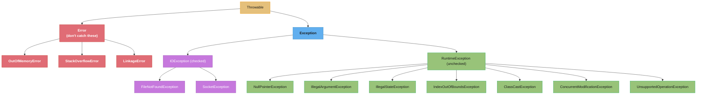
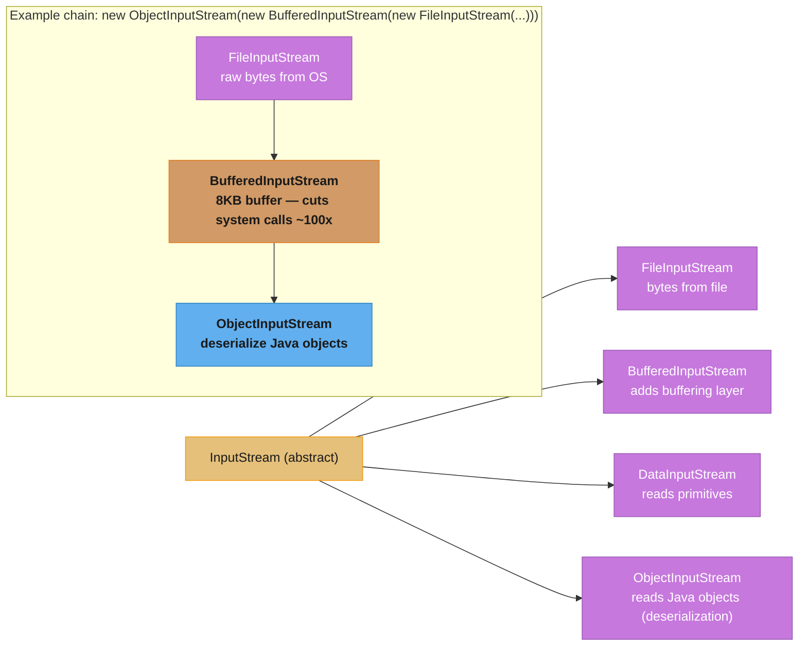
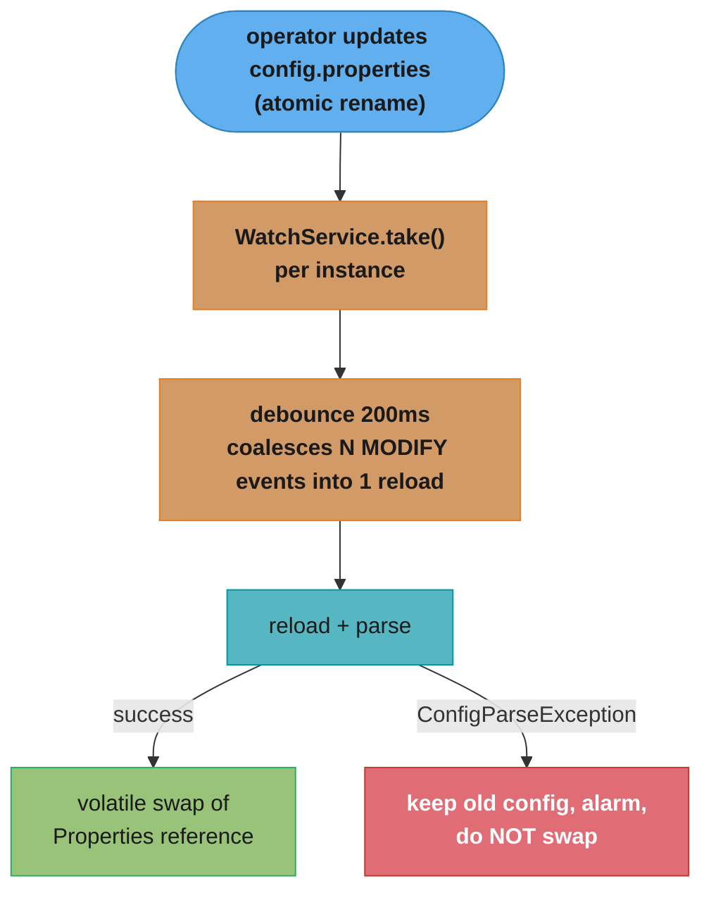

# Exceptions & I/O

## 1. Concept Overview

Java's exception system and I/O stack are foundational to every production application. Understanding the distinction between checked and unchecked exceptions, the semantics of `try-with-resources`, suppressed exceptions, and the NIO.2 path API are critical for writing robust, resource-safe code.

The I/O story covers two generations: the original `java.io` stream-based API (Decorator pattern over byte streams) and the modern `java.nio.file` (NIO.2) path-based API introduced in Java 7. Serialization — using `ObjectInputStream`/`ObjectOutputStream` — is covered here including its security risks.

---

## 2. Intuition

> **One-line analogy**: Exceptions are the "abnormal return path" of a method — checked exceptions say "I expect you to handle this specific failure," unchecked exceptions say "this is a programming error or unexpected system failure."

**Mental model**: A method call has two return paths: the normal path (return statement) and the exceptional path (throw statement). Checked exceptions encode expected failure modes in the method signature — callers must explicitly handle or re-throw them. Unchecked (runtime) exceptions represent bugs or system failures that callers typically cannot recover from.

**Why it matters**: Choosing checked vs unchecked exceptions is a design decision with broad consequences for API usability. `try-with-resources` prevents resource leaks that were common with pre-Java 7 try-finally patterns. Serialization security vulnerabilities have caused multiple critical CVEs (Log4Shell involved deserialization of untrusted data).

**Key insight**: The `finally` block edge cases — exception thrown in `finally` *swallows* the original exception; `System.exit()` in `try` skips `finally` — are subtle but appear in interviews and production incidents.

---

## 3. Core Principles

- **Checked exceptions**: Must be declared in `throws` clause or caught. Signal expected, recoverable failures.
- **Unchecked exceptions**: `RuntimeException` and subclasses + `Error` subclasses. Not required to declare.
- **Exception chaining**: Preserve the original cause with `new WrappedException("msg", cause)`.
- **AutoCloseable**: Implementing `close()` enables use with `try-with-resources`.
- **Suppressed exceptions**: When both `try` body and `close()` throw, the body exception wins and the close exception is added as a suppressed exception.
- **Fail-fast with context**: Custom exceptions should include enough context to diagnose the problem without the stack trace.

---

## 4. Types / Architectures / Strategies

### 4.1 Exception Hierarchy



### 4.2 Checked vs Unchecked Decision Rule

| Situation | Use |
|-----------|-----|
| Caller CAN reasonably recover (e.g., file not found → create it) | Checked |
| Programming error (null passed to non-null param) | Unchecked (IllegalArgumentException) |
| Invalid state (method called in wrong lifecycle order) | Unchecked (IllegalStateException) |
| System-level failure caller can't recover from | Unchecked or Error |
| Library/API that wraps lower-level (e.g., Spring) | Unchecked (unwrap checked to unchecked) |

### 4.3 I/O API Generations

| Generation | Package | Key Classes | Notes |
|-----------|---------|-------------|-------|
| Classic I/O | `java.io` | File, InputStream, OutputStream, Reader, Writer | Stream-based, blocking |
| NIO (non-blocking) | `java.nio` | ByteBuffer, Channel, Selector | High-performance, complex |
| NIO.2 (Path API) | `java.nio.file` | Path, Files, Paths, WatchService | Clean file operations, Java 7+ |

---

## 5. Architecture Diagrams

### I/O Decorator Chain


### try-with-resources and Suppressed Exceptions
```
try (Resource r1 = new Resource1(); Resource r2 = new Resource2()) {
    r2.use();  // throws IOException
}
// Close order: LIFO (r2 first, then r1)
// r2.close() throws CloseException
// Result: IOException is the primary exception
//         CloseException is added as suppressed: ex.getSuppressed()[0]

// Access:
catch (IOException e) {
    Throwable[] suppressed = e.getSuppressed();  // [CloseException]
}

// Contrast with old try-finally:
Resource r = null;
try {
    r = new Resource();
    r.use();  // throws IOException
} finally {
    r.close();  // throws CloseException
    // IOException is LOST — finally exception replaces it
}
```

---

## 6. How It Works — Detailed Mechanics

### Custom Exception Design

```java
// Good custom exception: includes context, preserves cause
public class OrderProcessingException extends RuntimeException {
    private final String orderId;
    private final OrderStatus failedStatus;

    public OrderProcessingException(String orderId, OrderStatus status, Throwable cause) {
        super("Order " + orderId + " failed during transition to " + status, cause);
        this.orderId = orderId;
        this.failedStatus = status;
    }

    public String getOrderId() { return orderId; }
    public OrderStatus getFailedStatus() { return failedStatus; }
}

// Usage: context is in the exception, cause chain preserved
try {
    database.save(order);
} catch (DataAccessException e) {
    throw new OrderProcessingException(order.getId(), SAVING, e);
}
```

### finally Block Edge Cases

```java
// EDGE CASE 1: Exception in finally swallows original
try {
    throw new IOException("original");
} finally {
    throw new RuntimeException("finally");  // IOException is LOST
}
// Only RuntimeException propagates — original exception silently swallowed

// EDGE CASE 2: System.exit() skips finally
try {
    System.exit(0);  // JVM exits; finally block does NOT run
} finally {
    System.out.println("This never prints");
}

// EDGE CASE 3: Return in try vs finally
int method() {
    try {
        return 1;
    } finally {
        return 2;  // overrides return 1 — ALWAYS returns 2
    }
}
```

### NIO.2 Path API

```java
// Modern file operations
Path path = Path.of("/data", "reports", "2024.csv");
Path absolute = path.toAbsolutePath();
Path normalized = path.normalize();  // resolve .. and .

// Read
String content = Files.readString(path, StandardCharsets.UTF_8);
List<String> lines = Files.readAllLines(path);
Stream<String> lazyLines = Files.lines(path);  // lazy; close the stream

// Write
Files.writeString(path, content, StandardOpenOption.CREATE, StandardOpenOption.APPEND);
Files.write(path, bytes);

// Copy / Move
Files.copy(src, dst, StandardCopyOption.REPLACE_EXISTING);
Files.move(src, dst, StandardCopyOption.ATOMIC_MOVE);  // atomic on same filesystem

// Directory walk
Files.walk(Paths.get("/data"))
    .filter(Files::isRegularFile)
    .filter(p -> p.toString().endsWith(".log"))
    .forEach(this::processLog);

// Watch for changes
WatchService watcher = FileSystems.getDefault().newWatchService();
path.register(watcher, ENTRY_CREATE, ENTRY_MODIFY, ENTRY_DELETE);
WatchKey key = watcher.take();  // blocks until change
for (WatchEvent<?> event : key.pollEvents()) { ... }
```

### Serialization Security Risk

```java
// DANGEROUS: deserializing untrusted data
ObjectInputStream ois = new ObjectInputStream(untrustedInputStream);
Object obj = ois.readObject();  // arbitrary code execution via gadget chains!

// How: readObject() can invoke arbitrary methods on deserialized objects
// Gadget chains: Apache Commons Collections 3.x famously exploited
// Java EE servers, Jenkins, WebLogic — all had critical deserialization CVEs

// Safer alternatives:
// 1. Use JSON (Jackson, Gson) — no code execution risk
// 2. Use protobuf/Avro for binary serialization
// 3. If must use ObjectInputStream: implement ObjectInputFilter
ObjectInputStream ois = new ObjectInputStream(in);
ois.setObjectInputFilter(ObjectInputFilter.Config.createFilter(
    "com.myapp.*;java.util.*;!*"  // allowlist
));
```

### readResolve for Singleton Deserialization

```java
// Problem: deserializing a singleton creates a new instance
public class ConfigSingleton implements Serializable {
    private static final ConfigSingleton INSTANCE = new ConfigSingleton();
    private ConfigSingleton() {}
    public static ConfigSingleton getInstance() { return INSTANCE; }

    // Fix: readResolve replaces deserialized instance with existing singleton
    private Object readResolve() {
        return INSTANCE;  // discard the deserialized object
    }
}
// Better fix: use enum-based singleton (Effective Java Item 3)
// enum is inherently serialization-safe; readResolve is handled by JVM
```

### Thread.UncaughtExceptionHandler

```java
// Problem: unchecked exceptions inside ExecutorService tasks are SILENTLY SWALLOWED
ExecutorService pool = Executors.newFixedThreadPool(4);
pool.submit(() -> {
    throw new RuntimeException("something failed");  // silently swallowed!
    // The task terminates, no log, no alert, the thread is recycled
});

// WHY: submit(Runnable) catches all exceptions, stores in the Future
// If Future.get() is never called, the exception is lost forever.

// FIX 1: use submit(Callable) and call Future.get()
Future<?> future = pool.submit(() -> {
    throw new RuntimeException("failed");
});
try {
    future.get();  // throws ExecutionException wrapping the original
} catch (ExecutionException e) {
    log.error("Task failed: {}", e.getCause().getMessage(), e.getCause());
}

// FIX 2: set UncaughtExceptionHandler via custom ThreadFactory
ThreadFactory factory = runnable -> {
    Thread t = new Thread(runnable);
    t.setUncaughtExceptionHandler((thread, throwable) -> {
        log.error("Thread {} threw: {}", thread.getName(), throwable.getMessage(), throwable);
        // alert, metric, restart logic...
    });
    return t;
};
ExecutorService pool = Executors.newFixedThreadPool(4, factory);

// FIX 3: global default for all threads not covered by a specific handler
Thread.setDefaultUncaughtExceptionHandler((thread, throwable) -> {
    log.error("UNCAUGHT in {}: {}", thread.getName(), throwable.getMessage(), throwable);
});
// This is a catch-all; prefer per-pool handlers for finer control.

// NOTE: UncaughtExceptionHandler is NOT invoked for CHECKED exceptions
// (they must be declared; they can't be thrown from Runnable.run())
// It IS invoked for: RuntimeException, Error, and all unchecked Throwables.
```

### FileChannel — Memory-Mapped Files and Zero-Copy

```java
// Memory-mapped files (MappedByteBuffer): map file into process's virtual address space
// OS handles page faults — no explicit read() calls; data accessed like a byte array
try (FileChannel channel = FileChannel.open(Path.of("large.bin"), READ)) {
    // Map up to 1GB of the file starting at offset 0
    MappedByteBuffer buffer = channel.map(
        FileChannel.MapMode.READ_ONLY,  // READ_ONLY, READ_WRITE, PRIVATE
        0,               // position: start of file
        channel.size()   // size: entire file
    );

    // Direct memory access — no JVM heap allocation for the data
    while (buffer.hasRemaining()) {
        byte b = buffer.get();  // OS page fault on first access to a page
        process(b);
    }
}
// Use cases: parsing large binary files (log files, database files), read-heavy workloads
// Limitation: MappedByteBuffer stays mapped until GC — can't force unmap easily
// Risk: on JVM with compressed oops, mapping > 2GB requires explicit FileChannel.position handling

// Zero-copy transfer between channels (sendfile(2) on Linux):
try (FileChannel src  = FileChannel.open(Path.of("input.bin"), READ);
     FileChannel dest = FileChannel.open(Path.of("output.bin"), WRITE, CREATE)) {

    // transferTo: OS copies directly from page cache to destination — never goes through JVM heap
    long bytesTransferred = src.transferTo(0, src.size(), dest);
    // Or: dest.transferFrom(src, 0, src.size());
}
// transferTo/transferFrom maps to sendfile(2) on Linux, TransmitFile on Windows
// For large files: 2-10x faster than stream-based copy (no user-space buffer)
// This is how Files.copy() works internally for FileChannel-to-FileChannel copies

// File locking:
try (FileChannel channel = FileChannel.open(path, READ, WRITE);
     FileLock lock = channel.lock()) {  // exclusive lock on whole file (blocks until available)
    // ... modify file safely across processes
}  // lock released automatically
// channel.tryLock(): non-blocking; returns null if locked by another process
// Shared lock: channel.lock(position, size, /*shared=*/true)
```

### WatchService OVERFLOW Event

```java
WatchService watcher = FileSystems.getDefault().newWatchService();
Path dir = Path.of("/watched/dir");
dir.register(watcher, ENTRY_CREATE, ENTRY_MODIFY, ENTRY_DELETE);

while (true) {
    WatchKey key = watcher.take();  // blocks until event

    for (WatchEvent<?> event : key.pollEvents()) {
        WatchEvent.Kind<?> kind = event.kind();

        // CRITICAL: always handle OVERFLOW
        if (kind == StandardWatchEventKinds.OVERFLOW) {
            // OVERFLOW means: events were generated faster than consumed.
            // The OS's event queue for this directory was full and events were DROPPED.
            // You CANNOT know which files changed — do a full directory rescan.
            log.warn("WatchService OVERFLOW: rescanning entire directory");
            rescandDirectory(dir);
            continue;
        }

        Path changed = (Path) event.context();
        log.info("Event {} on file {}", kind, dir.resolve(changed));

        // ENTRY_CREATE: new file created
        // ENTRY_MODIFY: existing file modified (may fire multiple times for one save)
        // ENTRY_DELETE: file deleted
    }

    boolean valid = key.reset();  // MUST call reset() to receive further events
    if (!valid) {
        // Directory was deleted — stop watching
        break;
    }
}

// When OVERFLOW happens:
// - High-frequency file writes (log rotation, build output)
// - Producer writes faster than consumer processes events
// - OS WatchKey event queue default size is limited (32 events on some platforms)
// Production patterns: rate-limit processing, coalesce events (deduplicate same file),
//                      handle OVERFLOW as "something changed, re-check everything"
```

---

## 7. Real-World Examples

- **JDBC resource leaks**: Before Java 7, `finally` blocks to close `Connection`/`Statement`/`ResultSet` were error-prone (exception in `finally` swallowed original). `try-with-resources` eliminates this pattern.
- **Log4Shell (2021)**: Java serialization/deserialization via Log4j's JNDI lookup executed arbitrary code from remote server. Affected virtually every Java application. Demonstrates why untrusted deserialization is critical vulnerability.
- **Configuration file watching**: `WatchService` enables live-reloading of configuration files without polling, used in Hadoop, Tomcat, and custom config servers.

---

## 8. Tradeoffs

| Checked Exceptions | Unchecked Exceptions |
|-------------------|--------------------|
| Force callers to handle | No caller burden |
| Self-documenting API | Simpler API surface |
| Java compile-time safety | Less type system clutter |
| Verbose (catch chains) | Risk of uncaught swallowing |
| Spring converts to unchecked | Most modern frameworks prefer unchecked |

---

## 9. When to Use / When NOT to Use

**Use checked exceptions**:
- When the failure is expected and recoverable (file not found, network timeout)
- When the caller MUST make a decision about the failure
- For library APIs where callers are unknown (public API design)

**Use unchecked exceptions**:
- For programming errors (`NullPointerException`, `IllegalArgumentException`)
- When the failure is so catastrophic the caller can't recover
- In frameworks and application code (Spring-style)

**Use `try-with-resources`**: always, for any `AutoCloseable` resource.

**Never use `Throwable` or `Error` in catch**: you should never catch `OutOfMemoryError` — the JVM state is undefined.

---

## 10. Common Pitfalls

### War Story 1: Empty catch block — exception silently swallowed
```java
try {
    sendEmail(user);
} catch (Exception e) {
    // TODO: handle this later
}
// "later" never comes; email silently fails; user never notified
// Fix: at minimum, log the exception with full context
```

### War Story 2: Exception in finally swallows original
A JDBC application threw a `SQLException` in the `try` block (query failed). The `finally` block tried to close the connection, which also threw `SQLException` (connection already closed). The original meaningful exception was replaced by the less informative connection-close exception. **Fix**: Use `try-with-resources` — it handles this correctly with suppressed exceptions.

### War Story 3: Serialization breaks singleton
A team was surprised to find their singleton getting duplicated after cache serialization. Object deserialization calls the no-arg constructor and returns a new instance — separate from the existing singleton. **Fix**: Implement `readResolve()` or switch to enum singleton.

### War Story 4: `serialVersionUID` mismatch
After adding a field to a serialized class without updating `serialVersionUID`, the deserialization of stored data threw `InvalidClassException`. **Fix**: Always declare `private static final long serialVersionUID = 1L;` (or IDE-generated UID) and follow versioning discipline when changing serialized classes.

---

## 11. Technologies & Tools

| Tool | Purpose |
|------|---------|
| `java.nio.file.Files` | Modern file operations |
| `java.nio.file.WatchService` | File system change notifications |
| `java.io.ObjectInputFilter` | Allowlist for safe deserialization |
| `Path.of()` (Java 11+) | Create Path (replaces Paths.get()) |
| SpotBugs / SonarQube | Detect empty catch blocks, serialization issues |

---

## 12. Interview Questions with Answers

**Q1: When should you use checked vs unchecked exceptions?**
Checked exceptions signal *expected, recoverable* failure conditions where the caller can reasonably react differently: `FileNotFoundException` (caller may create the file), `IOException` (caller may retry), `ParseException` (caller may use a default). Unchecked exceptions signal programming errors or unrecoverable failures: `NullPointerException` (caller passed null where not allowed), `IllegalArgumentException` (bad input), `IllegalStateException` (wrong lifecycle). The controversy: many modern frameworks (Spring) prefer unchecked because checked exceptions pollute APIs and callers often just re-throw. Effective Java: "use checked exceptions for conditions from which the caller can reasonably be expected to recover."

**Q2: What is exception chaining and why is it important?**
Exception chaining preserves the original cause when wrapping exceptions: `new ServiceException("DB failed", originalCause)`. This is critical because: (1) the catch block at a higher level sees a meaningful high-level exception; (2) the stack trace includes both the wrapper's context AND the root cause, making diagnosis possible. Without chaining, catching a low-level `SQLException` and rethrowing `new ServiceException("failed")` loses the original stack trace — you only see where the wrapping occurred, not the actual DB error.

**Q3: What happens if a `finally` block throws an exception?**
The exception thrown in `finally` *replaces* the original exception from the `try` block. The original exception is silently lost — it's not added as suppressed (unlike `try-with-resources`). This is a classic bug in pre-Java 7 code that used try-finally for resource cleanup. `try-with-resources` solves this correctly: the exception from the `try` body is primary, and exceptions from `close()` are added as suppressed exceptions via `Throwable.addSuppressed()`.

**Q4: How does `try-with-resources` handle multiple resources and their exceptions?**
Resources are closed in LIFO (reverse declaration) order. If the `try` body throws exception E1, resources are closed. If closing a resource throws exception E2, E1 is the primary exception and E2 is added as a suppressed exception (`E1.getSuppressed()` returns `[E2]`). If multiple resources' `close()` methods throw, each close exception is added as suppressed in close order. The `try` body exception always takes priority — this preserves the meaningful original error.

**Q5: What is a suppressed exception?**
A suppressed exception is one that was thrown during the cleanup phase (e.g., `close()` in `try-with-resources`) when another exception was already in flight from the `try` body. Java 7 added `Throwable.addSuppressed(Throwable)` and `Throwable.getSuppressed()`. The primary exception propagates; suppressed exceptions are attached to it. Accessing them: `catch (IOException e) { Throwable[] suppressed = e.getSuppressed(); }`. Logging frameworks should log suppressed exceptions too.

**Q6: Why is Java serialization a security risk?**
Deserialization invokes `readObject()` on each object being deserialized, which can execute arbitrary Java code. Attackers craft "gadget chains" — sequences of classes in common libraries (Apache Commons Collections, Spring, etc.) whose `readObject()` methods, when chained together, execute shell commands. This has affected WebLogic, Jenkins, JBoss, Apache Camel. The attack doesn't require any special privileges — just the ability to send bytes to `ObjectInputStream.readObject()`. Fix: use JSON/protobuf; if Java serialization is required, use `ObjectInputFilter` allowlisting.

**Q7: What does `transient` do?**
`transient` marks a field that should be excluded from serialization. When the object is serialized, transient fields are not written; when deserialized, they get their default value (null for objects, 0 for primitives, false for boolean). Use for: sensitive data (passwords), derived values (cache fields), non-serializable objects (threads, streams). You can provide `readObject(ObjectInputStream ois)` to reinitialize transient fields after deserialization.

**Q8: How does `readResolve()` work for singleton deserialization?**
After an object is deserialized, if it defines a `readResolve()` method, the JVM calls it and uses the returned object instead of the deserialized one. For singletons, `readResolve()` returns the existing singleton instance — the deserialized copy is discarded by GC. This prevents deserialization from breaking the singleton invariant. The method signature must be `private Object readResolve()`. Better approach: use enum-based singleton (Effective Java Item 3) — the JVM handles enum serialization correctly by design, using the name to look up the existing constant.

**Q9: What is the Decorator pattern in Java I/O, and give an example?**
The Decorator pattern adds behavior to objects by wrapping them in objects with the same interface. Java I/O is built on it: `InputStream` is the component; `FileInputStream` is the concrete component; `BufferedInputStream`, `DataInputStream`, `CipherInputStream` are decorators that each wrap an `InputStream` and add a capability (buffering, primitive reading, encryption). Example: `new BufferedReader(new InputStreamReader(new FileInputStream("file.txt"), "UTF-8"))` — 3 decorators stacked to give buffered, charset-decoded, file-backed character reading.

**Q10: When would you use NIO.2 `WatchService`?**
`WatchService` provides OS-level filesystem change notifications (inotify on Linux, FSEvents on macOS, ReadDirectoryChangesW on Windows) — more efficient than polling. Use it for: hot-reloading configuration files without restart; monitoring upload directories for new files; log rotation detection; build tool file watchers (IDE hot reload). Example: `path.register(watcher, ENTRY_CREATE, ENTRY_MODIFY)` then `watcher.take()` blocks until a change, processes events, resets the key, and loops.

**Q11: What is the difference between `Files.copy()` and manually copying with streams?**
`Files.copy(src, dst, REPLACE_EXISTING)` is the idiomatic NIO.2 copy. The JVM can optimize it via OS-level copy (e.g., `sendfile(2)` on Linux), which copies data in kernel space without going through user space — zero-copy for large files. Manual stream copy: `while ((n = in.read(buf)) != -1) out.write(buf, 0, n)` — data goes through user-space buffer (typically 8KB). `Files.copy()` is also correct with respect to attributes, exceptions, and resource cleanup. Always prefer `Files.copy()` unless you need to transform data during the copy.

**Q12: How do you handle unchecked exceptions thrown inside `ExecutorService` tasks?**
When a `Runnable` submitted to an `ExecutorService` throws an unchecked exception, it is silently swallowed — the exception is stored in the `Future` but nothing else happens unless `Future.get()` is called. Three approaches: (1) Always call `Future.get()` after `submit()` — it re-throws as `ExecutionException` wrapping the original. (2) Set a `Thread.UncaughtExceptionHandler` via a custom `ThreadFactory` — the handler is invoked with the thread and throwable for any uncaught exception. (3) Use a global default: `Thread.setDefaultUncaughtExceptionHandler(handler)`. Note: `UncaughtExceptionHandler` is NOT invoked for `Callable`-based tasks (their exceptions are captured in the `Future`), only for `Runnable`-based tasks where the exception escapes the thread completely.

**Q13: What is a memory-mapped file and when would you use `FileChannel.map()`?**
A memory-mapped file maps a region of a file into the process's virtual address space via `FileChannel.map()`, returning a `MappedByteBuffer`. The OS manages paging: reading a byte triggers a page fault that loads the 4KB OS page from disk into memory. No explicit `read()` calls needed — the buffer is accessed like a byte array. Benefits: (1) Zero-copy read — no user-space buffer, data goes from OS page cache to application directly. (2) Random access: seeking to position N is O(1) — no stream seeking needed. (3) Shared across processes — multiple JVMs mapping the same file share the OS page cache. Use when: parsing large binary files (log files, database files), implementing file-backed caches, random access to large data sets. Limitation: `MappedByteBuffer` cannot be explicitly unmapped — it relies on GC which can delay file release.

**Q14: What happens when `try`, `catch`, and `finally` all throw exceptions, and which one propagates?**
When `finally` throws an exception, it **suppresses** any exception from `try` or `catch` — the `finally` exception propagates and the others are silently discarded. This is a particularly dangerous failure mode: the original exception that caused the `catch` block to execute is lost:

```java
// BROKEN: exception from finally silently swallows the try exception
try {
    riskyOperation();          // throws IOException "disk full"
} finally {
    closeResource();           // throws IllegalStateException "already closed"
    // IOException is silently discarded; IllegalStateException propagates
}

// FIXED: catch and suppress, or use try-with-resources
try {
    riskyOperation();
} catch (Exception primary) {
    try { closeResource(); } catch (Exception suppressed) {
        primary.addSuppressed(suppressed); // attach, don't replace
    }
    throw primary;
}
// Or: just use try-with-resources — it calls addSuppressed() automatically
```

`try-with-resources` (Java 7) handles this correctly: if both the body and `close()` throw, the close exception is added as a suppressed exception via `Throwable.addSuppressed()` — the primary exception propagates and nothing is lost.

**Q15: What is serialization `serialVersionUID` and what happens when it is absent or mismatched?**
`serialVersionUID` is a 64-bit long stored in the serialized byte stream that identifies the version of the class used to serialize the object. On deserialization, the JVM compares the stream's UID with the class's UID; a mismatch throws `InvalidClassException`. When `serialVersionUID` is absent, the JVM computes a default UID from the class's structure (fields, methods, access modifiers) via a SHA-1-based algorithm. Any structural change (adding a field, renaming a method) changes the computed UID, breaking deserialization of previously serialized data. Two failure modes: (1) **Unintentional break** — adding a field to a class without declaring `serialVersionUID` silently breaks deserialization across deploys. (2) **Declared UID mismatch** — deliberately changing it signals an incompatible version change. Best practice: always declare `private static final long serialVersionUID = 1L;` in all `Serializable` classes, increment it manually only for truly incompatible structural changes.

---

## 13. Best Practices

1. **Always use `try-with-resources`** for any `AutoCloseable` (streams, connections, channels).
2. **Never swallow exceptions silently** — at minimum, `log.error("Failed: {}", e.getMessage(), e)`.
3. **Include context in exception messages** — order ID, user ID, the input that caused the failure.
4. **Preserve exception cause** with `new WrapperException("msg", originalCause)`.
5. **Use `Objects.requireNonNull()` with message** for early validation in public APIs.
6. **Declare `serialVersionUID` explicitly** to control serialization compatibility.
7. **Mark sensitive fields `transient`** in serialized classes (passwords, tokens).
8. **Use `readResolve()` or enum** for serializable singletons.
9. **Never deserialize untrusted data** with plain `ObjectInputStream` — use `ObjectInputFilter` allowlisting.
10. **Prefer `Path`/`Files` over `File`/`FileInputStream`** for all new file I/O code.

---

## 14. Case Study

### A Config File Watcher Hot-Reloading 500 Microservice Instances

**Scenario.** A platform runs **500 microservice instances** that load runtime config (feature flags, rate limits, routing tables) from a properties file mounted via a shared volume / ConfigMap. Operators push a config change and expect every instance to pick it up **without a restart** — restarting 500 instances drops in-flight requests and takes ~10 minutes of rolling deploys. Each instance runs a `WatchService` (Java NIO.2, Java 7+) loop that detects file changes and atomically swaps the config reference. The tricky parts are that the editor/writer fires **multiple `MODIFY` events per save** (one per buffer flush) and that an empty `catch` would silently swallow a parse failure, leaving the fleet running stale config believing it reloaded.



#### Domain exception hierarchy with structured error codes

```java
public sealed class ConfigException extends RuntimeException
        permits ConfigParseException, ConfigNotFoundException {
    private final String code;
    protected ConfigException(String code, String msg, Throwable cause) {
        super(msg, cause);            // PRESERVE the cause -> keeps the original stack trace
        this.code = code;
    }
    public String code() { return code; }
}
public final class ConfigParseException extends ConfigException {
    public ConfigParseException(String msg, Throwable cause) {
        super("CFG-PARSE-001", msg, cause);
    }
}
public final class ConfigNotFoundException extends ConfigException {
    public ConfigNotFoundException(String path) {
        super("CFG-NOTFOUND-002", "Config not found: " + path, null);
    }
}
```

#### Watch loop with debouncing and try-with-resources

```java
public final class ConfigWatcher implements AutoCloseable {
    private final Path file;
    private volatile Properties config;            // visibility across reader threads
    private final WatchService watcher;
    private final Thread loop;

    public ConfigWatcher(Path file) throws IOException {
        this.file = file;
        this.config = load(file);
        this.watcher = FileSystems.getDefault().newWatchService();
        file.getParent().register(watcher, StandardWatchEventKinds.ENTRY_MODIFY);
        this.loop = Thread.ofVirtual().start(this::watchLoop);
    }

    private void watchLoop() {
        while (!Thread.currentThread().isInterrupted()) {
            WatchKey key;
            try { key = watcher.take(); }                      // try-with-resources on the key below
            catch (InterruptedException e) { Thread.currentThread().interrupt(); return; }
            try {
                Thread.sleep(200);                             // DEBOUNCE: let burst of MODIFYs settle
                boolean changed = key.pollEvents().stream()
                        .anyMatch(ev -> file.getFileName().equals(ev.context()));
                if (changed) {
                    try { config = load(file); }               // atomic reference swap on success
                    catch (ConfigParseException pe) {
                        log.error("Reload {} failed; keeping previous config", pe.code(), pe);
                        // do NOT swap: a bad file must not blank out live config
                    }
                }
            } catch (InterruptedException e) { Thread.currentThread().interrupt(); return; }
            finally { key.reset(); }                           // re-arm the key, always
        }
    }

    private Properties load(Path path) {
        Properties p = new Properties();
        try (InputStream in = Files.newInputStream(path)) {    // try-with-resources closes the FD
            p.load(in);
        } catch (NoSuchFileException e) {
            throw new ConfigNotFoundException(path.toString());
        } catch (IOException e) {
            throw new ConfigParseException("Cannot read " + path, e);  // chain the cause
        }
        return p;
    }

    public String get(String k) { return config.getProperty(k); }
    @Override public void close() throws IOException { loop.interrupt(); watcher.close(); }
}
```

### Common Pitfalls (production war stories)

**1. Empty catch block hid the production error.** An early loader had `catch (IOException e) {}`. A malformed config silently failed to load; the fleet ran 6 hours on stale flags before anyone noticed, because nothing logged or alarmed. Always log with the exception object (not just `getMessage()`) or rethrow.

```java
catch (IOException e) { }                              // BROKEN: silent failure
catch (IOException e) { throw new ConfigParseException("load failed", e); }  // FIX
```

**2. `FileInputStream` leaked file descriptors.** Pre-NIO code did `InputStream in = new FileInputStream(f); p.load(in);` with `close()` only on the happy path. Parse exceptions skipped the close, leaking an FD per failed reload; after enough failures the JVM hit `Too many open files`. try-with-resources closes on every path.

**3. Catching `Throwable` swallowed `Error`.** A defensive `catch (Throwable t)` around the reload caught `OutOfMemoryError` and `StackOverflowError`, masking JVM-fatal conditions and letting the process limp on corrupted. Catch the specific checked/runtime types you can actually handle.

**4. Breaking the exception chain.** A wrapper did `throw new ConfigException(e.getMessage())`, discarding the original cause — logs showed "Cannot read config" with no underlying stack trace, so root-causing took hours.

```java
throw new ConfigException(e.getMessage());     // BROKEN: loses cause + stack trace
throw new ConfigParseException("load failed", e);  // FIX: cause preserved, full trace in logs
```

### Interview Discussion Points

**Why does saving a file fire multiple `MODIFY` events, and how do you handle it?** Editors and OS buffers flush in chunks, and an atomic save (write temp + rename) can produce several `ENTRY_MODIFY`/`ENTRY_CREATE` events. Debouncing (coalesce events within a short window, e.g. 200ms, then reload once) prevents reloading mid-write and avoids redundant parses.

**When should an exception be checked vs unchecked?** Checked for recoverable conditions the caller is expected to handle (e.g. `IOException`); unchecked for programming errors or unrecoverable domain failures. Here `ConfigException` is unchecked because a misconfigured file is not something each call site can sensibly recover from — it is logged and the old config is retained.

**Why is preserving the cause critical?** Passing the original `Throwable` to the wrapper's constructor keeps the full causal chain (`Caused by:` in the stack trace), which is the single most important artifact for debugging a production failure. Copying only `getMessage()` throws away the line where it actually broke.

**Why a `volatile` reference for the config?** Readers on many threads must see the new `Properties` object immediately after a reload swaps the reference. `volatile` provides the visibility (happens-before) guarantee; the swap itself is a single atomic reference assignment, so no lock is needed for the read path.

---

## Related / See Also

- [Networking & HTTP Client](../networking_and_http_client/README.md) — IOException handling in HTTP calls, connection-level error hierarchies
- [JDBC & Database](../jdbc_and_database/README.md) — SQLException hierarchy, try-with-resources for connection cleanup
- [Fault Tolerance Patterns](../../backend/fault_tolerance_patterns/README.md) — retries, circuit breakers, and timeout strategies that build on checked/unchecked error handling
- [File & Storage Fundamentals](../../cs_fundamentals/database_and_storage_fundamentals/README.md) — I/O buffering and page-cache concepts underlying `BufferedInputStream` and memory-mapped files

**Why never catch `Throwable` broadly?** `Throwable` includes `Error` subclasses (`OutOfMemoryError`, `StackOverflowError`) that signal JVM-level failures you cannot meaningfully recover from. Swallowing them keeps a doomed process running in a corrupt state; catch `Exception` or the specific types instead.
