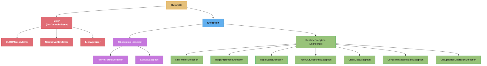
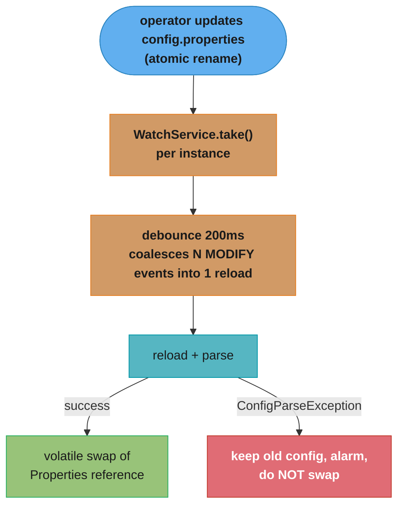

# Exceptions & I/O

## 1. Concept Overview

Java's exception system and I/O stack are foundational to every production application. Understanding the distinction between checked and unchecked exceptions, the semantics of `try-with-resources`, suppressed exceptions, and the NIO.2 path API are critical for writing robust, resource-safe code.

The I/O story covers two generations: the original `java.io` stream-based API (Decorator pattern over byte streams) and the modern `java.nio.file` (NIO.2) path-based API introduced in Java 7. Serialization — using `ObjectInputStream`/`ObjectOutputStream` — is covered here including its security risks.

---

## 2. Intuition

> **One-line analogy**: Exceptions are the "abnormal return path" of a method — checked exceptions say "I expect you to handle this specific failure," unchecked exceptions say "this is a programming error or unexpected system failure."

**Mental model**: A method call has two return paths: the normal path (return statement) and the exceptional path (throw statement). Checked exceptions encode expected failure modes in the method signature — callers must explicitly handle or re-throw them. Unchecked (runtime) exceptions represent bugs or system failures that callers typically cannot recover from.

**Why it matters**: Choosing checked vs unchecked exceptions is a design decision with broad consequences for API usability. `try-with-resources` prevents resource leaks that were common with pre-Java 7 try-finally patterns. Deserializing untrusted data has caused a long line of critical RCEs — the Apache Commons Collections gadget chain that broke WebLogic, JBoss and Jenkins, and Log4j 1.x's `SocketServer` (CVE-2019-17571) — which is why `ObjectInputFilter` exists.

**Key insight**: The `finally` block edge cases — exception thrown in `finally` *swallows* the original exception; `System.exit()` in `try` skips `finally` — are subtle but appear in interviews and production incidents.

---

## 3. Core Principles

- **Checked exceptions**: Must be declared in `throws` clause or caught. Signal expected, recoverable failures.
- **Unchecked exceptions**: `RuntimeException` and subclasses + `Error` subclasses. Not required to declare.
- **Exception chaining**: Preserve the original cause with `new WrappedException("msg", cause)`.
- **AutoCloseable**: Implementing `close()` enables use with `try-with-resources`.
- **Suppressed exceptions**: When both `try` body and `close()` throw, the body exception wins and the close exception is added as a suppressed exception.
- **Fail-fast with context**: Custom exceptions should include enough context to diagnose the problem without the stack trace.

---

## 4. Types / Architectures / Strategies

### 4.1 Exception Hierarchy



### 4.2 Checked vs Unchecked Decision Rule

| Situation | Use |
|-----------|-----|
| Caller CAN reasonably recover (e.g., file not found → create it) | Checked |
| Programming error (null passed to non-null param) | Unchecked (IllegalArgumentException) |
| Invalid state (method called in wrong lifecycle order) | Unchecked (IllegalStateException) |
| System-level failure caller can't recover from | Unchecked or Error |
| Library/API that wraps lower-level (e.g., Spring) | Unchecked (unwrap checked to unchecked) |

### 4.3 I/O API Generations

| Generation | Package | Key Classes | Notes |
|-----------|---------|-------------|-------|
| Classic I/O | `java.io` | File, InputStream, OutputStream, Reader, Writer | Stream-based, blocking |
| NIO (non-blocking) | `java.nio` | ByteBuffer, Channel, Selector | High-performance, complex |
| NIO.2 (Path API) | `java.nio.file` | Path, Files, Paths, WatchService | Clean file operations, Java 7+ |

---

## 5. Architecture Diagrams

### I/O Decorator Chain

```mermaid
flowchart LR
    classDef io      fill:#61afef,stroke:#2e86c1,color:#1a1a1a,font-weight:bold
    classDef frozen  fill:#c678dd,stroke:#9b59b6,color:#fff
    classDef train   fill:#98c379,stroke:#27ae60,color:#1a1a1a
    classDef mathOp  fill:#d19a66,stroke:#e67e22,color:#1a1a1a,font-weight:bold
    classDef lossN   fill:#e06c75,stroke:#c0392b,color:#fff,font-weight:bold
    classDef req     fill:#56b6c2,stroke:#0097a7,color:#1a1a1a
    classDef base    fill:#e5c07b,stroke:#f39c12,color:#1a1a1a

    IS["InputStream (abstract)"] --> FIS["FileInputStream\nbytes from file"]
    IS --> BIS["BufferedInputStream\nadds buffering layer"]
    IS --> DIS["DataInputStream\nreads primitives"]
    IS --> OIS["ObjectInputStream\nreads Java objects (deserialization)"]

    subgraph CHAIN["Example chain: new ObjectInputStream(new BufferedInputStream(new FileInputStream(...)))"]
        F2["FileInputStream\nraw bytes from OS"] --> B2["BufferedInputStream\n8KB buffer — cuts system calls ~100x"]
        B2 --> O2["ObjectInputStream\ndeserialize Java objects"]
    end

    class IS base
    class FIS,BIS,DIS,OIS frozen
    class F2 frozen
    class B2 mathOp
    class O2 io
```


**In plain terms.** "A buffer does not make reads faster — it makes them *fewer*. The speedup is simply how many application-level reads you can now serve out of one trip into the kernel."

That reframing tells you when buffering is worth nothing: if the caller already reads in 8 KB chunks, wrapping in a `BufferedInputStream` adds a copy and saves no system call at all. The win is entirely a function of how small the caller's reads are.

| Symbol | What it is |
|--------|------------|
| `B` | Buffer size — `BufferedInputStream`'s default is 8192 bytes (8 KB) |
| `r` | Bytes the application asks for per call — 1 for `read()`, ~80 for a line of text |
| `B / r` | System-call reduction factor: reads served per kernel trip |
| `F / B` | Total `read(2)` calls to consume a file of `F` bytes through the buffer |
| unbuffered | `F / r` kernel trips — one per application read, no amortization |

**Walk one example.** Consuming a 1 MB file (`F` = 1,048,576 bytes), `B` = 8192:

```
  buffered kernel trips   =  F / B  = 1,048,576 / 8,192  =        128   (always)

  reduction factor depends entirely on r = B / r:

    r =    1 B  (read() one byte)    1,048,576 trips -> 128   =  8,192x
    r =   80 B  (one line of text)      13,107 trips -> 128   =    102x   <- the "~100x"
    r = 8192 B  (caller already 8 KB)      128 trips -> 128   =      1x   <- no win
```

The diagram's "~100x" is the line-oriented case: `8192 / 80 = 102.4`. It is not a property of the buffer, it is `B / r` evaluated at a typical text-line size. Byte-at-a-time reading gets the full `8192x`; a caller already reading in 8 KB blocks gets nothing but an extra memory copy.

Why 8 KB and not 64 KB? The buffer is amortization, and amortization has sharply diminishing returns: going 8 KB to 64 KB takes the line-reading case from 102x to 819x, but 128 kernel trips per megabyte were never the bottleneck — while every open stream now holds 8x the memory. Eight kilobytes is roughly two OS pages, large enough that the syscall cost has already vanished into the noise and small enough that ten thousand concurrent streams cost 78 MB rather than 625 MB.

### try-with-resources and Suppressed Exceptions
```
try (Resource r1 = new Resource1(); Resource r2 = new Resource2()) {
    r2.use();  // throws IOException
}
// Close order: LIFO (r2 first, then r1)
// r2.close() throws CloseException
// Result: IOException is the primary exception
//         CloseException is added as suppressed: ex.getSuppressed()[0]

// Access:
catch (IOException e) {
    Throwable[] suppressed = e.getSuppressed();  // [CloseException]
}

// Contrast with old try-finally:
Resource r = null;
try {
    r = new Resource();
    r.use();  // throws IOException
} finally {
    r.close();  // throws CloseException
    // IOException is LOST — finally exception replaces it
}
```

---

## 6. How It Works — Detailed Mechanics

### Custom Exception Design

```java
// Good custom exception: includes context, preserves cause
public class OrderProcessingException extends RuntimeException {
    private final String orderId;
    private final OrderStatus failedStatus;

    public OrderProcessingException(String orderId, OrderStatus status, Throwable cause) {
        super("Order " + orderId + " failed during transition to " + status, cause);
        this.orderId = orderId;
        this.failedStatus = status;
    }

    public String getOrderId() { return orderId; }
    public OrderStatus getFailedStatus() { return failedStatus; }
}

// Usage: context is in the exception, cause chain preserved
try {
    database.save(order);
} catch (DataAccessException e) {
    throw new OrderProcessingException(order.getId(), SAVING, e);
}
```

### finally Block Edge Cases

```java
// EDGE CASE 1: Exception in finally swallows original
try {
    throw new IOException("original");
} finally {
    throw new RuntimeException("finally");  // IOException is LOST
}
// Only RuntimeException propagates — original exception silently swallowed

// EDGE CASE 2: System.exit() skips finally
try {
    System.exit(0);  // JVM exits; finally block does NOT run
} finally {
    System.out.println("This never prints");
}

// EDGE CASE 3: Return in try vs finally
int method() {
    try {
        return 1;
    } finally {
        return 2;  // overrides return 1 — ALWAYS returns 2
    }
}
```

### NIO.2 Path API

```java
// Modern file operations
Path path = Path.of("/data", "reports", "2024.csv");
Path absolute = path.toAbsolutePath();
Path normalized = path.normalize();  // resolve .. and .

// Read
String content = Files.readString(path, StandardCharsets.UTF_8);
List<String> lines = Files.readAllLines(path);
Stream<String> lazyLines = Files.lines(path);  // lazy; close the stream

// Write
Files.writeString(path, content, StandardOpenOption.CREATE, StandardOpenOption.APPEND);
Files.write(path, bytes);

// Copy / Move
Files.copy(src, dst, StandardCopyOption.REPLACE_EXISTING);
Files.move(src, dst, StandardCopyOption.ATOMIC_MOVE);  // atomic on same filesystem

// Directory walk -- Files.walk holds open directory handles, so CLOSE the stream
try (Stream<Path> walk = Files.walk(Path.of("/data"))) {
    walk.filter(Files::isRegularFile)
        .filter(p -> p.toString().endsWith(".log"))
        .forEach(this::processLog);
}

// Watch for changes
WatchService watcher = FileSystems.getDefault().newWatchService();
path.register(watcher, ENTRY_CREATE, ENTRY_MODIFY, ENTRY_DELETE);
WatchKey key = watcher.take();  // blocks until change
for (WatchEvent<?> event : key.pollEvents()) { ... }
```

### The Default Charset — UTF-8 Everywhere Except the Console

Every byte-to-character conversion that does not name a charset uses the *default charset*,
and until Java 18 that was derived from the OS locale — so the same code read a file
correctly on a developer's UTF-8 laptop and produced mojibake on a `LANG=C` container.
JEP 400 (Java 18) fixed it: `Charset.defaultCharset()` is now UTF-8 regardless of locale.

```java
// On Java 18+, with LANG=C in the environment:
Charset.defaultCharset()                     // UTF-8  (was US-ASCII before Java 18)
System.getProperty("file.encoding")          // UTF-8
System.getProperty("native.encoding")        // US-ASCII -- the OS locale charset, Java 17+
System.getProperty("stdout.encoding")        // US-ASCII -- the CONSOLE charset, not UTF-8

// -Dfile.encoding=COMPAT restores the pre-18 locale-derived behaviour, for one bad
// migration only. It is an escape hatch, not a configuration option to leave in place.
// JEP 400 specifies exactly two values, UTF-8 and COMPAT; -Dfile.encoding=ISO-8859-1
// or any other charset name is UNSPECIFIED behaviour, not a supported third option.
```

Three consequences worth carrying into a code review:

1. **`new FileReader(f)`, `new FileWriter(f)`, `new InputStreamReader(in)`, `new PrintStream(f)`,
   `Scanner`, `Formatter`** all take the default charset when you do not pass one, so on
   Java 18+ they are UTF-8 on every machine. That is the fix — but it also means a system
   that *deliberately* wrote platform-encoded files silently changed format at the upgrade.
2. **`Files.readString`, `Files.writeString`, `Files.newBufferedReader`, `Files.lines`** were
   never affected: they have always specified UTF-8 explicitly. Preferring them over
   `FileReader` is why the NIO.2 rule in §13 also happens to be the charset-safe rule.
3. **The console is the exception.** `System.out`/`System.err` still encode with the
   terminal's charset (`stdout.encoding`/`stderr.encoding`), so a program can write correct
   UTF-8 to a file and still print `?` characters to a Windows console. Never diagnose an
   encoding bug from console output alone — check the bytes on disk.

The durable habit is unchanged by any of this: **name the charset explicitly**
(`StandardCharsets.UTF_8`) at every boundary you control, and the default stops mattering.

### Serialization Security Risk

```java
// DANGEROUS: deserializing untrusted data
ObjectInputStream ois = new ObjectInputStream(untrustedInputStream);
Object obj = ois.readObject();  // arbitrary code execution via gadget chains!

// How: readObject() can invoke arbitrary methods on deserialized objects
// Gadget chains: Apache Commons Collections 3.x famously exploited
// Java EE servers, Jenkins, WebLogic — all had critical deserialization CVEs

// Safer alternatives:
// 1. Use JSON (Jackson, Gson) — no code execution risk
// 2. Use protobuf/Avro for binary serialization
// 3. If must use ObjectInputStream: implement ObjectInputFilter
ObjectInputStream ois = new ObjectInputStream(in);
ois.setObjectInputFilter(ObjectInputFilter.Config.createFilter(
    "com.myapp.*;java.util.*;!*"  // allowlist
));
```

### readResolve for Singleton Deserialization

```java
// Problem: deserializing a singleton creates a new instance
public class ConfigSingleton implements Serializable {
    private static final ConfigSingleton INSTANCE = new ConfigSingleton();
    private ConfigSingleton() {}
    public static ConfigSingleton getInstance() { return INSTANCE; }

    // Fix: readResolve replaces deserialized instance with existing singleton
    private Object readResolve() {
        return INSTANCE;  // discard the deserialized object
    }
}
// Better fix: use enum-based singleton (Effective Java Item 3)
// enum is inherently serialization-safe; readResolve is handled by JVM
```

### Thread.UncaughtExceptionHandler

```java
// Problem: unchecked exceptions inside ExecutorService tasks are SILENTLY SWALLOWED
ExecutorService pool = Executors.newFixedThreadPool(4);
pool.submit(() -> {
    throw new RuntimeException("something failed");  // silently swallowed!
    // The task terminates, no log, no alert, the thread is recycled
});

// WHY: submit(Runnable) catches all exceptions, stores in the Future
// If Future.get() is never called, the exception is lost forever.

// FIX 1: use submit(Callable) and call Future.get()
Future<?> future = pool.submit(() -> {
    throw new RuntimeException("failed");
});
try {
    future.get();  // throws ExecutionException wrapping the original
} catch (ExecutionException e) {
    log.error("Task failed: {}", e.getCause().getMessage(), e.getCause());
}

// FIX 2: ThreadPoolExecutor.afterExecute -- the ONLY hook that sees a submit() failure
ExecutorService pool = new ThreadPoolExecutor(4, 4, 0L, TimeUnit.MILLISECONDS,
        new LinkedBlockingQueue<>()) {
    @Override protected void afterExecute(Runnable r, Throwable t) {
        super.afterExecute(r, t);
        if (t == null && r instanceof Future<?> f && f.isDone()) {
            try { f.get(); }                            // surfaces the captured throwable
            catch (CancellationException ce) { /* ignore */ }
            catch (ExecutionException ee) { t = ee.getCause(); }
            catch (InterruptedException ie) { Thread.currentThread().interrupt(); }
        }
        if (t != null) log.error("Task failed", t);
    }
};

// FIX 3: set UncaughtExceptionHandler via custom ThreadFactory.
// IMPORTANT: this fires only for execute(Runnable), where the throwable escapes the
// worker thread. It NEVER fires for submit(), because FutureTask.run() catches the
// throwable and parks it in the Future -- which is exactly the swallowing above.
ThreadFactory factory = runnable -> {
    Thread t = new Thread(runnable);
    t.setUncaughtExceptionHandler((thread, throwable) -> {
        log.error("Thread {} threw: {}", thread.getName(), throwable.getMessage(), throwable);
        // alert, metric, restart logic...
    });
    return t;
};
ExecutorService pool = Executors.newFixedThreadPool(4, factory);

// FIX 4: global default for all threads not covered by a specific handler
Thread.setDefaultUncaughtExceptionHandler((thread, throwable) -> {
    log.error("UNCAUGHT in {}: {}", thread.getName(), throwable.getMessage(), throwable);
});
// Same caveat as FIX 3: execute() reaches it, submit() does not.

// SUMMARY of who sees what:
//   execute(Runnable) + throw  -> UncaughtExceptionHandler fires, afterExecute sees t
//   submit(Runnable/Callable)  -> throwable captured in the Future; UEH never fires;
//                                 only Future.get() or an afterExecute override sees it
```

### FileChannel — Memory-Mapped Files and Zero-Copy

```java
// Memory-mapped files (MappedByteBuffer): map file into process's virtual address space
// OS handles page faults — no explicit read() calls; data accessed like a byte array
try (FileChannel channel = FileChannel.open(Path.of("large.bin"), READ)) {
    // Map up to 1GB of the file starting at offset 0
    MappedByteBuffer buffer = channel.map(
        FileChannel.MapMode.READ_ONLY,  // READ_ONLY, READ_WRITE, PRIVATE
        0,               // position: start of file
        channel.size()   // size: entire file
    );

    // Direct memory access — no JVM heap allocation for the data
    while (buffer.hasRemaining()) {
        byte b = buffer.get();  // OS page fault on first access to a page
        process(b);
    }
}
// Use cases: parsing large binary files (log files, database files), read-heavy workloads
// Limitation 1: `size` must be <= Integer.MAX_VALUE, because ByteBuffer indexes with an
//   int. A file over 2GB needs several mappings at successive offsets.
// Limitation 2: a MappedByteBuffer stays mapped until it is garbage collected, so the file
//   can stay locked (visibly so on Windows) long after you are done with it.

// Deterministic unmapping (Java 22+): the Arena overload returns a MemorySegment whose
// mapping is torn down when the arena closes -- no waiting for GC, and no int size limit.
try (Arena arena = Arena.ofConfined();
     FileChannel channel = FileChannel.open(Path.of("large.bin"), READ)) {
    MemorySegment seg = channel.map(FileChannel.MapMode.READ_ONLY, 0, channel.size(), arena);
    byte b = seg.get(ValueLayout.JAVA_BYTE, 0);
}   // arena.close() unmaps here, deterministically

// Zero-copy transfer between channels (sendfile(2) on Linux):
try (FileChannel src  = FileChannel.open(Path.of("input.bin"), READ);
     FileChannel dest = FileChannel.open(Path.of("output.bin"), WRITE, CREATE)) {

    // transferTo: OS copies directly from page cache to destination — never goes through JVM heap
    long bytesTransferred = src.transferTo(0, src.size(), dest);
    // Or: dest.transferFrom(src, 0, src.size());
}
// transferTo/transferFrom maps to sendfile(2) on Linux, TransmitFile on Windows
// For large files: 2-10x faster than stream-based copy (no user-space buffer)
// transferTo may transfer FEWER bytes than requested -- loop on the returned count
// Files.copy(Path,Path) takes a parallel route: a native copy that prefers
// copy_file_range(2) on Linux and falls back to sendfile(2)

// File locking:
try (FileChannel channel = FileChannel.open(path, READ, WRITE);
     FileLock lock = channel.lock()) {  // exclusive lock on whole file (blocks until available)
    // ... modify file safely across processes
}  // lock released automatically
// channel.tryLock(): non-blocking; returns null if locked by another process
// Shared lock: channel.lock(position, size, /*shared=*/true)
```

**What it means.** "'Zero-copy' does not mean the bytes never move — it means they never enter your process. The 2-10x is the cost of the two copies and two context switches per chunk that `transferTo` deletes."

Naming it that way makes the limit obvious: `transferTo` can only skip user space because you never look at the data. The moment you need to transform bytes mid-copy, you are back to the stream loop by definition, and no flag recovers the difference.

| Symbol | What it is |
|--------|------------|
| `F` | File size being copied — 1 GB = 1,073,741,824 bytes in the walk below |
| `B` | User-space copy buffer, 8192 bytes, as in the manual `in.read(buf)` loop |
| `F / B` | Chunks, and therefore `read`/`write` syscall *pairs*, in the stream loop |
| copies per chunk | Stream loop: 4 (disk to page cache, to user buffer, to page cache, to disk) |
| `transferTo` | Kernel-to-kernel `sendfile(2)`: 2 copies, no user buffer, no per-chunk switches |
| 4 KB page | OS page size — the granularity of a `MappedByteBuffer` page fault |

**Walk one example.** Copying a 1 GB file three ways:

```
  Manual stream loop, B = 8 KB:
    chunks    = 1,073,741,824 / 8,192      = 131,072
    syscalls  = 131,072 read + 131,072 write = 262,144
    data copies                             = 131,072 x 4  = 524,288

  transferTo (sendfile) / Files.copy (copy_file_range, sendfile fallback):
    syscalls  = 1 per call, and 1 call suffices here -- but transferTo may return a
                PARTIAL count, so production code loops until the residue is 0
    data copies                             = 2 (disk -> page cache -> disk)
                                            -----------------------------
    syscalls saved:  262,144 -> 1;  copies halved:  4 per chunk -> 2 total

  MappedByteBuffer loop over the same 1 GB, 4 KB pages:
    page faults = 1,073,741,824 / 4,096     = 262,144
    explicit read() calls                   = 0
```

The `2-10x` range is that copy-and-switch elimination measured against different workloads: near 2x when the file is already hot in the page cache and the copies are memory-bandwidth-bound, near 10x when per-syscall overhead dominates because the chunks are small. The mmap line is the interesting comparison — it trades 262,144 syscalls for 262,144 page faults, which is only a win because a page fault on cached data is far cheaper than a syscall round trip, and because sequential access lets the OS read ahead and remove most of the faults entirely.

### WatchService OVERFLOW Event

```java
WatchService watcher = FileSystems.getDefault().newWatchService();
Path dir = Path.of("/watched/dir");
dir.register(watcher, ENTRY_CREATE, ENTRY_MODIFY, ENTRY_DELETE);

while (true) {
    WatchKey key = watcher.take();  // blocks until event

    for (WatchEvent<?> event : key.pollEvents()) {
        WatchEvent.Kind<?> kind = event.kind();

        // CRITICAL: always handle OVERFLOW
        if (kind == StandardWatchEventKinds.OVERFLOW) {
            // OVERFLOW means: events were generated faster than consumed.
            // The OS's event queue for this directory was full and events were DROPPED.
            // You CANNOT know which files changed — do a full directory rescan.
            log.warn("WatchService OVERFLOW: rescanning entire directory");
            rescanDirectory(dir);
            continue;
        }

        Path changed = (Path) event.context();
        log.info("Event {} on file {}", kind, dir.resolve(changed));

        // ENTRY_CREATE: new file created
        // ENTRY_MODIFY: existing file modified (may fire multiple times for one save)
        // ENTRY_DELETE: file deleted
    }

    boolean valid = key.reset();  // MUST call reset() to receive further events
    if (!valid) {
        // Directory was deleted — stop watching
        break;
    }
}

// When OVERFLOW happens:
// - High-frequency file writes (log rotation, build output)
// - Producer writes faster than consumer processes events
// - The JDK caps pending events per WatchKey at MAX_EVENT_LIST_SIZE (512 by default,
//   tunable with -Djdk.nio.file.WatchService.maxEventsPerPoll). On reaching the cap it
//   DROPS the pending events and queues a single OVERFLOW in their place.
// Production patterns: rate-limit processing, coalesce events (deduplicate same file),
//                      handle OVERFLOW as "something changed, re-check everything"
```

---

## 7. Real-World Examples

- **JDBC resource leaks**: Before Java 7, `finally` blocks to close `Connection`/`Statement`/`ResultSet` were error-prone (exception in `finally` swallowed original). `try-with-resources` eliminates this pattern.
- **Untrusted deserialization RCE**: Log4j 1.x's `SocketServer` (CVE-2019-17571) accepted serialized log events from the network and passed them to `ObjectInputStream`, giving remote code execution through a gadget chain. Note that Log4Shell (CVE-2021-44228) is a *different* bug — message-lookup substitution performing a JNDI lookup that loads a class from an attacker-controlled LDAP server, not Java serialization at all. Both end in RCE; only the first is what `ObjectInputFilter` defends against.
- **Configuration file watching**: `WatchService` enables live-reloading of configuration files without polling, used in Hadoop, Tomcat, and custom config servers.

---

## 8. Tradeoffs

| Checked Exceptions | Unchecked Exceptions |
|-------------------|--------------------|
| Force callers to handle | No caller burden |
| Self-documenting API | Simpler API surface |
| Java compile-time safety | Less type system clutter |
| Verbose (catch chains) | Risk of uncaught swallowing |
| Spring converts to unchecked | Most modern frameworks prefer unchecked |

---

## 9. When to Use / When NOT to Use

**Use checked exceptions**:
- When the failure is expected and recoverable (file not found, network timeout)
- When the caller MUST make a decision about the failure
- For library APIs where callers are unknown (public API design)

**Use unchecked exceptions**:
- For programming errors (`NullPointerException`, `IllegalArgumentException`)
- When the failure is so catastrophic the caller can't recover
- In frameworks and application code (Spring-style)

**Use `try-with-resources`**: always, for any `AutoCloseable` resource.

**Never use `Throwable` or `Error` in catch**: you should never catch `OutOfMemoryError` — the JVM state is undefined.

---

## 10. Common Pitfalls

### War Story 1: Empty catch block — exception silently swallowed
```java
try {
    sendEmail(user);
} catch (Exception e) {
    // TODO: handle this later
}
// "later" never comes; email silently fails; user never notified
// Fix: at minimum, log the exception with full context
```

### War Story 2: Exception in finally swallows original
A JDBC application threw a `SQLException` in the `try` block (query failed). The `finally` block tried to close the connection, which also threw `SQLException` (connection already closed). The original meaningful exception was replaced by the less informative connection-close exception. **Fix**: Use `try-with-resources` — it handles this correctly with suppressed exceptions.

### War Story 3: Serialization breaks singleton
A team was surprised to find their singleton getting duplicated after cache serialization. Deserialization does **not** run the class's own constructor — it allocates the object and runs only the no-arg constructor of the nearest non-serializable superclass (`Object`, usually), then restores the fields from the stream. That is precisely why a private constructor cannot protect a singleton: the private constructor is never called, and a second instance appears anyway. **Fix**: Implement `readResolve()` to return the canonical instance, or switch to an enum singleton.

### War Story 4: `serialVersionUID` mismatch
After adding a field to a serialized class without updating `serialVersionUID`, the deserialization of stored data threw `InvalidClassException`. **Fix**: Always declare `private static final long serialVersionUID = 1L;` (or IDE-generated UID) and follow versioning discipline when changing serialized classes.

---

## 11. Technologies & Tools

| Tool | Purpose |
|------|---------|
| `java.nio.file.Files` | Modern file operations |
| `java.nio.file.WatchService` | File system change notifications |
| `java.io.ObjectInputFilter` | Allowlist for safe deserialization |
| `Path.of()` (Java 11+) | Create Path (replaces Paths.get()) |
| SpotBugs / SonarQube | Detect empty catch blocks, serialization issues |

---

## 12. Interview Questions with Answers

**Q1: When should you use checked vs unchecked exceptions?**
**Short:** Checked exceptions suit recoverable conditions; unchecked ones suit programming errors and unrecoverable failures.

Use a checked exception when the caller can reasonably be expected to recover, and an unchecked one for programming errors and failures nobody can recover from. Checked exceptions signal *expected, recoverable* conditions where the caller can react differently: `FileNotFoundException` (caller may create the file), `IOException` (caller may retry), `ParseException` (caller may use a default). Unchecked exceptions signal programming errors or unrecoverable failures: `NullPointerException` (caller passed null where not allowed), `IllegalArgumentException` (bad input), `IllegalStateException` (wrong lifecycle). The controversy: many modern frameworks (Spring) prefer unchecked because checked exceptions pollute APIs and callers often just re-throw. Effective Java: "use checked exceptions for conditions from which the caller can reasonably be expected to recover."

**Q2: What is exception chaining and why is it important?**
**Short:** Exception chaining wraps a new exception around the original cause so the root-cause stack trace is preserved.

Exception chaining preserves the original cause when wrapping exceptions: `new ServiceException("DB failed", originalCause)`. This is critical because: (1) the catch block at a higher level sees a meaningful high-level exception; (2) the stack trace includes both the wrapper's context AND the root cause, making diagnosis possible. Without chaining, catching a low-level `SQLException` and rethrowing `new ServiceException("failed")` loses the original stack trace — you only see where the wrapping occurred, not the actual DB error.

**Q3: What happens if a `finally` block throws an exception?**
**Short:** An exception thrown in a finally block replaces the try block's exception, which is silently discarded.

The exception thrown in `finally` *replaces* the original exception from the `try` block. The original exception is silently lost — it's not added as suppressed (unlike `try-with-resources`). This is a classic bug in pre-Java 7 code that used try-finally for resource cleanup. `try-with-resources` solves this correctly: the exception from the `try` body is primary, and exceptions from `close()` are added as suppressed exceptions via `Throwable.addSuppressed()`.

**Q4: How does `try-with-resources` handle multiple resources and their exceptions?**
**Short:** try-with-resources closes resources in LIFO order, keeping the try body's exception primary and closing exceptions suppressed.

Resources are closed in LIFO (reverse declaration) order. If the `try` body throws exception E1, resources are closed. If closing a resource throws exception E2, E1 is the primary exception and E2 is added as a suppressed exception (`E1.getSuppressed()` returns `[E2]`). If multiple resources' `close()` methods throw, each close exception is added as suppressed in close order. The `try` body exception always takes priority — this preserves the meaningful original error.

**Q5: What is a suppressed exception?**
**Short:** A suppressed exception is one thrown during cleanup while another exception was already propagating from the try block.

A suppressed exception is one that was thrown during the cleanup phase (e.g., `close()` in `try-with-resources`) when another exception was already in flight from the `try` body. Java 7 added `Throwable.addSuppressed(Throwable)` and `Throwable.getSuppressed()`. The primary exception propagates; suppressed exceptions are attached to it. Accessing them: `catch (IOException e) { Throwable[] suppressed = e.getSuppressed(); }`. Logging frameworks should log suppressed exceptions too.

**Q6: Why is Java serialization a security risk?**
**Short:** Java deserialization can execute arbitrary code because readObject() runs attacker-controlled gadget chains.

Deserialization invokes `readObject()` on each object being deserialized, which can execute arbitrary Java code. Attackers craft "gadget chains" — sequences of classes in common libraries (Apache Commons Collections, Spring, etc.) whose `readObject()` methods, when chained together, execute shell commands. This has affected WebLogic, Jenkins, JBoss, Apache Camel. The attack doesn't require any special privileges — just the ability to send bytes to `ObjectInputStream.readObject()`. Fix: use JSON/protobuf; if Java serialization is required, use `ObjectInputFilter` allowlisting.

**Q7: What does `transient` do?**
**Short:** The transient keyword excludes a field from serialization, so it gets its default value on deserialization.

`transient` marks a field that should be excluded from serialization. When the object is serialized, transient fields are not written; when deserialized, they get their default value (null for objects, 0 for primitives, false for boolean). Use for: sensitive data (passwords), derived values (cache fields), non-serializable objects (threads, streams). You can provide `readObject(ObjectInputStream ois)` to reinitialize transient fields after deserialization.

**Q8: How does `readResolve()` work for singleton deserialization?**
**Short:** readResolve() lets a deserialized object be replaced with an existing instance, preserving singleton identity.

After an object is deserialized, if it defines a `readResolve()` method, the JVM calls it and uses the returned object instead of the deserialized one. For singletons, `readResolve()` returns the existing singleton instance — the deserialized copy is discarded by GC. This prevents deserialization from breaking the singleton invariant. The method signature must be `private Object readResolve()`. Better approach: use enum-based singleton (Effective Java Item 3) — the JVM handles enum serialization correctly by design, using the name to look up the existing constant.

**Q9: What is the Decorator pattern in Java I/O, and give an example?**
**Short:** Java I/O implements the Decorator pattern, wrapping streams like BufferedInputStream to add behavior at runtime.

The Decorator pattern adds behavior to objects by wrapping them in objects with the same interface. Java I/O is built on it: `InputStream` is the component; `FileInputStream` is the concrete component; `BufferedInputStream`, `DataInputStream`, `CipherInputStream` are decorators that each wrap an `InputStream` and add a capability (buffering, primitive reading, encryption). Example: `new BufferedReader(new InputStreamReader(new FileInputStream("file.txt"), "UTF-8"))` — 3 decorators stacked to give buffered, charset-decoded, file-backed character reading.

**Q10: When would you use NIO.2 `WatchService`?**
**Short:** WatchService gives OS-level filesystem change notifications, avoiding the overhead of polling for changes.

`WatchService` provides OS-level filesystem change notifications (inotify on Linux, FSEvents on macOS, ReadDirectoryChangesW on Windows) — more efficient than polling. Use it for: hot-reloading configuration files without restart; monitoring upload directories for new files; log rotation detection; build tool file watchers (IDE hot reload). Example: `path.register(watcher, ENTRY_CREATE, ENTRY_MODIFY)` then `watcher.take()` blocks until a change, processes events, resets the key, and loops.

**Q11: What is the difference between `Files.copy()` and manually copying with streams?**
**Short:** Files.copy() uses a kernel-space copy on Linux, avoiding the user-space buffering of manual stream copying.

`Files.copy(src, dst, REPLACE_EXISTING)` is the idiomatic NIO.2 copy. On Linux the JDK implements it with a native kernel-space copy that prefers `copy_file_range(2)` and falls back to `sendfile(2)`, so the bytes never enter the JVM's address space at all. Manual stream copy: `while ((n = in.read(buf)) != -1) out.write(buf, 0, n)` — data goes through user-space buffer (typically 8KB). `Files.copy()` is also correct with respect to attributes, exceptions, and resource cleanup. Always prefer `Files.copy()` unless you need to transform data during the copy.

**Q12: How do you handle unchecked exceptions thrown inside `ExecutorService` tasks?**
**Short:** Exceptions thrown inside a submit()ed task are captured in the Future and stay invisible unless get() is called.

A task submitted with `submit()` never lets its exception escape: `FutureTask.run()` catches the throwable and stores it in the `Future`, so if nobody calls `Future.get()` the failure is invisible. The fix depends on which entry point you used. With `submit()` there are two options: call `Future.get()` and handle the `ExecutionException` (its `getCause()` is the original), or subclass `ThreadPoolExecutor` and override `afterExecute(Runnable, Throwable)`, unwrapping the `Future` there — `afterExecute` receives a `null` throwable for submitted tasks precisely because the exception is inside the future. With `execute(Runnable)` the throwable does escape the worker thread, so `Thread.UncaughtExceptionHandler` (installed per-pool via a custom `ThreadFactory`, or globally via `Thread.setDefaultUncaughtExceptionHandler`) fires normally. The trap worth remembering for interviews: an `UncaughtExceptionHandler` on a pool whose tasks are all `submit()`ed will never fire once, and the team concludes the pool is healthy.

**Q13: What is a memory-mapped file and when would you use `FileChannel.map()`?**
**Short:** A memory-mapped file maps file bytes into the process's address space via FileChannel.map(), enabling zero-copy access.

A memory-mapped file maps a region of a file into the process's virtual address space via `FileChannel.map()`, returning a `MappedByteBuffer`. The OS manages paging: reading a byte triggers a page fault that loads the 4KB OS page from disk into memory. No explicit `read()` calls needed — the buffer is accessed like a byte array. Benefits: (1) Zero-copy read — no user-space buffer, data goes from OS page cache to application directly. (2) Random access: seeking to position N is O(1) — no stream seeking needed. (3) Shared across processes — multiple JVMs mapping the same file share the OS page cache. Use when: parsing large binary files (log files, database files), implementing file-backed caches, random access to large data sets. Two limitations: the `size` argument must fit in an `int` (`Integer.MAX_VALUE`), because `ByteBuffer` indexes with an int, so a file over 2GB needs several mappings at successive offsets; and a `MappedByteBuffer` cannot be explicitly unmapped, so the mapping (and on Windows, the file lock) survives until GC collects the buffer. Java 22 added the fix for both: `channel.map(mode, offset, size, arena)` returns a `MemorySegment` whose mapping is torn down deterministically when the `Arena` closes, and it is not limited to `Integer.MAX_VALUE`.

**Q14: What happens when `try`, `catch`, and `finally` all throw exceptions, and which one propagates?**
**Short:** A finally block's exception silently discards exceptions from both the try and catch blocks unless explicitly suppressed.

When `finally` throws an exception, it **suppresses** any exception from `try` or `catch` — the `finally` exception propagates and the others are silently discarded. This is a particularly dangerous failure mode: the original exception that caused the `catch` block to execute is lost:

```java
// BROKEN: exception from finally silently swallows the try exception
try {
    riskyOperation();          // throws IOException "disk full"
} finally {
    closeResource();           // throws IllegalStateException "already closed"
    // IOException is silently discarded; IllegalStateException propagates
}

// FIXED: catch and suppress, or use try-with-resources
try {
    riskyOperation();
} catch (Exception primary) {
    try { closeResource(); } catch (Exception suppressed) {
        primary.addSuppressed(suppressed); // attach, don't replace
    }
    throw primary;
}
// Or: just use try-with-resources — it calls addSuppressed() automatically
```

`try-with-resources` (Java 7) handles this correctly: if both the body and `close()` throw, the close exception is added as a suppressed exception via `Throwable.addSuppressed()` — the primary exception propagates and nothing is lost.

**Q15: What is serialization `serialVersionUID` and what happens when it is absent or mismatched?**
**Short:** serialVersionUID identifies a serializable class's version; a mismatch on deserialization throws InvalidClassException.

`serialVersionUID` is a 64-bit long stored in the serialized byte stream that identifies the version of the class used to serialize the object. On deserialization, the JVM compares the stream's UID with the class's UID; a mismatch throws `InvalidClassException`. When `serialVersionUID` is absent, the JVM computes a default UID from the class's structure (fields, methods, access modifiers) via a SHA-1-based algorithm. Any structural change (adding a field, renaming a method) changes the computed UID, breaking deserialization of previously serialized data. Two failure modes: (1) **Unintentional break** — adding a field to a class without declaring `serialVersionUID` silently breaks deserialization across deploys. (2) **Declared UID mismatch** — deliberately changing it signals an incompatible version change. Best practice: always declare `private static final long serialVersionUID = 1L;` in all `Serializable` classes, increment it manually only for truly incompatible structural changes.

**Q16: What is the default charset on a modern JDK, and where does it still not apply?**
**Short:** Since Java 18 (JEP 400), Charset.defaultCharset() is UTF-8 everywhere, but System.out still uses the console's charset.

Since Java 18 (JEP 400) `Charset.defaultCharset()` is UTF-8 on every platform, independent of the OS locale. Before that it was derived from the locale, which is why the same code read a file correctly on a developer laptop and produced mojibake in a `LANG=C` container. The locale-derived charset is still readable via the `native.encoding` property (Java 17+), and `-Dfile.encoding=COMPAT` restores the old behaviour as a migration escape hatch. The change reaches every API that takes the default charset implicitly: `FileReader`, `FileWriter`, `InputStreamReader`, `PrintStream`, `Scanner`, `Formatter`. It does **not** reach `Files.readString`/`Files.newBufferedReader`/`Files.lines`, which always specified UTF-8 anyway. The one place it still does not apply is the console: `System.out` and `System.err` encode with the terminal's charset (`stdout.encoding`/`stderr.encoding`), so a program can write valid UTF-8 to disk and still print question marks to a Windows console — which is why you diagnose encoding bugs from the bytes on disk, never from console output. The durable habit is to name `StandardCharsets.UTF_8` explicitly at every boundary you control.

---

## 13. Best Practices

1. **Always use `try-with-resources`** for any `AutoCloseable` (streams, connections, channels).
2. **Never swallow exceptions silently** — at minimum, `log.error("Failed: {}", e.getMessage(), e)`.
3. **Include context in exception messages** — order ID, user ID, the input that caused the failure.
4. **Preserve exception cause** with `new WrapperException("msg", originalCause)`.
5. **Use `Objects.requireNonNull()` with message** for early validation in public APIs.
6. **Declare `serialVersionUID` explicitly** to control serialization compatibility.
7. **Mark sensitive fields `transient`** in serialized classes (passwords, tokens).
8. **Use `readResolve()` or enum** for serializable singletons.
9. **Never deserialize untrusted data** with plain `ObjectInputStream` — use `ObjectInputFilter` allowlisting.
10. **Prefer `Path`/`Files` over `File`/`FileInputStream`** for all new file I/O code.

---

## 14. Case Study

### A Config File Watcher Hot-Reloading 500 Microservice Instances

**Scenario.** A platform runs **500 microservice instances** that load runtime config (feature flags, rate limits, routing tables) from a properties file mounted via a shared volume / ConfigMap. Operators push a config change and expect every instance to pick it up **without a restart** — restarting 500 instances drops in-flight requests and takes ~10 minutes of rolling deploys. Each instance runs a `WatchService` (Java NIO.2, Java 7+) loop that detects file changes and atomically swaps the config reference. The tricky parts are that the editor/writer fires **multiple `MODIFY` events per save** (one per buffer flush) and that an empty `catch` would silently swallow a parse failure, leaving the fleet running stale config believing it reloaded.



#### Domain exception hierarchy with structured error codes

```java
public sealed class ConfigException extends RuntimeException
        permits ConfigParseException, ConfigNotFoundException {
    private final String code;
    protected ConfigException(String code, String msg, Throwable cause) {
        super(msg, cause);            // PRESERVE the cause -> keeps the original stack trace
        this.code = code;
    }
    public String code() { return code; }
}
public final class ConfigParseException extends ConfigException {
    public ConfigParseException(String msg, Throwable cause) {
        super("CFG-PARSE-001", msg, cause);
    }
}
public final class ConfigNotFoundException extends ConfigException {
    public ConfigNotFoundException(String path) {
        super("CFG-NOTFOUND-002", "Config not found: " + path, null);
    }
}
```

#### Watch loop with debouncing and try-with-resources

```java
public final class ConfigWatcher implements AutoCloseable {
    private final Path file;
    private volatile Properties config;            // visibility across reader threads
    private final WatchService watcher;
    private final Thread loop;

    public ConfigWatcher(Path file) throws IOException {
        this.file = file;
        this.config = load(file);
        this.watcher = FileSystems.getDefault().newWatchService();
        file.getParent().register(watcher, StandardWatchEventKinds.ENTRY_MODIFY);
        this.loop = Thread.ofVirtual().start(this::watchLoop);
    }

    private void watchLoop() {
        while (!Thread.currentThread().isInterrupted()) {
            WatchKey key;
            try { key = watcher.take(); }                      // blocks until an event arrives
            catch (InterruptedException e) { Thread.currentThread().interrupt(); return; }
            try {
                Thread.sleep(200);                             // DEBOUNCE: let burst of MODIFYs settle
                boolean changed = key.pollEvents().stream()
                        .anyMatch(ev -> file.getFileName().equals(ev.context()));
                if (changed) {
                    try { config = load(file); }               // atomic reference swap on success
                    catch (ConfigParseException pe) {
                        log.error("Reload {} failed; keeping previous config", pe.code(), pe);
                        // do NOT swap: a bad file must not blank out live config
                    }
                }
            } catch (InterruptedException e) { Thread.currentThread().interrupt(); return; }
            finally { key.reset(); }                           // re-arm the key, always
        }
    }

    private Properties load(Path path) {
        Properties p = new Properties();
        try (InputStream in = Files.newInputStream(path)) {    // try-with-resources closes the FD
            p.load(in);
        } catch (NoSuchFileException e) {
            throw new ConfigNotFoundException(path.toString());
        } catch (IOException e) {
            throw new ConfigParseException("Cannot read " + path, e);  // chain the cause
        }
        return p;
    }

    public String get(String k) { return config.getProperty(k); }
    @Override public void close() throws IOException { loop.interrupt(); watcher.close(); }
}
```

### Common Pitfalls (production war stories)

**1. Empty catch block hid the production error.** An early loader had `catch (IOException e) {}`. A malformed config silently failed to load; the fleet ran 6 hours on stale flags before anyone noticed, because nothing logged or alarmed. Always log with the exception object (not just `getMessage()`) or rethrow.

```java
catch (IOException e) { }                              // BROKEN: silent failure
catch (IOException e) { throw new ConfigParseException("load failed", e); }  // FIX
```

**2. `FileInputStream` leaked file descriptors.** Pre-NIO code did `InputStream in = new FileInputStream(f); p.load(in);` with `close()` only on the happy path. Parse exceptions skipped the close, leaking an FD per failed reload; after enough failures the JVM hit `Too many open files`. try-with-resources closes on every path.

**3. Catching `Throwable` swallowed `Error`.** A defensive `catch (Throwable t)` around the reload caught `OutOfMemoryError` and `StackOverflowError`, masking JVM-fatal conditions and letting the process limp on corrupted. Catch the specific checked/runtime types you can actually handle.

**4. Breaking the exception chain.** A wrapper did `throw new ConfigException(e.getMessage())`, discarding the original cause — logs showed "Cannot read config" with no underlying stack trace, so root-causing took hours.

```java
throw new ConfigException(e.getMessage());     // BROKEN: loses cause + stack trace
throw new ConfigParseException("load failed", e);  // FIX: cause preserved, full trace in logs
```

### Interview Discussion Points

**Why does saving a file fire multiple `MODIFY` events, and how do you handle it?** Editors and OS buffers flush in chunks, and an atomic save (write temp + rename) can produce several `ENTRY_MODIFY`/`ENTRY_CREATE` events. Debouncing (coalesce events within a short window, e.g. 200ms, then reload once) prevents reloading mid-write and avoids redundant parses.

**When should an exception be checked vs unchecked?** Checked for recoverable conditions the caller is expected to handle (e.g. `IOException`); unchecked for programming errors or unrecoverable domain failures. Here `ConfigException` is unchecked because a misconfigured file is not something each call site can sensibly recover from — it is logged and the old config is retained.

**Why is preserving the cause critical?** Passing the original `Throwable` to the wrapper's constructor keeps the full causal chain (`Caused by:` in the stack trace), which is the single most important artifact for debugging a production failure. Copying only `getMessage()` throws away the line where it actually broke.

**Why a `volatile` reference for the config?** Readers on many threads must see the new `Properties` object immediately after a reload swaps the reference. `volatile` provides the visibility (happens-before) guarantee; the swap itself is a single atomic reference assignment, so no lock is needed for the read path.

---

## Related / See Also

- [Networking & HTTP Client](../networking_and_http_client/networking_and_http_client.md) — IOException handling in HTTP calls, connection-level error hierarchies
- [JDBC & Database](../jdbc_and_database/jdbc_and_database.md) — SQLException hierarchy, try-with-resources for connection cleanup
- [Fault Tolerance Patterns](../../backend/fault_tolerance_patterns/fault_tolerance_patterns.md) — retries, circuit breakers, and timeout strategies that build on checked/unchecked error handling
- [File & Storage Fundamentals](../../cs_fundamentals/database_and_storage_fundamentals/database_and_storage_fundamentals.md) — I/O buffering and page-cache concepts underlying `BufferedInputStream` and memory-mapped files

**Why never catch `Throwable` broadly?** `Throwable` includes `Error` subclasses (`OutOfMemoryError`, `StackOverflowError`) that signal JVM-level failures you cannot meaningfully recover from. Swallowing them keeps a doomed process running in a corrupt state; catch `Exception` or the specific types instead.
