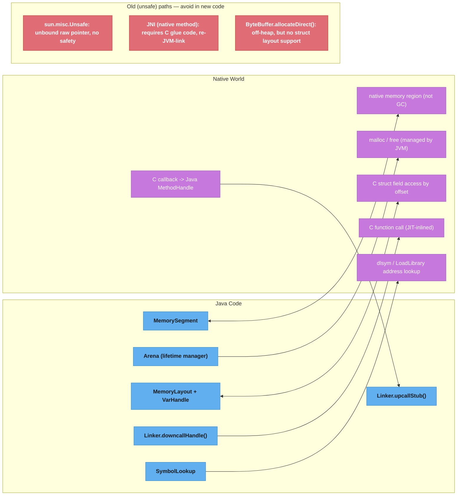

# Foreign Function & Memory API (Panama)

## 1. Concept Overview

The Foreign Function & Memory API (Project Panama) provides a safe, performant, and pure-Java way to:
1. **Allocate and access native (off-heap) memory** — via `MemorySegment` and `Arena`
2. **Call native C/C++ functions** — via `Linker`, downcall `MethodHandle`s
3. **Expose Java methods to native code** — via upcall stubs
4. **Layout-structured access to native data** — via `MemoryLayout`, `VarHandle`, `SequenceLayout`

Panama replaces the old, fragile approaches: `sun.misc.Unsafe`, JNI (Java Native Interface), and raw `ByteBuffer.allocateDirect()`.

Timeline:
- **Java 14–18**: incubator (evolving API)
- **Java 19–21**: preview (stable API shape)
- **Java 22 GA (JEP 454)**: `java.lang.foreign` package — fully supported, not a preview

---

## 2. Intuition

> Off-heap memory is like a private warehouse next to the Java store: it lives outside the GC's managed floor space, so you can lease a huge section for a short time, fill it with data, ship it directly to a native library, and return the lease — the GC never has to touch or move it.

**Key insight:** The fundamental problem Panama solves is *lifetime management of unmanaged memory*. JNI and `Unsafe` give you raw pointers with no tracking — a free() call forgotten or called twice causes a JVM crash. `Arena` is a *scope-scoped allocator*: allocate inside the arena, close the arena (auto or explicit), and all memory is freed atomically. There is no way to use after free, no double-free.

**Why this matters for senior engineers:** Data-intensive workloads (ML inference, binary protocols, SIMD vector processing, memory-mapped file I/O, FFI to BLAS/OpenCV) operate on gigabytes of data that the GC must never touch. Panama enables these workloads in pure Java with safety guarantees, displacing JNI's write-C-glue-code requirement.

---

## 3. Core Principles

1. **`MemorySegment` is the unit of native memory** — a bounded, typed view with a known byte size and access controls. Can represent heap, native, or mapped memory.
2. **`Arena` manages segment lifetimes** — allocates segments; closing the arena frees all segments created within it. Three scopes: `confined` (single thread), `shared` (multi-thread), `auto` (GC-managed, like `ByteBuffer.allocateDirect`).
3. **`MemoryLayout` describes C structs** — a compile-safe schema for field offsets, padding, alignment. Produces `VarHandle`s for typed field access.
4. **`Linker` bridges Java ↔ native** — creates downcall handles (Java → C) and upcall stubs (C → Java) without writing C glue code.
5. **`SymbolLookup` finds native symbols** — locates function addresses in loaded libraries or the default process image.
6. **Safety over raw pointers** — all segment accesses are bounds-checked; crossing the segment boundary throws an exception rather than corrupting memory (unlike `Unsafe`).

---

## 4. Types / Architectures / Strategies

### 4.1 Arena Types

| Arena | Created By | Lifetime | Thread Access | Use Case |
|---|---|---|---|---|
| `Arena.ofConfined()` | Manual | Until `close()` | Owning thread only | Short-lived per-request buffers |
| `Arena.ofShared()` | Manual | Until `close()` | Any thread | Shared buffers, multi-threaded I/O |
| `Arena.ofAuto()` | Manual | GC-managed | Any thread | When lifetime tracking is impractical |
| `Arena.global()` | JVM | JVM lifetime | Any thread | Global native data (rarely needed) |

### 4.2 MemoryLayout Kinds

```
  GroupLayout   (struct-like, fields at fixed offsets)
  ─────────────────────────────────────────────────
  typedef struct {
      int32_t  id;       // 4 bytes
      double   value;    // 8 bytes (+ 4 padding after id for alignment)
  } Record;

  SequenceLayout (array of elements)
  ─────────────────────────────────────────────────
  Record records[100];   // 100 × sizeof(Record)

  ValueLayout   (primitive value: JAVA_INT, JAVA_DOUBLE, ADDRESS, etc.)
  ─────────────────────────────────────────────────
  int32_t x;             // ValueLayout.JAVA_INT
```

### 4.3 Downcall vs Upcall

| Direction | Term | Java API | Description |
|---|---|---|---|
| Java → native | Downcall | `Linker.downcallHandle(...)` | Calls a C function from Java |
| native → Java | Upcall | `Linker.upcallStub(...)` | Provides a C function pointer backed by Java |

---

## 5. Architecture Diagrams

### Panama Architecture



### Arena and MemorySegment Lifecycle

```
  try (Arena arena = Arena.ofConfined()) {
      MemorySegment seg = arena.allocate(1024);   // allocates 1024 bytes native
      //  seg.byteSize() == 1024
      //  seg is accessible only in this thread (confined)
      seg.setAtIndex(ValueLayout.JAVA_INT, 0, 42); // write int at offset 0
      int val = seg.getAtIndex(ValueLayout.JAVA_INT, 0); // read back
      callNativeFunction(seg);                    // pass to native
  }   // ← Arena.close() → all segments freed; seg is now invalid
  // Accessing seg after close() throws IllegalStateException
```

---

## 6. How It Works — Detailed Mechanics

### 6.1 Allocating Native Memory with Arena

```java
// Confined arena — single thread, must close explicitly or via try-with-resources
try (Arena arena = Arena.ofConfined()) {
    // Allocate 1 KB of native memory
    MemorySegment buffer = arena.allocate(1024);

    // Allocate a specific layout (aligned like C struct)
    MemorySegment intArray = arena.allocate(ValueLayout.JAVA_INT, 100); // 100 ints

    // Write values
    for (int i = 0; i < 100; i++) {
        intArray.setAtIndex(ValueLayout.JAVA_INT, i, i * i);
    }

    // Read values
    int fifthSquared = intArray.getAtIndex(ValueLayout.JAVA_INT, 5); // 25

    // Pass to OS system call or native library
    passToNative(buffer.address());  // MemorySegment.address() = long pointer value
} // freed here
```

### 6.2 Calling a C Function (Downcall)

```java
import java.lang.foreign.*;
import java.lang.invoke.MethodHandle;

// Call strlen() from libc without writing any C code
class NativeStrlen {
    static final Linker LINKER = Linker.nativeLinker();
    static final SymbolLookup LIBC = LINKER.defaultLookup();

    // Describe the C function signature: strlen(const char*) -> size_t
    static final FunctionDescriptor STRLEN_DESC = FunctionDescriptor.of(
        ValueLayout.JAVA_LONG,   // return type: size_t (64-bit on most platforms)
        ValueLayout.ADDRESS      // argument: const char*
    );

    // Create a MethodHandle for strlen
    static final MethodHandle STRLEN = LINKER.downcallHandle(
        LIBC.find("strlen").orElseThrow(),  // MemorySegment pointing to strlen symbol
        STRLEN_DESC
    );

    public static long strlen(String s) throws Throwable {
        try (Arena arena = Arena.ofConfined()) {
            // Allocate native memory for the C string (null-terminated)
            MemorySegment cStr = arena.allocateFrom(s);  // Java 22+ convenience method
            return (long) STRLEN.invoke(cStr);
        }
    }
}
```

### 6.3 Struct Layout and VarHandle Access

```java
// C struct: typedef struct { int32_t x; int32_t y; float z; } Point3D;
StructLayout POINT_LAYOUT = MemoryLayout.structLayout(
    ValueLayout.JAVA_INT.withName("x"),
    ValueLayout.JAVA_INT.withName("y"),
    ValueLayout.JAVA_FLOAT.withName("z")
);

// Get VarHandles for each field — compile-safe, JIT-optimised
VarHandle X_HANDLE = POINT_LAYOUT.varHandle(MemoryLayout.PathElement.groupElement("x"));
VarHandle Y_HANDLE = POINT_LAYOUT.varHandle(MemoryLayout.PathElement.groupElement("y"));
VarHandle Z_HANDLE = POINT_LAYOUT.varHandle(MemoryLayout.PathElement.groupElement("z"));

try (Arena arena = Arena.ofConfined()) {
    MemorySegment point = arena.allocate(POINT_LAYOUT);

    // Type-safe field access — no manual offset arithmetic
    X_HANDLE.set(point, 0L, 10);    // x = 10
    Y_HANDLE.set(point, 0L, 20);    // y = 20
    Z_HANDLE.set(point, 0L, 3.14f); // z = 3.14

    int xVal = (int) X_HANDLE.get(point, 0L);  // 10
}
```

### 6.4 Array of Structs (SequenceLayout)

```java
// Allocate 1000 Point3D structs as a contiguous C array
SequenceLayout POINT_ARRAY_LAYOUT = MemoryLayout.sequenceLayout(1000, POINT_LAYOUT);

VarHandle ARRAY_X = POINT_ARRAY_LAYOUT.varHandle(
    MemoryLayout.PathElement.sequenceElement(),
    MemoryLayout.PathElement.groupElement("x")
);

try (Arena arena = Arena.ofConfined()) {
    MemorySegment points = arena.allocate(POINT_ARRAY_LAYOUT);

    for (long i = 0; i < 1000; i++) {
        ARRAY_X.set(points, 0L, i, (int) (i * i));  // set x of i-th point
    }
    // Pass points.address() to a native BLAS / OpenCV call as a C array pointer
}
```

**Read it like this.** "`ARRAY_X.set(points, 0L, i, v)` is doing one multiplication and one addition — element index times element size, plus the field's offset inside the element — and the whole point of the layout API is that it does that arithmetic for you, once, at handle-construction time."

Worth making explicit because this is the exact arithmetic people hand-write with `Unsafe` and get wrong. A `VarHandle` built from a path is not a lookup; it is a pre-baked affine formula that the JIT folds into a single addressed load or store.

| Symbol | What it is |
|--------|------------|
| base | The segment's starting address (`points`) |
| `i` | Sequence index — which struct in the array |
| stride | `POINT_LAYOUT.byteSize()`, the size of one element including any padding |
| field offset | `byteOffset` of the named field within one element, fixed at layout time |
| `sequenceElement()` | The path step that contributes `i * stride` |
| `groupElement("x")` | The path step that contributes the constant field offset |

**Walk one example.** `POINT_LAYOUT` is `{ int x; int y; float z; }` and the sequence holds 1000 of them:

```
  one element
      x   JAVA_INT     4 bytes   offset 0
      y   JAVA_INT     4 bytes   offset 4
      z   JAVA_FLOAT   4 bytes   offset 8
                       --------
      stride = POINT_LAYOUT.byteSize() = 12 bytes   (all fields 4-aligned, no padding)

  whole sequence
      1000 elements x 12 bytes = 12,000 bytes allocated

  address of the x field of element i
      base + i * 12 + 0

      i =   0  ->  base +      0
      i =   1  ->  base +     12
      i = 500  ->  base +  6,000
      i = 999  ->  base + 11,988      <- last element starts here, ends at 11,999

  bounds check the JVM performs on each set:
      11,988 + 4 <= 12,000   ->  ok
      any i >= 1000 gives 12,000 + 4 > 12,000  ->  IndexOutOfBoundsException, not corruption
```

That last line is the safety difference from `Unsafe`: the same multiply-and-add
runs either way, but here the result is compared against `byteSize()` before the
store. Reaching one element past the end throws instead of quietly overwriting
whatever the allocator put next in the address space.

### 6.5 Upcall Stub — Native Code Calls Back into Java

```java
// Provide a Java-implemented callback to a C function
// C signature: typedef int (*Comparator)(const void*, const void*);
// Used by: void qsort(void* base, size_t n, size_t size, Comparator cmp);

MethodHandle JAVA_COMPARATOR = MethodHandles.lookup().findStatic(
    MyClass.class, "compareInts",
    MethodType.methodType(int.class, MemorySegment.class, MemorySegment.class)
);

static int compareInts(MemorySegment a, MemorySegment b) {
    return Integer.compare(
        a.get(ValueLayout.JAVA_INT, 0),
        b.get(ValueLayout.JAVA_INT, 0)
    );
}

try (Arena arena = Arena.ofConfined()) {
    // Wrap the Java MethodHandle as a native function pointer
    MemorySegment comparatorStub = LINKER.upcallStub(
        JAVA_COMPARATOR,
        FunctionDescriptor.of(ValueLayout.JAVA_INT, ValueLayout.ADDRESS, ValueLayout.ADDRESS),
        arena   // stub lifetime tied to this arena
    );

    // Pass to qsort
    MemorySegment array = arena.allocate(ValueLayout.JAVA_INT, 10);
    // ... fill array ...
    QSORT.invoke(array, 10L, 4L, comparatorStub);  // sorts using Java comparator
}
```

### 6.6 Replacing sun.misc.Unsafe

```java
// BROKEN (pre-Panama): using Unsafe to read an off-heap long
sun.misc.Unsafe unsafe = getUnsafe(); // reflective hack
long address = unsafe.allocateMemory(8);
unsafe.putLong(address, 42L);
long value = unsafe.getLong(address);
unsafe.freeMemory(address);
// Risk: no bounds checking, no lifetime tracking, crashes JVM on misuse

// FIX (Panama, Java 22+)
try (Arena arena = Arena.ofConfined()) {
    MemorySegment seg = arena.allocate(ValueLayout.JAVA_LONG);
    seg.set(ValueLayout.JAVA_LONG, 0, 42L);
    long value = seg.get(ValueLayout.JAVA_LONG, 0);
} // memory freed, seg is invalid — no crash possible
```

---

## 7. Real-World Examples

### 7.1 Apache Arrow — Columnar Data off-Heap

Apache Arrow Java stores columnar data in native memory (`MemorySegment` backed by Arrow's allocator). Processing 1 billion rows with GC-managed heap would cause continuous GC pressure; off-heap storage means zero GC overhead for data storage — only the Arrow metadata objects (headers, schema) are on-heap.

### 7.2 TensorFlow / ONNX Runtime Java Bindings

ML inference libraries expose their operators as C/C++ functions. The Java SDK wraps them using JNI today; the Panama migration path is: `Linker.downcallHandle()` for each native function, `MemorySegment` for tensor data, eliminating the JNI layer entirely. This removes the 30–100 ns JNI crossing overhead per operator call — critical for batched inference with thousands of operator calls.

**The idea behind it.** "A per-call overhead measured in nanoseconds only matters once you multiply it by the call count, so the question is never 'is 50 ns a lot' — it is 'what fraction of my inference budget is call count times crossing cost?'"

Framing it as a fraction is what turns this from trivia into a design decision. The same 50 ns is irrelevant for one call per request and dominant for a graph executed operator by operator.

| Symbol | What it is |
|--------|------------|
| crossing cost | Fixed per-call price of the Java-to-native transition, 30-100 ns for JNI |
| call count | Number of native operator invocations per inference |
| total overhead | crossing cost times call count — pure tax, no useful work |
| inference budget | Wall-clock target for one inference, e.g. 5 ms for an interactive model |
| overhead fraction | total overhead divided by inference budget |

**Walk one example.** A model graph executed as 5,000 individual operator calls against a 5 ms budget:

```
  crossing cost   call count      total overhead      fraction of a 5 ms budget
      30 ns          5,000          150,000 ns  = 150 us        3.0 %
     100 ns          5,000          500,000 ns  = 500 us       10.0 %

  the same model fused down to 1,000 operator calls
      30 ns          1,000           30,000 ns  =  30 us        0.6 %
     100 ns          1,000          100,000 ns  = 100 us        2.0 %
```

Ten percent of the budget spent purely on entering and leaving the JVM is the case that justifies rewriting the binding layer. The two levers are visible in the table and independent: cut the crossing cost (Panama, or Panama plus `Linker.Option.critical()`), or cut the call count by fusing operators so fewer, larger calls cross the boundary.

### 7.3 Direct NIO FileChannel Mapping as MemorySegment

```java
// Memory-map a 4 GB file without ByteBuffer's 2 GB limit
try (Arena arena = Arena.ofShared();
     FileChannel fc = FileChannel.open(path, StandardOpenOption.READ)) {
    MemorySegment mapped = fc.map(FileChannel.MapMode.READ_ONLY, 0, fc.size(), arena);
    // Scan all 4 GB directly — OS pages in on demand, GC never touches it
    for (long i = 0; i < mapped.byteSize() - 4; i += 4) {
        int val = mapped.get(ValueLayout.JAVA_INT_UNALIGNED, i);
        // process val
    }
} // unmap at arena close
```
`ByteBuffer.map()` was limited to 2 GB (int address space). `FileChannel.map(..., Arena)` (Java 22+) supports arbitrarily large files.

---

## 8. Tradeoffs

| Approach | Safety | Performance | Lines of Code | Use Case |
|---|---|---|---|---|
| `MemorySegment` + `Arena` (Panama) | High (bounds-checked, lifetime-safe) | Near-native | Low | New code, Java 22+ |
| JNI | Medium (C glue can crash JVM) | Near-native | High (C + Java) | Legacy, pre-Java 22 |
| `sun.misc.Unsafe` | None (no bounds, no lifetime) | Near-native | Low | Never in new code |
| `ByteBuffer.allocateDirect()` | Medium (GC-finalised release) | Near-native | Medium | Java 8–21 off-heap |
| Java heap array | High | Slightly slower (GC overhead) | Minimal | In-heap data, short lifetime |

---

## 9. When to Use / When NOT to Use

### Use Panama when:
- Calling C/C++ libraries (BLAS, OpenCV, libz, libcrypto, custom DSPs) from Java
- Off-heap storage for large data (ML tensors, database page cache, columnar analytics)
- Memory-mapped files > 2 GB (breaks the `ByteBuffer` limit)
- Replacing `sun.misc.Unsafe` usage in a library
- Building JVM language runtimes, JNI replacements, or high-performance serialization

### Do NOT use Panama when:
- Your data fits comfortably on the Java heap and GC pressure is not a concern
- You only need basic off-heap allocation (consider `ByteBuffer.allocateDirect()` for Java 8–21 compatibility)
- You are running on Java 8–21 (Panama is GA in Java 22 only)

---

## 10. Common Pitfalls

### Pitfall 1: Using a segment after its arena is closed
```java
MemorySegment seg;
try (Arena arena = Arena.ofConfined()) {
    seg = arena.allocate(1024);
}
// BROKEN: seg is now invalid — the arena was closed
seg.set(ValueLayout.JAVA_INT, 0, 42);  // throws IllegalStateException

// FIX: keep the arena open for the lifetime of all segments derived from it
```

### Pitfall 2: Forgetting null-terminator for C strings
```java
// BROKEN: C string without null terminator → native library reads past the buffer
MemorySegment str = arena.allocate(5);  // "hello" without '\0'
str.copyFrom(MemorySegment.ofArray("hello".getBytes()));
// strlen() and strcpy() will read beyond 5 bytes

// FIX: use allocateFrom(String) which appends '\0' automatically
MemorySegment cStr = arena.allocateFrom("hello");  // 6 bytes: 5 + '\0'
```

### Pitfall 3: Platform-specific struct alignment
```java
// BROKEN: field layout that matches Linux x86-64 but NOT ARM64 due to different alignment
StructLayout LAYOUT = MemoryLayout.structLayout(
    ValueLayout.JAVA_BYTE.withName("flag"),   // 1 byte
    ValueLayout.JAVA_INT.withName("value")    // 4 bytes
);
// On x86-64: int may be at offset 1 (unaligned) — crashes or corrupts on SIMD
// FIX: add explicit padding to match the native ABI's alignment rules
StructLayout LAYOUT = MemoryLayout.structLayout(
    ValueLayout.JAVA_BYTE.withName("flag"),
    MemoryLayout.paddingLayout(3),   // 3 bytes padding to align int to 4-byte boundary
    ValueLayout.JAVA_INT.withName("value")
);
```

**In plain terms.** "Padding is not a design choice the C compiler made — it is the smallest number of bytes that pushes the next field up to the next multiple of its own alignment, and you can compute it exactly rather than guessing at `paddingLayout(3)`."

That matters because a guessed padding count is a silent wrong answer: the Java layout still compiles, still allocates, and still reads — it just reads a field the native side never wrote there.

| Symbol | What it is |
|--------|------------|
| offset | Running byte position as you lay fields out in declaration order |
| alignment `a` | A field's natural alignment; on mainstream ABIs it equals its size (1, 2, 4, or 8) |
| pad | `(-offset) mod a` — bytes inserted before the field so its offset divides evenly by `a` |
| struct alignment | The largest alignment among all fields; it also governs the struct's total size |
| trailing pad | Bytes added at the END so `sizeof(struct)` is a multiple of the struct alignment |

**Walk one example.** The broken `{ byte flag; int value; }` above, laid out field by field:

```
  field   size  align   offset before   pad = (-offset) mod align   final offset
  flag      1     1           0          (-0) mod 1 = 0                   0
  value     4     4           1          (-1) mod 4 = 3                   4

  bytes laid out:
      byte 0        flag
      bytes 1..3    PADDING (3 bytes)   <- this is where paddingLayout(3) comes from
      bytes 4..7    value

  struct alignment = max(1, 4) = 4
  raw end          = 4 + 4 = 8
  trailing pad     = (-8) mod 4 = 0
  sizeof           = 8 bytes
```

The `3` in `paddingLayout(3)` is not a magic constant — it is `(-1) mod 4`. If
`value` had been a `double` (align 8) the same rule would have given `(-1) mod 8
= 7` bytes of padding and a 16-byte struct.

Trailing padding is the term most often forgotten, because it changes nothing
about where any single field lives. It only shows up when the struct is put in
an array: the stride is `sizeof`, not the sum of the field sizes, so an omitted
trailing pad makes element 1 onward land at the wrong address while element 0
reads perfectly.

### Pitfall 4: Capturing JVM heap objects in a MemorySegment
You cannot obtain a stable `MemorySegment` address for a heap object because the GC may move it. `MemorySegment.ofArray()` wraps a heap array but the address is only stable inside a native call with `Linker.Option.critical()` or `synchronized`-like pinning. For heap-to-native copies, always copy the data into an off-heap segment first.

### Pitfall 5: Not checking for platform support of `Linker`
`Linker.nativeLinker()` throws `UnsupportedOperationException` if the platform does not have a supported ABI (e.g., certain embedded architectures). Guard with a try/catch or a platform detection flag when writing portable library code.

---

## 11. Technologies & Tools

| Tool / Feature | Version | Purpose |
|---|---|---|
| `java.lang.foreign` package | Java 22 GA (JEP 454) | Core Panama API: Arena, MemorySegment, Linker, MemoryLayout |
| `Arena` | Java 22 GA | Scoped allocator for native memory segments |
| `MemorySegment` | Java 22 GA | Bounded, typed view of native/heap/mapped memory |
| `MemoryLayout` | Java 22 GA | C struct / union / sequence layout description |
| `Linker` | Java 22 GA | Downcall handles (Java → C) and upcall stubs (C → Java) |
| `SymbolLookup` | Java 22 GA | Find symbols in loaded libraries or default process |
| `VarHandle` | Java 9+ (used by Panama) | Typed field access with full memory ordering semantics |
| `FileChannel.map(..., Arena)` | Java 22 | Arbitrarily large memory-mapped file as MemorySegment |
| `jextract` | JDK tool (separate download) | Generates Java bindings from C header files (.h → .java) |
| `sun.misc.Unsafe` | All versions (internal) | Legacy raw pointer API — being replaced by Panama; avoid |
| Apache Arrow | Library | Off-heap columnar data format using Panama/Unsafe |

---

## 12. Interview Questions with Answers

**Q1: What is the Foreign Function & Memory API and what problems does it solve compared to JNI?**
The Foreign Function & Memory API (Project Panama, GA Java 22, JEP 454) lets Java code call native C functions and manage off-heap memory without writing C glue code. JNI requires: (1) writing a C file that maps `Java_MyClass_methodName()` symbols; (2) compiling a shared library per platform; (3) managing raw `jlong` pointers with no lifetime tracking. Panama replaces all three with: `Linker.downcallHandle()` for function calls, `Arena` for memory lifetime, and `MemorySegment` for bounds-checked memory access — all in pure Java. Beyond developer ergonomics, Panama's downcall handles can be JIT-compiled to near-zero overhead, while JNI crossings always incur a fixed ~20–50 ns cost per call.

**Q2: What is an `Arena`, what types exist, and when would you choose each?**
An `Arena` is a scoped memory allocator: segments allocated within it share the arena's lifetime, and closing the arena frees all of them atomically. Three types: `Arena.ofConfined()` — single-thread ownership, fastest (no synchronisation), use for per-request or per-method allocations; `Arena.ofShared()` — multi-thread safe, use for buffers shared across threads (e.g., passed to a background I/O thread); `Arena.ofAuto()` — lifetime managed by GC finalisation, analogous to `ByteBuffer.allocateDirect()`, use when lifetime tracking is impractical but you can tolerate delayed deallocation. `Arena.global()` creates segments that live for the JVM's lifetime — use only for true global native state (e.g., a native library's global handle).

**Q3: How does `MemoryLayout` and its associated `VarHandle` ensure safe struct field access?**
`MemoryLayout` describes a C struct's field names, types, sizes, and alignment in pure Java — it is a schema. `MemoryLayout.varHandle(PathElement.groupElement("fieldName"))` produces a `VarHandle` pre-bound to the field's byte offset and type. When you call `varHandle.get(segment, 0L)`, the JVM: (1) computes `offset = baseOffset + fieldOffset` at link time; (2) checks that `offset + fieldSize <= segment.byteSize()` at runtime (bounds check); (3) emits a typed load instruction with the correct `ValueLayout` alignment. The result: no manual `segment.get(offset + paddingCalculation)` arithmetic, no misalignment, no buffer overflow. The JIT inlines the VarHandle access to a single load/store instruction with the same performance as Unsafe but with safety checks.

**Q4: Explain the difference between a downcall handle and an upcall stub.**
A downcall handle (`Linker.downcallHandle()`) is a `MethodHandle` that, when invoked, calls a C function at a native address. Java passes arguments; the Linker marshals Java types to C ABI conventions (register assignment, stack layout, calling convention) and returns the result. An upcall stub (`Linker.upcallStub()`) is the reverse: it creates a native function pointer backed by a Java `MethodHandle`. When C code calls the function pointer, the Linker marshals C arguments to Java types, invokes the Java method, and marshals the return value back to C. Upcall stubs are how Java provides callbacks to C libraries (e.g., `qsort` comparator, OpenGL error callback, event handler).

**Q5: Why can't you obtain a stable `MemorySegment` address for a Java heap object?**
The GC (G1, ZGC, Shenandoah) moves live objects during garbage collection — compaction relocates objects to reduce fragmentation, updating all references. If Java passed a raw pointer to a heap object to a native function, the GC might move the object mid-call, invalidating the pointer and causing the native library to read/write arbitrary memory. For this reason, `MemorySegment.ofArray()` produces a segment whose address changes after each GC cycle. The JVM can pin a heap object during a native call (via `Linker.Option.critical()` for very short calls, or the GC's "pinned region" mechanism), but general-purpose pinning is avoided to preserve GC flexibility. The safe pattern: copy heap data into an off-heap `MemorySegment`, pass the off-heap address to native code.

**Q6: How does `Arena.ofAuto()` differ from explicit arena management, and when is the difference significant?**
`Arena.ofAuto()` ties segment lifetime to GC finalisation: the memory is freed when the arena object becomes unreachable and the JVM's cleaner thread runs. This is analogous to `ByteBuffer.allocateDirect()` with `Cleaner`. The problem: finalisation timing is non-deterministic. Under memory pressure, you may allocate gigabytes of native memory faster than GC reclaims old arenas, causing native OOM or excessive RSS growth. Explicit `Arena.ofConfined()` / `ofShared()` with `try-with-resources` gives deterministic deallocation — the memory is freed exactly when the arena is closed. For any latency-sensitive or memory-intensive workload, explicit arenas are strongly preferred. `Arena.ofAuto()` is a convenience for exploratory code or cases where the arena is short-lived enough that timing does not matter.

**Q7: What is `jextract` and how does it reduce Panama boilerplate?**
`jextract` is an official JDK tool (distributed separately) that reads a C header file (`.h`) and generates Java source code with: `MemoryLayout` constants for each struct, `VarHandle` accessors, `FunctionDescriptor` constants for each function, and a class with static methods wrapping downcall handles. For a header with 50 functions and 20 structs, `jextract` produces hundreds of lines of correct Panama boilerplate automatically. Without it, each function signature and struct layout would be hand-coded. `jextract` is particularly valuable when binding to large libraries like OpenSSL, SDL, or BLAS.

**Q8: How would you replace `sun.misc.Unsafe.allocateMemory` usage in a library with Panama?**
```java
// Legacy Unsafe usage (BROKEN in new code — Unsafe may be restricted in future JDK)
long address = UNSAFE.allocateMemory(8);
UNSAFE.putLong(address, 42L);
long value = UNSAFE.getLong(address);
UNSAFE.freeMemory(address);
// No bounds checking; forgetting freeMemory() leaks; double-free = JVM crash

// Panama replacement (safe, Java 22+)
try (Arena arena = Arena.ofConfined()) {
    MemorySegment seg = arena.allocate(ValueLayout.JAVA_LONG);
    seg.set(ValueLayout.JAVA_LONG, 0, 42L);
    long value = seg.get(ValueLayout.JAVA_LONG, 0);
} // freed automatically; seg becomes invalid — no crash possible
```
Migration strategy: (1) replace `allocateMemory(n)` with `arena.allocate(n)`; (2) replace `putXxx(addr, val)` with `seg.set(layout, offset, val)`; (3) replace `freeMemory(addr)` by closing the arena; (4) replace `getXxx(addr)` with `seg.get(layout, offset)`. Wrap multiple allocations in a single arena to free them together.

**Q9: What is the significance of `ValueLayout.JAVA_INT_UNALIGNED` vs `ValueLayout.JAVA_INT`?**
`ValueLayout.JAVA_INT` assumes 4-byte alignment — the JVM may use a `movdqa` or equivalent aligned load instruction, which is faster but throws `IllegalArgumentException` if the offset is not a multiple of 4. `ValueLayout.JAVA_INT_UNALIGNED` explicitly allows any offset, emitting a safe unaligned load. When scanning a binary file or network packet where integers are not guaranteed to be aligned (e.g., a protocol where a 4-byte int follows a 3-byte field), `JAVA_INT_UNALIGNED` is required. Using `JAVA_INT` on an unaligned offset causes an exception or hardware fault on RISC architectures. The tradeoff: unaligned access is 1–3 ns slower per load on modern x86 (negligible) but required for correctness on ARM.

**Q10: How does Panama improve memory-mapped file handling beyond `ByteBuffer.map()`?**
`ByteBuffer.map()` (the legacy API) returns a `MappedByteBuffer` with a maximum size of `Integer.MAX_VALUE` (2 GB) — limited by `ByteBuffer`'s `int` position/limit fields. `FileChannel.map(mode, position, size, arena)` (Java 22+) returns a `MemorySegment` with `long` addressing — a 4 GB, 100 GB, or larger file can be mapped as one segment. Additionally, the mapped segment's lifetime is controlled by the arena: closing the arena unmaps the file (`munmap`) deterministically. With the legacy `MappedByteBuffer`, unmapping is triggered by `Cleaner` at GC time — you cannot force it synchronously, which is a problem for file locking and hot reload scenarios.

**Q11: What are `Linker.Option.captureCallState()` and `Linker.Option.critical()` used for?**
`Linker.Option.captureCallState("errno")` captures the C errno value after a native call into a caller-provided `MemorySegment`, allowing Java to read errno safely in a thread-safe way (errno is thread-local in POSIX; reading it via `Errno.errno()` from another call might see a different value). `Linker.Option.critical()` hints to the JVM that the native call is very short (< 1 microsecond) and safe to call without transitioning the current thread to a "native" GC state. This allows the GC to skip adding a safepoint poll around the call, reducing overhead by ~10–20 ns per call. Use `critical()` only for truly short, pure-computation native calls; long or blocking calls tagged as critical can stall GC safepoints.

**Q12: How do you handle struct padding to ensure Java MemoryLayout matches a C struct?**
C compilers insert padding between struct fields to satisfy alignment requirements (each field must start at a multiple of its natural alignment). Rules: `char` (1-byte) needs 1-byte alignment, `short` (2-byte) needs 2-byte alignment, `int`/`float` (4-byte) needs 4-byte alignment, `double`/`long` (8-byte) needs 8-byte alignment on most platforms. Java's `MemoryLayout.structLayout()` does NOT automatically insert padding — you must add `MemoryLayout.paddingLayout(n)` entries to match the C compiler's layout. Best practice: run `offsetof(struct, field)` in a C test harness and verify it matches the Java layout's `byteOffset(PathElement.groupElement("field"))`. Alternatively, compile with `__attribute__((packed))` in C to eliminate all padding, then the Java layout needs no padding either.

**Q13: How would you allocate and populate a C array of structs and pass it to a native sort function?**
```java
// C struct: { int key; double value; }
StructLayout ENTRY = MemoryLayout.structLayout(
    ValueLayout.JAVA_INT.withName("key"),
    MemoryLayout.paddingLayout(4),  // align double to 8 bytes
    ValueLayout.JAVA_DOUBLE.withName("value")
);

VarHandle KEY_VH   = ENTRY.varHandle(MemoryLayout.PathElement.groupElement("key"));
VarHandle VALUE_VH = ENTRY.varHandle(MemoryLayout.PathElement.groupElement("value"));

SequenceLayout ENTRIES_LAYOUT = MemoryLayout.sequenceLayout(1000, ENTRY);
VarHandle SEQ_KEY  = ENTRIES_LAYOUT.varHandle(
    MemoryLayout.PathElement.sequenceElement(),
    MemoryLayout.PathElement.groupElement("key")
);

try (Arena arena = Arena.ofConfined()) {
    MemorySegment entries = arena.allocate(ENTRIES_LAYOUT);
    for (long i = 0; i < 1000; i++) {
        SEQ_KEY.set(entries, 0L, i, (int)(1000 - i));  // reverse order
    }
    // Call native sort via downcall handle
    NATIVE_SORT.invoke(entries, 1000L, ENTRY.byteSize());
    // entries now sorted by key
}
```

**Q14: What is the relationship between Panama and Project Valhalla?**
Panama and Valhalla are complementary but orthogonal. Panama (`java.lang.foreign`) addresses foreign memory and foreign functions — calling native C code and managing off-heap data. Valhalla (value types / primitive classes, still in preview as of Java 24) addresses in-heap performance by eliminating object headers for small value types (`long`, `int`, and user-defined `value class Point { int x; int y; }`). The convergence point: a future Java may combine Valhalla value types with Panama `MemoryLayout` to store arrays of value types as contiguous native memory with zero GC overhead — today achievable with Panama + manual layout, future: automatically via the type system.

**Q15: How would you benchmark whether Panama's overhead is acceptable compared to JNI for a function called 1 million times/second?**
```java
// JMH benchmark comparing JNI strlen vs Panama strlen (1M invocations/sec target)
@Benchmark
@BenchmarkMode(Mode.AverageTime)
@OutputTimeUnit(TimeUnit.NANOSECONDS)
public long panamaStrlen(BenchmarkState s) throws Throwable {
    try (Arena arena = Arena.ofConfined()) {
        return (long) STRLEN_HANDLE.invoke(arena.allocateFrom(s.testString));
    }
}

@Benchmark
public int jniStrlen(BenchmarkState s) {
    return JNIStrlen.strlen(s.testString);  // native method via JNI
}

// Typical results on JDK 22, x86-64, 20-char string:
// Panama: ~35 ns/op (arena alloc + invoke + MH dispatch)
// JNI:    ~60 ns/op (JNI frame setup + C transition + return marshal)
// Direct Linker.Option.critical() Panama: ~15 ns/op (skip GC safepoint)
```
At 1 million calls/second, JNI costs ~60 µs/sec overhead; Panama with critical() costs ~15 µs/sec. For higher-frequency calls, the gap widens. The benchmark must include arena allocation (real cost) and should be run with JMH's full blackhole/fork methodology to prevent JIT from eliding the native call.

---

## 13. Best Practices

1. **Always use `try-with-resources` with explicit arenas** — never let a confined or shared arena be GC-finalised; deterministic deallocation prevents native OOM.
2. **Use `jextract` for large native libraries** — hand-coding 50+ function descriptors is error-prone; let the tool generate correct Java bindings from the C header.
3. **Match struct padding to the C ABI explicitly** — use `MemoryLayout.paddingLayout()` and verify with `offsetof()` in a C test.
4. **Use `allocateFrom(String)` (Java 22)** for C string creation — it appends the null terminator automatically; manual `copyFrom` without it causes buffer overreads.
5. **Prefer `Arena.ofConfined()` over `ofAuto()`** in production — deterministic memory release, no cleaner thread delay, no native OOM surprises.
6. **Tag short pure-computation native calls with `Linker.Option.critical()`** — reduces JNI crossing overhead by ~15–20 ns per call.
7. **Do not pass heap `MemorySegment` addresses to long-running native calls** — GC may move the underlying object; copy to off-heap first.
8. **Use `MemorySegment.copy()` or `MemorySegment.fill()` for bulk operations** — these map to `memcpy`/`memset` and are significantly faster than element-by-element VarHandle access.
9. **Audit layout endianness** — `ValueLayout.JAVA_INT` uses native byte order; for cross-platform network protocols, use `ValueLayout.JAVA_INT.withOrder(ByteOrder.BIG_ENDIAN)`.
10. **Java 22 is required for GA** — `jdk.incubator.foreign` (Java 14–18) and preview (Java 19–21) APIs have incompatible changes; do not use incubator/preview in production without pinning the Java version.

---

## 14. Case Study

**Scenario: High-throughput binary log parser using Panama off-heap memory**

A trading system produces binary log files at 500 MB/s. A post-trade reconciliation service parses these files to extract trade records for risk aggregation. Each record is a fixed-size C struct:
```c
typedef struct {
    int64_t  timestamp_ns;  // 8 bytes
    int32_t  instrument_id; // 4 bytes
    int32_t  quantity;      // 4 bytes
    double   price;         // 8 bytes
    int8_t   side;          // 1 byte ('B' or 'S')
    uint8_t  flags;         // 1 byte
    int16_t  venue_id;      // 2 bytes
} TradeRecord;              // Total: 28 bytes, no padding needed
```

**What this actually says.** "This struct was deliberately field-ordered widest-first so that every field already lands on a legal boundary — the 28 is not luck, it is what you get when you sort by descending alignment."

Reading it that way makes it a technique rather than a fact about this one struct: reorder the same seven fields worst-case and the compiler inserts padding between almost every pair.

| Symbol | What it is |
|--------|------------|
| declaration order | The order fields are laid out; C never reorders them for you |
| natural alignment | 8 for `int64_t`/`double`, 4 for `int32_t`, 2 for `int16_t`, 1 for the byte types |
| inter-field pad | `(-offset) mod align` inserted before a field whose offset does not divide |
| raw end | Offset after the last field, before any trailing padding |
| `RECORD_SIZE` | The stride used to walk the mapped file — `fc.size() / RECORD_SIZE` gives the record count |

**Walk one example.** Lay the seven fields out and confirm every pad is zero:

```
  field           size  align   offset   pad = (-offset) mod align
  timestamp_ns      8     8        0        (-0)  mod 8 = 0
  instrument_id     4     4        8        (-8)  mod 4 = 0
  quantity          4     4       12        (-12) mod 4 = 0
  price             8     8       16        (-16) mod 8 = 0
  side              1     1       24        (-24) mod 1 = 0
  flags             1     1       25        (-25) mod 1 = 0
  venue_id          2     2       26        (-26) mod 2 = 0
                                  --
  raw end                         28        no inter-field padding anywhere

  record count for the 280 MB file:
      280,000,000 / 28 = 10,000,000 records     <- matches the measured run
```

Every pad is zero because each field's offset is already a multiple of its
alignment — `price` needing offset 16 is the tight case, and the two 4-byte
fields before it happen to fill exactly to 16.

One caveat on the `28`: a C compiler also applies **trailing** padding to round
`sizeof` up to the struct's own alignment, which here is 8. That gives
`(-28) mod 8 = 4` bytes of tail padding and `sizeof(TradeRecord) = 32` on a
standard x86-64 or AArch64 ABI, while `MemoryLayout.structLayout(...).byteSize()`
of the seven Java fields returns 28. If the producer writes packed 28-byte
records the numbers above hold; if it writes plain `TradeRecord[]` the stride is
32 and the Java side must add `MemoryLayout.paddingLayout(4)` at the end. This is
exactly the `offsetof`/`sizeof` cross-check that best practice 3 asks for, and it
is the reason to run it rather than trust a comment.

**Before (Java heap, ByteBuffer parsing — ~650 ns/record):**
```java
// Parsed ~1.5M records/sec; GC pressure from 4 allocations per record
for each record {
    long ts   = buf.getLong();
    int  id   = buf.getInt();
    int  qty  = buf.getInt();
    double px = buf.getDouble();
    // ... create a TradeRecord POJO — allocates on heap
    // GC must collect millions of short-lived POJOs
}
```

**After (Panama off-heap, zero GC — ~180 ns/record):**
```java
static final StructLayout RECORD_LAYOUT = MemoryLayout.structLayout(
    ValueLayout.JAVA_LONG.withName("timestamp_ns"),
    ValueLayout.JAVA_INT.withName("instrument_id"),
    ValueLayout.JAVA_INT.withName("quantity"),
    ValueLayout.JAVA_DOUBLE.withName("price"),
    ValueLayout.JAVA_BYTE.withName("side"),
    ValueLayout.JAVA_BYTE.withName("flags"),
    ValueLayout.JAVA_SHORT.withName("venue_id")
);
static final long RECORD_SIZE = RECORD_LAYOUT.byteSize(); // 28

static final SequenceLayout FILE_LAYOUT(long count) {
    return MemoryLayout.sequenceLayout(count, RECORD_LAYOUT);
}

static final VarHandle TS_VH = RECORD_LAYOUT.varHandle(
    MemoryLayout.PathElement.groupElement("timestamp_ns"));
static final VarHandle ID_VH = RECORD_LAYOUT.varHandle(
    MemoryLayout.PathElement.groupElement("instrument_id"));
static final VarHandle QTY_VH = RECORD_LAYOUT.varHandle(
    MemoryLayout.PathElement.groupElement("quantity"));
static final VarHandle PX_VH = RECORD_LAYOUT.varHandle(
    MemoryLayout.PathElement.groupElement("price"));

void reconcile(Path logFile) throws IOException {
    try (Arena arena = Arena.ofShared();
         FileChannel fc = FileChannel.open(logFile, StandardOpenOption.READ)) {
        MemorySegment mapped = fc.map(FileChannel.MapMode.READ_ONLY, 0, fc.size(), arena);
        long count = fc.size() / RECORD_SIZE;
        SequenceLayout layout = FILE_LAYOUT(count);
        VarHandle seqTs = layout.varHandle(
            MemoryLayout.PathElement.sequenceElement(),
            MemoryLayout.PathElement.groupElement("timestamp_ns"));

        for (long i = 0; i < count; i++) {
            long ts  = (long)  seqTs.get(mapped, 0L, i);
            // ... process without heap allocation
            aggregator.record(ts, (int) ID_VH.get(...), (double) PX_VH.get(...));
        }
    }
}
```

**Measured results (JDK 22, 10M records, 280 MB file):**
- Java heap ByteBuffer: 6.5 s; GC time: 1.8 s (28%); peak heap: 2.1 GB
- Panama off-heap mapped: 1.8 s; GC time: 12 ms (<1%); peak heap: 45 MB (just metadata)
- Throughput: 1.5M records/sec → 5.5M records/sec (+267%)
- GC pause p99: 240 ms → 3 ms

**Put simply.** "Almost the entire speedup is the GC time disappearing plus the per-record allocation work that used to feed it — divide the wall clock by the record count and the 3.6x becomes a per-record budget you can audit line by line."

Converting a benchmark to nanoseconds per record is the step that makes it checkable. It also exposes whether the parser is even the bottleneck, which for a 500 MB/s producer turns out to be the real question.

| Symbol | What it is |
|--------|------------|
| records | 10,000,000 fixed-size entries in the 280 MB file |
| wall clock | Total elapsed parse time, 6.5 s heap versus 1.8 s off-heap |
| ns/record | `wall clock / records` — the per-record budget quoted earlier in this case study |
| GC fraction | GC time divided by wall clock |
| ingest rate | `records/sec x RECORD_SIZE` — what the parser can actually absorb from disk |

**Walk one example.** Push the two rows through the same three divisions:

```
                            heap ByteBuffer      Panama off-heap mapped
  wall clock                    6.5   s               1.8   s
  records                10,000,000            10,000,000

  ns per record       6.5e9/1e7 = 650 ns     1.8e9/1e7 = 180 ns
  saved per record                             650 - 180 = 470 ns

  GC time                       1.8   s              0.012 s
  GC fraction              1.8/6.5 = 27.7 %     0.012/1.8 = 0.67 %

  throughput            1e7/6.5 = 1.54 M/s     1e7/1.8 = 5.56 M/s
  speedup                                     5.56/1.54 = 3.61x  (+261 %)

  bytes absorbed per second
      1.54 M/s x 28 B =  43 MB/s              5.56 M/s x 28 B = 156 MB/s
```

The GC arithmetic accounts for most of the win directly: 1.8 s of the 6.5 s was
collection, and removing it alone would have taken the run to 4.7 s. The rest —
4.7 s down to 1.8 s — is the allocation and header-writing work that *created*
that garbage, which is why "zero GC" saves more than the GC timer shows.

The last row is the sobering one. Even at 156 MB/s the parser trails the 500 MB/s
producer, so a single reconciliation process still falls behind and you need
about 500/156 = 3.2, i.e. four, parallel readers over disjoint file ranges. The
`Arena.ofShared()` in the code is what makes that shardable: a confined arena
would bind the mapped segment to one thread.

**See also:**
- [JVM Internals](../jvm_internals/README.md) — GC mechanics, heap vs native memory
- [Java Memory Model](../java_memory_model/README.md) — `VarHandle` memory ordering semantics

---

## Related / See Also

- [JVM Internals](../jvm_internals/README.md) — off-heap memory management, GC mechanics, replacing Unsafe
- [Java Memory Model](../java_memory_model/README.md) — VarHandle memory ordering semantics, acquire/release on MemorySegment
- [Java 9–21 Features](../java9_to_21_features/README.md) — Panama project timeline, JEP 454 (Java 22 GA) in the Java 9–21 evolution arc
- [Performance & Tuning](../performance_and_tuning/README.md) — JMH benchmarking methodology, off-heap tuning
