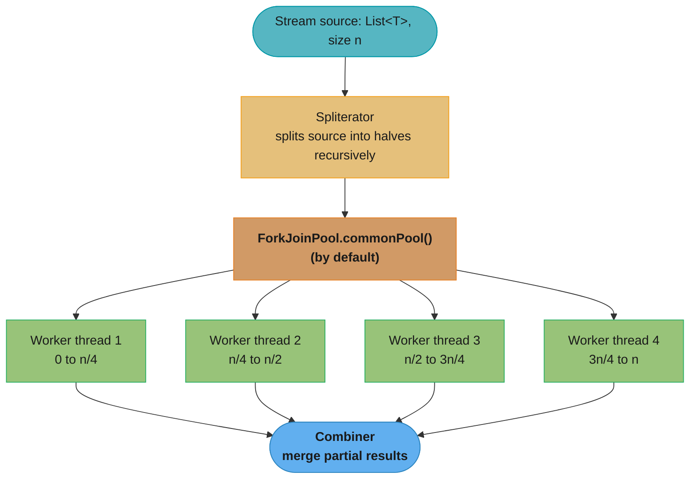

# Functional Programming

## 1. Concept Overview

Java isn't a purely functional language, but since Java 8 it supports a functional style through lambdas, functional interfaces, and the Stream API. This module goes deeper than the basics: function composition, currying, Collector internals, parallel stream mechanics, and immutability patterns — the techniques that appear in senior code reviews and architecture discussions.

Functional programming in Java means: **pure functions** (no side effects, output depends only on input), **immutability** (data doesn't change after creation), **composition** (build complex behavior from simple building blocks), and **first-class functions** (functions as values that can be passed and returned).

---

## 2. Intuition

> **One-line analogy**: Functional programming in Java is like LEGO — small, self-contained function pieces that snap together in any order because each piece has no hidden state or side effects.

**Mental model**: A pure function is deterministic: same input always produces same output, no observable side effects. Composition is the key technique — `f.andThen(g)` creates a new function that applies `f` then `g`, building a pipeline from small pieces. This makes behavior easy to test (test each function in isolation), easy to reason about (no shared state), and safe to parallelize.

**Why it matters**: Functional patterns appear in stream pipelines, reactive systems, and any collection processing code. Understanding `Collector` internals helps you write custom aggregators. Understanding when parallel streams hurt helps you avoid a common performance trap.

**Key insight**: The critical difference between `andThen` and `compose` (order reversal) is a common interview question and a common source of bugs when functions are composed in the wrong order.

---

## 3. Core Principles

- **Pure function**: No side effects; same input → same output. Enables memoization, parallelism.
- **Immutability**: Once created, data cannot change. No need for defensive copies on return; safe to share across threads.
- **Composition**: `f.andThen(g)` = `x -> g(f(x))`. Pipelines of small, focused functions.
- **Higher-order functions**: Functions that take or return other functions (`map`, `filter`, `reduce`).
- **Referential transparency**: A function call can be replaced with its result without changing program behavior.
- **Collector contract**: supplier + accumulator + combiner + finisher + characteristics. Understanding this contract lets you write custom collectors.

---

## 4. Types / Architectures / Strategies

### 4.1 Function Composition

| Method | On | Meaning | Order |
|--------|-----|---------|-------|
| `f.andThen(g)` | `Function<A,B>` | `x -> g(f(x))` | f first, then g |
| `f.compose(g)` | `Function<A,B>` | `x -> f(g(x))` | g first, then f |
| `p.and(q)` | `Predicate<T>` | `x -> p.test(x) && q.test(x)` | logical AND |
| `p.or(q)` | `Predicate<T>` | `x -> p.test(x) \|\| q.test(x)` | logical OR |
| `p.negate()` | `Predicate<T>` | `x -> !p.test(x)` | logical NOT |

### 4.2 Collector Internals

```
Collector<T, A, R> has 4 components:
  Supplier<A>      supplier()     -- creates empty accumulator
  BiConsumer<A,T>  accumulator()  -- folds element T into accumulator A
  BinaryOperator<A> combiner()   -- merges two accumulators (parallel only)
  Function<A,R>    finisher()    -- transforms accumulator A to result R

Characteristics:
  CONCURRENT  -- accumulator is thread-safe; skip combiner in parallel
  UNORDERED   -- result order doesn't matter (allows parallel optimizations)
  IDENTITY_FINISH -- finisher is identity; skip finisher call
```

### 4.3 Parallel Stream Fork/Join


---

## 5. Architecture Diagrams

### andThen vs compose (Crucial Difference)
```
Function<Integer, Integer> doubleIt = x -> x * 2;
Function<Integer, Integer> addTen   = x -> x + 10;

doubleIt.andThen(addTen).apply(3):
  Step 1: doubleIt(3) = 6
  Step 2: addTen(6)   = 16
  Result: 16

doubleIt.compose(addTen).apply(3):
  Step 1: addTen(3)   = 13
  Step 2: doubleIt(13) = 26
  Result: 26

Memory aid:
  andThen = "do f, THEN do g"    (f before g)
  compose = "compose f WITH g"   (g before f, like mathematical f∘g)
```

### Immutability Patterns
```
MUTABLE (dangerous):
  class Config {
      List<String> hosts;
      Config(List<String> hosts) { this.hosts = hosts; }
      List<String> getHosts() { return hosts; }  // exposes mutable list
  }
  // Caller: config.getHosts().clear()  -> Config is silently mutated

IMMUTABLE (correct):
  final class Config {
      private final List<String> hosts;
      Config(List<String> hosts) {
          this.hosts = List.copyOf(hosts);  // defensive copy on input
      }
      List<String> getHosts() {
          return Collections.unmodifiableList(hosts);  // defensive copy on output
          // OR: return hosts; (already unmodifiable via List.copyOf)
      }
  }
```

---

## 6. How It Works — Detailed Mechanics

### Custom Collector Implementation

```java
// Example: Collector that builds a formatted summary string
// "Total: 5 items, Sum: 150, Avg: 30.0"

public static Collector<Integer, ?, String> toSummary() {
    return Collector.of(
        // Supplier: create empty accumulator (int[] = [count, sum])
        () -> new int[]{0, 0},

        // Accumulator: fold one element into accumulator
        (acc, val) -> { acc[0]++; acc[1] += val; },

        // Combiner: merge two partial accumulators (for parallel streams)
        (acc1, acc2) -> new int[]{acc1[0] + acc2[0], acc1[1] + acc2[1]},

        // Finisher: convert accumulator to result
        acc -> String.format("Total: %d items, Sum: %d, Avg: %.1f",
            acc[0], acc[1], acc[0] == 0 ? 0.0 : (double) acc[1] / acc[0])
        // No CONCURRENT/UNORDERED/IDENTITY_FINISH characteristics
    );
}

// Usage:
String summary = IntStream.rangeClosed(1, 10).boxed()
    .collect(toSummary());
// "Total: 10 items, Sum: 55, Avg: 5.5"
```

### Parallel Stream — When It Helps vs Hurts

```java
// HELPS: large, CPU-bound, stateless, splittable, associative
long count = LongStream.rangeClosed(1, 1_000_000)
    .parallel()
    .filter(n -> isPrime(n))  // CPU-bound, stateless
    .count();                  // associative

// HURTS: I/O-bound (blocks ForkJoinPool.commonPool())
List<String> results = urls.parallelStream()
    .map(url -> httpClient.get(url))  // WRONG: blocks carrier threads
    .collect(toList());

// HURTS: small collections (overhead > benefit)
List<Integer> small = List.of(1,2,3,4,5);
small.parallelStream().map(x -> x*2).collect(toList());  // slower than sequential

// HURTS: ordered operations with side effects
List<Integer> list = new ArrayList<>();
IntStream.range(0, 100).parallel()
    .forEach(i -> list.add(i));  // RACE CONDITION: ArrayList not thread-safe

// HURTS: non-associative reduce
// sum is associative: (a + b) + c == a + (b + c)  -> parallel OK
// subtraction is not: (a - b) - c != a - (b - c)  -> parallel wrong
```

### Spliterator and Parallel Streams

```java
// Spliterator: tells the parallel splitter how to divide the source
// Key characteristics: SIZED, SUBSIZED, ORDERED, SORTED, DISTINCT, NONNULL, IMMUTABLE, CONCURRENT

// ArrayList has SIZED + SUBSIZED -> perfect binary splitting
// LinkedList has no SIZED -> poor splitting performance
// Stream.of() -> array-backed -> efficient

// Custom Spliterator:
public class RangeSpliterator implements Spliterator<Integer> {
    private int current, end;
    RangeSpliterator(int start, int end) { this.current = start; this.end = end; }

    @Override
    public boolean tryAdvance(Consumer<? super Integer> action) {
        if (current < end) { action.accept(current++); return true; }
        return false;
    }

    @Override
    public Spliterator<Integer> trySplit() {
        int mid = (current + end) >>> 1;
        if (mid <= current) return null;
        int lo = current; current = mid;
        return new RangeSpliterator(lo, mid);
    }

    @Override public long estimateSize() { return end - current; }
    @Override public int characteristics() { return ORDERED | SIZED | SUBSIZED | IMMUTABLE; }
}
```

### Currying and Partial Application in Java

```java
// Currying: transform f(a,b) into f(a)(b)
// Java version: return a Function when you apply the first argument

// BiFunction curried to Function<A, Function<B, C>>
Function<Integer, Function<Integer, Integer>> add = a -> b -> a + b;
Function<Integer, Integer> add5 = add.apply(5);  // partial application
int result = add5.apply(3);  // 8

// Practical partial application: pre-fill a validator
BiFunction<Integer, Integer, Boolean> between = (min, val) -> val >= min;
Function<Integer, Boolean> positiveCheck = between.apply(0);  // partial: min=0

// Method reference as partial application
// String::startsWith is BiFunction<String, String, Boolean>
// "hello"::startsWith is Function<String, Boolean>  (partial: receiver bound)
Predicate<String> startsWithHi = "Hello World"::contains;  // receiver bound
```

---

## 7. Real-World Examples

- **Stream pipeline in reporting**: Filter transactions by date range → group by category → sum amounts → sort descending → limit top 10 → format as report.
- **Custom Collector for histogram**: Collect numeric values into histogram buckets — supplier creates `int[]` of bucket counts, accumulator increments the right bucket, combiner adds bucket arrays.
- **Immutable domain model**: Financial transaction objects are immutable — prevents accidental mutation in concurrent processing; safe to share across threads without copying.
- **Function composition for validation**: Compose `Predicate`s for input validation: `notNull.and(notEmpty).and(maxLength(100))`.

---

## 8. Tradeoffs

| Functional vs Imperative | Functional | Imperative |
|--------------------------|-----------|------------|
| Readability | High for data pipelines | High for complex control flow |
| Debuggability | Harder (pipeline steps) | Easier (step-by-step) |
| Testability | High (pure functions) | Lower (stateful methods) |
| Performance (hot paths) | Possible overhead | Optimal |
| Parallelism | Safe (pure functions) | Dangerous (shared state) |

---

## 9. When to Use / When NOT to Use

**Use functional style when**:
- Processing collections of data (filter/map/collect)
- Building configurable behavior (Strategy pattern with functions)
- Composing validation or transformation pipelines

**Do NOT use functional style when**:
- Performance is critical and the overhead matters (measure with JMH)
- Complex control flow with multiple exit conditions (for-loop is clearer)
- You need checked exceptions to propagate (streams don't support them cleanly)

**Use parallel streams when**:
- Large datasets (>10K elements)
- CPU-bound, stateless operations
- Associative reduce operations

---

## 10. Common Pitfalls

### War Story 1: `andThen` vs `compose` order confusion
A data transformation pipeline had `sanitize.andThen(validate).andThen(transform)` and later refactored to use `compose`. The order was accidentally reversed, causing validation to run before sanitization — dirty data reached the validator and caused false failures. **Fix**: Be explicit, document the order, use integration tests that verify transformation order.

### War Story 2: Non-thread-safe collection in parallelStream forEach
A developer used `.parallelStream().forEach(list::add)` where `list` was an `ArrayList`. Under parallel execution, concurrent `add()` calls caused `ConcurrentModificationException` and data corruption (some elements silently lost). **Fix**: Use `collect(toList())` or `ConcurrentLinkedQueue` or `Collections.synchronizedList()`.

### War Story 3: Stream pipeline with stateful lambda
A lambda captured and modified an external `int[]` counter inside a `parallelStream` — both threads incremented the same array cell, causing data races. **Fix**: Use `count()`, `reduce()`, or `Collectors.counting()` — all thread-safe aggregation mechanisms.

---

## 11. Technologies & Tools

| Tool | Purpose |
|------|---------|
| `java.util.function.*` | Core functional interfaces |
| `Collectors` | Built-in and custom collectors |
| `Stream.of()` / `IntStream.range()` | Stream creation |
| `Spliterators` | Custom source splitting for parallel |
| Vavr | Functional data structures (Option, Either, immutable List) for Java |

---

## 12. Interview Questions with Answers

**Q1: What is the difference between `andThen` and `compose` in `Function`?**
Both compose two functions, but the order differs. `f.andThen(g)` applies `f` first, then `g`: equivalent to `x -> g(f(x))`. `f.compose(g)` applies `g` first, then `f`: equivalent to `x -> f(g(x))`. Memory aid: `andThen` means "apply f, then do g afterward"; `compose` matches mathematical function composition notation `f∘g` where g is applied first. For `Predicate`, the equivalents are `and()`, `or()`, `negate()`.

**Q2: What is a Spliterator and why does it matter for parallel streams?**
A `Spliterator` (splittable iterator) describes how a stream's source can be split into sub-ranges for parallel processing. It has `tryAdvance()` (process one element), `trySplit()` (split into two halves), `estimateSize()`, and `characteristics()` (SIZED, ORDERED, etc.). ArrayList has a `Spliterator` that supports balanced binary splitting (SIZED+SUBSIZED), making parallel streams very efficient. LinkedList cannot be efficiently split — `trySplit()` returns null early — so parallel streams over LinkedList fall back to nearly sequential execution.

**Q3: How does a custom `Collector` work? Implement one.**
A `Collector<T, A, R>` has four functions: `Supplier<A>` creates an empty accumulator; `BiConsumer<A,T>` folds each element into the accumulator; `BinaryOperator<A>` merges two partial accumulators (called in parallel mode); `Function<A,R>` finishes — converts accumulator to result. The `combiner` is critical for parallel correctness: if your accumulator isn't safely mergeable, mark the Collector without `CONCURRENT` and the framework handles parallel safely. `Collector.of(supplier, accumulator, combiner, finisher, characteristics)` is the factory.

**Q4: When should you NOT use parallel streams?**
(1) I/O-bound operations — block ForkJoinPool.commonPool() carrier threads. (2) Small collections (<100 elements) — overhead of splitting and combining exceeds gains. (3) Non-associative reduce — `reduce((a,b) -> a-b)` is wrong in parallel (subtraction isn't associative). (4) Ordered operations with side effects — `forEach` ordering is non-deterministic in parallel. (5) When ordering matters — `findFirst()` in parallel may degrade to `findAny()` behavior. (6) When collection is not efficiently splittable (LinkedList, iterators).

**Q5: What makes a stream operation stateful vs stateless, and why does it matter?**
Stateless operations (`filter`, `map`, `flatMap`, `peek`) process each element independently — no memory of previous elements. Stateful operations (`sorted`, `distinct`, `limit`, `skip`) need to see multiple elements before producing output. In parallel streams, stateful operations are performance hazards: `sorted()` must materialize all elements; `distinct()` must track seen elements across threads (synchronized state). For correct parallel execution, prefer stateless pipelines; use stateful ops at the end of the pipeline.

**Q6: How does `flatMap` differ from `map` conceptually?**
`map(f)` transforms each element: `Stream<T> → Stream<R>` where `f: T → R`. `flatMap(f)` transforms and flattens: `Stream<T> → Stream<R>` where `f: T → Stream<R>`. Conceptually, `flatMap` is monadic bind (>>=): it "flattens" one level of nesting. `Optional.flatMap` handles `Optional<Optional<T>> → Optional<T>`. This is the key primitive for monadic composition — chaining operations that each return a wrapped value.

**Q7: What is "effectively final" and why does Java require it for lambda captures?**
A variable is effectively final if it's initialized once and never reassigned. Java requires it because lambdas can outlive the method scope (submitted to a thread pool, stored in a field). Local variables are on the stack; when the method returns, the stack frame is gone. Java copies the value into the lambda's closure. If the variable could change after capture, the lambda would hold a stale copy — misleading semantics. For mutable state, use `AtomicInteger`, `AtomicReference`, or arrays.

**Q8: Explain the difference between `Function<A,B>` and `BiFunction<A,B,C>`.**
`Function<T,R>` takes one argument of type T, returns R. `BiFunction<T,U,R>` takes two arguments (T and U), returns R. Java has no `TriFunction` in the standard library — for 3+ arguments, use a custom functional interface or compose. `BiFunction` is commonly used with `Map.merge()`, `Map.replaceAll()`, and building binary operators. `UnaryOperator<T>` is `Function<T,T>`; `BinaryOperator<T>` is `BiFunction<T,T,T>` — useful for reduce operations.

**Q9: How does Records' auto-generated `equals()` differ from a typical POJO's?**
Record's auto-generated `equals()` is field-by-field comparison using `Objects.equals()` for each component — guaranteed correct by the spec. A typical POJO's `equals()` is whatever the developer wrote (or IDE generated, which may be correct or outdated if fields were added later). The critical difference: if you add a field to a POJO, `equals()` and `hashCode()` must be manually updated; for a Record, they're automatically regenerated at compile time — no risk of forgetting.

**Q10: When would you choose an unmodifiable wrapper vs `List.of()`?**
`Collections.unmodifiableList(list)` creates a view — changes to the underlying list are visible through the wrapper, but the wrapper itself rejects modifications. Use when you need to expose a list as read-only while still being able to mutate it internally. `List.of()` creates a truly immutable, independent list — no backing mutable list. Use for constant data, returning truly immutable results from API methods. Key tradeoff: `unmodifiableList` is a live view (changes propagate through); `List.of()` is a snapshot copy (no live relationship).

**Q11: What is the difference between `reduce` and `collect`, and when is using `reduce` to build a `List` an anti-pattern?**
`reduce` is designed for immutable accumulation — each step combines two values into a new value (fold). The combiner must be associative and the identity must be correct so parallel splits can merge safely without reordering results. `collect` is designed for *mutable* reduction — a `Supplier` creates a fresh container per thread, an `accumulator` mutates it, and a `combiner` merges two containers at parallel boundaries. Using `reduce` to build a `List` — `stream.reduce(new ArrayList<>(), (acc, e) -> { acc.add(e); return acc; }, (a, b) -> { a.addAll(b); return a; })` — mutates the "identity" object, which the spec forbids, and creates O(n) intermediate list copies in sequential mode. Use `Collectors.toList()` or `toUnmodifiableList()` instead; `collect` was designed exactly for container accumulation.

**Q12: How do you write thread-safe memoization using `ConcurrentHashMap.computeIfAbsent`, and what is the broken alternative?**

```java
// BROKEN: HashMap + manual null-check has a race on concurrent first calls
private final Map<String, BigDecimal> cache = new HashMap<>();
public BigDecimal rate(String currency) {
    if (!cache.containsKey(currency)) {
        cache.put(currency, fxApi.fetch(currency)); // data race
    }
    return cache.get(currency);
}

// FIXED: computeIfAbsent is atomic for the key — only one call to fxApi.fetch()
private final ConcurrentHashMap<String, BigDecimal> cache = new ConcurrentHashMap<>();
public BigDecimal rate(String currency) {
    return cache.computeIfAbsent(currency, fxApi::fetch);
}
```

`ConcurrentHashMap.computeIfAbsent` holds a bin-level lock so the mapping function is called at most once per key (unless two keys hash to the same bin — use `putIfAbsent` for strict once-only semantics). Critical caveat: never call `computeIfAbsent` recursively on the same map inside the mapping function — it deadlocks because the bin lock is not reentrant.

**Q13: What is the difference between `Supplier<T>` and `Callable<T>`, and when does the distinction matter?**
Both represent deferred computation that produces a value, but `Callable<T>` declares `throws Exception` while `Supplier<T>` does not. This means `Supplier` cannot propagate checked exceptions without wrapping them in `RuntimeException`. `Callable` integrates with `ExecutorService.submit()` (returns a `Future<T>`) and is used wherever the computation may fail with a checked exception. `Supplier` is the functional-programming default for lazy initialization, factory methods, and `Optional.orElseGet()`. Practical rule: use `Callable` for I/O-bound deferred work submitted to a thread pool; use `Supplier` for pure lazy evaluation. Converting `Callable` to `Supplier` requires a try/catch wrapper — a sign the abstraction boundaries are mismatched.

**Q14: Explain `Comparator.comparing()` chaining and its relationship to function composition.**
`Comparator.comparing(Person::getLastName).thenComparing(Person::getFirstName).thenComparingInt(Person::getAge)` composes comparators left-to-right using `thenComparing`, which delegates to the next comparator only when the current one returns 0 (equal). Internally `thenComparing` wraps the composition: `(a, b) -> { int c = this.compare(a, b); return c != 0 ? c : other.compare(a, b); }`. This is conceptually `andThen` for comparators. Reverse a sub-key with `.thenComparing(Person::getAge, Comparator.reverseOrder())`. To sort null-safe: wrap the key extractor with `Comparator.nullsFirst()` or `nullsLast()`. Practical tip: always `thenComparing` by a unique field last (e.g., ID) to produce a stable, deterministic ordering for pagination.

**Q15: What is referential transparency, and why does Java's functional interface design not enforce it?**
Referential transparency means a function's output depends solely on its inputs with no observable side effects — calling `f(x)` twice always returns the same result and changes nothing external. Java's `Function`, `Predicate`, `Consumer` etc. do NOT enforce this — a lambda can close over mutable fields, write to a database, call `System.out.println`, or mutate a shared counter. The Stream API documentation says behavioral parameters "should be non-interfering and stateless" but nothing in the type system enforces it. Consequence: a parallel stream with a stateful lambda silently produces incorrect results (broken):

```java
// BROKEN: accumulating into a shared list inside a parallel stream
List<Integer> result = new ArrayList<>();
IntStream.range(0, 100).parallel().forEach(result::add); // data race, missing elements

// FIXED: use collect(), which is parallel-safe by design
List<Integer> result = IntStream.range(0, 100).parallel()
    .boxed().collect(Collectors.toList());
```

Practical guidance: treat functional interfaces as trusted contracts; in code review, flag any lambda that reads or writes non-final external state, especially in streams.

---

## 13. Best Practices

1. **Prefer `andThen` over `compose`** for readability — the name matches the execution order.
2. **Document parallel stream assumptions** — which operations are stateless, splittable, associative.
3. **Use custom Collectors over collect-then-transform** for single-pass aggregation.
4. **Make domain objects immutable by default** — use defensive copy in constructors and getters.
5. **Use `Predicate.not()`** (Java 11) for negation: `stream.filter(Predicate.not(String::isEmpty))`.
6. **Prefer `reduce(identity, accumulator, combiner)`** for parallel-safe reductions.
7. **Test Collector combiner** explicitly — parallel correctness depends on the combiner being associative.
8. **Use `List.copyOf()`** (Java 10) to create immutable snapshots of existing collections.
9. **Avoid functional interfaces in performance-critical paths** without JMH verification.
10. **Keep lambda bodies short** — extract to named methods for anything > 3 lines.

---

## 14. Case Study

### A Composable Report-Generation Pipeline

```mermaid
flowchart LR
    classDef io      fill:#61afef,stroke:#2e86c1,color:#1a1a1a,font-weight:bold
    classDef frozen  fill:#c678dd,stroke:#9b59b6,color:#fff
    classDef train   fill:#98c379,stroke:#27ae60,color:#1a1a1a
    classDef mathOp  fill:#d19a66,stroke:#e67e22,color:#1a1a1a,font-weight:bold
    classDef lossN   fill:#e06c75,stroke:#c0392b,color:#fff,font-weight:bold
    classDef req     fill:#56b6c2,stroke:#0097a7,color:#1a1a1a
    classDef base    fill:#e5c07b,stroke:#f39c12,color:#1a1a1a

    Q(["Query"]) --> Load["loadFromDb"]
    Load --> Filt["andThen filter"]
    Filt --> Norm["andThen normalizeFx\nmemoized rate lookups"]
    Norm --> Agg["andThen aggregate\none-pass custom Collector"]
    Agg --> Csv["andThen toCsv"]
    Csv --> Out(["String (the whole pipeline as one Function&lt;Query, String&gt; value)"])

    class Q req
    class Load,Filt mathOp
    class Norm train
    class Agg lossN
    class Csv mathOp
    class Out io
```

**Scenario.** A finance team runs a nightly report job over ~5M transactions. The pipeline has five stages: load from DB, filter (settled, non-test), transform (normalize currency), aggregate (total/avg/min/max/top-10 merchants), and format to CSV. The original code was one monolithic method that was impossible to unit-test or reorder. The rewrite models each stage as a `Function<T, R>` composed with `andThen()`, computes all aggregates in a single pass via a custom `Collector`, and memoizes an expensive pure FX-rate lookup with `ConcurrentHashMap.computeIfAbsent()`. The composed pipeline is testable stage-by-stage and the single-pass collector touches 5M rows once instead of five times.



#### Stage composition with `andThen`

```java
Function<Query, List<Txn>>  load      = db::query;
Function<List<Txn>, List<Txn>> filter = txns -> txns.stream()
        .filter(t -> t.settled() && !t.isTest()).toList();
Function<List<Txn>, List<Txn>> normalize = fx::normalizeAll;
Function<List<Txn>, Report> aggregate = txns -> txns.stream().collect(toReport());
Function<Report, String>    toCsv     = Report::toCsv;

// Compose once; the order of andThen is the order of execution (left to right).
Function<Query, String> pipeline =
        load.andThen(filter).andThen(normalize).andThen(aggregate).andThen(toCsv);

String csv = pipeline.apply(nightlyQuery);
```

#### Single-pass custom Collector (total/avg/min/max/top-10)

```java
record Report(long count, double total, double min, double max, List<String> top10) {
    double average() { return count == 0 ? 0 : total / count; }
}
static Collector<Txn, ?, Report> toReport() {
    record Acc(double[] tot, double[] min, double[] max, long[] n, Map<String,Double> byMerchant) {}
    return Collector.of(
        () -> new Acc(new double[1], new double[]{Double.MAX_VALUE},
                      new double[]{-Double.MAX_VALUE}, new long[1], new HashMap<>()),
        (a, t) -> { a.tot()[0] += t.amount(); a.n()[0]++;
                    a.min()[0] = Math.min(a.min()[0], t.amount());
                    a.max()[0] = Math.max(a.max()[0], t.amount());
                    a.byMerchant().merge(t.merchant(), t.amount(), Double::sum); },
        (a, b) -> { a.tot()[0] += b.tot()[0]; a.n()[0] += b.n()[0];
                    a.min()[0] = Math.min(a.min()[0], b.min()[0]);
                    a.max()[0] = Math.max(a.max()[0], b.max()[0]);
                    b.byMerchant().forEach((k,v) -> a.byMerchant().merge(k,v,Double::sum)); return a; },
        a -> new Report(a.n()[0], a.tot()[0], a.min()[0], a.max()[0],
                        a.byMerchant().entrySet().stream()
                            .sorted(Map.Entry.<String,Double>comparingByValue().reversed())
                            .limit(10).map(Map.Entry::getKey).toList()));
}
```

#### Memoizing a pure, expensive function

```java
private final Map<String, Double> rateCache = new ConcurrentHashMap<>();
double rate(String currency) {
    // computeIfAbsent runs the costly lookup once per currency, then serves from cache.
    return rateCache.computeIfAbsent(currency, c -> expensiveFxLookup(c));
}
```

A generic memoizer that wraps any pure `Function`:

```java
static <T, R> Function<T, R> memoize(Function<T, R> fn) {
    Map<T, R> cache = new ConcurrentHashMap<>();
    return t -> cache.computeIfAbsent(t, fn);   // pure fn => safe to cache by argument
}

// Usage: turn an expensive pure function into a cached one without touching its body.
Function<String, Double> cachedRate = memoize(this::expensiveFxLookup);
```

Memoization is only correct for *pure* functions (same input -> same output, no side effects). Applying it to `nextSequenceNumber()` would freeze the first value forever — the discipline of functional purity is what makes the optimization safe.

#### Why single-pass aggregation matters at 5M rows

```
  Approach                      Passes over 5M rows   Wall time (illustrative)
  4 separate stream pipelines   4 (20M element reads)  ~2.0s
  1 custom Collector            1 (5M element reads)   ~0.6s
```

The custom collector folds total, min, max, count, and the per-merchant map in one traversal, so the source is read once and stays warm in cache. Four separate `stream()` calls re-iterate the list four times with cold-cache re-reads each pass.

### Common Pitfalls (production war stories)

**1. `compose()` vs `andThen()` reversed the pipeline.** A refactor swapped `andThen` for `compose` to "tidy" the chain, silently reversing stage order: `f.compose(g)` runs `g` *then* `f`, the opposite of `f.andThen(g)`. The report formatted *before* normalizing, producing garbage currency values. Rule: `andThen` = same order as written; `compose` = reverse order.

```java
load.compose(filter).compose(normalize);   // BROKEN: runs normalize, filter, load (reversed)
load.andThen(filter).andThen(normalize);    // FIX: runs load, filter, normalize
```

**2. Capturing mutable state in a lambda.** Someone summed with `double[] total = {0}; list.forEach(t -> total[0] += t.amount());` to dodge the effectively-final rule. It compiled, but under a parallel stream the unsynchronized array write produced lost updates and a wrong total. Use a `Collector` or `reduce`, not captured mutable state.

**3. Reusing a stream after a terminal operation.** A helper returned a `Stream` that the caller consumed twice; the second terminal op threw `IllegalStateException: stream has already been operated upon or closed`. Streams are single-use — return a `List` or a `Supplier<Stream<T>>` if multiple traversals are needed.

**4. `Comparator.comparing` with a null-unsafe key extractor.** Sorting merchants by an optional region threw NPE when a region was null: `comparing(Txn::region)`. Fix with `nullsLast`.

```java
.sorted(Comparator.comparing(Txn::region));                         // BROKEN: NPE on null
.sorted(Comparator.comparing(Txn::region, Comparator.nullsLast(naturalOrder())));  // FIX
```

### Interview Discussion Points

**What is the difference between `Function.andThen` and `Function.compose`?** `f.andThen(g)` applies `f` first then `g` (left-to-right, matching reading order). `f.compose(g)` applies `g` first then `f` (right-to-left, matching mathematical g(f(x)) notation reversed). Mixing them up silently reorders a pipeline.

**Why must lambdas capture only effectively-final variables?** Captured variables are copied into the lambda's closure; allowing reassignment would create ambiguity about which value is seen, and would be unsafe across threads. The restriction pushes you toward immutable data or proper accumulators, which are parallel-safe.

**Why is a single-pass custom Collector preferable to five separate stream passes?** It touches each element once (O(n) vs O(5n)) with better cache locality and a single traversal of a 5M-row dataset, and its combiner makes it parallel-safe. Separate passes re-iterate the source each time.

**How does `computeIfAbsent` give you memoization for free?** It atomically checks the cache and, only on a miss, runs the mapping function and stores the result — so a pure function is evaluated at most once per key even under concurrency, which is exactly memoization.

**Why can't you reuse a stream?** A stream is a one-shot view over a source bound to a single terminal operation; after the terminal op it is consumed/closed. For repeated traversal, collect to a reusable collection or wrap the source in a `Supplier<Stream<T>>` that produces a fresh stream each call.

**When is memoization safe, and when does it cause bugs?** Safe only for pure functions where the output depends solely on the argument and there are no side effects. Memoizing an impure function (one reading mutable state, doing I/O, or returning time/sequence-dependent values) caches a stale or wrong result forever. Purity is the precondition.

**Why model stages as `Function` objects rather than just calling methods in sequence?** Treating stages as first-class values lets you compose, reorder, unit-test, and conditionally insert stages (e.g. a debug logger) without rewriting the pipeline. The whole pipeline becomes a single `Function<Query, String>` value that can be passed, stored, and tested in isolation.

**How does a custom Collector stay correct under `parallel()`?** Through its associative combiner: the framework splits the source, runs the accumulator on each chunk into a separate accumulator instance, then merges them pairwise with the combiner. As long as the combiner is associative and the supplier yields fresh state, the parallel result equals the sequential one.

---

## Related / See Also

- [Java 8 Features](../java8_features/README.md) — lambda syntax, Optional, and stream overview as the entry point
- [Java Streams — Deep Dive](../java_streams/README.md) — Spliterator internals, parallel stream mechanics, all terminal ops
- [Generics & Type System](../generics_and_type_system/README.md) — Function/Supplier/Consumer type parameters, wildcard bounds in functional APIs
- [LLD: Strategy Pattern](../../lld/behavioral/strategy/README.md) — the GoF pattern that lambdas and method references implement without the boilerplate of a `Strategy` interface hierarchy

**What is the risk of `Comparator.comparing` extractors that return null?** The natural-order comparison invoked on a null key throws NPE mid-sort, which can corrupt the sort or abort the job. Wrap the key comparator with `Comparator.nullsFirst`/`nullsLast` to define where nulls land, making the sort total.
