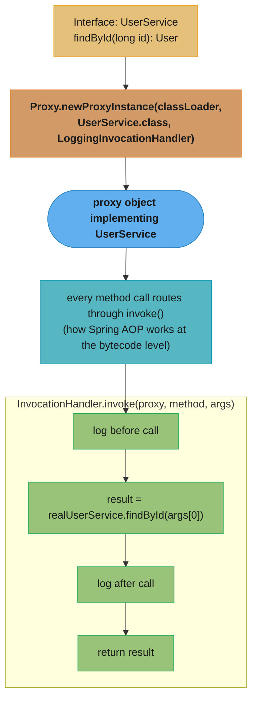
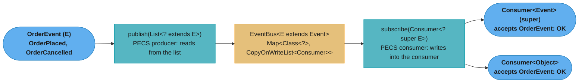

# Generics & Type System

## 1. Concept Overview

Java generics provide compile-time type safety while preserving backward compatibility with pre-Java 5 code through **type erasure**. Understanding generics deeply means knowing not just how to use `<T>` syntax, but *why* certain things are illegal (can't create `new T[]`), what bridge methods are, how wildcards enable PECS, and how reflection + the `TypeToken` pattern circumvent erasure.

The type system also includes annotations (retention, processors), reflection, and dynamic proxies — the mechanism behind AOP, ORM, and dependency injection frameworks.

---

## 2. Intuition

> **One-line analogy**: Generics are like a labeled container — the label (type parameter) tells the compiler what goes in and comes out, but at runtime the label is erased and it's just a plain box.

**Mental model**: The compiler uses type parameters as a lens that makes the code type-safe at the call site. At runtime (after erasure), there is no `ArrayList<String>` — there is only `ArrayList`. The `<String>` constraint was enforced by the compiler, then stripped from the bytecode. This is why you can't do `new T[]`, `instanceof List<String>`, or get the generic type argument of a field at runtime without extra tricks.

**Why it matters**: Wildcards and PECS confuse even experienced Java developers. Type erasure causes real bugs (heap pollution, unchecked cast warnings). Bridge methods explain surprising method dispatch behavior. Dynamic proxies power every major Java framework.

**Key insight**: PECS — Producer Extends, Consumer Super — is the rule for wildcards. If you're reading FROM a collection (it produces values), use `? extends T`. If you're writing TO a collection (it consumes values), use `? super T`. If both, use `T` directly.

---

## 3. Core Principles

- **Type erasure**: Generic type parameters are erased to their bounds (or `Object`) at compile time. No runtime generic type information for parameterized types.
- **Reifiable types**: Types whose full information is available at runtime: primitives, raw types, `Class<?>`, arrays of reifiable types. `List<String>` is NOT reifiable; `List` is; `String[]` is.
- **Bridge methods**: Compiler-generated methods to preserve polymorphism after erasure.
- **Heap pollution**: When a variable of parameterized type refers to an object of wrong type — possible via unchecked casts or `@SafeVarargs` abuse.
- **Covariance/contravariance**: `? extends T` is covariant (read); `? super T` is contravariant (write).
- **Wildcard capture**: Compiler captures `?` when it can prove all usages are consistent.

---

## 4. Types / Architectures / Strategies

### 4.1 Generic Type Bounds

| Syntax | Meaning | Read | Write |
|--------|---------|------|-------|
| `List<T>` | Exactly T | Yes | Yes |
| `List<?>` | Unknown type | Yes (as Object) | No (except null) |
| `List<? extends T>` | T or any subtype | Yes (as T) | No |
| `List<? super T>` | T or any supertype | Yes (as Object) | Yes (T or subtype) |

### 4.2 PECS (Producer Extends, Consumer Super)

```
Stack<? extends Number> producer = new Stack<Integer>();
producer.push(3);     // COMPILE ERROR: can't write to ? extends
Number n = producer.pop();   // OK: reads as Number

Stack<? super Integer> consumer = new Stack<Number>();
consumer.push(42);           // OK: Integer is a subtype of lower bound
Object o = consumer.pop();   // reads as Object only
```

### 4.3 Annotation Retention Policies

| Policy | Retention | Accessible |
|--------|----------|-----------|
| `RetentionPolicy.SOURCE` | Discarded by compiler | Annotation processors only |
| `RetentionPolicy.CLASS` | In `.class` file (default) | Not available at runtime |
| `RetentionPolicy.RUNTIME` | In `.class` file + runtime | Via `Class.getAnnotation()` |

---

## 5. Architecture Diagrams

### Type Erasure — What Gets Erased

```
Source code:                    After erasure (bytecode):
List<String> list;              List list;
list.get(0)                     (String) list.get(0)  [compiler-inserted cast]

Generic method:
<T extends Comparable<T>>       Comparable method(Comparable t)
T method(T t) { ... }          (bound is retained)

Unbounded:
<T> T identity(T t)            Object identity(Object t)
```

### Bridge Method Generation

```java
class Box<T> {
    T value;
    void set(T v) { this.value = v; }
    T get() { return value; }
}

class StringBox extends Box<String> {
    @Override
    void set(String v) { this.value = v.toUpperCase(); }
    @Override
    String get() { return value; }
}

// Compiler generates bridge methods in StringBox:
// synthetic void set(Object v) { this.set((String)v); }  // bridges Box.set(Object)
// synthetic Object get() { return this.get(); }           // bridges Box.get()

// So: Box<String> box = new StringBox(); box.set("hello");
// Calls bridge set(Object) -> casts to String -> calls actual set(String)
```

### Dynamic Proxy Architecture



---

## 6. How It Works — Detailed Mechanics

### Why You Can't Create `new T[]`

```java
// COMPILE ERROR:
class Container<T> {
    T[] elements = new T[10];  // ERROR: generic array creation
}

// WHY: after erasure, this would be:
// Object[] elements = new Object[10];
// But the variable claims to be T[] — heap pollution potential
// E.g.: Container<String> c; String[] safe = c.elements;
//        would be Object[] cast to String[] -> ClassCastException

// WORKAROUND 1: use Object[] + unchecked cast
@SuppressWarnings("unchecked")
T[] elements = (T[]) new Object[10];  // safe if not exposed externally

// WORKAROUND 2: take Class<T> to create proper array
class Container<T> {
    T[] elements;
    Container(Class<T> type, int size) {
        elements = (T[]) Array.newInstance(type, size);
    }
}
```

### TypeToken / Super-Type Token Pattern

```java
// Problem: can't get T from List<T> at runtime due to erasure
// Solution: create anonymous subclass -- subclass retains superclass type parameter

// TypeToken pattern (Guice, Gson, Jackson):
abstract class TypeToken<T> {
    Type getType() {
        // getGenericSuperclass() returns ParameterizedType of TypeToken<T>
        return ((ParameterizedType) getClass().getGenericSuperclass())
            .getActualTypeArguments()[0];
    }
}

// Usage: force a subclass to fix T
TypeToken<List<String>> token = new TypeToken<List<String>>() {};
//                                                             ^^ anonymous subclass
Type type = token.getType();  // returns ParameterizedType for List<String>
// Now you can use Gson/Jackson to deserialize to List<String> correctly
```

### @SafeVarargs and Heap Pollution

```java
// HEAP POLLUTION: variable of parameterized type refers to wrong type
@SafeVarargs
static <T> List<T> asList(T... elements) {
    return Arrays.asList(elements);
}
// @SafeVarargs: "I promise not to write to the varargs array"
// Varargs T... creates T[] (actually Object[] due to erasure)
// If we stored non-T into elements: heap pollution
// @SafeVarargs suppresses the unchecked warning

// INCORRECT usage would be:
@SafeVarargs
static <T> void store(T... elements) {
    Object[] raw = elements;  // legal, same array
    raw[0] = "hello";         // heap pollution if T != String
    T first = elements[0];    // ClassCastException at runtime!
}
```

### Reflection — getDeclaredMethod vs getMethod

```java
class Parent {
    public void pubMethod() {}
    private void privMethod() {}
}
class Child extends Parent {
    protected void protMethod() {}
}

Child c = new Child();
Class<?> clazz = c.getClass();

// getMethod: PUBLIC methods only, including INHERITED
clazz.getMethod("pubMethod");      // OK (inherited public)
clazz.getMethod("protMethod");     // NoSuchMethodException (not public)

// getDeclaredMethod: ALL access levels, but ONLY on THIS class (not inherited)
clazz.getDeclaredMethod("protMethod");  // OK (declared in Child)
clazz.getDeclaredMethod("pubMethod");   // NoSuchMethodException (inherited, not declared)
clazz.getSuperclass().getDeclaredMethod("privMethod");  // OK (declared in Parent)

// setAccessible: bypasses access control
Method m = clazz.getSuperclass().getDeclaredMethod("privMethod");
m.setAccessible(true);  // now callable; Java 9+ module system may block this
m.invoke(new Parent());
```

### JDK Dynamic Proxy

```java
// Creates proxy that implements the interface, routes all calls to InvocationHandler
UserService proxy = (UserService) Proxy.newProxyInstance(
    UserService.class.getClassLoader(),
    new Class[]{UserService.class},
    (proxyObj, method, args) -> {
        System.out.println("Before: " + method.getName());
        Object result = method.invoke(realService, args);
        System.out.println("After: " + method.getName());
        return result;
    }
);

// LIMITATION: JDK dynamic proxy only works with interfaces
// For class proxying: use CGLIB (subclass-based) or ByteBuddy
// Spring AOP: JDK proxy if bean implements interface; CGLIB otherwise
```

### Array Covariance vs Generic Invariance

```java
// Arrays are COVARIANT: String[] is a subtype of Object[]
// This is allowed at compile time:
String[] strings = new String[3];
Object[] objects = strings;  // OK — String[] is an Object[]

objects[0] = "hello";    // OK
objects[1] = 42;         // ArrayStoreException at RUNTIME
                         // The actual array is String[], but we stored an int through Object[]
                         // JVM checks the actual component type at runtime via checkcast

// Generics are INVARIANT: List<String> is NOT a subtype of List<Object>
List<String> stringList = new ArrayList<>();
List<Object> objectList = stringList;  // COMPILE ERROR
// Why? If this were allowed:
// objectList.add(42);    // would add Integer to what is really List<String>
// String s = stringList.get(0);  // ClassCastException at runtime
// Generics chose compile-time safety over runtime checks.

// Why array covariance exists:
// Java 1.0 had no generics. Arrays needed covariance for generic algorithms:
// void sort(Object[] array) { ... }  — had to accept String[], Integer[], etc.
// When generics were added (Java 5), breaking this would have been incompatible.
// The ArrayStoreException is the runtime safety net.

// The consequence:
// You can accidentally create type-unsafe code with arrays that compiles fine:
Object[] arr = new String[5];  // compiles
arr[0] = new Integer(1);       // compiles, but throws ArrayStoreException at runtime

// With generics: the compiler catches this:
List<String> list = new ArrayList<>();
list.add(42);  // COMPILE ERROR — caught at compile time, not runtime

// Summary:
// Arrays: covariant + runtime type check (ArrayStoreException)
// Generics: invariant + compile-time type check (no runtime overhead after erasure)
```

### MethodHandle API

```java
import java.lang.invoke.*;

// MethodHandle: a typed, directly executable reference to a method or field
// Faster than Method.invoke() for repeated calls — JIT can optimize MethodHandle
// invocations more aggressively (can inline through the handle)

MethodHandles.Lookup lookup = MethodHandles.lookup();

// findVirtual: instance method (dispatched dynamically)
MethodHandle toUpper = lookup.findVirtual(String.class, "toUpperCase",
    MethodType.methodType(String.class));  // return type, param types
String result = (String) toUpper.invoke("hello");  // "HELLO"

// findStatic: static method
MethodHandle parseInt = lookup.findStatic(Integer.class, "parseInt",
    MethodType.methodType(int.class, String.class));  // int parseInt(String)
int n = (int) parseInt.invoke("42");  // 42

// findConstructor: constructor
MethodHandle newStringBuilder = lookup.findConstructor(StringBuilder.class,
    MethodType.methodType(void.class, String.class));  // new StringBuilder(String)
StringBuilder sb = (StringBuilder) newStringBuilder.invoke("initial");

// findGetter / findSetter: field access
class Holder { public int value; }
MethodHandle getter = lookup.findGetter(Holder.class, "value", int.class);
MethodHandle setter = lookup.findSetter(Holder.class, "value", int.class);
Holder h = new Holder();
setter.invoke(h, 42);
int v = (int) getter.invoke(h);  // 42

// invoke vs invokeExact:
// invokeExact: faster but types must match EXACTLY (no widening/boxing)
//   toUpper.invokeExact("hello")  // OK: exact types
//   toUpper.invokeExact(42)       // WrongMethodTypeException (int not String)
// invoke: slower but handles type conversions (boxing, widening)
//   parseInt.invoke("42")  // OK: int return is auto-widened to Object

// Performance:
// Method.invoke() for 1M calls: ~80ms (reflection overhead per call)
// MethodHandle.invoke() for 1M calls: ~10ms (JIT can optimize, cache method)
// invokeExact() for 1M calls: ~2ms (near-direct call, inlineable by JIT)
// Direct call for 1M calls: ~1ms

// When to use:
// - Frameworks that need to call methods discovered at runtime but called millions of times
// - Alternative to reflection where performance matters (serialization, DI containers)
// - Not needed for one-off calls (Method.invoke() is fine there)
```

**In plain terms.** "Divide each wall time by the 1,000,000 calls that produced it and the table stops being four numbers and becomes one statement: reflection costs about 80x a plain call, a `MethodHandle` about 10x, and `invokeExact` is within a nanosecond of the real thing."

That per-call view is what decides the design. At 80 ns of overhead, `Method.invoke()` is free for a hundred startup-time lookups and ruinous for a serializer called on every field of every record.

| Symbol | What it is |
|--------|------------|
| 1M calls | The benchmark's fixed workload; dividing wall time by it converts milliseconds into nanoseconds per call |
| `Method.invoke()` | Reflective call: access check, arguments boxed into an `Object[]`, dispatch through the reflection machinery |
| `MethodHandle.invoke()` | Typed handle the JIT can inline through, but which still adapts argument types at the call site |
| `invokeExact()` | Same handle with no type adaptation at all — the signature must match exactly, so it compiles to nearly a direct call |
| Baseline | The direct call, the floor everything else is measured against |

**Walk one example.** The same method invoked 1,000,000 times, each way:

```
                            wall time    per call        overhead vs direct
  Method.invoke()              80 ms      80 ns                79 ns
  MethodHandle.invoke()        10 ms      10 ns                 9 ns
  invokeExact()                 2 ms       2 ns                 1 ns
  direct call                   1 ms       1 ns              (baseline)

  Method.invoke -> invokeExact  =  80 / 2  =  40x fewer nanoseconds per call

  A serializer touching 20 fields on 100,000 objects makes 2,000,000 calls:
    via Method.invoke()   2,000,000 x 80 ns  =  160 ms
    via invokeExact()     2,000,000 x  2 ns  =    4 ms
```

The 79 ns is not one cost but a stack of them: the access check that `setAccessible(true)` cannot fully remove, the `Object[]` allocation for arguments, and the boxing of every primitive into it. `invokeExact` deletes all three by demanding an exact signature up front — which is exactly why it throws `WrongMethodTypeException` rather than quietly widening.

### Annotation Processor Mechanics (APT)

```java
// Annotation processors run at compile time (javac phase), before bytecode is generated.
// They can: validate annotations, generate new source files, report errors/warnings.
// Used by: Lombok (@Getter/@Builder), MapStruct, Dagger, AutoValue, QueryDSL

// Minimal annotation processor:
@SupportedAnnotationTypes("com.myapp.Builder")  // process @Builder annotations
@SupportedSourceVersion(SourceVersion.RELEASE_17)
public class BuilderProcessor extends AbstractProcessor {

    @Override
    public boolean process(Set<? extends TypeElement> annotations,
                           RoundEnvironment roundEnv) {
        for (TypeElement annotation : annotations) {
            for (Element element : roundEnv.getElementsAnnotatedWith(annotation)) {
                if (element.getKind() != ElementKind.CLASS) continue;

                TypeElement classElement = (TypeElement) element;
                String className = classElement.getSimpleName().toString();

                // Generate source file for the builder
                try {
                    JavaFileObject file = processingEnv.getFiler()
                        .createSourceFile(className + "Builder");
                    try (Writer w = file.openWriter()) {
                        w.write("public class " + className + "Builder { ... }");
                    }
                } catch (IOException e) {
                    processingEnv.getMessager().printMessage(
                        Diagnostic.Kind.ERROR,
                        "Cannot generate builder: " + e.getMessage(),
                        element);
                }
            }
        }
        return true;  // claim these annotations (don't pass to other processors)
    }
}

// Registration: META-INF/services/javax.annotation.processing.Processor
// Contains: com.myapp.BuilderProcessor

// Key APIs:
// processingEnv.getFiler()     → create source/class/resource files
// processingEnv.getMessager()  → report errors/warnings/notes
// processingEnv.getTypeUtils() → type utilities (subtype check, erasure)
// processingEnv.getElementUtils() → element utilities (get package name, etc.)

// How Lombok works:
// @Getter, @Setter etc. are SOURCE retention (not in .class file)
// Lombok's processor modifies the AST directly (using internal javac API)
// This is why Lombok works without generating visible .java files
// MapStruct, Dagger: RUNTIME or CLASS retention; generate real .java source files
```

---

## 7. Real-World Examples

- **PECS in Collections API**: `Collections.copy(List<? super T> dest, List<? extends T> src)` — dest is consumer (super), src is producer (extends). You can copy `List<Integer>` into `List<Number>` without a new API.
- **TypeToken in Gson**: `new TypeToken<List<User>>(){}` tells Gson the concrete generic type for deserialization — works around erasure.
- **@SafeVarargs in Stream.of()**: `Stream.of(T... values)` — safe because it only reads the array.
- **Dynamic proxy in Spring AOP**: Every `@Transactional` bean method goes through a JDK proxy that starts/commits/rolls back transactions.
- **Lombok**: An annotation processor (`RetentionPolicy.SOURCE`) that generates constructors, getters, builders at compile time — no runtime overhead.

---

## 8. Tradeoffs

| Approach | Type Safety | Runtime Info | Performance |
|----------|-------------|-------------|-------------|
| Generics with erasure | Compile-time | None | Best (no overhead) |
| Generics + TypeToken | Compile-time | Yes (via subclass) | Small allocation |
| Raw types | None | None | Same as generics |
| Reflection | Runtime checks only | Yes | Slower (method lookup) |
| Dynamic proxy | Interface contract | Yes | Method invocation overhead |

---

## 9. When to Use / When NOT to Use

**Use `? extends T`** (producer): when a method reads from a parameterized collection but doesn't write.

**Use `? super T`** (consumer): when a method writes to a parameterized collection.

**Use `T` (bounded)**: when you need to both read and write to the collection.

**Use reflection** sparingly: annotation processing, frameworks, testing utilities. Not in production hot paths.

**Use dynamic proxy** for: AOP (logging, transactions, security), lazy loading, decorator injection.

**Do NOT use `@SuppressWarnings("unchecked")`** without a comment explaining why it's safe — it disables the type system locally.

---

## 10. Common Pitfalls

### War Story 1: Heap pollution via raw types
A legacy codebase used raw `List` parameters. A `List<String>` was passed to a method that expected `List<Integer>` via a raw cast. The code compiled (with unchecked warning suppressed). At runtime, `Integer result = list.get(0)` threw `ClassCastException` on a line that looked completely safe — the pollution came from elsewhere. **Lesson**: never suppress unchecked warnings without understanding why; never use raw types in new code.

### War Story 2: TypeToken omitted → wrong deserialization type
A team deserialized JSON `[{"name":"Alice"},...]` with `gson.fromJson(json, List.class)` — without TypeToken. Gson deserialized each element as `LinkedTreeMap<String,Object>` (raw Object), not `User`. The code compiled fine; the `ClassCastException` appeared at the first `users.get(0).getName()` call. **Fix**: `gson.fromJson(json, new TypeToken<List<User>>(){}.getType())`.

### War Story 3: `@SafeVarargs` on method that writes to varargs array
A developer annotated a method `@SafeVarargs` that mutated the varargs array. The annotation silenced the compiler warning but the heap pollution was real — callers got `ClassCastException` at seemingly unrelated lines. **Lesson**: `@SafeVarargs` is a promise "I don't write to the varargs array" — verify this before annotating.

---

## 11. Technologies & Tools

| Tool | Purpose |
|------|---------|
| `javap -verbose` | See bridge methods, erasure in bytecode |
| `java.lang.reflect.*` | Reflection API |
| `java.lang.reflect.ParameterizedType` | Get generic type info at runtime |
| `Proxy.newProxyInstance()` | JDK dynamic proxy |
| CGLIB / ByteBuddy | Class-based dynamic proxy (subclassing) |
| Google Guice TypeLiteral / Gson TypeToken | TypeToken pattern implementations |

---

## 12. Interview Questions with Answers

**Q1: Explain PECS with a real example.**
PECS = Producer Extends, Consumer Super. When a collection *produces* values (you read from it), use `? extends T` — you can read as T or its supertype. When it *consumes* values (you write into it), use `? super T` — you can write T or any subtype. Real example: `void addAll(List<? super T> dest, List<? extends T> src)` — dest accepts T or supertype (consumer), src provides T or subtype (producer). Practical: `copy(List<? super Number> dest, List<? extends Number> src)` allows copying `List<Integer>` into `List<Number>`.

**Q2: What is type erasure and what problems does it cause?**
Type erasure removes generic type parameters at compile time, replacing them with bounds (`Object` for unbounded). Problems: (1) Can't use `instanceof` with parameterized type: `if (obj instanceof List<String>)` is illegal. (2) Can't create generic arrays: `new T[10]` is illegal. (3) Overloading on different generic types is impossible: `void method(List<String>)` and `void method(List<Integer>)` have same erasure. (4) Runtime type info is unavailable without TypeToken workarounds. (5) Heap pollution possible through unchecked casts. The benefit: backward compatibility with pre-Java-5 code using raw types.

**Q3: What is a bridge method? Show an example.**
A bridge method is a compiler-generated synthetic method that preserves polymorphism after type erasure. When a subclass overrides a generic method with a more specific type, or uses covariant return types, the compiler generates a method with the erased signature that delegates to the actual override. Example: `class Box<T> { T get() {...} }` erases to `Object get()`. `class StringBox extends Box<String> { String get() {...} }` declares `String get()` (covariant). The compiler adds `synthetic Object get() { return this.get(); }` in StringBox — the bridge. This ensures `Box<String> b = new StringBox(); Object o = b.get()` works via dynamic dispatch.

**Q4: Why can't you create a generic array (`new T[10]`)?**
Generic arrays would create heap pollution. After erasure, `new T[10]` becomes `new Object[10]`. Assigning this to a variable declared as `T[]` looks type-safe, but if exposed externally, another thread could get the `T[]` reference and store a wrong type into the `Object[]` — causing a `ClassCastException` when the array is actually used as `T[]`. The compiler prevents this by making generic array creation a compile error. Workaround: use `(T[]) new Object[10]` internally (never expose the raw array) or `Array.newInstance(clazz, size)` with a `Class<T>` parameter.

**Q5: What is the difference between `getMethod()` and `getDeclaredMethod()`?**
`getMethod(name, paramTypes)` returns a PUBLIC method visible on the class, including inherited public methods from superclasses and interfaces. `getDeclaredMethod(name, paramTypes)` returns any method (public/protected/package/private) declared *directly on this class*, excluding inherited methods. To access private methods, use `getDeclaredMethod()` + `setAccessible(true)`. To traverse the full inheritance chain, you must walk `getSuperclass()` iteratively.

**Q6: What is heap pollution?**
Heap pollution occurs when a variable of a parameterized type refers to an object of the wrong parameterized type — possible because of erasure. Example: `List<String> list = (List<String>) (List) new ArrayList<Integer>()` — the cast is legal (both are `List` after erasure), but `String s = list.get(0)` throws `ClassCastException`. The JVM inserts a checkcast instruction at the point of *use*, not the point of assignment. The compiler warns about unchecked casts to prevent this; `@SafeVarargs` suppresses warnings for varargs that don't introduce pollution.

**Q7: How does a JDK dynamic proxy work internally?**
`Proxy.newProxyInstance` generates a new class at runtime that implements the given interfaces and routes every call to your `InvocationHandler`. Concretely, `Proxy.newProxyInstance(loader, interfaces, handler)` creates a class (via `ProxyClassFactory`) that: (1) implements all specified interfaces; (2) extends `java.lang.reflect.Proxy`; (3) for every method call, invokes `handler.invoke(proxy, method, args)`. The generated class is loaded and cached. When you call a method on the proxy, it calls `handler.invoke()` with the `Method` object and arguments — the handler can execute before/after logic, delegate to a real service, or return a mock value. Limitation: only works for interfaces (not concrete classes — use CGLIB/ByteBuddy for class proxying).

**Q8: What is the TypeToken pattern and why is it needed?**
TypeToken exploits the fact that an anonymous class retains its superclass's type parameters in the bytecode as a `ParameterizedType`. `new TypeToken<List<String>>() {}` creates an anonymous subclass of `TypeToken<List<String>>`. Calling `getClass().getGenericSuperclass()` returns `TypeToken<List<String>>` as a `ParameterizedType`, from which `getActualTypeArguments()[0]` returns the `Type` for `List<String>`. Without TypeToken, `List<String>.class` is illegal and you'd get only `List.class` — erased. Libraries like Gson, Guice, and Jackson use TypeToken for proper generic type deserialization/injection.

**Q9: What does `@SafeVarargs` promise?**
`@SafeVarargs` on a method promises: "this method does not perform unsafe operations on the varargs parameter" — specifically, it doesn't write to the varargs array in a way that could cause heap pollution. It suppresses the "possible heap pollution from parameterized vararg type" unchecked warning. The annotation is placed on `final`, `static`, or `private` methods (must not be overridable, as overrides might break the promise). You must manually verify the promise — the compiler doesn't check it. Incorrect use means callers get `ClassCastException` at unexpected points.

**Q10: What is the difference between `Class.forName()` and `ClassLoader.loadClass()`?**
`Class.forName(name)` loads the class AND initializes it (runs `<clinit>` static initializers). `ClassLoader.loadClass(name)` loads the class but does NOT initialize it (deferred until first use). `Class.forName(name, initialize, loader)` gives full control. Practical implication: `Class.forName("com.mysql.jdbc.Driver")` was the traditional JDBC driver registration mechanism — it worked because loading the class triggered `static {}` initialization which registered the driver. If you used `classLoader.loadClass()` instead, the driver would not be registered.

**Q11: Why is array assignment covariant in Java but generic type assignment invariant? What runtime mechanism catches array covariance violations?**
Arrays are covariant (`String[]` is an `Object[]`) for historical reasons: Java 1.0 had no generics and needed to write generic array-processing methods like `Arrays.sort(Object[])`. The runtime safety net is `ArrayStoreException` — on every array element write, the JVM checks that the stored type is compatible with the array's actual component type (stored in the array header). This is a runtime check. Generics are invariant (`List<String>` is NOT `List<Object>`) because type erasure means no runtime type information exists for the generic parameter — there's no mechanism to perform the equivalent of `ArrayStoreException` at runtime for generic containers. The compiler performs all checks statically at compile time. Summary: arrays: covariant + runtime `ArrayStoreException`; generics: invariant + compile-time error.

**Q12: What is a `MethodHandle` and when is it preferable to `Method.invoke()`?**
A `MethodHandle` (Java 7, `java.lang.invoke.MethodHandles`) is a typed, executable reference to a method, constructor, or field, obtained via `MethodHandles.Lookup`. The JIT can optimize `MethodHandle` invocations much more aggressively than `Method.invoke()` — it can inline through the handle and even eliminate the call overhead entirely with `invokeExact()`. `Method.invoke()` has per-call overhead for access checking, argument boxing into `Object[]`, and dispatch overhead. Benchmark comparison: for 1M calls, `Method.invoke()` ~80ms, `MethodHandle.invoke()` ~10ms, `invokeExact()` ~2ms, direct call ~1ms. Prefer `MethodHandle` over `Method.invoke()` when the same method is called repeatedly (frameworks, serialization, DI containers). Use `invokeExact()` when you can guarantee exact type matches — it's the fastest option.

**Q13: What is the difference between `getFields()` / `getMethods()` and their `getDeclared*()` counterparts, and which do framework code use?**
`getFields()` returns all **public** fields from the class and its entire superclass/interface hierarchy. `getDeclaredFields()` returns **all fields declared directly in that class** — any visibility — but nothing inherited. Same pattern applies to `getMethods()` vs `getDeclaredMethods()` and constructors. Framework code (serializers, ORMs, DI containers) typically uses `getDeclaredFields()` to access private fields, then calls `field.setAccessible(true)`. Traversal of the full hierarchy requires a loop up the `getSuperclass()` chain — stop at `Object.class`. With JPMS (Java 9+), `setAccessible(true)` on a field in another module requires the module to open the package (e.g., `opens com.example to com.fasterxml.jackson.databind`); failing to do so throws `InaccessibleObjectException` at runtime.

**Q14: What is `@SuppressWarnings("unchecked")` and when is it safe vs. dangerous to use it?**
It suppresses the compiler's "unchecked cast" warning from generic type erasure. Safe to use when you have a provable invariant that the cast cannot fail: a private map you fully control, an explicit `instanceof` check before cast, or a well-typed internal API contract. Dangerous when external code can insert arbitrary types into the container, because erasure makes the cast invisible at runtime — the `ClassCastException` fires when the variable is *used*, not when it's cast, making the bug hard to trace:

```java
// DANGEROUS: cast is suppressed but the real ClassCastException fires far from here
@SuppressWarnings("unchecked")
Map<String, User> users = (Map<String, User>) externalMap; // any value type is silently accepted
users.get("alice").getRoles(); // ClassCastException here, not at the cast above
```

Rule: always add a comment documenting the invariant. If you cannot articulate the invariant, the suppression is not safe.

**Q15: What is `TypeToken` / `ParameterizedType` and why is it needed to preserve generic type information at runtime?**
Type erasure removes generic type parameters at runtime — `List<String>` and `List<Integer>` are both just `List.class`. When a framework (JSON deserializer, DI container) needs the full parameterised type at runtime, it uses `ParameterizedType` via an anonymous subclass trick:

```java
// The anonymous class retains List<String> as its generic supertype in the .class file
Type type = new TypeToken<List<String>>() {}.getType();
// Guava or Gson introspect: type.getClass().getGenericSuperclass() -> ParameterizedType -> String

// Gson usage
List<String> result = gson.fromJson(json, new TypeToken<List<String>>(){}.getType());
// Without TypeToken: gson.fromJson(json, List.class) -> List<Object> (erasure)
```

Jackson uses `TypeReference<T>` for the same purpose. This works because the byte code of an anonymous class stores its generic supertype in the `Signature` attribute, which `getGenericSuperclass()` reads at runtime — it's the one place erasure doesn't fully erase. Practical rule: whenever you write a method that must produce the right generic instance at runtime, accept `TypeToken<T>` as a parameter rather than `Class<T>`.

**Q16: What does "reified" mean, and which Java types are reified vs erased at runtime?**
A reified type is one whose full type information survives into the running bytecode; an erased type has that information stripped by the compiler. Primitives (`int`, `boolean`), raw types (`List`), `Class<?>` objects, and array component types (`String[]`) are reified — the JVM can check them at runtime, which is exactly why `arr instanceof String[]` compiles but `list instanceof List<String>` does not. Parameterized types (`List<String>`, `Map<K,V>`) are erased to their bound (`List`, `Map`) — the `<String>` part exists only in the `.class` file's `Signature` attribute for reflection, not as a runtime-checkable type. This distinction is why C#/.NET generics (reified) behave differently from Java generics (erased) despite similar syntax.

**Q17: What is a recursive generic bound like `<T extends Comparable<T>>`, and why is it needed?**
A recursive (self-referential) bound constrains `T` to be comparable to *itself*, which is what lets a generic method sort or compare a list of any `Comparable` type safely. The bound `<T extends Comparable<T>>` reads as "T must implement Comparable of its own type" — so `T.compareTo(T)` is guaranteed to accept another `T`, not some unrelated type:
```java
public static <T extends Comparable<T>> T max(List<T> list) {
    T result = list.get(0);
    for (T item : list) if (item.compareTo(result) > 0) result = item;
    return result;
}
// Without the recursive bound, T extends Comparable would only guarantee
// compareTo(Object), losing type safety on the argument.
```
This is the exact bound the JDK uses on `Collections.max()` and `Comparable<T>` itself — it is the standard idiom whenever a generic algorithm needs elements to compare against their own type.

**Q18: What is "wildcard capture" and why does the compiler reject writing to a `List<?>` even inside your own method?**
Wildcard capture is the compiler binding an unknown `?` to one fresh type variable, but only within a single expression, not across separate statements. That narrow scope is why reading an element out of a `List<?>` and writing it straight back via `set()` still fails to compile, even though the operation is logically safe — the compiler cannot prove the two `?` occurrences denote the same underlying type, so any `add`/`set` call is rejected as unsafe. The fix is to extract a private generic helper method with a named type variable, which forces one capture for the whole method body:
```java
// BROKEN: compiler can't prove list.get(0) matches the type list.set() expects
static void swapFirst(List<?> list) { list.set(0, list.get(1)); }  // compile error

// FIX: helper captures the wildcard as a concrete (if unnamed) type T
static void swapFirst(List<?> list) { swapHelper(list); }
private static <T> void swapHelper(List<T> list) { list.set(0, list.get(1)); }
```

---

## 13. Best Practices

1. **Avoid raw types in all new code** — always parameterize.
2. **Apply PECS consistently** — `? extends T` for sources, `? super T` for sinks.
3. **Always add a comment with `@SuppressWarnings("unchecked")`** explaining why it's safe.
4. **Use TypeToken** when you need generic type info at runtime (JSON deserialization, injection).
5. **Prefer `getDeclaredXxx()` + `setAccessible()`** over `getXxx()` when you know the exact declaration class.
6. **Use annotation `@Retention(RetentionPolicy.RUNTIME)`** for annotations you need to query at runtime.
7. **Use JDK dynamic proxy** for interface-based AOP; CGLIB or ByteBuddy for class-based.
8. **Don't expose generic arrays** from your class — heap pollution risk.
9. **Use bounded wildcards** in API signatures to maximize API flexibility (Effective Java Item 31).
10. **Use `Collections.<Type>emptyList()`** instead of raw `Collections.emptyList()` where possible.

---

## 14. Case Study

### A Type-Safe Event Bus Library Across 30 Microservices

**Scenario.** A shared `event-bus` library is published as a JAR and consumed by 30 microservices. Each service publishes domain events (`OrderPlaced`, `PaymentCaptured`, `ShipmentDispatched`) and subscribes to events it cares about. The library handles roughly 80k events/sec at peak across the fleet. Before generics were tightened, the team shipped three production `ClassCastException` incidents in one quarter caused by raw types and unsafe casts in the bus internals. The redesign goal: make every unsafe routing a compile-time error, not a 3am page.



### PECS — Producer-Extends, Consumer-Super

The canonical mnemonic first, then applied to the bus. A `copy` utility reads from a source (producer) and writes to a destination (consumer):

```java
// Effective Java Item 31. The source PRODUCES Numbers we read -> extends.
// The dest CONSUMES Numbers we write -> super.
public static void copy(List<? extends Number> src, List<? super Number> dest) {
    for (Number n : src) {       // read as Number: any subtype works
        dest.add(n);             // write a Number: any supertype container works
    }
}

// Caller flexibility this buys:
List<Integer> ints   = List.of(1, 2, 3);          // ? extends Number  OK
List<Object>  sink   = new ArrayList<>();          // ? super Number    OK
copy(ints, sink);                                  // compiles, type-safe
```

Applied to the bus, the same rule lets a publisher hand in a `List<OrderPlaced>` to a `publish(List<? extends OrderEvent>)`, and lets a subscriber register a `Consumer<Event>` for an `OrderEvent` stream via `subscribe(Consumer<? super OrderEvent>)`:

```java
public final class EventBus<E extends Event> {
    private final List<Consumer<? super E>> subscribers = new CopyOnWriteArrayList<>();

    // Producer position: we only READ events out of the incoming list.
    public void publish(List<? extends E> events) {
        for (E e : events) {
            for (Consumer<? super E> s : subscribers) s.accept(e);
        }
    }

    // Consumer position: the handler will RECEIVE (consume) events of type E.
    public void subscribe(Consumer<? super E> handler) {
        subscribers.add(handler);
    }
}

EventBus<OrderEvent> bus = new EventBus<>();
bus.subscribe(System.out::println);          // Consumer<Object> accepts OrderEvent
bus.subscribe(new AuditLogger());            // Consumer<Event>  accepts OrderEvent
bus.publish(List.of(new OrderPlaced("o-1"))); // List<OrderPlaced> is List<? extends OrderEvent>
```

**What this actually says.** "The nested loop in `publish` means the real work is not the event count but the event count multiplied by the subscriber count — every extra subscriber re-costs the entire event stream."

That multiplication is why the type safety matters so much here. A wrong cast is not one bad dispatch; it is one bad dispatch per subscriber, per event, across a fleet already running at peak.

| Symbol | What it is |
|--------|------------|
| Outer loop | `for (E e : events)` — walks the published batch once |
| Inner loop | `for (Consumer<? super E> s : subscribers)` — walks the `CopyOnWriteArrayList` once per event |
| Dispatches | The product of the two: how many `accept()` calls actually run |
| 80k events/sec | The stated fleet peak, spread across the 30 consuming services |

**Walk one example.** The fleet peak, resolved down to one service:

```
  fleet peak                    80,000 events/sec
  consuming services                        30
  per service                   80,000 / 30  =  2,667 events/sec

  take one service with 3 registered subscribers:
    dispatches = events x subscribers
               = 2,667 x 3
               =  8,001 accept() calls/sec

  add a 4th subscriber (one line of code):
               = 2,667 x 4
               = 10,668 accept() calls/sec       <- +2,667/sec, not +1
```

`CopyOnWriteArrayList` is the right structure precisely because of this shape: the inner loop runs 8,001 times a second while `subscribe()` runs a handful of times at startup. Copy-on-write makes writes expensive and iteration lock-free — the exact trade this ratio calls for. A `synchronized` list would put a lock acquisition on every one of those 8,001 dispatches.

### Heap Pollution: Broken Raw Type, Then the Fix

The original bus used a raw `Map` and an unchecked cast. This compiles with a warning and then explodes at runtime far from the cast site — classic heap pollution.

```java
// BROKEN — raw type + unchecked cast lets a String handler receive an Integer event
class UnsafeBus {
    private final Map handlers = new HashMap();   // raw type: no type checking

    @SuppressWarnings("unchecked")
    void subscribe(Class type, Consumer handler) { handlers.put(type, handler); }

    @SuppressWarnings("unchecked")
    void publish(Object event) {
        Consumer h = (Consumer) handlers.get(event.getClass());
        if (h != null) h.accept(event);   // ClassCastException erupts INSIDE the handler
    }
}
// Consumer<String> registered under String.class, then someone publishes
// a subclass mismatch -> the cast inside the lambda throws, with a stack trace
// pointing at user code, not at the bus. Hours lost.
```

```java
// FIX — a typed container that re-checks at the boundary using the Class token
final class TypedBus {
    private final Map<Class<?>, List<Consumer<?>>> handlers = new ConcurrentHashMap<>();

    <T> void subscribe(Class<T> type, Consumer<? super T> handler) {
        handlers.computeIfAbsent(type, k -> new CopyOnWriteArrayList<>()).add(handler);
    }

    @SuppressWarnings("unchecked")     // safe: cast guarded by the Class<T> key invariant
    <T> void publish(Class<T> type, T event) {
        List<Consumer<?>> hs = handlers.get(type);
        if (hs != null) for (Consumer<?> h : hs) ((Consumer<? super T>) h).accept(event);
    }
}
```

### Type Erasure and the Class<T> Token Workaround

At runtime `List<String>` and `List<Integer>` are the *same* class — `java.util.ArrayList`. Erasure removes the parameter, so you cannot overload, `instanceof`, or `new T[]` on it.

```java
List<String>  a = new ArrayList<>();
List<Integer> b = new ArrayList<>();
System.out.println(a.getClass() == b.getClass());   // true — both ArrayList.class

// You CANNOT do: if (a instanceof List<String>)  // compile error, erasure
// Workaround: carry the type at runtime with a Class<T> token (super type token
// for generics-of-generics via TypeReference, as Jackson does).
static <T> T parse(String json, Class<T> token) {  // token survives erasure
    return mapper.readValue(json, token);
}
```

### Common Pitfalls

**The invariance trap — `List<Dog>` is NOT a `List<Animal>`.**
```java
List<Dog> dogs = new ArrayList<>();
// List<Animal> animals = dogs;   // COMPILE ERROR — and that error is protecting you:
// animals.add(new Cat());        // would have polluted the dog list -> CCE on read
// FIX: use a wildcard for read-only views: List<? extends Animal> view = dogs;
```

**Unchecked cast from a raw type introduces heap pollution.** A `@SuppressWarnings("unchecked")` on a raw-to-parameterized cast silences the only warning the compiler can give you. Confine the cast to the smallest possible scope, never blanket a whole method, and document the invariant that makes it safe (the `Class<T>` key above).

**`instanceof` on a generic type fails at runtime.** `obj instanceof List<String>` does not compile; `obj instanceof List` (raw) compiles but tells you nothing about elements. To branch on element type you must inspect an element or carry a `Class<T>` token.

**Capturing a wildcard in a helper.** A method body cannot `add` to a `List<?>` because the capture type is unknown. Extract a generic helper with a named type variable so the compiler can *capture* the wildcard: `private <T> void swap(List<T> l, int i, int j)` called from `void swap(List<?> l, ...)`.

### Interview Discussion Points

**Why does `List<? extends Number>` reject `add(1)` but allow `get()` as a `Number`?** Because the capture could be `List<Long>` and adding an `Integer` would corrupt it; the compiler only knows the elements are *some* unknown subtype of `Number`, which is enough to read them as `Number` but not enough to write any specific subtype safely.

**What is heap pollution and how does it arise without an explicit cast?** Heap pollution is a variable of a parameterized type referring to an object that is not of that type. It arises through raw types, unchecked casts, and varargs of generics (`@SafeVarargs`); the JVM, having erased the type, does not catch it until a later implicit cast fails — far from the cause.

**How would you store heterogeneous typed values in one map safely?** A typesafe heterogeneous container (Effective Java Item 33): `Map<Class<?>, Object>` with `<T> void put(Class<T> t, T v)` and `<T> T get(Class<T> t) { return t.cast(map.get(t)); }`. The `Class<T>` token re-establishes the type the erasure removed, and `Class.cast` makes the unchecked cast checked.

**Why are arrays covariant but generics invariant, and why does that matter?** Arrays are reified and covariant (`Object[] a = new String[1]`), so a bad store throws `ArrayStoreException` at runtime. Generics are erased and invariant, pushing the same class of error to compile time. Mixing them (`List<String>[]`) is forbidden precisely because it would let heap pollution slip past the compiler.

---

## Related / See Also

- [Collections Internals](../collections_internals/README.md) — generic collection implementations, bounded type parameters in practice
- [Functional Programming](../functional_programming/README.md) — Function/Supplier/Consumer type parameters, variance in functional interfaces
- [Core Language](../core_language/README.md) — polymorphism and OOP foundations that generics extend

**When is `@SuppressWarnings("unchecked")` acceptable in a published library?** Only when you can prove the cast is safe from a surrounding invariant (such as a `Class<T>` key controlling the value type), the annotation is on the narrowest scope possible (ideally a single local variable, not a method), and you add a comment stating why it is safe so the next maintainer does not have to re-derive the proof.
