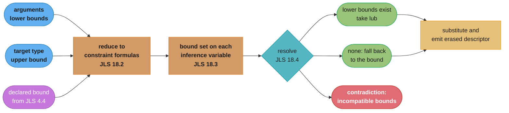
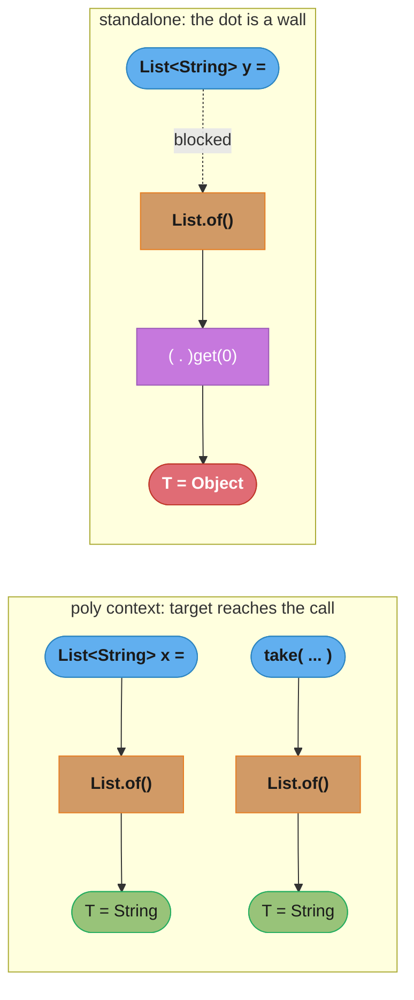

# Type Inference and Bounds — Deep Dive

---

## 1. Concept Overview

The parent module explains what generics *mean* — PECS, erasure, bridge methods, wildcards. This file explains how `javac` **decides** the type arguments you did not write, and what a **bound list** does to the bytes in the class file.

Two separate machines are at work. **Bounds** (JLS 4.4) are a declaration-site constraint list: `<T extends Comparable<T> & Serializable>` says T satisfies both. **Inference** (JLS 18) is a use-site constraint solver: it invents an inference variable for each type parameter, collects constraint formulas from the arguments and from the target type, reduces them to a bound set, and resolves. Neither is guesswork, and neither is optional — every diamond, every unqualified generic call, every lambda you pass is running the solver.

The two machines meet at erasure. A bound list has a **leftmost** element, and the erasure of a type variable is the erasure of that leftmost bound (JLS 4.6). That single rule decides the method descriptor in the class file, decides which bridge method the compiler emits, and makes bound *order* a binary-compatibility surface — reordering two bounds that are logically a set changes the descriptor and breaks every already-compiled caller.

**Baseline:** Java 25 (LTS). The inference algorithm of JLS 18 has been stable since Java 8 (JEP 101, Generalized Target-Type Inference). Java 9–25 added syntax that *feeds* the solver — diamond on anonymous classes (JEP 213, Java 9), `var` (JEP 286, Java 10), `var` in lambda parameters (JEP 323, Java 11) — without changing how it solves. All compiler output quoted below was captured from a real `javac` run; the local toolchain was JDK 23.0.2, and none of the samples use a feature newer than Java 11.

---

## 2. Intuition

> **One-line analogy**: Inference is a constraint solver, not a mind reader. It only knows what flows *into* the expression — and nothing flows leftward across a dot.

**Mental model**: Picture each missing type argument as an empty slot `α`. Every argument you pass writes a *lower* bound into that slot ("α must be at least String"). The target type on the left of the `=`, or the parameter type of the enclosing call, writes an *upper* bound ("α must be at most Number"). Resolution then picks the tightest type satisfying the set. If a slot collects no constraints at all, it does not fail — it silently resolves to the declared bound, which is usually `Object`. That silence is the source of most inference bugs.

**Why it matters**: Every inference failure you will meet in production is one of three shapes — a slot that got no target type (chained calls, `var`), a slot that got two contradictory ones (`Collectors.toMap` with a mistyped value), or a wildcard that was captured twice when you needed it captured once. Recognising the shape from the error text is the whole skill.

**Key insight**: **The receiver of a method call is never a poly expression.** `Collections.emptyList()` on its own line infers `List<String>` from the variable you assign it to; the same call followed by `.stream()` infers `List<Object>`, because the target type on the far left cannot reach back through the dot. The dot is a wall, and inference is solved independently on each side of it.

---

## 3. Core Principles

- **A bound list is ordered, and only the first entry may be a class** (JLS 4.4). Everything after the first `&` must be an interface, and no interface may appear twice with different type arguments.
- **Erasure takes the leftmost bound** (JLS 4.6). `<T extends Comparable<T> & Serializable>` erases T to `Comparable`; swap the two and it erases to `Serializable`. The descriptor in the class file changes with it.
- **Poly vs standalone** (JLS 15.2). An expression is a *poly* expression only in an assignment or invocation context. Poly expressions receive a target type; standalone expressions do not. Receivers, operands of `+`, and array indices are standalone.
- **Not every argument counts during overload resolution.** An implicitly typed lambda and an inexact method reference are *not pertinent to applicability* (JLS 15.12.2.2), so they contribute nothing until the target type is known.
- **Capture conversion applies to an expression's type, not to a variable** (JLS 5.1.10). Reading the same `List<?>` variable twice produces two unrelated fresh type variables, `CAP#1` and `CAP#2`.
- **Resolution prefers the lower bounds.** Given lower bounds, the solver takes their least upper bound (`lub`, JLS 4.10.4), which can be an *intersection type*; only when there is no lower bound does it fall back to the upper bound (JLS 18.4).
- **Bounds survive into the class file; type arguments at a use site do not.** The `Signature` attribute (JVMS 4.7.9) records the full generic declaration, which is why reflection can still read `Comparable<T> & Serializable` at runtime.

---

## 4. Types / Architectures / Strategies

### 4.1 The bound forms

| Form | Erases to | Buys you | Cost |
|------|-----------|----------|------|
| `<T>` | `Object` | Nothing but a name to link positions | No member is callable on T |
| `<T extends Number>` | `Number` | Numeric members on T | Callers restricted to Number subtypes |
| `<T extends Comparable<T>>` | `Comparable` | `t.compareTo(T)`, type-safe in the argument | Rejects a type comparable to a *supertype* |
| `<T extends Comparable<? super T>>` | `Comparable` | Also accepts `Dog` when only `Animal implements Comparable<Animal>` | Nothing; this is the strictly better f-bound |
| `<T extends Comparable<T> & Serializable>` | `Comparable` | Both contracts on one variable | Order is now an ABI decision |
| `<T extends Object & Comparable<? super T>>` | `Object` | Deliberate erasure control (this is `Collections.max`) | Reads as noise to anyone who does not know the rule |
| `<B extends Builder<B>>` | `Builder` | The self type: `add()` returns the *subclass* | Requires an unchecked `(B) this` in `self()` |

The parent module's §4.1 tabulates the four *use-site* wildcard forms — `List<T>`, `List<?>`, `List<? extends T>`, `List<? super T>`. This table is the *declaration-site* counterpart it stops short of: the same variance questions, asked where the type parameter is introduced rather than where it is used.

### 4.2 Which positions supply a target type

| Position | Poly? | Consequence |
|----------|-------|-------------|
| Right-hand side of an assignment | Yes | `List<String> l = List.of();` infers `String` |
| Argument to a method call | Yes | `take(List.of())` infers from `take`'s parameter |
| `return` expression | Yes | Infers from the enclosing method's return type |
| Lambda body (expression form) | Yes | Infers from the functional interface's return type |
| Cast operand | Yes | `(List<String>) List.of()` — but a cast is a blunt instrument |
| **Receiver of a `.` call** | **No** | `List.of().get(0)` infers `Object` |
| Operand of `+`, array index, condition | No | Standalone; the declared bound is used |
| Initialiser of a `var` | No | There is no declared type to be a target |

### 4.3 Two inference passes, one call

`javac` runs the solver twice per invocation. **Applicability inference** (JLS 18.5.1) uses only the arguments that are pertinent to applicability, and answers "is this method even a candidate?". **Invocation type inference** (JLS 18.5.2) then runs with the target type and the remaining arguments and produces the final type arguments. A nest of generic calls — `collect(groupingBy(f, mapping(g, toList())))` — is solved as **one** combined problem in the second pass, which is why the error lands on the outermost call.

---

## 5. Architecture Diagrams

### The solver pipeline



Three inputs, one bound set, three outcomes. The `lub` branch is why mixing `String` and `Integer` yields an intersection type rather than an error, and the "none" branch is why an unconstrained variable silently becomes `Object`.

### Where the target type can and cannot reach



The dotted edge is the whole bug class: the assignment target is right there on the same line, and it still cannot influence the receiver's type arguments.

### Bound list to class file

```
declaration
  <T extends Comparable<T> & Serializable>

  leftmost bound ......... Comparable        <- erasure comes from HERE (JLS 4.6)
  additional bound ....... Serializable      <- checked by javac, invisible in the descriptor

class file, two independent records
  descriptor ............. (Ljava/lang/Comparable;Ljava/lang/Comparable;)Ljava/lang/Comparable;
  Signature attribute .... <T::Ljava/lang/Comparable<TT;>;:Ljava/io/Serializable;>(TT;TT;)TT;
                             ^^
                             empty class bound: the two colons mean "no class,
                             then an interface bound" (JVMS 4.7.9.1)

same declaration, bounds swapped
  <T extends Serializable & Comparable<T>>
  descriptor ............. (Ljava/io/Serializable;Ljava/io/Serializable;)Ljava/io/Serializable;
  Signature attribute .... <T:Ljava/io/Serializable;:Ljava/lang/Comparable<TT;>;>(TT;TT;)TT;

the JDK's own deliberate choice, java.util.Collections
  <T extends Object & Comparable<? super T>> T max(Collection<? extends T>)
  descriptor ............. (Ljava/util/Collection;)Ljava/lang/Object;
  Signature attribute .... <T:Ljava/lang/Object;:Ljava/lang/Comparable<-TT;>;>
                             (Ljava/util/Collection<+TT;>;)TT;
```

The descriptor is what the JVM links against; the `Signature` attribute is what `javac` and reflection read. Only the first line changes when you reorder bounds — and only the first line matters to an already-compiled caller.

---

## 6. How It Works — Detailed Mechanics

### 6.1 Intersection bounds, and what the leftmost one costs

An intersection bound lets one type variable carry two contracts at once. The canonical need is a value that must be *ordered* and must be *written to disk*:

```java
/** Both bounds are used: compareTo from the first, the write path needs the second. */
static <T extends Comparable<T> & Serializable> T checkpointMax(List<T> batch) {
    T best = batch.get(0);
    for (T t : batch) if (t.compareTo(best) > 0) best = t;
    persist(best);                 // needs Serializable
    return best;
}
static void persist(Serializable s) { }
```

Two rules constrain what you may write (JLS 4.4). At most one bound may be a class, and it must come first — `<T extends Serializable & Number>` is rejected with `error: interface expected here`, caret under `Number`. And an interface may not be repeated with different arguments:

```
E13c.java:2: error: repeated interface
    static <T extends Comparable<String> & Comparable<Integer>> void clash(T t) {}
                                                     ^
E13c.java:2: error: Comparable cannot be inherited with different arguments:
                    <java.lang.String> and <java.lang.Integer>
```

Now the part that surprises people. Compile the same method with the bounds in each order and read the descriptors back with `javap -p -s`:

```
static <T extends java.lang.Comparable<T> & java.io.Serializable> T maxOf(T, T);
  descriptor: (Ljava/lang/Comparable;Ljava/lang/Comparable;)Ljava/lang/Comparable;

static <T extends java.io.Serializable & java.lang.Comparable<T>> T maxOf2(T, T);
  descriptor: (Ljava/io/Serializable;Ljava/io/Serializable;)Ljava/io/Serializable;
```

Same constraint set, same source semantics, two different methods as far as the JVM is concerned. The call site is unaffected at *compile* time — `javac` inserts a `checkcast` after either call:

```
 7: invokestatic  #23   // Method maxOf:
                       //   (Ljava/lang/Comparable;Ljava/lang/Comparable;)Ljava/lang/Comparable;
10: checkcast     #29   // class java/lang/String
```

### 6.2 Reordering bounds is a binary-incompatible change

Because the descriptor is part of the linkage key, reordering bounds in a published library is exactly as breaking as renaming the method. Compile a caller against v1, drop in v2 with the bounds swapped, and nothing recompiles — it just fails at first call:

```
Exception in thread "main" java.lang.NoSuchMethodError:
  'java.lang.Comparable Lib.pick(java.lang.Comparable, java.lang.Comparable)'
    at App.main(App.java:2)
```

Note what did *not* happen: no `ClassNotFoundException`, no `IncompatibleClassChangeError`, no warning at build time. The consumer's Maven build is green. This is a runtime-only failure, and it fires on the first invocation, not at class load.

Practical rules: treat the bound list as ordered API, put the bound you actually dispatch on first, and run a binary-compatibility checker (japicmp or Revapi) in CI on any artifact other teams compile against.

### 6.3 `Collections.max` and deliberate erasure control

The JDK uses this rule on purpose. `java.util.Collections.max` is declared with a bound that adds no constraint whatsoever:

```java
public static <T extends Object & Comparable<? super T>> T max(Collection<? extends T> coll)
```

Every type is already an `Object`, so the first bound narrows nothing. Its only job is to be **leftmost**, so that T erases to `Object` and the descriptor stays `(Ljava/util/Collection;)Ljava/lang/Object;` — byte-identical to the pre-generics Java 1.4 signature. Drop the `Object &` and the descriptor becomes `...)Ljava/lang/Comparable;`, and every class compiled against 1.4 stops linking. You can see both forms side by side:

```
static <T extends Comparable<T> & Serializable> T checkpointMax(java.util.List<T>);
  descriptor: (Ljava/util/List;)Ljava/lang/Comparable;

static <T extends Object & Comparable<? super T>> T maxLikeJdk(java.util.Collection<? extends T>);
  descriptor: (Ljava/util/Collection;)Ljava/lang/Object;
```

`javap -s` hides the `Object &` (it prints the bound list without the redundant class bound); `javap -v` prints it, and the raw `Signature` attribute settles it: `<T:Ljava/lang/Object;:Ljava/lang/Comparable<-TT;>;>`. If you ever wondered why the JDK writes it that way, this is the entire reason.

### 6.4 Target typing: four calls to `List.of()`, three answers

```java
static void take(List<String> xs) {}

List<String> assigned = List.of();   // assignment context  -> T = String
take(List.of());                     // invocation context  -> T = String
var inferred = List.of();            // no target           -> T = Object
String s = List.of().get(0);         // receiver, standalone-> T = Object  -- ERROR
```

The last line is the one that ships. Real compiler output:

```
E2.java:8: error: incompatible types: Object cannot be converted to String
        String s = List.of().get(0);
                                ^
```

The caret sits on `get`, not on `List.of()`, which sends people hunting in the wrong place. Read it as: "the receiver was solved on its own, it came out `List<Object>`, and `Object.get(0)` returns `Object`."

### 6.5 `var` plus diamond collapses to `Object`

`var` removes the target type, and the diamond needs one. Together they produce a container of `Object` that then fails several lines later:

```java
var l = new ArrayList<>();   // ArrayList<Object> -- compiles, no warning
l.add("hello");              // fine: String is an Object
String s = l.get(0);         // error: incompatible types: Object cannot be converted to String
```

Nothing warns at the declaration. `var l = List.of();` behaves identically. The rule to internalise: **never combine `var` with a diamond or with a generic factory that has no arguments.** Write `var l = new ArrayList<String>();` — that is still shorter than the explicit form and it actually says something.

### 6.6 Capture conversion, properly

The parent module shows the helper-method trick and stops. Here is why the trick is needed and where capture happens without it.

Capture conversion (JLS 5.1.10) applies to the **type of an expression**, not to a variable's declared type. Each time you evaluate an expression of a wildcard-parameterised type, the compiler mints a *fresh* type variable for the `?`. Two reads of the same variable therefore produce two unrelated fresh variables — and the error text says so out loud:

```
E4.java:3: error: method set in interface List<E> cannot be applied to given types;
    static void selfSet(List<?> l) { l.set(0, l.get(0)); }
                                      ^
  required: int,CAP#1
  found:    int,CAP#2
  reason: argument mismatch; Object cannot be converted to CAP#1
  where CAP#1,CAP#2 are fresh type-variables:
    CAP#1 extends Object from capture of ?
    CAP#2 extends Object from capture of ?
```

`CAP#1` and `CAP#2` both came from `l`. That is the mechanism the helper trick defeats: passing `l` to `<T> void swap(List<T>, int, int)` performs capture **once**, at the argument, and T is then that single fresh variable for the whole body.

What the parent does not say is that this happens implicitly all the time, and you rarely need the helper:

```java
// Reading is always fine: CAP#1 <: Object
static void dump(List<?> l) { for (Object o : l) System.out.println(o); }

// A ? super T parameter accepts the capture, so this compiles unaided
static void prune(List<?> l) { l.removeIf(Objects::isNull); }

// Capture flows into a generic method argument automatically -- no helper needed
static <T> void rotate(List<T> l) { l.add(l.remove(0)); }
static void rotateAny(List<?> l) { rotate(l); }

// Capture of a lower-bounded wildcard: writes allowed, reads come back as Object
static void feed(List<? super Integer> sink) { sink.add(42); Object back = sink.get(0); }
```

Capture also fails in the opposite direction — when you need *one* capture and the compiler produces two across separate arguments:

```
E5.java:14: error: method pair in class E5 cannot be applied to given types;
    static void twoDistinct(List<?> a, List<?> b) { pair(a, b); }
                                                    ^
  required: List<T>,List<T>
  found:    List<CAP#1>,List<CAP#2>
  reason: inference variable T has incompatible equality constraints CAP#2,CAP#1
```

There is no helper that fixes this one, because the two lists genuinely might have different element types. The signature has to change: either `<T> void pair(List<T>, List<T>)` becomes the caller's problem (make the caller hold `List<T>`), or the method takes `List<?>, List<?>` and does only wildcard-safe work.

The JDK itself declines the helper. `java.util.Collections.swap` carries this comment in the source shipped with the JDK:

```java
public static void swap(List<?> list, int i, int j) {
    // instead of using a raw type here, it's possible to capture
    // the wildcard but it will require a call to a supplementary
    // private method
    final List l = list;
    l.set(i, l.set(j, l.get(i)));
}
```

A deliberate raw type with a comment explaining the alternative. Copy the *comment* discipline, not the raw type.

Finally, a capture cannot be written down. `CAP#1` is not a denotable type — you cannot declare a variable of it, put it in a field, or return it. It exists for the duration of one expression, which is exactly why it cannot leak.

### 6.7 When resolution invents an intersection type

If a slot collects several lower bounds, resolution takes their least upper bound (JLS 4.10.4), and `lub` of two unrelated classes is an **intersection type** — a type with no name that you nevertheless see in error messages:

```java
var x = flag ? new ArrayList<String>() : new LinkedList<String>();
String s = x;
```

```
E11.java:5: error: incompatible types: INT#1 cannot be converted to String
  where INT#1 is an intersection type:
    INT#1 extends AbstractList<String>,Serializable,Cloneable
```

Mix a `String` and an `Integer` through one type variable and it gets stranger, because `lub` has to break an infinite regress with a wildcard:

```
  where INT#1,INT#2 are intersection types:
    INT#1 extends Object,Serializable,Comparable<? extends INT#2>,Constable,ConstantDesc
    INT#2 extends Object,Serializable,Comparable<?>,Constable,ConstantDesc
```

Two lessons. First, `INT#n` in an error means "you gave me two unrelated things where one type was expected" — look at the arguments, not the target. Second, an intersection type is a real type you can also *write*, in a cast (JLS 15.16), and that is the supported way to make a lambda serializable:

```java
Comparator<String> c = (Comparator<String> & Serializable) (x, y) -> x.compareTo(y);
new ObjectOutputStream(OutputStream.nullOutputStream()).writeObject(c);  // succeeds
```

### 6.8 Where inference gives up, and how to read the error

**Shape 1 — no target reached the slot (chained calls).** The most common form in real code involves `Comparator`:

```java
// WORKS: Person::name is an exact method reference, so it IS pertinent to
// applicability (JLS 15.12.2.2) and pins T=Person, U=String in pass 18.5.1.
Comparator<Person> ok = Comparator.comparing(Person::name).thenComparing(Person::age);

// BREAKS: an implicitly typed lambda is NOT pertinent to applicability, and the
// receiver has no target type, so T resolves to its bound, Object.
Comparator<Person> bad = Comparator.comparing(p -> p.name()).thenComparing(p -> p.age());
```

```
E19.java:5: error: cannot find symbol
        Comparator<Person> c = Comparator.comparing(p -> p.name()).thenComparing(p -> p.age());
                                                          ^
  symbol:   method name()
  location: variable p of type Object
```

`location: variable p of type Object` is the tell. Whenever a lambda parameter reports as `Object`, the enclosing call got no target type.

**Shape 2 — two contradictory bounds (`Collectors.toMap`).**

```java
Map<String, Long> m1 = users.stream().collect(Collectors.toMap(User::name, User::age));
```

```
E6.java:9: error: incompatible types: inference variable U has incompatible bounds
            .collect(Collectors.toMap(User::name, User::age));
                    ^
    equality constraints: Long
    lower bounds: Integer
```

Read it mechanically: **lower bounds come from the arguments, equality constraints come from the target.** `User::age` returns `int`, boxed to `Integer` — that is the lower bound. `Map<String, Long>` forced `U = Long` — that is the equality constraint. The fix is whichever side is wrong; here, the target should have been `Map<String, Integer>`.

**Shape 3 — a nest solved as one problem.** A `groupingBy`/`mapping`/`toList` stack is one inference problem (JLS 18.5.2), so the caret lands on the outermost call even when the mistake is three levels in:

```
E7.java:13: error: incompatible types: inference variable T#1 has incompatible bounds
        Map<String, List<String>> byDept = users.stream().collect(
                                                                 ^
    equality constraints: String
    lower bounds: Integer,U
  where T#1,U,T#2,A,R are type-variables:
    T#1 extends Object declared in method <T#1>toList()
    U extends Object declared in method <T#2,U,A,R>mapping(...)
```

The caret is useless; the `where` block is not. `T#1` belongs to `toList()`, its lower bound is `Integer`, its equality constraint is `String` — so the element type produced by `mapping` disagrees with the `List<String>` in the target. The real error is `User::age` where `User::dept` was meant.

**Shape 4 — the slot appears only in the return type.**

```
E15.java:8: error: incompatible types: no instance(s) of type variable(s) T exist
                   so that List<T> conforms to String
        String s = mk();
```

"No instance exists" means there is no substitution for T that makes the return type match the target — a genuine type error, not a hint-missing error. Do not reach for a type witness; the assignment itself is wrong.

**Four ways out, in the order you should try them.** Give the lambda parameter an explicit type (`(User u) -> ...`) — cheapest and most readable. Break the chain into a typed local variable, which restores the assignment context. Name an intermediate `Collector<...>` variable so the error is reported where the mistake is. Only then supply an explicit type witness, `Collections.<String>emptyList()`, which turns the solver off entirely and will silently go stale when the surrounding types change.

```java
// FIX 1 -- name the lambda parameter type
Comparator<User> byName = Comparator.comparing((User u) -> u.name()).thenComparing(u -> u.age());

// FIX 2 -- typed local restores the assignment context
Map<String, Integer> ages = users.stream().collect(Collectors.toMap(User::name, User::age));

// FIX 3 -- name the collector, so the error is reported at the real mistake
Collector<User, ?, Map<String, List<Integer>>> byDept =
        Collectors.groupingBy(User::dept, Collectors.mapping(User::age, Collectors.toList()));
Map<String, List<Integer>> grouped = users.stream().collect(byDept);

// FIX 4 -- explicit type witness: last resort
List<String> a = Collections.<String>emptyList().stream().toList();
```

### 6.9 Inference, erasure, and the bridge method's descriptor

The two machines meet one more time, in the bridge method. A bridge's descriptor is the **erasure of the overridden method** — which means the leftmost bound picks it. Give the superclass a bound and the bridge is not `Object`:

```java
static class Box<T extends Number> { void set(T v) {} }
static class IntBox extends Box<Integer> { @Override void set(Integer v) {} }
```

```
void set(java.lang.Integer);
  descriptor: (Ljava/lang/Integer;)V
  flags: (0x0000)
void set(java.lang.Number);
  descriptor: (Ljava/lang/Number;)V
  flags: (0x1040) ACC_BRIDGE, ACC_SYNTHETIC
```

`set(Number)`, not `set(Object)` — because `T extends Number` erased T to `Number`. The parent module's bridge example uses an unbounded `Box<T>` and so shows `set(Object)`; the bound is what makes the difference.

And this is why the *bound* survives where the *type argument* does not. The class file carries two independent things: the erased descriptor, and the `Signature` attribute (JVMS 4.7.9) holding the full generic declaration. Reflection reads both:

```java
Method m = E16.class.getDeclaredMethod("pick", Comparable.class, Comparable.class);
System.out.println(Arrays.toString(m.getParameterTypes()));      // erased
System.out.println(m.getTypeParameters()[0].getBounds());        // from Signature
```

```
erased param types : [interface java.lang.Comparable, interface java.lang.Comparable]
erased return type : interface java.lang.Comparable
type variable      : T
declared bounds    : [java.lang.Comparable<T>, interface java.io.Serializable]
```

Both bounds are readable at runtime. The `<String>` you wrote at a *call site* is gone forever; the `& Serializable` you wrote at the *declaration* is permanent metadata. That asymmetry is what lets Jackson's `TypeReference` and Gson's `TypeToken` work at all — they read a declaration-site signature, never a use-site one.

---

## 7. Real-World Examples

- **`Collections.max` / `Collections.min`** — `<T extends Object & Comparable<? super T>>`. The redundant `Object` bound exists solely to keep the erased return type `Object`, preserving the Java 1.4 descriptor. The clearest production instance of the leftmost-bound rule.
- **`Comparator.comparing(...).thenComparing(...)`** — the single most-reported inference failure in Java. Works with a method reference, breaks with an implicit lambda, because only the former is pertinent to applicability.
- **`EnumMap<K extends Enum<K>, V>`** — an f-bound in the JDK's own collection API, guaranteeing the key type is its own enum family so the implementation can index by `ordinal()`.
- **`Collectors.toMap`** — the `U has incompatible bounds` error is the standard way teams discover that `int` boxes to `Integer`, not to `Long`.
- **`Arrays.asList(intArray)`** — a primitive cannot be a type argument, so T infers as `int[]` and you get a **one-element** `List<int[]>`. `Arrays.asList(new Integer[]{1,2,3})` gives three. `Stream.of(intArray)` has the same trap; `IntStream.of` is the fix.
- **`Collections.swap`** — ships with a raw type and a comment explaining that capturing the wildcard would need a private helper. The JDK making the tradeoff explicitly.
- **Fluent builders across a class hierarchy** — `<B extends Builder<B>>` is how AWS SDK v2, Protobuf, and most generated builder code make `parent.setX().childOnlyY()` type-check.

---

## 8. Tradeoffs

| Carrying two contracts | Type safety | ABI exposure | Caller friction |
|------------------------|-------------|--------------|-----------------|
| `<T extends A & B>` | Full, at compile time | High — order is the descriptor | Callers need a type satisfying both |
| One combined interface `interface AB extends A, B` | Full | Low — one stable erasure | Callers must implement your interface |
| `<T extends A>` plus a runtime `instanceof B` | Partial | Low | None, but the failure is at runtime |
| `Class<T>` token plus `cast()` | Runtime-checked | Low | Caller passes a token on every call |

| Fixing a failed inference | Readability | Staleness risk | Where the error moves |
|---------------------------|-------------|----------------|-----------------------|
| Explicit lambda parameter type | Best | None | Stays put and gets clearer |
| Typed local variable | Good | None | Moves to the assignment, which is right |
| Named intermediate `Collector<...>` | Good for nests | None | Moves onto the real mistake |
| Explicit type witness `foo.<T>bar()` | Poor | **High** — silently wrong after a refactor | Suppressed entirely |
| Cast the whole expression | Worst | High, plus unchecked warnings | Suppressed, may fail at runtime |

| Bound ordering choice | Erased to | Use when |
|-----------------------|-----------|----------|
| Dispatch interface first | that interface | Normal case; callers benefit from the tightest descriptor |
| `Object &` first | `Object` | You must preserve a pre-generics descriptor, as `Collections.max` does |
| Marker interface first | the marker | Almost never — you lose the useful erasure for nothing |

---

## 9. When to Use / When NOT to Use

**Use an intersection bound** when a single value genuinely must satisfy two contracts *and* you call members of both. If you only call members of one, the second bound is documentation with an ABI cost — use a plain bound and assert the rest.

**Use `<T extends Comparable<? super T>>`, not `<T extends Comparable<T>>`**, in any published API. The `? super` form accepts a `Dog` whose ordering is inherited from `Animal implements Comparable<Animal>`; the strict form rejects it for no benefit.

**Use an f-bound `<B extends Builder<B>>`** for fluent hierarchies, and accept the one unchecked `(B) this` in a `protected final self()`. Do not use it merely to look clever on a class nobody extends.

**Use an explicit type witness** only when the alternatives fail — it is the one fix that will not re-break when the surrounding types change, which is precisely the problem.

**Do NOT combine `var` with a diamond or a no-argument generic factory.** `var x = new ArrayList<>()` and `var x = List.of()` are both `Object`-typed and both compile silently.

**Do NOT reorder bounds in a published artifact**, and do not let a "tidy the signature" refactor do it for you. Gate it behind japicmp or Revapi.

**Do NOT reach for the capture helper method reflexively.** Reading, `removeIf`, and passing the wildcard into any generic method already capture correctly; the helper is only for the case where one method body needs the same capture twice.

---

## 10. Common Pitfalls

### War Story 1: a "cosmetic" bound reorder took out 40 services

A platform team owned a shared `ordering-utils` JAR with `static <T extends Comparable<T> & Serializable> T pick(T, T)`. During a checkstyle cleanup, an alphabetise-the-bounds rule rewrote it to `<T extends Serializable & Comparable<T>>`. Source-compatible, semantically identical, reviewed and merged in four minutes. The JAR shipped as a patch version; nobody recompiled. First call in each service threw `NoSuchMethodError: 'java.lang.Comparable Lib.pick(java.lang.Comparable, java.lang.Comparable)'` — a symbol that appears nowhere in anyone's source. **Lesson**: a bound list is ordered API. Run a binary-compatibility gate on any artifact other teams compile against, and never let a formatter touch a type-parameter declaration.

### War Story 2: `var` turned a typed cache into a bag of Objects

A service refactor replaced `Map<String, Session> cache = new ConcurrentHashMap<>();` with `var cache = new ConcurrentHashMap<>();`. It compiled. Every `put` compiled, because `Object` accepts anything. The failure surfaced weeks later in an unrelated branch as `ClassCastException: java.lang.Object cannot be cast to Session` at the first `get` that was assigned to a typed variable — with a stack trace pointing at the read, not the declaration. **Lesson**: `var` plus diamond is a silent `Object`. Ban the combination in review; it is one of the few `var` uses with no defensible reading.

### War Story 3: the wrong caret sent a team three levels deep

A reporting pipeline failed to compile after a field rename, with `inference variable T#1 has incompatible bounds` reported on `.collect(`. Two engineers spent an afternoon rewriting the `collect` call, the stream source, and the target `Map` type. The actual mistake was `User::age` where `User::dept` was meant, inside a `Collectors.mapping` two levels in. **Lesson**: on a nested-collector error, ignore the caret and read the `where` block — it names which type variable belongs to which method. Then extract the inner collector into a named local so the next error lands on the real line.

### War Story 4: a `Long` column that was really an `Integer`

A metrics exporter built `Map<String, Long>` from `Collectors.toMap(Event::key, Event::count)` where `count()` returned `int`. The `U has incompatible bounds / equality constraints: Long / lower bounds: Integer` error was "fixed" by casting the whole `collect` result to `Map<String, Long>` with `@SuppressWarnings("unchecked")`. It compiled and ran; the map really held `Integer`s, and the first `Long` unboxing downstream threw `ClassCastException: Integer cannot be cast to Long`. **Lesson**: "incompatible bounds" is a real type error. The cast does not fix it, it defers it — fix the side that is wrong.

---

## 11. Technologies & Tools

| Tool | What it tells you about inference or bounds |
|------|---------------------------------------------|
| `javap -p -s <class>` | Erased descriptors — the thing the JVM links on; proves the leftmost-bound rule |
| `javap -p -v <class>` | The `Signature` attribute, plus `ACC_BRIDGE`/`ACC_SYNTHETIC` flags on generated bridges |
| `javac -Xdiags:verbose` | Expands "cannot be applied to given types" into the `required`/`found`/`reason` block with `CAP#n` |
| `javac -Xlint:all` | Surfaces the unchecked warnings an f-bounded `self()` produces |
| `TypeVariable.getBounds()` | Reads the whole bound list at runtime, including bounds erased out of the descriptor |
| japicmp / Revapi | Fail the build on a descriptor change — the only automated defence against a bound reorder |
| Error Prone | Static checks in this family, including type-parameter and unchecked-conversion bug patterns |
| IDE "expand inferred type" | IntelliJ and Eclipse both display the solver's answer inline; the fastest way to see an `Object` you did not intend |

---

## 12. Interview Questions with Answers

**Q: Why does `List<String> l = List.of();` compile while `String s = List.of().get(0);` does not?**
**Short:** The receiver of a method call is standalone, so no target type reaches it and the type argument resolves to Object.

The first is an assignment context, so `List.of()` is a poly expression and receives `List<String>` as its target type, giving `T = String` (JLS 15.2, 18.5.2). In the second, `List.of()` is the *receiver* of `.get(0)`, and a receiver is never a poly expression — inference runs with no target, the slot collects no constraints, and it resolves to the declared bound, `Object`. The real error is `incompatible types: Object cannot be converted to String` with the caret on `get`, which sends people to the wrong line. Whenever a generic call is followed immediately by a dot, assume the target type did not reach it.

**Q: What does `<T extends Comparable<T> & Serializable>` erase to, and does the order matter?**
**Short:** It erases to the leftmost bound, Comparable, and swapping the bounds changes the method descriptor in the class file.

The erasure of a type variable is the erasure of its leftmost bound (JLS 4.6), so T erases to `Comparable` and the descriptor becomes `(Ljava/lang/Comparable;...)Ljava/lang/Comparable;`. Written the other way round, `<T extends Serializable & Comparable<T>>`, T erases to `Serializable` and the descriptor becomes `(Ljava/io/Serializable;...)Ljava/io/Serializable;`. The two forms are identical in source semantics and indistinguishable to a reader, but they are two different methods to the JVM. Put the bound whose members you actually call first, and treat the ordering as fixed once published.

**Q: Is reordering the bounds of a type parameter a binary-compatible change?**
**Short:** No. Reordering bounds changes the erased descriptor, so already-compiled callers fail with NoSuchMethodError at first call.

The descriptor is part of the method's linkage key, so swapping `Comparable<T> & Serializable` to `Serializable & Comparable<T>` produces a method the old call site cannot resolve. The failure is `NoSuchMethodError: 'java.lang.Comparable Lib.pick(java.lang.Comparable, java.lang.Comparable)'` at the first invocation — not at class load, and with nothing wrong at build time, so the consumer's CI stays green. This is why a checkstyle rule that alphabetises bounds is dangerous on a published artifact. Gate library JARs with japicmp or Revapi, which compare descriptors rather than source.

**Q: Why is `Collections.max` declared `<T extends Object & Comparable<? super T>>` when every type is already an Object?**
**Short:** The redundant Object bound is leftmost on purpose, forcing T to erase to Object and preserving the pre-generics descriptor.

`Object` constrains nothing, but being leftmost it controls erasure, so the return type erases to `Object` and the descriptor stays `(Ljava/util/Collection;)Ljava/lang/Object;` — byte-identical to the Java 1.4 signature that existed before generics. Remove the `Object &` and it becomes `...)Ljava/lang/Comparable;`, breaking every class compiled against 1.4. `javap -s` hides the redundant bound; `javap -v` shows it, and the raw signature is `<T:Ljava/lang/Object;:Ljava/lang/Comparable<-TT;>;>`. It is the clearest production use of deliberate erasure control anywhere in the JDK.

**Q: What is the inferred type of `var list = new ArrayList<>();` and why is that dangerous?**
**Short:** ArrayList<Object>, because var supplies no target type for the diamond, and nothing warns at the declaration.

The diamond needs a target type to infer from; `var` removes the declared type that would have been one, so the slot resolves to its bound, `Object`. Every subsequent `add` compiles because `Object` accepts anything, and the failure appears later at the first `get` assigned to a typed variable — `incompatible types: Object cannot be converted to String`, or a `ClassCastException` if a cast is involved. `var l = List.of();` is the same bug with a factory instead of a constructor. Write `var list = new ArrayList<String>();` — it is still shorter than the explicit form and it actually says something.

**Q: Why does `list.set(0, list.get(1))` on a `List<?>` fail to compile even though it is obviously safe?**
**Short:** Capture conversion applies per expression, so the two reads of the same variable produce two unrelated fresh type variables.

Capture conversion (JLS 5.1.10) is applied to the type of an *expression*, not to a variable's declaration, so each read of `list` mints a fresh type variable. `javac` says so verbatim: `required: int,CAP#1 / found: int,CAP#2 / where CAP#1,CAP#2 are fresh type-variables ... from capture of ?`. The compiler cannot prove `CAP#1` and `CAP#2` denote the same type, so the write is rejected. The fix is to pass the list once to a generic helper `<T> void swap(List<T>, int, int)` — that captures the wildcard a single time, at the argument, and T is that one variable for the whole body.

**Q: Where does capture conversion happen automatically, without a helper method?**
**Short:** On any expression of wildcard type — reads, arguments to generic methods, and `? super` parameter positions all capture unaided.

Reading is always fine because every capture is a subtype of `Object`. Passing a `List<?>` as the argument of `<T> void rotate(List<T>)` captures once at the argument and just works. A `? super` parameter such as `removeIf(Predicate<? super E>)` accepts `Predicate<Object>` against the capture, so `l.removeIf(Objects::isNull)` compiles on a `List<?>`. The helper is needed only when one method body must use the same capture twice. Capture also cannot be defeated by naming: `CAP#1` is not denotable, so it can never be stored in a field or returned.

**Q: Why does `Comparator.comparing(Person::name).thenComparing(...)` compile while `Comparator.comparing(p -> p.name()).thenComparing(...)` does not?**
**Short:** An exact method reference is pertinent to applicability and pins the type argument; an implicitly typed lambda is not.

JLS 15.12.2.2 says an implicitly typed lambda and an inexact method reference are *not pertinent to applicability*, so they contribute no constraints in the first inference pass. `Person::name` is exact, so it pins `T = Person` and `U = String` immediately. The lambda contributes nothing, and because the whole `comparing(...)` call is a receiver it also gets no target type, so T resolves to `Object` and the compiler reports `symbol: method name() / location: variable p of type Object`. Any time a lambda parameter reports as `Object`, the enclosing call had no target type — give the parameter an explicit type, `(Person p) -> p.name()`.

**Q: How do you read `inference variable U has incompatible bounds / equality constraints: Long / lower bounds: Integer`?**
**Short:** Lower bounds come from the arguments and equality constraints from the target type, so the two sides disagree.

The lower bound is what the arguments produced — here a value function returning `int`, boxed to `Integer`. The equality constraint is what the target type demanded — a `Map<String, Long>` on the left of the assignment forced `U = Long`. `Integer` is not a subtype of `Long`, so the bound set is contradictory. Decide which side is wrong and fix that one; do not cast the result, because the cast defers a real type error into a `ClassCastException` at the first unboxing downstream.

**Q: A nested `Collectors.groupingBy(..., mapping(..., toList()))` reports its error on `collect(`. Why, and how do you localise it?**
**Short:** A nest of poly expressions is solved as one inference problem, so the caret lands on the outermost call regardless of where the mistake is.

Invocation type inference (JLS 18.5.2) treats the whole nest as a single constraint system, so there is no single inner call to blame and `javac` reports at the outermost invocation. The caret is useless but the `where` block is not — it names each type variable and its declaring method, so `T#1 extends Object declared in method <T#1>toList()` with `lower bounds: Integer` and `equality constraints: String` tells you the element type `mapping` produces disagrees with the `List<String>` in the target. To localise it permanently, extract the inner collector into a named `Collector<User, ?, Map<String, List<Integer>>>` local; the next error then lands on the real line.

**Q: What does "no instance(s) of type variable(s) T exist so that List<T> conforms to String" mean?**
**Short:** There is no substitution for T that makes the return type match the target, so it is a genuine type error, not a missing hint.

The message means the solver enumerated the constraint and found the target type unreachable for any T — `List<T>` can never be a `String`. This is different from a resolution that silently produced `Object`; here nothing would have worked. Do not add a type witness or a cast; the assignment itself is wrong. Contrast it with `incompatible types: Object cannot be converted to String`, which means inference *succeeded* and produced `Object` because no target reached it — that one is fixable with a target type.

**Q: Do generic bounds survive erasure? What exactly does the class file keep?**
**Short:** Yes. The erased descriptor loses the type arguments, but the Signature attribute keeps the whole generic declaration including every bound.

A class file records two independent things for a generic method: the erased descriptor the JVM links against, and the `Signature` attribute (JVMS 4.7.9) holding the source-level generic signature. For `<T extends Comparable<T> & Serializable>` the descriptor mentions only `Comparable`, while the signature is `<T::Ljava/lang/Comparable<TT;>;:Ljava/io/Serializable;>(TT;TT;)TT;` — the doubled colon meaning an empty class bound followed by interface bounds. Reflection reads it: `getParameterTypes()` returns the erased `Comparable`, while `getTypeParameters()[0].getBounds()` returns both `Comparable<T>` and `Serializable`. The type argument you wrote at a call site is gone forever; the bound you wrote at the declaration is permanent metadata.

**Q: What determines the parameter type of a generated bridge method?**
**Short:** The erasure of the overridden method, which means the superclass's leftmost bound picks it — not always Object.

A bridge exists so a call through the erased supertype signature reaches the real override. Its descriptor is therefore the erasure of the *superclass* method. For an unbounded `class Box<T> { void set(T) }` the bridge is `set(Object)`, but for `class Box<T extends Number>` the bridge is `set(Number)`, because the bound erased T to `Number`. `javap -v` marks it `flags: (0x1040) ACC_BRIDGE, ACC_SYNTHETIC`. This is the same leftmost-bound rule as the descriptor question, applied one level up the hierarchy.

**Q: What is an f-bounded type parameter, and why prefer `Comparable<? super T>` over `Comparable<T>`?**
**Short:** An f-bound refers to the parameter inside its own bound; the `? super` form also accepts a subclass whose ordering is inherited.

`<T extends Comparable<T>>` is the f-bound, and it guarantees `t.compareTo(T)` rather than `compareTo(Object)`. Its weakness is inheritance: if `Animal implements Comparable<Animal>` and `Dog extends Animal`, then `Dog` is a `Comparable<Animal>`, not a `Comparable<Dog>`, so the strict form rejects `Dog` for no benefit. `<T extends Comparable<? super T>>` accepts both, which is why every JDK signature in this family — `Collections.max`, `Collections.sort`, `Comparator.naturalOrder` — uses the `? super` form. The other common f-bound is the self type in a builder hierarchy, `<B extends Builder<B>>`, whose one cost is an unchecked `(B) this` inside a `protected final self()`.

**Q: Can a type parameter have two class bounds? What are the rules on the bound list?**
**Short:** No. At most one bound may be a class, it must come first, and no interface may repeat with different type arguments.

JLS 4.4 allows an optional class or type-variable bound followed by any number of interface bounds. `<T extends Number & Date>` is rejected with `error: interface expected here` under `Date`, and so is `<T extends Serializable & Number>` — the class must be first, not merely present. Repeating an interface with different arguments gives two errors: `repeated interface` and `Comparable cannot be inherited with different arguments: <java.lang.String> and <java.lang.Integer>`, which is the same rule that forbids a class implementing both. A type-variable bound, `<T extends U>`, must appear alone with no additional bounds.

**Q: What is the inferred type of `flag ? new ArrayList<String>() : new LinkedList<String>()` assigned to a `var`?**
**Short:** An intersection type — javac reports it as INT#1 extends AbstractList<String>, Serializable, Cloneable.

Resolution takes the least upper bound of the branch types (JLS 4.10.4), and `lub` of two unrelated classes is an intersection of their common supertype and all their shared interfaces. It is a real type in the type system but has no name you can write in a declaration, so it only shows up in error messages as `INT#n`. Mixing a `String` and an `Integer` produces the stranger `INT#1 extends Object, Serializable, Comparable<? extends INT#2>, Constable, ConstantDesc`, where the nested `INT#2` is how `lub` breaks an otherwise infinite recursion. Seeing `INT#n` means you handed the solver two unrelated things where one type was expected — look at the arguments, not the target.

**Q: Why does `Arrays.asList(someIntArray)` produce a list of size one?**
**Short:** A primitive cannot be a type argument, so T infers as int[] and the whole array becomes a single element.

`Arrays.asList` is `<T> List<T> asList(T... a)`, and `int` is not a reference type, so the only T that fits an `int[]` argument is `int[]` itself — giving `List<int[]>` with one element. Pass an `Integer[]` and T infers as `Integer`, giving three. `Stream.of(intArray)` has exactly the same shape and yields a `Stream<int[]>` of count one; `IntStream.of(intArray)` is the fix. This is not a special case in the varargs machinery — it is ordinary inference doing the only thing the type system permits.

**Q: You can write an intersection type in a cast. What is that actually for?**
**Short:** Casting a lambda to an intersection with Serializable is the supported way to make it serializable.

JLS 15.16 allows a cast to an intersection type, `(Comparator<String> & Serializable) (x, y) -> x.compareTo(y)`, and the resulting lambda really is `Serializable` — `ObjectOutputStream.writeObject` accepts it. This matters because a plain lambda is not serializable and there is no other syntax that makes one so; it is how a `Comparator` gets persisted into a distributed cache or shipped to a remote executor. The same cast form is occasionally used to give a lambda two functional-ish contracts at once, but serialization is the reason the feature exists.

**Q: What is the difference between applicability inference and invocation type inference?**
**Short:** The first decides whether a method is a candidate using only the pertinent arguments; the second uses the target type to produce the final type arguments.

Applicability inference (JLS 18.5.1) runs during overload resolution and deliberately ignores implicitly typed lambdas and inexact method references, since typing them requires knowing which overload won. Invocation type inference (JLS 18.5.2) then runs on the chosen method with the target type and the remaining arguments, and produces the substitution actually used. The split explains two behaviours at once: why an implicit lambda cannot disambiguate an overload, and why a nest of generic calls reports one error at the outermost invocation — the whole nest is a single 18.5.2 problem.

---

## 13. Best Practices

1. **Order a bound list by what you call, and never let a formatter reorder it.** The leftmost bound is the descriptor, and the descriptor is API.
2. **Run japicmp or Revapi on any artifact other teams compile against.** It is the only automated check that catches a bound reorder before production does.
3. **Prefer `<T extends Comparable<? super T>>` to `<T extends Comparable<T>>`** in every published signature — strictly more accepting, no downside.
4. **Never write `var` next to a diamond or a no-argument generic factory.** Both silently produce `Object`.
5. **Fix an inference failure by adding a type, not by removing a check.** Explicit lambda parameter first, typed local second, named intermediate third, type witness last, cast never.
6. **Read the `where` block, not the caret,** on any nested-collector or capture error. The caret marks the enclosing expression; the `where` block names the variable that actually conflicts.
7. **Treat `location: variable p of type Object` as a diagnosis, not a symptom** — it always means the enclosing call received no target type.
8. **Confine the unchecked `(B) this` of an f-bounded builder to one `protected final self()`** with a comment stating the invariant, exactly as the parent module's rule for `@SuppressWarnings` requires.
9. **Extract a capture helper only when a body needs the same capture twice.** Reads, `? super` parameters, and generic-method arguments already capture correctly.
10. **When you must use a redundant `Object &` bound, comment why.** It reads as noise to everyone who has not met the leftmost-bound rule.

---

## 14. Case Study

### A Shared Ordering Library, and the Four-Minute Review That Paged Forty Services

**Scenario.** A platform team publishes `ordering-utils`, a small JAR used by 40 JVM services for deterministic tie-breaking in a distributed scheduler. Its central method must both order values and persist the winner to a checkpoint store, so it carries an intersection bound:

```java
public static <T extends Comparable<T> & Serializable> T pick(T a, T b) {
    return a.compareTo(b) >= 0 ? a : b;
}
```

Consumers pin the JAR by version range and do not rebuild on patch releases — the standard arrangement for a leaf utility with no transitive dependencies.

**The change.** A checkstyle upgrade added a rule that alphabetises type-parameter bounds. It rewrote the declaration to `<T extends Serializable & Comparable<T>>`. Source-compatible, semantically identical, one line, reviewed and merged in four minutes, released as a patch.

**The failure.** Nothing failed at build time anywhere. Nothing failed at class load. The first scheduling decision in each service threw:

```
java.lang.NoSuchMethodError:
  'java.lang.Comparable OrderingUtils.pick(java.lang.Comparable, java.lang.Comparable)'
```

Forty services, staggered by deploy order over about ninety minutes. The error names a symbol that appears in nobody's source, and the "missing" method is visibly present in the JAR when you decompile it — which is what cost the first hour.

**The diagnosis.** One `javap -p -s` on each JAR settled it:

```
v1: descriptor: (Ljava/lang/Comparable;Ljava/lang/Comparable;)Ljava/lang/Comparable;
v2: descriptor: (Ljava/io/Serializable;Ljava/io/Serializable;)Ljava/io/Serializable;
```

The erasure of a type variable is the erasure of its leftmost bound (JLS 4.6), so the reorder rewrote the descriptor, and the descriptor is the linkage key. Every caller compiled against v1 holds a constant-pool `Methodref` naming the v1 descriptor, which v2 no longer contains.

**The fix, in three layers.**

*Immediate*: re-release v1's declaration as a new patch. Rolling back the version was not enough for services that had already cached the bad artifact, so the ordering was pinned by content.

*Structural*: keep the bound order stable by making it impossible to get wrong. The team replaced the intersection with a named interface, which has one erasure and no order:

```java
public interface OrderedRecord<T extends OrderedRecord<T>> extends Comparable<T>, Serializable { }

public static <T extends OrderedRecord<T>> T pick(T a, T b) {
    return a.compareTo(b) >= 0 ? a : b;
}
```

This is a source-breaking change for consumers, so it shipped as a major version alongside the restored v1 method — but from then on there was no bound list for a formatter to reorder.

*Preventive*: japicmp in the release pipeline, configured to fail on any descriptor change, and a checkstyle suppression on type-parameter declarations across the whole repository.

**What the numbers looked like.** The scheduler makes roughly 12,000 `pick` calls per second across the fleet. The method is on the hot path of every scheduling decision, so the first call after a deploy happened within milliseconds of the health check passing — which is why every service went from "healthy" to "erroring" with no degraded window in between, and why the incident looked like a coordinated outage rather than a rolling one.

```
  fleet call rate                    12,000 pick() calls/sec
  services                                            40
  per service                        12,000 / 40  =  300 calls/sec

  time from container-ready to first NoSuchMethodError:
    health check passes, first schedule tick, first pick()   <  1 second

  deploy window                                    ~90 minutes
  services failing                                   40 of 40
  services whose build warned                         0 of 40
```

**The transferable lessons.**

A type-parameter bound list is **ordered API**, not a set. Anything that reorders it — a formatter, a linter autofix, a well-meaning cleanup — is a breaking change with no compile-time signal on either side.

`NoSuchMethodError` naming an erased signature is the fingerprint. When the "missing" method is plainly in the JAR, compare `javap -p -s` output between versions before doing anything else; the diff is one line and it is always the descriptor.

And where the erasure genuinely matters to your ABI, say so in the type. A named interface with a single stable erasure beats an intersection bound whose correctness depends on the order two names happen to be written in — the same reasoning that makes the JDK write `<T extends Object & Comparable<? super T>>` and comment nothing, because the JDK cannot change that descriptor either.

---

## Related / See Also

- [Generics & Type System](README.md) — the parent module: PECS, erasure, bridge methods, wildcards, reflection, dynamic proxies
- [Bytecode and Classfile](../bytecode_and_classfile/README.md) — the `Signature` attribute, constant pool, and how `javap` reads a descriptor
- [Collections Internals](../collections_internals/README.md) — the bounded signatures of `Collections`, `Comparator`, and `EnumMap` in practice
- [Functional Programming](../functional_programming/README.md) — lambdas and method references as the arguments that inference is solving for
- [Build Tools: Maven and Gradle](../build_tools_maven_gradle/README.md) — where japicmp or Revapi belongs in a release pipeline
