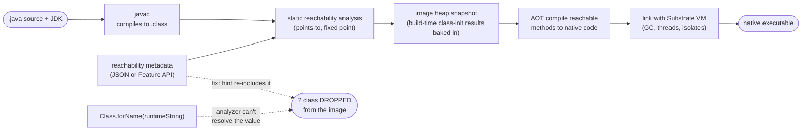
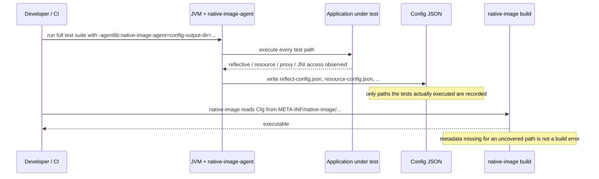

# GraalVM Native Image & AOT Compilation

## 1. Concept Overview

`native-image` is a GraalVM tool that ahead-of-time (AOT) compiles a Java application — your classes plus every JDK class it transitively touches — into a single, standalone, platform-native executable. There is no JVM inside it: no bytecode interpreter, no classloader that can pull in a class it hasn't seen before, no JIT that compiles hot methods as they warm up. Instead, the executable links against **Substrate VM**, a minimal runtime substrate that GraalVM builds and bakes into the binary — it provides its own garbage collector, its own thread management (mapped directly onto OS threads), its own exception handling and signal handling, all without a HotSpot JVM underneath.

The defining constraint is the **closed-world assumption**: everything the program can ever execute must be known and reachable at build time, because there is no later opportunity to load a class the build didn't already decide to include. `native-image` enforces this with a whole-program **static reachability analysis** (a points-to analysis) that starts from the program's entry points and computes, as a fixed point, every class, method, and field the program can possibly reach — anything outside that computed set is deleted from the executable. This is what makes the binary small and the startup instantaneous: there is no classpath scan, no annotation reflection, no bean-graph construction happening at run time, because none of that dynamic machinery survives into a closed world unless it is explicitly declared.

That last clause is the entire practical difficulty of this module. Reflection, dynamic proxies, JNI, classpath resource loading, and Java serialization are all *dynamic* — they name a class, method, or resource by a string or an interface set that is only known at run time, so the static analysis cannot see through them. Left alone, the analysis simply excludes whatever it cannot prove reachable, and the excluded code vanishes silently: the build succeeds, and the program fails only when execution first reaches the un-hinted path. **Reachability metadata** (JSON configuration, or the equivalent programmatic API) is how you tell the closed world about the open behavior it cannot infer for itself.

This module is the pure-Java view of native-image: the closed-world model, the reachability-analysis mechanics, the metadata file formats, the tracing agent, class-initialization timing, and the CLI — all independent of any framework. [Spring Native & GraalVM](../../spring/spring_native_graalvm/README.md) is the layer built *on top* of these exact primitives: Spring Boot's AOT engine auto-generates most of this same metadata from `@Configuration`/`@Bean`/`@Transactional` so you rarely write it by hand in a Spring app. Here, there is no framework doing that for you — you either use the tracing agent, write the JSON, or call the low-level `Feature` API directly, which is also the API those frameworks are built on.

---

## 2. Intuition

> **One-line analogy**: The JVM is a warehouse with an always-open loading dock — reflection is a standing order that can fetch any crate from any shelf at any time, even ones nobody catalogued in advance. A native image is a shipping container packed and sealed at the dock before departure — every crate on board was inventoried before the doors closed, and the crew at sea cannot radio the warehouse for a crate that was never loaded.

**Mental model**: picture the reachability analysis as flood-fill starting from `main()` (and any other declared entry points — JNI-registered methods, `Feature`-registered classes). It follows every direct call, every field type, every `new`, every array element type, adding each newly-discovered method and class to the reachable set, and repeats until nothing new is found — a fixed point. Whatever never lit up in that flood-fill is deleted from the image before the compiler ever runs on it. `Class.forName(aVariable)` is a wall the flood-fill cannot see through: the analysis knows the call happens, but not which class the *value* of `aVariable` will be at run time, so nothing on the other side of that wall lights up unless a hint manually turns the light on.

**Why it matters**: a native image that builds cleanly and passes every test can still throw `ClassNotFoundException` on a production request the test suite never exercised, because "the build didn't error" and "every dynamically-reached class is present" are two entirely different claims. This single fact governs how you must develop for native image — full-coverage testing under the tracing agent, and native tests in CI — not a footnote.

**Key insight**: native-image does not make your code run *faster* — it makes your *process start* nearly free by moving classloading, verification, static initialization, and code generation from every single run to one offline build. The price is symmetric: none of that build-time work can happen again at run time, so there is no adaptive re-optimization based on live profiling, which is exactly what a JIT does after warmup (see [JVM Internals](../jvm_internals/README.md) for the C1/C2 tiering this module gives up). Startup and memory improve by roughly an order of magnitude; peak throughput typically does not.

---

## 3. Core Principles

- **Closed-world assumption**: everything reachable must be known at build time; nothing can be added once the executable is sealed.
- **Static reachability (points-to) analysis**: a whole-program, fixed-point flood-fill from the entry points decides what survives into the image; everything else is deleted, not merely skipped.
- **Reachability metadata is the escape hatch**: reflection, dynamic proxies, JNI, resources, and serialization all need explicit hints (JSON or the `Feature` API) or the code they reach is silently excluded.
- **Substrate VM replaces the JVM, not just the JIT**: its own GC, its own thread model, its own exception/signal handling — there is no HotSpot underneath at all.
- **Build-time vs. run-time class initialization is a deliberate choice**: a static initializer can run once on the build machine (baked into the image heap) or once per process at startup — picking wrong is a correctness bug, not just a performance one.
- **No runtime JIT**: there is no profiling recompiler, so peak throughput is typically lower than a warmed-up JVM; Profile-Guided Optimization (PGO) is the AOT substitute, feeding a *recorded* profile back into the build instead of a live one.
- **Fail at build/test time, never on a live request**: the entire discipline (tracing agent under full test coverage, native tests in CI) exists to convert "missing metadata" from a production incident into a build failure.

---

## 4. Types / Architectures / Strategies

### 4.1 Where reachability metadata comes from

| Source | Discovers | Effort | Precision |
|--------|-----------|--------|-----------|
| **Tracing agent** (`native-image-agent`) | Reflection/resource/proxy/JNI/serialization access during a real JVM run | Run your app/tests with `-agentlib:...` | Only as good as your test coverage |
| **GraalVM Reachability Metadata Repository** | Pre-written hints for hundreds of popular third-party libraries | Automatic once enabled in the build plugin | High (community/vendor maintained) |
| **Hand-authored JSON** (`reflect-config.json` etc., or unified `reachability-metadata.json`) | Whatever you already know your code needs | Manual | Exact, but easy to let drift from the code |
| **`Feature` API** (`org.graalvm.nativeimage.hosted.Feature`) | Anything you can express in build-time Java code | Manual, code-level | Exact, versioned with the code it registers |

### 4.2 Garbage collector choices (`--gc=`)

| Flag | Collector | Characteristics | Availability |
|------|-----------|------------------|---------------|
| `--gc=serial` (default) | Serial GC | Single-threaded, minimal footprint, tuned for small heaps | All distributions |
| `--gc=G1` | G1 GC | Generational, incremental, parallel, mostly-concurrent — for latency/throughput on larger heaps | Oracle GraalVM only, Linux x86-64/AArch64 only |
| `--gc=epsilon` | Epsilon GC | No-op — allocates but never collects | All distributions; short-lived batch/CLI processes only |

### 4.3 GraalVM distributions — the choice that gates which flags even work

| Distribution | Based on | License | PGO | G1 GC | Typical user |
|--------------|----------|---------|-----|-------|--------------|
| **Oracle GraalVM** | Oracle JDK | Free for production under the GraalVM Free Terms and Conditions (GFTC, since the 2023 licensing change) | Yes (`--pgo`) | Yes (Linux only) | Teams that want every optimization lever |
| **GraalVM Community Edition** | OpenJDK | GPL (open source) | No | No | Default open-source choice; most tutorials |
| **Mandrel** | Downstream of Community Edition | GPL | No | No | Quarkus's native builds specifically |

### 4.4 Build modes

| Mode | Flag(s) | Build time | Result | Use for |
|------|---------|-----------|--------|---------|
| Standard optimizing build | *(default)* | Minutes | Fully optimized executable | The artifact you ship |
| Quick build mode | `-Ob` | A fraction of the default | Less-optimized, faster-to-produce executable | Local dev loop, CI smoke builds |
| PGO instrument + optimize | `--pgo-instrument` then `--pgo=<profile>.iprof` | Two builds, plus a profiling run in between | Smaller (~15% in Oracle's own measurements), better hot/cold code separation | Final tuning pass once native is already the right choice |

### 4.5 Deployment shapes that motivate native image

- **CLI tools** distributed to many machines (developer laptops, CI runners) where JVM startup is pure overhead paid on every invocation.
- **Kubernetes Jobs/CronJobs** and **Knative/scale-to-zero services** where the process is not kept warm between invocations.
- **AWS Lambda custom runtimes** where cold start is billed and directly on the request's critical path.
- **Edge/IoT and sidecars** with hard memory ceilings that a multi-hundred-MB JVM RSS cannot fit inside.
- **Security-sensitive contexts** that want a smaller attack surface — no classpath scanning, no arbitrary class loading, fewer classes present at all.

---

## 5. Architecture Diagrams

### Where the clock spends its time: JVM vs. native image

```
JVM: this work repeats on EVERY process launch, on the target machine
  0ms        120ms            300ms                                  2000ms+
  |--load---|--verify+link---|--run <clinit>--|--interpret---|--JIT warms up...->
                                                                ^ C2 peak reached
                                                                  only after ~15K
                                                                  calls to a method

native-image: this work happens ONCE, offline, before anyone runs the binary
  BUILD MACHINE (minutes, once per release)
  |--points-to analysis (closed world)--|--bake image heap--|--emit native code--|

  TARGET MACHINE, every process launch (all that is left to do)
  0ms      15ms
  |--Substrate VM + isolate init--|--main() runs, flat throughput from t=0------->
                                    ^ no JIT tiers: no warm-up climb, no C2 peak
```

The JVM re-does classloading, verification, static initialization, and interpretation on every single process start, and only reaches peak (C2-compiled) throughput after enough invocations warm it up. Native image moved almost all of that into a single offline build step; every process launch after that pays only isolate startup — fast and *flat* from the first instruction, because there is no tier to warm into.

### The four+ kinds of dynamic access that need a hint

```
dynamic access pattern               metadata kind    what the hint declares
------------------------------------ ---------------- ----------------------------
Class.forName(name)                  reflection       the type + which members
obj.getClass().getDeclaredMethod()   reflection        are reflectively usable
new java.lang.reflect.Proxy(...)     dynamic proxy    the interface set to proxy
getResourceAsStream("x.regex")       resource         a literal name or a pattern
ObjectOutputStream.writeObject()     serialization    the serializable type
JNI FindClass / GetMethodID          JNI              same shape as reflection
```

Each row is a call the static analysis can see being *made* but cannot resolve to a concrete *target* without running the program — the target is a runtime string, an interface array built from configuration, or a native call across the JNI boundary. Reachability metadata exists precisely to answer, for each row, "which types/members/resources does this call actually touch in production."

### Native-image build pipeline



Everything to the left of `analysis` is ordinary compilation; everything from `analysis` onward happens once, on the build machine, and is exactly what a running JVM would otherwise do at every process start. The dashed branch is the recurring failure mode: a call the analysis cannot resolve drops its target unless a hint (from the agent, the repository, hand-written JSON, or the `Feature` API) puts it back.

### Discovering hints with the tracing agent



The agent is an observer, not an analyzer: it cannot invent metadata for a branch your test suite never runs, which is why "run the agent once" is not the same claim as "the metadata is complete."

---

## 6. How It Works — Detailed Mechanics

### 6.1 The `native-image` CLI, directly

No framework required — `native-image` compiles from plain `.class` files or a jar:

```bash
javac -d out $(find src -name '*.java')

# From a classes directory, naming the entry point:
native-image -cp out -H:Class=com.example.logredact.Main -o logredact

# From an executable jar (Main-Class in the manifest):
native-image -jar logredact.jar -o logredact

# A handful of the flags that matter day to day:
native-image -jar logredact.jar -o logredact \
  --gc=serial \
  --initialize-at-run-time=com.example.logredact.CorrelationIds \
  -H:+ReportExceptionStackTraces \
  -Ob                      # quick build mode for local iteration only
```

Both forms produce a single native executable with no external JVM dependency — `./logredact` runs directly as an OS process.

### 6.2 Static reachability (points-to) analysis, step by step

The analysis is a fixed-point loop, conceptually:

```
worklist = { main(), every @Feature-registered root }
reachable = {}

while worklist is not empty:
    element = worklist.remove()
    if element in reachable: continue
    reachable.add(element)
    for each direct call, field access, allocation, or array type
        made by element's bytecode:
            add the target to worklist

# when the loop reaches a fixed point (worklist empty):
image_contents = reachable      # everything else is deleted, not just excluded
```

This is why native-image binaries are small relative to "the whole JDK plus your jar": a typical application uses a sliver of `java.util`/`java.time`/etc., and only that sliver — plus whatever your hints add back — ships. It is also why the analysis is expensive: it must re-derive this fixed point across the *entire* reachable program, including every library on the classpath, which is the direct cause of native-image's multi-minute, multi-gigabyte-RAM builds on anything non-trivial.

### 6.3 Reachability metadata — the file formats

Historically GraalVM emitted one JSON file per concern under `META-INF/native-image/<group>/<artifact>/`. These are still accepted and are the clearest way to see the shape of the data:

```json
// reflect-config.json — reflection: type + which members are reachable
[
  { "name": "com.example.logredact.plugin.RegexRedactor",
    "allDeclaredConstructors": true,
    "allDeclaredMethods": true,
    "allDeclaredFields": true }
]
```

```json
// resource-config.json — classpath resources read at run time
{
  "resources": {
    "includes": [
      { "pattern": "patterns/.*\\.regex$" }
    ]
  },
  "bundles": []
}
```

```json
// proxy-config.json — one entry per JDK dynamic proxy interface set
[
  { "interfaces": ["com.example.logredact.plugin.RedactorPlugin", "java.io.Closeable"] }
]
```

```json
// serialization-config.json — types (de)serialized via java.io.Serializable
{ "types": [ { "name": "com.example.logredact.config.RedactionRule" } ] }
```

`jni-config.json` uses the same shape as `reflect-config.json`, because JNI's `FindClass`/`GetMethodID`/`GetFieldID` need exactly the same class/member metadata reflection does — a JNI call is a reflective call across a language boundary.

**Since GraalVM for JDK 23** (September 2024), these five files are consolidated by default into a single `reachability-metadata.json`; the per-concern files above are deprecated but still read, so both forms remain worth recognizing. The unified file merges the same underlying concepts (reflection, resources, JNI, serialization, proxies) into one document — treat the exact key layout as generated, version-specific output, and always regenerate it with the agent for the GraalVM version you actually build with rather than hand-copying an example between versions.

### 6.4 The tracing agent, and merging multiple runs

```bash
# Run your REAL test suite (or the app itself) on the JVM, with the agent attached:
java -agentlib:native-image-agent=config-output-dir=src/main/resources/META-INF/native-image \
     -jar logredact-tests.jar

# Merge config captured from several separate runs (unit tests + an integration run):
native-image-configure generate \
  --trace-input=run1/trace-file.json \
  --trace-input=run2/trace-file.json \
  --output-dir=src/main/resources/META-INF/native-image
```

The caveat is structural, not incidental: the agent can only record a call it *watched happen*. A plugin type that no test ever instantiates leaves no trace, and no trace means no metadata — the build will still succeed, because absence of metadata is not a build-time error.

### 6.5 Programmatic hints — the `Feature` API

Frameworks like Spring do not have special access to the closed world — they call the same public API you can call directly:

```java
import org.graalvm.nativeimage.hosted.Feature;
import org.graalvm.nativeimage.hosted.RuntimeReflection;

public final class RedactorPluginFeature implements Feature {

    private static final String[] REDACTOR_TYPES = {
        "com.example.logredact.plugin.AwsKeyRedactor",
        "com.example.logredact.plugin.JdbcUrlRedactor",
        "com.example.logredact.plugin.SlackTokenRedactor"
    };

    @Override
    public void beforeAnalysis(BeforeAnalysisAccess access) {
        for (String name : REDACTOR_TYPES) {
            try {
                Class<?> type = Class.forName(name);
                RuntimeReflection.register(type);
                RuntimeReflection.registerAllDeclaredConstructors(type);
            } catch (ClassNotFoundException e) {
                throw new ExceptionInInitializerError(e);
            }
        }
    }
}
```

```bash
# Activate it explicitly (or via a native-image.properties Args= entry):
native-image --features=com.example.logredact.RedactorPluginFeature -jar logredact.jar
```

`beforeAnalysis` runs *during* the build, as ordinary Java — it can read files, walk a classpath, or (as here) just enumerate a fixed list, and every `RuntimeReflection.register(...)` call adds that element to the reachable set before the fixed-point loop runs. This is exactly the mechanism [Spring's `RuntimeHintsRegistrar`](../../spring/spring_native_graalvm/README.md) and its AOT-generated bean definitions compile down to — Spring's contribution is generating these registrations automatically from `@Configuration`/`@Bean`, not inventing a different underlying mechanism. [Annotation Processing](../annotation_processing/README.md) is the sibling approach for the same underlying problem: generate ordinary, statically-analyzable Java at *compile* time so there is no reflective call left for `native-image` to worry about at all.

### 6.6 Build-time vs. runtime class initialization

By default, `native-image` initializes **application classes at run time** — a policy GraalVM deliberately flipped (in version 19) specifically to turn class initialization into a performance question instead of a correctness trap — except for the subset its analysis can *prove* safe to also run at build time (safe supertypes, no calls into anything unsafe). Most **JDK and GraalVM SDK classes** (the garbage collector, the deoptimizer, core `java.lang` machinery) *are* initialized at build time by default, because they are engineered to be build-time-safe. You override either direction explicitly:

```bash
native-image --initialize-at-build-time=com.example.logredact.StaticLookupTables ...
native-image --initialize-at-run-time=com.example.logredact.CorrelationIds ...
```

**BROKEN** — a "unique" id generator that is fine on the JVM (one process, one run) becomes disastrous once its build-time result is shared by every replica cut from the same image:

```java
public final class CorrelationIds {
    // Runs ONCE, on the BUILD MACHINE, under the default build-time-safe
    // initialization the analysis grants this class -- not once per process.
    private static final String INSTANCE_SALT =
        Long.toHexString(new SecureRandom().nextLong());

    public static String next() {
        return INSTANCE_SALT + "-" + System.nanoTime();
    }
}
// Every pod built from this image prints the SAME salt: native-image ran the
// static initializer once and baked the resulting String into the image heap.
```

**FIXED** — force this one class to (re)run its static initializer at every process start instead of once at build time; no source change needed, only a build flag:

```bash
native-image --initialize-at-run-time=com.example.logredact.CorrelationIds -jar logredact.jar
```

### 6.7 BROKEN → FIX: a reflection failure that only exists in the native build

```java
public final class PluginLoader {
    public static RedactorPlugin load(String className) {
        try {
            Class<?> type = Class.forName(className);                  // dynamic!
            return (RedactorPlugin) type.getDeclaredConstructor().newInstance();
        } catch (ReflectiveOperationException e) {
            throw new IllegalStateException("cannot load redactor: " + className, e);
        }
    }
}
```

```
# redactors.conf, read at RUN time from a config file, not compiled in:
com.example.logredact.plugin.AwsKeyRedactor
com.example.logredact.plugin.JdbcUrlRedactor
com.example.logredact.plugin.SlackTokenRedactor      <- added last sprint

# On the JVM: works for all three, every time, because Class.forName just
# asks the classloader for whatever string it's given at that moment.
#
# As a native image, only AwsKeyRedactor and JdbcUrlRedactor happened to also
# be constructed directly inside a unit test, so the analysis found them by
# accident. SlackTokenRedactor was never referenced except through this one
# dynamic call, so it was never in the reachable set and never shipped:
#
#   Exception in thread "main" java.lang.ClassNotFoundException:
#     com.example.logredact.plugin.SlackTokenRedactor
#     at com.example.logredact.PluginLoader.load(PluginLoader.java:5)
```

**FIX** — regenerate metadata by running the *full* plugin matrix under the tracing agent, then register the same three types programmatically so a future fourth plugin cannot again depend solely on a test happening to cover it:

```json
[
  { "name": "com.example.logredact.plugin.AwsKeyRedactor", "allDeclaredConstructors": true },
  { "name": "com.example.logredact.plugin.JdbcUrlRedactor", "allDeclaredConstructors": true },
  { "name": "com.example.logredact.plugin.SlackTokenRedactor", "allDeclaredConstructors": true }
]
```

The `RedactorPluginFeature` shown in §6.5 registers the same three classes from code, so the metadata lives next to (and is refactored along with) the plugin list itself, instead of only inside a generated JSON file nobody remembers to update.

### 6.8 Performance levers: PGO, quick build mode, and GC choice

```bash
# Profile-Guided Optimization -- Oracle GraalVM only, two builds:
native-image --pgo-instrument -jar logredact.jar -o logredact-instrumented
./logredact-instrumented --representative-workload ...     # writes default.iprof
native-image --pgo=default.iprof -jar logredact.jar -o logredact   # final, optimized build

# Quick build mode -- much faster local builds, never ship this artifact:
native-image -Ob -jar logredact.jar -o logredact-dev

# GC choice at build time (see also §4.2):
native-image --gc=G1 -jar logredact.jar -o logredact         # Oracle GraalVM, Linux only
```

PGO feeds a *recorded* execution profile back into the AOT compiler — the closest native-image gets to what a JIT normally learns by watching the live program — biasing inlining and code layout toward the hot paths the profile identified. Oracle's own measurements report roughly 15% smaller binaries from PGO builds and better separation of hot and cold code; it is an optimization you reach for once native is already the right choice and peak throughput still matters, not a first step.

---

## 7. Real-World Examples

- **picocli** ships a `picocli-codegen` annotation processor that generates the exact `reflect-config.json` a CLI needs from its own `@Command`/`@Option` annotations — a widely used pure-Java example of §6.3's metadata built automatically at compile time.
- **Quarkus** (Red Hat) is built native-first and compiles via **Mandrel**, its purpose-built downstream of GraalVM Community Edition; it is the reference case for sub-50ms REST-service native startup.
- **Micronaut** (Oracle-backed) resolves dependency injection and AOP at compile time specifically to minimize the reflective surface that would otherwise need reachability metadata.
- **Helidon SE** (Oracle) is a lightweight framework designed for native-image compatibility from its first release, without an AOT-translation layer bolted on afterward.
- **AWS Lambda custom runtimes** package Java functions as native executables to remove cold start from the request's critical path — the same technique [Spring's native module](../../spring/spring_native_graalvm/README.md) applies inside a Spring Boot function, but usable with a plain `Main` class and no framework at all.
- **The GraalVM Reachability Metadata Repository** (`oracle/graalvm-reachability-metadata` on GitHub) is a community/vendor-maintained catalogue of hints for hundreds of popular libraries (Netty, Jackson, Hibernate, gRPC), pulled in automatically by the Native Build Tools Maven/Gradle plugin so most third-party dependencies need zero hand-written metadata.

---

## 8. Tradeoffs

| Dimension | JVM (JIT) | Native image (AOT) |
|-----------|-----------|---------------------|
| Startup | Hundreds of ms to seconds (classload + verify + link + `<clinit>` every run) | Single-digit to a few tens of ms |
| Memory (RSS) | Tens to hundreds of MB (JVM + Metaspace + loaded classes) | A fraction of that — often 3-5x smaller |
| Peak throughput | Higher — a warmed C2 tier optimizes from live profiles | Typically 70-90% of a warmed JVM's peak, workload-dependent; PGO narrows but does not close the gap |
| Build time | Seconds (`javac`) | Minutes, and multiple GB of RAM for the points-to analysis |
| Dynamic behavior | Reflection/proxies/dynamic classloading just work | Closed-world — needs explicit reachability metadata |
| Runtime bytecode generation (CGLIB, raw ASM, agents) | Fully supported | Not supported at all — no JIT, no runtime classloader to hand new bytecode to |
| Observability | Mature: JFR, async-profiler, full `jstack`/`jmap` tooling | Improving but narrower — a subset of JFR events via `--enable-monitoring` |

| Concern | Oracle GraalVM | GraalVM Community Edition | Mandrel |
|---------|----------------|----------------------------|---------|
| Base JDK | Oracle JDK | OpenJDK | OpenJDK (via Community Edition) |
| License | Free for production (GFTC) | GPL | GPL |
| PGO | Yes | No | No |
| G1 GC option | Yes (Linux only) | No | No |
| Typical user | Teams wanting every optimization lever | Default open-source choice | Quarkus specifically |

---

## 9. When to Use / When NOT to Use

**Use native image when**: you ship a CLI tool to many machines and JVM startup is pure tax on every invocation; you run Kubernetes Jobs/CronJobs or Knative scale-to-zero services that are not kept warm; you deploy to AWS Lambda and cold start is billed and user-visible; you operate under a hard memory ceiling (edge, IoT, high-density bin-packed containers); or you want a smaller attack surface (no classpath scanning, no arbitrary class loading at run time).

**Avoid native image when**: you run a long-lived, throughput-heavy service where a warmed JIT's peak performance is the metric that matters most; your codebase depends on unbounded runtime reflection, dynamic classloading, or bytecode-generating agents (CGLIB, raw ASM codegen, classic Mockito) that are impractical to hint away; you build a genuine plugin system that loads arbitrary *untrusted* third-party jars at run time — the closed world fundamentally cannot support classes it has never seen; your CI cannot absorb multi-minute, multi-GB-RAM native builds on every change; or your team depends on mature JVM-level profiling and debugging tooling that native's ecosystem does not yet fully match.

**Rule of thumb**: native image optimizes the *first millisecond* of a process's life; the JVM optimizes the *millionth request*. Decide which one your bill (or your SLA) is actually paying for before reaching for either.

---

## 10. Common Pitfalls

### War Story 1: A `ClassNotFoundException` that only ever hit 0.4% of production traffic
A native CLI passed every unit and integration test, then threw `ClassNotFoundException` in production the first time a rarely-used plugin path executed — six hours after deployment, on the code path that exercised it. The tracing-agent run had never touched that plugin because no test instantiated it directly, only through the dynamic loader. **Fix**: extend the test suite to exercise every plugin explicitly and add a native test asserting each one loads; treat "the build succeeded" and "every reflective path is covered" as two separate claims, always.

### War Story 2: Every replica emitting the same "unique" correlation-id salt for three weeks
A `SecureRandom`-derived salt was computed in a static initializer, intending one random value per process. Because the class qualified for native-image's default build-time initialization, the value was computed once — on the build machine — and baked into the image heap; every one of ~40 replicas cut from that image shared the identical salt. It was caught only when a log-anomaly detector flagged correlation ids colliding across unrelated requests. **Fix**: `--initialize-at-run-time` for any class whose static state depends on the environment, the clock, or a random source.

### War Story 3: CI builds failing intermittently with out-of-memory during analysis
A native build ran fine on a developer's 32GB laptop but failed roughly one build in three on a CI runner capped at 4GB, with the points-to analysis simply running out of heap partway through. The analysis's memory use scales with the size of the *entire reachable program graph*, including every transitive dependency, not with the size of your own code. **Fix**: raise the CI runner's memory (this build stabilized at `-J-Xmx6g`) and give native builds their own dedicated CI stage rather than sharing a pool sized for `javac`.

### War Story 4: An entire test module unusable under `nativeTest`
A test suite relied on the classic Mockito mock-maker, which generates mock subclasses via Byte Buddy at run time. Under native-image's `nativeTest`, this failed outright — there is no runtime bytecode generation at all, so no mock classes could be manufactured after the build. **Fix**: migrate the affected tests to interface-based hand-written fakes; runtime class generation is not a "needs a hint" problem, it is a "cannot exist in a closed world" problem, and no amount of reachability metadata fixes it.

### War Story 5: `UnsatisfiedLinkError` only inside the production container image
A native executable that called into a native library via JNI worked on every developer machine (the shared library was globally installed) and then threw `UnsatisfiedLinkError` immediately in the minimal distroless production container, where it was not. Reachability metadata makes the JNI *call site* work; it does nothing to ensure the actual `.so`/`.dll` file ships alongside the executable. **Fix**: copy the native library into the container image explicitly and set `LD_LIBRARY_PATH` (or an equivalent), and test the native binary inside the *actual* deployment image, not just on a developer machine that happens to have the library installed globally.

---

## 11. Technologies & Tools

| Tool | Purpose |
|------|---------|
| `native-image` | The AOT compiler itself — turns classes/jars into a native executable |
| Native Build Tools (`org.graalvm.buildtools:native-maven-plugin` / Gradle plugin) | Maven/Gradle integration; binds `native-image` to a build profile, drives `nativeTest` |
| `native-image-agent` | The tracing agent — records reflection/resource/proxy/JNI access from a real JVM run |
| `native-image-configure` | Merges and generates config from multiple agent trace files |
| GraalVM Reachability Metadata Repository | Community/vendor-maintained hints for popular third-party libraries |
| `Feature` / `RuntimeReflection` (`org.graalvm.nativeimage.hosted`) | Programmatic, build-time API for registering reachability metadata |
| Native Image Build Output report | The summary table `native-image` prints at the end of every build (class/method/field counts, image heap breakdown) |
| `nativeTest` (Native Build Tools JUnit support) | Compiles and runs your JUnit suite as an actual native image |
| `--enable-monitoring=jfr,heapdump` | Limited but real observability inside a native executable |
| Mandrel | Quarkus's purpose-built GraalVM downstream distribution |
| `jdeps` | Pre-migration audit of reflective/dynamic dependency use |

---

## 12. Interview Questions with Answers

**Why does a native image sometimes crash at runtime with a `ClassNotFoundException` even though the build succeeded and every unit test passed?**
A clean native-image build proves nothing about reflective code paths your tests never actually executed. Missing reachability metadata is not a build-time error — the analysis simply omits whatever it cannot prove reachable, so the failure surfaces only when execution first reaches that specific un-hinted call, which can be days after deployment on a rarely-used path. Treat a native build as unverified until a tracing-agent run under full test coverage, or an explicit native test, has actually exercised every reflective/dynamic path.

**What is the closed-world assumption and why can't GraalVM native-image just "support reflection" the way the JVM does?**
The closed-world assumption means everything the program can ever execute must be known and reachable at build time, with nothing addable afterward. The JVM's classloader can fetch and link any class at any moment because it stays open for the life of the process; native-image deletes everything outside its computed reachable set before the executable is even produced, so a reflective call whose target is only known at run time (a config string, a dynamic interface set) has nothing to resolve against unless a hint puts that target back into the reachable set. This is a deliberate tradeoff, not a limitation someone forgot to fix — the deletion is exactly what makes the binary small and the startup fast.

**What actually differs between GraalVM Community Edition, Oracle GraalVM, and Mandrel, and why does the difference matter for a native-image build?**
They are three distributions of the same underlying native-image technology with different licenses and feature sets, not three different tools. GraalVM Community Edition (OpenJDK-based, GPL) and Mandrel (Red Hat's downstream of Community Edition, built specifically for Quarkus) both lack Profile-Guided Optimization and the G1 GC option; Oracle GraalVM (Oracle-JDK-based, free for production since the 2023 licensing change) adds both. A `--pgo` or `--gc=G1` flag that works on your machine and errors "not supported" on a teammate's is almost always this exact distribution mismatch.

**Why might every instance of a native image end up sharing an identical "random" seed, timestamp, or generated key that was supposed to be unique per process?**
A static initializer that captured environment- or time-dependent state ran once, on the build machine, and its result was frozen into the image heap for every copy of that image. Native-image's default class-initialization policy runs many classes at build time for performance, which is safe for pure, deterministic state but silently wrong for anything meant to vary per process or per deployment. The fix is `--initialize-at-run-time` for that specific class, which defers its static initializer to actual process start with no source change required.

**Why can't a native image use CGLIB, raw ASM class generation, or the classic Mockito mock-maker the way a JVM application can?**
Native image has no runtime bytecode generation at all, so any library that manufactures new classes while the program runs simply has nothing to run on after the build completes. There is no JIT and no live classloader willing to accept freshly generated bytecode — every class that will ever exist in the process was decided during the build. The practical fix is to replace such libraries with interface-based fakes or compile-time-generated equivalents before attempting a native build, not to hunt for a hint that does not exist for this case.

**Why is a native image's peak throughput usually lower than a long-running JVM's, even after applying PGO?**
There is no runtime JIT to keep re-optimizing the program based on the traffic it is actually seeing right now. A warmed HotSpot JVM continuously profiles and recompiles hot methods with speculative, traffic-specific optimizations (see [JVM Internals](../jvm_internals/README.md)); native-image compiles once, ahead of time, with at best a *recorded* profile from an earlier PGO run, so it typically lands around 70-90% of a warmed JVM's peak throughput. PGO narrows that gap by biasing the AOT compiler toward previously-hot code, but it is feeding the compiler yesterday's traffic pattern, not today's.

**What is a common way JNI interacts badly with a native image in production, and why does reachability metadata not fix it?**
A native executable can throw `UnsatisfiedLinkError` even when its JNI call sites are fully and correctly hinted. The actual native shared library (`.so`/`.dll`) still has to ship alongside the executable — reachability metadata (the `jni-config.json` shape) only tells the analysis which Java-side classes/methods a JNI call touches, and says nothing about the operating-system-level library file the call ultimately jumps into. The fix is packaging and environment work — copy the library into the image and set the library search path — not more JSON.

**Why do native-image builds need so much memory and take so long compared to `javac`?**
The static reachability (points-to) analysis is a whole-program fixed-point computation over every class the application can reach, including every transitive dependency, not just your own code. Unlike `javac`, which compiles one file at a time against already-compiled dependencies, `native-image` must analyze the entire reachable graph simultaneously before it can decide what to compile at all, which is why builds commonly need several gigabytes of RAM and multiple minutes even for moderately sized applications. Give native builds their own CI stage with generous memory rather than assuming `javac`-sized resources will do.

**What actually happens during GraalVM's static reachability (points-to) analysis?**
It computes, as a fixed point, every class, method, and field the program can possibly touch, starting from the declared entry points. The analysis maintains a worklist seeded with `main()` and any `Feature`-registered roots, and for each element it processes, it adds every class, method, and field that element's bytecode could call, allocate, or reference, repeating until no new element is discovered. Whatever never enters that reachable set by the time the loop terminates is deleted from the final image, not merely left uncompiled.

**What are the different kinds of reachability metadata and what does each one unlock?**
Reachability metadata comes in five shapes: reflection, resource, proxy, serialization, and JNI hints. Reflection hints declare which types/constructors/methods/fields are reflectively usable; resource hints declare which classpath resources can be loaded by name or pattern; proxy hints declare which interface sets can back a JDK dynamic proxy; serialization hints declare which types can go through `ObjectOutputStream`; and JNI hints use the same shape as reflection, for native-code call sites. Each addresses a different kind of call the static analysis cannot resolve on its own, and a real application typically needs some mix of all five once it depends on more than a handful of libraries.

**What is the unified `reachability-metadata.json` and how does it relate to the older `reflect-config.json`/`resource-config.json`/`proxy-config.json` files?**
Since GraalVM for JDK 23 (September 2024), the five separate per-concern configuration files are consolidated by default into one `reachability-metadata.json`. It merges the same underlying reflection/resource/JNI/serialization/proxy concepts into a single document; the older per-file format is deprecated but still read by the build, so both forms show up in real codebases and documentation. Always regenerate whichever format your GraalVM version emits with the tracing agent rather than hand-copying an example between versions, since the exact layout is generated output, not a hand-authored contract.

**What is the GraalVM tracing agent and what is its most important limitation?**
It is a JVM agent (`native-image-agent`) that observes a normal JVM run and writes out the reflection/resource/proxy/JNI/serialization metadata it saw actually used. Its defining limitation is that it can only record what it *watches happen* — a reflective call your test suite never exercises leaves no trace and therefore produces no metadata, even though the code is real and will run in production. Treat its output as a starting point contingent on your test coverage, never as a completeness guarantee.

**What is the `Feature` API and how does it relate to what a framework like Spring Boot's AOT engine does automatically?**
The `Feature` API is the low-level, build-time Java API for registering reachability metadata programmatically instead of hand-writing JSON. It is `org.graalvm.nativeimage.hosted.Feature`, with lifecycle hooks like `beforeAnalysis`, most commonly calling `RuntimeReflection.register(...)`. Frameworks such as Spring Boot's AOT engine do not have privileged access to the closed world — they generate calls into this exact same public API (or the equivalent JSON) automatically from your `@Configuration`/`@Bean` annotations, so you rarely write `Feature` classes by hand in a Spring application. In plain Java, without that generation layer, this is the mechanism you reach for directly whenever a hand-written JSON file would otherwise drift out of sync with the code it describes.

**What is Substrate VM and what does it provide that a plain compiled executable would not have?**
Substrate VM is the minimal runtime substrate that GraalVM links into every native image in place of a JVM. It supplies its own garbage collector, its own thread management mapped directly onto OS threads, and its own exception and signal handling — without it, a native executable would just be raw machine code with no memory-management or concurrency runtime underneath. Substrate VM is what lets ordinary Java code (`new`, garbage-generating loops, multiple `Thread`s) keep working correctly with no HotSpot JVM present at all, which is why "no JVM" does not mean "no runtime" — it means a much smaller, purpose-built one.

**What is an "isolate" in Substrate VM terms?**
An isolate is an independent Java heap and runtime state that Substrate VM can run inside a single OS process. Each isolate gets its own garbage collector instance and object graph, fully isolated from any other isolate sharing that process — multiple isolates let one native process host several independent Java "heaps" concurrently, used for example when native-image code is embedded as a library called from C/C++ and needs per-caller isolation without spinning up separate OS processes. Most CLI and service use cases never need more than the single default isolate created at startup, but the concept is why native-image can be embedded as a shared library at all.

**What garbage collectors can a native image use and how do you pick one?**
Native image offers three garbage collectors selected at build time with `--gc=`: `serial`, `G1`, and `epsilon`. `serial` (the default) is single-threaded with a minimal footprint, right for CLI tools and most modest-heap services; `G1` adds generational, mostly-concurrent collection for latency and throughput on larger heaps, but only on Oracle GraalVM and only on Linux x86-64/AArch64; `epsilon` is a no-op collector that never reclaims memory, correct only for short-lived batch/CLI processes that exit before collection would ever matter. Pick `serial` by default, reach for `G1` only once you have a long-lived service with a heap large enough for its overhead to pay off, and reserve `epsilon` for genuinely short-lived jobs.

**What is the difference between build-time and runtime class initialization, and what is the default?**
Build-time initialization runs a class's static initializer once during the build and bakes the result into the image heap; runtime initialization defers it to run once per process at startup. Since GraalVM 19, the default for **application classes** is runtime initialization unless the analysis proves a class safe for build time, while most **JDK/GraalVM SDK classes** default to build-time initialization because they are engineered to be safe there; you override either direction explicitly with `--initialize-at-build-time=<class>` or `--initialize-at-run-time=<class>`. Get this wrong for a class that captures a clock reading, a random seed, or an environment variable, and every replica cut from the same image silently shares one build-time value.

**What is Profile-Guided Optimization (PGO) for native image, and who can actually use it?**
PGO is a two-step build that feeds a recorded execution profile back into the AOT compiler, the closest native-image equivalent of what a JIT normally learns by watching a live program. You first build with `--pgo-instrument`, run the instrumented binary against representative traffic to produce a `.iprof` profile file, then rebuild with `--pgo=<file>.iprof` so the compiler can bias inlining and code layout toward the hot paths identified. It is available only on Oracle GraalVM, not on GraalVM Community Edition or Mandrel, and Oracle's own measurements report roughly 15% smaller binaries plus better hot/cold code separation from using it.

**What is "quick build mode" (`-Ob`) and when should you use it?**
`-Ob` skips many of the expensive optimization passes a standard build performs, trading a less-optimized binary for a much faster one. It's meant for the inner edit-build-test loop, where waiting minutes per change — not binary quality — is the actual bottleneck. It should never be the artifact you ship: run the full optimizing build (with PGO if peak throughput matters) for anything that leaves CI, since `-Ob`'s speed comes directly from doing less optimization work, not from a smarter build.

**When would you choose native image over the JIT JVM, and when would you deliberately stay on the JVM?**
Choose native image when startup latency or memory footprint dominates your cost or SLA — CLI tools, Kubernetes Jobs, scale-to-zero services, Lambda, edge/IoT. That choice pays off only when your code's dynamic surface (reflection, dynamic proxies, runtime codegen) is small or fully hintable; stay on the JVM instead for long-lived, throughput-bound services where a warmed JIT's peak performance matters most, for codebases with heavy runtime reflection/dynamic classloading/bytecode generation that resist hinting, or where slow multi-minute native builds would cripple your iteration speed. The one-line test: native optimizes the first millisecond of a process's life, the JVM optimizes the millionth request — match the tool to whichever one is actually on your critical path.

---

## 13. Best Practices

1. **Decide "native or not" early** and validate continuously with `nativeTest`, not as an afterthought bolted on right before shipping.
2. **Run the tracing agent under your full test suite**, and treat any code path the suite does not exercise as unsupported until proven otherwise.
3. **Prefer the `Feature` API or committed JSON over ad hoc, undocumented agent output** for anything core to your application, so metadata is reviewed and versioned like the code it describes.
4. **Mark any environment-, clock-, or randomness-dependent static state `--initialize-at-run-time`** — this is a correctness rule, not a style preference.
5. **Add native tests to CI** so missing reachability metadata fails a build, never a production request.
6. **Use `-Ob` for local and CI-smoke iteration only**; ship the full optimizing build (with PGO where it matters) as the production artifact.
7. **Budget CI properly**: a dedicated native-build stage, several GB of RAM headroom, and build caching — a native build is not a `javac`-sized job.
8. **Check the GraalVM Reachability Metadata Repository before hand-writing hints** for any third-party dependency; prefer libraries the repository already covers.
9. **Choose the garbage collector deliberately** (`serial` default, `G1` for larger long-lived heaps on Oracle GraalVM/Linux, `epsilon` only for short batch jobs) instead of accepting the default without thinking about your workload.
10. **Avoid runtime bytecode generation libraries** (CGLIB, hand-rolled ASM codegen, classic Mockito mock-maker) in anything you intend to compile native; prefer interface-based or compile-time-generated alternatives from the start.
11. **Treat a clean build as necessary, not sufficient** — only execution (tests, the agent, or production traffic) proves reachability metadata is actually complete.
12. **Package and test the real deployment image, not a developer machine** — JNI/native-library and resource-path problems routinely only surface inside the minimal container you actually ship.

---

## 14. Case Study

### CI log-redaction CLI: from ~400ms-per-invocation JVM startup to a ~12ms native binary

**Scenario.** `logredact` is an internal CLI: every CI job across the company's pipelines pipes its build log through it before upload, so secrets (cloud keys, JDBC URLs, chat webhook tokens) never leave the build. It runs once per job, does under 50ms of actual work (scan a log file, apply pattern-based redactors, write the cleaned log), and is invoked roughly 120,000 times a month across the fleet. On the JVM, each invocation paid ~350-450ms of pure startup cost — classloading, verification, linking, running static initializers — before ever reaching the 50ms of real work, because a one-shot CLI process exits long before the JIT would ever warm up. At the fleet's invocation volume, that startup tax alone accounted for roughly 12-15 hours of pure overhead billed as CI compute every month.

**Requirements.**
- Startup well under 50ms so the tool is negligible next to the rest of a CI job.
- Must run inside minimal, JDK-free CI container images (no pre-installed JVM to rely on).
- Redaction strategies stay pluggable via a config file, not a recompile, for teams adding a new secret pattern.
- No correctness regression from build-time-frozen state (the tool assigns each run a correlation id for log correlation).

**Design.**

1. **A plain Java CLI, no framework.** `Main` parses arguments, reads `redactors.conf`, and delegates to `PluginLoader.load(className)` (§6.7) for each configured `RedactorPlugin`.
2. **Reachability metadata for the plugins.** The full plugin matrix runs under `native-image-agent` in CI (`§6.4`), and the resulting `reflect-config.json` is committed alongside a `RedactorPluginFeature` (§6.5) so a future plugin cannot depend solely on a test happening to construct it.
3. **A regex pattern pack as a classpath resource.** Redaction patterns live in `patterns/secrets.regex`, loaded via `getResourceAsStream`, covered by a `resource-config.json` include pattern (§6.3).
4. **Runtime-init for the correlation-id generator.** `CorrelationIds` (§6.6) is explicitly `--initialize-at-run-time` so each invocation gets its own salt.
5. **Native Build Tools for the build itself:**

```xml
<profile>
  <id>native</id>
  <build>
    <plugins>
      <plugin>
        <groupId>org.graalvm.buildtools</groupId>
        <artifactId>native-maven-plugin</artifactId>
        <configuration>
          <imageName>logredact</imageName>
          <mainClass>com.example.logredact.Main</mainClass>
          <buildArgs>
            <buildArg>--gc=serial</buildArg>
            <buildArg>--initialize-at-run-time=com.example.logredact.CorrelationIds</buildArg>
            <buildArg>--features=com.example.logredact.RedactorPluginFeature</buildArg>
          </buildArgs>
        </configuration>
      </plugin>
    </plugins>
  </build>
</profile>
```

```bash
./mvnw -Pnative native:compile     # produces target/logredact
./mvnw -Pnative test               # runs the JUnit suite AS a native image
```

**The incident the native tests caught before production did.** Two weeks after the first native rollout, a new `SlackTokenRedactor` was added to the plugin list without anyone re-running the tracing agent — exactly the §6.7 scenario. Because step 5's `nativeTest` profile ran the full plugin matrix as part of the build, CI failed immediately with the `ClassNotFoundException` from §6.7 instead of shipping a binary that would have quietly stopped redacting Slack tokens in production logs. The fix was the one-line addition to `RedactorPluginFeature`'s array plus a regenerated `reflect-config.json` — caught in a 6-minute CI run instead of in a leaked-secret postmortem.

**Investigation commands used to confirm the fix:**

```bash
# Re-run the agent across the full plugin matrix to regenerate metadata:
java -agentlib:native-image-agent=config-output-dir=src/main/resources/META-INF/native-image \
     -jar logredact-tests.jar

# Confirm the new plugin is now present in the generated config:
grep -c SlackTokenRedactor src/main/resources/META-INF/native-image/reflect-config.json

# Rebuild and run the native test suite; must exit 0 before merge:
./mvnw -Pnative test
```

**Outcomes (measured).**
- Startup: **~400ms (JVM) to ~12ms (native)** per invocation — negligible against any real CI job.
- Image size: **~46MB**, comfortably small enough to lay down inside every CI runner's base image without a JVM.
- Build cost: native compilation added **~70 seconds** to the release pipeline, isolated to its own build stage after the points-to analysis peaked at roughly **4GB RSS**, requiring `-J-Xmx6g` on the build agents.
- The `SlackTokenRedactor` reachability gap was caught by `nativeTest` in CI rather than by a leaked secret reaching a log aggregator in production.
- Fleet-wide, the eliminated per-invocation startup tax recovered the ~12-15 hours/month of pure JVM-startup CI compute identified in the scenario above.

**Tradeoffs accepted.** The team gave up `javac`-speed builds for this artifact (native compilation is a dedicated, cached CI stage now) and does not get a JIT's adaptive optimization — irrelevant here, since the tool's entire runtime is under 50ms of work per invocation and was never going to live long enough to benefit from warmup in the first place.

### Interview Discussion Points

**Why was this a good candidate for native image when a long-lived microservice might not be?** The tool's entire useful runtime (under 50ms) is shorter than a JVM would even need to *start*, let alone warm up its JIT — there is no "peak throughput after warmup" to lose, because the process never lives long enough to reach it. That asymmetry — startup cost dominating over any possible steady-state benefit — is exactly the signal to look for.

**Why did the team commit `reflect-config.json` *and* keep a `Feature` class, instead of picking one?** The committed JSON is what the agent actually observed; the `Feature` class is a second, code-reviewed source of truth that cannot silently drift the next time someone adds a plugin without re-running the agent. Belt-and-suspenders here converts "a human remembered to re-run a tool" into "the build fails if they didn't."

**What would have happened if this had shipped without the `nativeTest` stage?** Exactly the incident described in §6.7 — a clean, successful build with `SlackTokenRedactor` silently absent, that would have run correctly on every plugin except the one added most recently, failing only in production the first time a Slack token needed redacting.

**Why did the correlation-id fix require a build flag rather than a code change?** The bug was in *when* the static initializer ran, not in what it computed — the code was already correct Java that would have produced a fresh random salt on every JVM process. `--initialize-at-run-time` changes native-image's build-time-vs-run-time policy for that one class without touching a single line of the class itself.

**Would PGO have been worth applying here?** No — PGO optimizes steady-state hot-path throughput, and this tool has no steady state; it runs once and exits. PGO earns its extra build complexity only once a workload is long-lived enough for "which paths are hot" to be a meaningful, stable question.

---

## Related / See Also

- [JVM Internals](../jvm_internals/README.md) — the JIT tiers, garbage collectors, and classloading model that native-image replaces with Substrate VM and a build-time closed world.
- [Bytecode & Class-File Format](../bytecode_and_classfile/README.md) — the `.class` structure, verification, and `invokedynamic`/runtime codegen that native-image's static reachability analysis operates over (and why runtime bytecode generation cannot survive into a native image).
- [Annotation Processing](../annotation_processing/README.md) — the compile-time codegen alternative to reflection: generate statically-analyzable Java so there is no dynamic call left for `native-image` to hint at all.
- [Spring Native & GraalVM (AOT)](../../spring/spring_native_graalvm/README.md) — how Spring Boot's AOT engine auto-generates most of the reachability metadata this module shows you how to write and reason about by hand.
