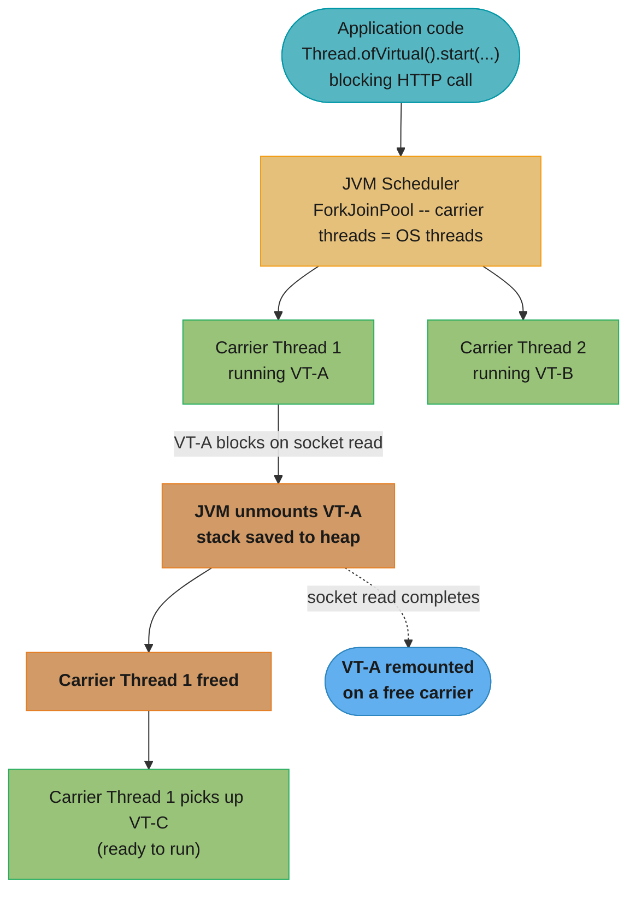
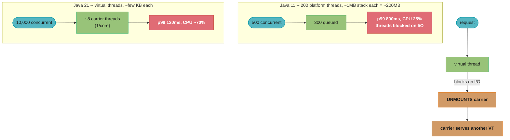

# Java 9–21 Features

## 1. Concept Overview

Java has evolved rapidly since Java 9, with a new release every 6 months and LTS versions at Java 11, 17, and 21. This module covers the most impactful features from this era: the **module system** (Java 9), **`var`** (Java 10), **text blocks** (Java 15), **records** (Java 16), **sealed classes** (Java 17), **pattern matching** (Java 16/21), **switch expressions** (Java 14), and the biggest addition in years — **virtual threads** (Java 21) and **structured concurrency** (Java 21).

Understanding these features is critical for modern Java interviews — they show you follow the language's evolution and can articulate the *problem each feature solves*.

---

## 2. Intuition

> **One-line analogy**: Each Java feature from 9–21 is a direct response to a pain point: Records solve POJO boilerplate, sealed classes solve unsafe downcasting, virtual threads solve the "one thread per request" scalability wall.

**Mental model**: Think of Java 9–21 as Java's "maturity phase" — each feature closes a gap that required workarounds or external libraries. Records replace Lombok's `@Data`. Sealed classes make the compiler your ally for exhaustive type hierarchies. Virtual threads eliminate the performance penalty of blocking I/O without changing your existing blocking code.

**Why it matters**: Java 21 (LTS) is the most capable Java ever, and its virtual threads fundamentally change how you design concurrent applications. Sealed classes + pattern matching for switch gives Java the expressiveness of ADTs from functional languages. These features appear heavily in modern Java interviews.

**Key insight**: Virtual threads do NOT change the programming model — you still write blocking code. The JVM transparently multiplexes thousands of virtual threads onto a few carrier (OS) threads, unmounting a blocked virtual thread so the carrier can run others. This gives you the throughput of async/reactive without the callback hell.

---

## 3. Core Principles

- **Records**: Immutable data carriers with auto-generated constructor, `equals()`, `hashCode()`, `toString()`.
- **Sealed classes**: Close a type hierarchy to a known set of subtypes — enables exhaustive pattern matching.
- **Pattern matching**: Replace manual `instanceof` + cast + use with a single expressive pattern.
- **Switch expressions**: Yield values from switch; arrow labels eliminate fall-through bugs.
- **Virtual threads**: Lightweight threads managed by JVM scheduler; blocking a virtual thread does NOT block an OS thread.
- **`var`**: Local variable type inference — the compiler infers the type; the variable is still statically typed.
- **Text blocks**: Multi-line string literals without escape sequences.

---

## 4. Types / Architectures / Strategies

### 4.1 Java Version Feature Summary

| Feature | Java Version | LTS | Notes |
|---------|-------------|-----|-------|
| JPMS (module system) | 9 | — | module-info.java |
| `var` | 10 | 11 | local variable only |
| Text blocks | 15 | 17 | `"""..."""` |
| Switch expressions | 14 | 17 | arrow labels, `yield` |
| Records | 16 | 17 | immutable data carriers |
| Pattern matching instanceof | 16 | 17 | `if (o instanceof Foo f)` |
| Sealed classes | 17 | 17 | `permits` clause |
| Pattern matching switch | 21 | 21 | guarded patterns, exhaustive |
| Virtual threads | 21 | 21 | `Thread.ofVirtual()` |
| StructuredTaskScope | 21 | 21 | structured concurrency |
| Sequenced Collections | 21 | 21 | `SequencedCollection` interface |

### 4.2 Record Anatomy

```java
// All of these are auto-generated:
public record Point(int x, int y) {
    // canonical constructor (auto-generated, but can be customized)
    // equals() based on all components
    // hashCode() based on all components
    // toString() like "Point[x=1, y=2]"
    // accessor methods: x() and y()
}

// Compact constructor for validation:
public record Range(int min, int max) {
    Range {  // compact constructor — no parameter list
        if (min > max) throw new IllegalArgumentException("min > max");
        // min and max are implicitly assigned at end of compact constructor
    }
}
```

### 4.3 Sealed Class Hierarchy

```java
sealed interface Shape permits Circle, Rectangle, Triangle {}
final class Circle    implements Shape { double radius; }
final class Rectangle implements Shape { double width, height; }
non-sealed class Triangle implements Shape { }  // allows further subclassing
```

### 4.4 Virtual Thread vs Platform Thread

| Aspect | Platform Thread | Virtual Thread |
|--------|----------------|----------------|
| Stack size | ~1MB default | ~few KB (grows dynamically) |
| Scheduling | OS scheduler | JVM scheduler (ForkJoinPool) |
| Blocking cost | Blocks OS thread | Unmounts; carrier thread free |
| Number practical | Thousands max | Millions |
| Created via | `new Thread()` | `Thread.ofVirtual().start()` |
| Pinning | N/A | Caused by `synchronized` on object or native frames |

---

## 5. Architecture Diagrams

### Virtual Thread Architecture

Key: carrier threads scale with CPU core count; virtual threads scale with request count — a blocked VT unmounts instead of tying up an OS thread.

### Pattern Matching for Switch (Java 21)
```
Object obj = getShape();

// Old (Java 14-):
if (obj instanceof Circle c) {
    double area = Math.PI * c.radius() * c.radius();
} else if (obj instanceof Rectangle r) {
    double area = r.width() * r.height();
}

// New (Java 21) — exhaustive, guarded:
double area = switch (obj) {
    case Circle c    when c.radius() > 0 -> Math.PI * c.radius() * c.radius();
    case Circle c                         -> 0;  // zero radius
    case Rectangle r                      -> r.width() * r.height();
    case Triangle t                       -> /* ... */;
    // Compiler ENFORCES exhaustiveness when sealed: no default needed
};
```

---

## 6. How It Works — Detailed Mechanics

### Records: What Gets Generated

```java
public record Person(String name, int age) {}

// Compiler generates exactly:
public final class Person extends java.lang.Record {
    private final String name;
    private final int age;

    public Person(String name, int age) {  // canonical constructor
        this.name = name;
        this.age = age;
    }

    public String name() { return name; }  // accessor (NOT getName!)
    public int age()     { return age; }

    @Override
    public boolean equals(Object o) { /* field-by-field, uses Objects.equals */ }
    @Override
    public int hashCode() { /* based on all components */ }
    @Override
    public String toString() { return "Person[name=" + name + ", age=" + age + "]"; }
}

// Records CANNOT:
// - extend other classes (already extends Record)
// - have mutable state (all fields are final)
// - declare instance fields outside the record header
// Records CAN:
// - implement interfaces
// - have static fields and methods
// - have custom methods
// - have compact constructors for validation
```

### `var` — Rules and Limitations

```java
// ALLOWED: local variable with initializer
var list = new ArrayList<String>();  // inferred as ArrayList<String>
var i    = 42;                       // inferred as int
var map  = Map.of("key", 1);         // inferred as Map<String, Integer>

// NOT ALLOWED:
// var x;                    // no initializer - can't infer
// var x = null;             // null has no type
// private var x = 5;        // instance fields
// void method(var x) {...}  // method parameters
// public var method() {...} // return types

// CAUTION: loses readability when type is not obvious
var result = processData(input);  // what type is result?
```

### Virtual Thread Pinning

```java
// PINNED: synchronized block holds carrier thread while blocked
synchronized (lock) {
    Thread.sleep(Duration.ofSeconds(1));  // carrier thread is PINNED (blocked)
}

// FIX: use ReentrantLock instead
ReentrantLock lock = new ReentrantLock();
lock.lock();
try {
    Thread.sleep(Duration.ofSeconds(1));  // virtual thread unmounts; carrier freed
} finally {
    lock.unlock();
}

// Also pinned by: JNI/native method calls, class initializers
// Detect pinning: -Djdk.tracePinnedThreads=full
```

### StructuredTaskScope

```java
// Java 21: both sub-tasks must succeed, or scope is cancelled
try (var scope = new StructuredTaskScope.ShutdownOnFailure()) {
    Subtask<String> user    = scope.fork(() -> fetchUser(id));
    Subtask<Order>  order   = scope.fork(() -> fetchOrder(id));

    scope.join();           // wait for both
    scope.throwIfFailed();  // propagate any exception

    return new Response(user.get(), order.get());
}
// If fetchUser() fails: fetchOrder() is cancelled automatically
// If either throws: the exception propagates to the parent
```

### JPMS Module Directives — Complete Reference

```java
// module-info.java — placed at root of module source directory
module com.myapp.service {
    // requires: declare dependency on another module
    requires java.sql;               // hard dependency — module must exist at runtime
    requires transitive com.myapp.api; // transitive: anyone requiring THIS module
                                        // also implicitly requires com.myapp.api
                                        // (needed when you expose API types in your public API)

    // exports: make packages accessible to other modules
    exports com.myapp.service.api;         // all modules can see this package
    exports com.myapp.service.internal     // only specified modules can see this
        to com.myapp.client, com.myapp.test;

    // opens: like exports but also allows deep reflection (needed for frameworks)
    opens com.myapp.service.entities;      // allows reflection into non-public members
    opens com.myapp.service.dto            // reflection allowed only from these modules
        to com.fasterxml.jackson.databind;

    // uses: declares that this module uses a service (Service Loader)
    uses com.myapp.spi.PluginService;

    // provides: declares that this module provides a service implementation
    provides com.myapp.spi.PluginService
        with com.myapp.service.DefaultPluginService;
}

// exports vs opens:
// exports com.pkg: other modules can call public APIs of com.pkg at runtime
//                  but CANNOT use reflection to access private members
// opens com.pkg:   same as exports PLUS allows deep reflection (setAccessible(true))
//                  Frameworks like Spring, Hibernate need 'opens' to inject/serialize fields

// Split packages problem: two modules cannot export the SAME package name
// (e.g., module A exports com.util and module B exports com.util -> error at startup)
// Solution: use different package names; no merging of packages across modules

// --add-opens workaround (for legacy code):
// JVM arg: --add-opens java.base/java.lang=ALL-UNNAMED
// Allows unnamed module (classpath code) to deeply reflect into java.lang
// Used to migrate libraries that relied on internal JDK APIs before modules
```

### Record Deconstruction Patterns (Java 21)

```java
record Point(int x, int y) {}
record Line(Point start, Point end) {}

// Basic record deconstruction in switch (Java 21):
Object obj = new Point(3, 4);
String desc = switch (obj) {
    case Point(int x, int y) -> "Point at (" + x + ", " + y + ")";  // components extracted
    case String s            -> "String: " + s;
    default                  -> "unknown";
};

// Guarded pattern with deconstruction:
String quadrant = switch (obj) {
    case Point(int x, int y) when x > 0 && y > 0 -> "Q1 (positive)";
    case Point(int x, int y) when x < 0 && y > 0 -> "Q2";
    case Point(int x, int y) when x < 0 && y < 0 -> "Q3";
    case Point(int x, int y)                       -> "Q4 or on axis";
    default                                        -> "not a point";
};

// Nested deconstruction — Line contains two Points:
Object shape = new Line(new Point(0, 0), new Point(3, 4));
String info = switch (shape) {
    case Line(Point(int x1, int y1), Point(int x2, int y2)) ->
        String.format("Line from (%d,%d) to (%d,%d)", x1, y1, x2, y2);
    default -> "not a line";
};
// Nested deconstruction extracts deeply nested components in one pattern.
// No manual .start().x() chains needed.

// In instanceof (Java 21 preview):
if (shape instanceof Line(Point(int x1, int y1), Point(int x2, int y2))) {
    // x1, y1, x2, y2 directly in scope
}
```

---

## 7. Real-World Examples

- **Records**: Domain model DTOs, API response objects, value types — replaces Lombok `@Value` without annotation processing.
- **Sealed classes**: Modeling result types: `sealed interface Result<T> permits Success<T>, Failure` — like Rust's `Result<T,E>` or Kotlin's `sealed class`.
- **Virtual threads**: Tomcat/Jetty in "virtual thread" mode (Java 21) — each HTTP request gets its own virtual thread, eliminating the need for reactive frameworks like WebFlux for I/O-bound workloads.
- **Text blocks**: SQL queries, JSON templates, HTML snippets embedded in Java code.
- **Pattern matching switch**: Processing event types in event-sourced systems — `switch(event) { case UserCreated e -> ...; case OrderPlaced e -> ...; }`.

---

## 8. Tradeoffs

| Feature | Benefit | Limitation |
|---------|---------|------------|
| Records | Zero boilerplate, correct equality | Cannot extend classes; immutable only |
| Sealed classes | Exhaustive compiler checks | Requires all subtypes known at compile time |
| Virtual threads | Massive concurrency, simple code | Pinning risk; can't replace CPU-bound parallelism |
| `var` | Less verbosity | Reduces readability when type unclear |
| Pattern matching switch | Exhaustiveness, expressive | Java 21+ only; learning curve for teams |
| JPMS | Strong encapsulation | Complex setup; many libraries not yet modular |

---

## 9. When to Use / When NOT to Use

**Use Records when**:
- Class is a pure data carrier (no behavior beyond accessors)
- Immutability is desired
- Replacing manual POJOs, Lombok @Value, or Kotlin data classes

**Do NOT use Records when**:
- You need mutability (e.g., JPA entities — JPA requires no-arg constructor and mutable state)
- You need custom serialization behavior
- You need to extend another class

**Use virtual threads when**:
- I/O-bound server code (HTTP servers, DB calls, file I/O)
- High concurrency needed (thousands of concurrent requests)
- Existing blocking code that you want to scale without rewriting

**Do NOT use virtual threads when**:
- CPU-bound work (use `ForkJoinPool` or `parallelStream()`)
- Code uses many `synchronized` blocks that would cause pinning

---

## 10. Common Pitfalls

### War Story 1: Virtual thread pinning by synchronized
A team migrated to virtual threads in Java 21. Throughput barely improved. Investigation with `-Djdk.tracePinnedThreads=full` revealed that a third-party library used `synchronized` on internal monitor objects for every DB operation, pinning the carrier thread for the entire I/O wait. **Fix**: File an issue with the library, or use `ReentrantLock` wrappers. Java 24 is addressing this by making virtual threads not pin on synchronized.

### War Story 2: Records with JPA
A developer tried to use `@Entity` on a Record. JPA requires a no-arg constructor and mutable fields. Records have neither. **Fix**: Use Records for DTOs/value objects, use regular classes for JPA entities.

### War Story 3: `var` losing generic type information
`var list = new ArrayList<>();` infers `ArrayList<Object>` not `ArrayList<String>` — the diamond operator with `var` loses type parameter. **Fix**: `var list = new ArrayList<String>();` — always provide the type argument when using `var` with generic collections.

### War Story 4: Sealed class non-exhaustive switch
A `sealed interface` had 3 subtypes. A `switch` pattern matched 2 and used `default` for the 3rd. When a 4th subtype was added, the `default` branch silently caught it without any compile error. **Fix**: Remove the `default` clause when switching on a sealed type — the compiler will then enforce exhaustiveness and flag the missing case.

---

## 11. Technologies & Tools

| Tool | Purpose |
|------|---------|
| `Thread.ofVirtual()` | Create virtual threads |
| `Executors.newVirtualThreadPerTaskExecutor()` | Thread pool backed by virtual threads |
| `StructuredTaskScope` | Structured concurrency (Java 21) |
| `-Djdk.tracePinnedThreads=full` | JVM flag to detect virtual thread pinning |
| `jshell` (Java 9+) | REPL for quick experimentation |
| `jlink` (Java 9+) | Create minimal custom runtime images with JPMS |

---

## 12. Interview Questions with Answers

**Q1: What problem do Records solve compared to plain POJOs?**
Records eliminate the boilerplate of data carrier classes: no need to write constructors, `equals()`, `hashCode()`, `toString()`, or accessor methods. A plain POJO with 5 fields requires ~50 lines; the equivalent Record is 1 line. More importantly, Records guarantee immutability (all fields `final`) and correct equality semantics by default — developers can't forget to update `hashCode()` when adding a field.

**Q2: Can you extend a Record? Can a Record extend another class?**
No to both. Records implicitly extend `java.lang.Record` (a JDK class), and Java only allows single inheritance — so a Record cannot extend any other class. Similarly, you cannot extend a Record because all its fields are `final` and the class design is sealed by the compiler. Records *can* implement interfaces, which is how you add behavior polymorphically.

**Q3: How do sealed classes enable exhaustive pattern matching?**
When a sealed interface/class has a `permits` clause listing all subtypes, the compiler has complete knowledge of the closed hierarchy at compile time. A `switch` expression over a sealed type that handles every permitted subtype is considered exhaustive — no `default` branch needed, and the compiler flags any missing case. This is analogous to ADTs in Haskell/Scala: the type system guarantees you handle every variant.

**Q4: What is virtual thread pinning and how do you avoid it?**
Pinning occurs when a virtual thread cannot be unmounted from its carrier thread — the carrier is "pinned" and blocked, which wastes an OS thread. Pinning is caused by: (1) `synchronized` block/method while waiting (e.g., blocking I/O inside `synchronized`); (2) native method calls (JNI). To avoid: replace `synchronized` with `ReentrantLock` in I/O-bound code. Detect with `-Djdk.tracePinnedThreads=full`. Java 24+ removes pinning for `synchronized`.

**Q5: What is the difference between a virtual thread and a platform thread in terms of stack size and scheduling?**
A platform thread maps 1:1 to an OS thread with a fixed stack of ~1MB (configurable via `-Xss`). A virtual thread has a dynamically-growing stack starting at ~few KB, stored on the Java heap, and is scheduled by the JVM (via a ForkJoinPool of carrier threads). Platform threads: OS scheduler (preemptive). Virtual threads: cooperative (mounted/unmounted at blocking points). Result: you can have millions of virtual threads vs thousands of platform threads.

**Q6: What limitations does `var` have?**
`var` can only be used for: local variables with an initializer, `for` loop variables, try-with-resources variables. It CANNOT be used for: instance/static fields, method parameters, method return types, lambda parameters (without a cast), catch clause variables. Also, `var x = null` is illegal (null has no type), and `var` with an unparameterized diamond `new ArrayList<>()` loses type info. `var` is a syntactic sugar — the variable is still strongly typed at compile time.

**Q7: How does pattern matching for switch ensure exhaustiveness?**
For sealed types, the compiler tracks which subtypes are covered by `case` patterns. If any permitted subtype is unhandled and there's no `default`, the compiler emits an error. For non-sealed types (e.g., `Object`), a `default` or `case null` is required. Guarded patterns `case Foo f when condition` don't count for exhaustiveness (the compiler can't prove the condition always matches), so an unguarded case for the same type is also needed.

**Q8: What was added to Java 9's module system (JPMS) and why was it created?**
JPMS (Java Platform Module System) adds `module-info.java` files that declare module name, `requires` (dependencies), and `exports` (public API packages). It was created to: (1) Strongly encapsulate JDK internals (e.g., `sun.misc.Unsafe`) that were accidentally accessible via reflection; (2) Enable creation of minimal custom JRE images with `jlink`; (3) Provide reliable configuration (fail-fast on missing dependencies). Adoption is slow because many popular libraries are not yet fully modularized.

**Q9: What are sequenced collections (Java 21)?**
Sequenced collections add three new interfaces: `SequencedCollection<E>` (for collections with defined encounter order — adds `getFirst()`, `getLast()`, `addFirst()`, `addLast()`, `removeFirst()`, `removeLast()`, `reversed()`), `SequencedSet<E>`, `SequencedMap<K,V>`. Before Java 21, there was no common interface for accessing the first/last element of ordered collections like `LinkedHashMap` and `ArrayList`.

**Q10: What is StructuredTaskScope and when would you use it?**
`StructuredTaskScope` (Java 21) implements structured concurrency — ensuring that concurrent sub-tasks live within the lifetime of their parent task. `ShutdownOnFailure`: if any fork fails, cancel the others and propagate the exception. `ShutdownOnSuccess`: take the first successful result, cancel the rest. Use it when: you need to parallel-fetch two resources and need both (ShutdownOnFailure), or you want the fastest of N attempts (ShutdownOnSuccess). It prevents orphaned threads and makes cancellation automatic.

**Q11: What is a text block and how does it handle indentation?**
A text block `"""..."""` is a multi-line string literal. The compiler strips common leading whitespace (incidental whitespace) based on the least-indented line. The trailing `"""` position controls the stripping — if it's on a new line indented by N spaces, N spaces are stripped from all lines. Backslash line continuation `\` merges lines. Text blocks support the full string API and are equivalent to regular strings at runtime.

**Q12: What is the difference between a switch expression and a switch statement?**
Switch expression (Java 14+) yields a value, uses arrow labels `->` (no fall-through by default), and is exhaustive for enum/sealed types. Switch statement (traditional) doesn't return a value, uses `case X: ... break`, and has fall-through by default. For `default`-less switch expressions over non-enum types, the compiler requires a `default` branch. Use `yield` inside a block to return from a switch expression: `case X -> { ...; yield value; }`.

**Q13: What does `exports` vs `opens` mean in a `module-info.java`?**
`exports com.pkg` makes the public types in `com.pkg` accessible to other modules at runtime — other modules can call public methods, create instances, etc. But non-public members remain inaccessible, and deep reflection (accessing private fields) is blocked. `opens com.pkg` additionally permits deep reflection: `setAccessible(true)` on private fields and methods works. Frameworks like Spring (dependency injection), Hibernate (field access for ORM), and Jackson (JSON deserialization with private fields) all require `opens` to function. `exports` is for normal API access; `opens` is the "reflection door." You can use `opens com.pkg to specific.module` to limit reflection to trusted modules only.

**Q14: What is record deconstruction and how does pattern matching for switch use it?**
Record deconstruction (Java 21) allows extracting a record's components directly in a pattern. `case Point(int x, int y)` simultaneously matches a `Point` instance AND binds its `x()` and `y()` components to local variables `x` and `y`. No explicit casting or accessor calls needed. In `switch` expressions with sealed types, this creates exhaustive, type-safe dispatch that reads like algebraic data type matching. Nested deconstruction works too: `case Line(Point(int x1, int y1), Point(int x2, int y2))` extracts components from a `Line` and both its nested `Point` components in one pattern. Guarded patterns add `when` conditions: `case Point(int x, int y) when x > 0`.

**Q15: What is virtual thread "pinning" and which constructs cause it in Java 21?**
A virtual thread is "pinned" when it cannot be unmounted from its carrier platform thread while blocked. During pinning, the underlying platform thread is held — defeating the memory efficiency benefit of virtual threads (which is that thousands of virtual threads share a small pool of platform threads). Two constructs pin the carrier thread: (1) **`synchronized` blocks/methods** — if a virtual thread blocks inside `synchronized`, the carrier thread is pinned for the duration of the block. (2) **Native method frames** (`System.loadLibrary`, JNI calls) — the JVM cannot unmount while native code is on the stack. Diagnose pinning with `-Djdk.tracePinnedThreads=full` which logs stack traces. Fix: replace `synchronized` with `ReentrantLock` in code called from virtual threads — `ReentrantLock.lock()` allows unmounting while waiting. Java 25 is expected to remove the `synchronized` pinning restriction via opaque monitors. Practical rule: in Spring Boot 3.2+ with `spring.threads.virtual.enabled=true`, audit your code (and dependencies like JDBC drivers) for heavy `synchronized` usage in hot paths.

---

## 13. Best Practices

1. **Prefer Records for all data carriers** — eliminate Lombok `@Value`, manual POJOs for DTOs/value objects.
2. **Use sealed classes for closed type hierarchies** — protocol messages, domain events, result types.
3. **Switch to virtual threads for I/O-bound code** — `Executors.newVirtualThreadPerTaskExecutor()` is a one-line change.
4. **Use `StructuredTaskScope` instead of `CompletableFuture.allOf()`** for concurrent sub-tasks with proper cancellation.
5. **Replace `synchronized` with `ReentrantLock`** in any code that blocks while holding a lock (virtual thread pinning).
6. **Use `var` only where the type is obvious** from the right-hand side — don't sacrifice readability.
7. **Add `when` guards** to pattern matching cases for conditional dispatch.
8. **Use switch expressions over switch statements** in all new code — eliminate fall-through bugs.
9. **Enable `--enable-preview`** flags in build tools to try features like StructuredTaskScope before final release.
10. **Validate in compact constructors** — Records' compact constructor is the right place for invariant checks.

---

## 14. Case Study

### Migrating a REST API from Platform Threads to Virtual Threads (Java 21 LTS)

**Scenario.** An order-orchestration REST API runs on Java 11 (LTS) with a fixed pool of **200 platform threads**. Each request fans out to 2–3 downstream services (user, inventory, pricing), each a blocking HTTP call averaging ~60ms. At 500 concurrent requests the 200-thread pool is exhausted; requests queue and **p99 hits 800ms** even though the CPU sits at 25%. The threads are not busy — they are *blocked* waiting on I/O. Migrating to Java 21 virtual threads lets the service hold **10,000 concurrent requests** with **p99 ~120ms**, because a blocked virtual thread unmounts its carrier instead of pinning an OS thread.



#### The migration: one line, plus structured concurrency

```java
// BEFORE (Java 11): bounded pool; the 201st concurrent request queues.
ExecutorService pool = Executors.newFixedThreadPool(200);
server.setExecutor(pool);

// AFTER (Java 21): a virtual thread per request, unbounded by OS threads.
server.setExecutor(Executors.newVirtualThreadPerTaskExecutor());
```

```java
// Fan-out the 3 downstream calls with StructuredTaskScope (Java 21 preview).
record OrderView(User user, Inventory inv, Pricing price) {}

OrderView assemble(String orderId) throws Exception {
    try (var scope = new StructuredTaskScope.ShutdownOnFailure()) {
        var user  = scope.fork(() -> userClient.fetch(orderId));
        var inv   = scope.fork(() -> inventoryClient.fetch(orderId));
        var price = scope.fork(() -> pricingClient.fetch(orderId));
        scope.join().throwIfFailed();          // wait all; cancel siblings on first failure
        return new OrderView(user.get(), inv.get(), price.get());
    }
}
```

#### Records and sealed types modernize the model

```java
// 50-line getter/equals/hashCode DTO collapses to one line:
record OrderView(User user, Inventory inv, Pricing price) {}

// Sealed hierarchy makes the response set exhaustive and switch-checkable:
sealed interface ApiResponse<T> permits Ok, ClientError, ServerError {}
record Ok<T>(T body) implements ApiResponse<T> {}
record ClientError<T>(int status, String msg) implements ApiResponse<T> {}
record ServerError<T>(Throwable cause) implements ApiResponse<T> {}

String render(ApiResponse<OrderView> r) {
    return switch (r) {                         // no default needed: sealed = exhaustive
        case Ok<OrderView> ok           -> serialize(ok.body());
        case ClientError<OrderView> ce  -> "4xx: " + ce.msg();
        case ServerError<OrderView> se  -> "5xx: " + se.cause().getMessage();
    };
}
```

**Results.** Thread count: 200 platform threads -> ~8 carrier threads. Stack memory: ~200MB -> a few MB (virtual thread stacks are ~few KB and live on the heap, growing on demand). p99: 800ms -> 120ms at 20x the concurrency.

**In plain terms.** "Stack memory is just concurrency multiplied by stack size, and the migration changed the second factor by roughly a thousand-fold — which is why 50x more in-flight requests still costs less memory than before."

Writing it as a product makes the ceiling obvious. With platform threads, every unit of concurrency you buy costs a megabyte of reserved address space up front; with virtual threads it costs a heap allocation that grows only as deep as the call stack actually gets.

| Symbol | What it is |
|--------|------------|
| Stack size | Per-thread stack: ~1MB reserved for a platform thread (`-Xss` default), ~a few KB for a virtual thread |
| Where it lives | Platform stacks are OS-reserved memory outside the heap; virtual thread stacks are heap objects that grow on demand |
| Concurrency | Threads alive — capped at the pool size for platform threads, at the request count for virtual threads |
| Total stack memory | Concurrency x stack size — the product this arithmetic walks |
| Carrier threads | The ~8 real OS threads (one per core) that virtual threads mount onto; the only platform stacks left |

**Walk one example.** Both configurations, priced out:

```
  Java 11, platform threads
    concurrency          200 threads (pool cap)
    stack size           ~1 MB each
    stack memory         200 x 1 MB           =  ~200 MB
    memory per served request                 =  1 MB

  Java 21, virtual threads
    concurrency          10,000 threads (1 per request)
    stack size           ~1 KB each (grows on demand)
    stack memory         10,000 x 1 KB        =  ~10 MB
    memory per served request                 =  1 KB

  concurrency        200 -> 10,000     =  50x more
  stack memory      200 MB -> 10 MB    =  20x less
  cost per request   1 MB -> 1 KB      =  ~1,000x cheaper
```

The 200MB was never the binding constraint on its own — the pool cap of 200 was. But the two are the same fact: the pool was capped at 200 *because* each thread costs a megabyte, and lifting the cap to 10,000 on platform threads would have meant reserving ~10GB of stack. Moving the stack to the heap and letting it grow on demand is what removes the cap, not the raw memory saving.

#### Capacity comparison at a glance

```
                     Platform threads (Java 11)   Virtual threads (Java 21)
  Threads alive        200 (pool cap)               10,000+ (1 per request)
  Stack memory         ~200MB (1MB each)            ~a few MB (KB each, on heap)
  Concurrency ceiling  ~200 in-flight               bounded by downstream, not threads
  p99 @ 500 concurrent 800ms                        ~90ms
  p99 @ 10k concurrent  -- (would collapse)         120ms
  CPU utilization      25% (blocked)                ~70% (work-bound)
```

The key insight: the platform-thread CPU was idle at 25% because threads were *blocked*, not busy. Virtual threads convert that wasted wall-clock into served requests without adding cores.

**What it means.** "A fixed thread pool sets a hard throughput ceiling of `threads / hold-time`, and once demand passes that ceiling the extra requests do not run slowly — they do not run at all until a thread frees up."

That is the distinction the CPU graph hides. At 25% utilisation the instinct is "there is headroom, send more traffic," but the constraint was never cores; it was the 200 slots, each held for the full duration of a downstream call the CPU spends doing nothing.

| Symbol | What it is |
|--------|------------|
| Hold time | How long one request occupies its thread — here the sum of its downstream calls, since each blocks |
| Threads | The pool size, 200; the number of requests that can be in flight at once |
| Throughput ceiling | Threads / hold time — the most requests per second the pool can retire, regardless of CPU |
| Queue depth | Offered concurrency minus threads: requests that hold no thread and are simply waiting |
| Queueing delay | Queue depth / throughput ceiling — time spent before the request even starts |

**Walk one example.** The Java 11 configuration at 500 concurrent requests:

```
  hold time      3 downstream calls x 60 ms   =  180 ms  =  0.180 s
  threads                                        200

  throughput ceiling  =  200 / 0.180           =  1,111 requests/sec

  at 500 offered concurrently:
    running (hold a thread)     200
    queued (hold nothing)       500 - 200      =    300

    queueing delay  =  300 / 1,111 per sec     =  270 ms
    total latency   =  270 ms + 180 ms         =  450 ms

  Only 180 ms of that 450 ms is real downstream work.
  The other 270 ms -- 60% of the request -- is waiting for a thread to exist.
```

The measured p99 of 800ms sits above this 450ms figure, as it should: this arithmetic gives the average request under steady 500-way load, while p99 is the tail, where queue depth is transiently deeper and downstream calls are themselves slower than 60ms. The point of the calculation is not to predict the tail but to locate the cause — 60% of the latency is queueing for a resource the CPU meter cannot see. Virtual threads delete the queue entirely: every request gets a thread immediately, so the 270 ms vanishes and latency collapses back toward the 180 ms of actual downstream time.

#### Records compress the boilerplate, sealed types make handling total

```java
// A 50-line getter/equals/hashCode/toString DTO collapses to one line.
record OrderView(User user, Inventory inv, Pricing price) {}

// Pattern matching for switch (Java 21) over the sealed hierarchy is exhaustive:
int httpStatus(ApiResponse<?> r) {
    return switch (r) {
        case Ok<?> ok          -> 200;
        case ClientError<?> ce -> ce.status();
        case ServerError<?> se -> 500;
        // no default: adding a new permitted subtype is a COMPILE error until handled
    };
}
```

### Common Pitfalls (production war stories)

**1. `synchronized` pinned the carrier thread.** A shared connection cache guarded a downstream call with `synchronized`. On Java 21, a virtual thread that blocks *inside* a `synchronized` block cannot unmount — it **pins** its carrier. Under load all 8 carriers got pinned and throughput collapsed back to platform-thread levels.

```java
synchronized (lock) { result = blockingHttpCall(); }   // BROKEN: pins carrier on block
// FIX: ReentrantLock releases the carrier while the VT is blocked.
lock.lock();
try { result = blockingHttpCall(); } finally { lock.unlock(); }
```
(JDK 24 lifts most `synchronized` pinning, but on the Java 21 LTS baseline prefer `ReentrantLock` around blocking I/O.)

**2. Virtual threads used for CPU-bound work.** A team ran a CPU-heavy image transform on virtual threads expecting a speed-up. Virtual threads do not add cores; they help *blocked* tasks. The transform still saturated 8 carriers and just added scheduling overhead. CPU-bound work belongs on a fixed pool sized to cores.

**Read it like this.** "CPU utilisation is the fraction of your cores that are actually computing, so 25% on an 8-core box means 2 cores working and 6 idle — and no thread abstraction can raise that ceiling above 8."

Reading utilisation as a count of busy cores rather than a percentage is what separates the two war stories. The migration worked because blocked threads were leaving cores idle; the image transform did not, because those cores were already saturated and virtual threads add none.

| Symbol | What it is |
|--------|------------|
| Cores | 8 — the hard parallelism limit, and the number of carrier threads the JVM creates |
| CPU utilisation | Fraction of core-time spent executing; multiply by cores to get cores actually busy |
| I/O-bound | Threads blocked waiting; cores sit idle and utilisation is far below 100% — recoverable |
| CPU-bound | Cores already computing; utilisation near its ceiling — not recoverable by adding threads |

**Walk one example.** The same 8-core box, before and after, then applied to CPU-bound work:

```
  cores                                            8

  before (Java 11, blocked on I/O)
    utilisation      25%      ->  0.25 x 8   =   2.0 cores busy, 6.0 idle

  after (Java 21, virtual threads)
    utilisation      70%      ->  0.70 x 8   =   5.6 cores busy, 2.4 idle
    work per core    0.70 / 0.25             =   2.8x more, on the same hardware

  the 6 idle cores were the recoverable resource -- and they were only idle
  because threads were blocked rather than because work was missing.

  now the CPU-bound image transform, on the same box:
    cores already busy                        =   8.0 of 8
    idle cores available to recover           =   0
    speedup from adding virtual threads       =   1.0x  (plus scheduling overhead)
```

The asymmetry is the lesson. Virtual threads recover idle cores; they never create busy ones. When utilisation is already at its ceiling, the only remaining levers are fewer instructions per item or more cores — and the extra threads make things marginally *worse*, since scheduling millions of runnable tasks onto 8 carriers costs real time that the 200-thread pool was not paying.

**3. Record with a mutable collection field leaked mutation.** `record Cart(List<Item> items) {}` exposed the caller's list directly, so external mutation changed the "immutable" record's contents.

```java
record Cart(List<Item> items) {
    Cart { items = List.copyOf(items); }    // FIX: defensive copy in compact constructor
}
```

**4. `switch` on a non-sealed type missed a case.** A `switch` over an open interface compiled with a `default` that silently swallowed a newly added subtype, hiding a bug for weeks. Sealing the interface makes the compiler reject the non-exhaustive switch at build time.

### Interview Discussion Points

**What problem do virtual threads actually solve?** They make blocking I/O cheap by decoupling Java threads from OS threads. A blocked virtual thread unmounts its carrier, so you can have millions of them. They do not speed up CPU-bound work or add parallelism beyond the carrier count.

**What is carrier pinning and when does it happen?** A virtual thread is "pinned" when it cannot unmount from its carrier OS thread while blocked — on the Java 21 baseline this happens inside `synchronized` blocks and during native calls. Pinning defeats the scalability benefit; use `ReentrantLock` around blocking sections.

**Why are records a good fit for DTOs but not for entities?** Records are shallowly immutable data carriers with generated `equals`/`hashCode`/`toString`. That suits transfer/value objects. JPA entities need a no-arg constructor and mutable identity managed by the persistence context, which records cannot provide.

**How do sealed classes improve `switch`?** A sealed type enumerates its permitted subtypes, so the compiler can verify a pattern `switch` covers them all and reject it otherwise — turning a runtime "unhandled case" into a compile error, with no fragile `default` branch.

**Why did p99 improve so much without adding CPU?** The old bottleneck was thread *availability*, not CPU. With 200 threads, the 201st request waited in a queue (~queueing delay added to latency). Virtual threads remove the queue: every request gets its own thread immediately, and blocked ones release their carrier, so latency reflects real downstream time, not contention.

**What does `StructuredTaskScope.ShutdownOnFailure` give you over plain `CompletableFuture.allOf`?** It scopes the lifetime of the forked subtasks to the try block, cancels all siblings the moment one fails, and propagates the failure with a clean stack — no orphaned futures, no manual cancellation, and the parent cannot return before all children complete or are cancelled.

**Why isn't a record a drop-in replacement for every class?** Records are shallowly immutable and final, cannot extend other classes, and expose all components. They fit value/data carriers. Anything needing mutability, inheritance, or hidden state (entities, services, builders with optional fields) should remain a regular class.

**How do virtual threads interact with `ThreadLocal`?** They support `ThreadLocal`, but since you may create millions, per-thread copies can balloon memory. Prefer passing context explicitly or use `ScopedValue` (Java 21 preview), which shares an immutable binding across the structured scope without per-thread allocation.

---

## Related / See Also

- [Structured Concurrency & Loom](../structured_concurrency_and_loom/README.md) — virtual threads GA (Java 21), StructuredTaskScope, ScopedValue deep dive
- [JVM Internals](../jvm_internals/README.md) — class loading, JPMS module system, JIT tiers
- [Java 8 Features](../java8_features/README.md) — evolution baseline: lambdas, streams, and Optional
- [Spring Native / GraalVM](../../spring/spring_native_graalvm/README.md) — AOT compilation of records, sealed classes, and reflection-heavy frameworks into native images

**Why does CPU rise from 25% to ~70% after the migration?** The platform-thread service had idle cores because threads sat blocked on I/O while the work was waiting. Virtual threads keep more requests progressing concurrently, so the cores spend their time on actual request processing instead of being stalled behind a bounded pool.
