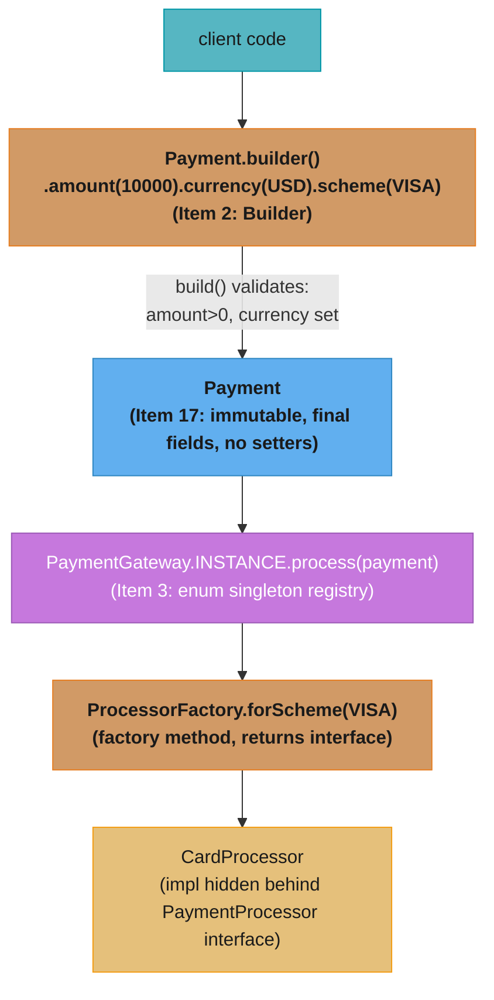

# Java Interview Patterns

## 1. Concept Overview

This module consolidates the most common Java patterns and gotchas that appear on senior Java interviews. Unlike the other modules which cover concepts deeply, this module is a consolidated reference of *recipes and gotchas* — the practical patterns you need to recognize and apply immediately in an interview setting.

These patterns come from *Effective Java* by Joshua Bloch (the essential Java engineering reference) and from real interview experiences at top-tier companies. Every pattern here has either caused a production incident or appeared in a senior Java interview.

---

## 2. Intuition

> **One-line analogy**: This module is the "formula sheet" for Java interviews — the patterns you need to recall instantly, not the ones you derive from first principles.

**Mental model**: Senior Java interviews test whether you *know Java* vs whether you've *used Java*. The Integer cache, the equals contract, the Comparable subtraction overflow, the DCL volatile requirement — these are language-level facts that any engineer writing production Java must have internalized. You can't look these up during an interview.

**Why it matters**: These patterns appear specifically because they're the differences that matter in production: the subtle bugs that cause data corruption, the design patterns that make code maintainable at scale, the language gotchas that cause 2 AM production incidents.

**Key insight**: Most of these patterns have a "broken" version and a "fixed" version. Know both — the broken version explains *why* the pattern exists, and the fixed version shows you understand the mechanism.

---

## 3. Core Principles

- **Immutability is the default**: make classes final, fields final, defensive copy on input/output (Effective Java Item 17).
- **Static factory methods over constructors**: named, cacheable, return-type-flexible (Effective Java Item 1).
- **Builder for complex objects**: avoids telescoping constructors, validates in `build()` (Effective Java Item 2).
- **Enum as singleton**: serialization-safe, reflection-safe, the best singleton (Effective Java Item 3).
- **Equals contract**: always implement `hashCode()` too; use `Objects.hash()`.
- **Effective Java is law**: reference specific items when discussing patterns.

---

## 4. Types / Architectures / Strategies

### 4.1 Effective Java Items Reference Table

| Item | Pattern | Key Point |
|------|---------|-----------|
| Item 1 | Static factory methods | Named, cacheable, flexible return type |
| Item 2 | Builder | Telescoping constructor problem; validate in build() |
| Item 3 | Enum singleton | Serialization + reflection safe |
| Item 4 | Private constructor | Noninstantiable utility classes |
| Item 15-17 | Minimize mutability | final class, final fields, defensive copy |
| Item 18 | Composition > inheritance | InstrumentedSet disaster example |
| Item 25 | Prefer lists to arrays | Type-safe, reifiable vs non-reifiable |
| Item 31 | Bounded wildcards | PECS |
| Item 50 | Defensive copies | Date in constructor |
| Item 55 | Return Optional | Instead of null |
| Item 64 | Interface types | `List<E> list = new ArrayList<>()` |
| Item 67 | Lazy initialization | Double-checked locking with volatile |

### 4.2 Integer Cache Table

| Expression | Result | Why |
|-----------|--------|-----|
| `Integer.valueOf(127) == Integer.valueOf(127)` | `true` | Cached; same instance |
| `Integer.valueOf(128) == Integer.valueOf(128)` | `false` | Outside cache; different instances |
| `new Integer(127) == new Integer(127)` | `false` | Always new instances |
| `Integer.valueOf(127).equals(Integer.valueOf(127))` | `true` | Value equality |
| `127 == 127` (primitives) | `true` | Primitive comparison |
| `(Integer)127 == (Integer)127` | `true` | Both auto-box via valueOf → cached |

---

## 5. Architecture Diagrams

### Immutable Class Recipe
```
public final class ImmutablePoint {          // 1. final class
    private final int x;                      // 2. final fields
    private final List<String> tags;          // 3. reference fields: need deep copy

    public ImmutablePoint(int x, List<String> tags) {
        this.x = x;
        this.tags = List.copyOf(tags);        // 4. defensive copy of input
    }

    public int getX() { return x; }           // 5. no setters
    public List<String> getTags() {
        return tags;                           // 6. already unmodifiable via List.copyOf
    }
}

Rules for immutability:
  1. Declare class final (prevent subclass from adding state)
  2. All fields private + final
  3. No setter methods
  4. Defensive copy mutable inputs in constructor
  5. Return defensive copies of mutable fields (or unmodifiable views)
  6. Don't leak 'this' reference from constructor
```

### Builder Pattern
```java
public final class Server {
    private final String host;
    private final int port;
    private final int timeoutMs;
    private final boolean ssl;

    private Server(Builder builder) {   // private constructor
        this.host = builder.host;
        this.port = builder.port;
        this.timeoutMs = builder.timeoutMs;
        this.ssl = builder.ssl;
    }

    public static class Builder {
        // Required parameters
        private final String host;
        private final int port;
        // Optional parameters with defaults
        private int timeoutMs = 5000;
        private boolean ssl = false;

        public Builder(String host, int port) {
            this.host = host; this.port = port;
        }
        public Builder timeoutMs(int t) { this.timeoutMs = t; return this; }
        public Builder ssl(boolean s)   { this.ssl = s; return this; }

        public Server build() {
            if (timeoutMs <= 0) throw new IllegalArgumentException("timeoutMs must be positive");
            return new Server(this);
        }
    }
}

// Usage:
Server s = new Server.Builder("localhost", 8080)
    .ssl(true).timeoutMs(3000).build();
```

---

## 6. How It Works — Detailed Mechanics

### Enum Singleton (Best Implementation)

```java
// Effective Java Item 3: enum is the best singleton
public enum AppConfig {
    INSTANCE;

    private final String dbUrl = System.getenv("DB_URL");

    public String getDbUrl() { return dbUrl; }
}

// Why enum singleton is best:
// 1. Serialization: enum serialization is handled by JVM; always returns existing instance
//    (regular class singleton needs readResolve())
// 2. Reflection-safe: Enum.newInstance() throws InstantiationException
//    (regular class singleton can be broken via Constructor.setAccessible(true))
// 3. Thread-safe: class initialization is thread-safe by JVM spec
// 4. Simple: one line

// Singleton broken by reflection (regular class):
Constructor<Singleton> c = Singleton.class.getDeclaredConstructor();
c.setAccessible(true);
Singleton s2 = c.newInstance();  // SECOND INSTANCE - singleton broken

// Enum is immune:
Method m = Enum.class.getDeclaredMethod("ordinal");  // can't get constructor
// EnumConstantNotPresentException or plain fails
```

### equals() Full Contract — Complete Recipe

```java
@Override
public boolean equals(Object o) {
    // 1. Reflexivity check (also performance shortcut)
    if (this == o) return true;

    // 2. Null safety + type check (instanceof handles null: null instanceof T = false)
    if (!(o instanceof Money)) return false;

    // 3. Cast (safe after instanceof)
    Money that = (Money) o;

    // 4. Field-by-field comparison
    // Primitives: ==
    // Objects: Objects.equals() (null-safe)
    // Floats/doubles: use Float.compare / Double.compare (NaN handling)
    return this.amount.compareTo(that.amount) == 0  // BigDecimal: equals is scale-sensitive
        && Objects.equals(this.currency, that.currency);
}

// Always paired with:
@Override
public int hashCode() {
    return Objects.hash(amount.stripTrailingZeros(), currency);
}
// Note: use same normalization in hashCode that you use in equals
```

### Comparable Subtraction Overflow — Broken vs Fixed

```java
// BROKEN: integer overflow
public int compareTo(Employee other) {
    return this.id - other.id;  // if this.id = Integer.MAX_VALUE, other.id = -1:
                                 // result = MAX_VALUE - (-1) = overflow -> negative!
                                 // sorted collection puts MAX_VALUE BEFORE -1 -> WRONG
}

// FIXED: use Integer.compare()
public int compareTo(Employee other) {
    return Integer.compare(this.id, other.id);  // no overflow
}

// For multiple fields:
public int compareTo(Employee other) {
    int result = Integer.compare(this.department, other.department);
    if (result != 0) return result;
    return Integer.compare(this.id, other.id);
}

// Or use Comparator.comparing() and implement via:
public int compareTo(Employee other) {
    return COMPARATOR.compare(this, other);
}
private static final Comparator<Employee> COMPARATOR =
    Comparator.comparingInt(Employee::getDepartment)
              .thenComparingInt(Employee::getId);
```

### String Pool and `new String("abc")`

```java
// String literals: interned into string pool at class load
String a = "hello";   // points to pool entry
String b = "hello";   // same pool entry
a == b;               // true (same reference)

// new String(): always creates new object (NOT in pool)
String c = new String("hello");  // 2 objects: 1 in pool + 1 on heap
String d = new String("hello");  // 2 more objects
c == d;               // false (different heap objects)
c == a;               // false (pool vs heap)
c.equals(a);          // true (same characters)

// intern(): put string in pool, return pool reference
String e = c.intern();  // returns pool reference
e == a;               // true (both point to pool)

// Common interview trick:
new String("abc")     // creates 2 objects: "abc" in pool + new String on heap
```

### == vs .equals() Reference Table

```
Expression                                Result   Why
-----------------------                   ------   ---
5 == 5                                    true     primitive comparison
Integer.valueOf(127) == Integer.valueOf(127) true   cached [-128,127]
Integer.valueOf(128) == Integer.valueOf(128) false  outside cache
new Integer(128) == new Integer(128)      false    always new instances
"hello" == "hello"                        true     string pool (compile-time constant)
new String("hello") == new String("hello") false   heap objects
"hello".equals(new String("hello"))       true     value equality
null == null                              true     null reference comparison
```

---

## 7. Real-World Examples

- **Integer cache bug**: A payment system compared `amount.quantity == 1` where `amount.quantity` was `Integer`. Works for amounts ≤ 127, fails silently (returns false) for amounts > 127 even when equal. **Always use `.equals()` for object comparison.**
- **Builder pattern in SDK APIs**: AWS SDK, JDBC connection pools, and OkHttpClient all use Builder — when there are 5+ optional parameters, telescoping constructors become unmanageable.
- **Enum for status codes**: Using an `enum` for HTTP status codes provides: compile-time exhaustiveness checks in switch, serialization safety, and natural ordering.

---

## 8. Tradeoffs

| Pattern | Benefit | Cost |
|---------|---------|------|
| Static factory vs constructor | Named, cacheable, flexible | Not in standard docs; harder to discover |
| Builder vs setter injection | Immutable, validated | More boilerplate |
| Enum singleton vs lazy init | Simplest, safest | No lazy initialization (always initialized at class load) |
| Composition vs inheritance | Flexible, no fragile base | More delegation code |

---

## 9. When to Use / When NOT to Use

**Use Builder when**:
- More than 3-4 parameters, especially optional ones
- Object must be immutable (no setters)
- Parameters could be confusingly similar types (`new User("Alice", "bob@x.com")` — which is name, which is email?)

**Use static factory when**:
- You want to name the creation intention (`Money.ofDollars(10)` vs `new Money(10, USD)`)
- You want to cache instances (`Boolean.valueOf(true)` always returns same object)
- The return type should be an interface, not the concrete class

**Use enum singleton when**:
- True singleton semantics required
- Serialization safety matters
- Reflection attacks are a concern

---

## 10. Common Pitfalls

### War Story 1: `==` on Integer outside cache range
```java
// Code "worked" in testing (small order quantities):
if (order.getItemCount() == expectedCount) { ... }
// order.getItemCount() returns Integer; expectedCount is int
// AUTO-UNBOXING: Integer == int always unboxes -> OK actually
// BUT:
Integer a = 200; Integer b = 200;
if (a == b) { ... }  // FALSE: outside cache range, different instances
// If both were Integer: use a.equals(b)
```

### War Story 2: Mutable field exposed from "immutable" class
```java
class Config {
    private final Date createdAt;  // Date is MUTABLE
    public Config(Date date) { this.createdAt = date; }  // no defensive copy
    public Date getCreatedAt() { return createdAt; }      // exposes mutable ref
}
// Caller: config.getCreatedAt().setYear(2000);  // MUTATES Config state
// Fix: defensive copy in constructor AND getter
public Config(Date date) { this.createdAt = new Date(date.getTime()); }
public Date getCreatedAt() { return new Date(createdAt.getTime()); }
```

### War Story 3: Singleton broken by serialization
```java
// Regular singleton serialized and deserialized -> creates new instance
Singleton s1 = Singleton.getInstance();
// serialize s1 to bytes, then:
Singleton s2 = (Singleton) new ObjectInputStream(...).readObject();
s1 == s2;  // FALSE: new instance!

// Fix 1: readResolve()
private Object readResolve() { return getInstance(); }
// Fix 2: enum singleton (automatic)
```

### War Story 4: Builder with required field omitted
A developer forgot to call `.host()` on a server builder. The build created a server with `host = null`, which only failed at connection time. **Fix**: Put required parameters in the Builder constructor, not as builder methods.

---

## 11. Technologies & Tools

| Tool | Purpose |
|------|---------|
| Lombok `@Value` | Auto-immutable class (alternative to manual) |
| Lombok `@Builder` | Auto-builder (alternative to manual) |
| Spotbugs | Detects equals/hashCode issues, null dereferences |
| IntelliJ structural replace | Find `==` comparisons on non-primitive types |
| `Objects.hash()` | Consistent hashCode implementation |
| `Objects.requireNonNull()` | Fail-fast null validation |

---

## 12. Interview Questions with Answers

**Q1: How do you write a proper immutable class in Java?**
Five rules: (1) Declare the class `final` — prevents subclasses from adding mutable state. (2) All fields `private final` — reference cannot be reassigned after construction. (3) No setter methods. (4) Defensive copy of mutable inputs in the constructor: `new Date(date.getTime())` or `List.copyOf(list)`. (5) Defensive copy or unmodifiable view on accessor methods that return mutable objects. Bonus: don't let `this` escape the constructor (don't pass `this` to external code during initialization).

**Q2: What is the Builder pattern and when do you use it over constructors?**
Builder solves the "telescoping constructor" problem: when a class has many optional parameters, providing all combinations of constructor signatures is impractical. Builder: client calls a fluent API on the inner `Builder` class to set desired parameters, then calls `build()` which validates invariants and constructs the immutable object. Use Builder when: 4+ parameters exist, many are optional, or multiple parameters have the same type (easy to transpose). Static factory methods are an alternative for simpler cases. Builder is preferred for complex objects that must be immutable.

**Q3: Why is enum the best singleton implementation? (Effective Java Item 3)**
Three reasons: (1) Serialization-safe — Java's enum serialization mechanism guarantees that each constant is only deserialized to the existing instance (using the name, not constructor); no need for `readResolve()`. (2) Reflection-safe — `Constructor.newInstance()` on an enum type throws `IllegalArgumentException`; the JVM prevents reflection-based instantiation. (3) Thread-safe — class initialization is guaranteed single-execution by the JVM. The only disadvantage: cannot use lazy initialization (enum constants are initialized when the class loads).

**Q4: What is the Integer cache and what bugs can it cause?**
`Integer.valueOf(n)` caches `Integer` objects for values in [-128, 127]. Values outside this range always create new objects. Bug: comparing cached Integer with `==` works (same instance), but comparing larger values with `==` returns `false` even when values are equal. The fix: always use `.equals()` for `Integer` (and all boxed types). The cache exists as a performance optimization — these small integers are used very frequently (loop counters, small IDs, boolean flags).

**Q5: How do you correctly implement `equals()` — what is the full contract?**
Five properties: reflexive (`x.equals(x)` = true), symmetric (`x.equals(y)` = `y.equals(x)`), transitive (`x.equals(y)` && `y.equals(z)` implies `x.equals(z)`), consistent (repeated calls return same result if objects unchanged), null-safe (`x.equals(null)` = false always). Implementation: check `this == o` first (shortcut), then `!(o instanceof MyClass)` for type check (also handles null), cast, compare fields with `==` for primitives and `Objects.equals()` for objects. Always override `hashCode()` consistently.

**Q6: What is the Comparable subtraction trap?**
Using `return this.value - other.value` in `compareTo()` can overflow. If `this.value = Integer.MAX_VALUE` (2,147,483,647) and `other.value = -1`, then `MAX_VALUE - (-1) = MAX_VALUE + 1` which overflows to `Integer.MIN_VALUE` — a large negative number. The sort now places `MAX_VALUE` before `-1`, which is backwards. Fix: always use `Integer.compare(this.value, other.value)` — no arithmetic, no overflow. Same principle applies to `Long.compare`, `Double.compare`.

**Q7: What is the difference between hiding (static methods) and overriding (instance methods)?**
Overriding: when a subclass defines an instance method with the same signature as the superclass. The JVM uses the *runtime type* to dispatch — dynamic dispatch via vtable. Hiding: when a subclass defines a *static* method with the same signature as the superclass's static method. The JVM uses the *declared type* at the call site — static dispatch. Calling the method through a supertype reference always calls the supertype's static method, regardless of the runtime type. This is why static methods should not be "overridden" — the behavior is confusing.

**Q8: What is a covariant return type?**
A subclass can override a method and declare a more specific return type. Example: `class Animal { Animal create() {...} }` and `class Dog extends Animal { Dog create() {...} }`. `Dog.create()` returns `Dog` (more specific) — this is covariant because `Dog` is a subtype of `Animal`. This is valid in Java and does not require an explicit cast at the call site when using the `Dog` reference. The compiler generates a bridge method for the erased signature.

**Q9: How do you prevent a singleton from being broken by serialization and reflection?**
Serialization: implement `readResolve()` returning the singleton instance — the JVM calls this after deserialization and uses the returned object instead. Reflection: check in the constructor: `if (instance != null) throw new IllegalStateException("Use getInstance()")`. Best solution: use enum — the JVM handles both threats automatically (enum's `readResolve` is built-in; reflection is blocked by JVM enforcement). There is no need for these tricks with enum singletons.

**Q10: What is the static factory method pattern and its advantages over constructors? (Effective Java Item 1)**
A static factory method is a static method that returns an instance of the class. Advantages: (1) Named — `OptionalInt.empty()` is clearer than `new OptionalInt(false, 0)`. (2) Can return cached instances — `Boolean.valueOf(true)` always returns the same object. (3) Can return a subtype — `List.of()` can return different internal implementations based on size. (4) Can reduce the verbosity of parameterized type creation (pre-diamond `<>`). Disadvantages: harder to discover (not in the Javadoc constructor section), can't be extended.

**Q11: What does effectively final mean and why does Java require it?**
A variable is effectively final if it's initialized once and never reassigned — it *behaves* like a final variable even without the keyword. Lambda expressions and anonymous classes can only capture effectively-final local variables. Reason: captured variables are copied (by value for primitives; by reference for objects) into the closure. If the original could change after capture, the lambda would hold a stale copy — confusing semantics. For mutable state in lambdas, use `AtomicReference`, `AtomicInteger`, or a single-element array as a container.

**Q12: What is null handling best practice in Java?**
Three approaches: (1) `Objects.requireNonNull(param, "name")` in constructor/method — fails fast with a clear NPE message. (2) Return `Optional<T>` from methods that may have no result — forces callers to handle the absence case. (3) Use `@NonNull`/`@Nullable` annotations (Lombok, IntelliJ, JetBrains) for static analysis documentation. Avoid: passing `null` as a sentinel value — use `Optional` or overloading instead. Never swallow `NullPointerException` — it indicates a programming error that should be fixed.

**Q13: What is the Integer cache, what is its exact range, and what common bug does it cause?**
The JVM caches `Integer` objects for values −128 to 127 (inclusive) — a fixed pool of 256 instances created at JVM startup. `Integer.valueOf(127) == Integer.valueOf(127)` is `true` (same cached object). `Integer.valueOf(128) == Integer.valueOf(128)` is `false` (two distinct heap objects). This causes real bugs when developers compare autoboxed `Integer` values with `==` instead of `.equals()`:

```java
// BROKEN: works for small values (returns from cache), fails for large ones
Integer a = someService.getCount();  // e.g. returns 200
Integer b = otherService.getCount(); // also returns 200
if (a == b) { ... }  // false! Different Integer objects above 127

// FIXED: always use .equals() for object comparison
if (a.equals(b)) { ... }
```

The same cache applies to `Long` (same range), `Short` (−128 to 127), `Byte` (entire range −128 to 127), and `Character` (0 to 127). The upper bound for `Integer` can be raised with `-XX:AutoBoxCacheMax=N` but this is rarely advisable. Practical rule: never use `==` for `Integer`, `Long`, `Double`, `Boolean` — always `.equals()`.

**Q14: What is defensive copying and when is it required to maintain class immutability?**
Defensive copying means creating a copy of a mutable input or output so the caller cannot affect the class's internal state through a shared reference. Required in two places: (1) **constructor** — if a mutable object is passed in (e.g., `Date`, `byte[]`, `List`), copy it before storing; (2) **getter** — if you return a mutable field, return a copy so callers cannot mutate your state:

```java
// BROKEN: immutable Money class leaking mutable Date field
public final class Contract {
    private final Date signedOn;
    public Contract(Date d) { this.signedOn = d; }         // no copy; caller retains reference
    public Date getSignedOn() { return signedOn; }         // no copy; caller can mutate
}
// Caller: contract.getSignedOn().setTime(0); -> silently mutates Contract's date

// FIXED: defensive copy in and out
public Contract(Date d) { this.signedOn = new Date(d.getTime()); }  // copy on the way in
public Date getSignedOn() { return new Date(signedOn.getTime()); }   // copy on the way out
```

In modern Java, prefer `Instant` / `LocalDate` (immutable) over `java.util.Date`. For collections: use `List.copyOf()` (Java 10) or `Collections.unmodifiableList()`. Effective Java Item 50: *Make defensive copies when needed*.

**Q15: When should a class implement `Comparable<T>` vs. using an external `Comparator<T>`?**
`Comparable<T>` expresses the **natural ordering** — the single most obvious ordering for the class (e.g., `String` lexicographically, `Integer` numerically, `LocalDate` chronologically). Classes that have a natural ordering should implement `Comparable`. When the ordering is contextual, situational, or you need multiple orderings (e.g., sort people by name OR by age OR by salary), use external `Comparator` instances. Key rule from Effective Java Item 14: *The natural ordering should be consistent with `equals()`* — `a.compareTo(b) == 0` should imply `a.equals(b)`. Violating this causes subtle bugs in `TreeSet`, `TreeMap`, and `SortedSet` (which use `compareTo` for equality, not `equals`). Example violation: `BigDecimal("1.0").compareTo(BigDecimal("1.00")) == 0` but `BigDecimal("1.0").equals(BigDecimal("1.00"))` is `false` — a `TreeSet` treats them as the same element; a `HashSet` treats them as different.

---

## 13. Best Practices

1. **Use static factory methods** (`of()`, `from()`, `valueOf()`) for named, cacheable object creation.
2. **Apply Builder** for any class with 4+ parameters, especially if many are optional.
3. **Make all new classes immutable by default** — only add mutability when required.
4. **Use `Objects.hash()` and `Objects.equals()`** — they're null-safe and IDE-friendly.
5. **Never compare Integer, Long, etc. with `==`** — always use `.equals()`.
6. **Never use `this.field - other.field` in compareTo** — use `Integer.compare()`.
7. **Use enum for singletons, strategy-per-constant, and closed enumerations**.
8. **Use `Objects.requireNonNull()` in every public constructor** for required parameters.
9. **Return unmodifiable collections from getters** in mutable classes.
10. **Read Effective Java** — it's the single most valuable Java engineering resource.

---

## 14. Case Study

### A Payment Library Composing Four Canonical Patterns

**Scenario.** A reusable `payments-core` library processes **5M payments/day** (~58/sec average, ~600/sec peak) across a fleet. It composes four interview-staple patterns into one coherent flow: an **immutable `Payment`** value object (Effective Java Item 17), a **Builder** for safe construction (Item 2), an **enum singleton** registry of payment gateways (Item 3), and a **factory method** that selects a processor by scheme. After replacing mutable DTOs with immutable value objects, the team logged **zero NullPointerExceptions in the payment path over 18 months** — the fail-fast `build()` validation moved every "missing field" bug to construction time, where a unit test catches it.



### Composing the Four Patterns

```java
// Item 17: immutable value object. final class, all-final fields, no setters,
// validation in the (private) constructor, defensive handling of any mutable input.
public final class Payment {
    private final long amountCents;        // long cents, not BigDecimal in hot path
    private final String currency;
    private final Scheme scheme;
    private final Instant createdAt;

    private Payment(Builder b) {           // only the Builder constructs us
        this.amountCents = b.amountCents;
        this.currency    = b.currency;
        this.scheme      = b.scheme;
        this.createdAt   = b.createdAt;    // Instant is immutable -> no copy needed
    }

    public long amountCents() { return amountCents; }
    public String currency()  { return currency; }
    public Scheme scheme()     { return scheme; }
    public Instant createdAt() { return createdAt; }

    public static Builder builder() { return new Builder(); }

    // Item 2: Builder. Required fields validated at build(), not silently defaulted.
    public static final class Builder {
        private long amountCents = -1;     // sentinel -> forces caller to set it
        private String currency;
        private Scheme scheme;
        private Instant createdAt = Instant.now();

        public Builder amount(long cents) { this.amountCents = cents; return this; }
        public Builder currency(String c) { this.currency = c; return this; }
        public Builder scheme(Scheme s)   { this.scheme = s; return this; }

        public Payment build() {
            if (amountCents <= 0) throw new IllegalArgumentException("amount must be > 0");
            Objects.requireNonNull(currency, "currency");
            Objects.requireNonNull(scheme, "scheme");
            return new Payment(this);
        }
    }
}
```

```java
// Item 3: enum singleton — the gateway registry. Serialization-safe and
// reflection-proof for free (the JVM forbids reflective enum instantiation).
public enum PaymentGateway {
    INSTANCE;

    public Receipt process(Payment p) {
        PaymentProcessor proc = ProcessorFactory.forScheme(p.scheme()); // factory method
        return proc.charge(p);
    }
}

// Factory method returns the INTERFACE, not the concrete class -> callers
// depend on an abstraction and new schemes drop in without touching call sites.
final class ProcessorFactory {
    static PaymentProcessor forScheme(Scheme s) {       // return type = interface
        return switch (s) {
            case VISA, MASTERCARD -> new CardProcessor();
            case ACH              -> new AchProcessor();
            case WALLET           -> new WalletProcessor();
        };
    }
}

// Putting it together, one line, fully type-safe and validated:
Receipt r = PaymentGateway.INSTANCE.process(
        Payment.builder().amount(10_000).currency("USD").scheme(Scheme.VISA).build());
```

### Why the Enum Singleton Resists Reflection (Show Why)

A classic private-constructor singleton can be broken by reflection; an enum cannot.

```java
// BROKEN classic singleton — reflection bypasses the private constructor:
Constructor<ClassicSingleton> c = ClassicSingleton.class.getDeclaredConstructor();
c.setAccessible(true);
ClassicSingleton second = c.newInstance();   // a SECOND instance! singleton violated

// Enum: Constructor.newInstance() on an enum throws IllegalArgumentException:
//   "Cannot reflectively create enum objects"
// and readResolve is handled by the JVM, so deserialization also returns INSTANCE.
```

### Common Pitfalls

**Immutable class with a mutable field — broken contract.** Storing a `Date` or `List` and returning it directly lets a caller mutate your internals.
```java
// BROKEN: caller can mutate our internal list after construction
public List<String> tags() { return tags; }
// FIX: store an unmodifiable copy and return it (or List.copyOf in the ctor)
this.tags = List.copyOf(builderTags);    // defensive copy in; immutable out
public List<String> tags() { return tags; }   // already unmodifiable
```

**Builder with required fields but no validation at `build()`.** If `build()` does not check, a half-filled object escapes and fails later as an NPE deep in processing. Validate every required field in `build()` with `Objects.requireNonNull` and range checks so the failure points at the construction site.

**Assuming the classic singleton is safe — it is not against reflection/serialization.** Use the enum singleton (Item 3) which the JVM guarantees single-instance across reflection and deserialization; only fall back to a lazy holder class when the singleton must implement an interface from a hierarchy that cannot be an enum.

**Factory method returning the concrete type.** Returning `CardProcessor` instead of `PaymentProcessor` couples every caller to the implementation, defeating the point of the factory. Always declare the factory's return type as the interface so new implementations are drop-in.

---

## Related / See Also

- [Core Language](../core_language/README.md) — OOP fundamentals, equals/hashCode contract, polymorphism
- [Concurrency](../concurrency/README.md) — thread-safe singleton, DCL with volatile
- [Design Patterns in Java](../design_patterns_in_java/README.md) — full GoF pattern catalog beyond interview focus patterns

### Interview Discussion Points

**Why is an enum the best singleton in Java?** It is initialized once by the class loader (thread-safe with no locking), the JVM forbids reflective instantiation, and serialization returns the same instance automatically — eliminating the three ways classic singletons get duplicated.

**When do you need a Builder instead of a constructor or static factory?** When a class has many optional parameters (the telescoping-constructor problem) or requires multi-field invariant validation; the Builder gives readable named arguments and a single `build()` choke point to enforce invariants, at the cost of one extra object.

**An immutable class has a `List` field — what must you do?** Take a defensive copy on the way in (`List.copyOf`) and expose only an unmodifiable view on the way out; otherwise either the constructor argument or the getter return value gives a caller a handle to mutate your "immutable" state.

**Why store money as `long` cents in the value object but convert to `BigDecimal` at the edge?** `long` is allocation-free and exact for fixed-scale arithmetic in the hot path, while `BigDecimal` is needed only for display and division at the reporting boundary; this keeps the high-throughput path GC-friendly without losing precision.

**How do these four patterns reinforce each other here?** The Builder guarantees the immutable `Payment` is always fully valid, immutability makes it safe to pass through the singleton gateway across threads with no copying, and the factory method lets the gateway pick a processor by scheme without the caller — or the `Payment` — knowing any concrete implementation.
