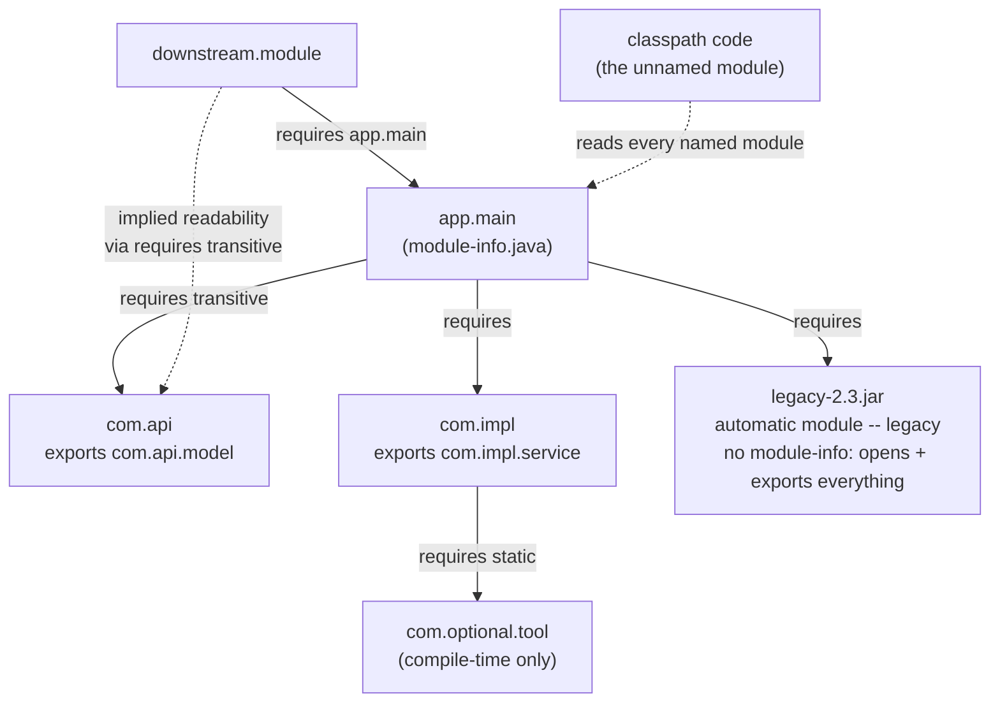
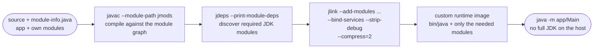
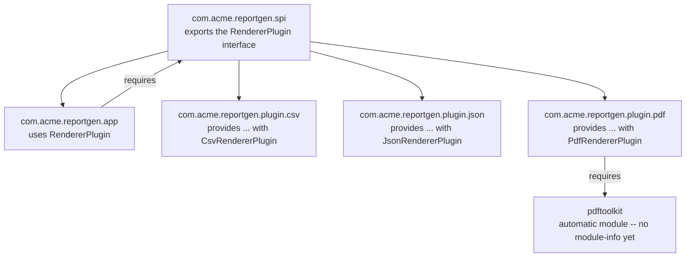

# Java Platform Module System (JPMS)

## 1. Concept Overview

The Java Platform Module System (JPMS), delivered by Project Jigsaw, is Java's built-in unit of encapsulation and dependency management above the package level. It shipped in **Java 9 (GA September 21, 2017)** as **JEP 261 ("Module System")**, backed by the umbrella JEP 200 ("The Modular JDK"). Before JPMS, a "module" was really just a JAR file: an unordered bag of classes with no compiler-enforced boundary, no declared dependencies, and no distinction between "this class is my public API" and "this class is an implementation detail I never wanted you to touch." JPMS adds a real unit — the module, described by a `module-info.java` file — that names itself, declares what it `requires` from other modules, and declares what it `exports` (and, separately, what it `opens` for reflection).

The JDK itself was the first and largest adopter: the old monolithic `rt.jar` was split into roughly 95 platform modules (`java.base`, `java.sql`, `java.xml`, `java.logging`, `java.desktop`, and more), each with its own `module-info.java`. That split is what makes `jlink` possible — a tool that assembles a custom runtime image containing only the modules an application actually needs instead of shipping the entire JDK, routinely cutting a deployed runtime from several hundred megabytes down to well under 100MB.

This module covers the full directive set (`requires`, `requires transitive`, `requires static`, `exports`, `exports ... to`, `opens`, `opens ... to`, `uses`, `provides ... with`), the module path vs. the classpath, automatic modules and the unnamed module, the split-package problem, the multi-year strong-encapsulation rollout (`--illegal-access`, removed in Java 17 via JEP 403), `ServiceLoader`-based service provisioning, and the two tools every migration project reaches for: `jdeps` (dependency analysis) and `jlink` (custom runtime images).

---

## 2. Intuition

> **One-line analogy**: A pre-JPMS classpath is an office with no interior walls — every desk can read every other desk's paperwork; JPMS adds real interior walls (`exports`) and separately-keyed doors for auditors (`opens`), so a team's private drafts stay private unless a door is explicitly cut for a specific visitor.

**Mental model**: Think of the module graph as a directed acyclic graph of `requires` edges, resolved twice — once at compile time (`javac`) and once at launch, before your `main()` method ever runs. A missing or conflicting module is a boot-time failure with a clear diagnostic, not a `NoClassDefFoundError` three hours into a batch job. Two independent axes control what one module can do with another's code: **readability** (do I `require` you, so I can even see your module exists) and **accessibility** (did you `export` the specific package I want, so I can reference its public types). A third axis, **reflective accessibility** (did you `open` the package), gates deep reflection independently of the first two.

**Why it matters**: Java 9 GA'd in 2017, but as of 2026 a large share of production Java services still run entirely on the classpath (the "unnamed module") rather than a real module graph — full modularization is a multi-quarter migration for anything with a nontrivial dependency tree. That gap is exactly why JPMS interview questions are so often answered shakily: candidates know the keywords but have never had to fix an `InaccessibleObjectException` or explain why `--add-opens` exists. Understanding automatic modules and the unnamed module is what actually lets you reason about a codebase that is only *partially* modularized, which is the normal state of things.

**Key insight**: `exports` and `opens` are independent grants, not a hierarchy — `exports` alone gives compile-time access and normal reflection on **public** members only; it does **not** let anyone call `setAccessible(true)` to reach a private field or a non-public constructor. That single fact is why frameworks that do field-level reflection (Jackson, Hibernate, Spring) fail with `InaccessibleObjectException` on a package that is merely `exports`ed, and why the fix is `opens`, not a bigger `exports`.

---

## 3. Core Principles

- **Module = name + requires + exports (+ opens/uses/provides)**: a `module-info.java` is the single source of truth for a module's dependencies and public surface — no more implicit contracts encoded only in documentation.
- **Two independent visibility axes**: readability (`requires`) gates whether a module can see another module at all; accessibility (`exports`) gates whether it can reference a specific package's public types. Missing either produces a different failure — missing `requires` fails module resolution at launch, missing `exports` fails compilation with "package is not visible."
- **Reflective accessibility is a third, separate gate**: `opens` is required for `setAccessible(true)` deep reflection, independent of `exports`. A package can be `exports`ed but not `opens`ed (normal API, no reflection), `opens`ed but not `exports`ed (reflection-only, e.g. entity classes only ever touched by an ORM), or both.
- **Reliable configuration**: the full dependency graph is validated when the JVM boots — a missing module, a duplicate module name, or a split package fails fast with a diagnostic before `main()` runs, instead of surfacing as a runtime `ClassNotFoundException` deep in a call stack.
- **Strong encapsulation by default**: only `exports`ed packages are accessible outside a module; everything else — including formerly-reflectable JDK internals such as the package behind `sun.misc.Unsafe` — is invisible unless explicitly opened.
- **The readability graph must be acyclic**: two named modules cannot directly or transitively `requires` each other (the compiler rejects it as a cyclic dependency); `uses`/`provides` (services) is the escape hatch for genuinely circular-feeling relationships because it resolves at runtime, not compile time.
- **Automatic modules and the unnamed module are bridges, not goals**: they exist so an unmodularized JAR (automatic module, on the module path) or the entire classpath (unnamed module) can participate in the graph while a codebase migrates incrementally.

---

## 4. Types / Architectures / Strategies

### 4.1 Three Kinds of Modules

| Kind | How it's declared | Reads | Exports | Opens for reflection |
|------|-------------------|-------|---------|----------------------|
| Named module | `module-info.java` compiled into the artifact | only modules it explicitly `requires` | only packages it explicitly `exports` | only packages it explicitly `opens` (or every package, via `open module`) |
| Automatic module | a plain JAR with no `module-info.class`, placed on the **module path** | every other module (implicitly requires all) | every package it contains, to everyone | every package it contains, to everyone (treated as fully open) |
| Unnamed module | any code on the **classpath** | every named and automatic module | not applicable — it has no name for others to require | its packages are open to everyone; named modules generally cannot see into it |

An automatic module's name comes from the JAR manifest's `Automatic-Module-Name` attribute if present; otherwise the JDK derives it from the filename by stripping the `.jar` extension and any trailing version-like suffix (`guava-31.1-jre.jar` derives to module name `guava`; `jackson-databind-2.15.2.jar` derives to `jackson.databind`). Because the derived name changes if the filename or version scheme changes, and because it can differ from whatever name the library eventually publishes once it fully modularizes, `Automatic-Module-Name` is a stability promise, not a formality — this is precisely why well-maintained libraries publish it years before shipping a real `module-info.java`.

### 4.2 `module-info.java` Directive Reference

| Directive | Compile time | Run time | Typical use |
|-----------|:---:|:---:|-------------|
| `requires com.foo;` | required | required (or boot fails) | a hard, mandatory dependency |
| `requires transitive com.foo;` | required | required | a dependency whose types appear in *your own* exported API — implied readability, so callers don't have to `requires` it themselves |
| `requires static com.foo;` | required | optional | compile-time-only or optional-at-runtime dependency (annotation-only JARs, optional integrations) |
| `requires transitive static com.foo;` | required | optional | rare combination: both implied readability and optional at runtime |
| `exports com.foo.api;` | n/a | n/a | unqualified export — every module that reads this one can use `com.foo.api`'s public types |
| `exports com.foo.internal to com.foo.friend;` | n/a | n/a | qualified export — only the named module(s) can use it |
| `opens com.foo.entity;` | n/a | n/a | unqualified opens — any reader can deep-reflect into `com.foo.entity`, but it is NOT exported (no compile-time reference) unless also exported |
| `opens com.foo.dto to com.fasterxml.jackson.databind;` | n/a | n/a | qualified opens — only Jackson gets deep reflection |
| `open module com.foo { ... }` | n/a | n/a | the whole module is implicitly `opens` on every package — convenient for pure entity/DTO modules, at the cost of all reflective encapsulation |
| `uses com.foo.spi.Plugin;` | n/a | n/a | declares this module consumes a service via `ServiceLoader.load(Plugin.class)` |
| `provides com.foo.spi.Plugin with com.foo.impl.PluginImpl;` | n/a | n/a | declares this module supplies a service implementation |

### 4.3 Module Path vs. Classpath

| Aspect | Classpath (unnamed module) | Module path (named/automatic modules) |
|--------|----------------------------|----------------------------------------|
| Encapsulation | none — every public type in every JAR is visible to every other JAR | strong — only `exports`ed packages are visible outside a module |
| Duplicate/split package | silently first-wins by classloading order (classic "JAR hell") | hard failure at launch — module resolution refuses to build the graph |
| Missing dependency | surfaces late, as `ClassNotFoundException`/`NoClassDefFoundError` at first use | surfaces immediately at JVM bootstrap, before `main()` |
| Deep reflection | unrestricted pre-Java 9; warn-then-allow Java 9-15; blocked by default Java 16+ unless `--add-opens` | blocked by default unless the target package is `opens`ed |
| Compile/run flags | `-classpath` / `-cp` | `--module-path` / `-p` |
| Versioning | arbitrary duplicate versions silently shadow each other | one version of a given module name per configuration |

### 4.4 Migration Strategies

- **Bottom-up**: modularize the artifacts with no dependencies on the rest of your own codebase first (shared "commons"/utility libraries), then work upward through the dependency graph until the top-level application module is modularized last. Every step produces a real, fully-encapsulated module, but progress stalls the moment a leaf dependency is a third-party JAR that isn't modularized yet — bridge it with an automatic module in the meantime.
- **Top-down**: modularize your own entry-point application module first, put every unmodularized dependency on the module path as an automatic module, and start writing real `requires`/`exports` for your own code immediately. Replace each automatic-module dependency with the library's real module once it ships one. This is the more common path in practice, because most teams do not control the majority of their dependency graph.
- **Hybrid / unnamed-module bridge**: run with both `--class-path` and `--module-path` at once. Some artifacts sit on the module path (named or automatic), the rest stay on the classpath (unnamed module) — this is how most real migrations actually proceed, module by module, over quarters rather than as a single cutover.

---

## 5. Architecture Diagrams

### Module Graph and Readability



`app.main`'s `requires transitive` on `com.api` means `downstream.module`, which only declares `requires app.main`, automatically reads `com.api` too — without that `transitive`, `downstream.module` would fail to compile the moment it touched a `com.api` type returned from one of `app.main`'s methods. `com.optional.tool` is required at compile time only (`requires static`) and may be absent at launch. `legacy-2.3.jar` has no `module-info.class`, so placing it on the module path turns it into an automatic module that reads everything and exports/opens everything it contains.

### Exports vs. Opens — the Accessibility Grid

```
module com.b declares three packages at three different visibility levels:

  com.b.api        exports com.b.api;             (exported, not opened)
  com.b.entity     opens   com.b.entity to A;      (opened to module A only, not exported)
  com.b.internal   (neither exported nor opened)

                                     api-call  api-refl  ent-refl  int-refl
                                    --------- --------- --------- ---------
  A: requires com.b                         Y         N         Y         N
  C: no requires com.b                      N         N         N         N
  unnamed (classpath), default              Y         N         N         N
  unnamed (classpath), --add-opens*         Y         N         N         Y

  call = direct compile-time reference / normal method call on a public member
  refl = Field/Method.setAccessible(true) deep reflection into a non-public member
  Y = allowed    N = blocked (compile error, or InaccessibleObjectException at runtime)
  * --add-opens com.b/com.b.internal=ALL-UNNAMED -- opens int-refl for classpath code only
```

Row A is the whole lesson in four cells: `api-call=Y` but `api-refl=N` (exported is not opened), while `ent-refl=Y` but `ent-call=N` (opened is not exported) — the two directives grant *opposite* things. Row C shows readability is a prerequisite gate: a module that never reads `com.b` gets nothing, not even the exported API. The last row shows `--add-opens` is narrowly scoped — it flips exactly the one named package, for exactly the caller named on the command line, and nothing else.

**In plain terms.** "Every cell in this grid is one AND of two independent conditions — does the caller *read* the module at all, and is this specific package released at the specific *depth* the caller is asking for — so a `N` never tells you which of the two failed."

That is why JPMS access errors are so confusing in practice. `InaccessibleObjectException` and "package is not visible" are the same underlying gate reporting from different sides, and the fix is different depending on which condition was false.

| Symbol | What it is |
|--------|------------|
| readability | Does the caller declare `requires com.b` (or is it the unnamed module, which reads everything)? |
| `exports` | Releases a package at *call* depth — public members of public types only |
| `opens` | Releases a package at *reflect* depth — `setAccessible(true)` on any member |
| `to <module>` | Narrows either directive from "everyone" to one named module |
| the AND | Both conditions must hold; neither directive implies readability, and readability implies neither directive |

**Walk one example.** Evaluate the two conditions separately for four of the grid's cells:

```
  cell                    readability?   package released at that depth?   result
  A / api-call            Y (requires)   Y (exports com.b.api)              Y
  A / api-refl            Y (requires)   N (exported, never opened)         N
  A / ent-refl            Y (requires)   Y (opens com.b.entity to A)        Y
  C / api-call            N (no requires) Y (exports com.b.api)             N

  the two failures have DIFFERENT fixes:
      A / api-refl  ->  add  opens com.b.api to A;        (change the depth)
      C / api-call  ->  add  requires com.b;              (change the readability)

  note ent-call is N even though ent-refl is Y:
      opens grants reflect depth WITHOUT granting call depth -- the two
      directives are not nested, they are orthogonal
```

The last note is the counter-intuitive one. It is natural to assume reflective
access is strictly stronger than a normal call, so `opens` should imply
`exports`, but the module system deliberately keeps them separate: a package can
be handed to a serialization library for reflection while remaining
uncompilable-against for everyone, which is exactly what you want for a DTO
package.

### `jlink` Pipeline



`jdeps` tells you *which* JDK modules to ask for; `jlink` follows the `requires` graph from `--add-modules` and assembles a self-contained runtime — `--bind-services` additionally pulls in any module that only shows up via a `provides`/`uses` service edge, which the default resolution otherwise ignores (see Section 6 and the Section 14 case study for the incident this causes when it's forgotten).

---

## 6. How It Works — Detailed Mechanics

### `module-info.java` — the Full Directive Set

```java
// module-info.java -- placed at the root of the module's source tree
module com.acme.orders {
    // requires: a hard, mandatory dependency, checked at compile time AND at launch.
    requires java.sql;

    // requires transitive: anyone who requires com.acme.orders ALSO reads
    // com.acme.pricing.api without declaring it themselves -- needed whenever
    // a type from com.acme.pricing.api appears in com.acme.orders' own
    // exported method signatures (a parameter or return type).
    requires transitive com.acme.pricing.api;

    // requires static: needed to compile against (e.g. an annotation-only
    // jar), but the module system will not fail to launch if it's absent.
    requires static com.acme.tooling.annotations;

    // exports: unqualified -- every module that reads com.acme.orders can
    // use the public types in com.acme.orders.api.
    exports com.acme.orders.api;

    // exports ... to: qualified -- only the named module(s) can use it.
    exports com.acme.orders.internal to com.acme.orders.test;

    // opens: grants deep reflection (setAccessible(true)) into the package,
    // in addition to whatever exports already grants (here: nothing, since
    // this package is not exported -- reflection-only access).
    opens com.acme.orders.entity;

    // opens ... to: qualified -- only Jackson may deep-reflect these DTOs.
    opens com.acme.orders.dto to com.fasterxml.jackson.databind;

    // uses / provides: see the Services subsection below.
    uses com.acme.orders.spi.DiscountStrategy;
    provides com.acme.orders.spi.DiscountStrategy
        with com.acme.orders.impl.DefaultDiscountStrategy;
}
```

### Module Resolution — How the Graph Gets Built

At launch, the JVM starts from a set of **root modules** (the module named after `-m`/`--module`, plus anything named in `--add-modules`), then walks every `requires` edge transitively, pulling in each required module's own requirements, and so on, until the graph is complete. `java.base` is implicitly required by every module and never needs to be declared. If any edge cannot be satisfied — the module simply isn't found on the module path or in the JDK image — resolution fails immediately with a diagnostic naming the missing module, before `main()` runs. Two named modules cannot form a cycle: `module a { requires b; }` and `module b { requires a; }` together are rejected by `javac` as a cyclic dependency. Services (`uses`/`provides`) sidestep this entirely because they are resolved at runtime through `ServiceLoader`, not through the compile-time `requires` graph, so a "circular"-feeling plugin relationship is fine as long as it's expressed as a service rather than a direct `requires`.

### Automatic Modules — the Bridge for Unmodularized JARs

Placing a plain JAR (no `module-info.class`) on the module path turns it into an **automatic module**. The JDK grants it maximum permissiveness so it behaves as much like its old classpath self as possible: it implicitly `requires` every other module in the configuration (so it will never fail to compile against something it references), and it `exports` **and** `opens` every package it contains, to every reader. This is deliberately generous — the module system has no descriptor to tell it which of the JAR's packages are "really" internal, so it treats all of them as public and reflectable, matching pre-JPMS behavior. The tradeoff is that an automatic module gives you none of JPMS's actual encapsulation benefits; it exists purely to let unmodularized code sit on the module path while the rest of your graph modularizes.

### The Unnamed Module — Classpath Code's Home

Every class loaded from the classpath (rather than the module path) belongs to the **unnamed module**. It reads every named and automatic module automatically — classpath code can call any `exports`ed API of any module without declaring anything. The relationship is one-directional: a named module generally cannot see classpath types, because there is no module name to put in a `requires` clause for "the classpath." (A named module *can* be granted read access to the unnamed module with the `--add-reads app.module=ALL-UNNAMED` flag, but this is rare — it inverts the usual direction of the problem, which is classpath code wanting to reach into named/JDK-internal packages, not the other way around.) Deep reflection from the unnamed module into a named module's package still requires that package to be `opens`ed to it specifically, or opened globally via `--add-opens target/pkg=ALL-UNNAMED` — readability alone (which the unnamed module always has) is not enough for `setAccessible(true)`, exactly as shown in the accessibility grid above.

### Split Packages — Why Two Modules Can't Share One

A **split package** is the same package name declared by more than one module. JPMS forbids this outright: if two modules on the module path both contain (whether or not they both `exports`) a package with the same name, the module system refuses to build the readability graph and the JVM aborts before `main()` runs, throwing a `java.lang.module.ResolutionException` (or `FindException`, depending on which resolution phase detects it) naming both modules and the shared package. There is no merge, no "last one wins" — that silent-shadowing behavior is exactly what the classpath does, and it is exactly what JPMS was built to stop, because a silently-shadowed class is a production bug waiting to happen. The practical rule is simple and non-negotiable: two named modules must never declare types in the same package, full stop; if you inherit this situation from pre-modularization code, the fix is to rename the package in one of the modules.

### Strong Encapsulation and the `--illegal-access` Rollout (Java 9 to 17)

JPMS strongly encapsulates JDK internals by default — packages like the ones behind `sun.misc.Unsafe` or `jdk.internal.*` are simply not `exports`ed, so ordinary code cannot reference or reflect into them. Because a huge amount of the Java ecosystem (old versions of Mockito, Spring, various serialization libraries) had quietly depended on exactly that kind of reflective access for years, Java 9 shipped a compatibility escape hatch, the `--illegal-access` flag, so upgrades wouldn't break overnight:

| Java version | `--illegal-access` behavior |
|---|---|
| 9-15 | flag defaults to `permit` — illegal reflective access from the classpath into JDK internals is allowed, with one warning per package the first time it happens |
| 9-15 (explicit) | `warn` (warn every time), `debug` (warn with a stack trace), `deny` (behave like real strong encapsulation) were also selectable |
| 16 (JEP 396) | default flips from `permit` to `deny` — illegal reflective access is now blocked unless explicitly opted into with `--add-opens` |
| 17 (JEP 403, LTS) | the `--illegal-access` flag is **removed outright** — there is no longer an ecosystem-wide bypass switch; `--add-opens`/`--add-exports`, applied per module and per package, are the only remaining mechanism |

The practical consequence: any code that relied on the Java 9-15 default's silent tolerance has to be fixed (or explicitly granted `--add-opens`) before it can run on Java 17+. This is the single most common "why did our Java 17 upgrade break" story in production (see Section 10).

### Services: `uses` / `provides ... with` + `ServiceLoader`

```java
// com.acme.orders.spi -- the service interface, in its own small module
package com.acme.orders.spi;
public interface DiscountStrategy {
    BigDecimal apply(Order order);
}

// com.acme.orders.impl -- a provider module
module com.acme.orders.impl {
    requires com.acme.orders.spi;
    provides com.acme.orders.spi.DiscountStrategy
        with com.acme.orders.impl.DefaultDiscountStrategy;
}

// com.acme.orders -- the consumer module
module com.acme.orders {
    requires com.acme.orders.spi;
    uses com.acme.orders.spi.DiscountStrategy;   // permits the reflective ServiceLoader lookup
}

// Consumer code -- identical whether providers come from named modules,
// automatic modules, or the classpath:
ServiceLoader<DiscountStrategy> loader = ServiceLoader.load(DiscountStrategy.class);
for (DiscountStrategy strategy : loader) {
    total = strategy.apply(order);
}
```

`uses` exists because `ServiceLoader.load()` is itself implemented with reflection; declaring `uses` is how a module tells the module system "yes, I intend this specific reflective lookup, permit it" without opening the package to arbitrary reflection. Discovery is source-dependent: a **named module**'s providers must be declared with `provides ... with` in its `module-info.java` — a legacy `META-INF/services/com.acme.orders.spi.DiscountStrategy` file bundled inside a named module's JAR is silently ignored. An **automatic module** or classpath JAR still uses the classic `META-INF/services/<interface>` file, because it has no `module-info.java` to declare `provides` in. `ServiceLoader.load()` transparently discovers providers through whichever mechanism applies, which is exactly why migrating a plugin system to JPMS requires zero changes to the consumer's `ServiceLoader.load()` call site — only to how providers register themselves.

### `jlink` — Building a Custom Runtime Image

```bash
jlink --module-path "$JAVA_HOME/jmods:mods" \
      --add-modules com.acme.orders.app \
      --bind-services \
      --strip-debug --no-header-files --no-man-pages --compress=2 \
      --output image/orders-runtime
```

`jlink` starts from the modules named in `--add-modules`, walks their `requires` edges (exactly like the JVM's own module resolution), and copies only those modules — plus a minimal launcher (`bin/java`) and support files — into an output directory that is a complete, runnable JVM by itself. A full JDK ships on the order of 95 platform modules and commonly weighs several hundred megabytes; an image built for an app that only touches `java.base`, `java.logging`, and a handful of others frequently lands under 100MB — the exact reduction depends entirely on how many modules the app's `requires` graph actually reaches. `--bind-services` additionally includes any module that only appears via a `provides`/`uses` edge (ordinary resolution follows `requires` only, so service-provider-only modules are otherwise silently dropped — see the Broken/Fix and case study below). `--strip-debug`, `--no-header-files`, and `--no-man-pages` trim further; `--compress=2` compresses the image's resources (the accepted values for this flag have changed across JDK releases — check `jlink --help` for the exact syntax on your version).

### `jdeps` — Static Dependency Analysis

| Command | What it tells you |
|---|---|
| `jdeps --list-deps app.jar` | which modules (JDK and otherwise) the classes in `app.jar` actually reference |
| `jdeps --jdk-internals app.jar` | usage of internal, unsupported JDK APIs (e.g. `sun.*`) that will break on a version upgrade |
| `jdeps --generate-module-info out/ app.jar` | scaffolds a starter `module-info.java` from the JAR's real, observed imports — a common first step when modularizing an existing artifact |
| `jdeps --print-module-deps app.jar` | a comma-separated module list, ready to paste straight into `jlink --add-modules` |

`jdeps` is static bytecode analysis: it sees every `import`-driven and directly-referenced dependency, but it cannot see a class loaded purely by a runtime string (`Class.forName("some.Driver")`) or a service provider that's only ever reached through `ServiceLoader`. That blind spot is exactly why a `jlink` image built from `jdeps`'s suggested module list can still be missing a module that only participates through a service — the case study below walks through exactly this failure.

### Broken -> Fix: `InaccessibleObjectException` from a Missing `opens`

```java
// module-info.java -- BROKEN: exports the DTO package, but does not open it.
module com.acme.orders {
    requires com.fasterxml.jackson.databind;
    exports com.acme.orders.dto;
}
```

```
// At runtime, ObjectMapper tries to bind a private final field directly:
java.lang.reflect.InaccessibleObjectException: Unable to make field
  private final java.lang.String com.acme.orders.dto.OrderDto.id accessible:
  module com.acme.orders does not "opens com.acme.orders.dto" to module
  com.fasterxml.jackson.databind
```

`exports` grants Jackson compile-time visibility and the ability to call `OrderDto`'s public accessors — but the instant `OrderDto` has a private field with no public setter (or Jackson is configured for field-based binding, or the record's canonical constructor needs `setAccessible` to invoke), Jackson has to reach past `public` with `setAccessible(true)`, and that specific operation needs `opens`, not `exports`.

```java
// FIX: open the package specifically to the module that needs deep reflection.
module com.acme.orders {
    requires com.fasterxml.jackson.databind;
    exports com.acme.orders.dto;
    opens   com.acme.orders.dto to com.fasterxml.jackson.databind;
}
```

```bash
# Emergency command-line fix when you can't edit a third-party module's descriptor:
java --add-opens com.acme.orders/com.acme.orders.dto=com.fasterxml.jackson.databind -jar app.jar
```

### Broken -> Fix: Split Package at Module-Graph Resolution

```java
// module-a/module-info.java
module com.acme.a { exports com.acme.util; }
// module-b/module-info.java
module com.acme.b { exports com.acme.util; }
```

```
$ java -p mods -m com.acme.a/com.acme.a.Main
Error occurred during initialization of boot layer
java.lang.module.ResolutionException: Module com.acme.a and module com.acme.b
  both contain package com.acme.util
```

Both modules declare `com.acme.util`. At launch the resolver detects the collision and aborts before `main()` runs — the module system does not merge or silently pick one, unlike the classpath's last-one-wins behavior. The fix is a rename, not a flag: rename the package in one of the modules (`com.acme.b.util`), because packages cannot be shared or merged across named modules by design — a class must resolve to exactly one owning module.

---

## 7. Real-World Examples

- **The JDK itself**: `rt.jar` became roughly 95 platform modules (`java.base`, `java.sql`, `java.xml`, `java.logging`, `java.net.http`, `java.desktop`, and more) — the modularization that makes `jlink` possible in the first place.
- **`jlink` in containerized deployments**: teams building microservice images use `jlink` to ship a custom runtime instead of a full-JDK base image, shrinking image size and attack surface (fewer JDK classes present means fewer potential CVEs to patch).
- **Frameworks that need `opens`**: Spring (constructor/field injection via reflection), Hibernate/JPA (private-field access on entities, lazy-loading proxies), Jackson (private-field (de)serialization), and Mockito (mocking, historically via `sun.misc.Unsafe`/Objenesis) all require deep reflection into application code they don't own, which is precisely what `opens` exists to grant safely.
- **`jdeps` in upgrade projects**: run in CI ahead of an LTS-to-LTS jump (11 to 17, 17 to 21) to catch usage of internal, unsupported APIs before it becomes a startup failure.
- **`ServiceLoader`/SPI in the JDK itself**: JDBC 4+ driver auto-registration (`java.sql.Driver`), JCA/JCE cryptography providers, and `javax.sound` providers all predate JPMS but map directly onto `uses`/`provides` once modularized.

---

## 8. Tradeoffs

| Approach | Benefit | Cost |
|---|---|---|
| Full JPMS modularization | Compiler-enforced encapsulation; reliable configuration; `jlink`-able | Migration cost scales with third-party dependency count; many libraries remain classpath-only |
| Automatic modules (bridge) | Unblocks module-path adoption without waiting on upstream | No real encapsulation — exports and opens everything; a placeholder, not a destination |
| Unnamed module / classpath only | Zero migration cost; behaves like pre-Java-9 Java | No compile-time safety net; split packages and missing dependencies surface at runtime, not build time |
| Qualified `opens ... to` | Minimal blast radius — only the named module gets deep reflection | Must be updated whenever a new consumer needs reflection |
| `open module` (whole-module) | One line covers every package; simple for pure entity/DTO modules | Forfeits encapsulation for the entire module, including packages that never needed it |
| Bottom-up migration | Every completed step is a real, fully-encapsulated module | Slow; blocked whenever a leaf dependency is an unmodularized third-party JAR |
| Top-down migration | Unblocks your own code immediately via automatic modules | Automatic-module names can churn once the upstream library ships its real name |
| `jlink` custom runtime image | Smaller image, faster cold start, smaller CVE surface | Another build artifact to maintain; `--bind-services`/`--add-modules` must track service dependencies |

---

## 9. When to Use / When NOT to Use

**Use JPMS when**:
- Building a plugin architecture where real isolation between plugins matters — `uses`/`provides` gives a genuine SPI boundary, not just a naming convention.
- Shipping a containerized service where image size and cold-start time matter — a `jlink` custom runtime image routinely beats a full-JDK base image by hundreds of megabytes.
- A large internal platform wants compiler-enforced boundaries between teams' modules instead of a comment asking people not to import an internal package.
- Publishing a library and wanting to strongly hide implementation packages from consumers, rather than merely documenting them as "internal."

**Do NOT force it when**:
- The app or library has many unmodularized third-party dependencies and full modularization would take longer than the value it returns in the app's remaining lifetime.
- The library is meant for the broadest possible compatibility and most consumers still deploy on the classpath — ship a real `module-info.java` and an `Automatic-Module-Name` for graceful degradation, but don't require the module path.
- The project is early-stage or a prototype — the unnamed module is a legitimate long-term home for plenty of real applications, not merely a waypoint on the way to "real" JPMS.

---

## 10. Common Pitfalls

### War Story 1: The Java 17 upgrade that broke reflection-heavy tooling
A platform team upgraded roughly 40 internal services from Java 11 to Java 17 in a single migration sprint. Six of those services shared a metrics library that reflectively read private fields inside `java.util.concurrent` internals — a workaround that predated a public API and had only ever produced a one-time warning under Java 11's default `--illegal-access=permit`. Java 17's JEP 403 removed that fallback entirely: all six services failed at startup with `InaccessibleObjectException`, forcing a rollback and a two-day delay while the metrics library was patched to stop reflecting into JDK internals.

### War Story 2: A split package invisible for years on the classpath
Two internal libraries, `commons-string-utils` and `commons-lang-extra`, had both declared classes under the identical package `com.acme.common.text` for years — invisible on the classpath, where the classloader silently picked whichever JAR happened to load first. The moment the platform team tried to move both onto the module path, the JVM refused to resolve the module graph, breaking every one of the 14 services that depended on both libraries simultaneously until one library renamed its package.

### War Story 3: A `jlink` image that silently shipped without its plugins
A reporting service's PDF-export plugin was implemented as a separate module discovered via `ServiceLoader`. The first `jlink` build used `--add-modules com.acme.reportgen.app` without `--bind-services`; the resulting image booted fine, but `ServiceLoader.load(RendererPlugin.class)` returned zero providers in production because default module resolution follows `requires` edges only, never `uses`/`provides` edges. The gap wasn't caught in testing because local runs used the full JDK, where every module was simply present. The incident (PDF export silently disabled) ran for about three hours before the missing `--bind-services` flag was identified.

### War Story 4: Automatic-module name churn broke eleven `requires` statements at once
A team wrote `requires jackson.databind;` against Jackson's auto-derived automatic-module name (from `jackson-databind-2.9.x.jar`, before it shipped an `Automatic-Module-Name` header). When the team later upgraded to a Jackson release that shipped a real `module-info.java` naming itself `com.fasterxml.jackson.databind`, every `requires jackson.databind;` statement across 11 internal modules broke simultaneously with "module not found" at compile time. A one-line manifest attribute published a release earlier would have prevented the entire incident, because the interim automatic name would already have matched the destination name.

---

## 11. Technologies & Tools

| Tool / Flag | Purpose |
|---|---|
| `module-info.java` | Declares a module's name, `requires`, `exports`, `opens`, `uses`, `provides` |
| `javac --module-path` / `-p` | Compile against a module path instead of (or alongside) the classpath |
| `java --module-path` / `--module` (`-m`) | Launch from the module path, naming the initial module and main class |
| `jlink` | Assemble a custom runtime image from a set of root modules |
| `jdeps` | Static dependency analyzer — module deps, JDK-internal API usage, `module-info` scaffolding |
| `jmod` | Packaging format/tool for modules that carry native libraries or config, used as `jlink` input |
| `--add-opens` / `--add-exports` / `--add-reads` | Command-line escape hatches granting reflection, accessibility, or readability without editing a module descriptor |
| `--add-modules` / `--bind-services` | Force extra modules — or every discoverable service-provider module — into resolution or a `jlink` image |
| `--patch-module` | Inject additional classes into an existing module (testing internals, patching) |
| `ServiceLoader` | Runtime API that discovers `provides ... with` (or `META-INF/services`) implementations |
| `javap -v` | Inspect a compiled `module-info.class`'s bytecode-level `Module` attribute directly |
| moditect (Maven/Gradle plugin) | Retrofits a `module-info.java` onto a third-party JAR that doesn't ship one |

---

## 12. Interview Questions with Answers

**What is the difference between `exports` and `opens` in a `module-info.java`?**
`exports` grants other modules compile-time and runtime access to a package's public types, while `opens` additionally grants runtime reflective access to non-public members via `setAccessible(true)`. A package can be exported without being opened (normal API use, no reflection allowed), opened without being exported (reflection-only, no direct compile-time reference), or both. Frameworks that reach into private fields or non-public constructors — Spring, Jackson, Hibernate — need `opens`, not just `exports`; grant it qualified to the specific framework module rather than to everyone.

**Why does `setAccessible(true)` throw `InaccessibleObjectException` on a package that is already `exports`ed?**
Because `exports` only grants access to a package's public members, and `setAccessible(true)` is specifically the mechanism for reaching non-public members. The module system checks a separate permission for that operation — whether the target package is `opens`ed to the caller's module — and throws `InaccessibleObjectException` naming both modules and the package when it isn't. The fix is adding an `opens ... to` directive (or the command-line equivalent, `--add-opens`), never widening `exports`.

**What is a split package, and why does JPMS forbid it outright?**
A split package is the same package name declared inside two different modules, and JPMS refuses to resolve a module graph that contains one. Allowing it would mean a class's owning module is ambiguous, and the JDK deliberately will not silently pick a winner the way the classpath does. The fix is always a rename — one of the two modules has to move its classes to a different package name; there is no configuration flag to permit a split package.

**What happens if two modules on the module path both export the same package?**
Module resolution fails at JVM bootstrap, before `main()` runs — the module system refuses to silently pick a winner. It aborts with a `java.lang.module.ResolutionException` (or `FindException`, depending on which resolution phase detects it), naming both modules and the shared package. Contrast this with the classpath, where the identical conflict silently resolves to whichever JAR the classloader happens to see first — exactly the "JAR hell" bug class JPMS exists to eliminate.

**What happened to `--illegal-access` across Java 9, 16, and 17?**
It was a temporary compatibility switch that let classpath code keep reflecting into JDK internals after Java 9 shipped. It defaulted to `permit` (warn once, then allow) in Java 9-15, flipped to `deny` by default in Java 16 (JEP 396), and was removed outright in Java 17 (JEP 403, LTS). After Java 17, the only way to grant reflective access into a package the module system would otherwise block is an explicit, per-module `--add-opens` (or an `opens` directive) — there is no more ecosystem-wide bypass. This is the single most common cause of "it broke on our Java 17 upgrade" incidents involving reflection-heavy libraries.

**What is an automatic module, and what access does it get by default?**
An automatic module is a plain JAR with no `module-info.class` that has been placed on the module path. The JDK derives a name for it — from `Automatic-Module-Name` in its manifest if present, otherwise from the filename — and treats it as reading every other module while exporting and opening every package it contains to everyone. It exists purely as a migration bridge, letting an unmodularized dependency participate in the module graph while you wait for it to ship a real module descriptor. It grants none of JPMS's actual encapsulation — that permissiveness is the point, since the JDK has no descriptor telling it which of the JAR's packages are meant to be internal.

**What is the unnamed module, and can a named module read it?**
The unnamed module is where all classpath code lives — it reads every named and automatic module automatically, so classpath code can call any module's exported API without declaring anything. The reverse generally does not hold: a named module cannot see classpath types by default, because there is no module name to put in a `requires` clause for "the classpath," though `--add-reads app.module=ALL-UNNAMED` can grant it explicitly in the rare case it's needed.

**What's the difference between `requires` and `requires transitive`, and when do you need the latter?**
Plain `requires` only gives your own module readability; `requires transitive` additionally gives that readability to anyone who requires *your* module, without them declaring it themselves. You need `transitive` specifically when a type from the required module appears in your own module's exported public API (a parameter or return type) — otherwise callers get a "package is not visible" compile error the moment they touch that type, even though they can call your method just fine.

**What does `requires static` do, and when is it used?**
`requires static` makes a dependency mandatory at compile time but optional at runtime — analogous to Maven's "provided" scope. It's used for annotation-only JARs (e.g. nullability or code-generation annotations) and optional integrations where the calling code only exercises the dependency along a rarely-hit path; if it's genuinely missing at runtime and that path executes anyway, you get a `NoClassDefFoundError` at that point rather than at module resolution.

**Is bottom-up or top-down migration more common in practice, and why?**
Top-down is more common, because it lets a team start immediately without waiting on third parties they don't control. Modularizing your own application module first, and bridging every unmodularized dependency as an automatic module, lets you start writing real `requires`/`exports` right away. Bottom-up — modularizing leaf dependencies first and working upward — produces fully-encapsulated modules at every step, but stalls hard the moment a leaf is a third-party JAR that hasn't modularized yet, which is why most teams reach for top-down instead.

**Does `ServiceLoader`/`META-INF/services` still work once an application is modularized?**
Only for automatic modules and classpath JARs — a named module's service providers must be declared with `provides ... with` in its `module-info.java`, and a legacy `META-INF/services/<interface>` file bundled inside a named module's JAR is silently ignored. `ServiceLoader.load()` itself is unchanged either way; only how providers register differs, which is why migrating a plugin loader to JPMS requires no change to the consumer's call site.

**What does `jlink` actually produce, and why is the resulting image smaller than the full JDK?**
`jlink` produces a self-contained runtime image containing only the modules an application actually needs. It starts from a set of root modules named in `--add-modules`, walks their `requires` edges, and packages only those modules plus a minimal `bin/java` launcher — not the roughly 95 modules that make up the full JDK. Because most applications only ever touch a handful of platform modules (`java.base`, `java.logging`, `java.sql`, and similar), the resulting image commonly lands well under 100MB where the full JDK is several hundred. `--bind-services` is required in addition to `--add-modules` whenever the app relies on `ServiceLoader`, because ordinary resolution follows `requires` edges only and silently drops service-provider-only modules.

**What is `jdeps` used for in a JDK version-upgrade project?**
`jdeps` performs static bytecode analysis to report exactly which modules an application's classes depend on. Its `--jdk-internals` flag specifically surfaces usage of unsupported, internal JDK APIs that are likely to break on the next version. Teams run it in CI ahead of an LTS-to-LTS jump (11 to 17, 17 to 21) to catch breakage before a deploy rather than after. Its blind spot is dynamic behavior — a class loaded via a runtime string, or a service provider reached only through `ServiceLoader` — because that isn't visible as a static reference in the bytecode.

**Can two named modules have a circular `requires` dependency?**
No — `javac` rejects `module a { requires b; }` and `module b { requires a; }` together as a cyclic dependency, because the readability graph must be a DAG. Services (`uses`/`provides`) are the sanctioned way to express a relationship that feels circular, since they're resolved at runtime through `ServiceLoader` rather than through the compile-time `requires` graph, which never has to reason about the cycle.

**What's the practical difference between the module path and the classpath?**
The module path enforces strong encapsulation and fails fast — missing dependencies, duplicate modules, and split packages all abort JVM bootstrap before `main()` runs with a clear diagnostic. The classpath has none of that: every public type in every JAR is visible to every other JAR, duplicate/split packages silently resolve by classloading order, and a missing class only surfaces as a `ClassNotFoundException` the first time something actually tries to use it, which can be long after startup.

**What is an `open module`, and when would you use it instead of per-package `opens`?**
An `open module` implicitly opens every package it contains for deep reflection, as if every package had its own `opens` directive, without exporting any of them by default. It's a reasonable shortcut for a module that is genuinely just data — JPA entities, plain DTOs — where there's no real logic to protect from reflection; for a module carrying real business logic, prefer per-package, qualified `opens ... to` so you aren't handing out reflective access to code that never needed it.

**Which classloader actually loads the classes inside a named module?**
JPMS reuses the JDK's existing three-loader hierarchy rather than introducing a new one. The Bootstrap classloader loads core platform modules, the Platform classloader loads the rest of the `java.se` platform modules, and the Application classloader loads both classpath JARs and the modules on the application module path. Being "named" vs. "unnamed" is metadata carried alongside a class, not a different loader — the one exception is the JDK's own platform modules, which load through the bootstrap/platform loaders exactly as before JPMS existed.

**Why was JPMS built in the first place — what was the actual pain before Java 9?**
Before Java 9, the classpath gave zero compiler-enforced encapsulation — any public class in any JAR was reachable from any other JAR. "Internal" packages like the ones behind `sun.misc.Unsafe` were reflectively accessible to anyone willing to risk it, and there was no way to ship a smaller JVM than the entire monolithic `rt.jar`. JPMS's three stated goals were reliable configuration (fail fast on a broken dependency graph instead of a runtime surprise), strong encapsulation (make "internal" a compiler fact, not a naming convention), and a scalable platform (`jlink` custom images). Adoption has been slower than the JDK team hoped specifically because so much of the ecosystem still ships classpath-only.

**Why should a library publish `Automatic-Module-Name` in its manifest before it ships a real `module-info.java`?**
Because the filename-derived automatic module name consumers would otherwise depend on can silently change later. Once the library ships its own real module name, every downstream `requires` statement written against the old, derived name breaks at once. Declaring `Automatic-Module-Name` early pins the name the library intends to use permanently, so the eventual transition to a fully named module is invisible to consumers who already wrote `requires` against that name.

---

## 13. Best Practices

1. **Prefer real modularization for your own code**; use automatic modules only as a temporary bridge for third-party dependencies you don't control.
2. **Use `requires transitive` only when a dependency's types appear in your own exported API's method signatures** — otherwise it's an implementation detail callers shouldn't be forced to read.
3. **Use `requires static` for compile-time-only or optional integrations** (annotation processors, optional feature libraries) so their absence at runtime doesn't break module resolution.
4. **Keep `opens` qualified** (`opens ... to specific.module`) rather than unqualified — grant reflection to the one framework module that needs it, not to the whole world.
5. **Reserve `open module` for modules that are genuinely just data** (JPA entities, DTOs); don't reach for it out of convenience on a module carrying real logic.
6. **Run `jdeps --jdk-internals` before every LTS-to-LTS upgrade** (11 to 17, 17 to 21) to catch internal-API usage before it becomes a startup failure.
7. **Publish `Automatic-Module-Name` in a library's manifest well before shipping a real `module-info.java`**, so downstream `requires` statements survive the eventual transition.
8. **Build `jlink` images with `--bind-services`** whenever the app uses `ServiceLoader`, or explicitly list every provider module in `--add-modules` — default resolution silently drops service-only modules.
9. **Never treat `--add-opens`/`--add-exports` command-line flags as a permanent fix** — they are a migration bridge; track and remove them once the real dependency is fixed.
10. **Avoid split packages across your own internal libraries from day one** — renaming a package after a dozen services depend on it is far more expensive than choosing distinct package roots up front.
11. **Test on the module path even if production still ships on the classpath** — resolution failures (split packages, missing dependencies) are cheap to catch in CI and expensive to discover after a deploy.
12. **Treat migration as incremental**: a hybrid classpath-plus-module-path deployment for several quarters is normal, not a sign the migration is behind schedule.

---

## 14. Case Study

### Modularizing a Plugin-Based Report Generator and Shipping It as a `jlink` Runtime Image

**Scenario.** `reportgen` is an internal report-generation service that loads output-format plugins (CSV, JSON, PDF) at runtime. For its first three years it shipped as a single classpath uber-JAR on `eclipse-temurin:21-jdk` (a full-JDK base image, ~450MB), discovering plugins via the classic `META-INF/services/com.acme.reportgen.spi.RendererPlugin` file. Cold-start time on a cache-miss node (image pull plus JVM start) averaged ~2.4s, and every deploy shipped roughly 95 JDK modules' worth of platform code for an app that used barely a dozen of them. The platform team modularized the app top-down over two sprints and replaced the full-JDK image with a `jlink` custom runtime, cutting the deployed image to ~95MB and cold start to ~1.1s.



#### The plugin contract and its three provider modules

```java
// com.acme.reportgen.spi/module-info.java
module com.acme.reportgen.spi {
    exports com.acme.reportgen.spi;
}

// com.acme.reportgen.spi/com/acme/reportgen/spi/RendererPlugin.java
package com.acme.reportgen.spi;
public interface RendererPlugin {
    String format();                 // "csv", "json", "pdf"
    byte[] render(ReportData data);
}
```

```java
// com.acme.reportgen.plugin.pdf/module-info.java
module com.acme.reportgen.plugin.pdf {
    requires com.acme.reportgen.spi;
    requires pdftoolkit;              // automatic module: pdftoolkit-4.1.jar has no module-info yet
    provides com.acme.reportgen.spi.RendererPlugin
        with com.acme.reportgen.plugin.pdf.PdfRendererPlugin;
}
```

```java
// com.acme.reportgen.app/module-info.java
module com.acme.reportgen.app {
    requires com.acme.reportgen.spi;
    requires java.sql;
    requires java.net.http;
    uses com.acme.reportgen.spi.RendererPlugin;
}

// Consumer code -- unchanged by the migration:
ServiceLoader<RendererPlugin> loader = ServiceLoader.load(RendererPlugin.class);
Map<String, RendererPlugin> renderers = loader.stream()
    .map(ServiceLoader.Provider::get)
    .collect(Collectors.toMap(RendererPlugin::format, Function.identity()));
// Before modularization, the exact same code discovered providers via
// META-INF/services/com.acme.reportgen.spi.RendererPlugin files on the classpath.
```

#### Discovering the module list, then the broken -> fixed `jlink` build

```bash
# jdeps reports which JDK modules the app module actually touches:
jdeps --print-module-deps --ignore-missing-deps target/reportgen-app.jar
# java.base,java.logging,java.net.http,java.sql,java.xml
```

```bash
# FIRST ATTEMPT -- BROKEN: default resolution follows `requires` edges only.
jlink --module-path "$JAVA_HOME/jmods:mods" \
      --add-modules com.acme.reportgen.app \
      --strip-debug --no-header-files --no-man-pages --compress=2 \
      --output image/reportgen-runtime
# Boots fine, but renderers.get("pdf") -> null: ServiceLoader found 0 providers.
# Unit tests never caught this because they ran on the full JDK, where every
# provider module was simply present -- jlink's own resolution is what dropped it.
```

```bash
# FIX: --bind-services links in every module that PROVIDES a used service,
# not just the ones reachable via `requires`.
jlink --module-path "$JAVA_HOME/jmods:mods" \
      --add-modules com.acme.reportgen.app \
      --bind-services \
      --strip-debug --no-header-files --no-man-pages --compress=2 \
      --output image/reportgen-runtime
# renderers now contains csv, json, and pdf -- all three provider modules included.
```

#### Multi-stage Docker build

```dockerfile
# ---- build stage: full JDK, used only to compile and jlink ----
FROM eclipse-temurin:21-jdk AS build
WORKDIR /src
COPY . .
RUN javac --module-path mods -d out $(find . -name '*.java') \
 && jlink --module-path "$JAVA_HOME/jmods:mods" \
          --add-modules com.acme.reportgen.app --bind-services \
          --strip-debug --no-header-files --no-man-pages --compress=2 \
          --output /image

# ---- runtime stage: no JDK at all, just the jlink image ----
FROM debian:bookworm-slim
COPY --from=build /image /opt/reportgen
ENTRYPOINT ["/opt/reportgen/bin/java", "-m", "com.acme.reportgen.app/com.acme.reportgen.Main"]
```

#### Results

```
                         Classpath uber-JAR        jlink runtime image
Base image               eclipse-temurin:21-jdk    debian:bookworm-slim + jlink
JDK modules shipped      ~95 (whole platform)      5 (base/logging/http/sql/xml)
Own modules shipped      1 fat jar, no boundaries  6 named modules
Deployed image size      ~450 MB                   ~95 MB
Cold start (cache miss)  ~2.4 s                     ~1.1 s
Plugin discovery         META-INF/services file    provides...with (ServiceLoader unchanged)
```

**Read it like this.** "Two of these rows shrank by very different factors — the image by about 4.7x but cold start by only about 2.2x — and that gap is the useful signal, because it says image pull was never the whole of cold start."

Reading the ratios against each other rather than each row on its own is what turns a results table into a next step. A single row tells you the change worked; the gap between rows tells you what is left.

| Symbol | What it is |
|--------|------------|
| modules shipped | Platform modules present in the image — ~95 (the whole JDK) versus 5 |
| image size | Bytes pulled onto a node that does not already have the layer cached |
| cold start | Image pull plus JVM start plus application init, on a cache-miss node |
| size ratio | 450 / 95 — how much less there is to pull |
| the residual | The part of cold start that does not scale with image size at all |

**Walk one example.** Take the three quantitative rows and reduce each to a ratio, then reconcile them:

```
  JDK modules      95  ->   5      -90 modules,  (95-5)/95   = 94.7 % fewer
  image size    450 MB  -> 95 MB   -355 MB,      (450-95)/450 = 78.9 % smaller
                                                  450/95      =  4.74x ratio
  cold start      2.4 s -> 1.1 s   -1.3 s,       (2.4-1.1)/2.4 = 54.2 % faster
                                                  2.4/1.1     =  2.18x ratio

  if cold start were PURELY image pull, it would have fallen by the same 4.74x:
      2.4 / 4.74 = 0.51 s        but the measured figure is 1.1 s

  so split cold start into a pull term P that scales and a fixed term F:
      P + F                = 2.4
      P/4.74 + F           = 1.1
      P (1 - 0.211)        = 1.3   ->  P = 1.65 s,  F = 0.75 s

  cross-check:  1.65/4.74 + 0.75 = 1.10 s   matches
```

So roughly 0.75 s of the remaining 1.1 s is JVM start plus application init and
will not move no matter how small the image gets. Shrinking the image further —
another `--compress` level, more `--strip` flags — is chasing a term that is
already down to 0.35 s. If cold start still matters after this, the next lever is
the 0.75 s residual, which is where AOT and class-data sharing live, not `jlink`.

Deployed image size dropped roughly 80% (~450MB to ~95MB); modules shipped dropped from the full ~95-module platform to 5 JDK modules plus the team's own 6. The `--bind-services` incident cost about three hours of partially-broken PDF export before the missing flag was identified — after that, `--bind-services` (or an explicit `--add-modules` list of every provider module) became a mandatory line item on the team's `jlink` build-review checklist.

#### Common Pitfalls (production war stories)

**1. `--bind-services` omitted from the `jlink` build.** Covered above in detail — the fix is one flag, but finding it took a production incident because dev/test environments ran on the full JDK, where the missing module simply didn't matter.

**2. The `pdftoolkit` automatic-module name didn't survive an upstream upgrade.** When `pdftoolkit` eventually shipped its own `module-info.java` naming itself `io.pdftoolkit.core` (not the filename-derived `pdftoolkit`), the plugin module's `requires pdftoolkit;` broke at the next dependency bump. Fix: re-run `jdeps --generate-module-info` (or check the release notes for a new `Automatic-Module-Name`) after any third-party upgrade, not only after JDK upgrades.

**3. A near-miss split package, caught by CI instead of production.** During the migration, `com.acme.reportgen.core` and a newly-extracted `com.acme.reportgen.metrics` module briefly both declared classes under `com.acme.reportgen.util`, copy-pasted from the same pre-modularization package. Building on the module path in CI failed the merge immediately with a module-resolution error; the classpath-only build, still running in parallel as a safety net, would have passed silently and hidden the conflict until someone deployed both modules together.

#### Interview Discussion Points

**Why did the deployed image shrink by roughly 80% with no application code changes?** The original image shipped the entire JDK because a classpath deployment has no way to know which of its ~95 modules are actually unused. `jlink` follows the real `requires` graph (plus `--bind-services` for service-only dependencies) and includes only those modules and their transitive dependencies — the rest of the platform simply isn't in the image.

**Why did `ServiceLoader.load()` need zero code changes across the migration?** Its public API abstracts over the discovery mechanism: on the classpath it reads `META-INF/services/<interface>` files, and inside a named module it reads `provides ... with` declarations instead. The call site is identical either way, which is exactly what let the team modularize the plugin loader without touching the code that consumes it.

**Why does `jlink`'s default resolution miss service-provider modules?** Because `requires` is an always-needed, compile-time dependency, while `uses`/`provides` is a loose, runtime-optional binding — a module can declare `uses X` and run perfectly well with zero providers present. `jlink` takes that looseness literally and will not assume you wanted every provider bundled, so `--bind-services` (or an explicit `--add-modules` list) has to say so.

**Was top-down or bottom-up migration used here, and why?** Top-down — the team modularized their own `reportgen` modules first and bridged every unmodularized third-party JAR, including `pdftoolkit`, as an automatic module, because they didn't control those libraries' release schedules and couldn't block the migration on upstream modularizing first.

**What would have caught the automatic-module name churn earlier?** Treating a third-party automatic module's derived name as unstable from day one — re-running `jdeps --generate-module-info` (or checking release notes for a newly-added `Automatic-Module-Name`) on every dependency upgrade, not only reacting once a `requires` statement actually breaks.

---

## Related / See Also

- [Java 9-21 Features](../java9_to_21_features/README.md) — where JPMS sits alongside records, sealed classes, and virtual threads in the broader Java 9-21 arc; a condensed directive summary lives there
- [JVM Internals](../jvm_internals/README.md) — class loading (bootstrap/platform/application loaders) that the module system's readability graph is layered on top of
- [Bytecode & Classfile](../bytecode_and_classfile/README.md) — `module-info.class`'s bytecode-level `Module` attribute, and `javap -v` to inspect it directly
