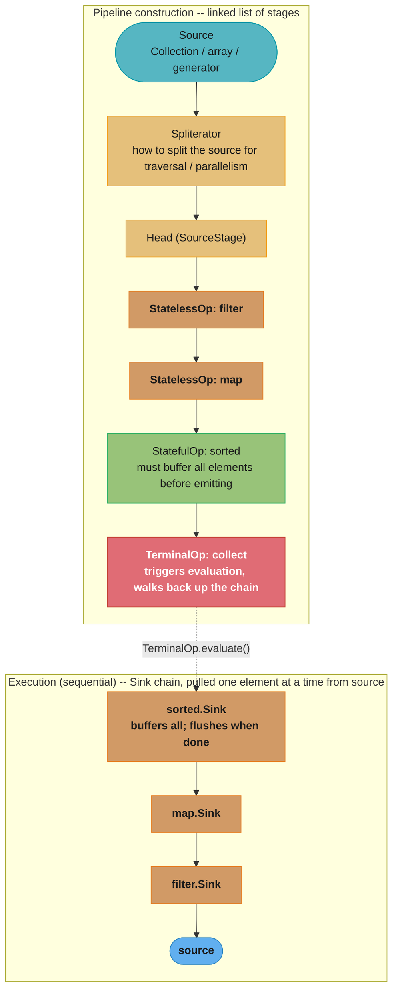
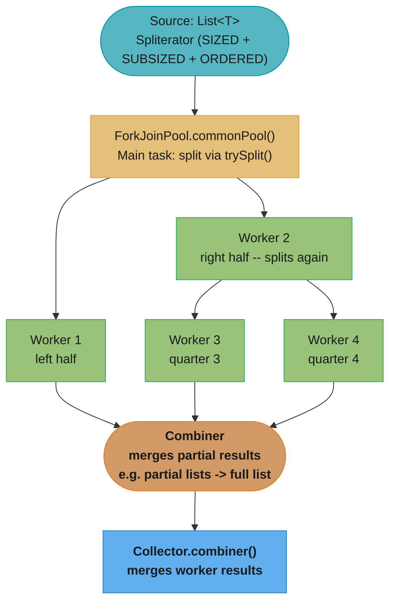
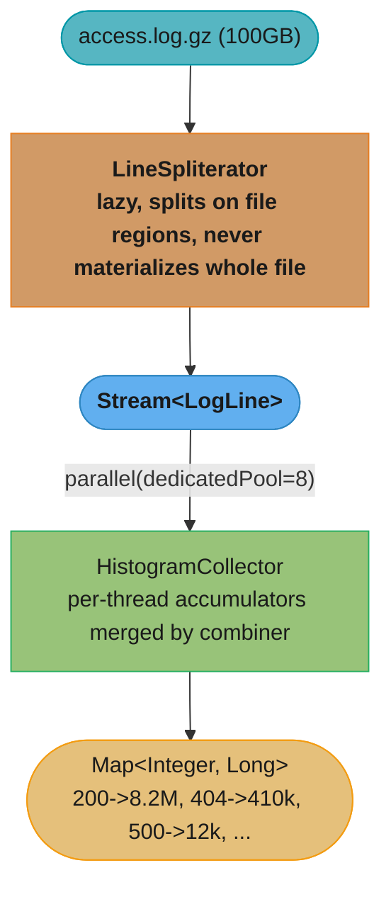

# Java Streams — Deep Dive

## 1. Concept Overview

The Stream API (`java.util.stream`, Java 8) is a functional-style pipeline for processing sequences of elements. A stream is **not a data structure** — it is a view over a data source (collection, array, I/O channel, generator) that describes a series of transformations. The pipeline is evaluated lazily: no work happens until a terminal operation is invoked, at which point the pipeline is fused and executed in a single pass where possible.

This module goes deeper than the `java8_features` overview — it covers the full operation set with nuances, the internal `ReferencePipeline` machinery, `Spliterator` and how it powers parallelism, numeric primitive streams (`IntStream`/`LongStream`/`DoubleStream`) to avoid boxing, `Collector` composition, and the rules for writing correct parallel pipelines.

---

## 2. Intuition

> **One-line analogy**: A stream pipeline is an assembly line — raw materials (source) travel through a series of stations (intermediate ops) and the finished product rolls off at the end (terminal op), with the factory not turning on until you place an order.

**Mental model**: Think of `stream().filter().map().collect()` as a description of work, not the work itself. When you call `.filter(p -> p.active)`, no element is tested. When you call `.collect(toList())`, the JVM fuses the pipeline — it creates one pass through the data, applying filter then map to each element one at a time, never materializing the intermediate results as collections. Short-circuit terminal ops (`findFirst`, `anyMatch`) can stop this pass early.

**Why it matters**: The difference between a `stateless` and a `stateful` intermediate operation determines whether your pipeline can be parallelized correctly. The difference between `map()` and `flatMap()` determines whether your code handles nested structures correctly. The difference between `reduce()` with and without an identity value determines whether you get an `Optional` or a value. These are real bugs in production code.

**Key insight**: `Stream` is a single-use pipeline. After a terminal operation, the stream is consumed — calling any operation on it throws `IllegalStateException`. This surprises developers who store streams in variables expecting to reuse them like collections.

---

## 3. Core Principles

- **Lazy evaluation**: Intermediate operations are not executed until a terminal operation triggers the pipeline.
- **Single-use**: A stream can be traversed only once. After consumption, it is closed.
- **Non-interference**: Stream operations must not modify the source during pipeline execution.
- **Stateless preferred**: Operations that don't depend on other elements (`filter`, `map`) are safer and more parallelizable than stateful ones (`sorted`, `distinct`, `limit`).
- **Pipeline fusion**: The JVM executes filter + map + limit as a single pass — no intermediate `List` is created.
- **Short-circuit**: Some operations (`findFirst`, `limit`, `anyMatch`) can terminate the pipeline before all elements are processed.

---

## 4. Types / Architectures / Strategies

### 4.1 Complete Intermediate Operations

| Operation | Type | Notes |
|-----------|------|-------|
| `filter(Predicate)` | Stateless | Drops elements that don't match |
| `map(Function)` | Stateless | 1-to-1 transformation |
| `mapToInt/Long/Double(ToIntFunction)` | Stateless | Produces primitive stream (avoids boxing) |
| `flatMap(Function<T, Stream<R>>)` | Stateless | 1-to-many; flattens nested streams |
| `flatMapToInt/Long/Double` | Stateless | flatMap to primitive stream |
| `peek(Consumer)` | Stateless | Side-effect for debugging; do not rely on for production logic |
| `distinct()` | Stateful | Uses `equals()`/`hashCode()`; requires seeing all elements |
| `sorted()` | Stateful | Natural order; must materialize full stream |
| `sorted(Comparator)` | Stateful | Custom order; must materialize full stream |
| `limit(long n)` | Short-circuit stateful | Stops after n elements |
| `skip(long n)` | Stateful | Discards first n elements |
| `takeWhile(Predicate)` | Short-circuit stateful | Java 9+; take while predicate holds, stop on first false |
| `dropWhile(Predicate)` | Stateful | Java 9+; drop while predicate holds, pass rest |
| `mapMulti(BiConsumer)` | Stateless | Java 16+; imperative flatMap (push elements into consumer) |

### 4.2 Complete Terminal Operations

| Operation | Returns | Short-circuit | Notes |
|-----------|---------|---------------|-------|
| `collect(Collector)` | `R` | No | Most powerful terminal op |
| `toList()` | `List<T>` | No | Java 16+; returns unmodifiable list directly |
| `forEach(Consumer)` | `void` | No | Order undefined in parallel |
| `forEachOrdered(Consumer)` | `void` | No | Maintains encounter order in parallel |
| `reduce(identity, BinaryOp)` | `T` | No | Fold with identity; always returns value |
| `reduce(BinaryOp)` | `Optional<T>` | No | Fold without identity; empty → empty Optional |
| `reduce(identity, BiFunction, BinaryOp)` | `U` | No | 3-arg: for type-changing reductions in parallel |
| `count()` | `long` | No | |
| `min(Comparator)` | `Optional<T>` | No | |
| `max(Comparator)` | `Optional<T>` | No | |
| `findFirst()` | `Optional<T>` | Yes | First in encounter order |
| `findAny()` | `Optional<T>` | Yes | Any element; faster in parallel |
| `anyMatch(Predicate)` | `boolean` | Yes | True if any matches |
| `allMatch(Predicate)` | `boolean` | Yes | True if all match |
| `noneMatch(Predicate)` | `boolean` | Yes | True if none match |
| `toArray()` | `Object[]` | No | |
| `toArray(IntFunction<A[]>)` | `A[]` | No | Typed array: `.toArray(String[]::new)` |
| `iterator()` | `Iterator<T>` | — | Escape hatch to imperative |
| `spliterator()` | `Spliterator<T>` | — | For custom parallel splitting |

### 4.3 Primitive Streams

| Type | Avoids Boxing | Extra Operations |
|------|-------------|-----------------|
| `IntStream` | `int` vs `Integer` | `sum()`, `average()`, `range(a,b)`, `rangeClosed(a,b)`, `summaryStatistics()` |
| `LongStream` | `long` vs `Long` | same |
| `DoubleStream` | `double` vs `Double` | same |

Conversions: `.mapToInt()`, `.mapToObj()`, `.boxed()`, `IntStream.of()`, `IntStream.range()`.

---

## 5. Architecture Diagrams

### Pipeline Internals — ReferencePipeline


### Short-Circuit Execution
```
List<Integer> nums = List.of(1, 2, 3, 4, 5, 6, 7, 8);

nums.stream()
  .filter(n -> { System.out.println("filter: " + n); return n % 2 == 0; })
  .map(n    -> { System.out.println("map: " + n);    return n * 10; })
  .findFirst();

Output:
  filter: 1   (odd, filtered out)
  filter: 2   (even, passes)
  map: 2      (mapped to 20)
  // DONE — findFirst() found 20, pipeline stops
  // elements 3-8 never processed
```

### Parallel Stream Fork/Join


### Spliterator Characteristics
```
ORDERED    - encounter order is meaningful; findFirst() is deterministic
DISTINCT   - no duplicates (e.g., Set's spliterator)
SORTED     - elements in sorted order
SIZED      - exact size known upfront (enables balanced parallel splits)
SUBSIZED   - split halves have known sizes too (better parallel balance)
NONNULL    - no null elements
IMMUTABLE  - source won't change during traversal
CONCURRENT - source can be concurrently modified safely
```

---

## 6. How It Works — Detailed Mechanics

### Creating Streams — All Sources

```java
// From Collection
list.stream()
list.parallelStream()

// From array
Arrays.stream(array)
Arrays.stream(array, fromIndex, toIndex)  // sub-range

// From values
Stream.of("a", "b", "c")
Stream.ofNullable(maybeNull)  // Java 9: empty if null

// Empty
Stream.empty()

// Infinite generators
Stream.iterate(0, n -> n + 1)              // 0, 1, 2, 3, ...
Stream.iterate(0, n -> n < 100, n -> n+1) // Java 9: with predicate (for-loop style)
Stream.generate(Math::random)             // infinite random doubles

// Numeric ranges
IntStream.range(0, 10)         // 0..9 (exclusive end)
IntStream.rangeClosed(1, 10)   // 1..10 (inclusive end)
LongStream.range(0L, 1_000_000_000L)

// From file (lazy line reading)
Files.lines(path, StandardCharsets.UTF_8)  // AutoCloseable stream

// From String
"hello world".chars()              // IntStream of char values
Pattern.compile("\\s+").splitAsStream("hello world")

// Concatenate streams
Stream.concat(stream1, stream2)

// Java 9: Stream.Builder
Stream.Builder<String> builder = Stream.builder();
builder.add("a"); builder.add("b");
Stream<String> s = builder.build();
```

### flatMap vs map — The Critical Difference

```java
// map: each element -> one output (1:1)
Stream<String> words = Stream.of("hello world", "foo bar");
Stream<String[]> arrays = words.map(s -> s.split(" "));
// Stream<String[]>: [["hello","world"], ["foo","bar"]]

// flatMap: each element -> Stream of outputs, all streams concatenated (1:N then flatten)
Stream<String> allWords = Stream.of("hello world", "foo bar")
    .flatMap(s -> Arrays.stream(s.split(" ")));
// Stream<String>: ["hello", "world", "foo", "bar"]

// flatMap in Optional (removes nesting Optional<Optional<T>>)
Optional<String> name = Optional.of("Alice");
Optional<String> upper = name.flatMap(s -> Optional.ofNullable(s.toUpperCase()));

// Common flatMap patterns:
// Flatten lists of lists
List<List<Integer>> nested = List.of(List.of(1,2), List.of(3,4));
List<Integer> flat = nested.stream().flatMap(Collection::stream).collect(toList());
// [1, 2, 3, 4]

// Expand each order to its line items
orders.stream()
    .flatMap(order -> order.getLineItems().stream())
    .filter(item -> item.getPrice() > 100)
    .collect(toList());
```

### reduce — Three Overloads

```java
// 1. Identity + BinaryOperator -> T (always returns value, never Optional)
int sum = IntStream.rangeClosed(1, 10).reduce(0, Integer::sum); // 55
// identity=0: if stream is empty, returns 0

// 2. BinaryOperator -> Optional<T> (empty stream -> empty Optional)
Optional<Integer> max = Stream.of(3, 1, 4, 1, 5).reduce(Integer::max);
// Optional.of(5); empty stream -> Optional.empty()

// 3. Identity + BiFunction + BinaryOperator (parallel-safe type-changing reduce)
// Used when accumulator changes the type (e.g., Stream<T> -> R)
int totalLength = Stream.of("hello", "world", "foo")
    .reduce(
        0,                                   // identity for R (int)
        (acc, s) -> acc + s.length(),        // BiFunction<R, T, R>: accumulate
        Integer::sum                         // BinaryOperator<R>: combine partial results (parallel)
    );
// 13 (5 + 5 + 3)
// The combiner is ONLY called in parallel streams; sequential ignores it

// WRONG: reduce for mutable accumulation (incorrect with parallel)
// DON'T DO THIS:
List<String> result = stream.reduce(new ArrayList<>(),
    (list, s) -> { list.add(s); return list; },  // mutates identity object!
    (l1, l2) -> { l1.addAll(l2); return l1; });
// Multiple threads share the same identity instance -> race condition

// CORRECT: use collect() for mutable accumulation
List<String> result = stream.collect(toList());
```

### collect() — The Universal Terminal Operation

```java
// toList, toSet, toUnmodifiableList
List<String> list  = stream.collect(Collectors.toList());
List<String> immut = stream.collect(Collectors.toUnmodifiableList()); // unmodifiable
List<String> immut2 = stream.toList();  // Java 16+: always unmodifiable, efficient

// toMap: key collision throws by default; always provide merge function in production
Map<Long, User> byId = users.stream()
    .collect(Collectors.toMap(
        User::getId,
        Function.identity(),
        (existing, replacement) -> existing  // merge: keep first on duplicate key
    ));

// groupingBy: Map<K, List<V>> (or custom downstream)
Map<String, List<Order>> byStatus = orders.stream()
    .collect(Collectors.groupingBy(Order::getStatus));

Map<String, Long> countByStatus = orders.stream()
    .collect(Collectors.groupingBy(Order::getStatus, Collectors.counting()));

Map<String, Double> avgPriceByCategory = products.stream()
    .collect(Collectors.groupingBy(
        Product::getCategory,
        Collectors.averagingDouble(Product::getPrice)
    ));

// partitioningBy: Map<Boolean, List<V>>
Map<Boolean, List<Integer>> evenOdd = IntStream.rangeClosed(1, 10).boxed()
    .collect(Collectors.partitioningBy(n -> n % 2 == 0));
// {true=[2,4,6,8,10], false=[1,3,5,7,9]}

// joining: String concatenation
String csv = Stream.of("a", "b", "c")
    .collect(Collectors.joining(", ", "[", "]"));
// "[a, b, c]"

// summarizingInt: count + sum + min + max + avg in one pass
IntSummaryStatistics stats = products.stream()
    .collect(Collectors.summarizingInt(Product::getQuantity));
// stats.getCount(), getSum(), getMin(), getMax(), getAverage()

// teeing (Java 12): send to two collectors, combine results
Map.Entry<Long, Optional<Integer>> result = IntStream.rangeClosed(1, 10).boxed()
    .collect(Collectors.teeing(
        Collectors.counting(),
        Collectors.maxBy(Comparator.naturalOrder()),
        Map::entry
    ));
// {10, Optional[10]}
```

### Numeric Streams — Avoiding Boxing Overhead

```java
// BAD: Stream<Integer> boxes every value
long sum = list.stream()
    .map(Integer::intValue)   // or just: mapToInt(Integer::intValue)
    .reduce(0, Integer::sum); // boxes result back

// GOOD: IntStream avoids all boxing
long sum = list.stream()
    .mapToInt(Integer::intValue)  // Stream<Integer> -> IntStream
    .sum();                        // primitive sum(), no boxing

// Range-based iteration (replaces classic for loop)
int total = IntStream.rangeClosed(1, 100).sum(); // 5050

// Statistics
IntSummaryStatistics s = IntStream.of(3, 1, 4, 1, 5, 9).summaryStatistics();
s.getSum(); s.getMin(); s.getMax(); s.getAverage(); s.getCount();

// Converting back to object stream
IntStream.range(0, 5)
    .mapToObj(i -> "item" + i)  // IntStream -> Stream<String>
    .collect(toList());

// Boxing explicitly
IntStream.range(0, 5).boxed()  // IntStream -> Stream<Integer>
```

### Java 9+ Stream Additions

```java
// takeWhile: take elements while predicate true; stop at first false
// NOTE: for unordered streams, behaviour is nondeterministic
Stream.of(1, 2, 3, 4, 5, 1, 2)
    .takeWhile(n -> n < 4)
    .collect(toList());  // [1, 2, 3]

// dropWhile: drop elements while predicate true; pass rest
Stream.of(1, 2, 3, 4, 5, 1, 2)
    .dropWhile(n -> n < 4)
    .collect(toList());  // [4, 5, 1, 2]

// iterate with predicate (Java 9)
Stream.iterate(1, n -> n <= 100, n -> n * 2)
    .collect(toList());  // [1, 2, 4, 8, 16, 32, 64]

// ofNullable (Java 9): empty stream for null, single-element for non-null
Stream.ofNullable(maybeNull).forEach(this::process); // no NPE

// mapMulti (Java 16): imperative flatMap — more efficient for multiple outputs per element
Stream.of("hello world", "foo bar")
    .<String>mapMulti((sentence, consumer) -> {
        for (String word : sentence.split(" ")) {
            consumer.accept(word);
        }
    })
    .collect(toList());  // ["hello", "world", "foo", "bar"]
// mapMulti avoids creating intermediate Stream per element (unlike flatMap)
```

---

## 7. Real-World Examples

- **Reporting pipeline**: `sales.stream().filter(s -> s.date().isAfter(cutoff)).collect(groupingBy(Sale::region, summingDouble(Sale::amount)))` — filter → group → aggregate in one readable expression.
- **Data validation**: `records.stream().filter(r -> !validator.isValid(r)).map(ValidationError::from).collect(toList())` — collect all invalid records in one pass.
- **Log processing**: `Files.lines(logPath).filter(l -> l.contains("ERROR")).map(LogEntry::parse).collect(toList())` — lazy line reading; only parsed lines matching filter.
- **Pagination**: `items.stream().skip((page - 1) * pageSize).limit(pageSize).collect(toList())` — in-memory pagination.
- **Flattening nested config**: `config.getSections().stream().flatMap(s -> s.getProperties().stream()).filter(p -> p.isEnabled()).collect(toMap(Property::getKey, Property::getValue))`.

---

## 8. Tradeoffs

| Stream vs For-Loop | Stream | For-Loop |
|-------------------|--------|---------|
| Readability | High for pipelines | High for complex control flow |
| Debug experience | Poor (lambda stack traces) | Good (line-by-line) |
| Exception handling | Awkward (no checked exceptions) | Natural |
| Performance (small N) | Marginally slower (overhead) | Fastest |
| Performance (large N) | Comparable; parallel can help | Sequential only |
| Parallelism | Built-in (`.parallel()`) | Manual |
| Short-circuit | Built-in | Manual `break` |

| `collect(toList())` vs `toList()` (Java 16) | |
|---|---|
| `Collectors.toList()` | Returns modifiable `ArrayList` |
| `Stream.toList()` | Returns unmodifiable list; potentially more memory-efficient internal impl |
| `Collectors.toUnmodifiableList()` | Unmodifiable, copies into `ArrayList` then wraps |

---

## 9. When to Use / When NOT to Use

**Use streams when**:
- Processing collections with filter/map/collect patterns — expressive and readable
- Need lazy evaluation (e.g., large file processing line-by-line with `Files.lines()`)
- Building composable data transformation pipelines
- Need built-in short-circuit behavior (`findFirst`, `anyMatch`)

**Do NOT use streams when**:
- The loop body has complex multi-variable state or branching (`if/else` trees with multiple mutations)
- You need to throw checked exceptions from lambda bodies — wrap or use a utility
- Hot path with very small collections — profile first with JMH
- You need to modify the stream source during traversal
- Code clarity matters more than conciseness for the team (sometimes a loop is more legible)

**Use `parallelStream()` when**:
- CPU-bound, stateless, associative operations on large datasets (>10K elements)
- Source has good `Spliterator` (ArrayList, arrays) — avoids poor splitting

**Do NOT use `parallelStream()` when**:
- I/O-bound operations (blocks `ForkJoinPool.commonPool()`)
- Non-associative reduce (`subtraction`, `String.format`)
- Collection is a `LinkedList` or custom iterator (poor splitting)
- Thread-local state is assumed (e.g., MDC logging context, `SecurityContextHolder`)

---

## 10. Common Pitfalls

### War Story 1: Stream used twice — IllegalStateException
A developer stored `Stream<Order> activeOrders = orders.stream().filter(Order::isActive)` in a field, then used it in two separate methods. The second use threw `IllegalStateException: stream has already been operated upon or closed`. **Fix**: Store the `Collection` or `Supplier<Stream<T>>`, not the `Stream`. Re-call `.stream()` each time: `Supplier<Stream<Order>> active = () -> orders.stream().filter(Order::isActive)`.

### War Story 2: `sorted()` materializes the entire stream
A developer chained `Files.lines(bigFile).sorted().findFirst()` expecting to find the first alphabetical line efficiently. `sorted()` must read and sort *all* lines before emitting any — for a 10GB log file, this consumed all heap. **Fix**: If you need the minimum: `Files.lines(bigFile).min(Comparator.naturalOrder())`. `min()` is a single-pass O(n) operation.

### War Story 3: `reduce()` with mutable identity — parallel data corruption
```java
// BUG: identity object is shared across parallel tasks
List<String> result = stream.parallel().reduce(
    new ArrayList<>(),                               // SAME LIST shared by all threads
    (list, s) -> { list.add(s); return list; },     // concurrent add -> race condition
    (l1, l2) -> { l1.addAll(l2); return l1; }
);
```
In parallel, the identity `new ArrayList<>()` was passed to multiple accumulators concurrently. Concurrent `add()` caused data loss and `ConcurrentModificationException`. **Fix**: Use `collect(toList())` for mutable accumulation — designed for this.

### War Story 4: `peek()` relied on for logic, not just debugging
```java
// BUG: relying on peek() to populate a list
List<String> processed = new ArrayList<>();
stream.filter(s -> s.startsWith("A"))
      .peek(processed::add)       // WRONG: peek is advisory, may be skipped
      .map(String::toUpperCase)
      .collect(toList());
```
`peek()` may be skipped if the JVM determines it has no downstream effect — especially with short-circuit terminals. **Fix**: Use `forEach()` as the terminal op if side effects are the goal, or collect and then post-process.

### War Story 5: Non-thread-safe collection in `parallelStream().forEach()`
```java
List<String> results = new ArrayList<>();
stream.parallel().forEach(results::add);  // ArrayList is NOT thread-safe
// Race condition: concurrent add() causes lost elements, or ArrayIndexOutOfBoundsException
```
**Fix**: Use `collect(toList())` — its parallel combiner is correct. Or use `ConcurrentLinkedQueue` if `forEach` is truly needed.

### War Story 6: `distinct()` on a stream with a broken `hashCode()`
`distinct()` uses `LinkedHashSet` internally (uses `equals()`/`hashCode()`). If `hashCode()` always returns the same value (a common lazy implementation), `distinct()` degrades to O(n²) and produces incorrect results. **Fix**: Ensure correct `hashCode()` on elements before using `distinct()`.

---

## 11. Technologies & Tools

| Tool | Purpose |
|------|---------|
| `java.util.stream.Stream` | Core stream API |
| `java.util.stream.Collectors` | Built-in terminal collectors |
| `java.util.stream.Collector` | Interface for custom collectors |
| `java.util.Spliterator` | Source splitting for parallel streams |
| `IntStream` / `LongStream` / `DoubleStream` | Primitive streams (avoid boxing) |
| IntelliJ Stream Trace Debugger | Visualizes each pipeline stage's elements |
| JMH | Benchmark stream vs for-loop performance |
| `Collectors.teeing()` (Java 12) | Two collectors + merge function in one pass |

---

## 12. Interview Questions with Answers

**Q1: What is lazy evaluation in streams, and when does execution actually happen?**
Intermediate operations (`filter`, `map`, `flatMap`, `sorted`, etc.) are lazy — they register a transformation in the pipeline but execute no work. Execution happens when a terminal operation (`collect`, `forEach`, `reduce`, `count`, `findFirst`, etc.) is invoked. At that point, the JVM fuses the registered operations into a traversal over the source — a single pass through the data, applying each operation in sequence per element. Short-circuit terminals (`findFirst`, `limit(n)`) stop the traversal early, so elements after the first match are never processed.

**Q2: What is the difference between `findFirst()` and `findAny()`?**
Both return an `Optional` of some matching element. `findFirst()` always returns the first element in the stream's *encounter order* (the order determined by the source and any `sorted()`/`ORDERED` characteristic). `findAny()` returns any matching element — in a sequential stream it usually returns the first, but in a parallel stream it returns whichever element is found first by any thread. Use `findAny()` in parallel streams when you don't care which element you get — it avoids the coordination cost of enforcing order, giving better parallelism.

**Q3: Why can't you throw checked exceptions from a lambda in a stream pipeline?**
The functional interfaces (`Predicate`, `Function`, `Consumer`, etc.) used by stream operations do not declare checked exceptions in their single abstract method. A lambda must match the functional interface's signature exactly — if the method doesn't declare the checked exception, neither can the lambda. Workarounds: (1) catch internally and wrap in `RuntimeException`; (2) use a utility method like `sneakyThrow` (Lombok); (3) write a wrapper functional interface that declares the checked exception; (4) prefer `forEach` with explicit try-catch for loops where exceptions propagate naturally.

**Q4: What is the difference between `reduce(identity, BinaryOp)` and `reduce(BinaryOp)` returning `Optional`?**
The two-argument form provides an *identity* value — an element that, combined with any other, returns that other (`0` for addition, `1` for multiplication, `""` for concatenation). If the stream is empty, the identity is returned directly. The one-argument form returns `Optional<T>` because with no identity and an empty stream, there is no meaningful result to return — returning a default (like `null`) would be unsafe. Rule: if you have a valid identity value for your operation, use the two-argument form for simpler code; otherwise use the Optional-returning form and handle the empty case.

**Q5: Explain `Spliterator` and its role in parallel streams.**
`Spliterator` (splittable iterator) is the source contract for streams. It has two key methods: `tryAdvance(Consumer)` processes one element; `trySplit()` attempts to divide the source into two halves for parallel processing. The JVM recursively calls `trySplit()` until sub-ranges are small enough to assign to worker threads. Characteristics flags (`SIZED`, `ORDERED`, `DISTINCT`, etc.) let the stream engine optimize: a `SIZED` source allows balanced splitting; an `ORDERED` source requires `findFirst()` to respect order. ArrayList provides `SIZED + SUBSIZED + ORDERED` — ideal for parallel. LinkedList returns `null` from `trySplit()` — degrades to sequential.

**Q6: What does `collect()` do that `reduce()` cannot?**
`collect()` is designed for *mutable accumulation* — each worker thread gets its own container (via `Collector.supplier()`), accumulates into it (`Collector.accumulator()`), and partial containers are merged (`Collector.combiner()`). This is correct for parallel streams because no container is shared. `reduce()` is for *immutable accumulation* — the "identity" value is reused across the parallel computation. If the identity is a mutable object (like `ArrayList`), parallel workers all mutate the same instance — a race condition. Use `collect()` for building collections, strings, maps; use `reduce()` for numeric aggregation with an identity value.

**Q7: What happens when you call `.parallel()` on a stream backed by a `LinkedList`?**
`LinkedList`'s `Spliterator` cannot split efficiently — `trySplit()` traverses to the midpoint (O(n)) and returns null-ish splits for short lists. The parallel framework tries to split but produces poorly balanced or degenerate sub-tasks. The result: most work happens on one thread (essentially sequential) but with all the overhead of thread scheduling, task stealing, and result merging. Performance is worse than sequential. **Rule**: only use `parallelStream()` on collections with efficient splitters: `ArrayList`, arrays, `HashSet`, `TreeSet`, `ConcurrentHashMap`.

**Q8: What is `mapMulti()` (Java 16) and when is it better than `flatMap()`?**
`mapMulti(BiConsumer<T, Consumer<R>> mapper)` is an imperative alternative to `flatMap`. For each element, you're given a consumer; call it 0 or more times to push elements downstream. Unlike `flatMap()`, it does not create an intermediate `Stream` per element — the JVM can fuse it more aggressively. Use `mapMulti` when: (1) each element expands to a large number of outputs; (2) the expansion logic is complex imperative code; (3) you want to conditionally emit 0 elements (replaces `flatMap` with `Stream.empty()` or `Stream.ofNullable()`). `flatMap` is still preferred for simple cases — it's more readable.

**Q9: How does `sorted()` affect parallel stream performance?**
`sorted()` is a fully stateful, ordered operation — it must see *all* elements before emitting the first sorted element. In a parallel stream, this means: all worker threads finish processing, partial results are merged into a single collection, the sort runs on the merged collection, then the sorted result feeds downstream. This effectively serializes the sorted portion of the pipeline. The parallel speedup from upstream stages can be negated by the sort bottleneck. If you need the top-N elements, prefer `reduce(Comparators.min/max)` or collect-then-sort only the result, not the full stream.

**Q10: What is the difference between `takeWhile()` and `filter()` for sorted streams?**
`filter()` tests every element — it scans the entire stream even after the predicate becomes false. `takeWhile()` (Java 9) stops as soon as the predicate returns `false` for the first time — it is short-circuit. For a sorted stream where you want elements satisfying a condition `x < threshold`, `takeWhile(x -> x < threshold)` stops at the first element that exceeds the threshold; `filter(x -> x < threshold)` continues scanning the rest. `takeWhile` is O(k) where k is the matching prefix; `filter` is always O(n). However, `takeWhile` on an unordered stream has nondeterministic behavior — only use it on ordered streams.

**Q11: How do `anyMatch()`, `allMatch()`, and `noneMatch()` short-circuit?**
All three are short-circuit terminal operations. `anyMatch(p)`: returns `true` immediately when the first matching element is found; processes no more elements. `allMatch(p)`: returns `false` immediately when the first non-matching element is found. `noneMatch(p)`: returns `false` immediately when the first matching element is found. On an empty stream: `anyMatch` = `false`, `allMatch` = `true` (vacuously true), `noneMatch` = `true`. These are equivalent to short-circuit `||` / `&&` applied to a sequence — they only evaluate as many elements as needed to determine the answer.

**Q12: What is `Collectors.teeing()` and give a use case?**
`Collectors.teeing(collector1, collector2, mergeFunction)` (Java 12) sends each element to two collectors simultaneously and combines their results with a merge function — all in a single pass. Use case: compute both count and average in one pass: `stream.collect(Collectors.teeing(Collectors.counting(), Collectors.averagingDouble(v -> v), (count, avg) -> new Stats(count, avg)))`. Without `teeing`, you'd need two separate stream passes or a custom `Collector`. Also useful for split-and-combine: partition into two groups and compute something different for each.

**Q13: How does `Stream.iterate(seed, hasNext, next)` (Java 9) differ from the two-argument form and from `Stream.generate()`?**
`Stream.iterate(seed, hasNext, next)` (Java 9) is a **finite** stream equivalent to `for (T t = seed; hasNext.test(t); t = next.apply(t))` — generates values while the predicate returns `true`. `Stream.iterate(0, n -> n < 10, n -> n + 1)` yields 0–9 and terminates. The two-argument form `Stream.iterate(seed, next)` is **infinite** — use `limit()` or `takeWhile()` to bound it. `Stream.generate(Supplier)` is also always **infinite** with no "previous value" concept — each call to the supplier is independent, making it naturally suited for random sequences or polling. Key difference: `iterate` is deterministic and ordered (each value derived from the previous, suitable for sequential integers or walks); `generate` has no inter-call ordering, so parallel `generate` is safe without coordination. Practical rule: `iterate` for mathematical recurrences and index ranges; `generate` for `UUID.randomUUID()`, sampling, or constant factories.

**Q14: What is `Collectors.collectingAndThen()` and what are its two most common production uses?**
`Collectors.collectingAndThen(downstream, finisher)` applies a `downstream` collector then transforms its result with a `finisher` — all in a single `collect()` call. Common use 1 — produce an unmodifiable list (pre-Java 16 pattern):

```java
List<String> names = people.stream()
    .map(Person::getName)
    .collect(Collectors.collectingAndThen(Collectors.toList(),
                                          Collections::unmodifiableList));
// Java 16+ equivalent: stream.toList()
```

Common use 2 — downcast `Long` to `int` from `counting()`:

```java
int size = stream.collect(Collectors.collectingAndThen(Collectors.counting(), Long::intValue));
```

Also useful for converting a collected `Map` to an `ImmutableMap`, or building a value object from aggregated fields in a single pass. In Java 16+, prefer `Stream.toList()` for the immutable-list case.

**Q15: Under what four conditions does a parallel stream perform *worse* than sequential?**
Parallel streams split work across the common `ForkJoinPool` (parallelism = CPU count − 1). They degrade when:
1. **Small data** (< ~10,000 simple elements) — fork/join overhead (~microseconds per split/merge) dominates the work.
2. **Non-splittable sources** — `LinkedList`, `Iterator`-backed streams, `BufferedReader.lines()` — the `Spliterator` cannot divide the source efficiently; the work stays on one thread anyway.
3. **Stateful intermediates** — `sorted()`, `distinct()`, `limit()` require global coordination (barriers, sorted merge phases) that can make parallel slower than sequential for moderate-sized data.
4. **Blocking inside the lambda** — I/O, DB calls, `Thread.sleep()` starve the shared `ForkJoinPool` and harm all other tasks using it (e.g., `CompletableFuture` pipelines). Use `Executors.newVirtualThreadPerTaskExecutor()` for blocking fan-out instead.

Practical rule: benchmark with JMH under realistic data sizes before shipping `parallel()`; the default answer is "don't" unless the data is CPU-bound and large.

---

## 13. Best Practices

1. **Never store a `Stream` in a field or variable across multiple uses** — store the `Collection` or `Supplier<Stream<T>>`.
2. **Prefer `Stream.toList()`** (Java 16) over `collect(toList())` for read-only results — unmodifiable and potentially more efficient.
3. **Use `mapToInt/Long/Double()`** in numeric pipelines — eliminates boxing and enables `sum()`, `average()`, `statistics()`.
4. **Always provide a merge function to `Collectors.toMap()`** — duplicate keys otherwise throw `IllegalStateException`.
5. **Use `collect()` for mutable accumulation**, `reduce()` for immutable folding — never mutable identity in `reduce()`.
6. **Keep pipelines short and readable** — more than 5-6 chained operations often indicates a need for intermediate named variables or extracted methods.
7. **Use `peek()` only for debugging** — never rely on it for side effects in production; the JVM may skip it.
8. **Benchmark before using `parallelStream()`** — it is slower than sequential for small collections or I/O-bound work.
9. **Prefer `sorted()` at the END of a pipeline** — the later it appears, the fewer elements it buffers (after filter/limit).
10. **Handle `Optional` from terminal ops** — never call `.get()` on `findFirst()`/`min()`/`max()` results without a check.

---

## 14. Case Study

### A 100GB/day Log-Analytics Pipeline with Custom Spliterator + Collector

**Scenario.** An edge fleet emits **100GB of access logs/day** (~100M log lines). A nightly analytics job must compute a response-code histogram, p99 latency per endpoint, and bytes-served per host. The job runs on an 8-core machine with a 6GB heap. Loading 100GB into a `List` is impossible, so the pipeline streams lazily from disk via a custom `Spliterator`, aggregates with a custom `Collector`, and parallelizes onto a dedicated 8-thread `ForkJoinPool` (never the shared common pool). Measured throughput: ~500MB/sec, finishing 100M lines in ~45 minutes.



#### Custom lazy Spliterator (bounded memory)

```java
final class LineSpliterator implements Spliterator<String> {
    private final BufferedReader reader;
    LineSpliterator(BufferedReader reader) { this.reader = reader; }

    @Override public boolean tryAdvance(Consumer<? super String> action) {
        try {
            String line = reader.readLine();      // one line in memory at a time
            if (line == null) return false;
            action.accept(line);
            return true;
        } catch (IOException e) { throw new UncheckedIOException(e); }
    }
    // Sequential read; split is handled by partitioning files upstream.
    @Override public Spliterator<String> trySplit() { return null; }
    @Override public long estimateSize() { return Long.MAX_VALUE; }
    @Override public int characteristics() { return ORDERED | NONNULL; }
}
```

For real parallelism the upstream partitions the 100GB into N shards (one per file/byte-range) and runs one `LineSpliterator` per shard; the histograms are then merged with the same combiner the `Collector` uses.

#### Custom Collector — response-code histogram

```java
static Collector<LogLine, ?, Map<Integer, Long>> toCodeHistogram() {
    return Collector.of(
        () -> new HashMap<Integer, Long>(),                       // per-thread accumulator
        (map, line) -> map.merge(line.statusCode(), 1L, Long::sum),
        (a, b) -> { b.forEach((k, v) -> a.merge(k, v, Long::sum)); return a; }, // combiner
        Collector.Characteristics.UNORDERED);
}
```

#### Running on a dedicated pool (not the common pool)

```java
ForkJoinPool pool = new ForkJoinPool(8);
Map<Integer, Long> histogram = pool.submit(() ->
    StreamSupport.stream(new LineSpliterator(reader), true)   // parallel = true
        .map(LogLine::parse)
        .collect(toCodeHistogram())
).get();
```

Submitting the parallel pipeline through `pool.submit(...)` makes the ForkJoinTasks execute on *that* pool's workers, isolating the heavy job from any other parallel stream in the JVM.

### Common Pitfalls (production war stories)

**1. `collect(toList())` then post-grouping in a parallel stream caused contention.** The first version collected all 100M lines to a list, then grouped — both an OOM risk and a synchronized-merge bottleneck. Switching to a concurrent collector kept memory flat and removed the merge contention.

```java
.collect(Collectors.groupingBy(LogLine::host));                 // BROKEN under parallel
.collect(Collectors.groupingByConcurrent(LogLine::host));       // FIX: CONCURRENT collector
```

**2. Stateful lambda in `filter()` broke parallel correctness.** Someone deduplicated with `Set<String> seen = ...; .filter(seen::add)`. Under `parallel()` the unsynchronized `HashSet` corrupted and the line count was non-deterministic across runs. Stream operations must be stateless; dedup belongs in `distinct()` or a concurrent set.

**3. `findFirst()` on a parallel stream silently serialized.** A query used `parallel().filter(...).findFirst()` expecting speed-up. `findFirst` must honor encounter order, so it forces coordination and is effectively sequential. Use `findAny()` when any match is acceptable.

```java
parallel().filter(p).findFirst();    // BROKEN: order constraint kills parallelism
parallel().filter(p).findAny();      // FIX: any match, fully parallel
```

**4. Stream over a file not closed.** `Files.lines(path)` was used without try-with-resources; each invocation leaked a file descriptor, and after ~1,000 runs the process hit `Too many open files`. `Stream` is `AutoCloseable` when backed by I/O — close it.

```java
try (Stream<String> lines = Files.lines(path)) { ... }          // FIX: closes the FD
```

### Interview Discussion Points

**When do you write a custom Spliterator instead of using `Files.lines`?** When you need control over splitting (parallel file regions), custom characteristics for optimization, or to wrap a non-standard source. For simple line reading, `Files.lines` already returns a well-behaved, closeable stream.

**Why supply a combiner in a custom Collector?** The combiner merges per-thread partial accumulators in a parallel stream. Without a correct, associative combiner the parallel result is wrong. In sequential streams the combiner is never called, which is why bugs there only surface under load.

**What does the `UNORDERED` characteristic buy you?** It tells the framework that encounter order does not affect the result, allowing it to skip ordering work and merge partial results more freely — a real speed-up for histogram/aggregation collectors.

**Why isolate the heavy job on a dedicated ForkJoinPool?** Parallel streams default to the shared common pool used by every parallel stream in the JVM. A 45-minute log job on the common pool would starve every other parallel operation. Submitting through your own pool confines the work.

**How do you keep memory bounded over 100GB?** The lazy Spliterator reads one line at a time and the Collector folds each line into fixed-size accumulators, so peak heap is O(distinct keys), not O(lines). Never call `collect(toList())` on an unbounded source.

---

### Appendix: Multi-Dimensional Sales Report in One Stream Pass

**Problem**: Given a list of `Sale` records, produce a full report in a single stream pass: total revenue, per-region revenue, top 3 products by quantity, count of large orders (> $500).

**Naive approach**: 4 separate stream passes over the data (4× cost).

**Optimized approach**: Custom `Collector` + `Collectors.teeing()` to do everything in one pass.

```java
record Sale(String region, String product, int qty, double price) {}

// Single-pass report using teeing + custom Collector
public class SalesReport {
    record Report(
        double totalRevenue,
        Map<String, Double> revenueByRegion,
        List<String> top3Products,
        long largeOrderCount
    ) {}

    public Report generate(List<Sale> sales) {
        // Intermediate DTO to carry all aggregations
        record Aggregation(
            double total,
            Map<String, Double> byRegion,
            Map<String, Integer> qtyByProduct,
            long largeOrders
        ) {}

        Aggregation agg = sales.stream().collect(Collector.of(
            // Supplier: empty accumulators
            () -> new Object[]{
                new double[]{0.0},                    // [0] total
                new HashMap<String, Double>(),        // [1] byRegion
                new HashMap<String, Integer>(),       // [2] qtyByProduct
                new long[]{0L}                        // [3] largeOrders
            },

            // Accumulator: fold one Sale into accumulators
            (acc, sale) -> {
                double revenue = sale.qty() * sale.price();
                ((double[]) acc[0])[0] += revenue;
                ((Map<String, Double>) acc[1])
                    .merge(sale.region(), revenue, Double::sum);
                ((Map<String, Integer>) acc[2])
                    .merge(sale.product(), sale.qty(), Integer::sum);
                if (revenue > 500) ((long[]) acc[3])[0]++;
            },

            // Combiner: merge two partial accumulators (for parallel)
            (acc1, acc2) -> {
                ((double[]) acc1[0])[0] += ((double[]) acc2[0])[0];
                ((Map<String, Double>) acc2[1]).forEach(
                    (k, v) -> ((Map<String, Double>) acc1[1]).merge(k, v, Double::sum));
                ((Map<String, Integer>) acc2[2]).forEach(
                    (k, v) -> ((Map<String, Integer>) acc1[2]).merge(k, v, Integer::sum));
                ((long[]) acc1[3])[0] += ((long[]) acc2[3])[0];
                return acc1;
            },

            // Finisher: build typed result
            acc -> new Aggregation(
                ((double[]) acc[0])[0],
                (Map<String, Double>) acc[1],
                ((Map<String, Integer>) acc[2]).entrySet().stream()
                    .sorted(Map.Entry.<String, Integer>comparingByValue().reversed())
                    .limit(3).map(Map.Entry::getKey).collect(Collectors.toList()),
                ((long[]) acc[3])[0]
            )
        ));

        return new Report(
            agg.total(),
            agg.byRegion(),
            agg.top3Products(),
            agg.largeOrders()
        );
    }
}
```

**Key stream concepts**: custom `Collector` with combiner (parallel-safe), single-pass aggregation, `Map.merge()` for concurrent accumulation, `finisher` for post-processing, `Records` for type-safe result objects.

---

## Related / See Also

- [Java 8 Features](../java8_features/README.md) — lambda syntax, Optional, and stream overview that precedes this deep dive
- [Functional Programming](../functional_programming/README.md) — custom Collectors, function composition, pipeline design
- [Performance & Tuning](../performance_and_tuning/README.md) — parallel stream benchmarking with JMH, common allocation pitfalls

**Performance**: One pass O(n) vs four passes O(4n). For 1M sales records, this matters — measured with JMH at ~4× faster than 4 separate stream passes due to better cache utilization (data touched once instead of 4 times).
