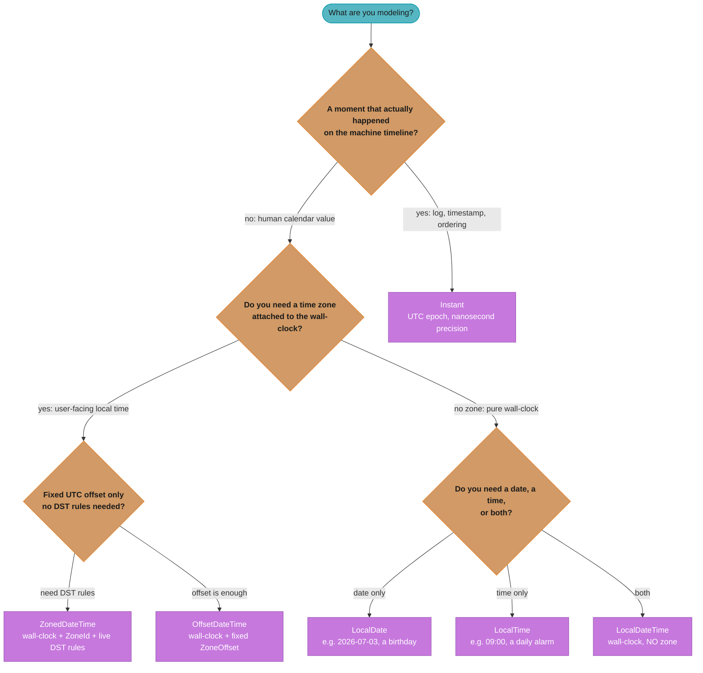
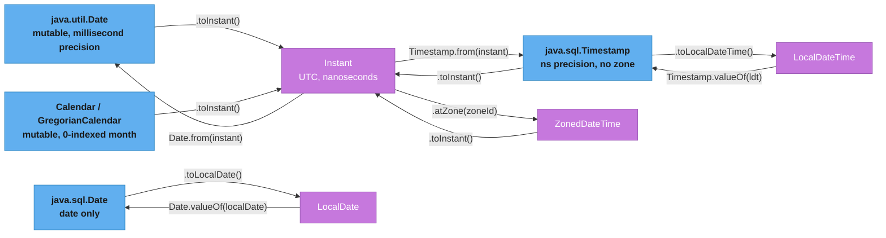
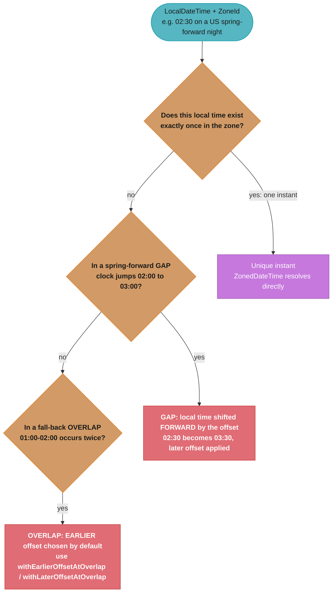

# java.time Date/Time API (JSR-310)

## 1. Concept Overview

`java.time` (JSR-310, shipped in **[Java 8]**, March 2014) is the modern, immutable, thread-safe date/time library that replaced the broken `java.util.Date`/`Calendar` classes. It was designed by Stephen Colebourne, the author of Joda-Time, and folded most of Joda-Time's lessons into the JDK.

The central idea is a **clean separation of two timelines that the old API conflated**:

- The **machine timeline** — a continuous, monotonic count of nanoseconds from the epoch `1970-01-01T00:00:00Z`, with no notion of "what a clock reads." This is `Instant`. It is what you store for "when did this actually happen."
- The **human timeline** — the wall-clock and calendar values people read and write (`2026-07-03`, `09:00`), which are meaningless without a time zone to anchor them to the machine timeline. These are `LocalDate`, `LocalTime`, and `LocalDateTime`.

Everything else in the API is built to bridge those two: `ZoneId` and `ZoneRules` (the IANA tzdata) convert between wall-clock and instant, `ZonedDateTime`/`OffsetDateTime` carry both at once, `Duration`/`Period` measure the gap between values, and `DateTimeFormatter` renders and parses them. Getting date/time correct in a distributed system is almost entirely a matter of picking the right one of these types for each field — the API is unforgiving precisely because it forces that choice.

---

## 2. Intuition

> **One-line analogy**: An `Instant` is the shutter-click moment a photo was taken; a `LocalDateTime` is the number a clock on the wall happened to read — and only a `ZoneId` tells you which wall.

**Mental model**: Think of two rulers. The bottom ruler is the machine timeline — one long unbroken number line of seconds since the 1970 epoch, the same everywhere on Earth (`Instant`). The top ruler is a wall clock — it reads `09:00` in London and `04:00` in New York *for the same shutter-click*. A `ZoneId` (e.g. `Europe/London`) is the gearing that maps a point on the wall-clock ruler to a point on the machine ruler and back. `LocalDateTime` is a mark on the top ruler with the gearing removed — you cannot place it on the bottom ruler until you supply a zone.

**Why it matters**: Almost every date/time bug in production is a category error — using a wall-clock type (`LocalDateTime`) where a machine-timeline type (`Instant`) was needed, or the reverse. Store `LocalDateTime` for an event and you lose the ability to order events, compute durations, or render them for a user in another zone. The API's whole value is that the *type* forces you to say which timeline you mean.

**Key insight**: A `Period` of "1 day" is a *human* quantity and is **not** a `Duration` of 24 hours. On the night the clocks spring forward, "one day later at the same wall-clock time" is only 23 real hours away; on the fall-back night it is 25. `Period` moves the top ruler; `Duration` moves the bottom ruler. Confusing the two is the deepest and most common java.time trap.

---

## 3. Core Principles

- **Two timelines, never mixed**: machine (`Instant`, UTC, epoch nanoseconds) vs human wall-clock (`LocalDate`/`LocalTime`/`LocalDateTime`, no zone). A `ZoneId` is the only bridge between them.
- **Immutability**: every value is final and thread-safe; `plusDays(1)` returns a *new* object and never mutates the receiver (contrast the mutable `Calendar`).
- **Fluent, self-describing types**: the type name states exactly which fields are present. `LocalDate` has no time; `Instant` has no zone; `ZonedDateTime` has everything.
- **Domain-driven amounts**: `Duration` is time-based (seconds + nanos); `Period` is date-based (years/months/days). You pick the one that matches the unit the human cares about.
- **Explicit resolution of ambiguity**: DST gaps and overlaps are resolved by documented rules, not silently — and you can override them (`withEarlierOffsetAtOverlap`).
- **Pluggable "now"**: time is read through a `Clock`, so you can inject a fixed clock in tests instead of calling a static `now()` you cannot control.

---

## 4. Types / Architectures / Strategies

### 4.1 The Core Value Types

| Type | Fields it carries | Timeline | Use for |
|------|-------------------|----------|---------|
| `Instant` | epoch second + nanos | Machine (UTC) | Event timestamps, logs, ordering, "when it happened" |
| `LocalDate` | year-month-day | Human, no zone | Birthdays, invoice dates, business "calendar dates" |
| `LocalTime` | hour-minute-second-nanos | Human, no zone | A recurring daily alarm (`09:00`), store opening hours |
| `LocalDateTime` | date + time | Human, no zone | A wall-clock value *not yet* anchored to a zone |
| `ZonedDateTime` | date + time + `ZoneId` + offset | Both | User-facing local times that must survive DST rule changes |
| `OffsetDateTime` | date + time + `ZoneOffset` | Both | Wire formats/DB columns needing a fixed offset, no DST rules |
| `Year`, `YearMonth`, `MonthDay` | partials | Human | Credit-card expiry (`YearMonth`), recurring "Dec 25" (`MonthDay`) |

### 4.2 Zones vs Offsets

| Concept | Example | What it is |
|---------|---------|-----------|
| `ZoneId` | `America/New_York` | A named region whose UTC offset *changes over the year* per tzdata rules (EST −05:00 / EDT −04:00) |
| `ZoneOffset` | `-05:00` | A fixed number of hours/minutes from UTC, with no DST behavior |

A `ZoneId` knows *why* the offset is what it is (and when it will change); a `ZoneOffset` is just the current gap. `OffsetDateTime` freezes the offset; `ZonedDateTime` keeps the live rules.

### 4.3 Amounts: Duration vs Period

| | `Duration` | `Period` |
|--|-----------|----------|
| Unit basis | Time (seconds, nanos) | Date (years, months, days) |
| "1 day" means | exactly `86_400` seconds | one calendar day (23–25h across DST) |
| Applies cleanly to | `Instant`, `LocalTime`, `ZonedDateTime` (as real elapsed time) | `LocalDate`, `ZonedDateTime` (as calendar arithmetic) |
| Built by | `Duration.ofHours(24)`, `Duration.between(a,b)` | `Period.ofDays(1)`, `Period.between(d1,d2)` |

### 4.4 Supporting Machinery

| Type | Role |
|------|------|
| `ChronoUnit` | Enum of units (`DAYS`, `HOURS`, `MONTHS`) for `between()` and `plus(n, unit)` |
| `TemporalAdjuster` / `TemporalAdjusters` | Reusable "jump to" rules — `firstDayOfMonth()`, `next(MONDAY)`, `lastInMonth(...)` |
| `TemporalAmount` | Common supertype of `Duration` and `Period` |
| `DateTimeFormatter` | Immutable, thread-safe formatter/parser (ISO built-ins, patterns, locale) |
| `Clock` | The injectable source of "now" — `systemUTC()`, `fixed()`, `offset()`, `tick()` |
| `ZoneRules` / tzdata | The IANA time-zone database that powers offset lookups and DST transitions |

---

## 5. Architecture Diagrams

### Which java.time type should I use?



The single most important branch is the first one: if the value is a moment that happened, it is an `Instant` (or a `ZonedDateTime` when you also need the local rendering) — never a bare `LocalDateTime`.

### Machine timeline vs human wall-clock

```
Machine timeline (Instant / UTC) — one monotonic number line, zone-free, the true ordering
  epoch                                                        the shutter-click
  1970-01-01T00:00:00Z                                         2026-07-03T08:00:00Z
    |------------------------------ ... --------------------------------|-------------->
                                                              (exactly one Instant)

Human wall-clock (LocalDateTime) — what a clock on some wall reads; a ZoneId picks the wall
  Tokyo     2026-07-03 17:00  (UTC+9) --+
  London    2026-07-03 09:00  (UTC+1) --+--  all name the SAME Instant above
  New York  2026-07-03 04:00  (UTC-4) --+     ZoneId is the only bridge both ways
```

The three wall-clock readings are different numbers for one identical moment. Store the `Instant` (or UTC), keep each user's `ZoneId`, and render on the way out — never store the local reading alone.

### Converting to/from the legacy API



The legacy types (blue) live only at API boundaries — old libraries and pre-JDBC-4.2 drivers. Convert to the modern immutable types (purple) as early as possible and keep the rest of your code in `java.time`.

### DST resolution: gap and overlap



`ZonedDateTime.of(...)` never throws on a bad local time — it silently applies these rules. The red nodes are exactly where a "same wall-clock time tomorrow" scheduler produces a wrong or duplicate firing if you ignore DST.

### "1 day" is not "24 hours" across DST

```mermaid
xychart-beta
    title "Adding 1 calendar day across a DST boundary: real elapsed hours"
    x-axis ["Normal day", "Spring-forward day", "Fall-back day"]
    y-axis "Real elapsed hours" 0 --> 26
    bar [24, 23, 25]
    bar [24, 24, 24]
```



First series = `Period.ofDays(1)` on a `ZonedDateTime` (keeps the same wall-clock time, so real elapsed hours vary 23/24/25). Second series = `Duration.ofHours(24)` (always 24 real hours, so the wall-clock time drifts by an hour across a DST boundary). Choosing the wrong one is the classic reminder-service bug.

---

## 6. How It Works — Detailed Mechanics

### Creating each type

```java
// Machine timeline — the moment something happened
Instant now = Instant.now();                       // e.g. 2026-07-03T08:00:00.123456789Z
Instant epoch = Instant.EPOCH;                      // 1970-01-01T00:00:00Z
long secs = now.getEpochSecond();                   // seconds since epoch
int nanos = now.getNano();                          // 0..999_999_999 — nanosecond precision

// Human wall-clock — no zone attached
LocalDate d  = LocalDate.of(2026, 7, 3);            // month is 1-based (July == 7), NOT 0-based
LocalTime t  = LocalTime.of(9, 0);                  // 09:00
LocalDateTime ldt = LocalDateTime.of(d, t);         // 2026-07-03T09:00 — still no zone

// Both timelines at once
ZoneId ny = ZoneId.of("America/New_York");
ZonedDateTime zdt = ldt.atZone(ny);                 // 2026-07-03T09:00-04:00[America/New_York]
Instant instant   = zdt.toInstant();                // now placeable on the machine ruler
OffsetDateTime odt = zdt.toOffsetDateTime();        // 2026-07-03T09:00-04:00 (offset frozen, no rules)
```

Note `LocalDate.of(2026, 7, 3)` uses a **1-based month** — one of the top reasons the old `Calendar` (0-based months, so December was `11`) was error-prone.

### BROKEN → FIX #1: `SimpleDateFormat` is not thread-safe

`SimpleDateFormat` keeps mutable parsing state in a field, so a single instance shared across threads (the usual "static final" formatter) corrupts output or throws under load.

```java
// BROKEN: one shared SimpleDateFormat across threads.
// Under concurrency this throws NumberFormatException / ArrayIndexOutOfBoundsException
// or silently returns a garbled date — an intermittent, load-dependent bug.
static final SimpleDateFormat SDF = new SimpleDateFormat("yyyy-MM-dd HH:mm:ss");

String format(Date d) {
    return SDF.format(d);            // races on internal Calendar field
}
```

```java
// FIX: DateTimeFormatter is immutable and thread-safe — share one instance freely.
static final DateTimeFormatter FMT =
        DateTimeFormatter.ofPattern("yyyy-MM-dd HH:mm:ss").withZone(ZoneOffset.UTC);

String format(Instant i) {
    return FMT.format(i);            // no shared mutable state; safe from any thread
}
```

A `DateTimeFormatter` has no per-parse mutable state, so the same static instance can serve every request thread. This alone is a reason to migrate legacy formatting code.

### BROKEN → FIX #2: using `LocalDateTime` for an event timestamp

```java
// BROKEN: LocalDateTime has no zone, so it cannot identify a unique moment.
// Stored as "2026-03-08T02:30", this value is ambiguous or nonexistent across DST,
// cannot be ordered against events from other zones, and cannot be rendered correctly.
LocalDateTime eventTime = LocalDateTime.now();      // whose wall clock? unknown
save(order.getId(), eventTime);                     // silently lossy
```

```java
// FIX: capture the machine-timeline moment as an Instant (store UTC),
// and keep the user's ZoneId separately for rendering.
Instant eventTime = Instant.now();                  // unambiguous, orderable, UTC
save(order.getId(), eventTime, user.getZoneId());   // e.g. Instant + "America/New_York"

// Render for the user only at the edge:
String shown = DateTimeFormatter.ofLocalizedDateTime(FormatStyle.MEDIUM)
        .withLocale(Locale.US)
        .format(eventTime.atZone(user.getZoneId()));
```

### Duration vs Period across a DST boundary — with real output

```java
ZoneId ny = ZoneId.of("America/New_York");
// Night the US springs forward: 2026-03-08, clocks jump 02:00 -> 03:00 (23-hour day)
ZonedDateTime before = ZonedDateTime.of(2026, 3, 8, 1, 0, 0, 0, ny); // 01:00 EST (-05:00)

// Period = calendar arithmetic: keep the same wall-clock time next day
ZonedDateTime plusPeriod = before.plus(Period.ofDays(1));
// -> 2026-03-09T01:00-04:00  (same wall-clock 01:00, but offset now EDT; 23 real hours later)

// Duration = elapsed real time: add exactly 24 hours of physical time
ZonedDateTime plusDuration = before.plus(Duration.ofHours(24));
// -> 2026-03-09T02:00-04:00  (24 real hours, so wall clock drifts to 02:00)

Duration realGapForPeriod = Duration.between(before, plusPeriod);   // PT23H  <-- not 24h!
```

`Period.ofDays(1)` moved the wall clock; `Duration.ofHours(24)` moved real time. A "remind me in 1 day" feature must use `Period` (users mean "same time tomorrow"); a "session expires in 24h" feature must use `Duration`.

### Legacy conversions

```java
// java.util.Date  <-> Instant
Date legacy = new Date();
Instant i1  = legacy.toInstant();
Date back   = Date.from(i1);

// java.sql.Timestamp  <-> Instant / LocalDateTime  (JDBC 4.2 also maps types directly)
Timestamp ts = Timestamp.from(Instant.now());
Instant i2   = ts.toInstant();
LocalDateTime ldt = ts.toLocalDateTime();           // interprets in the JVM default zone — be careful

// Calendar -> Instant (then leave Calendar behind)
Calendar cal = Calendar.getInstance();
Instant i3   = cal.toInstant();
```

With JDBC 4.2+, prefer `rs.getObject("col", Instant.class)` / `ps.setObject(1, instant)` over `Timestamp` entirely — see [JDBC & Database Access](../jdbc_and_database/README.md).

### Clock injection for testable time

Calling `Instant.now()` directly makes code untestable — you cannot assert on "now." Inject a `Clock` and read time through it.

```java
class ReminderService {
    private final Clock clock;                       // injected

    ReminderService(Clock clock) { this.clock = clock; }

    boolean isDue(Instant scheduledUtc) {
        return !Instant.now(clock).isBefore(scheduledUtc);   // reads the injected clock
    }
}

// Production: real UTC clock
var prod = new ReminderService(Clock.systemUTC());

// Test: a frozen clock — deterministic, no sleeping, no flakiness
var fixed = Clock.fixed(Instant.parse("2026-07-03T08:00:00Z"), ZoneOffset.UTC);
var test  = new ReminderService(fixed);
assert test.isDue(Instant.parse("2026-07-03T07:59:59Z"));    // reproducible
```

`Clock.fixed(...)` always returns the same instant; `Clock.offset(base, dur)` shifts it; `Clock.tick(base, dur)` truncates its resolution. This is dependency injection applied to the wall clock.

### DST gap/overlap resolution in code

```java
ZoneId ny = ZoneId.of("America/New_York");

// GAP (spring forward): 02:30 on 2026-03-08 does not exist — it is skipped.
ZonedDateTime gap = ZonedDateTime.of(2026, 3, 8, 2, 30, 0, 0, ny);
// -> 2026-03-08T03:30-04:00  (pushed forward one hour; no exception thrown)

// OVERLAP (fall back): 01:30 on 2026-11-01 happens twice (EDT then EST).
ZonedDateTime overlap = ZonedDateTime.of(2026, 11, 1, 1, 30, 0, 0, ny);
// -> 2026-11-01T01:30-04:00  (EARLIER offset EDT chosen by default)
ZonedDateTime later = overlap.withLaterOffsetAtOverlap();
// -> 2026-11-01T01:30-05:00  (EST — the second, later occurrence)
```

Because these methods never throw, DST bugs are silent: a scheduler that stores wall-clock `02:30` for a US zone will simply fire at `03:30` on the spring-forward day unless it works in UTC.

### Formatting and parsing

```java
// ISO built-ins (no pattern needed) — the safe default for machine-to-machine
String iso = DateTimeFormatter.ISO_INSTANT.format(Instant.now());   // 2026-07-03T08:00:00Z
OffsetDateTime parsed = OffsetDateTime.parse("2026-07-03T09:00-04:00");

// Custom pattern with locale (thread-safe, immutable, reusable)
DateTimeFormatter human = DateTimeFormatter
        .ofPattern("EEE, d MMM yyyy HH:mm", Locale.US);
String s = ZonedDateTime.now(ny).format(human);   // "Fri, 3 Jul 2026 09:00"
```

Unlike `SimpleDateFormat`, a `DateTimeFormatter` is strict by default and immutable — build it once, use it everywhere. See [Strings & Text](../strings_and_text/README.md) for parsing/formatting mechanics.

---

## 7. Real-World Examples

- **JDBC 4.2 / databases**: modern drivers map `LocalDate` to SQL `DATE`, `LocalDateTime` to `TIMESTAMP`, and `OffsetDateTime`/`Instant` to `TIMESTAMP WITH TIME ZONE` (`timestamptz`). Postgres stores `timestamptz` as UTC and converts on read — the DB-level mirror of the `Instant` pattern.
- **Jackson `JavaTimeModule`**: serializes `Instant` as ISO-8601 (`2026-07-03T08:00:00Z`) so REST APIs exchange unambiguous UTC timestamps by default.
- **Joda-Time**: the direct predecessor; JSR-310 is essentially its redesign, so migrating legacy Joda code is mostly a one-to-one type mapping.
- **Android**: `java.time` is available natively on API 26+ and via *core library desugaring* below that, so the same code runs on older phones.
- **Financial / trading systems**: use `Instant`/`ZonedDateTime` with explicit exchange zones (`America/New_York` for NYSE) because market open/close is a wall-clock rule that must survive DST changes.
- **tzdata updates**: when a government changes DST rules (e.g. a country cancels DST), the JDK ships an updated IANA tzdata file; `ZoneRules` reads it so existing `ZonedDateTime` logic stays correct without code changes.

---

## 8. Tradeoffs

| Choice | Prefer when | Cost / gotcha |
|--------|-------------|---------------|
| `Instant` (store UTC) | Event timestamps, ordering, cross-zone systems | Must re-attach a zone to render locally |
| `ZonedDateTime` (store zoned) | Value is defined by a local rule (e.g. "9am NYSE open") | tzdata rule changes can retroactively shift stored wall-clock meaning |
| `OffsetDateTime` | Wire/DB column needing a fixed offset, no DST | Loses the zone name; cannot compute future DST transitions |
| `LocalDateTime` | Wall-clock value not yet anchored (form input, recurrence rule) | Cannot identify a moment; never store as an event time |
| `Period` (1 day) | "Same wall-clock time tomorrow" (reminders, billing dates) | Not 24h across DST — real elapsed time varies 23–25h |
| `Duration` (24h) | Elapsed real time (timeouts, TTLs, SLAs) | Wall-clock time drifts by an hour across a DST boundary |
| `DateTimeFormatter` | All formatting/parsing | None over `SimpleDateFormat` — strictly better (immutable, thread-safe) |

---

## 9. When to Use / When NOT to Use

**Store an `Instant` (UTC) when**:
- The value is a moment that happened — created-at, logged-at, event time.
- You must order or diff events, or serve users in multiple zones.

**Store a `ZonedDateTime`/zone when**:
- The value's meaning is a local rule that must survive tzdata changes (appointment at "9am local," market open).

**Use `LocalDate`/`LocalTime`/`LocalDateTime` when**:
- The concept genuinely has no zone: a birthday, an invoice date, a recurring daily alarm, a raw form field before you know the user's zone.

**Do NOT**:
- Store a `LocalDateTime` for an event timestamp — you lose ordering and correct rendering.
- Use `Duration.ofDays(1)` when you mean "same time tomorrow" — that is a `Period`.
- Rely on the JVM default zone (`ZoneId.systemDefault()`) in server code — it varies by host; pass an explicit zone.
- Keep using `Date`/`Calendar`/`SimpleDateFormat` in new code — they are mutable and error-prone.
- Freeze an offset (`OffsetDateTime`) for a future local time whose DST offset is not yet known.

---

## 10. Common Pitfalls

### War Story 1: The reminder that fired an hour early twice a year
A scheduling service stored reminders as wall-clock `LocalDateTime` and computed the next fire time by adding `Duration.ofHours(24)`. Twice a year, on DST transition days, every daily reminder fired an hour off — early in spring, late in autumn — because 24 real hours is not "the same wall-clock time tomorrow." **Fix**: store the anchor as a `ZonedDateTime` with the user's `ZoneId` and advance with `Period.ofDays(1)` (or store UTC + zone and recompute). The type carried the DST rules automatically.

### War Story 2: `SimpleDateFormat` corrupting audit logs under load
A shared `static final SimpleDateFormat` formatted timestamps in a high-throughput audit path. Under concurrency it intermittently produced dates like `2026-07-03` mixed into the wrong record, and occasionally threw `NumberFormatException`. The bug was invisible in single-threaded tests. **Fix**: replace with a `static final DateTimeFormatter` — immutable and thread-safe by design.

### War Story 3: Off-by-one month from `Calendar`
Legacy code did `new GregorianCalendar(2026, 7, 3)` expecting July and got **August**, because `Calendar` months are 0-indexed. **Fix**: `LocalDate.of(2026, 7, 3)` uses a 1-based month (and `Month.JULY` when you want to be explicit).

### War Story 4: `LocalDateTime` timestamps that could not be ordered
An analytics team stored ingestion times as `LocalDateTime` in the JVM default zone. When the fleet spanned multiple regions, "earlier" `LocalDateTime` values were actually *later* instants, silently corrupting time-series ordering. **Fix**: store `Instant` (UTC) everywhere; convert to local only for display.

### War Story 5: Adding a month to January 31
`LocalDate.of(2026, 1, 31).plusMonths(1)` returns `2026-02-28`, not an exception, because java.time resolves an invalid day-of-month to the last valid day. A billing job assumed "+1 month" always kept the 31st and skewed month-end invoices. **Fix**: understand the resolver; use `TemporalAdjusters.lastDayOfMonth()` when "end of month" is the actual intent.

### War Story 6: Trusting the server's default zone
A batch job used `LocalDate.now()` (which uses `ZoneId.systemDefault()`) to pick "today." After a container migration to a UTC host, the job's day boundary shifted, double-processing some records near midnight. **Fix**: always pass an explicit zone: `LocalDate.now(ZoneId.of("America/New_York"))`.

---

## 11. Technologies & Tools

| Tool | Purpose |
|------|---------|
| `java.time.*` | Core JSR-310 value types (Instant, LocalDate, ZonedDateTime, Duration, Period) |
| `java.time.format.DateTimeFormatter` | Immutable, thread-safe formatting/parsing (ISO + patterns + locale) |
| `java.time.Clock` | Injectable "now" for testable time (`fixed`, `offset`, `tick`, `systemUTC`) |
| IANA tzdata / `ZoneRules` | Time-zone offset + DST transition database shipped with the JDK |
| `tzupdater` | Oracle tool to patch a JDK's tzdata when governments change DST rules |
| ThreeTen-Extra (`org.threeten.extra`) | Colebourne's add-on types (`Interval`, `Quarter`, `DayOfMonth`) |
| Jackson `JavaTimeModule` | JSON (de)serialization of java.time types |
| JDBC 4.2 `getObject`/`setObject` | Direct mapping of java.time types to SQL DATE/TIMESTAMP/TIMESTAMPTZ |

---

## 12. Interview Questions with Answers

**Q: Why is `LocalDateTime` the wrong type to store an event timestamp?**
Because `LocalDateTime` carries no time zone or offset, so it cannot identify a unique moment on the machine timeline. Two `LocalDateTime` values from different hosts cannot be ordered or diffed correctly, and on DST days a wall-clock value can be ambiguous (fall-back) or nonexistent (spring-forward). Store an `Instant` (UTC) for events, keep the user's `ZoneId` separately, and render local only at the edge.

**Q: Is `SimpleDateFormat` thread-safe, and what replaces it?**
No — `SimpleDateFormat` keeps mutable parsing state in a `Calendar` field, so sharing one instance across threads corrupts output or throws intermittently under load. The classic bug is a `static final SimpleDateFormat` in a high-throughput path. The fix is `DateTimeFormatter`, which is immutable and thread-safe, so a single static instance can safely serve every request thread.

**Q: What is the difference between `Instant` and `LocalDateTime`?**
`Instant` is a point on the machine timeline — nanoseconds from the 1970 UTC epoch, with no zone — while `LocalDateTime` is a wall-clock reading with no zone at all. `Instant` identifies a unique moment; `LocalDateTime` does not until you attach a `ZoneId`. Use `Instant` for "when it happened," `LocalDateTime` only for zone-less human values like a form field or a recurrence rule.

**Q: Why is `Period.ofDays(1)` not the same as `Duration.ofHours(24)`?**
Because `Period` is calendar (human) arithmetic and `Duration` is elapsed real time (machine) arithmetic, and across a DST boundary a calendar day is 23 or 25 real hours, not 24. Adding `Period.ofDays(1)` to a `ZonedDateTime` keeps the same wall-clock time next day; adding `Duration.ofHours(24)` advances exactly 24 real hours, so the wall clock drifts by an hour. Use `Period` for "same time tomorrow," `Duration` for timeouts and TTLs.

**Q: What is the difference between `ZonedDateTime` and `OffsetDateTime`?**
`ZonedDateTime` carries a named `ZoneId` (like `America/New_York`) plus its live DST rules, whereas `OffsetDateTime` carries only a fixed `ZoneOffset` (like `-05:00`) with no rules. `ZonedDateTime` can compute future DST transitions and adjust automatically; `OffsetDateTime` freezes the offset, which is ideal for wire formats and DB columns but wrong for a future local time whose DST offset is not yet known.

**Q: What is the difference between `ZoneId` and `ZoneOffset`?**
A `ZoneId` is a named region whose UTC offset changes over the year according to tzdata rules; a `ZoneOffset` is a single fixed gap from UTC with no DST behavior. `ZoneOffset` is actually a subclass of `ZoneId`, but it represents only the current offset, not the rules that produced it. Use `ZoneId.of("Europe/London")` when DST matters and `ZoneOffset.ofHours(-5)` only when you truly mean a fixed offset.

**Q: What happens if you construct a `ZonedDateTime` at a local time that falls in the spring-forward gap?**
The local time does not exist, so java.time silently shifts it forward by the DST offset rather than throwing — `02:30` on a US spring-forward night becomes `03:30`. `ZonedDateTime.of(...)` and `atZone(...)` apply this rule automatically, which makes the bug silent. If exact local firing matters, work in UTC or validate the local time against `ZoneRules.getTransition(...)`.

**Q: What happens at a fall-back overlap, and how do you disambiguate?**
The local time occurs twice (once at the earlier offset, once at the later), and by default java.time picks the earlier offset. For `01:30` on a US fall-back night it chooses EDT (`-04:00`); call `withLaterOffsetAtOverlap()` to select the EST (`-05:00`) occurrence, or `withEarlierOffsetAtOverlap()` to be explicit about the default. This matters for events like billing runs that must fire exactly once.

**Q: Why was `java.util.Date`/`Calendar` replaced?**
Because they are mutable (hence not thread-safe), have an error-prone API (0-indexed months, so December is `11`), and conflate the machine and human timelines with no clear zone model. `java.util.Date` is really a timestamp misleadingly named "Date," and `Calendar` mixes representation with mutation. `java.time` fixes all three: immutable values, 1-based months, and distinct types for each timeline.

**Q: How do you convert a legacy `java.util.Date` to modern `java.time` and back?**
Use `date.toInstant()` to go to an `Instant`, and `Date.from(instant)` to come back. From the `Instant` you attach a zone with `instant.atZone(zoneId)` to get a `ZonedDateTime`. For `Calendar`, `cal.toInstant()`; for `java.sql.Timestamp`, `ts.toInstant()` or `ts.toLocalDateTime()` — though with JDBC 4.2 you should prefer `getObject`/`setObject` with java.time types directly.

**Q: What is `Clock` and why would you inject it?**
`Clock` is the abstraction java.time uses to read "now," and injecting it makes time-dependent code deterministically testable. Instead of calling `Instant.now()` (untestable), you call `Instant.now(clock)` where `clock` is injected — production uses `Clock.systemUTC()` and tests use `Clock.fixed(instant, zone)` to freeze time. This turns flaky, sleep-based tests into reproducible ones.

**Q: Are `java.time` types immutable and thread-safe?**
Yes — every core `java.time` value type is immutable and thread-safe, so methods like `plusDays(1)` return a new object and never mutate the receiver. This is the opposite of `Calendar`, which mutates in place. Immutability means you can freely share instances (including `static final` formatters and constants) across threads without synchronization.

**Q: How should you store timestamps in a database: UTC or zoned, and which SQL type?**
Store the moment as UTC (an `Instant`/`OffsetDateTime` mapped to `TIMESTAMP WITH TIME ZONE`, i.e. `timestamptz`), and keep the user's zone separately only if you must reconstruct their local wall-clock intent. `TIMESTAMP WITHOUT TIME ZONE` maps to `LocalDateTime` and stores no offset, so it cannot identify a moment — avoid it for event times. Postgres `timestamptz` normalizes to UTC on write, mirroring the `Instant` pattern at the database layer.

**Q: What are tzdata and `ZoneRules`, and why do updates matter?**
`ZoneRules` is java.time's view of the IANA tzdata database — the rules that map each zone's wall-clock time to a UTC offset over history. When a government changes DST rules (e.g. abolishing DST or shifting a transition date), the JDK ships an updated tzdata file so `ZonedDateTime` arithmetic stays correct without code changes. Keep the JDK (or apply `tzupdater`) current, because a stale tzdata file produces wrong offsets for the changed region.

**Q: What is the difference between `Instant.now()` and `LocalDateTime.now()`?**
`Instant.now()` returns the current moment on the machine timeline in UTC, while `LocalDateTime.now()` returns the current wall-clock reading in the JVM's default zone with the zone then discarded. The `LocalDateTime` result depends on `ZoneId.systemDefault()`, which varies by host, making it unreliable in server code. Prefer `Instant.now()` for events and pass an explicit zone (`LocalDate.now(zoneId)`) when you need a local calendar value.

**Q: Why does `LocalDate.of(2026, 1, 31).plusMonths(1)` return February 28 instead of throwing?**
Because java.time resolves an invalid day-of-month to the last valid day of the target month rather than overflowing or throwing. January 31 plus one month has no February 31, so it clamps to February 28 (or 29 in a leap year). If you actually mean "end of month," use `TemporalAdjusters.lastDayOfMonth()` to express that intent explicitly instead of relying on the clamp.

**Q: What is a `TemporalAdjuster` and when would you use one?**
A `TemporalAdjuster` is a reusable strategy that computes a new temporal value from an existing one, such as first day of next month or next Monday. The `TemporalAdjusters` factory ships common ones (`firstDayOfMonth()`, `next(DayOfWeek.MONDAY)`, `lastInMonth(...)`), and you apply them with `date.with(adjuster)`. They replace ad-hoc loops for calendar navigation and are handy for business rules like "invoice on the last business day of the month."

**Q: How do you compute the number of whole days or hours between two temporal values?**
Use `ChronoUnit` for a single unit — `ChronoUnit.DAYS.between(start, end)` or `ChronoUnit.HOURS.between(a, b)` — which returns a `long` count. For a full breakdown into years/months/days use `Period.between(localDate1, localDate2)`, and for elapsed real time use `Duration.between(instant1, instant2)`. Match the tool to the question: `ChronoUnit` for one unit, `Period` for calendar fields, `Duration` for machine time.

---

## 13. Best Practices

1. **Store `Instant` (UTC) for events**; keep the user's `ZoneId` separately and render local only at the edge.
2. **Never use `LocalDateTime` for a moment in time** — it has no zone and cannot be ordered across hosts.
3. **Replace every `SimpleDateFormat` with a `static final DateTimeFormatter`** — immutable and thread-safe.
4. **Use `Period` for calendar arithmetic and `Duration` for elapsed time** — they differ across DST boundaries.
5. **Inject a `Clock`** instead of calling `Instant.now()` directly, so time-dependent code is deterministically testable.
6. **Pass an explicit `ZoneId`** — never rely on `ZoneId.systemDefault()` in server code.
7. **Prefer ISO built-in formatters** (`ISO_INSTANT`, `ISO_OFFSET_DATE_TIME`) for machine-to-machine exchange.
8. **Map DB timestamps to `Instant`/`OffsetDateTime` and `timestamptz`**; avoid zone-less `TIMESTAMP` for event times.
9. **Keep the JDK tzdata current** (or run `tzupdater`) so DST rule changes are picked up automatically.
10. **Convert legacy `Date`/`Calendar` at the boundary** and keep the rest of the code in `java.time`.

---

## 14. Case Study

### Designing a Timezone-Correct Reminder & Scheduling Service

**Scenario.** A consumer app lets **8M users** set reminders ("remind me every weekday at 09:00," "one-off on 2026-03-08 at 07:30"). Peak fan-out is **~4,000 reminders/sec** at the top of each minute. Users are spread across 40+ time zones, travel between them, and expect a reminder set for "9am" to fire at 9am *local* — including across DST transitions and after a phone's zone changes. The original build stored each reminder as a `LocalDateTime` in the server's default zone and advanced recurring ones with `Duration.ofHours(24)`. Twice a year it misfired every daily reminder by an hour, and users who flew across zones got reminders at the wrong local time.

```
  set reminder (local intent)                      minute-tick scheduler (UTC)
        |                                                   |
        v                                                   v
  ┌───────────────────────────┐                   ┌───────────────────────────┐
  │ store:                    │                   │ every minute:             │
  │  - LocalTime 09:00        │  --- persist -->  │  now = Instant.now(clock) │
  │  - recurrence rule        │                   │  find due rows where      │
  │  - ZoneId (user's)        │                   │  next_fire_utc <= now     │
  │  - next_fire_utc (Instant)│                   │  -> enqueue notification  │
  └───────────────────────────┘                   │  -> recompute next_fire   │
                                                   └───────────────────────────┘
```

The invariant: **the queue and the "due?" check run entirely in `Instant`/UTC**, while the *local intent* (a `LocalTime` + `ZoneId` + recurrence) is stored so the next UTC fire time can always be recomputed correctly, even if tzdata or the user's zone changes.

#### Computing the next fire time (the core of the fix)

```java
record Reminder(long id, LocalTime localTime, ZoneId zone, boolean daily) {}

/** Next UTC instant this reminder should fire, at/after 'after'. */
Instant nextFireUtc(Reminder r, Instant after) {
    ZonedDateTime cursor = after.atZone(r.zone())               // user's local "now"
            .with(r.localTime())                                // set wall-clock to 09:00 local
            .truncatedTo(ChronoUnit.MINUTES);
    // If today's local 09:00 already passed, advance by calendar days (NOT 24h).
    while (!cursor.toInstant().isAfter(after)) {
        cursor = cursor.plus(Period.ofDays(1));                 // "same wall-clock time tomorrow"
    }
    return cursor.toInstant();                                  // store this UTC instant
}
```

`.with(localTime)` re-pins the wall clock to 09:00 in the user's zone; `Period.ofDays(1)` advances *calendar* days so the reminder stays at 09:00 local across DST. Converting back with `.toInstant()` yields the UTC value the scheduler compares against. Had this used `Duration.ofHours(24)`, the 09:00 reminder would have crept to 08:00 or 10:00 twice a year.

#### BROKEN → FIX at the heart of the outage

```java
// BROKEN: stored wall-clock time, advanced by real hours, in the server default zone.
LocalDateTime next = reminder.getFireTime().plus(Duration.ofHours(24)); // drifts across DST
if (LocalDateTime.now().isAfter(next)) { fire(reminder); }              // server-zone dependent
```

```java
// FIX: due-check in UTC; recompute next fire from local intent with calendar arithmetic.
Instant next = nextFireUtc(reminder, Instant.now(clock));  // clock injected for tests
if (!Instant.now(clock).isBefore(next)) {
    fire(reminder);
    scheduleNext(reminder, next.plusSeconds(1));            // recompute from local intent
}
```

#### Handling the spring-forward gap

A one-off reminder set for `02:30` on a US spring-forward morning names a local time that does not exist. Storing UTC would be misleading, so the service resolves the local intent explicitly and tells the user:

```java
ZoneId zone = ZoneId.of("America/New_York");
LocalDateTime wanted = LocalDateTime.of(2026, 3, 8, 2, 30);
ZoneRules rules = zone.getRules();
if (rules.getTransition(wanted) != null) {          // non-null => wanted falls in a gap
    // java.time would push 02:30 -> 03:30; surface that to the user instead of firing silently.
    ZonedDateTime resolved = wanted.atZone(zone);   // 2026-03-08T03:30-04:00
    warnUser(resolved);                             // "That time is skipped by DST; firing at 03:30"
}
```

#### Testing time deterministically

```java
Clock frozen = Clock.fixed(Instant.parse("2026-03-08T06:59:00Z"), ZoneOffset.UTC);
Reminder daily9 = new Reminder(1, LocalTime.of(9, 0), ZoneId.of("America/New_York"), true);
Instant next = nextFireUtc(daily9, Instant.now(frozen));
// 09:00 EDT on 2026-03-08 == 13:00Z — asserted exactly, no sleeping, no flakiness.
assert next.equals(Instant.parse("2026-03-08T13:00:00Z"));
```

### Common Pitfalls (production war stories)

**1. Advancing recurring reminders with `Duration.ofHours(24)`.** Every daily reminder drifted an hour twice a year on DST days. Fix: advance with `Period.ofDays(1)` on a `ZonedDateTime` so the wall-clock time is preserved.

**2. Storing `next_fire` as `LocalDateTime` in the server default zone.** A migration to UTC hosts shifted every reminder's meaning. Fix: store the fire time as an `Instant` (UTC) and the intent (`LocalTime` + `ZoneId`) separately.

**3. Ignoring the spring-forward gap.** Reminders set for skipped local times fired an hour late with no explanation. Fix: probe `ZoneRules.getTransition(localDateTime)` and surface the resolved time to the user.

**4. Untestable static `now()`.** Time-dependent scheduling tests were flaky and slept for seconds. Fix: inject a `Clock`; use `Clock.fixed` in tests.

### Interview Discussion Points

**Why store the local intent instead of just the next UTC instant?** Because tzdata rules and the user's zone can change after the reminder is set; keeping `LocalTime` + `ZoneId` lets you recompute the correct next UTC fire time at any point, whereas a frozen UTC value would silently become wrong.

**When is `Duration` the right choice in this service?** For elapsed-time concerns like "retry the notification in 30 seconds" or "expire the delivery attempt after 5 minutes" — anything measured in real time rather than calendar position.

**How do you keep the "due?" check correct across zones?** Do the comparison entirely in `Instant`/UTC (`next_fire_utc <= Instant.now()`); zones only enter when computing `next_fire_utc` from local intent and when rendering the notification.

**What breaks if you store `timestamp` instead of `timestamptz`?** A zone-less column cannot identify a moment, so reminders written on one host and read on another (or after a JVM-zone change) resolve to different instants — the same class of bug as using `LocalDateTime` in code.

**How do you make the scheduler idempotent across a DST overlap?** Because a fall-back local hour occurs twice, drive the schedule from monotonic UTC instants (not wall-clock) and dedupe on `(reminder_id, next_fire_utc)` so a reminder fires exactly once even though the local hour repeats.

---

## Related / See Also

- [Java 8 Features](../java8_features/README.md) — lambdas, Streams, Optional, and the introduction of `java.time`
- [Strings & Text](../strings_and_text/README.md) — `DateTimeFormatter` parsing/formatting, locale, text blocks for patterns
- [JDBC & Database Access](../jdbc_and_database/README.md) — mapping java.time types to SQL `TIMESTAMP` vs `TIMESTAMPTZ` via JDBC 4.2 `getObject`/`setObject`
