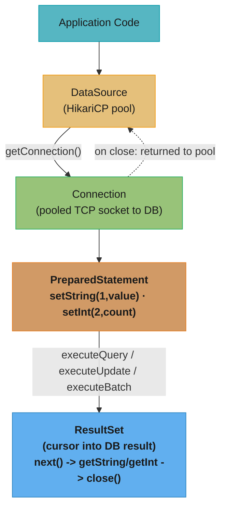
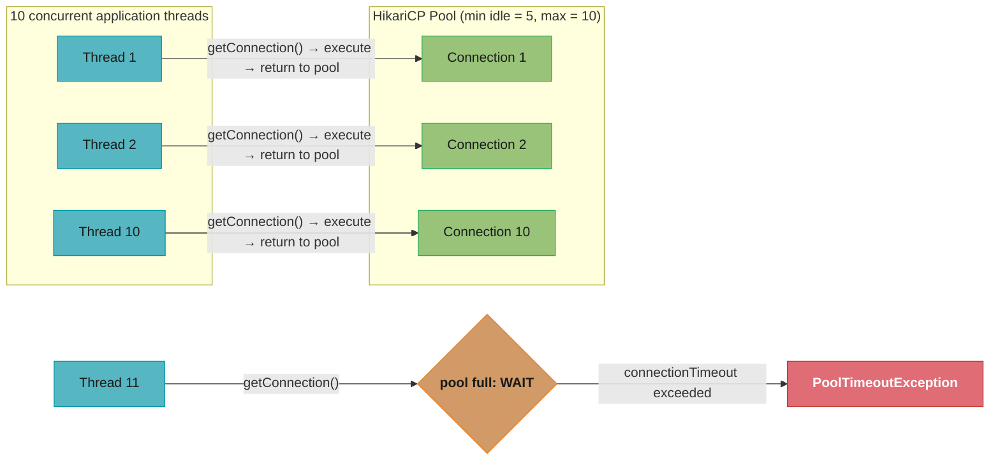
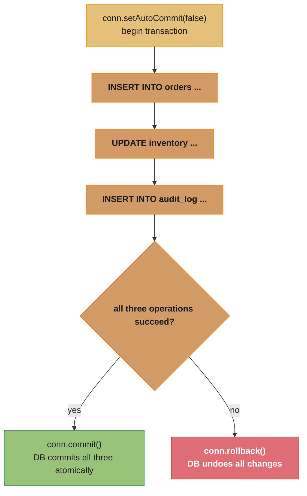

# JDBC & Database Access

## 1. Concept Overview

JDBC (Java Database Connectivity) is Java's standard API for relational database access. It provides a vendor-neutral interface — the same Java code works with PostgreSQL, MySQL, Oracle, and H2 by swapping the JDBC driver. Understanding JDBC deeply means knowing why `PreparedStatement` beats `Statement` (SQL injection + query plan caching), how transaction isolation levels prevent concurrency anomalies, and how connection pools like HikariCP make production JDBC viable.

This module covers raw JDBC (no ORM), which is the foundation that every framework (Hibernate, Spring JDBC, jOOQ) is built on. Understanding JDBC internals helps you diagnose connection pool exhaustion, optimize batch inserts, and safely stream large result sets without OOM errors.

---

## 2. Intuition

> **One-line analogy**: JDBC is the phone book that lets your Java code look up and call a specific database — `DriverManager` is the operator, `Connection` is the call, `PreparedStatement` is your prepared script (ready to run with variable fill-ins), and `ResultSet` is the database talking back.

**Mental model**: Every JDBC operation flows through: `DataSource` → `Connection` → `Statement`/`PreparedStatement` → `ResultSet`. The connection is a TCP socket to the database server, which is expensive to create (~50-100ms for a new TCP handshake + authentication). Connection pools (HikariCP) pre-create and reuse connections, reducing this to microseconds. Transaction management is about controlling when the database commits changes and ensuring ACID guarantees.

**Why it matters**: Connection pool exhaustion is one of the most common production incidents in Java services — all threads block waiting for a connection, service goes dark. ResultSet OOM from streaming a 10M row table without cursor streaming is another. Both are diagnosable and preventable with correct JDBC configuration.

**Key insight**: `PreparedStatement` is not just about SQL injection — the database server parses and optimizes the query once and caches the query plan. Subsequent executions with different parameter values reuse the plan. For a query executed thousands of times per second, this is a significant throughput improvement.

---

## 3. Core Principles

- **`DataSource` over `DriverManager`**: `DriverManager.getConnection()` opens a new TCP connection every call. `DataSource` from a connection pool returns a pooled connection — orders of magnitude faster.
- **`PreparedStatement` always**: Prevents SQL injection; enables server-side query plan caching; cleaner parameter binding.
- **Transactions as units of work**: `setAutoCommit(false)` groups operations; either all commit or all roll back.
- **Isolation levels control trade-offs**: Higher isolation → fewer anomalies → more locking → lower throughput.
- **Close resources in `finally` or `try-with-resources`**: Unclosed `Connection` causes pool exhaustion; unclosed `ResultSet` leaks server-side cursor.
- **Streaming large results**: `setFetchSize()` avoids loading entire result set into memory at once.

---

## 4. Types / Architectures / Strategies

### 4.1 Statement Types

| Type | Use Case | SQL Injection | Plan Caching |
|------|----------|---------------|-------------|
| `Statement` | Ad-hoc DDL, no parameters | Vulnerable | No |
| `PreparedStatement` | DML with parameters | Safe (parameterized) | Yes (server-side) |
| `CallableStatement` | Stored procedure calls | Safe | Stored in DB |

### 4.2 Transaction Isolation Levels and Anomalies

| Isolation Level | Dirty Read | Non-repeatable Read | Phantom Read | Performance |
|----------------|-----------|---------------------|--------------|-------------|
| READ_UNCOMMITTED | Possible | Possible | Possible | Highest |
| READ_COMMITTED | Prevented | Possible | Possible | High (default in most DBs) |
| REPEATABLE_READ | Prevented | Prevented | Possible (MySQL: prevented) | Medium |
| SERIALIZABLE | Prevented | Prevented | Prevented | Lowest |

**Anomaly definitions**:
- **Dirty read**: Reading uncommitted data from another transaction (that may later roll back).
- **Non-repeatable read**: Reading the same row twice in one transaction gets different values (another transaction committed between reads).
- **Phantom read**: Re-running a range query gets different rows (another transaction inserted rows between the queries).

### 4.3 ResultSet Types

| Type | Cursor Position | Updatable |
|------|----------------|-----------|
| `TYPE_FORWARD_ONLY` | Forward only (default) | No |
| `TYPE_SCROLL_INSENSITIVE` | Any direction; snapshot at open | Optionally |
| `TYPE_SCROLL_SENSITIVE` | Any direction; sees concurrent changes | Optionally |

---

## 5. Architecture Diagrams

### JDBC API Flow

The call chain from application code down to the result cursor: `DataSource` hands out pooled connections, `PreparedStatement` executes against one, and `ResultSet` streams the cursor back; closing a `Connection` returns it to the pool rather than tearing down the socket.

### HikariCP Connection Pool

Ten threads borrow, use, and return pooled connections in microseconds; an eleventh thread beyond `maximumPoolSize` blocks until `connectionTimeout` fires a `PoolTimeoutException` — the concrete anatomy of pool exhaustion. HikariCP keeps `minimumIdle` connections warm (pre-created, ready to use) so the first ten never pay a connection-creation cost.

### Transaction Flow

Either every statement since `setAutoCommit(false)` becomes visible together at `commit()`, or `rollback()` undoes all of them — there is no partially-applied state.

---

## 6. How It Works — Detailed Mechanics

### `DriverManager` vs `DataSource`

```java
// WRONG for production: DriverManager opens a new TCP connection every call
Connection conn = DriverManager.getConnection(
    "jdbc:postgresql://localhost:5432/mydb", "user", "password");
// 50-100ms per call for TCP handshake + authentication
// Use only for: unit tests, one-off scripts, connection pool initialization

// CORRECT for production: DataSource with HikariCP connection pool
HikariConfig config = new HikariConfig();
config.setJdbcUrl("jdbc:postgresql://localhost:5432/mydb");
config.setUsername("user");
config.setPassword("password");
config.setMaximumPoolSize(10);         // max connections
config.setMinimumIdle(5);             // keep 5 idle connections warm
config.setConnectionTimeout(3000);    // 3s to get connection from pool
config.setIdleTimeout(600_000);       // 10m idle before closing
config.setMaxLifetime(1_800_000);     // 30m max connection age (before recycle)
config.setLeakDetectionThreshold(2000); // log if connection held > 2s

HikariDataSource dataSource = new HikariDataSource(config);

// Get a pooled connection (microseconds, not milliseconds)
Connection conn = dataSource.getConnection();
```

### PreparedStatement — SQL Injection Prevention and Plan Caching

```java
// BROKEN: String concatenation is a SQL injection vector
String userId = request.getParam("id");  // attacker sends: "1 OR 1=1"
Statement stmt = conn.createStatement();
ResultSet rs = stmt.executeQuery(
    "SELECT * FROM users WHERE id = " + userId);  // SQL INJECTION!
// Query becomes: SELECT * FROM users WHERE id = 1 OR 1=1 -> returns ALL users

// FIXED: PreparedStatement with parameterized query
PreparedStatement ps = conn.prepareStatement(
    "SELECT * FROM users WHERE id = ?");  // ? is a placeholder
ps.setLong(1, Long.parseLong(userId));    // type-safe; can't inject SQL
ResultSet rs = ps.executeQuery();

// Additional benefit: server-side plan caching
// First call: DB parses "SELECT * FROM users WHERE id = ?"
//             creates query plan, stores it
// All subsequent calls: DB skips parsing, reuses plan
// For 1000 calls/second: saves 1000 parse cycles/second

// Full PreparedStatement CRUD:
try (Connection conn = dataSource.getConnection();
     PreparedStatement ps = conn.prepareStatement(
         "INSERT INTO orders (user_id, amount, status) VALUES (?, ?, ?)")) {

    ps.setLong(1, order.userId());
    ps.setBigDecimal(2, order.amount());
    ps.setString(3, order.status().name());
    int rowsInserted = ps.executeUpdate();  // returns number of affected rows
}
```

### Transaction Management with Savepoints

```java
Connection conn = dataSource.getConnection();
conn.setAutoCommit(false);  // begin transaction

Savepoint sp = null;
try {
    // Main work
    insertOrder(conn, order);
    updateInventory(conn, order.items());

    // Try optional enrichment; if it fails, don't abort the whole transaction
    sp = conn.setSavepoint("enrichment_step");
    try {
        enrichWithTaxData(conn, order);
    } catch (TaxServiceException e) {
        conn.rollback(sp);  // rollback ONLY to the savepoint, keep order+inventory
        log.warn("Tax enrichment failed, proceeding without: {}", e.getMessage());
    }

    conn.commit();

} catch (Exception e) {
    conn.rollback();  // rollback everything
    throw new OrderException("Order processing failed", e);
} finally {
    conn.setAutoCommit(true);  // restore default (for pool reuse)
    conn.close();              // returns connection to pool
}
```

### Batch Operations — Performance vs Single Inserts

```java
// SLOW: 1000 separate INSERT calls = 1000 round trips to DB
for (Order order : orders) {
    ps.setLong(1, order.id());
    ps.setBigDecimal(2, order.amount());
    ps.executeUpdate();  // round trip per row
}

// FAST: batch insert = 1 round trip (or N/batchSize round trips)
try (Connection conn = dataSource.getConnection();
     PreparedStatement ps = conn.prepareStatement(
         "INSERT INTO orders (id, amount) VALUES (?, ?)")) {

    conn.setAutoCommit(false);
    int batchSize = 500;

    for (int i = 0; i < orders.size(); i++) {
        ps.setLong(1, orders.get(i).id());
        ps.setBigDecimal(2, orders.get(i).amount());
        ps.addBatch();  // add to batch — NOT sent yet

        if ((i + 1) % batchSize == 0) {
            ps.executeBatch();  // send batch of 500 to DB
            conn.commit();      // commit in chunks to limit rollback size
        }
    }
    ps.executeBatch();  // send remaining
    conn.commit();

} catch (BatchUpdateException e) {
    // e.getUpdateCounts() shows which batches succeeded before failure
    conn.rollback();
    throw e;
}
// Performance: 1000 inserts with batch(500): 2 round trips instead of 1000
// Typical improvement: 10-100x faster for bulk inserts
```

**Read it like this.** "Batching does not make the database faster — it makes you stop paying network latency once per row, so the win is exactly the ratio of rows to round trips."

That framing tells you where batching helps and where it does not: it collapses the
*latency* term, not the *work* term. If your inserts are slow because of index maintenance
rather than round trips, batching buys you very little.

| Symbol | What it is |
|--------|------------|
| `batchSize` | Rows accumulated in the driver before one `executeBatch()` sends them |
| `addBatch()` | Buffers the bound parameters client-side; zero network traffic |
| `executeBatch()` | The single round trip that ships the whole accumulated batch |
| Round trip | One request/response to the DB server; ~1 ms on a same-AZ LAN |
| `N / batchSize` | The number of round trips, which is what you are actually minimizing |

**Walk one example.** The 1,000-row loop above with `batchSize = 500`, at 1 ms round-trip time.

```
  single-row inserts
    round trips           = 1,000                      (one per executeUpdate)
    network time          = 1,000 x 1 ms               = 1,000 ms

  batched at 500
    round trips           = 1,000 / 500                = 2
    network time          = 2 x 1 ms                   = 2 ms
    round trips avoided   = 1,000 - 2                  = 998   (99.8%)
    latency-only speedup  = 1,000 / 2                  = 500x

  the case study's measured 10,000-row insert
    single   ~8,000 ms / 10,000 rows                   = 0.8 ms per row
    batched  ~40 ms total
    speedup  8,000 / 40                                = 200x
```

The measured 200x is below the pure-latency 500x because the DB still has to do the actual
insert work, which batching cannot remove — that residual is the "DB processing time" term.
The commit-every-batch line is a separate lever: it caps how much work a rollback has to
undo and how long locks are held, at the cost of losing all-or-nothing semantics across the
full 1,000 rows.

### ResultSet Streaming — OOM Prevention

```java
// BROKEN: loads entire result set into memory
Statement stmt = conn.createStatement();
ResultSet rs = stmt.executeQuery("SELECT * FROM events");  // 10M rows -> OOM
while (rs.next()) { process(rs); }

// FIXED for MySQL: setFetchSize(Integer.MIN_VALUE) enables server-side cursor
// MySQL-specific: this magic value tells the driver to use streaming mode
Statement stmt = conn.createStatement(
    ResultSet.TYPE_FORWARD_ONLY,
    ResultSet.CONCUR_READ_ONLY);
stmt.setFetchSize(Integer.MIN_VALUE);  // MySQL magic value for streaming
ResultSet rs = stmt.executeQuery("SELECT * FROM events");
// Now rows are fetched one-by-one from server as next() is called

// FIXED for PostgreSQL: autoCommit=false + setFetchSize(n) enables server cursor
conn.setAutoCommit(false);  // required for PostgreSQL server-side cursor
PreparedStatement ps = conn.prepareStatement("SELECT * FROM events");
ps.setFetchSize(1000);      // fetch 1000 rows per network round trip
ResultSet rs = ps.executeQuery();
while (rs.next()) { process(rs); }  // 1000-row batches from server
conn.commit();

// Why not always use streaming?
// Streaming holds a transaction open for the duration of the ResultSet.
// For very long queries, this holds server-side resources.
// Use streaming for large exports, batch processing, ETL — not for small OLTP queries.
```

**What it means.** "`fetchSize` is the dial that trades memory for round trips: your client holds `fetchSize` rows at a time and pays one network trip per page, so halving the page doubles the trips and halves the resident bytes."

The reason to hold both halves in mind is that the two failure modes sit at opposite ends
of the same dial — unset (effectively infinite) fetch size OOMs the JVM, and a tiny fetch
size turns one query into tens of thousands of round trips.

| Symbol | What it is |
|--------|------------|
| `setFetchSize(n)` | Rows the driver pulls per network trip; a hint, honoured differently per driver |
| Server-side cursor | The DB keeps its place and streams pages instead of materializing everything |
| `Integer.MIN_VALUE` | MySQL's magic value meaning "row-by-row streaming", not "a size" |
| `autoCommit=false` | PostgreSQL's precondition — no transaction, no server-side cursor |
| Client buffer | `fetchSize x bytes-per-row`, the memory the JVM actually holds |

**Walk one example.** The finance service's 5,000,000-row monthly report, assuming ~200 B per row.

```
  no fetchSize (driver buffers everything)
    resident rows   = 5,000,000
    client buffer   = 5,000,000 x 200 B         = 1,000,000,000 B  = 1.0 GB
    round trips     = 1                          <- one trip, then OOM

  setFetchSize(1000)
    resident rows   = 1,000
    client buffer   = 1,000 x 200 B             = 200,000 B        = ~195 KB
    round trips     = 5,000,000 / 1,000         = 5,000
    network time    = 5,000 x 1 ms              = 5.0 s

  setFetchSize(1) -- the other extreme
    round trips     = 5,000,000
    network time    = 5,000,000 x 1 ms          = 5,000 s          = 83 minutes
```

1.0 GB of buffer versus ~195 KB is the whole reason the service stopped OOM-ing; the price
is 5 seconds of accumulated network latency and a transaction held open for the length of
the iteration. That held-open transaction is the real cost the last comment warns about: on
PostgreSQL it also blocks vacuum from reclaiming rows the report is still reading.

### Connection Pool Exhaustion — Detection and Prevention

```java
// Symptoms of pool exhaustion:
// - All threads hang waiting for getConnection()
// - Timeout: com.zaxxer.hikari.pool.HikariPool$PoolTimeoutException:
//   Timeout waiting for connection from pool after 3000ms
// - Response times spike to connectionTimeout (3s default) for ALL requests

// HikariCP config to help detect issues:
config.setLeakDetectionThreshold(2000);  // warn if connection not returned in 2s
config.setConnectionTimeout(3000);       // fail fast after 3s (don't hang forever)

// Pool sizing formula (from HikariCP's own docs):
// connections = (core_count * 2) + effective_spindle_count
// For 4-core machine, SSD (spindle=1): 4*2 + 1 = 9 connections
// This seems small but is correct: more connections cause contention on the DB side

// Monitoring pool health:
HikariPoolMXBean poolBean = ((HikariDataSource)dataSource).getHikariPoolMXBean();
int active  = poolBean.getActiveConnections();
int idle    = poolBean.getIdleConnections();
int waiting = poolBean.getThreadsAwaitingConnection();
int total   = poolBean.getTotalConnections();
// Alert if: waiting > 0 (threads blocked on pool), active == maxPoolSize
```

**Put simply.** "A connection is only useful while the database is actively executing its query, and the database can only execute as many queries at once as it has cores and disks — so the right pool size is the DB's parallelism, not your thread count."

This is the single most counter-intuitive number in JDBC tuning. The formula sizes the pool
to the *server's* capacity, which is why the answer is 9 and not 100, and why the formula
contains no term for how many application threads you run.

| Symbol | What it is |
|--------|------------|
| `core_count` | Cores on the **database** server, not the application server |
| `x 2` | Two connections per core, so one can run while the other waits on I/O |
| `effective_spindle_count` | Independent disks that can seek in parallel; SSD counts as ~1 |
| `maximumPoolSize` | The hard ceiling; the 11th borrower blocks instead of connecting |
| `connectionTimeout` | How long a blocked borrower waits before `PoolTimeoutException` |

**Walk one example.** The formula on a 4-core SSD box, then the fleet-level clamp from the case study.

```
  per-instance formula
    core_count = 4, spindles (SSD) = 1
    connections = (4 x 2) + 1                        = 9

  fleet clamp: 20 instances against PostgreSQL max_connections = 200
    ceiling per instance = 200 / 20                  = 10        <- what they used
    the naive plan       = 20 x 50                   = 1,000     <- 5x over the limit
    overshoot            = 1,000 - 200               = 800 connections refused

  what a blocked borrower costs
    pool full, connectionTimeout = 3,000 ms
    every waiting request's latency floor             = 3,000 ms
    -> p99 pins to exactly the timeout, which is the pool-exhaustion signature
```

The two numbers agree by coincidence here — 9 from the formula, 10 from the fleet ceiling —
and when they disagree you take the smaller. Setting 100 as in War Story 4 does not buy
parallelism the database does not have; it just relocates the queue from HikariCP (where
you can see it via `getThreadsAwaitingConnection()`) to the DB scheduler (where you cannot).

### The 4 Isolation Levels with Concrete Scenarios

```java
// Scenario: inventory system where two transactions read and update stock

// READ_UNCOMMITTED (almost never use):
conn.setTransactionIsolation(Connection.TRANSACTION_READ_UNCOMMITTED);
// Transaction A: UPDATE inventory SET qty = 5 WHERE item='A' -- not committed
// Transaction B: SELECT qty FROM inventory WHERE item='A'
// B sees qty=5 (dirty read: A may rollback, leaving B with wrong data)

// READ_COMMITTED (PostgreSQL default, Oracle default):
conn.setTransactionIsolation(Connection.TRANSACTION_READ_COMMITTED);
// B only sees committed data. Non-repeatable reads possible:
// B reads qty=10, A updates to 5 and commits, B reads again -> sees 5

// REPEATABLE_READ (MySQL default for InnoDB):
conn.setTransactionIsolation(Connection.TRANSACTION_REPEATABLE_READ);
// B reads qty=10; A updates to 5 and commits; B reads again -> still sees 10
// Snapshot taken at start of transaction. Phantom reads still possible.

// SERIALIZABLE (strictest):
conn.setTransactionIsolation(Connection.TRANSACTION_SERIALIZABLE);
// Transactions appear to execute one at a time (serially).
// Prevents all anomalies. DB uses range locks / predicate locks.
// Lowest throughput; risk of deadlock under high concurrency.
```

---

## 7. Real-World Examples

- **HikariCP configuration at Netflix**: Pool size of 10-15 connections per service instance × hundreds of instances = well within PostgreSQL's max_connections. Each instance tuned with `maxLifetime=30m` to rotate connections around DB proxy restarts.
- **Batch insert performance**: A data pipeline inserting 1M rows per hour switched from single-row inserts (3600 inserts/second, ~400ms each) to batch inserts (500/batch → 2000 batches/hour, each taking 5ms). Throughput improved 40x.
- **ResultSet streaming for monthly reports**: A finance service queried 5M transaction rows for a monthly report. Without streaming, the service OOM'd within 30 seconds. With `setFetchSize(1000)` and server-side cursor, memory usage stayed at 50MB flat.

---

## 8. Tradeoffs

| Choice | Benefit | Cost |
|--------|---------|------|
| Higher isolation level | Fewer anomalies | More locking, lower throughput |
| Larger connection pool | Fewer wait-on-pool events | DB connection overhead; beyond optimal, performance drops |
| Batch inserts | Much faster for bulk | More complex error handling (`BatchUpdateException`) |
| ResultSet streaming | Constant memory usage | Holds server cursor/transaction open for longer |
| `PreparedStatement` | SQL injection safety + plan cache | Slightly more code than `Statement` |

---

## 9. When to Use / When NOT to Use

**Use `PreparedStatement`** always for DML — no exceptions. Use `Statement` only for DDL (CREATE TABLE) or dynamic SQL where `PreparedStatement` is not possible.

**Use batch operations** when inserting or updating more than 50-100 rows at a time. Single-row operations for 1-10 rows are fine.

**Use ResultSet streaming** for queries expected to return > 10,000 rows. For OLTP queries returning < 100 rows, standard fetch size is fine.

**Use `SERIALIZABLE` isolation** only when absolute correctness is required and throughput can be sacrificed (e.g., financial double-entry bookkeeping). Most applications are fine with `READ_COMMITTED`.

**Do NOT use `autoCommit=true`** for multi-statement operations that must be atomic — set `autoCommit=false` and manage transactions explicitly.

---

## 10. Common Pitfalls

### War Story 1: Connection pool exhaustion from unclosed connections
A service using `try { Connection conn = ds.getConnection(); ... }` without closing in a `finally` block or `try-with-resources`. On any exception, the connection was never returned to the pool. After 30 minutes of occasional errors, the pool was exhausted (all 10 connections leaked) and the entire service hung. **Fix**: Always use `try-with-resources`: `try (Connection conn = ds.getConnection(); PreparedStatement ps = conn.prepareStatement(...)) { ... }` — both connection and statement are closed automatically.

### War Story 2: `ResultSet` OOM on large table scan
An analytics endpoint queried a 20M row table without `setFetchSize`. The JDBC driver (MySQL default) loaded ALL rows into the client-side result set in memory. The JVM heap was exhausted at 4GB and the service OOM'd. The query itself was only used by 1 admin user per day. **Fix**: MySQL streaming: `TYPE_FORWARD_ONLY + CONCUR_READ_ONLY + setFetchSize(Integer.MIN_VALUE)`.

### War Story 3: Transaction isolation caused phantom reads
An inventory reservation system used `READ_COMMITTED`. Two concurrent requests both checked available inventory (read 1 unit available), both succeeded in "reserving" it, and the inventory went negative. The non-repeatable reads allowed both to see the same available stock before either committed. **Fix**: Use `SERIALIZABLE` for the reservation transaction, or use optimistic locking with a version column (`UPDATE inventory SET qty = qty - 1, version = version + 1 WHERE item = ? AND version = ? AND qty >= 1` and check `rowsUpdated == 1`).

### War Story 4: HikariCP pool set too large
A team set `maximumPoolSize=100` on a service with 4 CPU cores, thinking more connections = more throughput. Performance degraded compared to `maximumPoolSize=10`. Root cause: the database server (PostgreSQL) handled 100 active connections by time-slicing on its ~8 cores — each connection got less CPU time. Context switch overhead per query increased. The connection overhead outweighed the parallelism benefit. **Fix**: Use HikariCP's recommended formula: `(core_count * 2) + spindles`. For 4-core + SSD: 9 connections per service instance.

---

## 11. Technologies & Tools

| Tool | Purpose |
|------|---------|
| JDBC `java.sql.*` | Standard Java database API |
| HikariCP | Fastest JDBC connection pool; HikariCP is the Spring Boot default |
| PostgreSQL JDBC driver (`org.postgresql`) | Driver for PostgreSQL |
| MySQL Connector/J | Driver for MySQL |
| H2 Database | In-memory Java database for testing |
| jOOQ | Type-safe SQL DSL on top of JDBC |
| Spring JDBC (`JdbcTemplate`) | Simplifies JDBC boilerplate |
| `p6spy` | JDBC proxy that logs all SQL with parameters — invaluable for debugging |

---

## 12. Interview Questions with Answers

**Q1: Why use `PreparedStatement` over `Statement`?**
Three reasons: (1) SQL injection prevention — parameters are bound separately and never interpreted as SQL, so `' OR 1=1 --` is treated as a literal string value. (2) Server-side query plan caching — the DB parses and optimizes the parameterized query once and reuses the plan for all subsequent executions with different parameter values. For a query executed 1000 times/second, this saves 1000 parse cycles/second. (3) Type safety — `setString()`, `setInt()`, `setBigDecimal()` handle proper type conversion and escaping; string concatenation in `Statement` is error-prone.

**Q2: What is connection pool exhaustion and how do you detect it?**
Pool exhaustion: all connections in the pool are in use (not returned); new requests block waiting for `getConnection()` until `connectionTimeout` is exceeded, then fail with `PoolTimeoutException`. Detection: (1) HikariCP `leakDetectionThreshold` logs a warning if a connection is held longer than the threshold. (2) Monitor `HikariPoolMXBean.getThreadsAwaitingConnection()` — should always be 0. (3) Application latency spikes to exactly `connectionTimeout` duration. Root causes: unclosed connections (`try-with-resources` prevents this), long-running transactions holding connections, pool sized too small for load.

**Q3: Describe the 4 transaction isolation levels and their anomalies.**
READ_UNCOMMITTED: allows dirty reads (seeing uncommitted data), non-repeatable reads, and phantom reads. Almost never used. READ_COMMITTED (PostgreSQL, Oracle default): prevents dirty reads; allows non-repeatable reads and phantom reads. Reads only see committed data. REPEATABLE_READ (MySQL InnoDB default): prevents dirty reads and non-repeatable reads; allows phantom reads in standard SQL (MySQL's InnoDB prevents them too with gap locks). A snapshot is taken at transaction start. SERIALIZABLE: prevents all anomalies; transactions appear to execute serially. Uses range locks/predicate locks; lowest throughput; highest deadlock risk.

**Q4: What is the HikariCP recommended pool size formula?**
`connections = (core_count * 2) + effective_spindle_count`. For a 4-core application server with SSD storage (1 spindle equivalent): 4×2 + 1 = 9 connections. This is much smaller than most teams assume. The reasoning: more connections than CPU cores creates contention on the DB server — each connection competes for DB CPU time, and the overhead of managing many connections outweighs the parallelism benefit. Start with this formula and tune based on `pg_stat_activity` or equivalent monitoring. Beyond ~15 connections per service instance, most relational DBs see degraded throughput.

**Q5: How do you stream large result sets without OOM?**
MySQL: create `Statement` with `TYPE_FORWARD_ONLY + CONCUR_READ_ONLY`, then `stmt.setFetchSize(Integer.MIN_VALUE)` — this magic value enables streaming mode where rows are delivered one at a time from the server. PostgreSQL: disable autoCommit (`conn.setAutoCommit(false)`) then `ps.setFetchSize(1000)` — PostgreSQL uses a server-side cursor, delivering results in 1000-row batches. Both approaches keep memory at O(fetchSize) rows rather than O(total rows). Trade-off: the transaction/connection must stay open for the duration of iteration; don't stream inside a short-lived connection from a pool without ensuring the connection outlives the iteration.

**Q6: What happens if you forget to close a `Connection`?**
If not using `try-with-resources`: the `Connection` is never returned to the pool (if using HikariCP) or the TCP socket to the DB is never closed. Pool consequence: the connection is "leaked" — counted as active, never recycled. After enough leaks, the pool is exhausted and all new requests time out. TCP socket consequence: the OS eventually closes the socket via TCP keepalive (hours), but the pool doesn't know — it still counts the connection as in-use. `HikariCP.setLeakDetectionThreshold(2000)` logs a stack trace if a connection is held > 2 seconds, pointing to the offending code.

**Q7: What are distributed transactions (XA) and when do you need them?**
XA transactions coordinate a commit/rollback across multiple transactional resources (two databases, a database and a JMS queue) atomically. They use a two-phase commit (2PC) protocol: (1) Prepare phase — coordinator asks all resources if they can commit; (2) Commit phase — if all say yes, coordinator tells all to commit. In Java, implemented via `javax.transaction.XAResource`, `XADataSource`, and a JTA transaction manager (Atomikos, Bitronix). When needed: orders must be both saved to DB AND published to MQ atomically (both or neither). Cost: 2PC adds latency (two round trips) and complexity; blocked coordinator causes all resources to wait (heuristic failure). Modern alternatives: saga pattern (compensating transactions), outbox pattern (event stored in same DB as data, then forwarded by CDC).

**Q8: How does `executeBatch()` differ from individual `executeUpdate()` calls in terms of performance?**
`executeBatch()` sends all accumulated statements in one or a few network round trips to the DB server, which processes them in bulk. Individual `executeUpdate()` sends one statement per round trip — N inserts = N round trips. Network latency dominates: at 1ms round-trip time, 1000 individual inserts take 1000ms minimum; 1000 inserts in one batch take ~1ms + DB processing time. Additionally, the DB may optimize the batch internally (single WAL write for the batch instead of N separate WAL writes). The `BatchUpdateException` complicates error handling — `getUpdateCounts()` shows which rows in the batch succeeded before failure, enabling selective retry.

**Q9: What is `Savepoint` and how does it differ from a regular rollback?**
A `Savepoint` marks a point within a transaction to which you can partially roll back. `conn.rollback()` undoes ALL work since `setAutoCommit(false)`. `conn.rollback(savepoint)` undoes work done AFTER the savepoint but keeps work done before it. Use savepoints when a transaction has a main critical path plus optional enrichment steps — if enrichment fails, roll back only the enrichment and commit the main path. Example: save an order (critical), try to add loyalty points (optional). If loyalty service fails, rollback to the savepoint (undo the loyalty points insert), then commit the order. Savepoints are part of the same database transaction and do not release any locks.

**Q10: What `ResultSet` type should you use for a standard OLTP query?**
`TYPE_FORWARD_ONLY` (default) with `CONCUR_READ_ONLY` — it is the fastest and most efficient. Forward-only means you can only call `next()` — no `previous()`, `absolute()`, or `relative()`. Read-only means no `updateRow()` or `insertRow()`. The JDBC driver can use a server-side cursor or buffer efficiently without supporting bidirectional navigation. `TYPE_SCROLL_INSENSITIVE` is needed only if you need random access within the result set (rare for OLTP). `CONCUR_UPDATABLE` is needed for `ResultSet`-based updates (almost never used in modern code — use separate UPDATE statements).

**Q11: What are the four transaction isolation levels in SQL, which anomalies does each prevent, and what is the performance implication?**

| Isolation Level | Dirty Read | Non-Repeatable Read | Phantom Read | Locking overhead |
|-----------------|-----------|---------------------|--------------|------------------|
| `READ_UNCOMMITTED` | Possible | Possible | Possible | Minimal |
| `READ_COMMITTED` (PostgreSQL default) | Prevented | Possible | Possible | Low |
| `REPEATABLE_READ` (MySQL/InnoDB default) | Prevented | Prevented | Possible* | Medium |
| `SERIALIZABLE` | Prevented | Prevented | Prevented | High |

*InnoDB's MVCC prevents most phantom reads in `REPEATABLE_READ` via gap locks. Practical rule: start with `READ_COMMITTED` for OLTP; escalate to `REPEATABLE_READ` if your service reads a value and writes a decision based on it in the same transaction (non-repeatable-read anomaly). Only use `SERIALIZABLE` for financial audit or reporting queries where phantom rows would produce incorrect totals.

**Q12: What is a JDBC "dirty connection" from the pool and how does HikariCP prevent it?**
A dirty connection is one returned to the pool with uncommitted transaction state — `autoCommit=false` and an open transaction. The next borrower inherits that transaction context and may see or commit data it did not intend to. HikariCP prevents this in two ways: (1) on connection return it calls `rollback()` if `autoCommit=false`, discarding any uncommitted work; (2) it resets `autoCommit` to the configured pool default before making the connection available. The broken pattern:

```java
// BROKEN: exception path skips rollback — connection returned dirty
Connection conn = dataSource.getConnection();
conn.setAutoCommit(false);
try {
    // ... some work ...
    conn.commit();
} catch (SQLException e) {
    // forgot conn.rollback() — conn goes back mid-transaction
} finally {
    conn.close(); // returns to pool without rollback
}

// FIXED: always rollback in catch before closing
} catch (SQLException e) {
    conn.rollback(); // explicit rollback
    throw e;
} finally {
    conn.close();
}
```

**Q13: How does `SELECT ... FOR UPDATE SKIP LOCKED` implement a work queue on top of a relational database?**
`SELECT ... FOR UPDATE` acquires exclusive row locks. `SKIP LOCKED` (PostgreSQL, MySQL 8+) extends this: instead of blocking on locked rows, the statement skips them and returns only unlocked rows. Multiple competing consumers can run the same query concurrently — each gets a disjoint set of rows. Pattern:

```sql
-- consumer loop
BEGIN;
SELECT id, payload FROM job_queue
WHERE status = 'PENDING'
ORDER BY created_at
LIMIT 10
FOR UPDATE SKIP LOCKED;
-- process rows; on success:
UPDATE job_queue SET status = 'DONE' WHERE id IN (...);
COMMIT;
-- on failure: ROLLBACK releases locks so another consumer can retry
```

This gives at-least-once delivery semantics (a failed/crashed consumer never commits, so the rows become visible to the next consumer). Throughput scales linearly with concurrent consumers up to the database connection limit.

**Q14: What is `Statement.RETURN_GENERATED_KEYS` and how does it differ from a subsequent `SELECT LAST_INSERT_ID()`?**
After an `INSERT` with an auto-generated PK, `Statement.RETURN_GENERATED_KEYS` retrieves the new key in the same network round trip as the insert — the driver includes a `RETURNING` clause or uses a protocol-level mechanism depending on the DB. A follow-up `SELECT LAST_INSERT_ID()` (MySQL) or `SELECT currval()` (PostgreSQL) is a second round trip and has a TOCTOU hazard in some configurations (scoped per-session in MySQL, but worth avoiding). Usage:

```java
try (PreparedStatement ps = conn.prepareStatement(
        "INSERT INTO orders (user_id, amount) VALUES (?, ?)",
        Statement.RETURN_GENERATED_KEYS)) {
    ps.setLong(1, userId);
    ps.setBigDecimal(2, amount);
    ps.executeUpdate();
    try (ResultSet keys = ps.getGeneratedKeys()) { // must close this too
        if (keys.next()) {
            long newId = keys.getLong(1);
        }
    }
}
```

The `getGeneratedKeys()` `ResultSet` is a resource that must be closed explicitly or the underlying cursor leaks.

**Q15: How does `setFetchSize()` affect memory use and database cursors for large result sets?**
By default, most JDBC drivers buffer the entire `ResultSet` in the client JVM heap. For a query returning 1M rows, this can OOM the process. `stmt.setFetchSize(1000)` instructs the driver to fetch rows in pages of 1,000. PostgreSQL (`org.postgresql.Driver`) requires `autoCommit=false` for server-side cursors to be honoured; MySQL uses the special value `Integer.MIN_VALUE` to switch to row-by-row streaming. Broken:

```java
// BROKEN: entire 1M-row result loaded into heap — OOM
Statement stmt = conn.createStatement();
ResultSet rs = stmt.executeQuery("SELECT * FROM events");

// FIXED (PostgreSQL): use a batch size and a transaction
conn.setAutoCommit(false);
Statement stmt = conn.createStatement();
stmt.setFetchSize(1000);
ResultSet rs = stmt.executeQuery("SELECT * FROM events");
while (rs.next()) { /* process row */ }
```

Rule of thumb: always set `fetchSize` for any query where the result could exceed ~10,000 rows; default to 500–1,000 as a starting point.

---

## 13. Best Practices

1. **Always use `try-with-resources`** for `Connection`, `PreparedStatement`, and `ResultSet` — eliminates leaks.
2. **Use `PreparedStatement` always** for parameterized queries — SQL injection is not optional to prevent.
3. **Configure HikariCP `leakDetectionThreshold`** in staging — catches connection leaks before production.
4. **Use HikariCP's pool size formula** as starting point: `(cores * 2) + spindles` — resist the urge to set it to 100.
5. **Always `rollback()` in catch** when using explicit transactions — uncommitted transactions hold locks.
6. **Restore `autoCommit=true`** before returning connection to pool — the next borrower should get clean state.
7. **Use `setFetchSize()`** for any query expected to return > 10K rows.
8. **Use batch inserts** for bulk operations — single-row inserts for bulk data are a common performance anti-pattern.
9. **Log slow queries** via HikariCP's `p6spy` proxy or DB's own `slow_query_log` — find N+1 query patterns.
10. **Use `READ_COMMITTED`** as the default; escalate to `REPEATABLE_READ` or `SERIALIZABLE` only when you have a specific anomaly to prevent.

---

## 14. Case Study

### Sizing HikariCP and Killing N+1 in a Payment Service

**Scenario.** A payment service runs **20 application instances** behind a load balancer, all talking to one PostgreSQL primary with `max_connections = 200`. Naive sizing (each instance opening 50 connections) would demand 1,000 connections against a 200 limit, so the database rejects connections under load. The correct math is **200 / 20 = 10 connections per instance**, which happens to be HikariCP's default pool size. The incident that triggered the review: an order-history endpoint with an **N+1 query pattern** — one query for 1,000 orders, then a separate query per order to fetch its payment — issued **1,001 queries in a single HTTP request**, draining the 10-connection pool, queuing waiters, and spiking **p99 from 80ms to 30s** (the connection-acquire timeout).

```
   20 instances x pool=10 = 200 conns  <= PostgreSQL max_connections=200  OK
        (50/instance would be 1000 -> rejected)

   N+1 inside ONE request:
     SELECT * FROM orders WHERE user_id=?      -> 1000 rows
     for each order: SELECT * FROM payments WHERE order_id=?   x1000
        => 1001 queries, all needing the pool -> exhaustion -> p99 30s
   FIX: SELECT * FROM payments WHERE order_id IN (?, ?, ...)   -> 1 query (2 total)
```

**Stated plainly.** "N+1 means the query count is a function of the *data*, not of the code — one row returned becomes one more query issued — so a request that was fine in staging with 10 orders melts the pool in production with 1,000."

The pool angle is what makes this an outage rather than a slow page. Latency you can
apologize for; a request that holds pool capacity proportional to its result size takes the
whole service down with it.

| Symbol | What it is |
|--------|------------|
| `N` | Rows the first query returns — here 1,000 orders |
| `N + 1` | Total queries: the one list query plus one per row |
| Connection-seconds | Pool time one request consumes; the pool's real currency |
| `maximumPoolSize` | 10 here; the number of connection-seconds available per second |
| IN-list collapse | Replacing the N follow-ups with one query, making cost independent of N |

**Walk one example.** One order-history request at 1,000 orders and 1 ms per query.

```
  broken: N+1
    queries          = 1,000 + 1                      = 1,001
    request latency  = 1,001 x 1 ms                   = 1,001 ms  (~1 s)
    pool time used   = 1,001 x 1 ms                   = 1.001 connection-seconds

  fixed: IN-list
    queries          = 2                              (orders, then payments)
    request latency  = 2 x 1 ms                       = 2 ms
    pool time used   = 0.002 connection-seconds
    query reduction  = 1,001 / 2                      = 500x

  what the pool can sustain, maximumPoolSize = 10
    broken   10 / 1.001                               = ~10 requests/second
    fixed    10 / 0.002                               = 5,000 requests/second

  the observed blow-up
    p99 80 ms -> 30,000 ms                            = 375x
    30,000 ms is not query time -- it is connectionTimeout, i.e. pure queueing
```

That last line is the tell. 30 seconds is not a slow query; it is the acquire timeout,
meaning requests spent essentially all their time waiting for a connection that never came.
Note the fix's cost is bounded but not free: an `IN` list of 1,000 placeholders is a large
statement, and because the placeholder count varies per call it defeats plan caching — page
the result or chunk the IN list at a few hundred ids if N can grow without limit.

### Broken: N+1 Exhausting the Pool

```java
// BROKEN — one query per order. 1000 orders => 1001 round trips, each grabbing/
// releasing a pooled connection; under concurrency the pool empties and callers
// block at getConnection() until the 30s connectionTimeout fires.
List<OrderView> loadHistory(long userId) throws SQLException {
    List<Order> orders = query("SELECT * FROM orders WHERE user_id = ?", userId);
    List<OrderView> views = new ArrayList<>();
    for (Order o : orders) {
        // separate DB round trip PER order -> the N+1
        Payment p = queryOne("SELECT * FROM payments WHERE order_id = ?", o.id());
        views.add(new OrderView(o, p));
    }
    return views;
}
```

```java
// FIX — collapse N+1 to a single IN-list query (2 queries total regardless of N).
List<OrderView> loadHistory(long userId) throws SQLException {
    try (Connection c = ds.getConnection()) {                  // ONE connection
        List<Order> orders = query(c, "SELECT * FROM orders WHERE user_id = ?", userId);
        if (orders.isEmpty()) return List.of();

        String placeholders = orders.stream().map(o -> "?")
                                    .collect(Collectors.joining(","));
        String sql = "SELECT * FROM payments WHERE order_id IN (" + placeholders + ")";
        Map<Long, Payment> byOrder;
        try (PreparedStatement ps = c.prepareStatement(sql)) {
            int i = 1;
            for (Order o : orders) ps.setLong(i++, o.id());     // bind each id
            byOrder = index(ps.executeQuery());                 // 1 round trip
        }
        return orders.stream()
                     .map(o -> new OrderView(o, byOrder.get(o.id())))
                     .toList();
    }
}
// p99 back to ~80ms; pool never exhausted because each request uses 1-2 connections.
```

### Batch Insert: PreparedStatement Beats Single Inserts 200x

```java
// 10k single inserts: 10k round trips ~= 8 seconds. Batched: 1 trip ~= 40ms.
try (Connection c = ds.getConnection();
     PreparedStatement ps = c.prepareStatement(
         "INSERT INTO payments (order_id, amount_cents, status) VALUES (?,?,?)")) {
    c.setAutoCommit(false);
    for (Payment p : payments) {
        ps.setLong(1, p.orderId());
        ps.setLong(2, p.amountCents());
        ps.setString(3, p.status().name());
        ps.addBatch();                       // accumulate, no round trip yet
    }
    ps.executeBatch();                       // ONE round trip for all rows
    c.commit();
}
// 10,000 rows: ~8s (single) -> ~40ms (batched), with reWriteBatchedInserts=true.
```

### Isolation Level: a Phantom Read Causing a Double-Charge

Under `READ_COMMITTED`, two concurrent "charge if not already charged" transactions can both pass the existence check (a phantom: the row each is about to insert is invisible to the other) and both insert, double-charging the customer.

```java
// BROKEN at READ_COMMITTED: check-then-insert races -> two charges
// SELECT count(*) FROM payments WHERE order_id=? AND status='CAPTURED'  -> 0 in BOTH txns
// INSERT ... -> BOTH succeed
// FIX option A: raise to REPEATABLE_READ / SERIALIZABLE for this txn
conn.setTransactionIsolation(Connection.TRANSACTION_SERIALIZABLE);
// FIX option B (preferred): a unique constraint makes the second insert fail-fast
//   ALTER TABLE payments ADD CONSTRAINT uq_capture UNIQUE (order_id, status)
//   -> the losing txn gets a constraint violation, never a double charge.
```

### Common Pitfalls

**Connection not returned in a `finally`/try-with-resources -> pool exhaustion.** Any path (especially an exception) that skips `connection.close()` permanently removes a connection from the pool; ten leaks empties a default pool. Always acquire connections in try-with-resources so `close()` (which returns them to the pool, not closes the socket) runs on every path.

**`Statement` instead of `PreparedStatement`.** String-concatenated `Statement` is open to SQL injection and forces the database to parse and plan every query afresh; `PreparedStatement` parameterizes inputs (closing the injection hole) and lets the driver/DB cache the plan.

**`autoCommit=true` for a multi-step operation.** With auto-commit on, each statement commits independently, so a failure midway through a debit-then-credit leaves the database half-updated. Wrap multi-statement units of work in `setAutoCommit(false)` ... `commit()`/`rollback()`.

**`ResultSet`/`Connection` held open across an HTTP request boundary.** Returning a lazily-loaded `ResultSet` (or an open JPA session) to be iterated by the view layer pins the connection for the whole request, defeating pooling and causing exhaustion under load. Materialize results into DTOs and release the connection before returning.

### Interview Discussion Points

**How do you size a connection pool across many instances?** Bound the total by the database's `max_connections` minus headroom for admin/replication, then divide by the number of instances; with 20 instances and a 200-connection limit, 10 per instance is the ceiling — oversizing each pool simply moves the queue from your app to the database and gets connections refused.

**Why does N+1 specifically threaten the connection pool, not just latency?** Each of the N follow-up queries acquires and releases a pooled connection; under concurrent requests the sheer query count empties the pool, so callers block at `getConnection()` until the acquire timeout, turning a latency problem into an availability outage.

**When is a unique constraint a better fix than raising the isolation level?** A unique constraint enforces the invariant at the database for all writers regardless of isolation and is cheaper than `SERIALIZABLE` (which adds locking/retry overhead and serialization failures); raise isolation only when the invariant cannot be expressed as a constraint, such as cross-row aggregate checks.

**Why is batched `PreparedStatement` insert orders of magnitude faster?** It collapses N network round trips into one (or a few), amortizes statement parsing/planning, and with PostgreSQL `reWriteBatchedInserts=true` rewrites the batch into a single multi-row `INSERT`; the dominant cost in single inserts is per-statement round-trip latency, not the database work itself.

---

## Related / See Also

- [Networking & HTTP Client](../networking_and_http_client/README.md) — connection management and pooling concepts that mirror HikariCP design
- [Performance & Tuning](../performance_and_tuning/README.md) — HikariCP pool sizing math, profiling slow queries
- [Case Study: Connection Pool](../case_studies/design_connection_pool.md) — complete connection pool design including eviction, validation, and sizing
- [Connection Pool Management (Database)](../../database/connection_pool_management/README.md) — PgBouncer, ProxySQL, K8s connection storm prevention
- [SQL Query Optimization (Database)](../../database/sql_query_optimization/README.md) — EXPLAIN ANALYZE, CBO statistics, window functions

**What does `connection.close()` actually do with HikariCP?** It returns the connection to the pool rather than closing the physical socket, so try-with-resources is the correct idiom precisely because "close" means "release back to pool"; failing to call it leaks the connection for `maxLifetime` or forever, which is why leaks manifest as gradual pool exhaustion.
