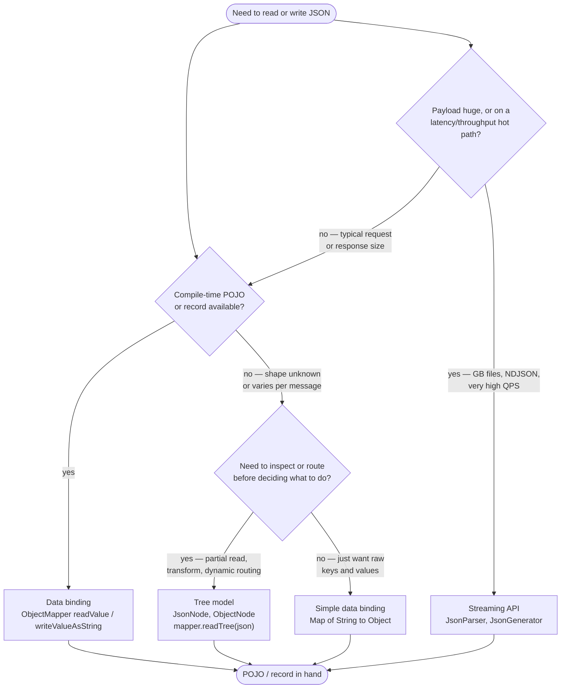
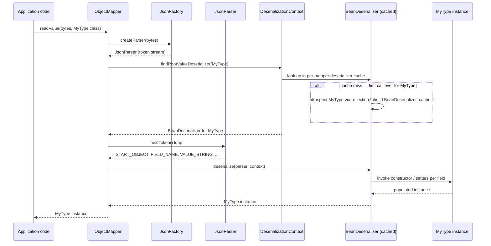
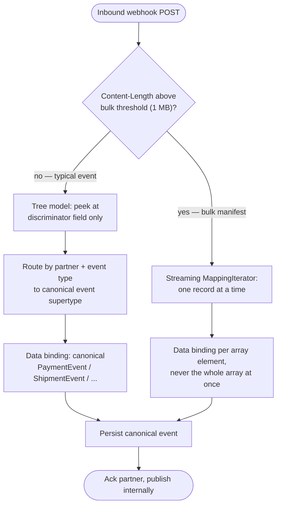

# JSON Processing with Jackson

## 1. Concept Overview

Jackson is the de facto JSON library for the Java ecosystem — it is the default JSON engine inside Spring Boot, Micronaut, Quarkus, Dropwizard, and most REST clients, and it ships three distinct processing models under one umbrella: a low-level **streaming** API, an in-memory **tree** API, and a reflection-driven **data-binding** API that maps JSON directly to POJOs and records.

Most engineers only ever touch data binding (`ObjectMapper.readValue()` / `writeValueAsString()`), which is correct for the common case but hides two things that matter at senior level: (1) all three models are layered on the same streaming core, so understanding the streaming layer explains *why* the other two behave the way they do; and (2) Jackson's convenience features — especially polymorphic ("default") typing — have a well-documented, decade-long history of enabling remote code execution when applied to untrusted input. Knowing when to reach for tree or streaming instead of data binding, and knowing exactly why `enableDefaultTyping()` is dangerous, are two of the highest-signal things a senior Java interview probes for on this topic.

---

## 2. Intuition

> **One-line analogy**: Streaming is reading a book one word at a time and reacting as you go; the tree model is scanning the whole book into a table of contents you can jump around in; data binding is having someone read the book aloud and hand you a fully-typed summary card.

**Mental model**: Every JSON document is, underneath, a sequence of *tokens* — `START_OBJECT`, `FIELD_NAME`, `VALUE_STRING`, `END_ARRAY`, and so on. `JsonParser` hands you that token stream directly (streaming). `ObjectMapper.readTree()` consumes the same token stream and builds a generic in-memory graph of `JsonNode`s out of it (tree). `ObjectMapper.readValue(json, MyType.class)` consumes the same token stream again, but this time drives a **generated deserializer** that constructs your actual Java object as tokens arrive (data binding). Nothing magic happens three separate times — the token stream is the one shared primitive, and the three "models" are three different consumers of it.

**Why it matters**: Picking the wrong model has real production consequences — using tree or data binding on a multi-gigabyte payload can OOM a service that streaming would process in constant memory; using data binding's polymorphic-typing convenience feature on attacker-controlled input has caused real remote-code-execution CVEs across the Java ecosystem. Interviewers use this topic to probe whether a candidate treats a JSON library as a black box or understands its cost and trust boundaries.

**Key insight**: `ObjectMapper` is expensive to configure but cheap to reuse — the entire point of its internal caches is that you build it once, at startup, and never touch its configuration again. Every Jackson production incident in this file traces back to violating one of two rules: either "don't rebuild what you can reuse" or "don't let untrusted JSON tell you what Java class to instantiate."

---

## 3. Core Principles

- **One streaming core, three consumers.** `JsonParser`/`JsonGenerator` are the foundation; `JsonNode` tree building and `ObjectMapper` data binding are both implemented on top of the same token stream.
- **`ObjectMapper` is a configuration-then-immutable object.** Thread-safe for concurrent reads/writes only after all `configure()`/`registerModule()`/`setXxx()` calls have completed and *before* it is shared across threads.
- **Reflection is expensive once, cheap forever.** Introspecting a class's fields, getters, setters, and annotations into a `BeanDeserializer`/`BeanSerializer` is the costly step; Jackson caches the result per `Class` so every later call for that type is a cache hit.
- **Trust boundary lives at the type level.** Binding JSON into a type you named at compile time (`readValue(json, Invoice.class)`) is safe; letting the JSON itself name the Java class to instantiate (default/polymorphic typing without an allowlist) is not.
- **Defaults are strict by design.** `FAIL_ON_UNKNOWN_PROPERTIES` defaults to `true` and `WRITE_DATES_AS_TIMESTAMPS` defaults to `true` — both surprise newcomers, and both exist so that schema drift and date-shape ambiguity fail loudly instead of silently.
- **Immutable derived readers/writers exist so you never have to touch the shared mapper.** `ObjectReader`/`ObjectWriter` are cheap, thread-safe, per-call-shape configurations built once from the shared `ObjectMapper`.

---

## 4. Types / Architectures / Strategies

### 4.1 Streaming API — `JsonParser` / `JsonGenerator`

The lowest level: `JsonParser.nextToken()` pulls one `JsonToken` at a time (`START_OBJECT`, `FIELD_NAME`, `VALUE_NUMBER_INT`, …); `JsonGenerator.writeStartObject()`/`writeStringField()` push tokens out the other direction. No object graph is ever materialized — memory use is essentially O(1) relative to document size (aside from I/O buffers). This is the fastest and lowest-level option, and the one with the most code to write by hand. Both `JsonParser` and `JsonGenerator` implement `Closeable`, so they belong in `try-with-resources` exactly like any other stream — see [Exceptions & I/O](../exceptions_and_io/README.md) for the general resource-cleanup contract.

### 4.2 Tree Model — `JsonNode` / `ObjectNode` / `ArrayNode`

`mapper.readTree(json)` consumes the token stream and builds a mutable, generic in-memory graph — effectively a DOM for JSON. Useful when the shape is unknown or varies per message (webhook payloads from many partners), when you need to inspect a discriminator field before deciding what to bind to, or when you're transforming JSON generically (redaction, JSON Merge Patch, partial updates) without owning a POJO for every shape. `JsonNode.path("x")` never returns Java `null` (it returns the `MissingNode` singleton so chained navigation like `.path("a").path("b").asText()` is NPE-safe); `JsonNode.get("x")` returns `null` when absent — a classic point of confusion.

### 4.3 Data Binding — `ObjectMapper` POJOs and records

`mapper.readValue(json, MyType.class)` / `mapper.writeValueAsString(obj)` drive a generated `BeanDeserializer`/`BeanSerializer` that builds or reads your actual typed object directly from the token stream — no intermediate tree. This is "full" data binding against your own classes; "simple" data binding (`readValue(json, Map.class)` or `Object.class`) produces generic `LinkedHashMap`/`List`/boxed-primitive structures, which is convenient for quick scripts but throws away every advantage of having real types.

### 4.4 Derived immutable views — `ObjectReader` / `ObjectWriter`

`mapper.readerFor(MyType.class)` / `mapper.writerFor(MyType.class)` return immutable, thread-safe, cheap-to-create objects that share the parent mapper's caches. Calling `.with(...)` on either returns a *new* immutable instance (fluent-builder style, like `String` methods) rather than mutating anything — which is exactly why they are safe to hand out freely without touching the shared `ObjectMapper`'s configuration.

| Model | Memory profile | Typical latency to first byte processed | Best for |
|-------|----------------|-------------------------------------------|----------|
| Streaming (`JsonParser`/`JsonGenerator`) | O(1) — token at a time | Lowest | GB-scale files, NDJSON, hot paths, custom formats |
| Tree (`JsonNode`) | O(payload), generic nodes | Medium — full parse before use | Unknown/varying schema, routing, generic transforms |
| Data binding (`ObjectMapper`) | O(payload), typed objects | Medium — full parse before use | Typical REST request/response mapping to domain types |

---

## 5. Architecture Diagrams

### Choosing a processing model



Reader note: this flowchart's nodes are intentionally left uncolored so the reader's automatic tinting applies uniformly.

Default to data binding; drop to tree only when the shape genuinely varies; drop to streaming only when payload size or hot-path latency actually demands it — each step down costs more hand-written code for less convenience.

### Deserialization pipeline — bytes to POJO



The `alt` branch only fires once per class per mapper instance — every subsequent call for `MyType` skips straight from the cache lookup to token consumption, which is the entire reason ObjectMapper reuse matters (Section 6).

### Three models, same input

```
Same JSON in all three:  {"id":42,"name":"Ada","active":true}

STREAMING -- JsonParser (token by token, nothing kept in memory)
  START_OBJECT -> FIELD_NAME id -> VALUE_NUMBER_INT 42 -> FIELD_NAME name
  -> VALUE_STRING Ada -> FIELD_NAME active -> VALUE_TRUE -> END_OBJECT
  memory: O(1) tokens at a time; you hand-write the state machine

TREE -- JsonNode (generic node graph, whole document held in memory)
  ObjectNode
    id     -> IntNode(42)
    name   -> TextNode("Ada")
    active -> BooleanNode(true)
  memory: O(payload), untyped; node.get("name").asText() -- no compile-time check

DATA BINDING -- ObjectMapper (typed object, whole object held in memory)
  User { id = 42 (int), name = "Ada" (String), active = true (boolean) }
  memory: O(payload), typed; user.getName() -- compiler-checked, IDE autocomplete

Control vs convenience:  streaming >>> tree > data binding
Code you must write:     streaming >>> tree > data binding
```

The same six tokens feed all three models — the difference is entirely in what each layer chooses to keep and how much type information survives the trip.

### ObjectMapper reuse vs recreate — per-call cost

```
Cost of one (de)serialize call -- bar length is order-of-magnitude, not to scale

new ObjectMapper() every single call     ################   ~10-20 ms   (construct + introspect)
shared ObjectMapper, first call ever     ################   ~10-20 ms   (introspect once, cached)
shared ObjectMapper, every call after    ##                 ~1-50 us    (cache hit, no reflection)

At 1,000 req/s, recreate-per-call spends roughly 15 CPU-seconds of every
wall-clock second inside Jackson alone -- more than one full core saturated
rebuilding metadata the process already built a moment ago.
```

The first-ever call pays the same introspection cost whether or not you reuse the mapper — the win from reuse is that every call *after* the first drops from milliseconds to low microseconds instead of paying that cost again and again.

---

## 6. How It Works — Detailed Mechanics

### ObjectMapper cost, caching, and the thread-safety contract

Constructing `new ObjectMapper()` sets up a `JsonFactory`, default serialization/deserialization configuration, and any registered modules — on the order of low single-digit milliseconds by itself. The expensive step is deferred: the first time you call `readValue`/`writeValueAsString` for a given `Class`, Jackson reflectively introspects its fields, getters, setters, and annotations, builds a `BeanDeserializer`/`BeanSerializer` for it, and stores that in an internal per-mapper cache. For a moderately complex POJO this introspection commonly costs on the order of tens of milliseconds; every later call for the same class against the same mapper is a cache hit that costs low microseconds — pure delegation to already-compiled (de)serialization logic.

This is exactly why Jackson's own contract is: an `ObjectMapper` is safe to share and use concurrently across threads **provided all configuration happens before it is shared**. The caches themselves are safe for concurrent reads. What is *not* safe is calling `mapper.configure(...)`, `mapper.registerModule(...)`, `mapper.setDateFormat(...)`, or similar mutators on an instance that other threads are already using — those configuration fields are not written with the synchronization needed to make concurrent mutation-while-reading safe, so doing so is a data race that can manifest as intermittent, load-dependent, maddening-to-reproduce formatting bugs in production.

```java
// BROKEN: a new ObjectMapper per request throws away every cache on every call
public String handle(Order order) {
    ObjectMapper mapper = new ObjectMapper();   // pays introspection cost EVERY time
    mapper.registerModule(new JavaTimeModule());
    return mapper.writeValueAsString(order);
}

// FIX: build once, reuse forever — this is the entire point of the caches
public final class OrderJson {
    private static final ObjectMapper MAPPER = JsonMapper.builder()
            .addModule(new JavaTimeModule())
            .build();                              // configured ONCE, before any sharing

    public static String toJson(Order order) throws JsonProcessingException {
        return MAPPER.writeValueAsString(order);   // cache hit after the first call
    }
}
```

When different call sites need different *shapes* of the same mapper (pretty-printing here, a stricter feature set there), do not spin up separate `ObjectMapper`s — derive immutable `ObjectReader`/`ObjectWriter` instances instead:

```java
private static final ObjectMapper MAPPER = JsonMapper.builder().addModule(new JavaTimeModule()).build();

// Cheap, thread-safe, immutable — safe to build once and store as a constant
private static final ObjectWriter PRETTY_WRITER = MAPPER.writer().withDefaultPrettyPrinter();
private static final ObjectReader ORDER_READER  = MAPPER.readerFor(Order.class);
```

### Data binding: POJOs, records, and generics

Classic POJO binding needs a no-arg constructor plus JavaBean getters/setters (or public fields, or an explicitly annotated constructor). **Java records** (Jackson 2.12+, November 2020) are supported without any annotation for the simple case: Jackson's introspector recognizes `Class.getRecordComponents()` and treats the canonical constructor as an implicit creator. This works more reliably than plain-class constructor binding because record component names are always available via reflection (JEP 359) regardless of compiler flags — ordinary classes need `-parameters` or `@ConstructorProperties`/explicit `@JsonProperty` on every constructor argument to recover parameter names, but a record never loses them.

```java
public record UserDto(long id, String name, @JsonProperty("is_active") boolean active) {
    // Compact constructor still runs — a natural place for validation
    public UserDto {
        if (id <= 0) throw new IllegalArgumentException("id must be positive");
    }
}

// No @JsonCreator needed for the simple case:
UserDto u = MAPPER.readValue(json, UserDto.class);
```

**Generics and `TypeReference` — the type-erasure trap.** `mapper.readValue(json, List.class)` compiles cleanly but silently loses the element type: the JVM erases generic parameters at compile time, so all Jackson ever sees is a raw `Class` token for `List`. The result is a `List` of generic `LinkedHashMap`s (for JSON objects), not a `List<Invoice>` — any later cast to `Invoice` throws `ClassCastException` far away from the actual mistake.

```java
// BROKEN: compiles fine, fails at runtime, far from the actual bug
List<Invoice> invoices = mapper.readValue(json, List.class);   // unchecked warning ignored
Invoice first = invoices.get(0);                                // ClassCastException: LinkedHashMap!

// FIX: TypeReference captures the full generic signature via a subclass
List<Invoice> invoices =
        mapper.readValue(json, new TypeReference<List<Invoice>>() {});
```

`TypeReference` is declared `abstract`, so the anonymous subclass body (`{}`) is mandatory — it is precisely *being a subclass* that lets Jackson call `getClass().getGenericSuperclass()` and read the reified `List<Invoice>` signature out of the class file. For generic-utility code that doesn't have a literal type available at the call site, build the type programmatically instead: `mapper.getTypeFactory().constructCollectionType(List.class, Invoice.class)`.

### Annotations that shape the mapping

```java
public class InvoiceDto {

    @JsonProperty("invoice_id")
    private final String id;

    @JsonInclude(JsonInclude.Include.NON_NULL)   // omit this field from output when null
    private final String customerNote;

    @JsonIgnore
    private final String internalAuditTrail;      // never serialized or deserialized

    @JsonFormat(shape = JsonFormat.Shape.STRING, pattern = "yyyy-MM-dd")
    private final LocalDate dueDate;

    // constructor, getters omitted
}
```

`PropertyNamingStrategies.SNAKE_CASE` (Jackson 2.12+; the modern replacement for the older singleton-based `PropertyNamingStrategy`) applies the `camelCase` <-> `snake_case` conversion mapper-wide instead of annotating every field individually — the common choice when the Java service talks to Python/Ruby/JS clients that default to snake_case:

```java
ObjectMapper mapper = JsonMapper.builder()
        .propertyNamingStrategy(PropertyNamingStrategies.SNAKE_CASE)
        .build();
```

### java.time support

Out of the box, a stock `ObjectMapper` does not know how to (de)serialize `LocalDateTime`, `Instant`, `Duration`, or any other `java.time` type — it throws an `InvalidDefinitionException` whose message names the missing module. The fix is registering `JavaTimeModule` from `jackson-datatype-jsr310`:

```java
ObjectMapper mapper = JsonMapper.builder()
        .addModule(new JavaTimeModule())
        .build();
```

Spring Boot auto-configures this for you, which is precisely why the failure mode is almost never seen by Spring users but hits plain-Jackson code (batch jobs, shared libraries, non-Spring microservices) constantly. Once the module is registered, the *next* surprise is date shape: `SerializationFeature.WRITE_DATES_AS_TIMESTAMPS` defaults to `true`, so `LocalDateTime`/`Instant` fields serialize as numeric arrays (`[2026,7,7,10,15,30]`) rather than ISO-8601 strings unless you disable it:

```java
ObjectMapper mapper = JsonMapper.builder()
        .addModule(new JavaTimeModule())
        .disable(SerializationFeature.WRITE_DATES_AS_TIMESTAMPS)   // -> "2026-07-07T10:15:30"
        .build();
```

### Polymorphic deserialization and the default-typing CVE history

The safe way to deserialize into one of several subtypes is a **closed, explicitly-enumerated allowlist**:

```java
@JsonTypeInfo(use = JsonTypeInfo.Id.NAME, include = JsonTypeInfo.As.PROPERTY, property = "type")
@JsonSubTypes({
    @JsonSubTypes.Type(value = CardPayment.class,   name = "card"),
    @JsonSubTypes.Type(value = WalletPayment.class, name = "wallet"),
    @JsonSubTypes.Type(value = BankTransfer.class,  name = "bank_transfer")
})
public sealed interface PaymentMethod permits CardPayment, WalletPayment, BankTransfer {}
```

Contrast that with **default typing** — a mapper-wide setting that embeds the *runtime* Java class name into the JSON (as an `"@class"` property by default) for essentially any `Object`-typed field, and on deserialization instantiates whatever class name shows up in the JSON:

```java
// BROKEN: never do this against JSON you did not fully control end to end
ObjectMapper mapper = new ObjectMapper();
mapper.enableDefaultTyping();                          // deprecated, dangerous
Object obj = mapper.readValue(untrustedRequestBody, Object.class);
// an attacker sends {"@class":"some.gadget.ClassOnTheClasspath", ...} -> RCE
```

If that JSON comes from an untrusted caller, the attacker can name **any class on the runtime classpath**, including third-party library classes never intended for deserialization, whose constructors/setters — when chained together — perform dangerous side effects (a "gadget chain," the same class of bug 2015's "Marshalling Pickles" research made famous for native Java serialization). **CVE-2017-7525** is the canonical origin: `enableDefaultTyping()` combined with Apache Commons Collections on the classpath produced unauthenticated remote code execution. Jackson's first response was a hardcoded blacklist of known-dangerous classes — which triggered years of whack-a-mole as new gadget classes turned up in other common libraries (Spring, c3p0, Groovy, and more), each one requiring a new CVE and a blacklist update, **CVE-2019-12384** among the more than one hundred that followed between 2017 and 2020. A blacklist can never be complete because the attack surface is "every class on the classpath," including jars the Jackson maintainers have never heard of.

The real fix, shipped in Jackson 2.10 (2019), replaced the blacklist with an **allowlist**: `PolymorphicTypeValidator`. Default typing without a validator is refused since 2.10.

```java
// If default typing is truly unavoidable, gate it with an explicit allowlist:
PolymorphicTypeValidator ptv = BasicPolymorphicTypeValidator.builder()
        .allowIfSubType("com.example.payments.model.")
        .build();
ObjectMapper mapper = JsonMapper.builder()
        .activateDefaultTyping(ptv, ObjectMapper.DefaultTyping.NON_FINAL)
        .build();

// Strongly preferred: skip default typing entirely and use a closed
// @JsonTypeInfo / @JsonSubTypes set, as shown above — no class name ever
// comes from the caller.
```

### Config gotchas

- **`FAIL_ON_UNKNOWN_PROPERTIES`** (`DeserializationFeature`, default `true`) throws `UnrecognizedPropertyException` the instant JSON contains a field with no matching property — brittle the moment an upstream service or partner adds a field you don't care about. Disable globally (`mapper.disable(...)`) or per-class (`@JsonIgnoreProperties(ignoreUnknown = true)`) for external contracts you don't control; many teams deliberately leave it `true` for internal service-to-service contracts so a typo'd field name fails fast instead of being silently ignored.
- **`@JsonAnySetter`** routes any JSON property that doesn't match a declared field into a method (typically populating a `Map<String,Object>`) instead of erroring or silently dropping it — useful for round-tripping or forwarding a payload you don't fully model.
- **Failure on "empty beans"** (`SerializationFeature.FAIL_ON_EMPTY_BEANS`, default `true`) throws `InvalidDefinitionException: ... no properties discovered` when Jackson finds zero serializable properties on a class — often a marker class, a class with only private fields and no getters/annotations, or (before registering the right module) a Kotlin data class.

### Performance levers

Beyond reusing the mapper (already covered above), the streaming API is the right tool for payloads too large to fully materialize, and Jackson ships two bytecode/method-handle-generation modules that replace reflective getter/setter calls with generated accessors: **Afterburner** (`jackson-module-afterburner`, ASM-generated bytecode, roughly 30-40% faster on typical POJOs, no longer actively evolved for the newest JDKs) and its modern replacement **Blackbird** (`jackson-module-blackbird`, `MethodHandle`-based, the recommended choice on JDK 11+). Jackson also internally recycles parser/generator buffers and symbol tables per `JsonFactory` — another reason a shared, long-lived `ObjectMapper` outperforms constructing fresh ones.

```java
ObjectMapper mapper = JsonMapper.builder()
        .addModule(new BlackbirdModule())   // MethodHandle-generated accessors, JDK 11+
        .build();
```

For payloads too large to hold as a tree or a fully-materialized list, stream one element at a time with `MappingIterator` instead of `readValue(json, List.class)`:

```java
try (JsonParser parser = MAPPER.getFactory().createParser(hugeFile);
     MappingIterator<InvoiceLine> it = MAPPER.readerFor(InvoiceLine.class)
             .readValues(parser)) {
    while (it.hasNext()) {
        process(it.next());   // one InvoiceLine materialized at a time, not 2M of them
    }
}
```

Cross-reference: for the type-erasure and reflection concepts underlying `TypeReference` and bean introspection, see [Generics & Type System](../generics_and_type_system/README.md); for the cryptographic and secure-deserialization principles behind the CVE history above, see [Security & Cryptography](../security_and_cryptography/README.md).

---

## 7. Real-World Examples

- **Spring Boot's `Jackson2ObjectMapperBuilder`** auto-configures and hands out a single application-scoped `ObjectMapper` bean (with `JavaTimeModule` already registered) — the singleton-reuse pattern this file recommends is Spring's *default*, not an opt-in optimization.
- **Twitter's API** serializes 64-bit Snowflake IDs as both a JSON number (`id`) and a string (`id_str`) — JavaScript's `Number` type loses precision above 2^53, so any JSON consumer parsing the numeric field in a browser silently corrupts large IDs. The lesson generalizes directly to Jackson: prefer `String`/`@JsonFormat(shape = STRING)` for any 64-bit identifier that might cross into JavaScript.
- **Log and event pipelines** (Kafka consumers, bulk ETL jobs) parsing newline-delimited JSON (NDJSON) at hundreds of thousands of records per second use the streaming API or `MappingIterator` specifically to avoid materializing the whole file as a tree or a `List`.
- **Payment and billing APIs** configure `DeserializationFeature.USE_BIG_DECIMAL_FOR_FLOATS` to avoid `double` rounding error on money fields — parsing `19.99` as a Java `double` and later re-serializing it can drift by fractions of a cent at scale.
- **The default-typing CVE lineage** (CVE-2017-7525 onward) affected a wide swath of the Java ecosystem precisely because so many frameworks exposed a generic `Object`-typed field somewhere in a request-handling path — the vulnerability class, not any single vendor, is the real-world example worth internalizing.

---

## 8. Tradeoffs

| Aspect | Streaming | Tree | Data Binding |
|--------|-----------|------|---------------|
| Memory | O(1) | O(payload), generic nodes | O(payload), typed objects |
| Speed | Fastest | Medium | Medium (fast once cached) |
| Code you write | Most (manual state machine) | Some (manual navigation) | Least (framework does the mapping) |
| Type safety | None (tokens) | None (generic nodes) | Full (compiler-checked) |
| Best for | GB-scale files, hot paths | Unknown/varying schema, routing | Typical REST mapping |

| Aspect | Jackson | Gson | JSON-B (Yasson) | Manual streaming |
|--------|---------|------|------------------|-------------------|
| Raw speed | Fastest general-purpose (Afterburner/Blackbird push it further) | Good, slightly behind Jackson on deep object graphs | Comparable to Jackson databind | Fastest possible — you own every allocation |
| Ecosystem | Largest — Spring default, JSR-310/Kotlin/Scala/XML/YAML/CSV modules | Simple, Android-friendly, minimal dependencies | Jakarta EE standard (JSR 367), portable across compliant runtimes | None — fully custom |
| Streaming API | Yes (`JsonParser`/`JsonGenerator`) | Yes (`JsonReader`/`JsonWriter`) | Limited | Is the streaming API |
| Polymorphism | `@JsonTypeInfo`/`@JsonSubTypes`; historically risky default typing (now allowlisted) | `RuntimeTypeAdapterFactory` — manual, allowlist-shaped by construction | `@JsonbTypeInfo`, newer and less battle-tested | Fully manual, fully explicit |
| Security track record | Long CVE history from default typing, fixed via `PolymorphicTypeValidator` since 2.10 | No equivalent history — never shipped an attacker-controlled default-typing feature | Smaller attack surface, less scrutinized in the wild | Depends entirely on what you build |
| Best for | Spring/Java-EE-style backends, complex object graphs, broad interop | Android, simple DTOs, minimal setup | Jakarta EE portability requirement | Ultra-high-throughput log/event pipelines |

---

## 9. When to Use / When NOT to Use

**Use data binding (the default choice) when:**
- The JSON shape is known at compile time and maps cleanly to a POJO or record.
- You want compiler-checked field access and IDE autocomplete on the result.
- Payload sizes are typical request/response scale (bytes to low megabytes).

**Use the tree model when:**
- The schema is unknown, partner-controlled, or varies per message and you need to inspect a discriminator field before deciding what to do.
- You are transforming or partially updating JSON generically (redaction, merge-patch) without owning a POJO for every shape.

**Use the streaming API when:**
- Payloads are gigabyte-scale or the code path is latency/throughput-critical enough that reflection and object-graph overhead matter.
- You are building a custom format bridge (e.g., JSON to a binary wire format) and need direct token-level control.

**Do NOT:**
- Enable default/polymorphic typing against any input an external caller can influence — use a closed `@JsonTypeInfo`/`@JsonSubTypes` set instead.
- Construct a new `ObjectMapper` per request, per message, or in a hot loop — build one at startup and reuse it (or derive `ObjectReader`/`ObjectWriter`).
- Materialize a `JsonNode` tree or a full `List<T>` for a payload too large to comfortably fit in heap — stream it.

---

## 10. Common Pitfalls

### War Story 1: "Flexible" default typing became an RCE finding

A team building an internal automation platform exposed an endpoint that accepted a generic `payload` field — sometimes a card charge, sometimes a webhook config, sometimes a script parameter — and reached for `mapper.enableDefaultTyping()` so the field could hold "any" object without hand-writing a closed type hierarchy. Eight months later, a routine penetration test sent a crafted body with an `"@class"` property naming a class from a logging library sitting transitively on the classpath, and the pentest report came back with remote code execution as the finding. The fix was exactly the allowlist pattern shown in Section 6: replace default typing with `@JsonTypeInfo`/`@JsonSubTypes` naming only the three or four payload shapes the endpoint actually needed, closing off the "any class on the classpath" attack surface entirely.

```java
mapper.enableDefaultTyping();                                    // BROKEN
Object payload = mapper.readValue(untrustedBody, Object.class);  // attacker picks the class

@JsonTypeInfo(use = JsonTypeInfo.Id.NAME, include = JsonTypeInfo.As.PROPERTY, property = "kind")
@JsonSubTypes({ @JsonSubTypes.Type(value = ChargeRequest.class, name = "charge"),
                @JsonSubTypes.Type(value = WebhookConfig.class, name = "webhook") })
interface AutomationPayload {}                                   // FIXED: closed allowlist
```

### War Story 2: A bulk export blew up the heap via the tree model

A reporting job pulled a partner's daily export — a single JSON array that had grown from a few megabytes to roughly 500 MB over a year of account growth — and called `mapper.readTree(response)` to inspect and filter records before persisting them. The job had run fine for a year; the week it OOM'd, on-call discovered that `JsonNode` materializes every scalar and object as a full Java object (boxed numbers, `HashMap`-backed `ObjectNode`s, per-node overhead), commonly inflating a compact JSON payload to three to five times its raw byte size in heap — a 500 MB document had been quietly costing 1.5-2.5 GB, and the day it crossed the container's heap limit, the job died mid-run with a partially-written output file. The fix was switching from `readTree` to a `MappingIterator` over the array, processing one record at a time in O(1) memory instead of materializing the whole array as a tree.

```java
// BROKEN: whole 500 MB array becomes a JsonNode graph before anything is filtered
JsonNode root = mapper.readTree(response.getInputStream());
for (JsonNode record : root) { process(record); }

// FIXED: stream element by element, one record resident at a time
try (JsonParser p = mapper.getFactory().createParser(response.getInputStream());
     MappingIterator<ExportRecord> it = mapper.readerFor(ExportRecord.class).readValues(p)) {
    while (it.hasNext()) { process(it.next()); }
}
```

### Additional pitfalls

1. **Mutating a shared mapper's configuration at runtime.** A developer called `mapper.setDateFormat(...)` from a request-scoped code path "just for this response," on the same singleton every other thread was using — the result was intermittent, load-dependent date formatting bugs that only reproduced under concurrent traffic, never in a single-threaded test.
2. **Missing `JavaTimeModule` surfacing only in production.** A field of type `Instant` was added to a DTO in a non-Spring batch service; local tests used a hand-rolled mapper that happened to have the module registered, but the production mapper did not — the deploy failed at the first request touching that field with `InvalidDefinitionException`.
3. **`FAIL_ON_UNKNOWN_PROPERTIES` breaking on a partner's routine schema change.** A partner added an undocumented field to their webhook payload; every consumer with the default `true` setting started throwing `UnrecognizedPropertyException` and dropping the webhook, even though not a single consumer cared about the new field.
4. **Type erasure producing a `ClassCastException` far from the real bug.** `readValue(json, List.class)` compiled without warning; the `ClassCastException` surfaced two call frames later where the list's elements were finally cast to the expected type, sending the on-call engineer down the wrong path before someone noticed the missing `TypeReference`.

---

## 11. Technologies & Tools

| Tool / Library | Purpose | Notes |
|-----------------|---------|-------|
| `jackson-databind` | `ObjectMapper`, data binding, tree model | The module most code depends on directly |
| `jackson-core` | `JsonParser`/`JsonGenerator`, streaming | Foundation layer for the other two modules |
| `jackson-annotations` | `@JsonProperty`, `@JsonIgnore`, etc. | Lightweight, no databind dependency |
| `jackson-datatype-jsr310` | `JavaTimeModule` | Required for any `java.time` type |
| `jackson-datatype-jdk8` | `Optional`, `OptionalInt`, etc. support | Pairs with JDK 8+ idioms |
| `jackson-module-parameter-names` | Recovers constructor parameter names for plain classes | Needed alongside `-parameters` for non-record POJOs |
| `jackson-module-afterburner` | Bytecode-generated accessors | Older performance module |
| `jackson-module-blackbird` | `MethodHandle`-generated accessors | Recommended over Afterburner on JDK 11+ |
| `jackson-dataformat-yaml` / `-csv` / `-xml` | Same data-binding model, different wire format | Reuse your POJOs/records across formats |
| Spring `Jackson2ObjectMapperBuilder` | Application-scoped `ObjectMapper` bean | Auto-registers `JavaTimeModule` and sensible defaults |
| Gson | Alternative JSON library | Simpler, Android-friendly, no default-typing RCE surface |
| JSON-B (Yasson) | Jakarta EE standard JSON binding | Portability across compliant runtimes |

---

## 12. Interview Questions with Answers

**Is ObjectMapper thread-safe?**
Yes, once fully configured — but reconfiguring it after sharing across threads is not safe. Jackson's own contract is that all `configure()`/`registerModule()`/`setXxx()` calls must complete before the instance is shared; the per-type (de)serializer caches are safe for concurrent reads after that point. Build one mapper at startup, treat it as effectively immutable, and use derived `ObjectReader`/`ObjectWriter` instances for any per-call variation instead of mutating the shared mapper.

**Why is creating a new ObjectMapper for every request an anti-pattern?**
Because construction plus first-use reflection costs on the order of tens of milliseconds that a shared instance pays only once. Every new `ObjectMapper` starts with cold `BeanDeserializer`/`BeanSerializer` caches, so it repeats the expensive introspection step on every single call instead of hitting a warm cache — at meaningful request volume this is one to several CPU-seconds of pure waste per wall-clock second. Build the mapper once at startup (or as a Spring-managed singleton) and reuse it for the life of the process.

**What made `enableDefaultTyping()` dangerous, and how did Jackson fix it?**
It let attacker-controlled JSON name the exact Java class to instantiate, enabling gadget-chain remote code execution. CVE-2017-7525 was the canonical origin (default typing plus Commons Collections on the classpath); Jackson's initial blacklist-based mitigation triggered years of whack-a-mole as new dangerous classes were found in other libraries, including CVE-2019-12384 among more than a hundred similar CVEs through 2020. Jackson 2.10 replaced the blacklist with an allowlist-based `PolymorphicTypeValidator`, but the real fix is avoiding default typing entirely in favor of a closed `@JsonTypeInfo`/`@JsonSubTypes` set you control.

**Why does `mapper.readValue(json, List.class)` silently lose the element type?**
Type erasure removes generic parameters at compile time, so the JVM only ever sees a raw `List` of `Object`. The call compiles without warning and returns a list of generic `LinkedHashMap`s rather than your intended element type, producing a `ClassCastException` wherever the first element is finally cast. The fix is `mapper.readValue(json, new TypeReference<List<MyType>>() {})`, whose mandatory anonymous-subclass body is what lets Jackson recover the reified generic signature via `getGenericSuperclass()`.

**Why does deserializing a `LocalDateTime` field fail with a stock ObjectMapper?**
Jackson has no built-in support for `java.time` types until the `JavaTimeModule` is registered. The fix is adding `jackson-datatype-jsr310` and calling `registerModule(new JavaTimeModule())` (Spring Boot does this automatically, which is why the failure is mostly seen in non-Spring code). Once registered, the next surprise is that dates serialize as numeric timestamp arrays by default — disable `SerializationFeature.WRITE_DATES_AS_TIMESTAMPS` to get ISO-8601 strings instead.

**What does `FAIL_ON_UNKNOWN_PROPERTIES` do, and why is its default risky?**
It makes any JSON field without a matching POJO property throw `UnrecognizedPropertyException`, and it defaults to `true`. This is brittle across schema evolution — an upstream service adding a field you don't care about breaks every consumer that hasn't disabled the check. Disable it globally for external, partner-controlled contracts, but consider leaving it enabled for internal contracts you fully control so a genuine typo fails fast instead of being silently swallowed.

**When do you choose streaming over tree over data binding?**
Streaming for huge or hot-path payloads, tree for unknown or dynamic shapes, data binding for everything else. All three consume the same underlying token stream, so the choice is purely about how much memory and type information you need to keep around versus how much manual code you're willing to write — data binding is the default; only drop to tree or streaming when a specific constraint (unknown schema, payload size, latency) demands it.

**What is the difference between ObjectReader/ObjectWriter and ObjectMapper?**
ObjectReader and ObjectWriter are immutable, thread-safe views derived from a mapper, cheap to create for each distinct call "shape" you need. Calling `.with(...)` on either returns a new instance rather than mutating anything, so they share the parent mapper's caches without ever needing to touch its configuration — build one per shape (a pretty-printing writer, a lenient reader) once at startup and store it as a constant.

**How does Jackson bind JSON to a Java record?**
Since Jackson 2.12, the canonical constructor is treated as an implicit creator with no annotations required. Record component names are always available via reflection (JEP 359), unlike ordinary classes which need `-parameters` or explicit `@ConstructorProperties`/`@JsonProperty` to recover constructor parameter names — you can still add `@JsonCreator`/`@JsonProperty` on a record's compact constructor for renaming or validation, but the simple case needs nothing extra.

**What is `@JsonTypeInfo`/`@JsonSubTypes` and how is it safer than default typing?**
It declares a closed, application-controlled set of subtypes instead of trusting the JSON to name any class on the classpath. Because the mapping from a discriminator value (like `"card"`) to a Java class is fixed in your own code, an attacker sending an unexpected discriminator value simply fails to match a known subtype — there is no path from attacker input to arbitrary class instantiation, which is the entire class of bug default typing introduced.

**What does `@JsonInclude(NON_NULL)` do, and how does it differ from `NON_EMPTY`/`NON_DEFAULT`?**
`NON_NULL` omits only null fields, `NON_EMPTY` also omits empty strings and collections, and `NON_DEFAULT` omits fields equal to their type's default value. The default value for `NON_DEFAULT` means 0, false, or an empty-constructed object, depending on the field's type. Use `NON_NULL` for the common "don't send nulls" API convention; reach for `NON_EMPTY` or `NON_DEFAULT` only when you specifically want to compact away zero-value noise, since they can also hide a legitimately meaningful zero or empty string.

**What is `@JsonAnySetter` for?**
It collects any JSON properties that don't match a declared field into a map instead of failing or dropping them. This is useful for round-tripping payloads you don't fully model — for example forwarding a webhook body to another system while still binding the handful of fields you actually need to a typed class.

**Why would serializing a class throw "no properties discovered to create BeanSerializer"?**
Jackson found zero detectable getters, fields, or annotations on the class and refuses to silently serialize it as an empty object (`SerializationFeature.FAIL_ON_EMPTY_BEANS` defaults to `true`). Common causes are a marker/placeholder class, a class with only private fields and no getters or annotations at all, or a Kotlin data class before the Kotlin module is registered — the fix is almost always adding the missing accessor, annotation, or module rather than suppressing the check.

**What is `PropertyNamingStrategies.SNAKE_CASE` used for?**
It rewrites all property names between Java camelCase and JSON snake_case without per-field annotations. Set once on the shared mapper (`.propertyNamingStrategy(PropertyNamingStrategies.SNAKE_CASE)`) when a service's Java conventions need to interoperate with an ecosystem — Python, Ruby, most public JSON APIs — that defaults to snake_case, instead of annotating every single field with `@JsonProperty`.

**How does Jackson achieve high (de)serialization performance internally?**
It compiles a reusable `BeanDeserializer`/`BeanSerializer` per class on first use and caches it for every later call, turning reflection into a one-time cost rather than a per-call one. Beyond that base caching, the Afterburner and Blackbird modules replace the generated accessors' reflective `Method.invoke()` calls with generated bytecode or `MethodHandle`s respectively, and Jackson recycles internal parser/generator buffers and symbol tables per `JsonFactory` rather than reallocating them on every call.

**What happens when JSON contains an enum value your Java enum doesn't define?**
By default Jackson throws an `InvalidFormatException`, which breaks consumers the moment a producer adds a new enum value the consumer doesn't yet know about. Enable `DeserializationFeature.READ_UNKNOWN_ENUM_VALUES_AS_NULL` (or mark a constant with `@JsonEnumDefaultValue`) to degrade gracefully instead of failing the entire request over one unrecognized value.

**What is the difference between `@JsonCreator` delegating mode and properties mode?**
Delegating mode treats the single constructor argument as the entire value being deserialized; properties mode binds named JSON fields to individually named constructor parameters. A single-argument constructor annotated `@JsonCreator` without an explicit `mode` is genuinely ambiguous between the two, and Jackson's inference gets it wrong often enough in practice that explicitly specifying `mode = JsonCreator.Mode.PROPERTIES` (or `DELEGATING`) on single-argument creators is the safer habit.

**How do you avoid infinite recursion when serializing bidirectional JPA relationships?**
Break the cycle with `@JsonManagedReference`/`@JsonBackReference` on the two sides of the relationship, or more robustly with `@JsonIdentityInfo` to serialize repeated references by ID after the first occurrence. The symptom without a fix is a `StackOverflowError` as parent and child entities serialize each other forever; the most robust production fix is usually to stop serializing entities directly at all and project to a dedicated DTO that has no back-reference to serialize in the first place.

**What is the memory risk of using the tree model on very large payloads?**
`JsonNode` materializes the entire document as generic Java objects, commonly three to five times the raw payload's byte size. The overhead comes from boxed numbers, per-node object headers, and `HashMap`-backed `ObjectNode`s; for a payload in the hundreds of megabytes or larger, that multiplier is the difference between comfortably fitting in heap and an `OutOfMemoryError`, so switch to the streaming API or a `MappingIterator` once a single document's tree would occupy a meaningful fraction of available heap.

**`JsonNode.get()` vs `JsonNode.path()` — what's the difference and why does it matter?**
`get()` returns Java `null` for a missing field while `path()` returns a safe `MissingNode` you can keep chaining on. `node.path("a").path("b").asText()` never throws a `NullPointerException` even if `"a"` or `"b"` is absent at any level, whereas the same chain written with `get()` throws as soon as one link in the chain is missing — prefer `path()` for defensive navigation through JSON of uncertain shape.

---

## 13. Best Practices

1. **Build one `ObjectMapper` per application and reuse it for the process lifetime** — never construct one per request, per message, or inside a loop.
2. **Configure fully before sharing, then treat the mapper as immutable** — derive `ObjectReader`/`ObjectWriter` for any per-call variation instead of mutating a shared instance.
3. **Never enable default/polymorphic typing against caller-influenced input** — use a closed `@JsonTypeInfo`/`@JsonSubTypes` allowlist for any type that varies by shape.
4. **Always register `JavaTimeModule`** when any `java.time` type appears in a model, and decide `WRITE_DATES_AS_TIMESTAMPS` deliberately rather than accepting the array-shaped default by accident.
5. **Use `TypeReference` (or `TypeFactory`) for every generic collection type** — never hand a raw `Class` to `readValue` when the element type matters.
6. **Reach for the streaming API or `MappingIterator`** the moment a payload is large enough that materializing a tree or full list would be a meaningful fraction of available heap.
7. **Decide `FAIL_ON_UNKNOWN_PROPERTIES` per contract, not globally by accident** — lenient for partner/external payloads that evolve out of your control, strict for internal contracts you own end to end.
8. **Prefer Java records for new DTOs** — Jackson 2.12+ binds them with zero extra annotation in the common case, and their immutability sidesteps a class of partial-construction bugs POJOs are prone to.
9. **Add Blackbird (not Afterburner) for reflection-heavy hot paths on JDK 11+** — measure first; the base cache alone is often enough.
10. **Never catch and swallow `JsonProcessingException`** — it almost always signals either a real data-contract bug or a security-relevant malformed payload, not a condition to paper over.

---

## 14. Case Study

### A Webhook Ingestion Gateway Processing 50,000 Events/sec from 200 Partner Integrations

**Scenario.** A platform ingests inbound webhooks from roughly 200 partner integrations — payment providers, shipping carriers, and marketplace platforms — at a sustained 50,000 events/sec with bursts to 3x during partner batch jobs. Individual webhook bodies range from a few hundred bytes (a single status update) to 50 MB (a shipping carrier's daily bulk manifest sent as one JSON array). Partners evolve their payload shapes without notice, and the gateway must never let one partner's malformed or oversized payload take down ingestion for the other 199.



The size check is the single most important routing decision in the pipeline — everything downstream of it exists specifically to keep one partner's 50 MB manifest from being treated the same way as a 300-byte status ping.

#### Canonical event hierarchy — closed allowlist, not default typing

```java
@JsonTypeInfo(use = JsonTypeInfo.Id.NAME, include = JsonTypeInfo.As.PROPERTY, property = "eventType")
@JsonSubTypes({
    @JsonSubTypes.Type(value = PaymentEvent.class,  name = "payment"),
    @JsonSubTypes.Type(value = ShipmentEvent.class, name = "shipment"),
    @JsonSubTypes.Type(value = RefundEvent.class,   name = "refund")
})
public sealed interface CanonicalEvent permits PaymentEvent, ShipmentEvent, RefundEvent {
    String partnerId();
    Instant receivedAt();
}

public record PaymentEvent(
        String partnerId, Instant receivedAt,
        String paymentId, BigDecimal amount, String currency) implements CanonicalEvent {}

public record ShipmentEvent(
        String partnerId, Instant receivedAt,
        String trackingNumber, String carrier) implements CanonicalEvent {}

public record RefundEvent(
        String partnerId, Instant receivedAt,
        String originalPaymentId, BigDecimal amount) implements CanonicalEvent {}
```

The discriminator (`eventType`) only ever selects among three internal record types the platform itself defines — a partner's payload can influence *which* of these three gets constructed, never *whether an arbitrary classpath class* gets constructed, which is exactly the distinction that separates this from the default-typing vulnerability class in Section 6.

#### Shared mapper and per-partner ObjectReader cache

```java
@Component
public final class WebhookMapper {

    // Configured once at startup, shared for the process lifetime.
    private final ObjectMapper mapper = JsonMapper.builder()
            .addModule(new JavaTimeModule())
            .disable(SerializationFeature.WRITE_DATES_AS_TIMESTAMPS)
            .disable(DeserializationFeature.FAIL_ON_UNKNOWN_PROPERTIES)   // partners add fields often
            .build();

    // Immutable, thread-safe, cheap to derive — one per canonical type, built once.
    private final Map<Class<?>, ObjectReader> readersByType = Map.of(
            PaymentEvent.class,  mapper.readerFor(PaymentEvent.class),
            ShipmentEvent.class, mapper.readerFor(ShipmentEvent.class),
            RefundEvent.class,   mapper.readerFor(RefundEvent.class));

    public JsonNode peekDiscriminator(byte[] body) throws IOException {
        // Tree model: read just enough to decide how to route, nothing else.
        return mapper.readTree(body).path("eventType");
    }

    public <T extends CanonicalEvent> T bind(byte[] body, Class<T> type) throws IOException {
        return readersByType.get(type).forType(type).readValue(body);
    }

    public ObjectMapper rawMapper() { return mapper; }   // for the streaming path below
}
```

#### Streaming path for bulk manifests

```java
public void ingestBulkManifest(InputStream carrierManifest, WebhookMapper webhookMapper) throws IOException {
    ObjectMapper mapper = webhookMapper.rawMapper();
    try (JsonParser parser = mapper.getFactory().createParser(carrierManifest);
         MappingIterator<ShipmentEvent> it =
                 mapper.readerFor(ShipmentEvent.class).readValues(parser)) {
        while (it.hasNext()) {
            publish(it.next());   // one ShipmentEvent resident at a time, not 50 MB of them
        }
    }
}
```

### Common Pitfalls (production war stories)

**1. The first version used a fresh ObjectMapper per webhook.** Early code built `new ObjectMapper()` inside the request handler "to keep things simple." At 50,000 events/sec this alone consumed more CPU than the rest of the ingestion logic combined; switching to the shared, startup-configured mapper above cut Jackson's share of CPU time by roughly an order of magnitude.

**2. A carrier's manifest format grew past the in-memory threshold without anyone updating the router.** The size check initially compared against a 10 MB constant set when manifests were small; a carrier's holiday-season manifest crossed 10 MB, got routed down the tree/databind path instead of streaming, and the ingestion pod OOM'd. The fix paired the size threshold with a hard cap that forces streaming above any threshold, plus alerting when actual payload sizes approach it.

**3. Leaving `FAIL_ON_UNKNOWN_PROPERTIES` at its default `true` broke ingestion the first time a partner added a field.** A payment partner added an undocumented `riskScore` field to their webhook; every event from that partner started failing with `UnrecognizedPropertyException` until someone disabled the check platform-wide, as shown in the mapper configuration above.

### Interview Discussion Points

**Why use the tree model just to peek at `eventType` instead of binding directly to a supertype?** Because the discriminator must be read before the platform knows which canonical record type to bind into — `readTree` materializes enough structure to make that routing decision without committing to (or being blocked by) a specific target class, and without paying for full data binding twice.

**Why is `@JsonTypeInfo`/`@JsonSubTypes` safe here when default typing would not be?** The three permitted subtypes are fixed in the platform's own code, not derived from anything the partner sends — a partner can only select among `payment`/`shipment`/`refund`, never name an arbitrary class on the classpath, which is exactly the boundary that separates safe closed polymorphism from the CVE-2017-7525 class of vulnerability.

**Why derive per-type `ObjectReader`s instead of just calling `mapper.readValue()` everywhere?** The readers are immutable and reusable, so building them once at startup and looking them up by type avoids repeated `readerFor()` calls in the hot path — a minor win compared to the mapper-reuse win, but consistent with the same "configure once, reuse forever" principle.

**Why disable `FAIL_ON_UNKNOWN_PROPERTIES` platform-wide here rather than per-partner?** Because every one of the 200 partners can add fields without notice, and the gateway's job is to extract the handful of fields it actually models — accepting unknown fields silently is the correct default for this specific trust boundary, even though the opposite default is often right for internal, fully-owned contracts.

---

## Related / See Also

- [Exceptions & I/O](../exceptions_and_io/README.md) — `JsonParser`/`JsonGenerator` are `Closeable`; the same try-with-resources and suppressed-exception rules apply.
- [Generics & Type System](../generics_and_type_system/README.md) — type erasure is the root cause of the `TypeReference` requirement; PECS and reflection internals underpin bean introspection.
- [Security & Cryptography](../security_and_cryptography/README.md) — the broader secure-deserialization and untrusted-input principles behind the default-typing CVE history.
- [Java 9-21 Features](../java9_to_21_features/README.md) — records, sealed interfaces, and pattern matching used throughout this file's data-binding and polymorphism examples.
