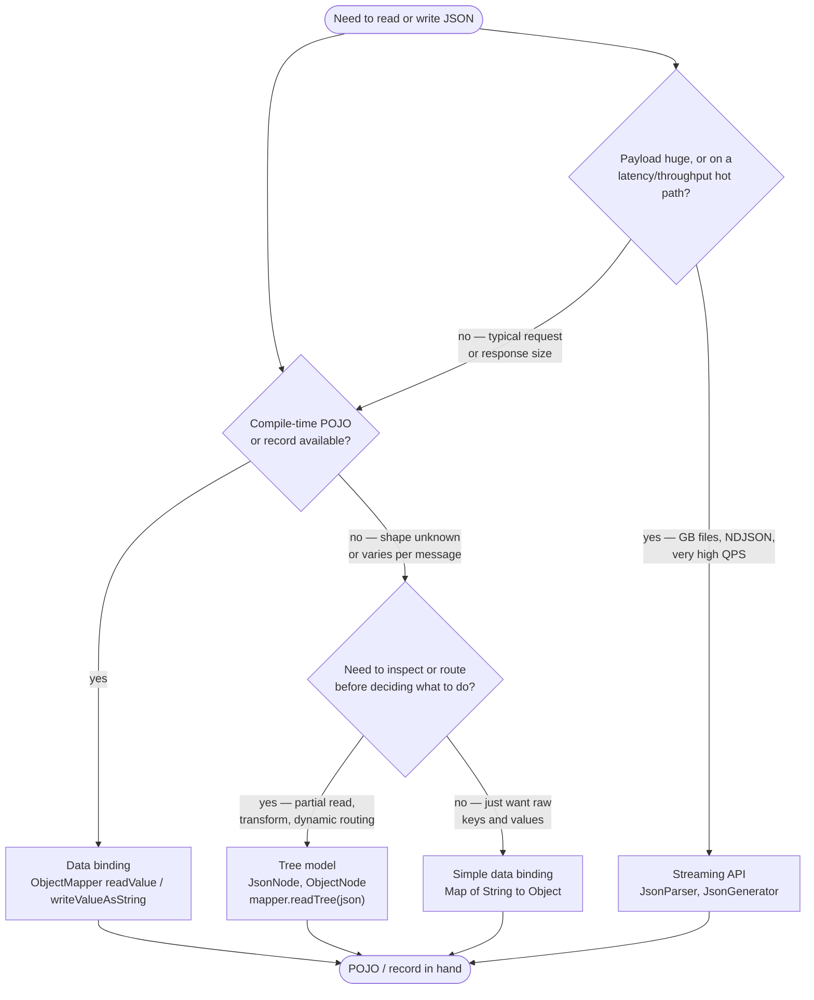
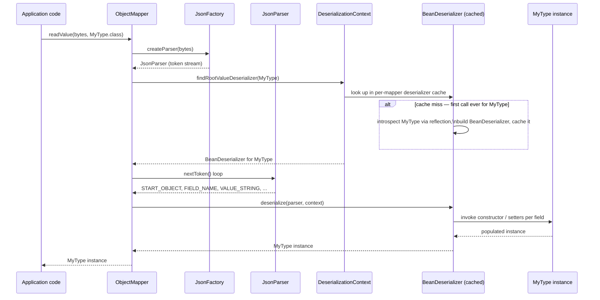
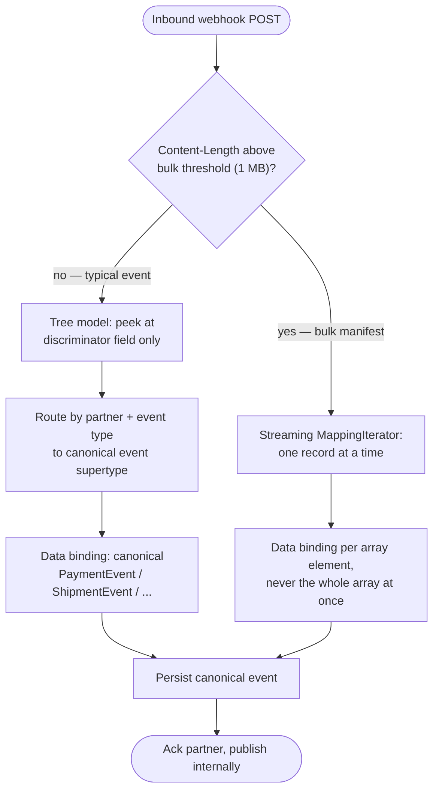

# JSON Processing with Jackson

<!-- study-paths
senior: json_processing_jackson.md
files this module contributes to each curated path; omit a tier to leave it out
-->
## 1. Concept Overview

Jackson is the de facto JSON library for the Java ecosystem — it is the default JSON engine inside Spring Boot, Micronaut, Quarkus, Dropwizard, and most REST clients, and it ships three distinct processing models under one umbrella: a low-level **streaming** API, an in-memory **tree** API, and a reflection-driven **data-binding** API that maps JSON directly to POJOs and records.

Most engineers only ever touch data binding (`ObjectMapper.readValue()` / `writeValueAsString()`), which is correct for the common case but hides two things that matter at senior level: (1) all three models are layered on the same streaming core, so understanding the streaming layer explains *why* the other two behave the way they do; and (2) Jackson's convenience features — especially polymorphic ("default") typing — have a well-documented, decade-long history of enabling remote code execution when applied to untrusted input. Knowing when to reach for tree or streaming instead of data binding, and knowing exactly why unvalidated default typing is dangerous, are two of the highest-signal things a senior Java interview probes for on this topic.

This module is written against **Jackson 3** (GA October 2025), whose coordinates are `tools.jackson.core:jackson-databind` and whose packages are `tools.jackson.*` — only the annotations stayed at `com.fasterxml.jackson.annotation`. Jackson 3 is the default JSON library in Spring Boot 4. The three facts that reshape everyday code are: mappers and stream factories are **fully immutable** and built with `JsonMapper.builder()`; **`java.time`, `Optional`, and constructor-parameter-name support are built into `jackson-databind`** with no module to register; and **every Jackson exception is unchecked** (`JacksonException`, no longer an `IOException`).

---

## 2. Intuition

> **One-line analogy**: Streaming is reading a book one word at a time and reacting as you go; the tree model is scanning the whole book into a table of contents you can jump around in; data binding is having someone read the book aloud and hand you a fully-typed summary card.

**Mental model**: Every JSON document is, underneath, a sequence of *tokens* — `START_OBJECT`, `FIELD_NAME`, `VALUE_STRING`, `END_ARRAY`, and so on. `JsonParser` hands you that token stream directly (streaming). `ObjectMapper.readTree()` consumes the same token stream and builds a generic in-memory graph of `JsonNode`s out of it (tree). `ObjectMapper.readValue(json, MyType.class)` consumes the same token stream again, but this time drives a **generated deserializer** that constructs your actual Java object as tokens arrive (data binding). Nothing magic happens three separate times — the token stream is the one shared primitive, and the three "models" are three different consumers of it.

**Why it matters**: Picking the wrong model has real production consequences — using tree or data binding on a multi-gigabyte payload can OOM a service that streaming would process in constant memory; using data binding's polymorphic-typing convenience feature on attacker-controlled input has caused real remote-code-execution CVEs across the Java ecosystem. Interviewers use this topic to probe whether a candidate treats a JSON library as a black box or understands its cost and trust boundaries.

**Key insight**: `ObjectMapper` is expensive to build but cheap to reuse — the entire point of its internal caches is that you construct it once, at startup, and hand the same instance to everyone. Jackson 3 makes that structural by sealing the mapper: there is no configuration to touch after `build()`. Every Jackson production incident in this file traces back to violating one of two rules: either "don't rebuild what you can reuse" or "don't let untrusted JSON tell you what Java class to instantiate."

---

## 3. Core Principles

- **One streaming core, three consumers.** `JsonParser`/`JsonGenerator` are the foundation; `JsonNode` tree building and `ObjectMapper` data binding are both implemented on top of the same token stream.
- **`ObjectMapper` is immutable.** Every setting is fixed by `JsonMapper.builder()...build()`; there are no setters, no `configure()`, no `registerModule()` on the finished instance. Thread safety is therefore a property of the type, not a discipline you have to enforce.
- **Reflection is expensive once, cheap forever.** Introspecting a class's fields, getters, setters, and annotations into a `BeanDeserializer`/`BeanSerializer` is the costly step; Jackson caches the result per `Class` so every later call for that type is a cache hit.
- **Trust boundary lives at the type level.** Binding JSON into a type you named at compile time (`readValue(json, Invoice.class)`) is safe; letting the JSON itself name the Java class to instantiate (default/polymorphic typing without an allowlist) is not.
- **Set the defaults you depend on explicitly.** `DeserializationFeature.FAIL_ON_UNKNOWN_PROPERTIES` and `DateTimeFeature.WRITE_DATES_AS_TIMESTAMPS` are both **off** by default, and `DeserializationFeature.FAIL_ON_TRAILING_TOKENS` is **on** — so schema drift is tolerated, dates emit ISO-8601 strings, and trailing garbage after a parsed value is rejected. Each of those is a contract decision; state it in the builder rather than inheriting it.
- **Immutable derived readers/writers exist so you never have to touch the shared mapper.** `ObjectReader`/`ObjectWriter` are cheap, thread-safe, per-call-shape configurations built once from the shared `ObjectMapper`.

---

## 4. Types / Architectures / Strategies

### 4.1 Streaming API — `JsonParser` / `JsonGenerator`

The lowest level: `JsonParser.nextToken()` pulls one `JsonToken` at a time (`START_OBJECT`, `FIELD_NAME`, `VALUE_NUMBER_INT`, …); `JsonGenerator.writeStartObject()`/`writeStringField()` push tokens out the other direction. No object graph is ever materialized — memory use is essentially O(1) relative to document size (aside from I/O buffers). This is the fastest and lowest-level option, and the one with the most code to write by hand. Both `JsonParser` and `JsonGenerator` implement `Closeable`, so they belong in `try-with-resources` exactly like any other stream — see [Exceptions & I/O](../exceptions_and_io/exceptions_and_io.md) for the general resource-cleanup contract.

### 4.2 Tree Model — `JsonNode` / `ObjectNode` / `ArrayNode`

`mapper.readTree(json)` consumes the token stream and builds a mutable, generic in-memory graph — effectively a DOM for JSON. Useful when the shape is unknown or varies per message (webhook payloads from many partners), when you need to inspect a discriminator field before deciding what to bind to, or when you're transforming JSON generically (redaction, JSON Merge Patch, partial updates) without owning a POJO for every shape. `JsonNode.path("x")` never returns Java `null` (it returns the `MissingNode` singleton so chained navigation like `.path("a").path("b").asText()` is NPE-safe); `JsonNode.get("x")` returns `null` when absent — a classic point of confusion.

### 4.3 Data Binding — `ObjectMapper` POJOs and records

`mapper.readValue(json, MyType.class)` / `mapper.writeValueAsString(obj)` drive a generated `BeanDeserializer`/`BeanSerializer` that builds or reads your actual typed object directly from the token stream — no intermediate tree. This is "full" data binding against your own classes; "simple" data binding (`readValue(json, Map.class)` or `Object.class`) produces generic `LinkedHashMap`/`List`/boxed-primitive structures, which is convenient for quick scripts but throws away every advantage of having real types.

### 4.4 Derived immutable views — `ObjectReader` / `ObjectWriter`

`mapper.readerFor(MyType.class)` / `mapper.writerFor(MyType.class)` return immutable, thread-safe, cheap-to-create objects that share the parent mapper's caches. Calling `.with(...)` on either returns a *new* immutable instance (fluent-builder style, like `String` methods) rather than mutating anything — which is exactly why they are safe to hand out freely without touching the shared `ObjectMapper`'s configuration.

| Model | Memory profile | Typical latency to first byte processed | Best for |
|-------|----------------|-------------------------------------------|----------|
| Streaming (`JsonParser`/`JsonGenerator`) | O(1) — token at a time | Lowest | GB-scale files, NDJSON, hot paths, custom formats |
| Tree (`JsonNode`) | O(payload), generic nodes | Medium — full parse before use | Unknown/varying schema, routing, generic transforms |
| Data binding (`ObjectMapper`) | O(payload), typed objects | Medium — full parse before use | Typical REST request/response mapping to domain types |

---

## 5. Architecture Diagrams

### Choosing a processing model



Reader note: this flowchart's nodes are intentionally left uncolored so the reader's automatic tinting applies uniformly.

Default to data binding; drop to tree only when the shape genuinely varies; drop to streaming only when payload size or hot-path latency actually demands it — each step down costs more hand-written code for less convenience.

### Deserialization pipeline — bytes to POJO



The `alt` branch only fires once per class per mapper instance — every subsequent call for `MyType` skips straight from the cache lookup to token consumption, which is the entire reason ObjectMapper reuse matters (Section 6).

### Three models, same input

```
Same JSON in all three:  {"id":42,"name":"Ada","active":true}

STREAMING -- JsonParser (token by token, nothing kept in memory)
  START_OBJECT -> FIELD_NAME id -> VALUE_NUMBER_INT 42 -> FIELD_NAME name
  -> VALUE_STRING Ada -> FIELD_NAME active -> VALUE_TRUE -> END_OBJECT
  memory: O(1) tokens at a time; you hand-write the state machine

TREE -- JsonNode (generic node graph, whole document held in memory)
  ObjectNode
    id     -> IntNode(42)
    name   -> StringNode("Ada")
    active -> BooleanNode(true)
  memory: O(payload), untyped; node.get("name").asText() -- no compile-time check

DATA BINDING -- ObjectMapper (typed object, whole object held in memory)
  User { id = 42 (int), name = "Ada" (String), active = true (boolean) }
  memory: O(payload), typed; user.getName() -- compiler-checked, IDE autocomplete

Control vs convenience:  streaming >>> tree > data binding
Code you must write:     streaming >>> tree > data binding
```

The same six tokens feed all three models — the difference is entirely in what each layer chooses to keep and how much type information survives the trip.

### Mapper reuse vs rebuild — per-call cost

```
Cost of one (de)serialize call -- bar length is order-of-magnitude, not to scale

fresh mapper built per call              ################   ~10-20 ms   (construct + introspect)
shared mapper, first call ever           ################   ~10-20 ms   (introspect once, cached)
shared mapper, every call after          ##                 ~1-50 us    (cache hit, no reflection)

At 1,000 req/s, recreate-per-call spends roughly 15 CPU-seconds of every
wall-clock second inside Jackson alone -- more than one full core saturated
rebuilding metadata the process already built a moment ago.
```

The first-ever call pays the same introspection cost whether or not you reuse the mapper — the win from reuse is that every call *after* the first drops from milliseconds to low microseconds instead of paying that cost again and again.

**In plain terms.** "Multiply per-call CPU time by requests per second and you get CPU-seconds burned per wall-clock second — which is just 'how many cores this costs,' and a per-call cost measured in milliseconds turns into whole cores the moment traffic is non-trivial."

Converting latency into cores is the move that makes the anti-pattern undeniable. A 15 ms cost sounds ignorable in a single trace; expressed as 15 saturated cores it stops sounding ignorable.

| Symbol | What it is |
|--------|------------|
| `t_call` | CPU time one (de)serialize call spends inside Jackson |
| `QPS` | Calls per second the process handles |
| `t_call x QPS` | CPU-seconds consumed per wall-clock second — numerically equal to cores fully saturated |
| cache hit | The post-first-call path: no reflection, no introspection, just already-compiled (de)serialization logic |

**Walk one example.** The 1,000 req/s figure from the chart above, both ways:

```
  recreate the mapper every call
    t_call    = 15 ms      = 0.015 s   (midpoint of the 10-20 ms band)
    QPS       = 1,000
    CPU/sec   = 0.015 x 1,000
              = 15 CPU-seconds per wall-clock second
              = 15 cores fully saturated, doing nothing but rebuilding metadata

  shared mapper, warm cache
    t_call    = 50 us      = 0.00005 s (top of the 1-50 us band, i.e. pessimistic)
    QPS       = 1,000
    CPU/sec   = 0.00005 x 1,000
              = 0.05 CPU-seconds per wall-clock second
              = 5% of one core

  ratio       = 15 / 0.05 = 300x
```

The 300x is measured at the *pessimistic* end of the cached range. The point is not the exact multiple — it is that the reflection cost is per-class-per-mapper, so it should be paid a fixed number of times for the life of the process, not a number of times proportional to traffic.

---

## 6. How It Works — Detailed Mechanics

### ObjectMapper cost, caching, and the thread-safety contract

`JsonMapper.builder().build()` sets up a `TokenStreamFactory` (the `JsonFactory` in the JSON case), the default serialization/deserialization configuration, and any added modules — on the order of low single-digit milliseconds by itself. The expensive step is deferred: the first time you call `readValue`/`writeValueAsString` for a given `Class`, Jackson reflectively introspects its fields, getters, setters, and annotations, builds a `BeanDeserializer`/`BeanSerializer` for it, and stores that in an internal per-mapper cache. For a moderately complex POJO this introspection commonly costs on the order of tens of milliseconds; every later call for the same class against the same mapper is a cache hit that costs low microseconds — pure delegation to already-compiled (de)serialization logic.

A `JsonMapper` is safe to share and use concurrently across every thread in the process, and Jackson 3 enforces that structurally: the mapper and its stream factory are fully immutable, so there is no `configure(...)`, no `registerModule(...)`, no `setDateFormat(...)` to race against. The whole class of intermittent, load-dependent formatting bugs that came from one request handler retuning the shared mapper is gone by construction — the only way to get a differently configured mapper is `mapper.rebuild()...build()`, which returns a *new* instance and leaves the original untouched.

```java
// BROKEN: a new mapper per request throws away every cache on every call
public String handle(Order order) {
    JsonMapper mapper = JsonMapper.builder().build();   // pays introspection cost EVERY time
    return mapper.writeValueAsString(order);
}

// FIX: build once, reuse forever — this is the entire point of the caches
public final class OrderJson {
    private static final JsonMapper MAPPER = JsonMapper.builder().build();   // built ONCE

    public static String toJson(Order order) {
        return MAPPER.writeValueAsString(order);   // cache hit after the first call
    }
}
```

Note what the `FIX` no longer needs: no date/time module, no `throws` clause. `java.time` support lives inside `jackson-databind`, and `writeValueAsString` throws the unchecked `JacksonException`.

When different call sites need different *shapes* of the same mapper (pretty-printing here, a stricter feature set there), do not spin up separate mappers — derive immutable `ObjectReader`/`ObjectWriter` instances instead:

```java
private static final JsonMapper MAPPER = JsonMapper.builder().build();

// Cheap, thread-safe, immutable — safe to build once and store as a constant
private static final ObjectWriter PRETTY_WRITER = MAPPER.writer().withDefaultPrettyPrinter();
private static final ObjectReader ORDER_READER  = MAPPER.readerFor(Order.class);
```

### Data binding: POJOs, records, and generics

Classic POJO binding needs a no-arg constructor plus JavaBean getters/setters (or public fields, or an explicitly annotated constructor). **Java records** are supported without any annotation for the simple case: Jackson's introspector recognizes `Class.getRecordComponents()` and treats the canonical constructor as an implicit creator. This works more reliably than plain-class constructor binding because record component names are always available via reflection (JEP 359) regardless of compiler flags — ordinary classes still need the class file to carry parameter names (compile with `-parameters`) or an explicit `@JsonProperty`/`@ConstructorProperties` on every constructor argument, but a record never loses them.

```java
public record UserDto(long id, String name, @JsonProperty("is_active") boolean active) {
    // Compact constructor still runs — a natural place for validation
    public UserDto {
        if (id <= 0) throw new IllegalArgumentException("id must be positive");
    }
}

// No @JsonCreator needed for the simple case:
UserDto u = MAPPER.readValue(json, UserDto.class);
```

**Generics and `TypeReference` — the type-erasure trap.** `mapper.readValue(json, List.class)` compiles cleanly but silently loses the element type: the JVM erases generic parameters at compile time, so all Jackson ever sees is a raw `Class` token for `List`. The result is a `List` of generic `LinkedHashMap`s (for JSON objects), not a `List<Invoice>` — any later cast to `Invoice` throws `ClassCastException` far away from the actual mistake.

```java
// BROKEN: compiles fine, fails at runtime, far from the actual bug
List<Invoice> invoices = mapper.readValue(json, List.class);   // unchecked warning ignored
Invoice first = invoices.get(0);                                // ClassCastException: LinkedHashMap!

// FIX: TypeReference captures the full generic signature via a subclass
List<Invoice> invoices =
        mapper.readValue(json, new TypeReference<List<Invoice>>() {});
```

`TypeReference` is declared `abstract`, so the anonymous subclass body (`{}`) is mandatory — it is precisely *being a subclass* that lets Jackson call `getClass().getGenericSuperclass()` and read the reified `List<Invoice>` signature out of the class file. For generic-utility code that doesn't have a literal type available at the call site, build the type programmatically instead: `mapper.getTypeFactory().constructCollectionType(List.class, Invoice.class)`.

### Annotations that shape the mapping

```java
public class InvoiceDto {

    @JsonProperty("invoice_id")
    private final String id;

    @JsonInclude(JsonInclude.Include.NON_NULL)   // omit this field from output when null
    private final String customerNote;

    @JsonIgnore
    private final String internalAuditTrail;      // never serialized or deserialized

    @JsonFormat(shape = JsonFormat.Shape.STRING, pattern = "yyyy-MM-dd")
    private final LocalDate dueDate;

    // constructor, getters omitted
}
```

`PropertyNamingStrategies.SNAKE_CASE` applies the `camelCase` <-> `snake_case` conversion mapper-wide instead of annotating every field individually — the common choice when the Java service talks to Python/Ruby/JS clients that default to snake_case:

```java
JsonMapper mapper = JsonMapper.builder()
        .propertyNamingStrategy(PropertyNamingStrategies.SNAKE_CASE)
        .build();
```

### java.time support

`java.time` binding is built into `jackson-databind` — `Instant`, `LocalDateTime`, `Duration` and the rest work on a stock `JsonMapper.builder().build()` with nothing registered, and they serialize as ISO-8601 strings because `DateTimeFeature.WRITE_DATES_AS_TIMESTAMPS` is off by default. The same is true of `Optional`/`OptionalInt` and of constructor-parameter-name detection: all three of what used to be separate "Java 8 modules" are now core.

Date/time behaviour is tuned through the dedicated `DateTimeFeature` enum rather than through `SerializationFeature`/`DeserializationFeature`:

```java
JsonMapper mapper = JsonMapper.builder()
        .enable(DateTimeFeature.WRITE_DATES_WITH_ZONE_ID)          // "2026-07-29T10:15:30+02:00[Europe/Paris]"
        .disable(DateTimeFeature.ADJUST_DATES_TO_CONTEXT_TIME_ZONE) // keep the offset the payload carried
        .build();
```

**The one migration hazard worth naming.** Turning on `WRITE_DATES_AS_TIMESTAMPS` (or upgrading a service that had it on) flips every `LocalDateTime` to a numeric array (`[2026,7,29,10,15,30]`) and every `Instant` to a decimal epoch value (`1785320130.000000000` for `2026-07-29T10:15:30Z`). That is a wire-format change, not a formatting preference: any consumer parsing the field as a string breaks silently on the first payload. Pin the feature explicitly in the builder and assert the emitted shape in a test, so the wire format is something the build enforces rather than something a default decides.

### Polymorphic deserialization and the default-typing CVE history

The safe way to deserialize into one of several subtypes is a **closed, explicitly-enumerated allowlist**:

```java
@JsonTypeInfo(use = JsonTypeInfo.Id.NAME, include = JsonTypeInfo.As.PROPERTY, property = "type")
@JsonSubTypes({
    @JsonSubTypes.Type(value = CardPayment.class,   name = "card"),
    @JsonSubTypes.Type(value = WalletPayment.class, name = "wallet"),
    @JsonSubTypes.Type(value = BankTransfer.class,  name = "bank_transfer")
})
public sealed interface PaymentMethod permits CardPayment, WalletPayment, BankTransfer {}
```

Contrast that with **default typing** — a mapper-wide setting that embeds the *runtime* Java class name into the JSON (as an `"@class"` property, say) for essentially any `Object`-typed field, and on deserialization instantiates whatever class name shows up in the JSON. If that JSON comes from an untrusted caller, the attacker can name **any class on the runtime classpath**, including third-party library classes never intended for deserialization, whose constructors/setters — when chained together — perform dangerous side effects (a "gadget chain," the same class of bug 2015's "Marshalling Pickles" research made famous for native Java serialization).

This is the rare case where the history is the lesson, because it is what forced the API you use today. **CVE-2017-7525** is the canonical origin: unvalidated default typing combined with Apache Commons Collections on the classpath produced unauthenticated remote code execution. Jackson's first response was a hardcoded blacklist of known-dangerous classes — which triggered years of whack-a-mole as new gadget classes turned up in other common libraries (Spring, c3p0, Groovy, and more), each one requiring a new CVE and a blacklist update; **CVE-2019-12384** (jackson-databind before 2.9.9.2, via logback and JNDI) is one of dozens. A blacklist can never be complete, because the attack surface is "every class on the classpath," including jars the Jackson maintainers have never heard of. The permanent fix was to invert the direction and require an **allowlist**.

Jackson 3 makes that allowlist non-optional. Default typing is activated only through the builder, and only by passing a `PolymorphicTypeValidator` you supply yourself: the permissive `LaissezFaireSubTypeValidator` is no longer a public class, so there is no longer a way to switch this on and inherit "permit every subtype" by accident.

```java
// If default typing is truly unavoidable, the validator is mandatory:
PolymorphicTypeValidator ptv = BasicPolymorphicTypeValidator.builder()
        .allowIfSubType("com.example.payments.model.")
        .build();
JsonMapper mapper = JsonMapper.builder()
        .activateDefaultTypingAsProperty(ptv, DefaultTyping.NON_CONCRETE_AND_ARRAYS, "@class")
        .build();

// Strongly preferred: skip default typing entirely and use a closed
// @JsonTypeInfo / @JsonSubTypes set, as shown above — no class name ever
// comes from the caller.
```

Note `DefaultTyping` now lives in `tools.jackson.databind`, not nested inside `ObjectMapper`, and the broadest variant (`EVERYTHING`) is gone. The narrowest setting that satisfies your model is still the right one — an allowlisted validator plus `NON_CONCRETE_AND_ARRAYS` beats an allowlisted validator plus `NON_FINAL`.

### Config gotchas

- **`FAIL_ON_UNKNOWN_PROPERTIES`** (`DeserializationFeature`, **off** by default) throws `UnrecognizedPropertyException` the instant JSON contains a field with no matching property. Left off, an upstream service adding a field you don't care about is a non-event — the right posture for partner-controlled payloads. Turn it on per class (`@JsonIgnoreProperties`'s inverse, or `.enable(...)` on the builder) for internal service-to-service contracts you own end to end, where a typo'd field name should fail loudly rather than bind to nothing.
- **`FAIL_ON_TRAILING_TOKENS`** (`DeserializationFeature`, **on** by default) rejects any content following the value you asked for, so `{"a":1}{"b":2}` no longer parses as just the first object. This catches concatenated or truncated payloads at the boundary; disable it only for a trusted, latency-critical path where the extra scan is measurable.
- **`@JsonAnySetter`** routes any JSON property that doesn't match a declared field into a method (typically populating a `Map<String,Object>`) instead of erroring or silently dropping it — useful for round-tripping or forwarding a payload you don't fully model.
- **Failure on "empty beans"** (`SerializationFeature.FAIL_ON_EMPTY_BEANS`, default `true`) throws `InvalidDefinitionException: ... no properties discovered` when Jackson finds zero serializable properties on a class — often a marker class, a class with only private fields and no getters/annotations, or (before adding the right module) a Kotlin data class.
- **Property order is alphabetical by default** (`MapperFeature.SORT_PROPERTIES_ALPHABETICALLY` is on), so field-declaration order does not survive into the output. If a consumer or a golden-file test depends on ordering, pin it with `@JsonPropertyOrder` rather than on the declaration order of the class.

### Performance levers

Beyond reusing the mapper (already covered above), the streaming API is the right tool for payloads too large to fully materialize, and **Blackbird** (`tools.jackson.module:jackson-module-blackbird`) replaces reflective getter/setter calls with `LambdaMetafactory`-generated accessors — worth a double-digit-percentage win on reflection-heavy POJO workloads, and the module to reach for when profiling actually points at bean accessors. Jackson also internally recycles parser/generator buffers and symbol tables per `TokenStreamFactory` — another reason a shared, long-lived mapper outperforms constructing fresh ones.

```java
JsonMapper mapper = JsonMapper.builder()
        .addModule(new BlackbirdModule())   // LambdaMetafactory-generated accessors
        .build();
```

For payloads too large to hold as a tree or a fully-materialized list, stream one element at a time with `MappingIterator` instead of `readValue(json, List.class)`:

```java
try (JsonParser parser = MAPPER.createParser(hugeFile);
     MappingIterator<InvoiceLine> it = MAPPER.readerFor(InvoiceLine.class)
             .readValues(parser)) {
    while (it.hasNext()) {
        process(it.next());   // one InvoiceLine materialized at a time, not 2M of them
    }
}
```

Cross-reference: for the type-erasure and reflection concepts underlying `TypeReference` and bean introspection, see [Generics & Type System](../generics_and_type_system/generics_and_type_system.md); for the cryptographic and secure-deserialization principles behind the CVE history above, see [Security & Cryptography](../security_and_cryptography/security_and_cryptography.md).

---

## 7. Real-World Examples

- **Spring Boot auto-configures a single application-scoped `JsonMapper` bean** and lets you adjust it with a `JsonMapperBuilderCustomizer` rather than by mutating the mapper — the singleton-reuse pattern this file recommends is Spring's *default*, not an opt-in optimization, and the customizer hook exists precisely because the finished mapper is immutable.
- **Twitter's API** serializes 64-bit Snowflake IDs as both a JSON number (`id`) and a string (`id_str`) — JavaScript's `Number` type loses precision above 2^53, so any JSON consumer parsing the numeric field in a browser silently corrupts large IDs. The lesson generalizes directly to Jackson: prefer `String`/`@JsonFormat(shape = STRING)` for any 64-bit identifier that might cross into JavaScript.
- **Log and event pipelines** (Kafka consumers, bulk ETL jobs) parsing newline-delimited JSON (NDJSON) at hundreds of thousands of records per second use the streaming API or `MappingIterator` specifically to avoid materializing the whole file as a tree or a `List`.
- **Payment and billing APIs** configure `DeserializationFeature.USE_BIG_DECIMAL_FOR_FLOATS` to avoid `double` rounding error on money fields — parsing `19.99` as a Java `double` and later re-serializing it can drift by fractions of a cent at scale.
- **The default-typing CVE lineage** (CVE-2017-7525 onward) affected a wide swath of the Java ecosystem precisely because so many frameworks exposed a generic `Object`-typed field somewhere in a request-handling path — the vulnerability class, not any single vendor, is the real-world example worth internalizing.

**Read it like this.** On the Twitter `id_str` example: "JSON numbers have no declared width, so a 64-bit Java `long` written as a bare JSON number lands in a JavaScript consumer that can only hold 53 bits of integer precision exactly — and everything above that is silently rounded, not rejected."

The silence is what makes this dangerous. There is no exception, no truncation warning, no parse error; an ID just quietly becomes a *different, valid-looking* ID.

| Symbol | What it is |
|--------|------------|
| `long` | Java's 64-bit signed integer. Max value `2^63 - 1`, which is where Snowflake IDs live |
| IEEE-754 double | What every JavaScript `Number` is. 53 bits of mantissa, so integers are exact only up to `2^53` |
| `2^53` | `Number.MAX_SAFE_INTEGER + 1` — the first integer JavaScript cannot distinguish from its neighbour |
| `id_str` | The same value emitted as a JSON *string*, which has no numeric type and therefore no precision limit |

**Walk one example.** The two limits, side by side:

```
  JavaScript exact-integer ceiling
    2^53          = 9,007,199,254,740,992          (16 digits)

  Java long ceiling / Snowflake ID range
    2^63 - 1      = 9,223,372,036,854,775,807      (19 digits)

  how much of the range is unsafe
    2^63 / 2^53   = 2^10 = 1,024

  -> 1,023 out of every 1,024 representable long values are ABOVE the point where
     JavaScript stops being exact. A Snowflake ID (a 19-digit number) is always in
     the unsafe region, never the safe one.

  what the browser actually does
    sent    : 1234567890123456789
    parsed  : 1234567890123456768     <- rounded to the nearest representable double
    off by  : 21                      <- a valid-looking ID pointing at nothing
```

**Why the string field exists.** Emitting `id_str` alongside `id` costs roughly 20 extra bytes per record and preserves every bit, because a JSON string is copied verbatim by every parser in every language. The general rule for Jackson: any 64-bit identifier that might reach a browser should be declared `String` or annotated `@JsonFormat(shape = JsonFormat.Shape.STRING)`. The same reasoning drives `USE_BIG_DECIMAL_FOR_FLOATS` for money — both are cases where JSON's untyped numbers lose information that the receiving language's default numeric type cannot recover.

---

## 8. Tradeoffs

| Aspect | Streaming | Tree | Data Binding |
|--------|-----------|------|---------------|
| Memory | O(1) | O(payload), generic nodes | O(payload), typed objects |
| Speed | Fastest | Medium | Medium (fast once cached) |
| Code you write | Most (manual state machine) | Some (manual navigation) | Least (framework does the mapping) |
| Type safety | None (tokens) | None (generic nodes) | Full (compiler-checked) |
| Best for | GB-scale files, hot paths | Unknown/varying schema, routing | Typical REST mapping |

| Aspect | Jackson | Gson | JSON-B (Yasson) | Manual streaming |
|--------|---------|------|------------------|-------------------|
| Raw speed | Fastest general-purpose (Blackbird pushes it further) | Good, slightly behind Jackson on deep object graphs | Comparable to Jackson databind | Fastest possible — you own every allocation |
| Ecosystem | Largest — Spring default, Kotlin/Scala/XML/YAML/CSV modules, `java.time` built in | Simple, Android-friendly, minimal dependencies | Jakarta EE standard (JSR 367), portable across compliant runtimes | None — fully custom |
| Streaming API | Yes (`JsonParser`/`JsonGenerator`) | Yes (`JsonReader`/`JsonWriter`) | Limited | Is the streaming API |
| Polymorphism | `@JsonTypeInfo`/`@JsonSubTypes`; default typing requires an explicit validator | `RuntimeTypeAdapterFactory` — manual, allowlist-shaped by construction | `@JsonbTypeInfo`, newer and less battle-tested | Fully manual, fully explicit |
| Security track record | Long CVE history from default typing; the allowlist validator is now mandatory to enable it | No equivalent history — never shipped an attacker-controlled default-typing feature | Smaller attack surface, less scrutinized in the wild | Depends entirely on what you build |
| Best for | Spring/Java-EE-style backends, complex object graphs, broad interop | Android, simple DTOs, minimal setup | Jakarta EE portability requirement | Ultra-high-throughput log/event pipelines |

---

## 9. When to Use / When NOT to Use

**Use data binding (the default choice) when:**
- The JSON shape is known at compile time and maps cleanly to a POJO or record.
- You want compiler-checked field access and IDE autocomplete on the result.
- Payload sizes are typical request/response scale (bytes to low megabytes).

**Use the tree model when:**
- The schema is unknown, partner-controlled, or varies per message and you need to inspect a discriminator field before deciding what to do.
- You are transforming or partially updating JSON generically (redaction, merge-patch) without owning a POJO for every shape.

**Use the streaming API when:**
- Payloads are gigabyte-scale or the code path is latency/throughput-critical enough that reflection and object-graph overhead matter.
- You are building a custom format bridge (e.g., JSON to a binary wire format) and need direct token-level control.

**Do NOT:**
- Enable default/polymorphic typing against any input an external caller can influence — use a closed `@JsonTypeInfo`/`@JsonSubTypes` set instead.
- Construct a new `ObjectMapper` per request, per message, or in a hot loop — build one at startup and reuse it (or derive `ObjectReader`/`ObjectWriter`).
- Materialize a `JsonNode` tree or a full `List<T>` for a payload too large to comfortably fit in heap — stream it.

---

## 10. Common Pitfalls

### War Story 1: "Flexible" default typing became an RCE finding

A team building an internal automation platform exposed an endpoint that accepted a generic `payload` field — sometimes a card charge, sometimes a webhook config, sometimes a script parameter — and turned on default typing so the field could hold "any" object without hand-writing a closed type hierarchy. The validator is mandatory, so they wrote one — and wrote it to allow `Object`, which is a validator in name only. Eight months later, a routine penetration test sent a crafted body with an `"@class"` property naming a class from a logging library sitting transitively on the classpath, and the pentest report came back with remote code execution as the finding. The lesson is that the API forces you to *name* a policy, not to have a good one: an allowlist rooted at `Object` allows the entire classpath. The fix was the pattern shown in Section 6 — replace default typing with `@JsonTypeInfo`/`@JsonSubTypes` naming only the three or four payload shapes the endpoint actually needed.

```java
// BROKEN: an allowlist rooted at Object permits every class on the classpath
PolymorphicTypeValidator wideOpen = BasicPolymorphicTypeValidator.builder()
        .allowIfSubType(Object.class)
        .build();
JsonMapper mapper = JsonMapper.builder()
        .activateDefaultTypingAsProperty(wideOpen, DefaultTyping.NON_FINAL, "@class")
        .build();
Object payload = mapper.readValue(untrustedBody, Object.class);  // attacker picks the class

@JsonTypeInfo(use = JsonTypeInfo.Id.NAME, include = JsonTypeInfo.As.PROPERTY, property = "kind")
@JsonSubTypes({ @JsonSubTypes.Type(value = ChargeRequest.class, name = "charge"),
                @JsonSubTypes.Type(value = WebhookConfig.class, name = "webhook") })
interface AutomationPayload {}                                   // FIXED: closed allowlist
```

### War Story 2: A bulk export blew up the heap via the tree model

A reporting job pulled a partner's daily export — a single JSON array that had grown from a few megabytes to roughly 500 MB over a year of account growth — and called `mapper.readTree(response)` to inspect and filter records before persisting them. The job had run fine for a year; the week it OOM'd, on-call discovered that `JsonNode` materializes every scalar and object as a full Java object (boxed numbers, `HashMap`-backed `ObjectNode`s, per-node overhead), commonly inflating a compact JSON payload to three to five times its raw byte size in heap — a 500 MB document had been quietly costing 1.5-2.5 GB, and the day it crossed the container's heap limit, the job died mid-run with a partially-written output file. The fix was switching from `readTree` to a `MappingIterator` over the array, processing one record at a time in O(1) memory instead of materializing the whole array as a tree.

```java
// BROKEN: whole 500 MB array becomes a JsonNode graph before anything is filtered
JsonNode root = mapper.readTree(response.getInputStream());
for (JsonNode record : root) { process(record); }

// FIXED: stream element by element, one record resident at a time
try (JsonParser p = mapper.createParser(response.getInputStream());
     MappingIterator<ExportRecord> it = mapper.readerFor(ExportRecord.class).readValues(p)) {
    while (it.hasNext()) { process(it.next()); }
}
```

**What it means.** "A `JsonNode` tree is not a copy of your JSON — it is a Java object graph *about* your JSON, and object headers, boxed numbers, and hash-map buckets make that graph several times heavier than the bytes it describes."

The multiplier is what turns a payload that "obviously fits" into an OOM. The heap you need is not the document size; it is the document size times the inflation factor, times how many documents are in flight.

| Symbol | What it is |
|--------|------------|
| raw payload | Bytes on the wire — the number in the `Content-Length` header and the only one anyone checks |
| inflation factor | Heap bytes per payload byte for a `JsonNode` tree, commonly 3-5x from headers, boxing, and `HashMap` buckets |
| `payload x factor` | Actual heap the tree occupies, which is what must fit under the container limit |
| streaming resident set | With `MappingIterator`, one record at a time — flat in payload size |

**Walk one example.** The 500 MB export from this war story:

```
  raw payload                = 500 MB

  tree model heap
    at 3x inflation          = 500 x 3 =  1,500 MB = 1.46 GB
    at 5x inflation          = 500 x 5 =  2,500 MB = 2.44 GB
    -> the stated 1.5-2.5 GB band

  the growth that crossed the line
    year 1: "a few MB", say  = 5 MB    -> tree heap 15-25 MB      (invisible)
    year 2:                  = 500 MB  -> tree heap 1.46-2.44 GB  (OOM)
    payload grew 100x; the heap requirement grew 100x with it, unnoticed,
    because nobody was measuring the derived number

  MappingIterator instead
    resident                 = one ExportRecord, say ~2 KB
    heap needed              = ~2 KB x inflation, regardless of the 500 MB total
```

**Why the multiplier is 3-5x rather than 1x.** Each JSON scalar becomes a distinct heap object with its own header; each `{...}` becomes a `HashMap`-backed `ObjectNode` whose bucket array is sized for load factor 0.75, so it allocates more slots than entries; and each number becomes a boxed `IntNode`/`DoubleNode` rather than a primitive. The compact text `{"id":42}` — 9 bytes — becomes an `ObjectNode`, a bucket array, a `String` key, and an `IntNode`. None of that is waste in the tree model's terms; it is the price of random access and mutability, which is exactly what a streaming pass does not need.

### Additional pitfalls

1. **Calling `rebuild()` on the hot path.** A developer needed pretty-printed output for one endpoint and wrote `MAPPER.rebuild().enable(SerializationFeature.INDENT_OUTPUT).build()` inside the handler. The shared mapper was never corrupted — immutability guarantees that — but every request now constructed a fresh mapper with empty (de)serializer caches, reintroducing the exact per-request introspection cost the singleton existed to avoid. The fix is one `ObjectWriter` constant: `MAPPER.writer().withDefaultPrettyPrinter()`, which shares the parent's caches.
2. **`FAIL_ON_NULL_FOR_PRIMITIVES` biting a creator on upgrade.** A DTO had an `int quantity` bound through a canonical record constructor. Payloads that omitted the field, or sent `"quantity": null`, had been quietly binding to `0`; after the service moved to Jackson 3 — where the feature is on by default — those same payloads started failing the whole request. The real bug was the model: `0` and "absent" were never the same thing, and the fix was `Integer` plus an explicit validation rule, not disabling the feature.
3. **Enabling `FAIL_ON_UNKNOWN_PROPERTIES` on a partner-facing endpoint.** A team turned the check on platform-wide to catch typo'd field names in their own internal DTOs. It caught those — and also started throwing `UnrecognizedPropertyException` on every webhook from a partner who had added an undocumented field, dropping traffic nobody had a reason to reject. Strictness is a per-contract decision: on for contracts you own both ends of, off at the boundary with someone else's schema.
4. **Type erasure producing a `ClassCastException` far from the real bug.** `readValue(json, List.class)` compiled without warning; the `ClassCastException` surfaced two call frames later where the list's elements were finally cast to the expected type, sending the on-call engineer down the wrong path before someone noticed the missing `TypeReference`.
5. **An `IOException` catch block that silently stops covering parse failures.** `JacksonException` is a `RuntimeException` and no longer extends `IOException`. A `try` block holding *only* a `readValue` call fails to compile, which is the loud, easy case. The quiet one is a `try` block that also opens a stream or reads a file: it still compiles, the `catch (IOException e)` still runs for the I/O, and malformed-JSON failures now sail past the handler that used to translate them into a 400. Catch `JacksonException` explicitly wherever a parse failure has a defined response.

---

## 11. Technologies & Tools

| Tool / Library | Purpose | Notes |
|-----------------|---------|-------|
| `tools.jackson.core:jackson-databind` | `ObjectMapper`/`JsonMapper`, data binding, tree model | The artifact most code depends on directly; pulls `jackson-core` and `jackson-annotations` transitively |
| `tools.jackson.core:jackson-core` | `JsonParser`/`JsonGenerator`, `TokenStreamFactory`, streaming | Foundation layer for the other two |
| `com.fasterxml.jackson.core:jackson-annotations` | `@JsonProperty`, `@JsonIgnore`, etc. | The one component that kept its 2.x coordinates and package — the annotations are shared |
| `tools.jackson:jackson-bom` | Version alignment across every Jackson artifact | Import as a platform/BOM and declare modules without versions |
| `java.time`, `Optional`, parameter names | Built into `jackson-databind` | Nothing to add; tune date/time through the `DateTimeFeature` enum |
| `tools.jackson.module:jackson-module-blackbird` | `LambdaMetafactory`-generated accessors | The performance module to reach for when profiling points at bean accessors |
| `tools.jackson.module:jackson-module-kotlin` | Kotlin data classes, nullability, default arguments | Without it, a Kotlin data class trips `FAIL_ON_EMPTY_BEANS` |
| `tools.jackson.dataformat:jackson-dataformat-yaml` / `-csv` / `-xml` | Same data-binding model, different wire format | Use the format-specific mapper (`YAMLMapper`, `CsvMapper`, `XmlMapper`), not a plain `ObjectMapper` with a swapped factory |
| Spring Boot `JsonMapperBuilderCustomizer` | Adjusts the auto-configured application `JsonMapper` | The supported hook, since the finished mapper cannot be mutated |
| Gson | Alternative JSON library | Simpler, Android-friendly, no default-typing RCE surface |
| JSON-B (Yasson) | Jakarta EE standard JSON binding | Portability across compliant runtimes |

---

## 12. Interview Questions with Answers

**Q: Is `ObjectMapper` thread-safe?**
**Short:** Yes — the mapper and its stream factory are fully immutable, so one instance is safe on every thread.

Yes, and it is now guaranteed by the type rather than by discipline: `ObjectMapper`, `JsonMapper` and `TokenStreamFactory` are fully immutable, built through `JsonMapper.builder()...build()`, with no setters, no `configure()`, and no `registerModule()` on the finished object. The per-type (de)serializer caches are safe for concurrent reads. Build one mapper at startup and share it everywhere; for per-call variation derive an `ObjectReader`/`ObjectWriter`, which shares the parent's caches — and reach for `mapper.rebuild()` only at startup, since it returns a brand-new mapper with cold caches.

**Q: Why is creating a new ObjectMapper for every request an anti-pattern?**
**Short:** It repeats costly reflective setup on every call instead of reusing one warm, cached mapper.

Because construction plus first-use reflection costs on the order of tens of milliseconds that a shared instance pays only once. Every new `ObjectMapper` starts with cold `BeanDeserializer`/`BeanSerializer` caches, so it repeats the expensive introspection step on every single call instead of hitting a warm cache — at meaningful request volume this is one to several CPU-seconds of pure waste per wall-clock second. Build the mapper once at startup (or as a Spring-managed singleton) and reuse it for the life of the process.

**Q: What made unvalidated default typing dangerous, and how did Jackson respond?**
**Short:** It let attacker-controlled JSON name the class to instantiate, enabling gadget-chain RCE.

It let attacker-controlled JSON name the exact Java class to instantiate, enabling gadget-chain remote code execution. CVE-2017-7525 was the canonical origin (default typing plus Commons Collections on the classpath); Jackson's initial blacklist-based mitigation triggered years of whack-a-mole as new gadget classes were found in other libraries, CVE-2019-12384 among dozens that followed. A blacklist can never cover "every class on the classpath," so the fix was inverted into an allowlist: `PolymorphicTypeValidator`. Today that allowlist is not optional — default typing is activated only through the builder, and the permissive `LaissezFaireSubTypeValidator` is no longer a public class, so you cannot switch this on and inherit "permit every subtype" by accident. The dependable answer is still to avoid default typing entirely in favor of a closed `@JsonTypeInfo`/`@JsonSubTypes` set you control.

**Q: Why does `mapper.readValue(json, List.class)` silently lose the element type?**
**Short:** Type erasure removes generics at compile time, so the call returns raw LinkedHashMaps instead.

Type erasure removes generic parameters at compile time, so the JVM only ever sees a raw `List` of `Object`. The call compiles without warning and returns a list of generic `LinkedHashMap`s rather than your intended element type, producing a `ClassCastException` wherever the first element is finally cast. The fix is `mapper.readValue(json, new TypeReference<List<MyType>>() {})`, whose mandatory anonymous-subclass body is what lets Jackson recover the reified generic signature via `getGenericSuperclass()`.

**Q: How do you control the wire shape of a `java.time` value?**
**Short:** Through the DateTimeFeature enum on the mapper builder; java.time binding itself is built into jackson-databind.

Through the dedicated `DateTimeFeature` enum passed to `JsonMapper.builder()`. `java.time` binding needs no module at all — it lives inside `jackson-databind` alongside `Optional` support and constructor-parameter-name detection. Out of the box `DateTimeFeature.WRITE_DATES_AS_TIMESTAMPS` is off, so an `Instant` emits an ISO-8601 string rather than a decimal epoch value and a `LocalDateTime` emits a string rather than a numeric array; `WRITE_DATES_WITH_ZONE_ID` and `ADJUST_DATES_TO_CONTEXT_TIME_ZONE` cover the offset-versus-zone questions. Treat all of these as wire-format decisions, not formatting preferences: pin the ones your consumers depend on in the builder and assert the emitted shape in a test, because flipping any of them silently changes the JSON type a downstream parser sees.

**Q: What does `FAIL_ON_UNKNOWN_PROPERTIES` do, and when should you turn it on?**
**Short:** It throws on any unmapped JSON field; it is off by default and belongs on only for contracts you own both ends of.

It makes any JSON field without a matching POJO property throw `UnrecognizedPropertyException`, and it is off by default — an upstream service adding a field you don't care about is a non-event, which is the right posture at a boundary you don't control. Turn it on for internal service-to-service contracts you own end to end, where a typo'd or renamed field should fail loudly rather than bind to nothing. The related trap runs in the other direction: `FAIL_ON_TRAILING_TOKENS` *is* on by default, so a concatenated or truncated payload that used to parse as "just the first value" now throws. Decide both per contract and state them in the builder instead of inheriting them.

**Q: When do you choose streaming over tree over data binding?**
**Short:** Choose streaming for huge or hot-path payloads, tree for unknown shapes, binding otherwise.

Streaming for huge or hot-path payloads, tree for unknown or dynamic shapes, data binding for everything else. All three consume the same underlying token stream, so the choice is purely about how much memory and type information you need to keep around versus how much manual code you're willing to write — data binding is the default; only drop to tree or streaming when a specific constraint (unknown schema, payload size, latency) demands it.

**Q: What is the difference between ObjectReader/ObjectWriter and ObjectMapper?**
**Short:** ObjectReader and ObjectWriter are immutable, thread-safe per-call views derived from a mapper.

ObjectReader and ObjectWriter are immutable, thread-safe views derived from a mapper, cheap to create for each distinct call "shape" you need. Calling `.with(...)` on either returns a new instance rather than mutating anything, so they share the parent mapper's caches without ever needing to touch its configuration — build one per shape (a pretty-printing writer, a lenient reader) once at startup and store it as a constant.

**Q: How does Jackson bind JSON to a Java record?**
**Short:** A record's canonical constructor is treated as an implicit creator, with no annotation required.

The canonical constructor is treated as an implicit creator with no annotations required. Record component names are always available via reflection (JEP 359), unlike ordinary classes, whose constructor parameter names survive into the class file only if you compile with `-parameters` (otherwise you need explicit `@ConstructorProperties`/`@JsonProperty`) — you can still add `@JsonCreator`/`@JsonProperty` on a record's compact constructor for renaming or validation, but the simple case needs nothing extra. One upgrade-relevant detail for records with primitive components: `FAIL_ON_NULL_FOR_PRIMITIVES` is on by default, so a missing or null `int` field fails the bind instead of silently becoming `0`.

**Q: What is `@JsonTypeInfo`/`@JsonSubTypes` and how is it safer than default typing?**
**Short:** It declares a closed, application-controlled set of subtypes instead of trusting the JSON.

It declares a closed, application-controlled set of subtypes instead of trusting the JSON to name any class on the classpath. Because the mapping from a discriminator value (like `"card"`) to a Java class is fixed in your own code, an attacker sending an unexpected discriminator value simply fails to match a known subtype — there is no path from attacker input to arbitrary class instantiation, which is the entire class of bug default typing introduced.

**Q: What does `@JsonInclude(NON_NULL)` do, and how does it differ from `NON_EMPTY`/`NON_DEFAULT`?**
**Short:** NON_NULL omits only nulls, NON_EMPTY also omits empty values, NON_DEFAULT omits defaults.

`NON_NULL` omits only null fields, `NON_EMPTY` also omits empty strings and collections, and `NON_DEFAULT` omits fields equal to their type's default value. The default value for `NON_DEFAULT` means 0, false, or an empty-constructed object, depending on the field's type. Use `NON_NULL` for the common "don't send nulls" API convention; reach for `NON_EMPTY` or `NON_DEFAULT` only when you specifically want to compact away zero-value noise, since they can also hide a legitimately meaningful zero or empty string.

**Q: What is `@JsonAnySetter` for?**
**Short:** It collects unmatched JSON properties into a map instead of failing or dropping them.

It collects any JSON properties that don't match a declared field into a map instead of failing or dropping them. This is useful for round-tripping payloads you don't fully model — for example forwarding a webhook body to another system while still binding the handful of fields you actually need to a typed class.

**Q: Why would serializing a class throw "no properties discovered to create BeanSerializer"?**
**Short:** Jackson found zero detectable getters, fields, or annotations and refuses to serialize an empty object.

Jackson found zero detectable getters, fields, or annotations on the class and refuses to silently serialize it as an empty object (`SerializationFeature.FAIL_ON_EMPTY_BEANS` defaults to `true`). Common causes are a marker/placeholder class, a class with only private fields and no getters or annotations at all, or a Kotlin data class without `jackson-module-kotlin` on the builder — the fix is almost always adding the missing accessor, annotation, or module rather than suppressing the check.

**Q: What is `PropertyNamingStrategies.SNAKE_CASE` used for?**
**Short:** It rewrites Java camelCase names to JSON snake_case without per-field annotations.

It rewrites all property names between Java camelCase and JSON snake_case without per-field annotations. Set once on the shared mapper (`.propertyNamingStrategy(PropertyNamingStrategies.SNAKE_CASE)`) when a service's Java conventions need to interoperate with an ecosystem — Python, Ruby, most public JSON APIs — that defaults to snake_case, instead of annotating every single field with `@JsonProperty`.

**Q: How does Jackson achieve high (de)serialization performance internally?**
**Short:** It compiles and caches a reusable BeanDeserializer or BeanSerializer per class after first use.

It compiles a reusable `BeanDeserializer`/`BeanSerializer` per class on first use and caches it for every later call, turning reflection into a one-time cost rather than a per-call one. Beyond that base caching, the Blackbird module replaces those accessors' reflective `Method.invoke()` calls with `LambdaMetafactory`-generated ones, and Jackson recycles internal parser/generator buffers and symbol tables per `TokenStreamFactory` rather than reallocating them on every call.

**Q: What happens when JSON contains an enum value your Java enum doesn't define?**
**Short:** By default Jackson throws an InvalidFormatException on any enum value the Java enum lacks.

By default Jackson throws an `InvalidFormatException`, which breaks consumers the moment a producer adds a new enum value the consumer doesn't yet know about. Enable `DeserializationFeature.READ_UNKNOWN_ENUM_VALUES_AS_NULL` (or mark a constant with `@JsonEnumDefaultValue`) to degrade gracefully instead of failing the entire request over one unrecognized value.

**Q: What is the difference between `@JsonCreator` delegating mode and properties mode?**
**Short:** Delegating mode binds the whole value to one argument; properties mode binds named fields.

Delegating mode treats the single constructor argument as the entire value being deserialized; properties mode binds named JSON fields to individually named constructor parameters. A single-argument constructor annotated `@JsonCreator` without an explicit `mode` is genuinely ambiguous between the two, and Jackson's inference gets it wrong often enough in practice that explicitly specifying `mode = JsonCreator.Mode.PROPERTIES` (or `DELEGATING`) on single-argument creators is the safer habit.

**Q: How do you avoid infinite recursion when serializing bidirectional JPA relationships?**
**Short:** Break the cycle with JsonManagedReference/JsonBackReference or JsonIdentityInfo by-ID references.

Break the cycle with `@JsonManagedReference`/`@JsonBackReference` on the two sides of the relationship, or more robustly with `@JsonIdentityInfo` to serialize repeated references by ID after the first occurrence. The symptom without a fix is a `StackOverflowError` as parent and child entities serialize each other forever; the most robust production fix is usually to stop serializing entities directly at all and project to a dedicated DTO that has no back-reference to serialize in the first place.

**Q: What is the memory risk of using the tree model on very large payloads?**
**Short:** JsonNode materializes a document as generic objects, often 3 to 5 times the raw payload size.

`JsonNode` materializes the entire document as generic Java objects, commonly three to five times the raw payload's byte size. The overhead comes from boxed numbers, per-node object headers, and `HashMap`-backed `ObjectNode`s; for a payload in the hundreds of megabytes or larger, that multiplier is the difference between comfortably fitting in heap and an `OutOfMemoryError`, so switch to the streaming API or a `MappingIterator` once a single document's tree would occupy a meaningful fraction of available heap.

**Q: `JsonNode.get()` vs `JsonNode.path()` — what's the difference and why does it matter?**
**Short:** get() returns null for a missing field while path() returns a safe, chainable MissingNode.

`get()` returns Java `null` for a missing field while `path()` returns a safe `MissingNode` you can keep chaining on. `node.path("a").path("b").asText()` never throws a `NullPointerException` even if `"a"` or `"b"` is absent at any level, whereas the same chain written with `get()` throws as soon as one link in the chain is missing — prefer `path()` for defensive navigation through JSON of uncertain shape.

---

## 13. Best Practices

1. **Build one `JsonMapper` per application and reuse it for the process lifetime** — never construct one per request, per message, or inside a loop, and keep `rebuild()` at startup where its cold caches cost nothing.
2. **Derive `ObjectReader`/`ObjectWriter` for any per-call variation** — they are immutable, cheap, and share the parent mapper's caches, which a second mapper would not.
3. **Never enable default/polymorphic typing against caller-influenced input** — use a closed `@JsonTypeInfo`/`@JsonSubTypes` allowlist for any type that varies by shape, and if default typing is unavoidable, scope the `PolymorphicTypeValidator` to your own packages.
4. **Pin the date/time features your consumers depend on** via `DateTimeFeature` on the builder, and assert the emitted shape in a test — a flipped feature is a wire-format change, not a formatting preference.
5. **Use `TypeReference` (or `TypeFactory`) for every generic collection type** — never hand a raw `Class` to `readValue` when the element type matters.
6. **Reach for the streaming API or `MappingIterator`** the moment a payload is large enough that materializing a tree or full list would be a meaningful fraction of available heap.
7. **Decide `FAIL_ON_UNKNOWN_PROPERTIES` per contract, not globally by accident** — leave it off for partner/external payloads that evolve out of your control, turn it on for internal contracts you own end to end.
8. **Prefer Java records for new DTOs** — Jackson binds them with zero extra annotation in the common case, and their immutability sidesteps a class of partial-construction bugs POJOs are prone to.
9. **Add Blackbird for reflection-heavy hot paths** — measure first; the base cache alone is often enough.
10. **Never catch and swallow `JacksonException`** — it almost always signals either a real data-contract bug or a security-relevant malformed payload, not a condition to paper over. Because it is unchecked, an untouched code path will not force you to notice it: catch it explicitly wherever a parse failure has a defined response.

---

## 14. Case Study

### A Webhook Ingestion Gateway Processing 50,000 Events/sec from 200 Partner Integrations

**Scenario.** A platform ingests inbound webhooks from roughly 200 partner integrations — payment providers, shipping carriers, and marketplace platforms — at a sustained 50,000 events/sec with bursts to 3x during partner batch jobs. Individual webhook bodies range from a few hundred bytes (a single status update) to 50 MB (a shipping carrier's daily bulk manifest sent as one JSON array). Partners evolve their payload shapes without notice, and the gateway must never let one partner's malformed or oversized payload take down ingestion for the other 199.



The size check is the single most important routing decision in the pipeline — everything downstream of it exists specifically to keep one partner's 50 MB manifest from being treated the same way as a 300-byte status ping.

**Put simply.** "The gateway's throughput problem and its memory problem are different problems with different units — 50,000 events/sec is a CPU number, and 50 MB per manifest is a heap number — and the size check exists because a single pipeline sized for one of them will be destroyed by the other."

Keeping the two separate is what makes the design legible. Mapper reuse solves the CPU axis; the streaming branch solves the heap axis; neither substitutes for the other.

| Symbol | What it is |
|--------|------------|
| sustained rate | 50,000 events/sec. Multiplied by per-event CPU, it sets how many cores ingestion needs |
| burst multiplier | 3x during partner batch jobs — the number capacity must actually be provisioned against |
| payload spread | 300 bytes to 50 MB, a ratio of ~166,000x between the smallest and largest single body |
| bulk threshold | 1 MB. Above it, route to streaming; below it, tree-peek plus data binding is affordable |

**Walk one example.** The scenario's three stated numbers, each turned into the quantity it actually constrains:

```
  CPU axis (the throughput number)
    sustained      = 50,000 events/sec
    burst          = 50,000 x 3 = 150,000 events/sec
    per day        = 50,000 x 86,400 = 4.32 billion events/day

    with a shared mapper at 50 us/event:
      0.00005 x 150,000 = 7.5 CPU-seconds/sec = 7.5 cores at burst
    with a fresh mapper per event at 15 ms:
      0.015   x 150,000 = 2,250 CPU-seconds/sec = 2,250 cores
      -> war story 1: not a tuning problem, an architecture-is-impossible problem

  heap axis (the payload number)
    smallest body  = 300 B
    largest body   = 50 MB
    spread         = 50,000,000 / 300 = 166,667x

    50 MB manifest via readTree, at the 3-5x inflation factor above:
      = 150 MB to 250 MB of heap, for ONE request
    50 MB manifest via MappingIterator:
      = one ShipmentEvent resident, a few KB, regardless of manifest size

  the threshold that separates them
    1 MB cutoff -> a 50 MB manifest is 50x over, unambiguously the streaming path
    war story 2's failure: the cutoff was 10 MB and a manifest reached ~10 MB,
    landing right at the boundary where tree inflation (30-50 MB) still looked
    survivable per request but was not survivable concurrently
```

**Why the blast-radius framing matters.** With 200 partners, any single partner is 0.5% of traffic but can be 100% of the heap if their payload takes the wrong branch. That asymmetry — one partner's payload size determining whether the pod survives for the other 199 — is why the fix in war story 2 was a *hard cap that forces streaming*, not merely a larger threshold. A threshold is a guess about payload sizes; a hard cap is a guarantee about memory.

#### Canonical event hierarchy — closed allowlist, not default typing

```java
@JsonTypeInfo(use = JsonTypeInfo.Id.NAME, include = JsonTypeInfo.As.PROPERTY, property = "eventType")
@JsonSubTypes({
    @JsonSubTypes.Type(value = PaymentEvent.class,  name = "payment"),
    @JsonSubTypes.Type(value = ShipmentEvent.class, name = "shipment"),
    @JsonSubTypes.Type(value = RefundEvent.class,   name = "refund")
})
public sealed interface CanonicalEvent permits PaymentEvent, ShipmentEvent, RefundEvent {
    String partnerId();
    Instant receivedAt();
}

public record PaymentEvent(
        String partnerId, Instant receivedAt,
        String paymentId, BigDecimal amount, String currency) implements CanonicalEvent {}

public record ShipmentEvent(
        String partnerId, Instant receivedAt,
        String trackingNumber, String carrier) implements CanonicalEvent {}

public record RefundEvent(
        String partnerId, Instant receivedAt,
        String originalPaymentId, BigDecimal amount) implements CanonicalEvent {}
```

The discriminator (`eventType`) only ever selects among three internal record types the platform itself defines — a partner's payload can influence *which* of these three gets constructed, never *whether an arbitrary classpath class* gets constructed, which is exactly the distinction that separates this from the default-typing vulnerability class in Section 6.

#### Shared mapper and per-partner ObjectReader cache

```java
@Component
public final class WebhookMapper {

    // Built once at startup, immutable, shared for the process lifetime.
    // java.time needs no module, dates are ISO-8601, and unknown properties are
    // tolerated -- all three are the defaults, stated here because they are
    // contract decisions this gateway depends on.
    private final JsonMapper mapper = JsonMapper.builder()
            .disable(DateTimeFeature.WRITE_DATES_AS_TIMESTAMPS)
            .disable(DeserializationFeature.FAIL_ON_UNKNOWN_PROPERTIES)   // partners add fields often
            .build();

    // Immutable, thread-safe, cheap to derive — one per canonical type, built once.
    private final Map<Class<?>, ObjectReader> readersByType = Map.of(
            PaymentEvent.class,  mapper.readerFor(PaymentEvent.class),
            ShipmentEvent.class, mapper.readerFor(ShipmentEvent.class),
            RefundEvent.class,   mapper.readerFor(RefundEvent.class));

    public JsonNode peekDiscriminator(byte[] body) {
        // Tree model: read just enough to decide how to route, nothing else.
        return mapper.readTree(body).path("eventType");
    }

    public <T extends CanonicalEvent> T bind(byte[] body, Class<T> type) {
        return readersByType.get(type).forType(type).readValue(body);
    }

    public JsonMapper rawMapper() { return mapper; }   // for the streaming path below
}
```

#### Streaming path for bulk manifests

```java
public void ingestBulkManifest(InputStream carrierManifest, WebhookMapper webhookMapper) {
    JsonMapper mapper = webhookMapper.rawMapper();
    try (JsonParser parser = mapper.createParser(carrierManifest);
         MappingIterator<ShipmentEvent> it =
                 mapper.readerFor(ShipmentEvent.class).readValues(parser)) {
        while (it.hasNext()) {
            publish(it.next());   // one ShipmentEvent resident at a time, not 50 MB of them
        }
    }
}
```

### Common Pitfalls (production war stories)

**1. The first version built a fresh mapper per webhook.** Early code called `JsonMapper.builder().build()` inside the request handler "to keep things simple." At 50,000 events/sec this alone consumed more CPU than the rest of the ingestion logic combined; switching to the shared, startup-built mapper above cut Jackson's share of CPU time by roughly an order of magnitude.

**2. A carrier's manifest format grew past the in-memory threshold without anyone updating the router.** The size check initially compared against a 10 MB constant set when manifests were small; a carrier's holiday-season manifest crossed 10 MB, got routed down the tree/databind path instead of streaming, and the ingestion pod OOM'd. The fix paired the size threshold with a hard cap that forces streaming above any threshold, plus alerting when actual payload sizes approach it.

**3. `FAIL_ON_UNKNOWN_PROPERTIES` was turned on platform-wide to catch internal typos, and broke partner ingestion.** A payment partner added an undocumented `riskScore` field to their webhook; every event from that partner started failing with `UnrecognizedPropertyException`. The check went back off for the inbound boundary, as shown in the mapper configuration above, and moved to the *internal* canonical-event contract instead — the same feature, applied where both ends are owned.

### Interview Discussion Points

**Why use the tree model just to peek at `eventType` instead of binding directly to a supertype?** Because the discriminator must be read before the platform knows which canonical record type to bind into — `readTree` materializes enough structure to make that routing decision without committing to (or being blocked by) a specific target class, and without paying for full data binding twice.

**Why is `@JsonTypeInfo`/`@JsonSubTypes` safe here when default typing would not be?** The three permitted subtypes are fixed in the platform's own code, not derived from anything the partner sends — a partner can only select among `payment`/`shipment`/`refund`, never name an arbitrary class on the classpath, which is exactly the boundary that separates safe closed polymorphism from the CVE-2017-7525 class of vulnerability.

**Why derive per-type `ObjectReader`s instead of just calling `mapper.readValue()` everywhere?** The readers are immutable and reusable, so building them once at startup and looking them up by type avoids repeated `readerFor()` calls in the hot path — a minor win compared to the mapper-reuse win, but consistent with the same "configure once, reuse forever" principle.

**Why disable `FAIL_ON_UNKNOWN_PROPERTIES` platform-wide here rather than per-partner?** Because every one of the 200 partners can add fields without notice, and the gateway's job is to extract the handful of fields it actually models — accepting unknown fields silently is the correct default for this specific trust boundary, even though the opposite default is often right for internal, fully-owned contracts.

---

## Related / See Also

- [Exceptions & I/O](../exceptions_and_io/exceptions_and_io.md) — `JsonParser`/`JsonGenerator` are `Closeable`; the same try-with-resources and suppressed-exception rules apply.
- [Generics & Type System](../generics_and_type_system/generics_and_type_system.md) — type erasure is the root cause of the `TypeReference` requirement; PECS and reflection internals underpin bean introspection.
- [Security & Cryptography](../security_and_cryptography/security_and_cryptography.md) — the broader secure-deserialization and untrusted-input principles behind the default-typing CVE history.
- [Java 9-21 Features](../java9_to_21_features/java9_to_21_features.md) — records, sealed interfaces, and pattern matching used throughout this file's data-binding and polymorphism examples.
