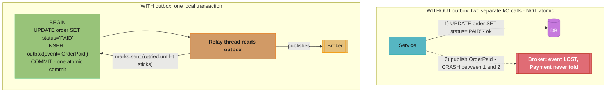
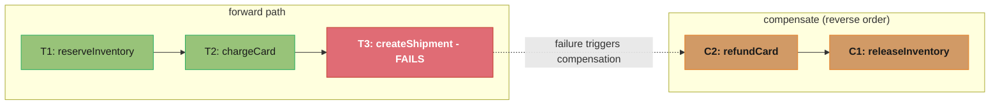
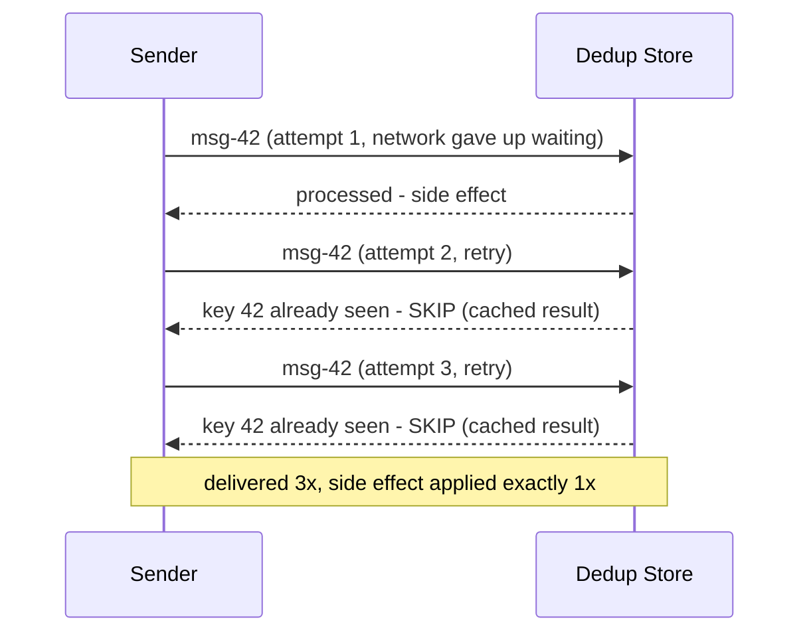

# Microservices Patterns in Java

> Pure-Java implementations of the distributed-systems patterns a senior engineer
> is expected to reason about: Saga, transactional outbox, idempotency keys,
> distributed tracing context propagation, the strangler fig migration, and the
> bulkhead. No Spring — every example is plain Java so the *mechanism* is visible,
> not the framework magic. For the Spring-applied versions see the cross-links in
> the section README.

---

## 1. Concept Overview

A microservice owns its data. The moment a business operation spans two services,
you lose the one tool a monolith leans on for correctness: the local ACID
transaction. You cannot `BEGIN ... COMMIT` across an Order service's PostgreSQL and
a Payment service's PostgreSQL — there is no shared transaction manager, and
two-phase commit (XA) across HTTP/gRPC services is operationally toxic (it holds
locks across network hops and blocks on coordinator failure).

So "microservices patterns" is, at its core, the catalogue of techniques for
getting **correctness, reliability, and observability without distributed
transactions**:

- **Saga** — replace one distributed transaction with a sequence of local
  transactions plus compensating actions.
- **Transactional outbox** — guarantee "update my DB *and* publish an event"
  happens atomically, defeating the dual-write problem.
- **Idempotency keys** — make retries safe so at-least-once delivery does not
  become at-least-once *side effects*.
- **Distributed tracing context propagation** — stitch one logical request back
  together across process boundaries.
- **Strangler fig** — migrate off a monolith incrementally instead of in a risky
  big-bang rewrite.
- **Bulkhead** — isolate resource pools so one slow dependency cannot sink the
  whole process.

These are not Java-specific patterns, but Java is where most of them are
*implemented* in enterprise systems, and the JDK gives you exactly the primitives
they need: `CompletableFuture` for orchestration, `ThreadLocal` (and `ScopedValue`
in Java 21) for context propagation, bounded `ThreadPoolExecutor`s for bulkheads,
and JDBC for the outbox's same-transaction insert.

---

## 2. Intuition

**One-line analogy.** A Saga is booking a multi-leg trip with separate airlines:
there is no single "trip transaction." You book leg 1, then leg 2; if leg 3 sells
out, you *cancel* (compensate) legs 1 and 2 — you do not magically un-charge them
in one atomic stroke.

**Mental model.** Picture the local ACID transaction as a stapler that binds a
stack of pages. Across services there is no stapler big enough. So you bind each
page locally and keep a *running ledger* of what you've done, so you can tear pages
back out (compensate) in reverse order if a later page fails.

**Why it matters.** Most production incidents in distributed systems are not "the
algorithm was wrong" — they are dual writes that half-succeeded, retries that
double-charged, or a trace that went dark at a service boundary. These patterns are
the antibodies for exactly those failure modes.

**Key insight.** At-least-once delivery is the default the network gives you for
free; exactly-once *effects* are something you *engineer* on top of it with
idempotency and dedup. You never get exactly-once delivery — you get
"at-least-once delivery + idempotent processing = effectively-once."

---

## 3. Core Principles

1. **No distributed transactions.** Decompose into local transactions; recover with
   compensation, not rollback. Embrace eventual consistency between services.

2. **Atomic state-change + intent.** Whenever you change state *and* must tell
   someone, write both in the *same local transaction* (the outbox), then publish
   asynchronously. Never do two separate I/O calls and hope both land.

3. **Assume retries; design for idempotency.** Every message can be delivered more
   than once and every RPC can be retried. The receiver, not the sender, owns
   exactly-once semantics via a dedup/idempotency store.

4. **Context travels with the work, not the thread.** A request's identity (trace
   id, tenant, idempotency key) must propagate across thread-pool hops and network
   calls explicitly — thread identity is meaningless once you hand work to an
   executor or a remote service.

5. **Isolate failure domains.** A dependency that is slow should consume a *bounded*
   slice of your resources (threads, connections, memory), never an unbounded one.

6. **Migrate incrementally.** Replace a monolith capability behind a routing facade
   one slice at a time, with the ability to fall back, rather than flipping a
   big-bang switch.

---

## 4. Types / Architectures / Strategies

### Saga: two coordination styles

| Style | Coordinator | How steps advance | Best when |
|-------|------------|-------------------|-----------|
| **Choreography** | None (each service reacts to events) | Service A emits event → B consumes, does work, emits its own event → … | Few steps (2–4), loose coupling desired, no central owner |
| **Orchestration** | A central saga orchestrator | Orchestrator calls each service and decides the next step | Many steps, complex branching, you need one place to see/Debug the flow |

### Outbox delivery mechanisms

| Mechanism | How events leave the outbox table | Tradeoff |
|-----------|-----------------------------------|----------|
| **Polling publisher** | A background thread `SELECT ... FOR UPDATE SKIP LOCKED`, publishes, marks sent | Simple, portable; adds DB load + polling latency |
| **Change Data Capture (CDC)** | Debezium tails the DB write-ahead log | Near-zero latency, no app polling; needs CDC infra + ops |

### Idempotency strategies

- **Natural idempotency** — operation is inherently repeatable (`SET balance = 100`).
- **Idempotency key** — client sends a unique key; server stores `(key -> result)`
  and replays the stored result on repeat.
- **Dedup table / processed-message log** — consumer records processed message ids,
  skips duplicates.

### Bulkhead variants

- **Thread-pool bulkhead** — each dependency gets its own bounded executor.
- **Semaphore bulkhead** — a permit counter caps concurrent calls without extra
  threads (cheaper, but no queueing/timeout-in-queue).

---

## 5. Architecture Diagrams

### The dual-write problem the outbox solves


The two writes are now one commit, so they cannot half-succeed. Publication becomes
a *separate, retryable* step that can crash and resume without losing the event.

### Saga compensation runs in reverse (orchestration)


Each forward step Tn has a compensating step Cn. On failure at step k, run
C(k-1), C(k-2), ... C1. Compensations must themselves be idempotent and should not
fail (or must be retried forever) — there is no compensation for a failed
compensation.

### At-least-once delivery + idempotent receiver = effectively-once


The receiver's dedup store is the only place "exactly once" is actually enforced.

**Put simply.** "Count side effects by distinct keys, never by deliveries — the sender controls how many times a message arrives, and only the receiver controls how many times it counts."

That split is the whole reason "exactly-once delivery" is a marketing phrase and "effectively-once processing" is an engineering one. No amount of sender-side care shrinks the delivery count to 1; the receiver simply stops caring what that count is.

| Symbol | What it is |
|--------|------------|
| `D` | Deliveries — how many times the message physically arrives. Sender/broker decide this |
| `K` | Distinct idempotency keys among those deliveries (`msg-42` is one key, however often it lands) |
| side effects | Always `K`, never `D`, once a dedup store guards the handler |
| `D - K` | Wasted deliveries — the duplicates. Costs bandwidth and a store lookup, nothing more |
| `D / K` | Duplicate amplification. `1.0` = no retries; the diagram above is `3.0` |

**Walk one example.** The diagram, then the §6.1 relay's real failure mode — it publishes a batch of 100, then updates `status = 'SENT'`, then commits, so a crash after publishing but before the commit replays the entire batch:

```
  Diagram (single message, 2 retries):
    D = 3   K = 1   ->  side effects = 1,  wasted = 3 - 1 = 2,  amplification = 3.0

  Relay batch of 100 crashes after publish, before commit; restart re-reads it:
    D = 100 + 100 = 200
    K = 100                       (the same 100 outbox row ids)
    side effects = K   = 100      <- correct, because the receiver dedups
    wasted       = 200 - 100 = 100
    amplification = 200 / 100 = 2.0

  Without a dedup store: side effects = D = 200  ->  100 duplicate shipments.
```

Notice what does *not* appear in the side-effect line: `D`. Make the handler's outcome a function of `K` alone and the sender is free to retry as hard as it likes, which is exactly what lets the relay retry "until it sticks" (§6.1) without a correctness argument. The one quantity that does grow with traffic is the dedup store itself — it must hold every key for at least as long as the sender might still retry it, so its retention window, not its hit rate, is the parameter to get right.

---

## 6. How It Works — Detailed Mechanics

### 6.1 Transactional outbox (plain JDBC)

The decisive detail: the domain write and the outbox insert share **one**
`Connection` with `autoCommit=false`, so they commit or roll back together.

```java
public class OrderService {
    private final DataSource dataSource;

    public OrderService(DataSource dataSource) { this.dataSource = dataSource; }

    public void markPaid(long orderId, String payload) throws SQLException {
        try (Connection cx = dataSource.getConnection()) {
            cx.setAutoCommit(false);                 // single local transaction
            try (PreparedStatement upd = cx.prepareStatement(
                    "UPDATE orders SET status = 'PAID' WHERE id = ?")) {
                upd.setLong(1, orderId);
                upd.executeUpdate();
            }
            try (PreparedStatement out = cx.prepareStatement(
                    "INSERT INTO outbox (id, aggregate_id, type, payload, status, created_at) " +
                    "VALUES (?, ?, 'OrderPaid', ?, 'NEW', ?)")) {
                out.setString(1, UUID.randomUUID().toString());
                out.setLong(2, orderId);
                out.setString(3, payload);
                out.setTimestamp(4, Timestamp.from(Instant.now()));
                out.executeUpdate();
            }
            cx.commit();                              // both rows or neither
        }
    }
}
```

The relay then drains the table. `FOR UPDATE SKIP LOCKED` lets multiple relay
instances run concurrently without double-publishing the same row:

```java
public void relayBatch(Connection cx, Publisher publisher) throws SQLException {
    cx.setAutoCommit(false);
    try (PreparedStatement sel = cx.prepareStatement(
            "SELECT id, type, payload FROM outbox WHERE status = 'NEW' " +
            "ORDER BY created_at FOR UPDATE SKIP LOCKED LIMIT 100")) {
        ResultSet rs = sel.executeQuery();
        List<String> publishedIds = new ArrayList<>();
        while (rs.next()) {
            publisher.publish(rs.getString("type"), rs.getString("payload"));
            publishedIds.add(rs.getString("id"));
        }
        for (String id : publishedIds) {
            try (PreparedStatement upd = cx.prepareStatement(
                    "UPDATE outbox SET status = 'SENT' WHERE id = ?")) {
                upd.setString(1, id);
                upd.executeUpdate();
            }
        }
        cx.commit();
    }
}
```

Note the *ordering*: publish first, mark `SENT` second. If the relay crashes after
publishing but before marking, the row is re-published on restart — at-least-once,
which is exactly why the consumer must be idempotent.

### 6.2 Orchestrated saga with compensation

```java
public class SagaOrchestrator {
    public record Step(String name, Runnable action, Runnable compensation) {}

    public void execute(List<Step> steps) {
        Deque<Step> completed = new ArrayDeque<>();   // stack -> reverse-order undo
        try {
            for (Step step : steps) {
                step.action().run();
                completed.push(step);
            }
        } catch (RuntimeException failure) {
            // compensate in reverse; swallow-and-log so one bad comp doesn't abort the rest
            while (!completed.isEmpty()) {
                Step done = completed.pop();
                try {
                    done.compensation().run();
                } catch (RuntimeException compFailure) {
                    log.error("Compensation failed for {} - needs manual repair",
                              done.name(), compFailure);
                    // enqueue for retry / alert; do NOT rethrow
                }
            }
            throw failure;
        }
    }
}
```

A real orchestrator persists `completed` between steps (a saga log) so a crash
mid-saga can resume or compensate on restart — the in-memory `Deque` above only
survives a single process lifetime.

### 6.3 Idempotency key store

```java
public class IdempotencyGuard {
    private final DataSource dataSource;

    /** Returns a cached result if the key was seen; otherwise runs op and stores it. */
    public String runOnce(String key, Supplier<String> op) throws SQLException {
        try (Connection cx = dataSource.getConnection()) {
            cx.setAutoCommit(false);
            // Try to claim the key. UNIQUE(key) constraint makes the claim atomic.
            try (PreparedStatement ins = cx.prepareStatement(
                    "INSERT INTO idempotency (key, status) VALUES (?, 'IN_PROGRESS')")) {
                ins.setString(1, key);
                ins.executeUpdate();
            } catch (SQLException dup) {              // key already exists
                cx.rollback();
                return fetchStoredResult(cx, key);   // replay prior result
            }
            String result = op.get();                // first time: do the real work
            try (PreparedStatement upd = cx.prepareStatement(
                    "UPDATE idempotency SET status='DONE', result=? WHERE key=?")) {
                upd.setString(1, result);
                upd.setString(2, key);
                upd.executeUpdate();
            }
            cx.commit();
            return result;
        }
    }
}
```

The UNIQUE constraint, not application logic, is what makes the claim race-free
under concurrent retries — two simultaneous requests with the same key cannot both
insert.

### 6.4 Context propagation across a thread-pool hop

`ThreadLocal` is invisible to the worker thread an executor picks. You must capture
on the submitting thread and restore on the worker:

```java
public final class TraceContext {
    private static final ThreadLocal<String> TRACE_ID = new ThreadLocal<>();

    public static void set(String id) { TRACE_ID.set(id); }
    public static String get()        { return TRACE_ID.get(); }
    public static void clear()        { TRACE_ID.remove(); }

    /** Wrap a task so it carries the submitter's trace id onto the worker thread. */
    public static Runnable wrap(Runnable task) {
        String captured = TRACE_ID.get();            // capture on caller thread
        return () -> {
            String previous = TRACE_ID.get();
            TRACE_ID.set(captured);                   // restore on worker thread
            try { task.run(); }
            finally {                                 // always restore -> no leak
                if (previous == null) TRACE_ID.remove();
                else TRACE_ID.set(previous);
            }
        };
    }
}
```

The `finally` cleanup is non-negotiable: a pooled thread is reused, so a leaked
`ThreadLocal` would contaminate the *next* unrelated request that lands on it.

Java 21's `ScopedValue` makes this safer — it is immutable and automatically
unbound at the end of the bound scope, eliminating the leak class entirely (see
[structured_concurrency_and_loom](../structured_concurrency_and_loom/README.md)).

### 6.5 Thread-pool bulkhead

```java
// Each downstream gets its OWN bounded pool + bounded queue.
ExecutorService paymentsPool = new ThreadPoolExecutor(
        4, 4, 0L, TimeUnit.MILLISECONDS,
        new ArrayBlockingQueue<>(16),                // bounded -> backpressure
        new ThreadPoolExecutor.AbortPolicy());       // reject fast when saturated

ExecutorService inventoryPool = new ThreadPoolExecutor(
        8, 8, 0L, TimeUnit.MILLISECONDS,
        new ArrayBlockingQueue<>(32),
        new ThreadPoolExecutor.AbortPolicy());
```

If `payments` goes slow, its 4 threads + 16 queue slots fill and new payment calls
are rejected immediately (`RejectedExecutionException`) — but `inventory` keeps
flowing on its own pool. A single shared pool would let slow payment calls consume
every thread and starve inventory: the failure would not be isolated.

**What the numbers are telling you.** "A bulkhead's two constants are not arbitrary knobs — the thread count sets how fast the dependency can be called, and the queue depth sets how long a caller can be made to wait before you would rather reject it."

Those are separate decisions, and conflating them is the classic bug. Threads buy throughput; queue slots buy patience. A pool tuned by only ever raising the thread count silently sets the wait to zero; a pool tuned by only ever raising the queue depth silently sets the wait to unbounded.

| Symbol | What it is |
|--------|------------|
| `T` | Core/max thread count — how many calls to this dependency run at once (4 payments, 8 inventory) |
| `Q` | `ArrayBlockingQueue` capacity — calls allowed to wait for a thread (16 payments, 32 inventory) |
| `L` | Latency of one downstream call; the §14 Black-Friday Payment p99 was 8s |
| `T / L` | Little's Law throughput — completed calls per second at that latency |
| `T + Q` | In-flight ceiling; caller number `T + Q + 1` gets `RejectedExecutionException` |
| `(Q / T) x L` | Worst-case queue wait — how long the last-admitted caller sits before starting |

**Walk one example.** The payments pool during the §14 p99 spike, `L = 8s`:

```
  throughput   = T / L        = 4 / 8        = 0.5 calls/s
  in-flight    = T + Q        = 4 + 16       = 20 calls admitted
  21st caller  ->  rejected immediately, no waiting, no thread consumed

  queue wait   = (Q / T) x L  = (16 / 4) x 8 = 32 s for the last queued caller

  Inventory pool, same L:
  throughput   = 8 / 8        = 1.0 calls/s
  in-flight    = 8 + 32       = 40 calls admitted
  queue wait   = (32 / 8) x 8 = 32 s        <- identical, despite 2x the pool
```

Both pools wait exactly 32 s because both were sized at `Q = 4T`. That ratio, not the absolute numbers, is what you are actually choosing: `Q / T` is the number of call-latencies of patience you are granting, so a request timeout shorter than `(Q / T) x L` guarantees the caller has already given up before its queued task ever runs — the task then executes for nobody, burning a thread the still-live callers needed. Size `Q` so that `(Q / T) x L` sits under your call timeout, and the queue becomes a genuine buffer rather than a place requests go to expire. This is also why the unbounded-queue pitfall in §10 is fatal: with `Q` unbounded the wait term has no ceiling, the pool never rejects, and the "bulkhead" degrades into the shared-pool failure it was meant to prevent.

---

## 7. Real-World Examples

- **Uber / Cadence (now Temporal)** — orchestrated sagas as durable workflows;
  the orchestrator state is persisted so a crash resumes mid-workflow. Their core
  insight matches §6.2: the saga log must outlive the process.
- **Debezium + Kafka** — the canonical CDC outbox: Debezium tails the Postgres/MySQL
  WAL and turns the `outbox` table into a Kafka topic with near-zero latency, no app
  polling. Used at scale across the Confluent/Red Hat ecosystem.
- **Stripe idempotency keys** — clients pass `Idempotency-Key` on POSTs; Stripe
  stores the key → response for 24h and replays it, so a retried `charge` never
  double-charges. The §6.3 pattern, productized.
- **AWS X-Ray / OpenTelemetry** — trace-context propagation via the W3C
  `traceparent` header; the in-process part is exactly the §6.4 ThreadLocal/
  ScopedValue carry-over.
- **Netflix Hystrix (historical) / Resilience4j** — popularized the bulkhead and
  circuit breaker; Hystrix used thread-pool bulkheads, Resilience4j defaults to the
  cheaper semaphore bulkhead.

---

## 8. Tradeoffs

| Decision | Option A | Option B | Pick A when… |
|----------|----------|----------|--------------|
| Saga coordination | Choreography | Orchestration | Steps are few and you want zero central coupling |
| Outbox drain | Polling publisher | CDC (Debezium) | You lack CDC infra / want app-only simplicity |
| Idempotency scope | Idempotency key (client-supplied) | Dedup table (message-id) | The trigger is a client request, not an internal event |
| Bulkhead | Thread-pool | Semaphore | You need queueing + per-call timeout isolation |
| Consistency | Strong (XA/2PC) | Eventual (saga) | Almost never — avoid 2PC across services |

| Pattern | Buys you | Costs you |
|---------|----------|-----------|
| Saga | No distributed TX; resilience | Eventual consistency; compensation complexity; no isolation (dirty reads between steps) |
| Outbox | No lost events; atomic write+publish | Extra table; relay infra; at-least-once (needs idempotent consumer) |
| Idempotency key | Safe retries | Storage + TTL management; key-collision care |
| Tracing propagation | End-to-end visibility | Wrapping every async hop; leak risk with ThreadLocal |
| Bulkhead | Fault isolation | More pools to size/tune; lower peak utilization |

---

## 9. When to Use / When NOT to Use

**Use Saga when** a business operation legitimately spans services and you can
define a sensible compensation for each step (release a reservation, issue a
refund). **Avoid it when** the operation truly needs *isolation* (no other actor
may observe intermediate state) — sagas expose intermediate states by design.

**Use the outbox when** you must "change state and publish" reliably. **Skip it**
if the event is purely advisory and a rare loss is acceptable, or if your broker +
DB already participate in a sound transactional store (rare).

**Use idempotency keys** on any non-idempotent mutation reachable by retry (almost
all POSTs to payment/order/email). **Skip** for naturally idempotent operations
(PUT of a full resource, `SET x = v`).

**Use bulkheads** once you have more than one critical downstream sharing a process.
**Skip** for a single-dependency service where isolation buys nothing.

**Use the strangler fig** to migrate a living monolith you cannot freeze. **Avoid**
a big-bang rewrite of anything business-critical — the failure surface is enormous.

---

## 10. Common Pitfalls

1. **The dual-write trap.** Updating the DB then publishing in two separate calls.
   *War story:* an e-commerce team shipped "update order + Kafka publish" as two
   statements; a broker hiccup dropped ~0.3% of `OrderPaid` events, so warehouses
   never shipped paid orders. The fix was the outbox — events became a row in the
   same commit.

2. **Non-idempotent consumers under at-least-once.** A relay re-published after a
   crash and the email service sent every customer their receipt twice. The
   consumer had no dedup. Always pair at-least-once delivery with an idempotent
   receiver.

3. **Compensation that can fail silently.** A refund step threw and was swallowed
   without alerting; money stayed captured. Compensations must be retried forever
   and alert on permanent failure — they are the last line of correctness.

4. **ThreadLocal leak in a pool.** A trace id set but never cleared in a `finally`
   bled into the next request on the reused thread, so logs attributed one user's
   actions to another. Always clear in `finally`; prefer `ScopedValue` (Java 21).

5. **Unbounded queues defeat the bulkhead.** A `LinkedBlockingQueue` (unbounded) in
   a "bulkhead" pool let a slow dependency buffer millions of tasks until the heap
   OOM'd — there was no actual isolation. Bulkhead queues must be bounded.

6. **Saga without persistence.** An in-memory orchestrator (like §6.2's raw `Deque`)
   loses its place on crash, leaving half-finished sagas with no compensation. The
   saga log must be durable.

7. **Using XA/2PC across services.** A team wired XA across three microservices'
   databases; one coordinator crash held locks across all three for minutes,
   cascading into a full outage. 2PC across network services is an anti-pattern —
   use sagas.

---

## 11. Technologies & Tools

| Concern | Tools |
|---------|-------|
| Saga orchestration | Temporal, Cadence, Camunda/Zeebe, Axon Framework |
| Outbox / CDC | Debezium, Kafka Connect, Maxwell |
| Messaging | Apache Kafka, RabbitMQ, AWS SQS/SNS |
| Idempotency / dedup | Postgres UNIQUE constraint, Redis SETNX + TTL |
| Tracing | OpenTelemetry, Jaeger, AWS X-Ray, Zipkin |
| Resilience (bulkhead/CB) | Resilience4j, Netflix Hystrix (legacy) |
| JDK primitives | `CompletableFuture`, `ThreadPoolExecutor`, `ScopedValue` (21), `ThreadLocal`, JDBC |

---

## 12. Interview Questions with Answers

**Q: How do you maintain data consistency across microservices without a distributed transaction?**
Use the Saga pattern: model the operation as a sequence of local ACID transactions,
each with a compensating transaction that semantically undoes it. On failure at step
k, run compensations for steps k-1 down to 1 in reverse order. You trade strong
consistency for eventual consistency and accept that intermediate states are
observable. The practical guidance: pick orchestration for complex/branching flows
(one place to debug) and choreography for short, loosely coupled ones.

**Q: What is the dual-write problem and how does the transactional outbox solve it?**
The dual-write problem is needing to update your database *and* publish an event,
but those are two separate systems with no shared transaction — a crash between them
leaves the DB updated and the event lost (or vice versa). The outbox solves it by
inserting the event into an `outbox` table *in the same local transaction* as the
state change, so they commit atomically. A separate relay process then reads the
outbox and publishes, retrying until success. The key is that the only atomic unit
is the single DB commit.

**Q: Why does the outbox give at-least-once and not exactly-once delivery?**
Because the relay publishes the event and *then* marks the row as sent in two steps;
if it crashes between them, the event is published again on restart. You cannot make
"publish to broker" and "update outbox row" atomic — they are again two systems. So
you accept at-least-once and require the consumer to be idempotent. Marking sent
*before* publishing would instead risk losing events (at-most-once), which is worse.

**Q: How do you make a message consumer idempotent?**
Record a unique identifier for each processed message (message id or business
idempotency key) in a dedup store within the same transaction as the side effect,
and skip messages whose id is already present. The atomic claim is best enforced by
a database UNIQUE constraint rather than a check-then-act in code, because
concurrent retries would race a check-then-act. For external clients, expose an
explicit idempotency key they supply and store key → response to replay results.

**Q: Choreography vs orchestration — when do you choose each?**
Choreography has no central coordinator; each service reacts to events and emits its
own, giving maximum decoupling but making the overall flow implicit and hard to
trace once it exceeds a few steps. Orchestration introduces a coordinator that
explicitly drives each step, which centralizes the logic (easy to see, debug, and
change) at the cost of a component every step depends on. Rule of thumb:
choreography for 2–4 simple steps, orchestration for long or branching workflows.

**Q: What makes a good compensating transaction, and what if compensation itself fails?**
A compensation must be idempotent (it may be retried), semantically undo the forward
action (release the reservation, refund the charge — not necessarily a literal
inverse), and be designed to essentially always succeed. If compensation fails, you
cannot "compensate the compensation," so you retry it with backoff indefinitely and
alert a human/operator on permanent failure. This is why money-moving compensations
get dead-letter queues and on-call alerts rather than silent catch blocks.

**Q: Why is 2PC/XA across microservices considered an anti-pattern?**
Two-phase commit holds locks from the prepare phase until the coordinator says
commit, and across network services that window includes slow/failed remote hops. A
coordinator crash leaves participants "in doubt," holding locks and blocking, which
turns one slow service into a cascading multi-service outage. It also tightly
couples services to a shared transaction manager. Sagas trade the strong guarantee
for availability, which is almost always the right call between services.

**Q: How does trace context propagate across an async/thread-pool boundary in Java?**
`ThreadLocal` is bound to the *current* thread, so when you submit work to an
executor the worker thread sees nothing. You must capture the context value on the
submitting thread, then restore it on the worker thread at the start of the task and
clear it in a `finally`. Frameworks do this by wrapping the `Runnable`/`Callable`.
Java 21's `ScopedValue` is the modern fix — it is immutable and auto-unbound at the
end of its scope, removing the leak risk inherent in mutable `ThreadLocal`.

**Q: Why must you clear a ThreadLocal in a finally block in pooled code?**
Because pool threads are reused across unrelated requests. If you set a value and do
not remove it, the next task that runs on that thread inherits a stale value —
causing mis-attributed logs, wrong tenant context, or even data leakage between
users. The `finally` guarantees cleanup even when the task throws. This entire
hazard class is why `ScopedValue` (which cannot outlive its bound scope) was added.

**Q: What is a bulkhead and how is it different from a circuit breaker?**
A bulkhead isolates resources so one dependency's saturation cannot consume the
whole process — typically a dedicated bounded thread pool (or a semaphore permit
count) per downstream. A circuit breaker instead *stops calling* a failing
dependency after an error threshold, failing fast and giving it time to recover.
They are complementary: the bulkhead contains the blast radius of slowness; the
breaker stops you from hammering something already down.

**Q: Thread-pool bulkhead vs semaphore bulkhead — tradeoffs?**
A thread-pool bulkhead runs each dependency on its own threads, which lets calls
queue, supports timeouts on the queue, and isolates even blocking calls — at the
cost of extra threads and context-switching. A semaphore bulkhead just caps
concurrent calls with a permit counter on the caller's own thread: far cheaper and
lower latency, but it cannot queue (callers are rejected immediately when permits
run out) and a blocking call still blocks the caller's thread. Use thread pools for
slow/blocking downstreams, semaphores for fast in-process limits.

**Q: Why must a bulkhead's queue be bounded?**
An unbounded queue (e.g., `LinkedBlockingQueue` with no capacity) lets a slow
dependency accumulate tasks without limit, so memory grows until OOM and there is no
actual isolation — the "bulkhead" silently buffers the entire backlog. A bounded
queue provides backpressure: once full, new submissions are rejected fast
(`RejectedExecutionException`), signaling the caller to shed load. Bounded resources
are the whole point of the pattern.

**Q: What is the strangler fig pattern and why prefer it over a rewrite?**
You put a routing facade (proxy/gateway) in front of the monolith and incrementally
redirect individual capabilities to new services, leaving the rest in the monolith,
until the monolith is "strangled" and removable. It is preferred over a big-bang
rewrite because each slice is small, independently testable, and reversible (route
back to the monolith if the new service misbehaves), so the risk is bounded at every
step instead of concentrated in one launch.

**Q: How does `SELECT ... FOR UPDATE SKIP LOCKED` help an outbox relay scale?**
It lets multiple relay instances poll the same outbox table concurrently without
processing the same row twice: each instance locks the rows it reads and `SKIP
LOCKED` makes other instances skip already-locked rows instead of blocking on them.
This turns the relay into a horizontally scalable competing-consumers setup with no
distributed coordination. Without `SKIP LOCKED`, relays would either serialize
(blocking on locks) or double-publish (no locks).

**Q: How would you implement effectively-once processing end to end?**
Combine three things: (1) a transactional outbox so the producer never loses an
event despite crashes; (2) at-least-once delivery from the broker (the default); and
(3) an idempotent consumer that records processed ids in a dedup store within the
same transaction as the side effect. Delivery is still at-least-once, but the dedup
makes the *effect* happen once. There is no exactly-once delivery; "effectively
once" is at-least-once delivery plus idempotent processing.

**Q: How do you test a saga's failure and compensation paths?**
Inject failures at each forward step and assert that exactly the compensations for
already-completed steps run, in reverse order, and that they are idempotent under
repeated invocation. Use a fault-injecting test double for each service, verify the
saga log/state transitions, and include a "compensation fails" case to confirm
retry/alert behavior rather than silent loss. Property-style tests that fail at a
random step are effective at catching missing compensations.

**Q: What consistency guarantees does a saga actually provide?**
Atomicity is replaced by "all forward steps complete, or all completed steps are
compensated" — but *not* isolation: between steps, other transactions can observe
intermediate state (a reserved-but-not-yet-paid order). This means you may need
semantic locks (e.g., a `PENDING` status) or commutative updates to avoid anomalies
like a customer seeing an order that later gets compensated away. Durability still
holds locally per step. In short: ACD without the I.

---

## 13. Best Practices

- **Write the outbox insert in the same transaction as the state change — always.**
  If you find yourself doing two I/O calls, you have a dual-write bug.
- **Make every consumer idempotent before you rely on any delivery guarantee.**
  Treat at-least-once as the contract.
- **Persist saga state** so crashes resume or compensate; never trust in-memory
  orchestration for anything that moves money or inventory.
- **Bound everything** — queues, pools, retries. Unbounded anything defeats
  isolation and invites OOM.
- **Clear `ThreadLocal` in `finally`**, and migrate to `ScopedValue` on Java 21+.
- **Propagate context explicitly** at every async hop; wrap your executors once in a
  central place rather than per-call.
- **Alert on compensation and dead-letter events** — these are correctness signals,
  not noise to mute.
- **Set idempotency-key TTLs** deliberately (e.g., 24h like Stripe) and document the
  replay semantics for clients.

---

## 14. Case Study

### Order-fulfillment saga for an e-commerce checkout

**Problem.** Checkout must reserve inventory, charge the card, and create a shipment
across three services (Inventory, Payment, Shipping), each with its own Postgres.
The first version did a synchronous chain of REST calls and a separate Kafka publish
for `OrderPaid`. In production it exhibited two failures: ~0.3% of paid orders never
shipped (lost events from a dual write), and a Black-Friday slowdown in Payment
consumed the shared thread pool and took Inventory down with it.

**Requirements.**
- No double-charges even under client and network retries.
- No lost `OrderPaid` events.
- Payment slowness must not cascade to Inventory.
- One place to see and debug the full checkout flow.

**Design.**

1. **Orchestrated saga.** A `CheckoutOrchestrator` drives three steps, each with a
   compensation, persisting the saga state after every step so a crash resumes:

```java
List<SagaOrchestrator.Step> steps = List.of(
    new SagaOrchestrator.Step("reserveInventory",
        () -> inventory.reserve(orderId, items),
        () -> inventory.release(orderId)),
    new SagaOrchestrator.Step("chargeCard",
        () -> payment.charge(orderId, amount, idempotencyKey),   // key = orderId
        () -> payment.refund(orderId)),
    new SagaOrchestrator.Step("createShipment",
        () -> shipping.create(orderId, address),
        () -> shipping.cancel(orderId)));
orchestrator.execute(steps);
```

2. **Idempotency.** Payment's `charge` is guarded by `IdempotencyGuard` keyed on
   `orderId`, so a retried charge replays the stored result instead of charging
   twice (§6.3).

3. **Outbox for OrderPaid.** Payment writes the `OrderPaid` event into its outbox in
   the same transaction as the `charge` record; a relay with `SKIP LOCKED` publishes
   it (§6.1). Shipping consumes it idempotently via a processed-message table.

4. **Bulkheads.** The orchestrator calls each downstream through its own bounded
   pool, so a slow Payment fills only its 4-thread pool and is rejected fast while
   Inventory flows on its own pool (§6.5).

**Broken → fixed (the original dual write):**

```java
// BROKEN: two separate writes, event can be lost on crash between them
payment.charge(orderId, amount);          // committed to Payment DB
kafka.publish("OrderPaid", orderId);      // <- crash here loses the event

// FIXED: one transaction writes both the charge and the outbox row
try (Connection cx = ds.getConnection()) {
    cx.setAutoCommit(false);
    recordCharge(cx, orderId, amount);
    insertOutbox(cx, "OrderPaid", orderId);   // same commit
    cx.commit();
}
// relay publishes from outbox, retried until it sticks
```

**Outcomes (measured).**
- Lost-shipment rate: **0.3% → 0** after the outbox replaced the dual write.
- Double-charge incidents during the next peak: **0** (idempotency key on
  `orderId`).
- Black-Friday cascade: a Payment p99 spike of 8s no longer affected Inventory —
  Inventory latency stayed flat because the bulkheads isolated the pools; Payment
  calls were rejected fast and retried via the saga rather than blocking shared
  threads.
- Debuggability: the persisted saga log gave on-call a single timeline per order,
  cutting mean-time-to-diagnose for stuck checkouts from ~30 min to a few minutes.

**Tradeoffs accepted.** Eventual consistency — an order can sit `PENDING` briefly
between reserve and ship — and the operational cost of an outbox relay plus dedup
tables. Both were acceptable given the correctness and isolation gains.

---

## See Also

- [structured_concurrency_and_loom](../structured_concurrency_and_loom/README.md) —
  `ScopedValue` for leak-free context propagation; virtual threads for high-fan-out
  orchestration calls.
- [concurrency](../concurrency/README.md) — `CompletableFuture`,
  `ThreadPoolExecutor` internals behind the bulkhead.
- [Microservices Fundamentals](../../backend/microservices_fundamentals/README.md) —
  service decomposition, API design, deployment topology.
- [../../backend/event_driven_fundamentals/](../../backend/event_driven_fundamentals/) —
  choreography vs orchestration at the architecture level.
- [Event Sourcing & CQRS](../../backend/event_sourcing_and_cqrs/README.md) —
  event sourcing as the durable foundation behind sagas and outboxes.
- [Microservices (HLD)](../../hld/microservices/README.md) — the architecture-level
  view of service decomposition and communication this module implements in code.
- [Distributed Transactions (HLD)](../../hld/distributed_transactions/README.md) —
  the theory (2PC, sagas, consensus) behind why this module avoids XA/2PC.
- [case_studies/design_circuit_breaker_java.md](../case_studies/design_circuit_breaker_java.md) —
  the breaker that pairs with the bulkhead in this module.
