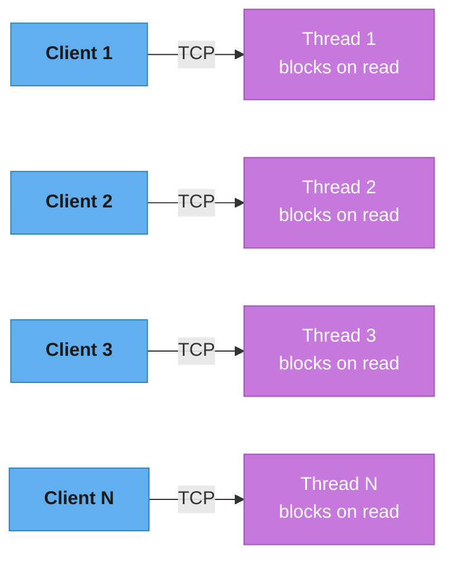
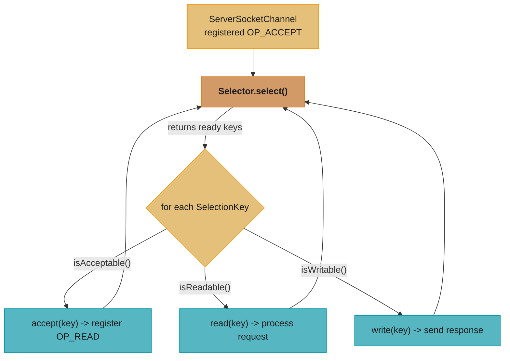
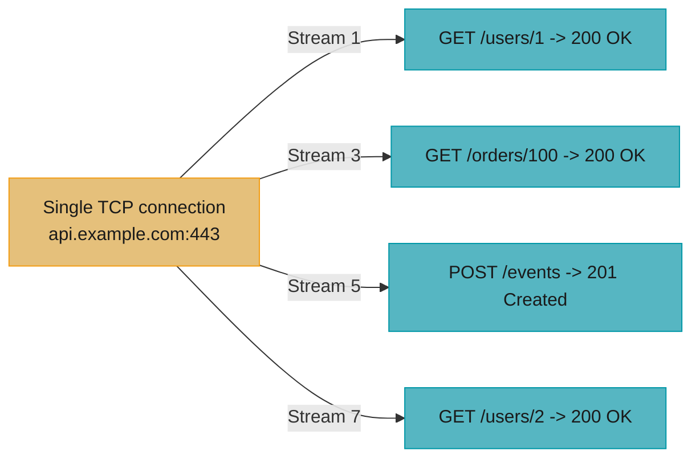
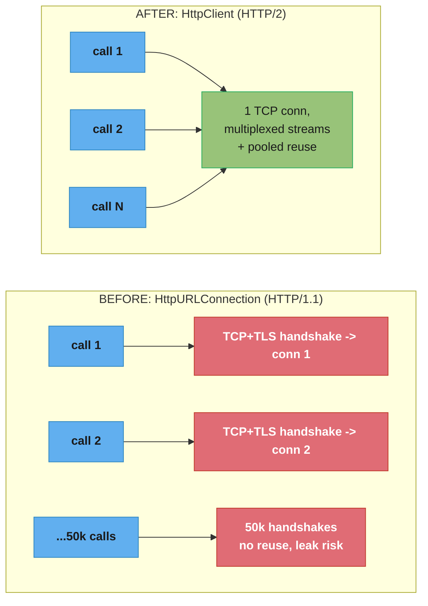

# Networking & HTTP Client

## 1. Concept Overview

Java has three generations of networking APIs. The original `java.net` API (blocking, per-connection thread model) was suitable for low-concurrency servers. Java NIO (Java 4, 2002) introduced non-blocking I/O with `Selector` and `Channel`, enabling the Reactor event-loop pattern used by Netty and Mina. The modern `java.net.http.HttpClient` (Java 11) provides a clean, high-level HTTP/1.1 and HTTP/2 client with both synchronous and asynchronous interfaces.

For server-side networking, NIO's `Selector` enables a single thread to monitor thousands of connections — the foundation of high-performance servers. With Java 21 virtual threads, the original blocking model scales to the same concurrency without NIO complexity.

---

## 2. Intuition

> **One-line analogy**: Blocking I/O is like a bank teller who sits idle while waiting for your account lookup — one teller per customer. NIO is like a teller who hands you a number and calls you when your account is ready — one teller for many customers. Virtual threads are like hiring millions of bank tellers that cost nothing when idle.

**Mental model**: Every network connection involves waiting — for DNS, TCP handshake, server processing, data transfer. In blocking I/O, waiting means a thread is parked doing nothing. In NIO, a `Selector` monitors multiple channels; when any becomes readable/writable, the single event-loop thread handles it. With virtual threads, the JVM unmounts blocked virtual threads from carrier threads, achieving the same concurrency as NIO without the complexity.

**Why it matters**: Understanding when to use blocking vs NIO vs virtual threads is a key system design decision. `HttpClient` is the standard for HTTP/1.1 and HTTP/2 in Java 11+. NIO's Reactor pattern is the architecture behind Netty, which powers gRPC, Spring WebFlux, and Kafka's network layer.

**Key insight**: NIO does NOT mean faster I/O transfer speed — the network is the bottleneck, not the Java API. NIO means fewer OS threads, which means lower memory and lower context-switch overhead. At 10,000 concurrent connections: blocking = 10,000 threads (~10GB stack), NIO = 1 thread, virtual threads = 10,000 virtual threads (~few MB total).

---

## 3. Core Principles

- **Blocking I/O**: Thread blocks on read/write; simple programming model; one thread per connection.
- **Non-blocking I/O**: Channel registered with `Selector`; `Selector.select()` returns when any channel is ready; single thread handles many.
- **Reactor pattern**: Event loop that demultiplexes I/O events and dispatches to handlers.
- **HTTP/2 multiplexing**: Multiple requests/responses over a single TCP connection via streams (frame IDs).
- **`CompletableFuture` for async**: `HttpClient.sendAsync()` returns `CompletableFuture<HttpResponse<T>>` — compose with `.thenApply()`, `.exceptionally()`.

---

## 4. Types / Architectures / Strategies

### 4.1 Networking API Generations

| Generation | Java Version | Model | Key Classes |
|-----------|-------------|-------|-------------|
| Classic Blocking | Java 1.0 | Thread-per-connection | `Socket`, `ServerSocket` |
| NIO Non-blocking | Java 4 | Selector/Reactor | `Selector`, `SocketChannel`, `SelectionKey` |
| NIO2 Async | Java 7 | Completion handler callbacks | `AsynchronousSocketChannel`, `CompletionHandler` |
| HTTP Client | Java 11 | Fluent API, sync/async | `HttpClient`, `HttpRequest`, `HttpResponse` |
| Virtual Threads | Java 21 | Thread-per-connection (again) | `Thread.ofVirtual()` + classic blocking |

### 4.2 `SelectionKey` Operations

| Key | Meaning | Register when |
|-----|---------|---------------|
| `OP_ACCEPT` | Server channel ready to accept connection | `ServerSocketChannel` |
| `OP_CONNECT` | Client channel finished connecting | After `connect()` |
| `OP_READ` | Channel has data to read | After accept/connect |
| `OP_WRITE` | Channel buffer has space (usually always) | Only when write buffer was full |

### 4.3 HTTP Version Comparison

| Feature | HTTP/1.1 | HTTP/2 | HTTP/3 (QUIC) |
|---------|----------|--------|---------------|
| Transport | TCP | TCP | UDP (QUIC) |
| Multiplexing | No (pipelining only, head-of-line blocking) | Yes (streams over 1 connection) | Yes (independent streams, no HOL blocking) |
| Header compression | None | HPACK | QPACK |
| Server push | No | Yes | Yes |
| Java support | HttpClient Java 11 | HttpClient Java 11 | JEP pending |

---

## 5. Architecture Diagrams

### Classic Blocking: One Thread Per Connection


Problem: N=10,000 concurrent clients means 10,000 held threads x ~1 MB stack =
~10 GB memory, plus OS context-switch overhead across 10,000 threads. Virtual
threads (Java 21) make this thread-per-connection model affordable again.

**In plain terms.** "In the thread-per-connection model your concurrency limit is not CPU
or bandwidth — it is `concurrent_connections x stack_size`, a memory bill you pay for
threads that are doing nothing but waiting."

That framing matters because it explains why NIO does not make the network faster (see the
Key Insight in Section 2). Both models move the same bytes; only the per-waiting-connection
cost changes.

| Symbol | What it is |
|--------|------------|
| `N` | Concurrent connections held open at once — the number the server must survive, not requests/sec |
| `stack_size` | Memory reserved per thread for its call stack. Platform thread ~1 MB; virtual thread starts at ~few KB |
| `N x stack_size` | Total stack memory, paid whether the threads are running or parked on `read()` |
| carrier threads | The small pool of real OS threads that virtual threads mount onto — sized to CPU count, not to `N` |

**Walk one example.** The 10,000-client figure above, both ways:

```
  platform threads
    N                = 10,000 connections
    stack_size       = 1 MB  (1,048,576 bytes)
    stack memory     = 10,000 x 1 MB
                     = 10,000 MB
                     = 9.77 GB          <- before a single byte of heap or app data

  virtual threads (Java 21)
    stack_size       = ~4 KB initial, grown on demand
    stack memory     = 10,000 x 4 KB
                     = 40,000 KB
                     = 39.1 MB          <- 256x less for the same 10,000 connections

  the ratio          = 1,048,576 / 4,096 = 256
```

The 256x is the whole argument. NIO reaches the same place by a different route: it drives
`N` threads down to 1 instead of driving `stack_size` down, which is why it buys the same
memory win at the cost of a hand-written state machine per channel.

### NIO Reactor Pattern


ONE thread handles thousands of connections by looping on `select()`.
Trade-off: the code is more complex than blocking I/O, and blocking inside the
event loop is catastrophic — it stalls every connection that thread serves.

### HttpClient HTTP/2 Multiplexing


All 4 requests are in flight simultaneously over ONE connection: HTTP/2 frames
carry a stream ID (1, 3, 5, 7...) to demultiplex responses, and `HttpClient`
manages the connection pool and multiplexing automatically.

**What this actually says.** "The number of TCP connections you need is your in-flight
request count divided by how many requests one connection can carry at once — and that
divisor is 1 for HTTP/1.1 and many for HTTP/2."

The whole HTTP/2 win falls out of that one divisor. Nothing about the bytes on the wire got
faster; the connection count collapsed, and with it the handshake and file-descriptor bill.

| Symbol | What it is |
|--------|------------|
| `C` | Requests in flight at the same instant against one host |
| `S` | Requests one connection can carry concurrently. HTTP/1.1: 1. HTTP/2: the server's `MAX_CONCURRENT_STREAMS` |
| `ceil(C / S)` | Connections actually opened — each one costing a TCP handshake plus a TLS handshake |
| pool limit | The client-side cap on open connections. When `ceil(C / S)` exceeds it, requests queue instead of running |

**Walk one example.** The Section 14 case study's 50 concurrent calls, and War Story 4's
20-request fan-out against a pool limit of 10:

```
  case study, C = 50 concurrent calls
    HTTP/1.1   S = 1     -> ceil(50 / 1)  = 50 connections, 50 TCP+TLS handshakes
    HTTP/2     S = many  -> ceil(50 / S)  =  1 connection,   1 TCP+TLS handshake
                                              (matches the Concrete Numbers table below)

  war story 4, C = 20 parallel sendAsync calls, pool limit = 10
    negotiated HTTP/1.1  -> S = 1
    connections wanted   = ceil(20 / 1) = 20
    connections allowed  = 10
    waves required       = ceil(20 / 10) = 2       <- latency roughly doubles
    with HTTP/2 (S > 20) = ceil(20 / S)  = 1 connection, 1 wave, no queueing
```

The 2 waves are exactly why that team saw "no improvement over sequential calls." The
`sendAsync()` calls were issued in parallel; the transport serialized them anyway.

---

## 6. How It Works — Detailed Mechanics

### HttpClient — Synchronous and Asynchronous

```java
// Create a reusable HttpClient (thread-safe, connection-pooling)
HttpClient client = HttpClient.newBuilder()
    .version(HttpClient.Version.HTTP_2)     // prefer HTTP/2
    .followRedirects(HttpClient.Redirect.NORMAL)
    .connectTimeout(Duration.ofSeconds(5))
    .executor(Executors.newVirtualThreadPerTaskExecutor()) // use virtual threads
    .build();

// Build a request
HttpRequest request = HttpRequest.newBuilder()
    .uri(URI.create("https://api.example.com/users/1"))
    .header("Accept", "application/json")
    .header("Authorization", "Bearer " + token)
    .timeout(Duration.ofSeconds(10))
    .GET()  // also: .POST(BodyPublishers.ofString(json)), .PUT(), .DELETE()
    .build();

// Synchronous send (blocks current thread)
HttpResponse<String> response = client.send(request, BodyHandlers.ofString());
int statusCode = response.statusCode();
String body = response.body();

// Asynchronous send (returns CompletableFuture immediately)
CompletableFuture<String> bodyFuture = client
    .sendAsync(request, BodyHandlers.ofString())
    .thenApply(resp -> {
        if (resp.statusCode() != 200)
            throw new RuntimeException("HTTP " + resp.statusCode());
        return resp.body();
    })
    .exceptionally(ex -> "{}");  // fallback on error

// Fire multiple requests in parallel
List<URI> uris = List.of(uri1, uri2, uri3);
List<CompletableFuture<String>> futures = uris.stream()
    .map(uri -> client.sendAsync(
            HttpRequest.newBuilder(uri).GET().build(),
            BodyHandlers.ofString())
        .thenApply(HttpResponse::body))
    .collect(Collectors.toList());

List<String> results = futures.stream()
    .map(CompletableFuture::join)  // join = get without checked exception
    .collect(Collectors.toList());
```

### BodyHandlers and BodyPublishers

```java
// BodyHandlers: how to process the response body
BodyHandlers.ofString()                        // String (UTF-8)
BodyHandlers.ofString(StandardCharsets.ISO_8859_1) // String (custom charset)
BodyHandlers.ofBytes()                         // byte[]
BodyHandlers.ofFile(Path.of("output.json"))   // stream directly to file
BodyHandlers.ofInputStream()                   // lazy InputStream
BodyHandlers.ofLines()                         // Stream<String> of lines
BodyHandlers.discarding()                      // discard body, get status only

// BodyPublishers: how to send request body
BodyPublishers.noBody()                        // no request body
BodyPublishers.ofString(jsonString)           // String body
BodyPublishers.ofByteArray(bytes)             // byte[] body
BodyPublishers.ofFile(Path.of("upload.csv")) // stream from file
BodyPublishers.ofInputStream(() -> stream)    // lazy InputStream
```

### Classic Blocking ServerSocket (and its limits)

```java
// Simple echo server — one thread per connection
ServerSocket serverSocket = new ServerSocket(8080);
ExecutorService pool = Executors.newVirtualThreadPerTaskExecutor();  // Java 21

while (true) {
    Socket clientSocket = serverSocket.accept();  // blocks until connection
    pool.submit(() -> handleClient(clientSocket));  // new virtual thread per connection
}

void handleClient(Socket socket) {
    try (socket;  // try-with-resources closes socket
         var in  = new BufferedReader(new InputStreamReader(socket.getInputStream()));
         var out = new PrintWriter(socket.getOutputStream(), true)) {
        String line;
        while ((line = in.readLine()) != null) {
            out.println("Echo: " + line);
        }
    } catch (IOException e) {
        System.err.println("Client error: " + e.getMessage());
    }
}
// With virtual threads: this scales to millions of connections
// Without virtual threads: each connection costs ~1MB stack → limited
```

### NIO Non-blocking Server

```java
// Single-threaded NIO server — Reactor pattern
ServerSocketChannel serverChannel = ServerSocketChannel.open();
serverChannel.configureBlocking(false);  // KEY: non-blocking
serverChannel.bind(new InetSocketAddress(8080));

Selector selector = Selector.open();
serverChannel.register(selector, SelectionKey.OP_ACCEPT);

ByteBuffer buffer = ByteBuffer.allocate(1024);

while (true) {
    selector.select();  // blocks until at least one channel is ready

    Iterator<SelectionKey> keys = selector.selectedKeys().iterator();
    while (keys.hasNext()) {
        SelectionKey key = keys.next();
        keys.remove();  // MUST remove to avoid re-processing

        if (key.isAcceptable()) {
            // Accept new connection
            SocketChannel clientChannel = serverChannel.accept();
            clientChannel.configureBlocking(false);
            clientChannel.register(selector, SelectionKey.OP_READ);

        } else if (key.isReadable()) {
            // Read from existing connection
            SocketChannel client = (SocketChannel) key.channel();
            buffer.clear();
            int bytesRead = client.read(buffer);

            if (bytesRead == -1) {
                client.close();  // client disconnected
            } else {
                buffer.flip();
                // Echo back
                client.write(buffer);  // may not write all bytes if buffer full
                // Production: register OP_WRITE, write remaining in next cycle
            }
        }
    }
}
// Limitation: any blocking operation inside the event loop (DB call, sleep)
// blocks ALL connections. Never block in a Selector event loop.
```

### NIO2 — Asynchronous Channels with CompletionHandler

```java
// NIO2: true async I/O — OS notifies completion, no thread blocks
AsynchronousServerSocketChannel server = AsynchronousServerSocketChannel.open();
server.bind(new InetSocketAddress(8080));

// Accept is async: callback invoked when connection arrives
server.accept(null, new CompletionHandler<AsynchronousSocketChannel, Void>() {
    @Override
    public void completed(AsynchronousSocketChannel client, Void attachment) {
        server.accept(null, this);  // immediately accept next connection

        ByteBuffer buf = ByteBuffer.allocate(1024);
        client.read(buf, buf, new CompletionHandler<Integer, ByteBuffer>() {
            @Override
            public void completed(Integer bytesRead, ByteBuffer buf) {
                buf.flip();
                // process data; write response via client.write(...)
            }
            @Override
            public void failed(Throwable exc, ByteBuffer attachment) {
                System.err.println("Read failed: " + exc.getMessage());
            }
        });
    }
    @Override
    public void failed(Throwable exc, Void attachment) {
        System.err.println("Accept failed: " + exc.getMessage());
    }
});
// Callbacks make the code deeply nested ("callback hell")
// CompletableFuture API alternative exists but still complex
// Virtual threads (Java 21) provide simpler model for new code
```

---

## 7. Real-World Examples

- **Netty**: Uses NIO `Selector`-based event loops internally (one thread per CPU core, N channels per thread). Powers gRPC, Apache Cassandra's network layer, and Kafka's network communication.
- **Spring WebFlux**: Built on Project Reactor + Netty; uses NIO under the hood; non-blocking HTTP server for reactive applications.
- **Java's `HttpClient` in microservices**: Standard choice for service-to-service HTTP calls in Java 11+; HTTP/2 multiplexing reduces connection overhead in high-throughput scenarios.
- **Virtual threads replacing NIO for application code** (Java 21): Tomcat, Jetty, and Helidon support virtual-thread-per-request mode, making NIO complexity unnecessary for most CRUD services.

---

## 8. Tradeoffs

| Approach | Concurrency | Complexity | When to Use |
|----------|-------------|-----------|-------------|
| Blocking + virtual threads | Millions | Low | Java 21+, I/O-bound, simple code preferred |
| NIO Reactor | Millions | High | Java 8-20, frameworks (Netty), ultra-low latency |
| NIO2 Async | Millions | Very High | File I/O with kernel async (rare) |
| Blocking + platform threads | Thousands | Low | Simple, low-concurrency services |
| `HttpClient.sendAsync()` | Millions | Medium | Outbound HTTP, parallel fan-out |

---

## 9. When to Use / When NOT to Use

**Use `HttpClient` (Java 11+)** for all outbound HTTP/1.1 and HTTP/2 from Java services. It's the standard library — no external dependency needed. Use `sendAsync()` for parallel requests; `send()` for simple sequential calls.

**Use virtual threads** (Java 21) for inbound server code needing high concurrency. Eliminates need to write NIO-based servers for most use cases.

**Use NIO Selector** when: building a networking framework, need maximum control over threading, or working on Java 8-20. Do NOT use for application-level code if virtual threads are available.

**Do NOT block** inside a `Selector` event loop — one blocked call blocks all registered channels. If you need to call a database or sleep, hand off to a separate thread pool.

---

## 10. Common Pitfalls

### War Story 1: Not removing selected keys from the Selector
A developer implemented a NIO server but forgot `keys.remove()` after processing each `SelectionKey`. The same key was processed every loop iteration — the server appeared to hang, processing phantom events. **Fix**: Always call `keys.remove()` (on the iterator, not `selector.selectedKeys().remove()`) after processing each key.

### War Story 2: `HttpClient` instance created per request
A team created `new HttpClient.newHttpClient()` for every outbound request. `HttpClient` maintains a connection pool and should be shared across requests. Each new instance started its own connection pool, connection to the same host required a new TCP handshake every time, and the old instances' connection pools were never closed. Under load, FD (file descriptor) exhaustion occurred. **Fix**: Create one `HttpClient` per target service (or one application-wide) and reuse it.

### War Story 3: Blocking inside a NIO event loop
A developer added a database call inside the `isReadable()` handler of a Selector event loop to validate an incoming request. One slow DB query blocked the thread for 500ms — during which NO other connections could be served. For 100ms per query average, the server maxed out at 2 requests/second per selector thread. **Fix**: Hand off work to a separate thread pool immediately; only do minimal parsing in the event loop.

**Read it like this.** "A Selector event loop is a single server in a queue, so its
throughput is just one divided by however long the slowest handler holds it — a blocking
call inside the loop turns thousands of connections into one serial queue."

That reframing is why "never block in the event loop" is a hard rule rather than a
performance tip. The cost is not proportional to how many connections block; one blocked
handler stalls every channel that thread owns.

| Symbol | What it is |
|--------|------------|
| `t_handler` | Wall-clock time one handler holds the event-loop thread, including any blocking call it makes |
| `1 / t_handler` | Throughput ceiling in requests/second for that one selector thread |
| `N_channels` | Connections registered on the thread — they all wait behind the blocked handler |
| `N_channels x t_handler` | Worst-case wait for the last connection in the round |

**Walk one example.** The 500 ms blocked query from this war story:

```
  t_handler        = 500 ms = 0.500 s   <- the DB call, inside the loop
  throughput       = 1 / 0.500
                   = 2 requests/second per selector thread

  with 1,000 channels registered on that thread:
    last connection waits = 1,000 x 0.500 s
                          = 500 s        <- over 8 minutes; clients time out first

  after the fix (parse only, hand off to a pool):
    t_handler      = 0.05 ms = 0.00005 s
    throughput     = 1 / 0.00005
                   = 20,000 requests/second per selector thread
```

Note the arithmetic mismatch in the paragraph above: `2 requests/second` is what the stated
500 ms blocking time produces, whereas a 100 ms average query would give `1 / 0.100 = 10`
requests/second. Both numbers are plausible descriptions of the same incident (worst-case
vs average query), but the `2 req/s` figure is the one that follows from 500 ms.

### War Story 4: HTTP/2 multiplexing misconfigured
A service made 20 parallel `HttpClient.sendAsync()` calls but response times didn't improve over sequential calls. Investigation revealed `HttpClient` was negotiating HTTP/1.1 (server didn't support HTTP/2 or TLS was not configured). HTTP/1.1 doesn't multiplex — each request needed its own connection, and the connection pool limit was 10. **Fix**: Ensure server supports HTTP/2; enable TLS (HTTP/2 typically requires HTTPS); set `HttpClient.Version.HTTP_2`.

---

## 11. Technologies & Tools

| Tool | Purpose |
|------|---------|
| `java.net.http.HttpClient` (Java 11+) | High-level HTTP/1.1 and HTTP/2 client |
| `java.nio.channels.*` | NIO channels, Selector |
| `java.nio.channels.AsynchronousServerSocketChannel` | NIO2 async server |
| Netty | High-performance NIO framework |
| OkHttp | Popular third-party HTTP client with interceptors |
| Wireshark | Capture and inspect network traffic |
| `curl -v` / `httpie` | Test HTTP endpoints from command line |

---

## 12. Interview Questions with Answers

**Q1: How does `HttpClient.sendAsync()` work internally?**
`HttpClient.sendAsync()` returns a `CompletableFuture<HttpResponse<T>>` immediately. Internally, the `HttpClient` uses an `Executor` (configurable; defaults to `ForkJoinPool.commonPool()` if not set) for completion callbacks. The actual I/O is handled via the JDK's internal async HTTP implementation which uses NIO (selectors) for HTTP/1.1 and a separate multiplexed connection pool for HTTP/2. When the response arrives, the completion callbacks (`.thenApply()` etc.) run on the executor. Best practice: provide a custom executor (`Executors.newVirtualThreadPerTaskExecutor()`) to control thread usage.

**Q2: What is the difference between NIO `Selector` and NIO2 asynchronous channels?**
NIO `Selector` (Java 4): non-blocking polling model. A thread calls `selector.select()`, which returns when any registered channel has pending I/O. The thread then handles the I/O itself. Still synchronous from the application's perspective — the event-loop thread does the work. NIO2 async channels (Java 7): true async model — the application registers a `CompletionHandler` callback. The OS notifies the JVM when I/O completes, and the JVM invokes the callback on a system-managed thread pool. NIO2 is conceptually simpler for some patterns but the callback model leads to "callback hell." Most production code uses NIO (via Netty) rather than NIO2 directly.

**Q3: What is the Reactor pattern and how does Java NIO map to it?**
The Reactor pattern: one or more `Reactor` threads run event loops, demultiplexing I/O events and dispatching them to registered handlers. Java NIO maps directly: `Selector` is the Reactor, `SelectionKey` is the event, handler code in the `isReadable()`/`isWritable()` branches is the handler, and `SocketChannel` is the channel abstraction. Netty extends this with `NioEventLoop` (Reactor thread) and `ChannelHandler` pipeline for handler composition. The key invariant: handlers must never block — they must complete quickly and return control to the event loop.

**Q4: What are the limitations of one-thread-per-connection blocking I/O?**
(1) Memory: each platform thread requires ~512KB-1MB stack. 10,000 connections = 5-10GB stack memory alone. (2) Context switches: OS scheduling 10,000 threads causes significant overhead (~microseconds per switch × millions of switches per second). (3) Scheduler thrashing: OS spends more time deciding which thread to run than actually running them. (4) File descriptor limits: OS limits open FDs (default ~1024 on Linux, configurable to ~65536). With Java 21 virtual threads: virtual thread stacks start at ~few KB, scheduler is JVM (not OS), carrier threads = CPU count. Virtual threads restore the simplicity of blocking code at NIO-level concurrency.

**Q5: How would you implement a basic NIO server?**
(1) Open `ServerSocketChannel`, configure non-blocking, bind to port. (2) Open `Selector`. (3) Register `ServerSocketChannel` with selector for `OP_ACCEPT`. (4) Event loop: call `selector.select()`, iterate `selectedKeys()`. (5) On `OP_ACCEPT`: call `serverChannel.accept()`, configure new channel non-blocking, register for `OP_READ`. (6) On `OP_READ`: read into `ByteBuffer`, flip, process data, write response, register for `OP_WRITE` if write buffer full. (7) On `OP_WRITE`: write remaining data, deregister `OP_WRITE` when done. (8) Always remove keys from `selectedKeys()` iterator. See Section 6 for complete implementation.

**Q6: What is HTTP/2 multiplexing and how does `HttpClient` expose it?**
HTTP/2 multiplexing sends multiple request/response pairs concurrently over a single TCP connection via numbered "streams." HTTP/1.1 requires a separate TCP connection per concurrent request (or uses pipelining with head-of-line blocking). HTTP/2 frames carry a stream ID: frames for stream 1 (GET /users), stream 3 (GET /orders), stream 5 (POST /events) interleave on one TCP connection. `HttpClient` with `HTTP_2` version and TLS negotiates HTTP/2 automatically; the client maintains a connection pool. Multiple `sendAsync()` calls to the same host reuse the same connection with multiplexed streams. No application code change is required — `HttpClient` abstracts the streams.

**Q7: How does `HttpClient` handle TLS/SSL?**
`HttpClient` uses the JVM's default `SSLContext` (configured via `javax.net.ssl.*` system properties) unless you provide a custom one via `HttpClient.newBuilder().sslContext(customSSLContext)`. For testing, you can create a `SSLContext` that trusts all certificates — never in production. Certificate pinning requires a custom `TrustManager`. HTTP/2 over HTTPS uses TLS ALPN (Application Layer Protocol Negotiation) extension — the client and server negotiate "h2" during TLS handshake. HTTP/2 over plain text (h2c) is technically possible but rarely used.

**Q8: How does virtual thread I/O differ from NIO at the implementation level?**
With virtual threads (Java 21), blocking I/O calls like `socket.read()` are reimplemented internally using NIO selectors. When a virtual thread calls `read()` on a socket, the JVM registers the channel with an internal selector and parks (unmounts) the virtual thread. When data arrives, the selector wakes up, the virtual thread is rescheduled, and resumes at the `read()` call as if it returned normally. The application writes simple blocking code; the JVM uses NIO internally. This is the "loom" project vision: blocking API, NIO scalability, no callback complexity.

**Q9: What are `BodyHandlers.ofInputStream()` and when do you use it?**
`BodyHandlers.ofInputStream()` returns a `HttpResponse<InputStream>` where the body is lazily consumed. Unlike `ofString()` (buffers entire response in memory) or `ofBytes()` (same), `ofInputStream()` lets you process the response body as a stream without loading it all into memory. Use it for: large file downloads, streaming JSON (combined with a streaming JSON parser like Jackson's `StreamingParser`), large CSV processing. Remember to close the `InputStream` when done — `try-with-resources` on the response handles this if you call `response.body().close()` or use the `response` in a try block.

**Q10: What happens to in-flight `HttpClient` requests when the application shuts down?**
`HttpClient` implements `AutoCloseable` (Java 21). If not explicitly closed, the client's internal connection pool and executor survive until GC. For clean shutdown: call `client.close()` (Java 21) which waits for in-flight requests to complete then closes connections, or `client.shutdown()` (Java 21) which initiates graceful shutdown and returns a `CompletableFuture<Void>` completing when done. In Java 11-20, there is no `close()` method — shutdown is handled by the provided executor's shutdown. Best practice: use a custom executor so you control its lifecycle independently of the `HttpClient`.

**Q11: How does `Selector`-based NIO differ from a thread-per-connection model, and what did Java 21 virtual threads change?**
Thread-per-connection: one OS platform thread per socket (~1 MB stack, ~2,000 practical limit per JVM). `Selector`-based NIO: one or a few threads call `select()`, which returns only channels with pending I/O — each thread handles thousands of connections via a state machine per channel. NIO scales to 100k+ connections with fixed threads but requires explicit non-blocking state machines (complex code). Java 21 virtual threads change the calculus: they are lightweight (~few KB stack, millions possible) and automatically yield when blocked on I/O — giving you thread-per-connection's simple programming model with NIO's scalability. New server code should use virtual threads; NIO remains essential for understanding existing high-performance libraries (Netty, gRPC) and situations where sub-millisecond event-loop latency is required.

**Q12: What is the `SelectionKey.OP_WRITE` pitfall and how does it cause a 100 % CPU spin?**
`OP_WRITE` fires whenever the socket's outbound buffer has space — which is almost always true for a healthy connection. If you register `OP_WRITE` and forget to deregister it after the write completes, `Selector.select()` returns immediately every iteration, burning 100 % CPU in a tight loop. The correct pattern:

```java
// BROKEN: always registered, spins at 100% CPU
channel.register(selector, SelectionKey.OP_READ | SelectionKey.OP_WRITE);

// FIXED: register OP_WRITE only when there is data to write; remove it when done
// When you have data to send:
key.interestOps(key.interestOps() | SelectionKey.OP_WRITE);
// Inside the OP_WRITE handler, after writing:
if (buffer.remaining() == 0) {
    key.interestOps(key.interestOps() & ~SelectionKey.OP_WRITE); // deregister
}
```

Practical guidance: always profile selector-loop CPU usage in load tests; a 100 % core indicates an always-ready `OP_WRITE` registration.

**Q13: How do you implement retry with exponential backoff for `HttpClient.sendAsync()` without blocking executor threads?**

```java
// BROKEN: sleeping inside thenCompose blocks the executor thread
client.sendAsync(request, BodyHandlers.ofString())
    .thenCompose(resp -> {
        if (resp.statusCode() == 503) {
            Thread.sleep(1000); // blocks fork-join thread
            return client.sendAsync(request, BodyHandlers.ofString());
        }
        return CompletableFuture.completedFuture(resp);
    });

// FIXED: use delayedExecutor (Java 9) — no thread blocked during the delay
static CompletableFuture<HttpResponse<String>> sendWithRetry(
        HttpClient client, HttpRequest req, int attempt, ScheduledExecutorService sched) {
    return client.sendAsync(req, BodyHandlers.ofString())
        .thenCompose(resp -> {
            if (resp.statusCode() < 500 || attempt >= 4) {
                return CompletableFuture.completedFuture(resp);
            }
            long delayMs = (1L << attempt) * 100 + ThreadLocalRandom.current().nextLong(50);
            var delayedExec = CompletableFuture.delayedExecutor(delayMs, MILLISECONDS, sched);
            return CompletableFuture.supplyAsync(() -> null, delayedExec)
                .thenCompose(ignored -> sendWithRetry(client, req, attempt + 1, sched));
        });
}
```

`CompletableFuture.delayedExecutor` (Java 9) defers execution without blocking — no thread sits idle during the backoff delay.

**Q14: What is HTTP/2 server push and why did most browsers and `HttpClient` abandon it?**
HTTP/2 server push allows the server to proactively send resources to the client before the client requests them (e.g., pushing `style.css` when it sees `GET /index.html`). Java `HttpClient` supported it via `PushPromiseHandler`. In practice, server push proved harmful: the server often pushes resources the client already has cached, wasting bandwidth and causing cache collisions. Chrome removed server push support in 2022. `HttpClient`'s push API still exists but should not be used for new systems. The more useful HTTP/2 feature is multiplexed request pipelining — many concurrent requests over one connection — which `HttpClient` uses automatically when negotiated via ALPN.

**Q15: How do you diagnose and fix connection pool exhaustion in `HttpClient` under high concurrency?**
`HttpClient` uses an internal connection pool with no built-in metrics exposed via JMX or Micrometer. Symptoms of exhaustion: requests queue up, p99 latency spikes, `HttpTimeoutException` at `request.timeout()`. Diagnosis steps: (1) enable JDK HTTP client logging with `-Djdk.httpclient.HttpClient.level=ALL`; (2) check if target server closes connections early (look for `GOAWAY` in HTTP/2 or `Connection: close`); (3) measure actual concurrency — if `sendAsync()` is called with 1,000 unbounded `CompletableFuture`s, all 1,000 requests compete for pool slots. Fix: use a `Semaphore` to bound concurrent in-flight requests to a sensible limit (e.g., 50 per host); drain results before issuing more. For HTTP/2, confirm the server advertises `MAX_CONCURRENT_STREAMS` and that the client respects it — Java's `HttpClient` does respect the server's `MAX_CONCURRENT_STREAMS` setting automatically.

---

## 13. Best Practices

1. **Create `HttpClient` once and reuse** — it manages connection pools; one per service or one application-wide.
2. **Set timeouts** on both `HttpClient.newBuilder().connectTimeout()` and `HttpRequest.newBuilder().timeout()` — no timeout = threads can hang indefinitely.
3. **Use `sendAsync()` for parallel fan-out** — collect multiple `CompletableFuture`s, join at the end.
4. **Always remove processed `SelectionKey`s** from the iterator in NIO event loops.
5. **Never block inside a NIO Selector event loop** — hand off to a separate executor.
6. **Use virtual threads for new server code** (Java 21) — simpler than NIO for application-level code.
7. **Use HTTP/2** for high-volume service-to-service calls — multiplexing reduces connection overhead.
8. **Close `InputStream`s** from `BodyHandlers.ofInputStream()` — unclosed streams hold connection resources.
9. **Monitor connection pool usage** in production — connection pool exhaustion manifests as `HttpTimeoutException`.
10. **Provide a custom executor to `HttpClient`** — controls thread priority and lifecycle for the async callback threads.

---

## 14. Case Study

### Migrating from HttpURLConnection to Java 11 HttpClient

**Scenario.** A pricing service makes **~50,000 external API calls/day** to a partner enrichment API (peak ~5/sec, bursts to 40/sec). The legacy code used `HttpURLConnection` (the Java 1.1 API): one new TCP+TLS connection per call, blocking I/O, and manual stream handling. A connection-leak bug — unclosed input streams under error paths — periodically exhausted ephemeral ports and produced `Too many open files`, paging on-call ~twice a month. The migration to the **Java 11 `HttpClient`** delivered HTTP/2 multiplexing (many concurrent requests over **one** TCP connection instead of thousands), a `CompletableFuture`-based async API, and built-in connection pooling — and the leak class disappeared because the new API manages the body lifecycle.



### Broken: HttpURLConnection Leaking Connections

```java
// BROKEN — input stream not closed on the error path; on HTTP 500 the body
// stream stays open, the underlying socket is never released, FDs/ports leak.
String fetch(String url) throws IOException {
    HttpURLConnection conn = (HttpURLConnection) new URL(url).openConnection();
    conn.setConnectTimeout(5000);
    InputStream in = conn.getInputStream();          // throws on >=400, leaving conn open
    return new String(in.readAllBytes(), UTF_8);     // and `in` never closed even on success
}
// Symptom under load: java.net.SocketException: Too many open files
```

### Fix: Java 11 HttpClient with Pooling, Timeouts, and Async

```java
public final class EnrichmentClient {
    private final HttpClient client;

    public EnrichmentClient(ExecutorService callbackPool) {
        this.client = HttpClient.newBuilder()
            .version(HttpClient.Version.HTTP_2)        // multiplex over one connection
            .connectTimeout(Duration.ofSeconds(5))     // never hang on connect
            .executor(callbackPool)                    // controls async callback threads
            .build();                                  // connection pool is built-in
    }

    // Async: returns immediately, completes when the response (and body) arrive.
    CompletableFuture<Enrichment> enrichAsync(String id) {
        HttpRequest req = HttpRequest.newBuilder()
            .uri(URI.create("https://partner.example.com/enrich/" + id))
            .timeout(Duration.ofSeconds(3))            // per-REQUEST timeout (vs connect)
            .header("Accept", "application/json")
            .GET()
            .build();
        return client.sendAsync(req, HttpResponse.BodyHandlers.ofString())
            .thenApply(resp -> {                        // body fully read & managed by client
                if (resp.statusCode() != 200)
                    throw new EnrichException("HTTP " + resp.statusCode());
                return parse(resp.body());
            });
    }
}
```

### Concrete Numbers

| Metric | HttpURLConnection (HTTP/1.1) | HttpClient (HTTP/2) |
|--------|------------------------------|----------------------|
| TCP connections for 50 concurrent calls | up to 50 | 1 (multiplexed) |
| TLS handshakes/day | ~50,000 (no reuse) | a handful (pooled) |
| connection-leak incidents/month | ~2 | 0 |
| API style | blocking only | sync `send` + async `sendAsync` |

**Put simply.** "50,000 calls a day sounds like nothing until you notice the traffic is not
spread evenly — the average rate is under one call per second, but the burst rate is 69x
that, and it is the burst that decides how many connections you must hold."

Sizing against the daily total is the classic mistake. Connections, file descriptors, and
ephemeral ports are all sized by the peak concurrency, never by the daily average.

| Symbol | What it is |
|--------|------------|
| `calls/day` | Total request volume over 24 hours — the number that shows up in a bill, not in a capacity plan |
| `86,400` | Seconds in a day (`24 x 60 x 60`), the divisor that turns a daily total into an average rate |
| peak / burst rate | Highest instantaneous requests/second, which is what the connection pool must absorb |
| burst factor | `burst_rate / average_rate` — how far the real shape of traffic departs from the flat average |

**Walk one example.** The scenario's stated numbers, pushed through:

```
  average rate     = 50,000 calls / 86,400 s
                   = 0.58 calls/second        <- "less than one per second"

  stated peak      = 5 calls/second
  peak factor      = 5 / 0.58    = 8.6x above average

  stated burst     = 40 calls/second
  burst factor     = 40 / 0.58   = 69.1x above average

  connections needed at burst (from the ceil(C / S) rule in Section 5):
    HTTP/1.1, S = 1        -> ceil(40 / 1) = 40 connections + 40 TLS handshakes
    HTTP/2,  S = many      -> ceil(40 / S) =  1 connection,   already established

  handshakes/day:
    HttpURLConnection: one per call     = 50,000        <- table row above
    HttpClient pooled: one per pool refresh = a handful
```

The `~50,000 TLS handshakes/day` row is the leak's real cost. Each handshake is a fresh
ephemeral port that lingers in `TIME_WAIT` after close, which is the mechanism behind the
`Too many open files` failure described in the scenario — not a bug in the request logic.

### Common Pitfalls

**`HttpURLConnection` input stream not closed -> connection/pool leak.** On both success and error paths the body stream must be drained and closed (or the error stream consumed) for the socket to return to the keep-alive pool. The Java 11 `HttpClient` removes this footgun: the `BodyHandler` reads and releases the body for you.

**Blocking `send()` on the common ForkJoinPool.** Calling the synchronous `client.send(...)` from inside a `parallelStream()` or a `CompletableFuture.supplyAsync(...)` (which default to the common pool) parks a shared carrier thread; enough blocked calls starve every other parallel task in the JVM.
```java
// BROKEN: blocks a shared common-pool thread
CompletableFuture.supplyAsync(() -> client.send(req, ofString()));   // default pool!
// FIX (Java 21 LTS): run blocking calls on virtual threads, or use sendAsync
var vt = Executors.newVirtualThreadPerTaskExecutor();
CompletableFuture.supplyAsync(() -> client.send(req, ofString()), vt);  // cheap to block
```
A blocking `send()` on a *virtual thread* (Java 21) is fine — it unmounts from its carrier while parked, so no platform thread is wasted.

**`SSLHandshakeException` from a missing intermediate certificate.** When the partner serves a leaf cert but not the intermediate, the default trust store cannot build a chain. Fix by supplying a custom `SSLContext` whose trust manager includes the intermediate/root, passed via `HttpClient.newBuilder().sslContext(ctx)` — never by disabling verification.

**No request timeout -> indefinite hang.** `connectTimeout` only bounds connection establishment; a server that accepts the connection then stalls will hang forever without a per-request `.timeout(...)`. Always set both, and treat a `HttpTimeoutException` as a retryable failure with backoff.

### Interview Discussion Points

**What does HTTP/2 multiplexing buy a high-volume client?** Many concurrent requests share a single TCP connection as independent streams, eliminating per-request handshakes and head-of-line blocking at the connection level; for 50 concurrent calls that is 1 connection instead of up to 50, slashing TLS cost and FD pressure.

**Difference between `connectTimeout` and a request `timeout`?** `connectTimeout` (on the `HttpClient`) bounds only the TCP/TLS connection setup; the per-request `.timeout(...)` (on the `HttpRequest`) bounds the whole exchange including the response body — you need both, because a connected-but-stalled server defeats the connect timeout.

**Why is blocking `send()` dangerous on the common ForkJoinPool but fine on a virtual thread?** The common pool has a small fixed number of carrier threads; a blocked `send()` pins one and starves all other parallel work. A virtual thread unmounts from its carrier while blocked on I/O, so thousands can block concurrently without consuming platform threads — making blocking the simpler, correct choice in Java 21.

**How do you handle a `SSLHandshakeException` for a missing intermediate cert correctly?** Build a custom `SSLContext` initialized with a trust manager that contains the full chain (intermediate + root) and pass it to the client; disabling certificate validation to "make it work" turns a config bug into a man-in-the-middle vulnerability.

---

## Related / See Also

- [JDBC & Database](../jdbc_and_database/README.md) — connection pooling patterns and pool sizing (same principles apply to HTTP pools)
- [Concurrency](../concurrency/README.md) — async HTTP with CompletableFuture, non-blocking I/O patterns
- [HTTP Protocols (Backend)](../../backend/http_protocols/README.md) — HTTP/1.1 vs /2 vs /3, TLS 1.3, ALPN, SNI — the protocol deep-dive
- [TCP/IP Deep Dive (Backend)](../../backend/tcp_ip_deep_dive/README.md) — handshakes, congestion control, and the transport-layer mechanics underneath every `Socket`/`HttpClient` call
- [gRPC & Protobuf (Backend)](../../backend/grpc_and_protobuf/README.md) — Protobuf wire format, 4 RPC modes, interceptors, deadlines
- [Case Study: Connection Pool](../case_studies/design_connection_pool.md) — full connection pooling design applicable to both DB and HTTP connections

**Why prefer `sendAsync` over wrapping `send` in your own threads?** `sendAsync` uses the client's non-blocking I/O and its managed executor, returning a `CompletableFuture` you can compose (`allOf`, `thenApply`, `orTimeout`) without dedicating a thread per in-flight request, which is both more scalable and less error-prone than hand-rolled threading around the blocking API.
