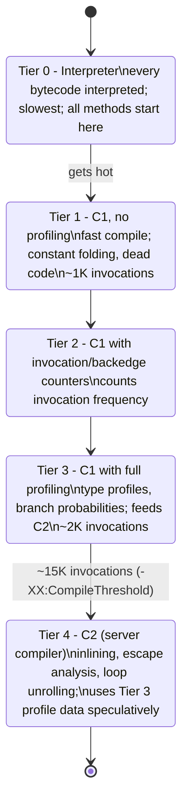
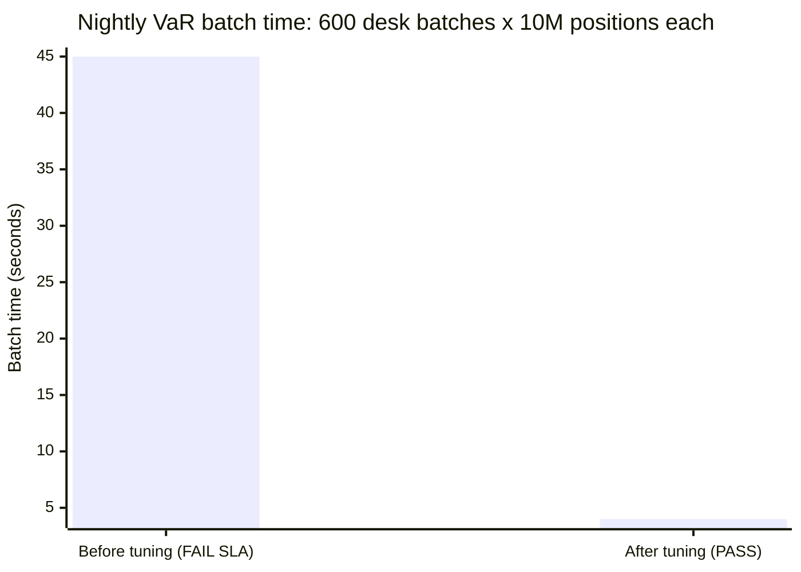

# Performance & Tuning

## 1. Concept Overview

Java performance tuning is the discipline of identifying and eliminating bottlenecks in JVM-based applications. Unlike C/C++, Java engineers delegate memory management to the GC and compilation to the JIT — but this means understanding the JVM's behavior is essential to diagnose why a system is slow.

This module covers the full performance investigation toolkit: JVM flags for GC and startup, reading GC logs, taking and analyzing heap dumps, thread dump interpretation for deadlocks, JMH for reliable microbenchmarks, and async-profiler for CPU and allocation flame graphs. It also covers common anti-patterns like false sharing, String concatenation in loops, and when streams are slower than for-loops.

---

## 2. Intuition

> **One-line analogy**: JVM performance tuning is like diagnosing a car — you need the right instrument (GC logs, heap dump, flame graph) for the right symptom (long pauses, memory leak, CPU hotspot), and you fix based on evidence, not guesses.

**Mental model**: Performance problems in Java fall into four buckets: (1) **GC pressure** — too many allocations causing frequent GC; (2) **Memory leak** — objects accumulating in heap indefinitely; (3) **CPU bottleneck** — computation too slow (algorithm or contention); (4) **I/O bottleneck** — threads waiting on network/disk. Each requires a different diagnostic tool and a different fix.

**Why it matters**: A 10ms GC pause on every 200ms request means 5% of all requests are delayed. A false sharing issue can make a counter 10× slower under concurrency. Concatenating strings in a loop with `+` can be 100× slower than `StringBuilder`. These are real, measurable performance differences in production systems.

**Key insight**: JMH (Java Microbenchmark Harness) exists because writing correct Java microbenchmarks without it is nearly impossible — the JIT will dead-code-eliminate the entire benchmark if the result isn't used, JIT warmup takes thousands of iterations before code is fully compiled, and CPU microarchitectural effects (branch prediction, cache warming) heavily influence results.

---

## 3. Core Principles

- **Measure before optimizing**: use profilers (async-profiler, JMH) to find the actual bottleneck, not guesses.
- **GC is not free**: every allocation puts pressure on GC; short-lived large objects in old gen cause major GC.
- **False sharing**: two variables in the same 64-byte CPU cache line cause cache bouncing under concurrent writes — fix with padding.
- **String concatenation in loops**: `str += part` in a loop creates a new `String` object every iteration — O(n²) for n concatenations.
- **Autoboxing cost**: `Integer` instead of `int` in hot loops adds boxing/unboxing overhead and GC pressure.
- **Amortized vs worst-case**: ArrayList add is O(1) amortized but O(n) for the resize — pre-size for known capacities.

---

## 4. Types / Architectures / Strategies

### 4.1 Key JVM Flags

| Flag | Purpose |
|------|---------|
| `-Xms4g -Xmx4g` | Set initial/max heap (set equal to avoid resize pauses) |
| `-Xss512k` | Thread stack size (default 512k-1MB; reduce for more threads) |
| `-XX:MetaspaceSize=256m -XX:MaxMetaspaceSize=512m` | Metaspace initial/max |
| `-XX:+UseG1GC` | Use G1 GC (default Java 9+) |
| `-XX:+UseZGC` | Use ZGC (Java 15+ GA) |
| `-XX:MaxGCPauseMillis=100` | G1 target pause goal (advisory, not guaranteed) |
| `-XX:+AlwaysPreTouch` | Pre-allocate all pages at startup; avoids page fault latency |
| `-Xlog:gc*:file=gc.log:time,uptime:filecount=5,filesize=20m` | Structured GC logging |
| `-XX:+HeapDumpOnOutOfMemoryError -XX:HeapDumpPath=/tmp/` | Auto heap dump on OOM |
| `-Djdk.tracePinnedThreads=full` | Debug virtual thread pinning |
| `-XX:+PrintCompilation` | JIT compilation events |

### 4.2 Thread Pool Sizing Formulas

```
CPU-bound:
  pool_size = # CPU cores + 1
  (one spare to cover occasional scheduling gaps)

I/O-bound:
  pool_size = # CPU cores × (1 + W/C)
  where W = avg wait time, C = avg compute time
  Example: 8 cores, requests spend 90% waiting (W/C = 9)
  pool_size = 8 × (1 + 9) = 80

Database-bound:
  pool_size = min(max_db_connections / services_count, optimal_per_formula)
  Don't create more pool threads than DB connections
```

---

## 5. Architecture Diagrams

### GC Log Reading
```
[gc,start    ][  0.456s][ 123.45ms] GC(5) Pause Young (G1 Evacuation Pause)
[gc,heap     ][  0.456s][ 123.45ms] GC(5) Eden regions: 24->0(24)
[gc,heap     ][  0.456s][ 123.45ms] GC(5) Survivor regions: 1->2(4)
[gc,heap     ][  0.456s][ 123.45ms] GC(5) Old regions: 8->8(8)
[gc,heap     ][  0.456s][ 123.45ms] GC(5) Metaspace: 45MB->45MB(50MB)
[gc          ][  0.456s][ 123.45ms] GC(5) Pause Young (G1 Evacuation Pause) 1200M->800M(2048M) 4.521ms

Key fields:
  1200M->800M = heap before->after GC
  (2048M) = max heap
  4.521ms = STW pause duration
  Young Evacuation = minor GC (Eden + Survivors copied)

Warning signs:
  Full GC: GC(N) Pause Full -- always bad (long STW)
  "To-space Exhausted" -- G1 ran out of survivor space, fallback to full GC
  pause > MaxGCPauseMillis goal by 10x -- tune InitiatingHeapOccupancyPercent
```

### Heap Dump Analysis (Eclipse MAT)
```
Heap Dump Concepts:
  Shallow heap: memory consumed by the object itself (fields)
  Retained heap: memory freed if this object were GC'd (object + all objects
                  only reachable through it)

Dominator tree: shows which objects retain the most memory
  Root
    |-- MyCache (retained: 850MB)  <- problem object
    |     |-- HashMap$Entry[] (450MB)
    |     |-- RequestContext[10000] (400MB)
    |
    |-- MyService (retained: 50MB)

Leak Suspects report: objects growing unbounded, never released

Steps:
  1. jmap -dump:live,format=b,file=heap.hprof <pid>
  2. Open in Eclipse MAT
  3. Run "Leak Suspects Report"
  4. Check dominator tree for unexpectedly large retained heap
  5. Find shortest path from GC root to leaked object
```

### CPU Flame Graph (async-profiler)
```
async-profiler -d 30 -f flame.html <pid>

Reading a flame graph:
  - X axis: alphabetical order (width = time/sample proportion)
  - Y axis: call stack depth
  - Wide frames = hot code (lots of CPU time)
  - Colors: Java (green), native/C (orange), JVM (yellow)

What to look for:
  - Wide frames near the bottom = hot methods (where time is spent)
  - Thin frames at top of wide blocks = leaf functions actually running
  - "Profiling" overhead at top = profiler itself (ignore)
  - Unexpected JVM frames = deoptimization, safepoint overhead
```

---

## 6. How It Works — Detailed Mechanics

### String Concatenation in Loops — Exact Bytecode

```java
// SLOW: O(n²) allocations
String result = "";
for (String s : list) {
    result += s;  // each iteration: new StringBuilder, append, toString -> new String
}

// FAST: O(n)
StringBuilder sb = new StringBuilder();
for (String s : list) {
    sb.append(s);
}
String result = sb.toString();  // single final String allocation

// Modern note: Java 9+ uses StringConcatFactory (invokedynamic) for non-loop concatenation
// "a" + "b" + "c" may use an optimized strategy depending on constants/variables
// But INSIDE a loop with +=, each iteration still creates an intermediate object
// The JIT can sometimes optimize this, but don't rely on it

// String.format vs + vs StringBuilder:
// String.format: slowest (regex parsing, format object)
// +: OK for 2-3 concatenations (javac optimizes to StringBuilder)
// StringBuilder: fastest for loops and many concatenations
```

### False Sharing — Cache Line Contention

```java
// PROBLEM: two fields share a 64-byte cache line
class Counters {
    volatile long counterA;  // 8 bytes
    volatile long counterB;  // 8 bytes -- SAME CACHE LINE as counterA
}
// Thread 1 increments counterA: invalidates cache line on all cores
// Thread 2 increments counterB: also invalidates same cache line
// Both threads compete to "own" the cache line -> MESI protocol bouncing
// Performance: 10-100x slower than no sharing

// FIX 1: @Contended annotation (JDK internal, or public in Java 9+)
@jdk.internal.vm.annotation.Contended
class Counters {
    volatile long counterA;
    volatile long counterB;  // padded to separate cache lines automatically
}

// FIX 2: Manual padding (128 bytes = 2 cache lines = safe on most architectures)
class PaddedCounter {
    volatile long value;
    long p1, p2, p3, p4, p5, p6, p7;  // 7 × 8B + 8B value = 64B line 1
    // class header + padding = one cache line
}
```

### JMH — Correct Microbenchmarks

```java
@BenchmarkMode(Mode.AverageTime)
@OutputTimeUnit(TimeUnit.MICROSECONDS)
@State(Scope.Thread)  // each thread has its own instance
@Warmup(iterations = 5, time = 1)
@Measurement(iterations = 10, time = 1)
@Fork(2)  // run benchmark twice in separate JVM forks (catches JIT drift)
public class StringBenchmark {
    private List<String> parts = List.of("a", "b", "c", "d", "e");

    @Benchmark
    public String concatenationPlus() {
        String result = "";
        for (String s : parts) result += s;
        return result;  // MUST return result to prevent dead code elimination
    }

    @Benchmark
    public String stringBuilder() {
        StringBuilder sb = new StringBuilder();
        for (String s : parts) sb.append(s);
        return sb.toString();
    }

    // For computations that produce void (no return value):
    @Benchmark
    public void voidBenchmark(Blackhole bh) {
        int result = compute();
        bh.consume(result);  // prevents dead code elimination
    }
}
// Run: mvn package && java -jar target/benchmarks.jar
```

### Compact Strings (Java 9)

```java
// Java 8 and before: String backed by char[] (UTF-16, 2 bytes per char)
// Java 9+: compact strings by default
//   LATIN1: 1 byte per char (if all chars fit in ISO-8859-1)
//   UTF16: 2 bytes per char (if any char outside LATIN1)

// String.value: byte[]
// String.coder: byte (0 = LATIN1, 1 = UTF16)

// Impact:
// "hello" in Java 8: char[5] = 10 bytes
// "hello" in Java 9: byte[5] = 5 bytes (LATIN1)
// For typical ASCII-heavy applications: 20-30% heap reduction for String data
// Enabled by default: -XX:+CompactStrings (can disable with -XX:-CompactStrings)
```

### Autoboxing Cost in Hot Paths

```java
// SLOW: autoboxing in hot loop
Map<String, Integer> map = new HashMap<>();
for (String word : words) {
    Integer count = map.get(word);           // unbox (or null check)
    map.put(word, count == null ? 1 : count + 1);  // box int to Integer
}
// Each put() boxes the int, each get()+operation unboxes and reboxes

// FAST: use compute() to avoid double lookup
Map<String, Integer> map = new HashMap<>();
for (String word : words) {
    map.merge(word, 1, Integer::sum);  // atomic merge; still boxes but single call
}

// FASTEST: primitive map (Eclipse Collections or Trove) for int values
// Or: count with LongAdder, not Integer, for concurrent case
```

### CPU Cache Architecture and Memory Access Patterns

```
CPU cache hierarchy (typical modern x86 server):
  L1 cache: ~32KB per core, latency ~4 cycles  (per-core, fastest)
  L2 cache: ~256KB per core, latency ~12 cycles (per-core)
  L3 cache: ~8-32MB shared across all cores, latency ~40 cycles
  RAM: unlimited (for our purposes), latency ~200+ cycles

Cache line: 64 bytes on x86. The unit of transfer between memory and cache.
When you read one byte, the entire 64-byte cache line is loaded into L1.

WHY ArrayList beats LinkedList for sequential iteration (same O(n)):

  ArrayList<Integer> (sequential):
    elements stored contiguously in memory (Object[] array)
    accessing list[0]: load 64-byte cache line containing elements 0-15 (4B refs × 16)
    accessing list[1]: ALREADY IN L1 CACHE (same cache line)
    ...list[15]: 15 accesses at ~4 cycles, 1 cache miss at first access
    Effective cost: ~4 cycles per element

  LinkedList<Integer> (scattered):
    each Node = {value, prev, next} = ~24 bytes header + pointers
    each Node.next pointer points to a random heap address (different cache line)
    accessing node.next: L1 miss -> L2 miss -> L3 miss -> RAM
    Effective cost per element: ~200 cycles (RAM access)

  Result: for 1M integers, ArrayList sequential iteration is 50-100x faster than LinkedList.
  This applies even though both are O(n) — O notation ignores constants.

Practical implications:
  - Prefer ArrayList, arrays, primitive arrays over linked structures
  - Loop over int[] rather than Integer[] (no pointer chasing)
  - Keep related data together in fields (struct-of-arrays vs array-of-structs)
  - Large gaps between accessed memory addresses = cache thrashing
```

### JIT Inlining Budget and Megamorphic Call Sites

```
Method inlining: JIT replaces a call instruction with the method body at the call site.
Avoids call overhead AND enables further optimizations (constant folding, escape analysis).

Default inline threshold: ~35 bytecodes (-XX:MaxInlineSize=35)
  Methods up to 35 bytecodes are candidates for inlining.
  Larger methods: only inlined if very hot (-XX:FreqInlineSize=325, ~325 bytecodes)

Call site types:
  Monomorphic: exactly ONE concrete type seen at this call site
    → JIT inlines the single implementation (no dynamic dispatch)
    → Example: void process(Animal a) called only with Cat instances
    → cat.speak() is inlined as Cat.speak() directly

  Bimorphic: exactly TWO concrete types seen
    → JIT generates: if (type == Cat) inlined Cat.speak else inlined Dog.speak
    → Still fast, but 2x code

  Megamorphic: 3 or MORE concrete types seen at the call site
    → JIT CANNOT inline: too many variants to enumerate
    → Falls back to vtable dispatch (virtual method table lookup)
    → Typically: ~10-15% slower than monomorphic inline

  Example of megamorphic degradation:
    Animal[] animals = new Animal[]{new Cat(), new Dog(), new Bird(), new Fish()};
    for (Animal a : animals) a.speak();  // 4 types → megamorphic → no inlining

Diagnostic flags:
  -XX:+UnlockDiagnosticVMOptions -XX:+PrintInlining  → log all inlining decisions
  -XX:+PrintCompilation  → show method compilation events

Production impact:
  A payment service had a "processTransaction(Transaction tx)" hot method called
  with 5 different Transaction subtypes. JIT couldn't inline it (megamorphic).
  Fix: seal the Transaction hierarchy, route to type-specific processors earlier —
  each processor site was monomorphic → inlined → 25% throughput improvement.
```

### Tiered Compilation

Tiered compilation (Java 7+, default since Java 8) starts every method at Tier 0
(interpreter) and progressively recompiles hot methods to higher tiers as invocation
counts cross thresholds:



Tiered compilation flags:
- Default (tiered, levels 0-4): `-XX:+TieredCompilation` (default in JDK 8+)
- Cold-start optimization (JVM dies before warmup, e.g., serverless): `-XX:TieredStopAtLevel=1` — C1 only, fast startup, lower peak performance; suitable for AWS Lambda, short-lived processes
- Disable JIT entirely: `-Xint` — interpreter only; ~5-10x slower; rarely used

GraalVM native image compiles ALL code AOT (ahead-of-time): zero warmup and the fastest possible startup, at the cost of losing dynamic class loading (reflection becomes limited) — used for microservices where cold start time matters (Quarkus native, Micronaut).

---

## 7. Real-World Examples

- **Netflix**: Uses async-profiler to find GC pressure caused by JSON serialization creating millions of short-lived `Map.Entry` objects per request. Fix: reuse `Map` objects via object pools for serialization contexts.
- **LinkedIn**: False sharing in their metrics infrastructure caused counter updates to be 15x slower under parallel execution. Fix: padding with `@Contended`.
- **Financial systems**: G1 GC humongous object allocations (large byte[] for response buffers > 16MB) bypassed young gen, went directly to old gen, and triggered mixed GC prematurely. Fix: increase `-XX:G1HeapRegionSize=32m`.

---

## 8. Tradeoffs

| Approach | Benefit | Cost |
|----------|---------|------|
| ZGC vs G1 | Sub-ms pauses | Higher CPU overhead (load barriers) |
| Pre-sizing collections | Fewer resizes | Wasted memory if over-estimated |
| Object pooling | Reduced GC | Complex lifecycle, thread safety |
| Primitive arrays over boxing | Cache-friendly, no GC | Less flexible |
| String.intern() | String pool reuse | Global lock contention; permgen/metaspace pressure |
| LongAdder over AtomicLong | 10-20x faster under contention | sum() is not atomic with respect to increments |

---

## 9. When to Use / When NOT to Use

**Use JMH when**:
- Benchmarking a specific algorithm or data structure
- Comparing implementation alternatives
- Verifying a performance optimization actually helps

**Use async-profiler when**:
- CPU flame graph needed (where is time spent?)
- Allocation profiling (what's generating the most GC pressure?)
- Wall-clock profiling (what are threads doing while waiting?)

**Do NOT use `VisualVM` in production** — it uses JVMTI, which adds significant overhead and can affect GC behavior.

**Use `-XX:+AlwaysPreTouch`** for latency-sensitive services to avoid page fault latency spikes at startup.

---

## 10. Common Pitfalls

### War Story 1: Thread pool sized too small — CPU underutilization
An I/O-bound service used `Executors.newFixedThreadPool(8)` on a 32-core machine. With each request spending 90% time waiting for DB, only 8 concurrent requests could run. Fix: `pool_size = 32 × (1 + 9) = 320` threads (or virtual threads). Throughput increased 4×.

### War Story 2: Dead code elimination invalidates benchmark
A developer wrote a benchmark that computed a hash but didn't return or use the result. The JIT eliminated the entire computation. The benchmark showed 0 ns/op — unrealistically fast. **Fix**: return the result from the `@Benchmark` method, or use `Blackhole.consume()`.

### War Story 3: `String.intern()` causing global lock contention
A service used `intern()` extensively to deduplicate strings in a cache. Under load, all threads contended on the String pool's global lock. **Fix**: Use a `ConcurrentHashMap<String, String>` for manual deduplication — much lower contention.

### War Story 4: Object pooling hurting performance
A team added an object pool for their DTO objects, believing they'd reduce GC pressure. The pool used synchronized access (lock contention) and the TLAB-allocated short-lived objects it replaced cost nearly nothing to GC anyway. Pool overhead exceeded benefit. **Fix**: Remove the pool; let the GC do its job; profile first.

---

## 11. Technologies & Tools

| Tool | Purpose |
|------|---------|
| async-profiler | CPU/allocation/wall-clock flame graphs; production-safe |
| JMH | Java Microbenchmark Harness; correct microbenchmarks |
| Eclipse MAT | Heap dump analysis; dominator tree; leak suspects |
| `jstack` | Thread dumps; deadlock detection |
| `jstat -gcutil` | Live GC statistics |
| `-Xlog:gc*` | Structured GC logging (Java 9+) |
| VisualVM | Development-time monitoring (not production) |
| Java Flight Recorder (JFR) | Low-overhead production profiling |

---

## 12. Interview Questions with Answers

**Q1: How do you size a thread pool for CPU-bound vs I/O-bound work?**
CPU-bound: `# CPU cores + 1` — one extra thread covers rare scheduling gaps; more than this causes context switch overhead with no CPU-time benefit. I/O-bound: `# CPU cores × (1 + W/C)` where W = average wait time and C = average compute time per task. If tasks spend 90% waiting (DB calls, HTTP): `cores × 10`. Practical cap: bounded by the DB connection pool size or downstream service limits. On Java 21, use virtual threads for I/O-bound work — the JVM schedules them on carrier threads automatically, eliminating manual sizing.

**Q2: What is false sharing and how do you detect and fix it?**
False sharing: two independently-written variables share a 64-byte CPU cache line. When Thread 1 writes variable A and Thread 2 writes variable B simultaneously, they both invalidate the entire shared cache line — each write forces the other core to reload 64 bytes from L3/memory. Effect: 10-100× slower than non-shared counters. Detect: async-profiler hardware counter mode shows high cache-miss rate on specific fields; or JMH with `@Contended` on/off. Fix: `@jdk.internal.vm.annotation.Contended` (enables padding to separate cache lines) or manual padding with unused `long` fields.

**Q3: How would you diagnose a memory leak in production?**
(1) Observe: heap grows steadily on dashboards (JVM metrics); major GC frequency increases; OOM eventually. (2) Capture heap dump before OOM: configure `-XX:+HeapDumpOnOutOfMemoryError` or trigger with `jmap -dump:live,format=b,file=heap.hprof <pid>`. (3) Open in Eclipse MAT: run Leak Suspects Report; examine dominator tree for objects with unexpected retained heap. (4) Find GC root path: "Path to GC Roots" for the suspect object — reveals which field chains keep it alive. (5) Fix the holding reference (remove from static collection, call `threadLocal.remove()`, cancel event listener).

**Q4: What is JMH and why is it needed for microbenchmarks?**
JMH (Java Microbenchmark Harness, from OpenJDK) handles three problems that make naive benchmarks unreliable: (1) Dead code elimination — JIT may remove your benchmark computation if results are unused; JMH uses Blackhole to consume results. (2) JIT warmup — code changes tiered compilation state; JMH runs warmup iterations before measuring. (3) Benchmark forking — JMH runs each benchmark in a separate JVM fork, preventing JIT contamination between tests. Without these, your benchmark can be 10-1000× wrong.

**Q5: Why is String concatenation in a loop slow and what is the exact bytecode difference?**
`result += s` inside a loop compiles to: `result = new StringBuilder(result).append(s).toString()`. Each iteration creates a `StringBuilder`, copies the existing string into it, appends the new string, and calls `toString()` which creates a new `String`. Total for n iterations: n `StringBuilder` objects + n `String` objects, each copying the accumulated string — O(n²) total bytes copied. The fix: one `StringBuilder` outside the loop, `append()` inside, `toString()` once — O(n) total. Java 9+ with `StringConcatFactory` optimizes simple non-loop cases but loop `+=` still has this cost.

**Q6: How does compact strings (Java 9) save memory?**
Before Java 9, every `String` was backed by a `char[]` (UTF-16: 2 bytes per character). Java 9 introduced compact strings: if all characters fit in LATIN-1 (ISO-8859-1, single-byte), the string is stored as `byte[]` (1 byte per char) with a `coder` field set to 0. For ASCII-heavy applications (typical server-side Java processing English text, JSON keys, URLs), this reduces String heap usage by ~50%. Controlled by `-XX:+CompactStrings` (on by default). Mixed-language strings that need UTF-16 fall back to 2-byte storage automatically.

**Q7: When is a parallel stream slower than sequential?**
(1) Small collections: the ForkJoinPool overhead (task splitting, merging, thread scheduling) exceeds the computation time. Rule of thumb: < 10,000 elements often not worth it for cheap operations. (2) I/O-bound operations: blocking threads in `ForkJoinPool.commonPool()` — pool starved, sequential would be faster. (3) Non-splittable sources: `LinkedList`, custom iterables that can't split — parallel degrades to sequential with extra overhead. (4) Stateful/ordered operations: `distinct()`, `sorted()` need synchronization in parallel — may be slower than sequential. (5) Computations where the combiner is expensive.

**Q8: What JVM flags would you set for a low-latency service?**
```
-server
-XX:+UseZGC                               # Sub-millisecond pauses
-Xms8g -Xmx8g                             # Pre-size heap (equal: no resize)
-XX:+AlwaysPreTouch                        # Pre-commit all pages at startup
-XX:+UseTransparentHugePages              # Reduce TLB misses (Linux)
-XX:MetaspaceSize=256m -XX:MaxMetaspaceSize=512m
-Xlog:gc*:file=/logs/gc.log:time,uptime:filecount=5,filesize=20m
-XX:+HeapDumpOnOutOfMemoryError -XX:HeapDumpPath=/dumps/
-Djava.awt.headless=true
-Dfile.encoding=UTF-8
```
For Java 21 with virtual threads, add: `-Djdk.tracePinnedThreads=full` during initial rollout to detect pinning issues.

**Q9: How do you read a GC log and identify a problematic pause?**
With `-Xlog:gc*`, look for: (1) "Pause Young" (minor GC): normal, should be <50ms; (2) "Pause Full" (full GC): always problematic — long STW, investigate heap sizing and old gen growth; (3) "GC(N) To-space Exhausted": G1 couldn't fit survivors → fallback full GC; (4) pause duration vs `MaxGCPauseMillis` goal: if consistently 10× over, tune `InitiatingHeapOccupancyPercent` lower. Key metrics: GC frequency (how often), pause duration (how long), heap before/after (how much freed).

**Q10: What is the difference between retained heap and shallow heap in a heap dump?**
Shallow heap: memory consumed by the object itself — its fields' total size (excluding referenced objects). `ArrayList` shallow heap = ~40 bytes (header + length + elementData reference), not counting the array. Retained heap: the total memory that would be freed if this object were GC'd — the object plus all objects exclusively reachable through it. `ArrayList` with 1000 String elements: retained heap = 40B (ArrayList) + array size + 1000 × String sizes. In Eclipse MAT, retained heap is the key metric for identifying leak culprits: high retained heap = deleting this object frees a lot.

**Q11: How does CPU cache architecture explain why `ArrayList` is faster than `LinkedList` for sequential iteration?**
`ArrayList` stores elements in a contiguous `Object[]` array. Reading sequentially loads 64-byte cache lines, each containing ~16 object references (4B each with compressed oops). Subsequent reads hit L1 cache (~4 cycles). `LinkedList` stores each element in a `Node` object (object header + value + prev/next pointers = ~24 bytes + header). Each `node.next` pointer points to a heap-allocated `Node` at an arbitrary address — a different cache line in a different memory location. Accessing it requires: L1 miss → L2 miss → L3 miss → RAM (~200 cycles). For 1M elements: `ArrayList` traversal ≈ 4M cycles; `LinkedList` traversal ≈ 200M cycles (50x slower). This is why O(n) complexity is the same but real-world performance differs by orders of magnitude.

**Q12: What is the JIT inline threshold and how does a megamorphic call site prevent optimization?**
The default JIT inline threshold is approximately 35 bytecodes (`-XX:MaxInlineSize=35`). Methods within this size are candidates for inlining — the JIT replaces the call instruction with the method body, enabling further optimizations like constant folding, escape analysis, and dead code elimination. A megamorphic call site has 3 or more concrete receiver types. The JIT cannot inline megamorphic virtual calls because it would need to enumerate all possible implementations (unlike monomorphic sites where one type is inlined, or bimorphic where two are if-else'd). Megamorphic sites fall back to vtable dispatch (~10-15% slower than inlined monomorphic). Diagnostic: `-XX:+UnlockDiagnosticVMOptions -XX:+PrintInlining` shows "not inlineable" for megamorphic sites. Fix: reduce type diversity at hot call sites, or use `final` methods where possible.

**Q13: What is JVM escape analysis and how can it eliminate heap allocations entirely?**
Escape analysis (enabled by default since Java 6, `-XX:+DoEscapeAnalysis`) determines whether an object reference "escapes" its creating method/thread — stored in a field accessible to other threads, returned to the caller, or passed to a non-inlinable method. If the object does not escape: (1) **Stack allocation** — object lives on the thread stack, freed at method return, zero GC pressure. (2) **Scalar replacement** — the object is decomposed into its individual fields, which are kept in CPU registers or on the stack; the object allocation itself is eliminated entirely. Example: `new Point(x, y)` used only within one method for a calculation is scalar-replaced. Verification: run `java -XX:+PrintEscapeAnalysis` (requires debug JVM) or observe with JMH `@Benchmark` using a GC profiler (`-prof gc`) — allocation rate should be 0 B/op for a properly escaped-analysed result.

**Q14: What is false sharing and how does `@Contended` prevent it?**
False sharing occurs when two threads write to distinct variables that reside on the same CPU cache line (~64 bytes on x86). Each write by one thread invalidates the other thread's cached copy, even though the data is logically independent — the CPU cannot invalidate at sub-cache-line granularity. Symptom: linear throughput degradation as core count increases for a supposedly independent concurrent write workload. Fix — pad fields so each occupies a full cache line:

```java
// BROKEN: counter1 and counter2 share a cache line -> false sharing
class Counters { volatile long counter1; volatile long counter2; }

// FIXED: @Contended pads the field to a full cache line (requires -XX:-RestrictContended)
class Counters {
    @jdk.internal.vm.annotation.Contended volatile long counter1;
    @jdk.internal.vm.annotation.Contended volatile long counter2;
}
// or: manual 7-long padding to reach 64 bytes
class PaddedCounter { volatile long value; long p1,p2,p3,p4,p5,p6,p7; }
```

`LongAdder` uses internal `Cell` padding to avoid false sharing between its striped accumulators. Detection tool: `async-profiler -e cache-misses` or `perf stat -e cache-misses`.

**Q15: What is the "time to safepoint" (TTSP) problem and how does a long-running counted loop trigger it?**
A JVM safepoint is a global stop where all threads pause at "safe" positions (method calls, backward branches in byte code) — required for GC, class redefinition, deoptimization. The "time to safepoint" is the interval from when the JVM requests a safepoint to when all threads actually stop. A thread inside a counted integer loop (`for (int i = 0; i < N; i++)`) only reaches a safepoint at the loop's exit — not at each iteration. If `N` is large (e.g., 10M iterations of a tight loop), that thread blocks the global safepoint for the duration of the loop, halting all other threads — GC pauses, thread-dump requests, and profiling samples all wait. Diagnose with `-XX:+PrintSafepointStatistics -XX:PrintSafepointStatisticsCount=1`; look for high "spin" values. Fix: use `LongStream` (checks safepoints more frequently than `int` loops), or split the loop into bounded chunks.

---

## 13. Best Practices

1. **Always set `-Xms` = `-Xmx`** to pre-commit heap and avoid resize pauses.
2. **Enable GC logging** in every production deployment.
3. **Configure `-XX:+HeapDumpOnOutOfMemoryError`** so you can diagnose OOM incidents post-mortem.
4. **Use async-profiler** (not VisualVM) for production profiling — low overhead.
5. **Use JMH for any benchmark** — never measure with `System.currentTimeMillis()`.
6. **Use `StringBuilder`** for string concatenation in loops; single-line `+` is fine.
7. **Pre-size collections** when you know the expected size — `new HashMap<>(expectedSize * 2)`.
8. **Avoid `String.intern()`** in high-throughput paths — use `ConcurrentHashMap` deduplication instead.
9. **Use `@Contended`** for shared counters in performance-critical concurrent code.
10. **Profile before optimizing** — the hotspot is almost always somewhere surprising.

---

## 14. Case Study

### Tuning a Financial Risk Engine: 45s -> 4s per Batch (Java 17 LTS)

**Scenario.** A nightly Value-at-Risk (VaR) service revalues a portfolio of **10M positions** per batch. The original implementation took **45 seconds** per batch; with 600 batches across desks the nightly window blew past its SLA. Target hardware: 16-core x86-64, each core with a **32 KB L1 data cache** and **64-byte cache lines**, 32 GB heap on Java 17 with G1GC (`-XX:MaxGCPauseMillis=200`). After profiling-driven changes — JMH validation, struct-of-arrays layout, eliminating `BigDecimal` in the hot loop, and devirtualizing a megamorphic callsite — the batch dropped to **4 seconds**, a 10x improvement, with full-GC pauses gone.



Breakdown of the ~11x gain: `BigDecimal` -> `long` cents ~3.0x (allocation + arithmetic); AoS -> SoA cache layout ~2.0x (L1/L2 hit rate); devirtualize `instanceof` callsite ~1.4x (JIT inlining restored); G1 IHOP + region sizing removes 2.5s of full-GC stalls.

### Step 1 — Measure With JMH, Not a Stopwatch

A hand-rolled `System.nanoTime()` micro-benchmark reported the new arithmetic as "free" because the JIT dead-code-eliminated the result. JMH (`Blackhole`, warmup, fork) gave the real number.

```java
@BenchmarkMode(Mode.Throughput)
@OutputTimeUnit(TimeUnit.MILLISECONDS)
@State(Scope.Benchmark)
@Warmup(iterations = 5, time = 1)     // let the JIT compile & reach steady state
@Measurement(iterations = 5, time = 1)
@Fork(2)                              // fresh JVM per fork, isolates JIT noise
public class RevalBench {
    private long[] notionalCents;
    private double[] factor;

    @Setup public void setup() {
        notionalCents = new long[10_000_000];
        factor        = new double[10_000_000];
        // ... populate ...
    }

    @Benchmark
    public void reval(Blackhole bh) {            // Blackhole prevents DCE
        long sum = 0;
        for (int i = 0; i < notionalCents.length; i++)
            sum += (long) (notionalCents[i] * factor[i]);
        bh.consume(sum);
    }
}
// Reading results: Throughput ops/ms, higher is better. Compare CIs (the +/- error);
// if intervals overlap, the "improvement" is noise.
```

### Step 2 — Array-of-Structs vs Struct-of-Arrays (Cache Locality)

The hot loop touched only two fields of a fat `Position` object, but AoS forced the CPU to drag whole 200-byte objects through the cache, evicting useful lines.

```java
// BROKEN for the hot path: array-of-structs. One Position ~200 bytes spans
// 3-4 cache lines; the loop uses 16 bytes of them -> ~92% of each loaded line wasted.
class Position { long id; String book; long notionalCents; double factor; /* +20 fields */ }
Position[] positions;                 // sequential access still cache-hostile

long sum = 0;
for (Position p : positions) sum += (long)(p.notionalCents * p.factor);
```

```java
// FIX: struct-of-arrays. The two arrays are contiguous; one 64-byte line holds
// 8 longs / 8 doubles -> ~8 positions per line, near-100% useful bytes.
long[]   notionalCents;               // hot
double[] factor;                      // hot
// cold fields (id, book, ...) live in parallel arrays touched only when needed
long sum = 0;
for (int i = 0; i < notionalCents.length; i++)
    sum += (long)(notionalCents[i] * factor[i]);
// Measured: L1d miss rate 38% -> 4% (perf stat); loop wall time ~2x faster.
```

### Step 3 — A Megamorphic instanceof Defeating JIT Inlining

A pricing dispatch used `instanceof` chains. With 5+ concrete types hitting one callsite, the call became **megamorphic**, the JIT stopped inlining, and the method exceeded the **325-bytecode inlining threshold** so it never inlined upward either.

```java
// BROKEN: megamorphic callsite. JIT cannot speculate a single target; deoptimizes.
double price(Instrument x) {
    if (x instanceof Bond b)        return priceBond(b);
    else if (x instanceof Swap s)   return priceSwap(s);
    else if (x instanceof Option o) return priceOption(o);   // 5+ branches...
    // C2 sees >2 types -> bimorphic/megamorphic -> no inline -> virtual call cost
}
```

```java
// FIX: monomorphic per-type via a polymorphic method on the type itself, OR
// split the batch by type so each loop sees ONE concrete class (monomorphic).
Map<Class<?>, List<Instrument>> byType = positions stream grouped by getClass();
for (var entry : byType.entrySet())
    for (Instrument x : entry.getValue()) total += x.price();  // monomorphic per loop
// Restored inlining; the per-loop callsite sees a single type -> direct, inlined call.
```

### Concrete Numbers

| Change | Metric | Before | After |
|--------|--------|--------|-------|
| BigDecimal -> long cents | allocations/batch | ~30M `BigDecimal` | ~0 |
| AoS -> SoA | L1d miss rate | 38% | 4% |
| Devirtualize | hot-loop CPI | 1.9 | 0.8 |
| G1 IHOP=35 + region 16m | full-GC pauses | 2.5s every ~10min | none |
| Overall | batch time | 45s | 4s |

### Common Pitfalls

**Benchmarking without JMH — dead-code elimination.** A loop whose result is unused is legally deleted by C2, so the "optimized" version times at 0ns. Always consume results with `Blackhole.consume(...)` and return values; never trust a raw `nanoTime()` loop for nanosecond-scale work.

**Optimizing cold code.** The team first rewrote the report formatter, which the JFR profile later showed was 0.4% of CPU. Profile first (`async-profiler -e cpu`, JFR `jfr print`), then optimize the top frames only.

**String concatenation in a loop creating millions of objects.** `msg = msg + position.id()` inside the 10M loop allocated ~1M intermediate `String`s and dominated young-gen churn. Use a single `StringBuilder` sized up front, or better, avoid building strings in the hot path at all.

**`BigDecimal` in a tight loop.** Each `multiply`/`add` allocates a new immutable `BigDecimal` plus an internal `BigInteger`; 30M of them per batch dominated GC. For fixed-scale money, store **`long` cents** and do integer arithmetic, converting to `BigDecimal` only at the reporting boundary.

### Interview Discussion Points

**Why does a JMH benchmark fork a new JVM and run warmup iterations?** Forking isolates JIT-profile pollution from previous benchmarks in the same JVM; warmup lets C2 compile the hot methods and reach steady state so you measure compiled code, not the interpreter or C1.

**What makes struct-of-arrays faster than array-of-structs for a hot loop?** SoA packs the only fields the loop reads contiguously, so each 64-byte cache line carries ~8 useful elements instead of one fat object's worth; this raises L1/L2 hit rate and lets the hardware prefetcher stream linearly.

**What is a megamorphic callsite and how does it hurt performance?** A virtual call that observes more than two receiver types at runtime; the JIT cannot speculate a single target, so it emits a real virtual dispatch, stops inlining the callee, and may deoptimize — costing both the call overhead and the lost cross-method optimizations.

**Why prefer `long` cents over `BigDecimal` in a numeric hot loop?** `BigDecimal` is immutable, so every operation allocates; in a 10M-iteration loop that is tens of millions of short-lived objects driving young-gen GC. `long` arithmetic is register-resident, allocation-free, and exact for fixed two-decimal money.

---

## Related / See Also

- [JVM Internals](../jvm_internals/README.md) — GC algorithms, JIT compilation tiers, safepoints
- [Java Memory Model](../java_memory_model/README.md) — false sharing, cache-line effects on concurrent performance
- [Case Study: Connection Pool](../case_studies/design_connection_pool.md) — pool sizing math and throughput measurement with realistic load
- [Performance Profiling](../../backend/performance_profiling/README.md) — async-profiler and JFR mechanics in production services, beyond this module's JVM-tuning focus
- [Performance & Load Testing](../../devops/performance_and_load_testing/README.md) — load-generation methodology for validating a tuning change under realistic traffic

**How do you tune G1 to eliminate the full GCs you saw, and what is the risk?** Lower `-XX:InitiatingHeapOccupancyPercent` so concurrent marking starts earlier (e.g. 35 instead of 45) and size regions to fit your object distribution; the risk is starting marking too early, spending CPU on concurrent work and reducing mutator throughput, so validate with GC logs that pauses drop without throughput regressing.
