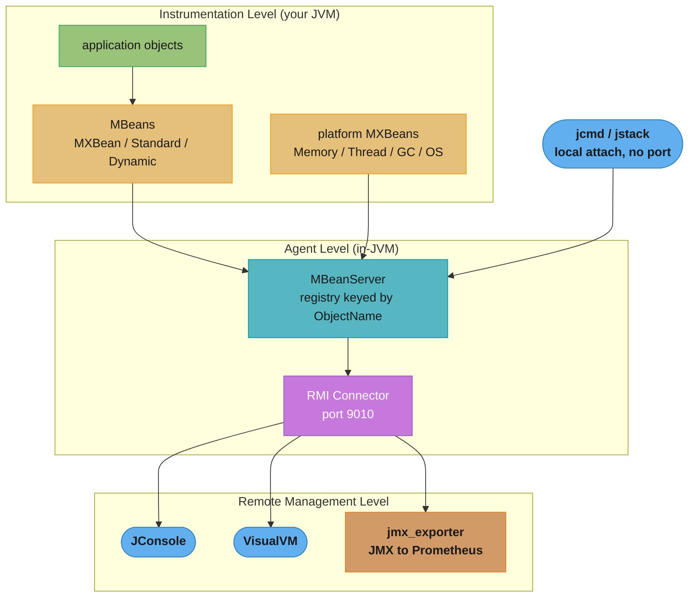
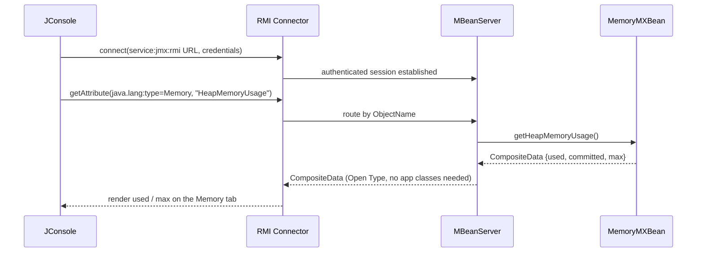

# JMX and Management — Deep Dive

A deep dive into **JMX (Java Management Extensions)** — the JVM's built-in
instrumentation and management bus. This is how JConsole reads your heap usage,
how `ThreadMXBean` finds a deadlock, how a custom cache exposes its hit ratio to
ops, and how `jmx_exporter` bridges the JVM into Prometheus. It is a sub-file of
[Performance & Tuning](README.md); it assumes you know the GC, thread-dump, and
heap-dump diagnostics there and focuses on the management plane that exposes them.

The one sentence to remember: **JMX is a three-level architecture — instrumented
MBeans, an in-JVM MBeanServer agent, and remote connectors — and the remote
connector is a classic RCE foot-gun if you expose it unauthenticated.**

---

## 1. Concept Overview

JMX (JSR 3, JSR 160) is the standard framework for **instrumenting**,
**monitoring**, and **managing** JVM applications at runtime. A managed resource
is exposed as an **MBean** (Managed Bean) — an object whose attributes and
operations are visible to management tools without those tools knowing the
concrete class.

The architecture has three levels:
1. **Instrumentation level** — your resources, wrapped as MBeans (Standard, Dynamic, Open, MXBean, Model).
2. **Agent level** — the **MBeanServer** (a registry keyed by **ObjectName**) plus **connectors** and optional **protocol adaptors**, all living inside the target JVM.
3. **Remote management level** — tools (JConsole, VisualVM) that connect over a **connector** (RMI by default) to read/write attributes and invoke operations.

Out of the box the JVM ships **platform MXBeans** — `MemoryMXBean`,
`ThreadMXBean`, `GarbageCollectorMXBean`, `OperatingSystemMXBean`,
`RuntimeMXBean`, `ClassLoadingMXBean`, `CompilationMXBean` — reachable via
`java.lang.management.ManagementFactory`. You can also register your own MXBeans
to expose application metrics and operations.

---

## 2. Intuition

**One-line analogy**: JMX is the JVM's dashboard-and-control-panel wiring harness.
Every gauge (heap used, thread count, GC time) and every knob (set log level,
flush cache) plugs into a central switchboard — the MBeanServer — and any
authorized tool can plug into the switchboard to read a gauge or turn a knob.

**Mental model**: An MBean is a *contract* (an interface) plus an
*implementation*. The MBeanServer is a `Map<ObjectName, MBean>`. A management tool
never holds a reference to your object — it sends the MBeanServer an `ObjectName`
and an attribute name, and the server does the reflective dispatch. This
indirection is what lets JConsole introspect an app it was never compiled against.

**Why it matters**: JMX is already in every JVM at zero dependency cost. Before
reaching for a metrics library, you can read live memory, threads, GC, and CPU;
find deadlocks programmatically; and expose app-specific counters — all with the
JDK alone. And because it is a remote-management surface, misconfiguring it is a
direct path to remote code execution.

**Key insight**: MXBeans are special because they speak **Open Types**
(`CompositeData`, `TabularData`) instead of arbitrary Java classes. That is why a
remote JConsole can render `HeapMemoryUsage` without your custom class on its
classpath — the value crosses the wire as a self-describing `CompositeData`, not
a serialized bean.

---

## 3. Core Principles — The Three-Level Architecture

1. **MBeans are contracts, not just objects.** A Standard MBean is a class `Foo`
   plus an interface `FooMBean` (or `FooMXBean`); the naming convention *is* the
   API. The server exposes exactly the getters/setters/operations the interface declares.
2. **The MBeanServer is the agent.** `ManagementFactory.getPlatformMBeanServer()`
   returns the singleton platform server that already holds all platform MXBeans.
   You register your MBeans into it under an `ObjectName`.
3. **ObjectName is the address.** Format: `domain:key1=value1,key2=value2`, e.g.
   `java.lang:type=Memory` or `com.example:type=Cache,name=userCache`. Tools
   browse and query by this name; a malformed or non-unique name breaks discovery.
4. **Connectors expose the server remotely.** The default is the **RMI
   connector** (`service:jmx:rmi:///jndi/rmi://host:port/jmxrmi`). Protocol
   **adaptors** (HTTP, SNMP) are an alternative, third-party surface.
5. **Local access needs no open port.** `jcmd`, `jstack`, `jmap`, and VisualVM
   (same host) use the **attach API** over a Unix domain socket — no network
   listener, no `jmxremote` flags.
6. **MXBeans use Open Types for classpath-independent transport.** Values are
   `CompositeData`/`TabularData`, so clients need no application classes.

---

## 4. MBean Flavors

| Flavor | How it is defined | When to use |
|--------|-------------------|-------------|
| **Standard MBean** | Class `X` + interface `XMBean`; attributes inferred from getters/setters | Simple, statically-known management interface |
| **Dynamic MBean** | Implements `DynamicMBean`; exposes `MBeanInfo` at runtime | Attributes/operations known only at runtime |
| **Open MBean** | A Dynamic MBean restricted to Open Types (`CompositeData`, `TabularData`, primitives) | Cross-language / classpath-independent clients |
| **MXBean** | Class `X` + interface `XMXBean` (or `@MXBean`); auto-converts to Open Types | **Preferred** — platform beans are all MXBeans |
| **Model MBean** | Generic `RequiredModelMBean` configured with metadata | Legacy frameworks; rarely written by hand today |

The practical guidance: **write MXBeans.** They give you the Standard-MBean
simplicity (just an interface) with the Open-MBean wire safety (clients need no
custom classes), which is exactly why every `java.lang.management` bean is an MXBean.

---

## 5. Architecture Diagrams

### MBeanServer / agent / connector architecture



Local tools (`jcmd`, `jstack`) reach the MBeanServer through the attach API with
no network listener; remote tools must go through a connector, which is the
surface you must authenticate and encrypt.

### JConsole querying a platform MXBean



The value crosses the wire as a self-describing `CompositeData`, so JConsole
renders it without ever loading a JVM-internal memory class.

---

## 6. How It Works — Detailed Mechanics

### 6.1 Reading platform MXBeans via ManagementFactory

```java
import java.lang.management.*;

// Heap and non-heap memory
MemoryMXBean memory = ManagementFactory.getMemoryMXBean();
MemoryUsage heap = memory.getHeapMemoryUsage();
System.out.printf("heap used=%dMB / max=%dMB%n",
    heap.getUsed() >> 20, heap.getMax() >> 20);

// Threads
ThreadMXBean threads = ManagementFactory.getThreadMXBean();
System.out.println("live threads = " + threads.getThreadCount());

// GC: one bean per collector (e.g. G1 Young Generation, G1 Old Generation)
for (GarbageCollectorMXBean gc : ManagementFactory.getGarbageCollectorMXBeans()) {
    System.out.printf("%s: %d collections, %d ms total%n",
        gc.getName(), gc.getCollectionCount(), gc.getCollectionTime());
}

// OS: cast to com.sun.management.OperatingSystemMXBean for CPU load
OperatingSystemMXBean os = ManagementFactory.getOperatingSystemMXBean();
System.out.println("cores = " + os.getAvailableProcessors());

// Runtime: uptime and the exact JVM flags this process was launched with
RuntimeMXBean runtime = ManagementFactory.getRuntimeMXBean();
System.out.println("uptime ms = " + runtime.getUptime());
System.out.println("jvm args  = " + runtime.getInputArguments());
```

`ManagementFactory` is the single entry point; each getter returns a live bean
whose values reflect the current JVM state on every call.

### 6.2 Detecting a deadlock programmatically

```java
ThreadMXBean tmx = ManagementFactory.getThreadMXBean();

long[] deadlocked = tmx.findDeadlockedThreads();   // null if none; ids if a cycle exists
if (deadlocked != null) {
    ThreadInfo[] infos = tmx.getThreadInfo(deadlocked, true, true);  // include locks + stack
    for (ThreadInfo info : infos) {
        System.out.printf("DEADLOCK: %s waiting on %s held by %s%n",
            info.getThreadName(),
            info.getLockName(),
            info.getLockOwnerName());
    }
    alertOps();   // page someone — a deadlock will not resolve itself
}

// Per-thread CPU time (nanoseconds) — spot a runaway thread burning a core.
long cpu = tmx.getThreadCpuTime(Thread.currentThread().threadId());
```

`findDeadlockedThreads()` detects cycles involving object monitors **and**
`java.util.concurrent` `Lock`s (`findMonitorDeadlockedThreads()` covers only
monitors). Running it on a scheduled health check turns silent hangs into pages.

### 6.3 Writing and registering a custom MXBean

```java
// 1. The contract — interface name MUST end in "MXBean" (or carry @MXBean).
public interface CacheStatsMXBean {
    long   getHitCount();
    long   getMissCount();
    double getHitRatio();   // read-only attribute (getter only)
    void   clear();         // an operation, exposed as an invokable method
}

// 2. The implementation.
public class CacheStats implements CacheStatsMXBean {
    private final AtomicLong hits = new AtomicLong();
    private final AtomicLong misses = new AtomicLong();
    public void recordHit()  { hits.incrementAndGet(); }
    public void recordMiss() { misses.incrementAndGet(); }
    public long getHitCount()  { return hits.get(); }
    public long getMissCount() { return misses.get(); }
    public double getHitRatio() {
        long h = hits.get(), m = misses.get();
        return (h + m) == 0 ? 0.0 : (double) h / (h + m);
    }
    public void clear() { hits.set(0); misses.set(0); }
}

// 3. Register into the platform MBeanServer under a unique ObjectName.
MBeanServer server = ManagementFactory.getPlatformMBeanServer();
ObjectName name = new ObjectName("com.example:type=CacheStats,name=userCache");
server.registerMBean(new CacheStats(), name);
// Now JConsole shows getHitRatio() live and offers a "clear" button.
```

The `MXBean` suffix is load-bearing: rename the interface to `CacheStatsManager`
and registration throws `NotCompliantMBeanException` unless you add the `@MXBean`
annotation. Getters become attributes, setters become writable attributes, and
other public methods become invokable operations.

### 6.4 Remote connector setup

```bash
# Enable the RMI connector on a fixed port at launch.
java -Dcom.sun.management.jmxremote \
     -Dcom.sun.management.jmxremote.port=9010 \
     -Dcom.sun.management.jmxremote.rmi.port=9010 \
     -jar app.jar
# JConsole connects to: service:jmx:rmi:///jndi/rmi://host:9010/jmxrmi
```

Setting `rmi.port` equal to `port` is the fix for the firewall pitfall in §8: by
default the connector exports the actual data channel on a *random* ephemeral
port, which a firewall or Kubernetes NetworkPolicy blocks.

---

## 7. Tooling — JConsole, VisualVM, jcmd, jstack, jmap

| Tool | Mechanism | Best for |
|------|-----------|----------|
| **JConsole** | JMX connector (local or remote) | Quick live view: memory, threads, GC, MBean browser |
| **VisualVM** | JMX + attach API + sampling profiler | Richer UI, CPU/memory sampling, heap dumps, plugins |
| **jcmd** | Attach API (local) | Scriptable one-shot commands: `GC.heap_info`, `Thread.print`, `VM.flags`, `JFR.start` |
| **jstack** | Attach API (local) | Thread dumps for deadlock/hang analysis (`jstack <pid>`) |
| **jmap** | Attach API (local) | Heap histogram and heap dumps (`jmap -dump:live,format=b,file=h.hprof <pid>`) |

`jcmd` is the modern umbrella that subsumes much of `jstack`/`jmap`:
`jcmd <pid> Thread.print` ≈ `jstack`, `jcmd <pid> GC.heap_dump` ≈ `jmap -dump`.
All three use the **attach API** over a local socket, so they need no
`jmxremote` port and are the safe way to inspect a JVM you can `ssh` into. JFR
(Java Flight Recorder) is also driven through `jcmd` (`JFR.start`, `JFR.dump`).

---

## 8. Remote JMX and Security

### BROKEN → FIX: unauthenticated remote JMX is remote code execution

```bash
# BROKEN: JMX/RMI open to the whole network with no auth and no TLS.
java -Dcom.sun.management.jmxremote \
     -Dcom.sun.management.jmxremote.port=9010 \
     -Dcom.sun.management.jmxremote.authenticate=false \
     -Dcom.sun.management.jmxremote.ssl=false \
     -jar app.jar
# Any attacker who can reach port 9010 can register an MLet MBean, point it at a
# remote MBean, and load arbitrary code into the JVM -> full RCE. This is a
# well-known, repeatedly-exploited misconfiguration.
```

```bash
# FIX: bind to localhost, require password auth, enable TLS.
java -Dcom.sun.management.jmxremote.host=127.0.0.1 \
     -Dcom.sun.management.jmxremote.port=9010 \
     -Dcom.sun.management.jmxremote.rmi.port=9010 \
     -Djava.rmi.server.hostname=127.0.0.1 \
     -Dcom.sun.management.jmxremote.authenticate=true \
     -Dcom.sun.management.jmxremote.password.file=/etc/jmx/jmxremote.password \
     -Dcom.sun.management.jmxremote.access.file=/etc/jmx/jmxremote.access \
     -Dcom.sun.management.jmxremote.ssl=true \
     -Dcom.sun.management.jmxremote.ssl.need.client.auth=true \
     -jar app.jar
# password.file: role -> password;  access.file: role -> readonly|readwrite.
# password.file MUST be chmod 600 or the JVM refuses to start.
# For remote access, tunnel over SSH (ssh -L 9010:localhost:9010) instead of
# opening the port to the network.
```

The defense-in-depth stance: **never bind JMX to a routable interface.** Bind
localhost and reach it through an SSH tunnel or a sidecar; if you must open a
port, require both authentication and TLS with client-cert auth.

### The firewall / port pitfall

The RMI connector uses **two** ports: the registry port you specify (9010) and a
*separate* export port for the actual JMX data channel, which defaults to a
**random ephemeral port**. Firewalls and container network policies open only the
known port, so the initial handshake succeeds but the data connection times out —
the notorious "JConsole connects then hangs." Fix: set
`-Dcom.sun.management.jmxremote.rmi.port=9010` so both channels use one known
port, and set `-Djava.rmi.server.hostname` to the address clients dial.

---

## 9. JMX vs Micrometer / Prometheus, and JFR

**JMX is pull-over-RMI; Prometheus is pull-over-HTTP; StatsD is push.** JMX was
designed for interactive, point-in-time queries by a management console, not for
scraping thousands of series into a time-series database. Modern observability
stacks therefore *bridge* JMX rather than replace it:

- **jmx_exporter** — a Java agent (or standalone) that reads MBeans and exposes
  them at `/metrics` in Prometheus text format, letting Prometheus scrape JVM
  internals over HTTP. The canonical way to get JVM+app MBeans into Grafana.
- **Micrometer** — the app-level metrics facade (used by Spring Boot Actuator);
  it can *bind* platform MXBeans (`JvmMemoryMetrics`, `JvmGcMetrics`,
  `JvmThreadMetrics`) and *also* publish an MBean registry, so the same counters
  appear in both Prometheus and JConsole. See
  [Prometheus Metrics](../../devops/observability_metrics_prometheus/README.md)
  and [Spring Boot Actuator](../../spring/spring_boot_actuator/README.md).

Why bridge instead of scrape JMX directly: RMI is stateful, needs a TCP
connection per client, carries the ephemeral-port and RCE baggage above, and has
no dimensional labels. HTTP `/metrics` is stateless, firewall-friendly, and
label-rich — a far better fit for pull-based monitoring at scale.

**Relationship to JFR:** JFR (Java Flight Recorder) is a low-overhead
event-recording profiler, controlled via the `FlightRecorderMXBean` and driven
through `jcmd JFR.start/dump/stop`. JMX gives you *current gauge values*
(heap-used-now, thread-count-now); JFR gives you a *time-ordered event stream*
(every allocation sample, every GC pause, every lock contention) you analyze
after the fact in JDK Mission Control. Use JMX for live dashboards and alerts;
use JFR for deep post-incident forensics — they are complementary, both reachable
through the same MBeanServer.

---

## 10. Tradeoffs

| Dimension | JMX (RMI connector) | Prometheus `/metrics` (via jmx_exporter / Micrometer) | JFR |
|-----------|---------------------|-------------------------------------------------------|-----|
| Model | Pull, interactive query | Pull, scrape at interval | Continuous event recording |
| Transport | RMI (stateful, ephemeral port) | HTTP (stateless, one port) | In-process buffer, dumped on demand |
| Dimensional labels | No | Yes | Event fields |
| Write/operations (invoke methods) | Yes (`clear()`, set attrs) | No (read-only) | No |
| DoS / RCE surface | High if misconfigured | Low (read-only HTTP) | None (local) |
| Overhead | Low (on query) | Low (on scrape) | ~1% continuous |
| Best for | Live console + operations | Fleet dashboards + alerting | Post-incident forensics |

---

## 11. Common Pitfalls and Best Practices

### Pitfall 1: Unauthenticated remote JMX
`authenticate=false ssl=false` on a routable interface is a direct RCE vector via
MLet MBean loading. Bind localhost, require auth + TLS, or tunnel over SSH.

### Pitfall 2: The ephemeral RMI port
JConsole connects then hangs because the data channel exports on a random port a
firewall blocks. Set `com.sun.management.jmxremote.rmi.port` equal to the registry port.

### Pitfall 3: Non-unique or malformed ObjectName
Registering two MBeans under the same `ObjectName` throws
`InstanceAlreadyExistsException`; a bad quote/comma throws `MalformedObjectNameException`.
Include a distinguishing key (`name=userCache`) and unregister on shutdown.

### Pitfall 4: MBean registration leaks
Re-registering per request (e.g., an MBean per connection) without unregistering
fills the MBeanServer and leaks memory. Register once at startup; call
`server.unregisterMBean(name)` in the resource's close/shutdown path.

### Pitfall 5: Interface not named `*MXBean`
`registerMBean` throws `NotCompliantMBeanException` if the interface is
`CacheManager` instead of `CacheMXBean`/`CacheStatsMXBean`. Follow the naming
convention or annotate with `@MXBean`.

### Pitfall 6: High-frequency polling as an availability risk
Scraping expensive attributes (a synthetic `getHitRatio()` that locks, or
`getThreadCpuTime` per thread) every second adds real load. Poll at a coarse
interval and keep attribute getters cheap and side-effect-free.

### Pitfall 7: `getThreadCpuTime` returns -1 or is disabled
Thread CPU-time measurement can be unsupported or turned off
(`isThreadCpuTimeSupported()`/`isThreadCpuTimeEnabled()`), returning `-1`. Check
support before relying on it; enabling it has a small per-context-switch cost.

### Best Practices
1. **Never bind JMX to a routable interface** — localhost + SSH tunnel, or auth + TLS.
2. **Pin `rmi.port` = `port`** and set `java.rmi.server.hostname`.
3. **Write MXBeans, not Standard MBeans** — Open Types cross the wire safely.
4. **Register once, unregister on shutdown** — MBeans are long-lived, not per-request.
5. **Keep attribute getters cheap and read-only** — tools poll them.
6. **Prefer local `jcmd`/`jstack`/`jmap`** for one-off inspection — no open port needed.
7. **Bridge to Prometheus** (`jmx_exporter` / Micrometer) for fleet monitoring; keep JMX for interactive ops.
8. **Run `findDeadlockedThreads()` on a health check** to surface silent hangs.
9. **Enable JFR** (`-XX:StartFlightRecording`) for continuous low-overhead forensics.
10. **Use unique, descriptive ObjectNames** with a stable domain and type/name keys.

---

## 12. Interview Questions with Answers

**Q: What makes exposing remote JMX without authentication dangerous?**
Unauthenticated remote JMX is a remote-code-execution vector, not just an information leak. An attacker who reaches the port can register an MLet MBean, point it at a remote MBean, and load arbitrary code into the JVM. That is why `authenticate=false ssl=false` on a routable interface is one of the most-exploited Java misconfigurations. The fix is to bind localhost, require password auth plus TLS, or reach it only through an SSH tunnel.

**Q: Why does remote JMX often fail through a firewall even when the configured port is open?**
The RMI connector uses two ports — the registry port you configure and a separate data-channel export port that defaults to a random ephemeral port. Firewalls and container network policies open only the known port, so the handshake succeeds but the actual JMX connection times out, producing the classic "JConsole connects then hangs." Set `com.sun.management.jmxremote.rmi.port` equal to the registry port and set `java.rmi.server.hostname` so both channels are known and reachable.

**Q: What is the difference between a Standard MBean and an MXBean?**
A Standard MBean exposes an arbitrary Java interface, while an MXBean converts everything to self-describing Open Types like CompositeData, so remote clients need no custom classes. A Standard MBean's attribute values may require your own classes on the client classpath to deserialize; an MXBean's `CompositeData`/`TabularData` cross the wire fully self-described. That is why every platform bean is an MXBean — JConsole renders `HeapMemoryUsage` without any JVM-internal class. Both are defined by a naming convention (`XMBean` vs `XMXBean`), but MXBean is the safer, preferred flavor.

**Q: How do you detect a deadlock programmatically in Java?**
Call `ManagementFactory.getThreadMXBean().findDeadlockedThreads()`, which returns the ids of threads in a deadlock cycle (or null if none). Pass those ids to `getThreadInfo(ids, true, true)` to get each thread's held locks and stack trace for logging or alerting. Unlike `findMonitorDeadlockedThreads()`, it detects cycles involving both `synchronized` monitors and `java.util.concurrent` `Lock`s, so running it on a scheduled health check turns silent hangs into pages.

**Q: What is the MBeanServer and how do you obtain the platform one?**
The MBeanServer is the in-JVM registry — essentially a `Map<ObjectName, MBean>` — that management tools query by `ObjectName` rather than by object reference. Get the singleton platform server with `ManagementFactory.getPlatformMBeanServer()`; it already holds all platform MXBeans (Memory, Thread, GC, OS, Runtime). You register your own MBeans into it with `registerMBean(bean, objectName)`. This indirection is what lets a tool introspect an application it was never compiled against.

**Q: How do you access the built-in platform MXBeans, and what does each give you?**
Use the `ManagementFactory` factory methods, each returning a live bean that reflects current JVM state on every call. `getMemoryMXBean()` gives heap/non-heap usage, `getThreadMXBean()` thread counts and deadlocks, `getGarbageCollectorMXBeans()` per-collector counts and times, `getOperatingSystemMXBean()` CPU and cores, and `getRuntimeMXBean()` uptime and launch flags. `RuntimeMXBean.getInputArguments()` in particular is invaluable for confirming which flags a running process actually started with.

**Q: How do you write and register a custom MXBean?**
Define an interface whose name ends in `MXBean`, implement it, then register the instance under a unique `ObjectName` in the platform MBeanServer. For example `server.registerMBean(new CacheStats(), new ObjectName("com.example:type=CacheStats,name=userCache"))`. Getters become read-only attributes, setters become writable attributes, and remaining public methods (like `clear()`) become invokable operations that tools such as JConsole can call.

**Q: What is an ObjectName and why does its format matter?**
An ObjectName is an MBean's address in the format `domain:key1=value1,key2=value2`, such as `java.lang:type=Memory` or `com.example:type=Cache,name=userCache`. Tools browse, filter, and query MBeans by this name, and it must be unique — duplicate names throw `InstanceAlreadyExistsException` and malformed ones throw `MalformedObjectNameException`. Including a distinguishing key like `name=` lets you register many instances of the same type without collision.

**Q: What is the difference between JConsole, VisualVM, jcmd, jstack, and jmap?**
JConsole and VisualVM are GUI tools that connect over a JMX connector (VisualVM also samples CPU/memory), while `jcmd`, `jstack`, and `jmap` are command-line tools that use the local attach API and need no open JMX port. `jstack` prints thread dumps, `jmap` produces heap histograms and dumps, and `jcmd` is the modern umbrella that subsumes both (`Thread.print`, `GC.heap_dump`) and also drives JFR. For a JVM you can `ssh` into, the `jcmd` family is the safe, port-free way to inspect it.

**Q: Why do modern stacks bridge JMX to Prometheus instead of scraping JMX directly?**
JMX is a stateful pull-over-RMI protocol with per-client TCP connections, an ephemeral-port firewall problem, an RCE-prone connector, and no dimensional labels — a poor fit for scraping thousands of time series. `jmx_exporter` (or Micrometer) reads the MBeans and re-exposes them at an HTTP `/metrics` endpoint in Prometheus format, which is stateless, single-port, and label-rich. The pattern keeps JMX for interactive operations while giving fleet monitoring a clean HTTP scrape target.

**Q: How does JMX relate to JFR (Java Flight Recorder)?**
JMX exposes current gauge values like heap-used-now, while JFR records a time-ordered stream of events such as allocations and GC pauses at about 1% overhead. JMX is controlled through the MBeanServer; JFR is driven via `jcmd JFR.start/dump` and the `FlightRecorderMXBean`, then analyzed in JDK Mission Control. Use JMX for live dashboards and alerting, and JFR for post-incident forensics; they are complementary and both reachable through the same management plane.

**Q: What are the MBean flavors and which should you use?**
The flavors are Standard, Dynamic, Open, MXBean, and Model, and you should almost always write MXBeans. Standard is an interface plus impl with inferred attributes; Dynamic implements `DynamicMBean` and exposes `MBeanInfo` at runtime; Open restricts a Dynamic MBean to Open Types; MXBean is Standard-style but auto-converted to Open Types; Model is a metadata-configured legacy bean. MXBeans combine the simplicity of declaring an interface with the wire-safety of Open Types, which is exactly why every platform bean is one. Dynamic/Open MBeans are for cases where the management interface is only known at runtime.

**Q: How do you secure a remote JMX connection properly?**
Bind the connector to localhost, require authentication, and enable TLS — the three controls that close the RCE surface. Concretely: set `com.sun.management.jmxremote.host=127.0.0.1`, require a `jmxremote.password`/`jmxremote.access` file pair, and turn on `ssl=true` (ideally `ssl.need.client.auth=true`). The password file must be `chmod 600` or the JVM refuses to start, and roles in the access file are scoped `readonly` or `readwrite`. For access beyond the host, prefer an SSH tunnel (`ssh -L 9010:localhost:9010`) over opening the port to the network.

**Q: What does `getThreadCpuTime` measure, and what is its caveat?**
`ThreadMXBean.getThreadCpuTime(threadId)` returns the CPU time consumed by a specific thread in nanoseconds, letting you find a thread burning a core. The caveat is that it can be unsupported or disabled on some platforms, returning `-1`, so you must check `isThreadCpuTimeSupported()` and `isThreadCpuTimeEnabled()` first. Enabling per-thread CPU measurement also carries a small per-context-switch cost, so leave it off unless you need it.

**Q: Can you monitor and inspect a JVM without opening any remote JMX port?**
Yes — local tools (`jcmd`, `jstack`, `jmap`, and same-host VisualVM) use the attach API over a local socket, so they read the MBeanServer with no `jmxremote` flags and no network listener. This is both the safest and the most common way to inspect a JVM in production: `jcmd <pid> Thread.print` for a thread dump, `jcmd <pid> GC.heap_info` for heap state, `jcmd <pid> JFR.start` to begin a recording. Opening a remote JMX port is only necessary for interactive GUI tools connecting from another host.

**Q: What is the RMI connector, and are there alternatives?**
The RMI connector is JMX's default remote transport, addressed as `service:jmx:rmi:///jndi/rmi://host:port/jmxrmi`, and it is stateful and uses the two-port scheme that causes firewall issues. Alternatives include JMXMP (a simpler single-socket connector from the optional JMX Remote API, easier to firewall but requiring an extra jar) and, more commonly today, sidestepping remote JMX entirely by bridging MBeans to an HTTP `/metrics` endpoint via jmx_exporter. For interactive access many teams keep RMI but bind it to localhost and tunnel over SSH.

**Q: Why is high-frequency JMX polling a potential availability risk?**
Attribute getters run real code, so polling expensive ones every second — a `getHitRatio()` that takes a lock, or `getThreadCpuTime` across every thread — adds measurable load and can even contend with application work. Because tools poll attributes repeatedly, getters must be cheap, side-effect-free, and free of locks on hot paths. Keep polling intervals coarse and push heavy aggregation out of the getter itself.

---

## Related / See Also

- [Performance & Tuning](README.md) — parent module: GC logs, heap dumps, thread dumps, JMH, async-profiler
- [JVM Internals](../jvm_internals/README.md) — GC algorithms and thread mechanics behind the MXBean values JMX exposes
- [Prometheus Metrics](../../devops/observability_metrics_prometheus/README.md) — pull-based scraping and the jmx_exporter bridge
- [Spring Boot Actuator](../../spring/spring_boot_actuator/README.md) — Micrometer binding of platform MXBeans, `/actuator` endpoints
