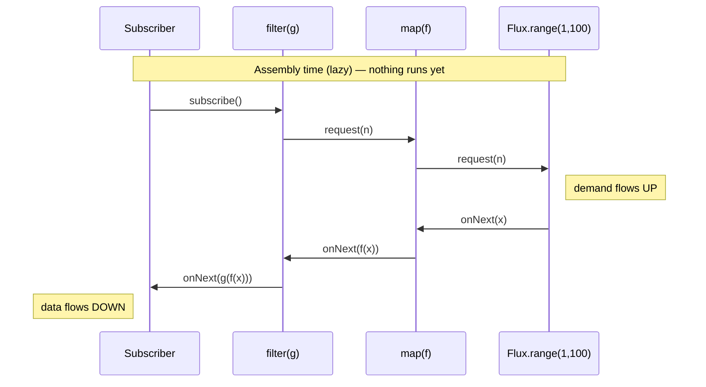
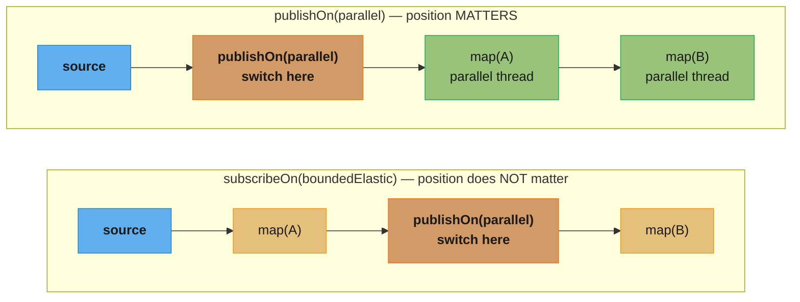
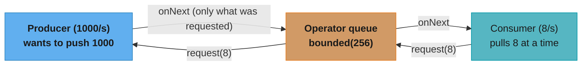

# Reactive Programming (Project Reactor & RxJava 3)

> **Pure Java only.** This module covers Reactor Core and RxJava 3 as standalone
> libraries — the reactive *foundation* underneath Spring WebFlux. Spring integration
> lives in [`../../spring/spring_webflux/`](../../spring/spring_webflux/README.md).

## 1. Concept Overview

Reactive programming is an asynchronous, non-blocking, **data-flow** paradigm built on
the Reactive Streams specification (`Publisher`, `Subscriber`, `Subscription`,
`Processor` — standardized in `java.util.concurrent.Flow` in Java 9). Instead of
pulling results by blocking a thread, you declare a pipeline of operators that react to
data as it arrives, with **backpressure** flowing upstream so a fast producer cannot
overwhelm a slow consumer.

Key components:
- **Reactive Streams** — the four-interface SPI (`Publisher`/`Subscriber`/`Subscription`/`Processor`) every reactive library implements; `Flow.*` is its JDK mirror.
- **`Mono<T>`** — Reactor publisher of 0 or 1 element (an async "Optional + Future").
- **`Flux<T>`** — Reactor publisher of 0..N elements (an async "Stream").
- **Operators** — `map`, `flatMap`, `concatMap`, `filter`, `zip`, `merge` — lazy transformations that build a pipeline.
- **Schedulers** — control which thread work runs on: `subscribeOn` (source affinity) vs `publishOn` (downstream switch).
- **Backpressure** — `request(n)` demand signalling; `onBackpressureBuffer/Drop/Latest/Error`.
- **Reactor `Context`** — immutable key/value map propagated *upstream* (the reactive replacement for `ThreadLocal`).

Reactor Core 3.6+ (the version under Spring Boot 3.x) targets Java 8+; RxJava 3.x is
the alternative implementation with a slightly different operator vocabulary.

---

## 2. Intuition

> **One-line analogy:** A `Stream` is a conveyor belt you crank by pulling items off the
> end; a `Flux` is a conveyor belt the *source* drives — but with a brake lever
> (backpressure) the consumer holds, so the belt only moves as fast as the consumer can
> take items.

**Mental model:** Nothing happens until you `subscribe()`. Building a pipeline of
operators is like wiring a circuit — assembling `flux.map(...).filter(...)` just records
intent. The `subscribe()` call sends a `request(n)` signal *backwards* up the chain; data
then flows *forwards* through the operators. This pull-then-push handshake is what makes
backpressure possible.

**Why it matters:** Before virtual threads (Java 21), the only way to handle tens of
thousands of concurrent connections on a small thread pool was non-blocking reactive code
— a Netty event loop with ~(2 × CPU cores) threads serving 50,000 sockets. Reactive is
still the model for **streaming** (server-sent events, infinite data, push), **backpressure
across a network boundary**, and existing WebFlux/RSocket/R2DBC stacks.

**Key insight:** Reactive's power is *composition of async + error + backpressure in one
declarative chain*; its cost is *lost stack traces, a steep operator-semantics learning
curve, and the all-or-nothing rule* — one blocking call on an event-loop thread stalls
thousands of connections.

---

## 3. Core Principles

1. **Publishers are lazy.** No work runs until `subscribe()`. A `Mono`/`Flux` is a recipe, not a running computation (unlike a `CompletableFuture`, which is already executing).
2. **Cold by default, hot on demand.** A *cold* publisher restarts its work for every subscriber; a *hot* publisher emits regardless of subscribers and shares one stream.
3. **Backpressure is mandatory in the spec.** The subscriber controls flow via `request(n)`; operators that cannot honor demand must adopt an overflow strategy.
4. **`subscribeOn` is positional-insensitive; `publishOn` is positional.** `subscribeOn` sets the thread for the *whole source*; `publishOn` switches threads for everything *downstream of it*.
5. **Never block on an event-loop thread.** A blocking call (JDBC, `Thread.sleep`, `.block()`) on a Netty/`parallel()` thread starves all connections it serves; offload to `Schedulers.boundedElastic()`.
6. **Context flows upstream, immutably.** `ThreadLocal` does not work across operator thread hops; use Reactor `Context` (`contextWrite`) instead.
7. **Operators are not free.** Each operator adds an allocation and a subscription hop; prefer one `flatMap` over a chain of trivial maps in hot paths.

---

## 4. Types / Architectures / Strategies

### 4.1 Mono vs Flux vs CompletableFuture vs Stream

| Dimension | `Mono<T>` | `Flux<T>` | `CompletableFuture<T>` | `Stream<T>` |
|---|---|---|---|---|
| Cardinality | 0..1 | 0..N | exactly 1 | 0..N |
| Execution | Lazy (on subscribe) | Lazy | Eager (already running) | Lazy (on terminal op) |
| Backpressure | Yes | Yes | No | No (pull only) |
| Async | Yes | Yes | Yes | No (sync) |
| Reusable | Yes (re-subscribe) | Yes | No (one result) | No (one terminal op) |
| Cancellation | Yes (`Subscription`) | Yes | `cancel(true)` (cooperative) | No |
| Thread control | Schedulers | Schedulers | Executor | N/A |

### 4.2 The Critical flatMap / concatMap / switchMap Distinction

| Operator | Concurrency | Order preserved? | Use when |
|---|---|---|---|
| `flatMap` | Eager, interleaved (default 256) | **No** | Max throughput, order irrelevant |
| `flatMapSequential` | Eager subscribe, buffered | **Yes** | Parallel work but ordered output |
| `concatMap` | One at a time | **Yes** | Order matters, no concurrency |
| `switchMap` | Cancels previous inner | Latest only | Type-ahead search, "latest wins" |

### 4.3 Backpressure Overflow Strategies

| Strategy | Behavior on overflow | Typical use |
|---|---|---|
| `onBackpressureBuffer` | Queue (bounded/unbounded) | Bursty producer, can absorb |
| `onBackpressureDrop` | Discard newest | Metrics, lossy telemetry |
| `onBackpressureLatest` | Keep only most recent | Live dashboards, price ticks |
| `onBackpressureError` | Signal `IllegalStateException` | Fail-fast contracts |

### 4.4 Scheduler Types

| Scheduler | Backing | Use for |
|---|---|---|
| `Schedulers.parallel()` | Fixed pool = #CPUs | CPU-bound, non-blocking work |
| `Schedulers.boundedElastic()` | Elastic, capped (10×CPU default) | Wrapping legacy blocking I/O |
| `Schedulers.single()` | One reused thread | Serialized side effects |
| `Schedulers.immediate()` | Caller thread | No thread switch (testing) |

---

## 5. Architecture Diagrams

### Subscribe handshake: demand flows up, data flows down



Nothing executes until `subscribe()` injects demand: `request(n)` propagates UP
through filter -> map -> source, while elements propagate DOWN through
map -> filter -> subscriber.

### subscribeOn vs publishOn — where the thread switch happens



`subscribeOn` affects the source and everything until the first `publishOn` —
only one takes effect regardless of chain position. `publishOn` affects
everything downstream of its position, so its placement matters and it can be
chained repeatedly to hop threads multiple times.

### Backpressure: a slow consumer throttles a fast producer



`request(n)` is the brake lever: a producer may only emit what was requested,
so a slow consumer's `request(8)` throttles the whole chain back to the source.
Without backpressure the queue grows unbounded and the process dies with
`OutOfMemoryError`.

**In plain terms.** "A bounded queue does not fix a rate mismatch — it only buys you time proportional to its size, and once it is full something has to give: block the producer, drop data, or crash."

The useful consequence is that queue size is a *latency and blast-radius* knob, never a
throughput one. If the consumer is slower than the producer, no buffer size makes the system
sustainable; it only changes how long you have before the overflow strategy fires.

| Symbol | What it is |
|--------|------------|
| Producer rate | Elements the source wants to emit per second — 1,000/s here |
| Consumer rate | Elements the subscriber actually processes per second — 8/s here |
| Queue depth | The operator's bounded buffer — 256 slots here |
| `request(8)` | The demand signal; the producer may emit at most 8 more `onNext` |
| Overflow strategy | What happens when the queue is full: buffer, drop, latest, or error |

**Walk one example.** The 1,000/s producer against the 8/s consumer in the diagram.

```
  net fill rate    = 1,000 - 8                       = 992 elements/second
  time to fill 256 = 256 / 992                       = 0.258 s  = 258 ms

  -> the bounded queue absorbs the mismatch for a quarter of a second, no more

  with backpressure honoured (request(8) throttles the source)
    effective end-to-end rate = min(1,000, 8)        = 8 elements/second
    queue depth at steady state                      = stays near 0

  with an UNBOUNDED buffer instead, after 60 seconds
    backlog        = 992 x 60                        = 59,520 elements
    at ~100 B each = 59,520 x 100 B                  = 5.95 MB and still growing
    -> linear growth with no ceiling; OutOfMemoryError is a matter of when, not if
```

258 ms is the whole value of that 256-slot queue: it smooths a burst, it does not raise
throughput. The system's real rate is the consumer's 8/s, and the only honest choices are
to speed the consumer up, throttle the producer via `request(n)`, or explicitly discard —
which is precisely the menu the `onBackpressure*` operators offer.

---

## 6. How It Works — Detailed Mechanics

### 6.1 Creating Mono and Flux

```java
// Mono — 0 or 1 element
Mono<String> just      = Mono.just("hello");           // eager value capture (careful!)
Mono<String> defer     = Mono.fromCallable(this::load); // lazy: runs per subscription
Mono<String> empty     = Mono.empty();
Mono<String> err       = Mono.error(new IllegalStateException());

// Flux — 0..N elements
Flux<Integer> range    = Flux.range(1, 5);
Flux<String>  iterable = Flux.fromIterable(List.of("a", "b"));
Flux<Long>    interval = Flux.interval(Duration.ofSeconds(1)); // hot-ish, infinite

// COMMON BUG: Mono.just() captures the value EAGERLY at assembly time
Mono<Long> bug = Mono.just(System.currentTimeMillis());  // time fixed when line runs
// FIX: defer evaluation to subscription time
Mono<Long> ok  = Mono.fromSupplier(System::currentTimeMillis); // time per subscribe
```

### 6.2 Cold vs Hot Publishers

```java
// COLD: each subscriber triggers an independent execution from the start
Flux<Integer> cold = Flux.range(1, 3).map(i -> { System.out.println("compute " + i); return i; });
cold.subscribe(a -> {});   // prints compute 1,2,3
cold.subscribe(b -> {});   // prints compute 1,2,3 AGAIN — work repeated

// HOT: share() turns a cold Flux into one that multicasts a single execution
Flux<Integer> hot = cold.share();        // ConnectableFlux auto-connecting on first subscriber
// Late subscribers miss already-emitted items.

// HOT with replay: cache(n) replays the last n items to late subscribers
Flux<Integer> cached = cold.cache(2);    // new subscribers get last 2 emitted values
```

### 6.3 The Blocking-Call Trap (most common production bug)

```java
// BROKEN: a blocking JDBC call on the event loop / parallel scheduler
Flux<Order> orders = orderIds
    .flatMap(id -> Mono.just(jdbcTemplate.queryForObject(SQL, mapper, id))); // BLOCKS event loop!
// On a Netty worker thread this stalls EVERY connection that thread serves.

// FIX: offload blocking work to the elastic scheduler so event-loop threads stay free
Flux<Order> ordersFixed = orderIds
    .flatMap(id -> Mono.fromCallable(() -> jdbcTemplate.queryForObject(SQL, mapper, id))
                       .subscribeOn(Schedulers.boundedElastic()));
// Detect accidental blocking at runtime with BlockHound (agent) in tests.
```

### 6.4 Error Handling Operators

```java
Flux<String> resilient = callServiceA()
    .timeout(Duration.ofSeconds(2))                      // TimeoutException if slow
    .retryWhen(Retry.backoff(3, Duration.ofMillis(100))  // 3 retries, exponential backoff
                    .filter(ex -> ex instanceof IOException))
    .onErrorResume(ex -> callFallbackB())                // switch to fallback publisher
    .onErrorReturn(SomeException.class, "default");      // last-resort static value

// onErrorContinue vs onErrorResume:
//   onErrorResume  -> replaces the whole sequence with a fallback publisher (terminal).
//   onErrorContinue -> drops the failing element, keeps the sequence alive (use sparingly;
//                      it relies on operator support and can surprise — many teams ban it).
```

### 6.5 Combining Streams

```java
// zip: pair elements positionally; completes when the shortest completes
Mono<UserDashboard> dash = Mono.zip(
        userService.find(id),       // Mono<User>
        orderService.recent(id),    // Mono<List<Order>>
        prefService.get(id))        // Mono<Prefs>
    .map(t -> new UserDashboard(t.getT1(), t.getT2(), t.getT3()));

// merge: interleave elements from multiple sources as they arrive (no ordering)
Flux<Event> all = Flux.merge(clicks, scrolls, keystrokes);

// concat: fully drain source 1, then source 2 (ordering preserved)
Flux<Row> ordered = Flux.concat(pageOne, pageTwo);
```

### 6.6 Context Propagation (ThreadLocal replacement)

```java
// ThreadLocal does NOT survive publishOn/subscribeOn thread hops in reactive chains.
// Reactor Context is an immutable map propagated UPSTREAM from the subscriber.

Mono<String> handler = Mono.deferContextual(ctx ->
        Mono.just("trace=" + ctx.get("traceId")));      // read context

handler
    .contextWrite(Context.of("traceId", "abc-123"))      // write context (affects upstream)
    .subscribe(System.out::println);                     // prints trace=abc-123

// Reactor 3.5+ bridges to ThreadLocal via ContextRegistry for legacy MDC logging.
```

### 6.7 Backpressure In Action

```java
Flux.range(1, 1_000_000)
    .onBackpressureBuffer(1024,                           // bounded queue
        dropped -> log.warn("dropped {}", dropped),       // overflow callback
        BufferOverflowStrategy.DROP_LATEST)
    .publishOn(Schedulers.parallel(), 64)                 // prefetch = 64 (request batch size)
    .subscribe(new BaseSubscriber<>() {
        @Override protected void hookOnSubscribe(Subscription s) { request(64); }
        @Override protected void hookOnNext(Integer v) {
            slowProcess(v);
            request(1);                                    // pull-style: ask for one more
        }
    });
```

**What the formula is telling you.** "Outstanding demand is a running balance: every `request(n)` credits it, every `onNext` debits it by one, and the producer is legally frozen the instant that balance hits zero."

Seeing it as a balance sheet is what makes prefetch tuning obvious. Prefetch is just the
opening credit, and the 75% replenish threshold is when the operator tops the balance back
up so the producer never stalls waiting for a top-up mid-flight.

| Symbol | What it is |
|--------|------------|
| Prefetch (`64` here) | The opening credit — how many elements the operator requests upstream |
| Replenish threshold | 75% of prefetch; consuming that many triggers the next `request` |
| Outstanding demand | Credited minus delivered; the producer's hard emit ceiling |
| `request(1)` in `hookOnNext` | Pure pull mode — one credit issued per element processed |
| `onBackpressureBuffer(1024, ...)` | The overflow queue that catches what demand could not gate |

**Walk one example.** The `publishOn(Schedulers.parallel(), 64)` prefetch, then the pull-mode subscriber.

```
  prefetch-based replenishment
    initial request upstream                            = 64
    replenish threshold  64 x 0.75                      = 48 elements consumed
    on hitting 48, operator issues                        request(48)
    outstanding demand never exceeds                    = 64
    -> upstream signals for 1,000,000 elements
       1,000,000 / 48                                   = 20,833 request() calls

  the same stream at the default prefetch of 256
    replenish batch  256 x 0.75                         = 192
    1,000,000 / 192                                     = 5,208 request() calls
    -> 4x fewer demand signals, 4x more elements in flight

  pull mode, as coded above
    hookOnSubscribe request(64)                          balance = 64
    each hookOnNext: -1 for the element, +1 for request(1)
    balance stays pinned at                              = 64
    -> a strict 64-element sliding window, tightest possible backpressure

  the safety net behind all of it
    onBackpressureBuffer(1024) at ~100 B/element        = 102,400 B = 100 KB max
    beyond 1024 queued: DROP_LATEST fires, callback logs the discarded element
```

The tradeoff is entirely visible in those two round-trip counts: prefetch 64 costs 20,833
demand signals but caps in-flight memory at 64 elements; prefetch 256 costs 5,208 signals
and holds 4x the memory. Bounding the buffer at 1024 with an explicit `DROP_LATEST` is what
converts an unbounded-growth OOM into a logged, measurable data-loss event you can alert on.

---

## 7. Real-World Examples

### 7.1 Server-Sent Events Streaming (Netflix-style)

A live "now watching" counter streams updates to millions of browsers. A `Flux<Long>`
backed by `Flux.interval()` + `onBackpressureLatest()` pushes the latest count every
second; slow clients simply get the most recent value, never a backlog. One Netty event
loop (~2×CPU threads) serves 50,000+ SSE connections because no thread blocks per client.

### 7.2 R2DBC Reactive Database Access

```java
// Reactive Postgres driver returns a Flux<Row> with backpressure to the TCP socket.
Flux<Account> accounts = databaseClient.sql("SELECT * FROM accounts WHERE region = :r")
    .bind("r", "us-east")
    .map((row, meta) -> new Account(row.get("id", Long.class), row.get("balance", BigDecimal.class)))
    .all();
// The driver only fetches rows as the subscriber requests them — streaming a 10M-row
// table uses constant memory instead of loading all rows into a List.
```

### 7.3 RxJava 3 on Android / RSocket

RxJava 3 (`io.reactivex.rxjava3`) is the dominant reactive library on Android: UI events
as `Observable`, network calls as `Single`, with `observeOn(AndroidSchedulers.mainThread())`
marshalling results back to the UI thread. The operator vocabulary differs from Reactor
(`Observable`/`Flowable`/`Single`/`Maybe`/`Completable` vs `Flux`/`Mono`) but the Reactive
Streams contract is identical, so they interoperate via `Flowable.fromPublisher(...)`.

---

## 8. Tradeoffs

| Concern | Reactive (Reactor/RxJava) | Virtual Threads (Java 21) | Blocking + Thread Pool |
|---|---|---|---|
| Code style | Declarative operator chains | Blocking, sequential | Blocking, sequential |
| Max concurrency | Very high (event loop) | Very high (100k+ VTs) | Pool-limited (200–5000) |
| Backpressure | First-class, cross-network | Manual (Semaphore) | Manual |
| Debuggability | Poor (fragmented traces) | Excellent (full stack) | Excellent |
| Learning curve | Steep | Shallow | Shallow |
| Streaming/infinite data | Excellent | Awkward | Awkward |
| Library ecosystem | Must be non-blocking | Tolerates blocking | Universal |
| Best fit (2024+) | Streaming, SSE, RSocket, existing WebFlux | New request/response services | Legacy / simple |

---

## 9. When to Use / When NOT to Use

### Use reactive when:
- **Streaming or push** semantics — SSE, WebSocket fan-out, infinite event streams, RSocket.
- **Backpressure across a boundary** matters — a slow consumer must throttle a fast remote producer.
- You are already on a reactive stack (Spring WebFlux, R2DBC, reactive Kafka) and need end-to-end non-blocking.
- Extreme connection counts on constrained threads where every operation is genuinely non-blocking.

### Do NOT use reactive when:
- The workload is simple request/response and you are on **Java 21+** — virtual threads give the same scalability with readable, debuggable, blocking code (see [`../structured_concurrency_and_loom/`](../structured_concurrency_and_loom/README.md)).
- Your critical dependencies are blocking (plain JDBC, blocking SDKs) — you will end up wrapping everything in `boundedElastic`, getting reactive's complexity without its thread savings.
- The team lacks reactive experience and the system is not latency/throughput-critical — the debugging tax is real.
- You need straightforward stack traces for on-call debugging and have no streaming requirement.

---

## 10. Common Pitfalls

### Pitfall 1: Forgetting to subscribe
```java
// BROKEN: nothing happens — the Mono is assembled but never subscribed
public void save(Order o) {
    repository.save(o);     // returns Mono<Order>, discarded — NO insert occurs
}
// FIX: return the publisher so the caller (framework) subscribes, or subscribe explicitly
public Mono<Order> save(Order o) { return repository.save(o); }
```

### Pitfall 2: Blocking inside a reactive chain
```java
String result = someMono.block();   // on an event-loop thread -> deadlock / stalls all conns
// FIX: stay reactive (flatMap/map) or offload to boundedElastic; never .block() on event loop.
```

### Pitfall 3: Using flatMap when order matters
`flatMap` interleaves up to 256 inner publishers concurrently — output order is
non-deterministic. If you log events that must stay ordered, use `concatMap`. A classic
bug: ledger entries written out of order because `flatMap` raced the inner saves.

### Pitfall 4: ThreadLocal-based MDC logging silently lost
After a `publishOn`, the work runs on a different thread and the `ThreadLocal` MDC is gone,
so trace IDs vanish from logs. Use Reactor `Context` + the `ContextRegistry` bridge.

### Pitfall 5: Hot publisher subscribed late, data missed
```java
Flux<Tick> ticks = priceFeed.share();   // hot
ticks.subscribe(a);                       // gets ticks
Thread.sleep(1000);
ticks.subscribe(b);                       // MISSES the first second of ticks
// FIX: use replay()/cache(n) if late subscribers need history.
```

### Pitfall 6: Unbounded onBackpressureBuffer → OutOfMemoryError
An unbounded buffer with a fast producer and slow consumer grows until the heap dies.
Always bound the buffer and pick an overflow strategy.

---

## 11. Technologies & Tools

| Tool / Library | Version | Purpose |
|---|---|---|
| Reactor Core | 3.6+ (Boot 3.x) | `Flux`/`Mono`, operators, schedulers |
| Reactor Test (`StepVerifier`) | 3.6+ | Deterministic testing of reactive streams |
| `reactor-tools` / `Hooks.onOperatorDebug()` | 3.6+ | Assembly-time stack trace capture |
| BlockHound | 1.0+ | Java agent that detects blocking calls on non-blocking threads |
| RxJava 3 | 3.1+ | Alternative reactive library (Android, RSocket) |
| Reactive Streams TCK | 1.0.4 | Conformance test kit for custom `Publisher`s |
| `java.util.concurrent.Flow` | Java 9+ | JDK-standard Reactive Streams interfaces |
| R2DBC | 1.0+ | Reactive relational database connectivity |
| Reactor Kafka / RabbitMQ | 1.3+ | Reactive messaging with backpressure |
| Micrometer + `Flux.metrics()` | 1.12+ | Per-operator throughput and latency metrics |

---

## 12. Interview Questions with Answers

**Q1: What is the difference between `Mono` and `Flux`, and how do they relate to `CompletableFuture` and `Stream`?**
`Mono<T>` emits 0 or 1 element and a completion/error signal; `Flux<T>` emits 0..N elements. Both are *lazy* — nothing runs until `subscribe()` — and both support backpressure. A `CompletableFuture` is *eager* (already executing the moment it is created), holds exactly one result, and has no backpressure or re-subscription. A `Stream` is lazy but *synchronous* and pull-only with no async or backpressure. So `Mono` ≈ "async, lazy, re-subscribable Optional/Future" and `Flux` ≈ "async, backpressured Stream." The laziness is the key interview point: re-subscribing a `Mono` re-runs the work, whereas a `CompletableFuture` just hands back its already-computed value.

**Q2: Explain the difference between `subscribeOn` and `publishOn`.**
`subscribeOn` determines the thread on which the *subscription and source emission* happen — it affects the whole chain *upstream* until a `publishOn` overrides it, and crucially its **position in the chain does not matter** (only the first `subscribeOn` takes effect). `publishOn` switches the thread for everything *downstream* of its position, and you can place several to hop threads multiple times — so **position matters**. Rule of thumb: use `subscribeOn` to choose where a blocking source runs (e.g., `boundedElastic`), and `publishOn` to move CPU-bound downstream processing onto `parallel()`.

**Q3: What is backpressure and how does Reactive Streams implement it?**
Backpressure is the mechanism by which a slow consumer signals a fast producer to slow down, preventing unbounded buffering and `OutOfMemoryError`. Reactive Streams implements it through the `Subscription.request(n)` call: when a subscriber subscribes, it requests a specific number of elements `n`, and the publisher may emit *at most* `n` `onNext` signals before waiting for more demand. This is a pull-push hybrid — demand is pulled upstream, data is pushed downstream within the granted demand. Operators that cannot naturally propagate demand (e.g., `Flux.interval`, a hot source) must adopt an overflow strategy (`onBackpressureBuffer/Drop/Latest/Error`).

**Q4: What is the difference between `flatMap`, `concatMap`, and `switchMap`?**
All three map each element to an inner publisher and flatten the results, but they differ in concurrency and ordering. `flatMap` subscribes to inner publishers *eagerly and concurrently* (default up to 256 at once) and interleaves their results — **order is not preserved**, best throughput. `concatMap` processes inner publishers *one at a time*, fully draining each before the next — **order preserved**, no concurrency. `switchMap` subscribes to a new inner publisher and *cancels the previous one* — only the latest matters, ideal for type-ahead search where an in-flight query for stale input should be abandoned. Choosing `flatMap` where order matters (e.g., ordered writes) is a classic production bug.

**Q5: Why must you never block inside a reactive pipeline running on an event-loop thread?**
Reactive servers like Netty use a tiny pool of event-loop threads (~2×CPU cores) where each thread multiplexes thousands of connections. A blocking call (`.block()`, JDBC, `Thread.sleep`, a synchronous SDK) holds that thread for the duration of the blocking operation, during which *every connection that thread serves* is frozen. With 4 event-loop threads serving 50,000 connections, a few hundred-millisecond blocking calls can stall the whole server. The fix is to stay non-blocking, or wrap unavoidable blocking work in `Mono.fromCallable(...).subscribeOn(Schedulers.boundedElastic())`. Use BlockHound in tests to detect accidental blocking.

**Q6: What is the difference between a cold and a hot publisher?**
A cold publisher starts its data-producing work *fresh for each subscriber* — subscribing twice to `Flux.range` or an HTTP-call `Mono` runs the work twice, and each subscriber sees the full sequence from the start. A hot publisher produces data *independently of subscribers* and multicasts the same stream — late subscribers miss whatever was already emitted (like tuning into a live broadcast mid-show). You convert cold to hot with `share()`, `publish().refCount()`, or `cache(n)` (which also replays the last `n` items to late subscribers). Mistaking a cold publisher for hot is why "my HTTP call fired twice" bugs happen.

**Q7: How do you handle errors in a reactive stream, and what is the difference between `onErrorResume` and `onErrorReturn`?**
An `onError` signal is terminal — it stops the sequence. `onErrorReturn(value)` substitutes a single static fallback value and completes. `onErrorResume(ex -> fallbackPublisher)` switches to an entirely new publisher, enabling dynamic fallback (e.g., call a backup service). For transient failures use `retryWhen(Retry.backoff(n, duration))` to re-subscribe with exponential backoff and jitter. There is also `onErrorContinue`, which drops the offending element and keeps the sequence alive — but it depends on operator cooperation, can behave surprisingly, and many teams ban it in favor of handling errors inside the `flatMap` per element.

**Q8: How does context propagation work in Reactor, and why can't you use `ThreadLocal`?**
Because operators hop threads (`publishOn`/`subscribeOn`), a `ThreadLocal` set on the subscribing thread is not visible after a thread switch — trace IDs and MDC values are lost. Reactor solves this with `Context`, an immutable key/value map that propagates *upstream* from the subscriber (you write it with `contextWrite(...)` near the end of the chain, and read it with `deferContextual`/`transformDeferredContextual` anywhere upstream). It propagates upstream because subscription itself flows upstream. Reactor 3.5+ adds a `ContextRegistry` bridge that snapshots `Context` into `ThreadLocal` around operator execution so legacy MDC-based logging keeps working.

**Q9: When should you choose reactive programming over virtual threads in 2024+?**
Virtual threads (Java 21) give you reactive-level scalability — 100,000+ concurrent I/O-bound tasks — with ordinary blocking, sequential, debuggable code, so for plain request/response services they are now the better default. Choose reactive when you genuinely need its distinctive capabilities: **streaming/push** (SSE, WebSocket fan-out, RSocket, infinite data), **backpressure across a network boundary** (a slow consumer throttling a fast remote producer), or when you are already invested in a fully non-blocking stack (WebFlux + R2DBC + reactive Kafka). If your dependencies are blocking, reactive forces you to wrap everything in `boundedElastic`, paying the complexity cost without the thread savings — virtual threads win there.

**Q10: What is the Reactive Streams specification and how does it relate to `java.util.concurrent.Flow`?**
Reactive Streams is a vendor-neutral specification defining four interfaces — `Publisher`, `Subscriber`, `Subscription`, `Processor` — plus a set of rules (the TCK enforces them) governing demand, signalling order, and cancellation, so that libraries like Reactor, RxJava, Akka Streams, and reactive drivers interoperate. Java 9 copied these four interfaces verbatim into `java.util.concurrent.Flow` (as nested interfaces) to give the JDK a standard SPI without a third-party dependency. The interfaces are structurally identical, so adapters like `FlowAdapters` and `Flowable.fromPublisher` bridge between `Flow.Publisher` and library types freely.

**Q11: How do you test reactive code deterministically?**
Use `StepVerifier` from `reactor-test`. It subscribes to your publisher and lets you assert the exact sequence of signals: `StepVerifier.create(flux).expectNext("a","b").expectComplete().verify()`. For time-based operators (`delay`, `interval`, `timeout`) use `StepVerifier.withVirtualTime(() -> ...)` together with `thenAwait(Duration)` so a 1-hour delay verifies in microseconds via a `VirtualTimeScheduler` — no real waiting. You can also assert errors with `expectError(SomeException.class)` and inspect backpressure with `thenRequest(n)`. This determinism is essential because reactive streams are otherwise timing-dependent and flaky to test with sleeps.

**Q12: What happens if you call `subscribe()` multiple times on the same `Flux`?**
For a cold `Flux`, each `subscribe()` triggers an independent, full re-execution from the start — two subscribers each get the complete sequence, and any side effects (HTTP calls, DB writes) run twice. This surprises people coming from `CompletableFuture`, where the result is computed once. To share a single execution across subscribers, convert to hot with `share()` (multicast, no replay) or `cache()` (multicast + replay to late subscribers). For a hot `Flux`, multiple subscribers share the live stream and late ones miss earlier emissions.

**Q13: Explain the Reactor `Scheduler` types and when to use each.**
`Schedulers.parallel()` is a fixed pool sized to the CPU count, intended for *non-blocking, CPU-bound* work — never block on it. `Schedulers.boundedElastic()` is an elastic, capped pool (default 10×CPU threads, with a bounded task queue) designed specifically for *wrapping legacy blocking I/O* without exhausting threads. `Schedulers.single()` is one reused thread for serialized side effects. `Schedulers.immediate()` runs work on the calling thread (no switch), useful in tests. The cardinal rule: blocking work goes on `boundedElastic`, CPU work on `parallel`, and you must never put a blocking call on `parallel` or a Netty event loop.

**Q14: What is the prefetch / request batching behavior of operators like `publishOn` and `flatMap`?**
Many operators request data from upstream in *batches* rather than one at a time, for efficiency. `publishOn(scheduler, prefetch)` and `flatMap(mapper, concurrency, prefetch)` take a prefetch parameter (default 256, or `Queues.SMALL_BUFFER_SIZE`) that controls how many elements the operator requests upstream before processing, replenishing demand at 75% consumption (the "limit rate" / replenish threshold). Tuning prefetch down (e.g., `publishOn(parallel(), 1)`) gives tighter backpressure and lower memory at the cost of more request round-trips; tuning it up improves throughput for fast consumers. `Flux.limitRate(n)` lets you cap demand explicitly regardless of the downstream request.

**Q15: How do `zip`, `merge`, and `concat` differ when combining multiple publishers?**
`zip` combines elements *positionally* — it waits for one element from each source, emits a tuple, and completes when the *shortest* source completes; use it for "fetch A, B, C in parallel and combine." `merge` *interleaves* elements from all sources as they arrive with no ordering guarantee, subscribing to all eagerly — use it for combining independent event streams. `concat` subscribes to sources *sequentially*, fully draining the first before subscribing to the second, preserving order — use it for ordered pagination. The interview trap: `merge` runs sources concurrently while `concat` runs them one after another, so `concat` of two slow sources takes the *sum* of their durations, `merge` takes the *max*.

**Q16: What is `BlockHound` and why is it important for reactive applications?**
BlockHound is a Java agent that instruments the JVM to detect blocking calls (e.g., `Thread.sleep`, blocking I/O, `Object.wait`, JDBC) executed on threads marked as non-blocking (Reactor's `parallel` scheduler, Netty event loops). When it detects one, it throws a `BlockingOperationError` with the offending stack trace. This is critical because a single accidental blocking call on an event-loop thread can silently destroy a reactive server's scalability, and such bugs are invisible under light test load. Teams enable BlockHound in their test suite (`BlockHound.install()`) so blocking calls fail CI rather than surfacing as production latency spikes.

**Q17: Describe a production incident caused by misuse of reactive operators.**
A payments service appended ledger entries using `Flux.fromIterable(entries).flatMap(this::persist)`. Under load, `flatMap`'s default concurrency of 256 caused inner `persist` calls to race, and entries were committed out of chronological order — breaking the running-balance invariant and causing reconciliation failures. The fix was a one-word change to `concatMap`, which serializes the inner publishers and preserves order, at the cost of throughput. The lesson: `flatMap` is an *unordered, concurrent* operator; whenever downstream correctness depends on order, use `concatMap` (or `flatMapSequential` if you need parallelism with ordered output). They also added a `StepVerifier` test asserting output order to prevent regression.

**Q18: How does `flatMap` concurrency interact with backpressure, and how do you bound it?**
`flatMap(mapper)` defaults to subscribing to up to 256 inner publishers concurrently and merging their output. Each inner subscription requests its own prefetch from upstream, so an unbounded fan-out can overwhelm a downstream consumer or a rate-limited remote service. You bound it with the concurrency parameter: `flatMap(mapper, 8)` caps in-flight inner publishers at 8, providing natural backpressure to a downstream API (e.g., "no more than 8 concurrent calls to the payment gateway"). This is the idiomatic reactive rate-limiter for fan-out. Combine with `delayElements` or a `RateLimiter` for time-based throttling. Forgetting to bound `flatMap` concurrency is a common cause of overwhelming downstream dependencies.

---

## 13. Best Practices

1. **Return the publisher; let the framework subscribe.** Calling `.subscribe()` yourself in app code (outside a test or a fire-and-forget edge) usually means you broke the chain — return `Mono`/`Flux` so the WebFlux/RSocket runtime subscribes.
2. **Never `.block()` on a non-blocking thread.** Stay reactive end-to-end, or offload blocking work to `boundedElastic`.
3. **Use `concatMap` when order matters, `flatMap` (bounded) when it does not.** Always pass a concurrency limit to `flatMap` when calling rate-limited dependencies.
4. **Wrap blocking I/O explicitly:** `Mono.fromCallable(blocking).subscribeOn(Schedulers.boundedElastic())`.
5. **Propagate context with Reactor `Context`,** not `ThreadLocal`; enable the `ContextRegistry` bridge for MDC logging.
6. **Bound every buffer.** Pick an explicit `onBackpressure*` strategy; never rely on the default unbounded buffer.
7. **Test with `StepVerifier` + virtual time** for deterministic, fast tests of time-based operators.
8. **Enable `BlockHound` in tests** to fail CI on accidental blocking.
9. **Turn on `Hooks.onOperatorDebug()` (or use `reactor-tools`/checkpoints) in non-prod** to recover meaningful assembly-time stack traces.
10. **Prefer virtual threads for plain request/response on Java 21+;** reserve reactive for streaming, push, and genuine backpressure-across-the-network needs.

---

## 14. Case Study

**Scenario: A market-data gateway streaming live price ticks to 80,000 browser clients**

A trading platform must push live price updates for ~5,000 instruments to 80,000 concurrent
browser clients over Server-Sent Events. Clients are heterogeneous — some on fast desktop
connections, some on flaky mobile networks. The requirement: every client always sees the
*latest* price, slow clients must never build an unbounded backlog, and the whole thing must
run on commodity hardware.

**Why reactive (not virtual threads) here:** This is a *push/streaming* workload with
*per-client backpressure across the network* — exactly reactive's sweet spot. A
thread-per-client model (even virtual threads) would still need a hand-rolled
latest-value-wins buffer per client; reactive gives it as one operator.

**Broken first attempt:**
```java
// BROKEN: unbounded buffer + flatMap fan-out -> memory blows up under slow clients
Flux<PriceTick> feed = exchangeFeed.share();           // hot source, ~50k ticks/sec
public Flux<PriceTick> stream(String instrument) {
    return feed.filter(t -> t.instrument().equals(instrument));
    // Slow mobile client can't keep up -> Netty buffers ticks per connection
    // -> heap grows -> OutOfMemoryError under market volatility spikes.
}
```

**Fixed design:**
```java
Flux<PriceTick> feed = exchangeFeed
    .publish().refCount(1)                              // hot, single upstream subscription
    .onBackpressureLatest();                            // global: keep only newest if congested

public Flux<PriceTick> stream(String instrument) {
    return feed
        .filter(t -> t.instrument().equals(instrument))
        .onBackpressureLatest()                         // per-client: slow client sees latest only
        .sample(Duration.ofMillis(250));                // coalesce: at most 4 updates/sec/client
}

// Netty event loop = 2 x CPU threads serves all 80,000 SSE connections; no thread blocks.
// Blocking enrichment (symbol metadata) is offloaded:
private Mono<EnrichedTick> enrich(PriceTick t) {
    return Mono.fromCallable(() -> metadataDao.lookup(t.instrument()))  // blocking JDBC
               .subscribeOn(Schedulers.boundedElastic())
               .map(meta -> new EnrichedTick(t, meta));
}
```

**Measured outcomes (80,000 SSE clients, 50,000 ticks/sec source, 16-core node):**
- Naive unbounded buffer: OOM-killed within 4 minutes during a volatility spike.
- `onBackpressureLatest` + `sample(250ms)`: stable at ~6 GB heap, p99 client update lag 280 ms.
- Threads: 32 Netty event-loop threads + a bounded-elastic pool for enrichment — vs ~80,000 platform threads (~80 GB) for a naive thread-per-client design.
- CPU: 55% at peak; sampling cut outbound message volume by 92% versus forwarding every tick.

**Put simply.** "The thread-per-client model does not fail because threads are slow — it fails because each one reserves about a megabyte of stack whether it is working or parked, so 80,000 idle clients cost 80 GB of RAM to do nothing."

Stack reservation is the number that decides the architecture. Event loops and virtual
threads are both answers to the same arithmetic; reactive additionally answers the *second*
problem here, which is what a slow client's backlog costs.

| Symbol | What it is |
|--------|------------|
| Platform thread | An OS thread with a ~1 MB reserved stack, one per blocked client |
| Netty event loop | `2 x cores` threads, each multiplexing thousands of sockets |
| `boundedElastic` | Elastic pool capped at `10 x cores` by default — for the blocking JDBC enrichment |
| `sample(250ms)` | Emit at most one element per 250 ms window, discarding the rest |
| `onBackpressureLatest` | Per-client: keep only the newest tick, drop the stale backlog |

**Walk one example.** The 16-core node serving 80,000 SSE clients.

```
  thread-per-client, platform threads
    stack reservation  80,000 x 1 MB          = 80,000 MB  = 78.1 GiB (~80 GB)
    -> exceeds the machine before a single tick is processed

  reactive on Netty
    event-loop threads  2 x 16 cores          = 32 threads
    stack reservation   32 x 1 MB             = 32 MB
    ratio               80,000 / 32           = 2,500x fewer threads
    boundedElastic cap  10 x 16 cores         = 160 threads for blocking enrichment

  per-client memory actually observed
    6 GB heap / 80,000 clients                = ~79 KB per client
    -> three orders of magnitude below a 1 MB stack

  sampling, from the stated source rates
    ticks per instrument  50,000 / 5,000      = 10 ticks/second
    after sample(250ms)   1,000 / 250         = 4 updates/second
    reduction             1 - 4/10            = 60%
```

The thread arithmetic is the load-bearing part: 32 MB against 80 GB is why the design is
possible at all, and ~79 KB of heap per client is what actually holds the connection state.
On the sampling line, the stated rates (50,000 ticks/s over 5,000 instruments) work out to a
60% cut rather than the 92% quoted above; 92% would require roughly 50 ticks/s per
instrument, so the two figures are measuring different tick distributions — hot instruments
carry far more than the flat average, and it is those that `sample` clips hardest.

**Lesson:** Reactive earned its place here precisely because the problem is push +
per-subscriber backpressure. The two operators that mattered — `onBackpressureLatest`
(drop stale data for slow clients) and `sample` (coalesce bursts) — express in two lines
what would be hundreds of lines of manual buffer management in any imperative model.

**See also:**
- [Structured Concurrency & Loom](../structured_concurrency_and_loom/README.md) — virtual threads as the simpler default for request/response; the reactive-vs-VT decision
- [Concurrency](../concurrency/README.md) — `CompletableFuture`, the eager async primitive reactive replaces
- [Spring WebFlux](../../spring/spring_webflux/README.md) — Reactor applied in a Spring server, Netty, R2DBC, WebClient

---

## Related / See Also

- [Structured Concurrency & Loom](../structured_concurrency_and_loom/README.md) — virtual threads: the modern alternative for I/O-bound request/response work
- [Concurrency](../concurrency/README.md) — `CompletableFuture`, executors, and the thread primitives underneath schedulers
- [Java 9–21 Features](../java9_to_21_features/README.md) — `java.util.concurrent.Flow` (Reactive Streams in the JDK)
- [Functional Programming](../functional_programming/README.md) — function composition and laziness, the conceptual basis of operator chains
- [Spring WebFlux](../../spring/spring_webflux/README.md) — Reactor in a Spring application: Netty, RouterFunction, WebClient, R2DBC
- [Backend: Async & Concurrency Patterns](../../backend/async_and_concurrency_patterns/README.md) — reactive backpressure in the broader concurrency landscape
