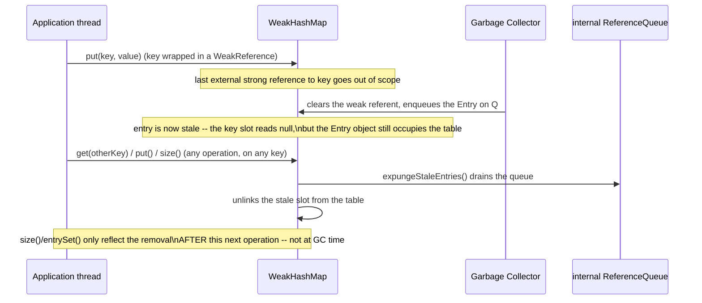
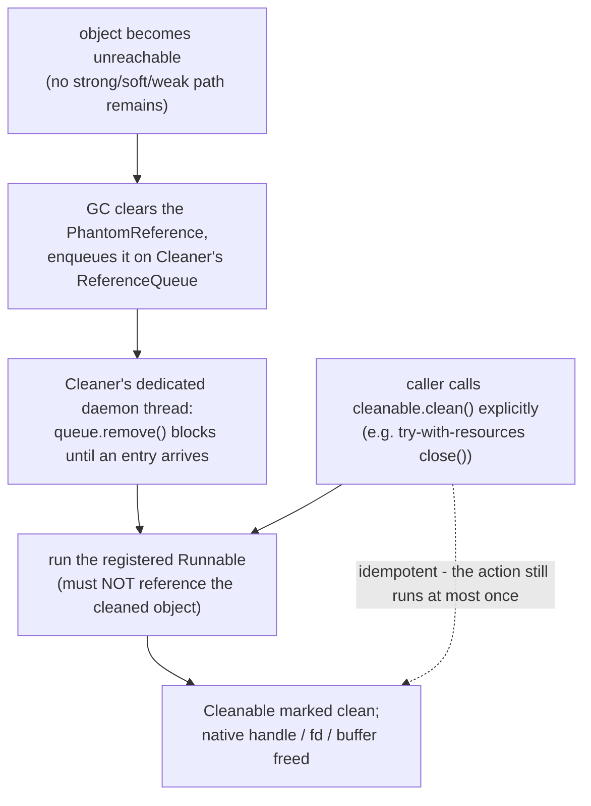

# Reference Types & Cleaners

## 1. Concept Overview

Every object in a Java program is reachable through a graph of references rooted at thread stacks, static fields, and JNI handles — and the garbage collector's entire job is to walk that graph and reclaim whatever it cannot reach. By default, every reference is a *strong* reference: as long as one exists, the object is off-limits to the collector, no matter how much memory pressure the JVM is under. There is no `retain`/`release`, no reference counting — only reachability.

`java.lang.ref` breaks that all-or-nothing rule by providing three weaker reference types — `SoftReference`, `WeakReference`, and `PhantomReference` — each telling the GC "this path does not count toward keeping the object alive" at a different strength. Together with plain strong references, they form a four-level hierarchy (strong > soft > weak > phantom) that lets code express exactly how badly it wants an object to survive.

This module covers what each level buys you: `SoftReference` for memory-sensitive caches that should survive until the heap is genuinely tight; `WeakReference` and `WeakHashMap` for canonicalizing maps and listener registries that must never outlive their subject; and `PhantomReference` plus `ReferenceQueue` for post-mortem cleanup notification — the exact mechanism `java.lang.ref.Cleaner` (Java 9+) is built on, and the JDK's sanctioned replacement for `Object.finalize()`, deprecated for removal by JEP 421 (JDK 18). It then turns to the failure mode this whole API area exists to prevent: the classic Java memory leaks — unbounded `ThreadLocal` entries on pooled threads, `ClassLoader` leaks on application-server redeploys, forgotten listener registrations — and the heap-dump-plus-dominator-tree workflow (`jmap`/`jcmd`, Eclipse MAT) used to hunt them down in production.

---

## 2. Intuition

> **One-line analogy**: strong, soft, weak, and phantom references are four tiers of a landlord's eviction policy — a strong tenant can never be evicted, a soft tenant is evicted only when the building is nearly full, a weak tenant is evicted the moment nobody else vouches for them, and a phantom tenant has already moved out and you're only being paged so you can clean the room.

**Mental model**: reachability, not reference counting, decides an object's lifetime in Java. An object's reachability level is the *strongest* path that currently reaches it from any GC root — wrapping an object in a `WeakReference` does nothing at all if a plain strong reference to it also exists somewhere else in the graph. The four `java.lang.ref` types exist because "keep this alive exactly as long as something else needs it, and tell me when that stops being true" is a need that shows up constantly — caches, canonicalizing registries, listener lists, native-resource wrappers — and cannot be expressed with ordinary variables.

**Why it matters**: this is precisely where "the GC is magic, I don't need to think about it" stops being true. A cache built on a plain `HashMap` never shrinks and eventually OOMs. A `ThreadLocal` that is never removed on a pooled thread retains its last value for that thread's entire remaining lifetime — which, in a pool, is the process's entire lifetime. A `finalize()` override can resurrect a dying object, delay its collection by a full extra GC cycle, or silently swallow an exception that would have told you the resource never got cleaned up. Senior interviews probe exactly this boundary: "how would you build a cache that never OOMs the JVM," "why does this thread pool leak memory," "what's wrong with `finalize()`."

**Key insight**: `PhantomReference.get()` is hard-coded to always return `null` — not a limitation, the entire point. Soft and weak references let code read the referent right up until the moment it is cleared, which is exactly what makes them useful for caching, but it is also what makes them unsuitable for cleanup logic — cleanup code that could still read a live object could also accidentally re-publish a strong reference to it. Phantom references trade away readability entirely in exchange for a hard guarantee: by the time you are notified, the object cannot be resurrected through this reference, ever.

---

## 3. Core Principles

- **Reachability, not reference counting**: the GC decides liveness purely from the strongest path reachable from a GC root; no `retain`/`release`, no explicit counting.
- **Reference strength is a property of the path, not the object**: an object is only as weakly held as its *strongest* current path — one leftover strong reference anywhere defeats every `Soft`/`Weak` wrapper elsewhere.
- **`get()` semantics differ by strength**: `Soft`/`Weak` return the live referent until the GC clears it to `null`; `Phantom.get()` always returns `null`, unconditionally, forever.
- **`ReferenceQueue` is the notification channel**: pairing a reference with a queue is how code learns, after the fact, that a referent died — polling `get() == null` in a loop is racy and wasteful by comparison.
- **`WeakHashMap` clears lazily, not at GC time**: the GC nulls the referent immediately, but the dead map *entry* is only expunged from the table on the next `get()`/`put()`/`size()` call.
- **`ThreadLocalMap` trades a weak key for a strong value**: this stops a `ThreadLocal` *variable* from pinning a `ClassLoader` forever, but does nothing to bound the *value* stored under it.
- **`Cleaner` is a backstop, not a substitute for `close()`**: it exists to catch what `try-with-resources` misses, on a schedule the GC — not application code — controls.
- **`finalize()` is deprecated for removal** ([JEP 421, JDK 18]): new code must never override it; existing overrides should migrate to `AutoCloseable` + `Cleaner`.
- **A leak is a reachable object nobody wants anymore**: the GC has no concept of "leaked" memory, only memory some strong path still (wrongly) reaches — leak-hunting is entirely about finding that path.

---

## 4. Types / Architectures / Strategies

### 4.1 The Four Reference Strengths

| Strength | `get()` behavior | Cleared by GC when | Typical use | JDK example |
|----------|------------------|---------------------|-------------|-------------|
| Strong (default) | Always returns the referent | Never — only when no strong path remains at all | Ordinary fields, locals, collections | Every plain Java reference |
| `SoftReference` | Returns referent until cleared | Only under memory pressure (heap-size-weighted LRU policy) | Memory-sensitive, rebuildable caches | `ResourceBundle.BundleReference` |
| `WeakReference` | Returns referent until cleared | At the *next* GC cycle, unconditionally | Canonicalizing maps, listener registries | `WeakHashMap`, `ThreadLocalMap.Entry` |
| `PhantomReference` | Always returns `null` | Cleared and enqueued once phantom-reachable | Post-mortem cleanup notification | `java.lang.ref.Cleaner` |

### 4.2 Reachability Levels and GC Processing Order

`java.lang.ref`'s package documentation defines five strictly nested reachability levels, each excluding every stronger level by definition:

1. **Strongly reachable** — reachable without traversing any `Reference` object.
2. **Softly reachable** — not strongly reachable, reachable only by traversing a `SoftReference`.
3. **Weakly reachable** — not strongly or softly reachable, reachable only by traversing a `WeakReference`. Per the JDK's own wording: "when the weak references to a weakly-reachable object are cleared, the object becomes eligible for finalization."
4. **Phantom reachable** — not strongly, softly, or weakly reachable, *has already been finalized*, and some `PhantomReference` refers to it.
5. **Unreachable** — none of the above; eligible for reclamation.

Because each level is defined in terms of "not reachable at any stronger level," a collector's practical algorithm necessarily evaluates them in this order every cycle: mark strongly-reachable objects; decide which `SoftReference`s to clear against the LRU policy; clear every remaining `WeakReference` unconditionally; run finalization for any object whose class still overrides `finalize()` (almost none, if §13 is followed); only then enqueue `PhantomReference`s for objects that have finished that step. A class that does not override `finalize()` — true of essentially every class written today — satisfies "has been finalized" trivially, so it reaches phantom-reachability in the same cycle it would otherwise have become unreachable, with no detour through a finalizer queue.

### 4.3 Cleanup Strategy Options

| Strategy | Deterministic? | Runs on | Exceptions | Verdict |
|----------|-----------------|---------|-------------|---------|
| `try-with-resources` / explicit `close()` | Yes — exact call site | Calling thread | Propagate normally | Primary mechanism — always prefer this |
| `java.lang.ref.Cleaner` [Java 9+] | No — GC-driven, best-effort | Cleaner's own dedicated daemon thread | Isolated per registration | Safety net for forgotten `close()` calls |
| `finalize()` (deprecated for removal, [JEP 421, Java 18]) | No — GC-driven, weaker guarantees | Single shared Finalizer thread | Silently swallowed; finalization just stops | Never use in new code |

### 4.4 Weak/Soft-Keyed Map Patterns

| Pattern | Reference type | Notes |
|---------|-----------------|-------|
| `java.util.WeakHashMap` | Weak keys, strong values | JDK built-in; entry removal is lazy (§6) |
| Guava `CacheBuilder.weakKeys()/weakValues()/softValues()` | Configurable | Compares weak/soft entries by identity (`==`), not `equals()` — a documented gotcha |
| Spring `ConcurrentReferenceHashMap` | Soft by default, configurable to Weak | Concurrent alternative to `synchronizedMap(new WeakHashMap<>())` |
| Caffeine / Guava bounded cache (`maximumSize`, `expireAfterWrite`) | None — plain strong references | Deterministic footprint; the modern default recommendation |

---

## 5. Architecture Diagrams

### Reachability Strength Ladder

```
STRONGLY REACHABLE    always alive - a normal variable, field, or array slot
        |
        v    any strong path anywhere overrides every weaker wrapper below it
SOFTLY REACHABLE      alive until the heap is tight - reachable only via SoftReference
        |
        v    cleared once idle_ms > free_heap_MB x SoftRefLRUPolicyMSPerMB (default 1000)
WEAKLY REACHABLE      alive only until the next GC - reachable only via WeakReference
        |
        v    cleared unconditionally at the next cycle - free heap is irrelevant here
PHANTOM REACHABLE     already dead for every purpose - get() always returns null
        |
        v    enqueued so code can run post-mortem cleanup (Cleaner, native handles)
UNREACHABLE           no reference of any strength remains - memory reclaimed
```

Each rung is strictly weaker than the one above it, and an object sits at the *strongest* rung any live path still reaches — a cache entry wrapped in `SoftReference` that is also referenced from a live local variable is, for as long as that variable exists, still strongly reachable and immune to the soft-clearing policy entirely.

### Object Reachability Lifecycle

```mermaid
stateDiagram-v2
    [*] --> StronglyReachable: object allocated,\nassigned to a live variable
    StronglyReachable --> SoftlyReachable: last strong path dropped,\nonly a SoftReference remains
    StronglyReachable --> WeaklyReachable: last strong path dropped,\nonly a WeakReference remains
    SoftlyReachable --> WeaklyReachable: GC clears the SoftReference\n(idle too long for current free heap)
    WeaklyReachable --> PhantomReachable: GC clears the WeakReference;\nfinalization (if any) has completed
    PhantomReachable --> Unreachable: GC clears the PhantomReference\nand enqueues it
    Unreachable --> [*]: memory reclaimed
    note right of PhantomReachable
        get() always returns null here --
        this level exists only to notify,
        never to resurrect.
    end note
```



### `ThreadLocalMap.Entry` — Weak Key, Strong Value

```
Entry extends WeakReference<ThreadLocal<?>>        (java.lang.ThreadLocal source)

  +---------------------------------------------+
  |  key   : ThreadLocal<?>   -- WEAK (via super) |  GC clears this alone, silently
  |  value : Object           -- STRONG           |  survives until remove() runs
  +---------------------------------------------+

Pooled thread's ThreadLocalMap after the ThreadLocal instance itself goes out of scope:
  key == null (already cleared)   but   value != null (still strongly pinned)
  ==> a "stale entry" that only set()/get()/remove() probing THIS slot expunges.
  An idle pooled thread can carry stale values indefinitely.
```

The asymmetry is the whole story: weakening the key stops a `ThreadLocal` *variable* from leaking, but the *value* is only released by an explicit `remove()` or by opportunistic cleanup piggybacked on some later map operation — never by the GC on its own.

---

## 6. How It Works — Detailed Mechanics

### `SoftReference`: The Heap-Size-Weighted Clearing Policy

HotSpot governs `SoftReference` clearing with `-XX:SoftRefLRUPolicyMSPerMB`, defaulting to **1000** (milliseconds per megabyte of free heap). The effective rule: a soft referent survives at least `free_heap_MB x 1000` milliseconds since its last access before it becomes eligible for clearing at the next collection. With 200MB free, an idle soft-referenced entry survives roughly 200 seconds; as free heap shrinks toward zero under pressure, that survival window shrinks toward zero too — `SoftReference`s get cleared more and more aggressively the closer the JVM gets to `OutOfMemoryError`, and the JDK guarantees that *all* softly-reachable objects are cleared before an `OutOfMemoryError` is ever thrown.

**In plain terms.** "A soft entry's grace period is bought with free heap: every free megabyte buys it one more second of idleness, so the cache holds on generously while memory is plentiful and turns ruthless exactly as the heap fills."

The self-tuning is the appeal and also the problem. The same cache is a different cache on a
2 GB heap than on a 200 MB one, with no code change and no configuration difference.

| Symbol | What it is |
|--------|------------|
| `free_heap_MB` | Free heap *at the time of the collection*, not the configured `-Xmx` |
| `SoftRefLRUPolicyMSPerMB` | Milliseconds of survival granted per free megabyte; default 1000 |
| Idle time | Milliseconds since the referent was last accessed through `get()` |
| "Eligible for clearing" | The GC *may* clear it at the next cycle, not that it must |
| The OOM guarantee | Every softly-reachable object is cleared before `OutOfMemoryError` is thrown |

**Walk one example.** One idle cache entry, watched as the heap fills up, at the default policy of 1000.

```
  survival window = free_heap_MB x SoftRefLRUPolicyMSPerMB

  free heap 2,000 MB   2,000 x 1000 = 2,000,000 ms   = 2,000 s = ~33 minutes
  free heap   200 MB     200 x 1000 =   200,000 ms   =   200 s = ~3.3 minutes
  free heap    20 MB      20 x 1000 =    20,000 ms   =    20 s
  free heap     2 MB       2 x 1000 =     2,000 ms   =     2 s
  free heap     0 MB                                  =     0 s -> cleared immediately

  same 200 MB free, but with -XX:SoftRefLRUPolicyMSPerMB=100
    200 x 100 = 20,000 ms                             =    20 s   (10x more aggressive)
```

Two orders of magnitude of behaviour change — 33 minutes down to 2 seconds — driven entirely
by a number the application never sees. That is why the module recommends a bounded cache
instead: a load test on a roomy staging heap exercises the 2,000-second branch and tells you
nothing about the 2-second branch production will actually take under pressure.

```java
// SoftReference-backed cache entry -- survives while the heap is comfortable.
final class SoftCacheEntry<V> {
    private final SoftReference<V> ref;
    SoftCacheEntry(V value) { this.ref = new SoftReference<>(value); }

    V getOrNull() {
        return ref.get();   // null once the JVM cleared it under memory pressure
    }
}
```

This is precisely how the JDK's own `java.util.ResourceBundle` cache behaves internally: its private `BundleReference` class `extends SoftReference<ResourceBundle>` and also registers a `ReferenceQueue<Object>`, so cache keys — and the `ClassLoader`s they would otherwise pin — are reclaimed together with the bundles once memory tightens (see §7).

### `WeakReference` + `WeakHashMap`: Clearing and Removal Are Two Different Events

`WeakHashMap` wraps each key in a `WeakReference`. **Clearing the referent and removing the map entry are separate events at separate times.** The GC clears the key's referent — and enqueues the reference on the map's private `ReferenceQueue` — the moment the key becomes weakly reachable. The dead `Entry` object, however, still occupies its slot in the hash table until the map itself does something about it: `get()`, `put()`, `remove()`, and `size()` all call `expungeStaleEntries()` first, which drains the queue and unlinks each stale slot. Practically, this means `size()` can momentarily report entries whose keys are already internally `null`, if nothing has touched the map since those keys died — the very next operation, on any key, opportunistically sweeps them out.



### `PhantomReference` + `ReferenceQueue`: The Reference That Cannot Resurrect

`PhantomReference` is the only reference type whose `get()` is hard-coded to always return `null` — per its own javadoc, "in order to ensure that a reclaimable object remains so, the referent... may not be retrieved." Once the GC determines an object is phantom-reachable, it atomically clears every phantom reference to it and enqueues the ones registered with a `ReferenceQueue` — the same clear-then-enqueue pattern as `Soft`/`Weak`, just with a `get()` that never gives the object back. A `PhantomReference` is useless without a queue: it must be constructed as `new PhantomReference<>(referent, queue)`, and the only information ever available from it is that *something* died — never the object itself.

```java
ReferenceQueue<byte[]> queue = new ReferenceQueue<>();
PhantomReference<byte[]> ref = new PhantomReference<>(largeBuffer, queue);
// ... largeBuffer goes out of scope in application code, GC runs ...
Reference<? extends byte[]> dead = queue.remove();   // blocks until something dies
dead.clear();                                        // defensive: lets the Reference
                                                      // object itself become collectible
```

### `Cleaner` [Java 9+]: Composing Phantom References Into a Safe API

`java.lang.ref.Cleaner` packages exactly this pattern into a supported public API: one `PhantomReference` per registration, a shared `ReferenceQueue`, and one dedicated daemon thread per `Cleaner` instance that loops on `queue.remove()` and runs the matching `Runnable` when something arrives. `Cleaner.create().register(obj, action)` returns a `Cleanable`; the JDK guarantees the action runs **at most once**, whichever happens first — an explicit `cleanable.clean()` call, or GC-driven phantom reachability.



The one rule that makes or breaks a `Cleaner` registration: **the `Runnable` must never hold a reference back to the object being cleaned.** A non-static inner class or a lambda that captures `this` implicitly carries a reference to its enclosing instance; if that instance is the object registered with the `Cleaner`, the action itself becomes a strong path back to it, the object can never become phantom-reachable, and the cleanup silently never fires automatically — the exact same bug shape as a `finalize()` resurrection, wearing a new API. This is precisely why the JDK's own `Cleaner` javadoc example is built around a `static class State implements Runnable` holding only the raw resource, never the enclosing object.

### `finalize()` — Broken: Resurrection via a Static Collection

```java
// BROKEN: finalize() resurrects `this` by stashing a reference in a static list.
public class ConnectionHandle {
    private static final List<ConnectionHandle> RESURRECTED = new ArrayList<>();
    private final Socket socket;

    ConnectionHandle(Socket socket) { this.socket = socket; }

    @Override
    @SuppressWarnings("removal")   // finalize() is forRemoval since JEP 421 (Java 18)
    protected void finalize() throws Throwable {
        try {
            RESURRECTED.add(this);   // BUG: republishes a strong reference to `this`
            socket.close();
        } finally {
            super.finalize();
        }
    }
}
```

Once `RESURRECTED` holds `this`, the object is strongly reachable again from a GC root (a static field) — it survives the collection that was about to reclaim it. The JVM tracks that this object's finalizer has already run and will **not** invoke `finalize()` a second time; when the resurrected object becomes garbage again later, it is collected silently, with no further chance to clean up. This asymmetry is what makes `finalize()`-based resurrection dangerous rather than merely wasteful, and it is the basis of the classic "finalizer attack": a subclass can resurrect a partially-constructed object whose constructor threw, handing the caller a live instance that was supposed to have failed validation.

```java
// FIXED: explicit lifecycle (try-with-resources) + Cleaner as a safety net only.
public final class ConnectionHandle implements AutoCloseable {
    private static final Cleaner CLEANER = Cleaner.create();

    // Cleanup state MUST NOT hold a reference to ConnectionHandle itself --
    // that would keep it permanently strongly reachable and the Cleaner
    // would never fire. A static nested class enforces this by construction.
    private static final class SocketState implements Runnable {
        private final Socket socket;
        SocketState(Socket socket) { this.socket = socket; }
        @Override public void run() {
            try { socket.close(); } catch (IOException ignored) { }
        }
    }

    private final SocketState state;
    private final Cleaner.Cleanable cleanable;

    public ConnectionHandle(Socket socket) {
        this.state = new SocketState(socket);
        this.cleanable = CLEANER.register(this, state);   // backstop only
    }

    @Override
    public void close() {
        cleanable.clean();   // deterministic path; safe to call exactly once
    }
}

// Usage: deterministic close every time; Cleaner only fires if the caller forgets.
try (ConnectionHandle handle = new ConnectionHandle(socket)) {
    // use handle
}   // close() runs here, unconditionally
```

### `ThreadLocalMap.Entry`: Weak Key, Strong Value

```java
// java.lang.ThreadLocal.ThreadLocalMap -- actual JDK source shape
static class Entry extends WeakReference<ThreadLocal<?>> {
    Object value;                    // NOT wrapped -- an ordinary strong reference
    Entry(ThreadLocal<?> k, Object v) {
        super(k);                    // only the KEY goes through the WeakReference
        value = v;
    }
}
```

The table starts at 16 slots; `setThreshold(len)` sets the resize threshold to `len * 2 / 3` (~10 of 16 initially) — a tighter effective load factor than `HashMap`'s 0.75, chosen because `ThreadLocalMap` also uses that threshold to trigger opportunistic stale-entry cleanup (`cleanSomeSlots`) before it ever resizes. On a `ThreadLocal` that a pooled worker thread never `remove()`s: the *key* — the `ThreadLocal` instance — can still become weakly unreachable and get cleared by the GC entirely on its own. The *value*, however, survives as a stale entry until some future `set()`/`get()`/`rehash()` on that exact thread happens to probe that exact slot and expunge it. A mostly-idle pooled thread, or one that only ever touches a *different* still-live `ThreadLocal` afterward, can carry that stale value indefinitely — this is the mechanical root of the classic "ThreadLocal leak in a thread pool" (§10).

**What this actually says.** "`ThreadLocalMap` resizes earlier than a `HashMap` would — at two-thirds full rather than three-quarters — because the resize path is also the only reliable moment it gets to sweep out dead entries, so it deliberately buys sweeps more often than it strictly needs capacity."

Reading `2/3` as a *cleanup* schedule rather than a *capacity* schedule is what makes the
design make sense. Nothing else in the class is guaranteed to run; the threshold is the
janitor's timetable.

| Symbol | What it is |
|--------|------------|
| `len` | Current table length; starts at 16 and doubles |
| `len * 2 / 3` | The resize threshold, in **integer** arithmetic — it truncates |
| Load factor | Threshold divided by length: 0.625 here, versus `HashMap`'s 0.75 |
| Stale entry | Slot whose weak key was cleared by the GC but whose strong value survives |
| `cleanSomeSlots` | Opportunistic sweep run on the way to a resize, not on a schedule |

**Walk one example.** Trace the threshold across the first few table sizes and compare against `HashMap`.

```
  ThreadLocalMap, integer arithmetic: threshold = len * 2 / 3
    len = 16    16 x 2 = 32,  32 / 3  = 10   (truncated from 10.67)
    len = 32    32 x 2 = 64,  64 / 3  = 21   (truncated from 21.33)
    len = 64    64 x 2 = 128, 128 / 3 = 42   (truncated from 42.67)

  effective load factor  10 / 16                    = 0.625
  HashMap for comparison 16 x 0.75                  = 12   -> 0.75

  the gap
    HashMap resizes on the 12th entry
    ThreadLocalMap resizes on the 10th
    -> ~17% earlier, which is 2 extra sweep opportunities per 16 slots
```

Ten entries, not twelve, is the whole design intent: a pooled thread that touches only a
handful of `ThreadLocal`s never reaches even 10 and therefore never triggers the sweep at
all. That is precisely the War Story 1 shape — the cleanup mechanism is load-triggered, and
an idle or low-variety thread supplies no load, so the stale values just sit there.

---

## 7. Real-World Examples

- **`ResourceBundle.BundleReference`**: `extends SoftReference<ResourceBundle>`, paired with a `ReferenceQueue<Object>` — the JDK's own locale-bundle cache evicts under memory pressure and lets its cache keys, which would otherwise pin the owning `ClassLoader`, go with it.
- **`java.nio` direct buffer cleanup**: `DirectByteBuffer`'s native memory was historically freed by an internal `finalize()`-adjacent mechanism (`sun.misc.Cleaner`, itself a `PhantomReference` subclass that predates the public API); modern JDK-internal code runs this through `jdk.internal.ref.CleanerFactory`, backed by the same public `java.lang.ref.Cleaner`.
- **Guava `CacheBuilder.weakKeys()/weakValues()/softValues()`**: real, shipping API. Guava's own documentation warns that `weakKeys()`/`weakValues()` compare entries by identity (`==`), not `equals()`, because a cleared reference has nothing consistent left to call `equals()` against — a cache keyed by value-equal-but-not-identical objects silently stops matching.
- **Spring `ConcurrentReferenceHashMap`**: a documented, shipping alternative to `Collections.synchronizedMap(new WeakHashMap<K, Reference<V>>())` — it defaults to soft references for both keys and values (configurable to weak) for concurrent, reference-based caching without a single global lock.
- **This repo's own applied cases**: [`design_event_bus.md`](../case_studies/design_event_bus.md) wraps subscriber callbacks in `WeakReference` so a publisher can never outlive its listeners; [`design_lru_cache_java.md`](../case_studies/design_lru_cache_java.md)'s Level-3 cache wraps values in `SoftReference` to trade GC-driven eviction for OOM safety — both are applied instances of the strategies formalized in this module.

---

## 8. Tradeoffs

| Choice | Predictability | Reclaim trigger | Best for | Risk if misused |
|--------|-----------------|-------------------|----------|-------------------|
| Strong reference | Fully predictable | Never (until truly unreachable) | Anything correctness depends on | Leak, if never released |
| `SoftReference` | Low — heap-size dependent | Memory pressure (LRU-ish policy) | Rebuildable, memory-sensitive caches | Hard to test; behaves differently per heap size |
| `WeakReference` | Medium — next GC cycle | Any GC, unconditionally | Canonicalizing maps, listener refs | Too aggressive for value caching |
| Bounded cache (Caffeine/Guava) | Fully predictable | Explicit size/TTL policy | Production caches, by default | None inherent — needs correct sizing |
| `PhantomReference`/`Cleaner` | Predictable *that* it fires, not *when* | Phantom reachability | Native/off-heap resource backstop | Never a substitute for explicit `close()` |
| `finalize()` | Least predictable | GC + single Finalizer thread | Nothing — deprecated for removal | Resurrection, GC pauses, swallowed exceptions |

| Cache backing | Eviction trigger | Predictable footprint? | Verdict |
|-----------------|--------------------|---------------------------|---------|
| Plain `HashMap` | Never | No — grows forever | A leak, not a cache |
| `WeakHashMap` | Key becomes weakly reachable | No — depends entirely on callers releasing keys | Wrong tool for general value caching (§10) |
| `SoftReference`-wrapped values | Memory pressure only | No — heap-size dependent, survives while memory is free | Good when "optional and rebuildable" beats "bounded" |
| Caffeine / Guava (`maximumSize` + `expireAfterWrite`) | Explicit policy | Yes | Default choice for production caches |

---

## 9. When to Use / When NOT to Use

**Use `SoftReference`** when the cached value is fully derivable/rebuildable and the goal is to opportunistically use "spare" heap as a cache — and only if the team accepts that eviction timing varies by heap size and GC algorithm.

**Use `WeakReference`/`WeakHashMap`** when the need is a registry — listeners, canonicalized instances, per-`Class`/`ClassLoader` metadata — that must never itself be the reason its entries stay alive.

**Use `PhantomReference` + `Cleaner`** when an object wraps a native or off-heap resource and the goal is a safety net for callers who forget to `close()` it — never as the primary release mechanism.

**Do NOT use `finalize()`**: deprecated for removal since [JEP 421, JDK 18]; the `--finalization=disabled` launch flag already lets an entire JVM run with it turned off, and the migration pressure only increases from here.

**Do NOT use `WeakHashMap` as a general-purpose value cache**: no size bound, no TTL, and it only weakens the *key* — a value that strongly references its own key (a common accidental cycle) defeats it completely (§10).

**Do NOT rely on GC timing for anything correctness-critical**: file handles, locks, transaction commits, and security-sensitive teardown must go through deterministic `close()`, full stop.

---

## 10. Common Pitfalls

### War Story 1: `ThreadLocal` Created Per-Request on a Pooled Thread

A payment-authorization service ran a fixed 128-thread worker pool. A fraud-check servlet filter created a fresh `ThreadLocal<byte[]>` on every request instead of holding one in a `static final` field, then stored a 1MB scratch buffer in it. Each request's `ThreadLocal` *instance* eventually became weakly unreachable and its key was cleared by the GC on its own — but the *value* survived as a stale `Entry` until some unrelated future operation on that exact pooled thread happened to probe that exact slot. Over one day of traffic, MAT's dominator tree showed the pool's 128 live `Thread` objects collectively retaining 3.4GB through stale `ThreadLocalMap` entries — an average of 26.6MB of dead-but-pinned buffers per thread. **Fix**: hold `ThreadLocal` instances in `static final` fields only, and always call `.remove()` in a `finally` block; never construct a `ThreadLocal` per call.

**The idea behind it.** "A per-request `ThreadLocal` turns a thread's map into an append-only log: every request adds one more entry that nothing will ever come back and remove, so the retained memory is `pool_size x buffers_never_expunged x buffer_size` and it only goes up."

The multiplication is what turns a subtle correctness slip into 3.4 GB. Each individual
leaked buffer is unremarkable; there is simply no term in that product that ever decreases.

| Symbol | What it is |
|--------|------------|
| Pool size | 128 worker threads, each with its own private `ThreadLocalMap` |
| Stale entry | Key already GC-cleared, value still strongly held — invisible to the GC |
| Buffer | The 1 MB `byte[]` scratch space stored under each per-request `ThreadLocal` |
| Retained heap | What MAT attributes to the `Thread` object: the whole stale-entry chain |
| `remove()` | The only reliable expunge; the opportunistic sweep may never probe that slot |

**Walk one example.** The payment service's numbers, run in both directions.

```
  reported total
    retained across the pool                        = 3.4 GB = 3,400 MB
    per thread   3,400 MB / 128 threads             = 26.6 MB    <- matches the text

  what that is, in buffers
    stale buffers per thread  26.6 MB / 1 MB        = ~27 buffers
    stale buffers pool-wide   27 x 128              = ~3,456 buffers pinned

  the correct design, for contrast
    one static final ThreadLocal, remove() in finally
    live buffers  128 threads x 1 buffer x 1 MB     = 128 MB
    reduction     1 - 128/3,400                     = 96.2%
```

27 dead buffers per thread against 1 live one is the entire bug: the working set was always
128 MB, and 96% of the 3.4 GB was garbage that the GC could see perfectly well but was not
permitted to touch. Note that the key side worked exactly as designed — every one of those
`ThreadLocal` keys *was* weakly cleared. The weak key protects the `ClassLoader`; nothing in
the JDK protects the value.

### War Story 2: `ClassLoader` Leak via Self-Registering JDBC Driver

An application server redeployed the same WAR 41 times over three weeks without a JVM restart. Each deploy's driver called `Class.forName()`, self-registering with `java.sql.DriverManager` — a static registry loaded by the bootstrap classloader, a JVM-lifetime GC root — and the driver was never deregistered on undeploy. `DriverManager`'s static list ended up holding one `Driver` instance per deploy, each keeping its entire `WebAppClassLoader` (and every class it loaded) strongly reachable. `jmap -clstats` showed 41 live `WebAppClassLoader` instances where a healthy server has one; Metaspace, capped at 512MB, finally threw `OutOfMemoryError: Metaspace` on the 42nd deploy, having leaked roughly 11MB of class metadata per redeploy. **Fix**: deregister drivers in a `ServletContextListener.contextDestroyed()` (`DriverManager.deregisterDriver(driver)`), and confirm with `-Xlog:class+unload=info` that classes actually unload after undeploy.

### War Story 3: A `Cleaner` Migration That Kept the Old Bug Shape

A team migrated a native codec wrapper off `finalize()` onto `Cleaner`, expecting the leak to disappear — but wrote the cleanup action as a non-static inner class of the wrapper, which implicitly captured `NativeCodec.this`. Post-migration RSS still grew at the same ~40MB/hour rate it had before, because the registered `Runnable` was itself a strong path back to the object: it could never become phantom-reachable, so the `Cleaner` never fired, ever. The fix looked identical to the bug from the outside — same class name, same `Cleaner.create()` call — until the cleanup state was rewritten as a `static` nested class holding only the raw native handle. **Fix**: cleanup state must be a `static` nested class (or equivalent) referencing only the resource to free, never the enclosing object — the single most common mistake when adopting `Cleaner`.

### War Story 4: A `WeakHashMap` Value That Pins Its Own Key

A connection-metadata cache was built as `WeakHashMap<Connection, ConnectionMetadata>`, expecting entries to vanish once a `Connection` closed and went out of scope. `ConnectionMetadata` stored an `owner` field pointing back at its `Connection` — a value strongly referencing its own key. Because the map holds values strongly, and the value held its key strongly, there was always an independent strong path to the "weakly held" key through its own value; the entry could never become eligible for collection on its own. After 72 hours in production, the map held 18,400 entries though at most 40 connections were ever concurrently open. **Fix**: never let a `WeakHashMap` value hold a strong reference back to its own key; if the value must know its key, wrap that back-reference in a `WeakReference` too, or use a bounded cache instead.

### War Story 5: A Config-Reload Listener Registry That Never Shrank

A singleton `ConfigService` let short-lived, per-request objects register a `ConfigListener` for hot-reload notifications, but nothing ever called `removeListener()` — the classic Observer leak, generalized beyond GUIs. After three weeks in production, the single backing `ArrayList<ConfigListener>` held 640,000 dead listener objects and was the single largest retained-size object in the heap dump, at 2.1GB, though the feature only ever needed a few dozen live listeners at once. **Fix**: require explicit `removeListener()` in the owning object's teardown path, or store the registry as `WeakReference`-wrapped entries (as in [`design_event_bus.md`](../case_studies/design_event_bus.md)) so an unregistered listener can still be collected once its owner goes out of scope.

---

## 11. Technologies & Tools

| Tool | Purpose |
|------|---------|
| `jcmd <pid> GC.heap_dump filename=heap.hprof` | Modern heap dump command (preferred over `jmap -dump`) |
| `jmap -dump:live,format=b,file=heap.hprof <pid>` | Heap dump, live objects only (forces a GC first — smaller, clearer) |
| Eclipse MAT | Dominator tree, Leak Suspects report, OQL, per-thread "Thread Locals" view |
| `jcmd <pid> GC.class_histogram` | Live object count/bytes per class — fast first check before a full dump |
| `jmap -clstats <pid>` | Per-classloader class counts — confirms/quantifies `ClassLoader` leaks |
| `-Xlog:class+unload=info` | Confirms whether a suspected leaked classloader's classes ever actually unload |
| `-XX:NativeMemoryTracking=summary` + `jcmd <pid> VM.native_memory summary.diff` | Tracks JVM-internal native memory; does NOT see raw JNI `malloc` |
| `-XX:SoftRefLRUPolicyMSPerMB=<n>` | Tunes how aggressively `SoftReference`s are cleared (default 1000) |
| `--finalization=disabled` [Java 18+] | Disables all finalization process-wide, including remaining JDK-internal uses |
| Guava `CacheBuilder` / Caffeine | Bounded cache with `weakKeys`/`weakValues`/`softValues`, or size+TTL policies |

---

## 12. Interview Questions with Answers

**Why does `PhantomReference.get()` always return `null`, unlike `WeakReference.get()`?**
It is hard-coded that way so a reclaimable object can never be resurrected through it. `Weak`/`SoftReference.get()` return the live referent right up until the GC clears it — fine for caching, but if cleanup code could still read the referent back, it could accidentally re-publish a strong reference and undo the very death the reference exists to observe. Phantom references trade away readability entirely: the only information available is that `queue.remove()` returned something, never the object itself.

**What is the classic bug when migrating `finalize()` to `Cleaner`, and why does it silently defeat cleanup?**
The cleanup `Runnable` accidentally captures a reference back to the object it should clean, usually via a non-static inner class or lambda that implicitly holds `this`. That reference is itself a strong path, so the registered object can never become phantom-reachable, the `Cleaner` never fires, and the resource leaks exactly as it would have under a broken `finalize()` — just with no exception and no log line to notice it by. The fix is mechanical: make the cleanup state a `static` nested class holding only the raw resource handle, never the enclosing object.

**Why can a `WeakHashMap` entry survive indefinitely even though its key has no external strong references?**
Because the map's values are held by ordinary strong references, and a value that references its own key back defeats the weak wrapping entirely. `WeakHashMap` only weakens the key slot; if `value.owner == key` (a common accidental cycle), the map provides a strong path to the value, and the value provides a strong path back to the key, so neither can ever become just-weakly-reachable. This is the single most common `WeakHashMap` production bug — it looks like a self-cleaning cache but never actually cleans anything.

**Why doesn't calling `ThreadLocal.remove()` fully solve leaks if a fresh `ThreadLocal` instance is created on every request?**
Because `remove()` only clears the slot for the specific `ThreadLocal` instance it is called on, and a per-request `ThreadLocal` is a different instance every time. Each pooled thread's `ThreadLocalMap` accumulates one `Entry` per distinct `ThreadLocal` object it has ever seen; the old instance's key does get weakly cleared by the GC on its own, but its value becomes a stale entry that survives until an unrelated future `set()`/`get()` on that same thread happens to probe that exact slot. The fix is always to hold `ThreadLocal` instances in `static final` fields, never construct them per call.

**If `finalize()` resurrects `this` by stashing a reference in a live collection, does `finalize()` run again the next time the object becomes garbage?**
No — the JVM tracks that an object's finalizer has already run and will not invoke it a second time. A resurrected object that later becomes unreachable again is collected silently, with no second chance to clean up, which is exactly the asymmetry that makes `finalize()`-based resurrection dangerous rather than merely wasteful. This is also the mechanism behind the classic "finalizer attack": a malicious subclass can resurrect a partially-constructed object whose constructor threw, escaping validation that assumed the object would never exist.

**Why are exceptions thrown inside `finalize()` dangerous beyond simply being uncaught?**
An uncaught exception inside `finalize()` is silently swallowed by the JVM's Finalizer thread, and finalization of that object just stops, with no log, no stack trace, and no application-visible signal by default. This means a bug in cleanup code — the exact code responsible for releasing a file handle, socket, or lock — can fail completely invisibly in production for months. `Cleaner`-registered actions carry the same "don't crash the shared thread" concern, but at least isolate failures per registration rather than running on one single JVM-wide Finalizer thread.

**Why is `SoftReference` a poor substitute for a properly bounded cache like Caffeine?**
Because its eviction timing depends on heap size and allocation pressure, not on any cache policy you control. Identical code behaves differently on a small heap versus a large one, which makes it nearly impossible to load-test deterministically — `SoftRefLRUPolicyMSPerMB` defaults to 1000ms of survival per free megabyte, so a comfortably-sized heap can hold "soft" entries far longer than intended, while a heap under pressure evicts them far more aggressively than any fixed-size or TTL policy would. A size- and time-bounded cache (Caffeine's `maximumSize`/`expireAfterWrite`) gives a predictable memory footprint and hit rate instead.

**What are the five reachability levels, from strongest to weakest, and what distinguishes each?**
Strongly, softly, weakly, phantom reachable, and unreachable are the five levels, each one defined as unreachable at any stronger level but reachable through that level's own reference type. Strongly reachable needs no `Reference` object at all; softly/weakly reachable require traversing a `Soft`/`WeakReference`; phantom reachable additionally requires that the object has already been finalized; unreachable means none of the above holds and the memory can be reclaimed. The levels are strictly nested by definition, which is also why the GC evaluates them in that exact order every cycle.

**In what order does a garbage collection cycle process Soft, Weak, and Phantom references?**
Strongly-reachable objects are marked first, then `Soft` references are evaluated, then remaining `Weak` references are cleared unconditionally, and only then are `Phantom` references enqueued. That ordering exists because phantom-reachability is defined to require that finalization has already completed, and a class that does not override `finalize()` — true of nearly every class today — satisfies that condition immediately, so its `PhantomReference` is enqueued in the same cycle it would otherwise have become unreachable, with none of the extra-GC-cycle delay a real `finalize()` override causes.

**What determines exactly when the JVM clears a `SoftReference`, and what flag controls it?**
HotSpot uses a heap-size-weighted LRU policy controlled by `-XX:SoftRefLRUPolicyMSPerMB`, defaulting to 1000. A soft referent survives at least `free_heap_MB x 1000` milliseconds since it was last accessed before becoming eligible for clearing at the next collection, so the same idle cache entry might survive minutes on a heap with gigabytes free but get cleared on the very next GC once free heap shrinks toward zero. The JDK additionally guarantees that all softly-reachable objects are cleared before the JVM ever throws `OutOfMemoryError`.

**What is the internal structure of `ThreadLocalMap.Entry`, and why is only the key wrapped in a `WeakReference`?**
`Entry extends WeakReference<ThreadLocal<?>>` and stores the value as a plain, strongly-referenced field alongside it — only the key, the `ThreadLocal` object itself, is weak. This design solves one specific problem: a `ThreadLocal` instance that goes out of scope should not be kept alive just because some live thread's map still mentions it. It does nothing to bound the value, which is exactly why per-request objects stashed in a `ThreadLocal` can still leak on pooled threads even though the key side is weak.

**Does `WeakHashMap` remove a stale entry from the table immediately when the GC clears its key?**
No — the GC clears the key's referent immediately, but the dead `Entry` stays in the table until the map's next operation. `WeakHashMap` calls `expungeStaleEntries()` — which drains its internal `ReferenceQueue` and unlinks each stale slot — at the start of `get()`, `put()`, `remove()`, and `size()`; if nothing touches the map between the key dying and the next call, `size()` can momentarily report entries whose keys are already gone. This lazy-cleanup design is why `WeakHashMap` is unsuitable for precise, real-time memory accounting.

**How does `java.lang.ref.Cleaner` work internally, and what does it compose?**
`Cleaner` composes a `PhantomReference` per registered object, a shared `ReferenceQueue`, and one dedicated daemon thread that blocks on `queue.remove()` and runs the matching `Runnable` when something arrives. `Cleaner.create().register(obj, action)` returns a `Cleanable`, and the JDK guarantees the action runs at most once — either because the object became phantom-reachable, or because the caller explicitly invoked `cleanable.clean()` first, whichever happens sooner. It is the same phantom-reference-plus-queue pattern any application code could hand-roll, packaged as a supported, JDK-maintained API.

**Why must the `Runnable` passed to `Cleaner.register()` never reference the object being cleaned?**
Because that reference would itself be a strong path keeping the object reachable, so it could never become phantom-reachable and the cleanup action would never fire automatically. This is why the JDK's own `Cleaner` javadoc example uses a `static` nested class for the cleanup state, holding only the raw resource — a native handle, a file descriptor — rather than the outer object; a non-static inner class or capturing lambda implicitly holds `this` and silently breaks the entire mechanism. It is the single most common mistake teams make when migrating off `finalize()`.

**Why did the JDK deprecate `finalize()` for removal, and in which release?**
JEP 421 deprecated `Object.finalize()` for removal in JDK 18 (2022), on top of the plain `@Deprecated` it had already carried since Java 9. The JEP's own rationale: finalization's flaws — unpredictable timing, resurrection, silently swallowed exceptions, and GC-pause overhead — had been recognized for decades and were an ongoing security, reliability, and maintenance burden on the whole ecosystem, not just careless callers. JDK 18 also added a `--finalization=disabled` launch flag that turns off finalization process-wide, including inside the JDK's own remaining internal uses.

**What is the "finalizer attack," and how does it exploit a constructor that throws?**
It is a technique where a malicious subclass overrides `finalize()` to resurrect `this` from inside a constructor that was supposed to fail validation and never produce a usable object. If the superclass constructor throws partway through, the partially-constructed object is still eligible for finalization; a subclass's `finalize()` can stash a reference to it in a static field, handing the attacker a live, validation-bypassing instance the caller never intended to exist. The standard defenses are to make security-sensitive classes `final`, or to give them a `final` no-op `finalize()` override so no subclass can supply its own.

**Can a `WeakReference`'s referent be resurrected the way an object with a `finalize()` override can?**
Not through the `WeakReference` itself — `get()` simply returns `null` once cleared, offering no path back to the object. Resurrection is specifically a `finalize()` phenomenon: the finalizer thread runs application code with a live reference to `this` before the object is actually reclaimed, and anything that code does — including stashing `this` somewhere reachable — is a normal, if usually accidental, strong reference assignment. Weak, soft, and phantom references never hand code a live reference to act on at the moment of death, which is precisely why none of them can be used to resurrect anything.

**Why does reference-equality (`==`) matter for Guava's `CacheBuilder.weakKeys()`/`weakValues()`?**
Because entries keyed or valued by weak (or soft) references are compared by identity, not by `equals()`/`hashCode()`, since a cleared reference has nothing left to call those methods on consistently. A cache populated with two separately-constructed but `.equals()`-equal keys will silently treat them as different entries under `weakKeys()`, a common and confusing surprise for anyone used to normal `HashMap` semantics. Guava's own documentation calls this out explicitly, and it is a strong argument for preferring `maximumSize`/`expireAfterWrite` bounded caching unless reference-based eviction is specifically required.

**How do you tell a genuine `ClassLoader` leak apart from a normal application-server redeploy in a heap dump?**
Count live instances of the web application's own classloader class in the dump. A healthy redeploy leaves exactly one (or briefly two, mid-swap); N leaked redeploys leave N simultaneously live instances, each retaining its entire loaded-class graph. Eclipse MAT's duplicate-classes report, or a heap histogram grouped by classloader, surfaces this directly; from there, "Path to GC Root" with weak/soft references excluded shows the actual strong chain pinning the old loader — commonly a self-registered JDBC driver in `DriverManager`, an un-stopped background thread, or a `ThreadLocal` value on a shared pool thread. Metaspace growing after every redeploy without ever shrinking is the symptom; the live-instance count is the proof.

**What is the difference between shallow heap and retained heap, and why does it matter when hunting a leak?**
Shallow heap is the memory an object itself occupies — its header plus its own fields; retained heap is that shallow heap plus everything that would become unreachable if the object were removed. A `HashMap` instance might have a shallow size of a few dozen bytes yet retain gigabytes if it is the only live path to a huge object graph — exactly the shape of most production leaks. Tools like Eclipse MAT build a dominator tree specifically to surface retained size, because sorting by shallow size alone would hide almost every real leak behind thousands of small, individually-innocuous objects.

---

## 13. Best Practices

1. **Always pair a `PhantomReference` with a `ReferenceQueue`** — a phantom reference with no queue can never tell code anything.
2. **Never let a `Cleaner` action reference the object being cleaned** — use a `static` nested class holding only the raw resource.
3. **Treat `Cleaner` as a backstop, not the primary cleanup path** — always provide `close()`/`try-with-resources` too.
4. **Never override `finalize()` in new code** — deprecated for removal since [JEP 421, JDK 18].
5. **Store `ThreadLocal` instances in `static final` fields**, never construct them per call or per request.
6. **Always call `threadLocal.remove()` in a `finally` block** on any thread that comes from a pool.
7. **Don't use `WeakHashMap` as a general-purpose value cache** — use a size/TTL-bounded cache (Caffeine or Guava) instead.
8. **Watch for values that reference their own key in a `WeakHashMap`** — it silently defeats collection entirely.
9. **Always explicitly unregister listeners/observers**, or store them via `WeakReference` as a defensive fallback.
10. **Use `jcmd GC.class_histogram` as the first, cheap diagnostic** before committing to a full heap dump.
11. **Exclude weak/soft references when tracing "Path to GC Root" in MAT** — otherwise the trace follows a cache, not the real leak.
12. **Set `-XX:SoftRefLRUPolicyMSPerMB` deliberately, or avoid `SoftReference` caching**, rather than accepting its heap-size-dependent default blindly.

---

## 14. Case Study

### Native Memory the Heap Dump Cannot See: A `finalize()`-Based Image Codec Leak

**Scenario.** An image-processing microservice wraps a native compression codec in a Java class `NativeCodec`: the constructor allocates a ~2MB native working buffer via JNI, and a legacy `finalize()` override frees it. Under sustained load, container RSS climbs from **2GB to 28GB over 6 hours**, eventually triggering a Kubernetes OOMKill. The on-call engineer's first instinct — "check the heap" — is misleading: `-Xmx4g`, `jstat -gcutil` shows old-gen occupancy flat around 35%, and GC logs look completely healthy. Nothing about the Java heap suggests a leak, because nothing about this leak lives in the Java heap.

```
  RSS (container):  2GB ----------------------------------------> 28GB   (6 hours)
  Java heap (-Xmx4g): flat, old-gen ~35%, GC logs unremarkable the entire time
                                  ^
                      the leak is native memory, freed only by finalize(),
                      and finalize() only runs when the GC decides to run --
                      which low heap churn means it barely does.
```

#### Investigation commands

```bash
# 1. Rule out a Java-heap object leak: GC/old-gen behavior is normal.
jstat -gcutil <pid> 5s
#    -> O (old %) flat around 35% the entire 6 hours -- not a heap-object leak

# 2. Confirm the growth is native (off-heap), not Java heap.
ps -o rss,vsz -p <pid>              # or: container memory metrics / cgroup accounting
#    -> RSS climbing independent of -Xmx and independent of heap occupancy

# 3. Native Memory Tracking -- must be enabled at JVM startup to be useful.
java -XX:NativeMemoryTracking=summary ...
jcmd <pid> VM.native_memory summary.diff
#    -> JVM-internal categories (thread, code cache, GC, compiler) all flat;
#       third-party JNI malloc() calls are invisible to NMT unless the native
#       code itself is instrumented -- a red herring, not a clean bill of health

# 4. Live object histogram -- deceptively small at the Java level.
jcmd <pid> GC.class_histogram | grep NativeCodec
#    -> roughly 13,000 live instances, ~32 bytes shallow each (~416KB total) --
#       utterly unremarkable next to a 4GB heap unless you know to multiply
#       count x known-native-payload-size (13,000 x ~2MB =~ 26GB -- the leak)

# 5. Differential test: does a forced GC reclaim the native memory?
jcmd <pid> GC.run
#    -> RSS drops sharply right after -- proves the native memory IS tied to
#       Java-side reachability (finalize()), not an unrelated native leak

# 6. Heap dump anyway, to confirm nothing is pinning NativeCodec in Java terms.
jmap -dump:live,format=b,file=heap.hprof <pid>
#    -> MAT "Path to GC Root" on a NativeCodec instance shows a healthy,
#       short-lived reference chain -- objects ARE becoming garbage promptly;
#       their *native* cleanup, gated on finalize(), just isn't keeping pace.
```

**Read it like this.** "A class histogram measures the Java-side wrapper, not the resource it owns — so when a 32-byte object controls a 2 MB native buffer, the histogram under-reports the real footprint by a factor of 65,536 and the leak hides in plain sight."

The general rule this teaches: whenever a Java object is a handle onto something off-heap,
the only meaningful number is `instance_count x payload_size`, and no JVM tool will compute
that product for you.

| Symbol | What it is |
|--------|------------|
| Live instances | 13,000 `NativeCodec` objects the histogram reports |
| Shallow size | ~32 bytes — header plus one `long` handle field; all the histogram sees |
| Native payload | ~2 MB of JNI-`malloc`'d buffer per instance, entirely outside the heap |
| RSS | Resident set size — the OS's view, which counts the native buffers |
| `-Xmx4g` | The heap ceiling, which the native memory ignores completely |

**Walk one example.** Multiply the histogram output by the payload the histogram cannot see.

```
  what the tools showed
    Java-side  13,000 x 32 B                     = 416,000 B    = 416 KB
    -> 0.01% of a 4 GB heap; genuinely invisible

  what it actually cost
    native     13,000 x 2 MB                     = 26,000 MB    = 26 GB
    ratio      2 MB / 32 B  = 2,097,152 / 32     = 65,536x under-reported

  cross-check against the observed RSS
    baseline                                     =  2 GB
    baseline + leaked native  2 + 26             = 28 GB        <- matches the incident
    growth factor  28 / 2                        = 14x

  after the fix, pooled instances
    plateau observed                             = ~2.2 GB
    implied live buffers  (2.2 - 2.0) GB / 2 MB  = ~100 pooled NativeCodec instances
```

The 2 + 26 = 28 identity is what makes the diagnosis certain rather than plausible: the
histogram count times the known payload reproduces the observed RSS almost exactly. Note the
narrative above describes this as growing "13x" while `28 / 2` is 14x — 13x is the increase
*over* baseline (26 GB added to 2 GB), and both readings point at the same 26 GB.

#### Root cause

```java
// BROKEN: native memory freed only by finalize().
public final class NativeCodec {
    private final long nativeHandle;   // raw pointer from JNI malloc, ~2MB per instance

    public NativeCodec() { this.nativeHandle = nativeAlloc(); }

    public byte[] compress(byte[] data) { return nativeCompress(nativeHandle, data); }

    @Override
    @SuppressWarnings("removal")
    protected void finalize() throws Throwable {
        try { nativeFree(nativeHandle); } finally { super.finalize(); }
    }

    private static native long nativeAlloc();
    private static native void nativeFree(long handle);
    private static native byte[] nativeCompress(long handle, byte[] data);
}
```

Requests allocate small, short-lived Java objects (request/response buffers), keeping Java-heap churn low — which means full GCs run only rarely. `finalize()`-guarded native buffers cannot be freed until the GC decides an object is unreachable AND the single Finalizer thread gets around to running its `finalize()`; under this workload, native buffers accumulate between infrequent GCs faster than the Finalizer thread can drain them, and RSS creeps upward with no matching signal anywhere in the Java heap.

#### The fix

```java
// FIXED: deterministic close() + Cleaner backstop; no finalize() anywhere.
public final class NativeCodec implements AutoCloseable {
    private static final Cleaner CLEANER = Cleaner.create();

    // Never touches NativeCodec -- only the raw handle it must free.
    private static final class NativeState implements Runnable {
        private final long nativeHandle;
        NativeState(long handle) { this.nativeHandle = handle; }
        @Override public void run() { nativeFree(nativeHandle); }
    }

    private final NativeState state;
    private final Cleaner.Cleanable cleanable;

    public NativeCodec() {
        this.state = new NativeState(nativeAlloc());
        this.cleanable = CLEANER.register(this, state);   // backstop only
    }

    public byte[] compress(byte[] data) { return nativeCompress(state.nativeHandle, data); }

    @Override
    public void close() { cleanable.clean(); }   // deterministic -- call this, every request

    private static native long nativeAlloc();
    private static native void nativeFree(long handle);
    private static native byte[] nativeCompress(long handle, byte[] data);
}

// Usage: deterministic native free on every request; Cleaner only fires on a bug.
try (NativeCodec codec = new NativeCodec()) {
    byte[] out = codec.compress(payload);
}
```

Even better than a per-request allocation with a faster free: the team additionally pooled a small, fixed number of `NativeCodec` instances (reused via a `BlockingQueue`) instead of allocating one native buffer per request at all — turning a per-request native allocation into a one-time startup cost, and making the whole class of "cleanup timing" bug irrelevant for this hot path.

#### Verifying the fix

```bash
# 48-hour soak: RSS must plateau, not merely grow more slowly.
watch -n 300 'ps -o rss -p <pid>'
jcmd <pid> GC.class_histogram | grep NativeCodec   # instance count should stay bounded
```

RSS plateaued at ~2.2GB across the 48-hour soak, matching the pooled-instance count times the known per-buffer size almost exactly. The success criterion is not "RSS never moves" but "RSS is flat over the soak window" — the same discipline used for any leak investigation in this module: a leak is a *trend*, and only a sustained run proves it is gone.

### Interview Discussion Points

**Why did the Java heap and GC logs look completely healthy while native memory grew 13x?** Because the leak was never in the Java heap — small Java wrapper objects (~32 bytes each) retained large native buffers (~2MB each) that only `finalize()` could free, and `finalize()` only runs on the GC's schedule, which stayed slow because Java-heap churn was low.

**Why does forcing a GC (`jcmd <pid> GC.run`) and watching RSS drop count as evidence, not just a workaround?** If RSS falls sharply right after a forced collection, the native memory's release is demonstrably tied to Java object reachability — ruling out an unrelated native leak (a raw buffer overrun, a native-side cache with no Java tie-in) that a GC could never affect.

**Why is Native Memory Tracking not a reliable tool for this specific bug?** NMT instruments only JVM-internal subsystems — heap, thread stacks, code cache, compiler, GC bookkeeping — not arbitrary `malloc()` calls made by third-party JNI code, so a native leak entirely inside a JNI library is invisible to `VM.native_memory summary` no matter how badly it leaks.

**How does a class histogram hide a large native leak behind a small number?** A class histogram reports Java-side shallow bytes per class; a tiny wrapper object around a large off-heap resource always looks small there unless the investigator specifically multiplies live-instance count by the known native payload size per instance.

**Why is `Cleaner` alone not a complete fix here — what else did the team change?** `Cleaner` only fixes *when* cleanup eventually happens relative to reachability; it does not fix the underlying inefficiency of allocating and freeing a native buffer on every single request, which is why pooling and reusing a fixed number of `NativeCodec` instances is the deeper, more robust fix.

---

## Related / See Also

- [JVM Internals](../jvm_internals/README.md) — GC algorithms, tri-color marking, and the finalizer-queue mechanics that make `finalize()` a GC-pause risk
- [Java Memory Model](../java_memory_model/README.md) — happens-before rules; object-construction-happens-before-`finalize()` is one of the JMM's own edges
- [Performance & Tuning](../performance_and_tuning/README.md) — heap dump, JFR, and async-profiler methodology used to hunt the leaks this module diagnoses
- [Concurrency](../concurrency/README.md) — `ThreadLocal`, thread pools, and the pooled-thread lifecycle that makes `ThreadLocalMap` leaks possible
