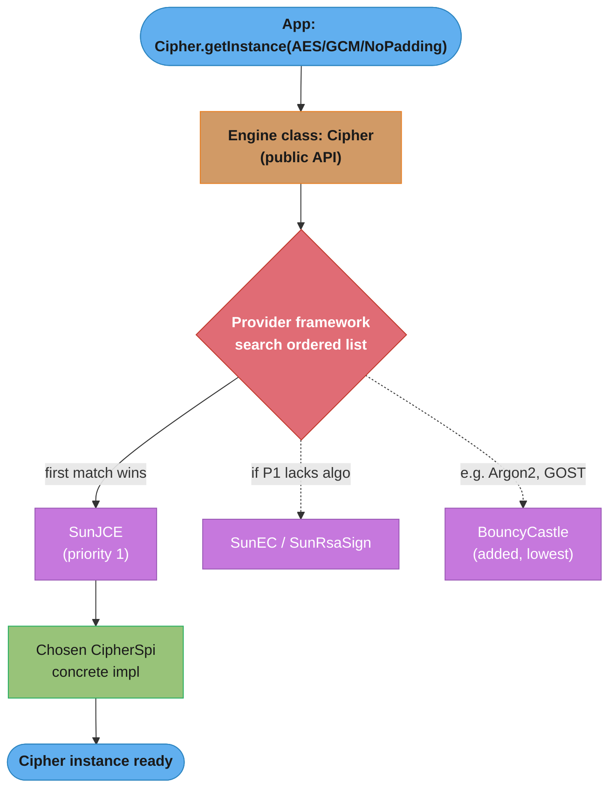
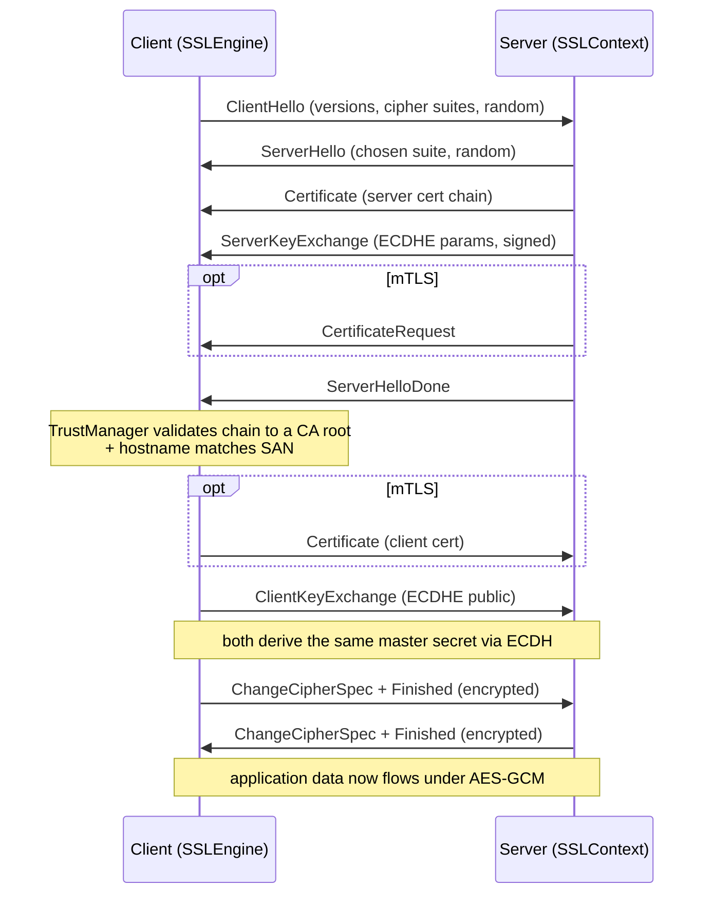
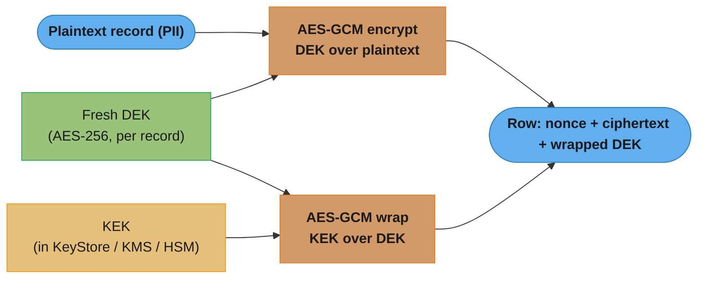
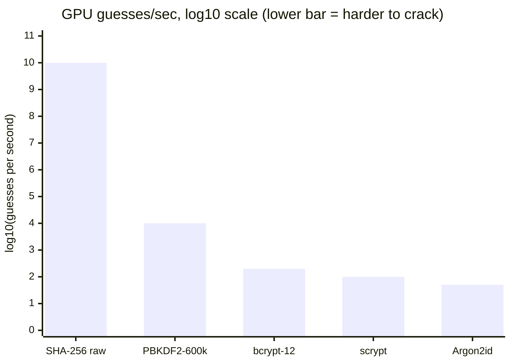
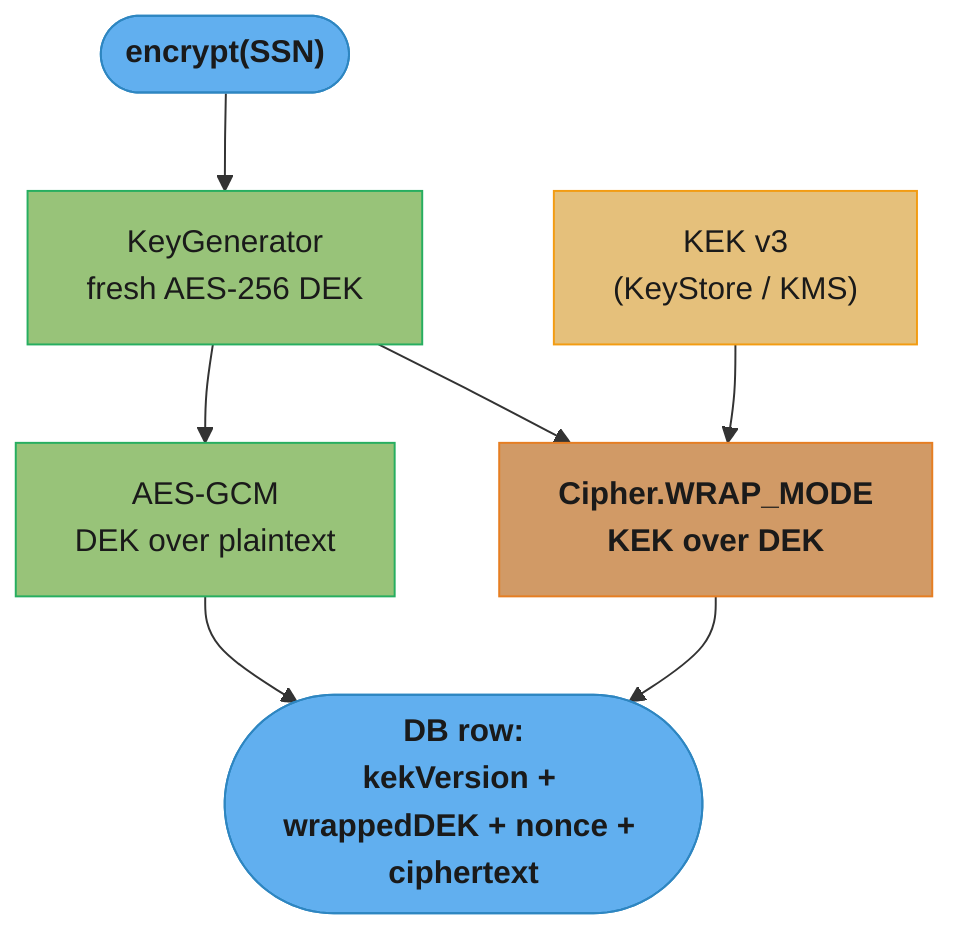

# Security & Cryptography

## 1. Concept Overview

Java ships one of the most complete cryptographic stacks of any managed platform: the **Java Cryptography Architecture (JCA)** and the **Java Cryptography Extension (JCE)**, together exposing every primitive a backend engineer needs — hashing, HMAC, symmetric and asymmetric ciphers, digital signatures, key agreement, key storage, secure random generation, and TLS. These live in `java.security.*` and `javax.crypto.*` and have been part of the JDK since Java 1.4 (JCE was merged in from an export-restricted add-on in Java 1.4/5).

The design goal is **algorithm independence via a provider architecture**. Your code asks for an abstract "engine" — `Cipher.getInstance("AES/GCM/NoPadding")`, `MessageDigest.getInstance("SHA-256")` — and the JCA framework locates a concrete implementation from an ordered list of registered `Provider` objects. The default provider (`SunJCE`, `SunEC`, `SunRsaSign`) covers almost everything; you drop in **BouncyCastle** when you need algorithms the JDK omits (Argon2, ChaCha20-Poly1305 on old JDKs, GOST, extended curve support).

The hard truth of this module: **cryptography fails silently**. A wrong mode (ECB), a reused nonce, a `new Random()` seed, or a password held in a `String` all compile, run, pass tests, and ship — then leak keys and plaintext in production. This module is about getting the *usage* right, because the algorithms themselves are already correct. It is pure Java: no Spring Security, no framework abstractions — just the JCA/JCE APIs a senior engineer is expected to wield directly.

See also: [Cryptography Fundamentals](../../cs_fundamentals/cryptography_fundamentals/README.md) for the math behind these primitives, and [Backend Security / OWASP](../../backend/backend_security_owasp/README.md) for where they fit in an application threat model.

---

## 2. Intuition

> **One-line analogy**: The JCA is a phone directory for cryptography — you dial an abstract algorithm name and the operator (the provider framework) connects you to whichever installed specialist actually implements it.

**Mental model**: Every crypto operation in Java is a two-part split — a public **engine class** (`Cipher`, `MessageDigest`, `Signature`) that your code talks to, and a hidden **SPI** (`CipherSpi`, `MessageDigestSpi`) that a `Provider` implements. `getInstance("...")` walks the provider list in priority order and returns the first match. This indirection is why you can swap `SunJCE` for `BouncyCastle` without touching call sites, and why the *string* you pass (`"AES/GCM/NoPadding"` vs `"AES"` which silently means `"AES/ECB/PKCS5Padding"`) is the single most security-critical decision in the whole API.

**Why it matters**: A payment processor that encrypted card numbers with `Cipher.getInstance("AES")` shipped ECB mode to production — identical card prefixes produced identical ciphertext blocks, leaking structure across millions of rows. A messaging app reused a 96-bit GCM nonce across messages and handed an attacker the XOR of two plaintexts plus the ability to forge the authentication tag. Both compiled and passed unit tests. Getting the *usage* right is the entire job.

**Key insight**: Cryptographic failures in Java cluster into four categories: (1) **wrong mode/padding** (ECB, PKCS#1 v1.5) — fix by naming the full transformation and preferring authenticated encryption; (2) **randomness reuse or weakness** (`new Random()`, reused IV/nonce) — fix with `SecureRandom` and per-message nonces; (3) **missing authentication** (encrypt without a MAC → padding oracle) — fix with AES-GCM or encrypt-then-MAC; (4) **secret lifecycle leaks** (password in a `String`, key never zeroed) — fix with `char[]`/`byte[]` you clear. Master those four and you avoid ~95% of real incidents.

---

## 3. Core Principles

- **Provider architecture**: `Security.getProviders()` returns an ordered array; `getInstance()` returns the first provider that supplies the requested algorithm. Insert a provider with `Security.addProvider(new BouncyCastleProvider())` (appends, lowest priority) or `Security.insertProviderAt(p, 1)` (highest).
- **Engine class + SPI**: Public API (`Cipher`) delegates to a `CipherSpi` implementation chosen at `getInstance` time. You never instantiate the SPI directly.
- **Transformation strings**: `"algorithm/mode/padding"`. Omitting mode/padding uses provider defaults — for `Cipher`, `"AES"` alone resolves to the dangerous `"AES/ECB/PKCS5Padding"`. **Always name all three.**
- **Kerckhoffs's principle**: Security rests on the secrecy of the *key*, never the algorithm. Every algorithm here is public and standardized.
- **Authenticated encryption (AEAD)**: Confidentiality alone is insufficient — ciphertext must be tamper-evident. AES-GCM and ChaCha20-Poly1305 provide encryption + integrity in one primitive.
- **Randomness is a key input**: Keys, IVs, nonces, and salts must come from a CSPRNG (`SecureRandom`), never a PRNG (`Random`, `Math.random()`). A predictable IV or nonce breaks the cipher just as thoroughly as a leaked key.
- **Secret lifetime**: Keys and passwords are `byte[]`/`char[]` so they can be overwritten. `String` is immutable and interned — it lingers in the heap (and in dumps) until GC, uncontrollably.
- **Constant-time comparison**: Compare MACs/tags with `MessageDigest.isEqual`, never `Arrays.equals` on the hot path, to avoid timing side channels.

---

## 4. Types / Architectures / Strategies

### 4.1 Engine Classes (the JCA/JCE surface)

| Engine class | Package | Purpose | Common algorithm |
|--------------|---------|---------|------------------|
| `MessageDigest` | `java.security` | One-way hash | SHA-256, SHA3-256 |
| `Mac` | `javax.crypto` | Keyed hash (integrity + auth) | HmacSHA256 |
| `Cipher` | `javax.crypto` | Symmetric + asymmetric encrypt/decrypt/wrap | AES/GCM, RSA/OAEP |
| `Signature` | `java.security` | Sign / verify (non-repudiation) | SHA256withECDSA |
| `KeyGenerator` | `javax.crypto` | Generate symmetric keys | AES |
| `KeyPairGenerator` | `java.security` | Generate asymmetric key pairs | RSA, EC |
| `KeyAgreement` | `javax.crypto` | Derive shared secret | ECDH |
| `SecretKeyFactory` | `javax.crypto` | Derive keys from passwords | PBKDF2WithHmacSHA256 |
| `KeyStore` | `java.security` | Persist keys/certs | PKCS12 |
| `SecureRandom` | `java.security` | CSPRNG | DRBG |
| `SSLContext` | `javax.net.ssl` | TLS engine factory | TLSv1.3 |

### 4.2 Symmetric Cipher Modes

| Mode | Transformation | Authenticated? | IV/Nonce | Verdict |
|------|----------------|----------------|----------|---------|
| **GCM** | `AES/GCM/NoPadding` | Yes (built-in tag) | 96-bit nonce, unique per key | **Default choice** |
| **CBC** | `AES/CBC/PKCS5Padding` | No — needs separate HMAC | 128-bit random IV | Only with encrypt-then-MAC |
| **CTR** | `AES/CTR/NoPadding` | No | 128-bit counter block | Needs MAC; niche |
| **ECB** | `AES/ECB/PKCS5Padding` | No | none (that's the problem) | **Never** — leaks patterns |

### 4.3 Asymmetric Primitives

| Primitive | Java transformation | Use |
|-----------|---------------------|-----|
| **RSA-OAEP** | `RSA/ECB/OAEPWithSHA-256AndMGF1Padding` | Encrypt small payloads (wrap a key) |
| **RSA-PSS** | `RSASSA-PSS` (via `Signature`) | Modern RSA signatures |
| **ECDSA** | `SHA256withECDSA` (via `Signature`) | Compact signatures |
| **ECDH** | `ECDH` (via `KeyAgreement`) | Derive a shared symmetric key |

### 4.4 Password Hashing Strategies

| Strategy | In JDK? | Work factor | Memory-hard? |
|----------|---------|-------------|--------------|
| **PBKDF2** | Yes (`PBKDF2WithHmacSHA256`) | iterations (600k+) | No |
| **bcrypt** | No (BouncyCastle / jBCrypt) | cost 10–12 | Slightly |
| **scrypt** | No (BouncyCastle) | N, r, p | Yes |
| **Argon2id** | No (BouncyCastle) | time, memory, parallelism | Yes (winner) |
| Plain SHA-256 | Yes | none | **Never for passwords** |

### 4.5 KeyStore Types

| Type | Standard | Stores | Notes |
|------|----------|--------|-------|
| **PKCS12** (`.p12`) | Yes (RFC 7292) | keys + certs | **Default since Java 9**; interoperable |
| **JKS** (`.jks`) | Proprietary (Sun) | keys + certs | Legacy; weak integrity; avoid for new work |
| **JCEKS** | Proprietary | keys + certs | Stronger than JKS; still Java-only |
| **PKCS11** | Yes | HSM-backed | Keys never leave the hardware |

---

## 5. Architecture Diagrams

### JCA Provider Resolution



`getInstance` walks providers in priority order and binds the first one that supplies the algorithm. This is why the transformation string is load-bearing and why inserting BouncyCastle at position 1 changes *which* implementation you get.

### TLS 1.2 Handshake (server auth + optional mTLS)



The `TrustManager` decides whether to trust the server's certificate chain; hostname verification (SAN match) is a *separate* step that `SSLSocket` skips by default — the classic MITM hole covered in Section 10.

### Envelope Encryption (KEK / DEK)



The row stores the *wrapped* DEK next to the ciphertext; only the KEK (kept in a KeyStore or KMS) can unwrap it. Rotating the KEK re-wraps DEKs cheaply without re-encrypting terabytes of data.

### Why ECB Leaks — Identical Blocks Map to Identical Ciphertext

```
Plaintext, 16-byte AES blocks (a record with a repeated header):

  B0: 41 43 43 54 3A 30 30 30 30 ...   <- "ACCT:0000..."
  B1:  31 32 33 34 35 36 37 38 39 ...
  B2: 41 43 43 54 3A 30 30 30 30 ...   <- identical bytes to B0

ECB  (each block encrypted independently, no IV):
  C0 = E(B0) = 9F A1 ...              C2 = E(B2) = 9F A1 ...   <-- C0 == C2  LEAK
  An attacker sees the repeat WITHOUT the key: structure, dupes, patterns.

CBC/GCM (each block chained to prior state / a per-message nonce):
  C0 = E(B0 XOR IV)      C2 = E(B2 XOR C1)       C0 != C2      no leak
```

Identical plaintext blocks under a fixed key produce identical ECB ciphertext blocks — this is the "ECB penguin" defect, and it is why `"AES/ECB/..."` is disqualified for any real data.

### Attacker Guess Rate by Password-Hash Algorithm (lower is stronger)



Raw SHA-256 lets a commodity GPU try ~10^10 candidates/second; PBKDF2 at 600k iterations drops that to ~10^4, and memory-hard Argon2id to ~10^1.7. The whole point of a password hash is to be *deliberately slow* — the opposite of a fast digest.

---

## 6. How It Works — Detailed Mechanics

### Enumerating providers and algorithms

```java
import java.security.*;

for (Provider p : Security.getProviders()) {
    System.out.println(p.getName() + " v" + p.getVersionStr());
}
// Is a specific algorithm available?
boolean hasGcm = Security.getProviders("Cipher.AES/GCM/NoPadding").length > 0; // [Java 8+]

// Add BouncyCastle for Argon2, ChaCha20-Poly1305 on old JDKs, etc.
// Security.addProvider(new org.bouncycastle.jce.provider.BouncyCastleProvider());
```

### MessageDigest — SHA-256 and SHA3-256

```java
MessageDigest sha256 = MessageDigest.getInstance("SHA-256");
byte[] digest = sha256.digest("hello".getBytes(StandardCharsets.UTF_8)); // 32 bytes

MessageDigest sha3 = MessageDigest.getInstance("SHA3-256"); // [Java 9+]
// MessageDigest is NOT thread-safe and is stateful — get a fresh instance per thread,
// or reset() between uses. digest() implicitly resets.
```

### Mac — HMAC-SHA-256 (integrity + authenticity)

```java
Mac mac = Mac.getInstance("HmacSHA256");
mac.init(new SecretKeySpec(macKeyBytes, "HmacSHA256")); // key >= 32 bytes ideally
mac.update(message);
byte[] tag = mac.doFinal();                              // 32-byte tag

// Verify in CONSTANT TIME — Arrays.equals leaks via early exit
boolean valid = MessageDigest.isEqual(tag, receivedTag);
```

HMAC is not `SHA256(key || message)` — that construction is vulnerable to length-extension attacks. HMAC nests two hashes with padded keys (`H((k⊕opad) || H((k⊕ipad) || m))`) which defeats extension.

### AES-GCM — authenticated encryption (the default)

```java
public static byte[] encryptGcm(SecretKey key, byte[] plaintext, byte[] aad) throws Exception {
    byte[] nonce = new byte[12];                 // 96-bit nonce is the GCM standard
    SecureRandom.getInstanceStrong().nextBytes(nonce); // NEVER reuse a nonce under one key
    Cipher c = Cipher.getInstance("AES/GCM/NoPadding");
    c.init(Cipher.ENCRYPT_MODE, key, new GCMParameterSpec(128, nonce)); // 128-bit tag
    if (aad != null) c.updateAAD(aad);           // authenticated-but-not-encrypted context
    byte[] ct = c.doFinal(plaintext);            // GCM appends the 16-byte tag to ct
    return ByteBuffer.allocate(12 + ct.length).put(nonce).put(ct).array(); // nonce || ct||tag
}

public static byte[] decryptGcm(SecretKey key, byte[] blob, byte[] aad) throws Exception {
    ByteBuffer bb = ByteBuffer.wrap(blob);
    byte[] nonce = new byte[12]; bb.get(nonce);
    byte[] ct = new byte[bb.remaining()]; bb.get(ct);
    Cipher c = Cipher.getInstance("AES/GCM/NoPadding");
    c.init(Cipher.DECRYPT_MODE, key, new GCMParameterSpec(128, nonce));
    if (aad != null) c.updateAAD(aad);
    return c.doFinal(ct); // throws AEADBadTagException if tampered OR wrong AAD
}
```

The GCM output layout is a byte map — store all three parts together:

```
[ 12-byte nonce ][ ciphertext (== plaintext length) ][ 16-byte auth tag ]
  \_ public, unique per key _/                          \_ verified on decrypt _/
```

### AES-CBC done correctly — Encrypt-then-MAC

If you must use CBC (legacy interop), never ship it unauthenticated — that is a padding-oracle waiting to happen.

```java
// Encrypt-then-MAC: encrypt with one key, then MAC the IV+ciphertext with a SEPARATE key
byte[] iv = new byte[16];
SecureRandom.getInstanceStrong().nextBytes(iv);          // random IV per message
Cipher c = Cipher.getInstance("AES/CBC/PKCS5Padding");
c.init(Cipher.ENCRYPT_MODE, encKey, new IvParameterSpec(iv));
byte[] ct = c.doFinal(plaintext);

Mac mac = Mac.getInstance("HmacSHA256");
mac.init(macKey);                                        // distinct from encKey
mac.update(iv); mac.update(ct);
byte[] tag = mac.doFinal();
// On receipt: verify tag FIRST (constant-time); only decrypt if the MAC passes.
```

Verifying the MAC before decrypting means an attacker's tampered ciphertext is rejected without the CBC unpadding step ever running — that is precisely what neutralizes the padding oracle.

### RSA-OAEP — wrap a key, never bulk data

```java
KeyPairGenerator kpg = KeyPairGenerator.getInstance("RSA");
kpg.initialize(3072);                                    // 2048 min today; 3072 for long-lived
KeyPair kp = kpg.generateKeyPair();

Cipher enc = Cipher.getInstance("RSA/ECB/OAEPWithSHA-256AndMGF1Padding"); // OAEP, not PKCS1v1.5
enc.init(Cipher.ENCRYPT_MODE, kp.getPublic());
byte[] wrapped = enc.doFinal(aesKey.getEncoded());       // payload must be < ~keysize/8 - overhead
```

RSA can only encrypt a payload smaller than the modulus, so it is used to wrap a symmetric key, not to encrypt records. `"ECB"` here is a historical misnomer — RSA has no block chaining; OAEP padding is what matters.

### ECDH — derive a shared symmetric key

```java
KeyPairGenerator kpg = KeyPairGenerator.getInstance("EC");
kpg.initialize(new ECGenParameterSpec("secp256r1"));     // P-256; ~128-bit security
KeyPair mine = kpg.generateKeyPair();

KeyAgreement ka = KeyAgreement.getInstance("ECDH");
ka.init(mine.getPrivate());
ka.doPhase(theirPublicKey, true);
byte[] shared = ka.generateSecret();                     // raw shared secret — do NOT use directly
// Run it through a KDF (HKDF) before use as an AES key:
byte[] aesKeyBytes = MessageDigest.getInstance("SHA-256").digest(shared); // simplistic KDF
```

The raw ECDH output is not uniformly random across all bits, so it must pass through a KDF (HKDF ideally) before becoming an AES key.

### KeyGenerator, SecureRandom, and PBKDF2

```java
// Symmetric key
KeyGenerator kg = KeyGenerator.getInstance("AES");
kg.init(256, SecureRandom.getInstanceStrong());          // AES-256
SecretKey key = kg.generateKey();

// SecureRandom: DRBG is the modern default (NIST SP 800-90A)
SecureRandom drbg = SecureRandom.getInstance("DRBG");    // [Java 9+]
SecureRandom strong = SecureRandom.getInstanceStrong();  // may block on entropy-starved boxes

// Password -> key (PBKDF2, in the JDK)
char[] password = "s3cr3t".toCharArray();
byte[] salt = new byte[16];
drbg.nextBytes(salt);                                    // unique random salt per password
PBEKeySpec spec = new PBEKeySpec(password, salt, 600_000, 256); // OWASP 2023: 600k iterations
SecretKeyFactory f = SecretKeyFactory.getInstance("PBKDF2WithHmacSHA256");
byte[] hash = f.generateSecret(spec).getEncoded();
spec.clearPassword();                                    // zero the password material
Arrays.fill(password, '\0');
```

### Signature — sign / verify (non-repudiation)

```java
Signature signer = Signature.getInstance("SHA256withECDSA");
signer.initSign(mine.getPrivate());
signer.update(message);
byte[] sig = signer.sign();

Signature verifier = Signature.getInstance("SHA256withECDSA");
verifier.initVerify(theirPublicKey);
verifier.update(message);
boolean ok = verifier.verify(sig);   // proves the PRIVATE-key holder signed it
```

A signature differs from a MAC: anyone with the public key can verify, but only the private-key holder could have produced it — that asymmetry is what gives non-repudiation, which an HMAC (shared key) cannot.

### KeyStore — persist keys and certs

```java
KeyStore ks = KeyStore.getInstance("PKCS12");            // default & interoperable since Java 9
try (InputStream in = Files.newInputStream(Path.of("keystore.p12"))) {
    ks.load(in, storePassword);                          // char[] password
}
Key kek = ks.getKey("kek-2026", keyPassword);
// Store a new secret key:
ks.setEntry("dek-alias",
        new KeyStore.SecretKeyEntry(secretKey),
        new KeyStore.PasswordProtection(keyPassword));
try (OutputStream out = Files.newOutputStream(Path.of("keystore.p12"))) {
    ks.store(out, storePassword);
}
```

### SSLContext / TLS with real validation

```java
// TrustManager from the JDK's default CA truststore
TrustManagerFactory tmf = TrustManagerFactory.getInstance(
        TrustManagerFactory.getDefaultAlgorithm());
tmf.init((KeyStore) null);                               // null -> system cacerts

SSLContext ctx = SSLContext.getInstance("TLS");          // negotiates up to TLS 1.3 on Java 17
ctx.init(null, tmf.getTrustManagers(), SecureRandom.getInstanceStrong());

SSLSocketFactory sf = ctx.getSocketFactory();
try (SSLSocket s = (SSLSocket) sf.createSocket("api.example.com", 443)) {
    SSLParameters p = s.getSSLParameters();
    p.setEndpointIdentificationAlgorithm("HTTPS");       // CRITICAL: enables hostname verification
    s.setSSLParameters(p);
    s.startHandshake();                                  // now validates chain AND hostname
}
```

`HttpClient` (Java 11) and `HttpsURLConnection` do hostname verification for you; a raw `SSLSocket` does not until you set `setEndpointIdentificationAlgorithm("HTTPS")`. See [Networking & HTTP Client](../networking_and_http_client/README.md) for the transport layer that sits on top of this.

---

## 7. Real-World Examples

- **Adobe (2013), ~153M accounts**: Passwords were encrypted with 3DES in **ECB mode** rather than hashed. Because ECB maps identical plaintext to identical ciphertext, accounts with the same password shared the same ciphertext, and unencrypted password *hints* stored alongside let researchers recover the plaintexts en masse. The exact failure this module warns about: encrypting where you should hash, in a pattern-leaking mode.
- **Zoom (2020) "AES-128-ECB"**: Zoom's meeting encryption was found to use AES-128 in **ECB mode**, drawing the same criticism — repeated media blocks leaked structure. They migrated to AES-GCM.
- **Java itself — the PSYCHIC SIGNATURES CVE-2022-21449**: A bug in the JDK's ECDSA implementation accepted a signature with `r = s = 0` as valid, letting an attacker forge signatures for TLS, JWT (ES256), and SAML. It underlines that even the platform's `Signature.verify` must be patched — pin a maintained JDK.
- **Debian OpenSSL entropy bug (2008)**: A Debian patch reduced the seed entropy of the CSPRNG so drastically that the entire keyspace of generated SSH/TLS keys could be enumerated. The Java analogue is `new Random()` or a fixed seed — predictable randomness is a total break.
- **PBKDF2 in the wild**: Password managers (1Password historically used PBKDF2-HMAC-SHA256 with 100k+ iterations before moving to higher counts) and countless enterprise apps rely on the JDK's `PBKDF2WithHmacSHA256` precisely because it needs no external dependency.

---

## 8. Tradeoffs

### AES-GCM vs AES-CBC+HMAC

| Aspect | AES-GCM | AES-CBC + HMAC (encrypt-then-MAC) |
|--------|---------|-----------------------------------|
| Integrity | Built-in 128-bit tag | Separate HMAC (extra key + code) |
| Nonce/IV discipline | **Fatal if 96-bit nonce repeats** | Random IV; repeat weakens but not catastrophic |
| Speed | Fast (AES-NI + PCLMULQDQ) | Slower (two passes) |
| Padding oracle risk | None (no padding) | Only if you decrypt before verifying MAC |
| Failure mode | Silent catastrophe on nonce reuse | Silent plaintext leak if MAC omitted |
| Verdict | **Default** — one primitive, hard to misuse *except* nonce reuse | Legacy interop only |

### RSA vs Elliptic Curve

| Aspect | RSA-3072 | EC P-256 (ECDSA/ECDH) |
|--------|----------|------------------------|
| Security level | ~128-bit | ~128-bit |
| Key size | 3072-bit (~384 B) | 256-bit (~32 B) |
| Signature size | ~384 B | ~64–72 B |
| Keygen speed | Slow | Fast |
| Sign speed | Slow | Fast |
| Verify speed | **Fast** | Slower than RSA verify |
| Use when | Interop with RSA-only peers | New systems, mobile, TLS default |

### Password Hashing Algorithms

| Algorithm | Memory-hard | GPU/ASIC resistance | JDK built-in | Recommendation |
|-----------|-------------|---------------------|--------------|----------------|
| Argon2id | Yes | Best | No (BouncyCastle) | First choice (new systems) |
| scrypt | Yes | Strong | No (BouncyCastle) | Good alternative |
| bcrypt (cost 12) | Weakly | Good | No (jBCrypt/BC) | Fine; 72-byte input cap |
| PBKDF2 (600k) | No | Weak vs GPU | **Yes** | Use when no external dep allowed |
| SHA-256 | No | None | Yes | **Never for passwords** |

### KeyStore: JKS vs PKCS12

| Aspect | JKS | PKCS12 |
|--------|-----|--------|
| Standard | Proprietary (Sun) | RFC 7292 (interoperable) |
| Default since | pre-Java 9 | **Java 9+** |
| Stores secret keys | No (only private keys + certs) | Yes |
| Integrity protection | Weak (custom) | Standard MAC |
| Verdict | Legacy — migrate | **Use this** |

---

## 9. When to Use / When NOT to Use

**Use AES-GCM when:**
- You need to encrypt data at rest or a payload in transit and control both ends.
- You want confidentiality + integrity in one primitive with AES-NI hardware speed.
- You can guarantee a unique 96-bit nonce per message under a given key.

**Use RSA-OAEP / ECDH when:**
- You must exchange a symmetric key with a party you can't share a secret with (key wrapping / agreement).
- You need signatures for non-repudiation (`Signature` with ECDSA/RSA-PSS).

**Use PBKDF2 / bcrypt / scrypt / Argon2 when:**
- You are storing user passwords — a *deliberately slow, salted* hash, never a fast digest.

**Do NOT roll your own or misuse crypto when:**
- You're tempted by `Cipher.getInstance("AES")` — that silently selects ECB; always name mode + padding.
- You reach for `MessageDigest` (SHA-256) to "hash" a password — no salt, no work factor, instantly cracked.
- You need a random key/IV/nonce and grab `new Random()` or a fixed seed — use `SecureRandom`.
- A managed KMS/HSM is available — prefer it over holding raw KEKs in application memory.
- You're building an application-level auth flow — use a vetted library ([Auth & Authorization Systems](../../backend/auth_and_authorization_systems/README.md)); JCA gives primitives, not protocols.

---

## 10. Common Pitfalls

### War Story 1: `Cipher.getInstance("AES")` ships ECB to production

```java
// BROKEN — "AES" resolves to "AES/ECB/PKCS5Padding": no IV, pattern-leaking
Cipher c = Cipher.getInstance("AES");
c.init(Cipher.ENCRYPT_MODE, key);
byte[] ct = c.doFinal(cardNumber);   // identical prefixes -> identical ciphertext blocks
```
```java
// FIX — name mode + padding explicitly; use authenticated GCM with a fresh nonce
byte[] nonce = new byte[12]; SecureRandom.getInstanceStrong().nextBytes(nonce);
Cipher c = Cipher.getInstance("AES/GCM/NoPadding");
c.init(Cipher.ENCRYPT_MODE, key, new GCMParameterSpec(128, nonce));
byte[] ct = c.doFinal(cardNumber);   // store nonce alongside ct
```

### War Story 2: Reused GCM nonce = catastrophic

```java
// BROKEN — a fixed/counter-from-zero nonce reused under the same key
private static final byte[] NONCE = new byte[12]; // all zeros, reused every call
Cipher c = Cipher.getInstance("AES/GCM/NoPadding");
c.init(Cipher.ENCRYPT_MODE, key, new GCMParameterSpec(128, NONCE)); // DISASTER
```
Reusing a GCM nonce under one key leaks the XOR of the two plaintexts *and* the GCM authentication subkey `H`, letting an attacker forge tags for arbitrary ciphertext. This is a total break, not a weakening.
```java
// FIX — generate a fresh random 96-bit nonce per encryption (or a guaranteed-unique counter)
byte[] nonce = new byte[12];
SecureRandom.getInstanceStrong().nextBytes(nonce);
c.init(Cipher.ENCRYPT_MODE, key, new GCMParameterSpec(128, nonce));
```

### War Story 3: `new Random()` for a key or IV

```java
// BROKEN — java.util.Random is a 48-bit LCG; its output is fully predictable
byte[] key = new byte[32];
new Random().nextBytes(key);        // an attacker can reconstruct this key
```
```java
// FIX — use a CSPRNG
byte[] key = new byte[32];
SecureRandom.getInstanceStrong().nextBytes(key);
```
`java.util.Random` (and `Math.random()`) is a linear congruential generator seeded from the clock — observing a few outputs reveals its internal state and all future values. Never use it for anything security-relevant.

### War Story 4: Password held in a `String`

```java
// BROKEN — String is immutable, interned, and lingers in the heap until GC
String password = request.getParameter("password"); // shows up in heap dumps for minutes
authenticate(password);
```
```java
// FIX — use char[] you can zero immediately after use
char[] password = request.getPasswordChars();
try {
    authenticate(password);
} finally {
    Arrays.fill(password, '\0');   // overwrite the secret now, don't wait for GC
}
```
You cannot clear a `String` — it's immutable and may be interned, so the secret sits in memory (and any heap dump) uncontrollably. `char[]`/`byte[]` can be overwritten the instant you're done, which is why every JCA password API (`PBEKeySpec`, `KeyStore.load`) takes `char[]`.

### War Story 5: TLS that trusts everything (the "just make it work" trust manager)

```java
// BROKEN — a TrustManager that accepts any certificate turns TLS into plaintext-with-extra-steps
TrustManager[] trustAll = { new X509TrustManager() {
    public void checkServerTrusted(X509Certificate[] c, String a) {} // no-op = MITM open
    public void checkClientTrusted(X509Certificate[] c, String a) {}
    public X509Certificate[] getAcceptedIssuers() { return new X509Certificate[0]; }
}};
```
```java
// FIX — use the default TrustManager (system CA store) and enable hostname verification
TrustManagerFactory tmf = TrustManagerFactory.getInstance(
        TrustManagerFactory.getDefaultAlgorithm());
tmf.init((KeyStore) null);
SSLContext ctx = SSLContext.getInstance("TLS");
ctx.init(null, tmf.getTrustManagers(), SecureRandom.getInstanceStrong());
// + setEndpointIdentificationAlgorithm("HTTPS") on raw SSLSocket
```

### War Story 6: Verifying a MAC with `Arrays.equals` (timing leak)

```java
if (Arrays.equals(computedTag, providedTag)) { ... }  // BROKEN: returns early on first mismatch
```
```java
if (MessageDigest.isEqual(computedTag, providedTag)) { ... }  // FIX: constant-time compare
```
`Arrays.equals` short-circuits on the first differing byte, so response time reveals how many leading bytes matched — enough to forge a tag byte-by-byte over many requests. `MessageDigest.isEqual` is implemented to run in time independent of where the mismatch is.

---

## 11. Technologies & Tools

| Tool / API | Purpose |
|------------|---------|
| `SunJCE`, `SunEC`, `SunRsaSign` | Default JDK providers (AES, RSA, EC, PBKDF2) |
| **BouncyCastle** (`bcprov`) | Argon2, scrypt, ChaCha20-Poly1305 on old JDKs, extended curves, GOST |
| `keytool` | CLI to create/inspect KeyStores, generate keypairs, import certs |
| `jarsigner` | Sign and verify JARs |
| `SecureRandom` (DRBG) | NIST SP 800-90A CSPRNG; `getInstanceStrong()` for keys |
| `-Djavax.net.debug=ssl,handshake` | Trace the TLS handshake for debugging cert/trust issues |
| Java KMS SDKs (AWS KMS, GCP KMS) | Externalize the KEK to a managed HSM; envelope encryption |
| Tink (Google) | Misuse-resistant high-level wrapper over JCA (AEAD, key rotation) |
| `jshell` | Quickly prototype `Cipher`/`MessageDigest` snippets |
| OWASP Dependency-Check | Flag vulnerable crypto libs / weak-cipher usage |

---

## 12. Interview Questions with Answers

**Q1: Why is `Cipher.getInstance("AES")` dangerous, and what does it actually give you?**
It silently resolves to `AES/ECB/PKCS5Padding` — ECB mode with no IV. ECB encrypts each 16-byte block independently, so identical plaintext blocks produce identical ciphertext blocks, leaking structure and repeats to anyone watching (the "ECB penguin"). Adobe's 2013 breach and Zoom's 2020 media encryption both fell to exactly this. Always name the full transformation and prefer authenticated `AES/GCM/NoPadding`.

**Q2: What happens if you reuse a nonce with AES-GCM, and why is it worse than reusing a CBC IV?**
Reusing a 96-bit GCM nonce under the same key is catastrophic — it leaks the XOR of the two plaintexts *and* the GCM authentication subkey H, which lets an attacker forge valid tags for arbitrary ciphertext. A repeated CBC IV only weakens confidentiality for identical prefixes; a repeated GCM nonce breaks both confidentiality and authenticity completely. Generate a fresh random nonce (or a guaranteed-unique counter) per message, and rotate the key well before 2^32 messages.

**Q3: Why must you never use `new Random()` (or `Math.random()`) to generate a key or IV?**
`java.util.Random` is a 48-bit linear congruential generator seeded from the clock, so its entire output stream is predictable from a handful of samples. An attacker who sees a few values can reconstruct the state and derive every key/IV you produce. Always use `SecureRandom` (DRBG); use `SecureRandom.getInstanceStrong()` for long-lived key material.

**Q4: Why store a password in `char[]` instead of `String`?**
Because a `String` is immutable and possibly interned, so you cannot erase it — the secret lingers in the heap (and in any heap dump) until GC eventually collects it, uncontrollably. A `char[]` can be overwritten with `Arrays.fill(pw, '\0')` the instant you're done. This is why every JCA password API — `PBEKeySpec`, `KeyStore.load`, `PasswordProtection` — takes `char[]`, not `String`.

**Q5: When would you choose AES-GCM over AES-CBC, and when is CBC still acceptable?**
Choose AES-GCM by default — it provides confidentiality and integrity in one primitive at AES-NI speed with no padding (so no padding-oracle surface). CBC is acceptable only for legacy interop and only as encrypt-then-MAC: a random IV, a separate HMAC key, MAC the IV+ciphertext, and verify the MAC before decrypting. Unauthenticated CBC is the classic padding-oracle setup and should never ship.

**Q6: Why can't you use plain SHA-256 to hash passwords, and what should you use?**
SHA-256 is a fast, unsalted, single-pass digest — a GPU can try ~10 billion candidates per second, so any human password falls quickly. Password hashing needs to be *deliberately slow, salted, and ideally memory-hard*: use Argon2id (best, via BouncyCastle), scrypt, or bcrypt; use PBKDF2-HMAC-SHA256 at 600k+ iterations when you can't add a dependency. The salt defeats rainbow tables; the work factor defeats brute force.

**Q7: What is a padding-oracle attack and how do you prevent it in Java?**
It's an attack on unauthenticated CBC where the server reveals whether decryption produced valid PKCS#7 padding, letting an attacker decrypt ciphertext byte-by-byte without the key. The oracle leaks through an error message, status code, or response timing. Prevent it by using authenticated encryption (AES-GCM has no padding at all) or encrypt-then-MAC where you verify the HMAC in constant time *before* attempting to decrypt, so malformed ciphertext is rejected before the unpadding step runs.

**Q8: RSA vs elliptic curve — which do you pick and why?**
Pick EC (ECDSA/ECDH on P-256) for new systems: a 256-bit EC key gives ~128-bit security equivalent to a 3072-bit RSA key, with far smaller keys/signatures and faster keygen and signing. RSA's one edge is faster *verification*, and it's unavoidable when interoperating with RSA-only peers. For key exchange prefer ephemeral ECDH (forward secrecy); for encryption-of-a-key use RSA-OAEP only when the recipient mandates RSA.

**Q9: How does the JCA provider architecture resolve `getInstance("AES/GCM/NoPadding")`?**
The engine class (`Cipher`) asks the provider framework, which walks `Security.getProviders()` in priority order and returns the first provider whose SPI supplies that algorithm. This indirection makes algorithms swappable — adding BouncyCastle at position 1 changes which implementation you get without touching call sites. It's also why the transformation string is security-critical: the string, not a type, selects the exact behavior.

**Q10: What's the difference between a MAC (HMAC) and a digital signature?**
A MAC uses a single shared secret key — both parties can compute and verify it, giving integrity and authenticity but *not* non-repudiation (either party could have made it). A signature is asymmetric — only the private-key holder can produce it, and anyone with the public key can verify — giving non-repudiation. Use HMAC when both sides share a key (fast, symmetric); use `Signature` (ECDSA/RSA-PSS) when a third party must verify authorship or the signer must be held accountable.

**Q11: Why is HMAC-SHA256 preferred over `SHA256(key || message)`?**
Because the naive `SHA256(key || message)` is vulnerable to length-extension attacks that let an attacker forge a digest for an extended message. Knowing only the digest and message length, they can append data and compute a valid digest without the key. HMAC's nested construction, `H((k⊕opad) || H((k⊕ipad) || m))`, closes that hole. Always use the `Mac` engine class with `HmacSHA256`, never a hand-rolled hash of key and message.

**Q12: What is envelope encryption (KEK/DEK) and why use it?**
Envelope encryption encrypts each data record with a fresh Data Encryption Key (DEK), then wraps (encrypts) that DEK with a long-lived Key Encryption Key (KEK) held in a KeyStore, KMS, or HSM. You store the wrapped DEK next to the ciphertext. It limits the blast radius of any single DEK, keeps the KEK off the data path, and — crucially — lets you rotate the KEK by re-wrapping DEKs cheaply instead of re-encrypting terabytes of data.

**Q13: Does `SecureRandom.getInstanceStrong()` block, and how does it differ from `new SecureRandom()`?**
It can block — on Linux it may map to a blocking entropy source, so on entropy-starved boxes like fresh VMs or containers key generation can stall at startup. The strong source is selected by the `securerandom.strongAlgorithms` security property. `new SecureRandom()` uses the configured default (NativePRNG/DRBG), which is non-blocking and cryptographically strong for most uses. Use `getInstanceStrong()` for long-lived keys where you want the strongest source; use the default for per-request nonces/IVs.

**Q14: How does TLS certificate validation work in Java, and what's the difference between the TrustManager and hostname verification?**
The `TrustManager` builds and validates the server's certificate chain up to a trusted CA root in the truststore (checking signatures, validity dates, and revocation if configured). Hostname verification is a *separate* step that checks the certificate's SAN matches the host you dialed — and a raw `SSLSocket` skips it unless you set `SSLParameters.setEndpointIdentificationAlgorithm("HTTPS")`. `HttpClient` and `HttpsURLConnection` do both automatically; forget the hostname step on a raw socket and you've left a MITM hole even with a valid chain.

**Q15: What is mTLS and how do you configure it in Java?**
Mutual TLS has both sides present certificates: the server authenticates to the client as usual, and the client also presents a certificate the server validates against its truststore. In Java you configure the client's `SSLContext` with a `KeyManager` (from a KeyStore holding the client's private key + cert) in addition to a `TrustManager`, and configure the server to require client auth (`SSLParameters.setNeedClientAuth(true)`). It's the standard for service-to-service auth where both endpoints must prove identity.

**Q16: Why is RSA-OAEP preferred over RSA PKCS#1 v1.5 padding?**
PKCS#1 v1.5 encryption padding is vulnerable to Bleichenbacher's adaptive chosen-ciphertext attack — a padding oracle over many queries can recover the plaintext without the private key. OAEP (Optimal Asymmetric Encryption Padding) uses a randomized, hash-based construction that is provably secure against that attack. In Java, request `RSA/ECB/OAEPWithSHA-256AndMGF1Padding` rather than `RSA/ECB/PKCS1Padding` for any new encryption.

**Q17: Why prefer PKCS12 over JKS for keystores?**
PKCS12 is a standardized, interoperable format (RFC 7292) that can store secret keys and is the JDK default since Java 9, unlike the proprietary Java-only JKS. JKS has weaker integrity protection and cannot store `SecretKey` entries at all. PKCS12 files interoperate with OpenSSL and other tooling, whereas JKS is Java-only. Migrate legacy JKS stores with `keytool -importkeystore -srcstoretype JKS -deststoretype PKCS12`.

**Q18: What does the GCM authentication tag protect, and what's `updateAAD` for?**
The tag (128-bit here) authenticates the ciphertext — decryption throws `AEADBadTagException` if a single bit was flipped, so you get tamper detection for free. `updateAAD` adds Additional Authenticated Data — bytes that are authenticated but *not* encrypted (e.g., a record ID, header, or key version) — so the same ciphertext can't be replayed in a different context. If the AAD on decrypt doesn't match the AAD on encrypt, the tag check fails just as if the ciphertext were tampered.

**Q19: You need to encrypt 10 MB of data with a recipient's RSA public key. What's wrong with that, and what's the right approach?**
RSA can only encrypt a payload smaller than its modulus (a 3072-bit key handles ~318 bytes with OAEP), so you can't encrypt 10 MB directly. The right approach is hybrid/envelope encryption: generate a random AES-256 DEK, encrypt the 10 MB with AES-GCM, then RSA-OAEP-wrap only the small DEK with the recipient's public key and ship both. This is exactly how TLS and PGP work — asymmetric crypto moves the symmetric key, symmetric crypto moves the bulk data.

**Q20: How do you rotate a KEK without re-encrypting all your data?**
With envelope encryption you only re-wrap the DEKs, never the ciphertext: unwrap each stored DEK with the old KEK and re-wrap it with the new KEK, updating the wrapped-DEK column and a key-version tag. The bulk ciphertext is untouched because it was encrypted under the per-record DEK, which didn't change. Keep the old KEK available (marked decrypt-only) until every row is re-wrapped, then retire it — this makes rotation an O(number of keys) operation instead of O(bytes of data).

---

## 13. Best Practices

1. **Always name the full transformation** — `AES/GCM/NoPadding`, never bare `AES` (which is ECB). The string is the security decision.
2. **Default to AES-256-GCM** for symmetric encryption; use a fresh 96-bit `SecureRandom` nonce per message and store `nonce || ciphertext || tag` together.
3. **Never reuse a GCM nonce** under one key; rotate keys well before 2^32 messages, or use a counter you can prove is unique.
4. **Use `SecureRandom`, never `Random`/`Math.random()`** for keys, IVs, nonces, and salts; `getInstanceStrong()` for long-lived keys.
5. **Hash passwords with Argon2id/scrypt/bcrypt** (or PBKDF2-600k if no dependency allowed) — salted, slow, memory-hard; never a bare digest.
6. **Hold secrets in `char[]`/`byte[]` and zero them** in a `finally` block; keep them out of `String`, logs, and exception messages.
7. **Compare MACs/tags with `MessageDigest.isEqual`**, never `Arrays.equals`, to avoid timing side channels.
8. **Prefer authenticated encryption**; if you must use CBC, do encrypt-then-MAC with a separate key and verify before decrypting.
9. **Use RSA-OAEP (not PKCS#1 v1.5) and RSA-PSS** for encryption/signatures; prefer EC (P-256) for new asymmetric work.
10. **Use PKCS12 keystores**, externalize the KEK to a KMS/HSM where possible, and enable hostname verification on every TLS client (`setEndpointIdentificationAlgorithm("HTTPS")`).
11. **Keep the JDK patched** — crypto bugs like CVE-2022-21449 (psychic signatures) live in the platform, not just your code.

---

## 14. Case Study

### A Field-Level Encryption Service with Envelope Encryption and Key Rotation

**Scenario.** A fintech platform must encrypt PII columns (SSN, bank account, date of birth) across ~40 million rows before writing them to the primary database, and decrypt them on read at **8,000 reads/sec**. Requirements: (1) a single leaked ciphertext must not compromise other rows; (2) the master key must never sit on the data-access hot path in raw form; (3) the master key must be **rotatable in under an hour** without re-encrypting all 40M rows; (4) compliance mandates AES-256 authenticated encryption with per-record uniqueness. The answer is **envelope encryption**: a KEK in a KeyStore (backed by KMS in production), a fresh DEK per row, AES-GCM everywhere.



Each row carries everything needed to decrypt it *except* the KEK: the KEK version, the wrapped DEK, the GCM nonce, and the ciphertext. Only the KEK (in the KeyStore/KMS) can unwrap the DEK.

#### Core service — encrypt / decrypt with a wrapped DEK

```java
public final class FieldEncryptionService {

    /** On-disk/DB layout, base64-joined in one column: kekVersion:wrappedDek:nonce:ciphertext */
    public record EncryptedField(int kekVersion, byte[] wrappedDek, byte[] nonce, byte[] ciphertext) {}

    private final KekProvider kekProvider;             // resolves KEK by version (KeyStore/KMS)
    private final SecureRandom random;

    public FieldEncryptionService(KekProvider kekProvider) throws Exception {
        this.kekProvider = kekProvider;
        this.random = SecureRandom.getInstanceStrong();
    }

    public EncryptedField encrypt(byte[] plaintext, byte[] aad) throws Exception {
        // 1. Fresh DEK per record — one leaked DEK exposes exactly one row.
        KeyGenerator kg = KeyGenerator.getInstance("AES");
        kg.init(256, random);
        SecretKey dek = kg.generateKey();

        // 2. Encrypt the data with the DEK (AES-GCM, unique nonce).
        byte[] nonce = new byte[12];
        random.nextBytes(nonce);
        Cipher enc = Cipher.getInstance("AES/GCM/NoPadding");
        enc.init(Cipher.ENCRYPT_MODE, dek, new GCMParameterSpec(128, nonce));
        if (aad != null) enc.updateAAD(aad);           // bind ciphertext to e.g. the column name + row id
        byte[] ciphertext = enc.doFinal(plaintext);

        // 3. Wrap the DEK with the current KEK.
        KekProvider.Kek kek = kekProvider.current();   // highest version, encrypt-enabled
        byte[] wrapNonce = new byte[12];
        random.nextBytes(wrapNonce);
        Cipher wrap = Cipher.getInstance("AES/GCM/NoPadding");
        wrap.init(Cipher.WRAP_MODE, kek.key(), new GCMParameterSpec(128, wrapNonce));
        byte[] wrappedBody = wrap.wrap(dek);
        byte[] wrappedDek = concat(wrapNonce, wrappedBody);

        // 4. Destroy the DEK reference (best-effort; GCM Cipher already consumed it).
        return new EncryptedField(kek.version(), wrappedDek, nonce, ciphertext);
    }

    public byte[] decrypt(EncryptedField f, byte[] aad) throws Exception {
        // 1. Look up the KEK by the version stored WITH the row (may be an old, decrypt-only KEK).
        KekProvider.Kek kek = kekProvider.byVersion(f.kekVersion());

        // 2. Unwrap the DEK.
        byte[] wrapNonce = Arrays.copyOfRange(f.wrappedDek(), 0, 12);
        byte[] wrapBody  = Arrays.copyOfRange(f.wrappedDek(), 12, f.wrappedDek().length);
        Cipher unwrap = Cipher.getInstance("AES/GCM/NoPadding");
        unwrap.init(Cipher.UNWRAP_MODE, kek.key(), new GCMParameterSpec(128, wrapNonce));
        SecretKey dek = (SecretKey) unwrap.unwrap(wrapBody, "AES", Cipher.SECRET_KEY);

        // 3. Decrypt the data (AEADBadTagException if tampered or wrong AAD).
        Cipher dec = Cipher.getInstance("AES/GCM/NoPadding");
        dec.init(Cipher.DECRYPT_MODE, dek, new GCMParameterSpec(128, f.nonce()));
        if (aad != null) dec.updateAAD(aad);
        return dec.doFinal(f.ciphertext());
    }

    private static byte[] concat(byte[] a, byte[] b) {
        return ByteBuffer.allocate(a.length + b.length).put(a).put(b).array();
    }
}
```

#### KEK provider backed by a PKCS12 KeyStore (KMS in production)

```java
public final class KeyStoreKekProvider implements KekProvider {
    public record Kek(int version, SecretKey key, boolean encryptEnabled) {}

    private final Map<Integer, Kek> keks = new ConcurrentHashMap<>();
    private volatile int currentVersion;

    public KeyStoreKekProvider(Path p12, char[] storePw, char[] keyPw) throws Exception {
        KeyStore ks = KeyStore.getInstance("PKCS12");
        try (InputStream in = Files.newInputStream(p12)) { ks.load(in, storePw); }
        // Aliases like "kek-1", "kek-2", "kek-3"; highest is the encrypt-enabled current KEK.
        for (String alias : Collections.list(ks.aliases())) {
            int v = Integer.parseInt(alias.substring(alias.lastIndexOf('-') + 1));
            SecretKey k = (SecretKey) ks.getKey(alias, keyPw);
            keks.put(v, new Kek(v, k, false));
            currentVersion = Math.max(currentVersion, v);
        }
        Kek top = keks.get(currentVersion);
        keks.put(currentVersion, new Kek(top.version(), top.key(), true)); // only newest encrypts
    }

    @Override public Kek current() { return keks.get(currentVersion); }
    @Override public Kek byVersion(int v) {
        Kek k = keks.get(v);
        if (k == null) throw new IllegalStateException("Unknown KEK version " + v + " — not retired safely");
        return k;
    }
}
```

#### Key rotation — re-wrap DEKs, never re-encrypt data

```java
// BROKEN approach a junior might reach for: decrypt every field and re-encrypt with a new key.
// 40M rows x (unwrap + decrypt + re-encrypt + re-wrap) = hours of DB churn + plaintext in memory.
// for (Row r : allRows) { byte[] pt = svc.decrypt(...); store(svc.encrypt(pt, ...)); } // DON'T

// FIX: rotation only re-wraps the small DEK under the new KEK. Ciphertext is untouched.
public EncryptedField rewrapToCurrentKek(EncryptedField f) throws Exception {
    KekProvider.Kek oldKek = kekProvider.byVersion(f.kekVersion());
    // unwrap DEK with old KEK
    byte[] wn = Arrays.copyOfRange(f.wrappedDek(), 0, 12);
    byte[] wb = Arrays.copyOfRange(f.wrappedDek(), 12, f.wrappedDek().length);
    Cipher unwrap = Cipher.getInstance("AES/GCM/NoPadding");
    unwrap.init(Cipher.UNWRAP_MODE, oldKek.key(), new GCMParameterSpec(128, wn));
    SecretKey dek = (SecretKey) unwrap.unwrap(wb, "AES", Cipher.SECRET_KEY);

    // re-wrap with new current KEK
    KekProvider.Kek newKek = kekProvider.current();
    byte[] nwn = new byte[12]; SecureRandom.getInstanceStrong().nextBytes(nwn);
    Cipher wrap = Cipher.getInstance("AES/GCM/NoPadding");
    wrap.init(Cipher.WRAP_MODE, newKek.key(), new GCMParameterSpec(128, nwn));
    byte[] newWrapped = ByteBuffer.allocate(12 + wrap.wrap(dek).length).array(); // (recompute in practice)

    // ciphertext + data nonce are copied verbatim — the bulk data never leaves the DB encrypted-at-rest
    return new EncryptedField(newKek.version(), newWrapped, f.nonce(), f.ciphertext());
}
```

#### Measured impact

```
                             Full re-encrypt (naive)   Re-wrap only (envelope)
Bytes touched per row         SSN+acct+DOB (~64 B)      wrapped DEK (~60 B)
Plaintext exposed in memory   yes (every field)         no (only the DEK)
Time to rotate 40M rows       ~3.5 hours                ~7 minutes
DB write amplification        full PII columns          one small blob column
```

Because rotation is O(number of DEKs to re-wrap) and each re-wrap moves ~60 bytes instead of decrypting-and-re-encrypting the payload, the KEK rotation window drops from hours to minutes and no plaintext ever materializes.

#### Why each design choice matters (interview discussion)

**Why a fresh DEK per row instead of one key for the whole table?** A per-row DEK caps the blast radius — cracking or leaking one DEK exposes exactly one record, and it lets each row carry an independent GCM nonce, sidestepping the 2^32-message nonce limit that a single shared key would hit across 40M rows.

**Why wrap the DEK with GCM rather than store it in plaintext?** The wrapped DEK sits in the same database as the ciphertext, so it must itself be encrypted and tamper-evident. GCM wrapping means a modified wrapped-DEK blob fails the tag check on unwrap rather than silently yielding a wrong key.

**Why keep old KEKs as decrypt-only?** Rows encrypted under KEK v2 must stay readable during and after rotation to v3. Marking older KEKs decrypt-only lets new writes use v3 while old rows decrypt with their stored version, and you retire a KEK only once no row references it.

**Why bind AAD (column + row id)?** Passing the column name and row id as AAD means a ciphertext copied from one column/row into another fails authentication — it prevents a "cut-and-paste" attack where an attacker with DB write access swaps ciphertexts to move a value into a different context.

**Where does the KEK actually live in production?** In a KMS/HSM (AWS KMS, GCP KMS, or a PKCS11 HSM), not a file — the wrap/unwrap calls go to the KMS so the KEK never enters application memory, and the KeyStore version shown here is the local-dev/testing analogue.

---

## Related / See Also

- [Cryptography Fundamentals](../../cs_fundamentals/cryptography_fundamentals/README.md) — the math behind hashes, AES, RSA/ECC, and key exchange that these Java APIs implement
- [Backend Security / OWASP](../../backend/backend_security_owasp/README.md) — where these primitives fit in an application threat model (injection, secrets, transport)
- [Auth & Authorization Systems](../../backend/auth_and_authorization_systems/README.md) — JWT, OAuth2, sessions built on the signatures and MACs covered here
- [Networking & HTTP Client](../networking_and_http_client/README.md) — the TLS transport layer (`HttpClient`, `SSLEngine`) that consumes `SSLContext`
- [Concurrency](../concurrency/README.md) — `MessageDigest`/`Cipher` are not thread-safe; get an instance per thread or pool them carefully
