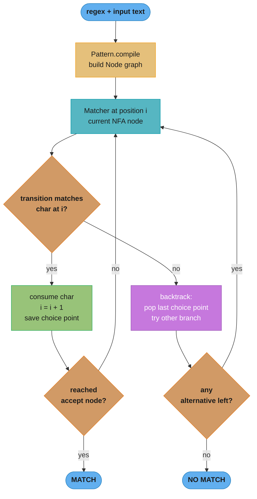
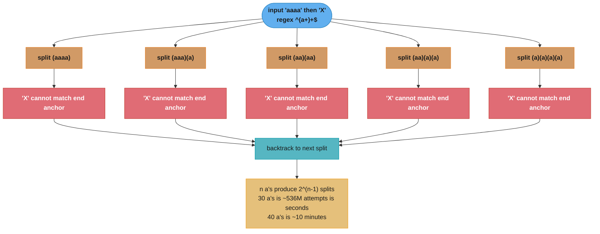

# Regex Engine and ReDoS — Deep Dive

A deep dive into `java.util.regex` — how the `Pattern`/`Matcher` pair works, why
Java uses a *backtracking NFA* engine (and what that costs you), and how
seemingly harmless patterns turn into a denial-of-service vector called ReDoS.
This is a sub-file of [Strings & Text](README.md); it assumes you already know
`String` immutability and the constant pool, and focuses entirely on regular
expressions and their security-relevant failure mode.

The one sentence to remember: **Java's regex engine can take exponential time on
pathological patterns, so an attacker who controls the input (or the pattern)
can hang a thread with a 30-character string.**

---

## 1. Concept Overview

`java.util.regex` compiles a pattern string into an in-memory graph of `Node`
objects (`Pattern.compile`) and walks that graph against input using a
*backtracking* matcher (`Matcher`). This is a Thompson-style **NFA
(nondeterministic finite automaton)** executed by recursive descent — not a
**DFA** like Go's RE2, `grep -E`, or `ripgrep`.

The tradeoff is deliberate: backtracking buys you features a DFA cannot offer —
**backreferences** (`\1`), **lookahead/lookbehind** (`(?=...)`, `(?<=...)`), and
**possessive/atomic groups** — at the cost of worst-case *exponential* runtime.
A DFA engine guarantees linear time O(n) in the input length but cannot express
backreferences at all.

Key capabilities and gotchas covered here:
- `Pattern` (immutable, thread-safe, expensive to build) vs `Matcher` (mutable, cheap, NOT thread-safe)
- Backtracking NFA execution and where it blows up
- Greedy vs lazy vs **possessive** quantifiers (`a++`, `a*+`, `a?+`) and **atomic groups** `(?>...)`
- Catastrophic backtracking / ReDoS — nested quantifiers `(a+)+`, overlapping alternation `(a|a)*`
- `matches()` vs `find()` vs `lookingAt()`, and `region()`
- Capture groups, named groups `(?<name>...)`, backreferences, lookaround
- Unicode: `\p{...}` property classes and `UNICODE_CHARACTER_CLASS`
- `Pattern.compile` flags and their traps
- Mitigations: possessive/atomic rewrite, anchoring, input-length caps, match timeouts, RE2/J

---

## 2. Intuition

**One-line analogy**: A backtracking regex engine is a maze-runner that, whenever
it hits a dead end, walks all the way back to the last fork and tries the other
path — and it will try *every* fork combination before admitting there is no
exit. If the maze has n forks, that is up to 2ⁿ walks.

**Mental model**: Every quantifier (`*`, `+`, `?`, `{m,n}`) is a decision point.
Greedy quantifiers grab as much as possible, then *give characters back* one at a
time when the rest of the pattern fails to match. Each "give back" is a
backtrack. Nest one quantifier inside another and the number of ways to split
the input explodes combinatorially.

**Why it matters**: A regex that validates user input — an email field, a
URL, an HTTP header — runs on your request thread. If the pattern is
ReDoS-vulnerable, one crafted 30-byte string pins a CPU core for seconds to
minutes, and a handful of them exhausts your thread pool. This is a
denial-of-service class bug (CWE-1333); see [Backend Security / OWASP](../../backend/backend_security_owasp/README.md).

**Key insight**: The danger is not "regex is slow." It is that runtime is a
function of the *pattern shape*, not just input length. `^[a-z]+$` is always
linear; `^(a+)+$` is exponential. The two look equally innocent in code review.

---

## 3. Core Principles — The Backtracking NFA Engine

1. **Compile builds a Node graph.** `Pattern.compile("a(bc)+d")` produces a linked
   list of `Node` subclasses (`Single`, `Curly`, `GroupHead`, `GroupTail`, `LastNode`, …).
   Each `Node.match(matcher, i, seq)` returns a boolean and, on success, hands
   control to the next node — a recursive call chain.
2. **Matching is depth-first search with backtracking.** A greedy `Curly` node
   (the `+`/`*`/`{m,n}` implementation) matches as many repetitions as it can,
   then recursively asks the *rest* of the pattern to match. If the rest fails,
   it releases one repetition and retries — this is the backtrack.
3. **Backtracking uses the JVM call stack.** Because `Node.match` is recursive,
   deep or long matches consume stack frames; pathological input can throw
   `StackOverflowError` rather than merely running slowly.
4. **Anchors bound the search.** `^` and `$` (or `matches()`, which anchors both
   ends implicitly) prune the search space. An unanchored `find()` retries the
   whole pattern at every starting position — O(n) restarts on top of per-match cost.
5. **Possessive and atomic constructs disable backtracking locally.** A
   possessive quantifier (`a++`) or atomic group (`(?>a+)`) matches greedily and
   then *refuses to give anything back*. This is the single most important ReDoS
   defense available inside the regex language itself.
6. **`Pattern` is immutable and shareable; `Matcher` is not.** Compiling is the
   expensive step; keep the compiled `Pattern` in a `static final` field and make
   a fresh `Matcher` per use (or per thread).

---

## 4. Quantifiers and Groups — Greedy, Lazy, Possessive, Atomic

| Form | Name | Behavior | Backtracks? |
|------|------|----------|-------------|
| `a*` `a+` `a?` `a{m,n}` | Greedy | Match as much as possible, give back on failure | Yes |
| `a*?` `a+?` `a??` `a{m,n}?` | Lazy (reluctant) | Match as little as possible, take more on failure | Yes |
| `a*+` `a++` `a?+` `a{m,n}+` | Possessive | Match as much as possible, **never** give back | No |
| `(?>...)` | Atomic group | Whole group matches once; **never** re-enters to backtrack | No |
| `(...)` | Capturing group | Records matched text; retrievable via `group(n)` | Yes |
| `(?:...)` | Non-capturing group | Groups without capturing (slightly cheaper) | Yes |
| `(?<name>...)` | Named capturing group | Retrievable via `group("name")` | Yes |

**Greedy vs lazy** changes *what* matches; **possessive/atomic** changes
*whether the engine can backtrack at all*. Lazy is not a performance fix — a lazy
quantifier still backtracks (forward instead of backward). Only possessive and
atomic actually cut the exponential search tree.

```java
// Greedy: <.+>  on "<a><b>"  -> matches the whole "<a><b>" then backtracks to "<a>"
// Lazy:   <.+?> on "<a><b>"  -> matches "<a>" directly (minimal), still can backtrack
// Possessive: <.++> on "<a><b>" -> grabs "<a><b>", cannot give back the ">", FAILS
```

---

## 5. Architecture Diagrams

### Backtracking NFA execution loop



Every "no" transition pushes the engine back to the most recent choice point.
When quantifiers nest, the number of choice points multiplies — which is exactly
the mechanism the next diagram exploits.

### Catastrophic backtracking blowup — `^(a+)+$` on `"aaaa…X"`



Both the inner `a+` and the outer `(...)+` can each absorb any number of `a`s, so
the engine tries every way to partition the run of `a`s into groups — 2ⁿ⁻¹ of
them — and only fails at the trailing `X` each time. This is the canonical ReDoS.

---

## 6. How It Works — Detailed Mechanics

### 6.1 Pattern / Matcher lifecycle — compile once, reuse

```java
// BROKEN: recompiles the regex on every call — Pattern.compile is the expensive step.
public boolean isValidId(String s) {
    return s.matches("[A-Z]{3}-\\d{4}");   // String.matches compiles a fresh Pattern EVERY call
}

// FIX: compile once into a static final Pattern; create a cheap Matcher per call.
private static final Pattern ID = Pattern.compile("[A-Z]{3}-\\d{4}");

public boolean isValidId(String s) {
    return ID.matcher(s).matches();        // matcher() is cheap; compile() ran once at class load
}
```

`Pattern.compile` parses the regex and builds the `Node` graph — micro- to
milliseconds of work. `String.matches`, `String.split`, and `String.replaceAll`
all call `Pattern.compile` internally on **every invocation**; in a hot loop that
is pure waste.

### 6.2 Thread-safety: Pattern yes, Matcher no

```java
private static final Pattern P = Pattern.compile("\\d+");  // safe to share across threads

// BROKEN: one Matcher shared by many threads — mutable matching state corrupts.
private static final Matcher SHARED = P.matcher("");       // Matcher holds region + group state

// FIX: a fresh Matcher per use (or a ThreadLocal<Matcher> in ultra-hot paths).
public boolean hasDigits(String s) {
    return P.matcher(s).find();            // new Matcher each call; no shared mutable state
}
```

`Pattern` is immutable — build it once, share freely. `Matcher` carries the
current position, region bounds, and captured groups; two threads using one
`Matcher` will read each other's state and produce wrong results or exceptions.

### 6.3 matches() vs find() vs lookingAt() vs region()

```java
Pattern p = Pattern.compile("\\d+");
Matcher m = p.matcher("abc123def");

m.matches();     // false — must match the ENTIRE input (implicit ^...$)
m.lookingAt();   // false — must match at the START, but need not reach the end
m.find();        // true  — finds "123" ANYWHERE; repeated find() walks subsequent matches
m.group();       // "123" after a successful find()

// region() restricts matching to a sub-range without allocating a substring:
Matcher r = p.matcher("abc123def456");
r.region(6, 12);                 // only look inside indices [6,12) -> "def456"
r.find();                        // matches "456"
```

- `matches()` — whole-input match (anchored both ends).
- `lookingAt()` — anchored at the start only.
- `find()` — scans for the next match anywhere; stateful, advances on each call.
- `region(start, end)` — bounds the search window without copying the string.

### 6.4 Capture groups, named groups, backreferences

```java
Pattern p = Pattern.compile("(?<year>\\d{4})-(?<month>\\d{2})-(?<day>\\d{2})");
Matcher m = p.matcher("2026-07-03");
if (m.matches()) {
    m.group(0);          // "2026-07-03" — group 0 is the whole match
    m.group(1);          // "2026" — by index
    m.group("year");     // "2026" — by name (JEP: named groups, Java 7+)
    m.group("month");    // "07"
}

// Backreference: \1 (or \k<name>) requires the SAME text to appear again.
// Backreferences are the reason Java cannot use a linear DFA engine.
Pattern dup = Pattern.compile("\\b(\\w+)\\s+\\1\\b");   // finds a doubled word
dup.matcher("the the cat").find();   // true, matches "the the"
```

### 6.5 Lookahead and lookbehind

```java
// Positive lookahead (?=...): assert what FOLLOWS without consuming it.
Pattern pwd = Pattern.compile("(?=.*\\d)(?=.*[a-z])(?=.*[A-Z]).{8,}");
pwd.matcher("Abcdef12").matches();   // true — has digit, lower, upper, len >= 8

// Negative lookbehind (?<!...): assert what does NOT precede.
Pattern price = Pattern.compile("(?<!\\$)\\b\\d+\\b");  // a number NOT preceded by $
price.matcher("$50 and 20").find();  // matches "20" (skips the $50)
```

Lookaround does not consume input, but each assertion still runs the sub-pattern;
stacked lookaheads with inner quantifiers (`(?=.*a+)`) can themselves be a ReDoS
source. Java supports **bounded** and (since Java 6) effectively arbitrary-length
lookbehind, but wide lookbehind is expensive — it re-scans preceding text.

### 6.6 Unicode property classes

```java
// \p{...} matches Unicode categories/scripts/blocks.
Pattern letters = Pattern.compile("\\p{L}+");            // any Unicode letter
Pattern greek   = Pattern.compile("\\p{IsGreek}+");      // Greek script
Pattern currency= Pattern.compile("\\p{Sc}");            // currency symbol (e.g. $, €, ¥)

// By default \w, \d, \s are ASCII-only. UNICODE_CHARACTER_CLASS makes them Unicode-aware:
Pattern word = Pattern.compile("\\w+", Pattern.UNICODE_CHARACTER_CLASS);
word.matcher("naïve café").find();   // now \w matches accented letters too
```

Without `UNICODE_CHARACTER_CLASS` (or the inline flag `(?U)`), `\d` matches only
`[0-9]` and `\w` only `[A-Za-z0-9_]` — a common bug when validating non-English input.

### 6.7 Compile flags

| Flag | Inline | Effect |
|------|--------|--------|
| `CASE_INSENSITIVE` | `(?i)` | ASCII case-insensitive; combine with `UNICODE_CASE` for full Unicode |
| `UNICODE_CASE` | `(?u)` | Makes `CASE_INSENSITIVE` Unicode-aware |
| `MULTILINE` | `(?m)` | `^`/`$` match at each line boundary, not just string ends |
| `DOTALL` | `(?s)` | `.` also matches line terminators (`\n`) |
| `COMMENTS` | `(?x)` | Ignore whitespace and `#` comments in the pattern |
| `UNICODE_CHARACTER_CLASS` | `(?U)` | `\w \d \s \b` become Unicode-aware |
| `LITERAL` | — | Treat the pattern as literal text (no metacharacters) |

```java
Pattern p = Pattern.compile("^error:.*$", Pattern.MULTILINE | Pattern.CASE_INSENSITIVE);
```

---

## 7. Catastrophic Backtracking and ReDoS

### The blowup, measured

```java
public static void main(String[] args) {
    Pattern evil = Pattern.compile("^(a+)+$");
    for (int n = 20; n <= 34; n += 2) {
        String input = "a".repeat(n) + "!";     // n a's + one non-matching char
        long t0 = System.nanoTime();
        boolean matched = evil.matcher(input).matches();   // always false; explores 2^(n-1) paths
        long ms = (System.nanoTime() - t0) / 1_000_000;
        System.out.printf("n=%d  matched=%b  %d ms%n", n, matched, ms);
    }
}
```

Representative output on a modern laptop (each extra pair of `a`s roughly
quadruples the time — the classic exponential signature):

```
n=20  matched=false     2 ms
n=24  matched=false    35 ms
n=28  matched=false   560 ms
n=30  matched=false  2200 ms
n=32  matched=false  8900 ms
n=34  matched=false 36000 ms   <- 36 seconds from a 35-byte string
```

The three classic ReDoS shapes:
- **Nested quantifiers**: `(a+)+`, `(a*)*`, `(.+)+` — inner and outer both flexible.
- **Overlapping alternation under a quantifier**: `(a|a)*`, `(a|ab)*` — multiple ways to match the same text.
- **Quantifier followed by an optional overlap**: `\d+\d+`, `.*.*$`, `(\w+\s?)*` — the split point is ambiguous.

### BROKEN → FIX: a real-world validator

```java
// BROKEN: a plausible "trim then validate" email/username regex with nested quantifiers.
// The (([\w]+)*) sub-pattern is the trap: [\w]+ inside (...)* gives overlapping splits.
private static final Pattern EMAIL_BAD =
    Pattern.compile("^(([a-zA-Z0-9])+([._-])?)+@([a-zA-Z0-9]+\\.)+[a-zA-Z]{2,}$");

boolean ok = EMAIL_BAD.matcher("aaaaaaaaaaaaaaaaaaaaaaaaaaaaaa!").matches();
// The local part "aaaa...!" has no '@'; the engine backtracks through every way to
// partition the a-run across the nested (...)+ groups before failing. Seconds of CPU.
```

```java
// FIX 1 — possessive quantifiers: the inner groups refuse to give characters back,
// so there is exactly ONE way to consume the a-run and failure is immediate.
private static final Pattern EMAIL_POSS =
    Pattern.compile("^[a-zA-Z0-9]++([._-][a-zA-Z0-9]++)*+@([a-zA-Z0-9]++\\.)++[a-zA-Z]{2,}+$");

// FIX 2 — atomic group: (?>...) locks in the local part once matched.
private static final Pattern EMAIL_ATOMIC =
    Pattern.compile("^(?>[a-zA-Z0-9]+(?:[._-][a-zA-Z0-9]+)*)@([a-zA-Z0-9]+\\.)+[a-zA-Z]{2,}$");

// FIX 3 — do not over-engineer: a flat, non-nested pattern is linear by construction.
private static final Pattern EMAIL_FLAT =
    Pattern.compile("^[A-Za-z0-9._-]+@[A-Za-z0-9.-]+\\.[A-Za-z]{2,}$");
```

Rewriting `(a+)+$` as `(a++)+$`, `(?>a+)+$`, or simply `a+$` all collapse the 2ⁿ
search to O(n). The general recipe: eliminate nesting, or make the inner
quantifier possessive so a failed tail cannot force a re-split.

### Mitigations beyond rewriting the pattern

1. **Cap input length before matching.** `if (input.length() > 256) reject();` —
   exponential in n is harmless when n is bounded to a small constant.
2. **Prefer possessive/atomic** wherever the sub-expression should match greedily
   and never reconsider (most validation patterns qualify).
3. **Anchor both ends** (`^...$` or `matches()`) to prune the search space.
4. **Add a match timeout.** `Matcher` has no native timeout, so wrap the input in
   a `CharSequence` whose `charAt` checks a deadline or the interrupt flag:

```java
// A CharSequence that aborts a runaway match by throwing when the thread is interrupted.
final class InterruptibleCharSequence implements CharSequence {
    private final CharSequence inner;
    InterruptibleCharSequence(CharSequence inner) { this.inner = inner; }
    public char charAt(int index) {
        if (Thread.currentThread().isInterrupted())      // the engine calls charAt in its hot loop
            throw new RuntimeException("regex match timed out");
        return inner.charAt(index);
    }
    public int length() { return inner.length(); }
    public CharSequence subSequence(int s, int e) {
        return new InterruptibleCharSequence(inner.subSequence(s, e));
    }
    public String toString() { return inner.toString(); }
}
// Run the match on a worker; a watchdog interrupts it after, say, 100 ms.
matcher = pattern.matcher(new InterruptibleCharSequence(userInput));
```

5. **Switch engines for untrusted patterns.** Use `com.google.re2j` (RE2/J) — a
   pure-Java port of Google's RE2 that runs in guaranteed linear time and cannot
   backtrack, so it is immune to ReDoS. It drops backreferences and lookaround,
   which is an acceptable trade when the pattern comes from users or config.

---

## 8. Tradeoffs

### Backtracking NFA (java.util.regex) vs DFA (RE2/J, grep)

| Dimension | Backtracking NFA (`java.util.regex`) | DFA / RE2 (`com.google.re2j`) |
|-----------|--------------------------------------|-------------------------------|
| Worst-case time | Exponential O(2ⁿ) on nested quantifiers | Linear O(n), guaranteed |
| Backreferences (`\1`) | Supported | **Not** supported (impossible in a DFA) |
| Lookahead / lookbehind | Supported | **Not** supported |
| Possessive / atomic groups | Supported | N/A (no backtracking to prevent) |
| ReDoS exposure | Yes — the whole point of this file | None |
| Capture-group semantics | Leftmost-greedy, familiar | Leftmost-longest (RE2 semantics differ) |
| Memory | Small compiled graph | Can build a large DFA for big alternations |
| Use when | Trusted patterns needing rich features | Untrusted patterns / DoS-sensitive paths |

### Quantifier strategy

| Strategy | Correctness impact | Performance impact | Use when |
|----------|--------------------|--------------------|----------|
| Greedy `a+` | Default | Backtracks | General matching where backtracking is bounded |
| Lazy `a+?` | Changes what matches | Still backtracks | You want the shortest match |
| Possessive `a++` | Can change match (may fail where greedy succeeds) | No backtracking | Sub-expression should never reconsider |
| Atomic `(?>a+)` | Locks a whole group | No backtracking | Protect a multi-token group from re-splitting |

---

## 9. When to Use / When NOT to Use

**Use `java.util.regex` when:**
- The pattern is authored by you and reviewed (not user- or config-supplied).
- You need backreferences, lookahead, or lookbehind.
- Input length is bounded and the pattern has no nested quantifiers.

**Prefer RE2/J (or a hand-written parser) when:**
- The pattern OR the input is attacker-controlled (search filters, WAF rules, user-defined validators).
- You cannot afford any request-thread stall and must guarantee linear time.

**Do NOT use regex at all when:**
- Parsing nested/recursive structures (HTML, JSON, source code) — regex cannot match balanced delimiters; use a real parser.
- A simple `String.startsWith` / `contains` / `indexOf` would do — those avoid the whole engine.

---

## 10. Common Pitfalls

### Pitfall 1: `String.matches` / `split` / `replaceAll` in a hot loop
Each call recompiles the pattern. In a loop over a million rows, that is a million
`Pattern.compile` calls. Fix: hoist a `static final Pattern` and reuse `matcher()`.

### Pitfall 2: Assuming lazy quantifiers fix ReDoS
`(a+?)+$` is just as catastrophic as `(a+)+$`. Laziness changes match *direction*,
not the *number* of paths. Only possessive/atomic or de-nesting fixes it.

### Pitfall 3: Unanchored validation
`Pattern.compile("\\d{3}")` with `find()` accepts `"abc123xyz"` because it matches
*somewhere*. Validators must anchor (`^\\d{3}$` or `matches()`), or they accept
inputs with garbage around the valid part.

### Pitfall 4: `.` does not match newlines by default
`".*"` stops at `\n`. A multi-line payload silently fails to match. Enable `DOTALL`
(`(?s)`) if `.` should cross line boundaries — a frequent bug in log parsers.

### Pitfall 5: ASCII-only `\d` / `\w`
`\d` matches only `[0-9]`, not Arabic-Indic or full-width digits, unless you set
`UNICODE_CHARACTER_CLASS`. Validating international input with plain `\d` rejects legitimate data.

### Pitfall 6: StackOverflowError on long input
Because Java's matcher recurses per node, a pattern like `(a|b)*` against a
multi-megabyte string can overflow the thread stack and throw `StackOverflowError` —
which most `catch (Exception e)` blocks miss (it is an `Error`, not an `Exception`).

### Pitfall 7: Unescaped metacharacters from user input
Building a pattern with `Pattern.compile("prefix" + userInput)` lets a user inject
regex metacharacters (regex injection). Use `Pattern.quote(userInput)` to treat it
as literal text, or the `LITERAL` flag.

### Pitfall 8: `replaceAll` replacement-string surprises
In the replacement argument, `$` and `\` are special (`$1` = group 1). A literal `$`
in the replacement must be `\\$`, or use `Matcher.quoteReplacement(str)`.

---

## 11. Best Practices and Tooling

1. **Compile once**: `private static final Pattern` — never `String.matches` in hot paths.
2. **One `Matcher` per thread/use** — `Pattern` is shared, `Matcher` is not thread-safe.
3. **Anchor validators** with `^...$` or `matches()`.
4. **Make greedy sub-expressions possessive** (`a++`) or atomic (`(?>...)`) in any validator.
5. **Cap input length** before matching untrusted strings — a hard DoS ceiling.
6. **Audit every regex for nested quantifiers** (`(x+)+`, `(x*)*`, `(x+)*`) and overlapping alternation.
7. **Use `Pattern.quote`** whenever a pattern embeds user-supplied text.
8. **Use RE2/J** (`com.google.re2j`) for user- or config-supplied patterns and DoS-sensitive endpoints.
9. **Prefer `UNICODE_CHARACTER_CLASS`** when input may be non-ASCII.
10. **Test with adversarial input** — feed each validation regex a run of its "cheap" character plus a failing suffix and assert it returns in single-digit milliseconds.

**Tools:** static analyzers flag ReDoS shapes — [`redos-detector`](https://github.com/tjenkinson/redos-detector),
SonarQube rule `S5852` (super-linear regex), CodeQL's `js/redos` / `java/redos`
queries, and OWASP dependency scanners. `com.google.re2j` is the drop-in
linear-time engine (same `Pattern`/`Matcher` API surface).

---

## 12. Interview Questions with Answers

**Why does Java's regex engine hang on some patterns when Go's `regexp` or `grep` never do?**
Java uses a backtracking NFA engine, whereas Go's RE2 and `grep -E` use a DFA that guarantees linear time. Backtracking explores every way a set of nested quantifiers can partition the input, which is exponential for patterns like `(a+)+$`. A DFA cannot express backreferences or lookaround but never backtracks, so it is immune to catastrophic blowup. The practical takeaway: with `java.util.regex`, runtime depends on the pattern *shape*, not just input length.

**What is catastrophic backtracking, and which pattern shapes cause it?**
Catastrophic backtracking is exponential-time matching caused by ambiguity in how quantifiers can split the input. The three canonical shapes are nested quantifiers (`(a+)+`, `(a*)*`), a quantifier over overlapping alternation (`(a|a)*`, `(a|ab)*`), and adjacent flexible quantifiers (`\d+\d+`, `.*.*`). Each gives the engine many equivalent ways to match a prefix; when the overall match ultimately fails, it tries all 2ⁿ⁻¹ of them. Anchoring, possessive quantifiers, or de-nesting eliminate the ambiguity.

**How do possessive quantifiers and atomic groups prevent ReDoS?**
They disable local backtracking: a possessive quantifier (`a++`) or atomic group (`(?>a+)`) matches greedily and then refuses to give characters back. Because there is exactly one way to consume the run, a failing tail cannot force the engine to re-split it, collapsing the 2ⁿ search to O(n). The tradeoff is that possessive matching can *fail* where a greedy version would have succeeded, so you use it only where the sub-expression should never reconsider — which is most validation patterns.

**Is `Matcher` thread-safe? Is `Pattern`?**
`Pattern` is immutable and fully thread-safe, but `Matcher` is not — it holds mutable state (current position, region bounds, captured groups). Sharing one `Matcher` across threads produces corrupted results or exceptions. The correct pattern is a `static final Pattern` shared everywhere and a fresh `pattern.matcher(input)` per call, or a `ThreadLocal<Matcher>` in extremely hot paths.

**What is the difference between `matches()`, `find()`, and `lookingAt()`?**
`matches()` requires the entire input to match (anchored at both ends), `lookingAt()` requires a match at the start but not to the end, and `find()` searches for a match anywhere and advances on each call. Validators almost always want `matches()`; scanners want repeated `find()`. A frequent bug is using `find()` for validation, which accepts input like `"abc123xyz"` because `\d{3}` matches somewhere inside it.

**What is the difference between greedy, lazy, and possessive quantifiers?**
Greedy (`a+`) matches as much as possible then backtracks; lazy (`a+?`) matches as little as possible then takes more; possessive (`a++`) matches as much as possible and never gives back. Greedy vs lazy changes *what* text is matched; possessive changes *whether backtracking can happen at all*. A common misconception is that lazy quantifiers fix performance — they still backtrack, just in the other direction; only possessive/atomic cut the search tree.

**`java.util.regex` has no timeout — how do you bound a match's runtime?**
Wrap the input in a custom `CharSequence` whose `charAt` throws when the thread is interrupted or a deadline passes, then run the match on a worker thread that a watchdog interrupts. The engine calls `charAt` in its innermost loop, so the exception fires mid-match and unwinds the backtracking. Alternatively, cap input length before matching, or switch to RE2/J which cannot blow up in the first place.

**Why is `String.matches("...")` a performance trap?**
`String.matches`, `String.split`, and `String.replaceAll` all call `Pattern.compile` internally on every invocation, so using them in a loop recompiles the regex every iteration. Compilation (parsing the pattern into a `Node` graph) is the expensive step; matching is comparatively cheap. Fix: hoist the pattern into a `static final Pattern` field and reuse `matcher()`.

**What are capture groups, named groups, and backreferences?**
Capture groups `(...)` record the text they matched, retrievable by index via `group(n)` (group 0 is the whole match); named groups `(?<name>...)` retrieve by name via `group("name")`. A backreference `\1` (or `\k<name>`) requires the same captured text to appear again — for example `\b(\w+)\s+\1\b` finds a doubled word. Backreferences are precisely the feature that makes a linear DFA engine impossible, forcing the backtracking design.

**What is the difference between lookahead and lookbehind, and what do they cost?**
Lookahead `(?=...)` / `(?!...)` asserts what follows the current position; lookbehind `(?<=...)` / `(?<!...)` asserts what precedes it — neither consumes input. They are zero-width assertions but still execute their sub-pattern, so a lookahead containing an inner quantifier (`(?=.*a+)`) can itself be a ReDoS source. Java supports arbitrary-length lookbehind, but wide lookbehind re-scans preceding text and is expensive.

**How do `\p{...}` classes and `UNICODE_CHARACTER_CLASS` change matching?**
`\p{L}`, `\p{Sc}`, `\p{IsGreek}` and similar match Unicode categories, scripts, and blocks directly. By default `\d`, `\w`, `\s`, and `\b` are ASCII-only, so `\d` matches only `[0-9]`; enabling `Pattern.UNICODE_CHARACTER_CLASS` (or inline `(?U)`) makes them Unicode-aware so `\w` matches accented and non-Latin letters. Forgetting this flag silently rejects legitimate international input.

**What do the `MULTILINE` and `DOTALL` flags do?**
`MULTILINE` (`(?m)`) makes `^` and `$` match at every line boundary rather than only the string's ends; `DOTALL` (`(?s)`) makes `.` also match line terminators like `\n`. They are independent — you often want both when parsing multi-line logs. The default where `.` stops at `\n` is a frequent cause of a pattern that "works on one line but not the whole file."

**Why can a Java regex throw `StackOverflowError` instead of merely running slowly?**
Java's matcher implements each node's `match` recursively, so matching consumes JVM stack frames proportional to match depth. A pattern like `(a|b)*` against a multi-megabyte input can exhaust the thread stack and throw `StackOverflowError` — which is an `Error`, not an `Exception`, so `catch (Exception e)` blocks miss it. This is a distinct failure mode from the exponential-time hang and is triggered by long input rather than pattern nesting alone.

**What is regex injection and how do you prevent it?**
Regex injection happens when user input is concatenated into a pattern (`Pattern.compile("id=" + userInput)`), letting the user inject metacharacters — including ReDoS-triggering nested quantifiers. Prevent it by wrapping the user text in `Pattern.quote(userInput)`, which escapes all metacharacters, or by using the `LITERAL` compile flag. Never build a live pattern from untrusted input without quoting.

**What is RE2/J and when should you choose it over `java.util.regex`?**
RE2/J (`com.google.re2j`) is a pure-Java port of Google's RE2 that runs in guaranteed linear time using an automaton that never backtracks, making it immune to ReDoS. Choose it whenever the pattern or the input is attacker-controlled — user-defined search filters, WAF rules, config-driven validators. The cost is that it drops backreferences and lookaround, which is an acceptable trade for DoS-sensitive endpoints; its API mirrors `Pattern`/`Matcher` for an easy swap.

**What does `Matcher.region()` do and why use it?**
`region(start, end)` restricts matching to a sub-range of the input without allocating a substring, so anchors and `find()` operate only within that window. It avoids the copy that `input.substring(start, end)` would create, which matters when scanning large buffers repeatedly. You can also tune anchoring behavior at region boundaries with `useAnchoringBounds` and `useTransparentBounds`.

**What is the gotcha with `$` and `\` in `replaceAll`'s replacement string?**
In the replacement argument, `$` introduces a group reference (`$1`) and `\` escapes, so a literal `$` or `\` in the output must be written as `\\$` and `\\\\`. Passing user text directly as the replacement can throw `IllegalArgumentException` or inject unintended group references; wrap it in `Matcher.quoteReplacement(str)` to treat it literally. This is separate from `Pattern.quote`, which protects the *pattern* side.

---

## Related / See Also

- [Strings & Text](README.md) — parent module: `String` immutability, constant pool, Compact Strings, text blocks
- [Backend Security / OWASP](../../backend/backend_security_owasp/README.md) — ReDoS as a denial-of-service class (CWE-1333), input validation
- [Performance & Tuning](../performance_and_tuning/README.md) — profiling a CPU hotspot; a hung regex shows as a wide frame in a flame graph
- [JVM Internals](../jvm_internals/README.md) — the call stack and `StackOverflowError` mechanics behind deep recursive matching
