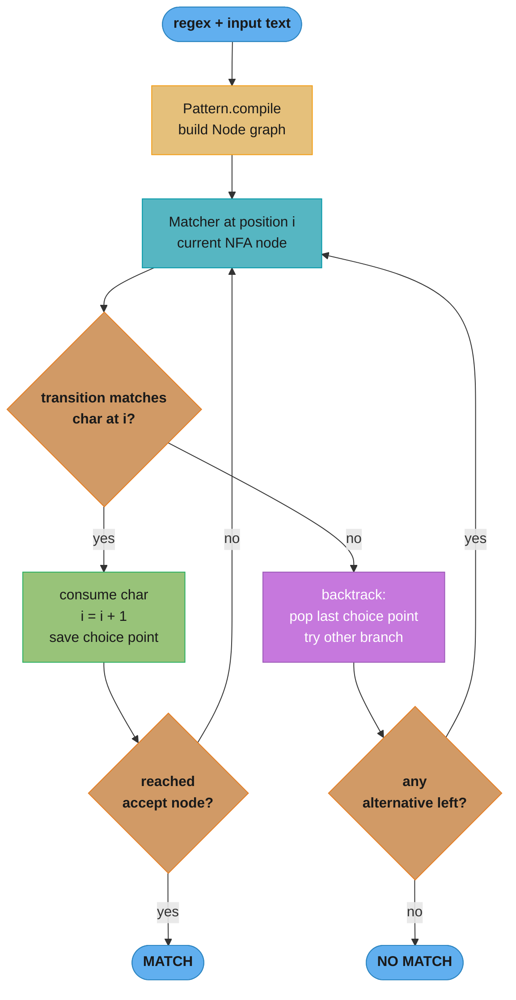
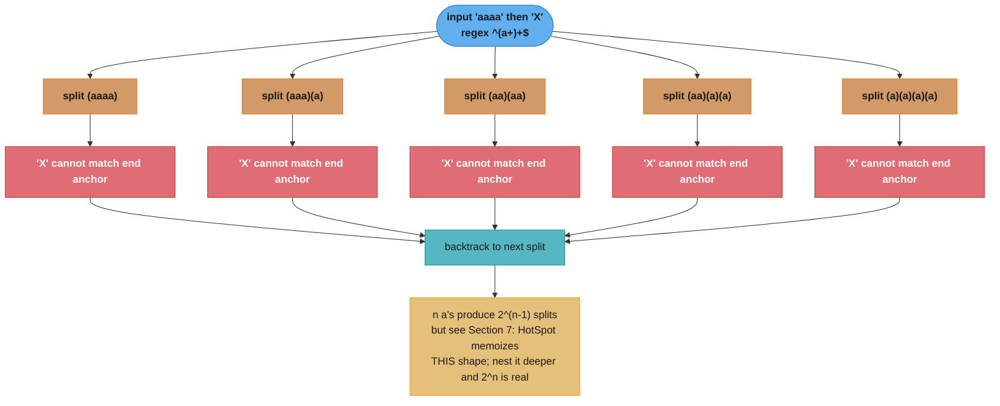

# Regex Engine and ReDoS — Deep Dive
A deep dive into `java.util.regex` — how the `Pattern`/`Matcher` pair works, why
Java uses a *backtracking NFA* engine (and what that costs you), and how
seemingly harmless patterns turn into a denial-of-service vector called ReDoS.
This is a sub-file of [Strings & Text](README.md); it assumes you already know
`String` immutability and the constant pool, and focuses entirely on regular
expressions and their security-relevant failure mode.

The one sentence to remember: **Java's regex engine can take exponential time on
pathological patterns, so an attacker who controls the input (or the pattern)
can hang a thread with a 30-character string** — and HotSpot's partial mitigation
(Section 7) covers the textbook example while leaving the shapes real validators
actually use fully exposed.

---

## 1. Concept Overview

`java.util.regex` compiles a pattern string into an in-memory graph of `Node`
objects (`Pattern.compile`) and walks that graph against input using a
*backtracking* matcher (`Matcher`). This is a **backtracking NFA** in the Spencer
tradition, executed by recursive descent — not the linear NFA *simulation*
(Thompson construction) used by Go's RE2, `grep -E`, or `ripgrep`, which never
backtracks because it tracks all live states at once.

The tradeoff is deliberate: backtracking buys you features a DFA cannot offer —
**backreferences** (`\1`), **lookahead/lookbehind** (`(?=...)`, `(?<=...)`), and
**possessive/atomic groups** — at the cost of worst-case *exponential* runtime.
A DFA engine guarantees linear time O(n) in the input length but cannot express
backreferences at all.

Key capabilities and gotchas covered here:
- `Pattern` (immutable, thread-safe, expensive to build) vs `Matcher` (mutable, cheap, NOT thread-safe)
- Backtracking NFA execution and where it blows up
- Greedy vs lazy vs **possessive** quantifiers (`a++`, `a*+`, `a?+`) and **atomic groups** `(?>...)`
- Catastrophic backtracking / ReDoS — nested quantifiers `(a+)+`, overlapping alternation `(a|a)*`
- HotSpot's `Loop` memoization: which shapes it already protects, and the two conditions that switch it off
- `matches()` vs `find()` vs `lookingAt()`, and `region()`
- Capture groups, named groups `(?<name>...)`, backreferences, lookaround
- Unicode: `\p{...}` property classes and `UNICODE_CHARACTER_CLASS`
- `Pattern.compile` flags and their traps
- Mitigations: possessive/atomic rewrite, anchoring, input-length caps, match timeouts, RE2/J

---

## 2. Intuition

**One-line analogy**: A backtracking regex engine is a maze-runner that, whenever
it hits a dead end, walks all the way back to the last fork and tries the other
path — and it will try *every* fork combination before admitting there is no
exit. If the maze has n forks, that is up to 2ⁿ walks.

**Mental model**: Every quantifier (`*`, `+`, `?`, `{m,n}`) is a decision point.
Greedy quantifiers grab as much as possible, then *give characters back* one at a
time when the rest of the pattern fails to match. Each "give back" is a
backtrack. Nest one quantifier inside another and the number of ways to split
the input explodes combinatorially.

**Why it matters**: A regex that validates user input — an email field, a
URL, an HTTP header — runs on your request thread. If the pattern is
ReDoS-vulnerable, one crafted 30-byte string pins a CPU core for seconds to
minutes, and a handful of them exhausts your thread pool. This is a
denial-of-service class bug (CWE-1333); see [Backend Security / OWASP](../../backend/backend_security_owasp/README.md).

**Key insight**: The danger is not "regex is slow." It is that runtime is a
function of the *pattern shape*, not just input length. `^[a-z]+$` is always
linear; `^(([a-z]+)+\.)+[a-z]{2,}$` is exponential. The two look equally innocent
in code review, and the second one looks like a perfectly ordinary validator.

---

## 3. Core Principles — The Backtracking NFA Engine

1. **Compile builds a Node graph.** `Pattern.compile("a(bc)+d")` produces a linked
   list of `Node` subclasses (`Single`, `Curly`, `GroupHead`, `GroupTail`, `LastNode`, …).
   Each `Node.match(matcher, i, seq)` returns a boolean and, on success, hands
   control to the next node — a recursive call chain.
2. **Matching is depth-first search with backtracking.** A greedy `Curly` node
   (the `+`/`*`/`{m,n}` implementation) matches as many repetitions as it can,
   then recursively asks the *rest* of the pattern to match. If the rest fails,
   it releases one repetition and retries — this is the backtrack.
3. **Backtracking uses the JVM call stack.** Because `Node.match` is recursive,
   deep or long matches consume stack frames; pathological input can throw
   `StackOverflowError` rather than merely running slowly.
4. **Anchors bound the search.** `^` and `$` (or `matches()`, which anchors both
   ends implicitly) prune the search space. An unanchored `find()` retries the
   whole pattern at every starting position — O(n) restarts on top of per-match cost.
5. **Possessive and atomic constructs disable backtracking locally.** A
   possessive quantifier (`a++`) or atomic group (`(?>a+)`) matches greedily and
   then *refuses to give anything back*. This is the single most important ReDoS
   defense available inside the regex language itself.
6. **`Pattern` is immutable and shareable; `Matcher` is not.** Compiling is the
   expensive step; keep the compiled `Pattern` in a `static final` field and make
   a fresh `Matcher` per use (or per thread).

---

## 4. Quantifiers and Groups — Greedy, Lazy, Possessive, Atomic

| Form | Name | Behavior | Backtracks? |
|------|------|----------|-------------|
| `a*` `a+` `a?` `a{m,n}` | Greedy | Match as much as possible, give back on failure | Yes |
| `a*?` `a+?` `a??` `a{m,n}?` | Lazy (reluctant) | Match as little as possible, take more on failure | Yes |
| `a*+` `a++` `a?+` `a{m,n}+` | Possessive | Match as much as possible, **never** give back | No |
| `(?>...)` | Atomic group | Whole group matches once; **never** re-enters to backtrack | No |
| `(...)` | Capturing group | Records matched text; retrievable via `group(n)` | Yes |
| `(?:...)` | Non-capturing group | Groups without capturing (slightly cheaper) | Yes |
| `(?<name>...)` | Named capturing group | Retrievable via `group("name")` | Yes |

**Greedy vs lazy** changes *what* matches; **possessive/atomic** changes
*whether the engine can backtrack at all*. Lazy is not a performance fix — a lazy
quantifier still backtracks (forward instead of backward). Only possessive and
atomic actually cut the exponential search tree.

```java
// Greedy: <.+>  on "<a><b>"  -> matches the whole "<a><b>" then backtracks to "<a>"
// Lazy:   <.+?> on "<a><b>"  -> matches "<a>" directly (minimal), still can backtrack
// Possessive: <.++> on "<a><b>" -> grabs "<a><b>", cannot give back the ">", FAILS
```

---

## 5. Architecture Diagrams

### Backtracking NFA execution loop


```mermaid
flowchart TD
    classDef io      fill:#61afef,stroke:#2e86c1,color:#1a1a1a,font-weight:bold
    classDef frozen  fill:#c678dd,stroke:#9b59b6,color:#fff
    classDef train   fill:#98c379,stroke:#27ae60,color:#1a1a1a
    classDef mathOp  fill:#d19a66,stroke:#e67e22,color:#1a1a1a,font-weight:bold
    classDef lossN   fill:#e06c75,stroke:#c0392b,color:#fff,font-weight:bold
    classDef req     fill:#56b6c2,stroke:#0097a7,color:#1a1a1a
    classDef base    fill:#e5c07b,stroke:#f39c12,color:#1a1a1a

    In(["regex + input text"]) --> Compile["Pattern.compile\nbuild Node graph"]
    Compile --> Pos["Matcher at position i\ncurrent NFA node"]
    Pos --> Try{"transition matches\nchar at i?"}
    Try -->|yes| Consume["consume char\ni = i + 1\nsave choice point"]
    Consume --> Done{"reached\naccept node?"}
    Done -->|yes| Ok(["MATCH"])
    Done -->|no| Pos
    Try -->|no| Back["backtrack:\npop last choice point\ntry other branch"]
    Back --> More{"any\nalternative left?"}
    More -->|yes| Pos
    More -->|no| Fail(["NO MATCH"])

    class In,Ok,Fail io
    class Compile base
    class Pos req
    class Try,Done,More mathOp
    class Consume train
    class Back frozen
```

Every "no" transition pushes the engine back to the most recent choice point.
When quantifiers nest, the number of choice points multiplies — which is exactly
the mechanism the next diagram exploits.

### Catastrophic backtracking blowup — `^(a+)+$` on `"aaaa…X"`


```mermaid
flowchart TD
    classDef io      fill:#61afef,stroke:#2e86c1,color:#1a1a1a,font-weight:bold
    classDef frozen  fill:#c678dd,stroke:#9b59b6,color:#fff
    classDef train   fill:#98c379,stroke:#27ae60,color:#1a1a1a
    classDef mathOp  fill:#d19a66,stroke:#e67e22,color:#1a1a1a,font-weight:bold
    classDef lossN   fill:#e06c75,stroke:#c0392b,color:#fff,font-weight:bold
    classDef req     fill:#56b6c2,stroke:#0097a7,color:#1a1a1a
    classDef base    fill:#e5c07b,stroke:#f39c12,color:#1a1a1a

    S(["input 'aaaa' then 'X'\nregex ^(a+)+$"]) --> W1["split (aaaa)"]
    S --> W2["split (aaa)(a)"]
    S --> W3["split (aa)(aa)"]
    S --> W4["split (aa)(a)(a)"]
    S --> W5["split (a)(a)(a)(a)"]
    W1 --> X1["'X' cannot match end anchor"]
    W2 --> X2["'X' cannot match end anchor"]
    W3 --> X3["'X' cannot match end anchor"]
    W4 --> X4["'X' cannot match end anchor"]
    W5 --> X5["'X' cannot match end anchor"]
    X1 --> B["backtrack to next split"]
    X2 --> B
    X3 --> B
    X4 --> B
    X5 --> B
    B --> R["n a's produce 2^(n-1) splits\nbut see Section 7: HotSpot memoizes\nTHIS shape; nest it deeper and 2^n is real"]

    class S io
    class W1,W2,W3,W4,W5 mathOp
    class X1,X2,X3,X4,X5 lossN
    class B req
    class R base
```

Both the inner `a+` and the outer `(...)+` can each absorb any number of `a`s, so
the engine tries every way to partition the run of `a`s into groups — 2ⁿ⁻¹ of
them — and only fails at the trailing `X` each time. This is the canonical ReDoS.

**What this actually says.** "Count the ways you can chop a run of n identical
characters into consecutive non-empty pieces — that count *is* the number of
match attempts the engine must make before it can say no."

That framing matters because it turns a vague "regex can be slow" into an exact
combinatorial quantity you can compute from the pattern alone. Nothing about the
input is special: the `a`s are interchangeable, and it is purely the *number of
ways to draw the group boundaries* that explodes.

| Symbol | What it is |
|--------|------------|
| `n` | Number of repeated characters the ambiguous quantifier can absorb (the run length) |
| `k` | How many groups the outer `(...)+` splits that run into, from 1 to n |
| `C(n-1, k-1)` | Number of ways to choose k-1 boundaries out of the n-1 gaps between characters |
| `2ⁿ⁻¹` | The total over all k — every gap is independently a boundary or not |
| the trailing `X` | The failure trigger; it forces the engine to exhaust *all* splits, not stop early |

**Walk one example.** The `"aaaa" + "X"` case drawn in the diagram, n = 4:

```
  4 a's  ->  3 gaps between them:   a | a | a | a
             each gap is independently "boundary" or "no boundary"

  k = 1 group    C(3,0) = 1     (aaaa)
  k = 2 groups   C(3,1) = 3     (a)(aaa)  (aa)(aa)  (aaa)(a)
  k = 3 groups   C(3,2) = 3     (a)(a)(aa)  (a)(aa)(a)  (aa)(a)(a)
  k = 4 groups   C(3,3) = 1     (a)(a)(a)(a)
                 ---------
  total          1 + 3 + 3 + 1 = 8  =  2^3  =  2^(4-1)

  Every one of the 8 reaches the trailing 'X', fails the $ anchor, and backtracks.
```

Four characters cost 8 attempts, which is invisible. But the exponent is the run
length, so a pattern that really explores every split costs 2^23 = 8,388,608
attempts at n = 24 and 2^31 = 2,147,483,648 at n = 32 — from adding eight
characters to the input.

The trailing `X` is the load-bearing term. Without it the very first split
(`(aaaa)`) matches, the engine returns immediately, and the pattern looks
perfectly fast in every test you write with valid input. ReDoS is a
*failing*-match cost, which is exactly why it survives code review.

**One caveat before you go and reproduce this.** The count above is the true
combinatorics, but modern HotSpot does not *pay* it for this exact pattern —
`^(a+)+$` returns in microseconds on a current JDK. Section 7 explains why, which
shapes the optimization does not cover, and which realistic validators still blow
up. Do not skip it: the reason `^(a+)+$` is fast is also the rule for predicting
which of your own patterns are not.

---

## 6. How It Works — Detailed Mechanics

### 6.1 Pattern / Matcher lifecycle — compile once, reuse

```java
// BROKEN: recompiles the regex on every call — Pattern.compile is the expensive step.
public boolean isValidId(String s) {
    return s.matches("[A-Z]{3}-\\d{4}");   // String.matches compiles a fresh Pattern EVERY call
}

// FIX: compile once into a static final Pattern; create a cheap Matcher per call.
private static final Pattern ID = Pattern.compile("[A-Z]{3}-\\d{4}");

public boolean isValidId(String s) {
    return ID.matcher(s).matches();        // matcher() is cheap; compile() ran once at class load
}
```

`Pattern.compile` parses the regex and builds the `Node` graph — micro- to
milliseconds of work. `String.matches`, `String.split`, and `String.replaceAll`
all call `Pattern.compile` internally on **every invocation**; in a hot loop that
is pure waste.

### 6.2 Thread-safety: Pattern yes, Matcher no

```java
private static final Pattern P = Pattern.compile("\\d+");  // safe to share across threads

// BROKEN: one Matcher shared by many threads — mutable matching state corrupts.
private static final Matcher SHARED = P.matcher("");       // Matcher holds region + group state

// FIX: a fresh Matcher per use (or a ThreadLocal<Matcher> in ultra-hot paths).
public boolean hasDigits(String s) {
    return P.matcher(s).find();            // new Matcher each call; no shared mutable state
}
```

`Pattern` is immutable — build it once, share freely. `Matcher` carries the
current position, region bounds, and captured groups; two threads using one
`Matcher` will read each other's state and produce wrong results or exceptions.

### 6.3 matches() vs find() vs lookingAt() vs region()

```java
Pattern p = Pattern.compile("\\d+");
Matcher m = p.matcher("abc123def");

m.matches();     // false — must match the ENTIRE input (implicit ^...$)
m.lookingAt();   // false — must match at the START, but need not reach the end
m.find();        // true  — finds "123" ANYWHERE; repeated find() walks subsequent matches
m.group();       // "123" after a successful find()

// region() restricts matching to a sub-range without allocating a substring:
Matcher r = p.matcher("abc123def456");
r.region(6, 12);                 // only look inside indices [6,12) -> "def456"
r.find();                        // matches "456"
```

- `matches()` — whole-input match (anchored both ends).
- `lookingAt()` — anchored at the start only.
- `find()` — scans for the next match anywhere; stateful, advances on each call.
- `region(start, end)` — bounds the search window without copying the string.

### 6.4 Capture groups, named groups, backreferences

```java
Pattern p = Pattern.compile("(?<year>\\d{4})-(?<month>\\d{2})-(?<day>\\d{2})");
Matcher m = p.matcher("2026-07-03");
if (m.matches()) {
    m.group(0);          // "2026-07-03" — group 0 is the whole match
    m.group(1);          // "2026" — by index
    m.group("year");     // "2026" — by name (named groups, Java 7+)
    m.group("month");    // "07"
}

// Backreference: \1 (or \k<name>) requires the SAME text to appear again.
// Backreferences are the reason Java cannot use a linear DFA engine.
Pattern dup = Pattern.compile("\\b(\\w+)\\s+\\1\\b");   // finds a doubled word
dup.matcher("the the cat").find();   // true, matches "the the"
```

### 6.5 Lookahead and lookbehind

```java
// Positive lookahead (?=...): assert what FOLLOWS without consuming it.
Pattern pwd = Pattern.compile("(?=.*\\d)(?=.*[a-z])(?=.*[A-Z]).{8,}");
pwd.matcher("Abcdef12").matches();   // true — has digit, lower, upper, len >= 8

// Negative lookbehind (?<!...): assert what does NOT precede.
Pattern price = Pattern.compile("(?<!\\$)\\b\\d+\\b");  // a number NOT preceded by $
price.matcher("$50 and 20").find();  // matches "20" (skips the $50)
```

Lookaround does not consume input, but each assertion still runs the sub-pattern;
stacked lookaheads with inner quantifiers (`(?=.*a+)`) can themselves be a ReDoS
source. Java supports **bounded** and (since Java 6) effectively arbitrary-length
lookbehind, but wide lookbehind is expensive — it re-scans preceding text.

### 6.6 Unicode property classes

```java
// \p{...} matches Unicode categories/scripts/blocks.
Pattern letters = Pattern.compile("\\p{L}+");            // any Unicode letter
Pattern greek   = Pattern.compile("\\p{IsGreek}+");      // Greek script
Pattern currency= Pattern.compile("\\p{Sc}");            // currency symbol (e.g. $, €, ¥)

// By default \w, \d, \s are ASCII-only. UNICODE_CHARACTER_CLASS makes them Unicode-aware:
Pattern word = Pattern.compile("\\w+", Pattern.UNICODE_CHARACTER_CLASS);
word.matcher("naïve café").find();   // now \w matches accented letters too
```

Without `UNICODE_CHARACTER_CLASS` (or the inline flag `(?U)`), `\d` matches only
`[0-9]` and `\w` only `[A-Za-z0-9_]` — a common bug when validating non-English input.

### 6.7 Compile flags

| Flag | Inline | Effect |
|------|--------|--------|
| `CASE_INSENSITIVE` | `(?i)` | ASCII case-insensitive; combine with `UNICODE_CASE` for full Unicode |
| `UNICODE_CASE` | `(?u)` | Makes `CASE_INSENSITIVE` Unicode-aware |
| `MULTILINE` | `(?m)` | `^`/`$` match at each line boundary, not just string ends |
| `DOTALL` | `(?s)` | `.` also matches line terminators (`\n`) |
| `COMMENTS` | `(?x)` | Ignore whitespace and `#` comments in the pattern |
| `UNICODE_CHARACTER_CLASS` | `(?U)` | `\w \d \s \b` become Unicode-aware |
| `LITERAL` | — | Treat the pattern as literal text (no metacharacters) |

```java
Pattern p = Pattern.compile("^error:.*$", Pattern.MULTILINE | Pattern.CASE_INSENSITIVE);
```

---

## 7. Catastrophic Backtracking and ReDoS

### First, the optimization that makes the textbook example lie

The pattern every article uses, `^(a+)+$`, **does not blow up on a current JDK.**
Measured on JDK 23, it returns in well under a millisecond at any n, and counting
`charAt` calls through a wrapping `CharSequence` shows the growth is *quadratic*,
not exponential: 114 calls at n = 12, 372 at n = 24, where 2ⁿ⁻¹ would be 8.4
million.

The reason is a memoization built into `java.util.regex.Pattern`. Greedy
unbounded closures compiled to a `Loop` node are collected into a list the
compiler calls `topClosureNodes`, and each is given a set of input positions at
which it has already failed. `Loop.match` consults it first:

```java
// java.util.regex.Pattern.Loop.match, abridged — the JDK's own comment:
// "Let's check if we have already tried and failed at this starting position
//  'i' in the past. If yes, then just return false without trying again,
//  to stop the exponential backtracking."
if (posIndex != -1 && matcher.localsPos[posIndex].contains(i)) {
    return next.match(matcher, i, seq);
}
```

**Two conditions switch it off, and they are the whole of your risk model:**

1. **The pattern contains a backreference.** The memo is installed only
   `if (!hasGroupRef)` — a `\1` anywhere in the pattern disables it for every
   loop in that pattern, because a repeated group's captured text can differ
   between attempts, so "failed here before" is no longer a safe conclusion.
2. **The ambiguous loop sits inside a quantified group.** When `group0()` finishes
   a group that carries a closure, it clears every inner closure from the list —
   the source comment reads "no backtracking stopper optimization for inner".
   So `^(a+)+$` is protected but `^((a+)+)+$` is not.

That second rule is the one that matters in practice, because real validators
nest: the outer `(...)+ ` repeats a *segment* and the inner quantifier repeats
characters within it.

### The blowup, measured on a realistic validator

```java
public static void main(String[] args) {
    // A hostname/domain validator. The inner ([a-z0-9]+)+ is ambiguous AND it
    // sits inside the quantified (...)+ group, so the memoization does not apply.
    Pattern evil = Pattern.compile("^(([a-z0-9]+)+\\.)+[a-z]{2,}$");
    for (int n = 22; n <= 28; n += 2) {
        String input = "a".repeat(n) + "!";     // n a's + one non-matching char
        long t0 = System.nanoTime();
        boolean matched = evil.matcher(input).matches();   // always false; explores 2^(n-1) paths
        long ms = (System.nanoTime() - t0) / 1_000_000;
        System.out.printf("n=%d  matched=%b  %d ms%n", n, matched, ms);
    }
}
```

Measured on JDK 23, Apple Silicon, after JIT warmup (each extra pair of
characters roughly quadruples the time — the classic exponential signature):

```
n=22  matched=false     56 ms
n=24  matched=false    224 ms
n=26  matched=false    983 ms
n=28  matched=false   3878 ms   <- 3.9 seconds from a 29-byte string
```

**What the formula is telling you.** "Runtime doubles for every single character
you add to the input, so the honest unit for this table is not milliseconds per
byte — it is a multiplier per byte."

Reading it as a multiplier is what makes the table predictive. Once you know the
ratio between two adjacent rows, you can extrapolate to any n without running
the program, which is how you decide whether a length cap is a real fix.

| Symbol | What it is |
|--------|------------|
| `n` | Length of the run of `a`s (the input is n a's plus one non-matching char) |
| `2ⁿ⁻¹` | Match attempts the engine makes before returning false |
| step rate | Attempts the JVM retires per second on this machine — a roughly fixed constant |
| row ratio | Measured time of a row divided by the row above it |
| `matched=false` | Confirms every run walked the *whole* tree; a true match would exit early |

**Walk one example.** Turn the measured times into ratios, then into a step rate:

```
    n     time      2^(n-1)          measured ratio      predicted ratio
   22     56 ms     2,097,152            -                   -
   24    224 ms     8,388,608       224/56   = 4.00        2^2 = 4
   26    983 ms    33,554,432       983/224  = 4.39        2^2 = 4
   28   3878 ms   134,217,728      3878/983  = 3.95        2^2 = 4

   step rate from the last row:
       134,217,728 attempts / 3.878 s = 3.46e7 attempts per second

   sanity-check n = 24 against that rate:
       8,388,608 / 3.46e7 = 0.24 s      (measured 0.224 s)
```

Measured and predicted agree to within a few percent, which is the proof that
this is genuinely 2ⁿ and not merely "slow." Every +2 rows quadruples, because
the base is 2 and only the exponent moves.

Extrapolating with the same 3.5e7 attempts/second rate is what makes the threat
concrete: n = 40 needs 2^39 = 549,755,813,888 attempts, which is about 15,700
seconds — roughly 4.4 hours of one pinned core, bought with a 41-byte HTTP field.

The three classic ReDoS shapes — each dangerous **when the ambiguous loop is not a
top-level closure**, i.e. when it lives inside a quantified group or the pattern
carries a backreference:
- **Nested quantifiers**: `(a+)+`, `(a*)*`, `(.+)+` — inner and outer both flexible.
- **Overlapping alternation under a quantifier**: `(a|a)*`, `(a|ab)*` — multiple ways to match the same text.
- **Quantifier followed by an optional overlap**: `\d+\d+`, `.*.*$`, `(\w+\s?)*` — the split point is ambiguous.

Making the inner quantifier **lazy changes nothing**: `^((a+?)+)+$` measured 48.8 s
at n = 30 against `^((a+)+)+$`'s 52.5 s. Laziness reverses the order in which the
splits are tried, not how many there are.

### BROKEN → FIX: a real-world validator

```java
// BROKEN: a plausible hostname validator. ([a-z0-9]+)+ is ambiguous, and because it
// sits inside the quantified (...)+ group it is exempt from HotSpot's Loop memoization.
private static final Pattern HOST_BAD =
    Pattern.compile("^(([a-z0-9]+)+\\.)+[a-z]{2,}$");

boolean ok = HOST_BAD.matcher("aaaaaaaaaaaaaaaaaaaaaaaaaaaa!").matches();
// No '.' anywhere; the engine backtracks through every way to partition the a-run
// across the nested groups before failing. Measured 3.9 s for those 29 bytes.
```

```java
// FIX 1 — possessive quantifiers: the groups refuse to give characters back,
// so there is exactly ONE way to consume the a-run and failure is immediate.
// Measured: 117 microseconds at n = 40, and it still accepts "mail.example.com".
private static final Pattern HOST_POSS =
    Pattern.compile("^([a-z0-9]++\\.)++[a-z]{2,}+$");

// FIX 2 — atomic group: (?>...) locks in each label once matched.
private static final Pattern HOST_ATOMIC =
    Pattern.compile("^(?>[a-z0-9]+\\.)+[a-z]{2,}$");

// FIX 3 — do not over-engineer: de-nesting removes the ambiguity outright.
// ([a-z0-9]+)+ and [a-z0-9]+ accept exactly the same language; the extra
// group buys nothing and costs the exponent.
private static final Pattern HOST_FLAT =
    Pattern.compile("^[a-z0-9]+(\\.[a-z0-9]+)*\\.[a-z]{2,}$");
```

The general recipe: eliminate the nesting, or make the inner quantifier possessive
so a failed tail cannot force a re-split. Note that FIX 3 is usually available for
free — a nested `(X+)+` almost always matches the identical language as `X+`, so
the nesting is an accident of authorship rather than a requirement.

### Mitigations beyond rewriting the pattern

1. **Cap input length before matching.** `if (input.length() > 256) reject();` —
   exponential in n is harmless when n is bounded to a small constant.

**Stated plainly.** "A length cap does not remove the exponent — it only fixes
the value you raise 2 to, so the cap is safe exactly when 2 to that cap is a
number of steps your CPU can finish inside your request timeout."

That reframing is the whole reason this mitigation is so often misapplied. A cap
feels like a bound, but it is only a bound on n; the work is still 2ⁿ⁻¹, so the
cap has to be chosen against the step rate, not against what "looks like a
reasonable field length."

| Symbol | What it is |
|--------|------------|
| cap | The maximum input length you accept before the regex ever runs |
| `2^(cap-1)` | Worst-case attempts a truly exponential pattern can still make under that cap |
| step rate | Attempts per second, measured above as 3.5e7 on the reference machine |
| budget | The stall you are willing to tolerate on a request thread, e.g. 100 ms |

**Walk one example.** Push several candidate caps through `2^(cap-1) / 3.5e7`:

```
   cap    worst-case attempts 2^(cap-1)    time at 3.5e7/s     verdict
    20                      524,288            0.015 s         safe
    24                    8,388,608            0.24  s         already a stall
    32                2,147,483,648           61     s         request is gone
    40              549,755,813,888       15,707     s         4.4 hours
    64    9,223,372,036,854,775,808        8,352     years     unbounded in practice
   256                        2^255        5.2e61    years     no bound at all
```

Only the 20-character row lands inside a 100 ms budget, and note how sensitive
that verdict is to the step rate — the same table on a machine ten times faster
moves the safe cap by only three or four characters, because you are trading a
linear factor against an exponent. The commonly written `> 256` cap reduces the
worst case by a factor no human cares about: it is still `2^255` attempts.

So the cap is a genuine fix only for **polynomial** blowups — a quadratic
`(\w+\s?)*`-style pattern at n = 256 is 256^2 = 65,536 steps, which really is
free. Against a truly exponential shape a length cap buys nothing, and the term
that has to change is the *pattern*: make the inner quantifier possessive or
de-nest it, which is items 2 and 3 in this list rather than item 1.
2. **Prefer possessive/atomic** wherever the sub-expression should match greedily
   and never reconsider (most validation patterns qualify).
3. **Anchor both ends** (`^...$` or `matches()`) to prune the search space.
4. **Add a match timeout.** `Matcher` has no native timeout, so wrap the input in
   a `CharSequence` whose `charAt` checks a deadline or the interrupt flag:

```java
// A CharSequence that aborts a runaway match by throwing when the thread is interrupted.
final class InterruptibleCharSequence implements CharSequence {
    private final CharSequence inner;
    InterruptibleCharSequence(CharSequence inner) { this.inner = inner; }
    public char charAt(int index) {
        if (Thread.currentThread().isInterrupted())      // the engine calls charAt in its hot loop
            throw new RuntimeException("regex match timed out");
        return inner.charAt(index);
    }
    public int length() { return inner.length(); }
    public CharSequence subSequence(int s, int e) {
        return new InterruptibleCharSequence(inner.subSequence(s, e));
    }
    public String toString() { return inner.toString(); }
}
// Run the match on a worker; a watchdog interrupts it after, say, 100 ms.
matcher = pattern.matcher(new InterruptibleCharSequence(userInput));
```

5. **Switch engines for untrusted patterns.** Use `com.google.re2j` (RE2/J) — a
   pure-Java port of Google's RE2 that runs in guaranteed linear time and cannot
   backtrack, so it is immune to ReDoS. It drops backreferences and lookaround,
   which is an acceptable trade when the pattern comes from users or config.

---

## 8. Tradeoffs

### Backtracking NFA (java.util.regex) vs DFA (RE2/J, grep)

| Dimension | Backtracking NFA (`java.util.regex`) | DFA / RE2 (`com.google.re2j`) |
|-----------|--------------------------------------|-------------------------------|
| Worst-case time | Exponential O(2ⁿ) on nested quantifiers inside a quantified group, or anywhere in a pattern containing a backreference | Linear O(n), guaranteed |
| Backreferences (`\1`) | Supported | **Not** supported (impossible in a DFA) |
| Lookahead / lookbehind | Supported | **Not** supported |
| Possessive / atomic groups | Supported | N/A (no backtracking to prevent) |
| ReDoS exposure | Yes — the whole point of this file | None |
| Capture-group semantics | Leftmost-greedy, familiar | Leftmost-longest (RE2 semantics differ) |
| Memory | Small compiled graph | Can build a large DFA for big alternations |
| Use when | Trusted patterns needing rich features | Untrusted patterns / DoS-sensitive paths |

```
backtracking NFA attempts = 2^(n-1)     <- n = input length in characters
DFA / RE2 transitions     = n           <- one pass, linear
speedup                   = 2^(n-1) / n
```

**Put simply.** "The first row of this table is not a 2x or 10x difference —
O(2ⁿ) versus O(n) means the gap itself grows with every character, so at any
input length worth attacking the two engines are not on the same scale."

Worth spelling out because "exponential vs linear" reads as an abstract
complexity-class remark, and engineers discount it the way they discount O(n log
n) versus O(n). Here the constant factors are irrelevant and only the shape matters.

| Symbol | What it is |
|--------|------------|
| `O(2ⁿ)` | Backtracking NFA worst case — attempts double per added character (when the memoization in Section 7 does not apply) |
| `O(n)` | RE2/DFA guarantee — one pass, state count bounded by the compiled automaton |
| `n` | Input length in characters |
| speedup | `2ⁿ⁻¹ / n` — how many times more work the backtracker does at that n |

**Walk one example.** The same 29-byte string the section above measured, n = 28:

```
  backtracking NFA (java.util.regex):  2^27  = 134,217,728 attempts
  DFA (com.google.re2j):                  29           char transitions

  ratio = 134,217,728 / 29 = 4,628,197x

  in wall time at 3.5e7 attempts/s:
      java.util.regex   3.9    s     <- request thread pinned
      re2j              ~1     us    <- 29 transitions, below timer resolution
```

Four and a half million times more work for the same 29 bytes. And the ratio is
not a fixed penalty you could tune away: at n = 40 it is 2^39/41 = 13.4 billion.
That is why the "use when" row is a *security* decision rather than a
performance one — no amount of faster hardware closes a gap that widens per byte.

### Quantifier strategy

| Strategy | Correctness impact | Performance impact | Use when |
|----------|--------------------|--------------------|----------|
| Greedy `a+` | Default | Backtracks | General matching where backtracking is bounded |
| Lazy `a+?` | Changes what matches | Still backtracks | You want the shortest match |
| Possessive `a++` | Can change match (may fail where greedy succeeds) | No backtracking | Sub-expression should never reconsider |
| Atomic `(?>a+)` | Locks a whole group | No backtracking | Protect a multi-token group from re-splitting |

---

## 9. When to Use / When NOT to Use

**Use `java.util.regex` when:**
- The pattern is authored by you and reviewed (not user- or config-supplied).
- You need backreferences, lookahead, or lookbehind.
- Input length is bounded and the pattern has no nested quantifiers.

**Prefer RE2/J (or a hand-written parser) when:**
- The pattern OR the input is attacker-controlled (search filters, WAF rules, user-defined validators).
- You cannot afford any request-thread stall and must guarantee linear time.

**Do NOT use regex at all when:**
- Parsing nested/recursive structures (HTML, JSON, source code) — regex cannot match balanced delimiters; use a real parser.
- A simple `String.startsWith` / `contains` / `indexOf` would do — those avoid the whole engine.

---

## 10. Common Pitfalls

### Pitfall 1: `String.matches` / `split` / `replaceAll` in a hot loop
Each call recompiles the pattern. In a loop over a million rows, that is a million
`Pattern.compile` calls. Fix: hoist a `static final Pattern` and reuse `matcher()`.

### Pitfall 2: Assuming lazy quantifiers fix ReDoS
`((a+?)+)+$` is just as catastrophic as `((a+)+)+$` — measured 48.8 s versus 52.5 s
at n = 30 on JDK 23. Laziness changes the *order* in which splits are tried, not the
*number* of them. Only possessive/atomic or de-nesting fixes it. (Use the doubly
nested form to test: the singly nested `(a+?)+$` is a top-level closure and HotSpot
memoizes it, so it will mislead you into thinking laziness helped.)

### Pitfall 3: Unanchored validation
`Pattern.compile("\\d{3}")` with `find()` accepts `"abc123xyz"` because it matches
*somewhere*. Validators must anchor (`^\\d{3}$` or `matches()`), or they accept
inputs with garbage around the valid part.

### Pitfall 4: `.` does not match newlines by default
`".*"` stops at `\n`. A multi-line payload silently fails to match. Enable `DOTALL`
(`(?s)`) if `.` should cross line boundaries — a frequent bug in log parsers.

### Pitfall 5: ASCII-only `\d` / `\w`
`\d` matches only `[0-9]`, not Arabic-Indic or full-width digits, unless you set
`UNICODE_CHARACTER_CLASS`. Validating international input with plain `\d` rejects legitimate data.

### Pitfall 6: StackOverflowError on long input
Because Java's matcher recurses per node, a pattern like `(a|b)*` against a
multi-megabyte string can overflow the thread stack and throw `StackOverflowError` —
which most `catch (Exception e)` blocks miss (it is an `Error`, not an `Exception`).

### Pitfall 7: Unescaped metacharacters from user input
Building a pattern with `Pattern.compile("prefix" + userInput)` lets a user inject
regex metacharacters (regex injection). Use `Pattern.quote(userInput)` to treat it
as literal text, or the `LITERAL` flag.

### Pitfall 8: `replaceAll` replacement-string surprises
In the replacement argument, `$` and `\` are special (`$1` = group 1). A literal `$`
in the replacement must be `\\$`, or use `Matcher.quoteReplacement(str)`.

---

## 11. Best Practices

1. **Compile once**: `private static final Pattern` — never `String.matches` in hot paths.
2. **One `Matcher` per thread/use** — `Pattern` is shared, `Matcher` is not thread-safe.
3. **Anchor validators** with `^...$` or `matches()`.
4. **Make greedy sub-expressions possessive** (`a++`) or atomic (`(?>...)`) in any validator.
5. **Cap input length** before matching untrusted strings — a hard DoS ceiling.
6. **Audit every regex for nested quantifiers** (`(x+)+`, `(x*)*`, `(x+)*`) and overlapping alternation.
7. **Use `Pattern.quote`** whenever a pattern embeds user-supplied text.
8. **Use RE2/J** (`com.google.re2j`) for user- or config-supplied patterns and DoS-sensitive endpoints.
9. **Prefer `UNICODE_CHARACTER_CLASS`** when input may be non-ASCII.
10. **Test with adversarial input** — feed each validation regex a run of its "cheap" character plus a failing suffix and assert it returns in single-digit milliseconds.

---

## 12. Interview Questions with Answers

**Q: Why does Java's regex engine hang on some patterns when Go's `regexp` or `grep` never do?**
**Short:** Java's backtracking NFA engine explores exponentially many ways to partition input, while Go's RE2 uses a linear-time automaton.
Java uses a backtracking NFA engine, whereas Go's RE2 and `grep -E` use a linear-time automaton. Backtracking explores every way a set of nested quantifiers can partition the input, which is exponential for shapes like `(([a-z]+)+\.)+`. A DFA cannot express backreferences or lookaround but never backtracks, so it is immune to catastrophic blowup. HotSpot narrows the gap but does not close it: `Loop` nodes memoize start positions that already failed, which is why the textbook `^(a+)+$` now returns instantly, but that memo is disabled for any pattern containing a backreference and for any closure nested inside a quantified group. The practical takeaway: with `java.util.regex`, runtime depends on the pattern *shape*, not just input length.

**Q: What is catastrophic backtracking, and which pattern shapes cause it?**
**Short:** Catastrophic backtracking comes from nested quantifiers, overlapping alternation, or adjacent flexible quantifiers creating exponential ambiguity.
Catastrophic backtracking is exponential-time matching caused by ambiguity in how quantifiers can split the input. The three canonical shapes are nested quantifiers (`(a+)+`, `(a*)*`), a quantifier over overlapping alternation (`(a|a)*`, `(a|ab)*`), and adjacent flexible quantifiers (`\d+\d+`, `.*.*`). Each gives the engine many equivalent ways to match a prefix; when the overall match ultimately fails, it tries all 2ⁿ⁻¹ of them. One qualification specific to modern Java: HotSpot memoizes failed start positions for *top-level* greedy closures, so those three shapes only actually blow up when the ambiguous loop sits inside a quantified group, or when the pattern contains a backreference (which disables the memo entirely). Possessive quantifiers or de-nesting eliminate the ambiguity in every case.

**Q: Why does the textbook ReDoS pattern `^(a+)+$` return instantly on a modern JDK?**
**Short:** HotSpot memoizes failed start positions for top-level greedy closures, but disables the memo for backreferences and nested inner closures.
Because HotSpot memoizes the input positions at which a greedy loop has already failed, so it never re-explores them. `Pattern` collects unbounded greedy closures into a `topClosureNodes` list at compile time and gives each one a position set; `Loop.match` checks that set before recursing and short-circuits a repeat attempt, turning the classic 2ⁿ blowup into roughly quadratic work. Two conditions disable it, and knowing them is the whole point of the question: the memo is installed only when the pattern contains **no backreference** (a `\1` makes "failed here before" unsound, since the captured text can differ), and the compiler explicitly **clears every closure nested inside a quantified group** from the list — its own comment reads "no backtracking stopper optimization for inner". So `^(a+)+$` is protected while `^((a+)+)+$` is not, and the nested form is exactly the shape real validators take, where an outer quantifier repeats a segment and an inner one repeats characters within it. Treat the optimization as a safety net over the textbook example, never as a reason to stop auditing patterns.

**Q: How do possessive quantifiers and atomic groups prevent ReDoS?**
**Short:** Possessive quantifiers and atomic groups disable backtracking entirely, collapsing an exponential search into linear time.
They disable local backtracking: a possessive quantifier (`a++`) or atomic group (`(?>a+)`) matches greedily and then refuses to give characters back. Because there is exactly one way to consume the run, a failing tail cannot force the engine to re-split it, collapsing the 2ⁿ search to O(n). The tradeoff is that possessive matching can *fail* where a greedy version would have succeeded, so you use it only where the sub-expression should never reconsider — which is most validation patterns.

**Q: Is `Matcher` thread-safe? Is `Pattern`?**
**Short:** Pattern is immutable and thread-safe, but Matcher holds mutable state and must never be shared across threads.
`Pattern` is immutable and fully thread-safe, but `Matcher` is not — it holds mutable state (current position, region bounds, captured groups). Sharing one `Matcher` across threads produces corrupted results or exceptions. The correct pattern is a `static final Pattern` shared everywhere and a fresh `pattern.matcher(input)` per call, or a `ThreadLocal<Matcher>` in extremely hot paths.

**Q: What is the difference between `matches()`, `find()`, and `lookingAt()`?**
**Short:** matches() requires the whole input to match, lookingAt() anchors only at the start, and find() searches anywhere and advances.
`matches()` requires the entire input to match (anchored at both ends), `lookingAt()` requires a match at the start but not to the end, and `find()` searches for a match anywhere and advances on each call. Validators almost always want `matches()`; scanners want repeated `find()`. A frequent bug is using `find()` for validation, which accepts input like `"abc123xyz"` because `\d{3}` matches somewhere inside it.

**Q: What is the difference between greedy, lazy, and possessive quantifiers?**
**Short:** Greedy and lazy quantifiers both backtrack and differ only in preferred text, while possessive quantifiers never backtrack at all.
Greedy (`a+`) matches as much as possible then backtracks; lazy (`a+?`) matches as little as possible then takes more; possessive (`a++`) matches as much as possible and never gives back. Greedy vs lazy changes *what* text is matched; possessive changes *whether backtracking can happen at all*. A common misconception is that lazy quantifiers fix performance — they still backtrack, just in the other direction; only possessive/atomic cut the search tree.

**Q: `java.util.regex` has no timeout — how do you bound a match's runtime?**
**Short:** Bounding a java.util.regex match requires a custom CharSequence whose charAt throws once an interrupt or deadline fires.
Wrap the input in a custom `CharSequence` whose `charAt` throws when the thread is interrupted or a deadline passes, then run the match on a worker thread that a watchdog interrupts. The engine calls `charAt` in its innermost loop, so the exception fires mid-match and unwinds the backtracking. Alternatively, cap input length before matching, or switch to RE2/J which cannot blow up in the first place.

**Q: Why is `String.matches("...")` a performance trap?**
**Short:** String.matches, split, and replaceAll recompile the pattern on every call, so looping over them repeats the expensive compile step.
`String.matches`, `String.split`, and `String.replaceAll` all call `Pattern.compile` internally on every invocation, so using them in a loop recompiles the regex every iteration. Compilation (parsing the pattern into a `Node` graph) is the expensive step; matching is comparatively cheap. Fix: hoist the pattern into a `static final Pattern` field and reuse `matcher()`.

**Q: What are capture groups, named groups, and backreferences?**
**Short:** Capture groups record matched text retrievable by index or name, and a backreference requires that same captured text to repeat.
Capture groups `(...)` record the text they matched, retrievable by index via `group(n)` (group 0 is the whole match); named groups `(?<name>...)` retrieve by name via `group("name")`. A backreference `\1` (or `\k<name>`) requires the same captured text to appear again — for example `\b(\w+)\s+\1\b` finds a doubled word. Backreferences are precisely the feature that makes a linear DFA engine impossible, forcing the backtracking design.

**Q: What is the difference between lookahead and lookbehind, and what do they cost?**
**Short:** Lookahead and lookbehind are zero-width assertions that consume no input but still execute their sub-pattern, so they can still cause ReDoS.
Lookahead `(?=...)` / `(?!...)` asserts what follows the current position; lookbehind `(?<=...)` / `(?<!...)` asserts what precedes it — neither consumes input. They are zero-width assertions but still execute their sub-pattern, so a lookahead containing an inner quantifier (`(?=.*a+)`) can itself be a ReDoS source. Java supports arbitrary-length lookbehind, but wide lookbehind re-scans preceding text and is expensive.

**Q: How do `\p{...}` classes and `UNICODE_CHARACTER_CLASS` change matching?**
**Short:** `\p{...}` classes match Unicode categories directly, while `\d`, `\w`, and `\s` stay ASCII-only unless UNICODE_CHARACTER_CLASS is enabled.
`\p{L}`, `\p{Sc}`, `\p{IsGreek}` and similar match Unicode categories, scripts, and blocks directly. By default `\d`, `\w`, `\s`, and `\b` are ASCII-only, so `\d` matches only `[0-9]`; enabling `Pattern.UNICODE_CHARACTER_CLASS` (or inline `(?U)`) makes them Unicode-aware so `\w` matches accented and non-Latin letters. Forgetting this flag silently rejects legitimate international input.

**Q: What do the `MULTILINE` and `DOTALL` flags do?**
**Short:** MULTILINE makes ^ and $ match at every line boundary, while DOTALL makes . also match line-terminator characters.
`MULTILINE` (`(?m)`) makes `^` and `$` match at every line boundary rather than only the string's ends; `DOTALL` (`(?s)`) makes `.` also match line terminators like `\n`. They are independent — you often want both when parsing multi-line logs. The default where `.` stops at `\n` is a frequent cause of a pattern that "works on one line but not the whole file."

**Q: Why can a Java regex throw `StackOverflowError` instead of merely running slowly?**
**Short:** Java's matcher recurses per node, so deeply nested alternation against large input can exhaust the stack instead of just running slowly.
Java's matcher implements each node's `match` recursively, so matching consumes JVM stack frames proportional to match depth. A pattern like `(a|b)*` against a multi-megabyte input can exhaust the thread stack and throw `StackOverflowError` — which is an `Error`, not an `Exception`, so `catch (Exception e)` blocks miss it. This is a distinct failure mode from the exponential-time hang and is triggered by long input rather than pattern nesting alone.

**Q: What is regex injection and how do you prevent it?**
**Short:** Regex injection happens when untrusted input is concatenated into a pattern, letting an attacker inject metacharacters or ReDoS shapes.
Regex injection happens when user input is concatenated into a pattern (`Pattern.compile("id=" + userInput)`), letting the user inject metacharacters — including ReDoS-triggering nested quantifiers. Prevent it by wrapping the user text in `Pattern.quote(userInput)`, which escapes all metacharacters, or by using the `LITERAL` compile flag. Never build a live pattern from untrusted input without quoting.

**Q: What is RE2/J and when should you choose it over `java.util.regex`?**
**Short:** RE2/J runs in guaranteed linear time with no backtracking, making it immune to ReDoS at the cost of backreferences and lookaround.
RE2/J (`com.google.re2j`) is a pure-Java port of Google's RE2 that runs in guaranteed linear time using an automaton that never backtracks, making it immune to ReDoS. Choose it whenever the pattern or the input is attacker-controlled — user-defined search filters, WAF rules, config-driven validators. The cost is that it drops backreferences and lookaround, which is an acceptable trade for DoS-sensitive endpoints; its API mirrors `Pattern`/`Matcher` for an easy swap.

**Q: What does `Matcher.region()` do and why use it?**
**Short:** Matcher.region() restricts matching to a sub-range of the input without allocating a substring copy.
`region(start, end)` restricts matching to a sub-range of the input without allocating a substring, so anchors and `find()` operate only within that window. It avoids the copy that `input.substring(start, end)` would create, which matters when scanning large buffers repeatedly. You can also tune anchoring behavior at region boundaries with `useAnchoringBounds` and `useTransparentBounds`.

**Q: What is the gotcha with `$` and `\` in `replaceAll`'s replacement string?**
**Short:** A literal $ or backslash in a replaceAll replacement string must be escaped, or wrapped with Matcher.quoteReplacement().
In the replacement argument, `$` introduces a group reference (`$1`) and `\` escapes, so a literal `$` or `\` in the output must be written as `\\$` and `\\\\`. Passing user text directly as the replacement can throw `IllegalArgumentException` or inject unintended group references; wrap it in `Matcher.quoteReplacement(str)` to treat it literally. This is separate from `Pattern.quote`, which protects the *pattern* side.

---

## 13. Technologies and Tools

| Technology | What it gives you | When to reach for it |
|-----------|-------------------|---------------------|
| `java.util.regex` (`Pattern`, `Matcher`) | The full feature set — backreferences, lookaround, possessive and atomic groups — on a backtracking NFA whose worst case is exponential | Developer-authored patterns you have audited; compile once into a `static final Pattern` |
| RE2/J (`com.google.re2j`) | Linear-time matching with the same `Pattern` / `Matcher` API shape, at the price of no backreferences and no lookaround | User- or config-supplied patterns, and any endpoint where a hang is a denial of service |
| `Pattern.quote` / `Matcher.quoteReplacement` | Escaping of user-supplied text on the pattern side and the replacement side respectively — two different problems with two different methods | Any time untrusted text is embedded in a pattern or a replacement string |
| `redos-detector` | Static proof that a regex is safe, or a concrete attack string when it is not | Reviewing a new validator before it merges |
| SonarQube rule `S5852` | A CI gate that flags super-linear regular expressions | Continuous scanning of the whole codebase |
| CodeQL `java/redos` | Dataflow-aware detection that connects an untrusted source to a vulnerable pattern | GitHub code scanning, where reachability matters as much as the pattern shape |
| Possessive quantifiers (`a++`) and atomic groups (`(?>...)`) | A language-level guarantee that the engine will not backtrack into that sub-expression | The cheapest fix for a known-vulnerable validator, and the one that needs no new dependency |
| `Pattern.compile(p, Pattern.UNICODE_CHARACTER_CLASS)` | `\d`, `\w`, and `\b` matching the Unicode definitions rather than the ASCII ones | Any input that can be non-ASCII |
| JMH | A measured match time against input length, so a rewrite is proven rather than assumed | Confirming the blowup is gone — feed the failing suffix, not just the happy path |
| regex101 (Java flavour) | Step-by-step match visualisation with a backtracking step counter | Understanding why a specific pattern explodes on a specific input |

Two operational controls belong beside the tooling. **Cap input length before matching** untrusted strings — a hard ceiling turns an unbounded blowup into a bounded one regardless of the pattern — and where rewriting is not possible, run the match against an interrupt-aware `CharSequence` so a watchdog can abort it, since `Matcher` does not honour thread interruption on its own.

---

## Related / See Also

- [Strings & Text](README.md) — parent module: `String` immutability, constant pool, Compact Strings, text blocks
- [Backend Security / OWASP](../../backend/backend_security_owasp/README.md) — ReDoS as a denial-of-service class (CWE-1333), input validation
- [Performance & Tuning](../performance_and_tuning/README.md) — profiling a CPU hotspot; a hung regex shows as a wide frame in a flame graph
- [JVM Internals](../jvm_internals/README.md) — the call stack and `StackOverflowError` mechanics behind deep recursive matching
